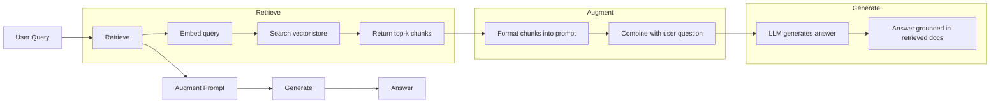
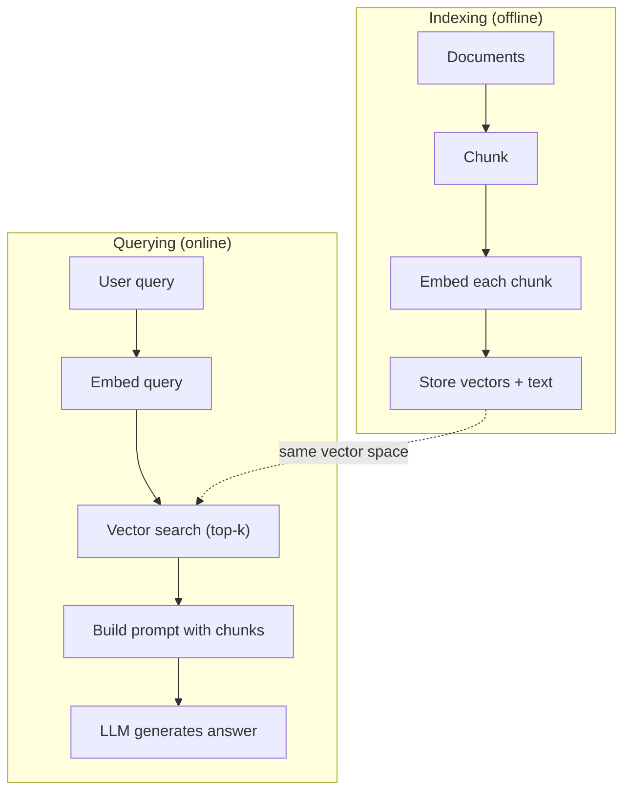

# RAG (Kendirme Geliştirilmiş Nesil) 检索增强生成

> LLM'iniz eğitim kesintiye kadar her şeyi biliyor. Şirketinizin belgeleri, kod tabanınız veya geçen haftanın toplantı notları hakkında hiçbir şey bilmiyor. RAG bunu ilgili belgeler toplayarak ve onları tescilde doldurarak çözüyor. Bu üretim AI'de en yaygın bir örnektir. Bu kursdan bir şey inşa ederseniz, bir RAG boru hattı inşa edin.

> **【中文解读】**LLM sadece bilgi eğitim son tarih önceki bilgi.RAG 检查通过相关文档并注入提示来弥补知识缺口.

> **【拓展：RAG→企业AI应用】**RAG, işletme yerleştirme AI'nin ilk seçim programıdır: Bilgi kütüphesi soruları, sözleşme incelemesi, teknik dosya yardımcısı, finansal araştırma raporları analizleri ve diğer durumlar RAG'e bağlıdır.

>  **【前置】**学本节前请先掌握:(1) Fase 11·04(Embeddings) 理解向量空间、相似度、HNSW;(2) Fase 05·23(Chunking Strategies) 理解文档切分;(3) Fase 10(LLM sıfırdan) 理解 prompt 如何影响生成──本节会用到 `chromadb`Ya da`faiss`- Evet.`langchain`Ya da`llamaindex`- Evet.

**Type:** Build | **类型:** 构建
**Languages:** Python | **语言:** Python
**Prerequisites:** Phase 10 (LLMs from Scratch), Phase 11 Lessons 01-05 | **前置知识:** Phase 10（从零理解 LLM）、Phase 11 Lesson 01-05
**Time:** ~90 minutes | **时间:** ~90 分钟
**Related:**5 · 23 aşaması (RAG için parçalanma stratejileri) altı parçalanma algoritması için ve her biri ne zaman kazanır. 5 · 22 aşaması (Embedding Models Deep Dive) yerleştiricini seçmek için. 11 · 07 aşaması (Advanced RAG) hibrid arama, yeniden sıralama ve sorgu dönüşümü için.**相关:**5 · 23(RAG 分块策略) 介绍六种分块算法及各自适用场景──5 · 22(嵌入模型深度解析) 介绍 嵌入器──11 · 07(高级RAG) 介绍混合搜索、重排和查询转换──

## Öğrenme hedefleri

- Tam bir RAG boru hattı oluşturun: belge yükleme, parçalanma, yerleştirme, vektör depolama, geri çekme ve oluşturma
  构建完整RAG管线:文档加载、分块、嵌入、向量存储、检索、生成
- Doğru indeksiyle vektör veritabanı (ChromaDB, FAISS veya Pinecone) kullanarak semantik arama uygulayın
  Uses:                                                                                                                                                                                                                                                              
- Bilgiye dayalı uygulamalarda RAG'nin neden ince ayarlamalara tercih edildiğini açıklayın (maliyet, tazelik, atribut)
  解释为什么知识接地应用更好 RAG而非微调(cost、新鲜度、归因)
- RAG kalitesini, geri alma ölçümleri (tamam, geri çağırma) ve üretim ölçümleri (davranışlılık, uygunluk) kullanarak değerlendirmek
  UZ检索指标(Düzgünlük, hatırlama)

> **【中文解读】**Bu ders hedefleri: tam bir RAG'ı gerçekleştirmek (request enhancement generation) (buğuşu, kayıt, kayıt, kayıt, veri, veri, veri, veri, veri, veri, veri, veri, veri, veri, veri, veri, veri, veri, veri, veri, veri, veri, veri, veri, veri, veri, veri, veri, veri, veri, veri, veri, veri, veri, veri, veri, veri, veri, veri, veri, veri, veri, veri, veri, veri, veri, veri, veri, veri, veri, veri, veri, veri, veri, veri, veri, veri, veri, veri, veri, veri, veri, veri, veri, veri, veri, veri, veri, veri, veri, veri, veri, veri, veri, veri, veri, veri, veri, veri, veri, veri, veri, veri, veri, veri, veri, veri, veri, veri, veri, veri, veri, veri, veri, veri, veri, veri, veri, veri, veri, veri, veri, veri, veri, veri, veri, veri, veri, veri, veri, veri, veri, veri, veri, veri, veri, veri, veri, veri, veri, veri, veri, veri, veri, veri, veri, veri, veri, veri, veri, veri, veri, veri, veri, veri, veri, veri, veri, veri, veri, veri, veri, veri, veri, veri, veri, veri, veri, veri, veri, veri, veri, veri, veri, veri, veri, veri, veri, veri, veri, veri, veri, veri, veri, veri, veri, veri, veri, veri, veri, veri, veri, veri, veri, veri, veri, veri, veri, veri, veri, veri, veri, veri, veri, veri, veri, veri, veri, veri, veri, veri, veri, veri, veri, veri, veri, veri, veri, veri, veri, veri, veri, veri, veri, veri, veri, veri, veri, veri, veri, veri, veri, eri, eri, eri, eri, eri, eri, eri, eri, eri, eri, eri, eri, eri, eri, eri, eri, eri, eri, eri, eri, eri, eri, eri, eri, eri, eri, eri, eri, eri, eri, e,


## Sorunlar. Sorunlar.

Bir müşteriniz "Enterprise planları için geri ödeme politikası nedir?" diye sorar. LLM tipik SaaS geri ödeme politikası hakkında genel bir cevap verir. 200 sayfalık bir iç wiki'de gömülü olan gerçek politika, kurumsal müşterilerin pro-sınıflı geri ödeme ile 60 günlük bir pencere aldığını söyler. LLM bu belgeyi hiç görmedi.

> Şirket için bir sohbet makinesi oluşturduğunuzu. Müşteri sorusu: "Enterprise Edition'ın geri ödeme politikası nedir?" LLM tipik SaaS geri ödeme politikası hakkında genel bir cevap verdi. Gerçek politika 200 sayfalık iç wiki'de bulunur.

Düzgün ayarlama bir çözümdür. LLM'yi alın, iç belgeleri üzerinde eğitiniz ve güncellenmiş modeli uygulayın. Bu çalışır ama ciddi sorunlara neden olur. Düzgün ayarlama binlerce dolarlık hesaplama maliyetindedir. Bir belge değişirken model eskisine dönüşür. Modelin hangi kaynağı olduğunu bilmenin bir yolu yoktur. Ve şirket gelecek ay başka bir ürün hattı satın alırsa, tekrar düzeltmelisiniz.

> 微调 bir çözümdür. Ancak微调 binlerce dolarlık hesaplama maliyetine ihtiyaç duyar.

RAG diğer çözümdür. Modelle dokunmadan bırakın. Bir soru geldiğinde, belge depolarında ilgili pasajlar aramak, soru öncesi sorguya yapıştırmak ve örnekin bu pasajları bağlam olarak kullanarak cevap vermesine izin verin. Belge depoları dakikalar içinde güncelleyebilir. Tam olarak hangi belgeleri bulduğumu görebilirsiniz. Model asla değişmez. Bu nedenle RAG üretimdeki baskın modeldir: daha ucuz, daha taze, daha denetlenebilir ve herhangi bir LLM ile çalışır.

> RAG başka bir çözümdür. Bu nedenle RAG üretimdeki ana akım modudur: daha ucuz, yeni, daha denetleyici, herhangi bir LLM için uygulanabilir.

>  **【类比】**RAG 像开卷考试:学生(LLM) tüm dersleri sırtından aşağı indirmek zorunda değil, yerine bir tane tane tane tane tane tane tane tane tane tane tane tane tane tane tane tane tane tane tane tane tane tane tane tane tane tane tane tane tane tane tane tane tane tane tane tane tane tane tane tane tane tane tane tane tane tane tane tane tane tane tane tane tane tane tane tane tane tane tane tane tane tane tane tane tane tane tane tane tane tane tane tane tane tane tane tane tane tane tane tane tane tane tane tane tane tane tane tane tane tane tane tane tane tane tane tane tane tane tane tane tane tane tane tane tane tane tane tane tane tane tane tane tane tane tane tane tane tane tane tane tane tane tane tane tane tane tane tane tane tane tane tane tane tane tane tane tane tane tane tane tane tane tane tane tane tane tane tane tane tane tane tane tane tane tane tane tane tane tane tane tane tane tane tane tane tane tane tane tane tane tane tane tane tane tane tane tane tane tane tane tane tane tane tane tane tane tane tane tane tane tane tane tane tane tane tane tane tane tane tane tane tane tane tane tane tane tane tane tane tane tane tane tane tane tane tane tane tane tane tane tane tane tane tane tane tane tane tane tane tane tane tane tane tane tane tane tane tane tane tane tane tane tane tane tane tane tane tane tane tane tane tane tane tane tane tane tane tane tane tane tane tane tane tane tane tane tane tane tane tane tane tane tane tane tane tane tane tane tane tane tane tane tane tane tane tane tane tane tane tane tane tane tane tane tane tane tane tane tane tane tane tane tane tane tane tane tane tane tane tane tane tane tane tane tane tane tane tane tane tane tane tane tane tane tane tane tane tane tane tane tane tane tane tane tane tane tane tane tane tane tane tane tane tane tane tane tane tane tane tane tane tane tane tane tane tane tane tane tane tane tane tane tane tane tane tane tane tane tane tane tane tane tane tane tane tane tane tane tane tane tane tane tane tane tane tane tane tane tane tane tane tane tane tane tane tane tane tane tane tane tane tane tane tane tane tane tane tane tane tane tane tane tane tane tane tane tane tane tane tane tane tane tane tane tane tane tane tane tane tane tane tane tane tane tane tane tane tane tane tane tane tane tane tane tane tane tane tane tane tane tane tane tane tane tane tane tane tane tane tane tane tane tane tane tane tane tane tane tane tane tane tane tane tane tane tane tane tane tane tane tane tane

## Konsepten bir şey.

> **【中文解读】**RAG(Kendirme-Kahşedici Nesil, Kaldırma Geliştirme Yüklenmesi) dış bilgi defterini LLM ile birleştirir: kullanıcı soruları, vektör veritabanı incelemeyle ilgili dosyalardan, inceleme sonuçlarını enjekte etmeleri için hızlı bir şekilde LLM'ye doğru.

> **【拓展：RAG 的生产实践】**典型RAG管线:文档切分(chunking) to嵌入生成到向量存储(Pinecone/Weaviate/Chroma) to相似度检索到重排序(renking) to注入 prompt。LlamaIndex 和 LangChain en popüler RAG 框架。Meta araştırması RAG'ın bilgi yoğunlu tip görevlerde doğru oranının %30-50 oranında artış gösterdiğini göstermektedir。


### RAG Şablonu

Tüm bu örneği dört adımda yerleştiriyoruz:

> Tüm modü dört adım:



Sorgu -> Al -> Büyütme sorgulaması -> Yükle. Her RAG sistemi bu örneği izler. Üretim RAG sistemleri arasındaki farklar her adımın ayrıntılarında bulunur: nasıl parçalayırsınız, nasıl yerleştirirsiniz, nasıl arıyorsunuz ve nasıl bir sorgu oluşturursunuz.

> 查询 -> 检索 -> 增强提示 -> 生成──每个RAG 系统都遵循这个模式──生产RAG 系统的差异在每个步骤的细节:如何分块──如何嵌入──如何搜索──如何构建提示──

> 🤔 **【困惑】**S: Neden tüm dosyayı hemen içeriye sokmuyorsun? Claude'un şu anda 200 bin dolarlık bir üst-üst-üst penceresi var, onu da indir.**精度下降**研究显示(如 Lost in the Middle, Liu et al. 2023),LLM 在长上下文中召回中间内容的能力显著下降,32K'den fazla 后准确率掉20%+;(2) **成本爆炸**200K token 输入约 $3/查询，而 RAG 检索 top-5 块只占 2K tokens（$0.03);(3) **响应慢**长 prompt 推理延迟数倍于短 prompt。RAG 用精准检索换全量加载。

### RAG Neden İyi Düzenlemeyi Yararlı Kaldı

| Concern | Fine-tuning | RAG |
|---------|------------|-----|
| Cost / 成本 | $1,000-$100,000+ per training run / 每训练 1K-100K+ 美元 | $0.01-$0.10 per query (embedding + LLM) / 每查询 0.01-0.10 美元 |
| Freshness / 新鲜度 | Stale until retrained / 重训前都过时 | Updated in minutes by re-indexing docs / 重新索引文档即可在几分钟内更新 |
| Auditability / 可审计性 | Cannot trace answer to source / 无法追溯答案来源 | Can show exact retrieved passages / 可显示精确检索段落 |
| Hallucination / 幻觉 | Still hallucinates freely / 仍自由幻觉 | Grounded in retrieved documents / 基于检索文档接地 |
| Data privacy / 数据隐私 | Training data baked into weights / 训练数据固化在权重中 | Documents stay in your vector store / 文档留在你的向量存储中 |

RAG, modelin bağlamını geçici olarak değiştirir. Çoğu uygulama için, geçici bağlam istediğiniz şeydir.

> 微调永久改变模型权重──RAG 临时改变模型上下文── çoğu uygulama için,临时上下文就是你要的──

Düzgün ayarlama kazanırken, modelin tek başına uyarma yoluyla elde edilemeyecek belirli bir stil, ton veya mantık kalıbını benimsemesine ihtiyaç duyduğunda.

> 微调胜出的唯一情况: Eğer modellerin belirli bir biçim, ses veya düşünce biçiminde olması gerekiyorsa, bu sadece önerilerle elde edilemez.

> ️ **【易错点】**RAG 落地 3 个常见坑: ((1) **切分粒度错误**块太大(> 1024 token)嵌入被稀释召回不到,块太小(< 64 token)丢失上下文;起点:256-512 token + 50 重叠。(2) **没做 query 改写** kullanıcı sorusu "bu nasıl kullanılır?" 指代不明,向量库找不到;修复:先用LLM 把问题改写成包含上下文的完整查询──(3) **只看召回率不看准确率**top-10 召回90% 但只有3 条相关,模型被噪音干扰幻觉;加跨编码重排到前3 高质量块──

### Modeller yerleştirmek

Bir yerleştirme modeli metni yoğun bir vektöre dönüştürür. Benzer metinler bu yüksek boyutlu alanda birbirine yakın olan vektörler üretir. "Hadişatimi nasıl yeniden ayarlarım?" ve "Hadişatimi değiştirmem gerekiyor" neredeyse aynı vektörler üretir.

> 嵌入型文本将文本转换为密向量──类似文本在这个高维空间中产生距离接近的向量──"密码怎么重置?"和"我需要修改密码"尽管共享单词不多,但产生几乎相同的向量──"猫坐在子上"产生截然不同的向量──

Genel yerleştirme modelleri (2026 dizisi  tam analiz için 5 · 22 aşamasını görün):

> 常见嵌入模型(2026年阵容完整分析见 5 · 22 aşaması):

| Model | Dimensions | Provider | Notes |
|-------|-----------|----------|-------|
| text-embedding-3-small | 1536 (Matryoshka) | OpenAI | Best price/performance for most use cases / 大多数场景最佳性价比 |
| text-embedding-3-large | 3072 (Matryoshka) | OpenAI | Higher accuracy, truncatable to 256/512/1024 / 更高精度，可截断到 256/512/1024 |
| Gemini Embedding 2 | 3072 (Matryoshka) | Google | Top MTEB retrieval; 8K context / 顶级 MTEB 检索；8K 上下文 |
| voyage-4 | 1024/2048 (Matryoshka) | Voyage AI | Domain variants (code, finance, law) / 领域变体（代码、金融、法律）|
| Cohere embed-v4 | 1024 (Matryoshka) | Cohere | Strong multilingual, 128K context / 强多语言，128K 上下文 |
| BGE-M3 | 1024 (dense + sparse + ColBERT) | BAAI (open-weight) | Three views from one model / 一个模型三种视图 |
| Qwen3-Embedding | 4096 (Matryoshka) | Alibaba (open-weight) | Top open-weight retrieval score / 顶级开源权重检索分数 |
| all-MiniLM-L6-v2 | 384 | Open-weight (Sentence Transformers) | Prototyping baseline / 原型基线 |

Bu ders için, TF-IDF kullanarak kendi basit gömülümüzi oluşturduk. TF-IDF üretim sistemlerinin kullandığı şey değil, kavramı somutlaştırdığı için: metin girer, vektör çıkar, benzer metinler benzer vektörler üretir.

> Bu derste TF-IDF'yi kullanarak kendi basit yerleşimlerini oluşturduk. TF-IDF üretim sisteminde kullanıldığı için değil, kavramı konkretleştirdiği için: metin içeri, metin dışarı, benzer metin benzer metin oluşturduğu için.

### vektör benzerliği

İki vektör verildiğinde benzerliği nasıl ölçersiniz?

> 给定两个向量,如何衡量相似度?三种选择:

**Cosine similarity**Bu, iki vektör arasındaki açının kozinüsünü gösterir. -1 (karşıt) ile 1 (tıpkı aynı) arasında değişir. Büyüklüğü görmezden gelir, sadece yönü önemsiyor.

> **余弦相似度**RAB'nin birer seçeneği vardır.

```
cosine_sim(a, b) = dot(a, b) / (||a|| * ||b||)
```

**Dot product**Büyük vektörler daha yüksek puanlar elde eder. Büyüklük bilgi taşıdığı zaman yararlıdır (uzak belgeler daha önemlidir).

> **点积**Bu nedenle, bu bilgiyi kullanmak için daha fazla bilgi almak için daha fazla bilgi almak gerekir.

```
dot(a, b) = sum(a_i * b_i)
```

**L2 (Euclidean) distance**Vectör alanında düz çizgi mesafe. Daha küçük mesafe = daha benzer. Büyüklük farklarına duyarlı.

> **L2（欧氏）距离**:                                                                                                                                                                                                                                                               

```
L2(a, b) = sqrt(sum((a_i - b_i)^2))
```

Kosin benzerliği standarttır. Farklı uzunluklı belgeler ile zarifçe başa çıkar çünkü büyüklüğüyle normalleşir. Biri "vektor arayışı" dediğinde neredeyse her zaman kozine benzerliği kastediyorlar.

> 余弦相似度は標準です. 余弦相似度は標準です. 余弦相似度 olarak adlandırılan 余弦相似度, 余弦相似度 olarak adlandırılır.

### Çürükleme Strategiları

Belgeler tek vektör olarak yerleştirilmek için çok uzun. 50 sayfalık bir PDF, onlarca konu içeren korkunç bir yerleştirme üretebilir. Bunun yerine belgeleri parçalara ayırıp her parça ayrı yerleştirirsiniz.

> 文档太长,不能作为单向量嵌入──50页 PDF 可能产生糟糕的嵌入,因为它包含几十个主题──相反,你将文档分分成块,分别嵌入每块──

**Fixed-size chunking**N tokens'i bölün. Basit ve tahmin edilebilir. 50 tokens üst üste olan 512 tokens parçası 1 tokens 0-511, 2 tokens 462-973, vb.

> **固定大小分块**: Her N token 拆分一次──简单可预测──512 token 块加50 token 重叠意味着块 1 is token 0-511,块 2 is token 462-973, depending on this type of recommendation──重叠 ensure you won't be in the boundary of unhappy运 分分句──

**Semantic chunking**Bu kısımlar, her kısım, tutarlı bir anlam birimidir. Uygulama daha karmaşık ama daha iyi bir geri dönüşüm sağlar.

> **语义分块**:在自然界分拆──段落、章节或Markdown 标题──每块是一个连贯的意义单元──实现更复杂,但产生更好的检索──

**Recursive chunking**Bir bölüm hala çok büyükse paragraf sınırlarında bölün. Bir paragraf hala çok büyükse cümle sınırlarında bölün. Bu LangChain RecursiveCharacterTextSplitter yaklaşımı ve pratikte iyi çalışır.

> **递归分块**İlk olarak, bu kısımların bir kısmı olarak, bir kısmı olarak, bir kısmı olarak, bir kısmı olarak, bir kısmı olarak, bir kısmı olarak, bir kısmı olarak, bir kısmı olarak, bir kısmı olarak, bir kısmı olarak, bir kısmı olarak, bir kısmı olarak, bir kısmı olarak, bir kısmı olarak, bir kısmı olarak, bir kısmı olarak, bir kısmı olarak, bir kısmı olarak, bir kısmı olarak, bir kısmı olarak, bir kısmı olarak, bir kısmı olarak, bir kısmı olarak, bir kısmı olarak, bir kısmı olarak, bir kısmı olarak, bir kısmı olarak, bir kısmı olarak, bir kısmı olarak, bir kısmı olarak, bir kısmı olarak, bir kısmı olarak, bir kısmı olarak, bir kısmı olarak, bir kısmı olarak, bir kısmı olarak, bir kısmı olarak, bir kısmı olarak, bir kısmı olarak, bir kısmı olarak, bir kısmı olarak, bir kısmı olarak, bir kısmı olarak, bir kısmı olarak, bir kısmı olarak, bir diğer bir diğer bir kısmıyla, bir kısmıyla, bir kısmıyla, bir kısmıyla, bir kısmıyla, bir kısmıyla, bir kısmıyla, bir kısmıyla, bir kısmıyla, bir kısmıyla, bir kısmıyla, bir kısmıyla, bir kısmıyla, bir kısmıyla, bir kısmıyla, bir kısmıyla, bir kısmıyla, bir kısmına, bir kısmına, bir kısmına, bir kısmına, bir kısmına, bir kısmına, bir kısmına, bir kısmına, bir kısmına, bir kısmına, bir kısmına, bir kısmına, bir kısmına, bir kısmına, bir olarak, bir olarak, bir olarak, bir olarak, bir olarak, bir olarak, bir olarak, bir olarak, bir olarak, bir olarak, bir olarak, bir olarak, bir olarak, bir olarak, bir olarak, bir olarak, olarak, olarak, olarak, olarak, olarak, olarak, olarak, olarak, olarak, olarak, olarak, olarak, olarak, olarak, olarak, olarak, olarak, olarak, olarak, olarak, olarak, olarak, olarak, olarak, olarak, olarak, olarak, olarak, olarak, olarak, olarak, olarak, olarak, olarak, olarak, olarak, olarak, olarak, olarak, olarak, olarak, olarak, olarak, olarak, olarak, olarak, olarak, olarak, olarak, olarak, olarak, olarak, olarak, olarak, olarak, olarak, olarak, olarak, olarak, olarak, olarak, olarak, olarak, olarak, olarak, olarak, olarak, olarak, olarak, olarak, kale kale kale kale kale kale kale

İnsanların düşündüklerinden daha fazla önemli olan parça boyutu:

> İnsanların düşündüklerinden daha önemli olan:

- Çok küçük (64-128 token): her parça bağlamsız. "Geçen çeyrekte %15 arttı" "bu" neyi kastettiğini bilmeden hiçbir şey ifade etmez.
  太小(64-128 token): "上季度增长 15%"在不知道"它"指代什么时无意义──
- Çok büyük (2048+ token): her parça birden fazla konuyu kapsar ve ilgililiği azaltır. Gelir verilerini aradığınızda, gelir hakkında %10 ve işçi sayısı hakkında %90 olan bir parça elde edersiniz.
  太大(2048+ token): Her blok çok sayıda konuyu kapsar, nadir释相关性── arama gelir verileri elde edilirken %10  gelir hakkında %90  insan başı hakkında %¬¬¬¬¬¬¬¬¬¬¬¬¬¬¬¬¬¬¬¬¬¬¬¬¬¬¬¬¬¬¬¬¬¬¬¬¬¬¬¬¬¬¬¬¬¬¬¬¬¬¬¬¬¬¬¬¬¬¬¬¬¬¬¬¬¬¬¬¬¬¬¬¬¬¬¬¬¬¬¬¬¬¬¬¬¬¬¬¬¬¬¬¬¬¬¬¬¬¬¬¬¬¬¬¬¬¬¬¬¬¬¬¬¬¬¬¬¬¬¬¬¬¬¬¬¬¬¬¬¬¬¬¬¬¬¬¬¬¬¬¬¬¬¬¬¬¬¬¬¬¬¬¬¬¬¬¬¬¬¬¬¬¬¬¬¬¬¬¬¬¬¬¬¬¬¬¬¬¬¬¬¬¬¬¬¬¬¬¬¬¬¬¬¬¬¬¬¬¬¬¬¬¬¬¬¬¬¬¬¬¬¬¬¬¬¬¬¬¬¬¬¬¬¬¬¬¬¬¬¬¬¬¬¬¬¬¬¬¬¬¬¬¬¬¬¬¬¬¬¬¬¬¬¬¬¬¬¬¬¬¬¬¬¬¬¬¬¬¬¬¬¬¬¬¬¬¬¬¬¬¬¬¬¬¬¬¬¬¬¬¬¬¬¬¬¬¬¬¬¬¬¬¬¬¬¬¬¬¬¬¬¬¬¬¬¬¬¬¬¬¬¬¬¬¬¬¬¬¬¬¬¬¬¬¬¬¬¬¬¬¬¬¬¬¬¬¬¬¬¬¬¬¬¬¬¬¬¬¬¬¬¬¬¬¬¬¬¬¬¬¬¬¬¬¬¬¬¬¬¬¬¬¬¬¬¬¬¬¬¬¬¬¬¬¬¬¬¬¬¬¬¬¬¬¬¬¬¬¬¬¬¬¬¬¬¬¬¬¬¬¬¬¬¬¬¬¬¬¬¬¬¬¬¬¬¬¬¬¬¬¬¬¬¬¬¬¬¬¬¬¬¬¬¬¬¬¬¬¬¬¬¬¬¬¬¬
- Tatlı nokta (256-512 token): özgüvenli olmak için yeterli bağlam, ilgili olmak için yeterince odaklanmış.
  En iyi nokta: 256-512 token: sufficiently self-contained on below, sufficiently focused on related.

Çoğu üretim RAG sistemi, 50 token üst üste olan 256-512 token parçacığını kullanır.

> Büyük çoğunluk RAG üretimi sistemleri 256-512 token blok artı 50 token ağırlıklı olarak yapılır.

### Vektör Veritabanları

Bir kere yerleştirilmiş olan varsa, depolamak ve arama yapmak için bir yere ihtiyacınız var.

> Bir kere yerleştirildiğinde, bir depolama ve arama yapman gerekir.

| Database | Type | Best for |
|----------|------|----------|
| FAISS | Library (in-process) / 库（进程内）| Prototyping, small to medium datasets / 原型、中小数据集 |
| Chroma | Lightweight DB / 轻量 DB | Local development, small deployments / 本地开发、小型部署 |
| Pinecone | Managed service / 托管服务 | Production without ops overhead / 无运维开销的生产 |
| Weaviate | Open source DB / 开源 DB | Self-hosted production / 自托管生产 |
| pgvector | Postgres extension / Postgres 扩展 | Already using Postgres / 已在用 Postgres |
| Qdrant | Open source DB / 开源 DB | High-performance self-hosted / 高性能自托管 |

Bu ders için, basit bir hafıza vektör depo oluşturduk. Bir listede vektörleri saklıyor ve kaba kuvvetli kozine benzerlik arayışı yapar. Bu düz bir indeksle FAISS'e eşittir. yavaşlamadan önce belki de 100.000 vektöre kadar ölçebilir. Üretim sistemleri, milisaniyede milyonlarca vektörü aramak için HNSW gibi en yakın komşu (ANN) algoritmalarını kullanır.

> Bu derste basit bir内存向量存储 oluşturduk. Vevtolar listede bulunur ve şiddetli bir 弦 benzerliği arama yapar. Bu, düz bir indeksle FAISS'e eşittir.

### Tam Boru hattı



İndeksleme aşaması her belge başına bir kez (veya belge güncellediğinde) çalışır. Sorgu aşaması her kullanıcı istekinde çalışır. İndeksleme üretiminde saatler içinde milyonlarca belge işleyebilir. Sorgulama bir saniyede cevap vermelidir.

> 索引阶段每个文档运行一次 (或文档更新时) ◊查询阶段每个用户请求运行一次――生产中,索引可能数小时处理百万文档――查询必须在1秒内响应――

### Gerçek Sayılar

Çoğu üretim RAG sistemi bu parametreleri kullanır:

> Çoğu RAG sistemini bu parametrelerle üretir:

- **k = 5 to 10**Arama başına alınan parçalar
  Her sorguda 5 - 10 blok veriliyor .
- **Chunk size = 256 to 512 tokens**50 token üst üste
  块大小 256-512 token ekle 50 token ağır yükleme
- **Context budget**: Her sorguda 2500-5000 tane çekirdek alınan içeriği
  上下文 Бюджеte: Her sorgu 2500-5000 token 检索内容
- **Total prompt**: ~ 8.000-16.000 token (sistem istekleri + alınan parçalar + konuşma geçmişi + kullanıcı sorusu)
  总提示: yaklaşık 8.000-16.000 token(系统提示 + 检索块 + 对话历史 + 用户查询)
- **Embedding dimension**: 384-3072 modelden farklı olarak
  嵌入维度:384-3072 模型den bağlı
- **Indexing throughput**: API yerleştirmeleri ile saniyede 100-1,000 belge
  索引吞吐量: API kullan 嵌入每秒 100-1,000 文档
- **Query latency**: 50-200 ms geri almak için, 500-3000 ms üretmek için
  查询延迟:检索 50-200ms, üretmek 500-3000ms

## Yapın.
```figure
rag-chunking
```

## Yapın

### Adım 1: Belge Çıkartılması

```python
def chunk_text(text, chunk_size=200, overlap=50):
    words = text.split()
    chunks = []
    start = 0
    while start < len(words):
        end = start + chunk_size
        chunk = " ".join(words[start:end])
        chunks.append(chunk)
        start += chunk_size - overlap
    return chunks
```

### Adım 2: TF-IDF yerleştirmeleri

Basit bir gömleyici işlevi oluştururuz. TF-IDF (Term Frequency-Inverse Document Frequency) bir sinirleme gömleyici değil, ancak metni kelime önemini yakalayan bir şekilde vektörlere dönüştürür. Bir belgedeki sık kelimeler daha yüksek TF elde eder. Korpus boyunca nadir kelimeler daha yüksek IDF elde eder. Ürün önemli, ayırt edici kelimelerin yüksek değerleri olan bir vektör verir.

> Biz basit bir yerleştirme işlevi oluşturduk. TF-IDF (French word-reverse document frequency) sinirsel yerleştirme değil, ama bir kelime önemini yakalama şekliyle metni vektöre dönüştürür.

> 🤔 **【困惑】**S: Öğrenim neden gerçek bir sinir gömülmesi değil TF-IDF kullanıyor?**零依赖**本节纯Python 标准库教学,不要求你注册 API或下模型;(2) **可读**TF-IDF'nin matematik basitliği, nefren içinde bir kara kutu olduğunu anlayabilmesi için, kara tahtada yazılabilir.**教学聚焦**本节核心是 RAG 流程(chunk→embed→retrieve→prompt→generate),嵌入器换掉流程不变──**生产环境务必换神经嵌入**TF-IDF anlam anlamı anlamıyor, "Payment Fail" ve "扣款不成功" TF-IDF altında tamamen uyumlu değil, ama sinir içine yerleştirilmiş olarak anlamları aynıdır.

```python
import math
from collections import Counter

def build_vocabulary(documents):
    vocab = set()
    for doc in documents:
        vocab.update(doc.lower().split())
    return sorted(vocab)

def compute_tf(text, vocab):
    words = text.lower().split()
    count = Counter(words)
    total = len(words)
    return [count.get(word, 0) / total for word in vocab]

def compute_idf(documents, vocab):
    n = len(documents)
    idf = []
    for word in vocab:
        doc_count = sum(1 for doc in documents if word in doc.lower().split())
        idf.append(math.log((n + 1) / (doc_count + 1)) + 1)
    return idf

def tfidf_embed(text, vocab, idf):
    tf = compute_tf(text, vocab)
    return [t * i for t, i in zip(tf, idf)]
```

### Adım 3: Kosine benzerliği aramak

```python
def cosine_similarity(a, b):
    dot = sum(x * y for x, y in zip(a, b))
    norm_a = math.sqrt(sum(x * x for x in a))
    norm_b = math.sqrt(sum(x * x for x in b))
    if norm_a == 0 or norm_b == 0:
        return 0.0
    return dot / (norm_a * norm_b)

def search(query_embedding, stored_embeddings, top_k=5):
    scores = []
    for i, emb in enumerate(stored_embeddings):
        sim = cosine_similarity(query_embedding, emb)
        scores.append((i, sim))
    scores.sort(key=lambda x: x[1], reverse=True)
    return scores[:top_k]
```

### Dördüncü Adım: Hızlı İnşaat

RAG'de "genişleştirilen" olayı burada gerçekleşir. Alınan parçaları alın, onları bir istekle biçimlendirin ve verilen bağlamda bulunarak LLM'den cevap vermesini isteyin.

> Bu RAG'de "增强" gerçekleşen yer.

> ️ **【易错点】**Çabuk 模板的 3 个坑:(1) **没说"基于上下文回答"**模型会调用自己的参数知识回答(产生幻觉),把 "Yalnızca aşağıdaki bağlamda temellenen cevap" 加到 prompt 最前;(2) **没给"不知道就说不知道"的退路**模型宁可盲编也不承认无能为力,必须显式写 "Kontext cevap içermezse, 'Yeterince bilgi yok' deyin";(3) **没要求引用来源** cevap geriye dönemez, denetim başarısız;修复:要求模型在答案末尾加 `[Source N]`标记,让用户能点开看原文.

```python
def build_rag_prompt(query, retrieved_chunks):
    context = "\n\n---\n\n".join(
        f"[Source {i+1}]\n{chunk}"
        for i, chunk in enumerate(retrieved_chunks)
    )
    return f"""Answer the question based ONLY on the following context.
If the context doesn't contain enough information, say "I don't have enough information to answer that."

Context:
{context}

Question: {query}

Answer:"""
```

### Adım 5: Tam RAG boru hattı

```python
class RAGPipeline:
    def __init__(self):
        self.chunks = []
        self.embeddings = []
        self.vocab = []
        self.idf = []

    def index(self, documents):
        all_chunks = []
        for doc in documents:
            all_chunks.extend(chunk_text(doc))
        self.chunks = all_chunks
        self.vocab = build_vocabulary(all_chunks)
        self.idf = compute_idf(all_chunks, self.vocab)
        self.embeddings = [
            tfidf_embed(chunk, self.vocab, self.idf)
            for chunk in all_chunks
        ]

    def query(self, question, top_k=5):
        query_emb = tfidf_embed(question, self.vocab, self.idf)
        results = search(query_emb, self.embeddings, top_k)
        retrieved = [(self.chunks[i], score) for i, score in results]
        prompt = build_rag_prompt(
            question, [chunk for chunk, _ in retrieved]
        )
        return prompt, retrieved
```

### Adım 6: Nesil (sümüle)

Bu ders için, en uygun cümleyi alınan bağlamdan çıkararak jenerasyonu simüle ediyoruz.

> Üretim içinde bu yerlerde LLM API'si kullanılır.

```python
def simple_generate(prompt, retrieved_chunks):
    query_words = set(prompt.lower().split("question:")[-1].split())
    best_sentence = ""
    best_score = 0
    for chunk in retrieved_chunks:
        for sentence in chunk.split("."):
            sentence = sentence.strip()
            if not sentence:
                continue
            words = set(sentence.lower().split())
            overlap = len(query_words & words)
            if overlap > best_score:
                best_score = overlap
                best_sentence = sentence
    return best_sentence if best_sentence else "I don't have enough information."
```

## Çerçeveyi kullanın.

Gerçek bir gömleyici model ve LLM ile kod neredeyse değişmez:

> Gerçek bir modelle ve LLM ile kod neredeyse değişmez:

```python
from openai import OpenAI

client = OpenAI()

def embed(text):
    response = client.embeddings.create(
        model="text-embedding-3-small",
        input=text
    )
    return response.data[0].embedding

def generate(prompt):
    response = client.chat.completions.create(
        model="gpt-4o-mini",
        messages=[{"role": "user", "content": prompt}],
        temperature=0
    )
    return response.choices[0].message.content
```

Veya Anthropic ile:

> Ya da Anthropic:

```python
import anthropic

client = anthropic.Anthropic()

def generate(prompt):
    response = client.messages.create(
        model="claude-sonnet-5",
        max_tokens=1024,
        messages=[{"role": "user", "content": prompt}]
    )
    return response.content[0].text
```

Bu boru hattı aynı. Eklenti işlevini değiştir. Yürütme işlevini değiştir. Alım mantığı, parçalanma, hızlı inşaat - her şey hangi model kullanırsanız kullanın aynı.

> 管线相同──替换嵌入函数──替换生成函数──检索逻辑、分块、提示构造无论用哪些模型都完全相同──

Ölçülü vektör depolama için, kaba güç arama işlemini uygun vektör veritabanı ile değiştirin:

>  Büyük ölçekli kütle depolama için, uygun kütle veritabanı ile şiddetli aramalar yerine:

```python
import chromadb

client = chromadb.Client()
collection = client.create_collection("my_docs")

collection.add(
    documents=chunks,
    ids=[f"chunk_{i}" for i in range(len(chunks))]
)

results = collection.query(
    query_texts=["What is the refund policy?"],
    n_results=5
)
```

Chroma, yerleşimleri içe ele alır (devayla tüm MiniLM-L6-v2 kullanır) ve vektörleri yerel bir veritabanında saklar.

> Chroma 内部处理嵌入式 (默认使用全MiniLM-L6-v2)并将向量存在本地数据库──相同模式,不同管道──

## İndirin . Ürünler .

Bu ders şunları ortaya çıkarır:
- `outputs/prompt-rag-architect.md`-- RAG sistemlerinin özel kullanım durumları için tasarlanması için bir çağrı
  Özel kullanım için RAG 系统の提示
- `outputs/skill-rag-pipeline.md`- ...Agentlere RAG boru hattlarını nasıl inşa edip düzeltmeleri öğretecek bir beceri.
  Öğretmen  Nasıl yapılandırılır ve düzenlenir  RAG 管线                                                                                                                                                                                                                                                                                                                                                                                                                                                                                                            

## Egzersizler.

1. TF-IDF yerleştirmelerini basit bir sözcük çantası yaklaşımı ile değiştirin (biner: kelime mevcutsa 1, yoksa 0). Örnek belgelerdeki çekim kalitesini karşılaştırın. TF-IDF nadir kelimelerin ağırlığı daha yüksek olduğu için daha iyi performans göstermelidir.
   Use simple word bag method(二值:词出现为 1,否则为 0) TF-IDF 嵌入──在样本文档上比较检索质量──TF-IDF 应胜出,因为它给稀有词更高权重──

2. Parça boyutları ile deneyin: aynı belge seti üzerinde 50, 100, 200 ve 500 kelime deneyin. Her boyut için aynı 5 soruyu çalıştırın ve en üst 3'te ilgili bir parça ne kadar geri döndüğünü sayın.
   实验块大小:在同一文档集上试 50、100、200、500词──每种大小运行同样 5查询,统计前3中返回相关块的数量──查询质量峰值的最佳点──

3. Her parçaya metadata ekleyin (kaynak belgesinin adı, parçacık pozisyonu). Kaynak atributunu dahil etmek için istek şablonunu değiştirin, böylece LLM kaynaklarını belirtir.
   给每块添加元数据(源文档名、块位置)  Modify提示模板包含源归因,让LLM 引用其来源──

4. Basit bir değerlendirme uygulayın: 10 soru- yanıt çiftini vererek, her soruyu RAG borusundan geçirin ve alınan parçaların ne kadar yüzdesi cevabı içerdiğini ölçün.
   实现简单评估:给定10个问答对,将每个问题通过RAG管线运行,测量检索块中包含答案的百分比――这是检索 recall@k。

5. Konuşmayı bilen bir RAG boru hattı oluşturun: son 3 değişimin geçmişini tutun ve alınan parçaların yanında onları istekle ekleyin. Fiyatlandırma hakkında sorduğundan sonra "Enterprise hakkında ne olacak?" gibi takip soruları ile test edin.
   构建对话感知 RAG 管线:维护近 3次交换历史,与检索块一起包含在提示中──用跟进问题如"企业版呢?"(询问定价后) 测试──

## Anahtar Şartlar .

| Term | What people say | What it actually means | 中文释义 |
|------|----------------|----------------------|---------|
| RAG | "AI that reads your docs" | Retrieve relevant documents, paste them into the prompt, and generate an answer grounded in those documents | RAG：检索相关文档、粘贴进提示、基于这些文档生成接地答案 |
| Embedding | "Convert text to numbers" | A dense vector representation of text where similar meanings produce similar vectors | 嵌入：文本的稠密向量表示，相似含义产生相似向量 |
| Vector database | "Search engine for AI" | A data store optimized for storing vectors and finding the nearest neighbors by similarity | 向量数据库：为存储向量和按相似度找近邻优化的数据存储 |
| Chunking | "Split docs into pieces" | Breaking documents into smaller segments (typically 256-512 tokens) so each can be embedded and retrieved independently | 分块：将文档拆为更小段（通常 256-512 token）以便独立嵌入和检索 |
| Cosine similarity | "How similar are two vectors" | The cosine of the angle between two vectors; 1 = identical direction, 0 = orthogonal, -1 = opposite | 余弦相似度：两向量夹角余弦；1=同向，0=正交，-1=反向 |
| Top-k retrieval | "Get the k best matches" | Return the k most similar chunks to the query from the vector store | Top-k 检索：从向量存储返回与查询最相似的 k 个块 |
| Context window | "How much text the LLM can see" | The maximum number of tokens the LLM can process in a single request; retrieved chunks must fit within this | 上下文窗口：LLM 单次请求能处理的最大 token 数；检索块必须放得下 |
| Augmented generation | "Answer using given context" | Generating a response using retrieved documents as context rather than relying solely on trained knowledge | 增强生成：用检索文档作为上下文生成响应，而非仅依赖训练知识 |
| TF-IDF | "Word importance scoring" | Term Frequency times Inverse Document Frequency; weights words by how distinctive they are within a corpus | TF-IDF：词频乘逆文档频率；按词在语料库中的独特性加权 |
| Indexing | "Preparing docs for search" | The offline process of chunking, embedding, and storing documents so they can be searched at query time | 索引：分块、嵌入、存储文档的离线过程，以便查询时搜索 |

## Daha fazla okumak

- Lewis et al., "Bilgi yoğun NLP görevleri için geri kazanma-yükseltilmiş nesil" (2020) -- Facebook AI Araştırması'ndan gelen orijinal RAG makalesi geri kazanma-sonra üretme örneğini resmileştirdi
  Lewis 等, "Bilgi yoğun NLP görevleri için geri kazanma-yükseltilmiş nesil" ((2020) Facebook AI Araştırmasının orijinal RAG 论文, formalized 先检索后生成模式
- Anthropic'in RAG belgeleri (docs.anthropic.com) - parça boyutları, hızlı inşaat ve değerlendirme için pratik rehberlik
  Antropik RAG 文档块大小、提示构建和评估的实用指南
- Pinecone Öğrenme Merkezi, "RAG nedir?" -- RAG borusunun üretim düşünceleri ile ilgili net görsel açıklamalar
  Pinecone Öğrenme Merkezi RAG 管线的清晰可视化解释,含生产考量
- Ceza-BERT: Reimers & Gurevych (2019) -- tüm MiniLM gömleyici modellerinin arkasındaki makale, semantik benzerlik için iki kodlayıcıyı nasıl eğiteceğimizi gösterir
  Ceza-BERT: Reimers & Gurevych(2019) all-MiniLM 嵌入模型背后的论文, demonstrate how为语义相似度训练双编码器
- [Karpukhin et al., "Dense Passage Retrieval for Open-Domain Question Answering" (EMNLP 2020)](https://arxiv.org/abs/2004.04906)- DPR kağıdı yoğun iki kodlayıcı geri alımı kanıtladı BM25 açık alanı QA'da ve modern RAG geri alıcılar için model belirledi.
  Karpukhin 等, "DPR"(EMNLP 2020)                                                                                                                                                                                                                                                        
- [LlamaIndex High-Level Concepts](https://docs.llamaindex.ai/en/stable/getting_started/concepts.html)-- RAG boru hattları inşa ederken bilmesi gereken ana kavramlar: veri yükleyici, düğüm parçalayıcı, indeks, geri alıcı, yanıt sentezleyicileri.
  LlamaIndex Yüksek sınıf konsept RAG yapılandırma 管线需知 主要概念:数据加载器、节点解析器、索引、检索器、响应合成器──
- [LangChain RAG tutorial](https://python.langchain.com/docs/tutorials/rag/)- karşıt tadlı orkestrasyon; aynı geri alın sonra üretilen örneğin bir zincir-of-runnables görünümü.
  LangChain RAG öğretim  farklı ısı düzenleyicisi; identical precheck and post-generation mode of可运行链视图──
