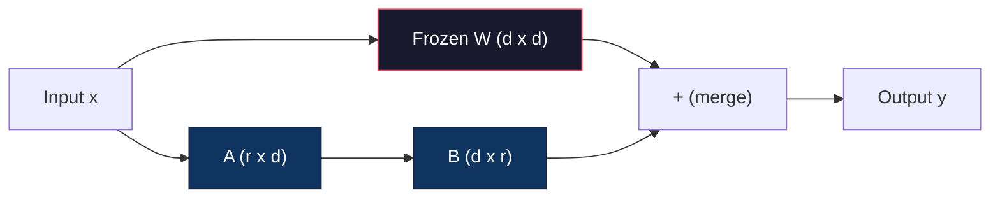
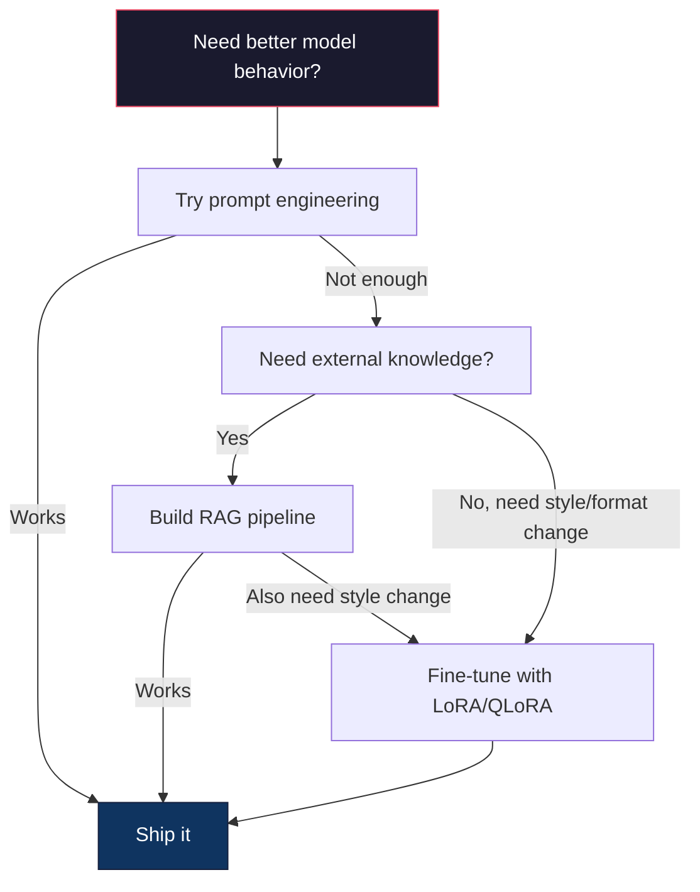

# LoRA ve QLoRA ile iyi ayarlama .

> 7B modelinin tam ince ayarlaması için 56GB VRAM gereklidir. Bunun için sizde yok. Çoğu şirketde de yok. LoRA aynı modeli 6GB'de aynı parametrelerin %1'inden azını eğiterek ince ayarlamanızı sağlar. Bu bir uzlaşma değil.

> **【中文解读】**Tüm miktarı küçük düzenlemeler için 7B model 56GB 显存储――LoRA sadece %1'e kadar bir parametreden daha az eğitim alır, 6GB 显存储即可完成微调,且质量不输全量微调―― tüm açık kaynaklı mikro调生态, bu teknoloji üzerinde kurulmuştur.

> **【拓展：LoRA微调→定制大模型】**LoRA, büyük bir işletme yapılandırma modelinin çekirdek teknolojisidir: az alanlarda veri biçimlendirmesi temel modelini kullanarak, finansal analiz, hukuk düşüncesi, kod üretimi ve diğerleri gibi uzmanlık kapasitesini kazanmak.

>  **【前置】**学本节前 Lütfen önce bil:(1) Fase 10·06(Yönlendirmeler Düzenleme SFT)  anlamak监督微调的基本流程;(2) 线性代数基础矩阵乘法、秩、SVD 分解(看 Fase 01·11 SVD);(3) PyTorch 基础`nn.Linear`- Evet.`backward()`- Evet.`optimizer.step()`4) Öğünmek yüzü`transformers`Kütüp'ün temel kullanım kuralları.`peft`和 `trl`- Evet.

**Type:** Build | **类型:** 构建
**Languages:** Python | **语言:** Python
**Prerequisites:** Phase 10, Lesson 06 (Instruction Tuning / SFT) | **前置知识:** Phase 10 · 06（指令微调/SFT）
**Time:** ~75 minutes | **时间:** ~75 分钟
**Related:**Bu ders, SFT/DPO döngüslerini sıfırdan kapsar. Bu ders onları 2026 PEFT araç paketlerine bağlar (PEFT, TRL, Unsloth, Axolotl, LLaMA-Factory).**相关:**Bu süreçte, SFT/DPO'nun 2026 yılındaki PEFT 工具链 (PEFT、TRL、Unsloth、Axolotl、LLaMA-Factory) 〜

## Öğrenme hedefleri

- LoRA'yı, önceden eğitilmiş bir modelin dikkat katmanlarına düşük sıralama adaptör matrisleri (A ve B) enjekte ederek uygulayın.
                                                                                                                                                                                                                                                                
- LoRA vs. tam ince ayarlama parametreler tasarrufu hesaplayın: d_model boyutları trenleri d^2 yerine 2*r*d parametreleri ile r sıra
  計算 LoRA vs 全量微调的参数节省:秩 r 配 d_model 维度训练 2*r*d 参数而不是 d^2
- Bir modelin QLoRA (4 bitli kuantit baz + LoRA adaptörleri) kullanarak tüketicinin GPU belleğine sığması için ince ayarlama yapın
  QLoRA(4 bit 量化基础模型 + LoRA 适配器) tüketim seviyesindeki GPU'ya göre küçük modelleştirilmiş
- LoRA ağırlıklarını yeniden dağıtım için temel modeline birleştirin ve adapterlerle ve olmadan sonuç hızı karşılaştırın
  LoRA 权重合并回基模型部署 için kullanılır,并比较有/无适配器推理速度

> **【中文解读】**Bu ders hedefleri: LoRA/QLoRA ile                                                                                                                                                                                                                                                                                                                                                                                                                                                                                                                  


## Sorunlar. Sorunlar.

Llama 3 8B'nin bir temel modeliniz var. Müşteri desteği biletlerine şirketinizin sesinde cevap vermek istiyorsunuz. SFT cevabı. Ama SFT'nin maliyet sorunu var.

> SFT'nin bir çözümü var. Ama SFT'nin maliyet sorunu var.

Tam ince ayarlama, modeldeki her parametreyi güncelleyebilir. Llama 3 8B'nin 8 milyar parametre vardır. fp16'da, her parametre 2 byte alır. Bu, ağırlıkları yüklemek için 16GB'dir. Eğitim sırasında, aynı zamanda gradientlere (16GB), Adam için optimizer durumlarına (32GB'ye kadar momentum + varians) ve etkinleştirmelerine ihtiyacınız var.

> Tüm parametreler yenileme modelindeki her parametreden. Llama 3 8B'nin 80 milyar parameteri vardır. fp16 Aşağı her parametreden 2 字节 oluşur.

A100 80GB'lik bir A100, bu kadarı bile bile bile bilebilir.$3-4/hour on cloud providers. Training for 3 epochs on 50,000 examples takes 6-10 hours. That's $Hyperparametreyi doğrulamak için 10 deney yaparsanız, herhangi bir şey kullanmadan önce 400 dolar harcadınız.

> Bir A100 80GB 勉强能装下──两张 A100 在云上每小时 $3-4。在 50,000 个样本上训练 3 个 epoch 需要 6-10 小时。每次实验 $30-40..

Daha derin bir sorun da var. Tam ince ayarlama modelin her ağırlığını değiştirir. Müşteri desteği verilerini ince ayarlarsanız, modelin genel yeteneklerini düşürürsünüz. Buna felaketli unutma deniyor. Model görevinizde daha iyi olur ve diğer her şeyde daha kötü olur.

> Daha derin bir sorun daha var. Tüm parametre değişiklikleri modeldeki her bir ağırlığı değiştirir. Eğer müşteri verilerine göre değişiklik yaparsanız, modelin genel kapasiteyi düşürebilirsiniz.

Daha az parametreyi eğiten, daha az bellek kullanan ve modelin mevcut bilgisini yok etmeyen bir yöntem gerekiyor.

> Daha az parametr kullanmak için daha az antrenman yapmanız gerekir.

>  **【类比】**Tüm küçük düzenleme biçimleri "Bütün kitap kitaplarını tekrar yaz"  her bir yazı  参数) 都改,工作量大也很容易改变原来对内容的错误 (错误)  灾难性遗忘) .LoRA 像"在教科书的页边贴贴贴贴"原文 (O) 结不动,你只在边上贴小纸条 (小纸条)  A×B矩阵) 写掉新注释──最终输出 = 原文 + 便利贴──换任务时,撕旧便利贴贴新的即可,原文保留──

## Konsepten bir şey.

> **【中文解读】**LoRA(Low-Rank Adaptation) is parameters high efficiency micro调 (PEFT) ın temel yöntemi: 结原始权重,仅训练低秩分解矩阵 (A*B), parametreyi milyarlarca milyardan milyonlara düşürecek.

> **【拓展：LoRA 的工程实践】**LoRA'nın sıralaması (ranki) genellikle 8-64 olarak belirlenir. Q/V 投影矩阵效果最好──QLoRA(4-bit 基础模型 + LoRA) 让你在单张 RTX 4090 上微调 Llama-3-8B──HuggingFace PEFT库让 LoRA 微调几行代码即可实现──LoRA'nın maliyeti tüm parametrelerin微调's 1/10,且效果接近──

> 🤔 **【困惑】**S: QLoRA 区别是什么?和 LoRA 区别? A: QLoRA = Quantized LoRA。 temel model 4 bit 量化(NF4) depolama, LoRA 适配器 bf16 训练。 böylece Llama-3-8B'nin 16GB 权重压缩量 4GB'ye kadar, LoRA'nın 训练开销(100MB'ye kadar), toplam 6GB 显存就能微调单张 RTX 4090 / 3090 即可──代价: 训练速度比纯 LoRA 慢约30%(因为边反量化边缘前进),但成本可控──


### LoRA: Düşük Ranklı Adaptasyon

Edward Hu ve Microsoft'daki meslektaşları Haziran 2021'de LoRA'yı yayınladı. Kağıtın anlayışı: ince ayarlama sırasında ağırlık güncellemeleri düşük özgü bir rütbeye sahiptir. 4096x4096 ağırlık matrisinde 16.7 milyon parametrenizi güncellemeniz gerekmez. Güncellemedeki yararlı bilgileri 16 veya 32 rütbe matrisinden elde edilebilir.

> Edward Hu ve Microsoft 同事于 2021 年 6 月发表了 LoRA──论文洞察:微调期间权重更新具有低内在排序──你不需要更新 4096x4096 权重矩阵中全部1670万参数──更新中的有用信息可被排序 16或32 的矩阵捕获──

> 🤔 **【困惑】**S: Neden düşük sıralama矩阵能捕获微调更新的信息? A: Empirik gözlemAghajanyan等(2020) aşkar ön eğitim modeli'nin ağırlığı updateΔW内在维度(内在维度) üzerinde çok düşük, genellikle birkaç yüzden birkaç bin seviyeye kadar yeni bir görev öğrenmek için yeterli olacaktır.

Bu matematik. Standart bir çizgi katman hesaplar:

> Matematik: standart linear seviye hesaplama

```
y = Wx
```

W, d_out x d_in matrisi. 4096x4096 dikkat projeksiyonu için, bu 16,777,216 parametre.

> Bu da W'nin d_out x d_in 矩阵ı için 4096x4096 dikkatleme atışına göre 16,777,216 个参数.

LoRA W'yi dondurup düşük derecede parçalanma ekler:

> LoRA 结 W 并添加低序分解:

> ️ **【易错点】**LoRA 微调的 3 个坑:(1) **秩 r 设太大**r=64 起步就太大,参数接近全量微调,省显存优势消失;起点 r=8 或 r=16,效果不够再加倍──(2) **target_modules 选错**Sadece karşı karşı.`q_proj`Ürünler ve ürünler`["q_proj", "v_proj", "k_proj", "o_proj"]`Daha fazla teşvik edilmek için MLP'yi kullanın.`gate_proj`- Ne ?`up_proj`- Ne ?`down_proj`〔(3)**学习率没调高**LoRA 参数 yeni başlangıçlı, önceden eğitime göre daha büyük bir lr gerektirir; tipik lr = 1e-4 ila 3e-4

```
y = Wx + BAx
```

Burada B (d_out x r) ve A (r x d_in) olur. r sıra d'den çok daha küçüktür -- tipik olarak 8, 16 veya 32.

> Bunlardan B ∈ (d_out x r), A ∈ (r x d_in) ∈ R R R 比 d 小得多 通常 8、16 或 32。

R=16 için 4096x4096 katmanında:
- Orijinal parametreler: 4096 x 4096 = 16.777.216
- LoRA parametreleri: (4096 x 16) + (16 x 4096) = 65,536 + 65,536 = 131,072
- Kısıtlama: 131.072 / 16.777.216 = 0.78%

>  4096x4096 katındaki r=16 için:
> - İlk elementler: 4996 x 4096 = 16 777 216
> - LoRA 参数:(4096 x 16) + (16 x 4096) = 65,536 + 65,536 = 131,072
> - 減少:131,072 / 16,777,216 = 0,78%

Parametrelerin %0,78'ünü eğitmiş ve kalitenin %95-100'ünü elde etmişsin.

> Bu yüzden, bu eğitimde %0.78'lik bir performans elde ediliyor.



A, rastgele bir Gaussian ile başlatılır. B sıfır ile başlatılır. Bu, LoRA katkı sıfırdan başlar demektir.

> A 用随机高斯初始化──B初始化为零── bu da LoRA 贡献从零开始模型从原始行为开始训练,逐渐学习适应──

### Ölçekleme Faktörü: Alfa

LoRA, düşük sıralama güncelleme çıktıyı ne kadar etkilediğini kontrol eden bir ölçekleme faktörü alfa'yı tanıttı:

> LoRA  giriş kısaltma faktörü alfa, kontrol düşük sırada yenileme için çıkış etkisi derecesi:

```
y = Wx + (alpha / r) * BAx
```

Alfa = r olduğunda, ölçeklendirme 1x. Alfa = 2r (orta standart) olduğunda, ölçeklendirme 2x. Bu hiperparametre LoRA yolunun öğrenme hızını temel öğrenme hızından bağımsız olarak kontrol eder.

> Bu süper parametre temel öğrenme oranından bağımsızdır.

Pratik rehberlik:
- alpha = 2 * rank ortak bir topluluk konvensiyonudur (genel makale kullanılmış alpha = rank çoğu deneyde)
  alfa = 2 * sıralama is常见社区约定(原论文 çoğu deneylen alfa = sıralama)
- alfa = sıra 1x ölçeklendirme verir, muhafazakâr ama istikrarlı
  Alfa = sıra 给 1x 缩放,保守但稳定
- Yüksek alfa, adım başına daha büyük güncellemeler anlamına gelir, bu da yakınlaşmayı hızlandırabilir veya istikrarsızlığa neden olabilir
  高 alpha                                                                                                                                                                                                                                                             

### LoRA Nereye Uygulabilir

Bir transformatörün birçok doğrusal katmanı vardır.

> Transformer çok sayıda liner seviyesine sahip.

| Target Layers | Trainable Params (7B) | Quality |
|--------------|----------------------|---------|
| q_proj only / 仅 q_proj | 4.7M | Good / 好 |
| q_proj + v_proj | 9.4M | Better / 更好 |
| q_proj + k_proj + v_proj + o_proj | 18.9M | Best for attention / 注意力最佳 |
| All linear (attention + MLP) / 所有线性层 | 37.7M | Marginal gain, 2x params / 边际收益、2 倍参数 |

Çoğu görev için tatlı nokta: q_proj + v_proj. Bu, sorgu ve değer projeksiyonlarını kendi dikkatini çekerek, modelin neye katıldığını ve hangi bilgileri çektiğini kontrol eden bir hedef. MLP katmanlarının eklenmesi kod üretimi gibi karmaşık görevlerde yardımcı olur, ancak daha basit görevlerde azalmış getiri için parametrelerin sayısını ikiye katlar.

> Çoğu görev için en iyi nokta: q_proj + v_proj。 Bu, kendi dikkatini sorgulamak ve değer projelendirmek, kontrol modelinin dikkatini neyi çekmek, neyi çekmek, neyi çekmek, kod üretimi ve diğer karmaşık görevlere yardımcı olan MLP katmanı eklemek, ama basit görevlerin geri dönüşünü azaltmak ve parametreleri ikiye katlamak için yardımcıdır。

### Renk Seçimi

R sıra adaptasyonun ifade gücünü kontrol eder:

> 秩 r 控制适应 ◯ ◯ ◯ ◯ ◯ ◯ ◯ ◯ ◯ ◯ ◯ ◯ ◯ ◯ ◯ ◯ ◯ ◯ ◯ ◯ ◯ ◯ ◯ ◯ ◯ ◯ ◯ ◯ ◯ ◯ ◯ ◯ ◯ ◯ ◯ ◯ ◯ ◯ ◯ ◯ ◯ ◯ ◯ ◯ ◯ ◯ ◯ ◯ ◯ ◯ ◯  ◯  ◯     ◯                                                                                                                                                                                                                                                                                                                                                                                                     

| Rank | Trainable Params (per layer) | Best For |
|------|---------------------------|----------|
| 4 | 32,768 | Simple classification, sentiment / 简单分类、情感 |
| 8 | 65,536 | Single-domain Q&A, summarization / 单领域问答、摘要 |
| 16 | 131,072 | Multi-domain tasks, instruction following / 多领域任务、指令遵循 |
| 32 | 262,144 | Complex reasoning, code generation / 复杂推理、代码生成 |
| 64 | 524,288 | Diminishing returns for most tasks / 大多数任务回报递减 |
| 128 | 1,048,576 | Rarely justified / 很少合理 |

Hu et al. r=4'in basit görevler için daha fazla uyarlanma yapıldığını gösterdi. r=8 ve r=16 pratikte en yaygın seçimlerdir. r=64'ten öte gitmek nadiren kaliteyi iyileştirir ve LoRA'nın hafıza avantajını kaybetmeye başlar.

> Hu 等人 gösterir ki r=4 已捕获了简单任务的大部分适应──实践中 r=8 和 r=16 已成为最常见的选择──超过 r=64 很少改善质量且开始失去LoRA 的内存优势──

### QLoRA: 4 bitli kuantitasyon + LoRA

Tim Dettmers ve Washington Üniversitesi'ndeki meslektaşları Mayıs 2023'te QLoRA yayınladı.

> Tim Dettmers ve Washington Üniversitesi meslektaşları 2023 yılının Mayıs ayında QLoRA yayınladı.

Bu hafıza denklemini çarpıcı bir şekilde değiştirir:

> Bu büyük bir değişiklik yaptı.

| Method | Weight Memory (7B) | Training Memory (7B) | GPU Required |
|--------|-------------------|---------------------|-------------|
| Full fine-tune (fp16) | 14GB | ~56GB | 1x A100 80GB |
| LoRA (fp16 base) | 14GB | ~18GB | 1x A100 40GB |
| QLoRA (4-bit base) | 3.5GB | ~6GB | 1x RTX 3090 24GB |

QLoRA üç teknik katkı sağlar:

> QLoRA üç teknik katkı yaptı:

**NF4 (Normal Float 4-bit)**NF4 16 kuantitasyon düzeylerini standart normal bir dağılımın kuantiteleri üzerinde yerleştirir. Bu, normal olarak dağıtılan veriler için bilgi teorik olarak en iyidir.

> **NF4（Normal Float 4-bit）**Nörolojik ağlardaki yeni veri türleri, özellikle de sinir ağlarının ağırlıklı tasarımı için tasarlanmıştır. Nörolojik ağlardaki yeni veri türleri, normal dağılımcılıktan büyük bir boyutta etkilenmektedir. NF4 16 ısılama derecesini standart normal dağılımcılıkların bölüm sayısı üzerine yerleştirir. Bu, normal dağılımcılık verilerine karşı en iyi bilgi teorisi olarak görülmektedir.

**Double quantization**Kvantisalat sabitlerinin kendileri hafıza alır. 64 ağırlıklı her blok fp32 ölçek faktörü (4 byte) gerektirir. 7B modeli için, bu ekstra 0.4GB. Çift kuantisalat bu sabitleri fp8 olarak kuantisalar, genel maliyeti 0.1GB'ye düşürür. Küçük ama toplar.

> **双重量化**: Kütle sıkılıkların kendi içinde kaydını oluşturması.

**Paged optimizers**Eğitim sırasında, optimizer durumları (Adam'ın momentum ve varyansı) uzun dizilerde GPU bellekinden fazla olabilir. Paged optimizerler, NVIDIA'nın birleşik bellekini kullanarak, GPU bellekinin tükeniştiği zaman otomatik olarak optimizer durumlarını CPU RAM'e sayfalar ve gerektiğinde geri sayfalar. Bu, bazı geçiş maliyetleri karşılığında OOM çöküşlerini önler.

> **分页优化器**Bu, OOM'un çökmesini önler, fiyatı bir miktar tüketiyor.

### Kalite Sorusu

Parametreyi azaltmak veya tabanı kuantleştirmek kaliteyi zarar veriyor mu?

> 減量化基礎質量損害?多篇论文 结果:

| Method | MMLU (5-shot) | MT-Bench | HumanEval |
|--------|--------------|----------|-----------|
| Full fine-tune (Llama 2 7B) / 全量微调 | 48.3 | 6.72 | 14.6 |
| LoRA r=16 | 47.9 | 6.68 | 14.0 |
| QLoRA r=16 (NF4) | 47.5 | 6.61 | 13.4 |
| QLoRA r=64 (NF4) | 48.1 | 6.70 | 14.2 |

R=16'da LoRA, çoğu referans değerinde tam ince ayarlamaların% 1'inin içinde. R=16'da QLoRA, yüzde bir diğer bölümü kaybeder.

> R=16'ın LoRA'sı, çoğu temel üzerinde %1 oranında ve R=16'ın QLoRA'sı, %90.

### Gerçek Dünya Masrafları

Llama 3 8B'nin 50.000 örnek üzerinde ince ayarlama yapılması (3 dönem):

> 50 bin örnek üzerinde küçük düzenlamalama 3 8B(3 个时代):

| Method | GPU | Time | Cost |
|--------|-----|------|------|
| Full fine-tune / 全量微调 | 2x A100 80GB | 8 hours | ~$32 |
| LoRA r=16 | 1x A100 40GB | 4 hours | ~$8 |
| QLoRA r=16 | 1x RTX 4090 24GB | 6 hours | ~$5 |
| QLoRA r=16 (Unsloth) | 1x RTX 4090 24GB | 2.5 hours | ~$2 |
| QLoRA r=16 | 1x T4 16GB | 12 hours | ~$4 |

Tek bir tüketici GPU'sındaki QLoRA öğle yemeğinden daha az malzeme. Bu nedenle açık ağırlıklı ince ayarlama topluluğu 2023'te patladı ve neden altındaki her eğitim çerçevesinin 2026'da varsayılan olarak QLoRA'yı gemiler.

> 单张消费级 GPU 上的QLoRA 成本不到一顿午餐──这是2023 开源权微调社区爆发的原因,也是2026 的所有训练框架默认搭载QLoRA 的原因──

### 2026 PEFT yığın

| Framework | What it is | Pick when |
|-----------|-----------|-----------|
| **Hugging Face PEFT** | The canonical LoRA/QLoRA/DoRA/IA3 library / 标准 LoRA/QLoRA/DoRA/IA3 库 | You want raw control and your training loop is already on `transformers.Trainer` / 想要原始控制且训练循环已在 `transformers.Trainer` 上 |
| **TRL** | HF's reinforcement-from-feedback trainers (SFT, DPO, GRPO, PPO, ORPO) / HF 反馈强化学习训练器 | You need DPO/GRPO after SFT; built on top of PEFT / SFT 后需要 DPO/GRPO；构建于 PEFT 之上 |
| **Unsloth** | Triton-kernel rewrite of the forward/backward pass / 前向/反向传播的 Triton 内核重写 | You want 2-5x speedup + half the VRAM with no accuracy loss; Llama/Mistral/Qwen family / 想要 2-5 倍加速 + 一半 VRAM 无精度损失；Llama/Mistral/Qwen 家族 |
| **Axolotl** | YAML-config wrapper over PEFT + TRL + DeepSpeed + Unsloth / PEFT + TRL + DeepSpeed + Unsloth 的 YAML 配置封装 | You want reproducible, version-controlled training runs / 想要可重现、版本控制的训练运行 |
| **LLaMA-Factory** | GUI/CLI/API over PEFT + TRL / PEFT + TRL 的 GUI/CLI/API | You want zero-code fine-tuning; 100+ model families supported / 想要零代码微调；支持 100+ 模型家族 |
| **torchtune** | Native PyTorch recipes, no `transformers` dep / 原生 PyTorch 配方，无 `transformers` 依赖 | You want minimal deps and your org already standardizes on PyTorch / 想要最小依赖且组织已标准化于 PyTorch |

Basamak kuralı: araştırma kullanımı veya tek seferlik deney → PEFT. Tekrarlanabilir üretim boru hattı → Unsloth çekirdekleri etkinleştirilmiş Axolotl. Atılan prototipleme → LLaMA-Factory.

> 经验法则: 研究或一次性实验 → PEFT──可重复生产管线 → 启用 Unsloth 内核的 Axolotl──抛弃式原型 → LLaMA-Factory──

### Adaptörleri Birleştirmek

Eğitimden sonra iki şeyiniz var: dondurulmuş temel model ve küçük bir LoRA adaptörü (genellikle 10-100MB).

> 结的基础模型和小的LoRA 适配器 (genellikle 10-100MB) ︎

1. **Keep them separate**: Temel model yükleyin, üstü adaptörü yükleyin. Farklı görevler için adaptörleri değiştirin.

   **保持分离**:Basis model yükleme, üstü yükleme adaptörü.

2. **Merge them permanently**: W' = W + (alfa/r) * BA hesaplayın ve sonucu yeni bir tam model olarak kaydetin. Birleştirilmiş model orijinal ile aynı boyutta. İhtiyaçlı bir sonuç yok. Yönetmek için bir adaptör yok.

   **永久合并**:计算 W' = W + (alfa/r) * BA 并将结果保存为新完整模型──合并后模型与原始相同大小──无推理开销──无适配器需管理──

Çoklu görevleri (müşteri desteği adaptörü, kod adaptörü, çeviri adaptörü) yerine getirmek için, bunları ayrı tutun. Tek bir uzmanlık modeli dağıtmak için, birleştirin.

> 服务多个任务(客服适配器、代码适配器、翻译适配器) 保持分离──部署单一专用模型则合并──

Çoklu adaptörleri birleştirmek için gelişmiş birleşme teknikleri:

> 组合多个适配器的高级合并技术:

- **TIES-Merging**(Yadav et al. 2023): Küçük büyüklük parametrelerini keser, işaret çatışmalarını çözür, sonra birleştirilir. Adaptörler arasındaki müdahaleyi azaltır.
  修剪小幅度参数, solve符号冲突,然后合并──减少适配器间干扰──
- **DARE**Yu ve diğerleri: Adapter parametrelerini birleştirmeden önce rastgele düşürür ve geri kalanını yeniden ölçebilir.
  合并前随机丢弃适配器参数并重新缩放其余参数──组合能力效果惊人──
- **Task arithmetic**Adaptör ağırlığını eklemek veya çıkarmak için "kod" adaptörü ve "matematika" adaptörü eklemek genellikle her ikisinde de iyi bir model üretir.
  简单加或减适配器权重――加"代码"适配器和"数学"适配器通常产生两者都擅长的模型――

### Ne Zaman Düzene Yapmamak

Düzgün ayarlama üçüncü seçenek, ilk değil.

> 微调是第三选项,不是第一选项.

**First: prompt engineering.**Daha iyi bir sistem uyarısı yazın. Birkaç atış örneği ekleyin. Düşünce zinciri kullanın. Bu hiçbir şey masraf etmez ve dakikalar alır. Eğer uyarı yolu 80% alırsa, muhtemelen ince ayarlama yapmanız gerekmez.

> **第一：提示工程。**写更好的系统提示――加少样本示例――用思维链――这零成本――几分钟――提示能完成80%则,你可能不需要微调――

**Second: RAG.**Modelin belirli verilerinizi (belgeler, bilgi tabanı, ürün katalogları) bilmesi gerekiyorsa, bu bilgiyi çekimlere pişirmekten daha ucuz ve daha sürdürülebilir.

> **第二：RAG。**Eğer model belirli verilerinizi bilmesi gerekiyorsa, kontrol etmek daha ucuz, daha uygun bir şekilde yapılabilir.

**Third: fine-tuning.**Bu, istekle elde edilemeyecek belirli bir stil, biçim veya mantık kalıbını benimsemek için modelin gerek duyduğunda kullanılır. Düzgün yapılandırılmış çıkış gerekildiğinde. Büyük bir modeli daha küçük birine distilletmeniz gerektiğinde. Gecikme önemli olduğunda ve birkaç çekim istekle ekstra jetonları karşılayamadığınızda.

> **第三：微调。**Eğer modellerin belirli bir biçim, biçim veya önerme biçiminde olması gerekiyorsa, bunu yapabilmeyin.



## Yapın.
```figure
lora-params
```

## Yapın

LoRA'yı saf PyTorch'ten baştan uyguluyoruz. Kütüphaneler yok. Sihir yok. LoRA katmanını inşa edersin, bir modele enjekte edersin, onu eğitirsin ve ağırlıkları yeniden birleştirirsin.

> Biz tam PyTorch ile LoRA'yı gerçekleştirmek için çalışıyoruz.

### Adım 1: LoRA katmanı

```python
import torch
import torch.nn as nn
import math

class LoRALayer(nn.Module):
    def __init__(self, in_features, out_features, rank=8, alpha=16):
        super().__init__()
        self.rank = rank
        self.alpha = alpha
        self.scaling = alpha / rank

        self.A = nn.Parameter(torch.randn(in_features, rank) * (1 / math.sqrt(rank)))
        self.B = nn.Parameter(torch.zeros(rank, out_features))

    def forward(self, x):
        return (x @ self.A @ self.B) * self.scaling
```

A, ölçeklendirilmiş rastgele değerlerle başlatılır. B sıfır ile başlatılır. Ürün BA sıfırdan başlar, bu nedenle model orijinal davranışıyla başlar.

> A 用缩放随机值初始化──B 初始化为零──乘积 BA 从零开始,所以模型以其原始行为开始──

### Adım 2: LoRA-Kötürlü Düzsel Katman

```python
class LinearWithLoRA(nn.Module):
    def __init__(self, linear, rank=8, alpha=16):
        super().__init__()
        self.linear = linear
        self.lora = LoRALayer(
            linear.in_features, linear.out_features, rank, alpha
        )

        for param in self.linear.parameters():
            param.requires_grad = False

    def forward(self, x):
        return self.linear(x) + self.lora(x)
```

Asıl doğrusal katman dondurulmuştur. Sadece LoRA parametreleri (A ve B) eğitilebilir.

> İlk aşama 结── sadece LoRA 参数(A 和 B) 訓練可──

### Adım 3: LoRA'yı bir modelde enjekte edin

```python
def inject_lora(model, target_modules, rank=8, alpha=16):
    for param in model.parameters():
        param.requires_grad = False

    lora_layers = {}
    for name, module in model.named_modules():
        if isinstance(module, nn.Linear):
            if any(t in name for t in target_modules):
                parent_name = ".".join(name.split(".")[:-1])
                child_name = name.split(".")[-1]
                parent = dict(model.named_modules())[parent_name]
                lora_linear = LinearWithLoRA(module, rank, alpha)
                setattr(parent, child_name, lora_linear)
                lora_layers[name] = lora_linear
    return lora_layers
```

Önce modeldeki her parametreyi dondur, sonra model ağacını izle, hedef isimlerinize uyan çizgisi katmanları bul ve onları LoRA-bunglu versiyonlarla değiştir. LoRA A ve B matrisleri tüm modelde tek eğitimli parametrelerdir.

> İlk olarak, 结模型中所有的参数──然后遍历模型树,匹配的目标名称的线性层, LoRA 包装版的替代它们──LoRA A 和 B矩阵是整个模型中唯一的训练可的参数──

### Dördüncü Adım: Parametre Sayın

```python
def count_parameters(model):
    total = sum(p.numel() for p in model.parameters())
    trainable = sum(p.numel() for p in model.parameters() if p.requires_grad)
    frozen = total - trainable
    return {
        "total": total,
        "trainable": trainable,
        "frozen": frozen,
        "trainable_pct": 100 * trainable / total if total > 0 else 0
    }
```

### Adım 5: Ağırlıkları Geri Birleştirin

```python
def merge_lora_weights(model):
    for name, module in model.named_modules():
        if isinstance(module, LinearWithLoRA):
            with torch.no_grad():
                merged = (
                    module.lora.A @ module.lora.B
                ) * module.lora.scaling
                module.linear.weight.data += merged.T
            parent_name = ".".join(name.split(".")[:-1])
            child_name = name.split(".")[-1]
            if parent_name:
                parent = dict(model.named_modules())[parent_name]
            else:
                parent = model
            setattr(parent, child_name, module.linear)
```

Birleştirildikten sonra LoRA katmanları kayboldu. model orijinal ile aynı boyutta ve adapte olarak ağırlıklara pişirilmiştir.

> 合并后 LoRA 层消失──模型与原始大小相同,适应烤进权重──无推理开销──

### Adım 6: Simülasyonlu QLoRA Kvantisiasyonu

```python
def quantize_to_nf4(tensor, block_size=64):
    blocks = tensor.reshape(-1, block_size)
    scales = blocks.abs().max(dim=1, keepdim=True).values / 7.0
    scales = torch.clamp(scales, min=1e-8)
    quantized = torch.round(blocks / scales).clamp(-8, 7).to(torch.int8)
    return quantized, scales

def dequantize_from_nf4(quantized, scales, original_shape):
    dequantized = quantized.float() * scales
    return dequantized.reshape(original_shape)
```

Bu, ağırlıkları 64 blok içinde 16 ayrı düzeyde haritaslayarak 4 bit kuantitasyonu simüle eder.

> Bu şekilde, 64 bloktan 16 ayrı aşama olarak görüntülenecek. 4 bit ölçümlülik yapılır.

### 7 . Adım: Eğitim Çubuğu

```python
def train_lora(model, data, epochs=5, lr=1e-3, batch_size=4):
    optimizer = torch.optim.AdamW(
        [p for p in model.parameters() if p.requires_grad], lr=lr
    )
    criterion = nn.MSELoss()

    losses = []
    for epoch in range(epochs):
        epoch_loss = 0.0
        n_batches = 0
        indices = torch.randperm(len(data["inputs"]))

        for i in range(0, len(indices), batch_size):
            batch_idx = indices[i:i + batch_size]
            x = data["inputs"][batch_idx]
            y = data["targets"][batch_idx]

            output = model(x)
            loss = criterion(output, y)

            optimizer.zero_grad()
            loss.backward()
            optimizer.step()

            epoch_loss += loss.item()
            n_batches += 1

        avg_loss = epoch_loss / n_batches
        losses.append(avg_loss)

    return losses
```

### Adım 8: Tam Demo

```python
def demo():
    torch.manual_seed(42)
    d_model = 256
    n_classes = 10

    model = nn.Sequential(
        nn.Linear(d_model, 512),
        nn.ReLU(),
        nn.Linear(512, 512),
        nn.ReLU(),
        nn.Linear(512, n_classes),
    )

    n_samples = 500
    x = torch.randn(n_samples, d_model)
    y = torch.randint(0, n_classes, (n_samples,))
    y_onehot = torch.zeros(n_samples, n_classes).scatter_(1, y.unsqueeze(1), 1.0)

    data = {"inputs": x, "targets": y_onehot}

    params_before = count_parameters(model)

    lora_layers = inject_lora(
        model, target_modules=["0", "2"], rank=8, alpha=16
    )

    params_after = count_parameters(model)

    losses = train_lora(model, data, epochs=20, lr=1e-3)

    merge_lora_weights(model)
    params_merged = count_parameters(model)

    return {
        "params_before": params_before,
        "params_after": params_after,
        "params_merged": params_merged,
        "losses": losses,
    }
```

Demo, küçük bir model oluşturur, LoRA'yı iki katmaya enjekte eder, onu eğitir ve ağırlıkları geri birleştirir. Parametre sayısı, LoRA eğitiminde tamamen eğitimlenebilirden ~1%'e düşer ve sonra birleşimden sonra orijinal mimarlığa döner.

> 演示 oluştur small model、 LoRA'yı iki katına enjekte et 訓練 it、合并权重回去──参数計数, tümüyle antrenmanın üzerinden aşağıya düşüp LoRA  antrenman sırasında yaklaşık % 1 kadar antrenman yapılır, sonra da birleşim sonrasında orijinal yapılara geri döner──

## Çerçeveyi kullanın.

"Köme yüz" ekosisteminde, LoRA gerçek bir modelde yaklaşık 20 satır alır:

> Öğünmüş Yüzü Önemli, Gerçek Modelle LoRA sadece 20 行:

```python
from transformers import AutoModelForCausalLM, AutoTokenizer
from peft import LoraConfig, get_peft_model, TaskType

model = AutoModelForCausalLM.from_pretrained("meta-llama/Llama-3.1-8B")
tokenizer = AutoTokenizer.from_pretrained("meta-llama/Llama-3.1-8B")

lora_config = LoraConfig(
    task_type=TaskType.CAUSAL_LM,
    r=16,
    lora_alpha=32,
    lora_dropout=0.05,
    target_modules=["q_proj", "v_proj"],
)

model = get_peft_model(model, lora_config)
model.print_trainable_parameters()
```

QLoRA için bit ve byte kuantitasyonu ekleyin:

> QLoRA için bit ve bytes 量化:

```python
from transformers import BitsAndBytesConfig

bnb_config = BitsAndBytesConfig(
    load_in_4bit=True,
    bnb_4bit_quant_type="nf4",
    bnb_4bit_compute_dtype=torch.bfloat16,
    bnb_4bit_use_double_quant=True,
)

model = AutoModelForCausalLM.from_pretrained(
    "meta-llama/Llama-3.1-8B",
    quantization_config=bnb_config,
    device_map="auto",
)

model = get_peft_model(model, lora_config)
```

Aynı eğitim döngüsü, aynı veri boru hattı, temel model 4 bitte çalışıyor, LoRA adaptörleri fp16'da çalışıyor ve her şey 6GB'ye uygun.

"Kömeşmek Yüzü Eğitimi" ile eğitim için:

```python
from transformers import TrainingArguments, Trainer
from datasets import load_dataset

dataset = load_dataset("tatsu-lab/alpaca", split="train[:5000]")

training_args = TrainingArguments(
    output_dir="./lora-llama",
    num_train_epochs=3,
    per_device_train_batch_size=4,
    gradient_accumulation_steps=4,
    learning_rate=2e-4,
    fp16=True,
    logging_steps=10,
    save_strategy="epoch",
    optim="paged_adamw_8bit",
)

trainer = Trainer(
    model=model,
    args=training_args,
    train_dataset=dataset,
)

trainer.train()

model.save_pretrained("./lora-adapter")
```

Kaydedilen adaptör 10-100 MB. Temel model dokunulmamış kalır.

## İndirin . Ürünler .

Bu ders şunları ortaya çıkarır:
- `outputs/prompt-lora-advisor.md`- LoRA sıralamasını, hedef modüllerini ve belirli görevinin hiperparametrelerini belirlemenize yardımcı olan bir ipucu
- `outputs/skill-fine-tuning-guide.md`- ...bir yetenek ki ajanlara ne zaman ve nasıl ince ayarlama yapmaları için karar ağacını öğretir

## Egzersizler.

1. **Rank ablation study.**2., 4., 8., 16., 32. ve 64. sıralar ile gösterge çalıştırın. Son kaybı vs. sıra. Rengi ikiye katlamanın kaybı yarıya indirmediği düşen getiri noktasını bul. 256-dim özellikler üzerinde basit bir sınıflandırma görevi için, bu r = 8-16 civarında olmalıdır.

2. **Target module comparison.**Inject_lora'yı sadece katman "0", sadece katman "2", sadece katman "4" ve üçü için hedeflemek için değiştirin. Her variansı 20 dönem boyunca çalıştırın. Dönüşüm hızını ve son kaybı karşılaştırın. Bu, tüm doğrusal katmanlara karşı q_proj vs v_proj'yi hedefleme konusundaki gerçek kararını yansıtır.

3. **Quantization error analysis.**Eğitimli modelin ağırlık matrislerini önce ve sonra kvantise_to_nf4 / dequantize_from_nf4 alın. Orta kareler hatası, maksimum mutlak hatayı ve orijinal ve yeniden yapılandırılmış ağırlıklar arasındaki ilişkiyi hesaplayın. 32, 64, 128 ve 256'li blok_ boyut değerleriyle deney yapın.

4. **Multi-adapter serving.**İki LoRA adaptörünü farklı veri alt kümelerine (tıpkı indeksler vs. eşsiz indeksler) çalıştırın. Her iki adaptörü kaydetin. Temel modelini bir kez yükleyin, sonra adaptörleri değiştirin ve her birinin aynı giriş üzerinde farklı çıkışlar ürettiğini kontrol edin.

5. **Merge vs. unmerged inference.**Aynı 100 giriş üzerinde merge_lora_weights'ın ön ve sonrasında LoRA modelinin çıkışını karşılaştırın. çıkışların aynı olduğunu kontrol edin (süren nokta toleransının içinde 1e-5).

## Anahtar Şartlar .

| Term | What people say | What it actually means | 中文释义 |
|------|----------------|----------------------|---------|
| LoRA | "Efficient fine-tuning" | Low-Rank Adaptation: freeze base weights, train two small matrices A and B whose product approximates the full weight update | |
| QLoRA | "Fine-tune on a laptop" | Quantized LoRA: load the base model in 4-bit NF4, train LoRA adapters in fp16 on top, enabling 7B fine-tuning in 6GB VRAM | |
| Rank (r) | "How much the model can learn" | The inner dimension of the A and B matrices; controls expressiveness vs. parameter count | |
| Alpha | "LoRA learning rate" | Scaling factor applied to the LoRA output; alpha/r scales the adaptation's contribution to the final output | |
| NF4 | "4-bit quantization" | Normal Float 4: a 4-bit data type with quantization levels at normal distribution quantiles, optimal for neural network weights | |
| Adapter | "The small trained part" | The LoRA A and B matrices saved as a separate file (10-100MB), loadable on top of any copy of the base model | |
| Target modules | "Which layers to LoRA" | The specific linear layers (q_proj, v_proj, etc.) where LoRA adapters are injected | |
| Merging | "Bake it in" | Computing W + (alpha/r) * BA and replacing the original weight, eliminating the adapter overhead at inference | |
| Paged optimizers | "Don't OOM during training" | Offloading optimizer states (Adam momentum, variance) to CPU when GPU memory is exhausted | |
| Catastrophic forgetting | "Fine-tuning broke everything else" | When updating all weights causes the model to lose previously learned capabilities | |

## Daha fazla okumak

- Hu et al., "LoRA: Low-Rank Adaptation of Large Language Models" (2021) -- GPT-3 175B üzerinde test edilen, düşük derecede 4 derecede düşük derecede olan düşük derecede parçalanma yöntemini tanıtan orijinal makale
- Dettmers et al., "QLoRA: Quantized Language Models'in Verimli FineTuning" (2023) -- NF4, çift kuantitasyon ve sayfalı optimizörler sunar.
- PEFT kütüphane belgeleri (huggingface.co/docs/peft) - Hugging Face ekosistemindeki LoRA, QLoRA ve diğer parametrelerle verimli yöntemler için standart kütüphane
- Yadav et al., "TIES-Merging: Merging Models'de Engelliği Çözmek" (2023) -- Kalite bozulmadan birden fazla LoRA adaptörünü birleştirme teknikleri
- [Rafailov et al., "Direct Preference Optimization: Your Language Model is Secretly a Reward Model" (NeurIPS 2023)](https://arxiv.org/abs/2305.18290)-- DPO'nun çıkarılması; SFT'den sonra gelen tercih ayarlama aşaması, ödül modeli gerekmez.
- [TRL documentation](https://huggingface.co/docs/trl/)-- resmi referans`SFTTrainer`- Evet .`DPOTrainer`- Evet .`KTOTrainer`, ve PEFT/bitsandbytes/Unsloth ile entegrasyon yüzey.
- [Unsloth documentation](https://docs.unsloth.ai/)-- ince ayarlama geçişini ikiye katlayan ve hafıza yarısını azaltan birleşik çekirdekler; TRL altında performans katmanı.
- [Axolotl documentation](https://axolotl-ai-cloud.github.io/axolotl/)-- YAML yapılandırılmış çoklu GPU SFT/DPO/QLoRA eğitmeni; el yazılı senaryolara alternatif olarak yapılandırma kodu.
