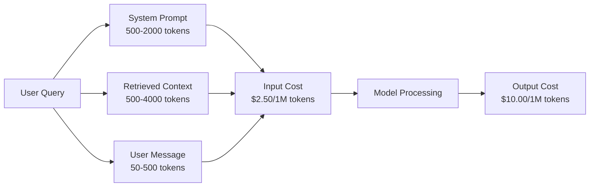
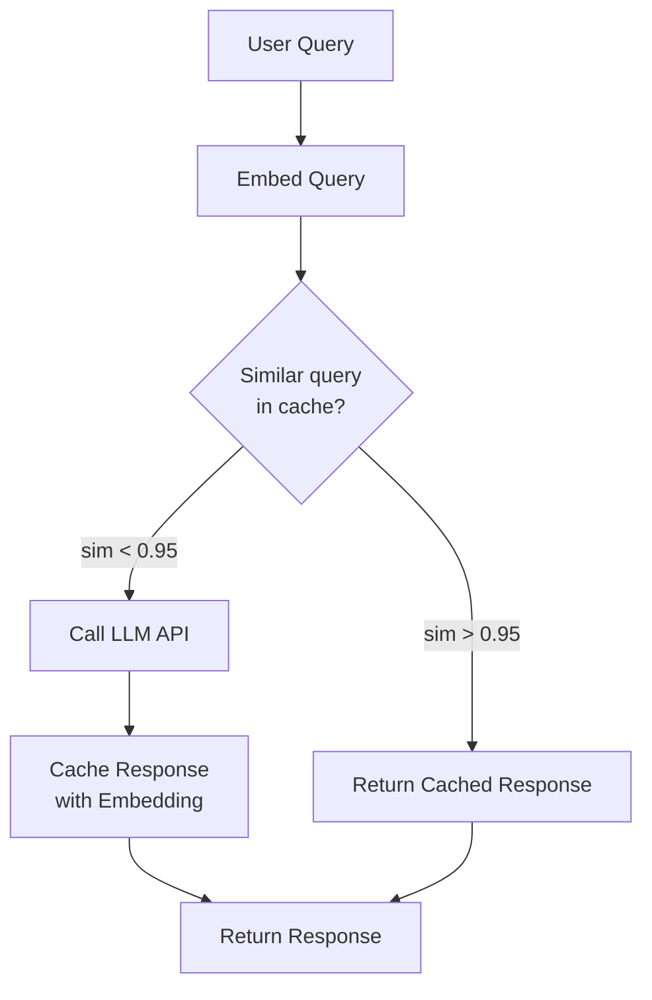
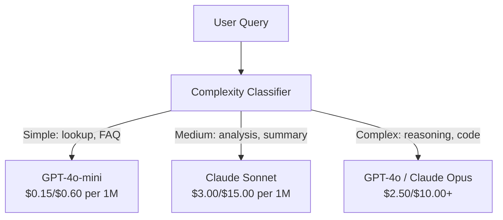

# Kayıtlama, Sınırlama ve Masraf Optimizasyonu

> Çoğu AI başlangıç kötü modellerden ölmez. Kötü birim ekonomisinden ölürler. Tek bir GPT-4o çağrısı bir sentin bir kısmını alır. Günde 10 000 kullanıcı 10 çağrı yaparken sadece 250 dolarlık giriş tokeni maliyetini alır. Bir dolarlık ücret almadan önce.

> **【中文解读】**AI 创业公司大多死于糟糕的单位经济模型,而不是糟糕的模型──10,000用户每天调用10次,光输入代币每天耗费250美元──活跃的公司将每次API 调用都作为金融交易来管理──

> **【拓展：成本优化→AI商业化】**提示缓存(Prompt Caching) ︎ ︎ ︎ ︎ ︎ ︎ ︎ ︎ ︎ ︎ ︎ ︎ ︎ ︎ ︎ ︎ ︎ ︎ ︎ ︎ ︎ ︎ ︎ ︎ ︎ ︎ ︎ ︎ ︎ ︎ ︎ ︎ ︎ ︎ ︎ ︎ ︎ ︎ ︎ ︎ ︎ ︎ ︎ ︎ ︎ ︎ ︎ ︎ ︎ ︎ ︎ ︎ ︎ ︎ ︎ ︎ ︎ ︎ ︎ ︎ ︎ ︎ ︎ ︎ ︎ ︎ ︎ ︎ ︎ ︎ ︎ ︎ ︎ ︎ ︎ ︎ ︎ ︎ ︎ ︎ ︎ ︎ ︎ ︎ ︎ ︎ ︎ ︎ ︎ ︎ ︎ ︎ ︎ ︎ ︎ ︎ ︎ ︎ ︎ ︎ ︎ ︎ ︎ ︎ ︎ ︎ ︎ ︎ ︎ ︎ ︎ ︎ ︎ ︎ ︎ ︎ ︎ ︎ ︎ ︎ ︎ ︎ ︎ ︎ ︎ ︎ ︎ ︎ ︎ ︎ ︎ ︎ ︎ ︎ ︎ ︎ ︎ ︎ ︎ ︎ ︎ ︎ ︎ ︎ ︎ ︎ ︎ ︎ ︎ ︎ ︎ ︎ ︎

>  **【前置】**学本节前请先掌握:(1) Fase 11·09(Fonksiyon Çağrıları);(2) Fase 11·04(Embeddings)语义缓存依赖嵌入;(3) Redis veya Memcached 基础。本节会用 `redis`- Evet.`fastapi-cache`Ya da`gptcache`- Evet.

**Type:** Build | **类型:** 构建
**Languages:** Python | **语言:** Python
**Prerequisites:** Phase 11 Lesson 09 (Function Calling) | **前置知识:** Phase 11 · 09 (函数调用)
**Time:** ~45 minutes | **时间:** ~45 分钟
**Related:**Bu ders uygulamalı aşama önbelleği (semantik önbelleği, tam hash önbelleği, model yönlendirme) kapsar. Ders 15 sağlayıcı aşama önbelleği (Anthropic cache_control, OpenAI otomatik, Gemini CachedContent) kapsar.**相关:**Eğitim: 11 · 15 (提示缓存) 本课讲应用层缓存(语义缓存、精确哈希缓存、模型路由)  Ders 15 讲提供商层提示缓存(Antropic cache_control、OpenAI 自动、Gemini CachedContent) 结合两者可降50-95% 成本。

## Öğrenme hedefleri

- Yeni bir API çağrısı yerine önbellekten tekrarlanan veya benzer sorular için semantik önbelleği uygulayın
  实现语义缓存,缓存服务重复或相似查询, değil her yeni inşa API 调用
- Teklif sağlayıcılar arasında talep başına maliyetlerin hesaplanması ve token farkında oran sınırlamaları ve bütçe uyarıları uygulaması
  跨供应商计算每请求成本,实现感知代币的流量限制和预算告警
- Hızlı sıkıştırma, model yönlendirme (mavdur karşı ucuza) ve yanıt önbelleği ile maliyet optimizasyonu katmanı oluşturun
  构建成本优化层,含提示压缩、模型路由(贵与便宜)
- Farklı sorgu türleri için tam eşleşme, semantik benzerlik ve önbellek önbellek kullanılarak bir katmanlı önbelleğe yönelik bir strateji tasarlayın
  设计分层缓存策略, targeting different query types with precise matching、语义相似度和前缓存

> **【中文解读】**Bu ders hedefleri: LLM uygulamasının maliyet optimize stratejisi'ni öğrenmek Prompt Caching、语义缓存、模型路由、批处理──LLM API'si, üretim ve dağıtımın ana harcamalarıdır──

>  **【类比】**Bu nedenle, bu programın temelinde, bir program oluşturulmuştur.**精确哈希缓存**冰箱里现成菜(同问题直接返回,毫秒);(2) **语义缓存** soğutma odasının benzerliği  嵌入相似度 > 0.95 视为同问题,5-20ms);**prompt caching** tedarikçi iyi bir yemek yapmayı öngörüyor  sistem hızlı                                                                                                                                                                                                                                                                                                                                                                                                                                                                                                             

> ️ **【易错点】**缓存的 3 个坑:(1) **缓存中毒** kullanıcı sorusu "My account surplus amount" (bilgisayarın hesabı) 语义缓存命中"上次别人问的余额",返回错的数字;修复:带用户身份 哈希进缓存键,PII/个性化查询不缓存――(2) **相似度阈值过高**0.95 太严,命中率 < 5%;降至0.85 +加 LLM 二次验证("Bu iki soru eşit mi?")**TTL 太长**News类查询缓存 24h,模型答案过时;区分查询类型,事实查询 TTL=1h,聊 TTL=24h──


## Sorunlar. Sorunlar.

RAG chatbotunu inşa edersin. Harika çalışıyor. Kullanıcılar çok seviyor.

Sonra fatura geliyor.

> Bir RAG Chatting Machine oluşturduğunuzu biliyorum. Çok iyi çalışıyor. Kullanıcılar çok sevgili.

GPT-5 maliyetleri $5 per million input tokens and $Milyon başına 15 adet üretim.$15 input / $Gemini 3 Pro'nun fiyatı 75 dolar.$1.25 input / $5 çıkış. GPT-5 mini $0.25/$2. Aşağıdaki fiyatlar örnek olarak gösterilmektedir; daima sağlayıcıların güncel fiyatlandırma sayfasını kontrol edin.

> GPT-5 / milyon giriş simgesi$5，每百万输出 $Claude Opus 4.7$15/$75―Gemini 3 Pro $1.25/$5..

İşte yeni başlayanları öldüren matematik:

> Bu bir başlangıç şirketinin matematik açısından çökmesi.

- Günlük aktif kullanıcı sayısı 10.000
  10.000 日利用户
- Günde her kullanıcıya 10 soru
  Her kullanıcı günde 10 kez soru sorar .
- 1000 giriş simgesi her sorguya (sistem sorgu + bağlam + kullanıcı mesajı)
  Her sorguda 1000 输入 token
- Cevap başına 500 çıkış tokeni
  500                                                                                                                                                                                                                                                                                                                                                                                                                                                                                                                             

**Monthly total:** **$22,500/month**

Bu sadece LLM. Ekle gömülmeler, vektör veritabanı barındırma, altyapı.

> Bu sadece LLM masrafları. Ek olarak, yerleşim, veri tabanı yönetimi, altyapı.

Kötü tarafı: bu soruların %40-60'sı neredeyse kopyalama. Kullanıcılar aynı soruları biraz farklı kelimelerle soruyor. Sistem istekleriniz her sorunun üzerinde aynıdır. Her seferinde fatura alınır. RAG tarafından alınan bağlam belgeleri aynı konu hakkında soran kullanıcılar arasında tekrarlanır.

> Ürünlü kısım: %40-60'ın sorguları neredeyse tekrarlanmaktadır. Kullanıcılar aynı soruyu sormak için biraz farklı kelimeler kullanmaktadır. Sistem önerileri her sorgu aynıdır.

Yetersiz hesaplama için tam bedel ödüyorsunuz.

> Yeterli hesaplar için tüm fiyatı ödeyeceksin.

## Konsepten bir şey.

> **【中文解读】**LLM API'nin maliyet optimize edilmesi üretim dağıtımının önemli bir önemi vardır.

> **【拓展：LLM 成本的实际数据】**GPT-4o 定价 $5/$M token başına 15 adet (input/output),Claude 3.5 Sonnet $3/$15── bir gün yaşayan 100.000 kullanıcıların uygulaması, her bir iletişim için yaklaşık 2K giriş + 500 çıkış jetonu, aylık maliyeti yaklaşık 15.000-45.000 dolar── hızlı kaydetme yoluyla %50 oranında düşebilir, GPT-4o-mini ile 代替简单查询可再降低30%──


### LLM Çağırışının Maliyet Anatomi

Her API çağrısı beş maliyet bileşeni içerir.

> Her API'de 5 maliyet bileşeni kullanılıyor.



Sistem istekleri sessiz katil, her talep masrafıyla birlikte gönderilen 1500 tane sistem istekleri.$3.75 per million requests just for that prefix. At 100K requests per day, that is $375 gün -- ayda 11.250 dolar -- asla değişmeyen metin için.

> Sistem ipucu sessiz bir katil. 1500 tane token. Sistem ipucu. Her bir istek gönderildi, her milyon istek sadece bu önde gelmiştir.$3.75。每天 10 万请求就是 $375/天$11,250/月   从不改变的文本而而言

### Sağlayıcı Kayıtlama: İçerilen İndirimler

Tüm üç büyük sağlayıcı 2026 yılında sağlayıcı tarafında hızlı önbelleğe sahip olmakta bulunmaktadır, ancak mekanikler farklıdır.

> Üç büyük tedarikçi 2026 yılında tüm tedarikçi tarafında öneri beklenir, ancak mekanizma farklıdır.

| Provider | Mechanism | Discount | Minimum | Cache Duration |
|----------|-----------|----------|---------|----------------|
| Anthropic | Explicit cache_control markers | 90% on cache hits (pay 25% extra on write) | 1,024 tokens (Sonnet/Opus), 2,048 (Haiku) | 5 min default; 1h extended (2x write premium) |
| OpenAI | Automatic prefix matching | 50% on cache hits | 1,024 tokens | Best-effort up to 1 hour |
| Google Gemini | Explicit CachedContent API | ~75% reduction (plus storage) | 4,096 (Flash) / 32,768 (Pro) | User-configurable TTL |

**Anthropic's approach**İletişim mesajının bölümlerini işaretle`cache_control: {"type": "ephemeral"}`İlk talep %25 yazma ödemesi ödenir. Aynı önlük ile sonraki talepler %90 indirim alır. 2000 tokenli bir sistem bu maliyetleri gösterir.$0.005 normally costs $0.000625'in önbelleğe girdiği 100 bin'den fazla talebi, günde 437.50 dolar tasarruf ediyor.

> **Anthropic 方式**- Evet, açıkça.`cache_control: {"type": "ephemeral"}`标记提示段──首次请求付 25% 写入溢价──后续同前请求获得90% 折扣──2,000 token 系统提示正常 系统提示$0.005，缓存命中 $0.000625―100.000 talep... 437.50 dolar/gün...

**OpenAI's approach**Bu, bir önceki talebe eşleşen herhangi bir önbellek için %50 indirim sağlar.

> **OpenAI 方式**%50 indirim. %50 indirim. %50 indirim. %50 indirim. %50 indirim. %50 indirim. %50 indirim. %50 indirim. %50 indirim. %50 indirim. %50 indirim. %50 indirim. %50 indirim. %50 indirim. %50 indirim. %50 indirim. %50 indirim. %50 indirim. %50 indirim. %50 indirim. %50 indirim. %50 indirim. %50 indirim. %50 indirim. %50 indirim. %50 indirim. %50 indirim. %50 indirim. %50 indirim. %50 indirim. %50 indirim. %50 indirim. %100. %100. %100. %100. %100. %100. %100. %100. %100. %100. %100. %100. %100. %100. %100. %100. %100. %100. %100. %100. %100. %100. %100. %100. %100. %100. %100. %100. %100. %100. %100. %100. %100. %100. %

### Semantik Kayıtlama: Özel Sınıfınız

Provider önbelleği sadece aynı önbellekler için çalışır. Semantik önbelleği daha zor olan durumu ele alır: aynı anlamlı farklı sorgular.

> 提供商缓存只对相同的前生效──语义缓存处理更难的情况:不同查询但相同含义──

"Dönüş politika nedir?" ve "Bir öğeyi nasıl iade edebilirim?" farklı dizilerdir ancak aynı niyetlerdir.

> "退货政策是什么?" ve "我怎么退货?" farklı bir harftir ama aynı niyettir.



Bu nedenle, bu işlemlerin en iyi şekilde yapılması için, bu işlemlerin en iyi şekilde yapılması için, bu işlemlerin en iyi şekilde yapılması için, bu işlemlerin en iyi şekilde yapılması için, bu işlemlerin en iyi şekilde yapılması için, bu işlemlerin en iyi şekilde yapılması için, bu işlemlerin en iyi şekilde yapılması için, bu işlemlerin en iyi şekilde yapılması için, bu işlemlerin en iyi şekilde yapılması için, bu işlemlerin yapılması için gerekli olan işlemlerin yapılması için, bu işlemlerin yapılması için, bu işlemlerin yapılması için gerekli olan işlemlerin yapılması için, bu işlemlerin yapılması için gerekli olan işlemlerin yapılması için, bu işlemlerin yapılması için gerekli olan işlemlerin yapılması için, bu işlemlerin yapılması için gerekli olan işlemlerin yapılması için, bu işlemlerin yapılması için, bu işlemlerin yapılması için gerekli olan işlemlerin yapılması için, bu işlemlerin yapılması için, bu işlemlerin yapılması için, bu işlemlerin yapılması için, bu işlemlerin yapılması için, bu işlemlerin yapılması için, bu işlemlerin yapılması için, bu işlemlerin yapılması için, bu işlemlerin yapılması için, yapılması gereken bir işlemlerin yapılması için, yapılması gerekmektedir.

> 嵌入成本可忽略──OpenAI metin gömülmesi-3- küçük Her milyon token $0.02──检查缓存相比完整LLM 调用几乎零成本──

### Tam Kaşlama: Hash ve Düzleşme

Deterministik çağrılar için (temperatür = 0, aynı model, aynı önbellek), tam önbellekleme daha basit ve daha hızlıdır.

> Bu nedenle, bu konudaki tüm kaydı kontrol etmek için, kaydı kontrol etmek için, kaydı kontrol etmek için, kaydı kontrol etmek için, kaydı kontrol etmek için, kaydı kontrol etmek için, kaydı kontrol etmek için, kaydı kontrol etmek için, kaydı kontrol etmek için, kaydı kontrol etmek için, kaydı kontrol etmek için, kaydı kontrol etmek için, kaydı kontrol etmek için, kaydı kontrol etmek için, kaydı kontrol etmek için, kaydı kontrol etmek için, kaydı kontrol etmek için, kaydı kontrol etmek için, kaydı kontrol etmek için, kaydı kontrol etmek için, kaydı kontrol etmek için, kaydı kontrol etmek için, kaydı kontrol etmek için, kaydı kontrol etmek için, kaydı kontrol etmek için, kaydı kontrol etmek için, kaydı kontrol etmek için, kaydı kullanmak için, kaydı kullanmak için, kaydı kullanmak için, kaydı kullanmak için, kaydı kullanmak için, kaydı kullanmak için, kaydı kullanmak için, kaydı kullanmak için, kaydı kullanmak için, kaydı kullanmak için, kaydı kullanmak için, kaydı kullanmak için, kaydı kullanmak için, kaydetti.

Bu mükemmel bir şekilde işe yarıyor:

> Bu aşağıdaki sahne için mükemmel uygundur:

- Sistem istekleri + sabit bağlam + aynı kullanıcı sorguları
  系统提示 + 固定上下文 + 相同用户查询
- Aynı araç tanımları ile fonksiyon çağrısı
  Eşdeğer tanımlama fonksiyonu
- Aynı belgeyi birden fazla kez işlediği seri işleme
  Eşine dosya çok kez işlenmiş bir grup işlenmiş

### Ödül Sınırlaması: bütçenizi koruyun

Sınır sınırlaması sadece adaletle ilgili değil, hayatta kalmakla ilgili.

> Sınır sadece adil bir sorun değil, bir yaşam sorunu.

**Token bucket algorithm:**Bu, bir ortalama oran uygulayarak patlamalara (topu bir anda kullanın) izin verir.
**令牌桶算法**: Her kullanıcı bir N token 桶, R/ saniye hız oranı ile doldurulur.

**Per-user quotas:**Kullanıcı seviyesine göre günlük/aylık token limitleri belirle.
**每用户配额**: kullanıcı seviyesine göre设日/月 belirti 上限。

| Tier | Daily Token Limit | Max Requests/min | Model Access |
|------|------------------|------------------|-------------|
| Free | 50,000 | 10 | GPT-4o-mini only |
| Pro | 500,000 | 60 | GPT-4o, Claude Sonnet |
| Enterprise | 5,000,000 | 300 | All models |

### Yollama Modelli: Doğru İş için Doğru Model

Her sorunun GPT-4o'ya ihtiyacı yoktur.

> Her sorunun GPT-4o olması gerekmiyor.

"Dükkan kaçta kapanıyor?"$10/M-output model. GPT-4o-mini at $0.60 / M çıkışı mükemmel bir şekilde çalışır. Claude Haiku $ 1.25 / M çıkışı ile çalışır. basit bir sınıflandırıcı ucuz modellere ucuz sorguları ve pahalı modellere karmaşık sorguları yönlendirir.

> "Shop birkaç saat关门?" gerek yok.$10/M 输出模型。$0.60/M 输出 GPT-4o-mini 完全胜任。$1.25/M 输出 Claude Haiku 也可以──简单分类器把便宜查询路由到便宜模型,复杂查询路由到贵模型──



İyi ayarlanmış bir yönlendirme sadece model maliyetlerinde %40-70% tasarruf eder.

> 调好的路由器单在模型成本上省40­70%──

### Maliyetleri takip etmek: Parayı nereye götürdüğünü bil

Ölçmediğiniz şeyi optimize edemezsiniz. Her API çağrısını kaydetin:

> İzleme miktarını optimize edemiyorum.

- Zaman damgası
  Zamanı
- Model adı
  模型名
- Girit simgeler
  输入 işaret
- Çıktı tokens
  输出 işaretleri
- Gecikme (ms)
  延迟(毫秒)
- Hesaplanmış maliyet ($)
  计算成本($)
- Kullanıcı Kimliği
  Kullanıcı Kimliği
- Önbelleği vurma/kaybolma
  缓存命中/未中
- Başvuru kategorisi
  Dilek sınıfı

Bu veriler hangi özelliklerin pahalı olduğunu, hangi kullanıcıların ağır tüketicileri olduğunu ve nerede önbelleğin en fazla etkisi olduğunu ortaya koyuyor.

> Bu veriler, hangi işlevlerin değerini ortaya koyuyor, hangi kullanıcıların tüketimi büyüktür, hangi durumun en büyük etkisi var.

### Toplu Satış: Toplu indirimler

OpenAI'nin Batch API'si istekleri %50 indirimle asinkron olarak işliyor. 50 bin kadar istek gönderir ve sonuçlar 24 saat içinde geri gelir.

> OpenAI Batch API 异步处理请求,50%折──提交最大50.000请求的批次,24小时内返回结果──

İçişleri kullanmak:

> Bütçe işlemi:

- Gece belge işleme
  Gece İçin Arşiv İşleme
- Toplu sınıflandırma
  Bütük bölümü
- Değerlendirme süreleri
  评估运行
- Verileri zenginleştirme boru hattları
  Su Akımı

Gerçek zamanlı kullanıcılarla ilgili sorular için değil (kenaklık meseleleri).
Not used:实时面向用户查询 ( kullanıcı sorusu için kullanılmaz)

### Bütçe Alarmları ve Çevre Kesmeler

Bir devre kesici, bir sınırın üzerine düştüğünde harcamaları durdurur.

> Yukarıdaki sınırın ulaştığı zaman harcamaları durdurmak.

Üç eşiği belirle:

> 设三个值:

1. **Warning**(Büdce'nin %70'i): uyarı gönder
   **警告**(Budget %70):发告警
2. **Throttle**(Büdçenin %85'i): Sadece daha ucuz modellere geçiş
   **降速**(Budget 85%): Sadece daha ucuz model olarak değiştirildi
3. **Stop**(Büdce'nin %95'i): Yeni talepleri reddetmek, sadece önbelleğe alınan cevapları göndermek
   **停止**(Budget 95%): Yeni talepleri reddetmek, sadece geri dönmek

### Optimizasyon Düğmesi

Bu teknikleri sırayla uygulayın.

> Bu teknikleri uygulayabilmek için, her kat üstü ön kat üstü bir kat üstü bir kat üstü bir kat üstü bir kat üstü bir kat üstü bir kat üstü bir kat üstü bir kat üstü bir kat üstü bir kat üstü bir kat üstü bir kat üstü bir kat üstü bir kat üstü bir kat üstü bir kat üstü bir kat üstü bir kat üstü bir kat üstü bir kat üstü bir kat üstü bir kat üstü bir kat üstü bir kat üstü bir kat üstü bir kat üstü bir kat üstü bir kat üstü bir kat üstü bir kat üstü bir kat üstü bir kat üstü bir kat üstü bir kat üstü bir kat kat üstü bir kat kat katı bir katı bir katı bir katı bir katı bir katı bir katı bir katı bir katı bir katı bir katı bir katı bir katı bir katı bir katı bir katı bir katı bir katı bir katı bir katı bir katı bir katı

| Layer | Technique | Typical Savings | Implementation Effort |
|-------|-----------|----------------|----------------------|
| 1 | Provider prompt caching | 30-50% | Low (add cache markers) |
| 2 | Exact caching | 10-20% | Low (hash + dict) |
| 3 | Semantic caching | 15-30% | Medium (embeddings + similarity) |
| 4 | Model routing | 40-70% | Medium (classifier) |
| 5 | Rate limiting | Budget protection | Low (token bucket) |
| 6 | Prompt compression | 10-30% | Medium (rewrite prompts) |
| 7 | Batching | 50% on eligible | Low (batch API) |

1-5 katmanları uygulayan bir RAG uygulaması genellikle maliyetleri $22,500/month to $Bu, pist yakmakla bir iş kurmak arasındaki fark.

> 1-5 kat RAG uygulaması genellikle aylık maliyetleri artırır.$22,500 降到 $4000-6000... Bu, para yakmakla iş yapmak arasındaki fark.

### Gerçek Para: Ön ve Son

İşte 10 bin DAU'yu hizmet veren RAG chatbot için gerçek bir çöküş.

> Bu servisin 10.000 DAU'sının RAG chat makinelerinin gerçek çözümü.

| Metric | Before Optimization | After Optimization | Savings |
|--------|--------------------|--------------------|---------|
| Monthly LLM cost | $22,500 | $5,200 | 77% |
| Avg cost per query | $0.0075 | $0.0017 | 77% |
| Cache hit rate | 0% | 52% | -- |
| Queries routed to mini | 0% | 65% | -- |
| P95 latency | 2,800ms | 900ms (cache hits: 50ms) | 68% |
| Monthly embedding cost | $0 | $180 | (new cost) |
| Total monthly cost | $22,500 | $5,380 | 76% |

Semantik önbelleğe yerleştirme maliyeti (ayda 180 dolar) önbelleğe giriş yapıldıktan sonraki ilk saat içinde kendi başına ödenir.

> 语义缓存的嵌入成本 ($180/月)缓存 hayatının ilk saatinde zaten yeniden hazırlanmıştır.

## Yapın.
```figure
semantic-cache
```

## Yapın

### Adım 1: Maliyet Hesaplayıcı

Büyük modeller için mevcut fiyatları bilen bir token maliyet hesaplayıcısı oluşturun.

> 构建代币 成本计算器,知道主要模型当前定价──

```python
import hashlib
import time
import json
import math
from dataclasses import dataclass, field


MODEL_PRICING = {
    "gpt-4o": {"input": 2.50, "output": 10.00, "cached_input": 1.25},
    "gpt-4o-mini": {"input": 0.15, "output": 0.60, "cached_input": 0.075},
    "gpt-4.1": {"input": 2.00, "output": 8.00, "cached_input": 0.50},
    "gpt-4.1-mini": {"input": 0.40, "output": 1.60, "cached_input": 0.10},
    "gpt-4.1-nano": {"input": 0.10, "output": 0.40, "cached_input": 0.025},
    "o3": {"input": 2.00, "output": 8.00, "cached_input": 0.50},
    "o3-mini": {"input": 1.10, "output": 4.40, "cached_input": 0.55},
    "o4-mini": {"input": 1.10, "output": 4.40, "cached_input": 0.275},
    "claude-opus-4": {"input": 15.00, "output": 75.00, "cached_input": 1.50},
    "claude-sonnet-4": {"input": 3.00, "output": 15.00, "cached_input": 0.30},
    "claude-haiku-3.5": {"input": 0.80, "output": 4.00, "cached_input": 0.08},
    "gemini-2.5-pro": {"input": 1.25, "output": 10.00, "cached_input": 0.3125},
    "gemini-2.5-flash": {"input": 0.15, "output": 0.60, "cached_input": 0.0375},
}


def calculate_cost(model, input_tokens, output_tokens, cached_input_tokens=0):
    if model not in MODEL_PRICING:
        return {"error": f"Unknown model: {model}"}
    pricing = MODEL_PRICING[model]
    non_cached = input_tokens - cached_input_tokens
    input_cost = (non_cached / 1_000_000) * pricing["input"]
    cached_cost = (cached_input_tokens / 1_000_000) * pricing["cached_input"]
    output_cost = (output_tokens / 1_000_000) * pricing["output"]
    total = input_cost + cached_cost + output_cost
    return {
        "model": model,
        "input_tokens": input_tokens,
        "output_tokens": output_tokens,
        "cached_input_tokens": cached_input_tokens,
        "input_cost": round(input_cost, 6),
        "cached_input_cost": round(cached_cost, 6),
        "output_cost": round(output_cost, 6),
        "total_cost": round(total, 6),
    }
```

### İkinci Adım: Tam Kayıt

Tam bir istekle işaretleyin ve aynı istekler için önbelleğe alınmış yanıtları geri verin.

> 哈希完整提示, aynı istek için geri dönüş

```python
class ExactCache:
    def __init__(self, max_size=1000, ttl_seconds=3600):
        self.cache = {}
        self.max_size = max_size
        self.ttl = ttl_seconds
        self.hits = 0
        self.misses = 0

    def _hash(self, model, messages, temperature):
        key_data = json.dumps({"model": model, "messages": messages, "temperature": temperature}, sort_keys=True)
        return hashlib.sha256(key_data.encode()).hexdigest()

    def get(self, model, messages, temperature=0.0):
        if temperature > 0:
            self.misses += 1
            return None
        key = self._hash(model, messages, temperature)
        if key in self.cache:
            entry = self.cache[key]
            if time.time() - entry["timestamp"] < self.ttl:
                self.hits += 1
                entry["access_count"] += 1
                return entry["response"]
            del self.cache[key]
        self.misses += 1
        return None

    def put(self, model, messages, temperature, response):
        if temperature > 0:
            return
        if len(self.cache) >= self.max_size:
            oldest_key = min(self.cache, key=lambda k: self.cache[k]["timestamp"])
            del self.cache[oldest_key]
        key = self._hash(model, messages, temperature)
        self.cache[key] = {
            "response": response,
            "timestamp": time.time(),
            "access_count": 1,
        }

    def stats(self):
        total = self.hits + self.misses
        return {
            "hits": self.hits,
            "misses": self.misses,
            "hit_rate": round(self.hits / total, 4) if total > 0 else 0,
            "cache_size": len(self.cache),
        }
```

### Adım 3: Semantik Kayıt

Sorguları yerleştir ve benzerlik bir eşiği aşırınca önbelleğe alınan yanıtları geri gönder.

> 嵌入查询,相似度超值时返回缓存响应──

```python
def simple_embed(text):
    words = text.lower().split()
    vocab = {}
    for w in words:
        vocab[w] = vocab.get(w, 0) + 1
    norm = math.sqrt(sum(v * v for v in vocab.values()))
    if norm == 0:
        return {}
    return {k: v / norm for k, v in vocab.items()}


def cosine_similarity(a, b):
    if not a or not b:
        return 0.0
    all_keys = set(a) | set(b)
    dot = sum(a.get(k, 0) * b.get(k, 0) for k in all_keys)
    return dot


class SemanticCache:
    def __init__(self, similarity_threshold=0.85, max_size=500, ttl_seconds=3600):
        self.entries = []
        self.threshold = similarity_threshold
        self.max_size = max_size
        self.ttl = ttl_seconds
        self.hits = 0
        self.misses = 0

    def get(self, query):
        query_embedding = simple_embed(query)
        now = time.time()
        best_match = None
        best_sim = 0.0
        for entry in self.entries:
            if now - entry["timestamp"] > self.ttl:
                continue
            sim = cosine_similarity(query_embedding, entry["embedding"])
            if sim > best_sim:
                best_sim = sim
                best_match = entry
        if best_match and best_sim >= self.threshold:
            self.hits += 1
            best_match["access_count"] += 1
            return {"response": best_match["response"], "similarity": round(best_sim, 4), "original_query": best_match["query"]}
        self.misses += 1
        return None

    def put(self, query, response):
        if len(self.entries) >= self.max_size:
            self.entries.sort(key=lambda e: e["timestamp"])
            self.entries.pop(0)
        self.entries.append({
            "query": query,
            "embedding": simple_embed(query),
            "response": response,
            "timestamp": time.time(),
            "access_count": 1,
        })

    def stats(self):
        total = self.hits + self.misses
        return {
            "hits": self.hits,
            "misses": self.misses,
            "hit_rate": round(self.hits / total, 4) if total > 0 else 0,
            "cache_size": len(self.entries),
        }
```

### 4. Adım: Sınır sınırı

Bir kullanıcı başına kvotalar ile token kova oranı sınırlayıcı.

> Bu, kullanıcı oranı içerir.

```python
class TokenBucketRateLimiter:
    def __init__(self):
        self.buckets = {}
        self.tiers = {
            "free": {"capacity": 50_000, "refill_rate": 500, "max_requests_per_min": 10},
            "pro": {"capacity": 500_000, "refill_rate": 5_000, "max_requests_per_min": 60},
            "enterprise": {"capacity": 5_000_000, "refill_rate": 50_000, "max_requests_per_min": 300},
        }

    def _get_bucket(self, user_id, tier="free"):
        if user_id not in self.buckets:
            tier_config = self.tiers.get(tier, self.tiers["free"])
            self.buckets[user_id] = {
                "tokens": tier_config["capacity"],
                "capacity": tier_config["capacity"],
                "refill_rate": tier_config["refill_rate"],
                "last_refill": time.time(),
                "request_timestamps": [],
                "max_rpm": tier_config["max_requests_per_min"],
                "tier": tier,
                "total_tokens_used": 0,
            }
        return self.buckets[user_id]

    def _refill(self, bucket):
        now = time.time()
        elapsed = now - bucket["last_refill"]
        refill = int(elapsed * bucket["refill_rate"])
        if refill > 0:
            bucket["tokens"] = min(bucket["capacity"], bucket["tokens"] + refill)
            bucket["last_refill"] = now

    def check(self, user_id, tokens_needed, tier="free"):
        bucket = self._get_bucket(user_id, tier)
        self._refill(bucket)
        now = time.time()
        bucket["request_timestamps"] = [t for t in bucket["request_timestamps"] if now - t < 60]
        if len(bucket["request_timestamps"]) >= bucket["max_rpm"]:
            return {"allowed": False, "reason": "rate_limit", "retry_after_seconds": 60 - (now - bucket["request_timestamps"][0])}
        if bucket["tokens"] < tokens_needed:
            deficit = tokens_needed - bucket["tokens"]
            wait = deficit / bucket["refill_rate"]
            return {"allowed": False, "reason": "token_limit", "tokens_available": bucket["tokens"], "retry_after_seconds": round(wait, 1)}
        return {"allowed": True, "tokens_available": bucket["tokens"]}

    def consume(self, user_id, tokens_used, tier="free"):
        bucket = self._get_bucket(user_id, tier)
        bucket["tokens"] -= tokens_used
        bucket["request_timestamps"].append(time.time())
        bucket["total_tokens_used"] += tokens_used

    def get_usage(self, user_id):
        if user_id not in self.buckets:
            return {"error": "User not found"}
        b = self.buckets[user_id]
        return {
            "user_id": user_id,
            "tier": b["tier"],
            "tokens_remaining": b["tokens"],
            "capacity": b["capacity"],
            "total_tokens_used": b["total_tokens_used"],
            "utilization": round(b["total_tokens_used"] / b["capacity"], 4) if b["capacity"] else 0,
        }
```

### Adım 5: Maliyet izleme

Her çağrıyu kaydet ve çalıştırma toplamlarını hesapla.

> 记录每次调用并计算累计总额──

```python
class CostTracker:
    def __init__(self, monthly_budget=1000.0):
        self.logs = []
        self.monthly_budget = monthly_budget
        self.alerts = []

    def log_call(self, model, input_tokens, output_tokens, cached_input_tokens=0, latency_ms=0, user_id="anonymous", cache_status="miss"):
        cost = calculate_cost(model, input_tokens, output_tokens, cached_input_tokens)
        entry = {
            "timestamp": time.time(),
            "model": model,
            "input_tokens": input_tokens,
            "output_tokens": output_tokens,
            "cached_input_tokens": cached_input_tokens,
            "latency_ms": latency_ms,
            "cost": cost["total_cost"],
            "user_id": user_id,
            "cache_status": cache_status,
        }
        self.logs.append(entry)
        self._check_budget()
        return entry

    def _check_budget(self):
        total = self.total_cost()
        pct = total / self.monthly_budget if self.monthly_budget > 0 else 0
        if pct >= 0.95 and not any(a["level"] == "stop" for a in self.alerts):
            self.alerts.append({"level": "stop", "message": f"Budget 95% consumed: ${total:.2f}/${self.monthly_budget:.2f}", "timestamp": time.time()})
        elif pct >= 0.85 and not any(a["level"] == "throttle" for a in self.alerts):
            self.alerts.append({"level": "throttle", "message": f"Budget 85% consumed: ${total:.2f}/${self.monthly_budget:.2f}", "timestamp": time.time()})
        elif pct >= 0.70 and not any(a["level"] == "warning" for a in self.alerts):
            self.alerts.append({"level": "warning", "message": f"Budget 70% consumed: ${total:.2f}/${self.monthly_budget:.2f}", "timestamp": time.time()})

    def total_cost(self):
        return round(sum(e["cost"] for e in self.logs), 6)

    def cost_by_model(self):
        by_model = {}
        for e in self.logs:
            m = e["model"]
            if m not in by_model:
                by_model[m] = {"calls": 0, "cost": 0, "input_tokens": 0, "output_tokens": 0}
            by_model[m]["calls"] += 1
            by_model[m]["cost"] = round(by_model[m]["cost"] + e["cost"], 6)
            by_model[m]["input_tokens"] += e["input_tokens"]
            by_model[m]["output_tokens"] += e["output_tokens"]
        return by_model

    def cache_savings(self):
        cache_hits = [e for e in self.logs if e["cache_status"] == "hit"]
        if not cache_hits:
            return {"saved": 0, "cache_hits": 0}
        saved = 0
        for e in cache_hits:
            full_cost = calculate_cost(e["model"], e["input_tokens"], e["output_tokens"])
            saved += full_cost["total_cost"]
        return {"saved": round(saved, 4), "cache_hits": len(cache_hits)}

    def summary(self):
        if not self.logs:
            return {"total_calls": 0, "total_cost": 0}
        total_latency = sum(e["latency_ms"] for e in self.logs)
        cache_hits = sum(1 for e in self.logs if e["cache_status"] == "hit")
        return {
            "total_calls": len(self.logs),
            "total_cost": self.total_cost(),
            "avg_cost_per_call": round(self.total_cost() / len(self.logs), 6),
            "avg_latency_ms": round(total_latency / len(self.logs), 1),
            "cache_hit_rate": round(cache_hits / len(self.logs), 4),
            "cost_by_model": self.cost_by_model(),
            "cache_savings": self.cache_savings(),
            "budget_remaining": round(self.monthly_budget - self.total_cost(), 2),
            "budget_utilization": round(self.total_cost() / self.monthly_budget, 4) if self.monthly_budget > 0 else 0,
            "alerts": self.alerts,
        }
```

### Adım 6: Model yönlendiricisi

Yol sorgularını en ucuz modelle yönlendirin.

> Sorguları en ucuz modelle halledebilmek için yollayın.

```python
SIMPLE_KEYWORDS = ["what time", "hours", "address", "phone", "price", "return policy", "hello", "hi", "thanks", "yes", "no"]
COMPLEX_KEYWORDS = ["analyze", "compare", "explain why", "write code", "debug", "architect", "design", "trade-off", "evaluate"]


def classify_complexity(query):
    q = query.lower()
    if len(q.split()) <= 5 or any(kw in q for kw in SIMPLE_KEYWORDS):
        return "simple"
    if any(kw in q for kw in COMPLEX_KEYWORDS):
        return "complex"
    return "medium"


def route_model(query, tier="pro"):
    complexity = classify_complexity(query)
    routing_table = {
        "simple": {"free": "gpt-4.1-nano", "pro": "gpt-4o-mini", "enterprise": "gpt-4o-mini"},
        "medium": {"free": "gpt-4o-mini", "pro": "claude-sonnet-4", "enterprise": "claude-sonnet-4"},
        "complex": {"free": "gpt-4o-mini", "pro": "gpt-4o", "enterprise": "claude-opus-4"},
    }
    model = routing_table[complexity].get(tier, "gpt-4o-mini")
    return {"query": query, "complexity": complexity, "model": model, "tier": tier}
```

### Adım 7: Demo çalıştır

> 运行演示──

```python
def simulate_llm_call(model, query):
    input_tokens = len(query.split()) * 4 + 500
    output_tokens = 150 + (len(query.split()) * 2)
    latency = 200 + (output_tokens * 2)
    return {
        "model": model,
        "response": f"[Simulated {model} response to: {query[:50]}...]",
        "input_tokens": input_tokens,
        "output_tokens": output_tokens,
        "latency_ms": latency,
    }


def run_demo():
    print("=" * 60)
    print("  Caching, Rate Limiting & Cost Optimization Demo")
    print("=" * 60)

    print("\n--- Model Pricing ---")
    for model, pricing in list(MODEL_PRICING.items())[:6]:
        cost_1k = calculate_cost(model, 1000, 500)
        print(f"  {model}: ${cost_1k['total_cost']:.6f} per 1K in + 500 out")

    print("\n--- Cost Comparison: 100K Requests ---")
    for model in ["gpt-4o", "gpt-4o-mini", "claude-sonnet-4", "claude-haiku-3.5"]:
        cost = calculate_cost(model, 1000 * 100_000, 500 * 100_000)
        print(f"  {model}: ${cost['total_cost']:.2f}")

    print("\n--- Anthropic Cache Savings ---")
    no_cache = calculate_cost("claude-sonnet-4", 2000, 500, 0)
    with_cache = calculate_cost("claude-sonnet-4", 2000, 500, 1500)
    saving = no_cache["total_cost"] - with_cache["total_cost"]
    print(f"  Without cache: ${no_cache['total_cost']:.6f}")
    print(f"  With 1500 cached tokens: ${with_cache['total_cost']:.6f}")
    print(f"  Savings per call: ${saving:.6f} ({saving/no_cache['total_cost']*100:.1f}%)")

    exact_cache = ExactCache(max_size=100, ttl_seconds=300)
    semantic_cache = SemanticCache(similarity_threshold=0.75, max_size=100)
    rate_limiter = TokenBucketRateLimiter()
    tracker = CostTracker(monthly_budget=100.0)

    print("\n--- Exact Cache ---")
    messages_1 = [{"role": "user", "content": "What is the return policy?"}]
    result = exact_cache.get("gpt-4o-mini", messages_1, 0.0)
    print(f"  First lookup: {'HIT' if result else 'MISS'}")
    exact_cache.put("gpt-4o-mini", messages_1, 0.0, "You can return items within 30 days.")
    result = exact_cache.get("gpt-4o-mini", messages_1, 0.0)
    print(f"  Second lookup: {'HIT' if result else 'MISS'} -> {result}")
    result = exact_cache.get("gpt-4o-mini", messages_1, 0.7)
    print(f"  With temp=0.7: {'HIT' if result else 'MISS (non-deterministic, skip cache)'}")
    print(f"  Stats: {exact_cache.stats()}")

    print("\n--- Semantic Cache ---")
    test_queries = [
        ("What is the return policy?", "Items can be returned within 30 days with receipt."),
        ("How do I return an item?", None),
        ("What are your store hours?", "We are open 9am-9pm Monday through Saturday."),
        ("When does the store open?", None),
        ("Tell me about quantum computing", "Quantum computers use qubits..."),
        ("Explain quantum mechanics", None),
    ]
    for query, response in test_queries:
        cached = semantic_cache.get(query)
        if cached:
            print(f"  '{query[:40]}' -> CACHE HIT (sim={cached['similarity']}, original='{cached['original_query'][:40]}')")
        elif response:
            semantic_cache.put(query, response)
            print(f"  '{query[:40]}' -> MISS (stored)")
        else:
            print(f"  '{query[:40]}' -> MISS (no match)")
    print(f"  Stats: {semantic_cache.stats()}")

    print("\n--- Rate Limiting ---")
    for i in range(12):
        check = rate_limiter.check("user_1", 1000, "free")
        if check["allowed"]:
            rate_limiter.consume("user_1", 1000, "free")
        status = "OK" if check["allowed"] else f"BLOCKED ({check['reason']})"
        if i < 5 or not check["allowed"]:
            print(f"  Request {i+1}: {status}")
    print(f"  Usage: {rate_limiter.get_usage('user_1')}")

    print("\n--- Model Routing ---")
    routing_queries = [
        "What time do you close?",
        "Summarize this quarterly earnings report",
        "Analyze the trade-offs between microservices and monoliths",
        "Hello",
        "Write code for a binary search tree with deletion",
    ]
    for q in routing_queries:
        route = route_model(q, "pro")
        print(f"  '{q[:50]}' -> {route['model']} ({route['complexity']})")

    print("\n--- Full Pipeline: Before vs After Optimization ---")
    queries = [
        "What is the return policy?",
        "How do I return something?",
        "What are your hours?",
        "When do you open?",
        "Explain the difference between TCP and UDP",
        "Compare TCP vs UDP protocols",
        "Hello",
        "What is your phone number?",
        "Write a Python function to sort a list",
        "Analyze the pros and cons of serverless architecture",
    ]

    print("\n  [Before: no caching, single model (gpt-4o)]")
    tracker_before = CostTracker(monthly_budget=1000.0)
    for q in queries:
        result = simulate_llm_call("gpt-4o", q)
        tracker_before.log_call("gpt-4o", result["input_tokens"], result["output_tokens"], latency_ms=result["latency_ms"], cache_status="miss")
    before = tracker_before.summary()
    print(f"  Total cost: ${before['total_cost']:.6f}")
    print(f"  Avg cost/call: ${before['avg_cost_per_call']:.6f}")
    print(f"  Avg latency: {before['avg_latency_ms']}ms")

    print("\n  [After: caching + routing + rate limiting]")
    exact_c = ExactCache()
    semantic_c = SemanticCache(similarity_threshold=0.75)
    tracker_after = CostTracker(monthly_budget=1000.0)

    for q in queries:
        messages = [{"role": "user", "content": q}]
        cached = exact_c.get("gpt-4o", messages, 0.0)
        if cached:
            tracker_after.log_call("gpt-4o-mini", 0, 0, latency_ms=5, cache_status="hit")
            continue
        sem_cached = semantic_c.get(q)
        if sem_cached:
            tracker_after.log_call("gpt-4o-mini", 0, 0, latency_ms=15, cache_status="hit")
            continue
        route = route_model(q)
        result = simulate_llm_call(route["model"], q)
        tracker_after.log_call(route["model"], result["input_tokens"], result["output_tokens"], latency_ms=result["latency_ms"], cache_status="miss")
        exact_c.put(route["model"], messages, 0.0, result["response"])
        semantic_c.put(q, result["response"])

    after = tracker_after.summary()
    print(f"  Total cost: ${after['total_cost']:.6f}")
    print(f"  Avg cost/call: ${after['avg_cost_per_call']:.6f}")
    print(f"  Avg latency: {after['avg_latency_ms']}ms")
    print(f"  Cache hit rate: {after['cache_hit_rate']:.0%}")

    if before["total_cost"] > 0:
        savings_pct = (1 - after["total_cost"] / before["total_cost"]) * 100
        print(f"\n  SAVINGS: {savings_pct:.1f}% cost reduction")
        print(f"  Latency improvement: {(1 - after['avg_latency_ms'] / before['avg_latency_ms']) * 100:.1f}% faster")

    print("\n--- Budget Alerts Demo ---")
    alert_tracker = CostTracker(monthly_budget=0.01)
    for i in range(5):
        alert_tracker.log_call("gpt-4o", 5000, 2000, latency_ms=500)
    print(f"  Total spent: ${alert_tracker.total_cost():.6f} / ${alert_tracker.monthly_budget}")
    for alert in alert_tracker.alerts:
        print(f"  ALERT [{alert['level'].upper()}]: {alert['message']}")

    print("\n--- Cost Breakdown by Model ---")
    multi_tracker = CostTracker(monthly_budget=500.0)
    for _ in range(50):
        multi_tracker.log_call("gpt-4o-mini", 800, 200, latency_ms=150)
    for _ in range(30):
        multi_tracker.log_call("claude-sonnet-4", 1500, 500, latency_ms=400)
    for _ in range(10):
        multi_tracker.log_call("gpt-4o", 2000, 800, latency_ms=600)
    for _ in range(10):
        multi_tracker.log_call("claude-opus-4", 3000, 1000, latency_ms=1200)
    breakdown = multi_tracker.cost_by_model()
    for model, data in sorted(breakdown.items(), key=lambda x: x[1]["cost"], reverse=True):
        print(f"  {model}: {data['calls']} calls, ${data['cost']:.6f}, {data['input_tokens']:,} in / {data['output_tokens']:,} out")
    print(f"  Total: ${multi_tracker.total_cost():.6f}")

    print("\n" + "=" * 60)
    print("  Demo complete.")
    print("=" * 60)


if __name__ == "__main__":
    run_demo()
```

## Çerçeveyi kullanın.

### Antropik Cevap Kayıtlama

> Antropik 提示缓存──

```python
# import anthropic
#
# client = anthropic.Anthropic()
#
# response = client.messages.create(
#     model="claude-sonnet-5",
#     max_tokens=1024,
#     system=[
#         {
#             "type": "text",
#             "text": "You are a helpful customer support agent for Acme Corp...",
#             "cache_control": {"type": "ephemeral"},
#         }
#     ],
#     messages=[{"role": "user", "content": "What is the return policy?"}],
# )
#
# print(f"Input tokens: {response.usage.input_tokens}")
# print(f"Cache creation tokens: {response.usage.cache_creation_input_tokens}")
# print(f"Cache read tokens: {response.usage.cache_read_input_tokens}")
```

İlk arama önbelleğe yazılır (25% premium). Aynı sistem uyarı önbellek ile yapılan her sonraki arama önbelleğinden okunuyor (90% indirim). Önbelleğin süresi 5 dakika ve her vurmada zamanlayıcıyı yeniden ayarlıyor.

> İlk kez %25 ödemeler için kaydetmek için kaydetmek için %90 indirim.

### OpenAI Otomatik Kaşlama

> AçıkAİ otomatik depolama

```python
# from openai import OpenAI
#
# client = OpenAI()
#
# response = client.chat.completions.create(
#     model="gpt-4o",
#     messages=[
#         {"role": "system", "content": "You are a helpful customer support agent..."},
#         {"role": "user", "content": "What is the return policy?"},
#     ],
# )
#
# print(f"Prompt tokens: {response.usage.prompt_tokens}")
# print(f"Cached tokens: {response.usage.prompt_tokens_details.cached_tokens}")
# print(f"Completion tokens: {response.usage.completion_tokens}")
```

OpenAI otomatik olarak önbelleğe kaydedilir. Son bir talebe uyan 1.024+ token'ın herhangi bir önbellekini %50 indirim alır.`prompt_tokens_details.cached_tokens`İşe yarıyor mu diye cevap vermeye çalışıyoruz.

> OpenAI otomatik depolama. herhangi 1.024+ token 匹配近期请求的提示前得50%折.`prompt_tokens_details.cached_tokens`验证即可──

### OpenAI Batch API

> OpenAI Batch API

```python
# import json
# from openai import OpenAI
#
# client = OpenAI()
#
# requests = []
# for i, query in enumerate(queries):
#     requests.append({
#         "custom_id": f"request-{i}",
#         "method": "POST",
#         "url": "/v1/chat/completions",
#         "body": {
#             "model": "gpt-4o-mini",
#             "messages": [{"role": "user", "content": query}],
#         },
#     })
#
# with open("batch_input.jsonl", "w") as f:
#     for r in requests:
#         f.write(json.dumps(r) + "\n")
#
# batch_file = client.files.create(file=open("batch_input.jsonl", "rb"), purpose="batch")
# batch = client.batches.create(input_file_id=batch_file.id, endpoint="/v1/chat/completions", completion_window="24h")
# print(f"Batch ID: {batch.id}, Status: {batch.status}")
```

Batch API tüm tokenlere %50 indirim sağlar. Sonuçlar 24 saat içinde gelir. Gerçek zamanlı olmayan iş yükleri için mükemmel: değerlendirmeler, veri etiketleme, toplu özetleme.

> Satır API tüm token için %50 indirim.. Sonuç 24 saat içinde geri dönüş..

### Üretim Semantik Kayıt Redis ile

> 生产语义缓存配 Redis¬¬¬¬¬¬¬¬¬¬¬¬¬¬¬¬¬¬¬¬¬¬¬

```python
# import redis
# import numpy as np
# from openai import OpenAI
#
# r = redis.Redis()
# client = OpenAI()
#
# def get_embedding(text):
#     response = client.embeddings.create(model="text-embedding-3-small", input=text)
#     return response.data[0].embedding
#
# def semantic_cache_lookup(query, threshold=0.95):
#     query_emb = np.array(get_embedding(query))
#     keys = r.keys("cache:emb:*")
#     best_sim, best_key = 0, None
#     for key in keys:
#         stored_emb = np.frombuffer(r.get(key), dtype=np.float32)
#         sim = np.dot(query_emb, stored_emb) / (np.linalg.norm(query_emb) * np.linalg.norm(stored_emb))
#         if sim > best_sim:
#             best_sim, best_key = sim, key
#     if best_sim >= threshold and best_key:
#         response_key = best_key.decode().replace("cache:emb:", "cache:resp:")
#         return r.get(response_key).decode()
#     return None
```

Yapım sırasında, doğrusal taramayi vektör endeksiyle değiştirin (Redis vektör arama, Pinecone veya pgvector).

> 生产中用向量索引(Redis Vector Search、Pinecone 或 pgvector) 線性扫描──线性扫描适用 <1,000 条目──超用 ANN(近似近邻)实现 O(log n) 查找──

## İndirin . Ürünler .

Bu ders bize çok yararlı .`outputs/prompt-cost-optimizer.md`- LLM başvurunuzu analiz eden ve tahmin edilen tasarruf ile özel maliyet optimizasyonlarını öneren tekrar kullanılabilir bir istek.

> 本课产 出 `outputs/prompt-cost-optimizer.md` analiz LLM 应用并推具体成本优化 (Bunlar arasında beklenmedik bir miktar)

Ayrıca üretir `outputs/skill-cost-patterns.md`-- doğru önbelleğe alma stratejisini seçmek için bir karar çerçevesini, hız sınırlama yapılandırmasını ve kullanım durumunuz için yönlendirme kuralları modeli.

> Üretim`outputs/skill-cost-patterns.md` Kullanım örneği, uygun depolama stratejisi, sınırlı akış konfigürasyonu ve model yol kurallarının karar çerçevesine dayanmaktadır.

## Egzersizler.

1. **Implement LRU eviction for the semantic cache.**En eski ilk çıkışını en az kullanılanına değiştirin. Her giriş için son erişim saatini takip edin ve önbelleği dolu olduğunda en eski erişim saatini kullanın. 100 sorudan fazla iki strateji arasında isabet oranlarını karşılaştırın.
   **为语义缓存实现 LRU 淘汰。**En uzun kullanılmayan en erken öncelik seçimi kullanın.

2. **Build a cost projection tool.**API çağrılarının bir günlüğünü (CostTracker günlüğünü) göz önüne alarak, aylık maliyeti sonraki 7 günlük ortalama üzerine göre tahmin edin. Hafta günü/haftason kalıplarını hesaplayın. Tahmin edilen aylık maliyet bütçeden %20'den fazla ise uyarı tetikleyin.
   **构建成本预测工具。**给定 API 调用日志(CostTracker 日志), 7 天移动平均预测月成本──考虑工作日/周末模式──若预测月成本超预算20% 触发告警──

3. **Implement tiered semantic caching.**İki benzerlik eşiği kullanın: yüksek güven hitleri için 0,98 (her an geri dönün) ve orta güven hitleri için 0,90 (bir sorumluluk dışı bildirimi ile geri dönün: "Önümüzdeki benzer bir soruya dayanarak"...).
   **实现分层语义缓存。**İki benzerlik derecesi ile  değeri: 0.98 高置信命中 (即刻返回) ve 0.90 中置信命中 (即刻返回) 带免责声明返回:" benzer geçmiş sorunlarına dayanarak"...)  takip her kez gönderilen bir başvuruya kaynak seviyesini, kullanıcı memnuniyetini ölçmek için farklılıkları oluşturmak.

4. **Build a model routing classifier.**Anahtar kelime tabanlı sınıflandırıcıyı yerleştirme tabanlı bir sınıflandırıcı ile değiştirin. 50 etiketli sorgu (sadece/orta/koşkulu) yerleştirin, sonra en yakın etiketli örneği bulmakla yeni sorguları sınıflandırın. 20 sorguyla bir test seti ile sınıflandırma doğruluğunu ölçün.
   **构建模型路由分类器。**Entegre sınıflandırma makinesi kullanılarak, entegre sınıflandırma makinesi kullanılarak, entegre sınıflandırma makinesi kullanılarak, entegre sınıflandırma makinesi kullanılarak, entegre sınıflandırma makinesi kullanılarak, entegre sınıflandırma makinesi kullanılarak, entegre sınıflandırma makinesi kullanılarak, entegre sınıflandırma makinesi kullanılarak, entegre sınıflandırma makinesi kullanılarak, entegre sınıflandırma makinesi kullanılarak, entegre sınıflandırma makinesi kullanılarak, entegre sınıflandırma makinesi kullanılarak, entegre sınıflandırma makinesi kullanılarak, entegre sınıflandırma makinesi kullanılarak, entegre sınıflandırma makinesi kullanılarak, entegre sınıflandırma makinesi kullanılarak, entegre sınıflandırma makinesi kullanılarak, entegre sınıflandırma oranı kullanılarak, entegre sınıflandırma makinesi kullanılarak, entegre sınıflandırma makinesi kullanılarak, entegre sınıflandırma makinesi kullanılarak, entegre sınıflandırma makinesi kullanılarak, entegre sınıflandırma makinesi kullanılarak, entegre sınıflandırma makinesi kullanılarak, entegre sınıflandırma makinesi kullanılarak, en iyileştirme yöntemleri kullanılarak,

5. **Implement a circuit breaker with degradation levels.**%70 bütçeye göre, bir uyarı kaydedin. %85'de tüm yönlendirmeyi en ucuz modele (gpt-4o-mini) otomatik olarak değiştirin. %95'de sadece önbelleğe alınmış cevaplar sunuyor ve yeni sorguları reddediyor. $1.00 bütçesine karşı 1.000 istek simülasyonu yaparak test yapın ve her eşiğin tetiklendiğini doğru şekilde doğrulayın.
   **实现带降级层级的断路器。**%70 预算时记日志告警─85% 自动把所有路由切换至便宜模型(gpt-4o-mini)─95% 只服务缓存响应并拒绝新查询──使用1000 请求模拟 $1.00 预算测试,验证各值正确触发──

## Anahtar Şartlar .

| Term | What people say | What it actually means | 中文释义 |
|------|----------------|----------------------|---------|
| Prompt caching | "Cache the system prompt" | Provider-level caching where repeated prompt prefixes get a discount (90% Anthropic, 50% OpenAI) -- no code changes for OpenAI, explicit markers for Anthropic | 提示缓存：提供商级缓存，重复提示前缀得折扣（Anthropic 90%，OpenAI 50%）——OpenAI 无需改代码，Anthropic 需显式标记 |
| Semantic caching | "Smart caching" | Embedding the query, computing similarity to past queries, and returning the cached response if similarity exceeds a threshold -- catches paraphrases that exact matching misses | 语义缓存：嵌入查询，与过往查询算相似度，超阈值返回缓存响应——抓住精确匹配漏掉的改写 |
| Exact caching | "Hash caching" | Hashing the full prompt (model + messages + temperature) and returning the cached response for identical inputs -- only works for temperature=0 deterministic calls | 精确缓存：哈希完整提示（模型 + 消息 + 温度），相同输入返回缓存响应——仅 temperature=0 确定性调用可用 |
| Token bucket | "Rate limiter" | An algorithm where each user has a bucket of N tokens that refills at rate R per second -- allows bursts up to N while enforcing an average rate of R | 令牌桶：每用户 N token 桶按 R/秒补充——允许最大 N 突发同时强制平均速率 R |
| Model routing | "Cheapskate routing" | Using a classifier to send simple queries to cheap models (GPT-4o-mini, Haiku) and complex queries to expensive models (GPT-4o, Opus) -- saves 40-70% on model costs | 模型路由：用分类器把简单查询送便宜模型、复杂查询送贵模型——节省 40-70% 模型成本 |
| Cost tracking | "Metering" | Logging every API call with model, tokens, latency, cost, and user ID so you know exactly where money goes and which features are expensive | 成本追踪：每次 API 调用记录模型、token、延迟、成本和用户 ID，精确知道钱花在哪里 |
| Circuit breaker | "Kill switch" | Automatically degrading service (cheaper models, cached-only) or stopping requests entirely when spending approaches the budget limit | 断路器：支出接近预算上限时自动降级（便宜模型、仅缓存）或完全停止请求 |
| Batch API | "Bulk discount" | OpenAI's asynchronous processing at 50% discount -- submit up to 50,000 requests, get results within 24 hours | Batch API：OpenAI 异步处理 50% 折扣——提交最多 5 万请求，24 小时内得结果 |
| Prompt compression | "Token diet" | Rewriting system prompts and context to use fewer tokens while preserving meaning -- shorter prompts cost less and often perform better | 提示压缩：重写系统提示和上下文用更少 token 保含义——更短提示更便宜且常更优 |
| Cache hit rate | "Cache efficiency" | The percentage of requests served from cache instead of calling the LLM -- 40-60% is typical for production chatbots, saves proportionally on cost | 缓存命中率：从缓存而非调用 LLM 服务的请求百分比——生产聊天机器人典型 40-60%，按比例省钱 |

## Daha fazla okumak

- [Anthropic Prompt Caching Guide](https://docs.anthropic.com/en/docs/build-with-claude/prompt-caching)-- Anthropic'in açık cache_control işaretçileri, fiyatlandırma ve cache yaşam süresi davranışları için resmi belgeleri
  Antropik 提示缓存指南Antropik 显式 cache_control 标记、定价和缓存生命周期行为的官方文档
- [OpenAI Prompt Caching](https://platform.openai.com/docs/guides/prompt-caching)-- OpenAI'nin otomatik önbelleği, kullanımı alanları üzerinden önbelleği vurmalarını nasıl doğrulayacağınız ve en az önbelleğin uzunluğu
  OpenAI 提示缓存OpenAI 自动缓存、如何通过使用 字段验证缓存命中、最小前长度
- [OpenAI Batch API](https://platform.openai.com/docs/guides/batch)-- Asinkron işleme için %50 indirim, JSONL biçimi, 24 saatlik tamamlama penceresi ve 50K talep sınırları
  OpenAI Batch API异步处理50%折、JSONL biçimi、24小时完成窗口和50,000请求限制
- [GPTCache](https://github.com/zilliztech/GPTCache)-- açık kaynaklı semantik önbelleğe kaydetme kütüphanesi, birden fazla yerleştirme arka planlarını, vektör mağazalarını ve çıkarma politikalarını destekler
  GPTCacheopen source语义缓存库, çeşitli yerleştirme arka uçları, vektor depolama ve seçme stratejilerini destekler
- [Martian Model Router](https://docs.withmartian.com)-- her soruyu ele alabilecek en ucuz modeli otomatik olarak seçen üretim modeli yönlendirme
  Mars model yolcu  üretim sınıfı model yolcu, otomatik olarak her sorunun en ucuz modelini seçer
- [Not Diamond](https://www.notdiamond.ai)-- ML tabanlı model yönlendirici, trafik modellerinizden, sağlayıcılar arasında maliyet/kalitelik pazarlamalarını optimize etmek için öğrenir
  Diamond değil ML'ye dayalı model yolları, akım modüsünden öğrenmek için sağlayıcılar arasında maliyet/kaliteli tartıyı optimize etmek
- [Helicone](https://www.helicone.ai)-- LLM gözlemleme platformu, maliyet izleme, önbelleğe kaydetme, oran sınırlaması ve bütçe uyarıları ile vekil katman olarak
  HeliconeLLM, maliyet takip, depolama, sınırlama ve bütçe bildirimi polisleri dahil olmak üzere, vekillik seviyesi olarak,
- [Dean & Barroso, "The Tail at Scale" (CACM 2013)](https://research.google/pubs/the-tail-at-scale/)-- gecikme, geçiş, TTFT/TPOT yüzdeleri ve koruma talepleri; arkasındaki maliyet modeli "P95'e uyan en ucuz modeli seçin".
  Dean & Barroso "The Tail at Scale" (CACM 2013) 延迟、吞吐、TTFT/TPOT 百分位和对冲请求;"P95'in en ucuz modelini seçmek" arkasındaki maliyet modeli:
- [Kwon et al., "Efficient Memory Management for Large Language Model Serving with PagedAttention" (SOSP 2023)](https://arxiv.org/abs/2309.06180)- vLLM kağıdı; neden KV-cache + sürekli serileme, akılsız sunucuları 24x'te, alt katman "caching ve maliyet" altında geçirir.
  Kwon 等 "vLLM PagedAttention"(SOSP 2023) vLLM 论文;为何分页 KV 缓存 + 连续批处理吞吐量超朴素服务器 24 倍,"缓存与成本" altında altyapı katı。
- [Dao et al., "FlashAttention-2: Faster Attention with Better Parallelism and Work Partitioning" (ICLR 2024)](https://arxiv.org/abs/2307.08691)-- çekirdek seviyesindeki maliyet azaltımı önbelleğe girmeye yönelik ortogonal; tüm maliyet eğri resmi için spekülasyonsal çözme ve GQA ile birlikte okuyun.
  Dolayısıyla, "FlashAttention-2" (ICLR 2024) 内核级成本降低,提示缓存正交;投机解码和GQA 一起阅读以理解完整成本曲线──
