# İletişim Protokolleri .

> Aynı dili konuşamayan ajanlar bir takım değil, boşluğa bağırıp duran yabancılar.

> **【中文解读】**Bu bölüm, çoklu ajan 通信协议 Agent 间交换信息的标准化方式を介绍します.

> **【拓展：communication protocols→具体应用】**Modern Multi Agent 通信协议'un üç aşaması: 1) 传输层A2A (HTTP+JSON)、MCP (JSON-RPC)、gRPC; 2) 语义层Agent Card 描述能力,任务描述意图; 3) 协调层发言人选择、投票、协商──2026 yılının uygulamaları,通信协议'un seçimi, büyük ölçüde geçici gereksinimlere ve örgütler arası işbirliğine bağlı olduğunu göstermektedir.


**Type:** Build | **类型:** 构建
**Languages:** TypeScript | **语言:** TypeScript
**Prerequisites:** Phase 14 (Agent Engineering), Lesson 16.01 (Why Multi-Agent) | **前置知识:** Phase 14 (Agent 工程), Lesson 16.01 (为什么需要多 Agent)
**Time:** ~120 minutes | **时间:** ~120 分钟

>  **【前置】**学本节前 Lütfen önce bil:Fase 14(Agent 工程基础) Fase 16·01-02(多 Agent 动机与FIPA 历史) Fase 13(MCP 协议)  本节动手实现多 Agent 通信选协议应按延迟和协作范围权衡──
>  **【类比】**Çocuğu bir araya getirmek için bir ekip oluşturmak için bir ekip oluşturmak için bir ekip oluşturmak için bir ekip oluşturmak için bir ekip oluşturmak için bir ekip oluşturmak için bir ekip oluşturmak için bir ekip oluşturmak için bir ekip oluşturmak için bir ekip oluşturmak için bir ekip oluşturmak için bir ekip oluşturmak için bir ekip oluşturmak için bir ekip oluşturmak için bir ekip oluşturmak için bir ekip oluşturmak için bir ekip oluşturmak için bir ekip oluşturmak için bir ekip oluşturmak için bir ekip oluşturmak için bir ekip oluşturmak için bir ekip oluşturmak için bir ekip oluşturmak için bir ekip oluşturmak için bir ekip oluşturmak için bir ekip oluşturmak için bir ekip oluşturmak için bir ekip oluşturmak için bir ekip oluşturmak için bir ekip oluşturmak için bir ekip oluşturmak için bir ekip oluşturmak için bir ekip oluşturmak için bir ekip oluşturmak için bir ekip oluşturmak için bir ekip oluşturmak için bir ekip oluşturmak için bir ekip oluşturmak için bir ekip oluşturmak için bir ekip oluşturmak için bir ekip oluşturmak için bir ekip oluşturmak için bir kuruluş oluşturmak için bir kuruluş oluşturmak için bir kuruluş oluşturmak için bir kuruluş oluşturmak için bir kuruldu.

## Öğrenme hedefleri

- MCP araç keşif ve çağrı uygulaması, böylece ajanlar dış sunucuların ortaya koyduğu araçları kullanabilirler.
  Çinçe Çevirimi: MCP  araçları keşfetme ve düzenlemeyi gerçekleştirmek, ajanın dış servisçi ortaya çıkışını kullanmasını sağlamak
- Bir A2A ajan kartı ve bir ajanın HTTP üzerinden çalışmayı başka birine devretmesine izin veren görev son noktasını oluşturun
  Çinçe Çevirimi: A2A Ajanı Yapmak 卡片和任务端点, bir Ajanı HTTP üzerinden diğer Ajanı 委派工作
- MCP (alışa erişim), A2A (astadan-astaneye), ACP (işletme denetimi) ve ANP (merkezi olmayan güven) ile karşılaştırın ve hangi protokolün hangi sorunu çözdüğünü açıklayın.
  Çinçe Çevirimi:MCP ile karşılaştırın A2A A2A A2A A2A A2A A2A A2A A2A A2A A2A A2A A2A A2A A2A A2A A2A A2A A2A A2A A2A A2A A2A A2A A2A A2A A2A A2A A2A A2A A2A A2A A2A A2A A2A A2A A2A A2A A2A A2A A2A A2A A2A A2A A2A A2A A2A A2A A2A A2A A2A A2A A2A A2A A2A A2A A2A A2A A2A A2A A2A A2A A2A A2A A2A A2A A2A A2A A2A A2A A2A A2A A2A A2A A2A A2A A2A A2A A2A A2A A2A A2A A2A A2A A2A A2A A2A A2A A2A A2A A2A A2A A2A A2A A2A A2A A2A A2A A2A A2A A2A A2A A2A A2A A2A A2A A2A A2A A2A2A A2A A2A2A A2A2A2A A2A2A2A2A2A2A2A2A2A2A2A2A2A2A2A2A2A2A2A2A2A2A2A2A2A2A2A2A2A2A2A2A2A2A2A2A2A2A2A2A2A2A2A2A2A2A2A2A2A2A2A2A2A2A2A2A2A2A2A2A2A2A2A2A2A2A2A2A2A2A2A2A2A2A2A2A2A2
- Bir sistemde birden fazla protokolü kablolamak , bu sistemde ajanlar MCP üzerinden araçları keşfeder ve A2A üzerinden görevleri delegeder
  Çinçe Çevirisi:                                                                                                                                                                                                                                                            

## Sorunlar. Sorunlar.

Sisteminizi birden fazla ajanlara ayırıyorsunuz bir araştırmacı, bir kodlayıcı, bir eleştirmen.

> Sisteminizi birden fazla Ajan'a bölüyorsunuz: bir araştırmacı, bir kodlayıcı, bir incilci. Kendi görevlerinde mükemmel performans sergiliyorlar. Ama şimdi birbirleriyle gerçekten konuşmaları gerekiyor.

İlk deneme açıktır: ipler geçin. Araştırmacı bir metin parçasını gönderir, kodlayıcı onu nasıl yapabilirse öyle analiz eder. Programcı bir araştırma özetini yanlış yorumlayana kadar çalışır, ya da iki ajan birbirini bekleyen bir çıkışsızlık veya farklı ekipler tarafından oluşturulan ajanların işbirliği yapması gerekir.

> İlk deneme çok açık: bir yazı parçasından bir yazı parçasından bir yazı parçasından bir yazıçı geri döner, kodlayıcı onu çözebilir. Bu bir yazıçı tarafından bir araştırma özetini yanlış anlaşıyor. İki ajan birbirini bekliyor.

Bu iletişim protokolü sorunu. ajanların bilgi alışverişini nasıl yapacağı hakkında ortak bir sözleşme olmadan, çoklu ajan sistemleri kırılgan, dinlenemez ve kişisel olarak yazdığınız bir avuç ajanın ötesinde ölçeklendirme imkansızdır.

> Bu iletişim anlaşması sorunu. Ajan olmadan bilgi paylaşım anlaşması, çoklu Ajan sistemi zayıf ve kontrol edilemez ve kendi yazmanızdan daha az Ajan'a ulaşamaz.

Yapay zeka ekosisteminin yanıtları dört protokol ile, her biri farklı bir sorunun çözümüyle olmuştur:

- **MCP**Araçlara erişim için
  Çeviri:**MCP**Kullanımlı ziyaret
- **A2A**ajan-ajen işbirliği için
  Çeviri:**A2A**Agent 间协作 için kullanılır
- **ACP**Kurumsal denetim için
  Çeviri:**ACP**İşletme denetimi için kullanılır
- **ANP**Merkezsiz kimlik ve güven için
  Çeviri:**ANP**Merkezsizliğe ve güvenceye yönelik

Bu ders derinlere gidiyor. Her bir özellikten gerçek tel biçimlerini okuyacak, çalışacak uygulamaları inşa edecek ve dörtünü de tek bir sisteme bağlayacaksınız.

> Bu ders derinlemesine anlatıyor. Her kuralı gerçek çizgi biçimini okuyacaksın, yapılandırılabilir bir uygulama yapacaksın ve tüm dört protokolü bir bütünleşmiş sistemle bağlayacaksın.

## Konsepten bir şey.

### Protokol Manzarası

Bu dört protokolü farklı bir soruya cevap veren katman olarak düşünün:

> Bu dört anlaşmayı farklı seviyelere göre, her biri farklı sorunları çözmek için:

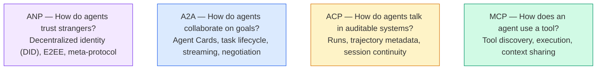

Onlar rekabetçi değiller. Farklı seviyelerde farklı sorunları çözüyorlar.

>  Onlar rekabetçi değildirler.  Onlar farklı seviyelerde farklı sorunları çözmektedirler.

Gerçek bir üretim sistemi birden fazla protokolü birlikte kullanır: organınızdaki araçlar için MCP, ajan işbirliği için A2A, uyumluluk için ACP tarzı yörüngeler kaydesi, organize bir kimlik için ANP. Birini seçmek ve her şeyi zorlamak kaygı nedeniyle karıştırmaktan daha kötü bir sistem üretir.

> Gerçek üretim sistemleri bir araya gelmek çoklu protokol kullanır: MCP örgüt içi araçlar için kullanılır A2A için kullanılır Ajan işbirliği için kullanılır ACP tarzı için kullanılır Trajectory diary için kullanılır Anp için örgütler arası olarak kullanılır Seçim bir ve zorla her şeyi oluşturur odak noktası karışımı için daha kötü bir sistem oluşturur.

### MCP (Yedekleme)

MCP'nin derinlemesine kapsamlı olduğu 13. aşamada.**client-server**Bir sunucu tarafından açıklanan araçları ajanın (klientin) keşfetmesi ve çağrısı yapan protokol.

> MCP'nin 13 aşamasında derinlemesine açıklamalar var.**客户端-服务器**协议,Agent(客户端) bulduk并调用服务器暴露的工具──

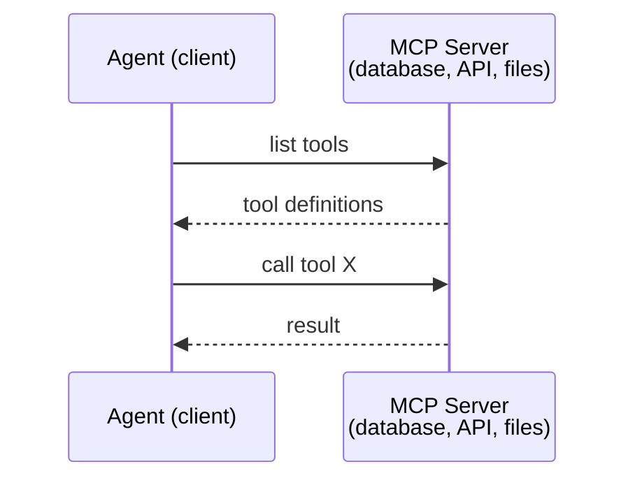

MCP **agent-to-tool**Bu ajanların birbirleriyle konuşmasına yardımcı olmaz.

> MCP**Agent 到工具**Bu, ajanın birbirleriyle iletişim kurmasına yardımcı olamaz.

Diki/yüzel bölünme temizdir: MCP dikey tel (örnek araçlara/verilere ulaşır); A2A yatay tel (örnek akımlara ulaşır).

> 垂直/水平分离清晰:MCP is vertical line;;Agent向下到达工具/数据);A2A is horizontal line;;Agent 横向到达对等 Agent);;

### A2A (Agent2Agent Protokolü)

**Created by:**Google (şimdi Linux Vakfı altında `lf.a2a.v1`)
**Spec version:**1.0.0
**Problem:**Özerk ajanlar nasıl işbirliği yaparlar, müzakere ederler ve görevleri birbirlerine nasıl delegelerler?

> **创建者：**Google(现由 Linux Foundation 管理为 `lf.a2a.v1`)
> **规范版本：**1.0.0
> **问题：**Özgür ajan nasıl işbirliği, danışma ve birbirine görev vermeye çalışır?

A2A , protokolün bir parçasıdır .**peer-to-peer agent collaboration**MCP bir ajanı araçlara bağladığında, A2A bir ajanı diğer ajanlara bağlar.**Agent Card**Bilinen bir URL'de, diğer ajanlar görevleri keşfeder, müzakere eder ve ona devreder.

> A2A**点对点 Agent 协作**A2A A2A A2A A2A A2A A2A A2A A2A A2A A2A A2A A2A A2A A2A A2A A2A A2A A2A A2A A2A A2A A2A A2A A2A A2A A2A A2A A2A A2A A2A A2A A2A A2A A2A A2A A2A A2A A2A A2A A2A A2A A2A A2A A2A A2A A2A A2A A2A A2A A2A A2A A2A A2A A2A A2A A2A A2A A2A A2A A2A A2A A2A A2A A2A A2A A2A A2A A2A A2A A2A A2A A2A A2A A2A A2A A2A A2A A2A A2A A2A A2A A2A A2A A2A A2A A2A A2A A2A A2A A2A A2A A2A A2A A2A A2A A2A A2A A2A A2A A2A A2A A2A A2A A2A A2A A2A A2A A2A A2A A2A2A A2A2A2A2A2A2A2A2A2A2A2A2A2A2A2A2A2A2A2A2A2A2A2A2A2A2A2A2A2A2A2A2A2A2A2A2A2A2A2A2A2A2A2A2A2A2A2A2A2A2A2A2A2A2A2A2A2A2A2A2A2A2A2A2A2A2A2A2A2A2A2A2A2A2A2A2A2A2A2A2A2A2A2A2A2A2A2A2A2**Agent 卡片**Diğer ajanlar, görevlerini tespit edebilir, görüşebilir ve görevlerini görevlendirebilir.

#### A2A Nasıl Çalışır

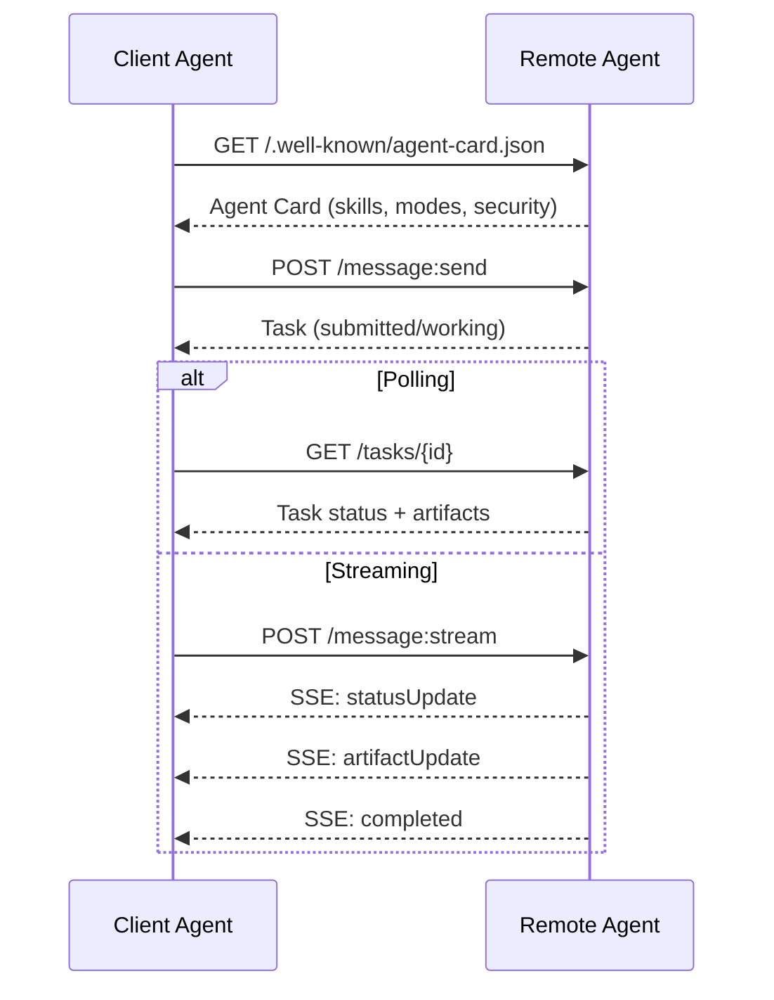

#### Gerçek Ajan Kartı

A2A ajan kartı doğada böyle görünüyor.`GET /.well-known/agent-card.json`- ...

```json
{
  "name": "Research Agent",
  "description": "Searches documentation and summarizes findings",
  "version": "1.0.0",
  "supportedInterfaces": [
    {
      "url": "https://research-agent.example.com/a2a/v1",
      "protocolBinding": "JSONRPC",
      "protocolVersion": "1.0"
    },
    {
      "url": "https://research-agent.example.com/a2a/rest",
      "protocolBinding": "HTTP+JSON",
      "protocolVersion": "1.0"
    }
  ],
  "provider": {
    "organization": "Your Company",
    "url": "https://example.com"
  },
  "capabilities": {
    "streaming": true,
    "pushNotifications": false
  },
  "defaultInputModes": ["text/plain", "application/json"],
  "defaultOutputModes": ["text/plain", "application/json"],
  "skills": [
    {
      "id": "web-research",
      "name": "Web Research",
      "description": "Searches the web and synthesizes findings",
      "tags": ["research", "search", "summarization"],
      "examples": ["Research the latest changes in React 19"]
    },
    {
      "id": "doc-analysis",
      "name": "Documentation Analysis",
      "description": "Reads and analyzes technical documentation",
      "tags": ["docs", "analysis"],
      "inputModes": ["text/plain", "application/pdf"],
      "outputModes": ["application/json"]
    }
  ],
  "securitySchemes": {
    "bearer": {
      "httpAuthSecurityScheme": {
        "scheme": "Bearer",
        "bearerFormat": "JWT"
      }
    }
  },
  "security": [{ "bearer": [] }]
}
```

Dikkat edilmesi gereken önemli şeyler:
- **Skills**Bu, bir istemci ajansının isteklerini ele alabilmeyeceğini belirler.
  Çeviri:**技能**Bu, bir ajanın yapabileceği bir şey. Her birinin bir kimliği vardır. Etiketler ve desteklenen MIME türü.
- **supportedInterfaces**Tek bir ajan aynı anda JSON-RPC, REST ve gRPC konuşabilir.
  Çeviri:**supportedInterfaces**列出多个协议绑定──单个代理可以同时使用JSON-RPC、REST 和 gRPC──
- **Security**Müşteri tek bir talebi yapmadan önce neye ihtiyacı olduğunu bilir.
  Çeviri:**安全性**Bu da bir tek istek göndermeden önce müşteriye neyin gerekli olduğunu gösterir.

#### Görev Yaşam Çeviri

Görevler A2A'nın temel çalışma birimidir.

> 任务 is the core work unit in A2A. Bunlar tanımlanmış durumlar arasında dönüştürülür:

A2A'yı basit bir RPC'den ayıran durum makinesi. Bir görev duraklayabilir (gönüllü girme gereklidir), devam edebilir (klient girme sağlar), başarısız olabilir veya iptal edilebilir.

> 状态机是 A2A 与简单 RPC 之间的不同之处──任务可以暂停(输入-required) 恢复(客户端提供输入) 、失败或取消──客户端不需要阻塞;它轮询或订阅更新──

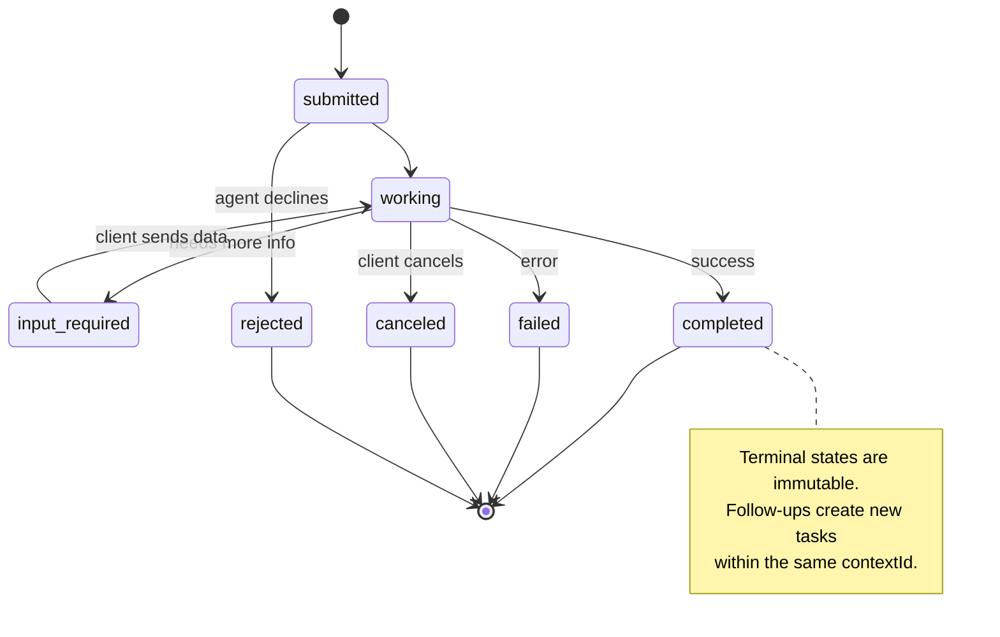

Tüm 8 devlet (spektrin aynı zamanda tanımladığı `UNSPECIFIED`Burada atılan bir bekçi olarak:

> Bütün 8 devlet kuralları da tanımlandı.`UNSPECIFIED`Bir asker olarak, burada bir bölge olarak:

| State | Terminal? | Meaning / 含义 |
|---|---|---|
| `TASK_STATE_SUBMITTED` | No | Acknowledged, not yet processing / 已确认，尚未处理 |
| `TASK_STATE_WORKING` | No | Actively being processed / 正在处理 |
| `TASK_STATE_INPUT_REQUIRED` | No | Agent needs more info from client / Agent 需要客户端更多信息 |
| `TASK_STATE_AUTH_REQUIRED` | No | Authentication needed / 需要认证 |
| `TASK_STATE_COMPLETED` | Yes | Finished successfully / 成功完成 |
| `TASK_STATE_FAILED` | Yes | Finished with error / 出错完成 |
| `TASK_STATE_CANCELED` | Yes | Canceled before completion / 完成前取消 |
| `TASK_STATE_REJECTED` | Yes | Agent declined the task / Agent 拒绝任务 |

Terminal durumları (bitmiş, başarısız, iptal edilmiş, reddedilmiş) değişmez  bir görev bir göreve ulaştığında, daha fazla güncelleme izin verilmez. Takip çalışmaları aynı görevde yeni bir görev oluşturmalıdır `contextId`Sessiyon devamlılığını korumak için.

> 终态 (bunu tamamladı, başarısız oldu, iptal edildi, reddedildi) değişmez bir durumdur.`contextId`Yeni görevler oluşturarak toplantıların devamlılığını sürdürmek için.

Bir görev son durumuna ulaştığında değişmez. Daha fazla mesaj yok. Takipler aynı görev içinde yeni bir görev oluşturur.`contextId`- Evet .

> Bir görev sona erdiğinde, değişmez.`contextId`Yeni bir görev oluşturmak.

#### Kablo Formatı

A2A JSON-RPC 2.0 kullanıyor. Gerçek mesaj değişimi nasıl görünüyor:

**Client sends a task:**
```json
{
  "jsonrpc": "2.0",
  "id": 1,
  "method": "SendMessage",
  "params": {
    "message": {
      "messageId": "msg-001",
      "role": "ROLE_USER",
      "parts": [{ "text": "Research React 19 compiler features" }]
    },
    "configuration": {
      "acceptedOutputModes": ["text/plain", "application/json"],
      "historyLength": 10
    }
  }
}
```

**Agent responds with a task:**
```json
{
  "jsonrpc": "2.0",
  "id": 1,
  "result": {
    "task": {
      "id": "task-abc-123",
      "contextId": "ctx-xyz-789",
      "status": {
        "state": "TASK_STATE_COMPLETED",
        "timestamp": "2026-03-27T10:30:00Z"
      },
      "artifacts": [
        {
          "artifactId": "art-001",
          "name": "research-results",
          "parts": [{
            "data": {
              "findings": [
                "React 19 compiler auto-memoizes components",
                "No more manual useMemo/useCallback needed",
                "Compiler runs at build time, not runtime"
              ]
            },
            "mediaType": "application/json"
          }]
        }
      ]
    }
  }
}
```

**Streaming via SSE:**
```text
POST /message:stream HTTP/1.1
Content-Type: application/json
A2A-Version: 1.0

data: {"task":{"id":"task-123","status":{"state":"TASK_STATE_WORKING"}}}

data: {"statusUpdate":{"taskId":"task-123","status":{"state":"TASK_STATE_WORKING","message":{"role":"ROLE_AGENT","parts":[{"text":"Searching documentation..."}]}}}}

data: {"artifactUpdate":{"taskId":"task-123","artifact":{"artifactId":"art-1","parts":[{"text":"partial findings..."}]},"append":true,"lastChunk":false}}

data: {"statusUpdate":{"taskId":"task-123","status":{"state":"TASK_STATE_COMPLETED"}}}
```

### AKT (Agent İletişim Protokolü)

**Created by:**IBM / BeeAI
**Spec version:**0.2.0 (OpenAPI 3.1.1)
**Status:**Linux Vakfı altında A2A'ya birleşme
**Problem:**Ajanlar tam denetim, seans devamlılığı ve yörenin takip edilmesi ile nasıl iletişim kurarlar?

> **创建者：**IBM / BeeAI
> **规范版本：**0.2.0 (OpenAPI 3.1.1)
> **状态：**Linux Foundation'ın A2A'sında birleştirildi .
> **问题：**Ajan nasıl tamamen kontrol edilebilir bir toplantı ve izleme ortamında iletişim kurar?

ACP'dir.**enterprise protocol**Birçok özetin iddia ettiği aksine, ACP'nin yaptığı **not**JSON-LD kullanın. Bu açık API'den açık bir REST/JSON API'dir.**TrajectoryMetadata**: her ajan cevabı, onu üreten akıl yürütme adımlarının ve araç çağrılarının ayrıntılı bir günlük taşıyabilir.

> ACP**企业协议**                                                                                                                                                                                                                                                              **不**JSON-LD kullanın. Bu OpenAPI tarafından tanımlanan basit REST/JSON API'dir.**TrajectoryMetadata**Her Ajanın yanıtları, kendi üzerinde taşınır.

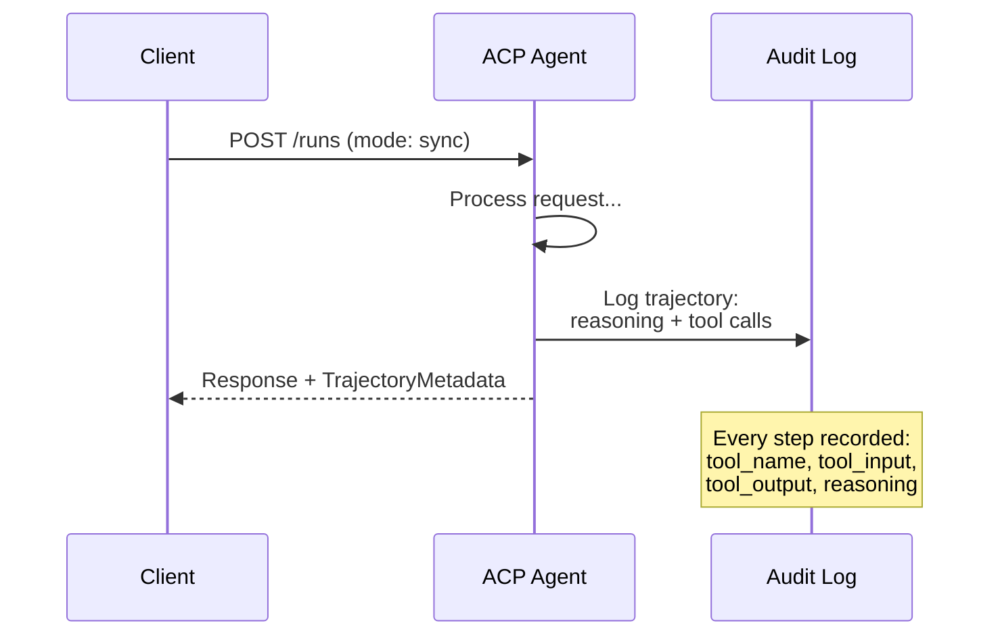

#### AKC'de bulunan Ajan Discovery

ACP dört keşif yöntemini tanımlar:

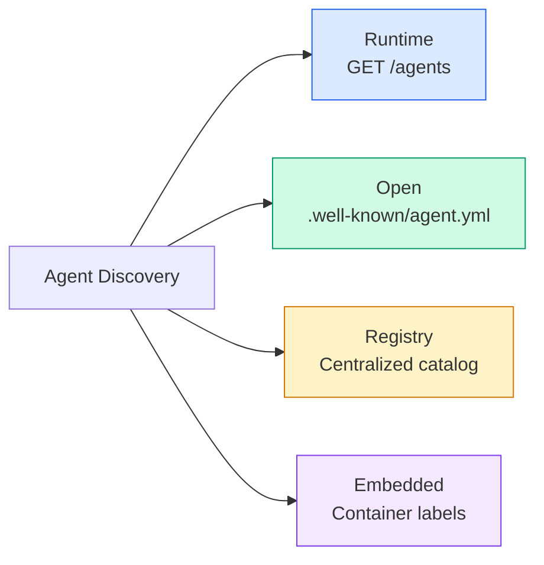

- Evet .**AgentManifest**A2A'nın ajan kartından daha basit:

> **AgentManifest**A2A'nın ajan kartından daha basit:

```json
{
  "name": "summarizer",
  "description": "Summarizes documents with source citations",
  "input_content_types": ["text/plain", "application/pdf"],
  "output_content_types": ["text/plain", "application/json"],
  "metadata": {
    "tags": ["summarization", "RAG"],
    "framework": "BeeAI",
    "capabilities": [
      {
        "name": "Document Summarization",
        "description": "Condenses long documents into key points"
      }
    ],
    "recommended_models": ["llama3.3:70b-instruct-fp16"],
    "license": "Apache-2.0",
    "programming_language": "Python"
  }
}
```

Protokol bağlamaları (tek REST API), güvenlik sistemleri (server seviyesine aktarılmış), beceri listesi (eğitimler düz metadadır).

> 没有协议绑定(单一 REST API) 没有安全方案(委托给服务器级别) 没有技能列表(能力是平元数据) 权衡:部署更简单,自描述性较差──

#### Yaşam Dönemi

ACP, "Taşlar" yerine "Runs" kullanır.

> ACP'de "Task" yerine "Runs" kullanılır.

| Mode | Behavior |
|---|---|
| `sync` | Blocking. Response contains the complete result. |
| `async` | Returns 202 immediately. Poll `GET /runs/{id}` for status. |
| `stream` | SSE stream. Events fire as the agent works. |

> # Davranış şekli #
> - Hayır, hayır.
> - Hayır .`sync`# Bloklama. # Reaksiyon tam sonuç içerir. #
> - Hayır .`async`202'ye dön.`GET /runs/{id}`Durumunuzu elde edin.
> - Hayır .`stream`# SSSE 流♪ olayı ajan 工作触发♪

Mod seçimi kullanıcı deneyim gereksinimlerini haritası: hızlı sorgular için senkronize, arka plan işleri için async, kullanıcı ilerleme göstergeleri istediği uzun süreli görevler için akış.

> 模式选择映射到用户体验需求:sync 用于快速查询,async 用于后台作业,stream 用于用户想要进度指示的长时间运行任务──

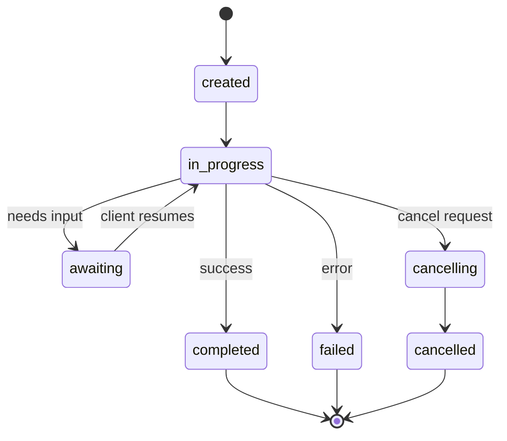

#### YoluMetadata (Audit Yolları)

Bu ACP'nin temel farkı. Her mesaj parçası, ajanın tam olarak ne yaptığını gösteren metadataları içerebilir:

```json
{
  "role": "agent/researcher",
  "parts": [
    {
      "content_type": "text/plain",
      "content": "The weather in San Francisco is 72F and sunny.",
      "metadata": {
        "kind": "trajectory",
        "message": "I need to check the weather for this location",
        "tool_name": "weather_api",
        "tool_input": { "location": "San Francisco, CA" },
        "tool_output": { "temperature": 72, "condition": "sunny" }
      }
    }
  ]
}
```

Düzenlenmiş endüstriler için bu altın. Her cevap kanıtlanabilir bir mantık zinciri ile gelir: hangi araçlar çağrıldı, hangi girişler kullanıldı, hangi çıkışlar alındı.

>  Kontrol altındaki sektör için, bu değersiz bir hazine. Her cevapta kanıtlanabilir bir düşünce zinciri vardır: hangi araçları kullanıldı, hangi girişleri kullanıldı, hangi çıkışları aldı.

Bankalar, sağlık hizmetleri ve hükümetlerin dağıtımları bu tür denetim yapabilmeyi gerektirir. ACP'nin yörüngesi metadataları bu ortamlarda LLM ajanlarını kabul edilebilir kılan şeydir.

> Banka, sağlık ve hükümet dağıtımları bu denetim yapabilme ihtiyacı taşır.

ACP ayrıca **CitationMetadata**Kaynak atıfı için:

> AKT desteği**CitationMetadata**Kaynaklar:

```json
{
  "kind": "citation",
  "start_index": 0,
  "end_index": 47,
  "url": "https://weather.gov/sf",
  "title": "NWS San Francisco Forecast"
}
```

### ANP (Agent Ağ Protokolü)

**Created by:**Açık kaynaklı topluluk (GaoWei Chang tarafından kurulmuştur)
**Repo:** [github.com/agent-network-protocol/AgentNetworkProtocol](https://github.com/agent-network-protocol/AgentNetworkProtocol)
**Problem:**Farklı kuruluşların ajanları merkezi bir yetki olmadan nasıl birbirlerine güvenirler?

> **创建者：**开源社区(由高威长创立)
> **代码库：** [github.com/agent-network-protocol/AgentNetworkProtocol](https://github.com/agent-network-protocol/AgentNetworkProtocol)
> **问题：**Bir merkez yetkisi olmadan farklı örgütlü ajanlar nasıl birbirlerine güvenirler?

ANP'nin adı **decentralized identity protocol**W3C Merkezi Tanımlayıcıları (DID) ve uçtan sona şifreleme kullanarak güven oluşturur. A2A'nın aksine, bilinen uç noktaları üzerinden ajanları keşfetmek için, ANP ajanların kimliklerini kriptografik olarak kanıtlamalarını sağlar.

> ANP**去中心化身份协议** W3C Decentralized Identifier (DID) ve End to End Gizli Güvenilirlik Kurmak için Kullanılıyor.

ANP üç katmanlı:

> ANP'de üç aşama vardır:

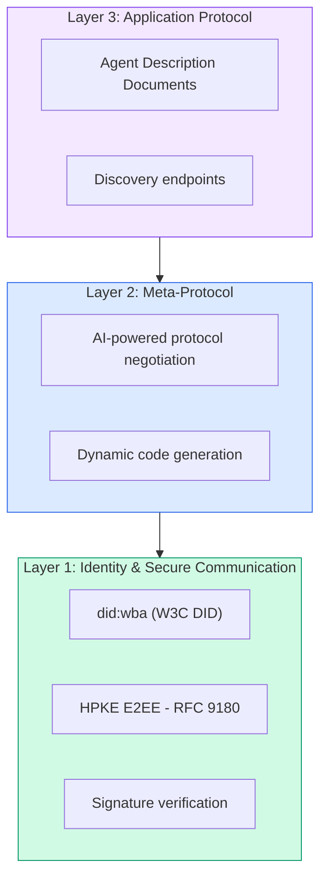

#### DID belgeleri (gerçek yapı)

ANP ,  adı verilen özel bir DID yöntemi kullanır .`did:wba`(Web Temel Ajan)`did:wba:example.com:user:alice`karar verir `https://example.com/user/alice/did.json`- ...

```json
{
  "@context": [
    "https://www.w3.org/ns/did/v1",
    "https://w3id.org/security/suites/jws-2020/v1",
    "https://w3id.org/security/suites/secp256k1-2019/v1"
  ],
  "id": "did:wba:example.com:user:alice",
  "verificationMethod": [
    {
      "id": "did:wba:example.com:user:alice#key-1",
      "type": "EcdsaSecp256k1VerificationKey2019",
      "controller": "did:wba:example.com:user:alice",
      "publicKeyJwk": {
        "crv": "secp256k1",
        "x": "NtngWpJUr-rlNNbs0u-Aa8e16OwSJu6UiFf0Rdo1oJ4",
        "y": "qN1jKupJlFsPFc1UkWinqljv4YE0mq_Ickwnjgasvmo",
        "kty": "EC"
      }
    },
    {
      "id": "did:wba:example.com:user:alice#key-x25519-1",
      "type": "X25519KeyAgreementKey2019",
      "controller": "did:wba:example.com:user:alice",
      "publicKeyMultibase": "z9hFgmPVfmBZwRvFEyniQDBkz9LmV7gDEqytWyGZLmDXE"
    }
  ],
  "authentication": [
    "did:wba:example.com:user:alice#key-1"
  ],
  "keyAgreement": [
    "did:wba:example.com:user:alice#key-x25519-1"
  ],
  "humanAuthorization": [
    "did:wba:example.com:user:alice#key-1"
  ],
  "service": [
    {
      "id": "did:wba:example.com:user:alice#agent-description",
      "type": "AgentDescription",
      "serviceEndpoint": "https://example.com/agents/alice/ad.json"
    }
  ]
}
```

Dikkat edilmesi gereken önemli şeyler:
- **Key separation**İmza anahtarları (secp256k1) şifrelenme anahtarlarından (X25519) ayrıdır.
  Çeviri:**密钥分离**Bu, bir diğer konularda da geçerlidir.
- **`humanAuthorization`**Bu anahtarlar kullanmadan önce açık bir insan onayına (biometrik, şifre, HSM) ihtiyaç duyar.
  Çeviri:**`humanAuthorization`**Bu anahtarlar kullanmadan önce belirlenmiş insan onayına ihtiyaç duyarlar.
- **`keyAgreement`**HPKE uçtan uç şifreleme için anahtarlar kullanılır (RFC 9180).
  Çeviri:**`keyAgreement`**密钥用于HPKE 端到端加密(RFC 9180)。
- - Evet .**service**Bölümde ajan tanımlama belgesine bağlantılar bulunmaktadır.
  Çeviri:**service**部分链接到 Ajan 描述文档──

Anahtar ayrım örneği gerçek dünya kripto sistemlerinin gerektirdiği şeydir ancak JSON protokolleri genellikle atlar. ANP onu zorlar çünkü organizasyonlararası ajanlar para, sözleşmeler ve PII ile başa çıkıyor.

> Anahtar ayrım modeli gerçek bir şifre sistemi tarafından talep edilir, ancak JSON protokolü sık sık atlıyor. ANP zorla gerçekleştirir, çünkü organizasyonlararası ajanlar para, sözleşmeler ve PII'ler ile işlemeyi halletir.

#### ANP'de Güven Nasıl Çalışır

ANP yapıyor.**not**Güvenin web-of-trust veya onaylama grafikini kullanın. Güven iki taraflı ve etkileşime göre doğrulanır:

> ANP **不**İncedi iki taraflı, her görüşme için geçerli:

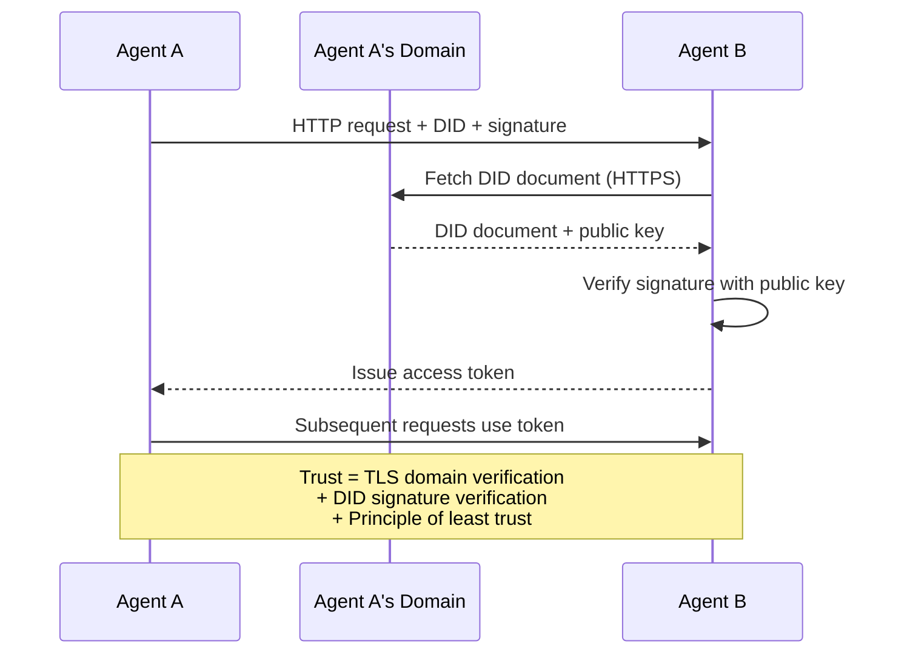

Güven üç kaynaktan gelir:
1. **Domain-level TLS**DID belgesinin ev sahibi doğrulanır
   Çeviri:**域级 TLS**验证 DID 文档主机
2. **DID cryptographic signatures**ajanın kimliğini doğrula
   Çeviri:**DID 加密签名**验证 Ajanın Kimliği
3. **Principle of least trust**Sadece en az izinler verir.
   Çeviri:**最小信任原则**Sadece en az bir hak veriliyor.

Üç kaynaklı tasarım, tek bir başarısızlık noktasını önler. TLS tek başına yetersizdir (bir sertifika olan herkes bir DID'yi barınağı yapabilir). DID tek başına yetersizdir (çalınan bir anahtar kimliği sahteleştirir). En az güvenli yetki ile birleştirildiğinde, merkezi bir yetki olmadan derin bir savunma elde edersiniz.

> Üç kaynak tasarımı tek bir noktayı başarısızlığa uğratmadı. Sadece TLS yetersiz.

İpuçlara dayalı güven yayımı ya da PageRank puanlaması yok.

> 没有基于八的信任传播或 PageRank 评分──你直接通过 DID 验证每个代理──

#### Meta-Protokol müzakere

Bu ANP'nin en yeni özelliği. Farklı ekosistemlerden iki ajan buluştuğunda, önceden anlaşılmış veri biçimlerine ihtiyaçları yoktur.

> Bu ANP'nin en yeni işlevi. Farklı ekosistemlerden iki ajan bir araya geldiğinde, önceden belirlenmiş bir veri biçimi gerektirmez.

```json
{
  "action": "protocolNegotiation",
  "sequenceId": 0,
  "candidateProtocols": "I can communicate using:\n1. JSON-RPC with hotel booking schema\n2. REST with OpenAPI 3.1 spec\n3. Natural language over HTTP",
  "modificationSummary": "Initial proposal",
  "status": "negotiating"
}
```

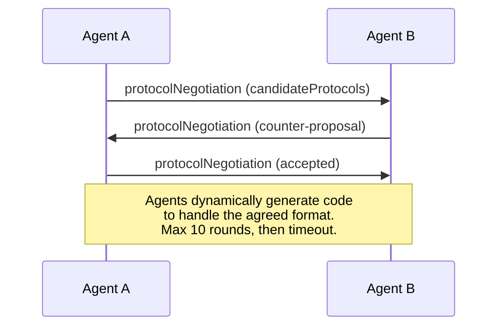

Ajanlar bir biçim üzerinde anlaşıncaya kadar ileri-geri (maksimum 10 atış) giderler, sonra da onu yönetmek için dinamik bir kod oluştururlar.`negotiating`- Evet .`rejected`- Evet .`accepted`- Evet .`timeout`- Evet .

> Agent, bir anlaşma yapana kadar en fazla 10 kez görüşmeye geri döner.`negotiating`(协商中)`rejected`(Kahkahalar)`accepted`( Kabul)`timeout`(超时)

Bu, daha önce hiç görüşmemiş iki ajanın, ortak bir şema önceden tanımlamadan nasıl iletişim kuracağını anlayabilmeleri anlamına gelir.

> Bu, hiç görülmemiş iki ajanın, kimseyi tanımlamadan paylaşım modunu nasıl bulacağını gösterir.

Görüş: herhangi bir ajanın daha önce birleştirme çalışması olmadan herhangi bir diğer ajanla konuşabildiği açık bir ajan web. Bu oyuncak gösterimlerinin ötesine uzanır mı, 2026 açıktır.

> 愿景: Open Agent 网络中的任何 Agent 临时对话,无需前期集成工作. 视景: Open Agent 网络中的任何 Agent 其他 Agent 临时对话,无需前期集成工作.

### Karşılaştırma (Düzeltilmiş)

| | MCP | A2A | ACP | ANP |
|---|---|---|---|---|
| **Created by** | Anthropic | Google / Linux Foundation | IBM / BeeAI | Community |
| **Spec format** | JSON-RPC | JSON-RPC / REST / gRPC | OpenAPI 3.1 (REST) | JSON-RPC |
| **Primary use** | Agent to Tool | Agent to Agent | Agent to Agent | Agent to Agent |
| **Discovery** | Tool listing | `/.well-known/agent-card.json` | `GET /agents`, `/.well-known/agent.yml` | `/.well-known/agent-descriptions`, DID service endpoints |
| **Identity** | Implicit (local) | Security schemes (OAuth, mTLS) | Server-level | W3C DID (`did:wba`) with E2EE |
| **Audit trail** | N/A | Basic (task history) | TrajectoryMetadata (tool calls, reasoning) | Not formally specified |
| **State machine** | N/A | 9 task states | 7 run states | N/A |
| **Streaming** | N/A | SSE | SSE | Transport-agnostic |
| **Unique feature** | Tool schemas | Agent Cards + Skills | Trajectory audit trail | Meta-protocol negotiation |
| **Best for** | Tools & data | Dynamic collaboration | Regulated industries | Cross-org trust |
| **Status** | Stable | Stable (v1.0) | Merging into A2A | Active development |

### Birlikte Nasıl Çalışırlar

Bu protokoller birbirini kapsaymaz. Gerçekçi bir işletme sistemi birden fazla kullanır:

> Bu anlaşmalar birbirinden uzak değildir.

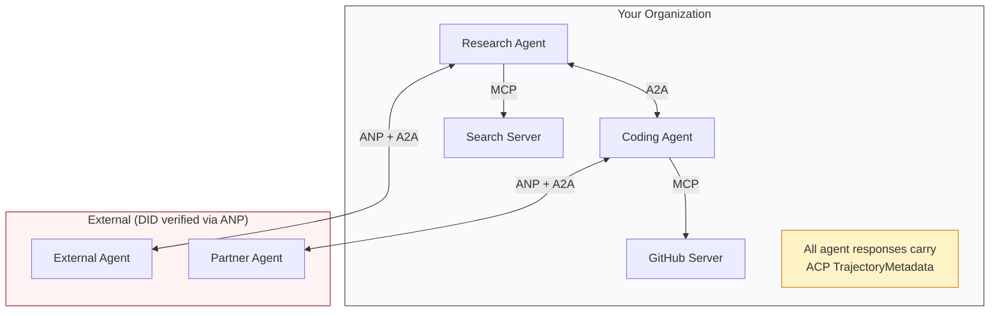

- **MCP**Her ajanı aletlerine bağlar.
  Çeviri:**MCP**Her ajanı araçlarıyla bağlayacağız .
- **A2A**(İçi ve dış) ajanlar arasındaki işbirliğiyi ele alır.
  Çeviri:**A2A**处理 Agent 之间协作(内部和外部)
- **ACP**Denetim edilebilirlik için cevapları trajektör metadatalarında sarar
  Çeviri:**ACP**İletişimsellik için yollardaki veri paketleme yanıtları kullan
- **ANP**Kontrol etmediğiniz ajanlar için kimlik doğrulama sağlar.
  Çeviri:**ANP**Kontrolsüz bir ajan , kimlik doğrulama belgesi sağlıyor .

## Yapın.
```figure
swarm-message-bus
```

## Yapın

### Adım 1: Temel Mesaj Türleri

Her çoklu ajan sistemi bir mesaj biçimi ile başlar. Gerçek protokollerin kullandığı harita türlerini tanımlarız:

> Her bir Ajan  Sistemleri mesaj biçiminde başlıyor.

```typescript
import crypto from "node:crypto";

type MessageRole = "user" | "agent";

type MessagePart =
  | { kind: "text"; text: string }
  | { kind: "data"; data: unknown; mediaType: string }
  | { kind: "file"; name: string; url: string; mediaType: string };

type TrajectoryEntry = {
  reasoning: string;
  toolName?: string;
  toolInput?: unknown;
  toolOutput?: unknown;
  timestamp: number;
};

type AgentMessage = {
  id: string;
  role: MessageRole;
  parts: MessagePart[];
  trajectory?: TrajectoryEntry[];
  replyTo?: string;
  timestamp: number;
};

function createMessage(
  role: MessageRole,
  parts: MessagePart[],
  replyTo?: string
): AgentMessage {
  return {
    id: crypto.randomUUID(),
    role,
    parts,
    replyTo,
    timestamp: Date.now(),
  };
}

function textMessage(role: MessageRole, text: string): AgentMessage {
  return createMessage(role, [{ kind: "text", text }]);
}
```

Not: `MessagePart`A2A ve ACP özellikleri gibi multimodal (metin, yapılandırılmış veriler, dosyalar) `TrajectoryEntry`AKT'in TrajectoryMetadata'sına eşleşen akıl zinciri yakalar.

> Dikkat:`MessagePart`Bu, gerçek A2A ve ACP kuralları gibi bir tür tür metin, yapılandırılmış veri ve dosya.`TrajectoryEntry`捕获推理链,匹配 ACP's TrajectoryMetadata

### Adım 2: A2A Ajan Kartı ve Kayıt

Gerçek A2A özelliklerine uyan bir ajan keşfi yapın:

> 构建匹配真 A2A 规范的代理 发现:

```typescript
type Skill = {
  id: string;
  name: string;
  description: string;
  tags: string[];
  inputModes: string[];
  outputModes: string[];
};

type AgentCard = {
  name: string;
  description: string;
  version: string;
  url: string;
  capabilities: {
    streaming: boolean;
    pushNotifications: boolean;
  };
  defaultInputModes: string[];
  defaultOutputModes: string[];
  skills: Skill[];
};

class AgentRegistry {
  private cards: Map<string, AgentCard> = new Map();

  register(card: AgentCard) {
    this.cards.set(card.name, card);
  }

  discoverBySkillTag(tag: string): AgentCard[] {
    return [...this.cards.values()].filter((card) =>
      card.skills.some((skill) => skill.tags.includes(tag))
    );
  }

  discoverByInputMode(mimeType: string): AgentCard[] {
    return [...this.cards.values()].filter(
      (card) =>
        card.defaultInputModes.includes(mimeType) ||
        card.skills.some((skill) => skill.inputModes.includes(mimeType))
    );
  }

  resolve(name: string): AgentCard | undefined {
    return this.cards.get(name);
  }

  listAll(): AgentCard[] {
    return [...this.cards.values()];
  }
}
```

Bu basit bir isim-ya da yetenek haritasından daha zengin. A2A özelliklerinin desteklediği gibi yetenek etiketleri, giriş MIME türleri veya isimle ajanları keşfedebilirsiniz.

> Bu basit bir isimden yetenek haritalama'ya kadar çok daha zengin bir şey. MIME türünü veya adı A2A'nın gerçek bir kuralına benzer şekilde bir yetenek etiketinden 輸入 edebilir.

### Adım 3: A2A Görev Yaşam Dönemi

Tam görev durum makinesini oluştur:

> 构建完整的任务状态机:

```typescript
type TaskState =
  | "submitted"
  | "working"
  | "input-required"
  | "auth-required"
  | "completed"
  | "failed"
  | "canceled"
  | "rejected";

const TERMINAL_STATES: TaskState[] = [
  "completed",
  "failed",
  "canceled",
  "rejected",
];

type TaskStatus = {
  state: TaskState;
  message?: AgentMessage;
  timestamp: number;
};

type Artifact = {
  id: string;
  name: string;
  parts: MessagePart[];
};

type Task = {
  id: string;
  contextId: string;
  status: TaskStatus;
  artifacts: Artifact[];
  history: AgentMessage[];
};

type TaskEvent =
  | { kind: "statusUpdate"; taskId: string; status: TaskStatus }
  | {
      kind: "artifactUpdate";
      taskId: string;
      artifact: Artifact;
      append: boolean;
      lastChunk: boolean;
    };

type TaskHandler = (
  task: Task,
  message: AgentMessage
) => AsyncGenerator<TaskEvent>;

class TaskManager {
  private tasks: Map<string, Task> = new Map();
  private handlers: Map<string, TaskHandler> = new Map();
  private listeners: Map<string, ((event: TaskEvent) => void)[]> = new Map();

  registerHandler(agentName: string, handler: TaskHandler) {
    this.handlers.set(agentName, handler);
  }

  subscribe(taskId: string, listener: (event: TaskEvent) => void) {
    const existing = this.listeners.get(taskId) ?? [];
    existing.push(listener);
    this.listeners.set(taskId, existing);
  }

  async sendMessage(
    agentName: string,
    message: AgentMessage,
    contextId?: string
  ): Promise<Task> {
    const handler = this.handlers.get(agentName);
    if (!handler) {
      const task = this.createTask(contextId);
      task.status = {
        state: "rejected",
        timestamp: Date.now(),
        message: textMessage("agent", `No handler for ${agentName}`),
      };
      return task;
    }

    const task = this.createTask(contextId);
    task.history.push(message);
    task.status = { state: "submitted", timestamp: Date.now() };

    this.processTask(task, handler, message).catch((err) => {
      task.status = {
        state: "failed",
        timestamp: Date.now(),
        message: textMessage("agent", String(err)),
      };
    });
    return task;
  }

  getTask(taskId: string): Task | undefined {
    return this.tasks.get(taskId);
  }

  cancelTask(taskId: string): boolean {
    const task = this.tasks.get(taskId);
    if (!task || TERMINAL_STATES.includes(task.status.state)) return false;
    task.status = { state: "canceled", timestamp: Date.now() };
    this.emit(taskId, {
      kind: "statusUpdate",
      taskId,
      status: task.status,
    });
    return true;
  }

  private createTask(contextId?: string): Task {
    const task: Task = {
      id: crypto.randomUUID(),
      contextId: contextId ?? crypto.randomUUID(),
      status: { state: "submitted", timestamp: Date.now() },
      artifacts: [],
      history: [],
    };
    this.tasks.set(task.id, task);
    return task;
  }

  private async processTask(
    task: Task,
    handler: TaskHandler,
    message: AgentMessage
  ) {
    task.status = { state: "working", timestamp: Date.now() };
    this.emit(task.id, {
      kind: "statusUpdate",
      taskId: task.id,
      status: task.status,
    });

    try {
      for await (const event of handler(task, message)) {
        if (TERMINAL_STATES.includes(task.status.state)) break;

        if (event.kind === "statusUpdate") {
          task.status = event.status;
        }
        if (event.kind === "artifactUpdate") {
          const existing = task.artifacts.find(
            (a) => a.id === event.artifact.id
          );
          if (existing && event.append) {
            existing.parts.push(...event.artifact.parts);
          } else {
            task.artifacts.push(event.artifact);
          }
        }
        this.emit(task.id, event);
      }
    } catch (err) {
      task.status = {
        state: "failed",
        timestamp: Date.now(),
        message: textMessage("agent", String(err)),
      };
      this.emit(task.id, {
        kind: "statusUpdate",
        taskId: task.id,
        status: task.status,
      });
    }
  }

  private emit(taskId: string, event: TaskEvent) {
    for (const listener of this.listeners.get(taskId) ?? []) {
      listener(event);
    }
  }
}
```

Bu gerçek A2A görev yaşam döngüsünü uyguluyor: gönderilen, çalışan, girme-gerekli, terminal durumları. İşleştiriciler SSE akış modeli ile eşleşen olayları (istatis güncellemeleri ve artefakt parçaları) üreten asink jeneratörlerdir.

> Bu gerçek A2A  görev yaşam döngüsünü gerçekleştirdi: gönderilen, işleyen, giriş gerektiren, son durum. İşleme süreci bir farklı aşama üreticisi, eşleşen SSE 流模型的事件生成 (Statu update和工件块) ⋅

### 4. Adım: AKT tarzı denetim yolu

Yolu izleme ile iletişim kurmak:

> Yolları takip etmek için:

```typescript
type AuditEntry = {
  runId: string;
  agentName: string;
  input: AgentMessage[];
  output: AgentMessage[];
  trajectory: TrajectoryEntry[];
  status: "created" | "in-progress" | "completed" | "failed" | "awaiting";
  startedAt: number;
  completedAt?: number;
  sessionId?: string;
};

class AuditableRunner {
  private log: AuditEntry[] = [];
  private handlers: Map<
    string,
    (input: AgentMessage[]) => Promise<{
      output: AgentMessage[];
      trajectory: TrajectoryEntry[];
    }>
  > = new Map();

  registerAgent(
    name: string,
    handler: (input: AgentMessage[]) => Promise<{
      output: AgentMessage[];
      trajectory: TrajectoryEntry[];
    }>
  ) {
    this.handlers.set(name, handler);
  }

  async run(
    agentName: string,
    input: AgentMessage[],
    sessionId?: string
  ): Promise<AuditEntry> {
    const entry: AuditEntry = {
      runId: crypto.randomUUID(),
      agentName,
      input: structuredClone(input),
      output: [],
      trajectory: [],
      status: "created",
      startedAt: Date.now(),
      sessionId,
    };
    this.log.push(entry);

    const handler = this.handlers.get(agentName);
    if (!handler) {
      entry.status = "failed";
      return entry;
    }

    entry.status = "in-progress";
    try {
      const result = await handler(input);
      entry.output = structuredClone(result.output);
      entry.trajectory = structuredClone(result.trajectory);
      entry.status = "completed";
      entry.completedAt = Date.now();
    } catch (err) {
      entry.status = "failed";
      entry.trajectory.push({
        reasoning: `Error: ${String(err)}`,
        timestamp: Date.now(),
      });
      entry.completedAt = Date.now();
    }
    return entry;
  }

  getFullAuditLog(): AuditEntry[] {
    return structuredClone(this.log);
  }

  getAuditLogForAgent(agentName: string): AuditEntry[] {
    return structuredClone(
      this.log.filter((e) => e.agentName === agentName)
    );
  }

  getAuditLogForSession(sessionId: string): AuditEntry[] {
    return structuredClone(
      this.log.filter((e) => e.sessionId === sessionId)
    );
  }

  getTrajectoryForRun(runId: string): TrajectoryEntry[] {
    const entry = this.log.find((e) => e.runId === runId);
    return entry ? structuredClone(entry.trajectory) : [];
  }
}
```

Her ajan çalışması tam bir denetim girişini oluşturur: ne girdi, ne çıktı ve araç çağrılarının ve bunun arasında düşünme adımlarının tüm trajektörünü.

> Her bir Ajanın gerçekleştirilmesi için tam bir denetim yazısı oluşturulur: ne girdi, ne çıktı, ve araçların kullanılması ve düşünme adımlarının tam bir rotası.

### Adım 5: ANP-Stil Kimlik Doğrulama

DID tabanlı kimlik ve doğrulama oluşturmak:

> DID'ye dayalı bir kimlik ve doğrulama:

```typescript
type VerificationMethod = {
  id: string;
  type: string;
  controller: string;
  publicKeyDer: string;
};

type DIDDocument = {
  id: string;
  verificationMethod: VerificationMethod[];
  authentication: string[];
  keyAgreement: string[];
  humanAuthorization: string[];
  service: { id: string; type: string; serviceEndpoint: string }[];
};

type AgentIdentity = {
  did: string;
  document: DIDDocument;
  privateKey: crypto.KeyObject;
  publicKey: crypto.KeyObject;
};

class IdentityRegistry {
  private documents: Map<string, DIDDocument> = new Map();

  publish(doc: DIDDocument) {
    this.documents.set(doc.id, doc);
  }

  resolve(did: string): DIDDocument | undefined {
    return this.documents.get(did);
  }

  verify(did: string, signature: string, payload: string): boolean {
    const doc = this.documents.get(did);
    if (!doc) return false;

    const authKeyIds = doc.authentication;
    const authKeys = doc.verificationMethod.filter((vm) =>
      authKeyIds.includes(vm.id)
    );

    for (const key of authKeys) {
      const publicKey = crypto.createPublicKey({
        key: Buffer.from(key.publicKeyDer, "base64"),
        format: "der",
        type: "spki",
      });
      const isValid = crypto.verify(
        null,
        Buffer.from(payload),
        publicKey,
        Buffer.from(signature, "hex")
      );
      if (isValid) return true;
    }
    return false;
  }

  requiresHumanAuth(did: string, operationKeyId: string): boolean {
    const doc = this.documents.get(did);
    if (!doc) return false;
    return doc.humanAuthorization.includes(operationKeyId);
  }
}

function createIdentity(domain: string, agentName: string): AgentIdentity {
  const did = `did:wba:${domain}:agent:${agentName}`;
  const { publicKey, privateKey } = crypto.generateKeyPairSync("ed25519");

  const publicKeyDer = publicKey
    .export({ format: "der", type: "spki" })
    .toString("base64");

  const keyId = `${did}#key-1`;
  const encKeyId = `${did}#key-x25519-1`;

  const document: DIDDocument = {
    id: did,
    verificationMethod: [
      {
        id: keyId,
        type: "Ed25519VerificationKey2020",
        controller: did,
        publicKeyDer,
      },
      {
        id: encKeyId,
        type: "X25519KeyAgreementKey2019",
        controller: did,
        publicKeyDer,
      },
    ],
    authentication: [keyId],
    keyAgreement: [encKeyId],
    humanAuthorization: [],
    service: [
      {
        id: `${did}#agent-description`,
        type: "AgentDescription",
        serviceEndpoint: `https://${domain}/agents/${agentName}/ad.json`,
      },
    ],
  };

  return { did, document, privateKey, publicKey };
}

function signPayload(identity: AgentIdentity, payload: string): string {
  return crypto
    .sign(null, Buffer.from(payload), identity.privateKey)
    .toString("hex");
}
```

Bu gerçek ANP kimlik modelini yansıtır: ajanlar ayrı kimlik doğrulama, anahtar anlaşma ve insan yetkisi anahtarları ile DID belgelerine sahiptir.`IdentityRegistry`DID çözünürlüğünü simüle eder (prodüksiyonda bu, ajanın alanına HTTP getirir).

> Bu gerçek ANP kimlik modelini yansıtıyor: Ajan bağımsız bir sertifika, anahtar protokolü ve yapay olarak yetkili anahtarlarla DID dosyasına sahiptir.`IdentityRegistry`模拟 DID 解析 (((in production environment, this will be to Agent 域的 HTTP 获取)

### Adım 6: Protokol Geçidi

Dört protokolü de tek bir sisteme bağlayın:

> Tüm dört protokolü bir sistemle bağlayacağız:

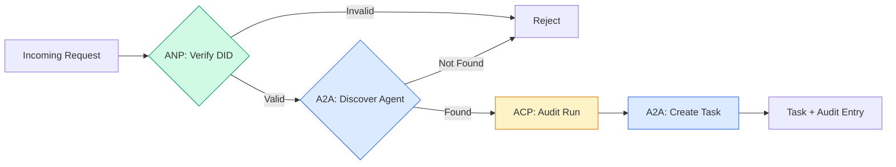

```typescript
class ProtocolGateway {
  private registry: AgentRegistry;
  private taskManager: TaskManager;
  private auditRunner: AuditableRunner;
  private identityRegistry: IdentityRegistry;

  constructor(
    registry: AgentRegistry,
    taskManager: TaskManager,
    auditRunner: AuditableRunner,
    identityRegistry: IdentityRegistry
  ) {
    this.registry = registry;
    this.taskManager = taskManager;
    this.auditRunner = auditRunner;
    this.identityRegistry = identityRegistry;
  }

  async delegateTask(
    fromDid: string,
    signature: string,
    targetAgent: string,
    message: AgentMessage,
    sessionId?: string
  ): Promise<{ task: Task; audit: AuditEntry } | { error: string }> {
    if (!this.identityRegistry.verify(fromDid, signature, message.id)) {
      return { error: "Identity verification failed" };
    }

    const card = this.registry.resolve(targetAgent);
    if (!card) {
      return { error: `Agent ${targetAgent} not found in registry` };
    }

    const audit = await this.auditRunner.run(
      targetAgent,
      [message],
      sessionId
    );
    const task = await this.taskManager.sendMessage(targetAgent, message);

    return { task, audit };
  }

  discoverAndDelegate(
    fromDid: string,
    signature: string,
    skillTag: string,
    message: AgentMessage
  ): Promise<{ task: Task; audit: AuditEntry } | { error: string }> {
    const candidates = this.registry.discoverBySkillTag(skillTag);
    if (candidates.length === 0) {
      return Promise.resolve({
        error: `No agents found with skill tag: ${skillTag}`,
      });
    }
    return this.delegateTask(
      fromDid,
      signature,
      candidates[0].name,
      message
    );
  }
}
```

Kapı bir çağrıda dört şey yapar:
1. **ANP**: DID imzası ile arayanın kimliğini doğruluyor
   Çeviri:**ANP**: DID 签名验证调用者身份 (DID) ile yapılan
2. **A2A**: Hedef ajanı keşfeder ve yeteneklerini kontrol eder
   Çeviri:**A2A**: hedef ajanı tespit etme ve kontrol yeteneği
3. **ACP**: İcracılığı bir denetim izine çevirir ve bir yoldur
   Çeviri:**ACP**: U trajektör audit takip paketleme gerçekleştirmek
4. **A2A**: Tam yaşam döngüsü izleme ile bir görev oluşturur
   Çeviri:**A2A**: Tam bir yaşam döngüsü takip görevleri oluşturmak

### 7 . Adım: Her şeyi bir arada yapın

```typescript
async function protocolDemo() {
  const registry = new AgentRegistry();
  registry.register({
    name: "researcher",
    description: "Searches and summarizes findings",
    version: "1.0.0",
    url: "https://researcher.local/a2a/v1",
    capabilities: { streaming: true, pushNotifications: false },
    defaultInputModes: ["text/plain"],
    defaultOutputModes: ["text/plain", "application/json"],
    skills: [
      {
        id: "web-research",
        name: "Web Research",
        description: "Searches the web",
        tags: ["research", "search", "summarization"],
        inputModes: ["text/plain"],
        outputModes: ["application/json"],
      },
    ],
  });
  registry.register({
    name: "coder",
    description: "Writes code from specs",
    version: "1.0.0",
    url: "https://coder.local/a2a/v1",
    capabilities: { streaming: false, pushNotifications: false },
    defaultInputModes: ["text/plain", "application/json"],
    defaultOutputModes: ["text/plain"],
    skills: [
      {
        id: "code-gen",
        name: "Code Generation",
        description: "Generates code",
        tags: ["coding", "generation"],
        inputModes: ["text/plain", "application/json"],
        outputModes: ["text/plain"],
      },
    ],
  });

  const taskManager = new TaskManager();
  const auditRunner = new AuditableRunner();

  const researchTrajectory: TrajectoryEntry[] = [];

  taskManager.registerHandler(
    "researcher",
    async function* (task, message) {
      yield {
        kind: "statusUpdate" as const,
        taskId: task.id,
        status: { state: "working" as const, timestamp: Date.now() },
      };

      researchTrajectory.push({
        reasoning: "Searching for React 19 documentation",
        toolName: "web_search",
        toolInput: { query: "React 19 compiler features" },
        toolOutput: {
          results: ["react.dev/blog/react-19", "github.com/react/react"],
        },
        timestamp: Date.now(),
      });

      researchTrajectory.push({
        reasoning: "Extracting key findings from search results",
        toolName: "doc_analysis",
        toolInput: { url: "react.dev/blog/react-19" },
        toolOutput: {
          summary:
            "React 19 compiler auto-memoizes, no manual useMemo needed",
        },
        timestamp: Date.now(),
      });

      yield {
        kind: "artifactUpdate" as const,
        taskId: task.id,
        artifact: {
          id: crypto.randomUUID(),
          name: "research-results",
          parts: [
            {
              kind: "data" as const,
              data: {
                findings: [
                  "React 19 compiler auto-memoizes components",
                  "No more manual useMemo/useCallback needed",
                  "Compiler runs at build time, not runtime",
                ],
                sources: ["react.dev/blog/react-19"],
              },
              mediaType: "application/json",
            },
          ],
        },
        append: false,
        lastChunk: true,
      };

      yield {
        kind: "statusUpdate" as const,
        taskId: task.id,
        status: { state: "completed" as const, timestamp: Date.now() },
      };
    }
  );

  auditRunner.registerAgent("researcher", async () => ({
    output: [
      textMessage("agent", "React 19 compiler auto-memoizes components"),
    ],
    trajectory: researchTrajectory,
  }));

  const identityRegistry = new IdentityRegistry();

  const coderIdentity = createIdentity("coder.local", "coder");
  const researcherIdentity = createIdentity("researcher.local", "researcher");

  identityRegistry.publish(coderIdentity.document);
  identityRegistry.publish(researcherIdentity.document);

  const gateway = new ProtocolGateway(
    registry,
    taskManager,
    auditRunner,
    identityRegistry
  );

  console.log("=== Protocol Demo ===\n");

  console.log("1. Agent Discovery (A2A)");
  const researchAgents = registry.discoverBySkillTag("research");
  console.log(
    `   Found ${researchAgents.length} agent(s):`,
    researchAgents.map((a) => a.name)
  );

  console.log("\n2. Identity Verification (ANP)");
  const message = textMessage("user", "Research React 19 compiler features");
  const signature = signPayload(coderIdentity, message.id);
  const verified = identityRegistry.verify(
    coderIdentity.did,
    signature,
    message.id
  );
  console.log(`   Coder DID: ${coderIdentity.did}`);
  console.log(`   Signature verified: ${verified}`);

  console.log("\n3. Task Delegation (A2A + ACP + ANP)");
  const result = await gateway.delegateTask(
    coderIdentity.did,
    signature,
    "researcher",
    message,
    "session-001"
  );

  if ("error" in result) {
    console.log(`   Error: ${result.error}`);
    return;
  }

  console.log(`   Task ID: ${result.task.id}`);
  console.log(`   Task state: ${result.task.status.state}`);
  console.log(`   Artifacts: ${result.task.artifacts.length}`);

  console.log("\n4. Audit Trail (ACP)");
  console.log(`   Run ID: ${result.audit.runId}`);
  console.log(`   Status: ${result.audit.status}`);
  console.log(`   Trajectory steps: ${result.audit.trajectory.length}`);
  for (const step of result.audit.trajectory) {
    console.log(`     - ${step.reasoning}`);
    if (step.toolName) {
      console.log(`       Tool: ${step.toolName}`);
    }
  }

  console.log("\n5. Full Audit Log");
  const fullLog = auditRunner.getFullAuditLog();
  console.log(`   Total runs: ${fullLog.length}`);
  for (const entry of fullLog) {
    const duration = entry.completedAt
      ? `${entry.completedAt - entry.startedAt}ms`
      : "in-progress";
    console.log(`   ${entry.agentName}: ${entry.status} (${duration})`);
  }
}

protocolDemo().catch((err) => {
  console.error("Protocol demo failed:", err);
  process.exitCode = 1;
});
```

## Sorun Ne?

Protokoller mutlu yolları çözüyor.

> 协议 çözdü normal yolları. Aşağıda üretim sırasında ortaya çıkan sorunlar:

**Schema drift.**A ajanı bir kart reklamı yayınlıyor .`application/json`Bu, bir diğer diğer özelliktir. ama JSON şeması sürümler arasında değişir. Ajan B eski biçimi analiz eder ve çöp alır. Düzelt: sürüm becerilerinizi ve çıkış şemelerini. A2A spesifikasyonu destekler `version`Bu nedenle Ajan Kartlar'a.

> **模式漂移。**A.A. bir ilan yayımladı .`application/json`输出 机卡片──但 JSON 模式在版本之间发生变化──机 B 解析旧格式并获得垃圾数据──修复:版本化你的技能和输出模式──A2A 规范为此支持机卡上的`version`- Evet.

**State machine violations.**Bir ajanı yöneten bir `completed`Bu işlem, yeni bir program oluşturmak için, bir program oluşturmak için, bir program oluşturmak için, bir program oluşturmak için, bir program oluşturmak için, bir program oluşturmak için, bir program oluşturmak için, bir program oluşturmak için, bir program oluşturmak için, bir program oluşturmak için, bir program oluşturmak için, bir program oluşturmak için, bir program oluşturmak için, bir program oluşturmak için, bir program oluşturmak için, bir program oluşturmak için, bir program oluşturmak için, bir program oluşturmak için, bir program oluşturmak için, bir program oluşturmak için, bir program oluşturmak için, bir program oluşturmak için, bir program oluşturmak için, bir program oluşturmak için, bir program oluşturmak için, bir program oluşturmak için, bir program oluşturmak için, bir program oluşturmak için, bir program oluşturmak için, bir program oluşturmak için, bir program oluşturmak için, bir program oluşturmak için, bir program oluşturmak için, bir program oluşturmak için, bir program oluşturmak için, bir program oluşturmak için, bir program oluşturmak için, bir program oluşturmak için, bir program oluşturmak için, bir program oluşturmak için, bir program oluşturmak için, bir program oluşturmak için, bir program oluşturmak için, bir program oluşturmak için, bir program oluşturmak için, bir program oluşturmak için, bir program oluşturmak için, bir program oluşturmak için, bir program oluşturmak için, bir program oluşturmak için, bir program oluşturmak için, bir program oluşturmak için, bir program, bir program oluşturmak için, bir program, bir program oluşturmak için, bir program, bir program, oluşturmak için,`TaskManager`Bu konuda bir karar verildi.`break`Terminali durumlardan sonra.

> **状态机违规。**Ajan  İşleme süreci bir `completed`事件, sonra daha fazla işleme üretmeye çalışın. Görev değişmez.`TaskManager`Son halinden geçiyor.`break`Yükümlendirme yaptırmak için.

**Trust resolution failures.**A ajanı B ajanının DID'ini doğrulamaya çalışıyor, ancak B ajanının alanı çökmüştür. DID belgesini alamazsınız. Açmayı başarısız mı ediyorsunuz (anlatılmamış ajanları kabul ediyor musunuz) veya kapatmayı başarısız mı ediyorsunuz (her şeyi reddediyorsunuz)? ANP en az güven ilkesine uygun olarak kapatmayı önerir.

> **信任解析失败。**A A 试试验证 B A A A A A A A B 试验证 B A A A A A A A A A A A A A A A A A A A A A A A A A A A A A A A A A A A A A A A A A A A A A A A A A A A A A A A A A A A A A A A A A A A A A A A A A A A A A A A A A A A A A A A A A A A A A A A A A A A A A A A A A A A A A A A A A A A A A A A A A A A A A A A A A A A A A A A A A A A A A A A A A A A A A A A A A A A A A A A A A A A A A A A A A A A A A A A A A A A A A A A A A A A A A A A A A A A A A A A A A A A A A A A A A A A A A A A A A A A A A A A A A A A A A A A A A A A A A A A A A A A A A A A A A A A A A A A A A A A A A A A A A A A A A A A A A A A A A A A A A A A A A A A A A A A A A A A A A A A A A A A A A A A A A A A A A A A A A A A A A A A A A A A A A A A A A A A A A A A A A A A A A A A A A A A A A A A A A A A A A A A A A A A A A A A A A A A A A A A A A A A A A A A A A A A A A A A A A A A A A A A A A A A A A A A A A A A A A A A A A A A A A A A A A A A A A A A A A A A A A A A A A A A A A A A A A A A A A A A A A A A A A A A A A A A A A A A A A A A A A A A A A A A A A

**Trajectory bloat.**ACP yörüngesi kaydesi güçlü ama pahalıdır. Bir çalışmada 200 araç çağrısı yapan karmaşık bir ajan, büyük denetim girişleri üretir. Düzeltme: yapılandırılabilir sözcüklülik seviyelerinde kayıt yörüngesi. Uyumlulık için araç isimlerini ve IO'yu kaydedin, düzenlenmeyen iş yükleri için mantık adımlarını atın.

> **轨迹膨胀。**ACP 轨迹日志功能强大但代价高昂――A complex Agent, 200 tool调用每次运行会产生大量审计条例――修复:以可配置的详细程度记录轨迹――

**Discovery thundering herd.**50 ajan tüm sorgu `GET /agents`TTL ile cache Agent Kartları, aşamalı keşif aralıkları veya seçim yerine push tabanlı kayıt kullanın.

> **发现惊群。**50 ajan , başlatma sırasında sorgulama yaparken .`GET /agents` Modification: TTL 缓存 Agent 卡片,交错发现间隔,或使用基于推送的注册而非轮询──

## Çerçeveyi kullanın.

### Gerçek Uygulamalar

**A2A**Google'ın en olgun.[official spec](https://github.com/google/A2A)Eğer ajanlarınız dinamik keşif ve işbirliğine ihtiyaç duyarsanız buradan başlayın.

> **A2A**Google'ın en olgunları.[官方规范](https://github.com/google/A2A)Linux Foundation'da Python ve TypeScript SDK'ları var. Eğer ajanınız 动态发现和合作 (Deneyim Bulma ve İşbirliği) istiyorsa, buradan başlayın.

**ACP**A2A'ya birleşiyor. IBM'in [BeeAI project](https://github.com/i-am-bee/acp)Bu nedenle, A2A'nın kullanımı için A2A'nın kullanılması gereken araçlar ve araçlar için A2A'nın kullanılması gereken araçlar ve araçlar için A2A'nın kullanılması gereken araçlar ve araçlar için A2A'nın kullanılması gereken araçlar ve araçlar için A2A'nın kullanılması gereken araçlar ve araçlar için A2A'nın kullanılması gereken araçlar ve araçlar için A2A'nın kullanılması gereken araçlar için de A2A'nın kullanılması gerekmektedir.

> **ACP**A2A'ya katılıyor. IBM'in.[BeeAI 项目](https://github.com/i-am-bee/acp)ACP'ler REST'in öncelikli bir alternatif olarak oluşturuldu, ancak A2A ekosistemine doğru gelen trajektör değerleri kavramı A2A'yı aktarım olarak kullanmanızı sağlayan A2A'yı da ACP'lerin yaşam döngüsü olarak kullanmanızı sağlıyor.

**ANP**En deneysel.[community repo](https://github.com/agent-network-protocol/AgentNetworkProtocol)Meta-protokol müzakere konsepti gerçekten yeni.

> **ANP**En deneysel olan budur.[社区仓库](https://github.com/agent-network-protocol/AgentNetworkProtocol)Bir Python SDK var (AgentConnect) ⋅元协议协商概念确实新──值得跨组织 代理部署关注──

**MCP**Eğer ajanların araç kullanmasını istiyorsanız, MCP standarttır.

> **MCP**Eğer bir ajanı kullanmak istiyorsan, MCP standarttır.

### Doğru Protokolü Seçmek

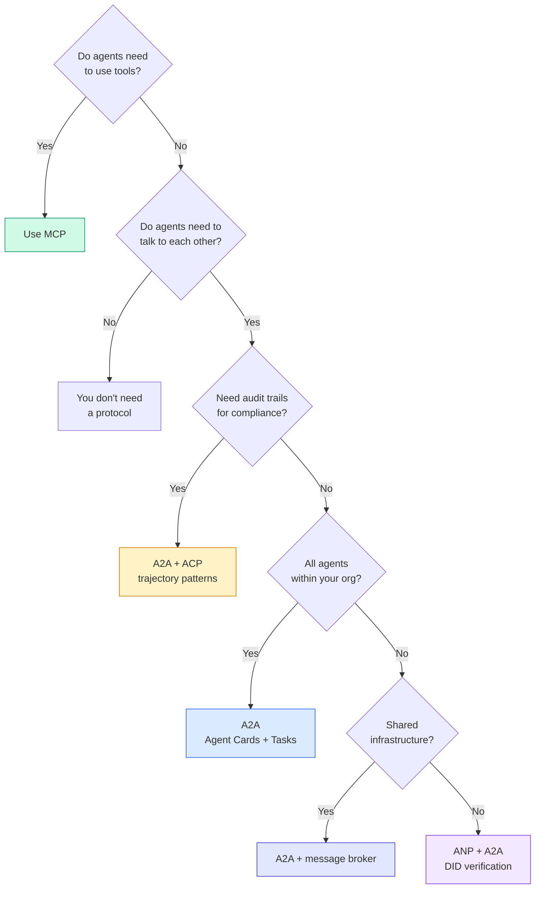

## İndirin . Ürünler .

Bu ders şunları ortaya çıkarır:
- `code/main.ts`-- Dört protokol modelinin tamamı
  Çeviri:`code/main.ts` Tüm dört protokol modüsünün tam gerçekleşmesi
- `outputs/prompt-protocol-selector.md`-- sisteminiz için protokoller seçmenize yardımcı olan bir istek.
  Çeviri:`outputs/prompt-protocol-selector.md`  yardımcı olmak için sistem seçimi anlaşması

## Egzersizler.

1. **Multi-hop task delegation.**`TaskManager`Bu nedenle bir ajan yöneticisi alt görevleri diğer ajanlara delegede edebilir. Araştırmacı bir görev alır, alt görevleri iki uzman ajanına "arşiv" ve "cümlelendirir", her ikisinin tamamlanmasını bekler, sonra sonuçları kendi eserlerine birleştirir.
   Çeviri:**多跳任务委派。**扩展 `TaskManager`,Agent  İşleme sürecinin diğer Ajan 委派子 görevlerine yönlendirilmesini sağlar. Araştırmacıların görevleri alması, " arama " ve " genel " görevleri iki uzman Ajan'a gönderilmesini, ikisinin tamamlanmasını beklemek ve sonuçları birlikte elde etmesini sağlar.

2. **Streaming audit trail.**Değiştir `AuditableRunner`Tam sonuç beklemek yerine, ver `AuditEntry`Trajektör girişleri eklendiğinde gerçek zamanlı güncelleştirmeler.
   Çeviri:**流式审计跟踪。**修改 `AuditableRunner`E destekleme modülü: ⇒ tam sonuç beklemek değil, gerçekte oluşmak için bir yol katmak.`AuditEntry`更新──使用产生审计快照的异步生成器──

3. **DID rotation.**Anahtar dönüşümünü ekle `IdentityRegistry`Bir ajan , yeni bir DID belgesini güncelleştirilmiş anahtarlarla yayınlayıp bir `previousDid`Verifiyeciler, bir süre içinde hem mevcut hem de önceki anahtarın imzalarını kabul etmelidir.
   Çeviri:**DID 轮换。**- Evet .`IdentityRegistry`添加密钥轮换──Agent 应能够发布带有更新密钥的新DID 文档,同时维护 `previousDid`引用──验证者在宽限期内应接受当前和先前密钥的签名──

4. **Protocol negotiation.**ANP'nin meta-protokolu kavramını uygula.`protocolNegotiation`İhtiyaclı biçimlerde mesajlar (örneğin, "JSON-RPC konuşabilirim" vs. "REST'i tercih ederim"). Maksimum 3 turdan sonra, bir biçim veya zaman kesimi konusunda anlaşırlar. Anlaşılmış biçim hangisini belirler `TaskManager`veya `AuditableRunner`- Kullanıyorlar.
   Çeviri:**协议协商。**ANP'nin bir önceki anlaşma kavramını gerçekleştirmek.`protocolNegotiation`消息((((((((((((((((((((((((((((((((((((((((((((((((((((((((((((((((((((((((((((((((((((((((((((((((((((((((((((((((((((((((((((((((((((((((((((((((((((((((((((((((((((((((((((((((((((((((((((((((((((((((((((((((((((((((((((((((((((((((((((((((((((((((((((((((((((((((((((((((((((((((((((((((((((((((((((((((((((((((((((((((((((((((((((((((((((((((((((((((((((((((((((((((((((((((((((((((((((((((((((((((((((((((((((((((((((((((((((((((((((((((((((((((((((((((((((((((((((((((((((((((((((((((((((((((((((((((((((

5. **Rate-limited discovery.**Bir ekle`RateLimitedRegistry`Bu kartı aramaya göre, bir TTL ile kaydedilir ve bir saniye başına bir ajan için keşif sorgularını sınırlandırır.
   Çeviri:**限速发现。**Bir ekle.`RateLimitedRegistry`包装器,配置可配置的 TTL 缓存 代理卡片查找,并限制每秒每代理的发现查询──模拟100 代理 启动时互相发现的惊惊群效应并测量差──

## Anahtar Şartlar .

| Term | What people say | What it actually means |
|------|----------------|----------------------|
| MCP | "The protocol for AI tools" / "AI 工具协议" | A client-server protocol for agents to discover and use tools. Agent-to-tool, not agent-to-agent. / 用于 Agent 发现和使用工具的客户端-服务器协议。Agent 到工具，不是 Agent 到 Agent。 |
| A2A | "Google's agent protocol" / "Google 的 Agent 协议" | A peer-to-peer protocol for agent collaboration under the Linux Foundation. Discovery via Agent Cards, 9-state task lifecycle, streaming via SSE. Supports JSON-RPC, REST, and gRPC bindings. / Linux Foundation 下的 Agent 协作点对点协议。通过 Agent 卡片发现，9 状态任务生命周期，SSE 流。支持 JSON-RPC、REST 和 gRPC 绑定。 |
| ACP | "Enterprise agent messaging" / "企业 Agent 消息" | IBM/BeeAI's REST API for agent runs with TrajectoryMetadata: every response carries the full chain of reasoning and tool calls. Merging into A2A. / IBM/BeeAI 的 Agent 运行 REST API，带轨迹元数据：每个响应携带完整的推理链和工具调用。正在合并到 A2A。 |
| ANP | "Decentralized agent identity" / "去中心化 Agent 身份" | A community protocol using `did:wba` (DID) for cryptographic identity, HPKE for E2EE, and AI-powered meta-protocol negotiation for agents that have never seen each other. / 使用 `did:wba` (DID) 进行加密身份、HPKE 进行端到端加密、AI 驱动的元协议协商的社区协议。 |
| Agent Card / Agent 卡片 | "An agent's business card" / "Agent 的名片" | A JSON document at `/.well-known/agent-card.json` describing skills, supported MIME types, security schemes, and protocol bindings. / 描述技能、支持的 MIME 类型、安全方案和协议绑定的 JSON 文档。 |
| DID | "Decentralized ID" / "去中心化 ID" | W3C standard for cryptographically verifiable identities hosted on the agent's own domain. ANP uses `did:wba` method. / W3C 标准，用于托管在 Agent 自己域上的加密可验证身份。ANP 使用 `did:wba` 方法。 |
| TrajectoryMetadata / 轨迹元数据 | "The audit receipt" / "审计收据" | ACP's mechanism for attaching reasoning steps, tool calls, and their inputs/outputs to every agent response. / ACP 的机制，将推理步骤、工具调用及其输入/输出附加到每个 Agent 响应。 |
| Meta-protocol / 元协议 | "Agents negotiating how to talk" / "Agent 协商如何对话" | ANP's approach where agents use natural language to dynamically agree on data formats, then generate code to handle them. / ANP 的方法，Agent 使用自然语言动态就数据格式达成一致，然后生成代码处理。 |
| Task / 任务 | "A unit of work" / "工作单元" | A2A's stateful object tracking work from submission through completion. Immutable once terminal. / A2A 的有状态对象，跟踪从提交到完成的工作。一旦终态则不可变。 |

## Daha fazla okumak

- [Google A2A specification](https://github.com/google/A2A)-- resmi özellikler ve SDK'lar (v1.0.0, Linux Foundation)
  Çeviri:Google A2A 规范  官方规范和 SDK(v1.0.0,Linux Vakfı)
- [IBM/BeeAI ACP specification](https://github.com/i-am-bee/acp)-- OpenAPI 3.1 özellikleri ajan çalışmalar ve yörüngeler için metadata
  Çinçe Çevirimi:IBM/BeeAI ACP 规范  Agent 运行和轨迹元数据的 OpenAPI 3.1 规范
- [Agent Network Protocol](https://github.com/agent-network-protocol/AgentNetworkProtocol)-- DID tabanlı kimlik, E2EE, meta-protokola müzakere
  中文翻译:Agent Network Protocol  基于 DID的身份、端到端加密、元协议协商
- [Model Context Protocol docs](https://modelcontextprotocol.io/)-- Anthropic'in MCP özellikleri (Faz 13'te kapsamlı)
  中文翻译:Model Context Protocol 文档  Anthropic'in MCP 规范(在第 13 aşamada kapsamaktadır)
- [W3C Decentralized Identifiers](https://www.w3.org/TR/did-core/)-- ANP'nin temelinde bulunan kimlik standardı
  Çinçe Çevirimi:W3C 去中心化标识符  支 ANP 的身份标准
- [RFC 9180 (HPKE)](https://www.rfc-editor.org/rfc/rfc9180)-- ANP'nin E2EE için kullandığı şifreleme sistemi
  Çince çevirisi:RFC 9180 (HPKE)  ANP, sonuna kadar kalıp kalıp kalıp kalıp kalıp kalıp kalıp kalıp kalıp kalıp kalıp kalıp kalıp kalıp kalıp kalıp kalıp kalıp kalıp kalıp kalıp kalıp kalıp kalıp kalıp kalıp kalıp kalıp kalıp kalıp kalıp kalıp kalıp kalıp kalıp kalıp kalıp kalıp kalıp kalıp kalıp kalıp kalıp kalıp kalıp kalıp kalıp kalıp kalıp kalıp kalıp kalıp kalıp kalıp kalıp kalıp kalıp kalıp kalıp kalıp kalıp kalıp kalıp kalıp kalıp kalıp kalıp kalıp kalıp kalıp kalıp kalıp kalıp kalıp kalıp kalıp kalıp kalıp kalıp kalıp kalıp kalıp kalıp kalıp kalıp kalıp kalıp kalıp kalıp kalıp kalıp kalıp kalıp kalıp kalıp kalıp kalıp kalıp kalıp kalıp kalıp kalıp kalıp kalıp kalıp kalıp kalıp kalıp kalıp kalıp kalıp kalıp kalıp kalıp kalıp kalıp kalıp kalıp kalıp kalıp kalıp kalıp kalıp kalıp kalıp kalıp kalıp kalıp kalıp kalıp kalıp kalıp kalıp kalıp kalıp kalıp kalıp kalıp kalıp kalıp kalıp kalıp kalıp kalıp kalıp kalıp kalıp kalıp kalıp kalıp kalıp kalıp kalıp kalıp kalı
- [FIPA Agent Communication Language](http://www.fipa.org/specs/fipa00061/SC00061G.html)- Modern ajan protokollerinin akademik öncü.
  中文翻译:FIPA Agent 通信语言  现代 Agent 协议的学术前身
