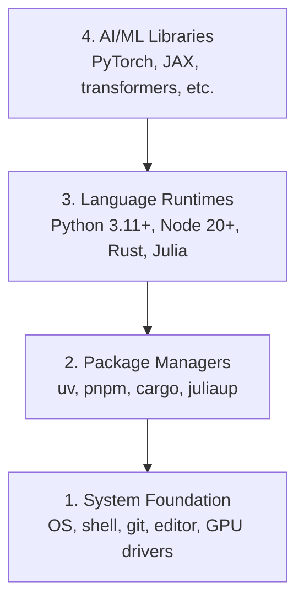

# Phát triển môi trường

> Các công cụ của bạn định hình tư duy của bạn.

> **【中文解读】**Các công cụ của bạn tạo ra suy nghĩ của bạn một lần, một劳永逸. Chương này là điểm khởi đầu của toàn bộ khóa học: bạn sẽ xây dựng một bộ AI hoàn chỉnh.

**Type:** Build | **类型:** 构建
**Languages:** Python, Node.js, Rust | **语言:** Python, Node.js, Rust
**Prerequisites:** None | **前置知识:** 无
**Time:** ~45 minutes | **时间:** ~45 分钟

## Mục tiêu học tập

- Thiết lập Python 3.11+, Node.js 20+, và Rust từ đầu
  Trung文翻译:从零搭建 Python 3.11+、Node.js 20+ 和 Rust 工具链
- Cài đặt môi trường ảo và quản lý gói cho các bộ xây dựng có thể tái tạo
  Trung ngữ翻译:配置虚拟环境和包管理器, đảm bảo xây dựng có thể tái tạo
- Kiểm tra truy cập GPU bằng CUDA/MPS và chạy một hoạt động tensor thử nghiệm
  Trung文翻译:验证 GPU(CUDA/MPS) Có khả dụng,运行测试张量运算
- Hiểu được các gói bốn tầng: hệ thống, gói, thời gian chạy, thư viện AI
  Trung文翻译:理解四层技术: hệ thống层、包管理器层、语言运行时层、AI库层

## Vấn đề  vấn đề mô tả

Bạn sắp học kỹ thuật AI trên 500 bài học sử dụng Python, TypeScript, Rust và Julia. Nếu môi trường của bạn bị phá vỡ, mỗi bài học sẽ trở thành một cuộc chiến chống lại công cụ thay vì học tập.

> Bạn sẽ học hơn 500 bài học về phát triển công nghệ AI, liên quan đến Python, TypeScript, Rust và Julia. Nếu môi trường của bạn có vấn đề, mỗi bài học sẽ trở thành một công cụ để đấu tranh, chứ không phải là học.

Hầu hết mọi người bỏ qua cài đặt môi trường, sau đó họ dành nhiều giờ để cố gắng khắc phục lỗi nhập khẩu, xung đột phiên bản và các trình điều khiển CUDA bị mất.

> Hầu hết mọi người đã nhảy qua môi trường xây dựng. Sau đó họ dành vài giờ để thử nhập khẩu, sai lầm, xung đột phiên bản và thiếu hụt của CUDA. Chúng tôi chỉ làm một lần, nhưng phải làm đối phó.

> **【中文解读】**
> 环境问题是你遇到" nhập khẩu lỗi""",版本冲突""",找不到 CUDA"等报错的根本原因──与其每次上课都修环境,不如一次性搭好──

## Khái niệm cốt lõi

Một môi trường kỹ thuật AI có bốn lớp:

> AI  kỹ thuật môi trường có bốn cấp:



Chúng tôi cài đặt từ dưới lên. Mỗi lớp phụ thuộc vào lớp dưới đó.

> Chúng ta tự đặt lên tầng dưới. Mỗi tầng đều phụ thuộc vào tầng dưới.

> **【中文解读】**
> AI 工程环境 là bốn tầng: tầng dưới nhất là hệ điều hành và động cơ, tầng trên là bộ quản lý gói, tầng trên nhất là Python Torch, biến đổi, và các tầng trên nhất là AI 库.

> **【拓展：为什么需要 uv 而不是 pip？】**
> uv là Python 包管理器 của Rust 写, tốc độ hơn pip 快 10-100 lần, cũng có thể tự động quản lý môi trường ảo. Trong các dự án AI thực tế, bạn có thể duy trì cùng một lúc nhiều dự án dựa trên.
```figure
s0-env-stack
```

## Hãy xây dựng nó.

> **【中文解读】**Sau đây là các bước theo "để cài đặt bốn tầng công cụ" . Mỗi bước có thể được trực tiếp sao chép dán vào cuối để thực hiện. Nếu bạn sử dụng Windows, hãy sử dụng WSL2 (Windows Subsystem for Linux) để có được Linux.

### Bước 1: Hệ thống nền tảng.

Kiểm tra hệ thống của bạn và cài đặt các cơ bản.

> 检查你的系统并安装基础工具──

```bash
# macOS
xcode-select --install
brew install git curl wget

# Ubuntu/Debian
sudo apt update && sudo apt install -y build-essential git curl wget

# Windows (use WSL2)
wsl --install -d Ubuntu-24.04
```

### Bước 2: Python với uv.

Chúng tôi sử dụng`uv` nó nhanh hơn 10-100 lần so với pip và xử lý môi trường ảo tự động.

> Chúng tôi sử dụng `uv`Nó nhanh hơn 10-100 lần so với pip, và có thể tự động quản lý môi trường ảo.

> **【拓展：Python 版本选择】** Python 3.12( ổn định và hiệu suất tối ưu hóa)。3.11+ đều có thể, nhưng để tránh 3.13(部分 AI 库可能尚未适配)。uv的 `python install`会自动下载和管理 Python 版本, không còn cần phải pyenv.

```bash
curl -LsSf https://astral.sh/uv/install.sh | sh

uv python install 3.12

uv venv
source .venv/bin/activate  # or .venv\Scripts\activate on Windows

uv pip install numpy matplotlib jupyter
```

Kiểm tra:

> 验证安装:

```python
import sys
print(f"Python {sys.version}")

import numpy as np
print(f"NumPy {np.__version__}")
a = np.array([1, 2, 3])
print(f"Vector: {a}, dot product with itself: {np.dot(a, a)}")
```

### Bước 3: Node.js với pnpm.

> **【中文解读】**Node.js là môi trường vận hành của TypeScript.

Đối với bài học TypeScript (các đại lý, máy chủ MCP, ứng dụng web).

> Sử dụng TypeScript 课程(Agent、MCP 服务器、Web 应用)

```bash
curl -fsSL https://fnm.vercel.app/install | bash
fnm install 22
fnm use 22

npm install -g pnpm

node -e "console.log('Node', process.version)"
```

**macOS / Apple Silicon (M1/M2/M3/M4):**Nếu người cài đặt dừng lại với `Error: Cannot install under Rosetta 2 in ARM default prefix (/opt/homebrew)`, thiết bị của bạn đang chạy dưới Rosetta 2 (`arch`dấu vân tay`i386`(Tạm dịch: Homebrew là một bộ phận tự nhiên của arm64.`fnm install 22`- Có thể là:

> **苹果芯片 Mac 用户注意**Nếu cài đặt máy báo `Error: Cannot install under Rosetta 2 in ARM default prefix (/opt/homebrew)`, giải thích kết thúc của bạn hoạt động trên Rosetta 2 转译模式下`arch`输出 `i386`), trong khi Homebrew là bản gốc của arm64 版本.`fnm install 22` bắt đầu chạy lại trên lệnh:

```bash
arch -arm64 brew install fnm
echo 'eval "$(fnm env --use-on-cd)"' >> ~/.zshrc
source ~/.zshrc
```

### Bước 4: Rust

Đối với các bài học quan trọng về hiệu suất (trả lời, hệ thống).

> Sử dụng các khóa học nhạy cảm với hiệu suất (được sử dụng để tạo ra các hệ thống)

> **【中文解读】**Rust sử dụng các phần nhạy cảm về hiệu suất trong khóa học này, chẳng hạn như suy nghĩ về tối ưu hóa (Phase 12) và hệ thống tự động (Phase 15-17): Rust là Rust 官方安装器, cargo là Rust 包管理器+构建工具 (Rust 版本的管+制造)

```bash
curl --proto '=https' --tlsv1.2 -sSf https://sh.rustup.rs | sh

rustc --version
cargo --version
```

### Bước 5: Julia (Phác thảo)

Để học toán nặng mà Julia sáng sủa.

> Sử dụng cho Julia  giỏi các bài học toán đặc biệt.

```bash
curl -fsSL https://install.julialang.org | sh

julia -e 'println("Julia ", VERSION)'
```

### Bước 6: Thiết lập GPU (Nếu bạn có một)

**NVIDIA (Linux / Windows):**

> **【中文解读】**NVIDIA 显卡先用 `nvidia-smi`确认驱动正常,重新安装 CUDA 版 PyTorch;果芯片 Mac 没有 CUDA 属正常现象直接装默认版 PyTorch(内置 MPS/Metal 后端)即可,不要传 `--index-url .../cuXXX`(Những bánh xe chỉ hỗ trợ Linux/Windows, đã thất bại)

```bash
nvidia-smi

# Install PyTorch with CUDA
uv pip install torch torchvision torchaudio --index-url https://download.pytorch.org/whl/cu124
```

**macOS / Apple Silicon (M1/M2/M3/M4):**Không có CUDA trên Mac  được mong đợi, không có sự thất bại.**not** Đi qua`--index-url .../cuXXX`(Những bánh xe đó chỉ là Linux / Windows, vì vậy cài đặt thất bại).

> **macOS / 苹果芯片（M1/M2/M3/M4）**Mac 上没有 CUDA Đó là hành vi dự đoán, không phải故障. Đừng truyền tải.`--index-url .../cuXXX`(Những bánh xe chỉ giới hạn trong Linux / Windows,传传传了安装会失败)

```bash
uv pip install torch torchvision torchaudio
```

Kiểm tra (hợp tác trên bất kỳ nền tảng nào):

> 验证(任意平台通用):

```python
import torch
print(f"CUDA available: {torch.cuda.is_available()}")           # False on macOS — expected
print(f"MPS available:  {torch.backends.mps.is_available()}")   # True on Apple Silicon
if torch.cuda.is_available():
    print(f"GPU: {torch.cuda.get_device_name(0)}")
```

Không có GPU? Không có vấn đề. Hầu hết các bài học đều chạy trên CPU. Đối với các bài học nặng, hãy sử dụng Google Colab hoặc GPU đám mây.

> Không có GPU? Không liên quan. Phần lớn các khóa học có thể chạy trên CPU.

> **【拓展：GPU vs CPU 性能对比】**训练 GPT-2 nhỏ(117M 参数):CPU 约 7 天,单块 RTX 3090 约 3 小时,A100 约 40 分钟──推理阶段差距略小但仍然显著──本课程大部分课程可用CPU 跑,只有10阶段(从零训练LLM)等少数课程建议使用GPU──

> **【拓展：GPU 在 AI 中的作用】**
> GPU (GPU) là một phần của AI, vì nó có thể thực hiện hàng ngàn đơn giản tính toán cùng một lúc.

### Bước 7: Kiểm tra đường bạn muốn bắt đầu. Bước 7: Kiểm tra đường bạn muốn bắt đầu.

Hãy chạy mọi lệnh trong bài học này từ nguồn kho, thư mục mà
chứa `README.md`và `phases/`- Chuẩn bị kiểm tra chỉ cần điều gì đó.
bắt đầu tuyến đường được chọn. Nó bỏ qua các công cụ sau theo mặc định để một người mới học thấy
Một câu trả lời rõ ràng thay vì một bức tường cảnh báo.

> Tất cả các lệnh của bài học này đều trong thư mục kho chứa`README.md`和 `phases/`Precheck script only check you start your chosen route (đường) thực sự cần gì đó, mặc định nhảy qua các khóa học tiếp theo là công cụ được sử dụng để cho người mới thấy một kết luận rõ ràng, chứ không phải là một cảnh báo toàn bộ màn hình.

Bắt đầu chuỗi người mới bắt đầu:

> 启动完整的初学者序列:

```bash
python3 phases/00-setup-and-tooling/01-dev-environment/code/verify.py --route beginner
```

Hoặc chỉ kiểm tra đường bạn muốn:

> Hoặc chỉ kiểm tra đường học mà bạn muốn:

```bash
python3 phases/00-setup-and-tooling/01-dev-environment/code/verify.py --route ml-foundations
python3 phases/00-setup-and-tooling/01-dev-environment/code/verify.py --route llm-engineering
python3 phases/00-setup-and-tooling/01-dev-environment/code/verify.py --route agents
python3 phases/00-setup-and-tooling/01-dev-environment/code/verify.py --route mcp
python3 phases/00-setup-and-tooling/01-dev-environment/code/verify.py --route agent-skills
python3 phases/00-setup-and-tooling/01-dev-environment/code/verify.py --route certification
```

Thêm `--show-later`khi bạn muốn cùng một chuyến bay trước để kiểm tra các công cụ tùy chọn
Một công cụ sau này không bao giờ chặn các
đường đi được chọn.

> 想让预检同时检查后课程将使用可选工具和依赖时,加上 `--show-later`                                                                                                                                                                                                                                                              

Mỗi kiểm tra yêu cầu thất bại bao gồm đường dẫn phát hiện hoặc lỗi nhập khẩu và một
Các kỹ năng của đại lý và các tuyến đường chứng nhận cũng cho thấy
kiểm tra máy chủ thủ công bởi vì một kịch bản Python không thể chứng minh rằng một máy chủ AI có
phát hiện ra một kỹ năng hoặc phạm vi kỹ năng bạn chọn là có thể viết.

> Mỗi chương trình kiểm tra cần thiết thất bại sẽ được kèm theo các bài kiểm tra được kiểm tra hoặc nhập  lỗi, cũng như một lệnh sửa chữa chính xác.

Khi chuyến bay trước khi bắt đầu đi qua, nó in bài học đầu tiên:

> Khi học viên sơ khai được kiểm tra, văn bản sẽ in ra chương trình học thực hành đầu tiên:

```text
Ready to start Beginner course.
Next: python3 phases/01-math-foundations/01-linear-algebra-intuition/code/vectors.py
```

> **【中文解读】**预检脚本是"按路线最小环境"哲学落地:初学者只需要Python和Git,ml-foundations 再加 NumPy,agents/mcp 路线连 Node 都可以先不装用到再装.Windows 用户把命令里 `python3`换成 `python`Đó là...

## Sử dụng nó Sử dụng hướng dẫn

> **【中文解读】**Giới thiệu cho bạn mỗi ngôn ngữ trong những giai đoạn sử dụng. Python là một phần chủ yếu của chúng tôi.

Môi trường của bạn sẵn sàng để bắt đầu tuyến đường bạn đã kiểm tra.
khi một bài học yêu cầu họ thay vì chặn bài học đầu tiên của bạn trên toàn bộ
Đây là những gì bạn sẽ sử dụng trong chương trình giảng dạy:

> Bạn đã có thể bắt đầu kiểm tra các bài học của bạn. Các công cụ tiếp theo, bao gồm cả các bài học được sử dụng cho đến khi tái lắp đặt, đừng để toàn bộ công nghệ cản trở bài học của bạn.

| Language | Used In | Package Manager |
|----------|---------|-----------------|
| Python | Phases 1-12 (ML, DL, NLP, Vision, Audio, LLMs) | uv |
| TypeScript | Phases 13-17 (Tools, Agents, Swarms, Infra) | pnpm |
| Rust | Phases 12, 15-17 (Performance-critical systems) | cargo |
| Julia | Phase 1 (Math foundations) | Pkg |

| 语言 | 用在哪些阶段 | 包管理器 |
|------|------------|---------|
| Python | 阶段 1-12（ML、DL、NLP、视觉、音频、LLM） | uv |
| TypeScript | 阶段 13-17（工具、Agent、集群、基础设施） | pnpm |
| Rust | 阶段 12, 15-17（高性能系统） | cargo |
| Julia | 阶段 1（数学基础） | Pkg |

## Chuyển nó đi.

> **【拓展：环境检查 Prompt】** `outputs/prompt-env-check.md`Đây là một cú đánh nhanh mà bạn có thể trực tiếp đưa cho AI, để nó giúp bạn chẩn đoán các vấn đề môi trường. Trong công việc thực tế, loại "động cơ tự kiểm tra môi trường" này rất hữu ích. Bạn chỉ cần đưa báo cáo lỗi cho nó, nó có thể định vị các vấn đề.

Bài học này tạo ra một kịch bản xác minh mà bất cứ ai có thể chạy để kiểm tra thiết lập của họ.

> Bài học này được phát hành bằng chứng, bất cứ ai có thể chạy nó để kiểm tra cấu hình môi trường của mình.

Nhìn xem`outputs/prompt-env-check.md`cho một lời nhắc giúp trợ lý AI chẩn đoán các vấn đề môi trường.

> 参见 `outputs/prompt-env-check.md`, trong đó bao gồm một trợ lý AI  trợ lý chẩn đoán môi trường vấn đề nhanh chóng.

## Tập luyện bài tập

1. Động trình kịch bản xác minh và sửa lỗi
   运行验证脚本并修复 tất cả các bài kiểm tra thất bại
2. Tạo một môi trường ảo Python cho khóa học này và cài đặt PyTorch
   Đối với các khóa học tạo Python  ảo môi trường và cài đặt PyTorch
3. Viết "hào thế giới" bằng cả bốn ngôn ngữ và chạy mỗi ngôn ngữ
   Sử dụng 4 ngôn ngữ để viết một "Hello world" và hoạt động
