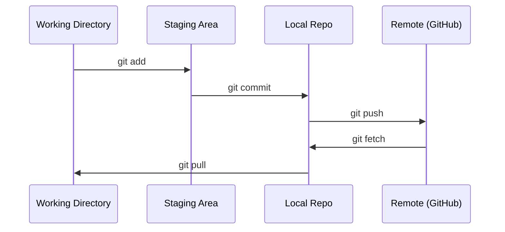

# Git & Collaboration

> Việc kiểm soát phiên bản không phải là tùy chọn, mỗi thí nghiệm, mỗi mô hình, mỗi bài học mà bạn tạo ra ở đây đều được theo dõi.
> 版本 control không phải là lựa chọn. Mỗi lần thử nghiệm của bạn, mỗi mô hình, mỗi phần của bài học đều được theo dõi.

**Type:** Learn | **类型:** 学习
**Languages:** -- | **语言:** 无
**Prerequisites:** Phase 0, Lesson 01 | **前置知识:** Phase 0, 第 01 课
**Time:** ~30 minutes | **时间:** ~30 分钟

## Mục tiêu học tập

- Thiết lập kit nhận dạng và sử dụng dòng công việc hàng ngày của thêm, tham gia, và đẩy
  中文翻译: cấu hình Git 身份信息, nắm bắt thêm, cam kết, đẩy của dòng công việc hàng ngày
- Tạo và hợp nhất các chi nhánh cho các thí nghiệm riêng biệt mà không phá vỡ chính
  Trung ngữ翻译: tạo ra và hợp并分支, thực hiện trải nghiệm tách biệt mà không phá hủy chính分支
- Hãy viết một `.gitignore`không bao gồm các điểm kiểm soát mô hình và các tệp nhị phân lớn
  中文翻译:编写 `.gitignore`文件,排除模型检查点和大文件
- Di chuyển lịch sử tham gia với `git log`để hiểu sự phát triển của dự án
  中文翻译:用 `git log`浏览提交历史, hiểu quá trình phát triển dự án

> **【中文解读】**
> Git là công cụ kiểm soát phiên bản, được sử dụng để theo dõi mỗi lần sửa đổi mã. Trong các dự án AI, bạn sẽ thường xuyên sửa đổi các tham số và mã trong thí nghiệm, Git cho phép bạn có thể quay lại bất cứ lúc nào trở lại bất kỳ trạng thái nào trước đó.

> **【拓展：Git 在 AI 工程中的角色】**AI 工程和传统软件开发不同每次实验(超参数调整、数据集变更) đều là một" phiên bản"──使用 Git 追踪实验意味着:`git diff`Tìm ra điều gì đã thay đổi; mô hình triển khai ra vấn đề, được rồi.`git revert`回滚──大模型团队 (如 Hugging Face) của quá trình cộng tác hoàn toàn dựa trên Git.

## Vấn đề  vấn đề mô tả

Bạn sắp viết hàng trăm tập tin mã trên 20 giai đoạn mà nếu không có kiểm soát phiên bản bạn sẽ mất công việc, phá vỡ những thứ bạn không thể hủy bỏ và không có cách để hợp tác với người khác.

> Bạn sẽ viết hàng trăm tập tin mã trong 20 giai đoạn. Không kiểm soát phiên bản, bạn sẽ mất kết quả công việc.

Git là công cụ. GitHub là nơi mà mã sống. Bài học này bao gồm những gì bạn cần cho khóa học này và không có gì hơn thế.

> Git là một công cụ, GitHub là một nơi quản lý mã hóa.

> **【中文解读】**
> Bạn sẽ viết vài trăm tập tin mã, không kiểm soát phiên bản = 随时可能丢失工作成果、无法回归、无法协作──Git 解决的就是这个问题──

## Khái niệm cốt lõi



Ba điều cần nhớ:
1. Tiết kiệm thường xuyên (`git commit`(văn)
2. Nhấn lên điều khiển từ xa (`git push`(văn)
3. Chi nhánh cho thí nghiệm (`git checkout -b experiment`(văn)

> Tôi cần nhớ ba điều:
> 1. 经常保存(`git commit`(văn)
> 2. 推送到远程(`git push`(văn)
> 3. 用分支做实验(`git checkout -b experiment`(văn)

> **【中文解读】**
> Git's core流程:工作目录 → 暂存区(git add)→ 本地仓库(git commit)→ 远程仓库(git push)。记住三件事:经常提交、推送到远程、用分支做实验。

> **【拓展：分支策略与 AI 实验】**AI 项目推" mỗi thử nghiệm một分支" chiến lược:`experiment/lr-0.001``experiment/add-dropout`等── như vậy mỗi lần thử nghiệm có mã hóa được tách ra, thử nghiệm thất bại trực tiếp xóa phân tử, thành công thì hợp并── lớn AI  dự án cũng sẽ sử dụng Git tag 标记模型版本(如`v1.0-baseline`),方便部署时精确指定代码版本──

## Hãy xây dựng nó.
```figure
s0-commit-dag
```

## Hãy xây dựng nó

### Bước 1: Cài đặt git

> 第1步: Configuration Git

```bash
git config --global user.name "Your Name"
git config --global user.email "you@example.com"
```

### Bước 2: Hành trình công việc hàng ngày

```bash
git status                              # 查看哪些文件有改动
git add file.py                         # 把改动加入暂存区
git commit -m "Add perceptron implementation"  # 提交到本地仓库
git push origin main                    # 推送到 GitHub 远程仓库
```

### Bước 3: Phân hợp cho các thí nghiệm với các thí nghiệm

```bash
git checkout -b experiment/new-optimizer  # 创建并切换到新分支

# ... make changes, commit ...  # 在新分支上修改和提交，不影响主分支

git checkout main                         # 切回主分支
git merge experiment/new-optimizer        # 把实验分支的改动合并到主分支
```

### Bước 4: Làm việc với khóa học này repo. Bước 4: sử dụng kho kho khóa học này.

> **【拓展：Fork vs Clone】**Nếu bạn muốn giữ cho tiến bộ học tập của mình mà không ảnh hưởng đến kho dự trữ ban đầu, hãy sử dụng `fork`(on GitHub 上操作) thay vì trực tiếp sao chép. Sau đó bạn có một bản sao hoàn chỉnh của riêng bạn, có thể tự do gửi.

Bạn không thể đẩy đến khóa học repo chính nó  chỉ có người bảo trì có quyền truy cập viết. Nhập nó trên GitHub trước (phím nhập, bên phải trên) vì vậy `origin`Điểm trong bản sao của bạn:

```bash
git clone https://github.com/YOUR-USERNAME/ai-engineering-from-scratch.git
cd ai-engineering-from-scratch

git checkout -b my-progress
# work through lessons, commit your code
git push origin my-progress
```

## Sử dụng nó Sử dụng hướng dẫn

> **【拓展：.gitignore 在 AI 项目中至关重要】**AI  dự án sẽ tạo ra một lượng lớn không phải nộp`.pt``.safetensors`Có đến 10 GB) ✓ training日志、数据集缓存(`__pycache__``.venv`Một cái tốt `.gitignore`能防止 bạn bất ngờ đưa 10GB của các tập tin mô hình đến GitHub.`gitignore.io`生成 Python/ML 项目的模板──

Để thực hiện khóa học này, bạn cần những lệnh này:

> Trong bài học này, bạn chỉ cần những lệnh này:

| Command | When |
|---------|------|
| `git clone` | Get the course repo |
| `git add` + `git commit` | Save your work |
| `git push` | Back it up to GitHub |
| `git checkout -b` | Try something without breaking main |
| `git log --oneline` | See what you've done |

| 命令 | 什么时候用 |
|------|-----------|
| `git clone` | 下载课程仓库 |
| `git add` + `git commit` | 保存你的工作 |
| `git push` | 备份到 GitHub |
| `git checkout -b` | 安全地尝试新想法 |
| `git log --oneline` | 查看你做了什么 |

Đó là tất cả, không cần rebase, cherry-pick, hoặc submodules cho khóa học này.

> 就这些──本课程不需要重点,桃选或子模块──

## Tập luyện bài tập

1. Khả năng sao chép repo này, tạo ra một chi nhánh gọi là `my-progress`, tạo một tập tin, tham gia nó, đẩy nó
   克隆仓库,创建 `my-progress`分支,新建文件,提交并推送
1. Cửa ra cái repo này, nhân bản chiếc cành của bạn, tạo ra một nhánh tên là `my-progress`, tạo một tập tin, tham gia nó, đẩy nó
2. Tạo ra một `.gitignore`Không bao gồm các tập tin kiểm soát mẫu (`.pt`- `.pth`- `.safetensors`(văn)
   创建 `.gitignore`文件,排除模型检查点文件
3. Nhìn vào lịch sử tham gia của repo này với `git log --oneline`và đọc những bài học được thêm vào
   用 `git log --oneline`Xem lịch sử nộp, hiểu được chương trình được xây dựng từng bước

## Từ khóa  Keyword

> **【中文解读】**Commit (commit) = 项目快照,Gia phân (分支) = 独立开发线,Merge (Merge) = 分支改动合回来,Remote (Remote) = 仓库副本 (副本) trên GitHub.

| Term | What people say | What it actually means |
|------|----------------|----------------------|
| Commit | "Saving" | A snapshot of your entire project at a point in time |
| Branch | "A copy" | A pointer to a commit that moves forward as you work |
| Merge | "Combining code" | Taking changes from one branch and applying them to another |
| Remote | "The cloud" | A copy of your repo hosted somewhere else (GitHub, GitLab) |

| 术语 | 俗称 | 实际含义 |
|------|------|---------|
| Commit | "保存" | 项目在某一时刻的完整快照 |
| Branch | "副本" | 指向某个提交的可移动指针，随工作向前推进 |
| Merge | "合并代码" | 将一个分支的改动应用到另一个分支 |
| Remote | "云端" | 托管在其他地方的仓库副本（如 GitHub、GitLab） |
