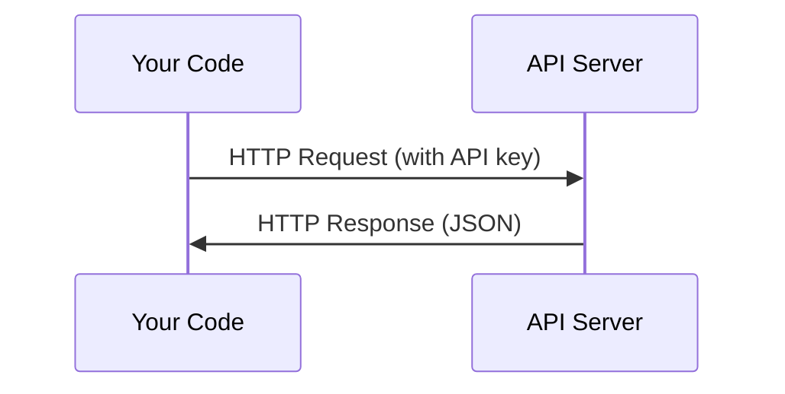

# API & Key Ứng dụng quản lý khóa

> Mỗi API AI hoạt động giống nhau: gửi yêu cầu, nhận được phản hồi.
> Tất cả các API của AI đều làm việc giống nhau: gửi yêu cầu, nhận được phản ứng.

**Type:** Build | **类型:** 构建
**Languages:** Python, TypeScript | **语言:** Python, TypeScript
**Prerequisites:** Phase 0, Lesson 01 | **前置知识:** Phase 0, 第 01 课
**Time:** ~30 minutes | **时间:** ~30 分钟

## Mục tiêu học tập

- Cung cấp các khóa API an toàn bằng cách sử dụng các biến môi trường và `.env`tập tin
  Trung ngữ翻译:使用环境变量和 `.env`文件安全存储 API 密钥
- Thực hiện một cuộc gọi LLM API sử dụng cả SDK Python Anthropic và HTTP nguyên liệu
  Trung文翻译: sử dụng SDK Python nhân văn 和原始 HTTP 两种方式调用 LLM API
- So sánh các định dạng yêu cầu / phản hồi HTTP dựa trên SDK và nguyên liệu để gỡ lỗi
  Trung ngữ翻译:对比 SDK 和原始 HTTP 的请求/响应格式,以便调试
- Xác định và xử lý các lỗi API phổ biến bao gồm xác thực và giới hạn tỷ lệ
  Trung ngữ翻译:识别并处理常见 API 错误, bao gồm vấn đề xác nhận và giới hạn dòng chảy

> **【中文解读】**
> Tất cả các API của AI đều làm việc giống như: gửi yêu cầu, nhận phản ứng. Chương này dạy bạn cách quản lý an toàn API 密钥, sử dụng LLM API, cũng như hiểu sự khác biệt giữa SDK 调用 và HTTP yêu cầu ban đầu. Đây là nền tảng của xây dựng AI Agent.

## Vấn đề  vấn đề mô tả

Bắt đầu từ giai đoạn 11, bạn sẽ gọi LLM API (Anthropic, OpenAI, Google). Trong giai đoạn 13-16 bạn sẽ xây dựng các đại lý sử dụng các API này trong vòng lặp. Bạn cần biết cách API khóa hoạt động, làm thế nào để lưu trữ chúng một cách an toàn, và làm thế nào để thực hiện cuộc gọi API đầu tiên của bạn.

> Từ giai đoạn 11  bắt đầu, bạn sẽ sử dụng LLM API ((Anthropic、OpenAI、Google)  Trong giai đoạn 13-16 bạn sẽ xây dựng vòng lặp sử dụng các API này  Bạn cần hiểu làm việc của API 密钥  làm thế nào để lưu trữ an toàn, và làm thế nào để hoàn thành lần đầu tiên API  sử dụng 

> **【中文解读】**
> Từ giai đoạn 11  bắt đầu, bạn sẽ sử dụng LLM API; giai đoạn 13-16 会构建循环调用 API的代理── bạn cần phải nắm bắt trước API 密钥管理和基本调用方式──

## Khái niệm cốt lõi



Mỗi cuộc gọi API có:
1. Endpoint (URL)
2. Một khóa API (tăng thực)
3. Một cơ quan yêu cầu (bạn muốn gì)
4. Một cơ thể phản ứng (bạn nhận lại)

> Mỗi API 调用 bao gồm bốn yếu tố:
> 1. 端点(URL)
> 2. API 密钥(身份认证)
> 3. Xin lỗi, xin lỗi.
> 4. 响应体(返回什么)

> **【中文解读】**
> Mỗi lần API 调用 có chứa bốn yếu tố:端点 URL、API 密钥(身份认证) 、请求体(你想要什么) 、响应体(返回什么) ◦

> **【拓展：API 在 AI Agent 中的角色】**
> Chuyện cơ bản của AI là: xây dựng lời khuyên → 调用 LLM API → 解析响应 → 执行动作 → 再调用 API。 nắm bắt API 调用 là bước đầu tiên của xây dựng Agent。
```figure
s0-secret-inject
```

## Hãy xây dựng nó

## Hãy xây dựng nó.

> **【拓展：API 密钥安全的铁律】**绝不把API key 硬编码在代码里. Một khi được đưa vào GitHub, crawler sẽ phát hiện ra trong vài giây và sử dụng không được khóa của bạn.`.env`文件 + `python-dotenv`Hoạt động của hệ điều hành

### Bước 1: Cung cấp khóa API an toàn

Đừng bao giờ đặt khóa API vào mã. Sử dụng các biến môi trường.

> 永远不要把API 密钥写在代码里.

```bash
export ANTHROPIC_API_KEY="sk-ant-..."  # 设置环境变量（密钥永远不要写在代码里！）
export OPENAI_API_KEY="sk-..."
```

Hoặc sử dụng `.env`file (tú thêm vào `.gitignore`):

> Hoặc sử dụng `.env`文件( nhớ thêm đến `.gitignore`):

```
ANTHROPIC_API_KEY=sk-ant-...  # .env 文件（确保加入 .gitignore）
OPENAI_API_KEY=sk-...
```

### Bước 2: Cuộc gọi API đầu tiên (Python)

```python
import os

import anthropic

client = anthropic.Anthropic()  # 自动从环境变量读取密钥

MODEL = os.environ.get("LLM_MODEL", "claude-sonnet-5")

response = client.messages.create(
    model="claude-sonnet-4-20250514",  # 指定模型
    max_tokens=256,  # 最大输出长度
    messages=[{"role": "user", "content": "What is a neural network in one sentence?"}]  # 用户消息
    model=MODEL,
    max_tokens=256,
    messages=[{"role": "user", "content": "What is a neural network in one sentence?"}]
)

print(response.content[0].text)  # 打印模型回复
```

### Bước 3: Tiêu gọi API đầu tiên (TypeScript)

> **【拓展：Token 计费机制】**LLM API 按token计费:Claude Sonnet 约 $3/百万输入 token、$15/million输出 token── một tiếng Anh单词约1.3 个 token, một中文字约2-3 个 token──`max_tokens=256`Ý nghĩa mô hình nhiều nhất xuất 256 token (khoảng 200 từ tiếng Anh) ⋅ kiểm soát`max_tokens`Đó là một phương tiện quan trọng để tiết kiệm chi phí.
`LLM_MODEL`chọn ID mô hình Anthropic, và mặc định là tên đếm Sonnet không được cập nhật. Các nhà cung cấp khác (OpenAI, Google, và những người khác) theo cùng một mô hình của một khóa cộng với một ID mô hình, nhưng mỗi người có SDK riêng, điểm cuối và quy trình yêu cầu / phản hồi.

### Bước 3: Cuộc gọi API đầu tiên (TypeScript)

```typescript
import Anthropic from "@anthropic-ai/sdk";

const client = new Anthropic();

const MODEL = process.env.LLM_MODEL ?? "claude-sonnet-5";

const response = await client.messages.create({
  model: MODEL,
  max_tokens: 256,
  messages: [{ role: "user", content: "What is a neural network in one sentence?" }],
});

console.log(response.content[0].text);
```

### Bước 4: Raw HTTP (không SDK) 😁

```python
import os
import urllib.request
import json

url = "https://api.anthropic.com/v1/messages"  # API 端点
headers = {
    "Content-Type": "application/json",  # 请求格式为 JSON
    "x-api-key": os.environ["ANTHROPIC_API_KEY"],  # 从环境变量读取密钥
    "anthropic-version": "2023-06-01",  # API 版本号
}
body = json.dumps({
    "model": "claude-sonnet-4-20250514",  # 模型名称
    "max_tokens": 256,  # 最大输出 token 数
    "model": os.environ.get("LLM_MODEL", "claude-sonnet-5"),
    "max_tokens": 256,
    "messages": [{"role": "user", "content": "What is a neural network in one sentence?"}],
}).encode()

req = urllib.request.Request(url, data=body, headers=headers, method="POST")  # 构造 POST 请求
with urllib.request.urlopen(req) as resp:
    result = json.loads(resp.read())  # 解析 JSON 响应
    print(result["content"][0]["text"])  # 提取并打印回复文本
```

Đây là những gì SDK làm dưới nắp. Hiểu cuộc gọi HTTP nguyên thô giúp khi gỡ lỗi.

> Đó là điều SDK làm ở tầng dưới.

> **【中文解读】**
> SDK chỉ là gói của yêu cầu HTTP. Nghĩ HTTP nguyên thủy có thể giúp bạn điều chỉnh API.

## Sử dụng nó Sử dụng hướng dẫn

> **【中文解读】**现在不需要注册所有API──Phase 4-10 用 Hugging Face(免费),Phase 11-16 需要人类或OpenAI──等课程用到时再注册即可──

Đối với khóa học này:

> 本课程中:

| API | When you need it | Free tier |
|-----|-----------------|-----------|
| Anthropic (Claude) | Phases 11-16 (agents, tools) | $5 credit on signup |
| OpenAI | Phase 11 (comparison) | $5 credit on signup |
| Hugging Face | Phases 4-10 (models, datasets) | Free |

| API | 何时需要 | 免费额度 |
|-----|---------|---------|
| Anthropic (Claude) | 阶段 11-16（Agent、工具） | 注册送 $5 额度 |
| OpenAI | 阶段 11（对比实验） | 注册送 $5 额度 |
| Hugging Face | 阶段 4-10（模型、数据集） | 免费 |

Anh không cần tất cả chúng ngay bây giờ, hãy đặt chúng lên khi bài học cần.

> Bạn không cần phải đăng ký tất cả các API.

## Chuyển nó đi.

> **【拓展：429 限流处理】**调用 LLM API 时最常见的错误是 429 Rate Limit──处理方式:指数退避重试(等 1s → 2s → 4s → 8s)──Anthropic SDK 内置自动重试, nhưng hiểu nguyên tắc rất quan trọng Trong thực tế Agent 系统, bạn có thể cần bản thân thực hiện các quy trình hạn chế để kiểm soát chi phí và tránh bị đóng kín──

Bài học này mang lại:
- `outputs/prompt-api-troubleshooter.md`- chẩn đoán các lỗi API phổ biến

> 本课产 出:
> - `outputs/prompt-api-troubleshooter.md`- 诊断常见 API 错误的快速

## Tập luyện bài tập

1. Nhận một khóa API Anthropic và thực hiện cuộc gọi API đầu tiên của bạn
   获取 Anthropic API 密钥, hoàn thành lần đầu tiên của bạn API 调用
2. Hãy thử phiên bản HTTP nguyên liệu và so sánh định dạng phản ứng với phiên bản SDK
   尝试原始 HTTP 方式调用, đối với các SDK 方式的响应格式
3. Ý định sử dụng một khóa API sai và đọc thông báo lỗi
   Vì vậy, bạn có thể đọc thông tin sai lầm.

## Từ khóa  Keyword

| Term | What people say | What it actually means |
|------|----------------|----------------------|
| API key | "Password for the API" | A unique string that identifies your account and authorizes requests |
| Rate limit | "They're throttling me" | Maximum requests per minute/hour to prevent abuse and ensure fair usage |
| Token | "A word" (in API context) | A billing unit: input and output tokens are counted and charged separately |
| Streaming | "Real-time responses" | Getting the response word by word instead of waiting for the full response |

| 术语 | 俗称 | 实际含义 |
|------|------|---------|
| API key | "API 密码" | 标识你账户并授权请求的唯一字符串 |
| Rate limit | "被限流了" | 每分钟/小时的请求上限，防止滥用 |
| Token | "词"（API 语境） | 计费单位：输入和输出 token 分别计费 |
| Streaming | "实时响应" | 逐词返回响应，而非等待完整响应 |
