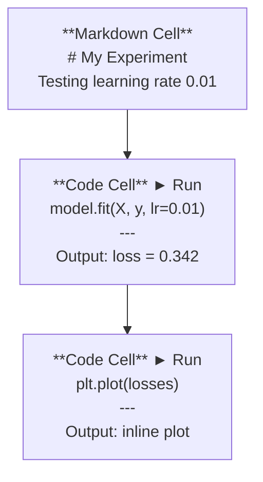
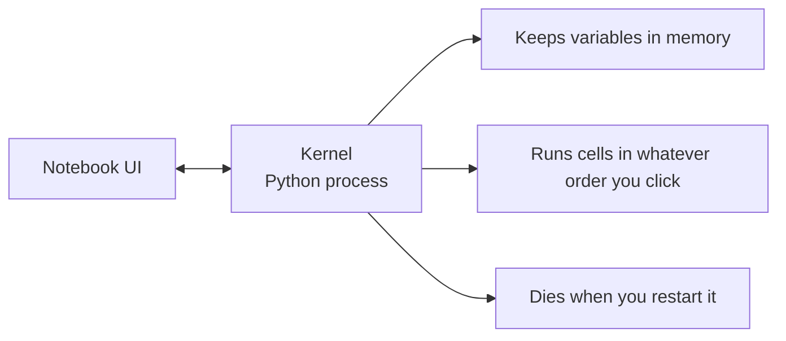

# Jupyter sổ ghi chép Jupyter  sổ ghi chép

> Các máy tính xách tay là phòng thí nghiệm của kỹ thuật AI. Bạn tạo ra nguyên mẫu ở đây, sau đó chuyển những gì hoạt động vào sản xuất.
> 笔记本 là cơ sở thử nghiệm của AI 工程. Bạn làm thử nghiệm nguyên mẫu ở đây, sau đó đưa phần hiệu quả vào sản xuất.

**Type:** Build | **类型:** 构建
**Languages:** Python | **语言:** Python
**Prerequisites:** Phase 0, Lesson 01 | **前置知识:** Phase 0, 第 01 课
**Time:** ~30 minutes | **时间:** ~30 分钟

## Mục tiêu học tập

- Thiết lập và khởi động JupyterLab, Jupyter Notebook, hoặc VS Code với tiện ích mở rộng Jupyter
  Trung文翻译:安装并启动 JupyterLab、Jupyter Notebook 或带 Jupyter 扩展的 VS Code
- Sử dụng lệnh phép thuật (`%timeit`- `%%time`- `%matplotlib inline`) để đánh giá và hiển thị trong dòng
  Trung文翻译: dùng phép thuật lệnh`%timeit``%%time``%matplotlib inline`) thực hiện các thử nghiệm cơ bản và hình ảnh hóa nội dung
- Hóa ra khi nào sử dụng sổ ghi chép và kịch bản và áp dụng dòng công việc "xám phá trong sổ ghi chép, gửi trong kịch bản"
  Trung văn翻译:区分何时用笔记本何时用脚本, thực hành"笔记本中探索、脚本中部署"的工作流
- Xác định và tránh những cái bẫy máy tính xách tay phổ biến: việc thực hiện không đúng trật tự, trạng thái ẩn và rò rỉ bộ nhớ
  Trung文翻译:识别并避免笔记本常见陷:乱序执行、隐藏状态和内存泄漏

> **【中文解读】**
> Jupyter Notebook là "bộ thí nghiệm" của các kỹ sư AI. Bạn có thể chạy mã trong đó từng giai đoạn, ngay lập tức xem kết quả, hỗn hợp các mô tả và biểu đồ.`.py`脚本中部署。

## Vấn đề  vấn đề mô tả

Mỗi bài báo AI, hướng dẫn và cuộc thi Kaggle đều sử dụng sổ ghi chép Jupyter. Chúng cho phép bạn chạy mã từng mảnh, xem kết quả trong dòng, trộn mã với lời giải thích và lặp lại nhanh chóng. Nếu bạn cố gắng học AI mà không cần sổ ghi chép, bạn sẽ làm bài tập về toán mà không cần giấy xước.

> Hầu hết các bài báo AI 、 bài giảng và Kaggle đều sử dụng Jupyter Notebook. Nó cho phép bạn phân đoạn chạy mã 、内嵌查看输出、混合代码和文字说明、快速代. Nếu không cần ghi chép, AI,就像没有草稿纸做数学作业──

Nhưng sổ ghi chép có những cái bẫy thực sự. Mọi người sử dụng chúng cho mọi thứ, kể cả những thứ họ không giỏi. Biết khi nào sử dụng sổ ghi chép và khi nào sử dụng kịch bản sẽ giúp bạn tránh những cơn ác mộng sau này.

> Nhưng sổ cái cũng có những rào cản thực sự. Người ta sử dụng nó để làm mọi thứ, bao gồm cả những gì nó không giỏi.

> **【中文解读】**
> Notebook là công cụ tiêu chuẩn trong lĩnh vực AI, hầu hết các bài báo và bài viết đều sử dụng nó. Nhưng nó cũng có những rắc rối: rối lệnh thực hiện, tình trạng ẩn, rò rỉ bộ nhớ.

## Khái niệm cốt lõi

Một sổ ghi chép là một danh sách các tế bào. Mỗi tế bào là mã hoặc văn bản.

> 笔记本由一系列"单元格"组成, mỗi单元格要么是代码,要么是文本.



Lớp lõi là một quá trình Python chạy trong nền. Khi bạn chạy một tế bào, nó gửi mã đến lõi, nó thực hiện nó và gửi lại kết quả. Tất cả các tế bào chia sẻ cùng một lõi, vì vậy các biến tồn tại giữa các tế bào.

> Kernel là một Python 进程 chạy trên nền tảng sau. Khi bạn chạy một đơn vị, mã được gửi đến Kernel, thực hiện, kết quả lại trở lại.



Phần "bất cứ thứ tự nào bạn nhấp vào" là cả siêu cường và súng trường.

> "按你点击的任意顺序执行" phần này là cả siêu năng lực, cũng là một cái hố.
```figure
s0-cell-order
```

## Hãy xây dựng nó

> **【中文解读】**
> Notebook được tạo ra bởi nhiều đơn vị đơn vị, mỗi đơn vị có thể là mã hoặc Markdown. Tất cả các đơn vị chia sẻ cùng một Kernel.

## Hãy xây dựng nó.

> **【拓展：Jupyter 在 AI 行业中的地位】**Hầu hết các bài viết AI có sẵn có thể sử dụng trong thời đại hiện đại đều là bản đồ máy tính xách tay của Jupyter 格式──Kaggle 比赛方案、Hugging Face示例、PyTorch 教程都使用它──Google Colab 本质上就是云端的 Jupyter,预装了 PyTorch/TensorFlow,并免费提供 GPU──本课程中有大量.`.ipynb`练习――

### Bước 1: Chọn giao diện của bạn.

Ba lựa chọn, một định dạng:

> 三种界面选择, cùng một hình thức tài liệu:

| Interface | Install | Best for |
|-----------|---------|----------|
| JupyterLab | `pip install jupyterlab` then `jupyter lab` | Full IDE experience, multiple tabs, file browser, terminal |
| Jupyter Notebook | `pip install notebook` then `jupyter notebook` | Simple, lightweight, one notebook at a time |
| VS Code | Install "Jupyter" extension | Already in your editor, git integration, debugging |

| 界面 | 安装方式 | 最适合 |
|------|---------|--------|
| JupyterLab | `pip install jupyterlab` 后运行 `jupyter lab` | 完整 IDE 体验、多标签、文件浏览器 |
| Jupyter Notebook | `pip install notebook` 后运行 `jupyter notebook` | 简洁轻量、一次一个笔记本 |
| VS Code | 安装 "Jupyter" 扩展 | 集成在编辑器中、Git 整合、可调试 |

Cả ba đều đọc và viết như nhau.`.ipynb`JupyterLab là công trình phổ biến nhất trong AI.

> 3 giao diện đọc cùng nhau`.ipynb`文件格式──选你喜欢的即可──JupyterLab 在 AI 工作中最常见──

```bash
pip install jupyterlab
jupyter lab
```

### Bước 2: Các đường tắt bàn phím quan trọng

Bạn có thể hoạt động trong hai chế độ.`Escape`cho chế độ lệnh (bảng màu xanh lá cây ở bên trái), `Enter`cho chế độ chỉnh sửa (bar màu xanh lá cây).

> Bạn đang hoạt động theo hai cách.`Escape`进入命令模式(左侧蓝色条),按 `Enter`进入编辑模式(绿色条) 』

**Command mode (most used):**

> **命令模式（最常用的）：**

| Key | Action |
|-----|--------|
| `Shift+Enter` | Run cell, move to next |
| `A` | Insert cell above |
| `B` | Insert cell below |
| `DD` | Delete cell |
| `M` | Convert to markdown |
| `Y` | Convert to code |
| `Z` | Undo cell operation |
| `Ctrl+Shift+H` | Show all shortcuts |

**Edit mode:**

> **编辑模式：**

| Key | Action |
|-----|--------|
| `Tab` | Autocomplete |
| `Shift+Tab` | Show function signature |
| `Ctrl+/` | Toggle comment |

`Shift+Enter`là cái mà bạn sẽ sử dụng hàng ngàn lần một ngày.

> `Shift+Enter`Đó là bạn sẽ dùng trên ngàn lần mỗi ngày.

### Bước 3: Các loại tế bào.

**Code cells**chạy Python và hiển thị đầu ra:

> **代码单元格**运行 Python 并显示输出:

```python
import numpy as np
data = np.random.randn(1000)
data.mean(), data.std()
```

Tạo ra: `(0.0032, 0.9987)`

**Markdown cells**Đưa ra văn bản định dạng. Sử dụng chúng để ghi lại những gì bạn đang làm và tại sao.`$E = mc^2$`), bảng và hình ảnh.

> **Markdown 单元格**染格式化文本── dùng chúng để ghi lại bạn đang làm gì và tại sao── hỗ trợ tiêu đề、粗体、斜体、LaTeX 数学公式(`$E = mc^2$`(■表格和图片──)

### Bước 4: lệnh phép thuật

Đây không phải Python, mà là lệnh đặc biệt của Jupyter bắt đầu bằng`%`(bức thuật đường dây) hoặc `%%`(tự thần học tế bào).

> Đây không phải là Python.`%`(行魔术) hoặc `%%`(单元格魔术) n đầu của Jupyter 专用命令――

**Time your code:**

> **计时你的代码：**

```python
%timeit np.random.randn(10000)  # 多次运行取平均，适合微基准测试
```

Tạo ra: `45.2 us +/- 1.3 us per loop`

```python
%%time  # 单次运行，测量总耗时，适合训练耗时测试
model.fit(X_train, y_train, epochs=10)
```

Tạo ra: `Wall time: 2.34 s`

`%timeit`chạy mã nhiều lần và trung bình. `%%time`chạy nó một lần.`%timeit`cho các dấu hiệu microbenchmark, `%%time`cho các cuộc tập luyện.

> `%timeit`Nhiều lần vận hành lấy giá trị trung bình.`%%time`Chỉ chạy một lần.`%timeit`, tập luyện mất thời gian test use `%%time`

**Enable inline plots:**

> **启用内嵌图表：**

```python
%matplotlib inline  # 让图表直接显示在笔记本中
```

Mỗi người`plt.plot()`hoặc `plt.show()`bây giờ sẽ được ghi trực tiếp trong sổ ghi chép.

>  sau mỗi `plt.plot()`Hoặc`plt.show()`Thành phố sẽ trực tiếp trong sổ tay.

**Install packages without leaving the notebook:**

> **不离开笔记本就能安装包：**

```python
!pip install scikit-learn  # ! 前缀可以在笔记本中执行 shell 命令
```

- `!`Prefix chạy bất kỳ lệnh shell nào.

> `!`前可以执行任何 shell 命令.

**Check environment variables:**

> **检查环境变量：**

```python
%env CUDA_VISIBLE_DEVICES  # 查看环境变量
```

### Bước 5: Khám ảnh đầu ra giàu trong dòng.

> **【拓展：Notebook 是最佳 AI 实验记录工具】**Notebook Đặt mã, đầu ra, biểu đồ, các công thức tích hợp trong một tài liệu, tạo thành một "bài ghi thí nghiệm" hoàn chỉnh. Trong nghiên cứu AI, điều này có nghĩa là người khác có thể trực tiếp tái hiện thí nghiệm của bạn.

Các notebook tự động hiển thị biểu hiện cuối cùng trong một tế bào.

> Nó sẽ tự động hiển thị biểu hiện cuối cùng trong đơn vị... nhưng bạn có thể kiểm soát nó:

```python
import pandas as pd

df = pd.DataFrame({
    "model": ["Linear", "Random Forest", "Neural Net"],
    "accuracy": [0.72, 0.89, 0.94],
    "training_time": [0.1, 2.3, 45.6]
})
df
```

Điều này tạo ra một bảng HTML định dạng, không phải là một thư rác.

> Nó sẽ tạo ra một mô hình HTML định dạng, thay vì xuất văn bản.

```python
import matplotlib.pyplot as plt

plt.figure(figsize=(8, 4))
plt.plot([1, 2, 3, 4], [1, 4, 2, 3])
plt.title("Inline Plot")
plt.show()
```

Hình ảnh xuất hiện ngay dưới tế bào. Đó là lý do tại sao máy tính xách tay thống trị công việc AI. Bạn thấy dữ liệu, biểu đồ và mã cùng nhau.

> Hình ảnh trực tiếp hiển thị dưới đơn vị hình dạng. Đó là lý do tại sao laptop chiếm ưu thế trong AI làm việc.

Đối với hình ảnh:

> 对于图片:

```python
from IPython.display import Image, display
display(Image(filename="architecture.png"))
```

### Bước 6: Google Colab.

Colab là một máy tính xách tay Jupyter miễn phí trong đám mây. Nó cung cấp cho bạn một GPU, thư viện cài đặt trước và tích hợp Google Drive. Không cần thiết lập.

> Colab là một thiết bị miễn phí của Jupyter trên điện thoại.

1. Đi đi[colab.research.google.com](https://colab.research.google.com)
2. Lên bất cứ `.ipynb`tập tin từ khóa học này
3. Thời gian chạy > Thay đổi loại thời gian chạy > T4 GPU (tự do)

Sự khác biệt của Colab với Jupyter địa phương:

> Sự khác biệt giữa Colab và Jupyter địa phương:

- Các tập tin không tồn tại giữa các phiên (trừ khi Drive hoặc tải xuống)
  Trung ngữ翻译:文件不会在会话间持久保存(需要保存到驱动或下载)
- Numpy, pandas, matplotlib, ngọn đuốc, tensorflow, sklearn
  中文翻译:预装了 numpy、pandas、matplotlib、torch、tensorflow、sklearn
- `from google.colab import files`để tải lên/ tải xuống các tệp
  Trung ngữ翻译:`from google.colab import files`Sử dụng trên传/download文件
- `from google.colab import drive; drive.mount('/content/drive')`cho việc lưu trữ liên tục
  Trung ngữ翻译:`from google.colab import drive; drive.mount('/content/drive')`Sử dụng để lưu trữ lâu dài
- Thời gian nghỉ các buổi sau khi không hoạt động 90 phút (tầng miễn phí)
  Trung ngữ翻译:空 90 分钟后会话超时(免费版)

## Sử dụng nó Sử dụng hướng dẫn

### Cuốn sổ ghi chép vs kịch bản: Khi nào sử dụng cái nào  Khi nào sử dụng sổ ghi chép, Khi nào sử dụng kịch bản

| Use notebooks for | Use scripts for |
|-------------------|-----------------|
| Exploring a dataset | Training pipelines |
| Prototyping a model | Reusable utilities |
| Visualizing results | Anything with `if __name__` |
| Explaining your work | Code that runs on a schedule |
| Quick experiments | Production code |
| Course exercises | Packages and libraries |

| 用 Notebook | 用脚本 |
|-----------|-------|
| 探索数据集 | 训练管线 |
| 原型开发模型 | 可复用的工具函数 |
| 可视化结果 | 带 `if __name__` 的正式代码 |
| 解释你的工作 | 定时运行的代码 |
| 快速实验 | 生产环境代码 |
| 课程练习 | 包和库 |

Quy tắc:**explore in notebooks, ship in scripts**- Tôi không biết.

> 黄金法则:**在笔记本中探索，在脚本中部署**

> **【中文解读】**
> 黄金法则:**在 Notebook 中探索，在脚本中部署**❖ Trước tiên trong Notebook 里实验想法,验证可行后再将代码迁移到 `.py`文件──

Một quy trình làm việc phổ biến trong AI:
1. Tìm hiểu dữ liệu trong sổ ghi chép
2. Mô hình mẫu của bạn trong sổ ghi chép
3. Khi nó hoạt động, di chuyển mã đến `.py`tập tin
4. Tham nhập những thứ đó `.py`các tập tin trở lại sổ ghi chép để thử nghiệm tiếp theo

> AI trong thường thấy dòng làm việc:
> 1. Trong sổ tay tìm kiếm dữ liệu
> 2. Trong sổ làm mô hình nguyên mẫu
> 3. 验证有效后,将代码迁移到 `.py`文件
> 4. - Đưa đi.`.py`文件导入笔记本 thực hiện các thí nghiệm tiếp theo

### Những cái bẫy chung.

> **【拓展：Notebook 反模式】**三个常见的笔记本 反模式:(1) 乱序执行你跳上跑细胞,别人从头跑就挂了;(2) 隐藏状态你删除某个细胞,但它创建的变量还在内存中;(3) 内存泄漏加载4GB 数据集、训练模型、再加载另一个,内存不断增长──解法:定期`Kernel > Restart & Run All`, hoặc sử dụng sau khi tập luyện`del model; gc.collect()`释放内存──

**Out-of-order execution.**Bạn chạy tế bào 5, sau đó tế bào 2, sau đó tế bào 7. sổ ghi chép hoạt động trên máy của bạn nhưng bị phá vỡ khi ai đó chạy nó từ trên xuống.

> **乱序执行。**Bạn chạy thứ 5 đơn vị, chạy thứ 2 sau đó là thứ 7 个. Nób trên máy tính của bạn có thể sử dụng, nhưng người khác đã sai lầm từ đầu đến cuối.

**Hidden state.**Bạn xóa một tế bào nhưng biến nó tạo vẫn còn trong bộ nhớ. sổ ghi chép trông sạch nhưng phụ thuộc vào một tế bào ma.

> **隐藏状态。**Bạn đã xóa một đơn vị, nhưng biến thể nó tạo ra vẫn còn trong bộ nhớ.

**Memory leaks.**Lắp đặt một bộ dữ liệu 4GB, đào tạo một mô hình, tải một bộ dữ liệu khác. Không gì được giải phóng.`del variable_name`và `gc.collect()`, hoặc khởi động lại hạt nhân.

> **内存泄漏。**Lên 4GB dữ liệu, tập hợp dữ liệu, tập hợp dữ liệu, tập hợp dữ liệu khác, bộ nhớ không được phát hành.`del variable_name`和 `gc.collect()`, hoặc khởi động lại Kernel

## Chuyển nó đi.

> **【拓展：从 Notebook 到生产代码】**Thực tế AI 工程流程:Notebook 实验 → 验证想法 → 将代码重构为`.py`模块 → 编写测试 → 部署。 sổ ghi chép là "草稿纸", không phải" cuối cùng của sản phẩm"。养成习惯:`.py`文件中,Notebook chỉ giữ lại调用和可视化.

Bài học này mang lại:
- `outputs/prompt-notebook-helper.md`cho các vấn đề ghi chép

> 本课产 出:
> - `outputs/prompt-notebook-helper.md`用于调试笔记本问题

## Tập luyện bài tập

1. Mở JupyterLab, tạo sổ ghi chép và sử dụng `%timeit`để so sánh sự hiểu biết danh sách với numpy để tạo ra một mảng 100.000 số ngẫu nhiên
   打开 JupyterLab, tạo sổ tay, dùng `%timeit`Đối với các mô hình trình dẫn danh sách và số số tạo ra tốc độ của 100.000 số tự nhiên
2. Tạo một sổ ghi chép với cả các tế bào dấu và mã tải một CSV, hiển thị một khung dữ liệu và vẽ biểu đồ. Sau đó chạy Kernel > Restart & Run All để xác minh nó hoạt động từ trên xuống
   创建包含Markdown 和代码单元格的笔记本, tải CSV、显示 DataFrame、画图,然后"重启并全部运行"验证顺序正确
3. lấy mã từ `code/notebook_tips.py`, dán nó vào một máy tính xách tay Colab, và chạy nó với một GPU miễn phí
   sẽ`code/notebook_tips.py`n có thể sử dụng GPU miễn phí

## Từ khóa  Keyword

| Term | What people say | What it actually means |
|------|----------------|----------------------|
| Kernel | "The thing running my code" | A separate Python process that executes cells and keeps variables in memory |
| Cell | "A code block" | An independently runnable unit in a notebook, either code or markdown |
| Magic command | "Jupyter tricks" | Special commands prefixed with `%` or `%%` that control the notebook environment |
| `.ipynb` | "Notebook file" | A JSON file containing cells, outputs, and metadata. Stands for IPython Notebook |

| 术语 | 俗称 | 实际含义 |
|------|------|---------|
| Kernel | "运行代码的那个东西" | 独立的 Python 进程，执行单元格并维护变量状态 |
| Cell | "代码块" | 笔记本中可独立运行的单元，可以是代码或 Markdown |
| Magic command | "Jupyter 魔法" | 以 `%` 或 `%%` 开头的特殊命令，控制笔记本环境 |
| `.ipynb` | "笔记本文件" | 包含单元格、输出和元数据的 JSON 文件 |

## Xem thêm 延伸阅读

- [JupyterLab Docs](https://jupyterlab.readthedocs.io/)cho bộ tính năng đầy đủ
  Trung文翻译:JupyterLab 完整功能文档
- [Google Colab FAQ](https://research.google.com/colaboratory/faq.html)cho các giới hạn và tính năng cụ thể của Colab
  Trung文翻译:Google Colab 常见问题与限制说明
- [28 Jupyter Notebook Tips](https://www.dataquest.io/blog/jupyter-notebook-tips-tricks-shortcuts/)cho các đường tắt của người sử dụng điện
  Trung ngữ翻译:28 个 Jupyter Notebook 高级技巧
