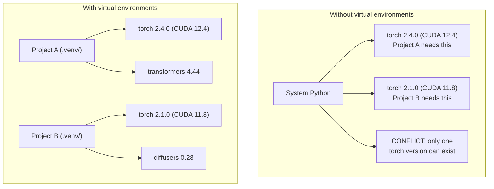

# Python môi trường . Python quản lý môi trường .

> Địa ngục phụ thuộc là thực tế.
> Tùy thuộc vào địa ngục là thực sự tồn tại.

**Type:** Build | **类型:** 构建
**Languages:** Shell | **语言:** Shell
**Prerequisites:** Phase 0, Lesson 01 | **前置知识:** Phase 0, 第 01 课
**Time:** ~30 minutes | **时间:** ~30 分钟

## Mục tiêu học tập

- Tạo môi trường ảo cách ly bằng cách sử dụng `uv`- `venv`, hoặc`conda`
  中文翻译:使用 `uv``venv`Hoặc`conda`创建隔离的虚拟环境
- Hãy viết một `pyproject.toml`với các nhóm phụ thuộc tùy chọn và tạo các tập tin khóa để tái tạo
  Trung ngữ翻译:编写带可选依赖组的 `pyproject.toml`, tạo file khóa  đảm bảo khả năng tái hiện
- Chẩn đoán và khắc phục các bẫy phổ biến: cài đặt toàn cầu, trộn pip / conda, sự không phù hợp của phiên bản CUDA
  Trung文翻译:诊断并修复常见问题: 全局安装、pip/conda 混用、CUDA 版本不匹配
- Thực hiện chiến lược môi trường từng giai đoạn cho các dự án có sự phụ thuộc mâu thuẫn
  Trung ngữ翻译: Quý hoạch môi trường phân chia theo giai đoạn để thực hiện các dự án phụ thuộc vào xung đột

> **【中文解读】**
> Python  dự án phụ thuộc vào xung đột là một trong những vấn đề phổ biến nhất trong phát triển AI.

## Vấn đề  vấn đề mô tả

Bạn cài đặt PyTorch 2.4 cho một dự án điều chỉnh tinh tế. Tuần tới, một dự án khác cần PyTorch 2.1 vì xây dựng CUDA của nó đã bị gắn. Bạn nâng cấp toàn cầu, và dự án đầu tiên bị phá vỡ. Bạn hạ cấp, và thứ hai bị phá vỡ.

> Bạn đã cài đặt PyTorch 2.4 cho một dự án nhỏ, một dự án khác vì CUDA xây dựng phiên bản khóa cần PyTorch 2.1,... bạn nâng cấp toàn bộ, dự án thứ nhất đã bị treo,... bạn hạ cấp, dự án thứ hai đã bị treo lại,...

Đây là địa ngục phụ thuộc. Nó xảy ra liên tục trong công việc AI / ML bởi vì:

> Đây là sự phụ thuộc vào địa ngục. Trong công việc AI/ML, điều này thường xảy ra, bởi vì:

- PyTorch, JAX và TensorFlow mỗi tàu kết nối CUDA của riêng họ
  Trung文翻译:PyTorch、JAX 和 TensorFlow 各自带 CUDA 绑定
- Các thư viện mô hình pin các phiên bản khung cụ thể
  Trung ngữ翻译:模型库锁定特定框架版本
- Một thế giới `pip install`viết qua bất cứ điều gì đã có trước đó
  Trung ngữ翻译:全局 `pip install`会覆盖之前安装的任何版本
- CUDA 11.8 xây dựng không hoạt động với các trình điều khiển CUDA 12.x (và ngược lại)
  Trung文翻译:CUDA 11.8 构建在CUDA 12.x 驱动上不工作(反之亦然)

Giải pháp: mỗi dự án có môi trường riêng biệt với các gói riêng của nó.

> Giải pháp: Mỗi dự án có môi trường riêng biệt, có một hệ thống phụ thuộc độc lập.

> **【中文解读】**
> "Trách nhiệm địa狱" là một sự phổ biến đặc biệt trong các dự án AI, vì PyTorch/JAX/TensorFlow tự mang CUDA 绑定,版本之间互不兼容.

## Khái niệm cốt lõi

> **【中文解读】**Dưới đây mô tả sự khác biệt giữa môi trường ảo và không có môi trường ảo: không có môi trường ảo, hệ thống Python chỉ có thể cài đặt một phiên bản của PyTorch, các dự án xung đột với nhau; có môi trường ảo, mỗi dự án có sự phụ thuộc độc lập, không gây nhiễu lẫn nhau.



## Hãy xây dựng nó.

> **【拓展：uv vs pip vs conda — 该选哪个？】**(1) **uv**(推):Rust 写的,比 pip 快 10-100 倍, tự động quản lý môi trường ảo,一行命令搞定 `uv venv && uv pip install`〔(2) **venv**Python được đặt trong, không cần thiết thiết lập, nhưng tốc độ chậm và năng lượng ít.**conda**:适合需求非 Python phụ thuộc vào tình huống như CUDA 库, nhưng môi trường khối lượng khổng lồ.
```figure
s0-env-isolation
```

## Hãy xây dựng nó

### Tùy chọn 1: uv venv (được khuyến cáo)

`uv`là trình quản lý gói Python nhanh nhất (10-100 lần nhanh hơn pip). Nó xử lý môi trường ảo, phiên bản Python và độ phân giải phụ thuộc trong một công cụ.

> `uv`là bộ quản lý gói Python nhanh nhất (((比 pip 快 10-100 倍) ⋅ nó trong một công cụ xử lý môi trường ảo ⋅ Python 版本和依赖解析。

```bash
curl -LsSf https://astral.sh/uv/install.sh | sh

uv python install 3.12

cd your-project
uv venv
source .venv/bin/activate
```

Lắp đặt gói:

> Ưu điểm:

```bash
uv pip install torch numpy
```

Tạo một dự án với `pyproject.toml`trong một bước:

> Một bước tạo `pyproject.toml`Các dự án:

```bash
uv init my-ai-project
cd my-ai-project
uv add torch numpy matplotlib
```

### Tùy chọn 2: venv (Built-in) 选项2:venv(Python 内置)

> **【中文解读】**venv là một công cụ môi trường ảo tự mang Python, không cần cài đặt bổ sung. Nhưng so với uv, nó sẽ không tự động quản lý phiên bản Python, cũng không tạo ra các tệp khóa.

Nếu không thể cài đặt `uv`, tàu Python với `venv`- Có thể là:

> Nếu không thể cài đặt `uv`,Python tự带 `venv`- Có thể là:

```bash
python3 -m venv .venv
source .venv/bin/activate  # Linux/macOS
.venv\Scripts\activate     # Windows

pip install torch numpy
```

Tốc chậm hơn `uv`, nhưng hoạt động ở mọi nơi Python được cài đặt.

> 比 `uv`慢, nhưng ở bất cứ nơi nào cài đặt Python đều có thể sử dụng.

### Tùy chọn 3: conda (Khi bạn cần nó)

Conda quản lý các phụ thuộc không phải Python như các bộ công cụ CUDA, cuDNN và thư viện C. Sử dụng nó khi:

> Conda 管理非 Python phụ thuộc vào, ví dụ như CUDA 工具包、cuDNN 和 C 库── trong các tình huống sau đây:

- Bạn cần một phiên bản cụ thể của bộ công cụ CUDA mà không cần cài đặt nó trên toàn hệ thống
  Trung ngữ翻译:需要特定 CUDA 工具包版本,但不希望全局安装
- Bạn đang ở trên một cluster chia sẻ nơi bạn không thể cài đặt các gói hệ thống
  Trung ngữ翻译: 在共享集群上,无法安装系统包
- Các hướng dẫn cài đặt của thư viện nói " Sử dụng conda "
  Trung ngữ翻译:库的安装说明写着" sử dụng conda"

```bash
# Install miniconda (not the full Anaconda)
curl -LsSf https://repo.anaconda.com/miniconda/Miniconda3-latest-Linux-x86_64.sh -o miniconda.sh
bash miniconda.sh -b

conda create -n myproject python=3.12
conda activate myproject

conda install pytorch torchvision torchaudio pytorch-cuda=12.4 -c pytorch -c nvidia
```

Một quy tắc: nếu bạn sử dụng conda cho một môi trường, hãy sử dụng conda cho tất cả các gói trong môi trường đó.`pip install`trong một conda env gây ra xung đột phụ thuộc mà là đau đớn để debug.

> Một条规则: Nếu sử dụng conda 管理环境,就用 conda 管理该环境的所有包──在 conda 环境中混用 `pip install`Sẽ dẫn đến khó khăn để điều chỉnh các xung đột phụ thuộc.

### Đối với khóa học này: Chiến lược từng giai đoạn

Bạn có thể tạo ra một môi trường cho toàn bộ khóa học. Không. Các giai đoạn khác nhau cần phụ thuộc khác nhau (thỉnh thoảng mâu thuẫn).

> Bạn có thể tạo ra một môi trường cho toàn bộ khóa học. Đừng làm như vậy.

Chiến lược:

> 策略:

```
ai-engineering-from-scratch/
├── .venv/                    <-- shared lightweight env for phases 0-3
├── phases/
│   ├── 04-neural-networks/
│   │   └── .venv/            <-- PyTorch env
│   ├── 05-cnns/
│   │   └── .venv/            <-- same PyTorch env (symlink or shared)
│   ├── 08-transformers/
│   │   └── .venv/            <-- might need different transformer versions
│   └── 11-llm-apis/
│       └── .venv/            <-- API SDKs, no torch needed
```

- Lịch bản trong `code/env_setup.sh`tạo ra môi trường cơ bản cho khóa học này.

> `code/env_setup.sh`Trung tâm văn bản sẽ tạo ra cơ sở môi trường của chương trình này.

## pyproject.toml Basic. pyproject.toml cơ sở

> **【拓展：pyproject.toml 是现代 Python 项目的标准配置】**Nó thay thế truyền thống.`setup.py`和 `requirements.txt`◊ một tài liệu xác định các dự án元数据、依赖、开发工具配置。AI 项目推 sử dụng các nhóm phụ thuộc tùy chọn 来区分训练依赖(`[train]`) và dựa vào`[serve]`), tránh được các bộ nhớ GPU không cần thiết trong môi trường sản xuất

Mỗi dự án Python nên có một `pyproject.toml`Nó thay thế`setup.py`- `setup.cfg`, và`requirements.txt`trong một tập tin.

> Mỗi dự án Python đều có thể được`pyproject.toml`Nó đã thay thế bằng một tài liệu.`setup.py``setup.cfg`和 `requirements.txt`

```toml
[project]
name = "ai-engineering-from-scratch"
version = "0.1.0"
requires-python = ">=3.11"
dependencies = [
    "numpy>=1.26",
    "matplotlib>=3.8",
    "jupyter>=1.0",
    "scikit-learn>=1.4",
]

[project.optional-dependencies]
torch = ["torch>=2.3", "torchvision>=0.18"]
llm = ["anthropic>=0.39", "openai>=1.50"]
```

Sau đó cài đặt:

> Sau đó cài đặt:

```bash
uv pip install -e ".[torch]"    # base + PyTorch
uv pip install -e ".[llm]"     # base + LLM SDKs
uv pip install -e ".[torch,llm]" # everything
```

## Các file khóa

Một tập tin khóa pin mọi phụ thuộc (bao gồm cả các phiên bản chuyển tiếp) thành phiên bản chính xác. Điều này đảm bảo khả năng tái tạo: bất cứ ai cài đặt từ tập tin khóa đều nhận được các gói chính xác.

> Lockfile sẽ được khóa vào phiên bản chính xác: bất cứ ai cài đặt trong lockfile đều có thể nhận được gói hoàn toàn giống nhau.

```bash
# uv generates uv.lock automatically when using uv add
uv add numpy

# pip-tools approach
uv pip compile pyproject.toml -o requirements.lock
uv pip install -r requirements.lock
```

Khi ai đó nhân bản repo, họ cài đặt từ khóa và nhận được các phiên bản giống nhau.

> Để cài đặt và nhận được phiên bản hoàn toàn giống nhau.

## Những sai lầm thường gặp

> **【中文解读】**Python 环境管理中最常见的 5 个错误:(1) 全局安装(用 `pip install`Không trong môi trường ảo; 2) 混用 pip 和 conda; 3) 忘记激活虚拟环境; 4) 把 `.venv`目录提交到 git;(5) CUDA 版本不匹配──以下逐个讲解和修复方法──

### 1. Lắp đặt trên toàn cầu

```bash
pip install torch  # BAD: installs to system Python

source .venv/bin/activate
pip install torch  # GOOD: installs to virtual environment
```

Kiểm tra nơi gói hàng của bạn đi:

> 检查你的包装在哪里:

```bash
which python       # should show .venv/bin/python, not /usr/bin/python
which pip           # should show .venv/bin/pip
```

### 2. Trộn pip và conda

```bash
conda create -n myenv python=3.12
conda activate myenv
conda install pytorch -c pytorch
pip install some-other-package   # BAD: can break conda's dependency tracking
conda install some-other-package # GOOD: let conda manage everything
```

Nếu bạn phải sử dụng pip bên trong conda (một số gói chỉ có pip), cài đặt tất cả các gói conda trước, sau đó các gói pip sẽ kéo dài.

> Nếu phải sử dụng pipe trong con số, hãy cài đặt tất cả con số, và cài đặt lại pipe.

### 3. Quên kích hoạt

```bash
python train.py           # uses system Python, missing packages
source .venv/bin/activate
python train.py           # uses project Python, packages found
```

Các lệnh shell của bạn sẽ hiển thị tên môi trường:

> Bạn của shell 提示符 nên hiển thị môi trường名称:

```
(.venv) $ python train.py
```

### 4. Cung cấp .venv để git

```bash
echo ".venv/" >> .gitignore
```

Môi trường ảo là 200MB-2GB. Chúng là địa phương, không di động giữa máy tính.`pyproject.toml`và thay vào đó là khóa.

> 虚拟环境 có 200MB-2GB. Chúng là bản địa, không thể được chuyển trên máy.`pyproject.toml`Và khóa file.

### 5. Phiên bản CUDA không phù hợp.

> **【拓展：CUDA 版本地狱】**PyTorch Mỗi phiên bản bị ràng buộc cụ thể CUDA  phiên bản( như PyTorch 2.4 → CUDA 12.4) ~~装错版本会出现"找不到 GPU"或奇异的运行时错──解决方案:先`nvidia-smi`确认驱动版本,再去 [pytorch.org](https://pytorch.org)查对应的安装命令.`uv pip install torch --index-url URL`指定 CUDA 版本──

```bash
nvidia-smi                # shows driver CUDA version (e.g., 12.4)
python -c "import torch; print(torch.version.cuda)"  # shows PyTorch CUDA version

# These must be compatible.
# PyTorch CUDA version must be <= driver CUDA version.
```

## Sử dụng nó Sử dụng hướng dẫn

> **【中文解读】**Chương trình này: mỗi giai đoạn tạo ra một môi trường ảo như`.venv-phase04`), để tránh xung đột phụ thuộc ở các giai đoạn khác nhau. Trong công trình AI, version incompatibility là nguyên nhân chính gây ra sự cố gắng, làm cho môi trường cách ly có thể tiết kiệm được nhiều thời gian thử nghiệm.

Dạy kịch bản cài đặt để tạo môi trường khóa học của bạn:

> 运行安装脚本 tạo khóa học môi trường:

```bash
bash phases/00-setup-and-tooling/06-python-environments/code/env_setup.sh
```

Điều này tạo ra một `.venv`tại gốc repo với các phụ thuộc cốt lõi được cài đặt và xác minh.

> Nó sẽ tạo ra một trong danh mục kho .`.venv`,并安装和验证核心依赖.

## Tập luyện bài tập

1. Đi chạy`env_setup.sh`và xác minh tất cả kiểm tra qua
   运行环境安装脚本, xác nhận tất cả kiểm tra thông qua
2. Tạo một môi trường ảo thứ hai, cài đặt một phiên bản khác của numpy trong nó, và xác nhận hai môi trường là cô lập
   Tạo một môi trường ảo thứ hai, cài đặt các phiên bản khác nhau của NumPy, xác nhận hai môi trường tách biệt
3. Hãy viết một `pyproject.toml`cho một dự án cần cả PyTorch và SDK Anthropic
   Để cùng một lúc cần PyTorch và Anthropic SDK viết các dự án `pyproject.toml`
4. Chuẩn bị cài đặt một gói trên toàn cầu (không kích hoạt venv), nhận thức nó đi đâu, sau đó gỡ bỏ cài đặt nó
   Vì vậy, cố gắng cài đặt một gói trong toàn bộ, để xem nó được cài đặt ở đâu, sau đó tải xuống.

## Từ khóa  Keyword

| Term | What people say | What it actually means |
|------|----------------|----------------------|
| Virtual environment | "A venv" | An isolated directory containing a Python interpreter and packages, separate from the system Python |
| Lockfile | "Pinned dependencies" | A file listing every package and its exact version, guaranteeing identical installs across machines |
| pyproject.toml | "The new setup.py" | The standard Python project configuration file, replacing setup.py/setup.cfg/requirements.txt |
| Transitive dependency | "A dependency of a dependency" | Package B depends on C; if you install A which depends on B, C is a transitive dependency of A |
| CUDA mismatch | "My GPU isn't working" | PyTorch was compiled for a different CUDA version than what your GPU driver supports |

| 术语 | 俗称 | 实际含义 |
|------|------|---------|
| Virtual environment | "venv" | 包含独立 Python 解释器和包的隔离目录 |
| Lockfile | "锁定依赖" | 记录每个包精确版本的文件，确保跨机器安装一致 |
| pyproject.toml | "新版 setup.py" | Python 项目标准配置文件，替代 setup.py 和 requirements.txt |
| Transitive dependency | "依赖的依赖" | A 依赖 B，B 依赖 C，C 就是 A 的传递依赖 |
| CUDA mismatch | "GPU 不工作" | PyTorch 编译时的 CUDA 版本与 GPU 驱动不匹配 |
