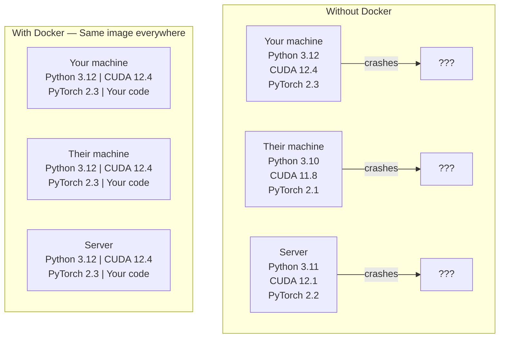

# Docker cho AI  Docker 容器 hóa AI  ứng dụng

> Các container làm cho "các công việc trên máy của tôi" là một điều của quá khứ.
> 容器让"My机器上能跑" trở thành lịch sử.

**Type:** Build | **类型:** 构建
**Languages:** Docker | **语言:** Docker
**Prerequisites:** Phase 0, Lessons 01 and 03 | **前置知识:** Phase 0, 第 01 课和第 03 课
**Time:** ~60 minutes | **时间:** ~60 分钟

## Mục tiêu học tập

- Xây dựng hình ảnh Docker có khả năng GPU với CUDA, PyTorch và thư viện AI từ Dockerfile
  Trung文翻译: từ Dockerfile 构建支持 GPU của Docker 镜像, chứa CUDA、PyTorch 和 AI 库
- Lắp đặt thư mục chủ nhà như khối lượng để duy trì các mô hình, tập hợp dữ liệu và mã trên các container xây dựng lại
  Trung ngữ翻译:挂载宿主目录为卷, giữ mô hình, tập dữ liệu và mã hóa trong hộp đựng sau khi xây dựng lại
- Cài đặt NVIDIA Container Toolkit để lộ GPU bên trong container
  Trung文翻译: cấu hình NVIDIA Container Toolkit, trong容器内暴露 GPU
- Phong phối các ứng dụng AI đa dịch vụ (tạm dịch máy chủ suy luận + cơ sở dữ liệu vector) bằng cách sử dụng Docker Compose
  Trung文翻译: sử dụng Docker Composing 编排多服务 AI 应用(推理服务器 + 向量数据库)

> **【中文解读】**
> Docker đặt mã, thời gian vận hành, kho và các công cụ hệ thống được gói thành một "hộp", đảm bảo kết quả vận hành trên bất kỳ máy tính nào phù hợp.

## Vấn đề  vấn đề mô tả

Bạn đã huấn luyện một mô hình trên máy tính xách tay của mình với PyTorch 2.3, CUDA 12.4 và Python 3.12. đồng nghiệp của bạn có PyTorch 2.1, CUDA 11.8 và Python 3.10. mô hình của bạn bị hỏng trên máy tính của họ. Dockerfile của bạn hoạt động trên cả hai.

> Bạn đã sử dụng PyTorch 2.3 ̊CUDA 12.4 ̊Python 3.12 ̊ trên máy tính để bàn. Bạn đã tập luyện một mô hình. Bạn đang sử dụng PyTorch 2.1 ̊CUDA 11.8 ̊Python 3.10 ̊. Mô hình trên máy tính của mình bị sập.

Các dự án AI là những cơn ác mộng phụ thuộc. Một tập hợp điển hình bao gồm Python, PyTorch, trình điều khiển CUDA, cuDNN, thư viện C cấp hệ thống và các gói chuyên dụng như flash-attn cần các phiên bản biên dịch chính xác. Docker đóng gói tất cả trong một hình ảnh duy nhất chạy giống nhau ở khắp mọi nơi.

> AI là một dự án dựa trên quản lý. Các kỹ thuật điển hình bao gồm Python, PyTorch, CUDA, ổ đĩa, cuDNN, hệ thống cấp C, cũng như cần một gói đặc biệt của phiên bản biên dịch viên cụ thể như flash-attn. Docker đặt tất cả các gói này thành một tấm gương hoạt động phù hợp ở bất cứ nơi nào.

> **【中文解读】**
> AI 项目是Docker's most needing project types之一──CUDA 版本不兼容、PyTorch 版本冲突、cuDNN 缺失 这些问题用Docker 一次性解决──

## Khái niệm cốt lõi

> **【拓展：Docker 在 AI 中的三大用途】**(1) **环境一致性**: mô hình được đào tạo trên máy tính của mình, được triển khai đến máy chủ sẽ không bị lỗi vì phiên bản thư viện khác nhau;**GPU 隔离**:多人共享一台 GPU 服务器, mỗi người một容器互不干扰;(3) **一键部署**- Có thể là:`docker run`Một条命令启动完整的AI 服务(模型 + API + 前端),无需手动配置──Hugging Face 的TGI、vLLM等推理框架都提供Docker 镜像──

Docker bọc mã, thời gian chạy, thư viện và công cụ hệ thống của bạn vào một đơn vị riêng biệt được gọi là container. Hãy nghĩ về nó như một máy ảo nhẹ, ngoại trừ nó chia sẻ lõi OS chủ thay vì chạy riêng của nó, vì vậy nó bắt đầu trong giây thay vì phút.

> Docker sẽ gói mã của bạn, thời gian vận hành, thư viện và các công cụ hệ thống thành một đơn vị tách biệt được gọi là "container". Bạn có thể tưởng tượng nó như một máy ảo hạng nhẹ, chỉ có thể chia sẻ lõi của hệ điều hành chủ chứ không phải chạy lõi của riêng mình, vì vậy khởi động chỉ mất vài giây thay vì vài phút.



### Tại sao các dự án AI cần Docker nhiều hơn hầu hết. Tại sao các dự án AI đặc biệt cần Docker?

> **【中文解读】**AI 项目目的依赖链特别深:Python → PyTorch → CUDA → cuDNN → 系统级 C 库。 bất kỳ phiên bản một tầng nào không phù hợp đều sẽ dẫn đến sự sụp đổ của đào tạo hoặc kết quả suy đoán không phù hợp。Docker Đặt tất cả các tầng đòn vào một tấm gương, đảm bảo" trên máy của tôi có thể chạy" trở thành" ở bất cứ nơi nào có thể chạy"。

1. **GPU drivers are fragile.**Mã CUDA 12.4 không chạy trên CUDA 11.8. Docker cô lập bộ công cụ CUDA bên trong container trong khi chia sẻ trình điều khiển GPU chủ thông qua bộ công cụ container NVIDIA.

> 1. **GPU 驱动很脆弱。**CUDA 12.4 có thể được sử dụng trên CUDA 11.8 trên. Docker thông qua NVIDIA Container Toolkit trong các thiết bị CUDA.

2. **Model weights are large.**Một mô hình tham số 7B là 14 GB trong fp16. Bạn không muốn tải lại nó mỗi khi bạn xây dựng lại.

> 2. **模型权重很大。**7B 参数的模型在fp16 下有14GB──你不想每次重建容器都重新下载──Docker卷让你从主机挂载模型目录──

3. **Multi-service architectures are common.**Một ứng dụng AI thực sự không chỉ là một kịch bản Python. Nó là một máy chủ suy luận, một cơ sở dữ liệu vector cho RAG, có lẽ là một đầu tiên web. Docker Compose dàn xếp tất cả những điều này với một lệnh.

> 3. **多服务架构很常见。**Thực tế AI  ứng dụng không chỉ là một Python 脚本. Nó chứa các máy chủ tính ra ra sao, RAG DATABASE DATABASE DATABASE DATABASE DATABASE DATABASE DATABASE DATABASE DATABASE DATABASE DATABASE DATABASE DATABASE DATABASE DATABASE DATABASE DATABASE DATABASE DATABASE DATABASE DATABASE DATABASE DATABASE DATABASE DATABASE DATABASE DATABASE DATABASE DATABASE DATABASE DATABASE DATABASE DATABASE DATABASE DATABASE DATABASE DATABASE DATABASE DATABASE DATABASE DATABASE DATABASE DATABASE DATABASE DATABASE DATABASE DATABASE DATABASE DATABASE DATABASE DATABASE DATABASE DATABASE DATABASE DATABASE DATABASE DATABASE DATABASE DATABASE DATABASE DATABASE DATABASE DATABASE DATABASE DATABASE DATABASE DATABASE DATABASE DATABASE DATABASE DATABASE DATABASE DATABASE DATABASE DATABASE DATABASE DATABASE DATABASE DATABASE DATABASE DATABASE DATABASE DATABASE DATABASE DATABASE DATABASE DATABASE DATABASE DATABASE DATABASE DATABASE DATABASE DATABASE DATABASE DATABASE DATABASE DATABASE DATABASE DATABASE DATABASE DATABASE DATABASE DATABASE DATABASE DATABASE DATABASE DATABASE DATABASE DATABASE DATABASE DATABASE DATABASE DATABASE DATABase DATABase DATABase DATABase DATABase DATABase DATABase DATAB

### Từ khóa khóa 核心词汇

| Term | What it means |
|------|---------------|
| Image | A read-only template. Your recipe. Built from a Dockerfile. |
| Container | A running instance of an image. Your kitchen. |
| Dockerfile | Instructions to build an image. Layer by layer. |
| Volume | Persistent storage that survives container restarts. |
| docker-compose | A tool for defining multi-container applications in YAML. |

| 术语 | 含义 |
|------|------|
| Image（镜像） | 只读模板，相当于菜谱。由 Dockerfile 构建。 |
| Container（容器） | 镜像的运行实例，相当于厨房。 |
| Dockerfile | 构建镜像的指令文件，逐层定义。 |
| Volume（卷） | 持久化存储，容器重启后数据不丢失。 |
| docker-compose | 用 YAML 定义多容器应用的编排工具。 |

### Mô hình container phổ biến trong AI Ứng dụng AI trong mô hình container phổ biến

> **【拓展：AI 部署的标准模式】**最常见的 AI 容器模式:(1) **训练容器**挂载数据集目录, training完完输出模型权重;(2) **推理容器**加载模型权重,提供 REST API;(3) **Jupyter 容器**预装所有库的笔记本 环境──Hugging Face、NVIDIA NGC  đã cung cấp một lượng lớn các hình ảnh cơ sở AI được xây dựng trước.

```
Dev Container
  Full toolkit. Editor support. Jupyter. Debugging tools.
  Used during development and experimentation.

Training Container
  Minimal. Just the training script and dependencies.
  Runs on GPU clusters. No editor, no Jupyter.

Inference Container
  Optimized for serving. Small image. Fast cold start.
  Runs behind a load balancer in production.
```

## Hãy xây dựng nó.
```figure
s0-image-layers
```

## Hãy xây dựng nó

### Bước 1: Lắp đặt Docker

```bash
# macOS
brew install --cask docker
open /Applications/Docker.app

# Ubuntu
curl -fsSL https://get.docker.com | sh
sudo usermod -aG docker $USER
# Log out and back in for group change to take effect
```

Kiểm tra:

> 验证安装:

```bash
docker --version
docker run hello-world
```

### Bước 2: Lắp đặt NVIDIA Container Toolkit (Linux với NVIDIA GPU)

Điều này cho phép các container Docker truy cập vào GPU của bạn. người dùng macOS và Windows (WSL2) có thể bỏ qua điều này; Docker Desktop xử lý GPU qua các nền tảng khác nhau.

> Điều này cho phép Docker 容器 truy cập vào GPU của bạn. MacOS và Windows (WSL2) người dùng có thể nhảy qua các bước này.

```bash
distribution=$(. /etc/os-release;echo $ID$VERSION_ID)
curl -fsSL https://nvidia.github.io/libnvidia-container/gpgkey | sudo gpg --dearmor -o /usr/share/keyrings/nvidia-container-toolkit-keyring.gpg
curl -s -L https://nvidia.github.io/libnvidia-container/$distribution/libnvidia-container.list | \
    sed 's#deb https://#deb [signed-by=/usr/share/keyrings/nvidia-container-toolkit-keyring.gpg] https://#g' | \
    sudo tee /etc/apt/sources.list.d/nvidia-container-toolkit.list

sudo apt-get update
sudo apt-get install -y nvidia-container-toolkit
sudo nvidia-ctk runtime configure --runtime=docker
sudo systemctl restart docker
```

Kiểm tra truy cập GPU bên trong thùng:

> 测试容器内 GPU 访问:

```bash
docker run --rm --gpus all nvidia/cuda:12.4.1-base-ubuntu22.04 nvidia-smi
```

Nếu bạn thấy thông tin GPU của bạn, bộ công cụ đang hoạt động.

> Nếu có thể nhìn thấy thông tin của GPU, hãy nói rằng công việc của toolbox là bình thường.

### Bước 3: Nghĩ hình ảnh cơ bản Bước 3: Nghĩ hình ảnh cơ bản

> **【中文解读】**基础镜像是 Dockerfile 的起点──AI 项目推使用NVIDIA 官方的 CUDA 镜像(`nvidia/cuda:12.4.0-devel-ubuntu22.04`) hoặc PyTorch 官方镜像(`pytorch/pytorch:2.4.0-cuda12.4`), chúng được cài đặt sẵn trong CUDA 运行时和深度学习库.

Chọn hình ảnh cơ sở đúng sẽ giúp tiết kiệm nhiều giờ để gỡ lỗi.

> 选择正确的基础镜像能节省 vài giờ của thời gian điều tra.

```
nvidia/cuda:12.4.1-devel-ubuntu22.04
  Full CUDA toolkit. Compilers included.
  Use for: building packages that need nvcc (flash-attn, bitsandbytes)
  Size: ~4 GB

nvidia/cuda:12.4.1-runtime-ubuntu22.04
  CUDA runtime only. No compilers.
  Use for: running pre-built code
  Size: ~1.5 GB

pytorch/pytorch:2.6.0-cuda12.4-cudnn9-runtime
  PyTorch pre-installed on top of CUDA.
  Use for: skipping the PyTorch install step
  Size: ~6 GB

python:3.12-slim
  No CUDA. CPU only.
  Use for: inference on CPU, lightweight tools
  Size: ~150 MB
```

### Bước 4: Tạo Dockerfile cho phát triển AI

Đây là hồ sơ Docker trong `code/Dockerfile`Đi qua nó:

> Đó là `code/Dockerfile`Trung tâm Dockerfile. Chúng ta từng bước qua lại:

```dockerfile
FROM nvidia/cuda:12.4.1-devel-ubuntu22.04

ENV DEBIAN_FRONTEND=noninteractive
ENV PYTHONUNBUFFERED=1

RUN apt-get update && apt-get install -y --no-install-recommends \
    software-properties-common \
    git \
    curl \
    build-essential \
    && add-apt-repository -y ppa:deadsnakes/ppa \
    && apt-get update && apt-get install -y --no-install-recommends \
    python3.12 \
    python3.12-venv \
    python3.12-dev \
    && rm -rf /var/lib/apt/lists/*

RUN update-alternatives --install /usr/bin/python python /usr/bin/python3.12 1

RUN curl -sSL https://raw.githubusercontent.com/pypa/get-pip/3b73145063be545b649ad9ca83ea8da5fc915a4f/public/get-pip.py -o /tmp/get-pip.py \
    && echo "a341e1a43e38001c551a1508a73ff23636a11970b61d901d9a1cad2a18f57055  /tmp/get-pip.py" | sha256sum -c - \
    && python /tmp/get-pip.py \
    && rm /tmp/get-pip.py \
    && update-alternatives --install /usr/bin/pip pip /usr/local/bin/pip3.12 1

RUN python -m pip install --no-cache-dir --upgrade pip setuptools wheel

RUN python -m pip install --no-cache-dir \
    torch==2.6.0+cu124 \
    torchvision==0.21.0+cu124 \
    torchaudio==2.6.0+cu124 \
    --index-url https://download.pytorch.org/whl/cu124

RUN python -m pip install --no-cache-dir \
    numpy \
    pandas \
    scikit-learn \
    matplotlib \
    jupyter \
    transformers \
    datasets \
    accelerate \
    safetensors

WORKDIR /workspace

VOLUME ["/workspace", "/models"]

EXPOSE 8888

CMD ["python"]
```

Hãy xây dựng nó:

> 构建镜像:

```bash
docker build -t ai-dev -f phases/00-setup-and-tooling/07-docker-for-ai/code/Dockerfile .
```

Điều này mất một thời gian lần đầu tiên (tải xuống hình ảnh cơ sở CUDA + PyTorch).

> 首次构建需要一些时间(下载 CUDA 基础镜像 + PyTorch) ⋅后续构建会使用缓存的层──

Đi đi.

> 运行容器:

```bash
docker run --rm -it --gpus all \
    -v $(pwd):/workspace \
    -v ~/models:/models \
    ai-dev python -c "import torch; print(f'PyTorch {torch.__version__}, CUDA: {torch.cuda.is_available()}')"
```

Đưa Jupyter vào trong thùng:

> Trong容器内运行 Jupyter:

```bash
docker run --rm -it --gpus all \
    -v $(pwd):/workspace \
    -v ~/models:/models \
    -p 8888:8888 \
    ai-dev jupyter notebook --ip=0.0.0.0 --port=8888 --no-browser --allow-root
```

### Bước 5: Lắp đặt khối lượng cho dữ liệu và mô hình

Các bộ sạc khối lượng rất quan trọng cho công việc AI. Nếu không có chúng, các tải về mô hình 14 GB của bạn sẽ biến mất khi container dừng lại.

> 卷挂载对 AI 工作至关重要――没有它们,你下载的14GB 模型在容器停止时就会消失――

```bash
# Mount your code
-v $(pwd):/workspace

# Mount a shared models directory
-v ~/models:/models

# Mount datasets
-v ~/datasets:/data
```

Bên trong kịch bản huấn luyện của bạn, tải từ đường mòn gắn:

> Trong bài tập tập, từ ải tải tải:

```python
from transformers import AutoModel

model = AutoModel.from_pretrained("/models/llama-7b")
```

Mô hình sống trên hệ thống tệp chủ của bạn.

> 模型存储在主机文件系统上. Bạn có thể tự động xây dựng lại container, không cần phải tải lại.

### Bước 6: Docker Compose cho các ứng dụng AI đa dịch vụ

Một ứng dụng RAG thực sự cần một máy chủ suy luận và một cơ sở dữ liệu vector. Docker Compose chạy cả hai với một lệnh.

> Thực tế RAG  ứng dụng cần phải tính toán máy chủ và kho dữ liệu khối lượng. Docker Compose sử dụng một lệnh cùng chạy hai.

Nhìn xem`code/docker-compose.yml`- Có thể là:

```yaml
services:
  ai-dev:
    build:
      context: .
      dockerfile: Dockerfile
    deploy:
      resources:
        reservations:
          devices:
            - driver: nvidia
              count: all
              capabilities: [gpu]
    volumes:
      - ../../../:/workspace
      - ~/models:/models
      - ~/datasets:/data
    ports:
      - "8888:8888"
    stdin_open: true
    tty: true
    command: jupyter notebook --ip=0.0.0.0 --port=8888 --no-browser --allow-root

  qdrant:
    image: qdrant/qdrant:v1.12.5
    ports:
      - "6333:6333"
      - "6334:6334"
    volumes:
      - qdrant_data:/qdrant/storage

volumes:
  qdrant_data:
```

Bắt đầu mọi thứ:

> 启动所有服务:

```bash
cd phases/00-setup-and-tooling/07-docker-for-ai/code
docker compose up -d
```

Bây giờ container AI của bạn có thể truy cập vào cơ sở dữ liệu vector tại `http://qdrant:6333`Docker Compose tự động tạo ra một mạng chia sẻ.

> Bây giờ AI  phát triển dung lượng có thể thông qua dịch vụ `http://qdrant:6333`访问量数据库──Docker Compose 自动创建共享网络──

Kiểm tra kết nối từ bên trong container AI:

> Từ AI 容器内部测试连接:

```python
from qdrant_client import QdrantClient

client = QdrantClient(host="qdrant", port=6333)
print(client.get_collections())
```

Đừng mọi thứ.

> 停止所有服务:

```bash
docker compose down
```

Thêm `-v`để xóa thêm khối lượng qdrant:

> 加 `-v`Đồng thời xóa qudrant 卷:

```bash
docker compose down -v
```

### Bước 7: Các lệnh Docker hữu ích cho công việc AI

> 第7步:AI 工作中常用 Docker 命令

```bash
# List running containers
docker ps

# List all images and their sizes
docker images

# Remove unused images (reclaim disk space)
docker system prune -a

# Check GPU usage inside a running container
docker exec -it <container_id> nvidia-smi

# Copy a file from container to host
docker cp <container_id>:/workspace/results.csv ./results.csv

# View container logs
docker logs -f <container_id>
```

## Sử dụng nó Sử dụng hướng dẫn

> **【拓展：Docker vs Conda 选择指南】**简单项目用Conda/uv 即可;需要部署或多人协作时使用Docker。 Luật kinh nghiệm: Nếu bạn nói "Tôi trên máy tính có thể chạy", bạn nên sử dụngDocker 了── Phần lớn các khóa học trong khóa học này không cần Docker, nhưng giai đoạn 17 (Phase 17 (Phần 17) cơ sở hạ tầng và sản xuất) sẽ được sử dụng sâu sắc──

Bây giờ bạn có một môi trường phát triển AI tái tạo.

> Bạn đã có một môi trường phát triển AI có thể thực hiện được.

- Sử dụng `docker compose up`để bắt đầu môi trường phát triển của bạn và cơ sở dữ liệu vector cùng nhau
  中文翻译:使用 `docker compose up`Đồng thời bắt đầu phát triển môi trường và dữ liệu khối lượng
- Lắp đặt mã, mô hình và dữ liệu của bạn như khối lượng để không có gì bị mất giữa các xây dựng lại
  Trung ngữ翻译:将代码、模型和数据挂载为卷, tái xây dựng sau đó sẽ không bị mất
- Khi một bài học yêu cầu một gói Python mới, thêm nó vào Dockerfile và xây dựng lại
  Trung ngữ翻译:当课程需要新的Python 包时,添加到Dockerfile并重建
- Chia sẻ tập tin Docker của bạn với các đồng đội.
  Trung ngữ翻译:与队友共享 Dockerfile, họ nhận được hoàn toàn cùng một môi trường

### Không có GPU?

Tắt `--gpus all`Trình chứa vẫn hoạt động cho các bài học dựa trên CPU. PyTorch phát hiện sự vắng mặt của CUDA và tự động quay lại CPU.

> 移除 `--gpus all`标志和 NVIDIA triển khai 配置块──容器 vẫn có thể được sử dụng dựa trên các khóa học dựa trên CPU──PyTorch 会自动检测 CUDA không tồn tại并回归CPU──

## Tập luyện bài tập

1. Xây dựng Dockerfile và chạy `python -c "import torch; print(torch.__version__)"`bên trong thùng
   构建 Docker 镜像, trong容器运行 PyTorch 验证
2. Bắt đầu các tập hợp docker và xác minh Qdrant là có thể truy cập từ container AI tại `http://qdrant:6333/collections`
   启动 docker-compose ,验证 Qdrant 向量数据库可访问
3. Thêm `flask`để Dockerfile, xây dựng lại, và chạy một máy chủ API đơn giản trên cổng 5000.`-p 5000:5000`
   Trong Dockerfile 中添加瓶, tái xây dựng镜像,运行 API 服务器
4. Đo kích thước hình ảnh bằng `docker images`Hãy thử chuyển hình ảnh cơ bản từ`devel`đến`runtime`và so sánh kích thước
    đo lường hình ảnh kích thước, so với độ phát triển và thời gian chạy  cơ sở hình ảnh khác biệt khối lượng

## Từ khóa  Keyword

| Term | What people say | What it actually means |
|------|----------------|----------------------|
| Container | "Lightweight VM" | An isolated process using the host kernel, with its own filesystem and network |
| Image layer | "Cached step" | Each Dockerfile instruction creates a layer. Unchanged layers are cached, so rebuilds are fast. |
| NVIDIA Container Toolkit | "GPU in Docker" | A runtime hook that exposes host GPUs to containers via `--gpus` flag |
| Volume mount | "Shared folder" | A directory on the host mapped into the container. Changes persist after the container stops. |
| Base image | "Starting point" | The `FROM` image your Dockerfile builds on top of. Determines what is pre-installed. |

| 术语 | 俗称 | 实际含义 |
|------|------|---------|
| Container | "轻量虚拟机" | 使用宿主内核的隔离进程，拥有独立文件系统和网络 |
| Image layer | "缓存层" | 每条 Dockerfile 指令创建一层，未修改的层会被缓存 |
| NVIDIA Container Toolkit | "Docker 中的 GPU" | 通过 `--gpus` 标志将宿主 GPU 暴露给容器的运行时钩子 |
| Volume mount | "共享文件夹" | 宿主目录映射到容器内，容器停止后数据保留 |
| Base image | "起点" | Dockerfile 的 FROM 镜像，决定了预装内容 |
