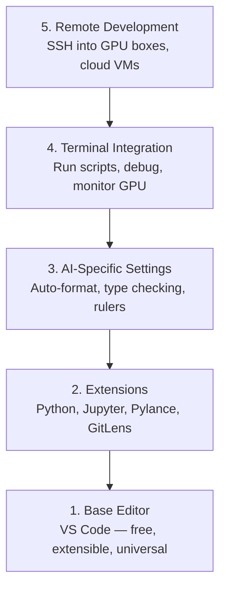

# Thiết lập biên tập viên

> Thư biên tập của bạn là phi công đồng hành của bạn, hãy cấu hình nó một lần để nó không cản đường bạn và bắt đầu kéo trọng lượng của nó.
> 编辑器 là phụ lái của bạn. Đặt một lần, để nó không còn bị cản trở, mà thực sự thực hiện tác dụng.

**Type:** Build | **类型:** 构建
**Languages:** -- | **语言:** 无
**Prerequisites:** Phase 0, Lesson 01 | **前置知识:** Phase 0, 第 01 课
**Time:** ~20 minutes | **时间:** ~20 分钟

## Mục tiêu học tập

- Lắp đặt VS Code với các phần mở rộng thiết yếu cho Python, Jupyter, linting và SSH từ xa
  Trung文翻译:安装 VS Code 及 Python、Jupyter、代码检查和远程 SSH等必备扩展
- Thiết lập định dạng trên lưu, kiểm tra kiểu và cuộn sản xuất notebook cho các workflow AI
  Trung文翻译:配置保存时格式化、类型检查和笔记本 输出滚动等 AI 工作流设置
- Thiết lập Remote SSH để chỉnh sửa và gỡ lỗi mã trên máy GPU từ xa như thể chúng là địa phương
  Trung文翻译: cài đặt Remote SSH,像编辑本地文件一样编辑和调试远程 GPU 机器上的代码
- Đánh giá các lựa chọn thay thế của biên tập viên (Cursor, Windsurf, Neovim) và sự thỏa hiệp của chúng cho công việc AI
  Trung文翻译:评估编辑器替代方案 ((Cursor、Windsurf、Neovim) và những điểm xấu trong AI 工作中的优劣

> **【中文解读】**
> 编辑器 là công cụ chủ lực của bạn viết mã. 本章 giúp bạn configure VS Code dùng để phát triển AI:Python 支持、Jupyter 集成、远程SSH 连接 GPU 服务器── configure một lần, benefit the whole course──

## Vấn đề  vấn đề mô tả

Bạn sẽ dành hàng ngàn giờ trong biên tập viên của mình viết Python, chạy sổ ghi chép, gỡ lỗi vòng đào tạo và SSH vào các hộp GPU. Một biên tập viên không được cấu hình đúng cách biến mỗi phiên thành chi phối: không hoàn thành tự động, không có gợi ý kiểu chữ, không có lỗi đường thẳng, định dạng thủ công và một dòng công việc cuối cùng khó xử lý.

> Bạn sẽ dành hàng ngàn giờ trong trình chỉnh sửa để viết Python, chạy Notebook, điều chỉnh vòng tập luyện, kết nối GPU với máy chủ. Một trình chỉnh sửa không đúng sẽ khiến mỗi lần chỉnh sửa trở thành một sự đau khổ: không có tự động hoàn chỉnh, không có kiểu gợi ý, không có liên kết sai lầm gợi ý, định dạng thủ công, không có kết thúc.

Việc thiết lập đúng cách mất 20 phút, bỏ qua nó sẽ tốn 20 phút mỗi ngày.

> Việc sắp xếp đúng chỉ mất 20 phút. Việc nhảy qua sẽ khiến bạn lãng phí 20 phút mỗi ngày.

> **【中文解读】**
> 配置编辑器 chỉ mất 20 phút, nhưng không配置 sẽ khiến bạn lãng phí hơn 20 phút mỗi ngày.

## Khái niệm cốt lõi

Một thiết lập biên tập kỹ thuật AI cần năm điều:

> AI 工程编辑器 cần cấu hình 5 tầng:



> **【中文解读】**
> AI  phát triển biên tập viên cần 5 tầng cấu hình: cơ sở biên tập viên →  mở rộng phụ kiện → AI  chuyên dụng thiết lập → 终端集成 → 远程开发── trong đó远程 SSH  phát triển là quan trọng nhất bạn cần phải trực tiếp vận hành trong bản địa biên tập viên GPU 服务器──
```figure
s0-lsp-roundtrip
```

## Hãy xây dựng nó

## Hãy xây dựng nó.

> **【拓展：VS Code 为什么是 AI 开发的首选编辑器】**VS Code trong AI  phát triển chiếm ưu thế trong các nguyên nhân:(1) 免费且轻量;(2) Jupyter Notebook 原生支持;(3) Remote SSH 直接连接 GPU 服务器编辑代码;(4) Python/Jupyter/Python Debugger 扩展生态完善;(5) AI 辅助编程扩展(Copilot、Cline、Continue) 开箱即用──Cursor 和 Windsurf 是基于 VS Code 的 AI 增强版本,也值得尝试──

### Bước 1: Lắp đặt mã VS.

VS Code là trình chỉnh sửa được khuyến cáo. Nó miễn phí, chạy trên mọi hệ điều hành, có hỗ trợ máy tính xách tay Jupyter hạng nhất, và hệ sinh thái mở rộng bao gồm tất cả mọi thứ bạn cần cho công việc AI.

> VS Code là một trình chỉnh sửa được đề xuất. Nó miễn phí.

Tải nó từ [code.visualstudio.com](https://code.visualstudio.com/)- Tôi không biết.

> Từ [code.visualstudio.com](https://code.visualstudio.com/)- Thả xuống.

Kiểm tra từ đầu cuối:

> Trong kết thúc:

```bash
code --version
```

Nếu`code`không được tìm thấy trên macOS, mở VS Code, nhấn `Cmd+Shift+P`, gõ "Shell Command", và chọn "Install 'code' command in PATH".

> Nếu macOS 上 tìm không đến`code`命令,打开 VS Code,按 `Cmd+Shift+P`,输入 "Shell Command", chọn "Install 'code' command in PATH"。

### Bước 2: Lắp đặt các tiện ích mở rộng thiết yếu.

> **【中文解读】**AI 开发必备的 VS Code 扩展:Python(调试+Lint) 、Jupyter(在编辑器运行 Notebook) 、Pylance(智能补全和类型检查) 、GitLens(查看代码历史) ⋅安装后在设置中启动"保存时格式化",从此不用手动整理代码──

Mở đầu cuối tích hợp trong mã VS (`` Ctrl+``` trên mọi nền tảng) và cài đặt các phần mở rộng quan trọng cho công việc AI:

> 打开 VS Code 的集成终端(`Ctrl+`` `hoặc `` Cmd+```), cài đặt AI 工作所需的关键扩展:

```bash
code --install-extension ms-python.python
code --install-extension ms-python.vscode-pylance
code --install-extension ms-toolsai.jupyter
code --install-extension eamodio.gitlens
code --install-extension ms-vscode-remote.remote-ssh
code --install-extension ms-python.debugpy
code --install-extension ms-python.black-formatter
code --install-extension charliermarsh.ruff
```

Mỗi người làm gì:

> Mỗi tác dụng mở rộng:

| Extension | Why |
|-----------|-----|
| Python | Language support, virtual env detection, run/debug |
| Pylance | Fast type checking, autocomplete, import resolution |
| Jupyter | Run notebooks inside VS Code, variable explorer |
| GitLens | See who changed what, inline git blame |
| Remote SSH | Open a folder on a remote GPU box as if it were local |
| Debugpy | Step-through debugging for Python |
| Black Formatter | Auto-format on save, consistent style |
| Ruff | Fast linting, catches common mistakes |

Lưu tập`code/.vscode/extensions.json`trong bài học này chứa danh sách khuyến nghị đầy đủ. Khi bạn mở thư mục dự án, VS Code sẽ yêu cầu bạn cài đặt chúng.

> 本课中 `code/.vscode/extensions.json`包含完整的推列表──当你打开项目文件时,VS Code 会提示你安装──

### Bước 3: Cài đặt cài đặt

Tải lại cài đặt từ `code/.vscode/settings.json`trong bài học này, hoặc áp dụng chúng bằng tay qua `Settings > Open Settings (JSON)`- Tôi không biết.

> Từ本课的 `code/.vscode/settings.json`复制设置, hoặc thông qua `Settings > Open Settings (JSON)`Làm việc bằng tay.

Các thiết lập chính cho công việc AI:

> AI 工作的关键设置:

```jsonc
{
    "python.analysis.typeCheckingMode": "basic",
    "editor.formatOnSave": true,
    "editor.rulers": [88, 120],
    "notebook.output.scrolling": true,
    "files.autoSave": "afterDelay"
}
```

Tại sao chúng quan trọng:

> Tại sao các thiết lập này rất quan trọng:

- **Type checking on basic**: Nhận sai các loại lập luận trước khi bạn chạy. Giữ thời gian gỡ lỗi trên các sự không phù hợp hình dạng tensor và các tham số API sai.
  Trung ngữ翻译:**基础类型检查**: trong vận hành trước bắt được các loại tham số sai lầm.
- **Format on save**Đừng bao giờ nghĩ về định dạng nữa.
  Trung ngữ翻译:**保存时格式化**: không cần phải xem xét hình thức hóa.
- **Rulers at 88 and 120**: Mở màu đen ở 88. Các dấu hiệu 120 cho thấy khi các chuỗi tài liệu và bình luận đang trở nên quá dài.
  Trung ngữ翻译:**88 和 120 标尺**:Black 在 88 处换行──120 标尺显示文档字符串和注释是否过长──
- **Notebook output scrolling**: Các vòng huấn luyện in hàng ngàn dòng.
  Trung ngữ翻译:**Notebook 输出滚动**: Training cycle printed thousands of lines. Không có xoay, xuất bảng sẽ nổ ra.
- **Auto-save**: Bạn sẽ quên lưu. kịch bản huấn luyện của bạn sẽ chạy mã lỗi thời. tự động lưu ngăn chặn điều đó.
  Trung ngữ翻译:**自动保存**Bạn sẽ quên lưu lại.

### Bước 4: Kết hợp đầu cuối

Các kết nối kết nối của VS Code là nơi bạn chạy các kịch bản đào tạo, giám sát GPU, và quản lý môi trường.

> Kết thúc tích hợp của VS Code là nơi bạn chạy tập luyện văn bản, giám sát GPU và quản lý môi trường.

Đặt nó đúng cách:

> 正确设置:

```jsonc
{
    "terminal.integrated.defaultProfile.osx": "zsh",
    "terminal.integrated.defaultProfile.linux": "bash",
    "terminal.integrated.fontSize": 13,
    "terminal.integrated.scrollback": 10000
}
```

Các đường tắt hữu ích:

> 常用快捷键:

| Action | macOS | Linux/Windows |
|--------|-------|---------------|
| Toggle terminal | `` Ctrl+` `` | `` Ctrl+` `` |
| New terminal | `` Ctrl+Shift+` `` | `` Ctrl+Shift+` `` |
| Split terminal | `Cmd+\` | `Ctrl+Shift+5` |

Các thiết bị kết thúc chia sẻ hữu ích: một để chạy kịch bản của bạn, một để theo dõi GPU với `nvidia-smi -l 1`hoặc `watch -n 1 nvidia-smi`- Tôi không biết.

> 分屏终端 rất hữu ích: một运行脚本, một dùng `nvidia-smi -l 1`Hoặc`watch -n 1 nvidia-smi`监控 GPU.

### Bước 5: Phát triển từ xa (SSH vào GPU Box)

> **【拓展：Remote SSH 是 AI 开发的杀手级功能】**Hầu hết mọi người không có GPU địa phương, cần SSH đến GPU xa  máy chủ đào tạo mô hình.

Đây là phần mở rộng quan trọng nhất cho công việc AI. Bạn sẽ chạy đào tạo trên máy tính từ xa (hình máy ảo đám mây, máy chủ phòng thí nghiệm, Lambda, Vast.ai). Remote SSH cho phép bạn mở hệ thống tập tin từ xa, chỉnh sửa tập tin, chạy các thiết bị kết thúc và gỡ lỗi như thể mọi thứ đều là địa phương.

> Đây là sự mở rộng quan trọng nhất trong AI 工作. Bạn sẽ được đào tạo để chạy trên máy tính từ xa.

Thiết lập:

> 设置步骤:

1. Thiết lập phần mở rộng SSH từ xa (được thực hiện trong bước 2).
2. Báo `Ctrl+Shift+P`(hoặc `Cmd+Shift+P`), nhập "Remote-SSH: Connect to Host".
3. Nhập vào`user@your-gpu-box-ip`- Tôi không biết.
4. VS Code cài đặt thành phần máy chủ của nó trên máy từ xa tự động.

> 1. 安装 Remote SSH 扩展(已在步骤 2 完成)
> 2. 按 `Ctrl+Shift+P`(hoặc `Cmd+Shift+P`),输入 "Remote-SSH: Kết nối với Host"。
> 3. 输入 `user@your-gpu-box-ip`
> 4. VS Code tự động cài đặt bộ phận máy chủ trên máy tính từ xa.

Để truy cập không mật khẩu, thiết lập khóa SSH:

> Để thực hiện truy cập không mật khẩu, đặt SSH 密钥:

```bash
ssh-keygen -t ed25519 -C "your-email@example.com"
ssh-copy-id user@your-gpu-box-ip
```

Thêm host vào `~/.ssh/config`Để thuận tiện:

> Để dễ dàng thấy, người chủ sẽ thêm vào `~/.ssh/config`- Có thể là:

```
Host gpu-box
    HostName 203.0.113.50
    User ubuntu
    IdentityFile ~/.ssh/id_ed25519
    ForwardAgent yes
```

Giờ thì`Remote-SSH: Connect to Host > gpu-box`kết nối ngay lập tức.

> 现在 `Remote-SSH: Connect to Host > gpu-box`Ngay lập tức kết nối.

## Các lựa chọn thay thế

> **【拓展：AI 增强编辑器对比】**Cursor ( dựa trên VS Code,内置 AI 编程助手, $ 20/月) và Windsurf (Codeium 出品,免费层可用) là các phiên bản 编辑 AI bản địa nổi lên từ 2024 đến 2026.

### Cursor

[cursor.com](https://cursor.com)là một chiếc vc code fork với bộ tạo mã AI tích hợp. Nó sử dụng cùng một hệ sinh thái mở rộng và định dạng cài đặt. Nếu bạn sử dụng cursor, tất cả mọi thứ trong bài học này vẫn áp dụng. nhập cùng `settings.json`và `extensions.json`- Tôi không biết.

> [cursor.com](https://cursor.com)là một trong nội bộ AI 代码 tạo ra VS Code 分支── nó sử dụng cùng một extend ecosystem và thiết lập hình thức── nếu bạn sử dụng Cursor, tất cả nội dung của bài học này vẫn áp dụng──导入 giống nhau`settings.json`和 `extensions.json`Đó là...

### Windsurf

[windsurf.com](https://windsurf.com)là một cái khác của AI đầu tiên VS Code fork. cùng một câu chuyện: cùng một phần mở rộng, cùng một định dạng cài đặt, cùng một hỗ trợ Remote SSH.

> [windsurf.com](https://windsurf.com)là một AI khác  ưu tiên VS Code 分支── tương tự: cùng một mở rộng、 cùng một định dạng định dạng、 cùng một Remote SSH 支持──

### Vim/Neovim

Nếu bạn đã sử dụng Vim hoặc Neovim và có năng suất trong nó, hãy ở lại đó.

> Nếu bạn đã sử dụng Vim hoặc Neovim và hiệu suất không sai, tiếp tục sử dụng.

- **pyright**hoặc **pylsp**cho kiểm tra loại (via Mason hoặc cài đặt thủ công)
  Trung ngữ翻译:**pyright**Hoặc**pylsp**dùng cho loại kiểm tra (via Mason hoặc cài đặt thủ công)
- **nvim-lspconfig**cho việc tích hợp máy chủ ngôn ngữ
  Trung ngữ翻译:**nvim-lspconfig**用于语言服务器集成
- **jupyter-vim**hoặc **molten-nvim**cho việc thực hiện giống như sổ ghi chép
  Trung ngữ翻译:**jupyter-vim**Hoặc**molten-nvim**Sử dụng để thực hiện như Notebook
- **telescope.nvim**cho tìm kiếm tệp/chữ liệu
  Trung ngữ翻译:**telescope.nvim**Sử dụng để tìm kiếm các tài liệu / mã
- **none-ls.nvim**Với màu đen và ruff để định dạng/linting
  Trung ngữ翻译:**none-ls.nvim**配合 đen và ruff dùng để định dạng / lint

Nếu bạn chưa sử dụng Vim, đừng bắt đầu ngay bây giờ. cong học sẽ cạnh tranh với việc học kỹ thuật AI. Sử dụng VS Code.

> Nếu bạn chưa sử dụng Vim, bây giờ đừng bắt đầu.

## Sử dụng nó Sử dụng hướng dẫn

> **【中文解读】**推配置:VS Code + Python + Jupyter + Remote SSH。 Nếu sử dụng GPU  máy chủ từ xa, Remote SSH là bắt buộc。调试训练循环时,Jupyter 扩展让你在编辑器内直接查看张量形和损曲线。

Với thiết lập này, dòng công việc hàng ngày của bạn sẽ trông như:

> Với sự sắp xếp này, công việc hàng ngày của bạn là như sau:

1. Mở thư mục dự án trong VS Code (hoặc kết nối qua Remote SSH với một hộp GPU).
   中文翻译: 在 VS Code 中打开项目文件(或通过远程SSH 连接到GPU 服务器) 』
2. Viết Python trong trình chỉnh sửa với tự hoàn thành, gợi ý đánh dấu và lỗi trong dòng.
   Trung văn翻译: Trong trình biên tập, bạn có thể tự động bổ sung các lỗi và các lỗi trong trình biên tập.
3. Đưa sổ ghi chép Jupyter theo chiều dài của Jupyter.
   Trung文翻译:使用Jupyter 扩展内嵌运行 Notebook。
4. Sử dụng thiết bị kết hợp để viết kịch bản đào tạo,`uv pip install`, và giám sát GPU.
   Trung文翻译: sử dụng tập hợp终端运行训练脚本,`uv pip install`Và GPU  giám sát.
5. Xem lại các thay đổi với GitLens trước khi cam kết.
   中文翻译:提交前用 GitLens 检查变更。

## Tập luyện bài tập

1. Lắp đặt mã VS và tất cả các tiện ích mở rộng được liệt kê trong bước 2
    安装 VS Code 和步骤 2 中列出的所有扩展
2. Tải lại `settings.json`từ bài học này vào cấu hình VS Code của bạn
   将本课的 `settings.json`复制到你的 VS Code 配置中
3. Mở một tệp Python và xác minh rằng Pylance hiển thị các gợi ý kiểu và định dạng đen trên lưu
   打开一个Python文件,验证Pylance 显示类型提示、Black 保存时自动格式化
4. Nếu bạn có quyền truy cập vào máy tính từ xa, thiết lập Remote SSH và mở một thư mục trên nó
   Nếu có máy tính từ xa, thiết lập Remote SSH và mở các file từ xa

## Từ khóa  Keyword

| Term | What people say | What it actually means |
|------|----------------|----------------------|
| LSP | "Autocomplete engine" | Language Server Protocol: a standard for editors to get type info, completions, and diagnostics from a language-specific server |
| Pylance | "The Python plugin" | Microsoft's Python language server using Pyright for type checking and IntelliSense |
| Remote SSH | "Working on the server" | VS Code extension that runs a lightweight server on a remote machine and streams the UI to your local editor |
| Format on save | "Auto-prettier" | The editor runs a formatter (Black, Ruff) every time you save, so code style is always consistent |

| 术语 | 俗称 | 实际含义 |
|------|------|---------|
| LSP | "自动补全引擎" | 语言服务器协议：编辑器获取类型信息、补全和诊断的标准 |
| Pylance | "Python 插件" | 微软的 Python 语言服务器，提供类型检查和智能提示 |
| Remote SSH | "在服务器上开发" | VS Code 在远程机器上运行轻量服务器，将 UI 传输到本地编辑器 |
| Format on save | "保存时自动格式化" | 每次保存时自动运行格式化工具，保持代码风格一致 |
