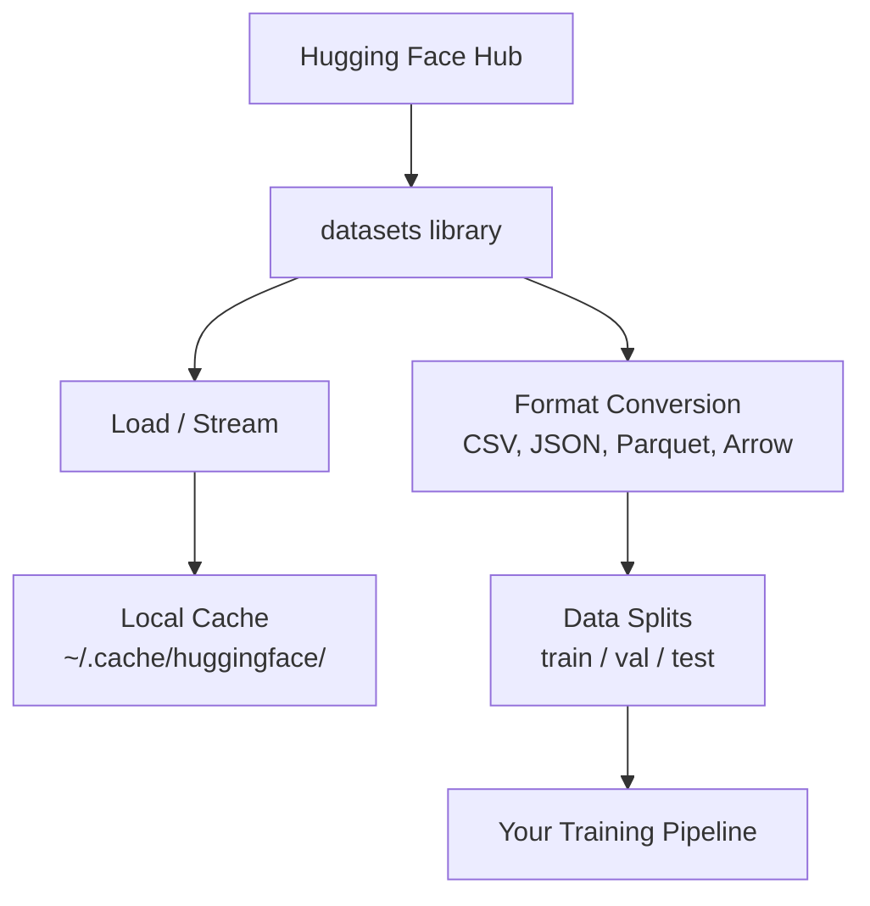

# Quản lý dữ liệu Quản lý dữ liệu

> Dữ liệu là nhiên liệu, cách bạn quản lý nó sẽ quyết định tốc độ của bạn.
> Dữ liệu là nhiên liệu. Cách bạn quản lý nó quyết định bạn có thể chạy nhanh hơn.

**Type:** Build | **类型:** 构建
**Language:**Python**语言:**Python
**Prerequisites:** Phase 0, Lesson 01 | **前置知识:** Phase 0, 第 01 课
**Time:** ~45 minutes | **时间:** ~45 分钟

## Mục tiêu học tập

- Load, stream, và cache tập dữ liệu bằng cách sử dụng Hugging Face `datasets`thư viện
  中文翻译: sử dụng Nhìn Ngực `datasets`库加载、流式处理和缓存数据集
- Chuyển đổi giữa các định dạng CSV, JSON, Parquet và Arrow và giải thích các thỏa thuận của chúng
  Trung文翻译: chuyển đổi giữa CSV、JSON、Parquet 和 Arrow 格式,并解释 các ưu điểm của riêng mình
- Tạo các phân chia có thể tái tạo được bằng tàu/bảo hợp/bảo nghiệm với hạt ngẫu nhiên cố định
  Trung文翻译: Sử dụng cố định随机种子创建可复现的训练/验证/测试集拆分
- Quản lý các tập tin mô hình lớn và tập tin dữ liệu bằng cách sử dụng `.gitignore`, Git LFS, hoặc DVC
  中文翻译:使用 `.gitignore`GIT LFS hoặc DVC  quản lý mô hình lớn và dữ liệu

> **【中文解读】**
> Số liệu là nhiên liệu của AI.`datasets`库加载、缓存、转换和拆分数据集―― nắm bắt quản lý dữ liệu là điều kiện bắt đầu các thí nghiệm học máy.

## Vấn đề  vấn đề mô tả

Mỗi dự án AI bắt đầu với dữ liệu. Bạn cần tìm tập dữ liệu, tải xuống chúng, chuyển đổi giữa các định dạng, chia chúng để đào tạo và đánh giá, và phiên bản chúng để các thí nghiệm có thể tái tạo. Làm điều này bằng tay mỗi lần là chậm và dễ mắc lỗi. Bạn cần một dòng công việc lặp lại.

> Mỗi dự án AI đều bắt đầu từ dữ liệu. Bạn cần tìm tập hợp dữ liệu, tải xuống, chuyển đổi định dạng, chia thành tập hợp đào tạo và đánh giá, và thực hiện quản lý phiên bản để đảm bảo thí nghiệm có thể lặp lại.

> **【中文解读】**
> Mỗi dự án AI đều bắt đầu từ dữ liệu. Bạn cần tải xuống tập dữ liệu, chuyển đổi hình thức, phân chia tập huấn/thiết nghiệm/thử nghiệm, và quản lý phiên bản để đảm bảo thí nghiệm có thể lặp lại.

> **【拓展：Hugging Face 在 AI 生态中的地位】**
> Hugging Face là "GitHub" trong lĩnh vực AI, quản lý hàng trăm ngàn tập dữ liệu và mô hình đào tạo trước.`datasets`库 là một công cụ tiêu chuẩn để tải và xử lý dữ liệu, giống như Pandas nhưng chuyên về AI  tối ưu hóa, hỗ trợ quá tải dữ liệu lớn.

## Khái niệm cốt lõi



Mặt ôm `datasets`thư viện là cách chuẩn để tải dữ liệu cho công việc AI. Nó xử lý tải xuống, lưu trữ trước, chuyển đổi định dạng và phát trực tuyến ra khỏi hộp.

> Nhìn khuôn mặt `datasets`库 là cách chuẩn để tải dữ liệu AI. Nó mở hộp là sử dụng địa phương xử lý tải xuống, lưu trữ, chuyển đổi hình thức và tải dòng.

> **【中文解读】**
> Nhìn khuôn mặt `datasets`Đây là tiêu chuẩn thực tế của AI về tải dữ liệu. Nó tự động xử lý tải xuống, lưu trữ, chuyển đổi định dạng và tải dữ liệu. Bạn không cần phải quản lý tài liệu dữ liệu bằng tay, thư viện sẽ giúp bạn hoàn thành tất cả các công việc cơ bản.

> **【拓展：数据格式对训练速度的影响】**
> Trong thực tế AI, định dạng dữ liệu ảnh hưởng trực tiếp đến hiệu quả đào tạo.

## Hãy xây dựng nó.
```figure
s0-data-pipeline
```

## Hãy xây dựng nó

### Bước 1: Lắp đặt thư viện tập dữ liệu

```bash
pip install datasets huggingface_hub  # 安装 Hugging Face 数据集库和模型仓库工具
```

### Bước 2: Lắp đặt một bộ dữ liệu

```python
from datasets import load_dataset

dataset = load_dataset("imdb")  # 加载 IMDB 电影评论数据集（首次下载，之后从缓存读取）
dataset = load_dataset("stanfordnlp/imdb")
print(dataset)
print(dataset["train"][0])  # 查看训练集第一条样本
```

Điều này tải xuống bộ dữ liệu xem phim IMDB. Sau khi tải xuống đầu tiên, nó tải từ bộ nhớ cache tại `~/.cache/huggingface/datasets/`- Tôi không biết.

> Đây sẽ được tải xuống trên IMDB 电影评论数据集.`~/.cache/huggingface/datasets/`n ở ở ở ở ở ở ở ở ở ở ở ở ở ở ở ở ở ở ở ở ở ở ở ở ở ở ở ở ở ở ở ở ở ở ở ở ở ơ

### Bước 3: Tạo dòng dữ liệu lớn

Một số bộ dữ liệu quá lớn để chứa trên đĩa. Streaming tải chúng hàng xét mà không tải toàn bộ.

> Một số tập dữ liệu quá lớn không thể tải xuống toàn bộ đĩa.

```python
dataset = load_dataset("wikimedia/wikipedia", "20220301.en", split="train", streaming=True)  # 流式加载：不下载完整数据集

for i, example in enumerate(dataset):
    print(example["title"])  # 逐条处理，内存占用恒定
    if i >= 4:
        break
```

Streaming cho bạn một `IterableDataset`Bạn xử lý các hàng khi chúng đến. Sử dụng bộ nhớ vẫn không đổi bất kể kích thước tập dữ liệu.

> 流式加载 回复 `IterableDataset` Bạn từng bước xử lý dữ liệu đến.

> **【拓展：流式加载在大模型训练中的应用】**
> 流式加载是训练大语言模型的关键技术――Common Crawl 数据集集约250TB,不可能全部下载到本地――GPT-4 训练数据通过流式方式从分布式存储中加载,每秒处理数十万条文本――Hugging Face 的`streaming=True`Các yếu tố cho phép bạn xử lý bộ dữ liệu siêu lớn theo cách tương tự, ngay cả khi chỉ có một sổ ghi nhớ trong bộ nhớ 8GB cũng có thể xử lý dữ liệu TB cấp.

### Bước 4: Các định dạng tập dữ liệu

- `datasets`thư viện sử dụng Apache Arrow dưới nắp. Bạn có thể chuyển đổi sang các định dạng khác tùy thuộc vào nhu cầu của đường ống của bạn.

> `datasets`库底层 sử dụng Apache Arrow. Bạn có thể chuyển đổi cho các hình thức khác.

```python
dataset = load_dataset("stanfordnlp/imdb", split="train")

dataset.to_csv("imdb_train.csv")  # 导出为 CSV 格式（通用但体积大）
dataset.to_json("imdb_train.json")  # 导出为 JSON 格式（适合 API 交换）
dataset.to_parquet("imdb_train.parquet")  # 导出为 Parquet 格式（压缩率高、读取快）
```

So sánh định dạng:

> 格式对比:

| Format | Size | Read Speed | Best For |
|--------|------|-----------|----------|
| CSV | Large | Slow | Human readability, spreadsheets |
| JSON | Large | Slow | APIs, nested data |
| Parquet | Small | Fast | Analytics, columnar queries |
| Arrow | Small | Fastest | In-memory processing (what `datasets` uses internally) |

| 格式 | 体积 | 读取速度 | 最适合 |
|------|------|---------|--------|
| CSV | 大 | 慢 | 人类阅读、电子表格 |
| JSON | 大 | 慢 | API、嵌套数据 |
| Parquet | 小 | 快 | 分析查询、列式存储 |
| Arrow | 小 | 最快 | 内存中处理（datasets 库内部使用） |

Đối với công việc AI, Parquet là định dạng lưu trữ tốt nhất. Arrow là những gì bạn làm việc với trong bộ nhớ. CSV và JSON là cho trao đổi.

> Đối với AI, Parquet là định dạng lưu trữ tốt nhất. Arrow là định dạng được sử dụng trong bộ nhớ. CSV và JSON được sử dụng để trao đổi dữ liệu.

### Bước 5: chia dữ liệu

> **【中文解读】**
> Các tập hợp dữ liệu phân chia là nguyên tắc cơ bản của học máy. Tập hợp đào tạo được sử dụng để học, tập hợp chứng nhận được sử dụng để điều chỉnh, tập hợp thử nghiệm được sử dụng để đánh giá cuối cùng.

Mỗi dự án ML cần ba phân chia:

> Mỗi dự án ML cần có 3 phần:

- **Train**: Mô hình học hỏi từ điều này (thường là 80%)
  Trung ngữ翻译:**训练集**:模型从这里学习 (từ đây học)
- **Validation**Bạn kiểm tra tiến bộ trong quá trình đào tạo (thường là 10%)
  Trung ngữ翻译:**验证集**: kiểm tra tiến bộ trong quá trình đào tạo thường là 10%)
- **Test**: Đánh giá cuối cùng sau khi đào tạo được hoàn thành (thường là 10%)
  Trung ngữ翻译:**测试集**: đánh giá cuối cùng sau khi hoàn thành bài tập (thường là 10%)

Một số bộ dữ liệu được chia trước khi được chia, khi không chia, hãy tự chia chúng:

> Một số tập dữ liệu đã được phân chia tốt. Nếu không, bạn cần tự phân chia:

```python
dataset = load_dataset("stanfordnlp/imdb", split="train")

split = dataset.train_test_split(test_size=0.2, seed=42)  # 80% 训练+验证，20% 测试
train_val = split["train"].train_test_split(test_size=0.125, seed=42)  # 从 80% 中取 12.5% 作为验证集

train_ds = train_val["train"]  # 最终：70% 训练集
val_ds = train_val["test"]  # 最终：10% 验证集
test_ds = split["test"]  # 最终：20% 测试集

print(f"Train: {len(train_ds)}, Val: {len(val_ds)}, Test: {len(test_ds)}")
```

Luôn đặt hạt giống để tái sinh.

> 务必设置种子以确保可复现性―― giống nhau mỗi lần tạo ra phân chia giống nhau――

### Bước 6: Tải và cache mô hình

Các mô hình là các tập tin lớn.`huggingface_hub`thư viện xử lý tải xuống và lưu trữ.

> Mô hình là một tài liệu lớn.`huggingface_hub`库负责下载和缓存──

```python
from huggingface_hub import hf_hub_download, snapshot_download

model_path = hf_hub_download(  # 下载单个文件
    repo_id="sentence-transformers/all-MiniLM-L6-v2",
    filename="config.json"
)
print(f"Cached at: {model_path}")

model_dir = snapshot_download("sentence-transformers/all-MiniLM-L6-v2")  # 下载整个模型仓库
print(f"Full model at: {model_dir}")
```

> **【拓展：模型缓存机制】**
> Cơ chế lưu trữ của Hugging Face rất thông minh:模型下载后存储在 `~/.cache/huggingface/hub/`, tiếp tục tải trực tiếp đọc lấy bộ nhớ địa phương. Một bộ nhớ LLM phổ biến như Llama-2-7B khoảng 14GB, tải lần đầu tiên cần vài phút, sau đó tải thứ hai. Trong trường hợp cấp doanh nghiệp, một nhóm chia sẻ bộ nhớ mô hình có thể tiết kiệm được hàng trăm GB tải lại.

Các mô hình cache đến `~/.cache/huggingface/hub/`Một khi tải xuống, chúng sẽ tải ngay vào các lần chạy tiếp theo.

> 模型缓存到 `~/.cache/huggingface/hub/`                                                                                                                                                                                                                                                              

### Bước 7: xử lý các tệp lớn

> **【中文解读】**
> AI 模型文件动数 GB(GPT-2 约500MB,Llama-2-70B 约140GB), không thể sử dụng thông thường Git 管理;;`.gitignore`最简单(忽略大文件),Git LFS 适合团队共享模型权重,DVC 适合需要严格复现的实验──

Các trọng lượng mô hình và tập dữ liệu lớn không nên đi vào git. Ba tùy chọn:

> 模型权重和大型数据集不应放入 git──三种选择:

**Option A: .gitignore (simplest)**

> **选项 A：.gitignore（最简单）**

```
*.bin
*.safetensors
*.pt
*.onnx
data/*.parquet
data/*.csv
models/
```

**Option B: Git LFS (track large files in git)**

> **选项 B：Git LFS（在 git 中追踪大文件）**

```bash
git lfs install
git lfs track "*.bin"
git lfs track "*.safetensors"
git add .gitattributes
```

Git LFS lưu trữ các chỉ dẫn trong repo của bạn và các tệp thực tế trên một máy chủ riêng biệt. GitHub cung cấp cho bạn 1 GB miễn phí.

> Git LFS trong kho chứa trong chỉ số lưu trữ, thực tế lưu trữ tài liệu trên một máy chủ riêng biệt. GitHub cung cấp 1 GB không gian miễn phí.

**Option C: DVC (data version control)**

> **选项 C：DVC（数据版本控制）**

```bash
pip install dvc
dvc init
dvc add data/training_set.parquet
git add data/training_set.parquet.dvc data/.gitignore
git commit -m "Track training data with DVC"
```

DVC tạo ra nhỏ `.dvc`dữ liệu tự sống trong S3, GCS, hoặc một phần lưu trữ từ xa khác.

> DVC 创建小的 `.dvc`文件指向你的数据―― dữ liệu tự lưu trữ ở S3、GCS hoặc các đầu cuối lưu trữ xa khác――

> **【拓展：工业级数据版本管理】**
> Trong Google và Meta, quản lý phiên bản dữ liệu phức tạp hơn quản lý phiên bản mã. Một thử nghiệm hệ thống được đề xuất có thể liên quan đến hàng chục tập hợp dữ liệu, hàng tỷ mẫu. DVC là giải pháp nguồn mở, sử dụng thông thường trong doanh nghiệp Databricks, Weights & Biases (W&B) hoặc Neptune.ai để theo dõi dữ liệu, mô hình và thí nghiệm.

| Approach | Complexity | Best For |
|----------|-----------|----------|
| .gitignore | Low | Personal projects, downloaded data you can re-fetch |
| Git LFS | Medium | Teams sharing model weights via git |
| DVC | High | Reproducible experiments, large datasets, teams |

| 方案 | 复杂度 | 最适合 |
|------|--------|--------|
| .gitignore | 低 | 个人项目、可重新下载的数据 |
| Git LFS | 中 | 通过 git 共享模型权重的团队 |
| DVC | 高 | 需要严格复现的实验、大数据集、团队协作 |

Đối với khóa học này,`.gitignore`Sử dụng DVC khi bạn cần tái tạo các thí nghiệm chính xác trên máy.

> 本课程 `.gitignore`Đủ rồi. Khi bạn cần phải trải nghiệm lại, hãy sử dụng DVC.

### Bước 8: Các mẫu lưu trữ

> **【中文解读】**
> DATASTOP: DVC có thể trực tiếp tích hợp với đám mây, thực hiện dữ liệu phiên bản quản lý.

**Local storage**HF cache xử lý điều này tự động.

> **本地存储**适用于 khoảng 10 GB dưới đây:

**Cloud storage**là cho bất cứ thứ gì lớn hơn hoặc được chia sẻ giữa các máy:

> **云存储**Sử dụng tập hợp dữ liệu lớn hơn hoặc cần chia sẻ trên máy tính:

```python
import os

local_path = os.path.expanduser("~/.cache/huggingface/datasets/")

# s3_path = "s3://my-bucket/datasets/"
# gcs_path = "gs://my-bucket/datasets/"
```

DVC tích hợp trực tiếp với S3 và GCS:

> DVC  trực tiếp với S3 và GCS 集成:

```bash
dvc remote add -d myremote s3://my-bucket/dvc-store
dvc push
```

Đối với khóa học này, lưu trữ địa phương là đủ. lưu trữ đám mây trở nên có liên quan khi bạn tinh chỉnh trên các phiên bản GPU từ xa.

> Trong khóa học này, lưu trữ địa phương đã đủ. Khi bạn cần lưu trữ đám mây trong các ví dụ về GPU xa.

## Các bộ dữ liệu được sử dụng trong khóa học này

| Dataset | Lessons | Size | What It Teaches |
|---------|---------|------|----------------|
| IMDB | Tokenization, classification | 84 MB | Text classification basics |
| WikiText | Language modeling | 181 MB | Next-token prediction |
| SQuAD | QA systems | 35 MB | Question answering, spans |
| Common Crawl (subset) | Embeddings | Varies | Large-scale text processing |
| MNIST | Vision basics | 21 MB | Image classification fundamentals |
| COCO (subset) | Multimodal | Varies | Image-text pairs |

| 数据集 | 涉及课程 | 体积 | 教你什么 |
|--------|---------|------|---------|
| IMDB | 分词、分类 | 84 MB | 文本分类基础 |
| WikiText | 语言建模 | 181 MB | 下一个 token 预测 |
| SQuAD | 问答系统 | 35 MB | 问答与区间选择 |
| Common Crawl（子集） | 嵌入 | 不定 | 大规模文本处理 |
| MNIST | 视觉基础 | 21 MB | 图像分类入门 |
| COCO（子集） | 多模态 | 不定 | 图像-文本对 |

Bạn không cần phải tải tất cả các bài học này ra ngay bây giờ.

> Bạn không cần phải tải xuống tất cả các tập dữ liệu này ngay bây giờ. Mỗi bài sẽ giải thích những gì nó cần.

## Hãy sử dụng nó để thực hiện

> **【中文解读】**
> 实践环节:运行 `data_utils.py`验证所有数据管理功能正常工作──本书会自动下载一个小数据集、做形式转换、拆分训练/验证/测试集,并打印摘要信息──确保环境配置正确后再进入后续课程──

Dạy kịch bản tiện ích để xác minh mọi thứ hoạt động:

> 运行工具脚本验证一切正常:

```bash
python code/data_utils.py
```

Nó tải xuống một tập dữ liệu nhỏ, chuyển đổi nó, chia nó, và in một bản tóm tắt.

> Nó sẽ tải xuống một tập dữ liệu nhỏ, chuyển đổi hình thức, phân chia, và in bản tóm tắt.

## Chuyển nó đi.

Bài học này mang lại:
- `code/data_utils.py`- tiện ích tải dữ liệu và lưu trữ nhớ cache có thể được sử dụng lại
- `outputs/prompt-data-helper.md`- nhanh chóng để tìm ra bộ dữ liệu phù hợp cho một nhiệm vụ

> 本课产 出:
> - `code/data_utils.py`- Công cụ tải dữ liệu và lưu trữ có thể sử dụng lại
> - `outputs/prompt-data-helper.md`- Sử dụng để tìm kiếm phù hợp tập dữ liệu

## Tập luyện bài tập

1. Lắp `glue`bộ dữ liệu với `mrpc`cấu hình và kiểm tra 5 ví dụ đầu tiên
   Lên`glue`Số liệu của `mrpc`配置,查看前 5 条数据
2. Chuyển `c4`tập dữ liệu và đếm bao nhiêu ví dụ bạn có thể xử lý trong 10 giây
   流式加载 `c4`Số liệu, thống kê 10 giây trong khi xử lý
3. Chuyển đổi một tập dữ liệu thành Parquet và so sánh kích thước tập tin với CSV
   Chuyển tập dữ liệu thành hình thức Parquet, so với CSV file size
4. Tạo một phân chia đường sắt/val/test 70/15/15 với hạt cố định và xác minh kích thước
   Sử dụng cố định tự nhiên tạo ra 70/15/15

## Từ khóa  Keyword

| Term | What people say | What it actually means |
|------|----------------|----------------------|
| Dataset split | "Training data" | A named subset (train/val/test) used at different stages of the ML lifecycle |
| Streaming | "Load it lazily" | Processing data row by row from a remote source without downloading the full dataset |
| Parquet | "Compressed CSV" | A columnar file format optimized for analytical queries and storage efficiency |
| Arrow | "Fast dataframe" | An in-memory columnar format used internally by the datasets library for zero-copy reads |
| Git LFS | "Git for big files" | An extension that stores large files outside the git repo while keeping pointers in version control |
| DVC | "Git for data" | A version control system for datasets and models that integrates with cloud storage |
| Cache | "Already downloaded" | A local copy of previously fetched data, stored at ~/.cache/huggingface/ by default |

| 术语 | 俗称 | 实际含义 |
|------|------|---------|
| Dataset split | "训练数据" | 数据集的命名子集（训练/验证/测试），用于 ML 生命周期的不同阶段 |
| Streaming | "懒加载" | 逐行处理远程数据，不下载完整数据集 |
| Parquet | "压缩 CSV" | 为分析查询和存储效率优化的列式文件格式 |
| Arrow | "快速数据帧" | datasets 库内部使用的内存列式格式，支持零拷贝读取 |
| Git LFS | "大文件 Git" | 将大文件存储在 git 仓库之外的扩展 |
| DVC | "数据版控" | 数据集和模型的版本控制系统，集成云存储 |
| Cache | "已下载" | 默认存储在 ~/.cache/huggingface/ 的本地缓存 |
