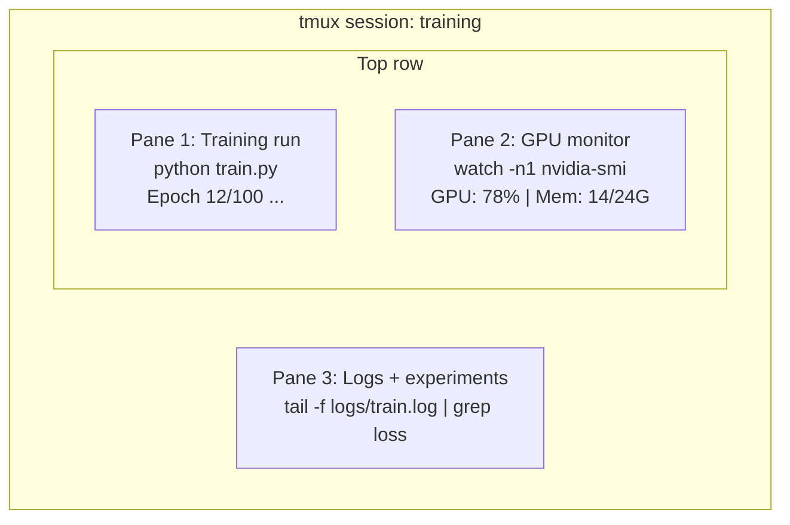

# Terminal & Shell kết thúc với Shell

> Điểm cuối là nơi các kỹ sư AI sống.
> Cuối cùng là nhà của một kỹ sư AI.

**Type:** Learn | **类型:** 学习
**Languages:** -- | **语言:** 无
**Prerequisites:** Phase 0, Lesson 01 | **前置知识:** Phase 0, 第 01 课
**Time:** ~35 minutes | **时间:** ~35 分钟

## Mục tiêu học tập

- Sử dụng ống dẫn, chuyển hướng, và `grep`để lọc và xử lý nhật ký đào tạo từ dòng lệnh
  Trung文翻译:使用管道、重定向和 `grep`Từ lệnh hành trình và xử lý tập luyện
- Tạo các phiên tmux liên tục với nhiều bảng để đào tạo đồng thời và giám sát GPU
  Trung ngữ翻译:创建带多面板的持久 tmux 会话, được sử dụng cùng lúc đào tạo và giám sát GPU
- Kiểm tra hệ thống và các nguồn lực GPU với `htop`- `nvtop`, và`nvidia-smi`
  中文翻译:使用 `htop``nvtop`和 `nvidia-smi` Hệ thống giám sát và GPU  tài nguyên
- Chuyển tập tin giữa máy tính địa phương và từ xa sử dụng SSH, `scp`, và`rsync`
  中文翻译: sử dụng SSH、`scp`和 `rsync`Trong địa phương và xa máy tính trong các tài liệu truyền tải

> **【中文解读】**
> 终端 là công cụ được sử dụng phổ biến nhất của các kỹ sư AI.                                                                                                                                                                                                                                                      

## Vấn đề  vấn đề mô tả

Bạn sẽ dành nhiều thời gian hơn trong thiết bị kết thúc hơn trong bất kỳ trình chỉnh sửa nào. Cấp hoạt động, giám sát GPU, theo dõi nhật ký, các phiên SSH từ xa, quản lý môi trường. Mỗi dòng công việc AI chạm vào vỏ. Nếu bạn chậm ở đây, bạn chậm ở khắp mọi nơi.

> Bạn đã dành nhiều thời gian trên kết thúc hơn bất kỳ bộ chỉnh sửa nào. Bạn đã làm việc nhiều hơn mọi bộ chỉnh sửa khác.

Bài học này bao gồm các kỹ năng cuối cùng quan trọng cho công việc AI không có lịch sử của Unix không có sâu vào Bash scripting chỉ là những gì bạn cần

> Bài học này chỉ nói về kỹ năng cuối cùng thực sự cần thiết trong AI 工作中. Không nói về Unix 历史, không sâu sắc về Bash 脚本编程.

> **【中文解读】**
> Các kỹ sư AI ở thời gian cuối là nhiều hơn bất kỳ bộ chỉnh sửa nào. Các mô hình đào tạo, giám sát GPU, SSH từ xa đều phụ thuộc vào kỹ năng cuối.

## Khái niệm cốt lõi



Ba thứ chạy cùng một lúc, một thiết bị, bạn có thể tách ra, về nhà, SSH trở lại, và gắn lại.

> 三任务同时运行,一个终端窗口――你可以分离会话、回家、重新连接后再恢复会话――训练持续运行――

> **【中文解读】**
> 终端复用是AI 工程师的核心技能――上图展示一个典型的 tmux 会话: một bảng chạy huấn luyện、一个板监控 GPU、一个板查看日志──三个任务同时运行在一个终端窗口──断开SSH 后训练继续,第二天重新连接即可恢复──

> **【拓展：tmux 在 GPU 训练中的重要性】**
> Trong trường hợp AWS p4d  thí dụ(8x A100 GPU, khoảng $32.77/小时) trên đào tạo LLM, nếu vì đóng sổ dẫn đến việc đào tạo gián đoạn, không chỉ lãng phí tất cả các tính toán đã hoàn thành, cũng cần phải từ đầu đào tạo lại. Sử dụng tmux có thể để đào tạo trên nền kéo dài vài ngày hoặc thậm chí vài tuần.

## Hãy xây dựng nó.
```figure
s0-shell-pipeline
```

## Hãy xây dựng nó

### Bước 1: Biết được vỏ của bạn

Hãy kiểm tra con đạn nào mà bạn đang chạy:

> 检查你正在使用哪个 shell:

```bash
echo $SHELL
```

Hầu hết các hệ thống sử dụng `bash`hoặc `zsh`Cả hai đều hoạt động tốt.

>  大多数系统使用 `bash`Hoặc`zsh` cả hai đều có thể.

Những điều quan trọng cần biết:

> 关键知识:

```bash
# Move around
cd ~/projects/ai-engineering-from-scratch
pwd
ls -la

# History search (most useful shortcut you'll learn)
# Ctrl+R then type part of a previous command
# Press Ctrl+R again to cycle through matches

# Clear terminal
clear   # or Ctrl+L

# Cancel a running command
# Ctrl+C

# Suspend a running command (resume with fg)
# Ctrl+Z
```

### Bước 2: Đường ống và chuyển hướng

Đường ống kết nối các lệnh với nhau. Đây là cách bạn xử lý nhật ký, đầu ra bộ lọc và các công cụ chuỗi. Bạn sẽ sử dụng nó liên tục.

> 管道将命令连接在一起――这就是你处理日志,过输出和串联工具的方法――你会经常使用――

> **【中文解读】**
> 管道(pipe) là cốt lõi của triết học Unix: mỗi công cụ chỉ làm một việc, thông qua đường ống kết nối hoàn thành nhiệm vụ phức tạp.`cat train.log | grep "loss" | wc -l`This article order's meaning is:读取日志 → 过含"loss" 的行 → 统计行数──重定向(`>``>>``2>`(câu) kiểm soát xuất vào tài liệu hay màn hình. Đây là các hoạt động cần thiết của kỹ sư AI mỗi ngày.

```bash
# Count how many times "loss" appears in a log  统计日志中 "loss" 出现的次数
cat train.log | grep "loss" | wc -l

# Extract just the loss values from training output  提取训练输出中的 loss 值
grep "loss:" train.log | awk '{print $NF}' > losses.txt

# Watch a log file update in real time, filtering for errors  实时过滤错误日志
tail -f train.log | grep --line-buffered "ERROR"

# Sort experiments by final accuracy  按最终准确率排序实验结果
grep "final_accuracy" results/*.log | sort -t= -k2 -n -r

# Redirect stdout and stderr to separate files  分别重定向标准输出和标准错误
python train.py > output.log 2> errors.log

# Redirect both to the same file  将所有输出合并到同一文件
python train.py > train_full.log 2>&1
```

Ba chuyển hướng bạn cần:

> Bạn cần phải nắm vững ba hướng:

| Symbol | What it does |
|--------|-------------|
| `>` | Write stdout to file (overwrite) |
| `>>` | Append stdout to file |
| `2>` | Write stderr to file |
| `2>&1` | Send stderr to same place as stdout |
| `\|` | Send stdout of one command as stdin to the next |

| 符号 | 作用 |
|------|------|
| `>` | 将标准输出写入文件（覆盖） |
| `>>` | 将标准输出追加到文件 |
| `2>` | 将标准错误写入文件 |
| `2>&1` | 将标准错误合并到标准输出 |
| `\|` | 将一个命令的输出传给下一个命令 |

### Bước 3: Các quy trình nền

Việc tập luyện mất nhiều giờ, bạn không muốn giữ máy bay mở suốt thời gian.

> Trình luyện chạy mất vài giờ.

```bash
# Run in background (output still goes to terminal)
python train.py &

# Run in background, immune to hangup (closing terminal won't kill it)
nohup python train.py > train.log 2>&1 &

# Check what's running in background
jobs
ps aux | grep train.py

# Bring a background job to foreground
fg %1

# Kill a background process
kill %1
# or find its PID and kill that
kill $(pgrep -f "train.py")
```

Sự khác biệt giữa `&`- `nohup`, và`screen`- Không.`tmux`- Có thể là:

> `&``nohup`和 `screen`- Không.`tmux`区别:

| Method | Survives terminal close? | Can reattach? |
|--------|-------------------------|---------------|
| `command &` | No | No |
| `nohup command &` | Yes | No (check log file) |
| `screen` / `tmux` | Yes | Yes |

| 方式 | 关闭终端后存活？ | 可重新连接？ |
|------|---------------|-------------|
| `command &` | 否 | 否 |
| `nohup command &` | 是 | 否（查看日志文件） |
| `screen` / `tmux` | 是 | 是 |

Trong bất cứ điều gì dài hơn vài phút, sử dụng tmux.

> 对于超过几分钟的任务, sử dụng tmux.

### Bước 4: tmux

tmux cho phép bạn tạo các phiên kết thúc liên tục với nhiều bảng. Đây là công cụ đơn giản hữu ích nhất để quản lý các cuộc chạy đào tạo.

> Tmux 让你创建带多面板的持久终端会话── đây là công cụ hữu ích nhất để thực hiện đào tạo quản lý──

> **【中文解读】**
> tmux là một thiết bị tái sử dụng cuối cùng, có thể tạo ra nhiều bảng bàn bàn bàn bàn bàn bàn bàn bàn bàn bàn bàn bàn bàn bàn bàn bàn bàn bàn bàn bàn bàn bàn bàn bàn bàn bàn bàn bàn bàn bàn bàn bàn bàn bàn bàn bàn bàn bàn bàn bàn bàn bàn bàn bàn bàn bàn bàn bàn bàn bàn bàn bàn bàn bàn bàn bàn bàn bàn bàn bàn bàn bàn bàn bàn bàn bàn bàn bàn bàn bàn bàn bàn bàn bàn bàn bàn bàn bàn bàn bàn bàn bàn bàn bàn bàn bàn bàn bàn bàn bàn bàn bàn bàn bàn bàn bàn bàn bàn bàn bàn bàn bàn bàn bàn bàn bàn bàn bàn bàn bàn bàn bàn bàn bàn bàn bàn bàn bàn bàn bàn bàn bàn bàn bàn bàn bàn bàn bàn bàn bàn bàn bàn bàn bàn bàn bàn bàn bàn bàn bàn bàn bàn bàn bàn bàn bàn bàn bàn bàn bàn bàn bàn bàn bàn bàn bàn bàn bàn bàn bàn bàn bàn bàn bàn bàn bàn bàn bàn bàn bàn bàn bàn bàn bàn bàn bàn bàn bàn bàn bàn bàn bàn bàn bàn bàn bàn bàn bàn bàn bàn bàn bàn bàn bàn bàn bàn bàn bàn bàn bàn bàn bàn bàn bàn bàn bàn bàn bàn bàn bàn bàn bàn bàn bàn bàn bàn bàn bàn bàn bàn bàn bàn bàn bàn bàn bàn bàn bàn bàn và bàn bàn bàn bàn bàn bàn bàn bàn bàn bàn bàn bàn bàn bàn bàn bàn bàn bàn bàn bàn bàn bàn bàn bàn bàn bàn bàn bàn bàn bàn bàn bàn bàn bàn bàn bàn bàn bàn bàn bàn bàn bàn bàn bàn bàn bàn bàn bàn bàn bàn bàn bàn bàn bàn bàn bàn bàn bàn bàn bàn bàn bàn bàn bàn bàn bàn bàn bàn bàn bàn bàn bàn bàn bàn bàn bàn bàn bàn bàn bàn bàn bàn bàn bàn bàn bàn bàn bàn bàn bàn bàn bàn bàn bàn bàn bàn bàn bàn bàn bàn bàn bàn bàn bàn bàn bàn bàn bàn bàn bàn bàn bàn bàn bàn bàn bàn bàn bàn bàn bàn bàn bàn bàn bàn bàn bàn bàn bàn bàn bàn bàn bàn bàn bàn bàn bàn bàn bàn bàn bàn bàn bàn bàn bàn bàn bàn bàn bàn bàn bàn bàn bàn bàn bàn bàn bàn bàn bàn bàn bàn bàn bàn bàn bàn bàn bàn bàn bàn bàn bàn bàn bàn bàn bàn bàn bàn bàn bàn bàn bàn bàn bàn bàn bàn bàn bàn bàn bàn bàn bàn bàn bàn bàn bàn bàn bàn bàn bàn bàn bàn bàn bàn bàn bàn bàn bàn bàn bàn bàn bàn bàn bàn bàn bàn bàn bàn bàn bàn bàn bàn bàn bàn bàn bàn bàn bàn bàn bàn bàn bàn bàn bàn bàn bàn bàn bàn bàn bàn bàn bàn bàn bàn bàn bàn bàn bàn bàn bàn bàn bàn bàn bàn bàn bàn bàn bàn bàn bàn bàn bàn bàn

```bash
# Install
# macOS
brew install tmux
# Ubuntu
sudo apt install tmux

# Start a named session
tmux new -s training

# Split horizontally
# Ctrl+B then "

# Split vertically
# Ctrl+B then %

# Navigate between panes
# Ctrl+B then arrow keys

# Detach (session keeps running)
# Ctrl+B then d

# Reattach
tmux attach -t training

# List sessions
tmux ls

# Kill a session
tmux kill-session -t training
```

Một phiên quy trình công việc AI điển hình:

> 典型 AI 工作流会话:

```bash
tmux new -s train

# Pane 1: start training
python train.py --epochs 100 --lr 1e-4

# Ctrl+B, " to split, then run GPU monitor
watch -n1 nvidia-smi

# Ctrl+B, % to split vertically, tail the logs
tail -f logs/experiment.log

# Now detach with Ctrl+B, d
# SSH out, go get coffee, come back
# tmux attach -t train
```

### Bước 5: Giám sát bằng htop và nvtop

```bash
# System processes (better than top)  系统进程监控（比 top 更好用）
htop

# GPU processes (if you have NVIDIA GPU)  GPU 进程监控
# Install: sudo apt install nvtop (Ubuntu) or brew install nvtop (macOS)
nvtop

# Quick GPU check without nvtop  快速查看 GPU 状态
nvidia-smi

# Watch GPU usage update every second  每秒刷新 GPU 使用情况
watch -n1 nvidia-smi

# See which processes are using the GPU  查看占用 GPU 的进程
nvidia-smi --query-compute-apps=pid,name,used_memory --format=csv
```

> **【拓展：GPU 监控在实际训练中的价值】**
> Trong nhiều GPU  đào tạo, tỷ lệ sử dụng GPU thấp hơn 80% thường có nghĩa là tải dữ liệu là một chai.`nvidia-smi`可以快速发现:显存不足(OOM) 、GPU利用率低(数据瓶) 、温度过高(散热问题) ⋅nvidia-smi 的 `--query-compute-apps`Các yếu tố có thể xác định được quy trình nào chiếm lưu trữ GPU 显存

`htop`Các nút khóa bạn sẽ sử dụng:

> `htop`常用快捷键:

- `F6`hoặc `>`để sắp xếp theo cột (định dạng theo bộ nhớ để tìm các lỗ hổng bộ nhớ)
  Trung ngữ翻译:`F6`Hoặc`>`按列排序(按内存排序找到内存泄漏)
- `F5`để chuyển đổi khung hình cây (xem quy trình trẻ em)
  Trung ngữ翻译:`F5`切换树形视图(查看子进程)
- `F9`để tiêu diệt một quá trình
  Trung ngữ翻译:`F9`终止进程
- `/`để tìm kiếm tên của quy trình
  Trung ngữ翻译:`/`搜索进程名

### Bước 6: SSH cho các hộp GPU từ xa

Khi bạn thuê một GPU đám mây (Lambda, RunPod, Vast.ai), bạn kết nối qua SSH.

> Khi bạn thuê GPU của đám đông, qua SSH 连接.

```bash
# Basic connection  基本 SSH 连接
ssh user@gpu-box-ip

# With a specific key  使用指定密钥连接
ssh -i ~/.ssh/my_gpu_key user@gpu-box-ip

# Copy files to remote  复制文件到远程服务器
scp model.pt user@gpu-box-ip:~/models/

# Copy files from remote  从远程服务器复制文件
scp user@gpu-box-ip:~/results/metrics.json ./

# Sync a whole directory (faster for many files)  同步整个目录（比 scp 更快）
rsync -avz ./data/ user@gpu-box-ip:~/data/

# Port forward (access remote Jupyter/TensorBoard locally)  端口转发（本地访问远程服务）
ssh -L 8888:localhost:8888 user@gpu-box-ip
# Now open localhost:8888 in your browser
```

# SSH config để thuận tiện
# Thêm vào ~/.ssh/config:
# Gpu chủ nhà
#     HostName 192.168.1.100
#     Người dùng ubuntu
#     IdentityFile ~/.ssh/gpu_key
# Tôi đã làm gì?
# Vậy thì:
# ssh gpu
```

### Step 7: Useful aliases for AI work

> **【中文解读】**
> Shell 别名（alias）是将常用长命令缩短为短命令的方式。AI 工程中，`gpu` 查看 GPU 状态、`killtraining` 终止所有训练进程、`watchloss` 实时监控 loss——这些别名每天要用几十次。将它们加入 `~/.bashrc` 或 `~/.zshrc` 后，每次打开终端自动生效。

Add these to your `~/.bashrc` or `~/.zshrc`:

> 将这些添加到你的 `~/.bashrc` 或 `~/.zshrc`：

```bash
Các giai đoạn nguồn/00-set-and-tooling/10-terminal-and-shell/code/shell_aliases.sh
```

Or copy the ones you want. The key aliases:

> 或者复制你想要的。关键别名：

```bash
# Tình trạng GPU một cái nhìn 一行查看 GPU  trạng thái
alias gpu='nvidia-smi --query-gpu=index,name,utilization.gpu,memory.used,memory.total,temperature.gpu --format=csv,noheader'

# Tắt tất cả các quá trình đào tạo Python 终止所有训练进程
alias killtraining='pkill -f "python.*train"'

# Khả năng hoạt động môi trường ảo nhanh 快速激活虚拟环境
alias ae='source .venv/bin/activate'

# Watch training loss 实时监控 training loss
Alias watchloss='tail -f logs/*.logs.
```

See `code/shell_aliases.sh` for the full set.

> 完整的别名列表参见 `code/shell_aliases.sh`。

> **【拓展：管道与重定向在 AI 日志分析中的威力】**
> 在 Google Brain 和 DeepMind，研究员用管道链处理实验日志：`grep "loss" train.log | awk '{print $3}' | sort -n | head -5` 可以在一秒内从百万行日志中找出 loss 最低的 5 个 epoch。这种技能不依赖任何 IDE 或 GUI 工具，在远程 GPU 服务器上尤其有用——那里只有终端可用。

### Step 8: Common AI terminal patterns

These come up repeatedly in practice:

> 这些模式在实践中反复出现：

> **【中文解读】**
> 这些是 AI 工程中反复出现的终端模式：用 `tee` 同时输出到终端和日志文件、用 `diff` 对比实验结果、用 `find` 找到最大的模型文件清理磁盘、用 `tar` 解压数据集。掌握这些命令组合能大幅提升日常效率。

```bash
# Cứ tập luyện, ghi lại mọi thứ, thông báo khi xong.
Python train.py 2>&1 ✓ tee train.log; echo "DONE" ✓ mail -s "Training complete" you@email.com

# So sánh hai bản ghi thí nghiệm bên cạnh nhau
<(grep "sự chính xác" exp1.log) <(grep "sự chính xác" exp2.log)

# Tìm các tệp mô hình lớn nhất (tẩy sạch không gian đĩa)
tìm. - Tên "*.pt" -o -name "*.safetensors"

# Tải xuống mô hình từ Hugging Face
- Đúng rồi.https://huggingface.co/model/resolve/main/model.safetensors

# Dổn một tập dữ liệu
tar xzf dataset.tar.gz -C ./data/

# Đếm các dòng trong tất cả các tệp Python (xem dự án của bạn là bao nhiêu)
tìm. - Tên "*.py"

# Kiểm tra không gian đĩa (dữ liệu đào tạo lấp đầy đĩa nhanh)
df -h
du -sh ./data/*

# Kiểm tra biến môi trường trước khi đào tạo
Em đã bắt được một cái gì đó.
Em bắt được ngọn đuốc
```

## Use It | 用框架实现

Here's when each tool comes into play during this course:

> 以下是每个工具在本课程中的使用场景：

| Tool | When you use it |
|------|----------------|
| tmux | Every training run (Phases 3+) |
| `tail -f` + `grep` | Monitoring training logs |
| `nohup` / `&` | Quick background tasks |
| `htop` / `nvtop` | Debugging slow training, OOM errors |
| SSH + `rsync` | Working on cloud GPUs |
| Piping + redirects | Processing experiment results |
| Aliases | Saving time on repetitive commands |

| 工具 | 使用场景 |
|------|---------|
| tmux | 所有训练任务（Phase 3+） |
| `tail -f` + `grep` | 监控训练日志 |
| `nohup` / `&` | 快速后台任务 |
| `htop` / `nvtop` | 排查训练慢、OOM 错误 |
| SSH + `rsync` | 云 GPU 工作 |
| 管道 + 重定向 | 处理实验结果 |
| 别名 | 节省重复命令时间 |

> **【拓展：AI 工程师的终端工作流】**
> 一个高效的 AI 工程师通常同时维护 2-3 个 tmux 会话：一个用于训练（长时间运行）、一个用于数据处理和调试、一个用于监控。SSH config 文件可以简化连接——配置好后只需 `ssh gpu` 就能连上远程服务器。rsync 是传输大数据集的最佳选择，它只传输变化的字节，支持断点续传，比 scp 快 10 倍以上。

## Exercises | 练习题

1. Install tmux, create a session with three panes, and run `htop` in one, `watch -n1 date` in another, and a Python script in the third. Detach and reattach.
   安装 tmux，创建包含三个面板的会话，分别运行 htop、定时命令和 Python 脚本，然后分离并重新连接。
2. Add the aliases from `code/shell_aliases.sh` to your shell config and reload with `source ~/.zshrc` (or `~/.bashrc`).
   将 `code/shell_aliases.sh` 中的别名添加到你的 shell 配置中并重载。
3. Create a fake training log with `for i in $(seq 1 100); do echo "epoch $i loss: $(echo "scale=4; 1/$i" | bc)"; sleep 0.1; done > fake_train.log` and then use `grep`, `tail`, and `awk` to extract just the loss values.
   创建模拟训练日志，用 `grep`、`tail` 和 `awk` 提取 loss 值。
4. Set up an SSH config entry for a server you have access to (or use `localhost` to practice the syntax).
   为你有权限的服务器设置 SSH config 条目。

## Key Terms | 关键术语

| Term | What people say | What it actually means |
|------|----------------|----------------------|
| Shell | "The terminal" | The program that interprets your commands (bash, zsh, fish) |
| tmux | "Terminal multiplexer" | A program that lets you run multiple terminal sessions inside one window, and detach/reattach |
| Pipe | "The bar thing" | The `\|` operator that sends one command's output as input to another |
| PID | "Process ID" | A unique number assigned to every running process, used to monitor or kill it |
| nohup | "No hangup" | Runs a command immune to the hangup signal, so closing the terminal won't kill it |
| SSH | "Connecting to the server" | Secure Shell, an encrypted protocol for running commands on a remote machine |

| 术语 | 俗称 | 实际含义 |
|------|------|---------|
| Shell | "终端" | 解释执行命令的程序（bash、zsh、fish） |
| tmux | "终端复用器" | 在一个窗口中运行多个终端会话，支持分离/重连 |
| Pipe（管道） | "竖线那个" | `\|` 操作符，将一个命令的输出传给另一个命令 |
| PID | "进程号" | 每个运行进程的唯一编号，用于监控或终止 |
| nohup | "不挂断" | 关闭终端也不会终止命令 |
| SSH | "连服务器" | 安全外壳协议，用于远程执行命令 |
