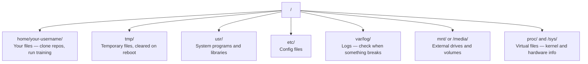

# Linux cho AI  Linux cơ sở  AI kỹ sư cần thiết)

> Hầu hết AI chạy trên Linux. Bạn cần biết đủ để không bị kẹt.
> Hầu hết AI hoạt động trên Linux. Bạn cần nắm vững đủ kiến thức, không chỉ để làm việc.

**Type:** Learn | **类型:** 学习
**Languages:** -- | **语言:** 无
**Prerequisites:** Phase 0, Lesson 01 | **前置知识:** Phase 0, 第 01 课
**Time:** ~30 minutes | **时间:** ~30 分钟

## Mục tiêu học tập

- Di chuyển hệ thống tệp Linux và thực hiện các hoạt động tệp thiết yếu từ dòng lệnh
  Trung ngữ翻译: trong Linux 文件系统中导航, từ lệnh thực hiện các trình cơ bản
- Quản lý quyền tập tin với `chmod`và `chown`để khắc phục lỗi "Phán phép bị từ chối"
  中文翻译:使用 `chmod`和 `chown`管理文件权限, giải quyết "Phán phép bị từ chối" lỗi
- Lắp đặt các gói hệ thống với `apt`và thiết lập một hộp GPU mới cho công việc AI
  中文翻译:使用 `apt` 安装系统包,为新 GPU 服务器配置 AI 工作环境
- Xác định sự khác biệt giữa macOS và Linux thường khiến các nhà phát triển làm việc trên máy tính từ xa bị cản trở
  Trung文翻译:识别 từ macOS 转换到 Linux 时常见的踩坑点

> **【中文解读】**
> Phần lớn AI  đào tạo chạy trên máy chủ Linux ⋅ khi bạn SSH đến các ví dụ của GPU đám mây, bạn chỉ có giao diện kết thúc ⋅ chương này là chỉ dẫn sống sót Linux ⋅ chỉ dạy AI thực sự cần thiết trong công việc xử lý tài liệu, quản lý quyền hạn và cài đặt gói ⋅

## Vấn đề  vấn đề mô tả

Bạn phát triển trên macOS hoặc Windows. Nhưng ngay khi bạn SSH vào một hộp GPU đám mây, thuê một phiên bản Lambda, hoặc quay một máy EC2, bạn hạ cánh vào Ubuntu. Điểm kết nối là giao diện duy nhất của bạn. Không có Finder, không có Explorer, không có GUI. Nếu bạn không thể điều hướng hệ thống tệp, cài đặt gói và quản lý các quy trình từ dòng lệnh, bạn bị mắc kẹt trả tiền cho giờ GPU vô hiệu trong khi tìm kiếm "cách mở khóa tệp trong Linux".

> Bạn đang phát triển trên macOS hoặc Windows. Nhưng một khi bạn SSH đến máy chủ GPU đám mây, thuê Lambda, hoặc khởi động máy EC2, bạn đã vào Ubuntu. Kết thúc là giao diện duy nhất của bạn. Không có Finder, không có Explorer, không có GUI. Nếu bạn không thể chuyển hướng từ lệnh, cài đặt và quản lý các hệ thống, bạn chỉ có thể trả phí GPU trong thời gian chuyển đổi tìm kiếm "cách giải quyết các tập tin trong Linux".

Đây là hướng dẫn sống sót. Nó bao gồm chính xác những gì bạn cần để vận hành trên một máy Linux từ xa để làm việc AI. Không có gì hơn.

> Đây là một hướng dẫn sống. Nó chỉ bao gồm những kiến thức cần thiết để thực hiện AI trên máy Linux xa.

> **【中文解读】**
> Bạn thường dùng macOS hoặc Windows để phát triển, nhưng một máy chủ GPU lên đám mây đã vào Linux thế giới. Không có bộ quản lý tập tin, chỉ có một kết thúc.

## Layout của hệ thống file

Linux sắp xếp mọi thứ dưới một gốc `/`Không có.`C:\`hoặc `/Volumes`Những thư mục mà bạn sẽ chạm vào:

> Linux sẽ tổ chức tất cả nội dung trong một danh mục đơn `/`Không có gì.`C:\`Hoặc`/Volumes` 你实际会接触的目录:

> **【中文解读】**
> Linux File System là một cấu trúc giống cây, root directory là `/``/home/用户名/`(简写 `~`(của bạn, hầu hết mọi hoạt động đều được thực hiện ở đây).`/tmp/`存临时文件,重启后清空──`/var/log/`存日志,出问题时必查──`/mnt/`n lưu trữ bên ngoài.  hiểu cấu trúc này là cơ sở của việc làm trên máy chủ Linux.



Thư mục nhà của anh là`~`hoặc `/home/your-username`Hầu như mọi thứ anh làm đều xảy ra ở đây.

> Thư mục chính của bạn là`~`Hoặc`/home/your-username`Hầu như mọi hoạt động đều diễn ra ở đây.

## Chỉ huy thiết yếu. Chỉ huy thường xuyên.

Đây là 15 lệnh bao gồm 95% những gì bạn sẽ làm trên một hộp GPU từ xa.

> 15 lệnh này bao gồm 95% hoạt động trên máy chủ GPU từ xa.

> **【中文解读】**
> Bạn chỉ cần nắm bắt khoảng 15 lệnh để hoàn thành 95% công việc trên máy chủ Linux xa xôi. Những lệnh này được chia thành bốn loại:导航: pwd,ls,cd,文件操作: cp,mv,rm,mkdir,查看文件: cat,head,tail,grep và search:find,grep -r) ◊

### Di chuyển xung quanh 导航操作

```bash
pwd                         # Where am I?  当前在哪个目录？
ls                          # What's here?  列出当前目录内容
ls -la                      # What's here, including hidden files with details?  详细列出所有文件（含隐藏文件）
cd /path/to/dir             # Go there  切换到指定目录
cd ~                        # Go home  回到主目录
cd ..                       # Go up one level  返回上一级目录
```

### Các tập tin và thư mục 文件和目录操作

```bash
mkdir my-project            # Create a directory  创建目录
mkdir -p a/b/c              # Create nested directories in one shot  递归创建多级目录

cp file.txt backup.txt      # Copy a file  复制文件
cp -r src/ src-backup/      # Copy a directory (recursive)  递归复制目录

mv old.txt new.txt          # Rename a file  重命名文件
mv file.txt /tmp/           # Move a file  移动文件

rm file.txt                 # Delete a file (no trash, it's gone)  删除文件（无法恢复！）
rm -rf my-dir/              # Delete a directory and everything inside  递归删除目录（危险操作！）
```

`rm -rf`Không có sự hủy bỏ, hãy kiểm tra đường đi trước khi nhấn vào.

> `rm -rf`                                                                                                                                                                                                                                                              

### Đọc tập tin. Xem tập tin.

```bash
cat file.txt                # Print entire file  打印整个文件内容
head -20 file.txt           # First 20 lines  查看前 20 行
tail -20 file.txt           # Last 20 lines  查看后 20 行
tail -f log.txt             # Follow a log file in real time (Ctrl+C to stop)  实时跟踪日志文件
less file.txt               # Scroll through a file (q to quit)  分页浏览文件
```

### Tìm kiếm tìm kiếm và tìm kiếm

```bash
grep "error" training.log           # Find lines containing "error"  搜索包含 "error" 的行
grep -r "learning_rate" .           # Search all files in current directory  递归搜索所有文件
grep -i "cuda" config.yaml          # Case-insensitive search  不区分大小写搜索

find . -name "*.py"                 # Find all Python files under current dir  查找所有 Python 文件
find . -name "*.ckpt" -size +1G     # Find checkpoint files larger than 1GB  查找大于 1GB 的检查点文件
```

## Giấy phép.

Mỗi file trong Linux đều có một chủ sở hữu và các bit quyền. Bạn sẽ gặp nó khi các kịch bản không thể thực hiện hoặc bạn không thể viết vào thư mục.

> Mỗi file trong Linux có một vị trí chủ sở hữu và quyền hạn. Khi script không thể thực hiện hoặc không thể viết vào danh mục, bạn sẽ gặp vấn đề này.

> **【中文解读】**
> Linux 权限分为三组:文件所有者 (文件所有者) 、同组用户 (用户) 、其他用户 (用户) 、其他用户 (用户) ⋅每组有读 (读) ̇r) ̇写 (写) ̇w) ̇执行 (执行) ̇x) 三种权限──`chmod +x`让脚本可执行,`chmod 644`设置文件为所有者可读写"",Phán phép bị từ chối" 错误几乎可以使用`chmod`Hoặc`sudo`解决.

```bash
ls -l train.py
# -rwxr-xr-- 1 user group 2048 Mar 19 10:00 train.py
#  ^^^             owner permissions: read, write, execute
#     ^^^          group permissions: read, execute
#        ^^        everyone else: read only
```

Các sửa chữa chung:

> 常见修复方法:

```bash
chmod +x train.sh           # Make a script executable  让脚本可执行
chmod 755 deploy.sh         # Owner: full, others: read+execute  所有者全部权限，其他人可读可执行
chmod 644 config.yaml       # Owner: read+write, others: read only  所有者可读写，其他人只读

chown user:group file.txt   # Change who owns a file (needs sudo)  修改文件所有者（需要 sudo）
```

Khi có gì đó nói "Giấy phép bị từ chối", thì hầu như luôn luôn là vấn đề về quyền phép. `chmod +x`hoặc `sudo`sẽ sửa chữa hầu hết các trường hợp.

> Khi "Giấy phép bị từ chối" xuất hiện, hầu như luôn là vấn đề quyền hạn.`chmod +x`Hoặc`sudo`能 giải quyết hầu hết các tình huống.

## Quản lý gói (apt) 包管理

Ubuntu sử dụng `apt`Đây là cách bạn cài đặt phần mềm cấp hệ thống.

> Ubuntu 使用 `apt`Đó là cách cài đặt hệ thống lớp phần mềm.

```bash
sudo apt update             # Refresh the package list (always do this first)  更新软件包列表（首先执行）
sudo apt install -y htop    # Install a package (-y skips confirmation)  安装软件包（-y 跳过确认）
sudo apt install -y build-essential  # C compiler, make, etc. Needed by many Python packages  C 编译器和构建工具
sudo apt install -y tmux    # Terminal multiplexer (keep sessions alive after disconnect)  终端复用器

apt list --installed        # What's installed?  查看已安装的软件包
sudo apt remove htop        # Uninstall  卸载软件包
```

> **【中文解读】**
> `apt`Đây là bộ quản lý gói của Ubuntu.`apt update`刷新列表――`build-essential`提供 C 编译器,很多 Python 包(如 numpy、torch) cần nó để biên dịch。`tmux`Là một công cụ cần thiết để giữ cuộc họp dài không bị gián đoạn.

> **【拓展：新 GPU 服务器的初始化清单】**
> Sau khi nhận được một GPU mới, thường cần phải thực hiện:`apt update && apt install -y build-essential git curl wget tmux htop unzip python3-venv` Sau đó lắp đặt NVIDIA 驱动和 CUDA Toolkit, lắp đặt lại conda/uv──AWS EC2 của Deep Learning AMI 已预装大部分工具, nhưng Lambda Labs 和 Vast.ai ví dụ thường cần bắt đầu thủ công.

Các gói thông thường bạn sẽ cài đặt trên một hộp GPU mới:

> New GPU  máy chủ thường được cài đặt gói:

```bash
sudo apt update && sudo apt install -y \
    build-essential \
    git \
    curl \
    wget \
    tmux \
    htop \
    unzip \
    python3-venv
```

## Người dùng và sudo Ứng dụng và quyền nâng cấp

Bạn thường đăng nhập như một người dùng thường xuyên. Một số hoạt động cần truy cập root (admin).

> Bạn thường được đăng nhập như người dùng bình thường. Một số hoạt động cần quyền root.

```bash
whoami                      # What user am I?  查看当前用户名
sudo command                # Run a single command as root  以 root 权限执行命令
sudo su                     # Become root (exit to go back, use sparingly)  切换为 root 用户（谨慎使用）
```

> **【中文解读】**
> Linux có cấp độ quyền hạn nghiêm ngặt. Người dùng thông thường chỉ có thể vận hành các tệp của riêng mình, hệ thống cấp độ vận hành cần.`sudo`(superuser do) ✿Best practice is only in necessary use ✿`sudo`, không phải là dài hạn để root tính năng hoạt động để ngăn chặn lỗi xóa hệ thống các tập tin.

Trong các trường hợp GPU đám mây, bạn thường là người dùng duy nhất và đã có quyền truy cập sudo. Đừng chạy mọi thứ như root. Chỉ sử dụng sudo khi cần thiết.

> Trong trường hợp GPU đám mây, bạn thường là người dùng duy nhất và có quyền sudo. Đừng sử dụng tất cả các hoạt động trên root. Chỉ sử dụng sudo khi cần.

## Quá trình và hệ thống quản lý quy trình

Khi tập luyện của bạn bị treo, hoặc bạn cần kiểm tra điều gì đang diễn ra:

> Khi tập luyện được thực hiện hoặc bạn cần kiểm tra quá trình đang chạy:

```bash
htop                        # Interactive process viewer (q to quit)  交互式进程查看器
ps aux | grep python        # Find running Python processes  查找 Python 进程
kill 12345                  # Gracefully stop process with PID 12345  优雅终止进程
kill -9 12345               # Force kill (use when graceful doesn't work)  强制终止进程
nvidia-smi                  # GPU processes and memory usage  查看 GPU 进程和显存
```

> **【中文解读】**
> Khi tập luyện, hãy dùng.`htop`Xem cái gì đang chiếm được nguồn lực, sử dụng`kill`终止失控的进程──`kill -9`Đó là một sự kết thúc, chỉ là một sự kết thúc.`kill`无效时使用──`nvidia-smi`Đây là lệnh cốt lõi của quản lý quy trình GPU, có thể xem các quy trình đang sử dụng GPU  chiếm bao nhiêu lưu trữ hiển thị.

systemd quản lý dịch vụ (daemons nền). Bạn sẽ sử dụng nó nếu bạn chạy máy chủ suy luận:

> systemd 管理服务 (后台守护进程) ⋅ Nếu bạn chạy bộ máy tính, bạn sẽ sử dụng nó:

```bash
sudo systemctl start nginx          # Start a service  启动服务
sudo systemctl stop nginx           # Stop it  停止服务
sudo systemctl restart nginx        # Restart it  重启服务
sudo systemctl status nginx         # Check if it's running  查看服务状态
sudo systemctl enable nginx         # Start automatically on boot  设置开机自启
```

## Không gian đĩa

Các hộp GPU thường có không gian đĩa hạn chế. Các mô hình và tập hợp dữ liệu lấp đầy nó nhanh chóng.

> Không gian đĩa của máy chủ GPU thường là hạn chế.

```bash
df -h                       # Disk usage for all mounted drives  查看所有磁盘使用情况
df -h /home                 # Disk usage for /home specifically  查看 /home 分区使用情况

du -sh *                    # Size of each item in current directory  查看当前目录各项大小
du -sh ~/.cache             # Size of your cache (pip, huggingface models land here)  缓存目录大小
du -sh /data/checkpoints/   # Check how big your checkpoints are  检查检查点文件大小

# Find the biggest space hogs  找出最大的空间占用
du -h --max-depth=1 / 2>/dev/null | sort -hr | head -20
```

> **【中文解读】**
> Không gian đĩa của máy chủ GPU thường không đủ. Một LLM có thể có vài chục GB, Hugging Face có thể tự động tích lũy.`df -h`查看整体磁盘使用,用 `du -sh *`找到具体哪个目录占用空间最多── thường xuyên dọn dẹp `~/.cache/huggingface/`Và các hồ sơ kiểm tra cũ.

Máy tiết kiệm không gian phổ biến:

> 常见的空间清理方法:

```bash
# Clear pip cache  清理 pip 缓存
pip cache purge

# Clear apt cache  清理 apt 缓存
sudo apt clean

# Remove old checkpoints you don't need  删除不需要的旧检查点
rm -rf checkpoints/epoch_01/ checkpoints/epoch_02/
```

## Mạng lưới

Bạn sẽ tải xuống các mô hình, chuyển các tập tin, và nhấn API từ dòng lệnh.

> Bạn sẽ tải về các mô hình, truyền tải các tệp và điều chỉnh API.

```bash
# Download files  下载文件
wget https://example.com/model.bin                   # Download a file  下载文件
curl -O https://example.com/data.tar.gz              # Same thing with curl  用 curl 下载
curl -s https://api.example.com/health | python3 -m json.tool  # Hit an API, pretty-print JSON  调用 API 并格式化输出

# Transfer files between machines  在机器间传输文件
scp model.bin user@remote:/data/                     # Copy file to remote machine  复制文件到远程机器
scp user@remote:/data/results.csv .                  # Copy file from remote to local  从远程复制到本地
scp -r user@remote:/data/checkpoints/ ./local-dir/   # Copy directory  复制整个目录

# Sync directories (faster than scp for large transfers, resumes on failure)  同步目录（比 scp 快，支持断点续传）
rsync -avz --progress ./data/ user@remote:/data/
rsync -avz --progress user@remote:/results/ ./results/
```

> **【中文解读】**
> 网络命令 là công cụ hàng ngày của các kỹ sư AI.`wget`和 `curl`Download mô hình và tập dữ liệu:`scp`Trong địa phương và xa máy tính trong các tập tin sao chép.`rsync`Đây là lựa chọn đầu tiên của truyền dữ liệu lớn. Nó chỉ truyền các pha chữ biến đổi, hỗ trợ chuyển tiếp phân đoạn, nhanh hơn nhiều hơn scp.

> **【拓展：rsync 在 AI 工作流中的关键作用】**
> Khi bạn tập luyện trên AWS p4d ví dụ: khi bạn hoàn thành một LLM, bạn cần phải chuyển 50GB điểm kiểm tra về địa phương.

Sử dụng `rsync`- Đúng rồi.`scp`Nó chỉ chuyển đổi các byte thay đổi và xử lý các kết nối bị gián đoạn.

>  Đối với các tài liệu truyền tải, sử dụng ưu tiên `rsync`Không`scp`Nó chỉ truyền tải các biến đổi,并能 xử lý các kết nối bị gián đoạn.

## Hãy giữ cuộc họp được sống

Khi bạn SSH vào một hộp từ xa, đóng laptop của bạn giết chết chạy tập luyện của bạn.

> Khi bạn SSH đến máy chủ từ xa, hãy đóng máy tính để ngăn chặn tình huống này.

```bash
tmux new -s train           # Start a new session named "train"  创建名为 "train" 的新会话
# ... start your training, then:
# Ctrl+B, then D            # Detach (training keeps running)  分离会话（训练继续运行）

tmux ls                     # List sessions  列出所有会话
tmux attach -t train        # Reattach to session  重新连接到会话

# Inside tmux:  tmux 内操作：
# Ctrl+B, then %            # Split pane vertically  垂直分割面板
# Ctrl+B, then "            # Split pane horizontally  水平分割面板
# Ctrl+B, then arrow keys   # Switch between panes  切换面板
```

> **【中文解读】**
> tmux là một thiết bị bảo mật của GPU  đào tạo. Không có tmux, đóng SSH  kết nối hoặc máy tính để bàn.`Ctrl+B, D`chia tay, tập luyện ở sân sau tiếp tục.`tmux attach`重新连接──长时间训练任务必须用tmux──

Luôn làm việc huấn luyện trong Tmux.

> 长时间训练任务务必在tmux 中运行──务必如此──

> **【拓展：Linux 在 AI 基础设施中的统治地位】**
> Trên toàn cầu hơn 99% AI  đào tạo trên Linux hoạt động;.AWS、GCP、Azure  GPU  thí dụ toàn bộ chạy Linux( chủ yếu là Ubuntu) ・NVIDIA CUDA 驱动、Docker 容器、Kubernetes 集群 AI  đào tạo mỗi tầng cơ sở hạ tầng đều dựa trên Linux。 quen thuộc với Linux không phải là "加分项", mà là kỹ năng cần thiết của các kỹ sư AI。

## WSL2 cho người dùng Windows

> **【中文解读】**
> WSL2  để người dùng Windows có được Linux thực sự  môi trường, không cần hai hệ thống. GPU trực tiếp đã được hỗ trợ.`/mnt/c/Users/用户名/`访问── đây là cách tốt nhất để người dùng Windows học Linux và phát triển AI──

Nếu bạn đang sử dụng Windows, WSL2 cung cấp cho bạn một môi trường Linux thực sự mà không cần khởi động kép.

> Nếu bạn sử dụng Windows, WSL2 không cần hai hệ thống, nó sẽ cung cấp cho bạn môi trường Linux thực sự.

```bash
# In PowerShell (admin)
wsl --install -d Ubuntu-24.04

# After restart, open Ubuntu from Start menu
sudo apt update && sudo apt upgrade -y
```

WSL2 chạy một lõi Linux thực sự. mọi thứ trong bài học này hoạt động bên trong nó.`/mnt/c/Users/YourName/`từ bên trong WSL.

> WSL2 运行真正的Linux内核──本课内容都可在其中使用──Windows 文件在 WSL内通过 `/mnt/c/Users/YourName/`访问。

GPU passthrough hoạt động với trình điều khiển NVIDIA được cài đặt trên Windows.

> GPU trực tiếp thông qua Windows 侧安装的NVIDIA 驱动工作──安装 Windows 版NVIDIA 驱动(不是Linux 版),CUDA 就能在 WSL2 内使用──

> **【拓展：WSL2 GPU 支持的实际表现】**
> GPU trực tiếp của WSL2 hoạt động gần như với Linux gốc, PyTorch và TensorFlow đều có thể sử dụng CUDA.`nvidia-smi`Bạn có thể xem GPU của Windows.`/mnt/c/`) Thậm hơn hệ thống tài liệu WSL2 3-5 lần.`~/`Hiện tại, họ đang đạt được hiệu suất tốt nhất.

## Có vấn đề: macOS đến Linux

Những điều sẽ làm bạn ngã nếu bạn đến từ macOS:

> Nếu bạn chuyển từ macOS, những điều này sẽ khiến bạn đạp vào cục:

| macOS | Linux | Notes |
|-------|-------|-------|
| `brew install` | `sudo apt install` | Different package names sometimes. `brew install htop` vs `sudo apt install htop` works the same, but `brew install readline` vs `sudo apt install libreadline-dev` does not. |
| `open file.txt` | `xdg-open file.txt` | But you won't have a GUI on a remote box. Use `cat` or `less`. |
| `pbcopy` / `pbpaste` | Not available | Pipe to/from clipboard doesn't exist over SSH. |
| `~/.zshrc` | `~/.bashrc` | macOS defaults to zsh. Most Linux servers use bash. |
| `/opt/homebrew/` | `/usr/bin/`, `/usr/local/bin/` | Binaries live in different places. |
| `sed -i '' 's/a/b/' file` | `sed -i 's/a/b/' file` | macOS sed needs an empty string after `-i`. Linux does not. |
| Case-insensitive filesystem | Case-sensitive filesystem | `Model.py` and `model.py` are two different files on Linux. |
| Line endings `\n` | Line endings `\n` | Same. But Windows uses `\r\n`, which breaks bash scripts. Run `dos2unix` to fix. |

| macOS | Linux | 注意事项 |
|------|------|---------|
| `brew install` | `sudo apt install` | 包名有时不同，如 readline vs libreadline-dev |
| `open file.txt` | `xdg-open file.txt` | 远程服务器无 GUI，用 `cat` 或 `less` |
| `pbcopy` / `pbpaste` | 不可用 | SSH 下无法操作剪贴板 |
| `~/.zshrc` | `~/.bashrc` | macOS 默认 zsh，Linux 服务器多用 bash |
| `/opt/homebrew/` | `/usr/bin/`, `/usr/local/bin/` | 可执行文件路径不同 |
| `sed -i '' 's/a/b/' file` | `sed -i 's/a/b/' file` | macOS sed 的 `-i` 后需要空字符串 |
| 大小写不敏感 | 大小写敏感 | `Model.py` 和 `model.py` 是两个不同文件 |
| 换行符 `\n` | 换行符 `\n` | 相同，但 Windows 的 `\r\n` 会破坏 bash 脚本 |

## Thẻ tham khảo nhanh  Thẻ tham khảo nhanh

```
Navigation:     pwd, ls, cd, find
Files:          cp, mv, rm, mkdir, cat, head, tail, less
Search:         grep, find
Permissions:    chmod, chown, sudo
Packages:       apt update, apt install
Processes:      htop, ps, kill, nvidia-smi
Services:       systemctl start/stop/restart/status
Disk:           df -h, du -sh
Network:        curl, wget, scp, rsync
Sessions:       tmux new/attach/detach
```

## Tập luyện bài tập
```figure
s0-process-fork
```

## Các bài tập

1. SSH vào bất kỳ máy Linux nào (hoặc mở WSL2) và di chuyển đến thư mục chính của bạn.`touch`, sau đó liệt kê chúng với `ls -la`- Tôi không biết.
   SSH đến Linux 机器, tạo các dự án file và file空, dùng `ls -la`列出
2. Thiết lập `htop`với apt, chạy nó, và xác định quá trình nào đang sử dụng bộ nhớ nhiều nhất.
   Sử dụng ứng dụng cài đặt htop, tìm ra chiếm lượng lớn nhất bộ nhớ quá trình
3. Bắt đầu một buổi tập tmux, chạy `sleep 300`bên trong nó, tách ra, liệt kê các phiên, và gắn lại.
   创建 tmux 会话,运行 ngủ 命令,分离后重新连接
4. Sử dụng `df -h`để kiểm tra không gian đĩa có sẵn, sau đó sử dụng `du -sh ~/.cache/*`để tìm ra những gì đang chiếm chỗ trong kho lưu trữ của bạn.
    kiểm tra không gian đĩa, tìm ra nội dung chiếm nhiều không gian nhất trong kho lưu trữ
5. Chuyển tập tin từ máy tính địa phương của bạn sang máy tính từ xa bằng cách sử dụng `scp`, sau đó thực hiện cùng một chuyển nhượng với `rsync`và so sánh kinh nghiệm.
   Sử dụng scp và rsync phân biệt truyền tải các tập tin, đối với hai cách
