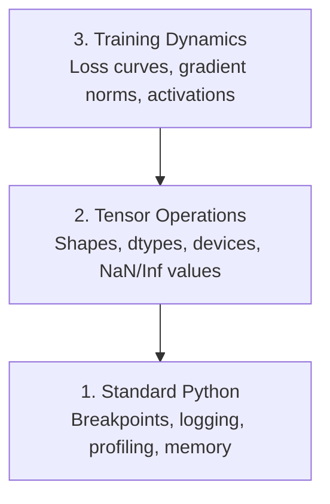

# Dũng hóa và Profiling 调试与性能分析

> Những con bọ AI tồi tệ nhất không bị sập, chúng tập luyện lặng lẽ trên rác và báo cáo một đường cong mất mát đẹp.
> Những lỗi AI tồi tệ nhất sẽ không khiến các quy trình bị sụp đổ. Chúng được đào tạo im lặng trên dữ liệu rác, sau đó báo cáo một sự mất mát đáng yêu.

**Type:** Build | **类型:** 构建
**Language:**Python**语言:**Python
**Prerequisites:** Lesson 1 (Dev Environment), basic PyTorch familiarity | **前置知识:** 第 1 课（开发环境），基本 PyTorch 知识
**Time:** ~60 minutes | **时间:** ~60 分钟

## Mục tiêu học tập

- Sử dụng điều kiện `breakpoint()`và `debug_print`để kiểm tra hình dạng tensor, dtypes và giá trị NaN giữa đào tạo
  中文翻译:使用条件 `breakpoint()`和 `debug_print`Trong quá trình đào tạo kiểm tra hình dạng khối lượng, loại dữ liệu và giá trị NaN
- Profile training loops với `cProfile`- `line_profiler`, và`tracemalloc`để tìm thấy những nút thắt chai
  中文翻译:使用 `cProfile``line_profiler`和 `tracemalloc`分析训练循环, tìm hiệu suất
- Khám phá các lỗi AI phổ biến: sự không phù hợp hình dạng, mất NaN, rò rỉ dữ liệu và các tensor thiết bị sai
  Trung文翻译:检测常见 AI bug: hình dạng không phù hợp, mất tích dữ liệu, rò rỉ và lỗi thiết bị
- Thiết lập TensorBoard để hiển thị đường cong mất mát, histogram trọng lượng và phân phối gradient
  Trung文翻译: thiết lập TensorBoard 可视化损失 曲线、权重直方图和梯度分布

> **【中文解读】**
> Các lỗi của AI 代码 和普通代码 khác nhau: nó sẽ không bị hỏng, mà thay vào đó, nó sẽ cố gắng tập luyện dữ liệu sai lầm để tạo ra một mô hình vô dụng.

> **【拓展：AI 调试为什么特别难？】**
> Thử nghiệm của AI là "trầm lặng thất bại" mô hình trên dữ liệu sai lầm 8 giờ, mất trông bình thường, nhưng cuối cùng dự đoán là rác thải.

## Vấn đề  vấn đề mô tả

Mã AI thất bại khác với mã thông thường. Một ứng dụng web bị hỏng với một dấu vết hàng đống. Một vòng đào tạo không được cấu hình đúng chạy trong 8 giờ, đốt cháy 200 đô la trong thời gian GPU, và tạo ra một mô hình dự đoán trung bình của mỗi đầu vào. Mã không bao giờ sai. Bug là một tensor trên thiết bị sai, một lỗi bị lãng quên.`.detach()`, hoặc nhãn rò rỉ vào các tính năng.

> Cách thất bại của mã AI khác với mã thông thường. Ứng dụng web sẽ sụp đổ và đưa ra một loạt các bài tập theo dõi. Một vòng tròn tập luyện không đúng quy định chạy 8 giờ.`.detach()`、 hoặc nhãn phát ra trong các đặc điểm.

Bạn cần các công cụ gỡ lỗi để phát hiện những lỗi âm thầm này trước khi chúng lãng phí thời gian và tính toán của bạn.

> Bạn cần phải có thể bắt được các công cụ điều tra trước khi những sự yên tĩnh này thất bại lãng phí thời gian và tính toán.

> **【中文解读】**
> AI 调试最难的地方在"静默失败":代码不报错, nhưng kết quả đào tạo hoàn toàn sai lầm.`.detach()` dẫn đến độ rò rỉ 标签 mê vào đặc điểm  Những lỗi này không gây ra bất thường, nhưng sẽ khiến mô hình xuất ra rác.

## Khái niệm cốt lõi

AI debugging hoạt động ở ba cấp độ:

> AI 调试 được thực hiện trên ba cấp độ:



Hầu hết mọi người nhảy thẳng lên cấp 3 (nghằm vào TensorBoard). Nhưng 80% lỗi AI sống ở cấp 1 và 2.

> 大多数人直接跳到第3层(着TensorBoard看) ・・・但80% lỗi AI tồn tại ở tầng 1 và tầng 2 ・・・

> **【中文解读】**
> AI 调试分为三层:第一层是标准 Python 调试(断点、日志、内存分析);第二层是张量操作检查(形状、数据类型、设备、NaN 值);第三层是训练动态观察(loss 曲线、梯度分布、激活值) . Hầu hết mọi người trực tiếp nhìn vào TensorBoard, nhưng 80% lỗi thực sự nằm ở hai tầng trước đó là có thể phát hiện được.

## Hãy xây dựng nó.
```figure
s0-flame-hot
```

## Hãy xây dựng nó

### Phần 1: Việc khắc phục lỗi in (Đúng, nó hoạt động)

Chế độ khắc phục lỗi được loại bỏ. Không nên. Đối với mã tensor, một lệnh in nhắm mục tiêu vượt qua một trình khắc phục lỗi bởi vì bạn cần phải xem hình dạng, kiểu dệt và phạm vi giá trị cùng một lúc.

> 打调试 thường được coi thường nhưng không nên như vậy. Đối với mã lượng 张, một cụm từ in có mục tiêu 语句 hiệu quả hơn so với việc thử dần, bởi vì bạn cần nhìn thấy cùng một lúc hình dạng, loại dữ liệu và phạm vi giá trị.

```python
def debug_print(name, tensor):
    print(f"{name}: shape={tensor.shape}, dtype={tensor.dtype}, "
          f"device={tensor.device}, "  # 张量在 CPU 还是 GPU 上？
          f"min={tensor.min().item():.4f}, max={tensor.max().item():.4f}, "
          f"mean={tensor.mean().item():.4f}, "
          f"has_nan={tensor.isnan().any().item()}")  # 检测是否有 NaN 值
```

Hãy gọi cho tôi sau mỗi lần hoạt động đáng ngờ, và khi tìm thấy lỗi, hãy xóa dấu vân tay.

> Trong mỗi hoạt động có thể nghi ngờ, bạn có thể sử dụng nó.

### Phần 2: Python Debugger (pdb và breakpoint)

Bộ xử lý lỗi được xây dựng trong là bị đánh giá thấp cho công việc AI.`breakpoint()`vào vòng huấn luyện của bạn và kiểm tra các tensor tương tác.

> Trong AI work, bộ điều tra được đánh giá thấp.`breakpoint()`, có thể giao tiếp theo kiểm tra 张量.

> **【中文解读】**
> `breakpoint()`Trong vòng tròn tập luyện, đặt điều kiện xúc động (nếu mất mát đột ngột lớn hoặc xuất hiện NaN), quá trình chỉ dừng lại trong thời gian bất thường.`p`命令检查张量形状、值范围和梯度──

```python
def training_step(model, batch, criterion, optimizer):
    inputs, labels = batch
    outputs = model(inputs)
    loss = criterion(outputs, labels)

    if loss.item() > 100 or torch.isnan(loss):  # loss 异常大或为 NaN 时触发断点
        breakpoint()  # 进入交互式调试器

    loss.backward()
    optimizer.step()
```

Khi debugger đưa bạn vào, lệnh hữu ích:

> 调试器激活后, thường dùng lệnh:

- `p outputs.shape`để kiểm tra hình dạng
  Trung ngữ翻译:`p outputs.shape`检查形状
- `p loss.item()`để xem giá trị mất mát
  Trung ngữ翻译:`p loss.item()`查看 giá trị mất mát
- `p torch.isnan(outputs).sum()`để đếm các NAN
  Trung ngữ翻译:`p torch.isnan(outputs).sum()`统计 NaN 个数
- `p model.fc1.weight.grad`để kiểm tra độ nghiêng
  Trung ngữ翻译:`p model.fc1.weight.grad`检查梯度
- `c`tiếp tục,`q`để bỏ
  Trung ngữ翻译:`c`继续,`q`退出

Đây là điều kiện sửa lỗi, chỉ dừng lại khi có gì đó sai.

> Đó là điều kiện điều tra. Bạn chỉ dừng lại khi có bất thường. Đối với một hoạt động đào tạo 10.000 bước, điều này rất quan trọng.

### Phần 3: Lập nhật Python

Thay thế các tuyên bố in bằng ghi nhật ký khi việc cố định vượt quá kiểm tra nhanh.

> Khi调试 vượt ra ngoài phạm vi kiểm tra nhanh, sử dụng日志 thay thế in 语句。

```python
import logging

logging.basicConfig(
    level=logging.INFO,
    format="%(asctime)s [%(levelname)s] %(message)s",  # 带时间戳和级别的格式
    handlers=[
        logging.FileHandler("training.log"),  # 输出到文件
        logging.StreamHandler()  # 同时输出到终端
    ]
)
logger = logging.getLogger(__name__)

logger.info("Starting training: lr=%.4f, batch_size=%d", lr, batch_size)
logger.warning("Loss spike detected: %.4f at step %d", loss.item(), step)  # 警告级别
logger.error("NaN loss at step %d, stopping", step)  # 错误级别
```

> **【中文解读】**
> Ngày hôm nay, bạn cần phải có một tập tin ngày hôm nay thay vì một tập tin đã được xoay chuyển.

Việc ghi nhật ký cho bạn dấu thời gian, mức độ nghiêm trọng và đầu ra tệp. Khi một cuộc tập luyện thất bại vào 3 giờ sáng, bạn muốn một tệp ghi nhật ký, không phải đầu ra cuối bị quét ra khỏi màn hình.

> Ngày志 cung cấp thời gian、 cấp độ nghiêm trọng và xuất bản tài liệu. Khi tập luyện vào lúc 3 giờ sáng, bạn cần chỉ có các tài liệu nhật ký, chứ không phải là xuất bản cuối màn hình.

### Phần 4: Các phần mã thời gian

Biết thời gian đi đâu là bước đầu tiên để tối ưu hóa.

> 知道时间花在哪里是优化的第一步.

```python
import time

class Timer:
    def __init__(self, name=""):
        self.name = name

    def __enter__(self):
        self.start = time.perf_counter()  # 高精度计时器
        return self

    def __exit__(self, *args):
        elapsed = time.perf_counter() - self.start
        print(f"[{self.name}] {elapsed:.4f}s")  # 打印耗时

with Timer("data loading"):  # 计时数据加载
    batch = next(dataloader_iter)

with Timer("forward pass"):  # 计时前向传播
    outputs = model(batch)

with Timer("backward pass"):  # 计时反向传播
    loss.backward()
```

Kết quả phổ biến: tải dữ liệu mất 60% thời gian đào tạo.`num_workers > 0`trong DataLoader của bạn, không phải là GPU nhanh hơn.

> 常见发现: tải dữ liệu chiếm 60% thời gian tập luyện.`num_workers > 0`, thay vì mua GPU nhanh hơn.

> **【中文解读】**
> Bước đầu tiên để tối ưu hóa hiệu suất là tìm thấy chai .`Timer`类用Python 上下文管理器精确计时每步.                                                                                                                                                                                                                                                      `num_workers > 0`

> **【拓展：数据加载瓶颈是 AI 训练的头号性能杀手】**
> Trong ngành công nghiệp, tỷ lệ sử dụng GPU thấp hơn 80% là lý do hàng đầu là tải dữ liệu quá chậm, GPU trong các loại dữ liệu khác.`num_workers`(thường设为 4-8) 、 sử dụng `pin_memory=True`加速 CPU-GPU 传输、使用 `prefetch_factor`预取数据――Google 内部 TPU 训练管线 sử dụng đặc biệt Data Stream Waterline tối ưu hóa, đảm bảo TPU 永远不用等数据――

### Phần 5: cProfile và line_profiiler

Khi bạn cần nhiều hơn là bộ hẹn giờ thủ công:

> Khi thời gian hoạt động không đủ:

```bash
python -m cProfile -s cumtime train.py  # 按累计时间排序的性能分析
```

Đây cho thấy mỗi cuộc gọi hàm được sắp xếp theo thời gian tích lũy.

> Đây sẽ theo thứ tự thời gian tích lũy cho thấy mỗi hàm được điều chỉnh.

```bash
pip install line_profiler
```

```python
@profile  # line_profiler 装饰器，逐行统计耗时
def train_step(model, data, target):
    output = model(data)
    loss = F.cross_entropy(output, target)
    loss.backward()
    return loss

# Run with: kernprof -l -v train.py  运行逐行性能分析
```

### Phần 6: Xét nghiệm trí nhớ

> **【中文解读】**
> Trong bộ nhớ phân tích chia CPU và GPU 两部分──CPU dùng `tracemalloc`找到 phân phối nhiều nhất bộ nhớ của bộ mã, GPU sử dụng `torch.cuda.memory_summary()`查看显存使用──OOM(Out of Memory) là một trong những sai lầm phổ biến nhất trong việc đào tạo AI.

#### CPU Memory với tracemalloc

```python
import tracemalloc

tracemalloc.start()  # 开始跟踪内存分配

# your code here
model = build_model()
data = load_dataset()

snapshot = tracemalloc.take_snapshot()  # 拍摄内存快照
top_stats = snapshot.statistics("lineno")  # 按代码行统计内存
for stat in top_stats[:10]:
    print(stat)
```

#### CPU Memory với memory_profiiler

```bash
pip install memory_profiler
```

```python
from memory_profiler import profile

@profile  # 逐行分析内存使用
def load_data():
    raw = read_csv("data.csv")       # watch memory jump here  观察内存跳变
    processed = preprocess(raw)       # and here  数据预处理也会增加内存
    return processed
```

Đi cùng `python -m memory_profiler your_script.py`để xem sử dụng bộ nhớ hàng dòng.

> 运行 `python -m memory_profiler your_script.py`查看逐行内存使用──

#### Bộ nhớ GPU với PyTorch

```python
import torch

if torch.cuda.is_available():
    print(torch.cuda.memory_summary())  # GPU 显存完整报告

    print(f"Allocated: {torch.cuda.memory_allocated() / 1e9:.2f} GB")  # 已分配的显存
    print(f"Cached: {torch.cuda.memory_reserved() / 1e9:.2f} GB")  # 缓存的显存
```

Khi bạn nhấn OOM (Out of Memory):

> Khi gặp OOM (khỏi lưu trữ):

1. Giảm kích thước lô (điều đầu tiên phải thử, luôn luôn)
   Trung文翻译:减小批量量 (减小批量量)
2. Sử dụng `torch.cuda.empty_cache()`để giải phóng bộ nhớ được lưu trữ trong cache
   中文翻译:使用 `torch.cuda.empty_cache()`释放缓存内存
3. Sử dụng `del tensor`tiếp theo là `torch.cuda.empty_cache()`cho các sản phẩm trung gian lớn
   Trung文翻译:对大型中间变量使用 `del tensor`加 `torch.cuda.empty_cache()`
4. Sử dụng độ chính xác hỗn hợp (`torch.cuda.amp`) để giảm một nửa sử dụng bộ nhớ
   中文翻译: sử dụng混合精度`torch.cuda.amp`(c) giảm sử dụng
5. Sử dụng kiểm tra độ nghiêng cho các mô hình rất sâu
   Trung ngữ翻译:对很深的模型使用梯度检查点

### Phần 7: Những con bọ AI phổ biến và cách bắt chúng

> **【中文解读】**
> Đây là phần thực tế nhất của chương này. Có 4 loại lỗi thông thường nhất của AI: hình dạng không phù hợp.

#### Sự không phù hợp hình dạng

Thằng quạ thường xuyên nhất.`[batch, features]`khi mô hình đang mong đợi `[batch, channels, height, width]`- Tôi không biết.

> Loại lỗi phổ biến nhất.`[batch, features]`Nhưng mô hình mong đợi`[batch, channels, height, width]`

```python
def check_shapes(model, sample_input):
    print(f"Input: {sample_input.shape}")  # 打印输入形状
    hooks = []

    def make_hook(name):
        def hook(module, inp, out):
            in_shape = inp[0].shape if isinstance(inp, tuple) else inp.shape
            out_shape = out.shape if hasattr(out, "shape") else type(out)
            print(f"  {name}: {in_shape} -> {out_shape}")  # 打印每层的输入输出形状
        return hook

    for name, module in model.named_modules():
        hooks.append(module.register_forward_hook(make_hook(name)))  # 注册钩子函数

    with torch.no_grad():  # 不计算梯度，仅检查形状
        model(sample_input)

    for h in hooks:
        h.remove()  # 清理钩子
```

Hãy thử thử một lần với một loạt mẫu, nó sẽ vẽ bản đồ mọi biến đổi hình dạng trong mô hình của bạn.

> Sử dụng một tập hợp mẫu 运行 một lần. Nó sẽ thay đổi hình dạng của mỗi mô hình trong mô hình chiếu.

#### Nên mất

Nấm máu của một người có thể gây ra một vụ nổ.

> Nàng mất có nghĩa là có gì đó đã nổ...

> **【拓展：NaN 在大模型训练中的灾难性影响】**
> Trong bài tập LLM, NaN một khi xuất hiện trong thang độ, sẽ thông qua sự lan rộng ngược chiều đến tất cả các tham số, dẫn đến toàn bộ mô hình không thể phục hồi được. Trong bài tập tập GPT-3 được đề cập, họ sử dụng thang độ cắt cắt (gratilen cắt) và tỷ lệ học tập dự kiến nóng (warmup) để ngăn chặn NaN. Một khi kiểm tra đến NaN, thực hành thường là quay trở lại điểm kiểm tra gần đây để bắt đầu lại, thay vì cố gắng sửa lại.

- Tốc độ học tập quá cao
  Trung ngữ翻译: học tập tỷ lệ quá cao
- Phân chia bằng không trong tổn thất hải quan
  Trung文翻译: tự định nghĩa mất 中除以零
- Lập nhật số 0 hoặc số âm
  Trung ngữ翻译:对零或负数取对数
- Các gradient nổ trong RNN
  Trung ngữ翻译:RNN 中的梯度爆炸

```python
def detect_nan(model, loss, step):
    if torch.isnan(loss):  # 检测 loss 是否为 NaN
        print(f"NaN loss at step {step}")
        for name, param in model.named_parameters():
            if param.grad is not None:
                if torch.isnan(param.grad).any():  # 检测梯度中的 NaN
                    print(f"  NaN gradient in {name}")
                if torch.isinf(param.grad).any():  # 检测梯度中的 Inf
                    print(f"  Inf gradient in {name}")
        return True
    return False
```

#### Tiết xuất dữ liệu

Mô hình của anh có độ chính xác 99% trên thiết bị thử nghiệm.

> Mô hình của bạn trên tập hợp thử nghiệm có tỷ lệ chính xác 99%... nghe có vẻ rất tốt... thực sự là một lỗi...

```python
def check_data_leakage(train_set, test_set, id_column="id"):
    train_ids = set(train_set[id_column].tolist())  # 训练集 ID 集合
    test_ids = set(test_set[id_column].tolist())  # 测试集 ID 集合
    overlap = train_ids & test_ids  # 取交集
    if overlap:
        print(f"DATA LEAKAGE: {len(overlap)} samples in both train and test")  # 发现重叠！
        return True
    return False
```

Ngoài ra kiểm tra cho rò rỉ thời gian: sử dụng dữ liệu trong tương lai để dự đoán quá khứ.

> Ngoài ra, cần kiểm tra thời gian rò rỉ: sử dụng dữ liệu tương lai dự đoán quá khứ.

#### Thiết bị sai

Các tensor trên các thiết bị khác nhau (CPU vs GPU) gây ra lỗi thời gian chạy. Nhưng đôi khi một tensor lặng lẽ ở lại trên CPU trong khi tất cả mọi thứ khác là trên GPU, và đào tạo chỉ chạy chậm.

> Không giống như số lượng trên thiết bị ((CPU vs GPU) sẽ dẫn đến lỗi trong quá trình chạy. Nhưng đôi khi một số lượng còn lại trên CPU, trong khi những người khác trên GPU, tập luyện chỉ chậm lại.

```python
def check_devices(model, *tensors):
    model_device = next(model.parameters()).device  # 获取模型所在设备
    print(f"Model device: {model_device}")
    for i, t in enumerate(tensors):
        if t.device != model_device:  # 检查张量和模型是否在同一设备
            print(f"  WARNING: tensor {i} on {t.device}, model on {model_device}")
```

### Phần 8: Các nguyên tắc cơ bản của TensorBoard

TensorBoard cho bạn thấy những gì đang xảy ra trong tập luyện theo thời gian.

> TensorBoard  hiển thị những thay đổi xảy ra trong quá trình đào tạo.

```bash
pip install tensorboard  # 安装 TensorBoard
```

```python
from torch.utils.tensorboard import SummaryWriter

writer = SummaryWriter("runs/experiment_1")  # 创建日志写入器

for step in range(num_steps):
    loss = train_step(model, batch)

    writer.add_scalar("loss/train", loss.item(), step)  # 记录训练 loss
    writer.add_scalar("lr", optimizer.param_groups[0]["lr"], step)  # 记录学习率

    if step % 100 == 0:
        for name, param in model.named_parameters():
            writer.add_histogram(f"weights/{name}", param, step)  # 记录权重分布
            if param.grad is not None:
                writer.add_histogram(f"grads/{name}", param.grad, step)  # 记录梯度分布

writer.close()
```

Thả nó ra:

>  khởi động TensorBoard:

```bash
tensorboard --logdir=runs  # 启动 TensorBoard 可视化服务
```

Tìm gì:

> 观察要点:

- **Loss not decreasing**: Tốc độ học tập quá thấp, hoặc vấn đề kiến trúc mô hình
  Trung ngữ翻译:**Loss 不降**: tỷ lệ học quá thấp, hoặc có vấn đề về cấu trúc mô hình
- **Loss oscillating wildly**: Tốc độ học tập quá cao
  Trung ngữ翻译:**Loss 剧烈震荡**: tỷ lệ học tập quá cao
- **Loss goes to NaN**: Sự bất ổn số (xem phần NaN trên)
  Trung ngữ翻译:**Loss 变 NaN**: số giá trị không ổn định(参见上方 NaN 部分)
- **Train loss decreasing, val loss increasing**: Tích quá
  Trung ngữ翻译:**训练 loss 降但验证 loss 升**: quá拟合
- **Weight histograms collapsing to zero**: Nhất dần
  Trung ngữ翻译:**权重直方图趋零**: 梯度 biến mất
- **Gradient histograms exploding**: cần cắt gradient
  Trung ngữ翻译:**梯度直方图爆炸**: cần phải cắt tỉa

> **【中文解读】**
> TensorBoard là một công cụ tiêu chuẩn để tập luyện có thể nhìn thấy được.

> **【拓展：Weights & Biases 与 TensorBoard 的对比】**
> TensorBoard là công cụ đào tạo có thể nhìn thấy của Google, phù hợp với cá nhân và nhóm nhỏ. Weights & Biases (W&B) là công cụ thương mại, tăng cường các tính năng thử nghiệm đối với nhóm cộng tác, tìm kiếm siêu số. Trong OpenAI, Anthropic, và các công ty khác, W&B là nền tảng theo dõi thí nghiệm tiêu chuẩn. Một thí nghiệm kiểu lớn theo dõi hàng ngàn chỉ số: mất, tỷ lệ học, tỷ lệ số, phân phối trọng lượng trên mọi cấp độ, tỷ lệ sử dụng GPU, v.v.

### Phần 9: VS Code Debugger

Để làm lỗi tương tác, cấu hình VS Code với `launch.json`- Có thể là:

> 对于交互式调试, dùng `launch.json`配置 VS Code:

```json
{
    "version": "0.2.0",
    "configurations": [
        {
            "name": "Debug Training",
            "type": "debugpy",
            "request": "launch",
            "program": "${file}",  // 调试当前打开的文件
            "console": "integratedTerminal",  // 使用集成终端
            "justMyCode": false  // 允许调试第三方库代码
        }
    ]
}
```

Đặt điểm chia cắt bằng cách nhấp vào đường thoát. Sử dụng bảng biến để kiểm tra các thuộc tính tensor. Console Debug cho phép bạn chạy các biểu hiện Python tùy ý giữa thực hiện.

> Click行号左侧设置断点──使用变量板检查张量属性──调试控制台让你在执行过程中运行任意 Python表达──

hữu ích để bước qua các đường ống xử lý dữ liệu trước khi bạn muốn xem mỗi chuyển đổi.

> 适用于 từng bước điều chỉnh dữ liệu dự án xử lý, xem kết quả của mỗi lần thay đổi

## Hãy sử dụng nó để thực hiện

> **【中文解读】**
> 实践中的调试工作流分五步: 训练前用 `check_shapes`验证维度;前 10 步用 `debug_print`检查张量值; training中使用TensorBoard 监控;出问题时使用 `breakpoint()`交互调试; performance bottle dùng máy tính và bộ nhớ phân tích định vị.

Đây là dòng công việc gỡ lỗi bắt được hầu hết các lỗi AI:

> Dưới đây là những dòng làm việc có thể bắt được hầu hết các lỗi AI:

1. **Before training**: chạy `check_shapes`với một lô mẫu. Kiểm tra các kích thước đầu vào và đầu ra phù hợp với kỳ vọng.
   Trung ngữ翻译:**训练前**:用样本批 运行 `check_shapes`, xác minh nhập khẩu xuất khẩu có đáp ứng dự kiến không.
2. **First 10 steps**Sử dụng:`debug_print`xác nhận không có gì là NaN và giá trị ở trong phạm vi hợp lý.
   Trung ngữ翻译:**前 10 步**: đối với tổn thất, xuất khẩu và sử dụng thang`debug_print`, xác nhận không có giá trị trong phạm vi hợp lý.
3. **During training**: Lỡ nhật ký, tốc độ học tập và các chuẩn gradient. Sử dụng TensorBoard để hình ảnh hóa.
   Trung ngữ翻译:**训练中**: ghi nhớ mất, tỷ lệ học tập và độ tần số.
4. **When something breaks**Thả đi`breakpoint()`kiểm tra các tensor tương tác.
   Trung ngữ翻译:**出问题时**: trong故障点放入 `breakpoint()`,交互式检查张量──
5. **For performance**: Thời gian tải dữ liệu của bạn so với chuyển tiếp về phía trước so với ngược.
   Trung ngữ翻译:**性能优化**:分分计时数据加载、前向传播和反向传播── nếu gần OOM, tiến hành phân tích内存──

## Chuyển nó đi.

Dạy trình kịch bản bộ công cụ gỡ lỗi:

> 运行调试工具脚本:

```bash
python phases/00-setup-and-tooling/12-debugging-and-profiling/code/debug_tools.py
```

Nhìn xem`outputs/prompt-debug-ai-code.md`cho một lời nhắc giúp chẩn đoán các lỗi cụ thể của AI.

> 参见 `outputs/prompt-debug-ai-code.md`, trong đó có giúp chẩn đoán AI đặc định của prompt.

## Tập luyện bài tập

1. Đi chạy`debug_tools.py`và đọc thông qua đầu ra của mỗi phần. sửa đổi mô hình giả để giới thiệu một NaN (khung: chia bằng không trong thông qua phía trước) và xem máy dò bắt nó.
   运行调试工具脚本, sửa đổi mô hình giới thiệu NaN,观察检测器如何捕获它
2. Tạo hồ sơ vòng đào tạo với `cProfile`và xác định hàm chậm nhất.
   Sử dụng cProfile  phân tích vòng tập luyện, tìm ra hàm chậm nhất
3. Sử dụng `tracemalloc`để tìm ra dòng nào trong đường ống tải dữ liệu của bạn phân bổ bộ nhớ nhiều nhất.
   Sử dụng tracemalloc  tìm ra dữ liệu tải đường ống trong đó các dòng phân phối nhiều nhất bộ nhớ
4. Thiết lập TensorBoard cho một cuộc tập luyện đơn giản và xác định xem mô hình có quá phù hợp hay không.
   设置 TensorBoard  giám sát quá trình đào tạo, quyết định mô hình có phù hợp không
5. Sử dụng `breakpoint()`Thực hành kiểm tra hình dạng tensor, thiết bị và giá trị gradient từ prompt debugger.
   Trong vòng tròn tập luyện sử dụng điểm vỡ (breakpoint)), tập luyện kiểm tra hình dạng, thiết bị và giá trị độ
