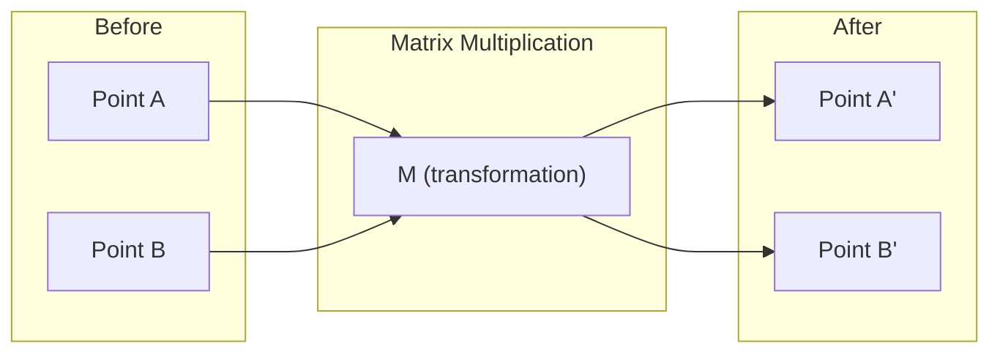
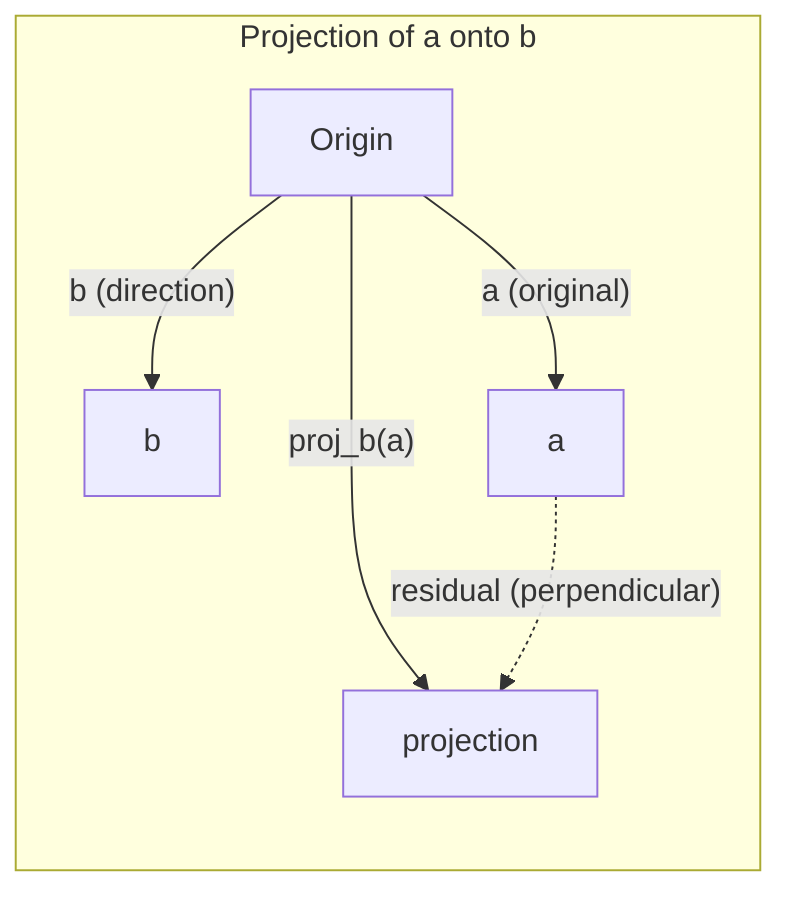

# Lịch lý đại số tuyến tính
# 线性代数直觉

> Mỗi mô hình AI chỉ là toán tử mặc mũ đẹp.
> Mỗi mô hình AI về bản chất là một mô hình vận hành trên một bộ trang phục trang trí.

**Type:** Learn | **类型:** 学习 | **Languages:** Python, Julia | **语言:** Python, Julia | **Prerequisites:** Phase 0 | **前置知识:** Phase 0 | **Time:** ~60 minutes | **时间:** ~60 分钟

## Mục tiêu học tập

- Thực hiện các hoạt động vector và matrix (tổ số, sản phẩm chấm, nhân matrix) từ đầu trong Python
  Từ 0 thực hiện khối lượng và矩阵运算 (từ 0 thực hiện khối lượng và矩阵运算)
- Giải thích hình học những gì sản phẩm chấm, chiếu và quy trình Gram-Schmidt làm
  Từ một góc độ quan trọng giải thích điểm tích, chiếu, Gram-Schmidt
- Xác định độc lập tuyến tính, cấp độ và cơ sở của một tập hợp vector bằng cách sử dụng giảm hàng
  U 行化简化(高斯消元) phán xét线性无关性、秩和基
- Kết nối các khái niệm đại số tuyến tính với các ứng dụng AI của họ: nhúng, điểm chú ý và LoRA
  **将线性代数概念与 AI 应用对接：词嵌入、注意力分数、LoRA 微调**

## Vấn đề là tại sao phải học được điều này?

Mở bất kỳ giấy ML nào. Trong trang đầu tiên, bạn sẽ thấy các vector, matrix, sản phẩm chấm và chuyển đổi. Không có trực giác đại số tuyến tính, đây chỉ là biểu tượng. Với nó, bạn có thể thấy một mạng thần kinh thực sự làm gì - di chuyển các điểm trong không gian.

Bạn không cần phải là một nhà toán học, bạn cần phải xem những hoạt động này có nghĩa là gì theo hình học, và sau đó tự lập mã chúng.

> **【中文解读】**翻开任何一篇机器学习论文,第一页就会出现向量、矩阵、点积、变化──没有线性代数直觉,这些只是符号──有直觉,你就能"看穿"网络神经在做什么在空间中的移动点位置──你不需要成为数学家,只需要理解这些操作的几何含义,然后自己写代码实现──

## Khái niệm cốt lõi

### Các vector là điểm (và hướng) √ 向量是点(也是方向)

Một vector chỉ là một danh sách số. Nhưng những số đó có ý nghĩa gì đó -- chúng là các phối hợp trong không gian.

**2D vector [3, 2]:**

| x | y | Point |
|---|---|-------|
| 3 | 2 | The vector points from origin (0,0) to (3, 2) on the plane |

Dòng vector có độ lớn vuông ((3^2 + 2^2) = vuông ((13) và chỉ lên và về phía bên phải.

Trong AI, các vector đại diện cho mọi thứ:
- Một từ → một vector của 768 số (tên của nó trong không gian nhúng)
- Một hình ảnh → một vector có giá trị hàng triệu pixel
- Một người dùng → một vector của sở thích

> **【中文解读】**向量就是一组数字, đại diện cho坐标 trong không gian.`[3, 2]`biểu diễn từ điểm gốc (0,0) 指向 (3,2) 的箭头,长度 = √(32+22) = √13。
>
> **【拓展：向量在 AI 中的化身】**
> - **词嵌入 (Word Embedding)**Mỗi từ trở thành 768 维向量── " vua " và " nữ hoàng " 量 rất gần, vì语义 liên quan── đây là biểu hiện dưới cùng của Word2Vec、BERT、GPT──
> - **图片特征**Một张 224×224 hình ảnh màu = 150,528 个数字的向量;;CNN bản chất là đang dần nén hóa向量;;
> - **用户画像**: hệ thống khuyến cáo đưa trình duyệt / mua lịch sử của bạn vào một khối lượng ưu tiên, sau đó tìm thấy khối lượng hàng hóa tương tự nhất khuyến cáo cho bạn.

### Matrix là sự biến đổi.

Một matrix biến đổi một vector thành một vector khác. nó có thể xoay, quy mô, kéo dài hoặc chiếu.



Trong AI, các matrix là mô hình:
- Năng lượng mạng thần kinh → các matrices chuyển đổi đầu vào thành đầu ra
- Điểm chú ý → các matrices quyết định những gì để tập trung vào
- Các nhúng → các matrix mà lập bản đồ từ cho các vector

> **【中文解读】**矩阵就是一个"变换规则":输入一个向量,输出另一个向量――可以旋转,缩缩,拉伸,投影――
>
> **【拓展：神经网络就是矩阵乘法的嵌套】**
> Một tầng mạng thần kinh = `output = W × input + bias`
> - W 是权重矩阵 (để học các tham số)
> - input là输入向量(上层的输出)
> - Một mạng 3 tầng là 3 lần liên kết của các mô hình nhân
> - GPT-3 có 1750 tỷ số, trên thực tế là vài trăm mô hình mô hình.
> - **训练**= Sử dụng thang xuống liên tục điều chỉnh số trong các mô hình này

### Các điểm đo sản phẩm tương đồng .

Kết quả điểm của hai vector cho bạn biết chúng tương tự như thế nào.

```
a · b = a₁×b₁ + a₂×b₂ + ... + aₙ×bₙ

Same direction:      a · b > 0  (similar)
Perpendicular:       a · b = 0  (unrelated)
Opposite direction:  a · b < 0  (dissimilar)
```

Đây là cách mà các công cụ tìm kiếm, hệ thống khuyến nghị và RAG hoạt động -- tìm ra các vector với các sản phẩm điểm cao.

> **【中文解读】**Điểm积 = đối với 应分量相乘后求和── kết quả > 0 方向相似,= 0 垂直无关,< 0 方向相反──
>
> **【拓展：点积是 AI 最核心的数学操作】**
> 1. **Transformer Attention**- Có thể là:`Attention(Q,K,V) = softmax(Q·K^T / √d)·V`
>    - Q(hỏi) 和 K(键) 的点积 = "Tôi nên chú ý hơn về từ này"
>    - Đó là cơ chế cốt lõi của tất cả các mô hình lớn.
> 2. **RAG 检索**: Đặt các vấn đề người dùng thành khối lượng, và tất cả các khối lượng tài liệu làm điểm tích, tìm các tài liệu liên quan nhất
> 3. **推荐系统**: user preference向量 · 商品特征向量 = 推分数
> 4. **余弦相似度**= 归一化后的点积,`cos(a,b) = a·b / (|a|×|b|)`,值域 [-1, 1]
>    比"欧氏距离"更好: chỉ nhìn hướng không nhìn chiều dài, "喜欢"和"非常喜欢"语义相似

### Sự độc lập tuyến tính không liên quan

Các vector là tuyến tính độc lập nếu không có vector trong tập thể có thể được viết là sự kết hợp của những người khác. Nếu v1, v2, v3 độc lập, chúng trải dài một không gian 3D. Nếu một là sự kết hợp của những người khác, chúng chỉ trải dài một máy bay.

Tại sao nó quan trọng cho AI: các tính năng của bạn nên có cột độc lập tuyến tính. Nếu hai tính năng tương quan hoàn hảo (thay thuộc tuyến tính), mô hình không thể phân biệt các hiệu ứng của chúng. Điều này gây ra sự đa tuyến tính trong sự hồi quy - các khối lượng của matrix trở nên bất ổn, và những thay đổi đầu vào nhỏ tạo ra các biến động đầu ra hoang dã.

**Concrete example:**

```
v1 = [1, 0, 0]
v2 = [0, 1, 0]
v3 = [2, 1, 0]   # v3 = 2*v1 + v2
```

v1 và v2 là độc lập - không phải là một nhân số scalar hoặc sự kết hợp của các khác. Nhưng v3 = 2 * v1 + v2, vì vậy {v1, v2, v3} là một tập phụ thuộc. Ba vector này đều nằm trong phẳng xy. Cho dù bạn kết hợp chúng như thế nào, bạn không thể đạt được [0, 0, 1]. Bạn có ba vector nhưng chỉ có hai chiều tự do.

Trong một tập dữ liệu: nếu feature_3 = 2*feature_1 + feature_2, thêm feature_3 sẽ cung cấp cho mô hình không có thông tin mới.

> **【中文解读】**Một nhóm các khối "线性无关" = 没有任何一个能被其他向量出──
>
> Ví dụ:`[1,0,0]`- `[0,1,0]`- `[0,0,1]`互独立 ✓
>     `[1,0,0]`- `[0,1,0]`- `[2,1,0]`不独立 (第三个 = 2×第一个 + 第二个)
>
> **【拓展：多重共线性问题】**
> Trong dữ liệu tài chính rất phổ biến: ví dụ: "Hô nhà theo đô la" và "Hô nhà theo nhân dân tệ" là hoàn toàn liên quan trực tuyến,
> Đồng thời đưa vào mô hình sẽ dẫn đến trọng lượng không ổn định, mô hình quá phù hợp.

### Cơ sở và cấp độ

Một cơ sở là một tập hợp tối thiểu của các vector độc lập tuyến tính trải dài toàn bộ không gian.

Cơ sở tiêu chuẩn cho không gian 3D là {[1,0,0], [0,1,0], [0,0,1]}. Nhưng bất kỳ ba vector độc lập nào trong 3D tạo thành cơ sở hợp lệ.

Đường độ của một matrix = số lượng cột độc lập tuyến tính = số lượng hàng độc lập tuyến tính. Nếu xếp hạng < m ((những hàng, hàng), các matrix là thiếu xếp hạng. Điều này có nghĩa là:
- Hệ thống có vô số giải pháp (hoặc không có)
- Thông tin bị mất trong quá trình chuyển đổi
- Matrix không thể đảo ngược

| Situation | Rank | What it means for ML |
|-----------|------|---------------------|
| Full rank (rank = min(m, n)) | Maximum possible | Unique least-squares solution exists. Model is well-conditioned. |
| Rank deficient (rank < min(m, n)) | Below maximum | Features are redundant. Infinitely many weight solutions. Regularization needed. |
| Rank 1 | 1 | Every column is a scaled copy of one vector. All data lies on a line. |
| Near rank-deficient (small singular values) | Numerically low | Matrix is ill-conditioned. Tiny input noise causes large output changes. Use SVD truncation or ridge regression. |

> **【中文解读】**
> - **基 (Basis)**: mô tả một không gian cần thiết ⋅mức tối thiểu ⋅mức ⋅mức ⋅mức ⋅mức ⋅mức ⋅mức ⋅mức ⋅mức ⋅mức ⋅mức ⋅mức ⋅mức ⋅mức ⋅mức ⋅mức ⋅mức ⋅mức ⋅mức ⋅mức ⋅mức ⋅mức ⋅mức ⋅mức ⋅mức ⋅mức ⋅mức ⋅mức ⋅mức ⋅mức ⋅mức ⋅mức ⋅mức ⋅mức ⋅mức ⋅mức ⋅mức ⋅mức ⋅mức ⋅mức ⋅mức ⋅mức ⋅mức ⋅mức ⋅mức ⋅m ⋅m ⋅m ⋅m ⋅m ⋅m ⋅m ⋅m ⋅m ⋅m ⋅m ⋅m ⋅m ⋅m ⋅m ⋅m ⋅m ⋅m ⋅m ⋅m ⋅m ⋅m ⋅m ⋅m ⋅m ⋅m ⋅m ⋅m ⋅m ⋅m ⋅m ⋅m ⋅m ⋅m ⋅
> - **秩 (Rank)**:矩阵中真正独立的列数 (或行数)
>
>  Tình hình  ý nghĩa  tác động
> Ồ, không, không, không.
>                                                                                                                                                                                                                                                               
>                                                                                                                                                                                                                                                               
>                                                                                                                                                                                                                                                               
>
> **【拓展：LoRA —— 秩在 AI 中最惊艳的应用】**
> LoRA(Lower-Rank Adaptation)
> - Đường trọng lượng nguyên bản W là 4096×4096 ((1600.000参数)
> - 微调时,权重更新 ΔW  thực tế là "低排" của
> - LoRA đưa ΔW chia thành hai mô hình nhỏ A(4096×16) và B(16×4096)
> - 参数 từ 1600.000 → 130.000, giảm **99%**Nhưng hiệu quả hầu như không giảm
> - Đây là một ví dụ về khái niệm "rạng" thay đổi trực tiếp hiện thực.

### Động chiếu Động chiếu

Vêctơ dự án **a**trên vector **b**cho thành phần của **a**hướng tới **b**- Có thể là:

```
proj_b(a) = (a dot b / b dot b) * b
```

Số dư (a - proj_b(a)) là thẳng đứng với b. Sự phân hủy trực giác này là nền tảng của các bộ sơn vuông nhỏ nhất.

Đánh chiếu là ở khắp mọi nơi trong ML:
- Lịch chiếu tuyến tính giảm thiểu khoảng cách từ quan sát đến không gian cột -- giải pháp là một dự đoán
- PCA dự báo dữ liệu về hướng biến động tối đa
- Sự chú ý trong các bộ biến tính toán các dự đoán của các truy vấn trên các phím



**Example:**a = [3, 4], b = [1, 0]

Proj_b(a) = (3*1 + 4*0) / (1*1 + 0*0) * [1, 0] = 3 * [1, 0] = [3, 0]

Dự án làm giảm thành phần y. Đây là sự giảm chiều kích trong hình thức đơn giản nhất của nó - ném đi những hướng bạn không quan tâm.

> **【中文解读】**投影 = 向量在某个方向上的"影子"──
> `a=[3,4]`投影到x 轴 `[1,0]`上 = `[3,0]`, chỉ là bỏ phần của nó đi.
> 残差 = 原向量 - 投影 = `[0,4]`, ,与投影方向垂直──
>
> **【拓展：投影与降维的关系】**
> 投影是最简单的"降维"抛掉不关心的方向──PCA(主成分分析) là phiên bản nâng cấp của nó:
> Không ném hướng cố định, mà tự động tìm thấy "đường khác biệt lớn nhất" (khả năng lớn nhất) để chiếu.
> Đặt 1000 维 dữ liệu chiếu lên 50 维, giữ lại 95% thông tin trên. Đây là tính chất toán học của compression.

### Quá trình Gram-Schmidt đang được chuyển đổi

Chuyển đổi bất kỳ bộ các vector độc lập nào thành một cơ sở hoặc.

Khóa toán:
1. Hãy lấy vector đầu tiên, bình thường hóa nó
2. Hãy lấy vector thứ hai, trừ đi sự chiếu của nó lên đầu tiên, bình thường hóa
3. Hãy lấy vector thứ ba, trừ ra các dự đoán của nó lên tất cả các vector trước đó, bình thường hóa
4. Lặp lại cho các vector còn lại

```
Input:  v1, v2, v3, ... (linearly independent)

u1 = v1 / |v1|

w2 = v2 - (v2 dot u1) * u1
u2 = w2 / |w2|

w3 = v3 - (v3 dot u1) * u1 - (v3 dot u2) * u2
u3 = w3 / |w3|

Output: u1, u2, u3, ... (orthonormal basis)
```

Đây là cách phân hủy QR hoạt động bên trong. Q là cơ sở thông thường, R nắm bắt các hệ số chiếu.
- Giải quyết hệ thống tuyến tính (thực tế hơn việc loại bỏ Gaussian)
- Tính toán giá trị riêng (QR algorithm)
- Trình ngược vuông tối thiểu (chương pháp số tiêu chuẩn)

> **【中文解读】**Đặt bất kỳ tập thể nào của khối lượng trở thành "đối thẳng + 长为1" tiêu chuẩn chính xác.
>
> 直觉: mỗi chiều mới trước tiên được giảm trong "重合部分" trên một hướng đã có (投影), chỉ giữ toàn bộ hướng mới, tái归归化.
> Như thể mỗi khối xây dựng đều chọn một hướng hoàn toàn mới, không giống như việc chồng lên trước đó.
>
> **【拓展：为什么"正交"这么重要？】**
> 正交基的计算最稳定──如果基向量之间有"重合" (trong交),误差计算会不断积累增加──
> QR 分解(Gram-Schmidt's矩阵形式) là một nền tảng của tính toán số giá trị:
> - NumPy 解方程 dùng tầng dưới là QR 分解
> - Đặc điểm tính toán giá trị sử dụng QR 代算法
> - 最小二乘归的标准数值解法

## Hãy xây dựng nó.
```figure
eigen-directions
```

## Hãy xây dựng nó

### Bước 1: Các vector từ đầu (Python)

```python
class Vector:
    def __init__(self, components):
        self.components = list(components)
        self.dim = len(self.components)

    def __add__(self, other):
        return Vector([a + b for a, b in zip(self.components, other.components)])

    def __sub__(self, other):
        return Vector([a - b for a, b in zip(self.components, other.components)])

    def dot(self, other):
        # 点积：对应分量相乘后求和。AI 中最核心的相似度度量。
        return sum(a * b for a, b in zip(self.components, other.components))

    def magnitude(self):
        return sum(x**2 for x in self.components) ** 0.5

    def normalize(self):
        # 归一化：缩放到长度1。归一化后点积=余弦相似度。
        mag = self.magnitude()
        return Vector([x / mag for x in self.components])

    def cosine_similarity(self, other):
        # 余弦相似度：只看方向不看长度，值域[-1,1]
        return self.dot(other) / (self.magnitude() * other.magnitude())

    def __repr__(self):
        return f"Vector({self.components})"


a = Vector([1, 2, 3])
b = Vector([4, 5, 6])

print(f"a + b = {a + b}")
print(f"a · b = {a.dot(b)}")
print(f"|a| = {a.magnitude():.4f}")
print(f"cosine similarity = {a.cosine_similarity(b):.4f}")
```

### Bước 2: Matrix từ đầu (Python)

```python
class Matrix:
    def __init__(self, rows):
        self.rows = [list(row) for row in rows]
        self.shape = (len(self.rows), len(self.rows[0]))

    def __matmul__(self, other):
        # 矩阵乘法 = 神经网络一层的前向传播
        if isinstance(other, Vector):
            return Vector([
                sum(self.rows[i][j] * other.components[j] for j in range(self.shape[1]))
                for i in range(self.shape[0])
            ])
        rows = []
        for i in range(self.shape[0]):
            row = []
            for j in range(other.shape[1]):
                row.append(sum(
                    self.rows[i][k] * other.rows[k][j]
                    for k in range(self.shape[1])
                ))
            rows.append(row)
        return Matrix(rows)

    def transpose(self):
        return Matrix([
            [self.rows[j][i] for j in range(self.shape[0])]
            for i in range(self.shape[1])
        ])

    def __repr__(self):
        return f"Matrix({self.rows})"


rotation_90 = Matrix([[0, -1], [1, 0]])
point = Vector([3, 1])

rotated = rotation_90 @ point
print(f"Original: {point}")
print(f"Rotated 90°: {rotated}")
```

### Bước 3: Tại sao điều này quan trọng đối với AI. Bước 3: Điều này có liên quan gì đến AI?

```python
import random

random.seed(42)
weights = Matrix([[random.gauss(0, 0.1) for _ in range(3)] for _ in range(2)])
input_vector = Vector([1.0, 0.5, -0.3])

output = weights @ input_vector
print(f"Input (3D): {input_vector}")
print(f"Output (2D): {output}")
print("This is what a neural network layer does -- matrix multiplication.")
# 矩阵乘法：3维输入 → 2维输出。这就是神经网络一层的全部计算。
# 一个真正的网络就是把很多这样的层串起来，每层都有一个权重矩阵。
```

### Bước 4: Phiên bản Julia.

```julia
a = [1.0, 2.0, 3.0]
b = [4.0, 5.0, 6.0]

println("a + b = ", a + b)
println("a · b = ", a ⋅ b)       # Julia supports unicode operators
println("|a| = ", √(a ⋅ a))
println("cosine = ", (a ⋅ b) / (√(a ⋅ a) * √(b ⋅ b)))

# Matrix-vector multiplication
W = [0.1 -0.2 0.3; 0.4 0.5 -0.1]
x = [1.0, 0.5, -0.3]
println("Wx = ", W * x)
println("This is a neural network layer.")
```

### Bước 5: Tự độc lập tuyến tính và chiếu từ đầu (Python)

```python
def is_linearly_independent(vectors):
    # 高斯消元法：把向量排成矩阵，化简，看秩是否等于向量个数
    n = len(vectors)
    dim = len(vectors[0].components)
    mat = Matrix([v.components[:] for v in vectors])
    rows = [row[:] for row in mat.rows]
    rank = 0
    for col in range(dim):
        pivot = None
        for row in range(rank, len(rows)):
            if abs(rows[row][col]) > 1e-10:
                pivot = row
                break
        if pivot is None:
            continue
        rows[rank], rows[pivot] = rows[pivot], rows[rank]
        scale = rows[rank][col]
        rows[rank] = [x / scale for x in rows[rank]]
        for row in range(len(rows)):
            if row != rank and abs(rows[row][col]) > 1e-10:
                factor = rows[row][col]
                rows[row] = [rows[row][j] - factor * rows[rank][j] for j in range(dim)]
        rank += 1
    return rank == n


def project(a, b):
    # 投影：a 在 b 方向上的"影子"
    scalar = a.dot(b) / b.dot(b)
    return Vector([scalar * x for x in b.components])


def gram_schmidt(vectors):
    # 正交化：每个向量减去在已有方向上的投影，只保留新方向
    orthonormal = []
    for v in vectors:
        w = v
        for u in orthonormal:
            proj = project(w, u)
            w = w - proj
        if w.magnitude() < 1e-10:
            continue
        orthonormal.append(w.normalize())
    return orthonormal


v1 = Vector([1, 0, 0])
v2 = Vector([1, 1, 0])
v3 = Vector([1, 1, 1])
basis = gram_schmidt([v1, v2, v3])
for i, u in enumerate(basis):
    print(f"u{i+1} = {u}")
    print(f"  |u{i+1}| = {u.magnitude():.6f}")

print(f"u1 · u2 = {basis[0].dot(basis[1]):.6f}")
print(f"u1 · u3 = {basis[0].dot(basis[2]):.6f}")
print(f"u2 · u3 = {basis[1].dot(basis[2]):.6f}")
```

## Hãy sử dụng nó với khung thực hiện theo cách bạn thực sự sẽ sử dụng trong chiến tranh)

Bây giờ điều tương tự với NumPy -- những gì bạn thực sự sẽ sử dụng trong thực tế:
Bây giờ, với số liệu thực tế, bạn sẽ sử dụng những thứ này:

```python
import numpy as np

a = np.array([1, 2, 3], dtype=float)
b = np.array([4, 5, 6], dtype=float)

print(f"a + b = {a + b}")
print(f"a · b = {np.dot(a, b)}")
print(f"|a| = {np.linalg.norm(a):.4f}")
print(f"cosine = {np.dot(a, b) / (np.linalg.norm(a) * np.linalg.norm(b)):.4f}")

W = np.random.randn(2, 3) * 0.1
x = np.array([1.0, 0.5, -0.3])
print(f"Wx = {W @ x}")
```

### Định vị, chiếu, và QR với NumPy 秩、投影和QR 分解

```python
import numpy as np

A = np.array([[1, 2], [2, 4]])
print(f"Rank: {np.linalg.matrix_rank(A)}")  # 秩=1，第2行是第1行的2倍

a = np.array([3, 4])
b = np.array([1, 0])
proj = (np.dot(a, b) / np.dot(b, b)) * b
print(f"Projection of {a} onto {b}: {proj}")

Q, R = np.linalg.qr(np.random.randn(3, 3))  # QR 分解 = Gram-Schmidt 的矩阵形式
print(f"Q is orthogonal: {np.allclose(Q @ Q.T, np.eye(3))}")  # Q 正交
print(f"R is upper triangular: {np.allclose(R, np.triu(R))}")  # R 上三角
```

### PyTorch -- Tensor là vector với Autodiff

```python
import torch

x = torch.randn(3, requires_grad=True)  # 3维向量，开启自动求导
y = torch.tensor([1.0, 0.0, 0.0])

similarity = torch.dot(x, y)  # 点积
similarity.backward()          # 自动求导！

print(f"x = {x.data}")
print(f"y = {y.data}")
print(f"dot product = {similarity.item():.4f}")
print(f"d(dot)/dx = {x.grad}")  # 梯度 = y 本身，因为 d(x·y)/dx = y
```

> **【拓展：自动求导的魔法】**
> PyTorch của `backward()`tự động tính toán ra thang d ((x·y) / dx = y。
> 神经网络训练 = 反复做:
> 1. 前向传播 (đối kết của đường lối)
> 2. 计算损失 (tỷ lệ)
> 3. 反向传播`backward()`tự động yêu cầu mỗi quyền trọng độ)
> 4. 更新权重(梯度下降)
> 第2-3 bước hoàn toàn phụ thuộc vào "định hướng tự động", và cơ sở toán học của tự động dẫn đường là quy tắc chuỗi.

Phong độ của sản phẩm chấm đối với x chỉ là y. PyTorch tính toán tự động. Mỗi hoạt động trong một mạng thần kinh được xây dựng từ các hoạt động như thế này - nhân tử, sản phẩm chấm, dự đoán - và tự động theo dõi gradient thông qua tất cả chúng.

Anh vừa xây dựng từ đầu những gì NumPy làm trong một dòng.
Anh chỉ mới thực hiện được điều mà NumPy đã làm từ không. Bây giờ anh biết những gì đã xảy ra ở tầng dưới.

## Chuyển nó đi.

Bài học này mang lại:
- `outputs/prompt-linear-algebra-tutor.md`-- một lời nhắc nhở cho các trợ lý AI để dạy đại số tuyến tính thông qua trực giác hình học

## Liên kết khái niệm liên kết bản đồ

Mọi thứ trong bài học này liên kết với các phần cụ thể của AI hiện đại:
Mỗi khái niệm trong bài học này đều trực tiếp đối phó với một bộ phận của AI hiện đại:

| Concept 概念 | Where it shows up 在 AI 中的位置 |
|---------|------------------|
| Dot product 点积 | Attention scores in transformers, cosine similarity in RAG / Transformer 的注意力分数、RAG 的余弦相似度 |
| Matrix multiply 矩阵乘法 | Every neural network layer, every linear transformation / 神经网络的每一层 |
| Linear independence 线性无关 | Feature selection, avoiding multicollinearity / 特征选择、避免多重共线性 |
| Rank 秩 | Determining if a system is solvable, LoRA (low-rank adaptation) / 方程可解性判断、LoRA 微调 |
| Projection 投影 | Linear regression (projecting onto column space), PCA / 线性回归、PCA 降维 |
| Gram-Schmidt / QR | Numerical solvers, eigenvalue computation / 数值求解器、特征值计算 |
| Orthonormal basis 正交基 | Stable numerical computation, whitening transforms / 数值稳定计算、白化变换 |

LoRA xứng đáng được nhắc đến đặc biệt. Nó tinh chỉnh các mô hình ngôn ngữ lớn bằng cách phân hủy các bản cập nhật trọng lượng thành các matrix hạng thấp. Thay vì cập nhật một số liệu khối lượng 4096x4096 (16M tham số), LoRA cập nhật hai số liệu kích thước 4096x16 và 16x4096 (131K tham số). Khắt khe cấp 16 có nghĩa là LoRA cho rằng việc cập nhật trọng lượng sống trong một không gian phụ 16 chiều của không gian 4096 chiều đầy đủ. Đó là toán vi tính làm việc thực sự.

> **【中文解读】LoRA 特别值得一提。**Nó phân chia quá trình điều chỉnh nhỏ của mô hình lớn thành các hệ thống vận hành thấp.
> Đáng lẽ mới nhất là 4096×4096 của lực lượng .
> LoRA chỉ cập nhật 4096×16 và 16×4096 2 mô hình nhỏ
> "秩=16" có nghĩa là: quyền tái tạo thực sự chỉ xảy ra trên 16 hướng, chứ không phải là toàn bộ 4096维空间.
> Đây là ứng dụng tính toán tuyến tính trong AI  để các biểu tượng thông thường cũng có thể điều chỉnh mô hình nhỏ hơn.

## Tập luyện bài tập

1. Thực hiện`Vector.angle_between(other)`trả lại góc bằng độ giữa hai vector
   **实现计算两向量夹角的方法（返回角度）**
2. Tạo một matrix quy mô 2D làm tăng hai lần các điều phối x và ba lần các điều phối y, sau đó áp dụng nó cho các vector [1, 1]
   **创建一个 2D 缩放矩阵（x坐标翻倍，y坐标三倍），应用到向量 [1, 1]**
3. Với 5 vector giống như từ ngẫu nhiên (dimension 50), tìm hai giống nhau nhất bằng cách sử dụng sự tương đồng cosine
   **给定5个随机50维"词向量"，用余弦相似度找最相似的2个**
4. Kiểm tra xem liệu lượng Gram-Schmidt thực sự là orthonormal: kiểm tra rằng mỗi cặp có điểm sản phẩm 0 và mỗi vector có độ lớn 1
   **验证 Gram-Schmidt 输出确实正交：任意两个点积=0，每个长度=1**
5. Tạo một số liệu 3x3 với cấp 2.`rank()`sau đó giải thích các vật lý hình học mà các cột trải dài.
   **构造一个秩为2的3×3矩阵，验证秩，解释它的列向量张成什么几何体（答案：一个平面）**
6. Đặt đường dẫn [1, 2, 3] lên [1, 1, 1].
   **把 [1,2,3] 投影到 [1,1,1] 上，几何含义是什么？（答案：在对角线方向上的分量）**

## Từ khóa  Từ khóa nhanh chóng

| Term 英文 | What people say 常见误解 | What it actually means 准确含义 |
|------|----------------|----------------------|
| Vector 向量 | "An arrow 一根箭头" | A list of numbers representing a point or direction in n-dimensional space / n维空间中的点或方向 |
| Matrix 矩阵 | "A table of numbers 一堆数字" | A transformation that maps vectors from one space to another / 把向量从一个空间映射到另一个空间的变换 |
| Dot product 点积 | "Multiply and sum 乘完加起来" | A measure of how aligned two vectors are -- the core of similarity search / 衡量对齐程度——相似度搜索的核心 |
| Embedding 嵌入 | "Some AI magic AI魔法" | A vector that represents the meaning of something (word, image, user) / 表示事物"意义"的向量 |
| Linear independence 线性无关 | "They don't overlap 不重叠" | No vector in the set can be written as a combination of the others / 没有向量能用其他向量凑出来 |
| Rank 秩 | "How many dimensions 几个维度" | The number of linearly independent columns (or rows) in a matrix / 独立列（行）的数量 |
| Projection 投影 | "The shadow 影子" | The component of one vector in the direction of another / 一个向量在另一个方向上的分量 |
| Basis 基 | "The coordinate axes 坐标轴" | A minimal set of independent vectors that span the space / 张成整个空间的最少独立向量 |
| Orthonormal 正交归一 | "Perpendicular unit vectors 垂直单位向量" | Vectors that are mutually perpendicular and each have length 1 / 互相垂直且长度各为1 |
