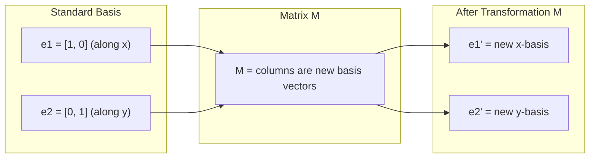
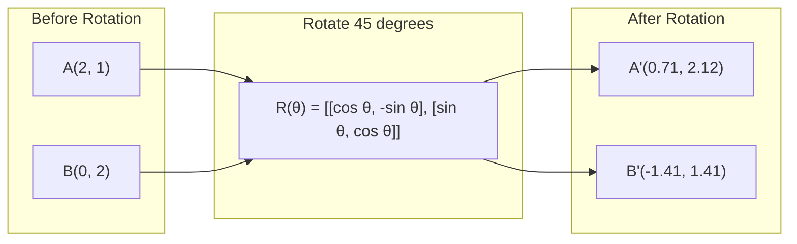
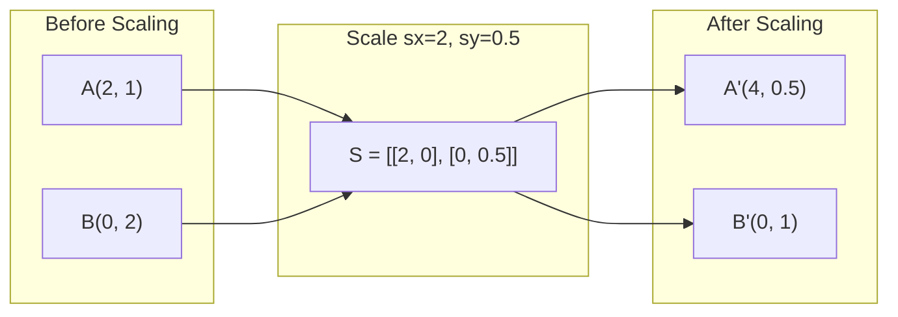
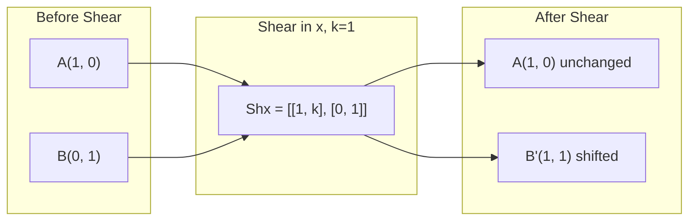
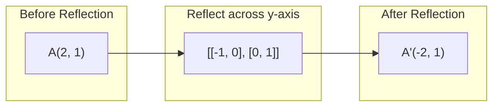
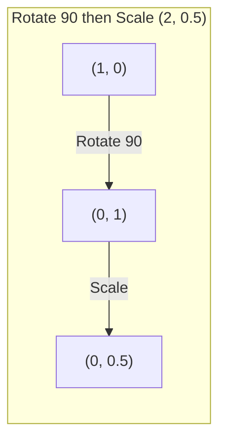
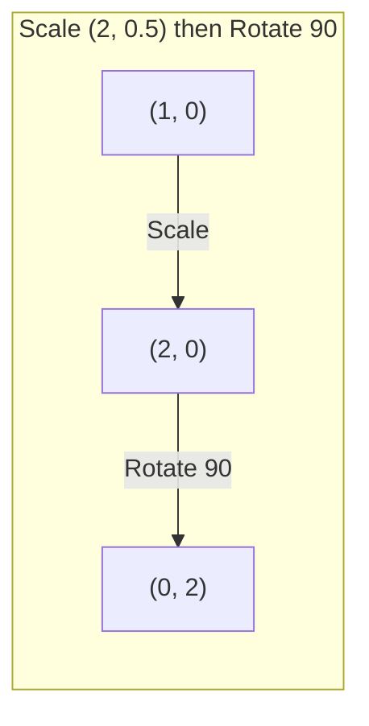

# Matrix Transformations.

> Một matrix là một máy tạo ra không gian, học được nó làm gì cho mọi điểm, và bạn hiểu được toàn bộ sự biến đổi.

> Đường là một thiết bị "tự hình lại không gian". hiểu nó tác động đến mỗi điểm, bạn đã hiểu toàn bộ sự thay đổi.

**Type:** Build | **类型:** 动手
**Languages:** Python, Julia | **语言:** Python, Julia
**Prerequisites:** Phase 1, Lessons 01-02 (Linear Algebra Intuition, Vectors & Matrices Operations) | **前置知识:** Phase 1, Lessons 01-02（线性代数直觉、向量与矩阵运算）
**Time:** ~75 minutes | **时间:** ~75 分钟

## Mục tiêu học tập

- Xây dựng các matrices xoay, quy mô, cắt và phản xạ và áp dụng chúng cho các điểm 2D và 3D
   cấu trúc xoay xoay, thu nhỏ, cắt, phản xạ và áp dụng cho 2D và 3D điểm
- Sắp xếp nhiều biến đổi bằng cách nhân tử và xác minh rằng thứ tự quan trọng
  Thông qua các mô hình và các quy trình khác nhau, tầm quan trọng của các quy trình xác minh
- Xét các giá trị riêng và vector riêng của các matrices 2x2 từ phương trình đặc trưng
  Từ tính cách phương trình tính toán 2x2 矩阵 tính năng giá trị và tính năng trọng lượng
- Giải thích lý do tại sao các giá trị riêng xác định hướng PCA, ổn định RNN và hành vi nhóm phân loại quang phổ
  解释 Charakteristic Value Why Determines PCA 方向、RNN 稳定性和谱聚类行为

> **【中文解读】**
> Các mô hình hình được định nghĩa là: "Đối với các mô hình hình hình học, các mô hình hình hình học được định nghĩa là: "Đối với các mô hình hình học, các mô hình hình hình học được định nghĩa là: "Đối với các mô hình hình hình học, các mô hình hình hình học được định nghĩa là: "Đối với các mô hình hình hình học, các mô hình hình hình học, các mô hình hình hình học, các mô hình hình hình học, các mô hình hình hình học, các mô hình hình hình học, các mô hình hình hình học, các mô hình hình hình học, các mô hình hình hình học, các mô hình hình hình học, các mô hình hình hình học, các mô hình hình hình học, các mô hình hình hình học, các mô hình hình học, các mô hình hình học, các mô hình hình học, và các mô hình học học, các mô hình học, các mô hình học học, và các mô hình học học, và các mô hình học học, và các mô hình học học, đã trở nên trực tiếp.

> **【拓展：特征值/特征向量在 AI 中的位置】**
> - **PCA（主成分分析）**: 找到 dữ liệu đối phương mô hình đặc tính, là phương diện dữ liệu đối phương tối đa.
> - **RNN 稳定性**Nếu giá trị tuyệt đối của các đặc điểm của khối trọng lực lớn hơn 1, chỉ số tăng độ; nhỏ hơn 1 sẽ giảm xuống còn 0 độ.
> - **谱聚类**Sử dụng các mô hình đặc trưng của mô hình Tulaplas để phân loại, hơn K-Means thích hợp hơn với dữ liệu không hình cầu.

## Vấn đề  vấn đề giới thiệu

> **【中文解读】**PCA nói "đ tìm các mô hình của mô hình khác biệt mô hình" cho thấy "đánh giá mô hình nhỏ hơn 1", dữ liệu tăng cường cho thấy "tự động quay" cho thấy tất cả những điều này cần phải hiểu được các thay đổi về mô hình của mô hình đối với không gian.

## Khái niệm cốt lõi

> **【拓展：Transformer 中的矩阵变换】**Mỗi cái nhìn của một bộ chuyển đổi mô hình đều trong việc làm thay đổi mô hình: Q=W_q·x, K=W_k·x, V=W_v·x, trong đó W_q/W_k/W_v là một bộ chuyển đổi mô hình có thể học được.

### Các biến đổi như các matrices

Mỗi biến đổi tuyến tính trong 2D có thể được viết như một matrix 2x2. Matrix cho bạn biết chính xác các vector cơ sở [1, 0] và [0, 1] kết thúc ở đâu. Mọi thứ khác tiếp theo.

> Mỗi thay đổi đường trong không gian hai chiều có thể được viết thành một 2x2 矩阵──矩阵 nói với bạn về khối lượng đường [1, 0] 和 [0, 1] 变到了哪里, phần còn lại của mọi thứ được quyết định bởi nó──

> 矩阵的列就是变换后的基向量──如果矩阵的第一列是 [2, 0],说明 e1=[1,0] 被映射到 [2,0](沿 x 轴拉伸 2 倍)──



### Chuyển đổi

Một vòng quay 2D bằng góc theta giữ cho khoảng cách và góc nguyên vẹn. Nó di chuyển mọi điểm dọc theo một vòng cung tròn.

> Hai chiều quay giữ khoảng cách và góc không thay đổi, sẽ di chuyển mỗi điểm dọc theo vòng tròn.

> 旋转矩阵 R(θ) = [[cosθ, -sinθ], [sinθ, cosθ]]。θ 为正表示逆时针旋转。R^T = R^(-1),转置即逆旋转。



Trong 3D, bạn xoay quanh một trục. Mỗi trục có trục xoay riêng của nó:

> Trong 3 chiều không gian, bạn xoay quanh một trục. Mỗi trục có trục xoay riêng của mình:

```
Rz(theta) = | cos  -sin  0 |     Rotate around z-axis
            | sin   cos  0 |     (x-y plane spins, z stays)
            |  0     0   1 |

Rx(theta) = | 1   0     0    |   Rotate around x-axis
            | 0  cos  -sin   |   (y-z plane spins, x stays)
            | 0  sin   cos   |

Ry(theta) = |  cos  0  sin |     Rotate around y-axis
            |   0   1   0  |     (x-z plane spins, y stays)
            | -sin  0  cos |
```

### Tăng quy mô

Scaling kéo dài hoặc nén dọc theo mỗi trục độc lập.

> 缩放沿每个轴独立地拉伸或压缩.

> 缩放矩阵 S = [[sx, 0], [0, sy]]―sx、sy có thể khác nhau──如果某个为负,等价于沿该轴反射──



### Trẻ

Việc cắt nghiêng một trục trong khi giữ trục kia cố định. Nó biến hình chữ nhật thành song song.

> 切使 một trục nghiêng và giữ trục khác cố định, sẽ hình chữ nhật trở thành hình hình hình bằng bốn bên.

> 剪切保持面积不变(行列式=1) ・・・想象一克牌向一边推:底牌不动,顶牌平移──



Các matrices cắt:
- `Shx = [[1, k], [0, 1]]`thay đổi x bằng k * y
- `Shy = [[1, 0], [k, 1]]`thay đổi y bằng k * x

> 剪切矩阵:`Shx`沿 y 偏移 x(x 新 = x + k*y),`Shy`沿 x 偏移 y(y 新 = y + k*x) 』

### Nhận xét

Nhấp phản chiếu các điểm qua một trục hoặc đường.

> phản xạ sẽ điểm về một cái gì đó

> phản xạ thay đổi hướng (~~~~) nhưng giữ khoảng cách.



Các matrix phản xạ:
- Nhấp vào trục y: `[[-1, 0], [0, 1]]`
- Nhấp vào trục x: `[[1, 0], [0, -1]]`

> 反射矩阵: Về y 轴反射 `[[-1, 0], [0, 1]]`, về x 轴反射`[[1, 0], [0, -1]]`

### Thành phần: chuyển đổi chuỗi

Sử dụng biến đổi A sau đó là B giống như nhân các matrices của chúng: `result = B @ A @ point`Trò quay sau đó quy mô sẽ đưa ra kết quả khác với quy mô sau đó quay.

> Trước làm thay đổi A và làm thay đổi B bằng cách nhân các mô hình của chúng:`result = B @ A @ point`◊ Định trình rất quan trọng  đầu vòng tái quy mô khác với đầu vòng tái quy mô kết quả 

> Đó là lý do tại sao các mô hình sử dụng quy trình tự động của PyTorch được sử dụng theo quy trình quy trình, và các mô hình sử dụng quy trình tự động được sử dụng trong quá trình chuyển đổi.



Thành phần: `S @ R = [[0, -2], [0.5, 0]]`

> 先旋转 90° 再缩放 (2, 0.5): từ (1,0) → 旋转后 (0,1) → 缩放后 (0, 0.5)──组合矩阵 S @ R = [[0, -2], [0,5, 0]]──



Thành phần: `R @ S = [[0, -0.5], [2, 0]]`

> 先缩放 (2, 0.5) 再旋转 90°: từ (1,0) → 缩放后 (2, 0) → 旋转后 (0, 2)。组合矩阵 R @ S = [[0, -0.5], [2, 0]],与上完全不同──

Kết quả khác nhau. nhân số tử hình không phải là chuyển đổi.

> Kết quả khác nhau. Đường dẫn không đáp ứng luật giao dịch. Đó là lý do tại sao chuyển biến chú ý trong Q、K、V của bước dẫn rất quan trọng.

### Giá trị và vector riêng

Hầu hết các vector thay đổi hướng khi một matrix chạm vào chúng. Eigenvectors là đặc biệt: matrix chỉ quy mô chúng, không bao giờ xoay chúng.

> Hầu hết các khối được chuyển đổi bởi một khối lượng thay đổi theo hướng khác.

> 几何直觉: đặc điểm của khối lượng là chuyển đổi trong "nghĩa không thay đổi" hướng. Nếu khối lượng là chuyển đổi圆, đặc điểm của khối lượng chỉ ra chiều dài của圆.

```
A @ v = lambda * v

v is the eigenvector (direction that survives)
lambda is the eigenvalue (how much it stretches)

Example: A = | 2  1 |
             | 1  2 |

Eigenvector [1, 1] with eigenvalue 3:
  A @ [1,1] = [3, 3] = 3 * [1, 1]     (same direction, scaled by 3)

Eigenvector [1, -1] with eigenvalue 1:
  A @ [1,-1] = [1, -1] = 1 * [1, -1]  (same direction, unchanged)
```

Các hình tử liệu kéo dài không gian bằng 3x dọc theo [1, 1] và giữ cho [1, -1] không thay đổi.

> Các矩阵沿 [1, 1] 方向拉伸 3 倍, giữ [1, -1] 方向不变──所有其他方向都是这两方向的组合──

### Thành phần của nó

Nếu một matrix có n vector tự độc lập tuyến tính, nó có thể bị phân hủy:

> Nếu một矩阵 có n 个线性 không liên quan đến các đặc điểm của khối lượng, nó có thể được phân chia thành A = V D V−1──

> Trọng điểm phân tích: biến đổi bất kỳ phân giải để "đối biến thành mô hình trục trặc → 沿轴缩放 → 旋回" 三步──这是PCA's core mathematics──

```
A = V @ D @ V^(-1)

V = matrix whose columns are eigenvectors
D = diagonal matrix of eigenvalues
V^(-1) = inverse of V

This says: rotate into eigenvector coordinates, scale along each axis, rotate back.
```

> Điều này có nghĩa là: quay sang các đặc điểm của khối lượng, theo mỗi trục thu nhỏ, quay lại lại.

### Tại sao giá trị bản chất quan trọng

**PCA.**Các vector chính của matrix tính biến là các thành phần chính. các giá trị chính cho bạn biết mỗi thành phần nắm bắt được sự biến động bao nhiêu.

> **PCA（主成分分析）。**Chất lượng của một mô hình hình so sánh là thành phần chính, giá trị đặc điểm cho bạn biết mỗi thành phần chính đã thu được bao nhiêu sự khác biệt.

**Stability.**Trong các mạng tái phát và hệ thống động, các giá trị tự với độ lớn > 1 gây ra các đầu ra nổ. độ lớn < 1 gây ra chúng biến mất. Đây là vấn đề biến mất / bùng nổ gradient được nêu trong một câu.

> **稳定性。**Trong mạng vòng và hệ thống động lực, đặc tính giá trị tuyệt đối > 1 dẫn đến phát nổ,< 1 dẫn đến biến mất.

**Spectral methods.**Các mạng lưới thần kinh đồ họa sử dụng giá trị riêng của ma trận lân cận. Nhóm phân tử quang phổ sử dụng giá trị riêng của Laplacian. Các vector riêng cho thấy cấu trúc của đồ họa.

> **谱方法。**图神经网络使用邻近矩阵的特征值,谱聚类使用拉普拉斯矩阵的特征值.

### Định nghĩa là yếu tố quy mô khối lượng

Các định đo của một số liệu chuyển hóa cho bạn biết nó quy mô bao nhiêu diện tích (2D) hoặc khối lượng (3D).

> 变换矩阵的行列式告诉你它缩小面积(2D) 或体积(3D) 的程度──

> det=0 là "kỳ nản"矩阵把空间压缩到低维(如 2D → 1D 线), thông tin bị mất,矩阵不可逆──

```
det = 1:   area preserved (rotation)
det = 2:   area doubled
det = 0:   space crushed to lower dimension (singular)
det = -1:  area preserved but orientation flipped (reflection)

| det(Rotation) | = 1        (always)
| det(Scale sx, sy) | = sx * sy
| det(Shear) | = 1           (area preserved)
| det(Reflection) | = -1     (orientation flipped)
```

> 行列式含义:det=1 保面积(旋转);det=2 面积翻倍;det=0 空间崩缩到低维(奇异,矩阵不可逆);det=-1 保面积但翻转方向(反射) ・・・

## Hãy xây dựng nó.
```figure
matrix-transform
```

## Hãy xây dựng nó

### Bước 1: Các matrices chuyển đổi từ đầu (Python)

> 第1步: Từ 0 thực hiện chuyển đổi矩阵

> Từ 0 thực hiện xoay vòng, thu nhỏ, cắt, phản xạ矩阵―― tất cả các thay đổi đều là 2x2矩阵―― cũng thực hiện mat_vec_mul 和 mat_mul dùng để thay đổi khối lượng và组合 thay đổi――

```python
import math

def rotation_2d(theta):
    c, s = math.cos(theta), math.sin(theta)
    return [[c, -s], [s, c]]

def scaling_2d(sx, sy):
    return [[sx, 0], [0, sy]]

def shearing_2d(kx, ky):
    return [[1, kx], [ky, 1]]

def reflection_x():
    return [[1, 0], [0, -1]]

def reflection_y():
    return [[-1, 0], [0, 1]]

def mat_vec_mul(matrix, vector):
    return [
        sum(matrix[i][j] * vector[j] for j in range(len(vector)))
        for i in range(len(matrix))
    ]

def mat_mul(a, b):
    rows_a, cols_b = len(a), len(b[0])
    cols_a = len(a[0])
    return [
        [sum(a[i][k] * b[k][j] for k in range(cols_a)) for j in range(cols_b)]
        for i in range(rows_a)
    ]

point = [1.0, 0.0]
angle = math.pi / 4

rotated = mat_vec_mul(rotation_2d(angle), point)
print(f"Rotate (1,0) by 45 deg: ({rotated[0]:.4f}, {rotated[1]:.4f})")

scaled = mat_vec_mul(scaling_2d(2, 3), [1.0, 1.0])
print(f"Scale (1,1) by (2,3): ({scaled[0]:.1f}, {scaled[1]:.1f})")

sheared = mat_vec_mul(shearing_2d(1, 0), [1.0, 1.0])
print(f"Shear (1,1) kx=1: ({sheared[0]:.1f}, {sheared[1]:.1f})")

reflected = mat_vec_mul(reflection_y(), [2.0, 1.0])
print(f"Reflect (2,1) across y: ({reflected[0]:.1f}, {reflected[1]:.1f})")
```

### Bước 2: Thành phần của các biến đổi

> 第2步: biến đổi của组合

> 验证矩阵乘法不可交换:先旋转90° 再缩放 (2, 0.5) 与先缩放再旋转得到完全不同的结果――这解释为什么 PyTorch nn.Sequential middle layer顺序至关重要――

```python
R = rotation_2d(math.pi / 2)
S = scaling_2d(2, 0.5)

rotate_then_scale = mat_mul(S, R)
scale_then_rotate = mat_mul(R, S)

point = [1.0, 0.0]
result1 = mat_vec_mul(rotate_then_scale, point)
result2 = mat_vec_mul(scale_then_rotate, point)

print(f"Rotate 90 then scale: ({result1[0]:.2f}, {result1[1]:.2f})")
print(f"Scale then rotate 90: ({result2[0]:.2f}, {result2[1]:.2f})")
print(f"Same? {result1 == result2}")
```

> 验证: trước xoay sau xoay, kết quả khác với trước xoay sau xoay.

### Bước 3: Giá trị riêng từ đầu (2x2)

> 第3步: Từ giá trị tính toán tính

> 2x2 矩阵的特征值通过解二次方程 λ2 - trace·λ + det = 0 得到, trong đó trace=a+d,det=ad-bc。特征向量通过 (A - λI) v = 0 求解。

Đối với một matrix 2x2 `[[a, b], [c, d]]`, giá trị riêng giải quyết phương trình đặc trưng: `lambda^2 - (a+d)*lambda + (ad - bc) = 0`- Tôi không biết.

> Đối với 2x2 矩阵 `[[a, b], [c, d]]`,特征值满足特征方程 λ2 - (a+d)λ + (ad-bc) = 0── trong đó (a+d) là dấu vết, ((ad-bc) là行列式──

```python
def eigenvalues_2x2(matrix):
    a, b = matrix[0]
    c, d = matrix[1]
    trace = a + d
    det = a * d - b * c
    discriminant = trace ** 2 - 4 * det
    if discriminant < 0:
        real = trace / 2
        imag = (-discriminant) ** 0.5 / 2
        return (complex(real, imag), complex(real, -imag))
    sqrt_disc = discriminant ** 0.5
    return ((trace + sqrt_disc) / 2, (trace - sqrt_disc) / 2)

def eigenvector_2x2(matrix, eigenvalue):
    a, b = matrix[0]
    c, d = matrix[1]
    if abs(b) > 1e-10:
        v = [b, eigenvalue - a]
    elif abs(c) > 1e-10:
        v = [eigenvalue - d, c]
    else:
        if abs(a - eigenvalue) < 1e-10:
            v = [1, 0]
        else:
            v = [0, 1]
    mag = (v[0] ** 2 + v[1] ** 2) ** 0.5
    return [v[0] / mag, v[1] / mag]

A = [[2, 1], [1, 2]]
vals = eigenvalues_2x2(A)
print(f"Matrix: {A}")
print(f"Eigenvalues: {vals[0]:.4f}, {vals[1]:.4f}")

for val in vals:
    vec = eigenvector_2x2(A, val)
    result = mat_vec_mul(A, vec)
    scaled = [val * vec[0], val * vec[1]]
    print(f"  lambda={val:.1f}, v={[round(x,4) for x in vec]}")
    print(f"    A@v = {[round(x,4) for x in result]}")
    print(f"    l*v = {[round(x,4) for x in scaled]}")
```

> 验证 A=[[2,1],[1,2]] của đặc tính giá trị là 3 和 1,对应特征向量 [1,1]/√2 和 [1,-1]/√2。验证 A@v = λ×v 成立。

### Bước 4: Định nghĩa là yếu tố quy mô khối lượng

> 第4步: hành trình như một yếu tố thu nhỏ

```python
def det_2x2(matrix):
    return matrix[0][0] * matrix[1][1] - matrix[0][1] * matrix[1][0]

print(f"det(rotation 45) = {det_2x2(rotation_2d(math.pi/4)):.4f}")
print(f"det(scale 2,3)   = {det_2x2(scaling_2d(2, 3)):.1f}")
print(f"det(shear kx=1)  = {det_2x2(shearing_2d(1, 0)):.1f}")
print(f"det(reflect y)   = {det_2x2(reflection_y()):.1f}")

singular = [[1, 2], [2, 4]]
print(f"det(singular)     = {det_2x2(singular):.1f}")
print("Singular: columns are proportional, space collapses to a line.")
```

> Ví dụ: [1, 2], [2, 4]] của các đường thẳng là 0, vì hai đường tỷ lệ── không gian được nén thành một đường, biến đổi không thể đảo ngược──

## Hãy sử dụng nó để thực hiện

NumPy xử lý tất cả những điều này với các thói quen tối ưu hóa.

> NumPy sử dụng các quy trình tối ưu hóa để xử lý tất cả các hoạt động này.

> NumPy của `np.linalg.eig`和 `np.linalg.det`底层调用 LAPACK(C/Fortran 写的线性代数库),比手写 Python 快 100-1000 倍。

```python
import numpy as np

theta = np.pi / 4
R = np.array([[np.cos(theta), -np.sin(theta)],
              [np.sin(theta),  np.cos(theta)]])

point = np.array([1.0, 0.0])
print(f"Rotate (1,0) by 45 deg: {R @ point}")

S = np.diag([2.0, 3.0])
composed = S @ R
print(f"Scale(2,3) after Rotate(45): {composed @ point}")

A = np.array([[2, 1], [1, 2]], dtype=float)
eigenvalues, eigenvectors = np.linalg.eig(A)
print(f"\nEigenvalues: {eigenvalues}")
print(f"Eigenvectors (columns):\n{eigenvectors}")

for i in range(len(eigenvalues)):
    v = eigenvectors[:, i]
    lam = eigenvalues[i]
    print(f"  A @ v{i} = {A @ v}, lambda * v{i} = {lam * v}")

print(f"\ndet(R) = {np.linalg.det(R):.4f}")
print(f"det(S) = {np.linalg.det(S):.1f}")

B = np.array([[3, 1], [0, 2]], dtype=float)
vals, vecs = np.linalg.eig(B)
D = np.diag(vals)
V = vecs
reconstructed = V @ D @ np.linalg.inv(V)
print(f"\nEigendecomposition A = V @ D @ V^-1:")
print(f"Original:\n{B}")
print(f"Reconstructed:\n{reconstructed}")
```

> Đặc điểm phân giải:A = V @ D @ V−1 应能完美重建原矩阵── đây chứng minh bất kỳ mô hình phân giải có thể được phân giải thành " xoay → 缩缩 → 旋回回来" 三步──

### Chuyển đổi 3D với NumPy

```python
def rotation_3d_z(theta):
    c, s = np.cos(theta), np.sin(theta)
    return np.array([[c, -s, 0], [s, c, 0], [0, 0, 1]])

def rotation_3d_x(theta):
    c, s = np.cos(theta), np.sin(theta)
    return np.array([[1, 0, 0], [0, c, -s], [0, s, c]])

point_3d = np.array([1.0, 0.0, 0.0])
rotated_z = rotation_3d_z(np.pi / 2) @ point_3d
rotated_x = rotation_3d_x(np.pi / 2) @ point_3d

print(f"\n3D point: {point_3d}")
print(f"Rotate 90 around z: {np.round(rotated_z, 4)}")
print(f"Rotate 90 around x: {np.round(rotated_x, 4)}")
```

> NumPy  thực hiện 3D  quay矩阵: vòng z 轴 và vòng x 轴 có 3x3  quay矩阵 riêng biệt.

## Chuyển nó đi.

Bài học này xây dựng nền tảng hình học cho PCA (Phase 2) và phân tích trọng lượng mạng thần kinh. Mã eigenvalue / eigenvector được xây dựng ở đây là cùng một thuật toán hỗ trợ giảm chiều kích, phân nhóm quang phổ và phân tích ổn định trong các hệ thống ML sản xuất.

> Bài học này xây dựng nền tảng về phân tích trọng lượng của PCA (Phase 2) và mạng lưới thần kinh.

> 本课产出: Từ 0实现的变换矩阵库 + 特征值/特征向量求解器──代码 có thể được sử dụng trực tiếp để hiểu các chủ đề cao như PCA、谱聚类、GNN 谱方法──

## Tập luyện bài tập

1. Lấy xoay, quy mô và cắt lên một hình vuông đơn vị (vùng góc ở [0,0], [1,0], [1,1], [0,1]). Bác in các góc biến đổi cho mỗi góc.
   Đối với đơn vị hình dạng hình chữ số: {{{1}}} {{{1}}} {{{1}}} {{{1}}} {{{1}}} {{{1}}} {{{1}}} {{{1}}} {{{1}}} {{{1}}} {{{1}}} {{{1}}} {{{1}}} {{{1}}} {{{1}}} {{{1}}} {{{1}}} {{{1}}} {{{1}}} {{{1}}} {{{1}}} {{{1}}} {{{1}}} {{{1}}} {{{1}}} {{{1}}} {{{1}}} {{{1}}} {{{1}}} {{{1}}} {{{1}}} {{{1}}} {{{1}}} {{{1}}} {{{1}}} {{{1}}} {{{1}}} {{{1}}} {{{1}}} {{{1}}} {{1}}} {{{1}}} {{{1}}}{1}}}{1}}}{1}}}{1}}}{1}}}{1}}}{1}}}{1}}}{1}}}{1}}}{1}}}{1}}}{1}}}{1}}}{1}}}{1}}}{1}}}{1}}}{1}}}{1}}}{1}}}{1}}}{1}}}{1}}}{1}}}{1}}}{1}}}{1}}}{1}}} {1}}}{1}}} {1}}} {1}}} {1}}} {1}}} {1}}} {1}}} {1}}} {1}}} {1}}} {1}}} {1}}} {1}}} {1}}} {1}}} {1}}} {1}}} {1}}} {1}}} {1}}} {1}}} {1}}} {1}}} {1}}} {1}}} {1}}} {1}}} {1}}} {1}}} {1}}} {1}}} {1}}} {1}}} {1}}} {1}}} {1} {1} {1} {1} {1} {1} } } } } } } }

2. Tìm các giá trị riêng của các mã số [[4, 2], [1, 3]] bằng tay bằng cách sử dụng phương trình đặc trưng. Sau đó xác minh bằng hàm từ đầu và với NumPy.
   手工用特征方程求矩阵的特征值 [[4, 2], [1, 3]] , sau đó sử dụng từ zero实现的函数和NumPy 验证。

3. Tạo một cấu trúc gồm ba biến đổi (đối tròn 30 độ, đo bằng [1,5, 0,8], cắt bằng kx=0,3) và áp dụng nó cho 8 điểm được sắp xếp trong một vòng tròn. Bác trước và sau các phối hợp. Xét định số của các matrix được tạo thành và xác minh nó bằng với sản phẩm của các định số riêng lẻ.
   组合三个变换(旋转30°、缩放 [1.5, 0.8]、剪切 kx=0.3), áp dụng đến 8 điểm trên vòng.

## Từ khóa  Từ khóa nhanh chóng

| Term | What people say | What it actually means |
|------|----------------|----------------------|
| Rotation matrix | "Spins things" | An orthogonal matrix that moves points along circular arcs while preserving distances and angles. Determinant is always 1. |
| Scaling matrix | "Makes things bigger" | A diagonal matrix that stretches or compresses independently along each axis. Determinant is the product of scale factors. |
| Shearing matrix | "Slants things" | A matrix that shifts one coordinate proportionally to another, turning rectangles into parallelograms. Determinant is 1. |
| Reflection | "Mirrors things" | A matrix that flips space across an axis or plane. Determinant is -1. |
| Composition | "Do two things" | Multiplying transformation matrices to chain operations. Order matters: B @ A means apply A first, then B. |
| Eigenvector | "Special direction" | A direction that the matrix only scales, never rotates. The transformation's fingerprint. |
| Eigenvalue | "How much it stretches" | The scalar factor by which the matrix scales its eigenvector. Can be negative (flip) or complex (rotation). |
| Eigendecomposition | "Break the matrix apart" | Writing a matrix as V @ D @ V^(-1), separating it into its fundamental scaling directions and magnitudes. |
| Determinant | "A single number from a matrix" | The factor by which the transformation scales area (2D) or volume (3D). Zero means the transformation is irreversible. |
| Characteristic equation | "Where eigenvalues come from" | det(A - lambda * I) = 0. The polynomial whose roots are the eigenvalues. |

> 术语速查:Tơ đồ xoay xoay 转矩阵,正交,行列式=1) Tơ đồ quy mô 缩矩阵,对角) Tơ đồ xoay 切切切,矩形→平行四边形) Tơ đồ 反射,行列式=-1) Composition 组合,B@A 表示先 A 后 B) Eigenvector 特征向量,只缩放不值旋转的方向) Eigenvalue 特征,缩放倍数,可为负数或复数) Eigendecomposition 特征分解 A=VDV−1) Determinant行列式,面积/体积缩放因子,0 = 奇异)  Characteristic equation 征程 特征 特征 特征 A-λ-I=0)

## Xem thêm 延伸阅读

- [3Blue1Brown: Linear Transformations](https://www.3blue1brown.com/lessons/linear-transformations)-- trực giác thị giác về cách các trền tạo định hình lại không gian
- [3Blue1Brown: Eigenvectors and Eigenvalues](https://www.3blue1brown.com/lessons/eigenvalues)-- giải thích trực quan tốt nhất về ý nghĩa của các vector tự
- [MIT 18.06 Lecture 21: Eigenvalues and Eigenvectors](https://ocw.mit.edu/courses/18-06-linear-algebra-spring-2010/)- Điều trị cổ điển của Gilbert Strang
