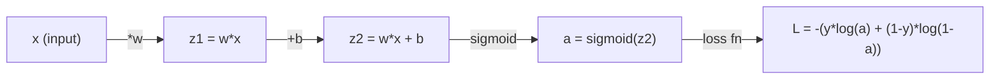
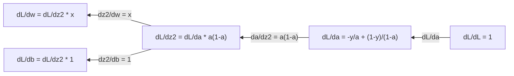
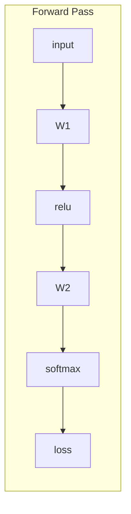
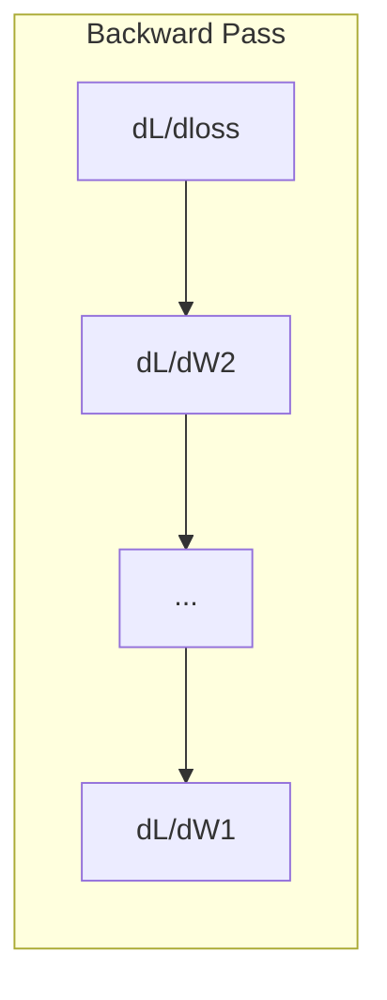

# Các tính toán cho học máy

> Các dẫn xuất cho bạn biết hướng xuống là gì. Đó là tất cả những gì một mạng thần kinh cần phải học.

> 导数 nói cho bạn biết bên nào là hướng xuống đó là tất cả những gì cần thiết để học.

**Type:** Learn | **类型:** 学习
**Language:**Python**语言:**Python
**Prerequisites:** Phase 1, Lessons 01-03 | **前置知识:** Phase 1, Lessons 01-03
**Time:** ~60 minutes | **时间:** ~60 分钟

## Mục tiêu học tập

- Xét số và phân tích dẫn xuất cho các hàm ML chung (x^2, sigmoid, cross-entropy)
  计算常见 ML 函数(x^2、sigmoid、交叉) của số giá trị định vị và phân tích định vị
- Thực hiện giảm gradient từ đầu để giảm thiểu hàm mất mát trong 1D và 2D
  Từ 0 thực hiện gradient giảm, trong hàm mất mát tối thiểu trong 1D và 2D
- Thuộc dẫn gradient của mô hình hồi quy tuyến tính và đào tạo nó thông qua cập nhật trọng lượng thủ công
  推导线性回归模型的梯度,并通过手动权重更新进行训练
- Giải thích các matrix Hessian, các phép so sánh chuỗi Taylor và mối liên hệ của chúng với các phương pháp tối ưu hóa
  解释 Hessian 矩阵、Taylor 级数近似及其与优化方法的联系

> **【中文解读】**
> Các số dẫn cho bạn biết "nghĩa hướng nào đi có thể làm cho sự khác biệt biến đổi nhỏ"―― mạng thần kinh có hàng triệu tham số, mỗi tham số là một "cuốc", các số dẫn cho bạn biết mỗi cuốc phải đi theo hướng nào调―― độ giảm là theo hướng ngược của số dẫn bước đi đến giá trị tối thiểu――

> **【拓展：微积分与神经网络】**
> - **梯度下降**: Các thuật toán cốt lõi của đào tạo mạng thần kinh  theo chiều ngược của thang
> - **SGD/Adam**Đường độ thay đổi giảm, Adam gia nhập động lượng và tỷ lệ học tự thích ứng.
> - **学习率**梯度下降的步长──太大则跳过最小值,太小则收太慢──

## Vấn đề  vấn đề giới thiệu

> **【中文解读】**Các phương pháp này được sử dụng để tạo ra các phương pháp khác nhau, như:

## Khái niệm cốt lõi

> **【拓展：偏导数就是"只动一个旋钮看效果"]**Lồng độ là để tập hợp tất cả các định hướng thành một khối lượng, hướng về hướng "những hướng trên cao nhất", vì vậy dọc theo chiều dài là đường xuống nhanh nhất.

### Một dẫn xuất là gì?

Một phái sinh đo tốc độ thay đổi. cho một hàm y = f(x), phái sinh f'(x) cho bạn biết: nếu bạn đẩy x bằng một số lượng nhỏ, y thay đổi bao nhiêu?

> 导数衡变化率── đối với hàm y = f(x),导数 f'(x) 告诉你: nếu x 微小变化, y 变化多少?

Về mặt hình học, dẫn xuất là độ nghiêng của đường ngã ở một điểm.

> Về mặt lý, số dẫn là độ nghiêng của một đường cắt.

**f(x) = x^2:**

| x | f(x) | f'(x) (slope) |
|---|------|---------------|
| 0 | 0    | 0 (flat, at the bottom) |
| 1 | 1    | 2 |
| 2 | 4    | 4 (tangent line slope at this point) |
| 3 | 9    | 6 |

Khi x=2, độ nghiêng là 4. Nếu bạn di chuyển x một chút sang bên phải, y tăng khoảng 4 lần số tiền đó.

> Ở x=2 处, độ nghiêng là 4 ⋅ nếu bạn sẽ x hướng phải di chuyển một điểm, y khoảng tăng số chuyển động này 4 lần ⋅ ở x=0 处, độ nghiêng là 0 ⋅ bạn đang ở "vỏ đáy" ⋅

Định nghĩa chính thức:

```
f'(x) = lim   f(x + h) - f(x)
        h->0  -----------------
                     h
```

Trong mã, bạn bỏ qua giới hạn và chỉ sử dụng một h rất nhỏ. Đó là dẫn xuất số.

> Trong mã, nhảy qua giới hạn, trực tiếp sử dụng rất nhỏ h để gần như.

### Các phái sinh một phần: một biến tại một thời điểm

Các hàm thực có nhiều đầu vào. Một mất mạng thần kinh phụ thuộc vào hàng ngàn trọng lượng. Một dẫn xuất một phần giữ tất cả các biến liên tục ngoại trừ một, sau đó lấy dẫn xuất liên quan đến một.

> Thực hàm có nhiều đầu vào. Hàm mất mạng thần kinh phụ thuộc vào hàng ngàn trọng lượng.

```
f(x, y) = x^2 + 3xy + y^2

df/dx = 2x + 3y     (treat y as a constant)
df/dy = 3x + 2y     (treat x as a constant)
```

Mỗi dẫn xuất một phần trả lời: nếu tôi đẩy chỉ một trọng lượng này, làm thế nào để mất thay đổi?

> Mỗi số chuyển hướng trả lời: Nếu tôi chỉ di động một trọng lượng này, mất mát thay đổi bao nhiêu?

### Các gradient: vector của tất cả các phái sinh một phần

Các gradient thu thập mọi dẫn xuất một phần thành một vector. cho một hàm f ((x, y, z), gradient là:

> 梯度把所有偏导数集合 into one向量── đối với hàm f ((x, y, z),梯度为:

```
grad f = [ df/dx, df/dy, df/dz ]
```

Đi độ hướng về hướng leo cao nhất. Để giảm thiểu một chức năng, đi theo hướng ngược lại.

> 梯度指向最上升方向──要最小化函数,就沿相反方向走──

**Contour plot of f(x,y) = x^2 + y^2:**

Chức năng hình thành một hình thức bát với các vòng tròn tập trung như đường đường.

> Hàm này hình thành một hình dạng hình bát,等高线是同心圆.

| Point | grad f | -grad f (descent direction) |
|-------|--------|----------------------------|
| (1, 1) | [2, 2] (points uphill, away from minimum) | [-2, -2] (points downhill, toward minimum) |
| (0, 0) | [0, 0] (flat, at the minimum) | [0, 0] |

> 梯度方向指向最上坡,负梯度方向指向最下坡 ((即朝向最小值) ⋅ 在最小值处梯度为零──

Đây là sự giảm gradient trong một bức ảnh.

> Đây là biểu đồ của thang xuống.

### Kết nối với tối ưu hóa

Căn luyện một mạng thần kinh là tối ưu hóa. Bạn có một hàm mất L ((w1, w2, ..., wn) đo mức độ sai lầm của mô hình. Bạn muốn giảm thiểu nó.

> 训练神经网络就是优化――损失函数 L(w1, w2, ..., wn) 衡模型有多"错", bạn cần giảm thiểu nó。

```
Gradient descent update rule:

  w_new = w_old - learning_rate * dL/dw

For every weight:
  1. Compute the partial derivative of loss with respect to that weight
  2. Subtract a small multiple of it from the weight
  3. Repeat
```

> Quy tắc giảm thang: New weight = Old weight - Học học tỷ lệ × 梯度──重复:1) tính số chuyển hướng của mỗi trọng lượng;2) giảm từ trọng lượng một phần nhỏ của nó;3) 代数百万次──

Tốc độ học tập kiểm soát kích thước bước quá lớn và bạn vượt quá.

> Học tập kiểm soát quá lớn quá chậm quá.

**Loss landscape (1D slice):**

Chức năng mất L ((w) hình thành một đường cong với đỉnh và thung lũng khi trọng lượng w thay đổi.

> 损失函数 L(w) 随权重 w 变化形成带峰和谷的曲线──

| Feature | Description |
|---------|-------------|
| Global minimum | The lowest point on the entire curve -- the best solution |
| Local minimum | A valley that is lower than its neighbors but not the lowest overall |
| Slope | Gradient descent follows the slope downhill from any starting point |

> Giá trị tối thiểu toàn bộ là điểm thấp nhất của đường cong toàn条; giá trị tối thiểu toàn bộ là thung lũng thấp hơn trong các khu lân cận nhưng không phải là mức thấp nhất toàn bộ; độ giảm từ bất kỳ điểm khởi điểm nào dọc theo đường cong.

Sự giảm dần theo chiều dốc xuống đồi. Nó có thể bị mắc kẹt trong các mức tối thiểu địa phương, nhưng trong không gian có chiều cao (millions of weights) điều này hiếm khi là một vấn đề thực tế.

> 梯度下降沿坡下行── có thể rơi vào giá trị tối thiểu trong bộ, nhưng trong không gian cao (高维空间中)

### Các phái sinh số và phân tích

Có hai cách để tính toán một phái sinh.

> 计算导数 có hai cách:

Phân tích: áp dụng các quy tắc toán bằng tay. Đối với f  x = x ^ 2, dẫn xuất là f  x = 2x. chính xác.

> 解析法:手动应用微积分规则──如 f(x) = x^2 的导数是 f'(x) = 2x──精确且快速──

Số: ước tính bằng cách sử dụng định nghĩa. tính f ((x+h) và f ((x-h) cho một h nhỏ, sau đó sử dụng sự khác biệt.

> 数值法:用定义近似──计算 f(x+h) 和 f(x-h),用差值除以 2h──

```
Numerical (central difference):

f'(x) ~= f(x + h) - f(x - h)
          -----------------------
                  2h

h = 0.0001 works well in practice
```

Các dẫn xuất số chậm hơn nhưng hoạt động cho bất kỳ chức năng nào. Các dẫn xuất phân tích nhanh nhưng đòi hỏi bạn phải dẫn xuất công thức. Các khung mạng thần kinh sử dụng một cách tiếp cận thứ ba: phân biệt tự động, tính toán các dẫn xuất chính xác bằng cơ học. Bạn sẽ thấy điều đó trong giai đoạn 3.

> Các định dạng số giá trị chậm hơn nhưng có thể áp dụng cho bất kỳ hàm nào.

### Các phái sinh bằng tay cho các hàm đơn giản

Đây là các phái sinh mà bạn sẽ thấy nhiều lần trong ML.

> Đây là số lượng dẫn bạn sẽ thấy nhiều lần trong ML.

```
Function        Derivative       Used in
--------        ----------       -------
f(x) = x^2     f'(x) = 2x      Loss functions (MSE)
f(x) = wx + b  f'(w) = x        Linear layer (gradient w.r.t. weight)
                f'(b) = 1        Linear layer (gradient w.r.t. bias)
                f'(x) = w        Linear layer (gradient w.r.t. input)
f(x) = e^x     f'(x) = e^x     Softmax, attention
f(x) = ln(x)   f'(x) = 1/x     Cross-entropy loss
f(x) = 1/(1+e^-x)  f'(x) = f(x)(1-f(x))   Sigmoid activation
```

Đối với f ((x) = x ^ 2:

```
f(x) = x^2    f'(x) = 2x

  x    f(x)   f'(x)   meaning
  -2    4      -4      slope tilts left (decreasing)
  -1    1      -2      slope tilts left (decreasing)
   0    0       0      flat (minimum!)
   1    1       2      slope tilts right (increasing)
   2    4       4      slope tilts right (increasing)
```

> Trong x<0 时导数为负(函数递减),x=0 时导数为零( đạt được giá trị tối thiểu),x>0 时导数为正(函数递增) ⋅

Đối với f(w) = wx + b với x=3, b=1:

```
f(w) = 3w + 1    f'(w) = 3

The derivative with respect to w is just x.
If x is big, a small change in w causes a big change in output.
```

> Đối với w 求导 kết quả là x thực sự. Nếu x  rất lớn, những thay đổi nhỏ của w sẽ dẫn đến sự thay đổi lớn trong sản lượng.

### Quy tắc chuỗi

Khi các hàm được kết hợp, quy tắc chuỗi cho bạn biết cách phân biệt.

> Khi hàm phức hợp, các quy tắc chuỗi cho bạn biết làm thế nào để tìm kiếm hướng dẫn.

```
If y = f(g(x)), then dy/dx = f'(g(x)) * g'(x)

Example: y = (3x + 1)^2
  outer: f(u) = u^2       f'(u) = 2u
  inner: g(x) = 3x + 1    g'(x) = 3
  dy/dx = 2(3x + 1) * 3 = 6(3x + 1)
```

Các mạng thần kinh là chuỗi các chức năng: đầu vào -> tuyến tính -> kích hoạt -> tuyến tính -> kích hoạt -> mất mát. Phân bố lại là quy tắc chuỗi được áp dụng lặp đi lặp lại từ đầu ra vào đầu vào. Đó là toàn bộ thuật toán.

> 神经网络是函数链:输入 -> 线性 -> 激活 -> 线性 -> 激活 -> 损失──反向传播就是从输出到输入反复应用链式法则──这就是整个算法──

### Matrix Hessian

Điểm nghiêng cho bạn biết đường nghiêng.

> 梯度 nói với bạn tỷ lệ nghiêng, Hessian 矩阵 nói với bạn tỷ lệ nghiêng.

Hessian là các tử liệu dẫn xuất phân tử thứ hai. Đối với một hàm f ((x1, x2, ..., xn), nhập (i, j) của Hessian là:

> Hessian là 2 giai đoạn định hướng số cấu thành của矩阵。 đối với hàm f ((x1, x2, ..., xn), Hessian của第 (i, j) 项 là ∂2f/(∂x_i ∂x_j)。

```
H[i][j] = d^2f / (dx_i * dx_j)
```

Đối với hàm 2 biến f ((x, y):

```
H = | d^2f/dx^2    d^2f/dxdy |
    | d^2f/dydx    d^2f/dy^2 |
```

**What the Hessian tells you at a critical point (where gradient = 0):**

> Hessian 在临界点 (梯度为0处) nói với bạn: liệu đó là giá trị tối thiểu của địa điểm ≠ giá trị tối đa của địa điểm hay là điểm ──

| Hessian property | Meaning | Example surface |
|-----------------|---------|-----------------|
| Positive definite (all eigenvalues > 0) | Local minimum | Bowl pointing up |
| Negative definite (all eigenvalues < 0) | Local maximum | Bowl pointing down |
| Indefinite (mixed eigenvalues) | Saddle point | Horse saddle shape |

> 正定(所有特征值 > 0) = 局部最小值;负定(所有特征值 < 0) = 局部最大值;不定(特征值有正有负) = 点。

**Example:**f(x, y) = x^2 - y^2 (một hàm saddle)

```
df/dx = 2x       df/dy = -2y
d^2f/dx^2 = 2    d^2f/dy^2 = -2    d^2f/dxdy = 0

H = | 2   0 |
    | 0  -2 |

Eigenvalues: 2 and -2 (one positive, one negative)
--> Saddle point at (0, 0)
```

So sánh với f ((x, y) = x^2 + y^2 (một bát):

```
H = | 2  0 |
    | 0  2 |

Eigenvalues: 2 and 2 (both positive)
--> Local minimum at (0, 0)
```

**Why the Hessian matters in ML:**

> Hessian trong ML: Newton sử dụng Hessian sửa đổi độ hướng, làm cho hướng đi từng bước nhỏ, hướng đi lớn, để từ độ xuống xuống nhanh hơn.

Phương pháp của Newton sử dụng phương pháp Hessian để thực hiện các bước tối ưu hóa tốt hơn so với giảm gradient.

```
Newton's update:    w_new = w_old - H^(-1) * gradient
Gradient descent:   w_new = w_old - lr * gradient
```

> Newton 更新:w_new = w_old - H−1 × gradient。 nó sử dụng độ cong tái thu nhỏ gradient。

Phương pháp Newton hội tụ nhanh hơn bởi vì Hessian "đổi lại" độ lệch -- hướng thẳng đứng có bước nhỏ hơn, hướng phẳng có bước lớn hơn.

> Newton nhận được nhanh hơn, vì Hessian " tái quy mô " gradiente direction走小步,平坦方向走大步

Chỗ bắt: cho một mạng thần kinh với các tham số N, Hessian là N x N. Một mô hình với 1 triệu tham số sẽ cần một số liệu đầu vào 1 nghìn tỷ. Đó là lý do tại sao chúng tôi sử dụng các ước tính.

> 问题 nằm ở:N 个参数网络, Hessian là N×N── triệu参数 mô hình cần hàng triệu tỷ quy mô矩阵 đó là lý do tại sao chúng ta sử dụng gần như như(như Adam、L-BFGS)──

| Method | What it uses | Cost | Convergence |
|--------|-------------|------|-------------|
| Gradient descent | First derivatives only | O(N) per step | Slow (linear) |
| Newton's method | Full Hessian | O(N^3) per step | Fast (quadratic) |
| L-BFGS | Approximate Hessian from gradient history | O(N) per step | Medium (superlinear) |
| Adam | Per-parameter adaptive rates (diagonal Hessian approx) | O(N) per step | Medium |
| Natural gradient | Fisher information matrix (statistical Hessian) | O(N^2) per step | Fast |

> Không giống như các phương pháp tối ưu hóa đối với: gradiente descendente con un seul nombre de phase (O) N,慢; Newton法 con Hessian hoàn chỉnh (O) N3, nhanh nhưng quá đắt; L-BFGS con gradiente historique proche Hessian; Adam con c角 Hessian 近似做每参数自适应; Natural gradiente con Fisher 信息矩阵。

Trong thực tế, Adam là người tối ưu hóa mặc định cho học sâu. Nó gần gũi thông tin thứ hai giá rẻ bằng cách theo dõi trung bình chạy và sự biến động của gradient cho mỗi tham số.

> Thực tế, Adam là một bộ tối ưu hóa mặc định của học sâu. Nó theo dõi giá trị trung bình và tỷ lệ khác nhau của từng thang số, rẻ tiền gần như thông tin thứ hai.

### Phương pháp tiếp cận của chuỗi Taylor

Bất kỳ hàm mượt mà nào có thể được ước tính tại địa phương bằng một đa nôn:

> Bất kỳ hàm phẳng nào có thể được sử dụng ở địa phương với nhiều phương pháp gần như.

```
f(x + h) = f(x) + f'(x)*h + (1/2)*f''(x)*h^2 + (1/6)*f'''(x)*h^3 + ...
```

Bạn càng thêm nhiều thuật ngữ, thì việc gần gũi càng tốt, nhưng chỉ gần điểm x.

> 包含的项越多,近似越好但只有效在x 附近──一阶 Taylor = 梯度下降,二阶 Taylor = Newton 法──

**Why Taylor series matter for ML:**

- **First-order Taylor = gradient descent.**Khi bạn sử dụng f(x + h) ~ f(x) + f'(x) *h, bạn đang thực hiện một sự gần gũi tuyến tính.

- **Second-order Taylor = Newton's method.**Sử dụng f(x + h) ~ f(x) + f'(x) *h + (1/2) *f'(x) *h^2, bạn có được một mô hình hình vuông.

- **Loss function design.**MSE và cross-entropy đều trơn tru, có nghĩa là sự mở rộng Taylor của chúng có hành vi tốt.

> Taylor 级数 trong ML nghĩa: một giai đoạn Taylor = 线性近似 = 梯度下降; hai giai đoạn Taylor = 二次近似 = Newton 法;MSE 和交叉的平滑性不是巧合平滑损让优化可预测──

```
Approximation order    What it captures    Optimization method
-------------------    -----------------   -------------------
0th order (constant)   Just the value      Random search
1st order (linear)     Slope               Gradient descent
2nd order (quadratic)  Curvature           Newton's method
Higher orders          Finer structure     Rarely used in ML
```

> 近似阶数与优化方法:0 阶只用值(随机搜索);1 阶用斜率(梯度下降);2 阶用曲率(Newton 法);更高阶在 ML中很少使用──

Ý tưởng chính: tất cả các phương pháp tối ưu hóa dựa trên gradient thực sự là về việc gần gũi với hàm mất tích tại địa phương và bước đến mức tối thiểu của sự gần gũi đó.

> 关键洞见: tất cả các bản chất tối ưu hóa dựa trên thang đều ở hàm mất tích gần như địa phương, sau đó đi đến điểm cực nhỏ gần như đó.

### Các phần nguyên tố trong ML

Các dẫn xuất cho bạn biết tỷ lệ thay đổi. Các nguyên tố tính toán tích lũy - diện tích dưới một đường cong.

> 导数 nói với bạn tỷ lệ biến đổi,积分计算累积(曲线下面积)

Trong ML, bạn hiếm khi tính toán tích hợp bằng tay, nhưng khái niệm này ở khắp mọi nơi:

> Trong ML bạn rất ít người dùng tính积分, nhưng khái niệm积分 không tồn tại:

**Probability.**Đối với một biến ngẫu nhiên liên tục với mật độ p ((x):
```
P(a < X < b) = integral from a to b of p(x) dx
```
Khu vực dưới đường cong mật độ xác suất giữa a và b là xác suất hạ cánh trong phạm vi đó.

> **概率**: đối với sự thay đổi liên tục, hàm mật độ p(x) trong [a, b] 区间积分就是落在此区间的概率──

**Expected value.**Kết quả trung bình cân bằng xác suất:
```
E[f(X)] = integral of f(x) * p(x) dx
```
Sự mất mát dự kiến trên phân phối dữ liệu là một phần không thể thiếu.

> **期望**:加权平均―― Data distribution expectation loss is a积分, tập luyện tối thiểu hóa kinh nghiệm của nó gần như――

**KL divergence.**Đường độ phân phối hai phân phối khác nhau như thế nào:
```
KL(p || q) = integral of p(x) * log(p(x) / q(x)) dx
```
Được sử dụng trong VAEs, chưng cất kiến thức và suy luận Bayesian.

> **KL 散度**: đo lường sự khác biệt phân bố hai người.

**Normalization constants.**Trong suy luận Bayesian:
```
p(w | data) = p(data | w) * p(w) / integral of p(data | w) * p(w) dw
```
Tên gọi là một phần tích hợp trên tất cả các giá trị tham số có thể. Nó thường không thể giải quyết được, đó là lý do tại sao chúng tôi sử dụng các ước tính như MCMC và suy luận biến.

> **归一化常数**Trong lý thuyết Bayesian, phân tử là số lượng của tất cả các giá trị tham số có thể, thường không thể giải quyết được.

| Integral concept | Where it appears in ML |
|-----------------|----------------------|
| Area under curve | Probability from density functions |
| Expected value | Loss functions, risk minimization |
| KL divergence | VAEs, policy optimization, distillation |
| Normalization | Bayesian posteriors, softmax denominator |
| Marginal likelihood | Model comparison, evidence lower bound (ELBO) |

> 积分概念在 ML 中体现:曲线下面积(密度函数求概率) 期望(损失函数) 、KL 散度(VAE/蒸) 归结(贝叶斯后验/softmax 分母) 边际似然(模型比较/ELBO) ⋅

### Quy tắc chuỗi đa biến trong biểu đồ tính toán

Quy tắc chuỗi không chỉ áp dụng cho các chức năng scalar trong một đường. Trong một mạng thần kinh, các biến mở ra và hợp nhất. Đây là cách các phái sinh chảy qua một chuyển tiếp tiến đơn giản:

> Quy tắc của chuỗi đa biến số không chỉ áp dụng cho hàm hàm số đường dẫn. Trong mạng thần kinh, biến số sẽ phân chia và kết hợp.



Điểm trượt ngược tính toán gradient từ phải sang trái:



Mỗi mũi tên nhân bằng dẫn xuất địa phương. gradient cho bất kỳ tham số nào là sản phẩm của tất cả các dẫn xuất địa phương dọc theo con đường từ mất đến tham số đó. Khi các con đường nhánh và hợp nhất, bạn tổng cộng các đóng góp (quyền chuỗi đa biến).

> Mỗi mũi tên được nhân bằng số dẫn địa phương. Độ thang của bất kỳ tham số nào = số lượng của tất cả các dẫn địa phương trên đường dẫn của tham số này từ mất đến đường dẫn này. Khi đường dẫn phân chia và kết hợp, cần phải đưa ra các đóng góp và các quy tắc đa chuỗi.

Đây là sự lây lan ngược: quy tắc chuỗi được áp dụng một cách có hệ thống thông qua biểu đồ tính toán, từ đầu ra đến đầu vào.

> Tất cả các phương pháp truyền tải ngược là: trong các biểu đồ tính toán từ đầu ra vào hệ thống hóa các ứng dụng chuỗi quy tắc.

### Matrix Jacobian

Khi một hàm lập bản đồ một vector đến một vector (như một lớp mạng thần kinh), dẫn xuất của nó là một matrix.

> Khi hàm đưa khối lượng được chiếu vào khối lượng (như tầng mạng thần kinh), số dẫn của nó là một khối lượng Jacobian chứa mỗi đầu ra đối với mỗi đầu vào số dẫn.

Đối với f: R^n -> R^m, Jacobian J là một dải m x n:

> Đối với f: R^n → R^m, Jacobian J là một m × n矩阵:

| | x1 | x2 | ... | xn |
|---|---|---|---|---|
| f1 | df1/dx1 | df1/dx2 | ... | df1/dxn |
| f2 | df2/dx1 | df2/dx2 | ... | df2/dxn |
| ... | ... | ... | ... | ... |
| fm | dfm/dx1 | dfm/dx2 | ... | dfm/dxn |

Bạn sẽ không tính toán Jacobian bằng tay cho các mạng thần kinh. PyTorch xử lý nó. Nhưng biết nó tồn tại giúp bạn hiểu hình dạng trong backpropagation: nếu một lớp bản đồ R^n đến R^m, Jacobian của nó là m x n. gradient chảy ngược qua chuyển giao của matrix này.

> Bạn sẽ không sử dụng JacobianPyTorch tự động xử lý mạng lưới thần kinh. Nhưng biết rằng nó tồn tại có thể giúp bạn hiểu được hình dạng trong chuyển đổi: nếu một lớp đưa R^n 映射 đến R^m, Jacobian của nó là m×n, độ thông qua chuyển đổi nó ngược dòng chảy.

### Tại sao điều này quan trọng đối với các mạng thần kinh

Mỗi trọng lượng trong mạng thần kinh đều có một gradient. gradient cho bạn biết cách điều chỉnh trọng lượng đó để giảm mất.

> Mỗi trọng lượng trong mạng thần kinh đều có một thang, cho bạn biết làm thế nào để điều chỉnh trọng lượng để giảm mất.





Mỗi bản cập nhật trọng lượng:
- `W1 = W1 - lr * dL/dW1`
- `W2 = W2 - lr * dL/dW2`

> Mỗi trọng lượng mới: W = W - lr × dL/dW。 前向计算预测和损失,反向计算每个权重的梯度,每个权重沿梯度负方向走一小步。

Điền đi trước tính toán dự đoán và mất mát. Điền đi ngược tính toán độ nghiêng của mất mát đối với mỗi trọng lượng. Sau đó mỗi trọng lượng thực hiện một bước nhỏ xuống đồi.

> Trước hướng truyền toán dự đoán và mất mát, ngược hướng truyền toán từng trọng lượng của thang, sau đó mỗi trọng lượng dọc theo thang tiêu cực đi một bước nhỏ.

## Hãy xây dựng nó.
```figure
derivative-tangent
```

## Hãy xây dựng nó

### Bước 1: Divi số từ đầu

```python
def numerical_derivative(f, x, h=1e-7):
    return (f(x + h) - f(x - h)) / (2 * h)

def f(x):
    return x ** 2

for x in [-2, -1, 0, 1, 2]:
    numerical = numerical_derivative(f, x)
    analytical = 2 * x
    print(f"x={x:2d}  f'(x) numerical={numerical:.6f}  analytical={analytical:.1f}")
```

> Sử dụng trung tâm khác biệt để thực hiện số lượng định giá h=1e-7 thường đủ chính xác. Kết quả phù hợp với số lượng phân tích.

Các dẫn xuất số phù hợp với phân tích một với nhiều điểm thập phân.

> Các định hướng số và định hướng phân tích ở nhiều vị trí sau một số nhỏ đã chứng minh sự chính xác của công thức phân biệt trung tâm.

### Bước 2: Các phái sinh và gradient một phần

```python
def numerical_gradient(f, point, h=1e-7):
    gradient = []
    for i in range(len(point)):
        point_plus = list(point)
        point_minus = list(point)
        point_plus[i] += h
        point_minus[i] -= h
        partial = (f(point_plus) - f(point_minus)) / (2 * h)
        gradient.append(partial)
    return gradient

def f_multi(point):
    x, y = point
    return x**2 + 3*x*y + y**2

grad = numerical_gradient(f_multi, [1.0, 2.0])
print(f"Numerical gradient at (1,2): {[f'{g:.4f}' for g in grad]}")
print(f"Analytical gradient at (1,2): [2*1+3*2, 3*1+2*2] = [{2*1+3*2}, {3*1+2*2}]")
```

> Số giá trị thang: đối với mỗi chiều kích riêng biệt với trung tâm khác biệt tìm kiếm hướng,组合成梯度向量──验证 f(x,y) = x2+3xy+y2 在 (1,2) 处的梯度为 [8, 7]──

### Bước 3: Thấp xuống theo cấp để tìm được tối thiểu của f ((x) = x ^ 2

```python
x = 5.0
lr = 0.1
for step in range(20):
    grad = 2 * x
    x = x - lr * grad
    print(f"step {step:2d}  x={x:8.4f}  f(x)={x**2:10.6f}")
```

Bắt đầu từ x=5, mỗi bước di chuyển gần x=0 (tối thiểu).

> Từ x=5 xuất phát, mỗi bước đều gần x=0 ((mức tối thiểu) ⋅ tỷ lệ học 0.1 让 x 逐步缩小到接近0―

### Bước 4: Thấp độ giảm trên một hàm 2D

```python
def f_2d(point):
    x, y = point
    return x**2 + y**2

point = [4.0, 3.0]
lr = 0.1
for step in range(30):
    grad = numerical_gradient(f_2d, point)
    point = [p - lr * g for p, g in zip(point, grad)]
    loss = f_2d(point)
    if step % 5 == 0 or step == 29:
        print(f"step {step:2d}  point=({point[0]:7.4f}, {point[1]:7.4f})  f={loss:.6f}")
```

> 2D 梯度下降: từ (4, 3) 出发, mỗi bước更新 điểm -= lr × grad, từng bước收到 (0, 0) ⋅

### Bước 5: So sánh các phái sinh số và phân tích

```python
import math

test_functions = [
    ("x^2",      lambda x: x**2,          lambda x: 2*x),
    ("x^3",      lambda x: x**3,          lambda x: 3*x**2),
    ("sin(x)",   lambda x: math.sin(x),   lambda x: math.cos(x)),
    ("e^x",      lambda x: math.exp(x),   lambda x: math.exp(x)),
    ("1/x",      lambda x: 1/x,           lambda x: -1/x**2),
]

x = 2.0
print(f"{'Function':<12} {'Numerical':>12} {'Analytical':>12} {'Error':>12}")
print("-" * 50)
for name, f, df in test_functions:
    num = numerical_derivative(f, x)
    ana = df(x)
    err = abs(num - ana)
    print(f"{name:<12} {num:12.6f} {ana:12.6f} {err:12.2e}")
```

> Đối với 5 hàm thường gặp ở x=2 ở số giá trị định vị và số giải pháp định vị: x2、x3、sin(x)、e^x、1/x。 sai lầm thường ở 1e-10 ở số cấp, xác minh tính chính xác của phương pháp số giá trị.

### Bước 6: Xét số Hessian

```python
def hessian_2d(f, x, y, h=1e-5):
    fxx = (f(x + h, y) - 2 * f(x, y) + f(x - h, y)) / (h ** 2)
    fyy = (f(x, y + h) - 2 * f(x, y) + f(x, y - h)) / (h ** 2)
    fxy = (f(x + h, y + h) - f(x + h, y - h) - f(x - h, y + h) + f(x - h, y - h)) / (4 * h ** 2)
    return [[fxx, fxy], [fxy, fyy]]

def saddle(x, y):
    return x ** 2 - y ** 2

def bowl(x, y):
    return x ** 2 + y ** 2

H_saddle = hessian_2d(saddle, 0.0, 0.0)
H_bowl = hessian_2d(bowl, 0.0, 0.0)
print(f"Saddle Hessian: {H_saddle}")  # [[2, 0], [0, -2]] -- mixed signs
print(f"Bowl Hessian:   {H_bowl}")    # [[2, 0], [0, 2]]  -- both positive
```

> 数值计算 Hessian 矩阵:fxx、fyy 是二阶偏导,fxy 是混合偏导。点函数 x2-y2 的 Hessian 是 [[2,0],[0,-2]](一正一负=点),碗形 x2+y2 是 [[2,0],[0,2]](均正=最小值)。

Hessian của hàm saddle có giá trị riêng 2 và -2 (tín hiệu hỗn hợp, xác nhận điểm saddle).

>  điểm hàm Hessian đặc tính giá trị là 2 和 -2(一正一负, xác định点); 碗形 hàm Hessian đặc tính giá trị là 2(均正, xác định tối thiểu giá trị)。

### Bước 7: Phương pháp gần gũi Taylor trong hành động

```python
import math

def taylor_approx(f, f_prime, f_double_prime, x0, h, order=2):
    result = f(x0)
    if order >= 1:
        result += f_prime(x0) * h
    if order >= 2:
        result += 0.5 * f_double_prime(x0) * h ** 2
    return result

x0 = 0.0
for h in [0.1, 0.5, 1.0, 2.0]:
    true_val = math.sin(h)
    t1 = taylor_approx(math.sin, math.cos, lambda x: -math.sin(x), x0, h, order=1)
    t2 = taylor_approx(math.sin, math.cos, lambda x: -math.sin(x), x0, h, order=2)
    print(f"h={h:.1f}  sin(h)={true_val:.4f}  order1={t1:.4f}  order2={t2:.4f}")
```

> Taylor gần giống thực chiến: trong x0=0 处用一阶和二阶 Taylor gần giống sin(h) ・h=0.1 时近似精度极高,h=2 时偏差很大──这是梯度下降需要小学习率的数学根源──

Gần x0=0, sin(x) ~ x (định dạng Taylor thứ nhất). Phương trình gần gũi là tuyệt vời cho h nhỏ nhưng chia ra cho h lớn. Đây là lý do tại sao sự giảm gradient hoạt động tốt nhất với tỷ lệ học tập nhỏ - mỗi bước giả định rằng sự gần gũi tuyến tính là chính xác.

> Ở x0=0 附近,sin(x) ≈ x(一阶泰勒) ・h 小时近似精确,h 大时偏离

### Bước 8: Tại sao điều này quan trọng đối với một mạng lưới thần kinh

```python
import random

random.seed(42)

w = random.gauss(0, 1)
b = random.gauss(0, 1)
lr = 0.01

xs = [1.0, 2.0, 3.0, 4.0, 5.0]
ys = [3.0, 5.0, 7.0, 9.0, 11.0]

for epoch in range(200):
    total_loss = 0
    dw = 0
    db = 0
    for x, y in zip(xs, ys):
        pred = w * x + b
        error = pred - y
        total_loss += error ** 2
        dw += 2 * error * x
        db += 2 * error
    dw /= len(xs)
    db /= len(xs)
    total_loss /= len(xs)
    w -= lr * dw
    b -= lr * db
    if epoch % 40 == 0 or epoch == 199:
        print(f"epoch {epoch:3d}  w={w:.4f}  b={b:.4f}  loss={total_loss:.6f}")

print(f"\nLearned: y = {w:.2f}x + {b:.2f}")
print(f"Actual:  y = 2x + 1")
```

> Chuyển tập quay lại tròn tròn tròn tròn tròn tròn tròn tròn tròn tròn tròn tròn tròn tròn tròn tròn tròn tròn tròn tròn tròn tròn tròn tròn tròn tròn tròn tròn tròn tròn tròn tròn tròn tròn tròn tròn tròn tròn tròn tròn tròn tròn tròn tròn tròn tròn tròn tròn tròn tròn tròn tròn tròn tròn tròn tròn tròn tròn tròn tròn tròn tròn tròn tròn tròn tròn tròn tròn tròn tròn tròn tròn tròn tròn tròn tròn tròn tròn tròn tròn tròn tròn tròn tròn tròn tròn tròn tròn tròn tròn tròn tròn tròn tròn tròn tròn tròn tròn tròn tròn tròn tròn tròn tròn tròn tròn tròn tròn tròn tròn tròn tròn tròn tròn tròn tròn tròn tròn tròn tròn tròn tròn tròn tròn tròn tròn tròn tròn tròn tròn tròn tròn tròn tròn tròn tròn tròn tròn tròn tròn tròn tròn tròn tròn tròn tròn tròn tròn tròn tròn tròn tròn tròn tròn tròn tròn tròn tròn tròn tròn tròn tròn tròn tròn tròn tròn tròn tròn tròn tròn tròn tròn tròn tròn tròn tròn tròn tròn tròn tròn tròn tròn tròn tròn tròn tròn tròn tròn tròn tròn tròn tròn tròn tròn tròn tròn tròn tròn tròn tròn tròn tròn tròn tròn tròn tròn tròn tròn tròn tròn tròn tròn tròn tròn tròn tròn tròn tròn tròn tròn tròn tròn tròn tròn tròn tròn tròn tròn tròn tròn tròn tròn tròn tròn tròn tròn tròn tròn tròn tròn tròn tròn tròn tròn tròn tròn tròn tròn tròn tròn tròn tròn

Mỗi vòng đào tạo dựa trên gradient theo mô hình này: dự đoán, mất tính toán, gradient tính toán, nâng cấp trọng lượng.

> Mỗi vòng tập dựa trên thang đều theo mô hình này: dự đoán →  tính mất →  tính thang → 更新权重── bài học này thực hiện tập về đường dẫn y=2x+1──

## Hãy sử dụng nó để thực hiện

Với NumPy, các hoạt động tương tự nhanh hơn và ngắn gọn hơn:

> Sử dụng NumPy 重写: tương tự vận hành đơn giản hơn hơn.

```python
import numpy as np

x = np.array([1, 2, 3, 4, 5], dtype=float)
y = np.array([3, 5, 7, 9, 11], dtype=float)

w, b = np.random.randn(), np.random.randn()
lr = 0.01

for epoch in range(200):
    pred = w * x + b
    error = pred - y
    loss = np.mean(error ** 2)
    dw = np.mean(2 * error * x)
    db = np.mean(2 * error)
    w -= lr * dw
    b -= lr * db

print(f"Learned: y = {w:.2f}x + {b:.2f}")
```

> NumPy 向量化版本: 用 `np.mean`Thay thế Python 循环求平均,更快更简洁──矢量化 là một kỹ thuật tối ưu hóa cốt lõi của tính toán số.

PyTorch tự động hóa tính toán gradient, nhưng vòng lặp cập nhật là giống nhau.

> Bạn vừa mới đạt được mức độ giảm từ không. PyTorch tự động hóa tính toán mức độ, nhưng vòng lặp mới hoàn toàn giống nhau.`w -= lr * dw`Cái này sẽ không bao giờ thay đổi.

## Tập luyện bài tập

1. Thực hiện`numerical_second_derivative(f, x)`sử dụng `numerical_derivative`xác minh rằng phái sinh thứ hai của x^3 tại x=2 là 12.
   实现 `numerical_second_derivative(f, x)`,调用两次 `numerical_derivative` 验证 x^3 trong x=2 处的二阶导数为12──
2. Sử dụng độ giảm gradient để tìm được tối thiểu của f ((x, y) = (x - 3) ^ 2 + (y + 1) ^ 2. bắt đầu từ (0, 0). Câu trả lời nên hội tụ đến (3, -1).
   用梯度下降找 f(x, y) = (x - 3)2 + (y + 1)2 của giá trị tối thiểu, từ (0, 0) 出发,应收到 (3, -1)。
3. Thêm động lực vào vòng tròn giảm gradient: duy trì một vector tốc độ tích lũy gradient trước. So sánh tốc độ hội tụ với và không có động lực trên f ((x) = x^4 - 3x^2.
   给梯度下降循环加动量:维护一个累积过去梯度的速度向量──比较有无动量在 f(x) = x4 - 3x2 上的收速度──

## Từ khóa  Từ khóa nhanh chóng

| Term | What people say | What it actually means |
|------|----------------|----------------------|
| Derivative | "The slope" | The rate of change of a function at a point. Tells you how much the output changes per unit change in input. |
| Partial derivative | "Derivative of one variable" | The derivative with respect to one variable while all others are held constant. |
| Gradient | "Direction of steepest ascent" | A vector of all partial derivatives. Points in the direction that increases the function fastest. |
| Gradient descent | "Go downhill" | Subtract the gradient (times a learning rate) from the parameters to reduce the loss. The core of neural network training. |
| Learning rate | "Step size" | A scalar that controls how big each gradient descent step is. Too large: diverge. Too small: converge slowly. |
| Chain rule | "Multiply the derivatives" | The rule for differentiating composed functions: df/dx = df/dg * dg/dx. The mathematical basis of backpropagation. |
| Jacobian | "Matrix of derivatives" | When a function maps vectors to vectors, the Jacobian is the matrix of all partial derivatives of outputs with respect to inputs. |
| Numerical derivative | "Finite differences" | Approximating a derivative by evaluating the function at two nearby points and computing the slope between them. |
| Backpropagation | "Reverse-mode autodiff" | Computing gradients layer by layer from output to input using the chain rule. How neural networks learn. |
| Hessian | "Matrix of second derivatives" | The matrix of all second-order partial derivatives. Describes the curvature of a function. Positive definite Hessian at a critical point means local minimum. |
| Taylor series | "Polynomial approximation" | Approximating a function near a point using its derivatives: f(x+h) ~ f(x) + f'(x)h + (1/2)f''(x)h^2 + ... The basis for understanding why gradient descent and Newton's method work. |
| Integral | "Area under the curve" | The accumulation of a quantity over a range. In ML, integrals define probabilities, expected values, and KL divergence. |

> 术语速查:Derivative (导数/斜率) ‧Thiết xuất một phần (偏导数, cố định khác biến đổi) ‧Gradient (梯度), tất cả các định hướng thành lập (向向最上升方向) ‧Gradient descending (梯度下降,沿梯度负方向更新) ‧Thiết học (学习率,步长) ‧Chain rule (链式法则,反向传播的数学基础) ‧Cococ) ‧向量到向 Jacobian函数的导数矩阵) ‧Thiết xuất số (数导数/差分) ‧Backpropagation (反向传播, từng tầng) ‧Hessian 二阶级偏导矩阵, mô tả曲值,正链率=最小) ‧Taylor series ((((((((((((((((((((((((((((((((((((((((((((((((((((((((((((((((((((((((((((((((((((((((((((((((((((((((((((((((((((((((((((((((((((((((((((((((((((((((((((((((((((((((((((((((((((((((((((((((((((((((((((((((((((((((((((((((((((((((((((((((((((((((((((((((((((((((((((((((((((((((((((((((((((((((((((((((((((((((((((

## Xem thêm 延伸阅读

- [3Blue1Brown: Essence of Calculus](https://www.3blue1brown.com/topics/calculus)- trực giác thị giác cho các phái sinh, tích hợp và quy tắc chuỗi
- [Stanford CS231n: Backpropagation](https://cs231n.github.io/optimization-2/)- cách gradient chảy qua các lớp mạng thần kinh
