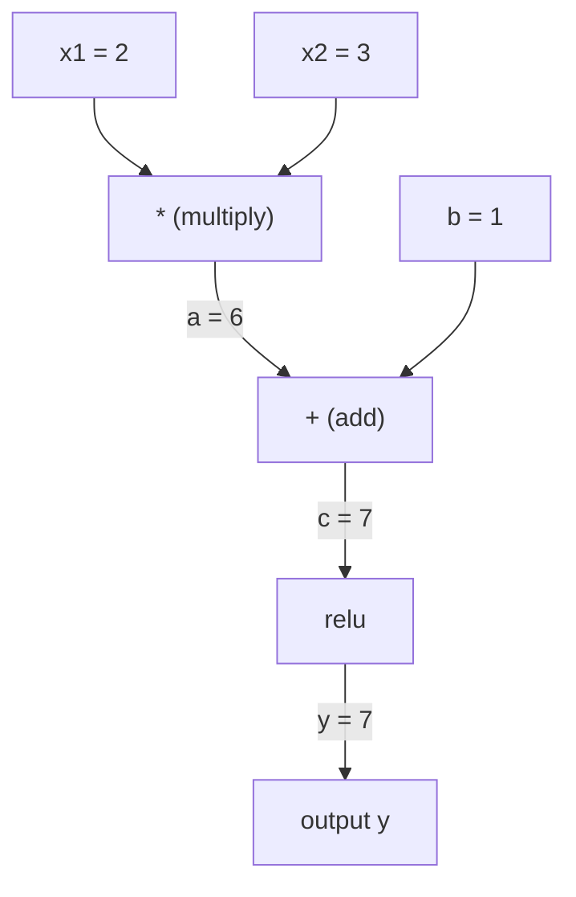
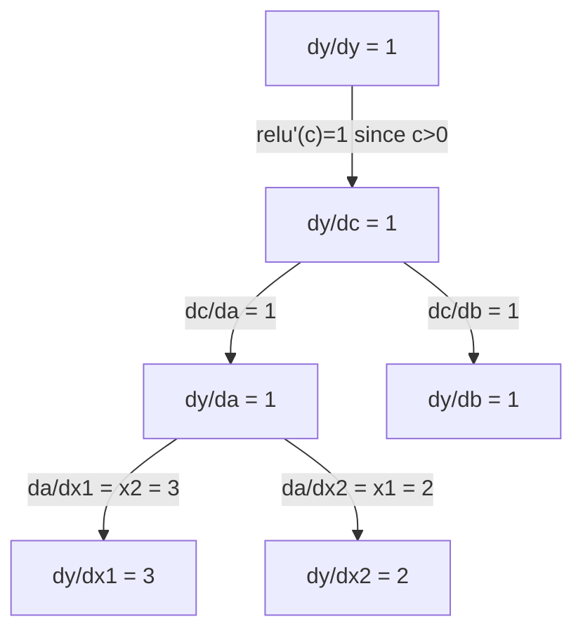

# Quy tắc chuỗi & phân biệt tự động .

> Quy tắc chuỗi là động cơ đằng sau mỗi mạng thần kinh học được.

**Type:** Build | **类型:** 动手
**Language:**Python**语言:**Python
**Prerequisites:** Phase 1, Lesson 04 (Derivatives & Gradients) | **前置知识:** Phase 1, Lesson 04（导数与梯度）
**Time:** ~90 minutes | **时间:** ~90 分钟

## Mục tiêu học tập

- Xây dựng một động cơ tự động cấp thấp nhất (kiểu giá trị) ghi lại hoạt động và tính toán độ sốc thông qua chế độ tự động ngược
  构建最小化 autograd 引擎(Value 类), ghi chép运算并通过反向模式自动微分计算梯度
- Thực hiện các đường đi về phía trước và ngược qua biểu đồ tính toán bằng cách sử dụng phân loại topological
  Sử dụng các thứ tự để thực hiện việc phân phối hình thức tính toán
- XOR xây dựng và huấn luyện một perceptron đa lớp chỉ sử dụng động cơ tự động từ đầu
  Chỉ sử dụng động cơ tự động hóa thực hiện từ không để xây dựng và đào tạo máy cảm nhận đa tầng XOR
- Kiểm tra độ chính xác tự động bằng cách kiểm tra gradient đối với sự khác biệt số hữu hạn
  Sử dụng số lượng giới hạn khác biệt để kiểm tra độ, xác minh tính chính xác của tự động

> **【中文解读】**
> 链式法则是" hàm tập hợp hàm số định lượng"──神经网络就是几百个函数嵌套在一起:矩阵乘法→加偏置→激活函数→再矩阵乘法→Softmax→交叉──链式法则让你从最后层开始,逐层往返计算每个参数的梯度这是反向传播──

> **【拓展：链式法则 → 反向传播 → PyTorch autograd】**
> 链式法则是反向传播 (trái phát triển) `autograd`、TensorFlow của `GradientTape` Chúng tự động theo dõi các biểu đồ tính toán, sau đó sử dụng quy tắc chuỗi tính toán tất cả các thang.

## Vấn đề  vấn đề giới thiệu

Bạn có thể tính toán các phái sinh của các hàm đơn giản. Nhưng một mạng thần kinh không phải là một hàm đơn giản. Nó là hàng trăm hàm được tạo thành với nhau: tử liệu nhân, thêm thiên vị, áp dụng kích hoạt, tử liệu nhân lần nữa, softmax, mất entropy chéo.

> Bạn có thể tính toán số dẫn của hàm đơn giản. Nhưng mạng thần kinh không phải là hàm đơn giản. Nó là sự hợp nhất của hàng trăm hàm:矩阵乘法加偏置, kích hoạt hàm, tái矩阵乘法Softmax交叉损失.

Để đào tạo mạng, bạn cần gradient của sự mất liên quan đến mỗi trọng lượng. Làm điều này bằng tay là không thể cho hàng triệu tham số. Làm nó về số (các khác biệt hữu hạn) là quá chậm.

> Để đào tạo mạng, bạn cần mất mát đối với mỗi trọng lượng của thang.

Quy tắc chuỗi cho bạn toán học. phân biệt tự động cho bạn thuật toán. Cùng với nhau chúng cho phép bạn tính toán gradient chính xác thông qua các thành phần tùy tiện của các hàm trong thời gian tương xứng với một lần đi trước duy nhất.

> 链式法则给出数学, tự động phân chia给出算法── hai kết hợp, để bạn trong thời gian tương đương với việc truyền bá trước và sau, tính toán độ chính xác của hàm phức hợp tùy chọn──

Đây là cách PyTorch, TensorFlow và JAX hoạt động. Bạn sẽ xây dựng một phiên bản miniatur từ đầu.

> Đó là cách PyTorch, TensorFlow và JAX làm việc. Bạn sẽ xây dựng một phiên bản nhỏ từ không.

> **【中文解读】**神经网络 = 函数的函数的函数──链式法则让你逐层解解复合函数的导数:dL/dw = dL/d_out × d_out/d_hidden × d_hidden/d_w── tự động yêu cầu tự động hóa quá trình nàyPyTorch 的`backward()`Một dòng mã định tính tỷ lệ của triệu tham số.

## Khái niệm cốt lõi

> **【拓展：自动求导是深度学习的引擎】**PyTorch của `loss.backward()`Sử dụng phương thức tự động tìm kiếm: từ đầu ra trở lại, từng tầng ứng dụng quy tắc chuỗi.`backward()`Một lần là có thể tính toán được độ của tất cả các tham số. Không có hướng dẫn tự động, học sâu không thể xử lý mô hình lớn như vậy.

### Quy tắc chuỗi

Nếu`y = f(g(x))`, dẫn xuất của `y`đối với `x`là:

> Nếu `y = f(g(x))`,y đối với x của số dẫn là:

```
dy/dx = dy/dg * dg/dx = f'(g(x)) * g'(x)
```

Bội số các phái sinh dọc theo chuỗi. Mỗi liên kết đóng góp phái sinh địa phương của nó.

> 沿链路乘导数―― Mỗi bước đóng góp số lượng định vị của nó――

Ví dụ: `y = sin(x^2)`

```
g(x) = x^2       g'(x) = 2x
f(g) = sin(g)     f'(g) = cos(g)

dy/dx = cos(x^2) * 2x
```

> Ví dụ: y = sin(x2);;;;;;;;;;;;;;;;;;;;;;;;;;;;;;;;;;;;;;;;;;;;;;;;;;;;;;;;;;;;;;;;;;;;;;;;;;;;;;;;;;;;;;;;;;;;;;;;;;;;;;;;;;;;;;;;;;;;;;;;;;;;;;;;;;;;;;;;;;;;;;;;;;;;;;;;;;;;;;;;;;;;;;;;;;;;;;;;;;;;;;;;;;;;;;;;;;;;;;;;;;;;;;;;;;;;;;;;;;;;;;;;;;;;;;;;;;;;;;;;;;;;;;;;;;;;;;;;;;;;;;;;;;;;;;;;;;;;;;;;;;;;;;;;;;;;;;;;;;;;;;;;;;;;;;;;;;;;;;;;;;;;;;;;;;;;;;;;;;;;;;;;;;;;;;;;;;;;;;;;;;;;;;;;;;;;;;;;;;;;;;;;;;;;;;;;;;;;;;;;;;;;;;;;;;;;;;;;;;;;;;;;;;;;;;;;;;;;;;;;;;;;;;;;;;;;;;;;;;;;;;;;;;;;;;;;;;;;;;;;;;;;;;;;;;;;;;;;;;;;;;

Đối với các thành phần sâu hơn, chuỗi mở rộng:

```
y = f(g(h(x)))

dy/dx = f'(g(h(x))) * g'(h(x)) * h'(x)
```

> 更深的复合:y = f(g(h(x))),导数为 f'(g(h(x))) × g'(h(x)) × h'(x), mỗi多一层就多乘一项。

Mỗi lớp trong một mạng thần kinh là một liên kết trong chuỗi này.

> Mỗi tầng của mạng thần kinh là một phần trong chuỗi này.

### Hình đồ tính toán

Một biểu đồ tính toán làm cho quy tắc chuỗi hình ảnh. Mỗi hoạt động trở thành một nút. Dữ liệu chảy về phía trước thông qua biểu đồ.

> 计算图让链式法则可视化―― mỗi hoạt động trở thành một nút, dữ liệu di chuyển về phía trước, thang độ di chuyển về phía sau――

> 计算图是 PyTorch autograd:节点是运算,前向时存储中值,反向时计算局部梯度──

**Forward pass (compute values):**



**Backward pass (compute gradients):**



Việc đi ngược áp dụng quy tắc chuỗi tại mỗi nút, lan truyền gradient từ đầu ra vào đầu vào.

> Phản chiều truyền truyền trong mỗi nút ứng dụng quy tắc chuỗi, sẽ gradient từ phát phát truyền đến nhập.

### Phương thức tiến ngược

Có hai cách để áp dụng quy tắc chuỗi thông qua biểu đồ.

> Thông qua tính toán, có hai cách.

**Forward mode**bắt đầu từ các đầu vào và đẩy các phái sinh về phía trước.`dx/dx = 1`và lây lan thông qua mỗi hoạt động. tốt khi bạn có ít đầu vào và nhiều đầu ra.

> **前向模式**Từ nhập bắt đầu tiến lên tiến lên số lượng.`dx/dx = 1`Và thông qua mỗi hoạt động truyền tải.

```
Forward mode: seed dx/dx = 1, propagate forward

  x = 2       (dx/dx = 1)
  a = x^2     (da/dx = 2x = 4)
  y = sin(a)  (dy/dx = cos(a) * da/dx = cos(4) * 4 = -2.615)
```

**Reverse mode**bắt đầu ở đầu ra và kéo gradient ngược lại.`dy/dy = 1`và lan truyền qua mỗi hoạt động ngược lại. tốt khi bạn có nhiều đầu vào và ít đầu ra.

> **反向模式**Từ đầu ra bắt đầu trở lại sau.`dy/dy = 1`Và ngược lại thông qua mỗi hoạt động. Khi nhập nhiều, xuất ít, áp dụng.

```
Reverse mode: seed dy/dy = 1, propagate backward

  y = sin(a)  (dy/dy = 1)
  a = x^2     (dy/da = cos(a) = cos(4) = -0.654)
  x = 2       (dy/dx = dy/da * da/dx = -0.654 * 4 = -2.615)
```

Các mạng thần kinh có hàng triệu đầu vào (năng lượng) và một đầu ra (sự mất mát). chế độ ngược tính toán tất cả các gradient trong một lần đi ngược.

> Cây thần kinh có hàng triệu đầu vào và một đầu ra.

| Mode | Seed | Direction | Best when |
|------|------|-----------|-----------|
| Forward | `dx_i/dx_i = 1` | Input to output | Few inputs, many outputs |
| Reverse | `dy/dy = 1` | Output to input | Many inputs, few outputs (neural nets) |

> 两种模式对比:前向模式种子 dx/dx = 1,输入到输出,适合少输入多输出;反向模式种子 dy/dy = 1,输出到输入,适合多输入少输出(神经网络)

### Số hai cho chế độ đi trước

Phương thức đi trước có thể được thực hiện đẹp đẽ với số hai.`a + b*epsilon`nơi `epsilon^2 = 0`- Tôi không biết.

> Mô hình hướng trước có thể được thực hiện tốt hơn với số lượng đôi.`a + b*ε`, trong số đó `ε² = 0`

```
Dual number: (value, derivative)

(2, 1) means: value is 2, derivative w.r.t. x is 1

Arithmetic rules:
  (a, a') + (b, b') = (a+b, a'+b')
  (a, a') * (b, b') = (a*b, a'*b + a*b')
  sin(a, a')         = (sin(a), cos(a)*a')
```

> Đối với số đôi: ((( giá trị, 导数) 』 quy tắc toán học:加法 đối với应分量相加;乘法用积的求导法则;sin 用链式法则。把输入的导数种子设为1,导数会自动通过每个运算传播。

Cây biến đầu vào với dẫn xuất 1. dẫn xuất tự động lan truyền thông qua mỗi hoạt động.

> Để đặt các hàm số chuyển đổi nhập thành 1, các hàm số sẽ tự động truyền thông qua mỗi vận hành.

### Xây dựng một động cơ Autograd

Một động cơ tự động cần ba thứ:

1. **Value wrapping.**Bị gói mọi số trong một đối tượng lưu trữ giá trị và độ nghiêng của nó.
2. **Graph recording.**Mỗi hoạt động ghi lại đầu vào của nó và chức năng gradient địa phương.
3. **Backward pass.**Topological sắp xếp biểu đồ, sau đó đi nó ngược lại, áp dụng quy tắc chuỗi tại mỗi nút.

> Autograd 引擎 cần 3 điều: 1.**数值包装**: Đặt mỗi số gói thành đối tượng lưu trữ giá trị và thang độ;**图记录**: mỗi hoạt động ghi lại hàm độ nhập và địa phương của nó;**反向传播**:拓排序图, ngược向遍历 và trong mỗi节点 áp dụng quy tắc chuỗi

Đây chính xác là PyTorch.`autograd`- Có.`torch.Tensor`lớp gói các giá trị, ghi lại các hoạt động khi `requires_grad=True`, và tính toán gradient khi bạn gọi`.backward()`- Tôi không biết.

> Đó là của PyTorch.`autograd`Làm gì đó.`torch.Tensor`包装数值,当 `requires_grad=True`时记录操作,调用 `.backward()`时计算梯度――

### Làm thế nào PyTorch Autograd hoạt động dưới nắp

Khi bạn viết mã PyTorch:

```python
x = torch.tensor(2.0, requires_grad=True)
y = x ** 2 + 3 * x + 1
y.backward()
print(x.grad)  # 7.0 = 2*x + 3 = 2*2 + 3
```

> Khi bạn viết PyTorch 代码时:x 设 yêu cầu_grad=True,运算自动记录,调用 ngược() 后 x.grad 自动计算出梯度 7.0。

PyTorch bên trong:

1. Tạo ra một `Tensor`nút cho `x`với `requires_grad=True`
2. Mỗi hoạt động (`**`- `*`- `+`) tạo ra một nút mới và ghi lại hàm ngược
3. `y.backward()`kích hoạt chế độ ngược tự động thông qua biểu đồ ghi
4. Mỗi nút của nó`grad_fn`tính toán gradient địa phương và chuyển chúng sang các nút bậc cha
5. Các gradient tích lũy trong `.grad`thuộc tính thông qua bổ sung (không thay thế)

> PyTorch 内部:1) 为 x 创建 Tensor 节点;2) 每运算(**、*、+)创建新节点并记录反向函数;3) y.backward() 触发反向自动微分;4) Mỗi节点的 grad_fn 计算局部梯度并传给父节点;5) 梯度通过加法累积到 .grad 属性(不是替代) ⋅

Chữ đồ họa là động (định nghĩa theo chạy). Chữ đồ họa mới được xây dựng trên mỗi bước đi về phía trước.

> 计算图是动态的 (~ định-by-run) ⋅ mỗi lần trước hướng传播都构建新图──这是Pytorch 支持模型内部控制流 (~ nếu/else、循环) ⋅

## Hãy xây dựng nó.
```figure
chain-rule
```

## Hãy xây dựng nó

### Bước 1: Kiểu giá trị

```python
class Value:
    def __init__(self, data, children=(), op=''):
        self.data = data
        self.grad = 0.0
        self._backward = lambda: None
        self._prev = set(children)
        self._op = op

    def __repr__(self):
        return f"Value(data={self.data:.4f}, grad={self.grad:.4f})"
```

> Value 类是 autograd's core data structure──每个 Value 存储数值、梯度、反向函数闭包和子节点指针──

Mỗi người`Value`lưu trữ dữ liệu số của nó, độ nghiêng của nó (trước đầu là không), một hàm ngược, và chỉ dẫn đến các nút trẻ em đã tạo ra nó.

> Mỗi người`Value`存储数值、梯度(初始为零) 、反向函数和产生它的子节点指针──

### Bước 2: Các hoạt động toán học với theo dõi gradient

```python
    def __add__(self, other):
        other = other if isinstance(other, Value) else Value(other)
        out = Value(self.data + other.data, (self, other), '+')
        def _backward():
            self.grad += out.grad
            other.grad += out.grad
        out._backward = _backward
        return out

    def __mul__(self, other):
        other = other if isinstance(other, Value) else Value(other)
        out = Value(self.data * other.data, (self, other), '*')
        def _backward():
            self.grad += other.data * out.grad
            other.grad += self.data * out.grad
        out._backward = _backward
        return out

    def relu(self):
        out = Value(max(0, self.data), (self,), 'relu')
        def _backward():
            self.grad += (1.0 if out.data > 0 else 0.0) * out.grad
        out._backward = _backward
        return out
```

Mỗi hoạt động tạo ra một kết thúc biết cách tính toán gradient địa phương và nhân bằng gradient trên dòng (`out.grad`).`+=`xử lý trường hợp một giá trị được sử dụng trong nhiều hoạt động.

> Mỗi hoạt động tạo ra một đóng gói, biết cách tính toán ở địa phương gradient và nhân lên trên游 gradient.`+=`处理一个值被多操作使用情况 (): 处理一个值被多操作使用情况 (): 处理一个值被多操作使用情况)

> 关键设计:加法的反向是1(梯度直接传给两个输入),乘法的反向是另一个操作数(链式法则:d(a*b)/da = b)。relu 的反向是0或1 ((取决于前向是否激活)。

### Bước 3: Đi ngược

```python
    def backward(self):
        topo = []
        visited = set()
        def build_topo(v):
            if v not in visited:
                visited.add(v)
                for child in v._prev:
                    build_topo(child)
                topo.append(v)
        build_topo(self)

        self.grad = 1.0
        for v in reversed(topo):
            v._backward()
```

Phân loại topological đảm bảo gradient của mỗi nút được tính toán đầy đủ trước khi nó lây lan cho con cái của nó.

> 拓排序 đảm bảo rằng độ thang của mỗi node được tính toán hoàn toàn trước khi truyền đến các node của con.

> ngược (được sử dụng từ trước để xây dựng các cấu trúc) (được sử dụng từ trước để xây dựng các cấu trúc) (được sử dụng từ trước để xây dựng các cấu trúc) (được sử dụng từ trước để xây dựng các cấu trúc) (được sử dụng từ trước để xây dựng các cấu trúc) (được sử dụng từ trước để xây dựng các cấu trúc) (được sử dụng từ trước để xây dựng các cấu trúc) (được sử dụng từ trước để xây dựng các cấu trúc) (được sử dụng từ trước để xây dựng các cấu trúc) (được sử dụng từ trước để xây dựng các cấu trúc) (được sử dụng từ trước để xây dựng các cấu trúc) (được sử dụng từ trước để xây dựng các cấu trúc) (được sử dụng từ trước để xây dựng các cấu trúc) (được sử dụng từ trước để xây dựng các cấu trúc) (được sử dụng từ trước để xây dựng các cấu trúc) (được sử dụng từ trước để xây dựng các cấu trúc) (được sử dụng từ sau sau) (được sử dụng từ trước để xây dựng) (được sử dụng từ sau sau sau sau sau sau sau sau sau sau sau sau sau sau sau sau sau sau sau sau sau sau sau sau sau sau sau sau sau sau sau sau sau sau sau sau sau sau sau sau sau sau sau sau sau sau sau sau sau sau sau sau sau sau sau sau sau sau sau sau sau sau sau sau sau sau sau sau sau sau sau sau sau sau sau sau sau sau sau sau sau sau sau sau sau sau sau sau sau sau sau sau sau sau sau sau sau sau sau sau sau sau sau sau sau sau sau sau sau sau sau sau sau sau sau sau sau sau sau sau sau sau sau sau sau sau sau sau sau sau sau sau sau sau sau sau sau sau sau sau sau sau sau sau sau sau sau sau sau sau sau sau sau sau sau sau sau sau sau sau sau sau sau sau sau sau sau sau sau sau sau sau sau sau sau sau sau sau sau sau sau sau sau sau sau sau sau sau sau sau sau sau sau sau sau sau sau sau sau sau sau sau sau sau sau sau sau sau sau sau sau sau sau sau sau sau sau sau sau sau sau sau sau sau sau sau sau sau sau sau sau sau sau sau sau sau sau sau sau sau sau sau sau sau sau sau sau sau sau sau sau sau sau sau sau sau sau sau sau

### Bước 4: Nhiều hoạt động hơn cho một động cơ hoàn chỉnh

Các lớp giá trị cơ bản xử lý cộng, nhân và relu. Một động cơ tự động thực sự cần nhiều hơn. Dưới đây là các hoạt động bạn cần để xây dựng mạng thần kinh:

> 基础 Value 类只支持加加、乘、relu── Một động cơ tự động thực sự cần nhiều hơn: giảm法、、除法、exp、log、tanh──

```python
    def __neg__(self):
        return self * -1

    def __sub__(self, other):
        return self + (-other)

    def __radd__(self, other):
        return self + other

    def __rmul__(self, other):
        return self * other

    def __rsub__(self, other):
        return other + (-self)

    def __pow__(self, n):
        out = Value(self.data ** n, (self,), f'**{n}')
        def _backward():
            self.grad += n * (self.data ** (n - 1)) * out.grad
        out._backward = _backward
        return out

    def __truediv__(self, other):
        return self * (other ** -1) if isinstance(other, Value) else self * (Value(other) ** -1)

    def exp(self):
        import math
        e = math.exp(self.data)
        out = Value(e, (self,), 'exp')
        def _backward():
            self.grad += e * out.grad
        out._backward = _backward
        return out

    def log(self):
        import math
        out = Value(math.log(self.data), (self,), 'log')
        def _backward():
            self.grad += (1.0 / self.data) * out.grad
        out._backward = _backward
        return out

    def tanh(self):
        import math
        t = math.tanh(self.data)
        out = Value(t, (self,), 'tanh')
        def _backward():
            self.grad += (1 - t ** 2) * out.grad
        out._backward = _backward
        return out
```

**Why each operation matters:**

| Operation | Backward rule | Used in |
|-----------|--------------|---------|
| `__sub__` | Reuses add + neg | Loss computation (pred - target) |
| `__pow__` | n * x^(n-1) | Polynomial activations, MSE (error^2) |
| `__truediv__` | Reuses mul + pow(-1) | Normalization, learning rate scaling |
| `exp` | exp(x) * upstream | Softmax, log-likelihood |
| `log` | (1/x) * upstream | Cross-entropy loss, log probabilities |
| `tanh` | (1 - tanh^2) * upstream | Classic activation function |

> Các quy tắc ngược chiều của các hoạt động: giảm法复用加法+取负;用 n*x^(n-1);除法复用乘法+(-1);exp 用 exp(x) ×上游;log 用 (1/x) ×上游;tanh 用 (1-tanh2) ×上游。

Phần thông minh:`__sub__`và `__truediv__`được định nghĩa theo các hoạt động hiện có. Họ nhận được gradient chính xác miễn phí vì quy tắc chuỗi được tạo ra thông qua các hoạt động cộng/mul/pow cơ bản.

> 巧妙之处:`__sub__`和 `__truediv__`通过已有操作定义, do đó thang độ thông qua quy tắc chuỗi tự động chính xác 这是组合性的力量.

### Bước 5: Mini MLP từ đầu

Với lớp giá trị hoàn chỉnh, bạn có thể xây dựng một mạng lưới thần kinh không PyTorch, không NumPy, chỉ có giá trị và quy tắc chuỗi.

> Với một loại giá trị hoàn chỉnh, bạn có thể xây dựng mạng lưới thần kinh không cần PyTorch không cần NumPy, chỉ cần sử dụng giá trị và quy tắc chuỗi. Đây là tinh thần của Karpathy.

```python
import random

class Neuron:
    def __init__(self, n_inputs):
        self.w = [Value(random.uniform(-1, 1)) for _ in range(n_inputs)]
        self.b = Value(0.0)

    def __call__(self, x):
        act = sum((wi * xi for wi, xi in zip(self.w, x)), self.b)
        return act.tanh()

    def parameters(self):
        return self.w + [self.b]

class Layer:
    def __init__(self, n_inputs, n_outputs):
        self.neurons = [Neuron(n_inputs) for _ in range(n_outputs)]

    def __call__(self, x):
        return [n(x) for n in self.neurons]

    def parameters(self):
        return [p for n in self.neurons for p in n.parameters()]

class MLP:
    def __init__(self, sizes):
        self.layers = [Layer(sizes[i], sizes[i+1]) for i in range(len(sizes)-1)]

    def __call__(self, x):
        for layer in self.layers:
            x = layer(x)
        return x[0] if len(x) == 1 else x

    def parameters(self):
        return [p for layer in self.layers for p in layer.parameters()]
```

A `Neuron`tính toán`tanh(w1*x1 + w2*x2 + ... + b)`. A `Layer`là một danh sách các tế bào thần kinh.`MLP`Mỗi trọng lượng là một`Value`, vì vậy gọi `loss.backward()`truyền gradient đến mọi tham số.

> Một `Neuron`计算 `tanh(w1*x1 + w2*x2 + ... + b)` Một `Layer`Đó là một trong những thứ tôi đã làm.`MLP`堆叠多层── mỗi quyền trọng là `Value`, để调用 `loss.backward()`Sẽ truyền tải gradient đến từng parameter.

**Training on XOR:**

> **在 XOR 上训练**XOR là một vấn đề không liên kết, không thể giải quyết được, phải sử dụng ít nhất một lớp ẩn.

```python
random.seed(42)
model = MLP([2, 4, 1])  # 2 inputs, 4 hidden neurons, 1 output

xs = [[0, 0], [0, 1], [1, 0], [1, 1]]
ys = [-1, 1, 1, -1]  # XOR pattern (using -1/1 for tanh)

for step in range(100):
    preds = [model(x) for x in xs]
    loss = sum((p - y) ** 2 for p, y in zip(preds, ys))

    for p in model.parameters():
        p.grad = 0.0
    loss.backward()

    lr = 0.05
    for p in model.parameters():
        p.data -= lr * p.grad

    if step % 20 == 0:
        print(f"step {step:3d}  loss = {loss.data:.4f}")

print("\nPredictions after training:")
for x, y in zip(xs, ys):
    print(f"  input={x}  target={y:2d}  pred={model(x).data:6.3f}")
```

Đây là micrograd. Một vòng đào tạo mạng thần kinh hoàn chỉnh trong Python tinh khiết với sự phân biệt tự động.

> Đây là micrograd. Một vòng đào tạo mạng thần kinh hoàn chỉnh được thực hiện bằng Python và phân tích tự động.

>  tập vòng 5 步:1) 前向预测;2) 计算损失(MSE);3) 清零所有参数梯度;4) 反向传播;5) 沿梯度负方向更新参数──这是 PyTorch 训练循环的核心──

### Bước 6: Kiểm tra độ

Làm sao bạn biết tự định nghĩa của mình là đúng? So sánh nó với các phái sinh số. Đây là kiểm tra gradient.

> Làm sao biết tự lái của bạn là đúng?

```python
def gradient_check(build_expr, x_val, h=1e-7):
    x = Value(x_val)
    y = build_expr(x)
    y.backward()
    autodiff_grad = x.grad

    y_plus = build_expr(Value(x_val + h)).data
    y_minus = build_expr(Value(x_val - h)).data
    numerical_grad = (y_plus - y_minus) / (2 * h)

    diff = abs(autodiff_grad - numerical_grad)
    return autodiff_grad, numerical_grad, diff
```

Hãy thử nó bằng một biểu hiện phức tạp:

```python
def expr(x):
    return (x ** 3 + x * 2 + 1).tanh()

ad, num, diff = gradient_check(expr, 0.5)
print(f"Autodiff:  {ad:.8f}")
print(f"Numerical: {num:.8f}")
print(f"Difference: {diff:.2e}")
# Difference should be < 1e-5
```

> 测试复杂表达式:(x3 + 2x + 1) 的 tanh 在 x=0.5 处的梯度──autodiff 和数值导数 的差异应 < 1e-5,验证反向传播实现正确──

Kiểm tra độ cao là điều cần thiết khi thực hiện các hoạt động mới. Nếu thẻ ngược của bạn có lỗi, kiểm tra số sẽ bắt được nó. Mỗi thực hiện sâu học nghiêm trọng chạy kiểm tra độ cao trong quá trình phát triển.

> Việc kiểm tra độ cao là điều cần thiết trong việc thực hiện các hoạt động mới. Nếu có lỗi lây lan ngược, kiểm tra số có thể phát hiện.

**When to use gradient checking:**

| Situation | Do gradient check? |
|-----------|-------------------|
| Adding a new operation to your autograd | Yes, always |
| Debugging a training loop that won't converge | Yes, check gradients first |
| Production training | No, too slow (2x forward passes per parameter) |
| Unit tests for autograd code | Yes, automate it |

> 何时使用梯度检查:给 autograd 加新操作(永远要);调试不收的训练循环(先查梯度);生产训练(不要,太慢); autograd 单元测试(自动化)

### Bước 7: Kiểm tra tính toán thủ công

```python
x1 = Value(2.0)
x2 = Value(3.0)
a = x1 * x2          # a = 6.0
b = a + Value(1.0)    # b = 7.0
y = b.relu()          # y = 7.0

y.backward()

print(f"y = {y.data}")          # 7.0
print(f"dy/dx1 = {x1.grad}")   # 3.0 (= x2)
print(f"dy/dx2 = {x2.grad}")   # 2.0 (= x1)
```

> 手动验证:y = relu(x1*x2 + 1), vì x1*x2 + 1 = 7 > 0,relu là恒等映射──dy/dx1 = x2 = 3,dy/dx2 = x1 = 2──引擎计算结果完全匹配──

Kiểm tra thủ công: `y = relu(x1*x2 + 1)`Từ đó`x1*x2 + 1 = 7 > 0`, relu là danh tính.
`dy/dx1 = x2 = 3`- `dy/dx2 = x1 = 2`- Động cơ phù hợp.

## Hãy sử dụng nó để thực hiện

### Kiểm tra với PyTorch

> Với PyTorch đối với thử nghiệm: sử dụng ngọn đuốc 重写同样表达式, đối với tỷ lệ kết quả.

```python
import torch

x1 = torch.tensor(2.0, requires_grad=True)
x2 = torch.tensor(3.0, requires_grad=True)
a = x1 * x2
b = a + 1.0
y = torch.relu(b)
y.backward()

print(f"PyTorch dy/dx1 = {x1.grad.item()}")  # 3.0
print(f"PyTorch dy/dx2 = {x2.grad.item()}")  # 2.0
```

Động cơ của bạn tính toán kết quả tương tự như PyTorch bởi vì toán học là tương tự: tự động chuyển đổi theo chế độ ngược qua quy tắc chuỗi.

> Tỷ lệ tương tự: Bộ máy của bạn và PyTorch tính toán kết quả tương tự, bởi vì toán học là tương tự: thông qua quy tắc chuỗi:

## Chuyển nó đi.

Bài học này mang lại:
- `outputs/skill-autodiff.md`-- một kỹ năng xây dựng và debugging hệ thống autograd
- `code/autodiff.py`-- một động cơ tự động tối thiểu bạn có thể mở rộng

> 本课产出: xây dựng và điều chỉnh tự động cấp 系统的技能文档 + 可扩展的最小自动级 引擎代码──

Các lớp giá trị được xây dựng ở đây là nền tảng cho vòng đào tạo mạng thần kinh trong giai đoạn 3.

> Các loại giá trị được xây dựng trong đó là cơ sở của vòng tập trung mạng lưới thần kinh giai đoạn 3.

### Một biểu hiện phức tạp hơn

```python
a = Value(2.0)
b = Value(-3.0)
c = Value(10.0)
f = (a * b + c).relu()  # relu(2*(-3) + 10) = relu(4) = 4

f.backward()
print(f"df/da = {a.grad}")  # -3.0 (= b)
print(f"df/db = {b.grad}")  #  2.0 (= a)
print(f"df/dc = {c.grad}")  #  1.0
```

> 更复杂的表达式:relu(a*b + c) 在 a=2, b=-3, c=10 处,结果是relu(4) = 4。df/da = b = -3,df/db = a = 2,df/dc = 1。

## Tập luyện bài tập

1. Thêm `__pow__`để bạn có thể tính toán`x ** n`- Hãy kiểm tra.`d/dx(x^3)``x=2`=`12.0`- Tôi không biết.
   给 giá trị 类添加 `__pow__`, để anh có thể tính toán`x ** n`❖ 验证`d/dx(x^3)`Trong `x=2`处等于 `12.0`

2. Thêm `tanh`làm chức năng kích hoạt.`tanh'(0) = 1`và `tanh'(2) = 0.0707`(các khoảng).
   添加 `tanh`激活函数──验证 `tanh'(0) = 1`- Tôi không biết.`tanh'(2) ≈ 0.0707`

3. Xây dựng một biểu đồ tính toán cho một tế bào thần kinh duy nhất: `y = relu(w1*x1 + w2*x2 + b)`- Xét tất cả 5 gradient và xác minh với PyTorch.
   Để tạo ra một bộ thần kinh đơn lẻ:`y = relu(w1*x1 + w2*x2 + b)`△计算所有五个梯度并与 PyTorch 验证──

4. Thực hiện tự động định dạng hướng trước sử dụng hai số.`Dual`lớp và xác minh nó cung cấp các phái sinh tương tự như động cơ chế ngược của bạn.
   Sử dụng số lượng đôi để thực hiện mô hình hướng trước tự động nhỏ phân.`Dual`Nó cung cấp cùng một số hướng dẫn với động cơ phản chiều của bạn.

## Từ khóa  Từ khóa nhanh chóng

| Term | What people say | What it actually means |
|------|----------------|----------------------|
| Chain rule | "Multiply the derivatives" | The derivative of composed functions equals the product of each function's local derivative, evaluated at the right point |
| Computational graph | "The network diagram" | A directed acyclic graph where nodes are operations and edges carry values (forward) or gradients (backward) |
| Forward mode | "Push derivatives forward" | Autodiff that propagates derivatives from inputs to outputs. One pass per input variable. |
| Reverse mode | "Backpropagation" | Autodiff that propagates gradients from outputs to inputs. One pass per output variable. |
| Autograd | "Automatic gradients" | A system that records operations on values, builds a graph, and computes exact gradients via the chain rule |
| Dual numbers | "Value plus derivative" | Numbers of the form a + b*epsilon (epsilon^2 = 0) that carry derivative information through arithmetic |
| Topological sort | "Dependency order" | Ordering graph nodes so every node comes after all its dependencies. Required for correct gradient propagation. |
| Gradient accumulation | "Add, don't replace" | When a value feeds into multiple operations, its gradient is the sum of all incoming gradient contributions |
| Dynamic graph | "Define by run" | A computation graph rebuilt on every forward pass, allowing Python control flow inside models (PyTorch style) |
| Gradient checking | "Numerical verification" | Comparing autodiff gradients against numerical finite-difference gradients to verify correctness. Essential for debugging. |
| MLP | "Multi-layer perceptron" | A neural network with one or more hidden layers of neurons. Each neuron computes a weighted sum plus bias, then applies an activation function. |
| Neuron | "Weighted sum + activation" | The basic unit: output = activation(w1*x1 + w2*x2 + ... + b). The weights and bias are learnable parameters. |

> 术语速查:Chain rule (链式法则,复合函数导数=各局部导数之积) 計算图 (计算图,运算为节点有向无环图)  前行模式 (前向模式,输入到输出传播导数) 逆向模式 (反向模式,输出到输入传播梯度,即反向传播)  车格 (Autograd)  PyTorch 自动微分系统) 双数 (对偶数 a+bε,前向模式实现)  Topological sort (拓拓拓拓拓拓拓拓拓拓拓拓拓拓拓拓拓拓拓拓拓拓拓拓拓拓拓拓拓拓拓拓拓拓拓拓拓拓拓拓拓拓拓拓拓拓拓拓拓拓拓拓拓拓拓拓拓拓拓拓拓拓拓拓拓拓拓拓拓拓拓拓拓拓拓拓拓拓拓拓拓拓拓拓拓拓拓拓拓拓拓拓拓拓拓拓拓拓拓拓拓拓拓拓拓拓拓拓拓拓拓拓拓拓拓拓拓拓拓拓拓拓拓拓拓拓拓拓拓拓拓拓拓拓拓拓拓拓拓拓拓拓拓拓拓拓拓拓拓拓拓拓拓拓拓拓拓拓拓拓拓拓拓拓拓拓拓拓拓拓拓拓拓拓拓拓拓拓拓拓拓拓拓拓拓拓拓拓拓拓拓拓拓拓拓拓拓拓拓拓拓拓拓拓拓拓拓拓拓拓拓拓拓拓拓拓拓拓拓拓拓拓拓拓拓拓拓拓拓拓拓拓拓拓拓拓拓拓拓拓拓拓拓拓拓拓拓拓拓拓拓拓拓拓拓拓拓拓拓拓拓拓拓拓拓拓拓拓拓拓拓拓拓拓拓拓拓拓拓拓拓拓拓拓拓拓拓拓拓拓拓拓拓拓拓拓拓拓拓拓拓拓拓拓拓拓拓拓拓拓拓拓拓拓拓拓拓拓拓拓拓拓拓拓拓拓拓拓拓拓拓拓拓拓拓拓拓拓拓拓拓拓拓拓拓拓拓拓拓拓拓拓拓拓拓拓拓拓拓拓拓拓拓拓拓拓拓拓拓拓拓拓拓拓

## Xem thêm 延伸阅读

- [3Blue1Brown: Backpropagation calculus](https://www.youtube.com/watch?v=tIeHLnjs5U8)-- giải thích trực quan về quy tắc chuỗi trong mạng thần kinh
- [PyTorch Autograd mechanics](https://pytorch.org/docs/stable/notes/autograd.html)-- cách hệ thống thực sự hoạt động
- [Baydin et al., Automatic Differentiation in Machine Learning: a Survey](https://arxiv.org/abs/1502.05767)-- tham chiếu toàn diện
