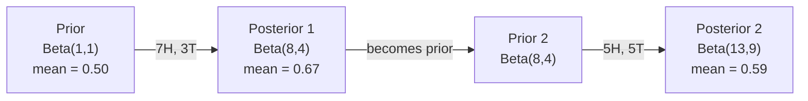

# Lý thuyết Bayes.

> Thiếu khả năng là về những gì bạn mong đợi. Lý thuyết Bayes là về những gì bạn học được.
> 概率 phụ thuộc vào mong đợi của bạn. 概率 phụ thuộc vào những gì bạn học được.

**Type:** Build | **类型:** 动手
**Language:**Python**语言:**Python
**Prerequisites:** Phase 1, Lesson 06 (Probability Fundamentals) | **前置知识:** Phase 1, Lesson 06（概率基础）
**Time:** ~75 minutes | **时间:** ~75 分钟

## Mục tiêu học tập

- Sử dụng định lý Bayes để tính toán xác suất sau từ trước, xác suất và bằng chứng
- Xây dựng một phân loại văn bản Bayes ngây thơ từ đầu với Laplace làm mượt mà và tính toán log-space
- So sánh ước tính MLE và MAP và giải thích cách MAP tương ứng với L2
- Thực hiện cập nhật Bayesian theo trình tự bằng cách sử dụng các kết hợp trước Beta-Binomial cho thử nghiệm A / B

> **【中文解读】**
> 贝叶斯定理的核心思想: 用新证据更新你的信念──先验概率 (先验概率) (x 似然) (x 似然) (证据出现概率) = 后验概率 (后验概率) (更新后的猜测) ──本章还从零构建简单贝叶斯文本分类器──

> **【拓展：贝叶斯在 AI 中的位置】**
> - **朴素贝叶斯分类器**: 垃圾邮件过的经典算法,sklearn 中文 `GaussianNB`- Không.`MultinomialNB`
> - **贝叶斯优化**: 用于超参数调优(如 Optuna),比网格搜索高效得多。
> - **MAP 与正则化**: Maximum后验估计 (MAP) giá bằng L2 正则化

## Vấn đề  vấn đề giới thiệu

> **【中文解读】**Một xét nghiệm y tế tỷ lệ xác thực 99% , bạn đo lường dương tính, tỷ lệ mắc bệnh thực tế là bao nhiêu? trực giác nói 99%, nhưng với phép tính Bayes chỉ có thể là 50% vì trước tiên phải xem xét" tỷ lệ mắc bệnh trước tiên" (Before the test, the probability of disease is very low) .

## Khái niệm cốt lõi

> **【拓展：贝叶斯思维是 AI 的核心范式】**        `P(假设|证据) = P(证据|假设) × P(假设) / P(证据)`Trong AI không có nơi nào:**朴素贝叶斯分类器**:垃垃垃邮过的经典方法;(2) **贝叶斯优化**:调超参数的高效方法(比网格搜索快 10 倍);(3) **MAP = L2 正则化**: ước tính sau cùng lớn nhất bằng giá trị thêm L2  phạt, từ góc độ Bayesian giải thích tại sao các quy định có thể chống quá phù hợp;**贝叶斯神经网络**Ừm, tôi không biết.

Hầu hết mọi người nói 99% câu trả lời thực sự phụ thuộc vào sự hiếm hoi của bệnh. Nếu 1 trong 10.000 người bị bệnh, kết quả tích cực chỉ cho bạn cơ hội 1% bị bệnh. 99% kết quả tích cực còn lại là báo động sai lầm từ những người khỏe mạnh.

> Hầu hết mọi người nói 99%──trả lời thực sự phụ thuộc vào số bệnh hiếm có──Nếu một trong 10 người bị bệnh, kết quả dương tính chỉ cho bạn tỷ lệ mắc bệnh khoảng 1%──trả lời dương tính còn lại 99% là kết quả giả của người khỏe mạnh──.

Đây không phải là câu hỏi lừa đảo. Đó là định lý Bayes. Mỗi bộ lọc spam, mỗi chẩn đoán y tế, mỗi mô hình học máy đo lường sự không chắc chắn đều sử dụng lý luận chính xác này. Bạn bắt đầu với một niềm tin. Bạn thấy bằng chứng. Bạn cập nhật.

> Đây không phải là một chuyển đổi nhanh chóng của não. Đây là một lý thuyết của Bayes. Mỗi bộ lọc thư rác, mỗi chẩn đoán y tế, mỗi mô hình ML không chắc chắn sử dụng cùng một lý thuyết: từ niềm tin, xem bằng chứng, mới niềm tin.

Nếu bạn xây dựng các hệ thống ML mà không hiểu điều này, bạn sẽ hiểu sai các sản phẩm mô hình, đặt ngưỡng xấu, và đưa ra dự đoán quá tự tin.

> Nếu bạn không hiểu điều này về xây dựng hệ thống ML, bạn sẽ sai lầm mô hình xuất phát, thiết lập sai giá trị, đưa ra dự đoán tự tin quá mức.

## Khái niệm cốt lõi

### Từ xác suất chung đến Bayes

Bạn đã biết từ bài học 06 rằng xác suất có điều kiện là:

> Bạn đã học được điều kiện trong lớp 06 概率:

```
P(A|B) = P(A and B) / P(B)
```

Và đối xứng:

```
P(B|A) = P(A and B) / P(A)
```

Cả hai biểu hiện đều có cùng số liệu: P(A và B). Đặt chúng bằng nhau và sắp xếp lại:

> Hai biểu hiện chung của cùng một phân tử: P(A và B)。 sẽ chúng giống nhau并重新排列:

```
P(A and B) = P(A|B) * P(B) = P(B|A) * P(A)

Therefore:

P(A|B) = P(B|A) * P(A) / P(B)
```

Đó là định lý Bayes. 4 số lượng, 1 phương trình.

> Đó là lý thuyết của Bayes.

### Bốn phần

| Part | Name | What it means |
|------|------|---------------|
| P(A\|B) | Posterior / 后验 | Your updated belief about A after seeing evidence B / 看到证据 B 后对 A 的更新信念 |
| P(B\|A) | Likelihood / 似然 | How probable the evidence B is if A is true / 如果 A 为真，证据 B 出现的概率 |
| P(A) | Prior / 先验 | Your belief about A before seeing any evidence / 看到任何证据前对 A 的信念 |
| P(B) | Evidence / 证据 | Total probability of seeing B under all possibilities / 在所有可能情况下看到 B 的总概率 |

Thuật ngữ bằng chứng P(B) hoạt động như một chất bình thường hóa. Bạn có thể mở rộng nó bằng cách sử dụng luật xác suất tổng thể:

> 证据项 P(B) 作为归一化因子──可以用全概率公式展开:

```
P(B) = P(B|A) * P(A) + P(B|not A) * P(not A)
```

### Ví dụ về xét nghiệm y tế

Một bệnh ảnh hưởng đến 1 trong 10.000 người.

> Một loại bệnh ảnh hưởng đến hàng triệu người.

```
P(sick)          = 0.0001     (prior: disease is rare)
P(positive|sick) = 0.99       (likelihood: test catches it)
P(positive|healthy) = 0.01    (false positive rate)

P(positive) = P(positive|sick) * P(sick) + P(positive|healthy) * P(healthy)
            = 0.99 * 0.0001 + 0.01 * 0.9999
            = 0.000099 + 0.009999
            = 0.010098

P(sick|positive) = P(positive|sick) * P(sick) / P(positive)
                 = 0.99 * 0.0001 / 0.010098
                 = 0.0098
                 = 0.98%
```

Khi một tình trạng hiếm, ngay cả xét nghiệm chính xác cũng có kết quả dương tính hầu hết là sai.

> Không lên đến 1%. Cần suất thử nghiệm trước chiếm ưu thế. Khi bệnh hiếm gặp, ngay cả xét nghiệm chính xác cũng chủ yếu có tính dương tính giả.

### Ví dụ về bộ lọc spam

Bạn nhận được một email có chứa từ "nhà cờ bạc".

> Bạn nhận được một thư có chứa "những cuộc xổ số" (彩票) ư?

```
P(spam)                = 0.3      (30% of email is spam)
P("lottery"|spam)      = 0.05     (5% of spam emails contain "lottery")
P("lottery"|not spam)  = 0.001    (0.1% of legitimate emails contain "lottery")

P("lottery") = 0.05 * 0.3 + 0.001 * 0.7
             = 0.015 + 0.0007
             = 0.0157

P(spam|"lottery") = 0.05 * 0.3 / 0.0157
                  = 0.955
                  = 95.5%
```

Một từ thay đổi xác suất từ 30% lên 95,5%. Một bộ lọc spam thực sự áp dụng Bayes trên hàng trăm từ cùng một lúc.

> Một từ sẽ có tỷ lệ từ 30% 推到95.5% 

### Bayes ngây thơ: giả định độc lập

Bayes ngây thơ mở rộng điều này đến nhiều tính năng bằng cách giả định tất cả các tính năng đều độc lập theo điều kiện khi xem xét lớp học:

> Biểu tượng đơn giản sẽ mở rộng ra nhiều đặc điểm, giả sử tất cả các đặc điểm đều độc lập với nhau trong các điều kiện của một loại nhất định:

```
P(class | feature_1, feature_2, ..., feature_n)
  = P(class) * P(feature_1|class) * P(feature_2|class) * ... * P(feature_n|class)
    / P(feature_1, feature_2, ..., feature_n)
```

Phần "tâm nhiên" là giả định độc lập. Trong văn bản, các sự xuất hiện của từ không độc lập ("New" và "York" có liên quan). Nhưng giả định hoạt động rất tốt trong thực tế bởi vì trình phân loại chỉ cần xếp hạng các lớp, không tạo ra xác suất được chuẩn bị.

> Phần " đơn giản " là giả thuyết độc lập. Trong văn bản, sự xuất hiện của từ không độc lập.

Vì tên gọi là giống nhau cho tất cả các lớp học, bạn có thể bỏ qua nó và chỉ cần so sánh số:

> Vì phân tử đối với tất cả các loại đều giống nhau, bạn có thể nhảy qua nó, chỉ so sánh phân tử:

```
score(class) = P(class) * product of P(feature_i | class)
```

Chọn lớp có điểm cao nhất.

> 选择分最高的类──

### Đánh giá xác suất tối đa (MLE)

Làm thế nào bạn có được P n tính năng (Figure) từ dữ liệu đào tạo?

> 如何从训练数据中得到P                                                                                                                                                                                                                                                           

```
P("free"|spam) = (number of spam emails containing "free") / (total spam emails)
```

Đây là MLE: chọn các giá trị tham số làm cho dữ liệu quan sát có khả năng cao nhất. Bạn đang tối đa hóa hàm xác suất, mà cho các đếm riêng lẻ giảm xuống tần số tương đối.

> Đây là MLE (最大似然估算): chọn để biến số lượng có thể xuất hiện nhất trong dữ liệu quan sát.

Vấn đề: nếu một từ không bao giờ xuất hiện trong spam trong quá trình đào tạo, MLE cho nó xác suất bằng không. Một từ không được nhìn thấy sẽ giết chết toàn bộ sản phẩm.

> 问题: Nếu một từ không bao giờ xuất hiện trong thư rác trong quá trình tập luyện, MLE 给它概率零―― một từ chưa thấy sẽ phá hủy toàn bộ số lượng――

```
P(word|class) = (count(word, class) + 1) / (total_words_in_class + vocabulary_size)
```

Thêm 1 vào mỗi con số đảm bảo không có khả năng nào là không.

> Đưa cho mỗi con số thêm 1 đảm bảo khả năng sẽ không bao giờ là không.

### Tối đa a posteriori (MAP)

MLE hỏi: những tham số nào tối đa hóa các tham số dữ liệu P(?

> MLE 问: What parameters make P(dataparameters) tối đa?

MAP hỏi: những tham số nào tối đa hóa các tham số P(nơi dữ liệu)?

> MAP 问: What参数使 P  tham số trong dữ liệu) tối đa?

Theo định lý Bayes:

> Theo định nghĩa của Bayes:

```
P(parameters|data) proportional to P(data|parameters) * P(parameters)
```

MAP thêm một tiền lệ trên các tham số. Nếu bạn tin rằng các tham số nên nhỏ, bạn mã hóa nó như một tiền lệ phạt các giá trị lớn. Điều này giống như việc điều chỉnh L2 trong ML.

> MAP trong các số liệu này thêm một thử nghiệm. Nếu bạn nghĩ rằng các số liệu này nên nhỏ hơn, hãy sử dụng thử nghiệm trừng phạt lớn.

| Estimation | Optimizes | ML equivalent |
|------------|-----------|---------------|
| MLE | P(data\|params) | Unregularized training / 无正则化训练 |
| MAP | P(data\|params) * P(params) | L2 / L1 regularization / L2/L1 正则化 |

### Bayesian vs frequentist: sự khác biệt thực tế

Những người thường xuyên học xem các thông số như là những điều không thể biết được. Họ hỏi: "Nếu tôi lặp lại thí nghiệm này nhiều lần, sẽ xảy ra gì?"

> 频率学派将参数视为固定的未知量――他们问:"Nếu tôi lặp lại thí nghiệm này nhiều lần, sẽ xảy ra gì?"

Người Bayesian coi các tham số như là phân bố. Họ hỏi: "Vì những gì tôi đã quan sát, tôi tin về các tham số là gì?"

> 贝叶斯 học sinh sẽ xem các tham số như phân bố. Họ hỏi:" Theo những gì tôi quan sát, tôi có niềm tin gì về các tham số?"

Đối với các hệ thống ML xây dựng, sự khác biệt thực tế:

> Đối với cấu trúc ML 系统, sự khác biệt thực tế là:

| Aspect | Frequentist | Bayesian |
|--------|-------------|----------|
| Output | Point estimate / 点估计 | Distribution over values / 值的分布 |
| Uncertainty | Confidence intervals (about procedure) / 置信区间（关于过程） | Credible intervals (about parameter) / 可信区间（关于参数） |
| Small data | Can overfit / 可能过拟合 | Prior acts as regularization / 先验充当正则化 |
| Computation | Usually faster / 通常更快 | Often requires sampling (MCMC) / 通常需要采样（MCMC） |

Hầu hết các phương pháp ML sản xuất là thường xuyên (SGD, ước tính điểm). phương pháp Bayesian sáng khi bạn cần sự không chắc chắn được cân bằng (phác định y tế, hệ thống an toàn quan trọng) hoặc khi dữ liệu là hiếm (làm học ít, bắt đầu lạnh).

> Phần lớn sản xuất ML là thường xuyên học tập của các trường học (SGD, điểm ước tính) ⋅ khi bạn cần chuẩn bị cho sự không chắc chắn (Phác định y tế, hệ thống quan trọng an toàn) hoặc dữ liệu hiếm khi khi có (Phác định học, khởi động lạnh), phương pháp của Bayes xuất hiện trong màu sắc.

### Tại sao tư duy Bayesian quan trọng cho ML

Sự kết nối sâu sắc hơn cả sự tương tự:

> Những liên kết này là:

**Priors are regularization.**Một Gaussian trước trên trọng lượng là L2 thường xuyên. một Laplace trước là L1. Mỗi khi bạn thêm một thuật ngữ thường xuyên, bạn đang làm cho một tuyên bố Bayesian về các giá trị tham số bạn mong đợi.

> **先验就是正则化。**Sự cố cao trên trọng lượng là L2 chính thức, sự cố cao là L1―― mỗi lần bạn thêm một điều kiện chính thức, bạn đang làm một tuyên bố về giá trị mong đợi của các tham số.

**Posteriors are uncertainty.**Một xác suất dự đoán duy nhất không cho bạn biết mô hình có thể tự tin như thế nào trong ước tính đó. phương pháp Bayesian cho bạn một phân phối: "Tôi nghĩ P(spam) là giữa 0,8 và 0,95. "

> **后验就是不确定性。**单个预测概率 không thể nói cho bạn mô hình có nhiều sự tự tin về ước tính này. Bayes phương pháp cho bạn một phân bố:" tôi nghĩ P(spam) trong khoảng 0.8 đến 0.95 ∼".

**Bayes updates are online learning.**Khi mô hình của bạn nhìn thấy dữ liệu mới, nó sẽ cập nhật niềm tin của mình theo từng bước thay vì tái tập từ đầu.

> **贝叶斯更新就是在线学习。**Những gì xảy ra ngày hôm nay trở thành những gì xảy ra ngày mai. Khi mô hình nhìn thấy dữ liệu mới, nó tăng thêm niềm tin mới hơn là tập luyện lại từ đầu.

**Model comparison is Bayesian.**Kiểm soạn thông tin Bayesian (BIC), xác suất biên và các yếu tố Bayes đều sử dụng lý luận Bayesian để lựa chọn giữa các mô hình mà không quá phù hợp.

> **模型比较是贝叶斯的。**Các yếu tố bên cạnh giống như và bên cạnh cũng sử dụng lý thuyết bên cạnh để lựa chọn giữa các mô hình mà không dẫn đến quá phù hợp.

## Hãy xây dựng nó.
```figure
bayes-update
```

## Hãy xây dựng nó

### Bước 1: hàm định lý Bayes

```python
def bayes(prior, likelihood, false_positive_rate):
    evidence = likelihood * prior + false_positive_rate * (1 - prior)
    posterior = likelihood * prior / evidence
    return posterior

result = bayes(prior=0.0001, likelihood=0.99, false_positive_rate=0.01)
print(f"P(sick|positive) = {result:.4f}")
```

### Bước 2: Cân loại Bayes ngây thơ

```python
import math
from collections import defaultdict

class NaiveBayes:
    def __init__(self, smoothing=1.0):
        self.smoothing = smoothing
        self.class_counts = defaultdict(int)
        self.word_counts = defaultdict(lambda: defaultdict(int))
        self.class_word_totals = defaultdict(int)
        self.vocab = set()

    def train(self, documents, labels):
        for doc, label in zip(documents, labels):
            self.class_counts[label] += 1
            words = doc.lower().split()
            for word in words:
                self.word_counts[label][word] += 1
                self.class_word_totals[label] += 1
                self.vocab.add(word)

    def predict(self, document):
        words = document.lower().split()
        total_docs = sum(self.class_counts.values())
        vocab_size = len(self.vocab)
        best_class = None
        best_score = float("-inf")
        for cls in self.class_counts:
            score = math.log(self.class_counts[cls] / total_docs)
            for word in words:
                count = self.word_counts[cls].get(word, 0)
                total = self.class_word_totals[cls]
                score += math.log((count + self.smoothing) / (total + self.smoothing * vocab_size))
            if score > best_score:
                best_score = score
                best_class = cls
        return best_class
```

Các xác suất log ngăn chặn dòng chảy thấp. Bội số nhiều xác suất nhỏ tạo ra các con số quá nhỏ cho điểm nổi. Kết hợp xác suất log ổn định về mặt số và tương đương về mặt toán học.

> Đối với số xác suất ngăn chặn sự lở xuống. Nhiều tỷ lệ xác suất nhỏ nhân tạo ra số quá nhỏ đối với số điểm lở. Đối với số xác suất tìm kiếm và số giá ổn định và toán học bằng giá.

### Bước 3: Đào tạo dữ liệu spam

```python
train_docs = [
    "win free money now",
    "free lottery ticket winner",
    "claim your prize today free",
    "urgent offer free cash",
    "congratulations you won free",
    "meeting tomorrow at noon",
    "project update attached",
    "can we schedule a call",
    "quarterly report review",
    "lunch on thursday sounds good",
    "team standup notes attached",
    "please review the pull request",
]

train_labels = [
    "spam", "spam", "spam", "spam", "spam",
    "ham", "ham", "ham", "ham", "ham", "ham", "ham",
]

classifier = NaiveBayes()
classifier.train(train_docs, train_labels)

test_messages = [
    "free money waiting for you",
    "meeting rescheduled to friday",
    "you won a free prize",
    "please review the attached report",
]

for msg in test_messages:
    print(f"  '{msg}' -> {classifier.predict(msg)}")
```

### Bước 4: Kiểm tra xác suất được học

```python
def show_top_words(classifier, cls, n=5):
    vocab_size = len(classifier.vocab)
    total = classifier.class_word_totals[cls]
    probs = {}
    for word in classifier.vocab:
        count = classifier.word_counts[cls].get(word, 0)
        probs[word] = (count + classifier.smoothing) / (total + classifier.smoothing * vocab_size)
    sorted_words = sorted(probs.items(), key=lambda x: x[1], reverse=True)
    for word, prob in sorted_words[:n]:
        print(f"    {word}: {prob:.4f}")

print("\nTop spam words:")
show_top_words(classifier, "spam")
print("\nTop ham words:")
show_top_words(classifier, "ham")
```

## Hãy sử dụng nó để thực hiện

Tàu học Scikit sẵn sàng sản xuất Bayes thực hiện ngây thơ:

> Scikit-learn đã cung cấp thực hiện đơn giản của sản xuất sẵn sàng:

```python
from sklearn.feature_extraction.text import CountVectorizer
from sklearn.naive_bayes import MultinomialNB
from sklearn.metrics import classification_report

vectorizer = CountVectorizer()
X_train = vectorizer.fit_transform(train_docs)
clf = MultinomialNB()
clf.fit(X_train, train_labels)

X_test = vectorizer.transform(test_messages)
predictions = clf.predict(X_test)
for msg, pred in zip(test_messages, predictions):
    print(f"  '{msg}' -> {pred}")
```

Same algorithm. CountVectorizer xử lý tokenization và xây dựng từ vựng. MultinomialNB xử lý smoothing và log-probabilities nội bộ. phiên bản của bạn từ đầu làm điều tương tự trong 40 dòng.

> Đồng cách xử lý các thuật toán.CountVectorizer  xử lý phân từ và từ ngữ cấu trúc,MultinomialNB  bên trong xử lý平滑和对数概率.

## Chuyển nó đi.

Các lớp NaiveBayes được xây dựng ở đây cho thấy toàn bộ đường ống: tokenization, ước tính xác suất với Laplace smoothing, dự đoán log-space.`code/bayes.py`chạy từ đầu đến cuối mà không có phụ thuộc ngoài thư viện tiêu chuẩn của Python.

> Các loại NaiveBayes được xây dựng trong đây mô tả toàn bộ quy trình: phân từ, với sự ước tính xác suất, với dự đoán không gian số.`code/bayes.py`Trung code từ đầu đến cuối hoạt động, không cần Python 标准库 ngoài phụ thuộc.

### Những người trước tiên kết hợp

Khi trước và sau thuộc cùng một gia đình phân phối, trước được gọi là "cùng". Điều này làm cho việc cập nhật Bayesian về mặt đại số sạch - bạn có được một hình thức đóng sau mà không có sự tích hợp số.

> Khi sự tiên tri và hậu quả thuộc về cùng một phân bố, sự tiên tri được gọi là "đối với"―― điều này cho phép sự cập nhật rất đơn giản trên các nguyên tố không cần số lượng tích积分 để có thể được kết thúc hình thức hậu quả――

| Likelihood | Conjugate Prior | Posterior | Example |
|-----------|----------------|-----------|---------|
| Bernoulli | Beta(a, b) | Beta(a + successes, b + failures) | Coin flip bias estimation / 抛硬币偏差估计 |
| Normal (known variance) | Normal(mu_0, sigma_0) | Normal(weighted mean, smaller variance) | Sensor calibration / 传感器校准 |
| Poisson | Gamma(a, b) | Gamma(a + sum of counts, b + n) | Modeling arrival rates / 建模到达率 |
| Multinomial | Dirichlet(alpha) | Dirichlet(alpha + counts) | Topic modeling, language models / 主题建模，语言模型 |

Tại sao điều này quan trọng: không có con số trước kết hợp, bạn cần lấy mẫu Monte Carlo hoặc suy luận biến số để gần gũi với con số sau.

> Tại sao điều này quan trọng: không có sự đồng ý trước, bạn cần mô hình hoặc suy đoán khác để gần như tiếp cận tiếp theo.

Phân bố Beta là con số kết hợp trước phổ biến nhất trong thực tế. Beta(a, b) đại diện cho niềm tin của bạn về một tham số xác suất.

> Beta 分布 là các thử nghiệm chung thường xuyên nhất trong thực tế. Beta, b) biểu hiện niềm tin của bạn đối với một số điểm xác suất.

Các trường hợp đặc biệt của Beta trước:
- Beta ((1, 1) = đồng nhất. Bạn không có ý kiến về tham số.
  Trung ngữ翻译:均分布,你对参数没有任何看法──
- Beta ((10, 10) = đạt đỉnh ở 0,5. Bạn tin rằng tham số gần 0,5.
  Trung ngữ翻译: ở mức đỉnh 0,5 , bạn mạnh mẽ cho rằng số liệu gần 0,5 .
- Beta ((1, 10) = bị khuếch tán về phía 0. Bạn tin rằng tham số là nhỏ.
  Trung文翻译: hướng 0, bạn nghĩ số lượng rất nhỏ.

Quy tắc cập nhật là rất đơn giản:

> 更新规则极其简单:

```
Prior:     Beta(a, b)
Data:      s successes, f failures
Posterior: Beta(a + s, b + f)
```

Không có tích hợp, không lấy mẫu, chỉ là cộng.

> Không cần积分, không cần采样, chỉ cần thêm法.

### Việc cập nhật theo trình Bayesian

Bayesian inference tự nhiên là theo trình tự. ngày hôm nay trở thành ngày mai trước. Đây là cách các hệ thống thực học dần mà không cần xử lý lại tất cả dữ liệu lịch sử.

> Bayes cho rằng tự nhiên là quá trình. Những gì xảy ra sau ngày hôm nay sẽ trở thành những gì xảy ra ngày mai. Đây là cách hệ thống thực sự học tập tăng trưởng trong khi không xử lý lại tất cả dữ liệu lịch sử.

Ví dụ cụ thể: ước tính xem một đồng xu có công bằng hay không.

> Ví dụ cụ thể: ước tính một đồng tiền có công bằng không.

**Day 1: No data yet.**
Bắt đầu với Beta ((1, 1) -- một tiền nhiệm đồng bộ.
- Tỷ lệ trung bình trước: 0,5
- Prior là phẳng trên [0, 1]

> **第 1 天：还没有数据。**Từ Beta(1, 1) 开始均先验,你没有预设观点──

**Day 2: Observe 7 heads, 3 tails.**
Sau = Beta(1 + 7, 1 + 3) = Beta(8, 4)
- Tỷ lệ trung bình sau: 8/12 = 0,667
- Bằng chứng cho thấy đồng xu này có khuynh hướng hướng hướng về đầu

> **第 2 天：观察到 7 次正面，3 次反面。**后验 = Beta(8, 4), trung bình 0,667, chứng cứ chỉ thị xu hướng thẳng.

**Day 3: Observe 5 more heads, 5 more tails.**
Sử dụng hình hậu của hôm qua như hình trước của hôm nay.
Sau = Beta(8 + 5, 4 + 5) = Beta(13, 9)
- Tỷ lệ trung bình sau: 13/22 = 0,591
- Các dữ liệu mới cân bằng kéo ước tính trở lại phía 0.5

> **第 3 天：又观察 5 次正面，5 次反面。**Sử dụng thử nghiệm hôm qua như là thử nghiệm hôm nay.



Dòng quan sát không quan trọng. Beta(1,1) được cập nhật với tất cả 12 đầu và 8 đuôi cùng một lúc cho Beta(13, 9) - kết quả tương tự. Cập nhật theo trình và cập nhật hàng loạt tương đương về mặt toán học. Nhưng cập nhật theo trình cho phép bạn đưa ra quyết định tại mỗi bước mà không cần lưu trữ dữ liệu thô.

> 观测序无关紧要――Beta(1,1) Một lần sử dụng tất cả 12 lần正面和 8 lần反面更新得到 Beta(13, 9) cùng kết quả──序贯更新和批量更新在数学上等价──但序贯更新让你在每步做决策而无需存储原始数据──

Đây là nền tảng của việc học trực tuyến trong các hệ thống ML sản xuất. Thompson lấy mẫu cho tên cướp, hệ thống khuyến nghị tăng và các máy dò biến chứng phát sóng đều sử dụng mô hình này.

> Đây là nền tảng của việc học trực tuyến trong hệ thống ML.

### Kết nối với thử nghiệm A/B

Kiểm tra A/B là suy luận Bayesian trong mờ.

> A/B 测试就是伪装的贝叶斯推──

Thiết lập: bạn đang thử nghiệm hai màu nút: biến thể A (màu xanh) và biến thể B (màu xanh). Bạn muốn biết có cái nào được nhấp nhiều hơn.

> 设置: bạn đang trong thử nghiệm hai loại bỗng màu.

Thử nghiệm A/B Bayesian:

> 贝叶斯 A/B 测试步骤:

1. **Prior.**Bắt đầu với Beta(1, 1) cho cả hai biến thể. Không có ưu tiên trước.
2. **Data.**Phân biến A: 50 lần nhấp trên 1000 lượt xem. Phân biến B: 65 lần nhấp trên 1000 lượt xem.
3. **Posteriors.**
   - A: Beta(1 + 50, 1 + 950) = Beta(51, 951).
   - B: Beta(1 + 65, 1 + 935) = Beta(66, 936).
4. **Decision.**Xét P ((B > A) -- xác suất rằng tỷ lệ chuyển đổi thực của B cao hơn A.

Xét toán P ((B > A) về mặt phân tích là khó khăn. Nhưng Monte Carlo làm cho nó tầm thường:

> 解析计算 P(B > A)  rất khó. Nhưng Monte Carlo làm cho điều này trở nên dễ dàng và dễ dàng:

```
1. Draw 100,000 samples from Beta(51, 951)  -> samples_A
2. Draw 100,000 samples from Beta(66, 936)  -> samples_B
3. P(B > A) = fraction of samples where B > A
```

Nếu P(B > A) > 0,95, bạn gửi biến thể B. Nếu nó là giữa 0,05 và 0,95, bạn tiếp tục thu thập dữ liệu. Nếu P(B > A) < 0,05, bạn gửi biến thể A.

> Nếu P(B > A) > 0.95, phát hành biến thể B。 Nếu ở giữa 0.05 và 0.95 ∞, tiếp tục thu thập dữ liệu。 Nếu P(B > A) < 0.05, phát hành biến thể A。

Lợi ích so với thử nghiệm A/B thường xuyên:
- Bạn nhận được một tuyên bố xác suất trực tiếp: "có 97% cơ hội B tốt hơn"
  Trung ngữ翻译:你得到一个直接的概率陈述:"B 较好的概率是97%"
- Không có sự nhầm lẫn về giá trị p, không có việc "không thể từ chối giả thuyết không"
  Trung ngữ翻译:没有 p 值的混,没有"未能拒绝零假设"的含糊措辞──
- Bạn có thể kiểm tra kết quả bất cứ lúc nào mà không làm tăng tỷ lệ dương tính sai (không có "vấn đề tìm kiếm")
  Trung ngữ翻译: Bạn có thể xem kết quả bất cứ lúc nào mà không tăng tỷ lệ giả dương tính (không có "偷看问题")
- Bạn có thể kết hợp kiến thức trước đó (ví dụ, các thử nghiệm trước đây cho thấy tỷ lệ chuyển đổi thường là 3-8%)
  Trung ngữ翻译: bạn có thể tham gia vào kiến thức trước đây. Ví dụ, các bài kiểm tra trước đây cho thấy tỷ lệ chuyển đổi thường là 3-8%.

| Aspect | Frequentist A/B | Bayesian A/B |
|--------|----------------|--------------|
| Output | p-value / p 值 | P(B > A) |
| Interpretation | "How surprising is this data if A=B?" / "如果 A=B，数据有多令人惊讶？" | "How likely is B better than A?" / "B 比 A 好的可能性有多大？" |
| Early stopping | Inflates false positives / 会增加假阳性 | Safe at any point (given a well-chosen prior and correctly specified model) / 随时安全（假设先验选择合理且模型正确） |
| Prior knowledge | Not used / 不使用 | Encoded as Beta prior / 编码为 Beta 先验 |
| Decision rule | p < 0.05 | P(B > A) > threshold / P(B > A) > 阈值 |

## Tập luyện bài tập

1. **Multiple tests.**Một bệnh nhân kiểm tra dương tính hai lần trên các xét nghiệm độc lập (cả hai đều chính xác 99%, tỷ lệ mắc bệnh là 1 trong 10.000).

2. **Smoothing impact.**Hãy chạy phân loại spam với giá trị làm trơn bằng 0,01, 0,1, 1.0 và 10.0.

3. **Add features.**Lớn thêm lớp NaiveBayes để cũng sử dụng chiều dài thông điệp (cắn/dáu) như một tính năng bên cạnh số lượng từ. ước tính P(short dizerspam) và P(short dizerham) từ dữ liệu đào tạo và gấp nó vào điểm số dự đoán.

4. **MAP by hand.**Với dữ liệu quan sát (7 đầu trong 10 lần ném đồng xu), tính toán ước tính MAP của sự thiên vị bằng cách sử dụng một Beta(2,2) trước. So sánh nó với ước tính MLE (7/10).

## Từ khóa  Từ khóa nhanh chóng

| Term | What people say | What it actually means |
|------|----------------|----------------------|
| Prior | "My initial guess" / "我的初始猜测" | P(hypothesis) before observing evidence. In ML: the regularization term. / 观测证据前的 P(hypothesis)。在 ML 中：正则化项。 |
| Likelihood | "How well the data fits" / "数据拟合得好不好" | P(evidence\|hypothesis). How probable the observed data is under a specific hypothesis. / 在特定假设下观测数据的概率。 |
| Posterior | "My updated belief" / "我的更新信念" | P(hypothesis\|evidence). The prior multiplied by the likelihood, then normalized. / 先验乘以似然再归一化。 |
| Evidence | "The normalizing constant" / "归一化常数" | P(data) across all hypotheses. Ensures the posterior sums to 1. / 所有假设下 P(data) 的总和，确保后验求和为 1。 |
| Naive Bayes | "That simple text classifier" / "那个简单的文本分类器" | A classifier that assumes features are independent given the class. Works well despite the false assumption. / 假设特征在给定类别下独立的分类器，尽管假设不成立但效果很好。 |
| Laplace smoothing | "Add-one smoothing" / "加一平滑" | Adding a small count to every feature to prevent zero probabilities from unseen data. / 给每个特征加一个小计数以防止未见数据的零概率。 |
| MLE | "Just use the frequencies" / "直接用频率" | Choose parameters that maximize P(data\|parameters). No prior. Can overfit with small data. / 选择使 P(data\|parameters) 最大的参数。无先验，小数据可能过拟合。 |
| MAP | "MLE with a prior" / "带先验的 MLE" | Choose parameters that maximize P(data\|parameters) * P(parameters). Equivalent to regularized MLE. / 选择使 P(data\|parameters) * P(parameters) 最大的参数，等价于正则化 MLE。 |
| Log-probability | "Work in log space" / "在对数空间计算" | Using log(P) instead of P to avoid floating-point underflow when multiplying many small numbers. / 用 log(P) 代替 P，避免许多小数相乘时的浮点下溢。 |
| False positive | "A wrong alarm" / "错误警报" | The test says positive, but the true state is negative. Drives the base rate fallacy. / 检测为阳性但实际为阴性，是基本比率谬误的根源。 |

## Xem thêm 延伸阅读

- [3Blue1Brown: Bayes' theorem](https://www.youtube.com/watch?v=HZGCoVF3YvM)- giải thích trực quan với ví dụ xét nghiệm y tế
- [Stanford CS229: Generative Learning Algorithms](https://cs229.stanford.edu/notes2022fall/cs229-notes2.pdf)- Bayes ngây thơ và mối liên hệ của nó với các mô hình phân biệt đối xử
- [Think Bayes](https://greenteapress.com/wp/think-bayes/)- sách miễn phí, thống kê Bayesian với mã Python
- [scikit-learn Naive Bayes](https://scikit-learn.org/stable/modules/naive_bayes.html)- các hoạt động sản xuất và khi nào sử dụng mỗi biến thể
