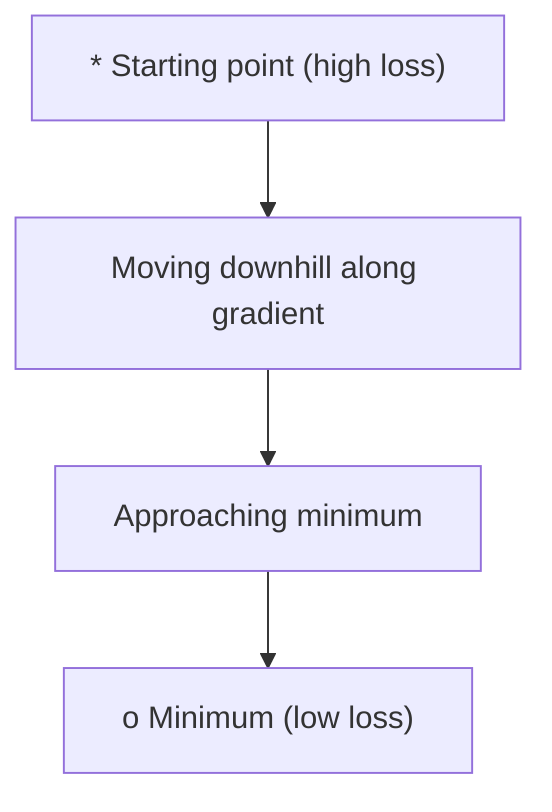
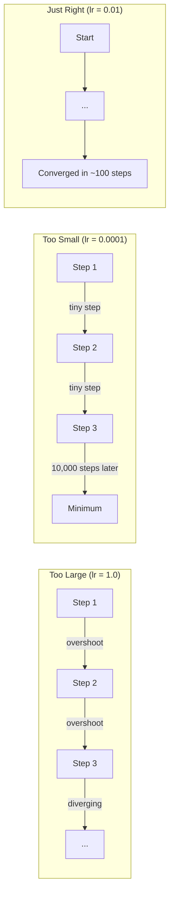
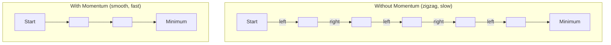
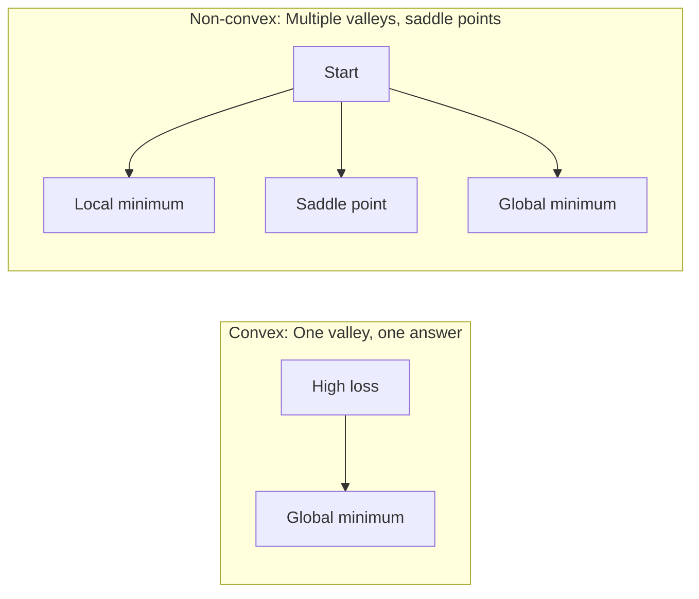
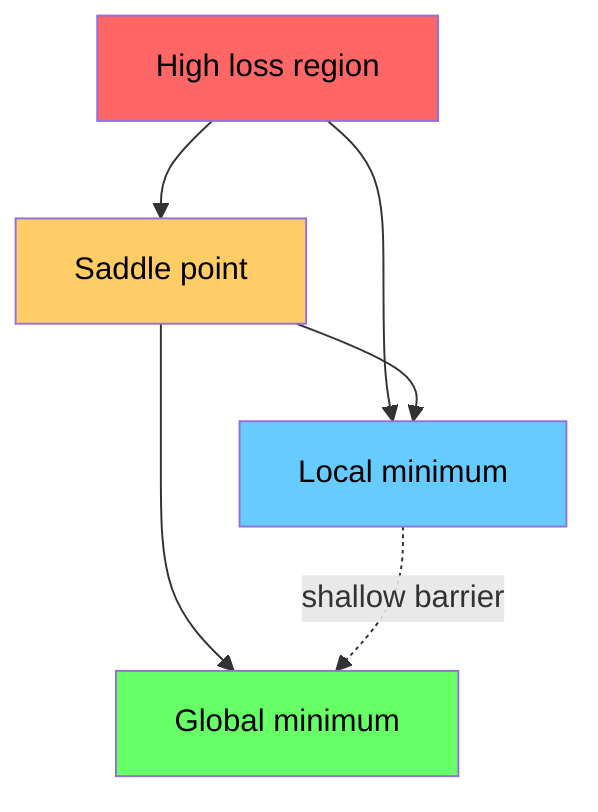

# Tối ưu hóa

> Việc đào tạo mạng lưới thần kinh không còn gì ngoài việc tìm ra đáy của một thung lũng.
> Trình độ thần kinh không còn gì ngoài việc tìm ra điểm thấp nhất của thung lũng.

**Type:** Build | **类型:** 动手
**Language:**Python**语言:**Python
**Prerequisites:** Phase 1, Lessons 04-05 (Derivatives, Gradients) | **前置知识:** Phase 1, Lessons 04-05 (Derivatives, Gradients)
**Time:** ~75 minutes | **时间:** ~75 分钟

## Mục tiêu học tập

- Thực hiện giảm độ sốc vanilla, SGD với động lực, và Adam từ đầu
  Từ 0 thực hiện mức độ khởi nghiệp giảm 带动量的 SGD 和 Adam 优化器
- So sánh sự hội tụ tối ưu hóa trên hàm Rosenbrock và giải thích tại sao Adam thích nghi với tỷ lệ học tập theo trọng lượng
  Trong hàm Rosenbrock  tương đương tính năng của các máy tối ưu hóa, giải thích tại sao Adam cho mỗi quyền tự thích ứng học tốc độ
- Hóa ra sự khác biệt giữa các cảnh thất lạc và không và giải thích vai trò của các điểm sườn ở các chiều cao
  Sự khác biệt giữa các điểm ở không gian cao và các điểm không ở không gian cao
- Thiết lập các lịch trình tốc độ học tập (phân tích bước, khôi phục cosine, ấm lên) để ổn định đào tạo
  配置学习率调度(步衰减、余弦退火、预热) để đảm bảo sự ổn định của tập luyện

> **【中文解读】**
> 训练神经网络就是" tìm điểm thấp nhất của núi"―― hàm mất mát cho bạn biết hiện tại có nhiều sai lầm, gradient cho bạn biết hướng nào có thể làm cho sai lầm nhỏ hơn, tối ưu hóa thiết bị quyết định bạn làm thế nào đi――本章 từ zero thực hiện SGD、Momentum 和 AdamPyTorch ba tối ưu hóa phổ biến nhất――

> **【拓展：优化器在 AI 中的位置】**
> - **SGD**: 最基础优化器, tất cả các " tổ tiên" của优化器.
> - **Adam**Hiện nay, các máy tối ưu hóa phổ biến nhất, tự thích ứng tỷ lệ học + động lượng, gần như đã trở thành lựa chọn mặc định.
> - **学习率调度**: 训练初步用大步长快速接近最优,后期用小步长精细调整;;Cosine Annealing 和 Warmup là chuẩn định cấu trúc của Transformer 训练。

## Vấn đề  vấn đề giới thiệu

Bạn có hàm mất, nó cho bạn biết mô hình của bạn sai như thế nào, bạn có gradient, nó cho bạn biết hướng nào làm cho mất nặng hơn.

> Bạn có hàm mất mát, nó cho bạn biết mô hình có nhiều khác biệt. Bạn có độ lệch, nó cho bạn biết hướng nào để làm cho mất mát lớn hơn. Bây giờ bạn cần một chiến lược hướng xuống đáy.

Cách tiếp cận ngây thơ đơn giản: di chuyển đối diện với gradient. Đánh giá bước bằng một số gọi là tốc độ học tập. Lặp lại. Đây là sự giảm gradient, và nó hoạt động. Nhưng "các công việc" có những cảnh báo. Tốc độ học tập quá cao và bạn vượt qua thung lũng hoàn toàn, nhảy giữa các bức tường. Quá nhỏ và bạn sẽ trượt tới câu trả lời qua hàng ngàn bước không cần thiết. Nhấn vào một điểm saddle và bạn ngừng di chuyển ngay cả khi bạn không tìm thấy một tối thiểu.

> Cách đơn giản rất đơn giản: dọc theo thang ngược hướng di chuyển, bước dài bởi tỷ lệ học tập kiểm soát── liên tục lặp lại── đây là thang giảm── nhưng "有效" là có điều kiện: tỷ lệ học tập quá lớn, bạn sẽ nhảy xuống đáy thung lũng giữa hai bức tường và rung chuyển; quá nhỏ, bạn sẽ leo chậm trong hàng ngàn bước không cần thiết.

Mỗi người tối ưu hóa trong học sâu là câu trả lời cho cùng một câu hỏi: làm thế nào để bạn đi đến đáy thung lũng nhanh hơn và đáng tin cậy hơn?

> Mỗi phương tiện tối ưu hóa trong học sâu đều trả lời cùng một câu hỏi: Làm thế nào để nhanh hơn, đáng tin cậy hơn để đi đến đáy?

> **【中文解读】**Bạn có hàm mất tích (You have a loss function) và độ (You have a lot of errors) và độ (You have a loss function) và độ (You have a loss function) và độ (You have a loss function) và độ (You have a loss function) và độ (You have a loss function) và độ (You have a loss function) và độ (You have a loss function) và độ (You have a loss function) và độ (You have a loss function) và độ (You have a loss function) và độ (You have a loss function) và độ (You have a loss function) và độ (You have a loss function) và độ (You have a loss function) và độ (You have a tendency to make the same errors) ⋅Now you need a strategy (You have to make the same mistakes) ⋅Now you need a strategy (You have to make the same mistakes) ⋅ Now you need a strategy (You have to make the same mistakes) ⋅ Now you need a simple method (You have to make the same mistakes) ⋅ Now you need to make the same strategy (You have to make the same mistakes) ⋅ Now you need to make the same way) ⋅ How can go faster and faster and faster and more quickly (You have to make the same) ⋅ Too small) ⋅ How fast (You can're going to get to the lowest) ⋅ all the same thing (You have to get to the lowest) ⋅ all the same thing (You have to get to the least) ⋅ all the least) ⋅ all the best (You have to get to the least) ⋅ all the least (n = = = = = = = = = = = = = = = = = = = = = = = = = = = = = = = = = = = = = = = = = = = = = = = = = = = = = = = = = = = = = = = = = = = = = = = = = = = = = = = = = = = = = = = = = = = = = = = = = = = = = = = = = = = = = = = = = = = = = = = = = = = = = = = = = = = = = = = = = = = = = = = = = = =

## Khái niệm cốt lõi

### Ưu điểm nghĩa là gì Ưu điểm là gì

Tối ưu hóa là tìm ra các giá trị đầu vào giảm thiểu (hoặc tối đa hóa) một chức năng. Trong học máy, chức năng là mất mát. Các đầu vào là trọng lượng của mô hình.

> 优化就是找到使函数最小化 (或最大化) 的输入值── 在机器学习中,函数是损失函数,输入是模型权重──训练就是优化──

```
minimize L(w) where:
  L = loss function
  w = model weights (could be millions of parameters)
```

> **【拓展：优化是机器学习的引擎】**训练 = 优化――GPT-4 là: sử dụng hàm mất 1,8 tỷ số参数, thông qua Adam 优化器代调整参数, để dự đoán trở nên chính xác hơn――训练 một biến thể lớn có thể cần 10^20 lần FLOPS tính toán, nhưng cốt lõi là hoạt động lặp lại thực hiện`w = w - lr * gradient`

### Tăng dần (vanilla) 梯度下降 (tăng xuống)

Các phương pháp tối ưu hóa đơn giản nhất: tính toán gradient của sự mất mát đối với mỗi trọng lượng.

> : : : : : : : : : : : : : : : : : : : : : : : : : : : : : : : : : : : : : : : : : : : : : : : : : : : : : : : : : : : : : : : : : : : : : : : : : : : : : : : : : : : : : : : : : : : : : : : : : : : : : : : : : : : : : : : : : : : : : : : : : : : : : : : : : : : : : : : : : : : : : : : : : : : : : : : : : : : : : : : : : : : : : : : : : : : :

```
w = w - lr * gradient
```

Đó là toàn bộ thuật toán.

> Đó là một thuật toán hoàn chỉnh.

> **【中文解读】**梯度下降: tính mất tích đối với mỗi thang trọng, theo hướng ngược đi một bước, bước dài bởi kiểm soát tỷ lệ học.`w = w - lr * gradient`, một đường hoàn chỉnh... trực giác: Môn nhìn xuống núi, mỗi bước đều hướng về hướng xuống nhất...



### Tốc độ học tập: siêu tham số quan trọng nhất

Tốc độ học tập kiểm soát kích thước bước. Nó xác định mọi thứ về sự hội tụ.

> Học tập kiểm soát bước tiến, quyết định nhận tất cả mọi thứ.



Không có công thức cho tốc độ học tập đúng. Bạn tìm thấy nó bằng thí nghiệm. Điểm khởi đầu chung: 0,001 cho Adam, 0,01 cho SGD với động lực.

> Không có公式能告诉你正确的学习率──你只能通过实验找到──常见起点:Adam dùng 0.001,SGD với động lực dùng 0.01──

> **【拓展：学习率选择的实践指南】**Học suất là siêu参数 khó调调 nhất. Quy tắc kinh nghiệm: từ 0.001  bắt đầu ([[Adams'默认值]]), quan sát tập luyện曲线.

### SGD vs. lô v. lô nhỏ . SGD vs. lô đầy đủ v. lô nhỏ

Giảm độ vanilla tính toán độ trên toàn bộ bộ bộ dữ liệu trước khi thực hiện một bước.

> Tỷ lệ lượng giảm xuống được sử dụng toàn bộ dữ liệu tính toán trước khi bước đi.

Thấp độ gradient Stochastic (SGD) tính toán gradient trên một mẫu ngẫu nhiên và bước ngay lập tức.

> 随机梯度下降 (SGD) 随机梯度下降 (SGD) 随机梯度下降 (SGD) 随机梯度下降) 随机梯度后立即更新. 噪音大但快──

Giảm độ gradient mini-batch chia khác biệt. tính toán gradient trên một loạt nhỏ (32, 64, 128, 256 mẫu), sau đó bước. Đây là những gì mọi người thực sự sử dụng.

> 小批量梯度下降取折中方案: dùng một批数据 (khá có 32、64、128、256 个样本) tính toán梯度后更新── đây là cách thực tế phổ biến nhất──

| Variant | Batch size | Gradient quality | Speed per step | Noise |
|---------|-----------|-----------------|---------------|-------|
| Batch GD / 全批量 | Entire dataset | Exact / 精确 | Slow / 慢 | None / 无 |
| SGD / 随机 | 1 sample | Very noisy / 噪声大 | Fast / 快 | High / 高 |
| Mini-batch / 小批量 | 32-256 | Good estimate / 好的估计 | Balanced / 均衡 | Moderate / 中等 |

Âm thanh trong SGD và mini-batch không phải là một lỗi. Nó giúp thoát khỏi tối thiểu địa phương nông và các điểm saddle.

> SGD và tiếng ồn trong khối lượng nhỏ không phải là lỗi, nó giúp thoát khỏi giá trị tối thiểu và điểm thấp của tầng địa phương.

> **【中文解读】**三种梯度计算方式:(1) toàn bộ批量 sử dụng toàn bộ dữ liệu tính toán một梯度,准但慢;(2)随机 SGD sử dụng một 条数据计算梯度,快但噪声大;(3) 小批量折中方案, sử dụng 32/64/256 条数据;; thực tế AI 训练中几乎都使用小批量,批量大小是另一个关键超参数──

### Tốc độ: quả bóng xoay xuống đồi

Giảm độ vanilla chỉ nhìn vào độ nghiêng hiện tại. Nếu độ nghiêng (thường xảy ra ở các thung lũng hẹp), tiến độ là chậm.

> Đường độ sơ khai giảm chỉ nhìn vào mức độ hiện tại. Nếu mức độ hình thành (trong thung lũng hẹp), tiến độ chậm.

```
v = beta * v + gradient
w = w - lr * v
```

Tương tự như một quả bóng đang lăn xuống đồi. Nó không dừng lại và khởi động lại ở mỗi đập. Nó tăng tốc độ theo hướng nhất quán và làm giảm dao động.

> 类比: bóng từ dốc rượt xuống. Nó sẽ không dừng lại ở mỗi vị trí cự ly. Nó tích lũy tốc độ theo hướng phù hợp, ức chế rung động.



`beta`(thường là 0.9) kiểm soát bao nhiêu lịch sử để giữ. Beta cao hơn có nghĩa là nhiều động lực hơn, đường đi trơn tru hơn, nhưng phản ứng chậm hơn với thay đổi hướng.

> `beta`(thường là 0,9) kiểm soát giữ lại nhiều lịch sử. Beta cao hơn có nghĩa là động lượng lớn hơn, đường đi trơn tru hơn, nhưng phản ứng với sự thay đổi hướng chậm hơn.

> **【拓展：动量在深度学习中的效果】**动量法让优化"记住" trước đây, giống như quả cầu滚下山坡积累动能.`torch.optim.SGD(lr=0.1, momentum=0.9)`mơtơm = 0,9 là định vị thường dùng.

### Adam: Tỷ lệ học tập thích nghi Adam: Tỷ lệ học tập thích nghi

Một trọng lượng hiếm khi có gradient lớn nên thực hiện các bước lớn hơn khi cuối cùng nó thực hiện. Một trọng lượng mà liên tục có gradient lớn nên thực hiện các bước nhỏ hơn.

> Đánh nặng khác nhau đòi hỏi tỷ lệ học khác nhau. Rất ít người đạt được trọng lượng cao hơn nên tiến bước lớn hơn, tiếp tục đạt được trọng lượng cao hơn nên tiến bước nhỏ hơn.

Adam (Tín tích thời điểm thích ứng) theo dõi hai thứ cho trọng lượng:
  Adam (đồng tính tự ứng) cho mỗi quyền trọng theo dõi hai lượng:

1. Khoảnh khắc đầu tiên (m): trung bình chạy của các gradient (như động lực)
   Một阶矩 (m): 梯度的移动平均(类似动量)
2. Khoảnh khắc thứ hai (v): trung bình chạy của các gradient vuông (tốc độ gradient)
   二阶矩 (v): gradience vuông của chuyển động trung bình

```
m = beta1 * m + (1 - beta1) * gradient
v = beta2 * v + (1 - beta2) * gradient^2

m_hat = m / (1 - beta1^t)    bias correction
v_hat = v / (1 - beta2^t)    bias correction

w = w - lr * m_hat / (sqrt(v_hat) + epsilon)
```

Sự phân chia của `sqrt(v_hat)`là thông tin quan trọng. trọng lượng với gradient lớn được chia bằng một số lớn (phát hiệu quả nhỏ). trọng lượng với gradient nhỏ được chia bằng một số nhỏ (phát hiệu quả lớn).

> Ngoài ra`sqrt(v_hat)`là quan trọng trong việc nhìn thấy. Mỗi quyền được tự thích ứng học tập.

Các siêu tham số mặc định: `lr=0.001, beta1=0.9, beta2=0.999, epsilon=1e-8`Những mặc định này hoạt động tốt cho hầu hết các vấn đề.

> 默认超参数:`lr=0.001, beta1=0.9, beta2=0.999, epsilon=1e-8` Những giá trị ẩn trên hầu hết các vấn đề đều có hiệu quả

> **【中文解读】**Adam = Momentum + tự thích ứng học tốc độ. Nó cho mỗi tham số duy trì độc lập "tốc độ", tùy theo thang lịch sử tự điều chỉnh bước dài.`torch.optim.Adam(lr=0.001)`几乎是默认选择――

### - Định hướng học tập

Một tốc độ học tập cố định là một sự thỏa hiệp. Đầu tiên trong đào tạo, bạn muốn có những bước lớn để tiến bộ nhanh chóng.

> 定定学习率是折中方案──训练早期需要大步快进步,训练后期需要小步精细调──

Các lịch trình chung:
  常见调度方式:

| Schedule / 调度方式 | Formula / 公式 | Use case / 使用场景 |
|----------|---------|----------|
| Step decay / 步衰减 | lr = lr * factor every N epochs | Simple, manual control / 简单手动控制 |
| Exponential decay / 指数衰减 | lr = lr_0 * decay^t | Smooth reduction / 平滑递减 |
| Cosine annealing / 余弦退火 | lr = lr_min + 0.5 * (lr_max - lr_min) * (1 + cos(pi * t / T)) | Transformers, modern training / Transformer、现代训练 |
| Warmup + decay / 预热+衰减 | Linear ramp up, then decay | Large models, prevents early instability / 大模型，防止早期不稳定 |

### Convex vs non-convex 凸优化 vs non-凸优化

Một hàm ngọc có một tối thiểu.`f(x) = x^2`là tròn.

> 凸函数 chỉ có một giá trị tối thiểu, gradi gradience downwards总能找到──像 `f(x) = x^2`Như vậy hàm thứ hai là con số của...

Các chức năng mất mạng thần kinh không phải ngọc. Chúng có nhiều mức tối thiểu địa phương, điểm saddle và khu vực phẳng.

> Các hàm mất mát của mạng thần kinh không rõ ràng, có nhiều điểm tối thiểu ở vùng bình tĩnh.



Trong thực tế, các mức tối thiểu địa phương trong các mạng thần kinh chiều cao hiếm khi là một vấn đề. Hầu hết các mức tối thiểu địa phương có giá trị mất gần mức tối thiểu toàn cầu. Các điểm lúa (vượt bằng một số hướng, cong trong những hướng khác) là trở ngại thực sự. Tốc độ và tiếng ồn từ các loạt nhỏ giúp thoát khỏi chúng.

> Trong thực tế, giá trị tối thiểu ở các mạng thần kinh cao rất ít là vấn đề. Khối thiểu của hầu hết các giá trị tối thiểu ở các vị trí gần với giá trị tối thiểu toàn bộ.

> **【拓展：神经网络的损失曲面为什么是非凸的】**Phụng tích mất mát của đường dẫn trở lại là cao hơn một chút (với chỉ có một điểm thấp nhất, chắc chắn có thể tìm thấy), nhưng các đường nét mất mát của mạng thần kinh có vô số điểm thấp nhất và điểm thấp nhất ở địa phương. Trong không gian tham số 100.000 dimension, các điểm tăng lên và giảm ở một số chiều cao) nhiều hơn các điểm thấp nhất ở địa phương.

### mất hình ảnh cảnh quan mất hình ảnh

Loss là một chức năng của tất cả các trọng lượng. Đối với một mô hình với 1 triệu trọng lượng, cảnh quan mất mát sống trong không gian 1.000,001 chiều. Chúng tôi hình dung nó bằng cách chọn hai hướng ngẫu nhiên trong không gian trọng lượng và vẽ mất mát dọc theo những hướng đó, tạo ra một bề mặt 2D.

> Lối mất là hàm của trọng lượng sở hữu. Đối với 100 triệu mô hình trọng lượng, lỗ hổng có ở 1.000.000.000 维空间. Chúng ta chọn hai hướng tùy ý trong không gian trọng lượng, theo những hướng này vẽ mất mát để hình dung, nhận được 2D 曲面.



Các mức độ tối thiểu sắc nét phổ biến kém. mức độ tối thiểu phẳng phổ biến tốt. Đây là một lý do SGD với động lực thường vượt trội hơn Adam về độ chính xác thử nghiệm cuối cùng: tiếng ồn của nó ngăn chặn việc định cư vào mức độ tối thiểu sắc nét.

> Sự khác biệt về khả năng phổ biến tối thiểu của thép, giá trị phổ biến tối thiểu của thép tốt. Đây là một trong những lý do SGD với động lực thường xuyên vượt trội hơn Adam trong độ chính xác thử nghiệm cuối cùng: tiếng ồn của nó ngăn chặn rơi vào giá trị tối thiểu của thép.
```figure
gradient-descent
```

## Hãy xây dựng nó

## Hãy xây dựng nó.

### Bước 1: Định nghĩa một hàm thử nghiệm.

Hàm Rosenbrock là một chuẩn tối ưu hóa cổ điển. Điểm tối thiểu của nó là (1, 1) bên trong một thung lũng cong hẹp dễ tìm thấy nhưng khó theo dõi.

> Hàm Rosenbrock là cơ sở tối ưu hóa cổ điển. Giá trị tối thiểu của nó là (1, 1), nằm trong một thung lũng hẹp dễ tìm thấy nhưng khó theo dõi.

```
f(x, y) = (1 - x)^2 + 100 * (y - x^2)^2
```

```python
def rosenbrock(params):
    x, y = params
    return (1 - x) ** 2 + 100 * (y - x ** 2) ** 2

def rosenbrock_gradient(params):
    x, y = params
    df_dx = -2 * (1 - x) + 200 * (y - x ** 2) * (-2 * x)
    df_dy = 200 * (y - x ** 2)
    return [df_dx, df_dy]
```

### Bước 2: Giảm độ vanilla

```python
class GradientDescent:
    def __init__(self, lr=0.001):
        self.lr = lr

    def step(self, params, grads):
        return [p - self.lr * g for p, g in zip(params, grads)]
```

### Bước 3: SGD với động lực.

```python
class SGDMomentum:
    def __init__(self, lr=0.001, momentum=0.9):
        self.lr = lr
        self.momentum = momentum
        self.velocity = None

    def step(self, params, grads):
        if self.velocity is None:
            self.velocity = [0.0] * len(params)
        self.velocity = [
            self.momentum * v + g
            for v, g in zip(self.velocity, grads)
        ]
        return [p - self.lr * v for p, v in zip(params, self.velocity)]
```

### Bước 4: Adam Bước 4: Adam  Optimizer

```python
class Adam:
    def __init__(self, lr=0.001, beta1=0.9, beta2=0.999, epsilon=1e-8):
        self.lr = lr
        self.beta1 = beta1
        self.beta2 = beta2
        self.epsilon = epsilon
        self.m = None
        self.v = None
        self.t = 0

    def step(self, params, grads):
        if self.m is None:
            self.m = [0.0] * len(params)
            self.v = [0.0] * len(params)

        self.t += 1

        self.m = [
            self.beta1 * m + (1 - self.beta1) * g
            for m, g in zip(self.m, grads)
        ]
        self.v = [
            self.beta2 * v + (1 - self.beta2) * g ** 2
            for v, g in zip(self.v, grads)
        ]

        m_hat = [m / (1 - self.beta1 ** self.t) for m in self.m]
        v_hat = [v / (1 - self.beta2 ** self.t) for v in self.v]

        return [
            p - self.lr * mh / (vh ** 0.5 + self.epsilon)
            for p, mh, vh in zip(params, m_hat, v_hat)
        ]
```

### Bước 5: Đi và so sánh.

```python
def optimize(optimizer, func, grad_func, start, steps=5000):
    params = list(start)
    history = [params[:]]
    for _ in range(steps):
        grads = grad_func(params)
        params = optimizer.step(params, grads)
        history.append(params[:])
    return history

start = [-1.0, 1.0]

gd_history = optimize(GradientDescent(lr=0.0005), rosenbrock, rosenbrock_gradient, start)
sgd_history = optimize(SGDMomentum(lr=0.0001, momentum=0.9), rosenbrock, rosenbrock_gradient, start)
adam_history = optimize(Adam(lr=0.01), rosenbrock, rosenbrock_gradient, start)

for name, history in [("GD", gd_history), ("SGD+M", sgd_history), ("Adam", adam_history)]:
    final = history[-1]
    loss = rosenbrock(final)
    print(f"{name:6s} -> x={final[0]:.6f}, y={final[1]:.6f}, loss={loss:.8f}")
```

Tạo ra dự kiến: Adam hội tụ nhanh nhất. SGD với động lực theo một con đường mượt mà hơn. Vanilla GD tiến chậm dọc theo thung lũng hẹp.

> 预期输出:Adam 收最快,SGD với động lực 路径更平滑,原始 GD 在狭谷中进展缓慢──

## Hãy sử dụng nó để thực hiện

Trong thực tế, sử dụng máy tối ưu hóa PyTorch hoặc JAX. Chúng xử lý các nhóm tham số, suy giảm trọng lượng, cắt gradient và tăng tốc GPU.

> Trong thực tế, sử dụng PyTorch hoặc JAX các tối ưu hóa.

> **【中文解读】**PyTorch 中优化器的标准使用法:`optimizer = torch.optim.Adam(model.parameters(), lr=0.001)`, rồi trong vòng tròn tập luyện`optimizer.zero_grad()`→ `loss.backward()`→ `optimizer.step()`                                                                                                                                                                                                                                                              

```python
import torch

model = torch.nn.Linear(784, 10)

sgd = torch.optim.SGD(model.parameters(), lr=0.01, momentum=0.9)
adam = torch.optim.Adam(model.parameters(), lr=0.001)
adamw = torch.optim.AdamW(model.parameters(), lr=0.001, weight_decay=0.01)

scheduler = torch.optim.lr_scheduler.CosineAnnealingLR(adam, T_max=100)
```

Quy tắc của ngón tay:
  经验法则:

- Bắt đầu với Adam (lr=0.001). Nó hoạt động cho hầu hết các vấn đề mà không cần điều chỉnh.
  Từ Adam (lr=0.001)  bắt đầu, không cần phải điều chỉnh即可解决大多数问题.
- Chuyển sang SGD với động lực (lr=0,01, động lực=0,9) khi bạn cần độ chính xác cuối cùng tốt nhất và có thể đủ khả năng điều chỉnh nhiều hơn.
  Khi cần tối đa độ chính xác và có thể chịu đựng nhiều điều chỉnh hơn, chuyển sang SGD với động lực.
- Sử dụng AdamW (Adam với sự suy giảm trọng lượng tách rời) cho các bộ biến đổi.
  Transformer 模型 sử dụng AdamW(带解权重衰减的Adam)
- Luôn sử dụng một lịch trình học tập tốc độ cho đào tạo kéo dài hơn một vài thời kỳ.
  训练 qua nhiều thời đại 时始终使用学习率调度。
- Nếu đào tạo không ổn định, hãy giảm tốc độ học tập.
   tập không ổn định, giảm tỷ lệ học, tập quá chậm, tăng tỷ lệ học đại học.

## Chuyển nó đi.

Bài học này tạo ra một lời nhắc để chọn máy tối ưu hóa phù hợp.`outputs/prompt-optimizer-guide.md`- Tôi không biết.

> Bài viết này được viết bởi:`outputs/prompt-optimizer-guide.md`

Các lớp tối ưu hóa được xây dựng ở đây xuất hiện lại trong giai đoạn 3 khi chúng ta đào tạo một mạng lưới thần kinh từ đầu.

> Các loại tối ưu hóa được xây dựng trong đây sẽ xuất hiện một lần nữa trong giai đoạn 3 từ mạng lưới thần kinh luyện tập không.

## Tập luyện bài tập

1. **Learning rate sweep.**Thực hiện giảm gradient vanilla trên hàm Rosenbrock với tỷ lệ học tập [0.0001, 0.0005, 0.001, 0.005, 0.01].
   **学习率扫描。**Sử dụng tỷ lệ học khác nhau [0.0001, 0.0005, 0.001, 0.005, 0.01] trên hàm Rosenbrock 运行原始梯度下降──打印每学习率 5000 步后的最终损失──找到仍能收的最大学习率──

2. **Momentum comparison.**Thực hiện SGD với giá trị động lực [0,0,0,5,0,9,0,99] trên hàm Rosenbrock. Theo dõi sự mất mát ở mỗi bước. giá trị động lực hội tụ nhanh nhất?
   **动量比较。**Sử dụng các động lượng khác nhau [0.0, 0.5, 0.9, 0.99] Trong hàm Rosenbrock  chạy SGD  theo dõi mỗi bước của mất  Which động lượng value gets  fastest? Which will over冲?

3. **Saddle point escape.**Định nghĩa chức năng `f(x, y) = x^2 - y^2`Hãy so sánh cách vanilla GD, SGD với động lực, và Adam cư xử.
   **鞍点逃逸。**定义函数 `f(x, y) = x^2 - y^2`(原点处有点) ――从 (0.01, 0.01) 开始──比较原始 GD、SGD với động lực 和 Adam's behavior──哪个能逃出点?

4. **Implement learning rate decay.**Thêm một lịch trình phân rã theo hàm số cao vào lớp GradientDescent: `lr = lr_0 * 0.999^step`So sánh sự hội tụ với và không phân rã trên hàm Rosenbrock.
   **实现学习率衰减。**Trong các loại n chỉ số giảm n:`lr = lr_0 * 0.999^step`                                                                                                                                                                                                                                                              

## Từ khóa  Từ khóa nhanh chóng

| Term / 术语 | What people say | What it actually means / 实际含义 |
|------|----------------|----------------------|
| Gradient descent / 梯度下降 | "Go downhill" | Update weights by subtracting the gradient scaled by the learning rate. The most basic optimizer. / 用学习率缩放梯度后从权重中减去，更新权重。最基础的优化器。 |
| Learning rate / 学习率 | "Step size" | A scalar that controls how far each update moves the weights. Too large causes divergence. Too small wastes compute. / 控制每次更新移动多远的标量。太大导致发散，太小浪费算力。 |
| Momentum / 动量 | "Keep rolling" | Accumulate past gradients into a velocity vector. Dampens oscillations and accelerates movement through consistent directions. / 将历史梯度累积到速度向量中。抑制震荡，在一致方向上加速。 |
| SGD / 随机梯度下降 | "Random sampling" | Stochastic gradient descent. Compute gradient on a random subset instead of the full dataset. Almost always means mini-batch SGD in practice. / 随机梯度下降。在随机子集上计算梯度。实践中几乎都指小批量 SGD。 |
| Mini-batch / 小批量 | "A chunk of data" | A small subset of training data (32-256 samples) used to estimate the gradient. Balances speed and gradient accuracy. / 训练数据的小子集（32-256 个样本），用于估计梯度。平衡速度和梯度精度。 |
| Adam / Adam 优化器 | "The default optimizer" | Adaptive Moment Estimation. Tracks per-weight running averages of gradients and squared gradients to give each weight its own learning rate. / 自适应矩估计。跟踪每个权重的梯度和平方梯度的移动平均，为每个权重提供独立的学习率。 |
| Bias correction / 偏差校正 | "Fix the cold start" | Adam's first and second moments are initialized to zero. Bias correction divides by (1 - beta^t) to compensate during early steps. / Adam 的一阶和二阶矩初始化为零。偏差校正除以 (1 - beta^t) 来补偿早期步骤。 |
| Learning rate schedule / 学习率调度 | "Change lr over time" | A function that adjusts the learning rate during training. Large steps early, small steps late. / 训练过程中调整学习率的函数。早期大步，后期小步。 |
| Convex function / 凸函数 | "One valley" | A function where any local minimum is the global minimum. Gradient descent always finds it. Neural network losses are not convex. / 任何局部最小值都是全局最小值的函数。梯度下降总能找到。神经网络损失不是凸的。 |
| Saddle point / 鞍点 | "Flat but not a minimum" | A point where the gradient is zero but it is a minimum in some directions and a maximum in others. Common in high dimensions. / 梯度为零但在某些方向是最小值、某些方向是最大值的点。在高维中常见。 |
| Loss landscape / 损失曲面 | "The terrain" | The loss function plotted over weight space. Visualized by slicing along two random directions. / 在权重空间上绘制的损失函数。通过沿两个随机方向切片来可视化。 |
| Convergence / 收敛 | "Getting there" | The optimizer has reached a point where further steps do not meaningfully reduce the loss. / 优化器已到达一个点，进一步步进不会显著降低损失。 |

## Xem thêm 延伸阅读

- [Sebastian Ruder: An overview of gradient descent optimization algorithms](https://ruder.io/optimizing-gradient-descent/)- khảo sát toàn diện của tất cả các nhà tối ưu hóa chính
  梯度下降优化算法综述, toàn diện bao gồm tất cả các trình ưu hóa chính
- [Why Momentum Really Works (Distill)](https://distill.pub/2017/momentum/)- hình ảnh tương tác của động lực động lực
  Tại sao động lượng hiệu quả, tương tác của động lượng động lượng
- [Adam: A Method for Stochastic Optimization (Kingma & Ba, 2014)](https://arxiv.org/abs/1412.6980)- giấy Adam gốc, có thể đọc được và ngắn gọn
  Adam 原始论文, có thể đọc và ngắn gọn
- [Visualizing the Loss Landscape of Neural Nets (Li et al., 2018)](https://arxiv.org/abs/1712.09913)- tờ báo cho thấy mức tối thiểu sắc nét vs. phẳng
  展示尖与平坦最小值论文
