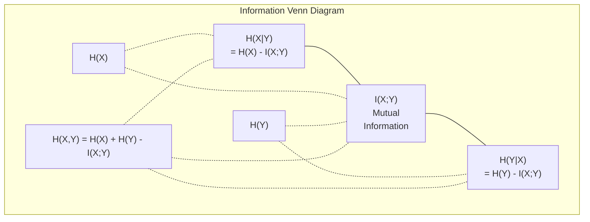

# Lý thuyết thông tin

> Lý thuyết thông tin đo lường sự ngạc nhiên.
> 信息论衡惊喜程度──损失函数建立在它──

**Type:** Learn | **类型:** 学习
**Language:**Python**语言:**Python
**Prerequisites:** Phase 1, Lesson 06 (Probability) | **前置知识:** Phase 1, Lesson 06 (Probability)
**Time:** ~60 minutes | **时间:** ~60 分钟

## Mục tiêu học tập

- Xét entropy, cross-entropy, và KL divergence từ đầu và giải thích mối quan hệ của họ
  Từ zero tính toán 、交叉  và KL 散度, giải thích mối quan hệ giữa chúng
- Kết luận tại sao giảm thiểu tổn thất entropy chéo tương đương với tối đa hóa xác suất log
  推导为什么最小化交叉损失等于最大化对数似然
- Xét thông tin lẫn nhau giữa các tính năng và mục tiêu để xếp hạng tầm quan trọng của tính năng
   tính toán tính chất và mục tiêu liên quan đến thông tin để xếp hạng tính chất
- Giải thích sự phức tạp như kích thước từ vựng hiệu quả mà mô hình ngôn ngữ chọn từ
  解释困惑度作为语言模型选择的有效词汇量

> **【中文解读】**
> 信息论衡量"惊喜程度"越不可能发生事件,包含信息量越大──交叉损失函数、KL 散度、困惑度(困惑度)这些概念统一在信息论的框架下──

> **【拓展：信息论在 AI 中的位置】**
> - **交叉熵损失**: 所有分类模型和语言模型的标准损失函数`CrossEntropyLoss`(■)
> - **KL 散度**: Một trong các hàm mất mát của VAE, lõi của kiến thức, mục tiêu đào tạo của mô hình thưởng trong RLHF.
> - **困惑度(Perplexity)**语言模型的评价标准,越低越好,表示模型对下一个词的预测越确定──

## Vấn đề  vấn đề giới thiệu

> **【中文解读】**Bạn đang tập luyện phân loại mô hình khi điều chỉnh `CrossEntropyLoss()`Trong các bài luận về mô hình ngôn ngữ, thấy "sự bối rối", gặp gỡ KL 散度 trong VAE、蒸、RLHF──These are not independent conceptsthey are the same source concepts of information theory, they are merely changing different hats── hiểu về chủ đề thông tin, hãy nhìn qua các khái niệm này.

## Khái niệm cốt lõi

> **【拓展：Shannon 与信息论的诞生】**Năm 1948 Claude Shannon xuất bản thuyết toán học của truyền thông, đưa ra một khuôn khổ đo lường thông tin bằng bit. 80 năm sau, khuôn khổ này trở thành nền tảng của AI:交叉 là hàm mất của tất cả các phân loại và mô hình ngôn ngữ, KL 散度 là mô hình tạo ra (VAE 散播 mô hình), mục tiêu đào tạo của mô hình, thông tin lẫn nhau là một công cụ lựa chọn đặc điểm.

### Nội dung thông tin (Phán ngạc nhiên) 信息量(惊喜度)

Khi một điều gì đó không có khả năng xảy ra, nó mang lại nhiều thông tin hơn.

> Khi những điều không thể xảy ra, nó mang lại nhiều thông tin hơn.

Nội dung thông tin của một sự kiện có khả năng p là:
  概率为 p 的事件的信息量为:

```
I(x) = -log(p(x))
```

Sử dụng log base 2 cho bạn bit, sử dụng log tự nhiên cho bạn nats, cùng một ý tưởng, đơn vị khác nhau.
  Sử dụng 2 đối số dưới cùng được bit), sử dụng tự nhiên đối số được các nát.

```
Event              Probability    Surprise (bits)
Fair coin heads    0.5            1.0
Rolling a 6        0.167          2.58
1-in-1000 event    0.001          9.97
Certain event      1.0            0.0
```

Một số sự kiện không có thông tin nào, bạn đã biết chúng sẽ xảy ra.
> Sự kiện nhất định mang theo không thông tin.

###                                                                                                                                                                                                                                                               

Entropy là sự bất ngờ mong đợi trên tất cả các kết quả có thể của một phân phối.
>  là sự kỳ vọng và sự ngạc nhiên về tất cả những kết quả có thể được phân phối.

```
H(P) = -sum( p(x) * log(p(x)) )  for all x
```

Một đồng xu công bằng có entropy tối đa cho một biến nhị phân: 1 bit. Một đồng xu thiên vị (99% đầu) có entropy thấp: 0,08 bit. Bạn đã biết điều gì sẽ xảy ra, vì vậy mỗi lần lùi cho bạn biết hầu như không có gì.
> Đồng xu trung bình đối với biến đổi 2元 có tối đa 1 比特──偏置硬币(99% 正面) 的很低:0.08 比特──你已经知道会发生什么,所以每次抛币几乎没有提供新信息──

```
Fair coin:    H = -(0.5 * log2(0.5) + 0.5 * log2(0.5)) = 1.0 bit
Biased coin:  H = -(0.99 * log2(0.99) + 0.01 * log2(0.01)) = 0.08 bits
```

Entropy đo lường sự không chắc chắn không thể giảm trong phân bố.
>  Đánh giá phân bố không thể giảm thiểu của sự không chắc chắn.

### Cross-Entropy (The Loss Function You Use Every Day) 交叉((((((((((((((((((((((((((((((((((((((((((((((((((((((((((((((((((((((((((((((((((((((((((((((((((((((((((((((((((((((((((((((((((((((((((((((((((((((((((((((((((((((((((((((((((((((((((((((((((((((((((((((((((((((((((((((((((((((((((((((((((((((((((((((((((((((((((((((((((((((((((((((((((((((((((((((((((((((((((((((((((((((((((((((((((((((((((((((((((((((((((((((((((((((((((((((((((((((((((((((((((((((((((((((((((((((((((((((((((((((((((((((((((((((((((((((((((((((((((((((((((((((((((

Cross-entropy đo lường sự ngạc nhiên trung bình khi bạn sử dụng phân phối Q để mã hóa các sự kiện thực sự đến từ phân phối P.
> 交叉 đo lường sử dụng phân phối Q 编码 thực tế để tự lập P của sự kiện 

```
H(P, Q) = -sum( p(x) * log(q(x)) )  for all x
```

P là phân bố thực (chữ liệu). Q là dự đoán của mô hình của bạn. Nếu Q phù hợp hoàn hảo với P, sự thấu trăng bằng entropy. Bất kỳ sự không phù hợp nào sẽ làm cho nó lớn hơn.
> P là phân bố thực sự, Q là dự đoán của mô hình. Nếu Q hoàn hảo phù hợp với P, giao thông tương đương với.

Trong phân loại, P là một vector nóng (tầng thực có xác suất 1, mọi thứ khác là 0). Điều này đơn giản hóa sự chéo entropy thành:
> Trong phân loại, P là một-hót 向量(真实类概率为 1,其余为 0) ;;

```
H(P, Q) = -log(q(true_class))
```

Đó là toàn bộ công thức mất lượng trần trần để phân loại.
> Đây là công thức mất tích hoàn chỉnh của phân loại.

### KL Divergence (Tây cách giữa phân phối)

KL khác biệt đo lường mức độ bất ngờ thêm bạn nhận được khi sử dụng Q thay vì P.
> KL 散度衡 sử dụng Q 代替 P 时多出的惊喜度──

```
D_KL(P || Q) = sum( p(x) * log(p(x) / q(x)) )  for all x
             = H(P, Q) - H(P)
```

Cross-entropy là entropy cộng với sự phân chia KL. Vì entropy của sự phân bố thực là không đổi trong quá trình tập luyện, giảm thiểu cross-entropy là giống như giảm thiểu sự phân chia KL. Bạn đang đẩy phân bố mô hình của bạn về phía sự phân bố thực.
> 交叉 =  + KL 散度──由于 thực sự phân bố trong quá trình đào tạo là thường xuyên, tối thiểu hóa交叉等价格于最小化 KL 散度──你在把模型分布推向真实分布──

KL divergence không đối xứng: D_KL(P  Q) != D_KL(Q  P). Nó không phải là một thước đo khoảng cách thực.
> KL 散度不对称:D_KL  P_  Q) != DKL  Q                                                                                                                                                                                                                                                 

### Thông tin lẫn nhau.

Thông tin lẫn nhau đo lường biết một biến cho bạn biết bao nhiêu về một biến khác.
> 互信息衡量知道一个变量后能告诉你关于另一个变量多少信息──

```
I(X; Y) = H(X) - H(X|Y)
        = H(X) + H(Y) - H(X, Y)
```

Nếu X và Y độc lập, thông tin chung là không. Biết một không nói gì về người khác. Nếu chúng tương quan hoàn hảo, thông tin chung bằng entropi của bất kỳ biến nào.
> Nếu X và Y 独立,互信息为零――知道一个不能告诉你关于另一个任何信息―― nếu hoàn toàn liên quan,互信息等于任一变量──

Trong việc lựa chọn tính năng, thông tin lẫn nhau cao giữa một tính năng và mục tiêu có nghĩa là tính năng đó hữu ích.
> Trong lựa chọn đặc điểm, thông tin tương tác cao giữa đặc điểm và mục tiêu có nghĩa là đặc điểm hữu ích.

### - Tâm nhập điều kiện.

H(Y trong X) đo mức độ không chắc chắn về Y sau khi bạn quan sát X.
> H(Y trongX)  đo lường trong quan sát X ếch về Y còn nhiều sự không chắc chắn.

```
H(Y|X) = H(X,Y) - H(X)
```

Hai cực đoan:
  两个极端:

- Nếu X hoàn toàn xác định Y, thì H(Y ≠X) = 0. Biết X loại bỏ tất cả sự không chắc chắn về Y. Ví dụ: X = nhiệt độ ở độ C, Y = nhiệt độ ở độ Fahrenheit.
  Nếu X hoàn toàn quyết định Y, thì H(Y cũng không X) = 0── biết X  xóa bỏ tất cả sự không chắc chắn về Y──
- Nếu X không nói gì với bạn về Y, thì H(YX ải) = H(Y). Biết X không làm giảm sự không chắc chắn của bạn. Ví dụ: X = đánh đồng, Y = thời tiết ngày mai.
  Nếu X đối với Y không có bất kỳ thông tin nào, thì H(YX là) = H(Y) ―― biết X 完全不减少不确定性──

Entropy có điều kiện luôn không âm và không bao giờ vượt quá H(Y):
> 条件始终非负且不超过 H(Y):

```
0 <= H(Y|X) <= H(Y)
```

Trong máy học, entropy có điều kiện xuất hiện trong các cây quyết định. Tại mỗi chia, thuật toán chọn tính năng X làm giảm thiểu H(Y) - tính năng loại bỏ sự không chắc chắn nhất về nhãn Y.
> Trong học máy, điều kiện xuất hiện trong cây quyết định. Mỗi lần phân chia, thuật toán chọn H  Y X) là đặc điểm nhỏ nhất có thể loại bỏ các đặc điểm không chắc chắn.

### Thêm vào, chúng ta đã có thể cùng nhau.

H ((X,Y) là entropy của phân phối chung của X và Y cùng nhau.
> H(X,Y) là X 和 Y 联合分布的──

```
H(X,Y) = -sum sum p(x,y) * log(p(x,y))   for all x, y
```

Cất lượng chính:
  关键性质:

```
H(X,Y) <= H(X) + H(Y)
```

Sự bình đẳng tồn tại khi X và Y độc lập. Nếu họ chia sẻ thông tin, entropy chung là ít hơn tổng của entropy riêng lẻ. entropy "không còn" chính xác là thông tin lẫn nhau.
> Khi X và Y 独立时等号成立──如果它们共享信息,联合小于各自之和──"缺失"的恰好是互信息──



Các mối quan hệ:
  关系式:

- H(X,Y) = H(X) + H(Y
- (X;Y) = H(X) - H(IX
- H(X,Y) = H(X) + H(Y) - I(X;Y)

### Thông tin lẫn nhau (Deep Dive) 互信息(深入理解)

Thông tin lẫn nhau I(X;Y) định lượng mức độ biết một biến làm giảm sự không chắc chắn về biến khác.
> 互信息 I(X;Y) 量化知道一个变量后对另一个变量不确定性的减少量──

```
I(X;Y) = H(X) - H(X|Y)
       = H(Y) - H(Y|X)
       = H(X) + H(Y) - H(X,Y)
       = sum sum p(x,y) * log(p(x,y) / (p(x) * p(y)))
```

Các tính chất:
  性质:

- I ((X;Y) >= 0 luôn luôn. Bạn không bao giờ mất thông tin bằng cách quan sát một cái gì đó.
  I(X;Y) >= 0 始终成立──观察事物永远不会丢失信息──
- I(X;Y) = 0 nếu và chỉ khi X và Y độc lập.
  I(X;Y) = 0 当且仅当 X 和 Y 独立。
- I(X;Y) = I(Y;X). Nó là đối xứng, không giống như sự phân biệt KL.
  I(X;Y) = I(Y;X)。 nó là đối称的, khác với KL 散度。
- I ((X;X) = H ((X). Một biến chia sẻ tất cả thông tin của nó với chính nó.
  I(X;X) = H(X)。 biến量与自身共享所有信息──

**Mutual information for feature selection.**Trong ML, bạn muốn các tính năng có thông tin về mục tiêu. Thông tin chung cho bạn một cách định nghĩa để xếp hạng các tính năng:
> **互信息用于特征选择。**Trong học máy, bạn cần có các tính năng có chứa thông tin về mục tiêu. Thông tin lẫn nhau cung cấp một cách có nguyên tắc để sắp xếp các tính năng:

1. Đối với mỗi tính năng X_i, tính toán I(X_i; Y) nơi Y là biến mục tiêu.
   Đối với mỗi đặc điểm X_i, tính I(X_i; Y), trong đó Y là mục tiêu biến số.
2. Các tính năng xếp hạng theo điểm MI.
   按MI 得分排序特征──
3. Giữ các tính năng k trên.
   Bảo trì trước k 个特征

Điều này hoạt động cho bất kỳ mối quan hệ nào giữa tính năng và mục tiêu -- tuyến tính, không tuyến tính, đơn điệu, hay không. Sự tương quan chỉ bắt được mối quan hệ tuyến tính. MI bắt được mọi thứ.
> Điều này áp dụng cho bất kỳ mối quan hệ nào giữa các đặc điểm và mục tiêu  tuyến tính, không tuyến tính, đơn giản hoặc không đơn giản.

| Method / 方法 | Detects / 检测 | Computational cost / 计算成本 | Handles categorical? / 处理类别型？ |
|--------|---------|-------------------|---------------------|
| Pearson correlation / 皮尔逊相关 | Linear relationships / 线性关系 | O(n) | No / 否 |
| Spearman correlation / 斯皮尔曼相关 | Monotonic relationships / 单调关系 | O(n log n) | No / 否 |
| Mutual information / 互信息 | Any statistical dependency / 任何统计依赖 | O(n log n) with binning | Yes / 是 |

### Label Smoothing và Cross-Entropy 标签平滑与交叉

Phân loại tiêu chuẩn sử dụng các mục tiêu cứng: [0, 0, 1, 0].
> 标准分类使用硬目标:[0, 0, 1, 0]──真实类概率为 1,其余为 0──标签平滑将其替换为软目标:

```
soft_target = (1 - epsilon) * hard_target + epsilon / num_classes
```

Với epsilon = 0,1 và 4 lớp:
  当 epsilon = 0.1 且有4 个类别时:

- Mục tiêu cứng: [0, 0, 1, 0]
- Mục tiêu mềm: [0,025, 0,025, 0,925, 0,025]

Từ quan điểm lý thuyết thông tin, thanh trơn nhãn làm tăng sự phân phối mục tiêu. Các mục tiêu cứng một nóng có entropy 0 - không có sự không chắc chắn. Các mục tiêu mềm có entropy tích cực.
> Từ góc độ quan điểm thông tin, việc bình đẳng nhãn tăng mục tiêu phân phối ── cứng one-hot 目标的为 0无不确定性──软目标有正──

Tại sao điều này giúp ích:
  Tại sao nó giúp ích:

- Thiết lập các mô hình từ việc dẫn các logit đến các giá trị cực đoan (những logit vô hạn sẽ cần thiết để phù hợp hoàn hảo với một mục tiêu nóng trong khi giao hợp entropy)
  防止模型将 logits 推到极端值
- Hành động như một sự thường xuyên hóa: mô hình không thể 100% tự tin
  Như một quy tắc: mô hình không thể tự tin 100%
- Cải thiện hiệu chuẩn: xác suất dự đoán phản ánh tốt hơn sự không chắc chắn thực sự
  改善校准:预测概率更好地反映真实不确定性
- Giảm khoảng cách giữa việc đào tạo và hành vi suy luận
  Giảm sự khác biệt giữa hành vi huấn luyện và suy đoán

Sự mất entropy chéo với thanh thản nhãn trở thành:
> 带标签平滑的交叉损失为:

```
L = (1 - epsilon) * CE(hard_target, prediction) + epsilon * H_uniform(prediction)
```

Thuật ngữ thứ hai trừng phạt những dự đoán không đồng nhất -- một sự điều chỉnh trực tiếp về sự tin tưởng.
> Thứ hai là hình phạt về việc trực tiếp chuẩn hóa sự tin tưởng.

### Tại sao Cross-Entropy là sự mất cấp độ Tại sao giao thông là một loại tiêu chuẩn mất cấp độ

Ba quan điểm, cùng kết luận.
> 三个视角,同一个结论.

**Information theory view.**Cross-entropy đo số lượng bit bạn lãng phí bằng cách sử dụng phân phối của mô hình thay vì phân phối thực sự.
> **信息论视角。**交叉 đo lường sử dụng phân phối mô hình thay vì phân phối thực sự lãng phí nhiều bit.

**Maximum likelihood view.**Đối với các mẫu đào tạo N với lớp y_i thực:
> **最大似然视角。**Đối với mẫu tập luyện, thực sự类别为 y_i:

```
Likelihood     = product( q(y_i) )
Log-likelihood = sum( log(q(y_i)) )
Negative log-likelihood = -sum( log(q(y_i)) )
```

Dòng cuối là mất đi entropy chéo. Giảm thiểu entropy chéo = tối đa hóa khả năng dữ liệu đào tạo theo mô hình của bạn.
> Cuối cùng là giao thông 损失 损失 最小化交叉  = tối đa hóa mô hình dưới hình thức 训练数据的似然

**Gradient view.**Độ nghiêng của sự hòa trộn liên quan đến các logit đơn giản (được dự đoán - đúng). sạch, ổn định và nhanh chóng tính toán.
> **梯度视角。**交叉对逻辑的梯度就是 (预测 - true) 简洁、稳定、计算快速──这就是为什么它与软max 完美搭配──

### Bits vs Nats

Sự khác biệt duy nhất là cơ sở log.
> Sự khác biệt duy nhất là số lượng thấp nhất của số.

```
log base 2   -> bits      (information theory tradition / 信息论传统)
log base e   -> nats      (machine learning convention / 机器学习惯例)
log base 10  -> hartleys  (rarely used / 很少使用)
```

1 nat = 1/ln(2) bit = 1,4427 bit. PyTorch và TensorFlow sử dụng log tự nhiên (nats) theo mặc định.
> 1 nat = 1/ln(2) bit = 1.4427 bit。PyTorch và TensorFlow 默认使用自然对数(nats)。

### Sự bối rối.

Sự bối rối là số lượng biểu thức của sự phân cực. Nó cho bạn biết số lượng thực tế của các lựa chọn tương tự khả năng mô hình không chắc chắn giữa.
> 困惑度 là chỉ số giao dịch. Nó cho bạn biết mô hình trong số bao nhiêu các lựa chọn xác suất.

```
Perplexity = 2^H(P,Q)   (if using bits / 使用 bits 时)
Perplexity = e^H(P,Q)   (if using nats / 使用 nats 时)
```

Một mô hình ngôn ngữ với độ phức tạp 50 trung bình là nhầm lẫn như thể nó phải chọn một cách đồng đều từ 50 mã thông báo tiếp theo có thể.
> 困惑度为 50 个语言模型, trung bình nói là như trong 50 个可能的下一个词中均选择一样困惑──越低越好──

GPT-2 đạt được độ phức tạp ~ 30 trên các tiêu chuẩn chung.
> GPT-2 đạt ~30 độ khó khăn trên cơ sở quan trọng.

## Hãy xây dựng nó.
```figure
entropy-kl
```

## Hãy xây dựng nó

### Bước 1: Nội dung thông tin và entropy.

```python
import math

def information_content(p, base=2):
    if p <= 0 or p > 1:
        return float('inf') if p <= 0 else 0.0
    return -math.log(p) / math.log(base)

def entropy(probs, base=2):
    return sum(
        p * information_content(p, base)
        for p in probs if p > 0
    )

fair_coin = [0.5, 0.5]
biased_coin = [0.99, 0.01]
fair_die = [1/6] * 6

print(f"Fair coin entropy:   {entropy(fair_coin):.4f} bits")
print(f"Biased coin entropy: {entropy(biased_coin):.4f} bits")
print(f"Fair die entropy:    {entropy(fair_die):.4f} bits")
```

### Bước 2: Sự phân biệt giữa sự phân cực và sự phân biệt giữa sự phân biệt giữa sự phân biệt giữa sự phân biệt giữa sự phân biệt giữa sự phân biệt giữa sự phân biệt giữa sự phân biệt giữa sự phân biệt giữa sự phân biệt giữa sự phân biệt giữa sự phân biệt giữa sự phân biệt giữa sự phân biệt giữa sự phân biệt giữa sự phân biệt giữa sự phân biệt giữa sự phân biệt giữa sự phân biệt giữa sự phân biệt giữa sự phân biệt giữa sự phân biệt giữa sự phân biệt và sự phân biệt giữa sự phân biệt giữa sự phân biệt giữa sự phân biệt giữa sự phân biệt giữa sự phân biệt và sự phân biệt giữa sự phân biệt giữa sự phân biệt giữa sự phân biệt giữa sự phân biệt và sự phân biệt giữa sự phân biệt giữa sự phân biệt giữa sự phân biệt và phân biệt.

```python
def cross_entropy(p, q, base=2):
    total = 0.0
    for pi, qi in zip(p, q):
        if pi > 0:
            if qi <= 0:
                return float('inf')
            total += pi * (-math.log(qi) / math.log(base))
    return total

def kl_divergence(p, q, base=2):
    return cross_entropy(p, q, base) - entropy(p, base)

true_dist = [0.7, 0.2, 0.1]
good_model = [0.6, 0.25, 0.15]
bad_model = [0.1, 0.1, 0.8]

print(f"Entropy of true dist:     {entropy(true_dist):.4f} bits")
print(f"CE (good model):          {cross_entropy(true_dist, good_model):.4f} bits")
print(f"CE (bad model):           {cross_entropy(true_dist, bad_model):.4f} bits")
print(f"KL divergence (good):     {kl_divergence(true_dist, good_model):.4f} bits")
print(f"KL divergence (bad):      {kl_divergence(true_dist, bad_model):.4f} bits")
```

### Bước 3: Cross-entropy như mất phân loại.

```python
def softmax(logits):
    max_logit = max(logits)
    exps = [math.exp(z - max_logit) for z in logits]
    total = sum(exps)
    return [e / total for e in exps]

def cross_entropy_loss(true_class, logits):
    probs = softmax(logits)
    return -math.log(probs[true_class])

logits = [2.0, 1.0, 0.1]
true_class = 0

probs = softmax(logits)
loss = cross_entropy_loss(true_class, logits)

print(f"Logits:      {logits}")
print(f"Softmax:     {[f'{p:.4f}' for p in probs]}")
print(f"True class:  {true_class}")
print(f"Loss:        {loss:.4f} nats")
print(f"Perplexity:  {math.exp(loss):.2f}")
```

### Bước 4: Cross-entropy bằng với âm log-choáng lệ.

```python
import random

random.seed(42)

n_samples = 1000
n_classes = 3
true_labels = [random.randint(0, n_classes - 1) for _ in range(n_samples)]
model_logits = [[random.gauss(0, 1) for _ in range(n_classes)] for _ in range(n_samples)]

ce_loss = sum(
    cross_entropy_loss(label, logits)
    for label, logits in zip(true_labels, model_logits)
) / n_samples

nll = -sum(
    math.log(softmax(logits)[label])
    for label, logits in zip(true_labels, model_logits)
) / n_samples

print(f"Cross-entropy loss:      {ce_loss:.6f}")
print(f"Negative log-likelihood: {nll:.6f}")
print(f"Difference:              {abs(ce_loss - nll):.2e}")
```

### Bước 5: Thông tin lẫn nhau

```python
def mutual_information(joint_probs, base=2):
    rows = len(joint_probs)
    cols = len(joint_probs[0])

    margin_x = [sum(joint_probs[i][j] for j in range(cols)) for i in range(rows)]
    margin_y = [sum(joint_probs[i][j] for i in range(rows)) for j in range(cols)]

    mi = 0.0
    for i in range(rows):
        for j in range(cols):
            pxy = joint_probs[i][j]
            if pxy > 0:
                mi += pxy * math.log(pxy / (margin_x[i] * margin_y[j])) / math.log(base)
    return mi

independent = [[0.25, 0.25], [0.25, 0.25]]
dependent = [[0.45, 0.05], [0.05, 0.45]]

print(f"MI (independent): {mutual_information(independent):.4f} bits")
print(f"MI (dependent):   {mutual_information(dependent):.4f} bits")
```

## Hãy sử dụng nó để thực hiện

Các khái niệm tương tự sử dụng NumPy, cách bạn sẽ sử dụng chúng trong thực tế:
> Sử dụng NumPy 实现 cùng một khái niệm, đây là cách bạn sử dụng trong thực tế:

```python
import numpy as np

def np_entropy(p):
    p = np.asarray(p, dtype=float)
    mask = p > 0
    result = np.zeros_like(p)
    result[mask] = p[mask] * np.log(p[mask])
    return -result.sum()

def np_cross_entropy(p, q):
    p, q = np.asarray(p, dtype=float), np.asarray(q, dtype=float)
    mask = p > 0
    return -(p[mask] * np.log(q[mask])).sum()

def np_kl_divergence(p, q):
    return np_cross_entropy(p, q) - np_entropy(p)

true = np.array([0.7, 0.2, 0.1])
pred = np.array([0.6, 0.25, 0.15])
print(f"Entropy:    {np_entropy(true):.4f} nats")
print(f"Cross-ent:  {np_cross_entropy(true, pred):.4f} nats")
print(f"KL div:     {np_kl_divergence(true, pred):.4f} nats")
```

Anh đã xây dựng từ đầu cái gì?`torch.nn.CrossEntropyLoss()`Bây giờ bạn biết tại sao mất mát giảm trong quá trình đào tạo: phân bố dự đoán của mô hình của bạn đang gần hơn với phân bố thực sự, được đo bằng các nât của thông tin lãng phí.
> Anh đã xây dựng từ không`torch.nn.CrossEntropyLoss()` internal do things.  Bây giờ bạn biết tại sao training loss will drop: your model prediction distribution gets closer to real distribution, using the waste information's characteristic number to measure.

## Tập luyện bài tập

1. Xét số lượng chữ cái của bảng chữ cái tiếng Anh bằng cách giả định phân bố đồng nhất (26 chữ cái).
   假设均分布计算英文字母表(26个字母) 的──然后使用实际字母频率估计──哪个更高?为什么?

2. Một mô hình xuất logits [5.0, 2.0, 0.5] cho một mẫu với lớp thực 1. tính toán mất tích entropy chéo bằng tay, sau đó xác minh bằng cách của bạn `cross_entropy_loss`- Phương thức nào sẽ tạo ra lỗ không?
   模型对真实类别为 1 的样本输出 logits [5.0, 2.0, 0.5]──手算交叉损失,然后用你的函数验证──什么logits会给出零损失?

3. Hãy cho thấy sự phân biệt KL không đối xứng. Chọn hai phân bố P và Q và tính toán D_KL_P_K khi Q) và DL(Q khi P). Giải thích lý do tại sao chúng khác nhau.
   证明 KL 散度不对称── chọn hai phân bố P 和 Q,计算 D_KL(P 含 Q) 和 D_KL(Q 含 P)──解释为什么它们不同──

4. Xây dựng một hàm tính toán sự phức tạp cho một chuỗi dự đoán token. Với danh sách các cặp (true_token_index, predicted_logits), trả lại sự phức tạp của chuỗi.
   构建一个计算代币 预测序列困惑度的函数──给定 (trực sự chỉ số 索引, 预测 logits) đối với danh sách, trả về 序列困惑度──

## Từ khóa  Từ khóa nhanh chóng

| Term / 术语 | What people say | What it actually means / 实际含义 |
|------|----------------|----------------------|
| Information content / 信息量 | "Surprise" | The number of bits (or nats) needed to encode an event: -log(p) / 编码事件所需的比特数（或奈特数）：-log(p) |
| Entropy / 熵 | "Randomness" | The average surprise across all outcomes of a distribution. Measures irreducible uncertainty. / 分布中所有结果的平均惊喜度。衡量不可约减的不确定性。 |
| Cross-entropy / 交叉熵 | "The loss function" | Average surprise when using model distribution Q to encode events from true distribution P. / 使用模型分布 Q 编码来自真实分布 P 的事件时的平均惊喜度。 |
| KL divergence / KL 散度 | "Distance between distributions" | Extra bits wasted by using Q instead of P. Equals cross-entropy minus entropy. Not symmetric. / 使用 Q 代替 P 浪费的额外比特。等于交叉熵减熵。不对称。 |
| Mutual information / 互信息 | "How related are X and Y" | Reduction in uncertainty about X from knowing Y. Zero means independent. / 知道 Y 后关于 X 不确定性的减少。零意味着独立。 |
| Softmax | "Turn logits into probabilities" | Exponentiate and normalize. Maps any real-valued vector to a valid probability distribution. / 指数化并归一化。将任意实值向量映射为有效概率分布。 |
| Perplexity / 困惑度 | "How confused the model is" | Exponential of cross-entropy. The effective vocabulary size the model is choosing from at each step. / 交叉熵的指数。模型每一步选择时的有效词汇量。 |
| Bits / 比特 | "Shannon's unit" | Information measured with log base 2. One bit resolves one fair coin flip. / 用以 2 为底的对数衡量的信息。一比特解决一次公平抛硬币。 |
| Nats / 奈特 | "ML's unit" | Information measured with natural log. Used by PyTorch and TensorFlow by default. / 用自然对数衡量的信息。PyTorch 和 TensorFlow 默认使用。 |
| Negative log-likelihood / 负对数似然 | "NLL loss" | Identical to cross-entropy loss for one-hot labels. Minimizing it maximizes the probability of correct predictions. / 对 one-hot 标签等价于交叉熵损失。最小化它等于最大化正确预测的概率。 |

## Xem thêm 延伸阅读

- [Shannon 1948: A Mathematical Theory of Communication](https://people.math.harvard.edu/~ctm/home/text/others/shannon/entropy/entropy.pdf)- giấy gốc, vẫn có thể đọc được
  原始论文, cho đến nay vẫn có thể đọc
- [Visual Information Theory (Chris Olah)](https://colah.github.io/posts/2015-09-Visual-Information/)- giải thích trực quan tốt nhất về sự phân biệt entropy và KL
   và KL 散度 最佳可视化解释
- [PyTorch CrossEntropyLoss docs](https://pytorch.org/docs/stable/generated/torch.nn.CrossEntropyLoss.html)- làm thế nào khung thực hiện những gì bạn vừa xây dựng
  Framework làm thế nào để thực hiện nội dung bạn vừa xây dựng
