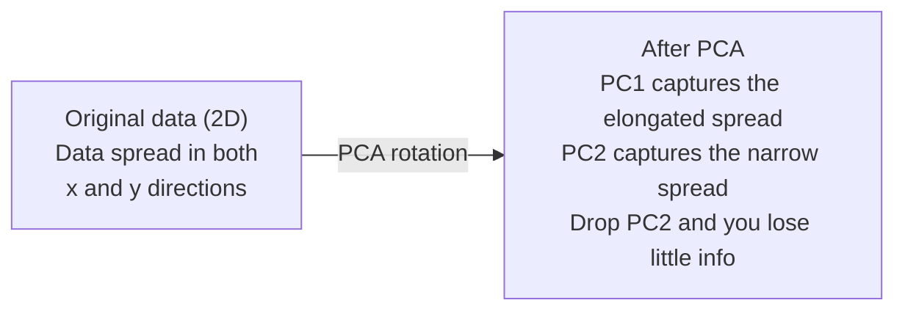

# Giảm kích thước.

> Dữ liệu chiều cao có cấu trúc. Bạn tìm thấy nó bằng cách nhìn từ góc độ đúng.
> High-level dữ liệu có cấu trúc. Bạn cần tìm ra đúng góc nhìn để xem.

**Type:** Build | **类型:** 动手
**Language:**Python**语言:**Python
**Prerequisites:** Phase 1, Lessons 01 (Linear Algebra Intuition), 02 (Vectors, Matrices & Operations), 03 (Eigenvalues & Eigenvectors), 06 (Probability & Distributions) | **前置知识:** Phase 1, Lessons 01-03, 06
**Time:** ~90 minutes | **时间:** ~90 分钟

## Mục tiêu học tập

- Thực hiện PCA từ đầu: dữ liệu trung tâm, tính toán matrix covariance, eigendecompose và dự án
  Từ thực hiện PCA: Data Centering, tính toán, phân tích giá trị, dự án
- Sử dụng tỷ lệ biến động giải thích và phương pháp khuỷu tay để chọn số lượng các thành phần chính
  Sử dụng giải thích Quảng cách và hình chữ cái quy tắc chọn số lượng thành phần chính
- So sánh PCA, t-SNE và UMAP để hình dung các con số MNIST trong 2D và giải thích sự thỏa hiệp của chúng
  So sánh PCA、t-SNE và UMAP trong MNIST viết tay số 2D có thể nhìn thấy hiệu quả và cân nặng
- Sử dụng PCA hạt nhân với một hạt nhân RBF để tách các cấu trúc dữ liệu không tuyến tính mà PCA tiêu chuẩn không thể xử lý
  应用带 RBF 核的核 PCA 分离标准 PCA 无法处理的非线性数据结构

> **【中文解读】**
> 784 维 viết tay số dữ liệu không thể hình dung được. 降维 là tìm thấy dữ liệu chiếu "đối ưu góc độ", sử dụng càng ít hình ảnh để giữ càng nhiều thông tin càng tốt. PCA là phương pháp giảm dữ liệu cổ điển nhất, t-SNE và UMAP phù hợp với hình dung dữ liệu không tuyến tính.

> **【拓展：降维在 AI 中的位置】**
> - **PCA**: sklearn của `PCA`, chuẩn bước của xử lý dữ liệu, cũng là hiểu các thực hành tốt nhất của phân tích giá trị đặc điểm.
> - **t-SNE/UMAP**: High-dimensional 2D Visual Basic, hầu như mọi bản ghi hình ảnh đều sử dụng chúng.
> - **推荐系统**协同过本质上就是对用户物体矩阵做降维,发现隐因子.

## Vấn đề  vấn đề giới thiệu

> **【中文解读】**784 维的手写数字数据 ((28×28 像素) không thể nhìn thấy được, cũng không thể trực tiếp hiểu được. Nhưng phần lớn trong số đó là冗余.

Có thể là giá trị pixel của chữ số viết tay, có thể là mức độ biểu hiện gen, có thể là tín hiệu hành vi của người dùng, bạn không thể hình dung được 784 chiều, bạn không thể vẽ ra chúng, bạn thậm chí không thể nghĩ về chúng.
> Có lẽ là giá trị hình ảnh của chữ viết tay, có thể là mức độ biểu hiện gen, có thể là tín hiệu hành vi của người dùng. Bạn không thể hình dung được 784 维, không thể vẽ, thậm chí không thể tưởng tượng được.

Nhưng hầu hết các tính năng 784 này là quá mức. Thông tin thực tế sống trên bề mặt nhỏ hơn nhiều. Một chữ "7" được viết bằng tay không cần 784 số độc lập để mô tả nó. Nó cần một vài: góc của đường viêm, chiều dài của thanh chéo, bao nhiêu nó nghiêng.
> Nhưng phần lớn các đặc điểm 784 này là quá thừa. Thông tin hữu ích thực sự tồn tại trên một mặt nhỏ hơn. Một chữ viết tay "7" không cần 784 số độc lập để mô tả, chỉ cần một vài: góc vẽ, chiều dài, chiều dài, độ nghiêng.

Giảm kích thước tìm thấy bề mặt nhỏ hơn. Nó lấy dữ liệu 784 chiều của bạn và nén nó thành 2, 10, hoặc 50 chiều trong khi giữ lại cấu trúc quan trọng.
> 降维 tìm thấy mặt nhỏ hơn đó. Nó sẽ nén 784 维 dữ liệu xuống 2、10 hoặc 50 维, đồng thời giữ lại cấu trúc có ý nghĩa.

## Khái niệm cốt lõi

> **【拓展：PCA 与 LoRA 的数学联系】**PCA tìm thấy hướng lớn nhất trong số các phân chia dữ liệu (đối đa các thành phần chính), giống như LoRA 微调 (đối đa các thành phần chính), có cùng ý tưởng: quyền tải mới hóa dữ liệu hiệu quả của ΔW tập trung vào một số hướng nhỏ.

### Lời nguyền của chiều kích.

Không gian chiều cao không trực giác, ba thứ bị phá vỡ khi chiều cao tăng lên.
> Cao chiều không gian trái ngược trực giác.

**Distance becomes meaningless.**Trong các chiều cao, khoảng cách giữa hai điểm ngẫu nhiên nào cũng hội tụ đến cùng một giá trị. Nếu mỗi điểm là khoảng cách tương đương với mọi điểm khác, tìm kiếm hàng xóm gần nhất sẽ ngừng hoạt động.
> **距离变得无意义。**Trong độ cao, khoảng cách giữa hai điểm tự nhiên bất kỳ gần như cùng giá trị. Nếu mỗi điểm đến tất cả các điểm khác cách nhau gần như giống nhau, tìm kiếm gần nhất sẽ không hiệu quả.

```
Dimension    Avg distance ratio (max/min between random points)
2            ~5.0
10           ~1.8
100          ~1.2
1000         ~1.02
```

**Volume concentrates in corners.**Một khối siêu khối đơn vị ở kích thước d có góc 2^d. Trong 100 kích thước, gần như toàn bộ khối lượng là ở góc, xa từ trung tâm.
> **体积集中在角落。**D 维单位超立方体 có 2 个角. Trong 100 维, hầu hết các khối lượng đều ở góc, xa trung tâm.

**You need exponentially more data.**Để duy trì mật độ mẫu trong không gian, từ 2D đến 20D có nghĩa là bạn cần 10^18 lần nhiều dữ liệu. Bạn không bao giờ có đủ. Giảm kích thước mang lại mật độ dữ liệu trở lại một cái gì đó có thể làm việc.
> **需要指数级更多的数据。**Từ 2D đến 20D, để duy trì mật độ mẫu tương tự, cần 10^18 lần dữ liệu.

### PCA: tìm hướng đi quan trọng

Phân tích thành phần chính (PCA) tìm ra các trục dọc theo mà dữ liệu của bạn thay đổi nhiều nhất. Nó xoay hệ thống phối hợp của bạn để trục đầu tiên nắm bắt sự thay đổi nhiều nhất, trục thứ hai nắm bắt nhiều nhất tiếp theo, và như vậy.
> Phân tích thành phần chính (PCA) tìm thấy các biến đổi dữ liệu lớn nhất. Nó xoay trục trục trục trục trục trục trục trục trục trục trục trục trục trục trục trục trục trục trục trục trục trục trục trục trục trục trục trục trục trục trục trục trục trục trục trục trục trục trục trục trục trục trục trục trục trục trục trục trục trục trục trục trục trục trục trục trục trục trục trục trục trục trục trục trục trục trục trục trục trục trục trục trục trục trục trục trục trục trục trục trục trục trục trục trục trục trục trục trục trục trục trục trục trục trục trục trục trục trục trục trục trục trục trục trục trục trục trục trục trục trục trục trục trục trục trục trục trục trục trục trục trục trục trục trục trục trục trục trục trục trục trục trục trục trục trục trục trục trục trục trục trục trục trục trục trục trục trục trục trục trục trục trục trục trục trục trục trục trục trục trục trục trục trục trục trục trục trục trục trục trục trục trục trục trục trục trục trục trục trục trục trục trục trục trục trục trục trục trục trục trục trục trục trục trục trục trục trục trục trục tr trục trục trục trục trục trục trục trục trục tr tr tr trục trục tr tr trục trục trục tr tr tr tr tr tr tr tr tr tr tr tr tr tr tr trục trục trục tr tr tr tr tr tr tr tr tr tr trục tr tr tr tr tr tr tr tr tr tr tr tr tr tr tr tr tr tr tr tr

Khóa toán:
  算法步骤:

```
1. Center the data        (subtract the mean from each feature) / 数据中心化
2. Compute covariance     (how features move together) / 计算协方差
3. Eigendecomposition     (find the principal directions) / 特征值分解
4. Sort by eigenvalue     (biggest variance first) / 按特征值排序
5. Project               (keep top k eigenvectors, drop the rest) / 投影
```

Tại sao có cấu trúc riêng? Các matrix tính toán là đối xứng và tích cực bán xác định. Các phương tiện riêng của nó là các hướng thẳng thắn trong không gian tính năng. Các giá trị riêng cho bạn biết mỗi hướng nắm bắt sự khác biệt bao nhiêu.
> Tại sao sử dụng tính năng phân tích? Hình độ phân tích là đối với tính năng phân tích là đối với tính năng phân tích là đối với tính năng phân tích là đối với tính năng không gian trong một chiều hướng phân tích là đối với tính năng phân tích là đối với tính năng phân tích là đối với tính năng phân tích là đối với tính năng phân tích là đối với tính năng phân tích là đối với tính năng phân tích là đối với tính năng phân tích là đối với tính năng phân tích là đối với tính năng phân tích là đối với tính năng phân tích là đối với tính năng phân tích là đối với tính năng phân tích là đối với tính năng phân tích là đối với tính năng phân tích là đối với tính năng phân tích là đối với tính năng phân tích là đối với tính năng phân tích là đối với tính năng phân tích là đối với tính năng phân tích là đối với tính năng phân tích là đối với tính năng phân tích là đối với tính năng phân tích là đối với tính năng phân tích là đối với tính năng phân tích là đối với tính năng phân tích là đối với tính.



- **Before PCA:**Mây dữ liệu được trải rộng theo đường hình trên cả hai trục x và y
  **PCA 前：**dữ liệu trên đường đối góc qua x và y 轴
- **After PCA:**Hệ thống phối hợp được xoay để PC1 phù hợp với hướng biến động tối đa (sự trôi kéo dài) và PC2 phù hợp với hướng biến động tối thiểu (sự trôi hẹp).
  **PCA 后：**坐标系旋转,PC1 đối với chiều rộng lớn nhất,PC2 đối với chiều rộng nhỏ nhất
- **Dimensionality reduction:**Thả PC2 chiếu dữ liệu vào PC1, mất rất ít thông tin
  **降维：**Thả PC2 sẽ chiếu dữ liệu lên PC1, mất rất ít thông tin

### Tỷ lệ biến số giải thích

Mỗi thành phần chính nắm bắt một phần nhỏ của tổng sự biến động.
> Mỗi thành phần chính là một phần của tổng quảng khác nhau.

```
Component    Eigenvalue    Explained ratio    Cumulative
PC1          4.73          0.473              0.473
PC2          2.51          0.251              0.724
PC3          1.12          0.112              0.836
PC4          0.89          0.089              0.925
...
```

Khi sự biến động được giải thích tích lũy đạt 0,95, bạn biết rằng nhiều thành phần nắm bắt 95% thông tin.
> Khi sự phân biệt tích hợp đạt 0,95, các thành phần này thu được 95% thông tin.

### Chọn số thành phần  chọn số thành phần

Ba chiến lược:
  三种策略:

1. **Threshold.**Giữ đủ thành phần để giải thích 90-95% sự khác biệt.
   **阈值法。**Giữ đủ thành phần để giải thích sự khác biệt 90-95%
2. **Elbow method.**- Đọc về sự khác biệt của mỗi thành phần.
   **肘部法则。**绘制 từng thành phần của giải thích khác nhau, tìm kiếm điểm giảm đột ngột
3. **Downstream performance.**Sử dụng PCA như là xử lý trước. quét k và đo độ chính xác của mô hình của bạn.
   **下游性能。**Để sử dụng PCA như một dự đoán.

### Bảo vệ khu phố.

t-Distributed Stochastic Neighbor Embedding (t-SNE) được thiết kế để hình dung. Nó lập bản đồ dữ liệu chiều cao đến 2D (hoặc 3D) trong khi bảo tồn các điểm gần nhau.
> t-SNE 专为可视化设计──它 sẽ hiển thị dữ liệu lớn đến 2D (hoặc 3D), trong khi vẫn giữ những điểm gần nhau──

Trong không gian ban đầu, tính toán phân phối xác suất trên các cặp điểm dựa trên khoảng cách của chúng. Điểm gần có xác suất cao. Điểm xa có xác suất thấp. Sau đó tìm một sự sắp xếp 2D nơi phân phối xác suất tương tự. Điểm là hàng xóm trong 784 chiều vẫn là hàng xóm trong 2D.
> 直觉: Trong không gian nguyên thủy, dựa trên khoảng cách tính toán phân bố xác suất giữa các điểm đối với nhau.

Các tính chất chính của t-SNE:
  Các đặc điểm quan trọng của t-SNE:

- Không tuyến tính, nó có thể phát triển các đa dạng phức tạp mà PCA không thể.
  Không dây: Có thể phát triển PCA không thể xử lý
- Stochastic, các chạy khác nhau tạo ra các bố cục khác nhau.
  随机性──不同运行产生不同布局──
- Các tham số phức tạp kiểm soát số lượng hàng xóm cần xem xét (các phạm vi điển hình: 5-50).
  Sự bối rối 参数控制考虑多少邻居 (Tình hình: 5-50)
- Khoảng cách giữa các cụm trong đầu ra không có ý nghĩa. Chỉ có các cụm chính là có ý nghĩa.
  输出中聚类之间的距离无意义――只有聚类本身有意义――
- chậm trên tập dữ liệu lớn. O ((n^2) theo mặc định.
  DATABET: 慢──默认 O(n^2)

### UMAP: nhanh hơn, cấu trúc toàn cầu tốt hơn.

Phương pháp Phương trình và Dự án Tương tự Tương tự (UMAP) hoạt động tương tự như t-SNE nhưng có hai lợi thế:
> UMAP tương tự như t-SNE, nhưng có hai ưu điểm:

- Nó sử dụng đồ thị gần nhất của hàng xóm thay vì tính toán tất cả các khoảng cách đôi.
  Hơn nữa, sử dụng gần như gần gần đồ họa chứ không phải tính toán thuộc về khoảng cách.
- Cấu trúc toàn cầu tốt hơn. Các vị trí tương đối của các nhóm trong sản lượng có xu hướng có ý nghĩa hơn so với trong t-SNE.
  Tốt hơn toàn diện cấu trúc ở ra ở khu vực phân loại so sánh so với t-SNE ở hơn có ý nghĩa ở

UMAP xây dựng một biểu đồ có trọng lượng trong không gian chiều cao (the "sự đại diện topological mờ mờ") và sau đó tìm thấy một bố cục chiều thấp mà bảo tồn biểu đồ này tốt nhất có thể.
> UMAP trong không gian cao xây dựng thêm quyền biểu đồ (模糊拓表示), sau đó tìm ra càng tốt để giữ lại biểu đồ này ở mức thấp.

Các tham số chính:
  关键参数:

- `n_neighbors`: bao nhiêu hàng xóm xác định cấu trúc địa phương (tương tự như sự phức tạp).
  `n_neighbors`: how many neighbour defined local structure(类似的困惑)。更高的值保留更多全局结构。
- `min_dist`Các giá trị thấp hơn tạo ra các cụm dày đặc hơn.
  `min_dist`: Output trung điểm tập trung độ mật độ.

### Khi nào dùng cái nào, khi nào dùng phương pháp nào?

| Method / 方法 | Use case / 使用场景 | Preserves / 保留 | Speed / 速度 |
|--------|----------|-----------|-------|
| PCA | Preprocessing before training / 训练前预处理 | Global variance / 全局方差 | Fast (exact), works on millions of samples / 快速（精确），支持百万级样本 |
| PCA | Quick exploratory visualization / 快速探索性可视化 | Linear structure / 线性结构 | Fast / 快 |
| t-SNE | Publication-quality 2D plots / 发表级 2D 图 | Local neighborhoods / 局部邻域 | Slow (< 10k samples ideal) / 慢（<1万样本最佳） |
| UMAP | 2D visualization at scale / 大规模 2D 可视化 | Local + some global structure / 局部+部分全局结构 | Medium (handles millions) / 中等（支持百万级） |
| PCA | Feature reduction for models / 模型特征降维 | Variance-ranked features / 方差排序特征 | Fast / 快 |
| t-SNE / UMAP | Understanding cluster structure / 理解聚类结构 | Cluster separation / 聚类分离 | Medium to slow / 中等到慢 |

Quy tắc: sử dụng PCA để xử lý trước và nén dữ liệu. Sử dụng t-SNE hoặc UMAP khi bạn cần hình dung cấu trúc trong 2D.
> 经验法则:PCA được sử dụng cho xử lý trước và nén dữ liệu.

### Kernel PCA

PCA tiêu chuẩn tìm thấy các vùng phụ tuyến tính. Nó xoay hệ thống phối hợp của bạn và giảm trục. Nhưng nếu dữ liệu nằm trên một đa dạng không tuyến tính thì sao? Một vòng tròn trong 2D không thể tách ra bởi bất kỳ đường nào. PCA tiêu chuẩn sẽ không giúp.
> 标准 PCA 找线性子空间―― nhưng nếu dữ liệu nằm trên dạng không线性流?

Kernel PCA áp dụng PCA trong một không gian tính năng chiều cao được kích hoạt bởi một chức năng kernel, mà không tính toán rõ ràng các tọa độ trong không gian đó. Đây là thủ thuật kernel - cùng một ý tưởng đằng sau SVM.
> 核PCA được áp dụng trong không gian có tính chất cao do hàm hạt nhân dẫn dắt, không rõ ràng tính toán các điểm ngồi trong không gian đó.

Khóa toán:
  算法步骤:

1. Xét toán các khối lượng hạt nhân K nơi K_ij = k(x_i, x_j)
   计算核矩阵 K, trong đó K_ij = k(x_i, x_j)
2. Trung tâm các mã nguồn trong không gian tính năng
   Trong đặc điểm không gian trung tâm
3. Eigendecompose các tập trung hạt nhân matrix
   Các mô hình phân tích giá trị của mô hình phân tích
4. Các vector tự trị trên cùng (được quy mô bằng 1/sqrt(quý trị tự trị)) là các dự đoán
   顶部特征向量(缩放 1/sqrt(特征值)) tức là để chiếu

Các chức năng hạt nhân chung:
  常见核函数:

| Kernel / 核函数 | Formula / 公式 | Good for / 适用于 |
|--------|---------|----------|
| RBF (Gaussian) | exp(-gamma * \|\|x - y\|\|^2) | Most nonlinear data, smooth manifolds / 大多数非线性数据，光滑流形 |
| Polynomial / 多项式 | (x . y + c)^d | Polynomial relationships / 多项式关系 |
| Sigmoid | tanh(alpha * x . y + c) | Neural network-like mappings / 类神经网络映射 |

Khi nào sử dụng PCA hạt nhân so với PCA tiêu chuẩn:
  核 PCA vs 标准 PCA 的使用场景:

| Criterion / 标准 | Standard PCA / 标准 PCA | Kernel PCA / 核 PCA |
|-----------|-------------|------------|
| Data structure / 数据结构 | Linear subspace / 线性子空间 | Nonlinear manifold / 非线性流形 |
| Speed / 速度 | O(min(n^2 d, d^2 n)) | O(n^2 d + n^3) |
| Interpretability / 可解释性 | Components are linear combinations of features / 成分是特征的线性组合 | Components lack direct feature interpretation / 成分缺乏直接特征解释 |
| Scalability / 可扩展性 | Works on millions of samples / 支持百万级样本 | Kernel matrix is n x n, memory-limited / 核矩阵为 n x n，受内存限制 |
| Reconstruction / 重建 | Direct inverse transform / 直接逆变换 | Requires pre-image approximation / 需要预图像近似 |

Ví dụ điển hình: vòng tròn tập trung 2D. Hai vòng tròn điểm, một bên trong nhau. PCA tiêu chuẩn chiếu cả hai trên cùng một đường - vô dụng cho phân loại. Kernel PCA với một hạt nhân RBF vẽ bản đồ vòng tròn bên trong và vòng tròn bên ngoài đến các khu vực khác nhau, làm cho chúng có thể tách ra tuyến tính.
> Ví dụ điển hình: 2D cùng vòng tâm. 2 vòng, một vòng trong vòng khác. PCA tiêu chuẩn sẽ chiếu cả hai vào cùng một đường trên cùng một đường.

### Trận lỗi tái tạo

Bạn đã nén 784 chiều thành 50.
> Làm thế nào hiệu quả của việc giảm? Bạn sẽ giảm 784 dimension thành 50 dimension.

Mức độ lỗi tái thiết:
  测量重建误差:

1. Dữ liệu dự án đến k kích thước: X_reduced = X @ W_k
   Để đưa dữ liệu chiếu đến k 维
2. Tái tạo: X_hat = X_reduced @ W_k^T
   重建
3. MSE tính toán: trung bình (X - X_hat) ^2)
   计算 MSE

Đối với PCA, lỗi tái thiết có mối quan hệ sạch với sự biến động giải thích:
> Đối với PCA, sự khác biệt về xây dựng lại và cách giải thích có một mối quan hệ đơn giản:

```
Reconstruction error = sum of eigenvalues NOT included
Total variance = sum of ALL eigenvalues
Fraction lost = (sum of dropped eigenvalues) / (sum of all eigenvalues)
```

Tỷ lệ biến số giải thích cho mỗi thành phần là:
> Mỗi thành phần của giải thích khác nhau:

```
explained_ratio_k = eigenvalue_k / sum(all eigenvalues)
```

Chụp biểu đồ sự biến động được giải thích tích lũy đối với số lượng các thành phần cho bạn đường cong "công tay".
> 图绘累积解释方差与成分数的关系得到"肘部"曲线──正确成分数在以下位置:

- Lập phẳng ra (tái suất giảm) / 曲线变平(收益递减)
- Sự biến đổi tích lũy vượt qua ngưỡng của bạn (thường là 0,90 hoặc 0,95) / 累积方差超过值
- Phương trình hoạt động nhiệm vụ dòng chảy xuống / 下游 nhiệm vụ hoạt động đạt được nền tảng期

Hầm lẫn tái thiết có ích hơn là chọn k. Bạn có thể sử dụng nó để phát hiện bất thường: các mẫu có lỗi tái thiết cao là các điểm ngoại lệ không phù hợp với không gian phụ được học. Đây là cơ sở phát hiện bất thường dựa trên PCA trong các hệ thống sản xuất.
> Cài đặt lỗi không chỉ được sử dụng để chọn k. Bạn cũng có thể sử dụng kiểm tra bất thường: mẫu của lỗi xây dựng lại không phù hợp với giá trị bất thường của không gian học tập. Đây là cơ sở của kiểm tra bất thường trong hệ thống sản xuất PCA.

## Hãy xây dựng nó.
```figure
pca-axes
```

## Hãy xây dựng nó

> **【中文解读】**Sau đây là quy trình hoàn chỉnh của việc thực hiện PCA từ không: Data Centrization → 协方差矩阵 → Charakteristic value decomposition → 投影── sau đó là kết quả hiển thị của PCA、t-SNE、UMAP trên dữ liệu MNIST.

### Bước 1: PCA từ đầu.

```python
import numpy as np

class PCA:
    def __init__(self, n_components):
        self.n_components = n_components
        self.components = None
        self.mean = None
        self.eigenvalues = None
        self.explained_variance_ratio_ = None

    def fit(self, X):
        self.mean = np.mean(X, axis=0)
        X_centered = X - self.mean

        cov_matrix = np.cov(X_centered, rowvar=False)

        eigenvalues, eigenvectors = np.linalg.eigh(cov_matrix)

        sorted_idx = np.argsort(eigenvalues)[::-1]
        eigenvalues = eigenvalues[sorted_idx]
        eigenvectors = eigenvectors[:, sorted_idx]

        self.components = eigenvectors[:, :self.n_components].T
        self.eigenvalues = eigenvalues[:self.n_components]
        total_var = np.sum(eigenvalues)
        self.explained_variance_ratio_ = self.eigenvalues / total_var

        return self

    def transform(self, X):
        X_centered = X - self.mean
        return X_centered @ self.components.T

    def fit_transform(self, X):
        self.fit(X)
        return self.transform(X)
```

### Bước 2: Kiểm tra dữ liệu tổng hợp.

```python
np.random.seed(42)
n_samples = 500

t = np.random.uniform(0, 2 * np.pi, n_samples)
x1 = 3 * np.cos(t) + np.random.normal(0, 0.2, n_samples)
x2 = 3 * np.sin(t) + np.random.normal(0, 0.2, n_samples)
x3 = 0.5 * x1 + 0.3 * x2 + np.random.normal(0, 0.1, n_samples)

X_synthetic = np.column_stack([x1, x2, x3])

pca = PCA(n_components=2)
X_reduced = pca.fit_transform(X_synthetic)

print(f"Original shape: {X_synthetic.shape}")
print(f"Reduced shape:  {X_reduced.shape}")
print(f"Explained variance ratios: {pca.explained_variance_ratio_}")
print(f"Total variance captured: {sum(pca.explained_variance_ratio_):.4f}")
```

### Bước 3: MNIST số trong 2D 

```python
from sklearn.datasets import fetch_openml

mnist = fetch_openml("mnist_784", version=1, as_frame=False, parser="auto")
X_mnist = mnist.data[:5000].astype(float)
y_mnist = mnist.target[:5000].astype(int)

pca_mnist = PCA(n_components=50)
X_pca50 = pca_mnist.fit_transform(X_mnist)
print(f"50 components capture {sum(pca_mnist.explained_variance_ratio_):.2%} of variance")

pca_2d = PCA(n_components=2)
X_pca2d = pca_2d.fit_transform(X_mnist)
print(f"2 components capture {sum(pca_2d.explained_variance_ratio_):.2%} of variance")
```

### Bước 4: So sánh với Sklern.

```python
from sklearn.decomposition import PCA as SklearnPCA
from sklearn.manifold import TSNE

sklearn_pca = SklearnPCA(n_components=2)
X_sklearn_pca = sklearn_pca.fit_transform(X_mnist)

print(f"\nOur PCA explained variance:     {pca_2d.explained_variance_ratio_}")
print(f"Sklearn PCA explained variance: {sklearn_pca.explained_variance_ratio_}")

diff = np.abs(np.abs(X_pca2d) - np.abs(X_sklearn_pca))
print(f"Max absolute difference: {diff.max():.10f}")

tsne = TSNE(n_components=2, perplexity=30, random_state=42)
X_tsne = tsne.fit_transform(X_mnist)
print(f"\nt-SNE output shape: {X_tsne.shape}")
```

### Bước 5: So sánh UMAP

```python
try:
    from umap import UMAP

    reducer = UMAP(n_components=2, n_neighbors=15, min_dist=0.1, random_state=42)
    X_umap = reducer.fit_transform(X_mnist)
    print(f"UMAP output shape: {X_umap.shape}")
except ImportError:
    print("Install umap-learn: pip install umap-learn")
```

## Hãy sử dụng nó để thực hiện

> **【拓展：t-SNE vs UMAP 选哪个？】**t-SNE: phương pháp cổ điển, giữ quan hệ gần gũi ở địa phương, thích hợp để tìm thấy cấu trúc phân loại trong dữ liệu.

PCA như là chế biến trước khi phân loại:
> Để PCA như một phân loại của xử lý trước:

```python
from sklearn.decomposition import PCA as SklearnPCA
from sklearn.linear_model import LogisticRegression
from sklearn.model_selection import train_test_split
from sklearn.metrics import accuracy_score

X_train, X_test, y_train, y_test = train_test_split(
    X_mnist, y_mnist, test_size=0.2, random_state=42
)

results = {}
for k in [10, 30, 50, 100, 200]:
    pca_k = SklearnPCA(n_components=k)
    X_tr = pca_k.fit_transform(X_train)
    X_te = pca_k.transform(X_test)

    clf = LogisticRegression(max_iter=1000, random_state=42)
    clf.fit(X_tr, y_train)
    acc = accuracy_score(y_test, clf.predict(X_te))
    var_captured = sum(pca_k.explained_variance_ratio_)
    results[k] = (acc, var_captured)
    print(f"k={k:>3d}  accuracy={acc:.4f}  variance={var_captured:.4f}")
```

Địa điểm cao cấp hoạt động của bạn là địa điểm cao cấp đó.
> Hiệu suất thấp hơn 784 W thì đạt được thời gian trên nền tảng.

## Chuyển nó đi.

Bài học này mang lại:
> 本课程产出:

- `outputs/skill-dimensionality-reduction.md`- kỹ năng để chọn kỹ thuật giảm chiều kích phù hợp cho một nhiệm vụ nhất định
  Một tài liệu kỹ năng cho một nhiệm vụ nhất định chọn thích hợp để giảm kỹ thuật

## Tập luyện bài tập

1. Thay đổi lớp PCA để hỗ trợ `inverse_transform`. Tái tạo lại các con số MNIST từ 10, 50, và 200 thành phần. In lỗi tái tạo (sự khác biệt bình phương trung bình từ nguyên bản) cho mỗi thành phần.
   修改 PCA 类以支持 `inverse_transform`△ sử dụng 10、50 和 200 thành phần tái tạo MNIST số字──印每一个重建错误──

2. Thực hiện t-SNE trên cùng một bộ tiểu MNIST với giá trị phức tạp 5, 30 và 100. Mô tả cách thức đầu ra thay đổi. Tại sao sự phức tạp ảnh hưởng đến độ chặt của cluster?
   Sử dụng sự phức tạp  giá trị 5、30 和 100 trong cùng MNIST 子集上运行 t-SNE。 mô tả sự biến đổi đầu ra。 Tại sao sự phức tạp  ảnh hưởng đến mật độ tập hợp?

3. Hãy lấy một bộ dữ liệu với 50 tính năng mà chỉ có 5 tính năng thông tin (tạo ra một với `sklearn.datasets.make_classification`). Sử dụng PCA và kiểm tra xem đường cong biến số được giải thích có xác định chính xác dữ liệu có hiệu quả là 5 chiều không.
    lấy một có 50 tính năng nhưng chỉ có 5 tập dữ liệu hữu ích  ứng dụng PCA, kiểm tra xem đường cong phân biệt phân biệt xác định dữ liệu thực sự là 5 chiều 

## Từ khóa  Từ khóa nhanh chóng

| Term / 术语 | What people say | What it actually means / 实际含义 |
|------|----------------|----------------------|
| Curse of dimensionality / 维度灾难 | "Too many features" | Distances, volumes, and data density all behave counterintuitively as dimensions grow. Models need exponentially more data to compensate. / 随维度增长，距离、体积和数据密度都反直觉。模型需要指数级更多数据来补偿。 |
| PCA / 主成分分析 | "Reduce dimensions" | Rotate your coordinate system so the axes align with the directions of maximum variance, then drop the low-variance axes. / 旋转坐标系使轴对齐最大方差方向，然后丢弃低方差轴。 |
| Principal component / 主成分 | "An important direction" | An eigenvector of the covariance matrix. The direction in feature space along which the data varies most. / 协方差矩阵的特征向量。特征空间中数据变化最大的方向。 |
| Explained variance ratio / 解释方差比 | "How much info this component has" | The fraction of total variance captured by one principal component. Sum the top k ratios to see how much k components preserve. / 一个主成分捕获的总方差比例。累加前 k 个比率看 k 个成分保留了多少。 |
| Covariance matrix / 协方差矩阵 | "How features correlate" | A symmetric matrix where entry (i,j) measures how feature i and feature j move together. Diagonal entries are individual variances. / 对称矩阵，第 (i,j) 项衡量特征 i 和 j 如何共同变化。对角项是各自方差。 |
| t-SNE | "That cluster plot" | A nonlinear method that maps high-dimensional data to 2D by preserving pairwise neighborhood probabilities. Good for visualization, not for preprocessing. / 非线性方法，通过保留成对邻域概率将高维数据映射到 2D。适合可视化，不适合预处理。 |
| UMAP | "Faster t-SNE" | A nonlinear method based on topological data analysis. Preserves both local and some global structure. Scales better than t-SNE. / 基于拓扑数据分析的非线性方法。保留局部和部分全局结构。扩展性优于 t-SNE。 |
| Perplexity / 困惑度 | "A t-SNE knob" | Controls the effective number of neighbors each point considers. Low perplexity focuses on very local structure. High perplexity captures broader patterns. / 控制每个点考虑的有效邻居数。低困惑度关注局部结构，高困惑度捕获更广模式。 |
| Manifold / 流形 | "The surface the data lives on" | A lower-dimensional surface embedded in a higher-dimensional space. A sheet of paper crumpled in 3D is a 2D manifold. / 嵌入高维空间的低维曲面。揉成团的纸是 2D 流形。 |

## Xem thêm 延伸阅读

- [A Tutorial on Principal Component Analysis](https://arxiv.org/abs/1404.1100)(Shlens) - dẫn xuất rõ ràng của PCA từ cục bộ
  PCA 清晰推导
- [How to Use t-SNE Effectively](https://distill.pub/2016/misread-tsne/)(Wattenberg et al.) - hướng dẫn tương tác về các rào cản và lựa chọn tham số t-SNE
  t-SNE 使用指南,交互式展示参数选择和陷
- [UMAP documentation](https://umap-learn.readthedocs.io/)- lý thuyết và hướng dẫn thực tế từ các tác giả của UMAP
  UMAP 理论与实践指南
