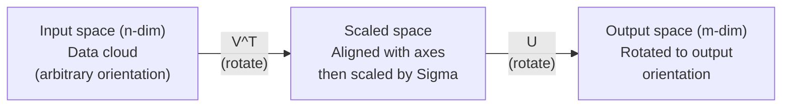
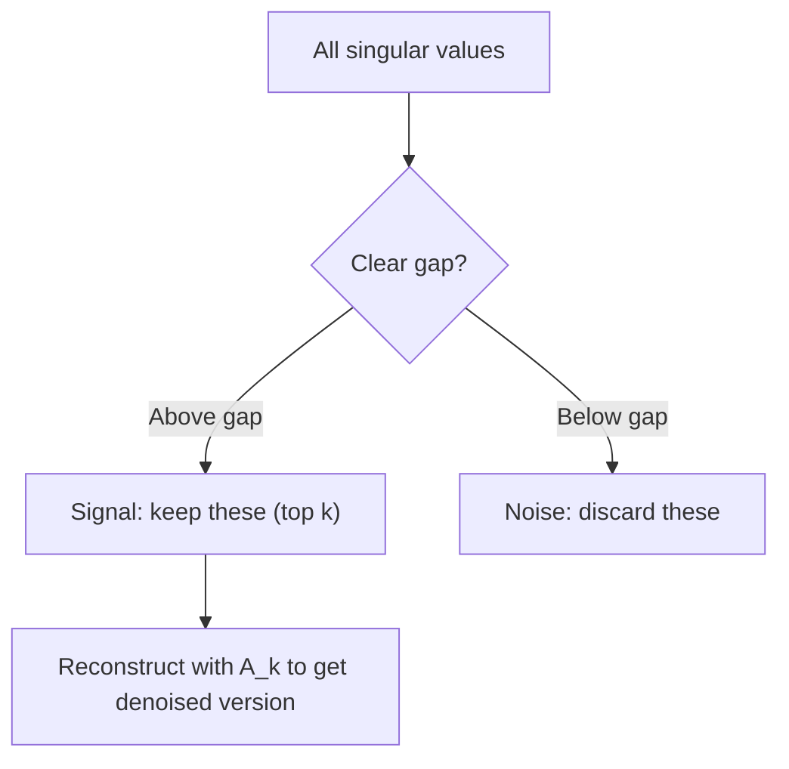

# Sự phân hủy giá trị độc đáo .

> SVD là dao quân đội Thụy Sĩ của toán học tuyến tính. Mỗi matrix đều có một cái.
> SVD là "bát quân Thụy Sĩ" của số liệu tuyến tính. Mỗi khối có một.

**Type:** Build | **类型:** 动手
**Languages:** Python, Julia | **语言:** Python, Julia
**Prerequisites:** Phase 1, Lessons 01 (Linear Algebra Intuition), 02 (Vectors & Matrices Operations), 03 (Matrix Transformations) | **前置知识:** Phase 1, Lessons 01-03
**Time:** ~120 minutes | **时间:** ~120 分钟

## Mục tiêu học tập

- Thực hiện SVD thông qua lặp lại năng lượng và giải thích ý nghĩa hình học của U, Sigma và V^T
  Thông qua việc thực hiện SVD, giải thích U、Sigma 和 V^T
- Sử dụng SVD cắt giảm để nén hình ảnh và đo tỷ lệ nén vs lỗi tái tạo
   ứng dụng cắt SVD  thực hiện hình ảnh nén, đo nén so với lỗi xây dựng lại
- Xét toán Moore-Penrose pseudoinverse thông qua SVD để giải quyết các hệ thống số lượng nhỏ nhất được xác định quá cao
  Thông qua SVD  tính toán Moore-Penrose  giả ngược đến tìm giải pháp siêu định tối thiểu
- Kết nối SVD với PCA, hệ thống khuyến nghị (chất tố tiềm ẩn) và Phân tích ngữ nghĩa tiềm ẩn trong NLP
  Để kết nối SVD với PCA、推系统 (khác yếu tố) và phân tích tiềm ẩn trong NLP

> **【中文解读】**
> SVD là một số liệu tuyến tính của "Swiss Army Knife" bất kỳ矩阵都能分解为U * Sigma * V^T── cắt SVD có thể nén hình ảnh, người dùng-电影评分矩阵的 SVD có thể tìm thấy ẩn因子(推系统的核心),文档-词频矩阵的 SVD có thể tìm thấy chủ đề(LSA)。

> **【拓展：SVD 在 AI 中的位置】**
> - **推荐系统**: Giải pháp chiến thắng của cuộc thi Netflix là SVD phân giải của user-object rating matrix.
> - **图像压缩**: 截断 SVD chỉ giữ được nhiều giá trị khác biệt nhất, có thể sử dụng rất ít dữ liệu gần như hình ảnh nguyên bản.
> - **LSA (潜在语义分析)**: NLP 中最早的主题模型方法,对文档-词矩阵做 SVD 发现隐含主题──

## Vấn đề  vấn đề giới thiệu

> **【中文解读】**Bạn có một mô hình 1000×2000 (có thể là người dùng- phim đánh giá, tài liệu- từ频表, hình ảnh) ⋅ Chất lượng phân tích chỉ áp dụng cho mô hình, SVD thì đối với bất kỳ hình dạng nào, bất kỳ thứ tự nào của mô hình đều có hiệu quả. Nó phân tích mô hình thành ba yếu tố U·Σ·V^T, tiết lộ mô hình của mô hình "làm gì" ⋅

Có thể là xếp hạng phim người dùng. Có thể là bảng tần số theo thời gian tài liệu. Có thể là giá trị pixel của một hình ảnh. Bạn cần phải nén nó, từ chối nó, tìm cấu trúc ẩn trong nó, hoặc giải quyết một hệ thống ít hình vuông nhất với nó. Eigendecomposition chỉ hoạt động trên các matrix vuông. Ngay cả khi đó, nó đòi hỏi các matrix có một bộ đầy đủ của các eigenvector tự do tuyến tính độc lập.
> Có lẽ là user-film rating, có lẽ là document-word frequency, có lẽ là image image. Bạn cần phải nén nó, bỏ tiếng ồn, tìm ra cấu trúc ẩn, hoặc sử dụng nó để giải quyết tối thiểu hai lần.

SVD hoạt động trên bất kỳ hình thức nào, bất kỳ thứ hạng nào, không có điều kiện nào, nó phân hủy các matrix thành ba yếu tố cho thấy hình học của những gì mà matrix làm cho không gian.
> SVD  áp dụng cho bất kỳ mô hình nào 任何形状、任何秩、无条件── nó sẽ phân chia mô hình thành ba yếu tố, tiết lộ mô hình đã làm gì đối với không gian── nó là phân giải phổ biến nhất trong số số tử xịn tính, hữu ích nhất──

## Khái niệm cốt lõi

> **【拓展：SVD 是 LoRA 的数学根基】**LoRA 微调的核心假设:权重更新矩阵 ΔW 是低排的──SVD 告诉我们, bất kỳ矩阵 nào có thể được phân chia thành U·Σ·V^T, trong đó Σ trong số các giá trị khác biệt khác biệt theo quy trình nhỏ──LoRA chỉ giữ được số lượng lớn nhất của k 个奇值 đối ứng với △(即级-k 近似), các参数 từ mn 减少到 k △ m+n)── đây là SVD chuyển đổi trực tiếp từ lý thuyết sang ứng dụng──

### Những gì SVD làm theo hình học

Mỗi matrix, bất kể hình dạng, thực hiện ba hoạt động theo trình tự: xoay, quy mô, xoay.
> Mỗi矩阵, bất kể hình dạng của nó là gì, đều theo thứ tự thực hiện ba hoạt động: xoay xoay, rút gọn, xoay.

```
A = U * Sigma * V^T

      m x n     m x m    m x n    n x n
     (any)    (rotate)  (scale)  (rotate)
```

Với bất kỳ matrix A nào, SVD tính toán nó thành:
> 给定任意矩阵 A,SVD sẽ phân giải thành:

- V^T xoay các vector trong không gian đầu vào (n-dimensional)
  V^T trong输入空间 ((n 维) 中旋转向量
- Scales Sigma dọc theo mỗi trục (trình kéo hoặc nén)
  Sigma 沿每个轴缩放 (拉伸或压缩)
- U xoay kết quả vào không gian đầu ra (m-dimensional)
  U sẽ kết quả quay sang không gian xuất khẩu



Hãy nghĩ về nó theo cách này. Bạn trao cho SVD một số liệu. Nó nói với bạn: "Thế liệu này lấy một quả bóng đầu vào, đầu tiên xoay nó bằng V^T, sau đó kéo dài nó thành một hình elipsoid bằng Sigma, sau đó xoay hình elipsoid bằng U". Các giá trị đơn lẻ là chiều dài của trục elipsoid.
> Hãy tưởng tượng: bạn đưa矩阵 giao cho SVD, nó nói với bạn:"矩阵 này nhận một bộ đầu vào mặt cầu, đầu tiên sử dụng V^T  quay, sử dụng Sigma 拉伸成球, sử dụng U 旋球.

### Sự phân hủy đầy đủ.

Đối với một trục A có hình m x n:

```
A = U * Sigma * V^T

where:
  U     is m x m, orthogonal (U^T U = I)
  Sigma is m x n, diagonal (singular values on the diagonal)
  V     is n x n, orthogonal (V^T V = I)

The singular values sigma_1 >= sigma_2 >= ... >= sigma_r > 0
where r = rank(A)
```

Các cột của U được gọi là vector đơn phương bên trái. Cột của V được gọi là vector đơn phương bên phải. Các mục chéo của Sigma được gọi là giá trị đơn vị. Chúng luôn không âm và theo quy định quy định được sắp xếp theo thứ tự giảm.
> Các chuỗi U được gọi là khối lượng trái kỳ lạ, V được gọi là khối lượng trái kỳ lạ, các yếu tố đối với góc của Sigma được gọi là khối lượng kỳ lạ.

### Vêctơ đơn phương trái, giá trị đơn phương, giá trị đơn phương phải.

Mỗi thành phần của SVD có ý nghĩa hình học riêng biệt.
> Mỗi phân tử của SVD có ý nghĩa hình học riêng biệt.

**Right singular vectors (columns of V):**Chúng tạo thành một cơ sở hoặcthông thường cho không gian đầu vào (R^n). Chúng là các hướng trong không gian đầu vào mà các mãtres lập bản đồ đến các hướng trực giác trong không gian đầu ra. Hãy nghĩ về chúng như hệ thống phối hợp tự nhiên cho lĩnh vực.
> **右奇异向量（V 的列）：**Các mô hình cấu tạo vào không gian (R^n) là các mô hình trong không gian nhập được chiếu vào hướng không gian xuất hiện.

**Singular values (diagonal of Sigma):**Đây là các yếu tố quy mô. giá trị đơn vị thứ i cho bạn biết số lượng mà trục kéo dài các vector dọc theo vector đơn vị thứ i bên phải. giá trị đơn vị của 0 có nghĩa là trục phá hoàn toàn hướng đó.
> **奇异值（Sigma 的对角线）：**缩放因子──第1个奇异值告诉你矩阵沿第1个右奇异向量方向拉伸多少──奇异值为零 nghĩa là矩阵 hoàn toàn bị áp lực theo hướng đó──

**Left singular vectors (columns of U):**Những hình thức này tạo thành một cơ sở hợp lý cho không gian đầu ra (R^m).
> **左奇异向量（U 的列）：**构成输出空间 (R^m) 的正交基──第 i个左奇异向量是第 i个右奇异向量(缩放后) 落在输出空间中的方向──

Mối quan hệ giữa họ:
> Sự liên hệ giữa chúng:

```
A * v_i = sigma_i * u_i

The matrix A takes the i-th right singular vector v_i,
scales it by sigma_i, and maps it to the i-th left singular vector u_i.
```

Điều này cho bạn một hình ảnh phối hợp theo phối hợp của bất kỳ matrix nào làm gì.
> Đây là hình ảnh của bất kỳ mô hình nào.

### Hình thức sản phẩm bên ngoài

SVD có thể được viết như là tổng số các matrices cấp-1:
> SVD có thể viết thành 矩阵之和:

```
A = sigma_1 * u_1 * v_1^T + sigma_2 * u_2 * v_2^T + ... + sigma_r * u_r * v_r^T

Each term sigma_i * u_i * v_i^T is a rank-1 matrix (an outer product).
The full matrix is the sum of r such matrices, where r is the rank.
```

Các thuật ngữ này là nền tảng của sự gần gũi cấp thấp. Mỗi thuật ngữ thêm một lớp cấu trúc. thuật ngữ đầu tiên nắm bắt mô hình quan trọng nhất duy nhất. thuật ngữ thứ hai nắm bắt mô hình quan trọng nhất tiếp theo.
> Các hình thức này là cơ sở của các cấu trúc gần như thấp hơn. Mỗi phần thêm một tầng cấu trúc.

```
Rank-1 approx:    A_1 = sigma_1 * u_1 * v_1^T
                  (captures the dominant pattern)

Rank-2 approx:    A_2 = sigma_1 * u_1 * v_1^T + sigma_2 * u_2 * v_2^T
                  (captures the two most important patterns)

Rank-k approx:    A_k = sum of top k terms
                  (optimal by the Eckart-Young theorem)
```

### Quan hệ với sự phân hủy của bản thân và các tính chất của sự phân hủy của giá trị

SVD và cấu trúc riêng có liên quan sâu sắc. Các giá trị đơn lẻ và các vector của A đến trực tiếp từ các giá trị riêng và các vector riêng của A^T A và A^T.
> SVD và đặc tính giá trị phân tích sâu liên quan.

```
A^T A = V * Sigma^T * U^T * U * Sigma * V^T
      = V * Sigma^T * Sigma * V^T
      = V * D * V^T

where D = Sigma^T * Sigma is a diagonal matrix with sigma_i^2 on the diagonal.

So:
- The right singular vectors (V) are eigenvectors of A^T A
- The singular values squared (sigma_i^2) are eigenvalues of A^T A

Similarly:
A A^T = U * Sigma * V^T * V * Sigma^T * U^T
      = U * Sigma * Sigma^T * U^T

So:
- The left singular vectors (U) are eigenvectors of A A^T
- The eigenvalues of A A^T are also sigma_i^2
```

Sự kết nối này cho bạn biết ba điều:
> Cái liên lạc này nói với anh 3 điều:

1. Các giá trị đơn vị luôn là thực và không âm (bạn là gốc vuông của các giá trị riêng của một matrix bán xác định tích cực).
   Giá trị kỳ lạ luôn luôn là số thực và không负.
2. Bạn có thể tính toán SVD bằng cách tự tạo A^T A, nhưng điều này làm bình phương số điều kiện và mất độ chính xác số.
   Có thể tính toán tính chất của A^T A để phân tích SVD, nhưng điều này sẽ làm mất tính chất của số lượng.
3. Khi A là hình vuông và đối xứng tích cực bán xác định, SVD và eigendecomposition là cùng một thứ.
   Khi A là một phương diện và đối称正半定时, SVD và tính chất phân tích giá trị là một sự việc.

### SVD cắt giảm: cấp thấp gần gũi

Định lý Eckart-Young-Mirsky nói rằng sự gần gũi hàng bậc-k tốt nhất với A (từ cả Frobenius và tiêu chuẩn quang phổ) được đạt được bằng cách chỉ giữ các giá trị đơn vị k trên cùng và các vector tương ứng của chúng:
> Eckart-Young-Mirsky 定理指出,A 的最佳秩-k 近似(在 Frobenius 和谱范数下)通过只保留前 k 个奇值及其对应向量获得:

```
A_k = U_k * Sigma_k * V_k^T

where:
  U_k     is m x k  (first k columns of U)
  Sigma_k is k x k  (top-left k x k block of Sigma)
  V_k     is n x k  (first k columns of V)

Approximation error = sigma_{k+1}  (in spectral norm)
                    = sqrt(sigma_{k+1}^2 + ... + sigma_r^2)  (in Frobenius norm)
```

Đây không chỉ là một "một sự gần gũi" tốt. Nó có thể được chứng minh là sự gần gũi tốt nhất có thể của bậc k. Không có matrix bậc k nào khác gần hơn với A.
> Đây không chỉ là "một rất tốt" gần gũi. Nó là chứng minh của xếp hạng k, tốt nhất gần gũi. Không có thứ hạng khác gần gũi hơn nó.

| Component | Relative magnitude | Kept in rank-3 approx? / 保留在秩-3 近似中？ |
|-----------|-------------------|------------------------|
| sigma_1 | Largest / 最大 | Yes / 是 |
| sigma_2 | Large / 大 | Yes / 是 |
| sigma_3 | Medium-large / 中大 | Yes / 是 |
| sigma_4 | Medium / 中 | No (error) / 否（误差） |
| sigma_5 | Medium-small / 中小 | No (error) / 否（误差） |
| sigma_6 | Small / 小 | No (error) / 否（误差） |
| sigma_7 | Very small / 很小 | No (error) / 否（误差） |
| sigma_8 | Tiny / 极小 | No (error) / 否（误差） |

Keep top 3: A_3 nắm bắt ba giá trị đơn nhất lớn nhất. lỗi = giá trị còn lại (sigma_4 qua sigma_8).

Nếu các giá trị đơn lẻ phân hủy nhanh chóng, một k nhỏ chiếm hầu hết các matrix. Nếu chúng phân hủy chậm, matrix không có cấu trúc hạng thấp.
> Nếu giá trị bất thường giảm nhanh, thì k nhỏ sẽ có thể chiếm phần lớn các mô hình. Nếu sự suy giảm chậm, thì mô hình không có cấu trúc thấp.

### Sản phẩm ảnh với SVD

Một hình ảnh thang xám là một matrix của cường độ pixel. Một hình ảnh 800x600 có 480.000 giá trị. SVD cho phép bạn gần gũi với nó với ít hơn nhiều.
> Hình độ xám là hình ảnh của mô hình mã lực lượng xám. 800x600 có giá trị 480.000. SVD có thể được sử dụng ít hơn giá trị này để gần gũi.

```
Original image: 800 x 600 = 480,000 values

SVD with rank k:
  U_k:      800 x k values
  Sigma_k:  k values
  V_k:      600 x k values
  Total:    k * (800 + 600 + 1) = k * 1401 values

  k=10:   14,010 values   (2.9% of original)
  k=50:   70,050 values  (14.6% of original)
  k=100: 140,100 values  (29.2% of original)

  The compression ratio improves as k gets smaller,
  but visual quality degrades.
```

Những hình ảnh tự nhiên có giá trị đơn lẻ suy yếu nhanh chóng. Những giá trị đơn lẻ đầu tiên nắm bắt cấu trúc rộng (hình dạng, độ nghiêng). Những hình ảnh sau đó nắm bắt chi tiết tinh tế và tiếng ồn.
> 关键洞见: Giá trị kỳ lạ của hình ảnh tự nhiên nhanh chóng suy giảm. Trước đây, một vài giá trị kỳ lạ bắt giữ cấu trúc quy mô lớn (xác hình, biến đổi), sau đó bắt giữ chi tiết và tiếng ồn.

### SVD cho hệ thống khuyến nghị.

Giải thưởng Netflix đã làm cho nó nổi tiếng. Bạn có một số lượng người dùng mà hầu hết các mục bị thiếu.
> Netflix 竞赛使之出名──你有一个大部分条目缺失的用户电影评分矩阵──

```
             Movie1  Movie2  Movie3  Movie4  Movie5
  User1      [  5      ?       3       ?       1  ]
  User2      [  ?      4       ?       2       ?  ]
  User3      [  3      ?       5       ?       ?  ]
  User4      [  ?      ?       ?       4       3  ]

  ? = unknown rating
```

Ý tưởng: các bảng xếp hạng này có thứ hạng thấp. Người dùng không có sở thích độc lập hoàn toàn. Có một số yếu tố ẩn (các hành động so với kịch bản, cũ so với mới, não so với nội tạng) giải thích hầu hết các sở thích.
> 核心思想:评分矩阵是低排的──用户的品味并非完全独立──存在少数隐因子──动作 vs 文艺──老片 vs 新片) có thể giải thích phần lớn sự ưa thích──

SVD trên các mã số (đã được lấp vào) phân hủy nó thành:
> Đối với ((填充后的) 评分矩阵做 SVD 分解为:

- U: hồ sơ người dùng trong không gian nhân ẩn / 隐因子空间中的用户画像
- Sigma: tầm quan trọng của mỗi yếu tố ẩn / 每个隐因子的重要性
- V^T: hồ sơ phim trong không gian yếu tố ẩn / 隐因子空间中的电影画像

Điểm đánh giá dự đoán của người dùng cho một bộ phim là sản phẩm điểm của hồ sơ người dùng của họ với hồ sơ của bộ phim (được cân bằng bằng các giá trị đơn lẻ).
> Người dùng đánh giá dự đoán về phim là điểm tích của người dùng ảnh và phim ảnh ảnh (→ + + + + + + + + + + + + + + + + + + + + + + + + + + + + + + + + + + + + + + + + + + + + + + + + + + + + + + + + + + + + + + + + + + + + + + + + + + + + + + + + + + + + + + + + + + + + + + + + + + + + + + + + + + + + + + + + + + + + + + + + + + + + + + + + + + + + + + + + + + + + + + + + + + + + + + + + + + + + + + + + + + + + + + + + + + + + + + + + + + + + + + + + + + + + + + + + + + + + + + + + + + + + + + + + + + + + + + + + + + + + + + + + + + + + + + + + + + + + + + + + + + + + + + + + + + + + + + + + + + + + + + + + + + + + + + + + + + + + + + + + + + + + + + + + + + + + + + + + + + + + + + + + + + + + + + + + + + + + + + + + + + + + + + + + + + + + + + + + + + + + + + + + + + + + + + + + + + + + + + + + + + + + + + + + + + + + + + + + + + + + + + + + + + + + + + + + + + + + + + + + + + + + + + + + + + + + + + + + + + + + + + + + + + + + + + + + + + + + + + + + + + + + + + + + + + + + + + + + + + + + + + + + + + + + + + + + + + + + + + + + + + + + + + + + +

### SVD trong NLP: Phân tích ngữ nghĩa ẩn số.

Phân tích ngữ nghĩa trần gian (LSA), còn được gọi là Chỉ số ngữ nghĩa trần gian (LSI), áp dụng SVD cho một matrix tài liệu thuật ngữ.
> 潜在语义分析 (LSA) sẽ sử dụng SVD 应用于词文档矩阵。

```
             Doc1   Doc2   Doc3   Doc4
  "cat"      [  3      0      1      0  ]
  "dog"      [  2      0      0      1  ]
  "fish"     [  0      4      1      0  ]
  "pet"      [  1      1      1      1  ]
  "ocean"    [  0      3      0      0  ]

After SVD with rank k=2:

  Each document becomes a point in 2D "concept space."
  Each term becomes a point in the same 2D space.
  Documents about similar topics cluster together.
  Terms with similar meanings cluster together.
```

LSA là một trong những phương pháp thành công đầu tiên để nắm bắt sự tương đồng ngữ nghĩa từ văn bản thô. Nó hoạt động bởi vì các thuật ngữ đồng nghĩa có xu hướng xuất hiện trong các tài liệu tương tự, vì vậy SVD nhóm chúng thành cùng một chiều sâu ẩn.
> LSA là một trong những phương pháp thành công nhất từ văn bản nguyên thủy để nắm bắt ngữ nghĩa tương tự. Nó có hiệu quả bởi vì các ngữ nghĩa thường xuất hiện trong các văn bản tương tự, SVD sẽ đưa chúng vào cùng một chiều ẩn.

### SVD để giảm tiếng ồn.

Dữ liệu tiếng ồn có tín hiệu tập trung vào các giá trị đơn nhất và tiếng ồn lan rộng trên tất cả các giá trị đơn.
> 噪音数据中信号集中在顶部异值,噪音分散在所有异值中――截断移除噪音基――



Điều này được sử dụng trong xử lý tín hiệu, đo lường khoa học và làm sạch dữ liệu. Bất cứ khi nào bạn có một matrix bị hư hại bởi tiếng ồn phụ gia, SVD bị cắt ngắn là một cách nguyên tắc để tách tín hiệu khỏi tiếng ồn.
> Nó được sử dụng để xử lý tín hiệu, đo lường khoa học và làm sạch dữ liệu.

### Phép đảo ngược qua SVD

Moore-Penrose pseudoinverse A + tổng hợp đảo ngược matrix thành các matrix không bình phương và đơn vị. SVD làm cho việc tính toán nó tầm thường.
> Moore-Penrose 伪逆 A+ 将矩阵求逆推广到非方阵和奇异矩阵――SVD 使计算变得简单――

```
If A = U * Sigma * V^T, then:

A+ = V * Sigma+ * U^T

where Sigma+ is formed by:
  1. Transpose Sigma (swap rows and columns)
  2. Replace each non-zero diagonal entry sigma_i with 1/sigma_i
  3. Leave zeros as zeros
```

Phépduinverse giải quyết các vấn đề khối lượng nhỏ nhất. Nếu Ax = b không có giải pháp chính xác (hệ thống xác định quá cao), thì x = A + b là giải pháp khối lượng nhỏ nhất (giảm thiểu các số lượng của các khối lượng nhỏ nhất).
> 伪逆求解最小二乘解问题──如果 Ax = b 没有精确解(超定系统),则 x = A+ b 是最小二乘解──

### Lợi thế ổn định số

Xét tính tính cách riêng của A^T A bình phương các giá trị đơn lẻ (quý vị của A^T A là sigma_i^2).
> 计算 A^T A 的特征值分解会平方奇异值,平方条件数,放大数值差──

Các thuật toán SVD hiện đại (Golub-Kahan bidiagonalization) hoạt động trực tiếp trên A, không bao giờ tạo ra A^T A. Đây là lý do tại sao bạn nên luôn thích `np.linalg.svd(A)`- Đúng rồi.`np.linalg.eig(A.T @ A)`- Tôi không biết.
> 现代 SVD 算法 trực tiếp đối với A 操作, không hình thành A^T A. Đó là lý do tại sao nên luôn được sử dụng.`np.linalg.svd(A)`Không`np.linalg.eig(A.T @ A)`

### Liên kết với PCA  Liên kết với PCA

PCA là SVD trên dữ liệu tập trung. Đây không phải là một phép tính.
> PCA là đối với dữ liệu tập trung làm SVD. Đây không phải là một loại, là hoàn toàn giống nhau tính toán.

```
Given data matrix X (n_samples x n_features), centered (mean subtracted):

Covariance matrix: C = (1/(n-1)) * X^T X

PCA finds eigenvectors of C. But:

  X = U * Sigma * V^T    (SVD of X)

  X^T X = V * Sigma^2 * V^T

  C = (1/(n-1)) * V * Sigma^2 * V^T

So the principal components are exactly the right singular vectors V.
The explained variance for each component is sigma_i^2 / (n-1).

In sklearn, PCA is implemented using SVD, not eigendecomposition.
It is faster and more numerically stable.
```

Điều này có nghĩa là tất cả những gì bạn đã học về việc giảm chiều kích trong Bài học 10 là SVD dưới nắp. PCA là ứng dụng phổ biến nhất của SVD trong học máy.
> Điều này có nghĩa là các bạn học trong Bài học 10 được hạ tầng nội dung là SVD. PCA là ứng dụng phổ biến nhất của SVD trong học máy.

## Hãy xây dựng nó.
```figure
svd-rank-reconstruction
```

## Hãy xây dựng nó

### Bước 1: SVD từ đầu sử dụng lặp lại năng lượng.

Ý tưởng: để tìm ra giá trị đơn nhất và các vector của nó, sử dụng lặp lại năng lượng trên A^T A (hoặc A A^T). Sau đó làm giảm giá trị của matrix và lặp lại giá trị đơn tiếp theo.
> Ưu điểm: sử dụng 代 trong A^T A 上 tìm được giá trị kỳ lạ nhất và khối lượng của nó, sau đó thu hẹp矩阵, tái tìm lại giá trị kỳ lạ tiếp theo.

```python
import numpy as np

def power_iteration(M, num_iters=100):
    n = M.shape[1]
    v = np.random.randn(n)
    v = v / np.linalg.norm(v)

    for _ in range(num_iters):
        Mv = M @ v
        v = Mv / np.linalg.norm(Mv)

    eigenvalue = v @ M @ v
    return eigenvalue, v

def svd_from_scratch(A, k=None):
    m, n = A.shape
    if k is None:
        k = min(m, n)

    sigmas = []
    us = []
    vs = []

    A_residual = A.copy().astype(float)

    for _ in range(k):
        AtA = A_residual.T @ A_residual
        eigenvalue, v = power_iteration(AtA, num_iters=200)

        if eigenvalue < 1e-10:
            break

        sigma = np.sqrt(eigenvalue)
        u = A_residual @ v / sigma

        sigmas.append(sigma)
        us.append(u)
        vs.append(v)

        A_residual = A_residual - sigma * np.outer(u, v)

    U = np.column_stack(us) if us else np.empty((m, 0))
    S = np.array(sigmas)
    V = np.column_stack(vs) if vs else np.empty((n, 0))

    return U, S, V
```

### Bước 2: kiểm tra và so sánh với NumPy.

```python
np.random.seed(42)
A = np.random.randn(5, 4)

U_ours, S_ours, V_ours = svd_from_scratch(A)
U_np, S_np, Vt_np = np.linalg.svd(A, full_matrices=False)

print("Our singular values:", np.round(S_ours, 4))
print("NumPy singular values:", np.round(S_np, 4))

A_reconstructed = U_ours @ np.diag(S_ours) @ V_ours.T
print(f"Reconstruction error: {np.linalg.norm(A - A_reconstructed):.8f}")
```

### Bước 3: Demo nén hình ảnh Bước 3: Bước 3: Bước 3: Bước 3: Bước 3: Bước 3: Bước 3: Bước 3: Bước 3: Bước 3: Bước 3: Bước 3: Bước 3: Bước 3: Bước 3: Bước 3: Bước 3: Bước 3: Bước 3: Bước 3: Bước 3: Bước 3: Bước 3: Bước 3: Bước 3: Bước 3: Bước 3: Bước 3: Bước 3: Bước 3: Bước 3: Bước 3: Bước 3: Bước 3: Bước 3: Bước 3: Bước 3: Bước 3: Bước 3: Bước 3: Bước 3: Bước 3: Bước 3: Bước 3: Bước 3: Bước 3: Bước 3: Bước 3: Bước 3: Bước 3: Bước 3: Bước 3: Bước 3: Bước 3: Bước 3: Bước 3: Bước 3: Bước 3: Bước 3: Bước 3: Bước 3: Bước 3: Bước 3: Bước 3: Bước 3: Bước 3: Bước 3: Bước 3: Bước 3: Bước 3: Bước 3: Bước 3: Bước 3: Bước 3: Bước 3: Bước 3: Bước 3: Bước 3: Bước 3: Bước 3: Bước 3: Bước 3: Bước 3: Bước 3: Bước 3: Bước 3: Bước 3: Bước 3: Bước 3: Bước 3: Bước 3: Bước 3: Bước 3: Bước 3: Bước 3: Bước 3: Bước 3: Bước 3: Bước 3: Bước 3: Bước 3: Bước 3: Bước 3: Bước 3: Bước 3: Bước 3: Bước 3: Bước 3: Bước 3: Bước 3: Bước 3: Bước 3: Bước 3: Bước: Bước: Bước: Bước: Bước: Bước: Bước: Bước: Bước: Bước: Bước: Bước: Bước: Bước: Bước: Bước: Bước: Bước: Bước: Bước: Bước: Bước: Bước: Bước: Bước: Bước: Bước: Bước: Bước: Bước: Bước: Bước: Bước: Bước: Bước: Bước: Bước: Bước: Bước: Bước: Bước: Bước: Bước: Bước: Bước: Bước: Bước: Bước: Bước: Bước: Bước: Bước: Bước: Bước: B

```python
def compress_image_svd(image_matrix, k):
    U, S, Vt = np.linalg.svd(image_matrix, full_matrices=False)
    compressed = U[:, :k] @ np.diag(S[:k]) @ Vt[:k, :]
    return compressed

image = np.random.seed(42)
rows, cols = 200, 300
image = np.random.randn(rows, cols)

for k in [1, 5, 10, 20, 50]:
    compressed = compress_image_svd(image, k)
    error = np.linalg.norm(image - compressed) / np.linalg.norm(image)
    original_size = rows * cols
    compressed_size = k * (rows + cols + 1)
    ratio = compressed_size / original_size
    print(f"k={k:>3d}  error={error:.4f}  storage={ratio:.1%}")
```

### Bước 4: Giảm tiếng ồn

```python
np.random.seed(42)
clean = np.outer(np.sin(np.linspace(0, 4*np.pi, 100)),
                 np.cos(np.linspace(0, 2*np.pi, 80)))
noise = 0.3 * np.random.randn(100, 80)
noisy = clean + noise

U, S, Vt = np.linalg.svd(noisy, full_matrices=False)
denoised = U[:, :5] @ np.diag(S[:5]) @ Vt[:5, :]

print(f"Noisy error:    {np.linalg.norm(noisy - clean):.4f}")
print(f"Denoised error: {np.linalg.norm(denoised - clean):.4f}")
print(f"Improvement:    {(1 - np.linalg.norm(denoised - clean) / np.linalg.norm(noisy - clean)):.1%}")
```

### Bước 5: Phép ngược giả

```python
A = np.array([[1, 1], [2, 1], [3, 1]], dtype=float)
b = np.array([3, 5, 6], dtype=float)

U, S, Vt = np.linalg.svd(A, full_matrices=False)
S_inv = np.diag(1.0 / S)
A_pinv = Vt.T @ S_inv @ U.T

x_svd = A_pinv @ b
x_lstsq = np.linalg.lstsq(A, b, rcond=None)[0]
x_pinv = np.linalg.pinv(A) @ b

print(f"SVD pseudoinverse solution:  {x_svd}")
print(f"np.linalg.lstsq solution:   {x_lstsq}")
print(f"np.linalg.pinv solution:    {x_pinv}")
```

## Hãy sử dụng nó để thực hiện

Những màn trình diễn đầy đủ đang diễn ra.`code/svd.py`. chạy nó để xem SVD được áp dụng cho nén hình ảnh, hệ thống khuyến nghị, phân tích ngữ nghĩa ẩn và giảm tiếng ồn.
> 完整可运行的演示在 `code/svd.py`Trung ◊运行 Nó có thể thấy SVD 应用于 hình ảnh nén  hệ thống  tiềm năng ngữ nghĩa phân tích và giảm tiếng 

```bash
python svd.py
```

Phiên bản Julia trong `code/svd.jl`cho thấy cùng một khái niệm sử dụng bản địa của Julia `svd()`chức năng và`LinearAlgebra`gói.
> `code/svd.jl`中的 Julia 版本使用 Julia 原生 `svd()`函数和 `LinearAlgebra`包演示相同概念──

```bash
julia svd.jl
```

## Chuyển nó đi.

Bài học này mang lại:
> 本课程产出:

- `outputs/skill-svd.md`- kỹ năng biết khi nào và làm thế nào để áp dụng SVD trong các dự án thực
  Một tài liệu kỹ năng về thời gian và cách áp dụng SVD trong các dự án thực tế

## Tập luyện bài tập

1. Thực hiện toàn bộ SVD từ đầu mà không sử dụng lặp lại năng lượng. Thay vào đó, tính toán cấu trúc riêng của A^T A để có được V và các giá trị đơn lẻ, sau đó tính toán U = A V Sigma^{-1}. So sánh độ chính xác số với phiên bản lặp lại năng lượng của bạn và với NumPy.
   Không sử dụng từ từ không để thực hiện toàn bộ SVD──改为计算 A^T A của tính chất giá trị phân giải để có được V 和奇异值, sau đó tính toán U = A V Sigma^{-1}──比较数值精度──

2. Lắp đặt một hình ảnh màu xám thực tế (hoặc chuyển đổi một hình ảnh thành màu xám). Nút nó ở các bậc 1, 5, 10, 25, 50, 100. Đối với mỗi bậc, tính toán tỷ lệ nén và lỗi tương đối. Tìm ra bậc mà hình ảnh trở nên chấp nhận được.
   Lên một张真灰度图像──用秩 1、5、10、25、50、100 压缩──计算每个秩的压缩比与相对误差──找到图像视觉可接受的秩──

3. Xây dựng một hệ thống khuyến nghị nhỏ. Tạo ra một số mục được biết đến với một số số số lượng xếp hạng phim người dùng 10x8. Sửa các mục thiếu bằng cách hàng. Xét SVD và tái cấu trúc một sự gần gũi cấp 3. Sử dụng các số lượng xếp hạng bị thiếu để dự đoán.
   构建一个小型推系统――创建 10x8 用户-电影评分矩阵――使用行平均值填缺失条目――计算 SVD 并重建排-3 近似――使用重建矩阵预测缺失评分――

4. Tạo một matrix tài liệu dài hạn 100x50 với 3 chủ đề tổng hợp. Mỗi chủ đề có 5 thuật ngữ liên quan. Thêm tiếng ồn. Sử dụng SVD và xác minh rằng 3 giá trị đơn vị hàng đầu lớn hơn nhiều so với phần còn lại. Dự án tài liệu vào không gian ẩn 3D và kiểm tra tài liệu từ cùng một cụm chủ đề cùng nhau.
   Tạo một 100x50 文档-词矩阵 có 3 chủ đề tổng hợp. Mỗi chủ đề có 5 từ liên quan.

5. Tạo một số lượng âm thanh thấp sạch (trạng 3, kích thước 50x40) và thêm tiếng ồn Gaussian ở các cấp độ khác nhau (sigma = 0,1, 0,5, 1,0, 2.0). Đối với mỗi mức tiếng ồn, tìm ra số lượng cắt giảm tối ưu bằng cách lau k từ 1 đến 40 và đo lỗi tái tạo so với số lượng âm thanh sạch.
   生成干净的排列-3 矩阵(50x40),加不同级别的高高噪音── đối với mỗi级别噪音, thông qua quét k 找到最好的截断排列──

## Từ khóa  Từ khóa nhanh chóng

| Term / 术语 | What people say | What it actually means / 实际含义 |
|------|----------------|----------------------|
| SVD / 奇异值分解 | "Factor any matrix" | Decompose A into U Sigma V^T where U and V are orthogonal and Sigma is diagonal with non-negative entries. Works for any matrix of any shape. / 将 A 分解为 U Sigma V^T，U 和 V 正交，Sigma 对角非负。适用于任何形状的矩阵。 |
| Singular value / 奇异值 | "How important this component is" | The i-th diagonal entry of Sigma. Measures how much the matrix stretches along the i-th principal direction. / Sigma 的第 i 个对角线元素。衡量矩阵沿第 i 主方向的拉伸程度。 |
| Left singular vector / 左奇异向量 | "Output direction" | A column of U. The direction in output space that the i-th right singular vector maps to. / U 的列。第 i 个右奇异向量映射到的输出空间方向。 |
| Right singular vector / 右奇异向量 | "Input direction" | A column of V. The direction in input space that the matrix maps to the i-th left singular vector. / V 的列。矩阵映射到第 i 个左奇异向量的输入空间方向。 |
| Truncated SVD / 截断 SVD | "Low-rank approximation" | Keep only the top k singular values and their vectors. Produces the provably best rank-k approximation (Eckart-Young theorem). / 只保留前 k 个奇异值及其向量。产生可证明的最佳秩-k 近似。 |
| Rank / 秩 | "True dimensionality" | The number of non-zero singular values. Tells you how many independent directions the matrix actually uses. / 非零奇异值的数量。告诉你矩阵实际使用多少独立方向。 |
| Pseudoinverse / 伪逆 | "Generalized inverse" | V Sigma+ U^T. Inverts non-zero singular values, leaves zeros as zeros. Solves least-squares for non-square or singular matrices. / V Sigma+ U^T。反转非零奇异值，零保持不变。 |
| Condition number / 条件数 | "How sensitive to errors" | sigma_max / sigma_min. A large condition number means small input changes cause large output changes. / sigma_max / sigma_min。条件数大意味着小的输入变化引起大的输出变化。 |
| Latent factor / 隐因子 | "Hidden variable" | A dimension in the low-rank space discovered by SVD. In recommendations, a genre preference. In NLP, a topic. / SVD 发现的低秩空间中的维度。推荐中是类型偏好，NLP 中是主题。 |
| Frobenius norm / Frobenius 范数 | "Total matrix size" | Square root of the sum of squared entries. Equals sqrt of sum of squared singular values. / 所有元素平方和的平方根。等于奇异值平方和的平方根。 |
| Eckart-Young theorem / Eckart-Young 定理 | "SVD gives the best compression" | For any target rank k, the truncated SVD minimizes the approximation error over all possible rank-k matrices. / 对任意目标秩 k，截断 SVD 在所有可能的秩-k 矩阵中最小化近似误差。 |
| Power iteration / 幂迭代 | "Find the biggest eigenvector" | Repeatedly multiply a random vector by the matrix and normalize. Converges to the largest eigenvector. / 反复将随机向量乘以矩阵并归一化。收敛到最大特征向量。 |

## Xem thêm 延伸阅读

- [Gilbert Strang: Linear Algebra and Its Applications, Chapter 7](https://math.mit.edu/~gs/linearalgebra/)- điều trị kỹ lưỡng SVD với các ứng dụng
  SVD's Complete Processing & Application
- [3Blue1Brown: But what is the SVD?](https://www.youtube.com/watch?v=vSczTbgc8Rc)- Nhận thức hình học cho SVD
  SVD's几何直觉
- [We Recommend a Singular Value Decomposition](https://www.ams.org/publicoutreach/feature-column/fcarc-svd)- tổng quan có thể truy cập được từ Hiệp hội toán học Mỹ
  Từ AMS của SVD
- [Netflix Prize and Matrix Factorization](https://sifter.org/~simon/journal/20061211.html)- Bài đăng trên blog ban đầu của Simon Funk về SVD để đưa ra khuyến nghị
  Simon Funk  về SVD 推的原始博客
- [Latent Semantic Analysis](https://en.wikipedia.org/wiki/Latent_semantic_analysis)- ứng dụng NLP ban đầu của SVD
  SVD trong NLP ứng dụng ban đầu
- [Numerical Linear Algebra by Trefethen and Bau](https://people.maths.ox.ac.uk/trefethen/text.html)- tiêu chuẩn vàng để hiểu các thuật toán SVD
  Nghĩ được tiêu chuẩn vàng của SVD
