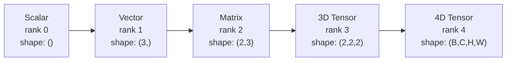
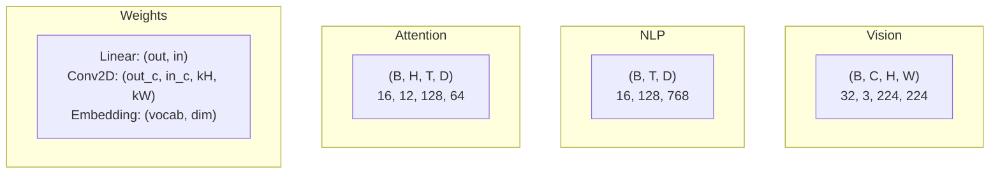
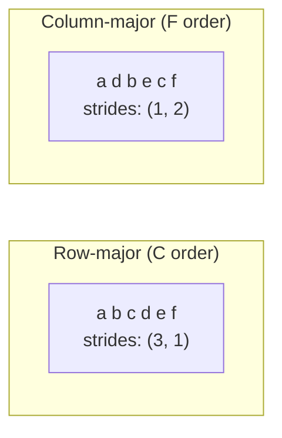
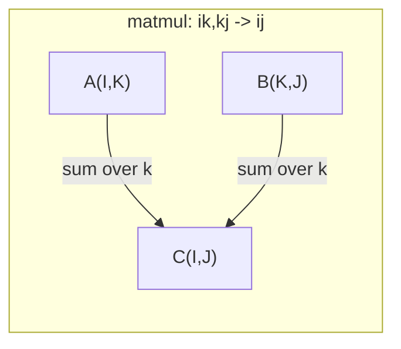

# Hoạt động Tensor 张量运算

> Các tensor là ngôn ngữ chung giữa dữ liệu và học tập sâu. Mỗi hình ảnh, mỗi câu, mọi gradient chảy qua chúng.
> 张量 là ngôn ngữ chung của dữ liệu và học sâu. Mỗi hình ảnh, mỗi câu, mỗi bậc đều di chuyển qua 张量.

**Type:** Build | **类型:** 动手
**Language:**Python**语言:**Python
**Prerequisites:** Phase 1, Lessons 01 (Linear Algebra Intuition), 02 (Vectors, Matrices & Operations) | **前置知识:** Phase 1, Lessons 01-02
**Time:** ~90 minutes | **时间:** ~90 分钟

## Mục tiêu học tập

- Thực hiện một lớp tensor với hình dạng, bước, tái hình, chuyển giao và các hoạt động thông minh về yếu tố từ đầu
  Từ không thực hiện hình dạng, bước dài, tái tạo, chuyển đổi và từng phần tử hoạt động của các loại khối lượng
- Sử dụng các quy tắc phát sóng để vận hành trên các tensor có hình dạng khác nhau mà không sao chép dữ liệu
  应用广播规则 để vận hành các khối lượng dữ liệu có hình dạng khác nhau mà không cần phải sao chép dữ liệu
- Viết biểu thức tổng số cho các sản phẩm chấm, nhân tử liệu, các sản phẩm bên ngoài và các hoạt động đợt
  编写 một số lượng biểu hiện thực hiện điểm tích 矩阵乘法 外积和批量操作
- Theo dõi các hình dạng tensor chính xác thông qua mỗi bước của sự chú ý đa đầu
  Theo dõi nhiều tâm trí trong từng bước hình dạng chính xác

> **【中文解读】**
> 张量 là ngôn ngữ chung của dữ liệu và học sâu. 量 là một 张量,矩阵 là một 两维张量, RGB 图像 là một 三维张量. 量 là một 张量类, hiểu hình dạng, bước长, phát sóng và một 总数.

## Vấn đề  vấn đề giới thiệu

> **【中文解读】**Anh xây dựng một chiếc Transformer, chạy rồi.`RuntimeError: shapes cannot be multiplied (32x768 and 512x768)`Shape 错误 là lỗi phổ biến nhất trong học tập sâu. Transformer có vài chục re-shape/transpose/broadcast 操作串联, một轴搞错就级联报错. 张量是向量和矩阵的推广, hiểu 张量操作是调试神经网络的基本功劳.

## Khái niệm cốt lõi

> **【拓展：张量 shape 是 AI 工程师的日常】**调试神经网络 90% thời gian trong xử lý hình dạng 问题──关键工具:`print(tensor.shape)`查看 hình dạng,`.reshape()`Trọng lượng`.transpose()`转置,`.unsqueeze()`增加维度──PyTorch của một lượng`torch.einsum('bhd,bhd->bh', q, k)`) với Einstein 求和约定一行搞定复杂张量运算, là biến thể 实现的利器──

### Tensor là gì?

Một tensor là một mảng số đa chiều với một loại dữ liệu đồng nhất.**rank**(hoặc **order**(trước đó, mỗi chiều kích là một**axis**- **shape**là một tuple liệt kê kích thước dọc theo mỗi trục.
> 张量 là một nhóm đa chiều với kiểu dữ liệu thống nhất.**秩**(hoặc**阶**), mỗi dimension là một**轴**- Tôi không biết.**形状**là một danh sách các tập đoàn lớn của các tập đoàn.



Tổng số các yếu tố = sản phẩm của tất cả các kích thước.`(2, 3, 4)`giữ `2 * 3 * 4 = 24`Các yếu tố.
> 总元素数 = 所有维度大小的乘积――形状 `(2, 3, 4)`包含 `2 * 3 * 4 = 24`个元素.

### hình dạng tensor trong học sâu 

Các loại dữ liệu khác nhau được lập bản đồ cho các hình dạng tensor cụ thể theo quy ước.
> Các loại dữ liệu khác nhau theo quy tắc được phân tích thành hình dạng khối lượng cụ thể.



PyTorch sử dụng NCHW (channels-first). TensorFlow mặc định cho NHWC (channels-last).
> PyTorch sử dụng NCHW(通道在前),TensorFlow 默认 NHWC(通道在后) ・布局不匹配会导致隐性减速或错误──

### Làm thế nào bộ nhớ sắp xếp hoạt động

Một mảng 2D trong bộ nhớ là một chuỗi 1D của các byte. **Strides**cho bạn biết có bao nhiêu yếu tố để bỏ qua để di chuyển một bước dọc theo mỗi trục.
> Trong bộ nhớ 2D 数组 là 1D 字节序列.**步长**Nói cho anh biết mỗi bước di chuyển cần phải nhảy qua bao nhiêu yếu tố.



Transpose không di chuyển dữ liệu. Nó thay đổi các bước, tạo ra tensor **non-contiguous**-- các yếu tố của một dãy không còn lân cận trong bộ nhớ.
> 转置不移动数据──它交换步长,使张量**不连续**Các yếu tố không còn trong bộ nhớ.

### Quy tắc phát thanh.

Truyền thông cho phép bạn vận hành trên các tensor hình dạng khác nhau mà không sao chép dữ liệu. Các hình dạng sắp xếp từ bên phải. Hai chiều kích tương thích khi chúng bằng hoặc một là 1.
> 广播让你对形状的不同张量操作而无需复制数据―― từ bên phải对形状的齐――两个维度相等或其中一个为1 时兼容――较小的维度在左侧填满1――

```
Tensor A:     (8, 1, 6, 1)
Tensor B:        (7, 1, 5)
Padded B:     (1, 7, 1, 5)
Result:       (8, 7, 6, 5)
```

### Einsum: hoạt động tensor phổ quát

Einstein tổng kết gắn nhãn mỗi trục bằng một chữ cái. trục trong đầu vào nhưng không đầu ra được tổng hợp. Trục trong cả hai được giữ.
> Einstein 求和用字母标记每个轴──在输入但不在输出中的轴被求和──两者都有的轴保留──



Các mô hình chính: `i,i->`(điểm sản phẩm / 点积),`i,j->ij`(trên sản phẩm / 外积), `ii->`(các dấu vết / 迹), `ij->ji`(trả / 转置),`bij,bjk->bik`(batch matmul / 批量矩阵乘法),`bhtd,bhsd->bhts`(trọng tâm điểm / chú ý).

## Hãy xây dựng nó.
```figure
tensor-broadcast
```

## Hãy xây dựng nó

Mã sống trong `code/tensors.py`Mỗi bước đều đề cập đến việc thực hiện ở đó.
> 代码在 `code/tensors.py`Trong mỗi bước đều trích dẫn những thực hiện ở đó.

### Bước 1: Tăng lưu trữ và bước đi.

Một tensor lưu trữ một danh sách số bằng phẳng cộng với metadata hình dạng.
> 张量存储 một 平的数字列表加上形状元数据──步长告诉索引逻辑如何将多维索引映射到平位置──

```python
class Tensor:
    def __init__(self, data, shape=None):
        if isinstance(data, (list, tuple)):
            self._data, self._shape = self._flatten_nested(data)
        elif isinstance(data, np.ndarray):
            self._data = data.flatten().tolist()
            self._shape = tuple(data.shape)
        else:
            self._data = [data]
            self._shape = ()

        if shape is not None:
            total = reduce(lambda a, b: a * b, shape, 1)
            if total != len(self._data):
                raise ValueError(
                    f"Cannot reshape {len(self._data)} elements into shape {shape}"
                )
            self._shape = tuple(shape)

        self._strides = self._compute_strides(self._shape)

    @staticmethod
    def _compute_strides(shape):
        if len(shape) == 0:
            return ()
        strides = [1] * len(shape)
        for i in range(len(shape) - 2, -1, -1):
            strides[i] = strides[i + 1] * shape[i + 1]
        return tuple(strides)
```

Để hình dạng `(3, 4)`, bước tiến là`(4, 1)`-- bỏ qua 4 yếu tố để tiến lên một hàng, bỏ qua 1 yếu tố để tiến lên một cột.
> Đối với hình dạng`(3, 4)`,步长为 `(4, 1)`                                                                                                                                                                                                                                                              

### Bước 2: Tạo lại, nén, nén. Bước 2: tái tạo, nén, mở rộng kích thước.

Tạo lại hình dạng mà không thay đổi thứ tự của các yếu tố.`-1`cho một chiều để suy luận kích thước của nó.
> Tạo lại hình dạng thay đổi không thay đổi trình tự các yếu tố.`-1`tự động đoán một kích thước lớn.

```python
t = Tensor(list(range(12)), shape=(2, 6))
r = t.reshape((3, 4))
r = t.reshape((-1, 3))
```

Squeeze loại bỏ trục kích thước 1. Uncpress inserts one. Uncpressing là quan trọng cho phát sóng - một vector bias`(D,)`thêm vào một lô `(B, T, D)`cần không bị ép buộc`(1, 1, D)`- Tôi không biết.
> Squeeze 移除大小为 1 的轴,Unsqueeze 插入一个──Unsqueeze đối với广播至关重要偏向量 `(D,)`Thêm đến nhiều lần`(B, T, D)`         `(1, 1, D)`

```python
t = Tensor(list(range(6)), shape=(1, 3, 1, 2))
s = t.squeeze()
v = Tensor([1, 2, 3])
u = v.unsqueeze(0)
```

### Bước 3: Chuyển và chuyển đổi.

Transpose swaps hai trục, Permute sắp xếp lại tất cả trục, đây là cách bạn chuyển đổi giữa NCHW và NHWC.
> Chuyển chuyển 交换两个轴──Permute 重排所有轴── đây là cách chuyển đổi giữa NCHW và NHWC──

```python
mat = Tensor(list(range(6)), shape=(2, 3))
tr = mat.transpose(0, 1)

t4d = Tensor(list(range(24)), shape=(1, 2, 3, 4))
perm = t4d.permute((0, 2, 3, 1))
```

Sau khi chuyển hoặc chuyển đổi, tensor không liên kết trong bộ nhớ.`view`thất bại trên các tensor không liên kết -- sử dụng `reshape`hoặc gọi`.contiguous()`Đầu tiên.
> 转置或排列后,张量在内存中不连续──PyTorch 中 `view`Trong không liên tục 张量上会失败使用 `reshape`hoặc đầu tiên调用`.contiguous()`

### Bước 4: Các hoạt động và giảm độ thông minh về các yếu tố.

Các hoạt động thông minh về các yếu tố (lập thêm, nhân, trừ) áp dụng độc lập cho mỗi yếu tố và giữ lại hình dạng.
> 逐元素操作 (加、乘、减) 独立应用于每个元素并保持形状──归约 (归约) 总量,平均,最大) 折叠一个或多个轴──

```python
a = Tensor([[1, 2], [3, 4]])
b = Tensor([[10, 20], [30, 40]])
c = a + b
d = a * 2
s = a.sum(axis=0)
```

Trung bình toàn cầu tập hợp trong một CNN: `(B, C, H, W).mean(axis=[2, 3])`sản xuất `(B, C)`. Tỷ lệ liên tục trung bình tập hợp trong NLP: `(B, T, D).mean(axis=1)`sản xuất `(B, D)`- Tôi không biết.
> CNN Trung tâm toàn cảnh trung bình:`(B, C, H, W).mean(axis=[2, 3])` tạo ra `(B, C)`❖ NLP trong chuỗi trung bình:`(B, T, D).mean(axis=1)` tạo ra `(B, D)`

### Bước 5: Truyền thông với NumPy.

- `demo_broadcasting_numpy()`chức năng trong `tensors.py`cho thấy các mô hình cốt lõi.
> `tensors.py`Trung `demo_broadcasting_numpy()`函数 hiển thị mô hình cốt lõi:

```python
activations = np.random.randn(4, 3)
bias = np.array([0.1, 0.2, 0.3])
result = activations + bias

images = np.random.randn(2, 3, 4, 4)
scale = np.array([0.5, 1.0, 1.5]).reshape(1, 3, 1, 1)
result = images * scale

a = np.array([1, 2, 3]).reshape(-1, 1)
b = np.array([10, 20, 30, 40]).reshape(1, -1)
outer = a * b
```

Khoảng cách qua phát sóng: tái định dạng `(M, 2)`đến`(M, 1, 2)`và `(N, 2)`đến`(1, N, 2)`, trừ, vuông, cộng dọc theo trục cuối cùng, lấy gốc vuông. Kết quả: `(M, N)`- Tôi không biết.
> 通过广播计算成对距离:将 `(M, 2)`重塑为 `(M, 1, 2)`- Tôi không biết.`(N, 2)`重塑为 `(1, N, 2)`,相减、平方、沿最后轴求和、取平方根── kết quả:`(M, N)`

### Bước 6: Hoạt động Einsum

- `demo_einsum()`và `demo_einsum_gallery()`các hàm đi qua mọi mô hình chung.
> `demo_einsum()`和 `demo_einsum_gallery()`Phụng hàm mô tả từng kiểu thường gặp.

```python
a = np.array([1.0, 2.0, 3.0])
b = np.array([4.0, 5.0, 6.0])
dot = np.einsum("i,i->", a, b)

A = np.array([[1, 2], [3, 4], [5, 6]], dtype=float)
B = np.array([[7, 8, 9], [10, 11, 12]], dtype=float)
matmul = np.einsum("ik,kj->ij", A, B)

batch_A = np.random.randn(4, 3, 5)
batch_B = np.random.randn(4, 5, 2)
batch_mm = np.einsum("bij,bjk->bik", batch_A, batch_B)
```

Chi phí tính toán của một sự suy giảm là sản phẩm của tất cả các kích thước chỉ số (được giữ và cộng lại).`bij,bjk->bik`với B=32, I=128, J=64, K=128: `32 * 128 * 64 * 128 = 33,554,432`số cộng nhiều.
> 缩减 tính toán chi phí là nhân số của tất cả các chỉ số                                                                                                                                                                                                                                                       

### Bước 7: Cơ chế chú ý qua một con số. Bước 7: Sử dụng một con số để thực hiện một cơ chế chú ý.

- `demo_attention_einsum()`chức năng thực hiện nhiều đầu chú ý cuối đến cuối.
> `demo_attention_einsum()`函数端到端实现多头注意力──

```python
B, H, T, D = 2, 4, 8, 16
E = H * D

X = np.random.randn(B, T, E)
W_q = np.random.randn(E, E) * 0.02

Q = np.einsum("bte,ek->btk", X, W_q)
Q = Q.reshape(B, T, H, D).transpose(0, 2, 1, 3)

scores = np.einsum("bhtd,bhsd->bhts", Q, K) / np.sqrt(D)
weights = softmax(scores, axis=-1)
attn_output = np.einsum("bhts,bhsd->bhtd", weights, V)

concat = attn_output.transpose(0, 2, 1, 3).reshape(B, T, E)
output = np.einsum("bte,ek->btk", concat, W_o)
```

Mỗi bước là một hoạt động tensor: chiếu (matmul qua einsum), phân chia đầu (reform + transpose), điểm chú ý (batch matmul qua einsum), tổng trọng lượng (batch matmul qua einsum), đầu hợp (transpose + reshape), chiếu đầu ra (matmul qua einsum).
> Mỗi bước là các hoạt động:投影 (投影) ̇einsum 矩阵乘法) ̇头分裂 (分化) ̇头分裂 (分化) ̇头重量分数 (分数) ̇ einsum 批量矩阵乘法) ̇加权求和、头合并 (投影) ̇输出投影──

## Hãy sử dụng nó để thực hiện

### Scratch vs NumPy

| Operation / 操作 | Scratch (Tensor class) | NumPy |
|---|---|---|
| Create / 创建 | `Tensor([[1,2],[3,4]])` | `np.array([[1,2],[3,4]])` |
| Reshape / 重塑 | `t.reshape((3,4))` | `a.reshape(3,4)` |
| Transpose / 转置 | `t.transpose(0,1)` | `a.T` or `a.transpose(0,1)` |
| Squeeze / 压缩 | `t.squeeze(0)` | `np.squeeze(a, 0)` |
| Sum / 求和 | `t.sum(axis=0)` | `a.sum(axis=0)` |
| Einsum | N/A | `np.einsum("ij,jk->ik", a, b)` |

### Scratch vs PyTorch

```python
import torch

t = torch.tensor([[1, 2, 3], [4, 5, 6]], dtype=torch.float32)
t.shape
t.stride()
t.is_contiguous()

t.reshape(3, 2)
t.unsqueeze(0)
t.transpose(0, 1)
t.transpose(0, 1).contiguous()

torch.einsum("ik,kj->ij", A, B)
```

PyTorch thêm autograd, hỗ trợ GPU và các hạt nhân BLAS tối ưu hóa.
> PyTorch  tăng tự động phân phân phân, GPU  hỗ trợ và tối ưu hóa BLAS 内核──形状语义完全相同── hiểu phiên bản viết tay, hình dạng của PyTorch đã trở nên dễ đọc──

### Mỗi lớp mạng thần kinh như một hoạt động tensor.

| Operation / 操作 | Tensor Form / 张量形式 | Einsum |
|---|---|---|
| Linear layer / 线性层 | `Y = X @ W.T + b` | `"bd,od->bo"` + bias |
| Attention QKV | `Q = X @ W_q` | `"btd,dh->bth"` |
| Attention scores / 注意力分数 | `Q @ K.T / sqrt(d)` | `"bhtd,bhsd->bhts"` |
| Attention output / 注意力输出 | `softmax(scores) @ V` | `"bhts,bhsd->bhtd"` |
| Batch norm / 批归一化 | `(X - mu) / sigma * gamma` | element-wise + broadcast |
| Softmax | `exp(x) / sum(exp(x))` | element-wise + reduction |

## Chuyển nó đi.

Bài học này tạo ra hai lời nhắc lặp lại:
> Chương trình này có hai lời khuyên có thể lặp lại:

1. **`outputs/prompt-tensor-shapes.md`**-- Một lời nhắc hệ thống để gỡ lỗi sự không phù hợp hình dạng tensor.
   Một phần hệ thống của hình dạng không phù hợp调试提示词――

2. **`outputs/prompt-tensor-debugger.md`**-- Một lời nhắc sửa lỗi từng bước bạn dán vào bất kỳ trợ lý AI nào khi một lỗi hình dạng đang chặn bạn.
   Một phần từ phác thảo, dán vào bất kỳ AI  trợ lý nào trong hình dạng sai lầm ngăn chặn.

## Tập luyện bài tập

1. **Easy -- Reshape round-trip.**Hãy lấy một tensor hình dạng `(2, 3, 4)`- Đổi lại nó để `(6, 4)`, sau đó là `(24,)`, rồi quay lại `(2, 3, 4)`. Định trình các yếu tố xác minh được duy trì tại mỗi bước bằng cách in dữ liệu phẳng.
   **简单 -- 重塑往返。**取形状 `(2, 3, 4)`         `(6, 4)`, tái为`(24,)`, quay lại `(2, 3, 4)`❖ kiểm tra các yếu tố theo thứ tự giữ nguyên.

2. **Medium -- Implement broadcasting.**Tăng `Tensor`lớp với một `broadcast_to(shape)`phương pháp mở rộng kích thước 1 để phù hợp với một hình mục tiêu.`_elementwise_op`để phát sóng tự động trước khi hoạt động.`(3, 1)`và `(1, 4)`sản xuất `(3, 4)`- Tôi không biết.
   **中等 -- 实现广播。**Trong `Tensor`类中添加 `broadcast_to(shape)`Phương pháp:`_elementwise_op`自动广播──测试 `(3, 1)`和 `(1, 4)` tạo ra `(3, 4)`

3. **Hard -- Build einsum from scratch.**Thực hiện một cơ bản `einsum(subscripts, *tensors)`hàm xử lý ít nhất: sản phẩm điểm (`i,i->`), số tử số (`ij,jk->ik`), sản phẩm bên ngoài (`i,j->ij`), và chuyển giao (`ij->ji`). Phân tích chuỗi chữ viết dưới, xác định các chỉ số bị ký kết, và vòng lặp trên tất cả các kết hợp chỉ số. So sánh kết quả của bạn với `np.einsum`- Tôi không biết.
   **困难 -- 从零构建 einsum。**实现基本的 `einsum`函数处理点积、矩阵乘法、外积和转置──解析下标字符串,识别缩索引,遍历所有索引组合──

4. **Hard -- Attention shape tracker.**Viết một hàm có tính`batch_size`- `seq_len`- `embed_dim`, và`num_heads`như đầu vào và in hình chính xác tại mỗi bước của sự chú ý đa đầu.
   **困难 -- 注意力形状追踪器。**编写函数,输入 `batch_size``seq_len``embed_dim`和 `num_heads`, in nhiều chú ý từng bước hình dạng chính xác.

## Từ khóa  Từ khóa nhanh chóng

| Term / 术语 | What people say | What it actually means / 实际含义 |
|---|---|---|
| Tensor / 张量 | "A matrix but more dimensions" | A multi-dimensional array with uniform type and defined shape, strides, and operations / 具有统一类型和定义的形状、步长、操作的多维数组 |
| Rank / 秩 | "The number of dimensions" | The number of axes. A matrix has rank 2, not rank equal to its matrix rank / 轴的数量。矩阵的秩为 2 |
| Shape / 形状 | "The size of the tensor" | A tuple listing the size along each axis. `(2, 3)` means 2 rows, 3 columns / 列出各轴大小的元组 |
| Stride / 步长 | "How memory is laid out" | The number of elements to skip to advance one position along each axis / 沿每个轴前进一个位置要跳过的元素数 |
| Broadcasting / 广播 | "It just works when shapes differ" | A strict set of rules: align from right, dimensions must be equal or one must be 1 / 严格规则：从右对齐，维度必须相等或一个为 1 |
| Contiguous / 连续 | "The tensor is normal" | Elements stored sequentially in memory with no gaps / 元素在内存中顺序存储无间隙 |
| Einsum | "A fancy way to write matmul" | A general notation that expresses any tensor contraction, outer product, trace, or transpose in one line / 通用表示法，一行表达任何张量收缩、外积、迹或转置 |
| View / 视图 | "Same as reshape" | A tensor sharing the same memory buffer but with different shape/stride metadata. Fails on non-contiguous data / 共享内存缓冲区但形状/步长元数据不同的张量 |
| Contraction / 收缩 | "Summing over an index" | The general operation where a shared index between tensors is multiplied and summed / 共享索引被乘和求和的通用操作 |
| NCHW / NHWC | "PyTorch vs TensorFlow format" | Memory layout conventions for image tensors / 图像张量的内存布局约定 |

## Xem thêm 延伸阅读

- [NumPy Broadcasting](https://numpy.org/doc/stable/user/basics.broadcasting.html)-- Các quy tắc kinh thánh với các ví dụ trực quan
  NumPy 广播规则与可视化示例
- [PyTorch Tensor Views](https://pytorch.org/docs/stable/tensor_view.html)- Khi xem hoạt động và khi họ sao chép
  PyTorch 视图何时工作何时复制
- [einops](https://github.com/arogozhnikov/einops)-- Một thư viện làm cho việc tái định hình tensor dễ đọc và an toàn
  让张量重塑可读且安全的库
- [The Illustrated Transformer](https://jalammar.github.io/illustrated-transformer/)- Hình ảnh hình dạng tensor chảy qua sự chú ý
  hình dạng của dòng chảy trong sự chú ý
- [Einstein Summation in NumPy](https://numpy.org/doc/stable/reference/generated/numpy.einsum.html)-- Tài liệu tổng hợp đầy đủ với ví dụ
  Số lượng đơn 完整文档与示例
