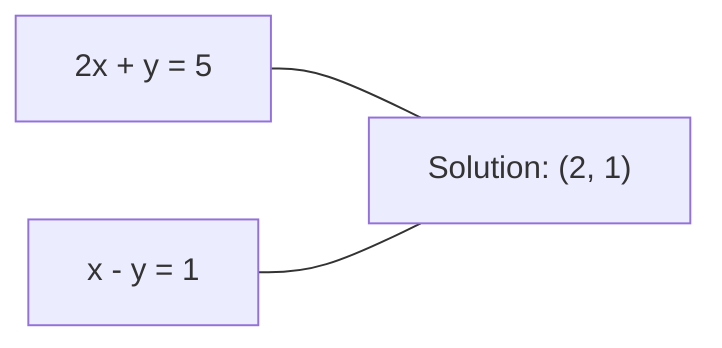
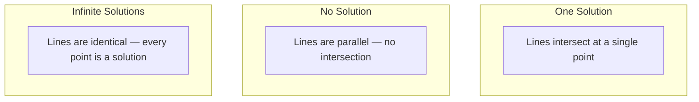

# Hệ thống tuyến tính

> Giải quyết Ax = b là vấn đề lâu đời nhất trong toán học vẫn chạy mạng thần kinh của bạn.
> Xác định Ax=b là vấn đề cổ xưa nhất trong toán học, vẫn đang thúc đẩy mạng thần kinh của bạn.

**Type:** Build | **类型:** 动手
**Language:**Python**语言:**Python
**Prerequisites:** Phase 1, Lessons 01 (Linear Algebra Intuition), 02 (Vectors & Matrices), 03 (Matrix Transformations) | **前置知识:** Phase 1, 第 01 课（线性代数直觉）、第 02 课（向量与矩阵）、第 03 课（矩阵变换）
**Time:** ~120 minutes | **时间:** ~120 分钟

## Mục tiêu học tập

- Xóa Ax = b bằng cách sử dụng loại bỏ Gaussian với xoay một phần và thay thế ngược
  Sử dụng带部分主元选取(Partial Pivoting) của高斯消元法和回代法求解 Ax = b
- Các matrices nhân tố với LU, QR, và cholesky phân hủy và giải thích khi nào mỗi thích hợp
  Sử dụng LU、QR 和 Cholesky 分解(Decomposition) phân chia矩阵,并 giải thích các phương pháp ứng dụng
- Thuộc dẫn các phương trình bình thường cho các hình vuông tối thiểu và kết nối chúng với sự lùi đường thẳng và sườn
  推导最小二乘法正规方程(Tình thức phương trình),并将其与线性归归和归归联系起来
- Chẩn đoán các hệ thống không điều kiện tốt bằng cách sử dụng số điều kiện và áp dụng quy định để ổn định chúng
  Sử dụng điều kiện số (Condition Number) 诊断病态系统,并应用正则化 (Regularisation) làm cho nó ổn định


> **【中文解读】**
> Giải quyết Ax=b là vấn đề cổ xưa nhất trong toán học. Các phương trình chính thức về trật tự trật tự trật tự trật tự trật tự trật tự trật tự trật tự trật tự trật tự trật tự trật tự trật tự trật tự.

## Vấn đề  vấn đề giới thiệu

Mỗi lần bạn đào tạo một sự hồi quy tuyến tính, bạn giải quyết một hệ thống tuyến tính. mỗi khi bạn tính toán một phù hợp ít nhất vuông, bạn giải quyết một hệ thống tuyến tính. mỗi khi một lớp mạng thần kinh tính toán.`y = Wx + b`, đó là đánh giá một mặt của một hệ thống tuyến tính. khi bạn thêm quy định, bạn sửa đổi hệ thống. khi bạn sử dụng các quá trình Gaussian, bạn tính toán một matrix. khi bạn đảo ngược một matrix tính biến đối với khoảng cách Mahalanobis, bạn giải quyết một hệ thống tuyến tính.

> Mỗi lần tập trung về đường dây, bạn đều trong giải trình hệ thống. Mỗi lần tính toán tối thiểu hai lần phù hợp, bạn đều trong giải trình hệ thống. Mỗi lần tính toán tầng mạng thần kinh.`y = Wx + b`, nó là ở một bên của hệ thống đánh giá tuyến tính. Khi bạn thêm quy tắc, bạn sửa đổi hệ thống.

Phương trình Ax = b xuất hiện ở mọi nơi. A là một trật tự của các hệ số được biết. b là một vector của các kết quả được biết. x là vector của những điều chưa biết bạn muốn tìm. Trong sự hồi quy tuyến tính, A là trật tự dữ liệu của bạn, b là vector mục tiêu của bạn, và x là vector trọng lượng. Toàn bộ mô hình giảm xuống: tìm x như vậy Ax là gần b càng tốt.

> 方程 Ax = b 无处不在──A là mô hình số lượng được biết, b là mô hình đầu ra được biết, x là mô hình bạn yêu cầu không biết.

Bài học này xây dựng mọi phương pháp chính để giải quyết phương trình đó từ đầu. Bạn sẽ hiểu tại sao một số phương pháp nhanh và một số khác ổn định, tại sao một số chỉ hoạt động cho các hệ thống vuông và một số khác xử lý các hệ thống quá xác định, và tại sao số điều kiện của dải tử liệu của bạn quyết định liệu câu trả lời của bạn có nghĩa gì không.

> Bài học này sẽ giải quyết tất cả các phương pháp chính của phương trình từ không. Bạn sẽ hiểu tại sao một số phương pháp nhanh chóng và một số ổn định, tại sao một số chỉ áp dụng cho các hệ thống phương trình và một số có thể xử lý các hệ thống siêu định, và tại sao số lượng các điều kiện của các phương trình quyết định câu trả lời của bạn có ý nghĩa hay không.

## Khái niệm cốt lõi

> **【中文解读】**
> Ax = b có nghĩa hình học: mỗi đường phương trình xác định một siêu phẳng, giải là tất cả các điểm giao điểm của siêu phẳng. Đối với hệ thống siêu định định (x) số phương trình > số chưa biết, không có giải pháp chính xác, tối thiểu hai phương pháp tìm kiếm để làm cho phần còn lại tối thiểu "hình thức tốt nhất" (best approximation).

> **【拓展：线性系统在推荐系统中的规模】**
> Trong cuộc thi giải thưởng Netflix, vấn đề phân giải矩阵 liên quan đến 480.000 người dùng và 17.770 bộ phim.

### Ax = b có nghĩa là gì về mặt hình học

Một hệ thống các phương trình tuyến tính có một cách giải thích hình học. Mỗi phương trình xác định một siêu phẳng. Giải pháp là điểm (hoặc tập hợp các điểm) nơi tất cả các siêu phẳng giao nhau.

> 线性方程组有几何解释── mỗi方程定义一个超平面──超平面──解是所有超平面的交点──或交点集──

```
2x + y = 5          Two lines in 2D.
x - y  = 1          They intersect at x=2, y=1.
```



Ba điều có thể xảy ra:



Trong dạng matrix, "một giải pháp" có nghĩa là A là đảo ngược. "Không giải pháp" có nghĩa là hệ thống không nhất quán. "Các giải pháp vô hạn" có nghĩa là A có không gian không. Hầu hết các vấn đề ML thuộc loại "không giải pháp chính xác" bởi vì bạn có nhiều phương trình (điểm dữ liệu) hơn các không rõ (chỉ số). Đó là nơi có ít lượng vuông nhất.

> 用矩阵语言说, "一个解" có nghĩa là A 可逆――"无解" có nghĩa là hệ thống không nhất trí――"无穷多解" có nghĩa là A có không gian (không gian) 零―― Hầu hết các vấn đề của ML thuộc về "无精确解"类, vì số lượng phép tính (năm dữ liệu) nhiều hơn số lượng chưa biết (参数) ⋅ đây là số lượng tối thiểu của phép tính hai lần.

### Hình cột vs hình hàng

Có hai cách để đọc Ax = b.

> 阅读 Ax = b Có hai cách:

**Row picture.**Mỗi hàng của A xác định một phương trình. Mỗi phương trình là một siêu phẳng. Giải pháp là nơi tất cả chúng giao nhau.

> **行视角。**Mỗi đường của A xác định một phương trình. Mỗi phương trình là một siêu trình diện.

**Column picture.**Mỗi cột của A là một vector. Câu hỏi trở thành: kết hợp tuyến tính nào của cột của A tạo ra b?

> **列视角。**A của mỗi hàng là một khối lượng.

```
A = | 2  1 |    b = | 5 |
    | 1 -1 |        | 1 |

Row picture: solve 2x + y = 5 and x - y = 1 simultaneously.

Column picture: find x1, x2 such that:
  x1 * [2, 1] + x2 * [1, -1] = [5, 1]
  2 * [2, 1] + 1 * [1, -1] = [4+1, 2-1] = [5, 1]   check.
```

Hình ảnh cột là cơ bản hơn. Nếu b nằm trong không gian cột của A, hệ thống có giải pháp. Nếu b không, bạn tìm thấy điểm gần nhất trong không gian cột. Điểm gần nhất là giải pháp các vuông nhỏ nhất.

> 列视角更根本──如果 b trong A của列空间(Column Space) trong, hệ thống có giải pháp──如果 b không trong列空间, bạn tìm thấy điểm gần nhất trong列空间──那个最近的点就是最小二乘解──

### Phục tiêu Gaussian

Việc loại bỏ Gaussian biến Ax = b thành một hệ thống tam giác trên Ux = c mà bạn giải quyết bằng cách thay thế phía sau.

> CaoS消元法将 Ax = b 转化为上三角系统 Ux = c, sau đó qua回代法 tìm giải pháp. Đây là phương pháp trực tiếp nhất.

Khóa toán:

```
1. For each column k (the pivot column):
   a. Find the largest entry in column k at or below row k (partial pivoting).
   b. Swap that row with row k.
   c. For each row i below k:
      - Compute multiplier m = A[i][k] / A[k][k]
      - Subtract m times row k from row i.
2. Back substitute: solve from the last equation upward.
```

Ví dụ:

```
Original:
| 2  1  1 | 8 |       R2 = R2 - (2)R1     | 2  1   1 |  8 |
| 4  3  3 |20 |  -->  R3 = R3 - (1)R1 --> | 0  1   1 |  4 |
| 2  3  1 |12 |                            | 0  2   0 |  4 |

                       R3 = R3 - (2)R2     | 2  1   1 |  8 |
                                       --> | 0  1   1 |  4 |
                                           | 0  0  -2 | -4 |

Back substitute:
  -2 * x3 = -4    -->  x3 = 2
  x2 + 2  = 4     -->  x2 = 2
  2*x1 + 2 + 2 = 8 --> x1 = 2
```

Gaussian loại bỏ chi phí O ((n^3) các hoạt động. cho một hệ thống 1000x1000, đó là khoảng một tỷ hoạt động điểm nổi.

> Kế toán của pháp luật cao hơn là O (n^3) ⋅ Đối với hệ thống 1000x1000, khoảng cần hàng tỷ lần hoạt động trên các điểm.

> **【中文解读】**
> Tư tưởng về luật cao tiêu hóa rất đơn giản: thông qua đường chuyển đổi矩阵 thành hình thức trên ba góc (với góc dưới là 0), sau đó từ đường cuối bắt đầu "lại thế" tìm giải pháp.

### Phong trào một phần: tại sao nó quan trọng

Nếu không xoay, việc loại bỏ Gaussian có thể thất bại hoặc tạo ra rác. Nếu một yếu tố xoay là không, bạn chia bằng không. Nếu nó nhỏ, bạn tăng cường sai lầm xoay.

> Không có giá trị chủ yếu, có thể thất bại hoặc tạo ra kết quả rác. Nếu giá trị chủ yếu là 0, bạn sẽ bị phân chia thành 0. Nếu giá trị chủ yếu là rất nhỏ, bạn sẽ làm cho sự khác biệt lớn hơn.

```
Bad pivot:                       With partial pivoting:
| 0.001  1 | 1.001 |            Swap rows first:
| 1      1 | 2     |            | 1      1 | 2     |
                                 | 0.001  1 | 1.001 |
m = 1/0.001 = 1000              m = 0.001/1 = 0.001
R2 = R2 - 1000*R1               R2 = R2 - 0.001*R1
| 0.001  1     | 1.001   |      | 1      1     | 2     |
| 0     -999   | -999.0  |      | 0      0.999 | 0.999 |

x2 = 1.000 (correct)            x2 = 1.000 (correct)
x1 = (1.001 - 1)/0.001          x1 = (2 - 1)/1 = 1.000 (correct)
   = 0.001/0.001 = 1.000        Stable because the multiplier is small.
```

Trong toán học điểm nổi với độ chính xác hạn chế, phiên bản không xoay có thể mất các chữ số đáng kể.

> Trong các hoạt động trên các điểm có độ chính xác hạn chế, phiên bản không có chính yếu tố được chọn có thể bị mất số hiệu quả. Phần chính yếu tố được chọn thường chọn chính yếu tố có thể được tối đa để giảm thiểu sự khác biệt lớn hơn.

### LU phân hủy

LU phân hủy các yếu tố A thành một ma trận ba giác dưới L và một ma trận ba giác trên U: A = LU.

> LU phân giải sẽ phân giải A thành một矩阵 L và một矩阵 U:A = LU。L 矩阵存储高斯消元中的乘数。U 矩阵是消元的结果。

```
A = L @ U

| 2  1  1 |   | 1  0  0 |   | 2  1   1 |
| 4  3  3 | = | 2  1  0 | @ | 0  1   1 |
| 2  3  1 |   | 1  2  1 |   | 0  0  -2 |
```

Tại sao tính thay vì chỉ loại bỏ? bởi vì một khi bạn có L và U, giải quyết Ax = b cho bất kỳ b mới nào chỉ tốn O ((n ^ 2):

> Tại sao phân hủy thay vì tiêu hóa trực tiếp? Vì một khi có L và U, đối với bất kỳ b mới nào, Ax = b chỉ cần O (n ^ 2):

```
Ax = b
LUx = b
Let y = Ux:
  Ly = b    (forward substitution, O(n^2))
  Ux = y    (back substitution, O(n^2))
```

Chi phí O ((n^3) được trả một lần trong quá trình tính toán. Mỗi giải pháp tiếp theo là O ((n^2). Nếu bạn cần giải quyết 1000 hệ thống với cùng A nhưng các vector b khác nhau, LU tiết kiệm một nhân tố 1000/3 trong tổng công việc.

> Giá của O (n^3) trong quá trình phân hủy chỉ trả một lần.

Với xoay một phần, bạn có được PA = LU nơi P là một matrix chuyển đổi ghi lại các thay đổi hàng.

> Sử dụng phần chủ yếu của các tùy chọn, nhận được PA = LU, trong đó P là ghi lại chuyển đổi của thay đổi矩阵 (Permutation Matrix)

> **【拓展：LU 分解在大规模科学计算中的角色】**
> Trong phân tích có giới hạn (FEA), các mô hình khó tính trong cơ cấu cơ cấu thường là các mô hình khó tính của hàng triệu giai đoạn. SuperLU và MUMPS 等库 thông qua các mô hình khó tính của LU phân giải các hệ thống này. Một lần phân giải sau nhiều lần có thể giảm 100-1000 lần. Mô hình dự báo thời tiết mỗi 6 giờ được cập nhật một lần, cần nhiều lần tìm kiếm các mô hình đường dẫn với số lượng khác nhau của mô hình khó tính khác nhau bên phải.

### Sự phân hủy QR

Các yếu tố phân hủy QR A thành một matrix chữ nhật Q và một matrix tam giác trên R: A = QR.

> QR 分解将 A 分解为一个正交矩阵(Orthogonal Matrix) Q 和一个上三角矩阵 R:A = QR。

Một matrix trực giác có tính chất Q^T Q = I. Cột của nó là vector hoặc hợp lý.

> 正交矩阵具有性质 Q^T Q = I. 列是标准正交向量.

```
A = Q @ R

Q has orthonormal columns: Q^T Q = I
R is upper triangular

To solve Ax = b:
  QRx = b
  Rx = Q^T b    (just multiply by Q^T, no inversion needed)
  Back substitute to get x.
```

QR số hiệu ổn định hơn LU để giải quyết các vấn đề có số lượng nhỏ nhất.

> QR trong tìm kiếm giải pháp số lượng tối thiểu của vấn đề lần thứ hai trên LU hơn ổn định.

```
Given columns a1, a2, ... of A:

q1 = a1 / ||a1||

q2 = a2 - (a2 . q1) * q1        (subtract projection onto q1)
q2 = q2 / ||q2||                (normalize)

q3 = a3 - (a3 . q1) * q1 - (a3 . q2) * q2
q3 = q3 / ||q3||

R[i][j] = qi . aj    for i <= j
```

Mỗi bước loại bỏ thành phần dọc theo tất cả các vector q trước đó, chỉ để lại hướng thẳng đứng mới.

> Mỗi bước đều di chuyển theo tất cả các hướng trước đó, chỉ để lại hướng mới chính xác.

### Sự phân hủy của Cholesky

Khi A là đối xứng (A = A^T) và xác định tích cực (tất cả các giá trị riêng tích cực), bạn có thể nhân tố nó như A = L L^T nơi L là hình ba thấp hơn. Đây là phân hủy Cholesky.

> Khi A là đối称 của(A = A^T) và chính xác(tất cả các đặc điểm giá trị为正), bạn có thể phân giải nó thành A = L L^T, trong đó L là dưới三角矩阵。 đây là Cholesky 分解。

```
A = L @ L^T

| 4  2 |   | 2  0 |   | 2  1 |
| 2  5 | = | 1  2 | @ | 0  2 |

L[i][i] = sqrt(A[i][i] - sum(L[i][k]^2 for k < i))
L[i][j] = (A[i][j] - sum(L[i][k]*L[j][k] for k < j)) / L[j][j]    for i > j
```

Cholesky nhanh gấp đôi LU và đòi hỏi một nửa lưu trữ. Nó chỉ hoạt động cho các matrix tích cực đối xứng, nhưng chúng luôn xuất hiện:

> Cholesky hơn LU 快两倍, chỉ cần một nửa không gian lưu trữ. Nó chỉ phù hợp với các mô hình chính xác, nhưng mô hình này không có ở đâu cả:

- Các matrix có tính tính tương đối là phân định dương tính đối xứng (định định dương tính với quy định).
  协方差矩阵是对称半正定的(加正则化后正定)
- Các môtrix hạt nhân trong các quy trình Gaussian là đối xứng tích cực xác định.
  Các mô-tự hạt nhân trong quá trình cao là đối称 chính xác.
- Hessian của một hàm ngọc tối thiểu là đối xứng tích cực xác định.
  Hessian 矩阵 của hàm 凸在极小值处是对称正确的──
- A^T A luôn là tích cực đối xứng bán xác định.
  A^T A 总是对称半正确的──

Trong các quy trình Gaussian, bạn tính toán các khối lượng tử liệu hạt nhân K với Cholesky, sau đó giải quyết K alpha = y để có được trung bình dự đoán.

> Trong quá trình cao, bạn sử dụng Cholesky phân giải khối lượng hạt nhân K, sau đó tìm giải pháp K alpha = y  nhận được giá trị trung bình dự đoán. Cholesky 因子 cũng cho ra một đường thẳng khác nhau đối với số: log det(K) = 2 * tổng cộng.

> **【中文解读】**
> Cholesky phân giải là LU phân giải của "động cơ đặc biệt" chỉ áp dụng cho đối tượng chính xác矩阵, nhưng tốc độ là hai lần của LU. Tin tốt là ML ở khắp mọi nơi đều đối tượng chính xác矩阵:协方差矩阵、核矩阵、X^T X、Hessian 矩阵。GPTQ 等 mô hình phương pháp định lượng cũng được sử dụng cho Cholesky phân giải để xử lý Hessian。

### Các hình vuông tối thiểu: khi Ax = b không có giải pháp chính xác

Nếu A là m x n với m > n (năm phương trình nhiều hơn các phương trình chưa biết), hệ thống đã được xác định quá cao. Không có giải pháp chính xác. Thay vào đó, bạn giảm thiểu sai lầm vuông:

> Nếu A là m x n 且 m > n ∈ N , hệ thống là quá xác định (overdetermined) ⋅ không có giải thích chính xác (取而代之), bạn tối thiểu hóa sai lầm vuông:

```
minimize ||Ax - b||^2

This is the sum of squared residuals:
  sum((A[i,:] @ x - b[i])^2 for i in range(m))
```

Máy giảm thiểu đáp ứng các phương trình bình thường:

```
A^T A x = A^T b
```

Xuất phát: mở rộng Ax - b b b b b b b b ^ 2 = (Ax - b) ^ T (Ax - b) = x^T A^T A x - 2 x^T A^T b + b^T b. Hãy lấy gradient đối với x, đặt nó lên 0: 2 A^T A x - 2 A^T b = 0.

> 推导:展开A 求梯度并设为零:2 A 求梯度并设为零:2 A 求梯度

```
Original system (overdetermined, 4 equations, 2 unknowns):
| 1  1 |         | 3 |
| 1  2 | x     = | 5 |       No exact x satisfies all 4 equations.
| 1  3 |         | 6 |
| 1  4 |         | 8 |

Normal equations:
A^T A = | 4  10 |    A^T b = | 22 |
        | 10 30 |            | 63 |

Solve: x = [1.5, 1.7]

This is linear regression. x[0] is the intercept, x[1] is the slope.
```

### Các phương trình bình thường = sự lùi lại tuyến tính

Kết nối chính xác. Trong sự hồi quy tuyến tính, các hình tử dữ liệu của bạn X có một hàng cho mỗi mẫu và một cột cho mỗi tính năng. Dấu mục tiêu của bạn y có một mục nhập cho mỗi mẫu. Dấu trọng lượng w đáp ứng:

> Trong vòng quay trực tuyến, dữ liệu矩阵 X Mỗi dòng một mẫu, mỗi dòng một đặc điểm, mục tiêu một mục tiêu, mỗi mẫu một mục tiêu, trọng lực một khối lượng được đáp ứng:

```
X^T X w = X^T y
w = (X^T X)^(-1) X^T y
```

Đây là giải pháp dạng đóng cho sự lùi ngược tuyến tính.`sklearn.linear_model.LinearRegression.fit()`tính toán này (hoặc tương đương qua QR hoặc SVD).

> Đó là giải pháp của đường dẫn trở lại.`sklearn.linear_model.LinearRegression.fit()`Trong số đó, các nhà máy có thể sử dụng các loại máy tính khác nhau.

Thêm một thuật ngữ bình thường lambda * I vào matrix và bạn nhận được sự lùi lại của sườn:

> Trong矩阵 trên thêm các điều chỉnh lambda * Tôi đã được  trở lại  Ridge Regression):

```
(X^T X + lambda * I) w = X^T y
w = (X^T X + lambda * I)^(-1) X^T y
```

Việc điều chỉnh làm cho các matrix được điều kiện tốt hơn (làm cho nó dễ dàng đảo ngược chính xác hơn) và ngăn chặn quá phù hợp bằng cách thu hẹp trọng lượng về phía không.

> 正则化使矩阵条件数更好 (更容易精确求逆)并通过将权重缩到零以防止过拟合──当 lambda > 0 时,矩阵 X^T X + lambda * I 总是对称正确,所以可以用Cholesky 求解──

> **【拓展：条件数与深度学习训练稳定性】**
> Các nghiên cứu cho thấy, khi số điều kiện của X^T X vượt quá 10^10 ,float32  độ chính xác xuống đường quay lại có thể hoàn toàn không đáng tin cậy.

### Phép đảo ngược (Moore-Penrose)

Phép đảo A+ tổng quát hóa sự đảo ngược của dáng số cho các dáng số không bình phương và đơn vị.

> 伪逆(Pseudoinverse) A+ sẽ矩阵求逆推广到非方阵和奇异矩阵。 đối với bất kỳ矩阵 A:

```
x = A+ b

where A+ = V Sigma+ U^T    (computed via SVD)
```

Sigma+ được hình thành bằng cách lấy tương đối của mỗi giá trị đơn lẻ không bằng 0 và chuyển đổi kết quả. Nếu A = U Sigma V^T, thì A+ = V Sigma+ U^T.

> Sigma+ bởi mỗi không零奇异值取倒数并转置得到──如果A = U Sigma V^T,则A+ = V Sigma+ U^T──

```
A = U Sigma V^T        (SVD)

Sigma = | 5  0 |       Sigma+ = | 1/5  0  0 |
        | 0  2 |                | 0  1/2  0 |
        | 0  0 |

A+ = V Sigma+ U^T
```

Phép đảo ngược cho giải pháp tối thiểu-định luật số lượng vuông thấp nhất. Nếu hệ thống có:
- Một giải pháp: A + b cho nó.
  Một giải: A+ b  đưa ra giải thích này.
- Không giải pháp: A + b cho giải pháp các vuông nhỏ nhất.
  无解: A+ b 给出最小二乘解──
- Giải pháp vô hạn: A + b cho một với số lượng nhỏ nhất của số lượng.
  无穷多解: A+ b 给出范数最小的.

NumPy `np.linalg.lstsq`và `np.linalg.pinv`Cả hai đều sử dụng SVD bên trong.

> NumPy của `np.linalg.lstsq`和 `np.linalg.pinv`内部都使用 SVD。

### Số điều kiện

Số điều kiện đo mức độ nhạy cảm của giải pháp đối với những thay đổi nhỏ trong đầu vào. Đối với một matrix A, số điều kiện là:

> 条件数(Condition Number) đo lường độ nhạy cảm của các biến động nhỏ vào trong.

```
kappa(A) = ||A|| * ||A^(-1)|| = sigma_max / sigma_min
```

nơi sigma_max và sigma_min là các giá trị đơn lẻ lớn nhất và nhỏ nhất.

```
Well-conditioned (kappa ~ 1):        Ill-conditioned (kappa ~ 10^15):
Small change in b -->                Small change in b -->
small change in x                    huge change in x

| 2  0 |   kappa = 2/1 = 2          | 1   1          |   kappa ~ 10^15
| 0  1 |   safe to solve            | 1   1+10^(-15) |   solution is garbage
```

Quy tắc của ngón tay:
- kappa < 100: an toàn, giải pháp chính xác.
  An toàn, giải là chính xác.
- Kappa ~ 10^k: bạn mất khoảng k chữ số độ chính xác từ toán học điểm nổi của bạn.
  Anh sẽ mất khoảng một điểm chính xác.
- kappa ~ 10^16 (đối với float64): giải pháp là vô nghĩa.
  解无意义──矩阵 thực sự là kỳ lạ──

Trong ML, điều kiện xấu xảy ra khi các tính năng gần như liên kết. Việc điều chỉnh (số lambda * I) cải thiện số điều kiện từ sigma_max / sigma_min đến (sigma_max + lambda) / (sigma_min + lambda).

> Trong ML,当特征近似共线 (Collinear)时会出现病态条件──正则化(添加 lambda * I) sẽ điều kiện số từ sigma_max / sigma_min 改善为 (sigma_max + lambda) / (sigma_min + lambda)。

### Phương pháp lặp lại: gradient kết hợp

Đối với các hệ thống hiếm rất lớn (người không biết hàng triệu), các phương pháp trực tiếp như LU hoặc Cholesky quá đắt tiền.

> Đối với hệ thống rất nhỏ (với số lượng vô số), LU hoặc Cholesky 等 trực tiếp là quá đắt tiền.

Tốc độ kết hợp (CG) giải quyết Ax = b khi A là tích cực đối xứng xác định. Nó tìm thấy giải pháp chính xác trong tối đa n lần lặp (trong toán học chính xác), nhưng thường hội tụ nhanh hơn nhiều nếu các giá trị riêng của A được tập hợp.

> 共梯度法 (Conjugate Gradient, CG) ở A là đối称正定时求解 Ax = b。 nó nhiều nhất n 次代就能找到精确解 (精确算术), nhưng nếu giá trị đặc điểm của A tụ tập lại, thường thu được nhanh hơn。

```
Algorithm sketch:
  x0 = initial guess (often zero)
  r0 = b - A x0           (residual)
  p0 = r0                 (search direction)

  For k = 0, 1, 2, ...:
    alpha = (rk . rk) / (pk . A pk)
    x_{k+1} = xk + alpha * pk
    r_{k+1} = rk - alpha * A pk
    beta = (r_{k+1} . r_{k+1}) / (rk . rk)
    p_{k+1} = r_{k+1} + beta * pk
    if ||r_{k+1}|| < tolerance: stop
```

CG được sử dụng trong:
- Tối ưu hóa quy mô lớn (Phương pháp Newton-CG)
  n n n n n n n n n n n n n n n n n
- Giải quyết các sự phân biệt PDE
  Tìm giải pháp phân chia nhỏ
- Các phương pháp hạt nhân khi các ma trận hạt nhân quá lớn để tính
  Phương pháp hạt nhân quá lớn không thể phân hủy
- Việc điều kiện trước cho các máy giải pháp lặp lại khác
  其他代求解器的预处理

Tỷ lệ hội tụ phụ thuộc vào số điều kiện. Hệ thống có điều kiện tốt hơn hội tụ nhanh hơn, đó là một lý do khác vì sao việc điều chỉnh giúp.

> Tỷ lệ nhận phụ thuộc vào số điều kiện.

> **【中文解读】**
> 共梯度法 là một hệ thống cứu hộ của một hệ thống hiếm có quy mô lớn. Nó không cần lưu trữ toàn bộ hệ thống trong hệ thống, chỉ cần hệ thống chuyển động-thực lượng乘法 (O) nz) 时间. Trong các thông điệp truyền tải của mạng lưới thần kinh, hệ thống cạnh tranh là một hệ thống vận hành.

### Hình ảnh đầy đủ: phương pháp nào khi

| Method | Requirements | Cost | Use case |
|--------|-------------|------|----------|
| Gaussian elimination | Square, nonsingular A | O(n^3) | One-off solve of a square system |
| LU decomposition | Square, nonsingular A | O(n^3) factor + O(n^2) solve | Multiple solves with the same A |
| QR decomposition | Any A (m >= n) | O(mn^2) | Least squares, numerically stable |
| Cholesky | Symmetric positive definite A | O(n^3/3) | Covariance matrices, Gaussian processes, ridge regression |
| Normal equations | Overdetermined (m > n) | O(mn^2 + n^3) | Linear regression (small n) |
| SVD / pseudoinverse | Any A | O(mn^2) | Rank-deficient systems, minimum-norm solutions |
| Conjugate gradient | Symmetric positive definite, sparse A | O(n * k * nnz) | Large sparse systems, k = iterations |

### Kết nối với ML

Mỗi phương pháp trong bài học này xuất hiện trong sản xuất ML:

> Mỗi phương pháp trong bài này đều xuất hiện trong sản xuất ML:

**Linear regression.**Giải pháp hình thức đóng giải các phương trình bình thường X^T X w = X^T y. Điều này được thực hiện thông qua Cholesky (n nếu nhỏ) hoặc QR (nếu ổn định số quan trọng) hoặc SVD (nếu các matrix có thể thiếu thứ hạng).

> **线性回归。**解析解求解正规方程 X^T X w = X^T y。通过 Cholesky(n 较小时) hoặc QR(需要数值稳定性时) hoặc SVD(矩阵可能不满秩时)完成。

**Ridge regression.**Thêm lambda * I vào X^T X. Hệ thống thường hóa (X^T X + lambda * I) w = X^T y luôn có thể giải quyết thông qua Cholesky vì X^T X + lambda * I là tích cực đối xứng xác định cho lambda > 0.

> **岭回归。**Trong X^T X 上加 lambda * I。正则化系统 (X^T X + lambda * I) w = X^T y 总是可以通过Cholesky 求解,因为当 lambda > 0 时 X^T X + lambda * I 是对称正确的──

**Gaussian processes.**Tỷ lệ trung bình dự đoán đòi hỏi phải giải quyết K alpha = y nơi K là ma trận hạt nhân.

> **高斯过程。**预测 trung bình cần tìm giải pháp K alpha = y, trong đó K là lõi矩阵。Cholesky 分解 K là phương pháp tiêu chuẩn。对数边际似然使用 log det(K) = 2 sum(log(diag(L)))。

**Neural network initialization.**Việc khởi tạo trực giác sử dụng phân hủy QR để tạo ra các matrix trọng lượng có cột là hoặc bình thường. Điều này ngăn chặn sự sụp đổ tín hiệu trong các mạng sâu.

> **神经网络初始化。**正交初始化 sử dụng QR phân giải tạo ra các tiêu chuẩn正交的权重矩阵.

**Preconditioning.**Các máy tối ưu hóa quy mô lớn sử dụng Cholesky không hoàn chỉnh hoặc LU không hoàn chỉnh như là điều kiện tiên quyết cho các máy giải gradient kết hợp.

> **预处理。**Sử dụng không hoàn toàn Cholesky hoặc không hoàn toàn LU như là điều kiện xử lý trước của các máy tìm kiếm giải pháp quy mô lớn.

**Feature engineering.**Số điều kiện của X^T X cho bạn biết nếu các tính năng của bạn là tròn. Nếu kappa lớn, giảm tính năng hoặc thêm quy định.

> **特征工程。**X^T X số điều kiện cho bạn biết các đặc điểm có chung không. Nếu kappa  rất lớn, xóa các đặc điểm hoặc thêm các tiêu chuẩn.

## Hãy xây dựng nó.
```figure
linear-system-conditioning
```

## Hãy xây dựng nó

### Bước 1: Phục tiêu Gaussian với xoay một phần

```python
import numpy as np

def gaussian_elimination(A, b):
    n = len(b)
    Ab = np.hstack([A.astype(float), b.reshape(-1, 1).astype(float)])

    for k in range(n):
        max_row = k + np.argmax(np.abs(Ab[k:, k]))  # 部分主元选取：找列中绝对值最大的行
        Ab[[k, max_row]] = Ab[[max_row, k]]           # 交换行使最大元素到主元位置

        if abs(Ab[k, k]) < 1e-12:                     # 检查主元是否接近零（矩阵奇异）
            raise ValueError(f"Matrix is singular or nearly singular at pivot {k}")

        for i in range(k + 1, n):
            m = Ab[i, k] / Ab[k, k]                   # 计算消元乘数
            Ab[i, k:] -= m * Ab[k, k:]                # 消元：将第 k 列第 i 行以下变为零

    x = np.zeros(n)
    for i in range(n - 1, -1, -1):
        x[i] = (Ab[i, -1] - Ab[i, i+1:n] @ x[i+1:n]) / Ab[i, i]  # 回代求解

    return x
```

### Bước 2: LU phân hủy

```python
def lu_decompose(A):
    n = A.shape[0]
    L = np.eye(n)
    U = A.astype(float).copy()
    P = np.eye(n)

    for k in range(n):
        max_row = k + np.argmax(np.abs(U[k:, k]))
        if max_row != k:
            U[[k, max_row]] = U[[max_row, k]]
            P[[k, max_row]] = P[[max_row, k]]
            if k > 0:
                L[[k, max_row], :k] = L[[max_row, k], :k]

        for i in range(k + 1, n):
            L[i, k] = U[i, k] / U[k, k]
            U[i, k:] -= L[i, k] * U[k, k:]

    return P, L, U

def lu_solve(P, L, U, b):
    n = len(b)
    Pb = P @ b.astype(float)

    y = np.zeros(n)
    for i in range(n):
        y[i] = Pb[i] - L[i, :i] @ y[:i]

    x = np.zeros(n)
    for i in range(n - 1, -1, -1):
        x[i] = (y[i] - U[i, i+1:] @ x[i+1:]) / U[i, i]

    return x
```

### Bước 3: Sự phân hủy của Cholesky

```python
def cholesky(A):
    n = A.shape[0]
    L = np.zeros_like(A, dtype=float)

    for i in range(n):
        for j in range(i + 1):
            s = A[i, j] - L[i, :j] @ L[j, :j]       # 减去已计算部分的贡献
            if i == j:
                if s <= 0:                             # 对角线元素必须为正（正定条件）
                    raise ValueError("Matrix is not positive definite")
                L[i, j] = np.sqrt(s)                  # 对角线元素 = sqrt(剩余值)
            else:
                L[i, j] = s / L[j, j]                 # 非对角线元素除以对应对角线值

    return L
```

### Bước 4: Các hình vuông tối thiểu thông qua các phương trình bình thường

```python
def least_squares_normal(A, b):
    AtA = A.T @ A
    Atb = A.T @ b
    return gaussian_elimination(AtA, Atb)

def ridge_regression(A, b, lam):
    n = A.shape[1]
    AtA = A.T @ A + lam * np.eye(n)
    Atb = A.T @ b
    L = cholesky(AtA)
    y = np.zeros(n)
    for i in range(n):
        y[i] = (Atb[i] - L[i, :i] @ y[:i]) / L[i, i]
    x = np.zeros(n)
    for i in range(n - 1, -1, -1):
        x[i] = (y[i] - L.T[i, i+1:] @ x[i+1:]) / L.T[i, i]
    return x
```

### Bước 5: Số điều kiện

```python
def condition_number(A):
    U, S, Vt = np.linalg.svd(A)
    return S[0] / S[-1]
```

## Hãy sử dụng nó để thực hiện

Đặt các mảnh cùng nhau để lập lại đường thẳng và lập lại sườn trên dữ liệu thực:

> Để kết hợp các phần này, thực hiện trực tuyến quay trở lại và quay trở lại trên dữ liệu thực:

```python
np.random.seed(42)
X_raw = np.random.randn(100, 3)
w_true = np.array([2.0, -1.0, 0.5])
y = X_raw @ w_true + np.random.randn(100) * 0.1

X = np.column_stack([np.ones(100), X_raw])

w_ols = least_squares_normal(X, y)
print(f"OLS weights (ours):    {w_ols}")

w_np = np.linalg.lstsq(X, y, rcond=None)[0]
print(f"OLS weights (numpy):   {w_np}")
print(f"Max difference: {np.max(np.abs(w_ols - w_np)):.2e}")

w_ridge = ridge_regression(X, y, lam=1.0)
print(f"Ridge weights (ours):  {w_ridge}")

from sklearn.linear_model import Ridge
ridge_sk = Ridge(alpha=1.0, fit_intercept=False)
ridge_sk.fit(X, y)
print(f"Ridge weights (sklearn): {ridge_sk.coef_}")
```

## Chuyển nó đi.

Bài học này mang lại:
- `code/linear_systems.py`chứa các thực hiện từ đầu của loại bỏ Gaussian, phân hủy LU, phân hủy Cholesky, các hình vuông tối thiểu và sự lùi sườn
  包含高斯消元法、LU 分解、Cholesky 分解、最小二乘法和归归的从零实现
- Một minh chứng làm việc cho thấy các phương trình bình thường và Klern's LinearRegression tạo ra các trọng lượng tương tự
  正规方程和 sklearn 的线性回归 产生相同权重的演示

## Tập luyện bài tập

1. Giải quyết hệ thống `[[1,2,3],[4,5,6],[7,8,10]] x = [6, 15, 27]`sử dụng loại bỏ Gaussian của bạn, giải pháp LU của bạn, và `np.linalg.solve`Hãy kiểm tra cả ba câu trả lời đều giống nhau trong độ dung nạp điểm nổi.

2. Tạo một số liệu ngẫu nhiên 50x5 X và mục tiêu y = X @ w_true + tiếng ồn. Giải quyết cho w bằng cách sử dụng các phương trình bình thường, QR (via `np.linalg.qr`), SVD (via `np.linalg.svd`), và `np.linalg.lstsq`- So sánh tất cả bốn giải pháp. đo số điều kiện của X^T X và giải thích cách nó ảnh hưởng đến phương pháp bạn tin tưởng.

3. Tạo một matrix gần như đơn vị bằng cách làm cho hai cột gần giống nhau (ví dụ, cột 2 = cột 1 + 1e-10 * tiếng ồn). Xét số điều kiện của nó. Giải quyết Ax = b với và không có quy định (chưa thêm 0.01 * I). So sánh các giải pháp và dư lượng. Giải thích tại sao quy định hữu ích.

4. Thực hiện thuật toán gradient kết hợp cho một số liệu tử liệu xác định tích cực ngẫu nhiên 100x100. Đếm bao nhiêu lần lặp đi lặp lại cần để hội tụ với dung lượng 1e-8. So sánh với tối đa lý thuyết của n lần lặp.

5. Thời gian của bạn cho cholesky giải quyết vs LU giải quyết vs `np.linalg.solve`trên các số liệu xác định tích cực đối xứng với kích thước 10, 50, 200, 500.

## Từ khóa  Từ khóa nhanh chóng

| Term | What people say | What it actually means |
|------|----------------|----------------------|
| Linear system | "Solve for x" | A set of linear equations Ax = b. Finding x means finding the input that produces output b under transformation A. |
| Gaussian elimination | "Row reduce" | Systematically zero out entries below the diagonal using row operations, producing an upper triangular system solvable by back substitution. O(n^3). |
| Partial pivoting | "Swap rows for stability" | Before eliminating in column k, swap the row with the largest absolute value in that column to the pivot position. Prevents division by small numbers. |
| LU decomposition | "Factor into triangles" | Write A = LU where L is lower triangular (stores multipliers) and U is upper triangular (the eliminated matrix). Amortizes the O(n^3) cost over multiple solves. |
| QR decomposition | "Orthogonal factorization" | Write A = QR where Q has orthonormal columns and R is upper triangular. More stable than LU for least squares. |
| Cholesky decomposition | "Square root of a matrix" | For symmetric positive definite A, write A = LL^T. Half the cost of LU. Used for covariance matrices, kernel matrices, and ridge regression. |
| Least squares | "Best fit when exact is impossible" | Minimize the sum of squared residuals ||Ax - b||^2 when the system is overdetermined (more equations than unknowns). |
| Normal equations | "The calculus shortcut" | A^T A x = A^T b. Setting the gradient of ||Ax - b||^2 to zero. This IS the closed-form solution to linear regression. |
| Pseudoinverse | "Inversion for non-square matrices" | A+ = V Sigma+ U^T via SVD. Gives the minimum-norm least-squares solution for any matrix, square or rectangular, singular or not. |
| Condition number | "How trustworthy is this answer" | kappa = sigma_max / sigma_min. Measures sensitivity to input perturbations. Lose about log10(kappa) digits of precision. |
| Ridge regression | "Regularized least squares" | Solve (X^T X + lambda I) w = X^T y. Adding lambda I improves conditioning and shrinks weights toward zero. Prevents overfitting. |
| Conjugate gradient | "Iterative Ax=b for big matrices" | An iterative solver for symmetric positive definite systems. Converges in at most n steps. Practical for large sparse systems where factorization is too expensive. |
| Overdetermined system | "More data than parameters" | m > n in an m-by-n system. No exact solution exists. Least squares finds the best approximation. This is every regression problem. |
| Back substitution | "Solve from the bottom up" | Given an upper triangular system, solve the last equation first, then substitute backward. O(n^2). |
| Forward substitution | "Solve from the top down" | Given a lower triangular system, solve the first equation first, then substitute forward. O(n^2). Used in the L step of LU solves. |

## Xem thêm 延伸阅读

- [MIT 18.06: Linear Algebra](https://ocw.mit.edu/courses/18-06-linear-algebra-spring-2010/)(Gilbert Strang) - khóa học cuối cùng về hệ thống tuyến tính và các hệ số tử liệu
- [Numerical Linear Algebra](https://people.maths.ox.ac.uk/trefethen/text.html)(Trefethen & Bau) - tham chiếu tiêu chuẩn để hiểu sự ổn định số, điều kiện hóa, và tại sao các thuật toán thất bại
- [Matrix Computations](https://www.cs.cornell.edu/cv/GolubVanLoan4/golubandvanloan.htm)(Golub & Van Loan) -- tham khảo khoa học cho mỗi thuật toán tử liệu
- [3Blue1Brown: Inverse Matrices](https://www.3blue1brown.com/lessons/inverse-matrices)-- trực giác thị giác cho giải quyết Ax = b nghĩa là hình học
