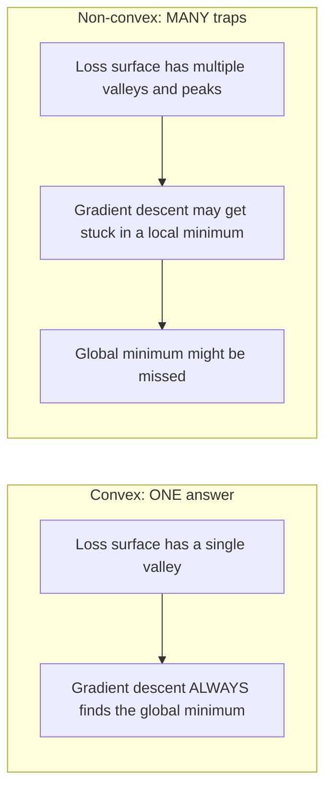
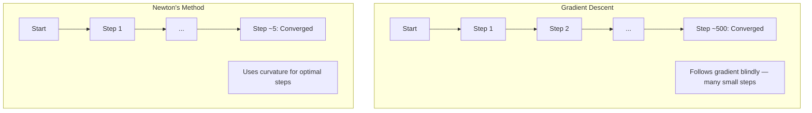
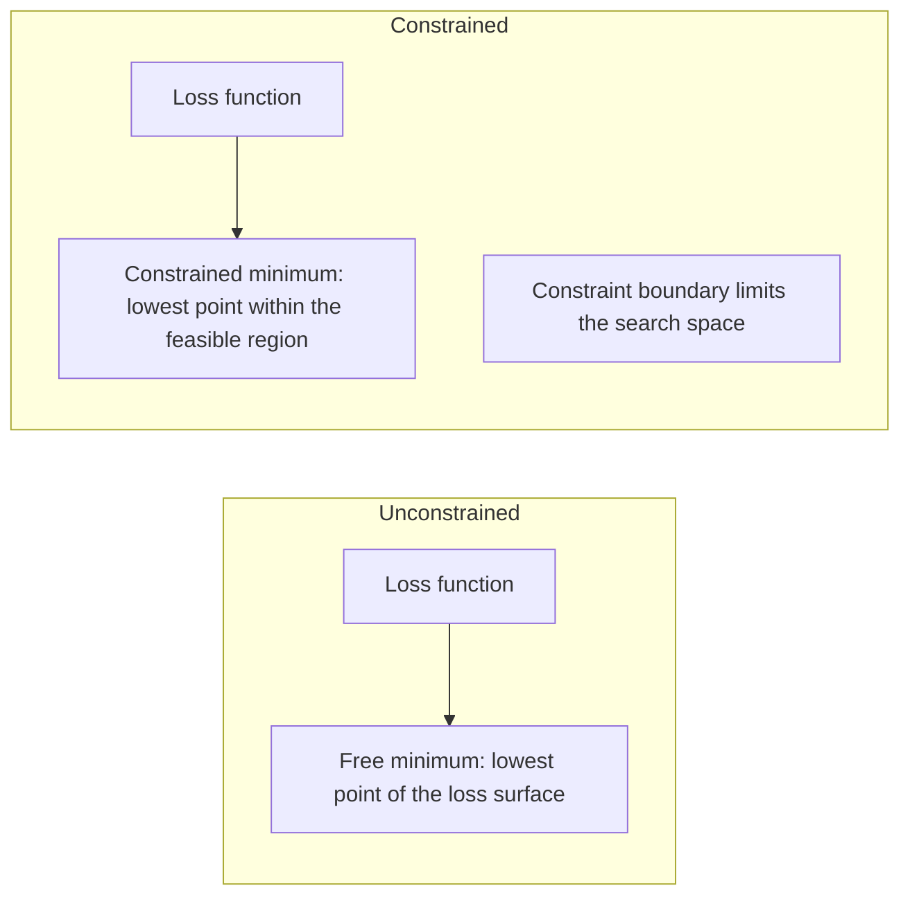
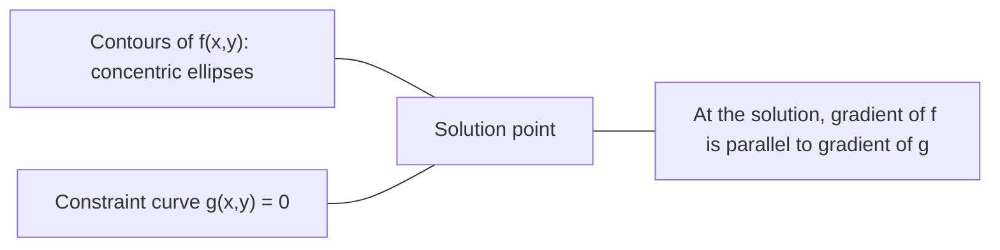

# Convex Optimization 凸优化

> Những vấn đề ngọc có một thung lũng, mạng thần kinh có hàng triệu, biết sự khác biệt là quan trọng.
> 凸问题 chỉ có một con đường.

**Type:** Build | **类型:** 动手
**Language:**Python**语言:**Python
**Prerequisites:** Phase 1, Lessons 04 (Calculus for ML), 08 (Optimization) | **前置知识:** Phase 1, 第 04 课（微积分）、第 08 课（优化）
**Time:** ~90 minutes | **时间:** ~90 分钟

## Mục tiêu học tập

- Kiểm tra xem một hàm có ngọc không bằng cách sử dụng định nghĩa, dẫn xuất thứ hai và tiêu chí Hessian
  Sử dụng định nghĩa、二阶导数和 Hessian 判据测试函数是否为凸函数
- Thực hiện phương pháp của Newton và so sánh sự hội tụ vuông của nó với sự giảm gradient
  Thực hiện Newton (Newton)  (Newton)  (Newton)  (Newton)  (Newton)  (Newton)  (Newton)  (Newton)  (Newton) )  (Newton)  (Newton)  (Newton)  (Newton)  (Newton)  (Newton)  (Newton)  (Newton)  (Newton)  (Newton)  (Newton)  (Newton)  (Newton)  (Newton)  (Newton)  (Newton)  (Newton)  (Newton)  (Newton)  (Newton)  (Newton)  (Newton)  (Newton)  (Newton)  (Newton)  (Newton)  (Newton)  (Newton)  (Newton)  (Newton) )  (Newton)  (Newton)  (Newton)  (Newton)  (Newton) )  (Newton)  (Newton) )  (Newton)  (Newton) )  ()  ()  ()  () )  () () () () () () () () () () () () () () () () () () () () () () () () () () () () () () () () () ( () () () () () () () () () ()
- Giải quyết các vấn đề tối ưu hóa hạn chế bằng cách sử dụng nhân Lagrange và giải thích các điều kiện KKT
  Sử dụng拉格朗日乘子(Lagrange Multipliers) 求解约束优化问题,解释 KKT 条件
- Giải thích tại sao các cảnh mất mạng thần kinh không phải là ngón nhưng SGD vẫn tìm thấy các giải pháp tốt
  Giải thích tại sao mất tích mạng thần kinh không phải là một vấn đề lớn, nhưng SGD vẫn có thể tìm ra một giải pháp tốt.


> **【中文解读】**
> 凸 hàm chỉ có một thung lũng (全局最优), 线性归归归是凸的所以一定有全局最优. 网络神经网络不凸的但有无数山谷,SGD vẫn có thể tìm thấy một giải pháp tốt trong thực tế.

## Vấn đề  vấn đề giới thiệu

Bài học 08 dạy bạn giảm gradient, động lực và Adam. Những người tối ưu hóa đi xuống dốc trên bất kỳ bề mặt nào. Nhưng họ không có đảm bảo. giảm gradient trên một cảnh quan không ngón có thể rơi vào mức tối thiểu địa phương xấu, bị mắc kẹt trên một điểm saddle, hoặc dao động mãi mãi. Bạn đã sử dụng nó dù sao vì mạng thần kinh không ngón và không có lựa chọn nào khác.

> Chương 08  Bài học dạy bạn độ giảm 动量 và Adam. Những phương tiện tối ưu hóa này có thể giảm ở bất kỳ bề mặt nào. Nhưng chúng không đảm bảo.

Nhưng nhiều vấn đề trong máy học đều ngập cong. Lịch ngược tuyến tính, ngập cong logistics, SVMs, LASSO, ngập cong. Đối với những vấn đề này, có một cái gì đó mạnh hơn: tối ưu hóa với các đảm bảo toán học. Một vấn đề ngập cong có chính xác một thung lũng. Bất kỳ thuật toán nào đi xuống đồi sẽ đạt được mức tối thiểu toàn cầu. Không cần khởi động lại. Không có lịch trình tốc độ học tập. Không có lời cầu nguyện.

> Nhưng nhiều vấn đề trong học máy là凸的──线性归归、逻辑归归、SVM、LASSO、归归── đối với những vấn đề này, có những thứ mạnh hơn:带有数学保证的优化──凸的问题恰好只有一个谷底── bất kỳ hạ坡算法 nào đều đạt được giá trị tối thiểu toàn diện──不需要重启──不需要学习率调度──不需要祈祷──

Việc hiểu sự ngập cong làm ba điều. Thứ nhất, nó cho bạn biết khi nào vấn đề của bạn là dễ dàng (ngập cong) so với khó khăn (không ngập cong). Thứ hai, nó cho bạn các công cụ nhanh hơn như phương pháp Newton cho các vấn đề ngập cong. Thứ ba, nó giải thích các khái niệm xuất hiện trong suốt ML: quy định hóa như một hạn chế, sự hai chiều trong SVM, và tại sao việc học sâu hoạt động mặc dù vi phạm mọi tính chất ngập cong tốt cho bạn.

> Nhận thức về hình dạng có ba tác dụng. Thứ nhất, nó cho bạn biết vấn đề khi nào dễ dàng (không hình dạng) hay khó khăn (không hình dạng). Thứ hai, nó cung cấp các công cụ nhanh hơn cho vấn đề hình dạng, chẳng hạn như luật Newton. Thứ ba, nó giải thích khái niệm về ML: định nghĩa hóa như một sự ràng buộc, tính đối đôi trong SVM, và tại sao việc học sâu vẫn có hiệu quả trong trường hợp vi phạm tất cả các chất lượng tốt đẹp của hình dạng hình dạng.

## Khái niệm cốt lõi

> **【中文解读】**
> Hình dạng của hàm凸 giống như một bát chỉ có một điểm thấp nhất (( toàn局最优) ⋅线性归归、逻辑归归、SVM mất hàm đều凸, vì vậy tập luyện nhất định nhận được đến toàn局最优──神经网络非凸,像连绵山脉, nhưng SGD vẫn có thể tìm thấy một giải pháp tốt── hiểu凸优化就是理解"什么时候放心"──

> **【拓展：凸优化在工业中的实际规模】**
> Hệ thống xếp hạng quảng cáo của Google sử dụng quy mô lớn về logic quay lại, xử lý hàng tỷ lần yêu cầu mỗi ngày. SVM trong cuộc kiểm tra khuôn mặt người và các phần văn bản được sử dụng rộng rãi.

### Bộ trục trục

Một tập hợp S là ngọc nếu cho bất kỳ hai điểm nào trong S, phân đoạn đường giữa chúng cũng nằm hoàn toàn trong S.

> Nếu tập hợp S giữa bất kỳ hai điểm nào giữa các đường段 hoàn toàn nằm ở S 内, thì S là tập hợp凸集 (Convex Set) ⋅

| Convex sets | Not convex |
|---|---|
| **Rectangle**: any two points inside can be connected by a line segment that stays inside | **Star/crescent shape**: a line between two interior points can pass outside the set |
| **Triangle**: same property holds for all interior points | **Donut/annulus**: the hole means some line segments leave the set |
| The line segment between any two points stays within the set | The line segment between some pairs of points exits the set |

Kiểm tra chính thức: đối với bất kỳ điểm x, y trong S và bất kỳ t nào trong [0, 1], điểm tx + (1-t) y cũng là trong S.

> 形式化测试: Đối với S trong số bất kỳ điểm x、y 和 [0, 1] trong số bất kỳ điểm t, điểm tx + (1-t) y cũng trong S。

Ví dụ về các bộ trục trặc:
- Một đường, một máy bay, tất cả R^n
  Một đường thẳng, một đường bằng, toàn bộ R^n
- Một quả bóng (thây tròn, quả cầu, siêu cầu)
  Một quả bóng (đường, bóng mặt, siêu bóng mặt)
- Một không gian nửa: {x: a^T x <= b}
  半空间: {x: a^T x <= b}
- Sự giao lộ của bất kỳ số lượng tập hợp ngọc nào
  giao dịch của bất kỳ số lượng con số

Ví dụ về các bộ không ngón:
- Một món bánh quy (annulus)
  环面(圆环)
- Sự hợp nhất của hai vòng tròn không liên kết
  2 tập hợp không giao tiếp
- Bất kỳ bộ nào có "dent" hoặc "lỗ"
  Bất kỳ tập hợp nào có "陷" hoặc "洞"

### Các hàm trục trĩ

Một hàm f là ngọc nếu miền của nó là một tập hợp ngọc và cho bất kỳ hai điểm x, y trong miền của nó và bất kỳ t nào trong [0, 1]:

> Nếu hàm f của định nghĩa miền là tập hợp, và đối với định nghĩa miền bất kỳ hai điểm x、y 和 [0, 1] trong số bất kỳ t:

```
f(tx + (1-t)y) <= t*f(x) + (1-t)*f(y)
```

Về mặt địa hình: đoạn đường giữa hai điểm trên biểu đồ nằm trên hoặc trên biểu đồ.

> 几何上: đường giữa hai điểm trên biểu đồ nằm trên hoặc trên biểu đồ.

| Property | Convex function | Non-convex function |
|---|---|---|
| **Line segment test** | The line between any two points on the graph lies **above or on** the curve | The line between some points on the graph dips **below** the curve |
| **Shape** | Single bowl/valley curving upward | Multiple peaks and valleys with mixed curvature |
| **Local minima** | Every local minimum is the global minimum | Multiple local minima may exist at different heights |

Các chức năng nhòm chung:
- f(x) = x^2 (chỉ số)
  抛物线
- F(x) = ✓x (tín hiệu tuyệt đối)
   tuyệt đối
- f(x) = e^x (tự động)
  指数函数
- F(x) = max(0, x) (ReLU, mặc dù là tuyến tính theo mảnh)
  ReLU( mặc dù分段线性)
- f(x) = -log(x) cho x > 0 (log âm)
  负对数
- Bất kỳ hàm tuyến tính nào f ((x) = a^T x + b (cả ngọc và ngọc)
  任何线性函数 ((既是凸的也是的)

### Kiểm tra độ ngập

Ba bài kiểm tra thực tế, từ dễ nhất đến nghiêm ngặt nhất.

> Có 3 loại thử nghiệm thực tế, từ đơn giản nhất đến nghiêm ngặt nhất.

**Test 1: Second derivative test (1D).**Nếu f'(x) >= 0 cho tất cả x, thì f là ngọc.

> **测试 1：二阶导数测试（一维）。**Nếu đối với tất cả các x đều có f'(x) >= 0, thì f là凸的。

- F''((x) = x^2: f''(x) = 2 >= 0.
- f''((x) = x^3: f''(x) = 6x. âm cho x < 0. Không nhòm.
- F''(x) = e^x: f''(x) = e^x > 0.

**Test 2: Hessian test (multivariate).**Nếu các Hessian tử liệu H(x) là một phân định tích tích cực cho tất cả các x, thì f là ngọc.

> **测试 2：Hessian 测试（多变量）。**Nếu Hessian 矩阵 H(x) đối với tất cả x đều là một nửa chính xác, thì f là凸的──Hessian là một số đường dẫn thứ hai của矩阵──

**Test 3: Definition test.**Kiểm tra bất bình đẳng f(tx + (1-t) y) <= t*f(x) + (1-t) *f(y) trực tiếp. hữu ích cho các hàm mà dẫn xuất khó tính toán.

> **测试 3：定义测试。**直接检查不等式 f(tx + (1-t) y) <= t*f(x) + (1-t) *f(y)。适用于导数难以计算的函数。

### Tại sao sự ngập lỏng quan trọng

Các định lý trung tâm của tối ưu hóa ngọc:

**For a convex function, every local minimum is a global minimum.**

> **对于凸函数，每个局部最小值都是全局最小值。**

Điều này có nghĩa là sự giảm gradient không thể bị mắc kẹt. Bất kỳ đường xuống đồi nào dẫn đến câu trả lời tương tự.

> Điều này có nghĩa là độ giảm không bị mắc kẹt.

> **【中文解读】**
> Đây là định lý cốt lõi của tối ưu hóa: giá trị tối thiểu của mỗi phần của hàm凸 là giá trị tối thiểu toàn diện. Điều này có nghĩa là sự giảm bậc sẽ không bao giờ nằm trong phần tối ưu nhất của "差".



Kết quả:
- Không cần phải khởi động lại ngẫu nhiên
  Không cần phải khởi động lại
- Không cần lịch trình học tập phức tạp
  Không cần điều chỉnh tỷ lệ học tập phức tạp
- Các chứng minh hội tụ có thể (tỷ lệ phụ thuộc vào các tính chất hàm)
  Có thể chứng minh tính năng (tỷ lệ phụ thuộc vào tính chất hàm)
- Giải pháp là duy nhất (trong các vùng bằng phẳng)
  解是唯一的(平坦区域除外)

### Convex vs non-convex trong ML

| Problem | Convex? | Why |
|---------|---------|-----|
| Linear regression (MSE) | Yes | Loss is quadratic in weights |
| Logistic regression | Yes | Log-loss is convex in weights |
| SVM (hinge loss) | Yes | Maximum of linear functions |
| LASSO (L1 regression) | Yes | Sum of convex functions is convex |
| Ridge regression (L2) | Yes | Quadratic + quadratic = convex |
| Neural network (any loss) | No | Nonlinear activations create non-convex landscape |
| k-means clustering | No | Discrete assignment step |
| Matrix factorization | No | Product of unknowns |

Các mô hình tuyến tính với lỗ hổng ngọc là ngọc. Khi bạn thêm các lớp ẩn với kích hoạt không tuyến tính, ngọc sẽ bị phá vỡ.

> Mô hình tuyến tính có lỗ lồng là lồng. Một khi bạn thêm một lớp ẩn hoạt động không dây, lồng sẽ bị phá vỡ.

### Matrix Hessian

Hessian H của một hàm f: R^n -> R là n x n trền của các phái sinh phân tử thứ hai.

> 函数 f: R^n -> R của Hessian 矩阵 H là n x n của 2 giai đoạn định hướng số矩阵。

```
H[i][j] = d^2 f / (dx_i dx_j)
```

Đối với f ((x, y) = x^2 + 3xy + y^2:

```
df/dx = 2x + 3y       d^2f/dx^2 = 2      d^2f/dxdy = 3
df/dy = 3x + 2y       d^2f/dydx = 3      d^2f/dy^2 = 2

H = [ 2  3 ]
    [ 3  2 ]
```

Người Hessian nói với bạn về sự cong cong:
- Eigenvalues tất cả tích cực: hàm cong lên theo mọi hướng (cập ở điểm đó)
  Đặc điểm giá trị toàn为正: hàm ở mỗi hướng đều lên 曲 (→ 凸)
- Giá trị riêng tất cả âm: đường cong xuống ở mọi hướng (thường cong, một max địa phương)
  Đặc điểm: mỗi hướng đều hướng xuống 曲 (的,局部最大值)
- Các dấu hiệu hỗn hợp: điểm lăn (đối cao theo một số hướng, xuống ở những hướng khác)
  混合符号:点(某些方向上曲,其他方向向下)
- Giá trị bản chất không: phẳng theo hướng đó (từ)
  零特征值:该方向平坦(退化)

Đối với độ ngập, Hessian phải là một điểm định nghĩa (tất cả các giá trị riêng > = 0) ở mọi nơi, không chỉ ở một điểm.

> Đối với tính hình, Hessian phải ở bất cứ nơi nào đều là một nửa chính xác (trong tất cả các tính chất có giá trị >= 0), không chỉ ở một điểm trên.

### Phương pháp của Newton

Phương pháp của Newton sử dụng thông tin thứ hai (Hessian). Nó phù hợp với một phương pháp gần gũi hình vuông tại điểm hiện tại và nhảy thẳng đến mức tối thiểu của hình vuông đó.

> 梯度下降使用一阶信息(梯度) ――牛顿法使用二阶信息(Hessian) ・・・ nó ở điểm hiện tại phù hợp với một cách tiếp cận thứ hai, sau đó nhảy thẳng vào giá trị tối thiểu của hàm thứ hai này。

```
Update rule:
  x_new = x - H^(-1) * gradient

Compare to gradient descent:
  x_new = x - lr * gradient
```

Phương pháp của Newton thay thế tốc độ học đường thang bằng Hessian ngược. Điều này tự động điều chỉnh kích thước và hướng bước dựa trên độ cong địa phương.

> 牛顿法 dùng ngược lại Hessian 替代标量学习率──

> **【拓展：牛顿法在现代 ML 中的实际使用】**
> Mặc dù Newton là không thực tế trong học sâu, nhưng trong ML cổ điển vẫn là chủ yếu. XGBoost và LightGBM trong việc xây dựng mỗi cây, đối với hàm mất mát được thực hiện ở giai đoạn thứ hai.



Lợi ích:
- Sự hội tụ vuông gần mức tối thiểu (trường vuông lỗi mỗi bước)
  Trong giá trị tối thiểu gần 2 lần nhận  ((per step error square grade shrink)
- Không có tốc độ học tập để điều chỉnh
  无需调节 học phí
- Scale-invariant (được làm bất kể bạn định nghĩa vấn đề như thế nào)
  尺度不变 (nếu bạn có thể làm việc như thế nào)

Khối thâm điểm:
- Việc tính toán Hessian chi phí O n ^ 2) bộ nhớ và O n ^ 3) để đảo ngược
  计算 Hessian 需要 O(n^2) 内存和 O(n^3) 求逆
- Đối với một mạng thần kinh với 1 triệu trọng lượng, đó là 10 ^ 12 mục và 10 ^ 18 hoạt động
  Đối với mạng lưới thần kinh nặng 100 triệu, đó là 10^12 các nguyên tố và 10^18 lần vận hành
- Không thực tế cho việc học sâu
  Không thích hợp cho học tập sâu

### Tối ưu hóa hạn chế

Tối ưu hóa không hạn chế: giảm thiểu f ((x) trên tất cả x.
Tối ưu hóa hạn chế: giảm thiểu f ((x) theo hạn chế.

> 无约束优化: 在所有 x 上最小化 f(x) ・・・约束优化: 在约束条件下最小化 f(x) ・・・

Các vấn đề thực sự có những hạn chế. Bạn muốn giảm chi phí nhưng ngân sách của bạn là hạn chế. Bạn muốn giảm thiểu lỗi nhưng phức tạp của mô hình của bạn là giới hạn.

> Vấn đề thực sự có giới hạn. Bạn muốn giảm thiểu chi phí nhưng ngân sách là giới hạn. Bạn muốn giảm thiểu sai lầm nhưng độ phức tạp của mô hình là giới hạn.



### Các nhân nhân hạch

Phương pháp nhân nhân Lagrange chuyển đổi một vấn đề bị hạn chế thành một vấn đề không bị hạn chế.

> 拉格朗日乘子法将约束问题转化为无约束问题.

Vấn đề: giảm thiểu f(x) theo g(x) = 0.

Giải pháp: giới thiệu một biến mới (Lambda nhân Lagrange) và giải quyết vấn đề không bị hạn chế:

```
L(x, lambda) = f(x) + lambda * g(x)
```

Ở giải pháp, gradient của L là không:

```
dL/dx = df/dx + lambda * dg/dx = 0
dL/dlambda = g(x) = 0
```

Nhận thức hình học: ở mức tối thiểu bị hạn chế, gradient của f phải song song với gradient của hạn chế g. Nếu chúng không song song, bạn có thể di chuyển dọc theo bề mặt hạn chế và giảm thêm f.

> 几何直觉: ở mức giá tối thiểu của khối, độ của f phải bình đẳng với độ của khối g. Nếu không bình đẳng, bạn có thể di chuyển dọc theo khối và giảm thêm f.



Ví dụ: giảm thiểu f(x,y) = x^2 + y^2 theo x + y = 1.

```
L = x^2 + y^2 + lambda(x + y - 1)

dL/dx = 2x + lambda = 0  =>  x = -lambda/2
dL/dy = 2y + lambda = 0  =>  y = -lambda/2
dL/dlambda = x + y - 1 = 0

From first two: x = y
Substituting: 2x = 1, so x = y = 0.5, lambda = -1
```

Điểm gần nhất trên đường x + y = 1 đến nguồn là (0,5, 0,5).

> Đường thẳng x + y = 1 上离原点最近的点是 (0.5, 0.5)。

### Điều kiện KKT

Các điều kiện Karush-Kuhn-Tucker mở rộng nhân Lagrange đến các hạn chế bất bình đẳng.

> KKT 条件(Karush-Kuhn-Tucker Conditions) sẽ kéo dài ngày乘子推广到不等式约束──

Vấn đề: giảm thiểu f(x) theo g_i(x) <= 0 cho i = 1, ..., m.

Các điều kiện KKT (cần thiết cho sự tối ưu):

```
1. Stationarity:    df/dx + sum(lambda_i * dg_i/dx) = 0
2. Primal feasibility:  g_i(x) <= 0  for all i
3. Dual feasibility:    lambda_i >= 0  for all i
4. Complementary slackness:  lambda_i * g_i(x) = 0  for all i
```

Sự lười biếng bổ sung là quan điểm chính: hoặc hạn chế hoạt động (g_i = 0, giải pháp nằm trên biên giới) hoặc nhân số là không (nghĩa hạn không quan trọng).

> 互补松性(Complementary Slackness) là một quan trọng quan trọng: 约束是活跃的 (g_i = 0,解在边界上), 约束是不重要)

Các điều kiện KKT là trung tâm của SVM. Các vector hỗ trợ là các điểm dữ liệu mà hạn chế hoạt động (lambda > 0).

> KKT 条件是 SVM 的核心──支持向量──Support Vectors)就是约束活跃的那些数据点──lambda > 0)──所有其他数据点的 lambda = 0,不影响决策边界──

> **【中文解读】**
> KKT 条件是拉格朗日乘子的推广版,处理不等式约束──互补松性 là những hiểu biết tinh tế nhất: đối với mỗi约束, hoặc nó là "sức hoạt động" (刚好触碰边界), hoặc nó đối với giải pháp không ảnh hưởng (乘子为零) ─SVM 支持向量是那些数据点的约束活跃──

### Chuẩn bị như là tối ưu hóa hạn chế

L1 và L2 đều không phải là những trò lừa đảo tùy ý.

> L1 và L2 chính thức hóa không phải là những kỹ thuật tự nhiên.

**L2 regularization (Ridge):**

```
minimize  Loss(w)  subject to  ||w||^2 <= t

Equivalent unconstrained form:
minimize  Loss(w) + lambda * ||w||^2
```

Các ràng buộc của không gian trong không gian <= t xác định một quả bóng (thây giới trong 2D, quả cầu 3D).

> 约束 约束 约束 约束 约束 约束 约束 约束 约束 约束 约束 约束 约束 约束 约束 约束 约束 约束 约束 约束 约束 约束 约束 约束 约束 约束 约束 约束 约束 约束 约束 约束 约束 约束 约束 约束 约束 约束 约束 约束 约束 约束 约束 约束 约束 约束 约束 约束 约束 约束 约束 约束 约束 约束 约束 约束 约束 约束 约束 约束 约束 约束 约 约 约 约 约 约 约 约 约 约 约 约 约 约 约 约 约 约 约 约 约 约 约 约 约 约 约 约 约 约 约 约 约 约 约 约 约                                                                                                                                                                                                                                                          

**L1 regularization (LASSO):**

```
minimize  Loss(w)  subject to  ||w||_1 <= t

Equivalent unconstrained form:
minimize  Loss(w) + lambda * ||w||_1
```

Các hạn chế của các loại hình này <= t xác định một kim cương (đường vuông quay trong 2D).

> 约束 约束 约束 约束 约束 约束 约束 约束 约束 约束 约束 约束 约束 约束 约束 约束 约束 约束 约束 约束 约束 约束 约束 约束 约束 约束 约束 约束 约束 约束 约束 约束 约束 约束 约束 约束 约束 约束 约束 约束 约束 约束 约束 约束 约束 约束 约束 约束 约束 约束 约束 约束 约束 约束 约束 约束 约束 约束 约束 约束 约束 约束 约束 约束 约束 约束 约束 约束 约束 约束 约束 约束 约束 约束 约束 约束 约束 约束 约束 约束 约束 约束 约束 约束 约束 约 约 约 约 约 约 约 约 约 约 约 约 约 约 约 约 约 约 约 约 约 约 约 约 约 约 约 约 约 约 约 约 约 约 约 约 约 约 约 约 约 约 约 约 约 约 约 约 约 约 约 约 约 约 约 约 约 约 约 约 约 约 约 约 约 约 约 约 约 约 约 约 约 约 约 约 约 约 约 约 约 约 约 约 约 

| Property | L2 constraint (circle) | L1 constraint (diamond) |
|---|---|---|
| **Constraint shape** | Circle (sphere in higher dims) | Diamond (rotated square in 2D) |
| **Where loss contour touches** | Smooth boundary — any point on the circle | Corner — aligned with an axis |
| **Solution behavior** | Weights are small but nonzero | Some weights are exactly zero (sparse) |
| **Result** | Weight shrinkage | Feature selection |

Điều này giải thích tại sao L1 sản xuất các mô hình hiếm (chuyển chọn tính năng) trong khi L2 chỉ thu hẹp trọng lượng. Kim cương có các góc được thẳng hàng với trục.

> Điều này giải thích tại sao L1  tạo ra mô hình hiếm (chọn lựa đặc điểm) và L2 chỉ thu hẹp trọng lượng.

> **【拓展：L1 正则化与 L2 正则化的几何直觉】**
> L1 束 hình dạng là  hình ((làm hình dạng hình dạng hình dạng hình dạng hình dạng hình dạng hình dạng hình dạng hình dạng hình dạng hình dạng hình dạng hình dạng hình dạng hình dạng hình dạng hình dạng hình dạng hình dạng hình dạng hình dạng hình dạng hình dạng hình dạng hình dạng hình dạng hình dạng hình dạng hình dạng hình dạng hình dạng hình dạng hình dạng hình dạng hình dạng hình dạng hình dạng hình dạng hình dạng hình dạng hình dạng hình dạng hình dạng hình dạng hình dạng hình dạng hình dạng hình dạng hình dạng hình dạng hình dạng hình dạng hình dạng hình dạng hình dạng hình dạng hình dạng hình dạng hình dạng hình dạng hình dạng hình dạng hình dạng hình dạng hình dạng hình dạng hình dạng hình dạng hình dạng hình dạng hình dạng hình dạng hình dạng hình dạng hình dạng hình dạng hình dạng hình dạng hình dạng hình dạng hình dạng hình dạng hình dạng hình dạng hình dạng hình dạng hình dạng hình dạng hình dạng hình dạng hình dạng hình dạng hình dạng hình dạng hình dạng hình dạng hình dạng hình dạng hình dạng hình dạng hình dạng hình dạng hình dạng hình dạng hình dạng hình dạng hình dạng hình dạng hình dạng hình dạng hình dạng hình dạng hình dạng hình dạng hình dạng hình dạng hình dạng hình dạng hình dạng hình dạng hình dạng hình dạng hình dạng hình dạng hình dạng hình dạng hình dạng hình dạng hình dạng hình dạng hình dạng hình dạng hình dạng hình dạng hình dạng hình dạng hình dạng hình dạng hình dạng hình dạng hình dạng hình dạng hình dạng hình dạng hình dạng hình dạng L2 hình dạng hình dạng hình dạng hình dạng hình dạng hình dạng hình dạng hình dạng hình dạng hình dạng hình dạng hình dạng hình dạng hình dạng hình dạng hình dạng hình dạng hình dạng hình dạng hình dạng hình dạng hình dạng hình dạng hình dạng hình dạng hình dạng hình dạng hình dạng hình dạng hình dạng hình dạng hình dạng hình dạng hình dạng hình dạng L2 LASSO  LASSO  LASSO  LASSO  thường chọn lựa chọn từ từ từ từ từ từ từ hàng hàng hàng hàng hàng hàng hàng hàng hàng hàng hàng hàng hàng hàng hàng hàng hàng hàng hàng hàng hàng hàng hàng hàng hàng hàng hàng hàng hàng hàng hàng hàng hàng hàng hàng hàng hàng hàng hàng hàng hàng hàng hàng hàng hàng hàng hàng hàng hàng hàng hàng hàng hàng hàng hàng hàng hàng hàng hàng hàng hàng hàng hàng hàng hàng hàng hàng hàng hàng hàng hàng hàng hàng hàng hàng hàng hàng hàng hàng hàng hàng hàng hàng hàng hàng hàng hàng hàng hàng hàng hàng hàng hàng hàng hàng hàng hàng hàng hàng hàng hàng hàng hàng hàng

### Sự hai chiều

Mỗi vấn đề tối ưu hóa hạn chế (bản nguyên) có một vấn đề đồng hành (bản đôi). Đối với các vấn đề ngọc, nguyên và song có cùng một giá trị tối ưu. Đây là sự hai chiều mạnh mẽ.

> Mỗi vấn đề tối ưu hóa quy mô (xác định) có một vấn đề kèm theo (xác định)  Đối với vấn đề cao, vấn đề nguyên thủy và vấn đề đối với các vấn đề đối với các vấn đề có cùng một giá trị tối ưu.

Hàm hàm Lagrangian:

```
Primal: minimize f(x) subject to g(x) <= 0
Lagrangian: L(x, lambda) = f(x) + lambda * g(x)
Dual function: d(lambda) = min_x L(x, lambda)
Dual problem: maximize d(lambda) subject to lambda >= 0
```

Tại sao sự hai chiều quan trọng:
- Vấn đề đôi khi dễ giải quyết hơn vấn đề ban đầu
  Đối với các vấn đề đôi khi dễ dàng hơn các vấn đề nguyên thủy để giải quyết
- SVM được giải quyết trong hình thức kép của họ, nơi vấn đề phụ thuộc vào các sản phẩm điểm giữa các điểm dữ liệu (cho phép thủ thuật hạt nhân)
  SVM theo hình thức tìm kiếm giải pháp đối đôi, vấn đề chỉ phụ thuộc vào các điểm giữa các điểm dữ liệu để có thể sử dụng kỹ thuật hạt nhân)
- Sự đôi cung cấp một ranh giới dưới của tối ưu nguyên tố, hữu ích để kiểm tra chất lượng dung dịch
  Cho phép cung cấp giá trị tối ưu nhất cho nguyên thủy, để kiểm tra chất lượng giải

Đối với SVM cụ thể:

```
Primal: find w, b that maximize the margin 2/||w|| subject to
        y_i(w^T x_i + b) >= 1 for all i

Dual:   maximize sum(alpha_i) - 0.5 * sum_ij(alpha_i * alpha_j * y_i * y_j * x_i^T x_j)
        subject to alpha_i >= 0 and sum(alpha_i * y_i) = 0

The dual only involves dot products x_i^T x_j.
Replace x_i^T x_j with K(x_i, x_j) to get the kernel trick.
```

### Tại sao việc học sâu có hiệu quả mặc dù không có sự ngập trung

Các chức năng mất mạng thần kinh là vô cùng không ngập. Theo mọi biện pháp cổ điển, tối ưu hóa chúng sẽ thất bại. Tuy nhiên, giảm gradient stochastic tìm thấy các giải pháp tốt đáng tin cậy.

> Theo lý thuyết cổ điển, tối ưu hóa chúng nên thất bại. Nhưng theo thang độ giảm đáng tin cậy đã tìm thấy một giải pháp tốt.

**Most local minima are good enough.**Trong không gian chiều cao, các điểm quan trọng ngẫu nhiên (nơi độ nghiêng là không) là điểm đạp, không phải là các tối thiểu địa phương.

> **大多数局部最小值都足够好。**Trong không gian cao, các điểm临界随机 (tầng) là điểm , không phải là giá trị tối thiểu địa phương.

**Saddle points, not local minima, are the real obstacle.**Trong một hàm với n tham số, một điểm saddle có sự pha trộn của các hướng cong tích cực và tiêu cực. Đối với một điểm quan trọng ngẫu nhiên ở các chiều cao, xác suất của tất cả các giá trị riêng n tích cực (giới hạn địa phương) là khoảng 2 ^ - n. Hầu như tất cả các điểm quan trọng là điểm saddle.

> **鞍点而非局部最小值才是真正的障碍。**Trong các hàm có n 个参数, 点 có đường cong tích cực tích cực. Đối với các điểm临界随机 ở độ cao, tỷ lệ có tất cả các tính năng n đều là đúng (n) là 2^(-n) .

**Overparameterization smooths the landscape.**Các mạng có nhiều tham số hơn các ví dụ đào tạo có bề mặt mất mát trơn tru hơn, kết nối hơn. Các mạng rộng hơn có ít tối thiểu địa phương xấu hơn. Điều này trái ngược trực giác nhưng theo học nghiệm.

> **过参数化（Overparameterization）使损失面更平滑。**Các yếu tố nhiều hơn so với các mô hình đào tạo mạng có mặt bị mất tích dễ dàng hơn, kết nối hơn.

**Loss landscape structure:**

| Property | Low-dimensional space | High-dimensional space |
|---|---|---|
| **Landscape** | Many isolated peaks and valleys | Smoothly connected valleys |
| **Minima** | Many isolated local minima | Few bad local minima; most are near-optimal |
| **Navigation** | Hard to find global minimum | Many paths lead to good solutions |
| **Critical points** | Mix of local minima and saddle points | Overwhelmingly saddle points, not local minima |

**Stochastic noise acts as implicit regularization.**SGD mini-batch thêm tiếng ồn ngăn chặn việc định cư vào mức tối thiểu sắc nét.

> **随机噪声充当隐式正则化。**Bộ SGD mini-batch 添加的噪音防止陷入尖的极小值──尖极小值过适应;平坦极小值泛化好──噪音使优化偏向损失面的平坦区域──

> **【中文解读】**
> Sự thành công của việc học sâu có vẻ trái với lý thuyết tối ưu hóa: hàm không tối ưu hóa nên rất khó tối ưu hóa, nhưng SGD làm việc rất tốt. Có ba lý do: Thứ nhất, hầu hết các điểm giới hạn trong không gian cao là giá trị tối thiểu điểm chứ không phải là giá trị địa phương; thứ hai, quá trình phân tích làm cho mất mát mặt trở nên trơn tru hơn; thứ ba, tiếng ồn của SGD được tải lên như một sự chính thức ẩn, giúp thoát khỏi giá trị cực nhỏ, tìm ra giải pháp trơn tru hơn;

### Các phương pháp thứ hai trong thực tế

Phương pháp Newton tinh khiết không thực tế cho các mô hình lớn.

> Phương pháp Newton đối với mô hình lớn không thực tế.

**L-BFGS (Limited-memory BFGS):**Phương pháp này được sử dụng để phân tích các biến thể của Hessian ngược bằng cách sử dụng các khác biệt gradient m cuối cùng. Nó yêu cầu bộ nhớ O(mn thay vì O(n^2).

> **L-BFGS：**Sử dụng gần đây m 个梯度差近似逆 Hessian。 cần O(mn) 内存而不是 O(n^2)。 áp dụng cho tối đa khoảng 10.000 个参数 câu hỏi。 dùng cho ML cổ điển(逻辑归归、CRF) nhưng không được sử dụng để học sâu。

**Natural gradient:**Sử dụng các hình thức phân phối xác suất của các hệ thống Hessian thông tin Fisher (hình thức Hessian dự kiến của xác suất log) thay vì Hessian tiêu chuẩn.

> **自然梯度（Natural Gradient）：**Sử dụng Fisher 信息矩阵 (Hessian) thay thế tiêu chuẩn Hessian.

**Hessian-free optimization:**Sử dụng gradient kết hợp để giải quyết Hx = g mà không bao giờ tạo ra H. Chỉ cần các sản phẩm vector Hessian, có thể được tính trong thời gian O ((n) thông qua phân biệt tự động.

> **无 Hessian 优化：**Sử dụng cùng thang độ tìm giải pháp Hx = g và không cần hình thành H. Chỉ cần Hessian-向量乘积, có thể thông qua tự động phân trong O n 时间内计算.

**Diagonal approximations:**Khoảnh khắc thứ hai của Adam là một sự gần gũi đường vạch của đường vạch của Hessian. AdaHessian mở rộng điều này bằng cách sử dụng các yếu tố đường vạch Hessian thực tế thông qua ước tính của Hutchinson.

> **对角近似：**Đường thứ hai của Adam là Hessian đối với góc gần giống của đường góc. AdaHessian sử dụng máy ước tính Hutchinson để mở rộng các yếu tố Hessian đối với góc thực tế.

| Method | Memory | Per-step cost | When to use |
|--------|--------|--------------|-------------|
| Gradient descent | O(n) | O(n) | Baseline, large models |
| Newton's method | O(n^2) | O(n^3) | Small convex problems |
| L-BFGS | O(mn) | O(mn) | Medium convex problems |
| Adam | O(n) | O(n) | Deep learning default |
| K-FAC | O(n) | O(n) per layer | Research, large-batch training |

## Hãy xây dựng nó.
```figure
convex-vs-nonconvex
```

## Hãy xây dựng nó

### Bước 1: Kiểm tra độ ngập

Xây dựng một hàm kiểm tra độ ngập lưỡng bằng cách lấy mẫu và kiểm tra định nghĩa.

> Xây dựng một hàm, thông qua lấy điểm và kiểm tra định nghĩa để trải nghiệm

```python
import random
import math

def check_convexity(f, dim, bounds=(-5, 5), samples=1000):
    violations = 0
    for _ in range(samples):
        x = [random.uniform(*bounds) for _ in range(dim)]  # 随机采样点 x
        y = [random.uniform(*bounds) for _ in range(dim)]  # 随机采样点 y
        t = random.uniform(0, 1)                            # 随机混合系数
        mid = [t * xi + (1 - t) * yi for xi, yi in zip(x, y)]  # 凸组合 tx + (1-t)y
        lhs = f(mid)                                        # f(凸组合)
        rhs = t * f(x) + (1 - t) * f(y)                    # tf(x) + (1-t)f(y)
        if lhs > rhs + 1e-10:                               # 违反凸性不等式
            violations += 1
    return violations == 0, violations
```

### Bước 2: Phương pháp của Newton cho 2D

Thực hiện phương pháp Newton bằng cách sử dụng một Hessian rõ ràng. So sánh tốc độ hội tụ với sự giảm gradient.

> Sử dụng Hessian rõ ràng 实现 Newton 法── so sánh với tốc độ thu nhập giảm gradient──

```python
def newtons_method(f, grad_f, hessian_f, x0, steps=50, tol=1e-12):
    x = list(x0)
    history = [x[:]]
    for _ in range(steps):
        g = grad_f(x)
        H = hessian_f(x)
        det = H[0][0] * H[1][1] - H[0][1] * H[1][0]
        if abs(det) < 1e-15:
            break
        H_inv = [
            [H[1][1] / det, -H[0][1] / det],
            [-H[1][0] / det, H[0][0] / det],
        ]
        dx = [
            H_inv[0][0] * g[0] + H_inv[0][1] * g[1],
            H_inv[1][0] * g[0] + H_inv[1][1] * g[1],
        ]
        x = [x[0] - dx[0], x[1] - dx[1]]
        history.append(x[:])
        if sum(gi ** 2 for gi in g) < tol:
            break
    return history
```

### Bước 3: Solver nhân nhân Lagrange

Giải quyết tối ưu hóa hạn chế bằng cách sử dụng sự giảm gradient trên Lagrangian.

> Sử dụng thang trên hàm Lang ngày giảm tìm giải pháp tối ưu hóa khối.

```python
def lagrange_solve(f_grad, g_val, g_grad, x0, lr=0.01,
                   lr_lambda=0.01, steps=5000):
    x = list(x0)
    lam = 0.0
    history = []
    for _ in range(steps):
        fg = f_grad(x)
        gv = g_val(x)
        gg = g_grad(x)
        x = [
            xi - lr * (fgi + lam * ggi)
            for xi, fgi, ggi in zip(x, fg, gg)
        ]
        lam = lam + lr_lambda * gv
        history.append((x[:], lam, gv))
    return history
```

### Bước 4: So sánh thứ hai và thứ nhất

Cứ chạy đường hạ độ và phương pháp Newton trên cùng một hàm hình vuông.

```python
def quadratic(x):
    return 5 * x[0] ** 2 + x[1] ** 2

def quadratic_grad(x):
    return [10 * x[0], 2 * x[1]]

def quadratic_hessian(x):
    return [[10, 0], [0, 2]]
```

Phương pháp Newton sẽ hội tụ trong 1 bước (đó chính xác cho phương pháp hình chữ).

> Theo định luật Newton sẽ được nhận trong 1 bước, để hàm thứ hai được xác định.

## Hãy sử dụng nó để thực hiện

Phân tích độ ngập liên quan được áp dụng trực tiếp khi lựa chọn các mô hình và giải pháp ML.

> 凸性分析在选择ML模型和求解器时直接适用.

Đối với các vấn đề ngọc (khuyết phục hậu cần, SVM, LASSO):
- Sử dụng các giải pháp chuyên dụng (liblinear, CVXPY, scipy.optimize.minimize với method='L-BFGS-B')
  Sử dụng chuyên dụng tìm kiếm giải pháp
- Hi vọng một giải pháp toàn cầu độc đáo
  期望唯一的全局解 [ 期望唯一的全局解 ]
- Các phương pháp thứ hai là thực tế và nhanh chóng
  2 giai đoạn phương pháp thực tế và nhanh chóng

Đối với các vấn đề không ngón (mạng thần kinh):
- Sử dụng các phương pháp thứ nhất (SGD, Adam)
  Sử dụng một giai đoạn phương pháp
- Hãy chấp nhận rằng giải pháp phụ thuộc vào sự khởi tạo và ngẫu nhiên
   chấp nhận giải thích phụ thuộc vào sự khởi đầu và tự nhiên
- Sử dụng quá trình phân định, tiếng ồn và lịch học tập như là điều chỉnh ngầm
  Sử dụng quá số hóa, âm thanh và điều chỉnh tỷ lệ học tập như là sự cố định
- Đừng lãng phí thời gian tìm kiếm mức tối thiểu toàn cầu.
  Đừng lãng phí thời gian để tìm giá trị tối thiểu toàn bộ. Một giá trị tối thiểu tốt của một phần đã đủ.

```python
from scipy.optimize import minimize

result = minimize(
    fun=lambda w: sum((y - X @ w) ** 2) + 0.1 * sum(w ** 2),
    x0=np.zeros(d),
    method='L-BFGS-B',
    jac=lambda w: -2 * X.T @ (y - X @ w) + 0.2 * w,
)
```

Đối với SVM, công thức kép cho phép bạn sử dụng thủ thuật hạt nhân:

> Đối với SVM, đối với hình thức đôi khi để bạn có thể sử dụng các kỹ thuật hạt nhân:

```python
from sklearn.svm import SVC

svm = SVC(kernel='rbf', C=1.0)
svm.fit(X_train, y_train)
print(f"Support vectors: {svm.n_support_}")
```

## Tập luyện bài tập

1. **Convexity gallery.**Kiểm tra các hàm này cho độ ngập bằng cách sử dụng kiểm tra: f(x) = x^4, f(x) = sin(x), f(x,y) = x^2 + y^2, f(x,y) = x*y, f(x) = max(x, 0). Giải thích tại sao mỗi kết quả có ý nghĩa.

2. **Newton vs gradient descent race.**Thực hiện cả hai phương pháp trên f ((x,y) = 50*x^2 + y^2 từ điểm khởi đầu (10, 10). Mỗi bước cần bao nhiêu bước để đạt được lỗ < 1e-10?

3. **Lagrange multiplier geometry.**Giảm tối thiểu f ((x,y) = (x-3) ^ 2 + (y-3) ^ 2 theo x + 2y = 4. Kiểm tra giải pháp bằng cách kiểm tra rằng độ lệch của f song song với độ lệch của g tại giải pháp.

4. **Regularization constraint.**Thực hiện tối ưu hóa bị hạn chế L1: giảm thiểu (x-3) ^ 2 + (y-2) ^ 2 đối với ➡x ➡ + ➡ <= 1. Chứng minh rằng giải pháp có một phối hợp bằng không (sparsity từ hạn chế kim cương).

5. **Hessian eigenvalue analysis.**Xét Hessian của hàm Rosenbrock ở (1,1) và ở (-1,1). Xét các giá trị riêng ở cả hai điểm.

## Từ khóa  Từ khóa nhanh chóng

| Term | What it means |
|------|---------------|
| Convex set | A set where the line segment between any two points in the set stays inside the set |
| Convex function | A function where the line between any two points on its graph lies above or on the graph. Equivalently, Hessian is positive semidefinite everywhere |
| Local minimum | A point lower than all nearby points. For convex functions, every local minimum is the global minimum |
| Global minimum | The lowest point of a function over its entire domain |
| Hessian matrix | The matrix of all second partial derivatives. Encodes curvature information |
| Positive semidefinite | A matrix whose eigenvalues are all non-negative. The multidimensional analogue of "second derivative >= 0" |
| Condition number | Ratio of largest to smallest eigenvalue of the Hessian. High condition number means elongated valleys and slow gradient descent |
| Newton's method | Second-order optimizer that uses the inverse Hessian to determine step direction and size. Quadratic convergence near the minimum |
| Lagrange multiplier | A variable introduced to convert a constrained optimization problem into an unconstrained one |
| KKT conditions | Necessary conditions for optimality with inequality constraints. Generalize Lagrange multipliers |
| Complementary slackness | At the solution, either a constraint is active or its multiplier is zero. Never both nonzero |
| Duality | Every constrained problem has a companion dual problem. For convex problems, both have the same optimal value |
| Strong duality | Primal and dual optimal values are equal. Holds for convex problems satisfying Slater's condition |
| L-BFGS | Approximate second-order method that stores the last m gradient differences instead of the full Hessian |
| Saddle point | A point where the gradient is zero but it is a minimum in some directions and a maximum in others |
| Overparameterization | Using more parameters than training examples. Smooths the loss landscape and reduces bad local minima |

## Xem thêm 延伸阅读

- [Boyd & Vandenberghe: Convex Optimization](https://web.stanford.edu/~boyd/cvxbook/)- sách giáo khoa tiêu chuẩn, có sẵn trực tuyến miễn phí
- [Bottou, Curtis, Nocedal: Optimization Methods for Large-Scale Machine Learning (2018)](https://arxiv.org/abs/1606.04838)- cầu thuyết tối ưu hóa ngọc và thực hành học tập sâu
- [Choromanska et al.: The Loss Surfaces of Multilayer Networks (2015)](https://arxiv.org/abs/1412.0233)- tại sao các khung cảnh mạng thần kinh không ngón không tệ như họ có vẻ
- [Nocedal & Wright: Numerical Optimization](https://link.springer.com/book/10.1007/978-0-387-40065-5)- tham chiếu toàn diện cho phương pháp Newton, L-BFGS, và tối ưu hóa hạn chế
