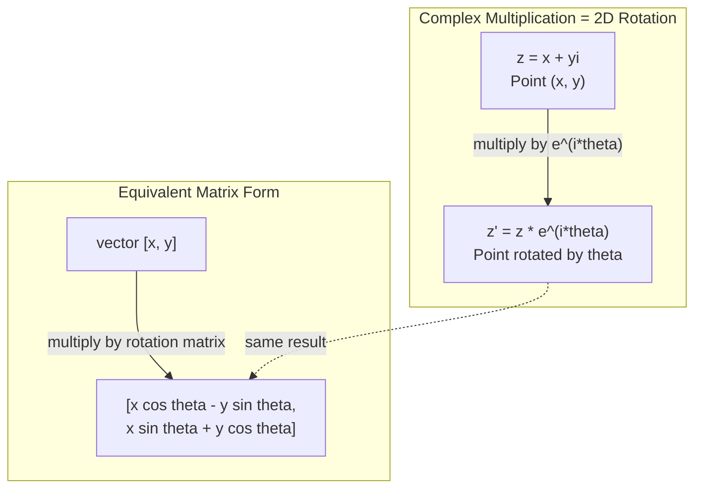
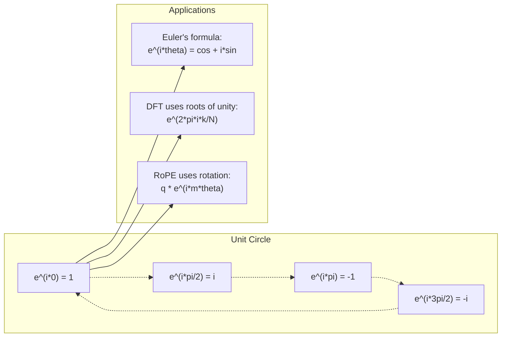

# Số phức tạp cho AI

> Nguồn vuông của -1 không phải là tưởng tượng. Nó là chìa khóa cho các quay, tần số và một nửa xử lý tín hiệu.
> - - của rễ vuông không phải là "không" của nó là chìa khóa trong lĩnh vực xử lý tín hiệu quay, tần suất và nửa.

**Type:** Learn | **类型:** 学习
**Language:**Python**语言:**Python
**Prerequisites:** Phase 1, Lessons 01-04 (linear algebra, calculus) | **前置知识:** Phase 1, 第 01-04 课（线性代数、微积分）
**Time:** ~60 minutes | **时间:** ~60 分钟

## Mục tiêu học tập

- Thực hiện toán học phức tạp (làm thêm, nhân, chia, kết hợp) trong hình chữ nhật và hình cực
  执行复数运算(加、乘、除、共), bao gồm hình thức 坐标直角和极坐标
- Sử dụng công thức của Euler để chuyển đổi giữa các hàm hàm phức tạp và hàm ba tính
  应用欧拉公式在复指数和三角函数之间转换
- Thực hiện chuyển đổi Fourier riêng biệt bằng cách sử dụng các gốc phức tạp của sự thống nhất
  Sử dụng đơn vị để thực hiện chia rẽ
- Giải thích cách quay phức tạp nằm dưới nền tảng của RoPE và mã hóa vị trí sinus trong các biến thể
  解释 Quảng cáo quay làm thế nào để cấu thành RoPE và Transformer 正弦位置编码的基础


> **【中文解读】**
> 虚数 i là chìa khóa của quay và tần suất. RoPE trong biến thể 位置编码 (LLaMA) sử dụng mô hình) bản chất là quay số lặp.

## Vấn đề  vấn đề giới thiệu

Bạn mở một bài báo về Fourier biến đổi và có`i`Bạn nhìn vào mã hóa vị trí biến thể và thấy`sin`và `cos`bạn đọc về máy tính lượng tử và tìm thấy mọi thứ được thể hiện trong không gian vector phức tạp.

> Anh mở một bài viết về những thay đổi trong đời, khắp nơi.`i`✿You watch Transformer 位置编码, xem khác nhau tần suất ✿`sin`和 `cos`Chúng là phần thực và phần giả của chỉ số lặp. Bạn đọc toán lượng tử, thấy tất cả đều biểu hiện trong không gian khối lượng lặp.

Các con số phức tạp có vẻ trừu tượng. Một hệ thống số được xây dựng trên gốc vuông của -1 cảm thấy như một trò lừa toán học. Nhưng nó không phải là một trò lừa. Đó là ngôn ngữ tự nhiên của xoay và dao động. Mỗi khi một thứ gì đó xoay, rung động hoặc dao động, các con số phức tạp là công cụ phù hợp.

> 复数 trông rất trừu tượng. Được xây dựng trên gốc vuông -1 có cảm giác như một trò chơi toán học. Nhưng nó không phải là một trò chơi. Nó là ngôn ngữ tự nhiên của xoay và xoay. Mỗi khi một cái gì đó xoay, xoay hoặc xoay, số là công cụ chính xác.

Nếu bạn không hiểu được các con số phức tạp, bạn không thể hiểu được chuyển đổi Fourier phân biệt. Bạn không thể hiểu FFT. Bạn không thể hiểu cách RoPE (Rotary Position Embedding) hoạt động trong các mô hình ngôn ngữ hiện đại. Bạn không thể hiểu tại sao các mã hóa vị trí hình âm trong giấy Transformer gốc sử dụng tần số họ làm.

> Không hiểu số, bạn就无法理解离散里叶变换(DFT) ―― không thể hiểu FFT── không thể hiểu RoPE(旋转位置编码) trong mô hình ngôn ngữ hiện đại.

Bài học này xây dựng toán phức tạp từ đầu, kết nối nó với hình học, và cho bạn thấy chính xác những con số phức tạp xuất hiện ở máy học.

> Bài học này bắt đầu từ việc xây dựng số lượng phức hợp, kết nối nó với các hình học, và xác định vị trí của số lượng phức hợp trong học máy.

## Khái niệm cốt lõi

> **【中文解读】**
> 复数的核心洞察:i 不是"虚"的,它 là một hoạt động xoay vòng 90 度, nhân một lần i 转 90 度, nhân hai lần i 转 90 度, nhân đôi i 2 = -1) chuyển 180 度,复数 = 2D điểm trên bề mặt trên trơn + tự nhiên hỗ trợ xoay vòng.

> **【拓展：复数在 AI 中的实际应用规模】**
> LLAMA 系列 của OpenAI sử dụng RoPE (Rotary Position Embedding),本质上是复数旋转. Mỗi chú ý vào vị trí编码执行复数乘法. Đối với LLAMA-2-70B (80 个注意力头,序列长度 4096), mỗi bước suy nghĩ thực hiện hàng triệu lần lặp số quay.

### Một con số phức tạp là gì?

Một số phức tạp có hai phần: một phần thực và một phần tưởng tượng.

> Có hai phần: thực phần (trên thực) và虚部 (tưởng tượng)

```
z = a + bi

where:
  a is the real part
  b is the imaginary part
  i is the imaginary unit, defined by i^2 = -1
```

Đó là tất cả. bạn mở rộng đường số vào một trình. các số thực nằm trên một trục. các số tưởng tượng nằm trên trục khác. Mỗi số phức tạp là một điểm trong trình này.

> Đó là cách này. Bạn đã mở rộng số axis thành một bình diện. Số thực ở một bình diện.

### Phương pháp toán phức tạp

**Addition.**Thêm những phần thật vào nhau, thêm những phần tưởng tượng vào nhau.

> **加法。**实部相加,虚部相加.

```
(a + bi) + (c + di) = (a + c) + (b + d)i

Example: (3 + 2i) + (1 + 4i) = 4 + 6i
```

**Multiplication.**Sử dụng luật phân phối và nhớ rằng i ^ 2 = -1.

> **乘法。**Sử dụng quy tắc phân phối, nhớ ở i^2 = -1。

```
(a + bi)(c + di) = ac + adi + bci + bdi^2
                 = ac + adi + bci - bd
                 = (ac - bd) + (ad + bc)i

Example: (3 + 2i)(1 + 4i) = 3 + 12i + 2i + 8i^2
                            = 3 + 14i - 8
                            = -5 + 14i
```

**Conjugate.**Trật lại dấu hiệu của phần tưởng tượng.

> **共轭（Conjugate）。**翻转虚部的符号──

```
conjugate of (a + bi) = a - bi
```

Kết quả của một số phức tạp và kết hợp của nó luôn là thực:

> 复数与其共的乘积总是实数:

```
(a + bi)(a - bi) = a^2 + b^2
```

**Division.**Tăng số và tên nhân bằng kết hợp của tên nhân.

> **除法。**分子和分母同时乘以分母的共──

```
(a + bi) / (c + di) = (a + bi)(c - di) / (c^2 + d^2)
```

Điều này loại bỏ phần tưởng tượng từ tên gọi, cho bạn một số phức tạp sạch.

> Điều này loại bỏ phần không trong phân tử, nhận được một số lượng sạch.

### Bảng phức tạp

Bảng phức tạp lập bản đồ mọi số phức tạp đến một điểm 2D. Trục ngang là trục thực, trục thẳng đứng là trục tưởng tượng.

> 复平面将每个复数映射为2D点──水平轴是实轴,垂直轴是虚轴──

```
z = 3 + 2i  corresponds to the point (3, 2)
z = -1 + 0i corresponds to the point (-1, 0) on the real axis
z = 0 + 4i  corresponds to the point (0, 4) on the imaginary axis
```

Một số phức tạp là một điểm và một vector từ nguồn gốc. Sự giải thích kép này là điều làm cho các số phức tạp hữu ích cho hình học.

> 复数 đồng thời là một điểm và từ điểm gốc xuất phát từ khối lượng.

### Hình dạng cực

Bất kỳ điểm nào trong máy bay có thể được mô tả bằng cách cách xa xôi từ nguồn gốc và góc của nó từ trục thực tích cực.

> Bất kỳ điểm nào trong trơn đều có thể được sử dụng để mô tả khoảng cách của nó đến điểm gốc và góc của trục thực.

```
z = r * (cos(theta) + i*sin(theta))

where:
  r = |z| = sqrt(a^2 + b^2)     (magnitude, or modulus)
  theta = atan2(b, a)             (phase, or argument)
```

Hình hình hình chữ nhật (a + bi) là tốt cho việc cộng. Hình hình cực (r, theta) là tốt cho nhân.

> 直角坐标形式 (a + bi) 适合加法。极坐标形式 (r, theta) 适合乘法。

**Multiplication in polar form.**Bội số lớn, thêm các góc.

> **极坐标形式的乘法。**模相乘,角相加──

```
z1 = r1 * e^(i*theta1)
z2 = r2 * e^(i*theta2)

z1 * z2 = (r1 * r2) * e^(i*(theta1 + theta2))
```

Đó là lý do tại sao các số phức hợp là hoàn hảo cho các vòng quay.

> Đó là lý do tại sao số lặp hoàn hảo thích hợp với xoay xoay.

### Công thức của Euler

Cầu giữa các hàm hàm phức tạp và bộ ba chữ số:

> Cầu giữa 复指数 và 三角函数:

```
e^(i*theta) = cos(theta) + i*sin(theta)
```

Đây là công thức quan trọng nhất trong bài học này. Khi theta = pi:

> Đây là công thức quan trọng nhất trong bài học.

```
e^(i*pi) = cos(pi) + i*sin(pi) = -1 + 0i = -1

Therefore: e^(i*pi) + 1 = 0
```

Năm liên tục cơ bản (e, i, pi, 1, 0) được kết nối trong một phương trình.

> 五个基本常数 ((e、i、pi、1、0)统一在一个方程中──

### Tại sao công thức của Euler quan trọng cho ML

Công thức của Euler nói rằng`e^(i*theta)`Chữ tròn đơn vị theo cách theta thay đổi. Tại theta = 0, bạn ở (1, 0). Tại theta = pi/2, bạn ở (0, 1). Tại theta = pi, bạn ở (-1, 0). Tại theta = 3 * pi/2, bạn ở (0, -1).

> 欧拉公式说 `e^(i*theta)`随着 theta 变化描绘单位圆――theta = 0 时在 (1, 0)。theta = pi/2 时在 (0, 1)。theta = pi 时在 (-1, 0)。theta = 3*pi/2 时在 (0, -1)。完整旋转是 theta = 2*pi。

Điều này có nghĩa là các hàm số phức tạp là quay và quay ở khắp mọi nơi trong xử lý tín hiệu và ML.

> Điều này có nghĩa là chỉ số quay là quay. quay trong xử lý tín hiệu và không có nơi nào trong ML.

> **【中文解读】**
> 欧拉公式 e^(i*theta) = cos(theta) + i*sin(theta) là công thức quan trọng nhất trong bài học này. Nó đưa hàm chỉ số và hàm góc cùng nhau, cũng đưa số và quay lại cùng nhau. Khi theta từ 0 biến thành 2*pi, e^(i*theta) trong trình độ lặp vẽ ra một đơn vị vòng.

### Kết nối với quay 2D

Bội số phức tạp (x + yi) bằng e ^ i * theta) xoay điểm (x, y) bằng góc theta xung quanh nguồn gốc.

> 将复数 (x + yi) 乘以 e^(i*theta) 将点 (x, y) 绕原点旋转角 theta。

```
Rotation via complex multiplication:
  (x + yi) * (cos(theta) + i*sin(theta))
  = (x*cos(theta) - y*sin(theta)) + (x*sin(theta) + y*cos(theta))i

Rotation via matrix multiplication:
  [cos(theta)  -sin(theta)] [x]   [x*cos(theta) - y*sin(theta)]
  [sin(theta)   cos(theta)] [y] = [x*sin(theta) + y*cos(theta)]
```

Chúng tạo ra kết quả giống nhau. nhân phức là quay 2D. Matrix quay chỉ là nhân phức hợp được viết bằng dấu hiệu matrix.

> Chúng tạo ra kết quả hoàn toàn giống nhau.



### Phasor và tín hiệu xoay

Một hàm hàm phức tạp e^(i*omega*t) là một điểm xoay quanh vòng tròn đơn vị ở t t t t t tăng lên, điểm theo dõi vòng tròn.

> 复指数 e^(i*omega*t) là một điểm quay vòng quay ở t ∈ R {\displaystyle t }}

Phần thực của điểm xoay này là cos(omega*t). Phần tưởng tượng là sin(omega*t). Một tín hiệu sinusoidal là bóng của một số phức tạp xoay.

> Cái quay điểm này là cosmosmosmosmosmosmosmosmosmosmosmosmosmosmosmosmosmosmosmosmosmosmosmosmosmosmosmosmosmosmosmosmosmosmosmosmosmosmosmosmosmosmosmosmosmosmosmosmosmosmosmosmosmosmosmosmosmosmosmosmosmosmosmosmosmosmosmosmosmosmosmosmosmosmosmosmosmosmosmosmosmosmosmosmosmosmosmosmosmosmosmosmosmosmosmosmosmosmosmosmosmosmosmosmosmosmosmosmosmosmosmosmosmosmosmosmosmosmosmosmosmosmosmosmosmosmosmosmosmosmosmosmosmosmosmosmosmosmosmosmosmosmosmosmosmosmosmosmosmosmosmosmosmosmosmosmosmosmosmosmosmosmosmosmosmosmosmosmosmosmosmosmosmosmosmosmosmosmosmosmosmosmosmosmosmosmosmosmosmosmosmosmosmosmosmosmosmosmosmosmosmosmosmosmosmosmosmosmosmosmosmosmosmosmosmosmosmosmosmosmosmosmosmosmosmosmosmosmosmosmosmosmosmosmosmosmosmosmosmosmosmosmosmosmosmosmosmosmosmosmosmosmosmosmosmosmosmosmosmosmosmosmosmosmosmosmosmosmosmosmosmosmosmosmosmosmosmosmosmosmosmosmosmosmosmosmosmosmosmosmosmosmosmosmosmosmosmosmosmosmosmosmosmosmosmosmosmosmosmosmosmosmosmosmosmosmosmosmosmosmosmosmosmosmosmosmosmosmosmosmosmosmosmosmosmosmosmosmosmosmosmosmosmosmosmosmosmosmosmosmosmosmosmosmosmosmosmosmosmosmosmosmosmosmosmosmosmosmosmosmosmosmosmosmosmosmosmosmosmosmosmosmosmosmosmosmosmosmosmosmosmosmosmosmosmosmosmosmosmosmosmosmosmosmosmosmosmosmosmosmosmosmosmosmosmosmosmosmosmosmosmosmosmosmosmosmosmosmosmosmosmosmosmosmosmosmosmosmosmosmosmosmosmosmosmosmosmosmosmosmosmosmosmosmosmosmosmosmosmosmosmosmosmosmosmosmosmosmosmosmosmosmosmosmosmosmosmosmosmosmosmosmosmosmosmosmosmosmosmosmosmosmosmosmosmosmosmosmosmosmosmosmosmosmos

```
e^(i*omega*t) = cos(omega*t) + i*sin(omega*t)

Real part:      cos(omega*t)    -- a cosine wave
Imaginary part: sin(omega*t)    -- a sine wave
```

Đây là đại diện của phasor. Thay vì theo dõi một sóng xơ động, bạn theo dõi một mũi tên quay trơn tru. Thay đổi giai đoạn trở thành sự bù đắp góc. Thay đổi độ dải trở thành thay đổi độ lớn. Tích thêm tín hiệu trở thành sự gia tăng vector.

> Đây là kích thước pha (phasor) biểu hiện không cần phải theo dõi sóng chân弦 của sự bốc độ, mà theo dõi mũi tên của sự xoay quanh trơn trơn trơn trơn trơn trơn trơn trơn trơn trơn trơn trơn trơn trơn trơn trơn trơn trơn trơn trơn trơn trơn trơn trơn trơn trơn trơn trơn trơn trơn trơn trơn trơn trơn trơn trơn trơn trơn trơn trơn trơn trơn trơn trơn trơn trơn trơn trơn trơn trơn trơn trơn trơn trơn trơn trơn trơn trơn trơn trơn trơn trơn trơn trơn trơn trơn trơn trơn trơn trơn trơn trơn trơn trơn trơn trơn trơn trơn trơn trơn trơn trơn trơn trơn trơn trơn trơn trơn trơn trơn trơn trơn trơn trơn trơn trơn trơn trơn trơn trơn trơn trơn trơn trơn trơn trơn trơn trơn trơn trơn trơn trơn trơn trơn trơn trơn trơn trơn trơn trơn trơn trơn trơn trơn trơn trơn trơn trơn trơn trơn trơn trơn trơn trơn trơn trơn trơn trơn trơn trơn trơn trơn trơn trơn trơn trơn trơn trơn trơn trơn trơn trơn trơn trơn trơn trơn trơn trơn trơn trơn trơn trơn trơn trơn trơn trơn trơn tr trơn trơn trơn trơn trơn tr tr tr trơn trơn tr tr trơn trơn tr tr tr tr tr trơn tr tr tr tr tr tr tr tr tr tr tr tr tr tr tr tr tr tr tr tr tr tr tr tr tr tr tr tr tr tr tr tr tr tr tr tr tr tr tr tr tr tr tr tr tr tr tr tr tr tr tr tr tr tr tr tr tr tr tr tr tr tr tr tr tr tr tr tr tr tr tr tr tr tr tr tr tr tr tr tr tr tr tr tr tr tr tr tr tr tr tr tr tr tr tr tr tr tr tr tr tr tr tr tr tr tr tr tr tr

### Nguồn gốc của sự hiệp nhất

Các gốc N của sự thống nhất là N điểm được phân cách bằng nhau trên vòng tròn đơn vị:

> N 次单位根(Rễ của Sự hiệp nhất) là các đơn vị tròn trên và giữa các phân bố N 个点:

```
w_k = e^(2*pi*i*k/N)    for k = 0, 1, 2, ..., N-1
```

Đối với N = 4, các gốc là: 1, i, -1, -i (bốn điểm buso).
Đối với N = 8, bạn nhận được bốn điểm buso cộng với bốn hình chéo.

Các gốc của sự thống nhất là nền tảng của chuyển đổi Fourier phân biệt. DFT phân hủy tín hiệu thành các thành phần tại các tần số không gian bằng N này.

> Đơn vị gốc là cơ sở của sự thay đổi trong các biến đổi. DFT sẽ phân chia tín hiệu thành N 个等间频率 phân số.

> **【中文解读】**
> 单位根 là N 个等间距分布在单位圆上的点――它们的两个奇特性: 1) Mỗi mô hình đều恰好为 1; 2) Tất cả cộng lên恰好为零――这些两个性质是DFT可逆的数学基础――DFT 本质上就是计算信号与这个N 个旋相量的"相关性"――

### Kết nối với DFT

Sự chuyển đổi Fourier riêng biệt của một tín hiệu x[0], x[1], ..., x[N-1] là:

> 信号 x[0], x[1], ..., x[N-1] 的离散里叶变换为:

```
X[k] = sum_{n=0}^{N-1} x[n] * e^(-2*pi*i*k*n/N)
```

Mỗi X[k] đo mức độ tín hiệu tương quan với gốc k của sự thống nhất - một chân lưng phức tạp ở tần số k. DFT phá vỡ tín hiệu thành N phasor xoay và cho bạn biết độ dồn và giai đoạn của mỗi.

> Mỗi X[k] đo tín hiệu với sự liên quan của các gốc của các đơn vị k tần số là k của các dòng quay. DFT sẽ phân chia tín hiệu thành N  tần số quay, cho bạn biết kích thước và vị trí của mỗi phases.

### Tại sao tôi không phải là tưởng tượng

Từ "tưởng tượng" là một tai nạn lịch sử. Descartes sử dụng nó một cách khinh thường. Nhưng i không tưởng tượng hơn so với số âm khi mọi người lần đầu tiên từ chối chúng. Số âm trả lời "những gì bạn trừ 5 từ 3 để có được?" đơn vị tưởng tượng trả lời "những gì bạn bình phương để có được -1?"

> Câu nói "虚" là một sự ngẫu nhiên lịch sử. Descartes sử dụng nó để làm  thấp. Nhưng tôi không so với số âm ban đầu bị từ chối.

Và nó sẽ được sử dụng hơn: i là một nhân viên xoay 90 độ. Bội số thực bằng i một lần, bạn xoay 90 độ đến trục tưởng tượng. Bội lại bằng i (i ^ 2), bạn xoay thêm 90 độ - bây giờ bạn đang chỉ ra hướng tiêu cực thực. Đó là lý do tại sao i ^ 2 = -1.

> Hơn nữa hữu ích hơn là hiểu:i là một số toán quay 90 độ. Sẽ có số thực được nhân bằng i một lần, bạn quay 90 độ đến虚轴.

Đó là lý do tại sao các con số phức tạp ở khắp mọi nơi trong kỹ thuật. Bất cứ thứ gì quay - sóng điện từ, trạng thái lượng tử, dao động tín hiệu, mã hóa vị trí - đều được mô tả tự nhiên bằng các con số phức tạp.

> Đó là lý do tại sao số lặp không tồn tại trong công trình. Bất kỳ thứ gì quay đều được sử dụng tự nhiên để mô tả số lặp.

### Các hàm hàm phức tạp so với hàm trigonometric

Trước công thức của Euler, các kỹ sư đã viết các tín hiệu như A*cos(omega*t + phi) - độ dồn A, tần số omega, pha phi. Điều này hoạt động nhưng làm cho toán học đau đớn.

> Trước khi sử dụng các công thức, các kỹ sư sẽ viết tín hiệu thành A*cos(omega*t + phi) 幅 A、 tần suất omega、相位 phi―.

Với các hàm số phức tạp, cùng một tín hiệu là A*e^(i*(omega*t + phi)). Thêm hai tín hiệu chỉ là thêm hai số phức tạp.

> Sử dụng chỉ số lặp lại, cùng một tín hiệu là A*e^(i*(omega*t + phi))。 hai tín hiệu chuyển thêm là hai số lặp lại.

Toàn bộ lĩnh vực xử lý tín hiệu chuyển sang ghi chú biểu diễn phức tạp vì toán học sạch hơn. " tín hiệu thực " luôn chỉ là phần thực của biểu diễn phức tạp. Phần tưởng tượng được mang theo như kế toán, làm cho tất cả các đại số hoạt động tự nhiên.

> Trong lĩnh vực xử lý tín hiệu toàn bộ chuyển sang chỉ số biểu hiện, vì toán học đơn giản hơn.

> **【拓展：复数在量子计算中的角色】**
> Cơ sở của toán lượng tử态是复数向量── trạng thái của một qubbit là alpha 0> + beta 1>, trong đó, alpha ^ 2 + beta 2 = 1,alpha 和 beta 都是复数──量子门是复数矩阵──Google's Sycamore 量子芯片 có 53 qubits, trạng thái của nó là 2^53 复数分──量子机器学习(QML) trực tiếp hoạt động trong không gian复数.

### Kết nối với các bộ biến đổi

**Sinusoidal positional encodings**(khác giấy gốc của Transformer):

```
PE(pos, 2i) = sin(pos / 10000^(2i/d))
PE(pos, 2i+1) = cos(pos / 10000^(2i/d))
```

Các cặp sin và cos là các phần thực và tưởng tượng của các hàm số phức tạp ở tần số khác nhau. Mỗi tần số cung cấp một "sự giải quyết" khác nhau cho vị trí mã hóa. tần số thấp thay đổi chậm ( vị trí thô). tần số cao thay đổi nhanh chóng ( vị trí tốt). Cùng nhau chúng mang lại cho mỗi vị trí một dấu vân tay tần số độc đáo.

> và vì đối với là các phần thực và giả của các chỉ số lặp lại tần suất khác nhau. Mỗi tần suất được mã hóa để vị trí cung cấp một "định lượng" khác nhau.

**RoPE (Rotary Position Embedding)**Nó thường được tính toán bằng cách sử dụng các vector xoay, làm cho mô hình nhạy cảm với vị trí tương đối thông qua nhân phức tạp.

> **RoPE（旋转位置编码）**Hơn nữa. Nó rõ ràng sẽ truy vấn và khóa 向量乘以复数旋矩阵.

> **【拓展：RoPE 在 LLaMA 和 GPT-NeoX 中的实现】**
> RoPE sẽ truy vấn và khóa hướng theo kích thước đối với hình ảnh số lượng, sau đó nhân các yếu tố xoay chuyển đổi góc theo vị trí. Đối với mô hình của kích thước d = 4096 ∞, chiều dài chuỗi L = 4096, RoPE đối với mỗi đối tượng (q, k) 执行 L^2/2 lần số lượng gấp đôi. So với mã mã vị trí tuyệt đối, lợi thế của RoPE là góc xoay chuyển đổi so với vị trí chỉ phụ thuộc vào sự khác biệt vị trí, điều này tự nhiên hỗ trợ "trên chuyển" ∞ khi tập luyện thấy chiều dài 2048 ∞, lý luận có thể mở rộng đến chuỗi dài hơn.

| Operation | Algebraic Form | Geometric Meaning |
|-----------|---------------|-------------------|
| Addition | (a+c) + (b+d)i | Vector addition in the plane |
| Multiplication | (ac-bd) + (ad+bc)i | Rotate and scale |
| Conjugate | a - bi | Reflect over real axis |
| Magnitude | sqrt(a^2 + b^2) | Distance from origin |
| Phase | atan2(b, a) | Angle from positive real axis |
| Division | multiply by conjugate | Reverse rotation and rescale |
| Power | r^n * e^(i*n*theta) | Rotate n times, scale by r^n |



## Hãy xây dựng nó.
```figure
roots-of-unity
```

## Hãy xây dựng nó

### Bước 1: lớp học phức tạp

Xây dựng một lớp số phức tạp hỗ trợ toán học, quy mô, giai đoạn và chuyển đổi giữa hình dạng hình chữ nhật và cực.

> Xây dựng một lớp số đông, hỗ trợ chuyển đổi giữa các toán học vận hành, mô hình, vị trí và đường thẳng và đường cực.

```python
import math

class Complex:
    def __init__(self, real, imag=0.0):
        self.real = real
        self.imag = imag

    def __add__(self, other):
        return Complex(self.real + other.real, self.imag + other.imag)

    def __mul__(self, other):
        r = self.real * other.real - self.imag * other.imag  # 实部：(ac - bd)
        i = self.real * other.imag + self.imag * other.real  # 虚部：(ad + bc)
        return Complex(r, i)

    def __truediv__(self, other):
        denom = other.real ** 2 + other.imag ** 2            # 分母：c^2 + d^2
        r = (self.real * other.real + self.imag * other.imag) / denom  # 乘以共轭后的实部
        i = (self.imag * other.real - self.real * other.imag) / denom  # 乘以共轭后的虚部
        return Complex(r, i)

    def magnitude(self):
        return math.sqrt(self.real ** 2 + self.imag ** 2)

    def phase(self):
        return math.atan2(self.imag, self.real)

    def conjugate(self):
        return Complex(self.real, -self.imag)
```

### Bước 2: Chuyển đổi cực và công thức của Euler

```python
def to_polar(z):
    return z.magnitude(), z.phase()

def from_polar(r, theta):
    return Complex(r * math.cos(theta), r * math.sin(theta))

def euler(theta):
    return Complex(math.cos(theta), math.sin(theta))
```

Kiểm tra: `euler(theta).magnitude()`luôn luôn là 1.0. `euler(0)`nên đưa ra (1, 0). `euler(pi)`nên đưa ra (-1, 0).

> 验证:`euler(theta).magnitude()`应始终为 1.0。`euler(0)`应给出 (1, 0)`euler(pi)`应给出 (-1, 0)

### Bước 3: Chuyển

Chuyển một điểm (x, y) theo góc theta là một nhân phức tạp:

> 将点 (x, y) 旋转角度 theta chỉ cần một lần lặp số乘法:

```python
point = Complex(3, 4)
rotated = point * euler(math.pi / 4)
```

Tầm độ vẫn không thay đổi, chỉ có góc thay đổi.

> 模保持不变──只有角度改变──

### Bước 4: DFT từ toán học phức tạp

```python
def dft(signal):
    N = len(signal)                               # 信号长度
    result = []
    for k in range(N):
        total = Complex(0, 0)
        for n in range(N):
            angle = -2 * math.pi * k * n / N      # 第 k 个单位根的角度
            total = total + Complex(signal[n], 0) * euler(angle)  # 累加：信号与旋转相量的相关
        result.append(total)
    return result
```

Đây là O(N^2) DFT. Mỗi đầu ra X[k] là tổng số các mẫu tín hiệu nhân bằng các gốc của sự thống nhất.

> Đó là DFT của O(N^2) ⋅ mỗi đầu ra X[k] ⋅ là tín hiệu mẫu nhân bằng đơn vị gốc của và⋅

### Bước 5: DFT ngược

DFT ngược tái tạo tín hiệu ban đầu từ quang phổ của nó. Những thay đổi duy nhất từ DFT phía trước: xoay tín hiệu trong nhân tố và chia bằng N.

> Khác với DFT từ tần số tái tạo tín hiệu ban đầu.

```python
def idft(spectrum):
    N = len(spectrum)
    result = []
    for n in range(N):
        total = Complex(0, 0)
        for k in range(N):
            angle = 2 * math.pi * k * n / N
            total = total + spectrum[k] * euler(angle)
        result.append(Complex(total.real / N, total.imag / N))
    return result
```

Điều này cho bạn xây dựng lại hoàn hảo. áp dụng DFT, sau đó IDFT, và bạn có lại tín hiệu gốc để chính xác máy. Không có thông tin bị mất.

> Nó cho bạn xây dựng lại hoàn hảo. Sử dụng DFT, tái sử dụng IDFT, bạn có thể lấy lại tín hiệu gốc bằng độ chính xác của máy. Không có thông tin bị mất.

### Bước 6: Nguồn gốc của sự hiệp nhất

```python
def roots_of_unity(N):
    return [euler(2 * math.pi * k / N) for k in range(N)]
```

Kiểm tra hai tính chất:
- Mỗi gốc có độ lớn chính xác là 1.
  Mỗi rễ có một cái tên.
- Tổng của tất cả các gốc N là không (bạn hủy bằng đối xứng).
  所有 N 个根之和为零(对称性导致相消)

Những tính chất này làm cho DFT trở nên đảo ngược. Rễ của đơn vị hình thành một cơ sở trực giác cho lĩnh vực tần số.

> Những tính chất này làm cho DFT có thể đảo ngược.

## Hãy sử dụng nó để thực hiện

Python có hỗ trợ số phức tạp tích hợp.`j`đại diện cho đơn vị tưởng tượng.

> Python 内置复数支持──字面量 `j`Tự chỉ số đơn vị:

```python
z = 3 + 2j
w = 1 + 4j

print(z + w)
print(z * w)
print(abs(z))

import cmath
print(cmath.phase(z))
print(cmath.exp(1j * cmath.pi))
```

Đối với các mảng, numpy xử lý các số phức tạp theo bản địa:

> Đối với số,numpy 原生处理复数:

```python
import numpy as np

z = np.array([1+2j, 3+4j, 5+6j])
print(np.abs(z))
print(np.angle(z))
print(np.conj(z))
print(np.real(z))
print(np.imag(z))

signal = np.sin(2 * np.pi * 5 * np.linspace(0, 1, 128))
spectrum = np.fft.fft(signal)
freqs = np.fft.fftfreq(128, d=1/128)
```

## Chuyển nó đi.

Đi chạy`code/complex_numbers.py`để tạo ra `outputs/skill-complex-arithmetic.md`- Tôi không biết.

> 运行 `code/complex_numbers.py`生成 `outputs/skill-complex-arithmetic.md`(复数运算技能文档)

## Tập luyện bài tập

1. **Complex arithmetic by hand.**Lập ra cả hai kết quả trên một trình đơn phức tạp và kiểm tra xem nhân số đã quay và quy mô số đầu tiên.

2. **Rotation sequence.**Bắt đầu với điểm (1, 0). nhân bằng e^(i*pi/6) mười hai lần. Kiểm tra rằng bạn trở lại (1, 0) sau khi nhân 12. Bác định các tọa độ tại mỗi bước và xác nhận chúng theo dõi một 12-gon thường.

3. **DFT of a known signal.**Tạo một tín hiệu là tổng số sin ((2 * pi * 3 * t) và 0.5 * sin ((2 * pi * 7 * t) được lấy mẫu tại 32 điểm.

4. **Roots of unity visualization.**Xét ra các gốc thứ 8 của sự thống nhất. Kiểm tra xem chúng cộng đến không. Kiểm tra xem nhân bất kỳ gốc nào bằng gốc nguyên thủy e ^ 2 * pi * i / 8) sẽ đưa ra gốc tiếp theo.

5. **Rotation matrix equivalence.**Đối với 10 góc ngẫu nhiên và 10 điểm ngẫu nhiên, xác minh rằng nhân phức hợp mang lại kết quả tương tự như nhân tử-vector với các 2x2 quay tử liệu.

## Từ khóa  Từ khóa nhanh chóng

| Term | What it means |
|------|---------------|
| Complex number | A number a + bi where a is the real part, b is the imaginary part, and i^2 = -1 |
| Imaginary unit | The number i, defined by i^2 = -1. Not imaginary in the philosophical sense -- it is a rotation operator |
| Complex plane | The 2D plane where the x-axis is real and the y-axis is imaginary. Also called the Argand plane |
| Magnitude (modulus) | The distance from the origin: sqrt(a^2 + b^2). Written as \|z\| |
| Phase (argument) | The angle from the positive real axis: atan2(b, a). Written as arg(z) |
| Conjugate | The mirror image across the real axis: conjugate of a + bi is a - bi |
| Polar form | Expressing z as r * e^(i*theta) instead of a + bi. Makes multiplication easy |
| Euler's formula | e^(i*theta) = cos(theta) + i*sin(theta). Connects exponentials to trigonometry |
| Phasor | A rotating complex number e^(i*omega*t) representing a sinusoidal signal |
| Roots of unity | The N complex numbers e^(2*pi*i*k/N) for k = 0 to N-1. N equally spaced points on the unit circle |
| DFT | Discrete Fourier Transform. Decomposes a signal into complex sinusoidal components using roots of unity |
| RoPE | Rotary Position Embedding. Uses complex multiplication to encode relative position in transformer attention |

> 术语速查:Tóm số phức tạp(复数 a+bi)、Tóm đơn vị tưởng tượng(虚数单位 i,旋算子)、Tóm đơn vị phức tạp(复平面)、Tóm số/module(模 √(a2+b2))、Phase/argument(相位 atan2(b,a))、Congjugate(共 a-bi)、Polar form(极坐标 r·e^(iθ、)) 欧拉公式 e^(iθ)=θ+i·sinθ)、Phasor(旋相量)、Tội của đơn vị đơn vị N 个均分单位圆的点)、DFT散离里叶变换)、Rocosmode转位置编码,L(La Mã √PE 等使用)

## Xem thêm 延伸阅读

- [Visual Introduction to Euler's Formula](https://betterexplained.com/articles/intuitive-understanding-of-eulers-formula/)- xây dựng trực giác hình học mà không có ghi chú nặng
- [Su et al.: RoFormer (2021)](https://arxiv.org/abs/2104.09864)- giấy giới thiệu việc nhúng vị trí xoay bằng cách sử dụng xoay phức tạp
- [Vaswani et al.: Attention Is All You Need (2017)](https://arxiv.org/abs/1706.03762)- giấy Transformer gốc với mã hóa vị trí chân lưng
- [3Blue1Brown: Euler's formula with introductory group theory](https://www.youtube.com/watch?v=mvmuCPvRoWQ)- giải thích trực quan về lý do tại sao e^(i*pi) = -1
- [Needham: Visual Complex Analysis](https://global.oup.com/academic/product/visual-complex-analysis-9780198534464)- xử lý hình ảnh tốt nhất của các con số phức tạp, đầy đủ thông tin hình học
- [Strang: Introduction to Linear Algebra, Ch. 10](https://math.mit.edu/~gs/linearalgebra/)- các số phức tạp trong bối cảnh đại số tuyến tính và giá trị riêng
