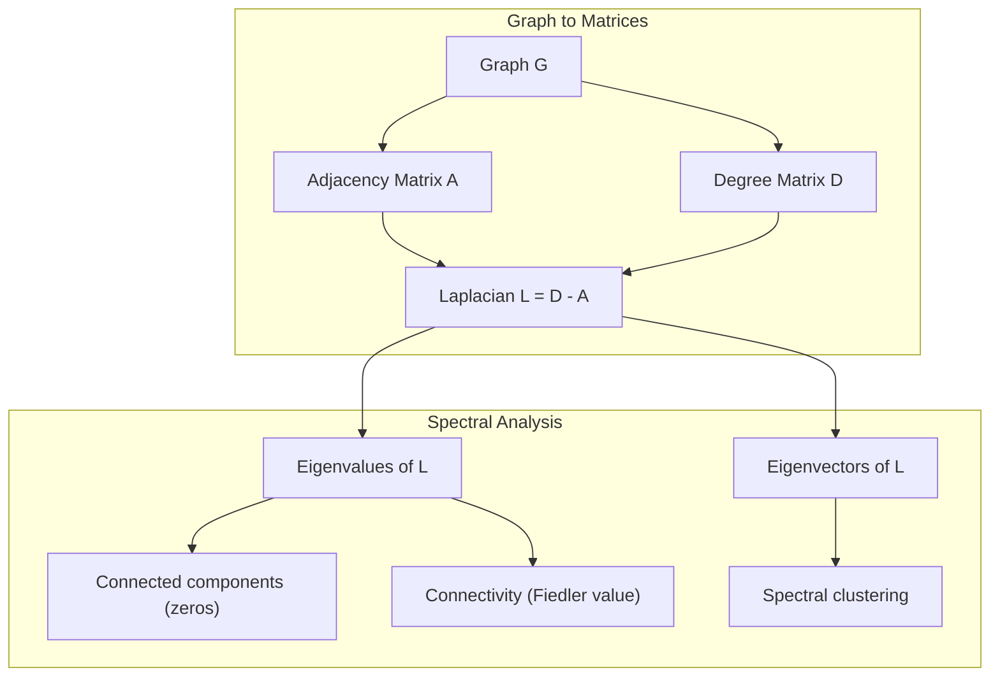
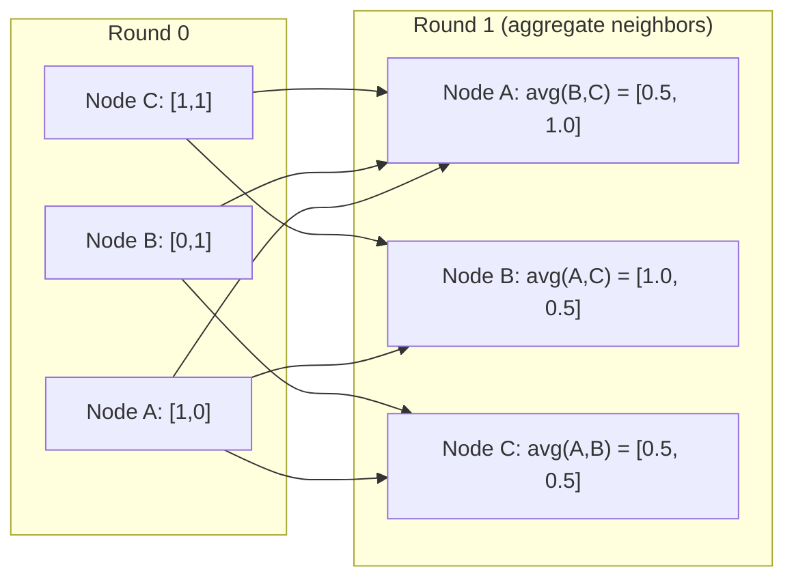

# Lý thuyết đồ họa cho học máy 图论与机器学习

> Hình đồ là cấu trúc dữ liệu của mối quan hệ. Nếu dữ liệu của bạn có kết nối, bạn cần lý thuyết đồ đồ.
> 图是关系的数据结构. Nếu dữ liệu của bạn có kết nối, bạn cần một bản đồ.

**Type:** Build | **类型:** 动手
**Language:**Python**语言:**Python
**Prerequisites:** Phase 1, Lessons 01-03 (linear algebra, matrices) | **前置知识:** Phase 1, 第 01-03 课（线性代数、矩阵）
**Time:** ~90 minutes | **时间:** ~90 分钟

## Mục tiêu học tập

- Xây dựng một lớp đồ thị với các đại diện matrix / danh sách lân cận và thực hiện các đường xuyên BFS và DFS
   cấu trúc có mô hình biểu hiện mô hình có mô hình hàng xóm, thực hiện BFS và DFS 遍历
- Xét đồ Laplacian và sử dụng giá trị riêng của nó để phát hiện các thành phần và nút cluster kết nối
  计算图拉普拉斯矩阵(Graph Laplacian)并 sử dụng các tính năng của nó để kiểm tra kết nối phân tích và phân tích các node
- Thực hiện một vòng thông điệp kiểu GNN qua như là một phép nhân tử xấp xỉ bình thường
  实现一轮 GNN 风格的消息传递归归归归归归归归邻矩阵乘法
- Sử dụng cluster quang phổ để phân vùng biểu đồ bằng cách sử dụng vector Fiedler
  应用谱聚类(Spectral Clustering) sử dụng Fiedler 向量划分图


> **【中文解读】**
> Các mô hình của DNA là hình ảnh. Thông điệp của GNN về bản chất là các mô hình hàng xóm nhân số.

## Vấn đề  vấn đề giới thiệu

Các mạng xã hội, phân tử, cơ sở kiến thức, mạng trích dẫn, bản đồ đường - tất cả đều là đồ thị. ML truyền thống xử lý dữ liệu như bảng phẳng. Mỗi hàng là độc lập. Mỗi tính năng là một cột. Nhưng khi cấu trúc của các kết nối quan trọng, bảng thất bại.

> 社交网络、分子、知识库、引文网络、道路图都是图图图图图图图图图图图图图图图图图图图图图图图图图图图图图图图图图图图图图图图图图图图图图图图图图图图图图图图图图图图图图图图图图图图图图图图图图图图图图图图图图图图图图图图图图图图图图图图图图图图图图图图图图图图图图图图图图图图图图图图图图图图图图图图图图图图图图图图图图图图图图图图图图图图图图图图图图图图图图图图图图图图图图图图图图图图图图图图图图图图图图图图图图图图图图图图图图图图图图图图图图图图图图图图图图图图图图图图图图图图图图图图图图图图图图图图图图图图图图图图图图图图图图图图

Hãy xem xét một mạng xã hội. Bạn muốn dự đoán một người dùng sẽ mua sản phẩm nào. Lịch sử mua hàng của họ quan trọng. Nhưng lịch sử mua hàng của bạn bè của họ quan trọng hơn. Các kết nối mang theo tín hiệu.

> 考虑社交网络――你想预测用户会购买什么产品――他们的购买历史很重要――但他们朋友的购买历史更重要――连接带信号――

Hoặc hãy xem xét một phân tử. Bạn muốn dự đoán liệu nó có liên kết với một protein hay không. Các nguyên tử quan trọng, nhưng điều thực sự quan trọng là cách các nguyên tử liên kết với nhau.

> Hoặc xem xét phân tử. Bạn muốn dự đoán liệu nó có kết hợp với protein.

Các mạng thần kinh đồ họa (GNN) là lĩnh vực phát triển nhanh nhất trong học tập sâu. Chúng thúc đẩy khám phá thuốc, khuyến nghị xã hội, phát hiện gian lận và lý luận đồ họa kiến thức.

> 图神经网络 (GNN) là lĩnh vực phát triển nhanh nhất trong học tập sâu.

Bạn cần bốn thứ:
1. Một cách để đại diện cho biểu đồ như các matrix (để bạn có thể nhân chúng)
   将图表示为矩阵的方法 (), để có thể làm矩阵乘法)
2. Các thuật toán xuyên qua để khám phá cấu trúc đồ thị
   探索图结构的遍历算法
3. Laplacian -- một số các ma trận quan trọng nhất trong lý thuyết đồ thị quang phổ
   Các mô hình của Laplace là mô hình quan trọng nhất trong lý thuyết biểu đồ
4. Thông điệp truyền -- hoạt động làm cho GNN hoạt động
   消息传递使 GNN 工作的操作

## Khái niệm cốt lõi

> **【中文解读】**
> 图 là cấu trúc dữ liệu của mối quan hệ. 网络 xã hội Trung nhân là nút, quan tâm là边; nguyên tử trong phân tử là nút, hóa học là边; vật thể trong bản đồ kiến thức là nút, mối quan hệ là边.

> **【拓展：图神经网络在药物发现中的突破】**
> AlphaFold2 của DeepMind (2020) sử dụng biểu đồ mạng lưới thần kinh dự đoán protein 3D  cấu trúc, giải quyết vấn đề gấp bẻ protein trong giới sinh học 50 năm. Nó đưa các chất còn lại của amycytoglycytoglycytoglycytoglycytoglycytoglycytoglycytoglycytoglycytoglycytoglycytoglycytoglycytoglycytoglycytoglycytoglycytoglycytoglycytoglycytoglycytoglycytoglycytoglycytoglycytoglycytoglycytoglycytoglycytoglycytoglycytoglycytoglycytoglycytoglycytoglycytoglycytoglycytoglycytoglycytoglycytoglycytoglycytoglycytoglycytoglycytoglycytoglycytoglycytoglycytoglycytoglycytoglycytoglycytoglycytoglycytoglycytoglycytoglycytoglycytoglycylcytoglycytoglycytoglycytoglycytoglycylcytoglycytoglycytoglycytoglycylcytoglycytoglycytoglycytoglycylcytoglycytoglycylcytoglycytoglycylcytoglycylcytoglycylcytoglycylcytoglycylcylcylcytoglycylcylcylcylcylcylcylcylcylcylcylcylcylcylcylcylcylcylcylcylcylcylcylcylcylcylcylcylcylcylcylcylcylcylcylcylcylcylcylcylcylcylcylcylcylcylcylcylcylcylcylc

### Hình đồ: nút và cạnh

Một biểu đồ G = (V, E) bao gồm các đỉnh (thắt nút) V và cạnh E. Mỗi cạnh kết nối hai nút.

> 图 G = (V, E) 由顶点(节点) V 和边 E 组成──每条边连接两个节点──

**Directed vs undirected.**Trong biểu đồ không hướng, cạnh (u, v) có nghĩa là u kết nối với v Và v kết nối với u. Trong biểu đồ hướng (digraph), cạnh (u, v) có nghĩa là u chỉ đến v, nhưng không nhất thiết là ngược lại.

> **有向与无向。**Trong không hướng,边 (u, v) có nghĩa là u 连接 v 且 v 连接 u── trong có hướng,边 (u, v) có nghĩa là u 指向 v, nhưng ngược向不一定成立──

**Weighted vs unweighted.**Trong biểu đồ không cân nặng, cạnh có hoặc không có. Trong biểu đồ cân nặng, mỗi cạnh có trọng lượng số - khoảng cách, chi phí, sức mạnh.

> **加权与无权。**Trong biểu đồ không quyền, bên phải có hay không có. Trong biểu đồ quyền tăng, mỗi bên có một giá trị số trọng lượng khoảng cách, chi phí, cường độ.

| Graph type | Example |
|-----------|---------|
| Undirected, unweighted | Facebook friendship network |
| Directed, unweighted | Twitter follow network |
| Undirected, weighted | Road map (distances) |
| Directed, weighted | Web page links (PageRank scores) |

### Matrix gần nhau

Các matrix lân cận A là đại diện cốt lõi. Đối với một biểu đồ với n nút:

> 邻接矩阵(Adjacency Matrix) A là biểu hiện lõi。 đối với có n 个节点的图:

```
A[i][j] = 1    if there is an edge from node i to node j
A[i][j] = 0    otherwise
```

Đối với đồ thị không định hướng, A là đối xứng: A[i][j] = A[j][i]. Đối với đồ thị trọng lượng, A[i][j] = trọng lượng cạnh (i, j).

> Đối với không向图,A 是对称的:A[i][j] = A[j][i]。 đối với加权图,A[i][j] = 边 (i, j) 的权重──

**Example -- a triangle:**

```
Nodes: 0, 1, 2
Edges: (0,1), (1,2), (0,2)

A = [[0, 1, 1],
     [1, 0, 1],
     [1, 1, 0]]
```

Các matrix lân cận là đầu vào cho mỗi GNN. Các hoạt động của matrix trên A tương ứng với các hoạt động trên biểu đồ.

> 邻矩阵是每个 GNN 的输入――对 A 的矩阵运算对应于图上的操作――

> **【中文解读】**
> 邻近矩阵是图的"数字化表示"──A[i][j]=1 表示节点 i 和 j 之间有边缘──奇之处:A^2 的元素A^2[i][j]恰好等于从 i 到 j 长度为 2 的路径数──GNN 的消息传递本质上就是A 乘以特征矩阵每个节点聚邻近的信息──

### Bằng cấp

Độ độ của một nút là số lượng các cạnh kết nối với nó. Đối với biểu đồ hướng, bạn có độ độ (đến vào cạnh) và độ độ ngoài (đến ra cạnh).

> 节点的度(Degree) là kết nối với số lượng của nó. Đối với có hướng vẽ, có bước vào.

Các số liệu của độ D là đường viền:

> Dòng số số:

```
D[i][i] = degree of node i
D[i][j] = 0    for i != j
```

Ví dụ về tam giác: D = diag(2, 2, 2) bởi vì mỗi nút kết nối với hai nút khác.

Các mức độ cho bạn biết về tầm quan trọng của nút. cấp độ cao = nút nút. Phân bố cấp của một mạng cho thấy cấu trúc của nó. Các mạng xã hội tuân theo các luật năng lượng (một số ít nút, nhiều nút lá).

> 库告诉你节点重要性──高度 = 枢纽节点──网络的度分布揭示其结构──社交网络遵循律──少数枢纽,大量叶节点──随机图的度服从泊松分布──

### BFS và DFS

Hai thuật toán chuyển giao đồ thị cơ bản.

> 两种基本图遍历算法──两种都需要──

**Breadth-First Search (BFS):**Tìm kiếm tất cả hàng xóm trước, sau đó là hàng xóm của hàng xóm.

> **广度优先搜索（BFS）：**Trước tiên khám phá tất cả hàng xóm, sau đó là hàng xóm của hàng xóm.

```
BFS from node 0:
  Visit 0
  Queue: [1, 2]        (neighbors of 0)
  Visit 1
  Queue: [2, 3]        (add neighbors of 1)
  Visit 2
  Queue: [3]           (neighbors of 2 already visited)
  Visit 3
  Queue: []            (done)
```

BFS tìm thấy các con đường ngắn nhất trong đồ thị không cân nặng. Khoảng cách từ đầu đến bất kỳ nút nào bằng với mức BFS mà nút đó được phát hiện lần đầu tiên. Đây là lý do tại sao BFS được sử dụng cho khoảng cách đếm hop trong các mạng xã hội.

> BFS tìm thấy đường ngắn nhất trong các biểu đồ không quyền. Khoảng cách từ điểm khởi điểm đến bất kỳ nút nào bằng với cấp độ BFS khi nút này lần đầu tiên được phát hiện.

**Depth-First Search (DFS):**Đi sâu càng sâu càng tốt trước khi quay lại. sử dụng một đống (LIFO) hoặc tái tạo.

> **深度优先搜索（DFS）：**尽可能深入再回溯──使用(后进先出) hoặc递归──

```
DFS from node 0:
  Visit 0
  Stack: [1, 2]        (neighbors of 0)
  Visit 2               (pop from stack)
  Stack: [1, 3]         (add neighbors of 2)
  Visit 3               (pop from stack)
  Stack: [1]
  Visit 1               (pop from stack)
  Stack: []             (done)
```

DFS hữu ích cho:
- Tìm các thành phần kết nối (để chạy DFS từ các nút chưa được truy cập)
  寻找连通分量(从未访问节点运行 DFS)
- Khám phá chu kỳ (về phía sau trong cây DFS)
  环检测(DFS 树中的后向边)
- Đánh phân topological (định dạng hoàn thành DFS ngược)
  拓排序(DFS 完成顺序的逆序)

| Algorithm | Data structure | Finds | Use case |
|-----------|---------------|-------|----------|
| BFS | Queue | Shortest paths | Social network distance, knowledge graph traversal |
| DFS | Stack | Components, cycles | Connectivity, topological sort |

### Chữ đồ họa Laplacian

L = D - A. Các trận đấu quan trọng nhất trong lý thuyết đồ thị quang phổ.

> L = D - A。

Đối với tam giác:

```
D = [[2, 0, 0],    A = [[0, 1, 1],    L = [[2, -1, -1],
     [0, 2, 0],         [1, 0, 1],         [-1, 2, -1],
     [0, 0, 2]]         [1, 1, 0]]         [-1, -1,  2]]
```

Bạch laplacian có những đặc tính đáng chú ý:

> Các mô hình Laplas có tính chất đặc biệt:

1. **L is positive semi-definite.**Tất cả các giá trị riêng là >= 0.

> 1. **L 是半正定的。**所有特征值 >= 0

2. **The number of zero eigenvalues equals the number of connected components.**Một biểu đồ kết nối có chính xác một giá trị riêng không. Một biểu đồ với 3 thành phần không kết nối có ba giá trị riêng không.

> 2. **零特征值的个数等于连通分量的个数。**连通图恰好有一个零特征值. Có 3 个不连通分量的图有3零特征值.

3. **The smallest non-zero eigenvalue (Fiedler value) measures connectivity.**Một giá trị Fiedler lớn có nghĩa là biểu đồ được kết nối tốt. một giá trị Fiedler nhỏ có nghĩa là biểu đồ có điểm yếu - một nút thắt chai.

> 3. **最小非零特征值（Fiedler 值）衡量连通性。**Fiedler 值大 nghĩa là hình kết nối tốt. Fiedler 值小 nghĩa là hình có điểm yếu.

4. **The eigenvector of the Fiedler value (Fiedler vector) reveals the best split.**Các nút có giá trị tích cực đi vào một nhóm, các nút có giá trị âm đi vào nhóm khác.

> 4. **Fiedler 值对应的特征向量（Fiedler 向量）揭示最佳划分。**Nốt của giá trị chính được chuyển sang một nhóm, giá trị âm được chuyển sang một nhóm khác.

> **【中文解读】**
> 图拉普拉斯 L = D - A là một trong những mô hình quan trọng nhất trong lý thuyết biểu đồ. Có bốn tính chất quan trọng: 1) 半正定; 2) 零特征值个数 = 连通分量个数; 3) 最小非零特征值; 3) Fiedler 值) đo kết nối性越大越紧; 4) Fiedler 量正负号将图自动分成两──这是谱聚类的数学基础.



### Các đặc tính quang phổ

Các giá trị riêng của các matrix lân cận và Laplacian tiết lộ các tính chất cấu trúc mà không cần bất kỳ quá trình nào.

> Các mô hình của mô hình lân cận và mô hình lân cận không cần phải trải qua để thể hiện tính chất cấu trúc.

**Spectral clustering**làm như thế này:
1. Xét Laplacian L
   计算拉普拉斯矩阵 L
2. Tìm các đối tượng tự nhỏ nhất của L (lỡ bỏ đầu tiên, là tất cả-one cho biểu đồ kết nối)
   找到 L của k 个最小特征向量(跳过第一个,连通图中它是全1向量)
3. Sử dụng các vector tự như là các tọa độ mới cho mỗi nút
   Sử dụng các đặc điểm này để tạo ra các điểm mới cho mỗi nút
4. Đưa k-means trên các tọa độ đó
   Trong những điểm này vận hành k-means

Tại sao điều này hoạt động? Các vector tự của L mã hóa các hàm "mơn mịn nhất" trên biểu đồ. Các nút kết nối tốt có được các giá trị vector tự tương tự. Các nút tách bằng nút bốc lấy các giá trị khác nhau. Các vector tự tự tự tự tự tách các cụm.

> Tại sao hiệu quả?L của các tính năng điện tử mã hóa các hàm "đơn giản nhất" trên biểu đồ.

**Random walk connection.**Laplacian bình thường liên quan đến các bước ngẫu nhiên trên biểu đồ. Phân bố tĩnh của một bước ngẫu nhiên tương xứng với độ nút. Thời gian trộn (tốc độ bước ngẫu nhiên hội tụ) phụ thuộc vào khoảng cách quang phổ.

> **随机游走联系。**归结拉普拉斯与图上的随机游走有关──随机游走的平稳分布与节点度成正比──混合时间收速度) 取决于谱间隙光谱差距

### Thông điệp qua

Các hoạt động cốt lõi của Graph Neural Networks. Mỗi nút thu thập thông điệp từ hàng xóm của nó, tổng hợp chúng và cập nhật trạng thái của riêng nó.

> 图神经网络的核心操作──每个节点从邻居收集信息,聚合它们,并更新自己的状态──

```
h_v^(k+1) = UPDATE(h_v^(k), AGGREGATE({h_u^(k) : u in neighbors(v)}))
```

Trong dạng đơn giản nhất, AGGREGATE = trung bình, và UPDATE = chuyển đổi tuyến tính + kích hoạt:

```
h_v^(k+1) = sigma(W * mean({h_u^(k) : u in neighbors(v)}))
```

Đây là sự nhân đếm của các khối tử liệu. Nếu H là các khối tử liệu của tất cả các tính năng nút và A là các khối tử liệu lân cận:

```
H^(k+1) = sigma(A_norm * H^(k) * W)
```

nơi A_norm là matrix lân cận bình thường (mỗi hàng tổng cộng lên 1).

Một vòng thông điệp truyền cho phép mỗi nút "xem" hàng xóm trực tiếp của nó. Hai vòng cho phép nó thấy hàng xóm của hàng xóm.

> **【拓展：消息传递与 GNN 架构演进】**
> GCN (Kipf & Welling, 2017) là thông điệp đơn giản nhất GNN: mỗi tầng làm một lần để tái định nghĩa hàng xóm矩阵乘法 + 线性变换――GAT (Veličković et al., 2018) 引入注意力机制让节点学习邻居的重要性权重――GraphSAGE (Hamilton et al., 2017) 支持采样邻居以处理大规模图片――Pinterest's PinSage 模型运行在30亿节点图上,每天产生超过1000亿次推──GNN là một trong những lĩnh vực AI nhỏ phát triển nhanh nhất――



### Các khái niệm và ứng dụng ML

| Concept | ML Application |
|---------|---------------|
| Adjacency matrix | GNN input representation |
| Graph Laplacian | Spectral clustering, community detection |
| BFS/DFS | Knowledge graph traversal, path finding |
| Degree distribution | Node importance, feature engineering |
| Message passing | GNN layers (GCN, GAT, GraphSAGE) |
| Eigenvalues of L | Community detection, graph partitioning |
| Spectral clustering | Unsupervised node grouping |
| PageRank | Node importance, web search |

> 概念与 ML 应用对照:邻接矩阵(GNN 输入表示) 图拉普拉斯(谱聚类、社区检测) 、BFS/DFS(知识图谱遍历、路径查找) 度分布(节点重要性、特征工程) 、消息传递(GNN 层 GCN/GAT/GraphSAGE) 、L 的特征值(社区检测聚图、划分) 、谱类(无监督节点分组) 、PageRank(节点重要性、Web 搜索) ⋅

## Hãy xây dựng nó.
```figure
graph-degree-distribution
```

## Hãy xây dựng nó

### Bước 1: lớp biểu đồ từ đầu

```python
class Graph:
    def __init__(self, n_nodes, directed=False):
        self.n = n_nodes
        self.directed = directed
        self.adj = {i: {} for i in range(n_nodes)}

    def add_edge(self, u, v, weight=1.0):
        self.adj[u][v] = weight
        if not self.directed:
            self.adj[v][u] = weight

    def neighbors(self, node):
        return list(self.adj[node].keys())

    def degree(self, node):
        return len(self.adj[node])

    def adjacency_matrix(self):
        import numpy as np
        A = np.zeros((self.n, self.n))
        for u in range(self.n):
            for v, w in self.adj[u].items():
                A[u][v] = w
        return A

    def degree_matrix(self):
        import numpy as np
        D = np.zeros((self.n, self.n))
        for i in range(self.n):
            D[i][i] = self.degree(i)
        return D

    def laplacian(self):
        return self.degree_matrix() - self.adjacency_matrix()
```

Danh sách lân cận (`self.adj`Các matrix chuyển đổi lân cận sử dụng numpy vì tất cả các hoạt động quang phổ đều cần nó.

> 邻接表(`self.adj`(高效存储邻居──邻近矩阵转换使用 numpy, vì tất cả các hoạt động đều cần nó──)

### Bước 2: BFS và DFS

```python
from collections import deque

def bfs(graph, start):
    visited = set()
    order = []
    distances = {}
    queue = deque([(start, 0)])                     # BFS 用队列：先进先出
    visited.add(start)
    while queue:
        node, dist = queue.popleft()                # 取出队列头部的节点
        order.append(node)
        distances[node] = dist                      # 距离 = BFS 层级（最短路径）
        for neighbor in graph.neighbors(node):
            if neighbor not in visited:
                visited.add(neighbor)
                queue.append((neighbor, dist + 1))  # 邻居距离 +1
    return order, distances


def dfs(graph, start):
    visited = set()
    order = []
    stack = [start]
    while stack:
        node = stack.pop()
        if node in visited:
            continue
        visited.add(node)
        order.append(node)
        for neighbor in reversed(graph.neighbors(node)):
            if neighbor not in visited:
                stack.append(neighbor)
    return order
```

BFS sử dụng một deque (trung hai cuối) cho O(1) pop left. DFS sử dụng một danh sách như một đống. Cả hai truy cập mỗi nút chính xác một lần - O(V + E) thời gian.

> BFS dùng deque(双端队列) thực hiện O(1) pop left;DFS dùng danh sách 当──两者都恰好访问每个节点一次时间复杂度 O(V+E)。

### Bước 3: Các thành phần kết nối và giá trị riêng Laplacian

```python
def connected_components(graph):
    visited = set()
    components = []
    for node in range(graph.n):
        if node not in visited:
            order, _ = bfs(graph, node)
            visited.update(order)
            components.append(order)
    return components


def laplacian_eigenvalues(graph):
    import numpy as np
    L = graph.laplacian()
    eigenvalues = np.linalg.eigvalsh(L)
    return eigenvalues
```

`eigvalsh`là đối với các số liệu đối xứng -- Laplacian luôn đối xứng với các biểu đồ không hướng. Nó trả lại các giá trị riêng theo thứ tự tăng lên.

> `eigvalsh`Sử dụng đối tượng矩阵无向图的拉普拉斯矩阵总是对称的──它返回升起特征值──数零特征值即可连接分量个数──

### Bước 4: Nhóm phổ

```python
def spectral_clustering(graph, k=2):
    import numpy as np
    L = graph.laplacian()                           # 计算图拉普拉斯矩阵 L = D - A
    eigenvalues, eigenvectors = np.linalg.eigh(L)   # 特征分解（对称矩阵用 eigh）
    features = eigenvectors[:, 1:k+1]               # 取第 2 到 k+1 个特征向量（跳过第一个全 1 向量）

    labels = np.zeros(graph.n, dtype=int)
    for i in range(graph.n):
        if features[i, 0] >= 0:                     # Fiedler 向量 >= 0 → 簇 A
            labels[i] = 0
        else:                                       # Fiedler 向量 < 0 → 簇 B
            labels[i] = 1
    return labels
```

Đối với k=2, dấu hiệu của vector Fiedler chia đồ thị thành hai cluster. Đối với k>2, bạn sẽ chạy k- trung bình trên các vector tự trị k đầu tiên (không bao gồm các vector tự trị tất cả).

> K=2 时,Fiedler 向量的符号把图分成两──k>2 时,在前 k 个特征向量上跑 k-means(跳过平凡的全1特征向量) ⋅

### Bước 5: Gửi thông điệp

```python
def message_passing(graph, features, weight_matrix):
    import numpy as np
    A = graph.adjacency_matrix()
    row_sums = A.sum(axis=1, keepdims=True)
    row_sums[row_sums == 0] = 1
    A_norm = A / row_sums
    aggregated = A_norm @ features
    output = aggregated @ weight_matrix
    return output
```

Đây là một vòng thông điệp GNN. Các tính năng mới của mỗi nút là trung bình trọng lượng của các tính năng của hàng xóm của nó, được chuyển đổi bởi các khối lượng.

> Đây là một vòng truyền tải thông tin của GNN. Mỗi node có một đặc điểm mới.

## Hãy sử dụng nó để thực hiện

Với networkx và numpy, các hoạt động tương tự là một dòng:

> Uzz networkx và numpy, cùng một hoạt động là một dòng mã:

```python
import networkx as nx
import numpy as np

G = nx.karate_club_graph()

A = nx.adjacency_matrix(G).toarray()
L = nx.laplacian_matrix(G).toarray()

eigenvalues = np.linalg.eigvalsh(L.astype(float))
print(f"Smallest eigenvalues: {eigenvalues[:5]}")
print(f"Connected components: {nx.number_connected_components(G)}")

communities = nx.community.greedy_modularity_communities(G)
print(f"Communities found: {len(communities)}")

pr = nx.pagerank(G)
top_nodes = sorted(pr.items(), key=lambda x: x[1], reverse=True)[:5]
print(f"Top 5 PageRank nodes: {top_nodes}")
```

networkx xử lý đồ thị bất kỳ kích thước nào với các nền C tối ưu hóa. Sử dụng nó trong sản xuất. Sử dụng thực hiện từ đầu của bạn để hiểu nó làm gì.

> mạngx sử dụng các kết cục tối ưu hóa xử lý bất kỳ hình ảnh nhỏ nào.

### Phân tích quang phổ numpy

```python
import numpy as np

A = np.array([
    [0, 1, 1, 0, 0],
    [1, 0, 1, 0, 0],
    [1, 1, 0, 1, 0],
    [0, 0, 1, 0, 1],
    [0, 0, 0, 1, 0]
])

D = np.diag(A.sum(axis=1))
L = D - A

eigenvalues, eigenvectors = np.linalg.eigh(L)
print(f"Eigenvalues: {np.round(eigenvalues, 4)}")
print(f"Fiedler value: {eigenvalues[1]:.4f}")
print(f"Fiedler vector: {np.round(eigenvectors[:, 1], 4)}")

fiedler = eigenvectors[:, 1]
group_a = np.where(fiedler >= 0)[0]
group_b = np.where(fiedler < 0)[0]
print(f"Cluster A: {group_a}")
print(f"Cluster B: {group_b}")
```

Các vector Fiedler làm việc nặng. mục tích cực trong một cluster, âm trong một cluster khác. Không cần tối ưu hóa lặp lại - chỉ một cấu trúc riêng.

## Chuyển nó đi.

Bài học này mang lại:
- `outputs/skill-graph-analysis.md`-- một tài liệu tham khảo kỹ năng để phân tích dữ liệu có cấu trúc đồ thị

## Liên kết khái niệm liên kết bản đồ

| Concept | Where it shows up |
|---------|------------------|
| Adjacency matrix | GCN, GAT, GraphSAGE input |
| Laplacian | Spectral clustering, ChebNet filters |
| BFS | Knowledge graph traversal, shortest path queries |
| Message passing | Every GNN layer, neural message passing |
| Spectral gap | Graph connectivity, mixing time of random walks |
| Degree distribution | Power-law networks, node feature engineering |
| Connected components | Preprocessing, handling disconnected graphs |
| PageRank | Node importance ranking, attention initialization |

GNN xứng đáng được đề cập đặc biệt. Hoạt động xoắn gạch trong GCN (Kipf & Welling, 2017) sử dụng các matrix lân cận với tự vòng tự thêm, A_hat = A + I:

```text
H^(l+1) = sigma(D_hat^(-1/2) * A_hat * D_hat^(-1/2) * H^(l) * W^(l))
```

nơi A_hat = A + I (đối diện cộng với tự vòng lặp) và D_hat là các bậc tử của A_hat. Các vòng tự đảm bảo mỗi nút bao gồm các tính năng riêng của nó trong quá trình tổng hợp. Đây chính xác là thông điệp thông qua với bình thường hóa đối xứng. D_hat^(-1/2) * A_hat * D_hat^(-1/2) là các matrix lân cận bình thường. Laplacian xuất hiện bởi vì sự bình thường hóa này liên quan đến L_sym = I - D^(-1/2) * A * D^(-1/2). Hiểu Laplacian có nghĩa là hiểu tại sao GCN hoạt động.

> GNN 值得特别说明。GCN(Kipf & Welling, 2017) 图卷积用加自环的邻属矩阵 A_hat = A + I:H^(l+1) = σ(D_hat^(-1/2) A_hat D_hat^(-1/2) H^(l) W^(l))。自环让每个节点聚合时包含自身特征──这就是对称归结的消息传递──理解拉普拉斯阵阵 =理解GCN 为何有效──

## Tập luyện bài tập

1. **Implement PageRank from scratch.**Bắt đầu với điểm số đồng nhất. Ở mỗi bước: điểm số ((v) = (1-d) /n + d * tổng ((score(u) /out_degree(u)) cho tất cả u chỉ ra v. Sử dụng d = 0,85.

2. **Find communities using spectral clustering.**Tạo biểu đồ với hai cluster tách biệt rõ ràng (ví dụ, hai cluster kết nối bởi một cạnh duy nhất).

3. **Implement Dijkstra's algorithm**Đối với các đường đi ngắn nhất trong biểu đồ trọng lượng. So sánh kết quả với BFS trên cùng biểu đồ với trọng lượng đồng nhất.

4. **Build a 2-layer message passing network.**Lấy thông điệp đi qua hai lần với các matrix trọng lượng khác nhau.

5. **Analyze a real-world graph.**Sử dụng biểu đồ Câu lạc bộ Karate (34 nút, 78 cạnh). Xét phân phối mức độ, giá trị riêng của Laplacian và nhóm quang phổ. So sánh kết quả nhóm quang phổ với phân chia thực tại mặt đất được biết đến.

## Từ khóa  Từ khóa nhanh chóng

| Term | What people say | What it actually means |
|------|----------------|----------------------|
| Graph | "Nodes and edges" | A mathematical structure G=(V,E) encoding pairwise relationships |
| Adjacency matrix | "The connection table" | An n x n matrix where A[i][j] = 1 if nodes i and j are connected |
| Degree | "How connected a node is" | The number of edges touching a node |
| Laplacian | "D minus A" | L = D - A, the matrix whose eigenvalues reveal graph structure |
| Fiedler value | "The algebraic connectivity" | The smallest non-zero eigenvalue of L, measuring how well-connected the graph is |
| BFS | "Level-by-level search" | Traversal that visits all neighbors before going deeper, finds shortest paths |
| DFS | "Go deep first" | Traversal that follows one path to its end before backtracking |
| Message passing | "Nodes talk to neighbors" | Each node aggregates information from its neighbors, the core of GNNs |
| Spectral clustering | "Cluster by eigenvectors" | Partition a graph using eigenvectors of its Laplacian |
| Connected component | "A separate piece" | A maximal subgraph where every node can reach every other node |

> 术语速查:Graph(图 G=(V,E))、Adjacency matrix(邻接矩阵 A[i][j]=1 表示 i、j 连接)、Degree(度,节点连接的边数)、Laplacian(拉普拉斯 L=D-A)、Fiedler value(最小非零特征值,代数连通性)、BFS(广度优先,按层遍历)、DFS深度优先,走到底再回溯)、消息传递,GNN 核心)、Spectral clustering using拉普拉斯特征向量聚类)、连接组件(连通量)、

## Xem thêm 延伸阅读

- **Kipf & Welling (2017)**-- "Hình phân loại bán giám sát với mạng lưới hình ảnh biến động". Bài báo đưa ra các GNN hiện đại.
- **Spielman (2012)**-- "Thi lý đồ thị quang phổ" bài giảng ghi chú.
- **Hamilton (2020)**-- "Thiết học đại diện đồ thị". Cuốn sách bao gồm GNN từ cơ bản đến ứng dụng.
- **Bronstein et al. (2021)**-- "Geometric Deep Learning: Grids, Groups, Graphs, Geodesics, and Gauges". Bài báo khung thống nhất.
- **Veličković et al. (2018)**-- "Graph Attention Networks". mở rộng thông điệp qua với các cơ chế chú ý.
