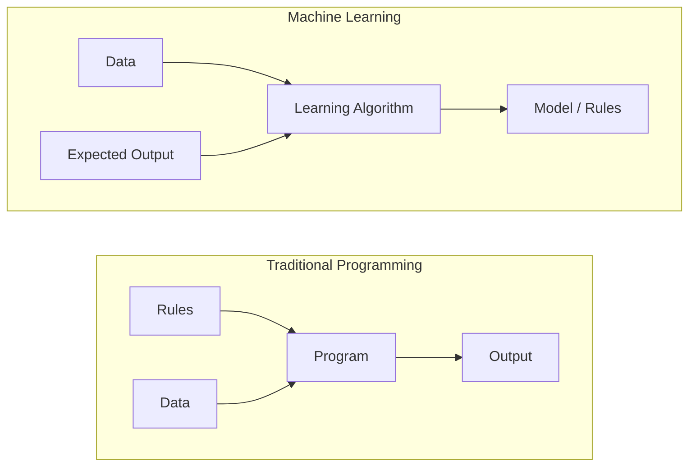
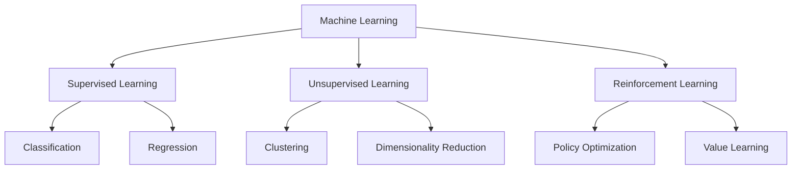
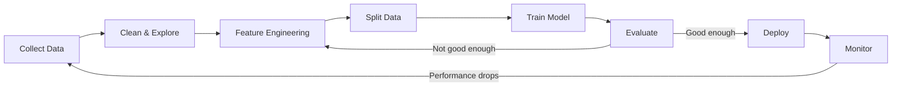
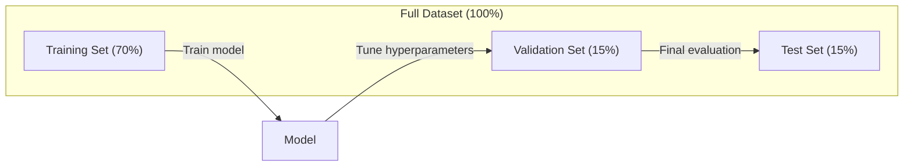
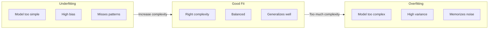
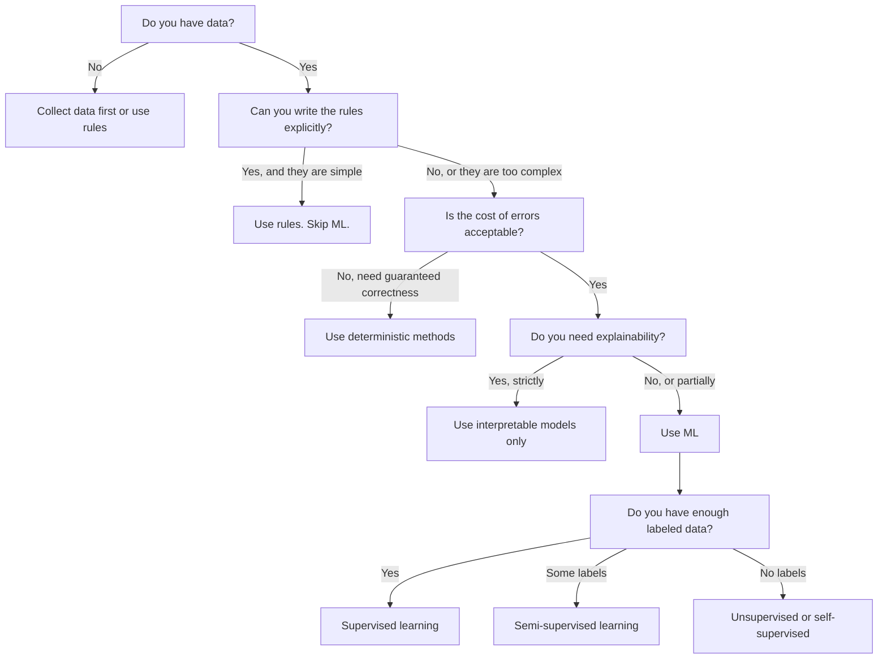

# Máy học là gì
# 什么是机器学习


> Học máy đang dạy máy tính tìm kiếm các mẫu trong dữ liệu thay vì viết các quy tắc bằng tay.

> 机器学习 là dạy máy tính tìm thấy các quy tắc trong dữ liệu, chứ không phải dựa trên quy tắc viết nhân tạo.

**Type:** Learn | **类型：** 学习
**Languages:** Python
**Prerequisites:** Phase 1 (Math Foundations) | **前置知识：** Phase 1（数学基础）
**Time:** ~45 minutes | **时间：** 约 45 分钟

## Mục tiêu học tập

- Giải thích sự khác biệt giữa việc học theo giám sát, không theo giám sát và tăng cường và xác định loại nào áp dụng cho một vấn đề nhất định
  解释 sự khác biệt giữa giám sát học 无监督学习和强化学习, và quyết định các vấn đề phù hợp với loại nào
- Thực hiện một phân loại trung tâm gần nhất từ đầu và đánh giá nó với một đường cơ sở ngẫu nhiên
  Từ zero thực hiện gần đây chất lượng phân loại, và đánh giá so sánh với cơ sở
- Hóa ra sự khác biệt giữa các nhiệm vụ phân loại và trục xuất và chọn hàm mất thích hợp cho mỗi nhiệm vụ
  区分分类和归归任务, chọn hàm mất tích phù hợp cho mỗi nhiệm vụ
- Đánh giá liệu một vấn đề kinh doanh nhất định có phù hợp với ML hay được giải quyết tốt hơn bằng các quy tắc xác định
   đánh giá vấn đề kinh doanh có phù hợp với ML  giải quyết hay sử dụng quy tắc xác định tốt hơn


> **【中文解读】**
> 机器学习 là để máy tính tự động học từ dữ liệu, thay vì dựa trên quy tắc viết nhân tạo. 监督学习 (监督学习) 无监督学习 (监督学习) 无标签 (强化学习) 奖励信号 (奖励信号) là một loại ước tính trong các quy tắc.

> **【拓展：机器学习范式的产业应用】**
> GPT-4 Sử dụng tự giám sát học tập(预测下一个代币) 在约13亿代币上训练;BERT 使用掩码语言建模在 Wikipedia + BookCorpus 上预训练;AlphaGo Sử dụng强化学习通过自我对对超越人类围棋冠军。

## Vấn đề  vấn đề giới thiệu

Bạn muốn xây dựng một bộ lọc spam. Cách tiếp cận truyền thống: ngồi xuống và viết hàng trăm quy tắc. "Nếu email có chứa 'FREE MONEY', đánh dấu nó là spam. Nếu nó có nhiều hơn 3 dấu hô, đánh dấu nó là spam". Bạn dành nhiều tuần để viết các quy tắc. Sau đó, những người gửi thư rác thay đổi các định nghĩa của họ. Quy tắc của bạn phá vỡ. Bạn viết thêm các quy tắc. Chuyện không bao giờ kết thúc.

> Bạn muốn xây dựng một bộ lọc thư rác. Cách truyền thống là ngồi xuống và viết hàng trăm quy tắc. "Nếu thư có chứa 'TINHN PHÁN', đánh dấu như thư rác. Nếu có hơn 3 u u, đánh dấu như thư rác". Bạn đã mất vài tuần để viết quy tắc.

Máy học làm thay đổi điều này. Thay vì viết các quy tắc, bạn đưa cho máy tính hàng ngàn email có nhãn ("spam" hoặc "không spam") và để nó tự tìm ra các quy tắc. máy tính tìm thấy các mẫu mà bạn không bao giờ nghĩ đến. Khi những người spam thay đổi chiến thuật, bạn tập trung lại dữ liệu mới thay vì viết lại mã.

> 机器学习 đã phá vỡ cách này. Bạn không viết quy tắc, mà đưa cho máy tính hàng ngàn thư được đánh dấu tốt. Hãy để nó tự tìm ra quy tắc. máy tính sẽ phát hiện ra một mô hình mà bạn chưa bao giờ nghĩ đến. Khi người gửi thư rác thay đổi chiến lược, bạn chỉ cần luyện tập lại trên dữ liệu mới, thay vì viết lại mã.

Sự chuyển đổi từ "quyền thống lập trình" sang "làm học từ dữ liệu" là cốt lõi của việc học máy.

> Sự chuyển đổi từ "quản lý lập trình" đến "đối học trong dữ liệu" là cốt lõi của việc học máy. Mỗi động cơ giới thiệu, trợ lý tiếng, xe tự lái và mô hình ngôn ngữ đều làm việc như vậy.

> **【中文解读】**
> 传统编程是"人写规则,机器执行";机器学习是"人给数据,机器发现规则"――例如:传统方法需要手动维护数百条规则,而 ML 方法只需提供大量标签邮件,模型自动学习判别模式――当垃圾邮件策略变化时,只需重新训练而不是重写代码――

> **【拓展：垃圾邮件过滤的演进】**
> GMail của phân loại thư rác xử lý mỗi ngày khoảng 3 tỷ thư, tỷ lệ xác thực vượt quá 99,9%.

## Khái niệm cốt lõi

### Học hỏi từ dữ liệu, chứ không phải từ quy tắc

Chương trình truyền thống và học máy giải quyết các vấn đề theo hướng ngược lại.

> Ứng dụng lập trình truyền thống và học máy theo hướng ngược lại để giải quyết vấn đề.



Chương trình truyền thống: bạn viết các quy tắc. Chương trình áp dụng chúng cho dữ liệu để tạo ra đầu ra.

> 传统编程:你编写规则──程序将规则应用于数据产生输出──

Học máy: bạn cung cấp dữ liệu và kết quả dự kiến.

> 机器学习:你提供数据和期望输出――算法 tự động tìm thấy quy tắc――

"Mô hình" xuất hiện từ đào tạo là các quy tắc, được mã hóa như số (nâng trọng, tham số). Nó tổng quát từ các ví dụ nó đã thấy để đưa ra dự đoán về dữ liệu nó chưa bao giờ thấy.

> Mô hình được đào tạo là quy tắc tự nó, được mã hóa theo hình thức số (chất lượng, trọng lượng, tham số). Nó có thể được phổ biến từ các mẫu đã được thấy, để dự đoán dữ liệu mới chưa từng thấy.

> **【中文解读】**
> 传统编程与机器学习的本质区别:传统编程输入"规则+数据"得到"输出";机器学习输入"数据+期望输出"得到"模型 (规则) ⋅模型本质上就是使用数字编码的规则 (权重和参数) ⋅模型本质上是使用数字编码的规则 (权重和参数),它能对未见的新数据做预测――这是"泛化"AI 系统最核心的能力――

### Ba loại máy học



**Supervised Learning**Có cặp đầu vào và đầu ra. mô hình học cách lập bản đồ đầu vào đến đầu ra.
- "Đây là 10.000 bức ảnh có nhãn mèo hay chó. Hãy học cách phân biệt chúng".
- "Đây là những tính năng và giá nhà.

> **监督学习**Bạn có nhập-output đối với.
> - "Có 10.000 trang có hình ảnh của mèo hay chó.
> - "Đây có đặc điểm và giá nhà.

**Unsupervised Learning**Bạn chỉ có đầu vào, không có nhãn, mô hình tự tìm ra cấu trúc.
- "Đây là 10.000 lịch sử mua hàng của khách hàng. Tìm các nhóm tự nhiên".
- "Đây là 1.000 điểm dữ liệu chiều, giảm xuống 2 chiều trong khi giữ cấu trúc".

> **无监督学习**Bạn chỉ có nhập, không có thẻ.
> - "Hà có 10.000 khách hàng mua hồ sơ. Tìm ra phân nhóm tự nhiên".
> - "Nó có 1.000 điểm dữ liệu ở các cấu trúc được giữ lại cùng lúc xuống còn 2 chiều".

**Reinforcement Learning**Một đại lý thực hiện các hành động trong một môi trường và nhận được phần thưởng hoặc hình phạt.
- "Chơi trò chơi này. +1 để thắng, -1 để thua. Hãy tìm ra một chiến lược".
- "Hãy kiểm soát cánh tay robot này. +1 để lấy vật thể, -0,01 cho mỗi giây lãng phí".

> **强化学习**: Nhất trí trong môi trường hành động và nhận được phần thưởng hoặc trừng phạt. Nó học một chiến lược để tối đa hóa tổng phần thưởng.
> - "Để chơi trò chơi này. Đánh thắng +1, thua -1.
> - "Control this machine arm. " "Successfully grab an object". "Cái vật này được kiểm soát. "

Hầu hết những gì bạn sẽ xây dựng trong thực tế sử dụng học tập giám sát. Học tập không giám sát là phổ biến cho quá trình xử lý trước và khám phá. Học tập tăng cường năng lực AI trò chơi, robot và RLHF cho các mô hình ngôn ngữ.

> Trong thực tế, phần lớn các hệ thống bạn xây dựng sử dụng giám sát học.

> **【拓展：三种范式在真实系统中的分工】**
> Netflix 推系统同时使用三种范式:协同过(无监督聚类用户群) 监督学习(预测用户对电影的评分 1-5 星) 强化学习(A/B 测试选择最优推策略) ;;Tesla Autopilot 使用监督学习(目标检测) + 强化学习(路径规划) ;;Stable Diffusion 训练涉及自监督(图像文本对学习 CLIP) + 监督微调;;

### Ngoài ba người lớn

Ba loại trên là sạch sẽ, nhưng ML trong thế giới thực thường làm mờ ranh giới.

> Trên đây là 3 loại rất rõ ràng, nhưng thế giới thực ML 往往模糊这些界限.

**Semi-supervised learning**sử dụng một tập hợp nhỏ dữ liệu có nhãn và một tập hợp lớn dữ liệu không nhãn. Bạn có thể có 100 hình ảnh y tế có nhãn và 100.000 hình ảnh không nhãn. Các kỹ thuật bao gồm:

> **半监督学习**Sử dụng một số ít dữ liệu nhãn và một lượng lớn dữ liệu không nhãn. Bạn có thể có 100 ảnh y tế nhãn và 100.000 ảnh không nhãn.

- **Label propagation:**Xây dựng một biểu đồ kết nối các điểm dữ liệu tương tự. Các nhãn lan từ các nút có nhãn đến các hàng xóm không có nhãn thông qua biểu đồ.
  **标签传播：**Xây dựng một kết nối tương tự như dữ liệu điểm của biểu tượng.
- **Pseudo-labeling:**Trén một mô hình trên dữ liệu được dán nhãn, sử dụng nó để dự đoán nhãn cho dữ liệu không được dán nhãn, sau đó đào tạo lại mọi thứ. mô hình khởi động bộ huấn luyện của riêng nó.
  **伪标签：**Trong mô hình đào tạo trên dữ liệu đánh dấu, sử dụng nó để dự đoán các nhãn dữ liệu chưa đánh dấu, sau đó đào tạo lại trên tất cả dữ liệu. mô hình tự tạo ra tập hợp đào tạo của riêng mình.
- **Consistency regularization:**Mô hình nên đưa ra dự đoán tương tự cho một đầu vào và một phiên bản bị nhiễu nhẹ của đầu vào đó.
  **一致性正则化：**Mô hình nên đưa ra dự đoán tương tự đối với các đầu vào và phiên bản dễ bị nhiễu.

**Self-supervised learning**mô hình tạo ra nhiệm vụ dự đoán của riêng mình từ cấu trúc dữ liệu.

> **自监督学习**Từ dữ liệu tự tạo giám sát tín hiệu. hoàn toàn không cần thẻ nhân tạo. mô hình từ cấu trúc dữ liệu tạo nhiệm vụ dự đoán của riêng mình.

- **Masked language modeling (BERT):**Cất giấu 15% từ trong một câu, huấn luyện mô hình để dự đoán những từ thiếu. "Là nhãn" đến từ văn bản gốc.
  **掩码语言建模（BERT）：**遮盖句中 15% 的词,训练模型预测被遮盖的词──"标签"来自原始文本──
- **Contrastive learning (SimCLR):**Hãy chụp hình ảnh, tạo ra hai phiên bản tăng cường. Hãy huấn luyện mô hình để nhận ra chúng xuất phát từ cùng một hình ảnh trong khi phân biệt chúng với các phiên bản tăng cường của các hình ảnh khác.
  **对比学习（SimCLR）：**取一张图像, tạo hai phiên bản tăng cường.
- **Next-token prediction (GPT):**Dự đoán từ tiếp theo với tất cả các từ trước đó. Mỗi tài liệu văn bản trở thành một ví dụ đào tạo.
  **下一 token 预测（GPT）：**给定前面所有词,预测下一个词――每个文本文档都成为训练样本――

> **【拓展：自监督学习如何驱动大模型革命】**
> GPT-4 có khoảng 13 tỷ mã thông báo, nếu dựa trên đánh dấu nhân tạo là hoàn toàn không thể.

Đây không phải là các loại riêng biệt từ ba loại lớn. Chúng là các chiến lược kết hợp các ý tưởng được giám sát và không được giám sát. Học tập tự giám sát được giám sát kỹ thuật (chương trình dự đoán một cái gì đó), nhưng các nhãn được tạo tự động, không phải bởi con người.

> Chúng không phải là một loại mới tách biệt với ba loại lớn. Chúng là một chiến lược kết hợp quan sát và không quan sát tư tưởng.

### Định dạng so với sự lùi

Đây là hai nhiệm vụ học tập được giám sát chính.

> Đây là hai nhiệm vụ giám sát học tập chính.

| Aspect | Classification | Regression |
|--------|---------------|------------|
| Output | Discrete categories | Continuous numbers |
| Example | "Is this email spam?" | "What will the house price be?" |
| Output space | {cat, dog, bird} | Any real number |
| Loss function | Cross-entropy, accuracy | Mean squared error, MAE |
| Decision | Boundaries between classes | A curve that fits the data |

| 方面 | 分类 | 回归 |
|------|------|------|
| 输出 | 离散类别 | 连续数值 |
| 示例 | "这封邮件是垃圾邮件吗？" | "房价会是多少？" |
| 输出空间 | {猫, 狗, 鸟} | 任意实数 |
| 损失函数 | 交叉熵、准确率 | 均方误差、MAE |
| 决策方式 | 类别之间的边界 | 拟合数据的曲线 |

Phân loại trả lời "đại loại nào?"

> 分类回答"哪个类别?" 回归回答"多少?"

Một số vấn đề có thể được hình thành theo cách nào đó. Dự đoán nếu một cổ phiếu tăng hoặc giảm là phân loại. Dự đoán giá chính xác là sự lùi.

> Một số vấn đề có thể được xây dựng bằng hai cách.

> **【中文解读】**
> phân loại và trở lại là hai nhiệm vụ cơ bản của việc giám sát học. phân loại dự đoán phân tán phân loại (như "垃圾邮件/正常邮件"), trở lại dự đoán số lượng liên tục (như "房价250万")

### Phương trình làm việc ML

Mỗi dự án học máy đều theo cùng một đường ống dẫn, bất kể thuật toán.

> Mỗi dự án học máy đều theo cùng một quy trình, bất kể sử dụng bất kỳ thuật toán nào.



**Collect Data**Thu thập dữ liệu thô. Nhiều dữ liệu gần như luôn tốt hơn, nhưng chất lượng quan trọng hơn số lượng.

> **收集数据**: lấy dữ liệu nguyên thủy. Nhiều dữ liệu gần như luôn tốt hơn, nhưng chất lượng quan trọng hơn số lượng.

**Clean & Explore**: xử lý các giá trị thiếu, loại bỏ các bản sao, hình ảnh phân phối, phát hiện bất thường.

> **清洗与探索**: xử lý thiếu giá trị, loại bỏ các dự án tái tạo, phân bố hình ảnh, phát hiện bất thường.

**Feature Engineering**: Chuyển đổi dữ liệu thô thành các tính năng mà mô hình có thể sử dụng. Chuyển đổi ngày thành ngày trong tuần. Tiêu chuẩn các cột số. Mã hóa các biến phân loại. Các tính năng tốt quan trọng hơn các thuật toán may mắn.

> **特征工程**:将原始数据转换为模型可用特征――将日期转换为几周――标准化数值列――编码分类变量――特征 tốt hơn thuật toán trang trí hơn――

**Split Data**: Chia thành tập huấn, xác nhận và thử nghiệm. mô hình đào tạo dựa trên dữ liệu đào tạo, bạn điều chỉnh các siêu tham số trên dữ liệu xác nhận, và bạn báo cáo hiệu suất cuối cùng trên dữ liệu thử nghiệm.

> **划分数据**: chia cho tập hợp đào tạo, tập hợp chứng minh và tập hợp thử nghiệm. mô hình học trên dữ liệu đào tạo, bạn điều chỉnh siêu số trên dữ liệu chứng minh, báo cáo hiệu suất cuối cùng trên dữ liệu thử nghiệm.

**Train Model**: Đưa dữ liệu đào tạo vào một thuật toán.

> **训练模型**:将训练数据输入算法──算法调整内部参数以最小化损失函数──

**Evaluate**: đo hiệu suất trên dữ liệu xác thực / thử nghiệm. Nếu hiệu suất không thể chấp nhận được, hãy quay lại và thử các tính năng, thuật toán hoặc siêu tham số khác nhau.

> **评估**: Trong các dữ liệu kiểm tra/ kiểm tra đo hiệu suất. Nếu hiệu suất không thể chấp nhận được, hãy thử các đặc điểm khác nhau, thuật toán hoặc siêu参数.

**Deploy**: Đưa mô hình vào sản xuất nơi nó đưa ra dự đoán về dữ liệu mới.

> **部署**: sẽ đưa mô hình vào môi trường sản xuất, dự đoán dữ liệu mới.

**Monitor**: Theo dõi hiệu suất theo thời gian. Phân phối dữ liệu thay đổi (trái dữ liệu), và mô hình giảm. Khi hiệu suất giảm, tập luyện lại.

> **监控**:随时间追踪性能──数据分布会变化──数据漂移),模型会退化──当性能下降时,重新训练──

### Việc đào tạo, xác nhận và kiểm tra

Đây là khái niệm quan trọng nhất người mới bắt đầu sai lầm. Bạn phải đánh giá mô hình của bạn trên dữ liệu mà nó chưa bao giờ thấy trong quá trình đào tạo. Nếu không bạn đang đo lường ghi nhớ, không phải học tập.

> Đây là khái niệm quan trọng nhất của người học đầu tiên dễ dàng mắc sai lầm. Bạn phải đánh giá mô hình trên dữ liệu chưa từng thấy trong quá trình đào tạo. Nếu không bạn sẽ đo lường khả năng nhớ, chứ không phải khả năng học.



| Split | Purpose | When used | Typical size |
|-------|---------|-----------|-------------|
| Training | Model learns from this data | During training | 60-80% |
| Validation | Tune hyperparameters, compare models | After each training run | 10-20% |
| Test | Final unbiased performance estimate | Once, at the very end | 10-20% |

| 划分 | 用途 | 使用时机 | 典型比例 |
|------|------|---------|---------|
| 训练集 | 模型从中学习 | 训练期间 | 60-80% |
| 验证集 | 调节超参数，比较模型 | 每次训练后 | 10-20% |
| 测试集 | 最终无偏性能估计 | 最后仅使用一次 | 10-20% |

Bộ thử nghiệm là thánh. Bạn nhìn vào nó một lần. Nếu bạn tiếp tục điều chỉnh mô hình của bạn dựa trên hiệu suất thử nghiệm, bạn đang thực hiện hiệu quả trên bộ thử nghiệm và số liệu được báo cáo của bạn là vô nghĩa.

> 测试集是神圣的──你只能看一次──如果你不断根据测试性能调整模型,你实际上在测试集上训练,你报告的数字毫无意义──

> **【中文解读】**
> Số liệu phân chia là một trong những sai lầm dễ mắc nhất trong ML. Tập hợp đào tạo được sử dụng để học các tham số, tập hợp chứng nhận được sử dụng để điều chỉnh các siêu tham số và lựa chọn mô hình, tập hợp chứng minh được sử dụng chỉ để đánh giá cuối cùng. Nếu lặp lại trong tập hợp chứng minh, thì tương tự như "đánh giá các câu trả lời", đánh giá hiệu suất mô hình hoàn toàn không hiệu quả. Đối với tập hợp dữ liệu nhỏ, sử dụng các chứng minh giao thông có thể đánh giá hiệu suất một cách đáng tin cậy hơn.

Đối với các tập dữ liệu nhỏ, sử dụng xác thực chéo k-fold: chia dữ liệu thành k phần, đào tạo trên k-1 phần, xác nhận trên phần còn lại, xoay và kết quả trung bình.

> Đối với tập dữ liệu nhỏ, sử dụng k 折交叉验证:将数据分成 k 份, trong k-1 份训练, trong phần còn lại trên một验证,轮换并取平均――

### Overfitting vs Underfitting



**Underfitting**: Mô hình quá đơn giản để chụp các mẫu trong dữ liệu. Một đường thẳng cố gắng phù hợp với một mối quan hệ cong. Sai lầm đào tạo cao. Sai lầm thử nghiệm cao.

> **欠拟合**Mô hình quá đơn giản, không thể nắm bắt được mô hình trong dữ liệu.

**Overfitting**: Mô hình quá phức tạp và ghi nhớ dữ liệu đào tạo, bao gồm cả tiếng ồn. Một đường cong chuyển động đi qua mọi điểm đào tạo nhưng không đạt được dữ liệu mới. Hầm hỏng đào tạo thấp. Hầm thử là cao.

> **过拟合**Mô hình quá phức tạp, nhớ tiếng ồn trong dữ liệu đào tạo. Một bài qua các đường cong chuyển động của từng điểm đào tạo, nhưng trong dữ liệu mới, hiệu suất rất kém.

**Good fit**: Mô hình ghi lại các mẫu thực tế mà không ghi nhớ tiếng ồn.

> **良好拟合**Mô hình bắt được mô hình thực tế mà không ghi nhớ tiếng ồn.

> **【中文解读】**
> 欠拟合 = 模型 quá đơn giản, quy tắc trong dữ liệu liên tập không được học; quá chuẩn = 模型 quá phức tạp,把训练数据中的噪音都记得,遇到新数据就就"露"―― mô hình tốt trong tập hợp đào tạo và tập hợp thử nghiệm đều hoạt động tốt―― đánh giá tiêu chuẩn: Nếu tỷ lệ độ chính xác trong tập hợp đào tạo cao hơn tỷ lệ xác minh, đó là tín hiệu điển hình của quá chuẩn――

Các dấu hiệu quá phù hợp:
- Độ chính xác đào tạo cao hơn nhiều so với độ chính xác xác xác nhận
   training准确率远高于验证准确率
- Mô hình hoạt động tốt trên dữ liệu đào tạo nhưng kém trên dữ liệu mới
  Mô hình hoạt động tốt trên dữ liệu đào tạo nhưng kém trên dữ liệu mới
- Thêm thêm dữ liệu đào tạo cải thiện hiệu suất (chương trình ghi nhớ, không phải học tập)
  增加训练数据能提升性能 (khởi mở trước khi mô hình là nhớ thay vì học)

> 过拟合的迹象:

Phong điểm để quá trang bị:
- Nhận thêm dữ liệu đào tạo
  获取更多训练数据
- Giảm độ phức tạp của mô hình ( ít tham số hơn, kiến trúc đơn giản hơn)
  降低模型复杂度 ((更少参数、更简单的架构)
- Việc quy định (làm thêm một hình phạt cho trọng lượng lớn)
  正则化 (trong phần lớn)
- Quay giảm (những tế bào thần kinh vô tình bị tiêu hủy trong quá trình tập luyện)
  Trượt bài tập (trenings)
- Ngưng sớm (ngưng đào tạo khi lỗi xác thực bắt đầu tăng)
  早停(当验证误差开始上升时停止训练)

> 过拟合的修复方法:

Phong điểm cho việc không phù hợp:
- Sử dụng mô hình phức tạp hơn
  Sử dụng mô hình phức tạp hơn
- Thêm thêm tính năng
  添加更多特征
- Giảm sự thường xuyên hóa
   giảm quy định
- Đào tàu lâu hơn
  训练更长时间

> 欠拟合的修复方法:

### Sự giao dịch giữa sự thiên vị và sự biến thể

Đây là khung toán học đằng sau quá phù hợp và thiếu phù hợp.

> Đó là khung toán học sau quá phù hợp và không phù hợp.

**Bias**: lỗi từ giả định sai trong mô hình. Một mô hình tuyến tính có thiên vị cao khi mối quan hệ thực sự không tuyến tính. thiên vị cao dẫn đến sự thiếu phù hợp.

> **偏差**Từ mô hình sai lầm giả định của sai lầm. Khi thực tế mối quan hệ không tuyến tính, mô hình tuyến tính có sự phân biệt cao.

**Variance**: lỗi từ độ nhạy đến biến động nhỏ trong dữ liệu đào tạo. Một mô hình có sự biến động cao đưa ra dự đoán rất khác nhau khi được đào tạo trên các bộ phận dữ liệu khác nhau. sự biến động cao dẫn đến quá phù hợp.

> **方差**Từ các dữ liệu đào tạo có độ phân biệt nhỏ và nhạy cảm với động lực.

| Model complexity | Bias | Variance | Result |
|-----------------|------|----------|--------|
| Too low (linear model for curved data) | High | Low | Underfitting |
| Just right | Medium | Medium | Good generalization |
| Too high (degree-20 polynomial for 10 points) | Low | High | Overfitting |

| 模型复杂度 | 偏差 | 方差 | 结果 |
|-----------|------|------|------|
| 太低（用线性模型拟合弯曲数据） | 高 | 低 | 欠拟合 |
| 恰好 | 中 | 中 | 良好泛化 |
| 太高（10 个点用 20 次多项式） | 低 | 高 | 过拟合 |

Tổng lỗi = Bias^2 + Varian + Lồn không thể giảm

> 总误差 = 偏差^2 + 方差 + không thể 约噪音

Bạn không thể giảm tiếng ồn không thể giảm (đó là sự ngẫu nhiên trong dữ liệu tự nó).

> Bạn không thể giảm tiếng ồn không thể kiểm soát được. Đó là tính tự nhiên của dữ liệu. Bạn muốn tìm ra điểm tối thiểu hóa sự phân biệt 2 + sự phân biệt.

### Không có lý thuyết bữa trưa miễn phí

Không có thuật toán duy nhất hoạt động tốt nhất cho mọi vấn đề. Một thuật toán hoạt động tốt trên một lớp vấn đề sẽ hoạt động kém trên một loại khác. Đây là lý do tại sao các nhà khoa học dữ liệu thử nhiều thuật toán và so sánh kết quả.

> Không có một thuật toán đơn lẻ có thể hoạt động tốt nhất trên tất cả các vấn đề. Một thuật toán tốt trong một loại vấn đề sẽ hoạt động kém trong một loại vấn đề khác. Đó là lý do các nhà khoa học dữ liệu thử nhiều thuật toán và so sánh kết quả.

> **【拓展：没有免费午餐定理的实践意义】**
> Lý thuyết này cho chúng ta biết: Kaggle 竞赛冠军 gần như không chỉ sử dụng một thuật toán, mà còn sử dụng phương pháp tích hợp (XGBoost + LightGBM + 神经网络) hợp nhất nhiều mô hình. Trong các dự án thực tế, thường sử dụng nhiều thuật toán để làm cơ sở để so sánh với logic trở lại,随机森林,VM,XGBoost), tái chọn các công cụ AutoML tốt nhất.

Trong thực tế, sự lựa chọn phụ thuộc vào:
- Bạn có bao nhiêu dữ liệu
  Bạn có bao nhiêu dữ liệu
- Có bao nhiêu tính năng
  Có nhiều đặc điểm
- Dù mối quan hệ là tuyến tính hay không tuyến tính
  Quan hệ là tuyến tính hay không tuyến tính
- Nếu bạn cần sự giải thích
  Có cần có thể giải thích
- Bạn có thể mua bao nhiêu máy tính
  Bạn có thể chịu được bao nhiêu chi phí tính toán

> Trong thực tế, chọn取决于:

### Khi nào không nên sử dụng máy học

ML có sức mạnh nhưng không phải lúc nào cũng là công cụ phù hợp.

> ML rất mạnh mẽ, nhưng không phải luôn là công cụ chính xác. Trước khi sử dụng mô hình, hãy tự hỏi mình liệu mình có thực sự cần nó hay không.

**Do not use ML when:**

> **以下情况不要使用 ML：**

- **Rules are simple and well-defined.**Lượng thuế, thuật toán phân loại, chuyển đổi đơn vị. Nếu bạn có thể viết logic trong một vài if-statement, một mô hình sẽ thêm sự phức tạp mà không có lợi ích.
  **规则简单且明确。**税费计算、排序算法、单位转换―― nếu bạn có thể sử dụng một vài nếu 语句写完逻辑, mô hình sẽ chỉ tăng độ phức tạp mà không có bất kỳ lợi ích nào―
- **You have no data or very little data.**ML cần những ví dụ để học hỏi. Với 10 điểm dữ liệu, bạn không thể đào tạo bất cứ điều gì có ý nghĩa.
  **没有数据或数据极少。**ML  cần học từ mẫu. Chỉ có 10 điểm dữ liệu, bạn không thể luyện tập bất cứ điều gì có ý nghĩa.
- **The cost of being wrong is catastrophic and you need guaranteed correctness.**Xét lượng thuốc y tế, kiểm soát lò phản ứng hạt nhân, xác minh mật mã. Các mô hình ML là xác suất. Đôi khi chúng sẽ sai. Nếu "một lúc sai" là không thể chấp nhận được, sử dụng phương pháp xác định.
  **错误的代价是灾难性的且需要保证正确性。** tính liều thuốc  kiểm soát lò phản ứng hạt nhân  mật mã 验证ML mô hình là xác suất, chúng đôi khi sẽ sai Nếu "một lúc sai" không thể chấp nhận được, sử dụng phương pháp xác định
- **A lookup table or heuristic solves the problem.**Nếu một ngưỡng đơn giản hoặc bảng bao gồm 99% trường hợp, việc thêm ML làm tăng chi phí bảo trì mà không cải thiện đáng kể.
  **查找表或启发式规则就能解决问题。**Nếu giá trị đơn giản hoặc biểu đồ có thể phủ 99% tình huống, thêm ML chỉ tăng chi phí bảo trì mà không có cải tiến thực chất.
- **You cannot explain the decision and explainability is required.**Các ngành công nghiệp được quy định (thu vay, bảo hiểm, tư pháp hình sự) đôi khi yêu cầu mọi quyết định đều có thể giải thích đầy đủ.
  **无法解释决策但需要可解释性。**Trong ngành quản lý (trợ tư, bảo hiểm, pháp lý) đôi khi yêu cầu mỗi quyết định có thể giải thích đầy đủ.
- **The problem changes faster than you can retrain.**Nếu các quy tắc thay đổi hàng ngày và đào tạo lại mất một tuần, mô hình luôn là lỗi thời.
  **问题变化的速度快于重训练速度。**Nếu luật lệ thay đổi mỗi ngày và tập luyện lại cần một tuần, mô hình luôn là quá khứ.

Sử dụng biểu đồ lưu lượng quyết định này:

> Sử dụng quy trình quyết định sau:



## Hãy xây dựng nó.
```figure
f3-learning-boundary
```

## Hãy xây dựng nó

Mã trong `code/ml_intro.py`Nó thực hiện một phân loại trung tâm gần nhất từ đầu, thuật toán ML đơn giản nhất có thể. Nó chứng minh ý tưởng cốt lõi: học hỏi từ dữ liệu, sau đó dự đoán về dữ liệu mới.

> `code/ml_intro.py`Mã trung tâm từ không thực hiện chất lượng phân loại gần đây, đây là thuật toán ML đơn giản nhất. Nó thể hiện ý tưởng tâm lý hạt nhân: học từ dữ liệu, sau đó dự đoán dữ liệu mới.

> **【中文解读】**
> Gần đây chất lượng phân loại là đơn giản nhất ML 算法: tập luyện khi tính toán trung tâm của mỗi loại (平均值), dự đoán khi phân phối mẫu mới cho trung tâm gần đây. Mặc dù đơn giản, nhưng nó hoàn toàn cho thấy quy trình cốt lõi của ML:fit (fit) từ dữ liệu học (data learning) → dự đoán (forecasting)  đối với dữ liệu mới (new data prediction)  đánh giá (equation)  đối với đường cốt (基线) ).

### Bước 1: Classifier Centroid gần nhất từ đầu

Bộ phân loại trung tâm gần nhất tính toán trung tâm (tỷ lệ trung bình) của mỗi lớp trong dữ liệu đào tạo. Để dự đoán, nó gán mỗi điểm mới cho lớp có trung tâm gần nhất.

> Trong dữ liệu của mỗi loại tập trung (trên đó có thể có được các điểm mới)

```python
class NearestCentroid:
    def fit(self, X, y):
        self.classes = np.unique(y)  # 获取所有唯一类别标签
        self.centroids = np.array([
            X[y == c].mean(axis=0) for c in self.classes  # 计算每个类别的质心（均值向量）
        ])

    def predict(self, X):
        distances = np.array([
            np.sqrt(((X - c) ** 2).sum(axis=1))  # 计算每个样本到各质心的欧氏距离
            for c in self.centroids
        ])
        return self.classes[distances.argmin(axis=0)]  # 返回距离最近的质心对应的类别
```

Đó là toàn bộ thuật toán. Fit tính toán hai phương tiện. Predict tính toán khoảng cách. Không giảm gradient, không lặp lại, không có các siêu tham số.

> Đây là toàn bộ thuật toán. FIT  tính toán hai giá trị trung bình.

### Bước 2: Đào tạo dữ liệu tổng hợp

Chúng ta tạo ra một bộ dữ liệu phân loại 2D với hai lớp được chồng chéo một chút.

> Chúng tôi tạo ra một 2D phân loại dữ liệu tập hợp hai loại có chồng chéo.

```python
rng = np.random.RandomState(42)  # 设置随机种子以保证可复现
X_class0 = rng.randn(100, 2) + np.array([1.0, 1.0])  # 类别 0 的数据：中心在 (1,1) 附近
X_class1 = rng.randn(100, 2) + np.array([-1.0, -1.0])  # 类别 1 的数据：中心在 (-1,-1) 附近
X = np.vstack([X_class0, X_class1])  # 合并所有特征数据
y = np.array([0] * 100 + [1] * 100)  # 创建对应的标签数组
```

### Bước 3: So sánh với một điểm gốc

Mỗi mô hình ML nên được so sánh với một đường cơ sở tầm thường. Ở đây, đường cơ sở dự đoán một lớp ngẫu nhiên. Nếu mô hình ML của bạn không đánh bại đoán ngẫu nhiên, có điều gì đó sai.

> Mỗi mô hình ML  nên được so sánh với một đường cơ bản đơn giản. Nếu mô hình ML  của bạn kết nối với đường đoán cơ bản, bạn sẽ thấy có vấn đề.

```python
baseline_preds = rng.choice([0, 1], size=len(y_test))  # 随机猜测作为基线
baseline_acc = np.mean(baseline_preds == y_test)  # 计算基线准确率
```

Bộ phân loại trung tâm nên có độ chính xác khoảng 90% trên bộ dữ liệu sạch này.

> 质心分类器 trong bộ dữ liệu này nên đạt được tỷ lệ chính xác khoảng 90% +.

### Tại sao điều này quan trọng

Các phân loại trung tâm gần nhất là đơn giản. Nó không có siêu tham số, không lặp lại, không giảm độ nghiêng.

> Gần đây质心分类器极其简单―― nó không có siêu参数, không có 代, không có gradient giảm―― nhưng nó nắm bắt mô hình cơ bản của ML:

1. **Learn**một đại diện từ dữ liệu đào tạo (các trung tâm)
   **学习**训练数据的表示(质心)
2. **Predict**về dữ liệu mới sử dụng đại diện đó (cách xa nhất)
   Sử dụng để biểu thị đối với dữ liệu mới**预测**(cách gần đây)
3. **Evaluate**so với đường cơ sở (đường đoán ngẫu nhiên)
   与基线(随机猜测) tiến hành**评估**

Mỗi thuật toán ML, từ sự hồi quy hậu cần đến các biến đổi, đều theo mô hình 3 bước này.

> Từ logic trở lại Transformer, mỗi ML  thuật toán đều theo cùng một mô hình ba bước. Chỉ đơn giản là nó trở nên phức tạp hơn, nhưng quá trình làm việc vẫn không thay đổi.

### Bước 4: Những gì bộ phân loại trung tâm không thể làm

Các phân loại trung tâm gần nhất giả định mỗi lớp tạo thành một điểm. Nó vẽ ranh giới quyết định tuyến tính. Nó thất bại khi:

> Gần đây, mỗi loại hình tạo thành một nhóm đơn lẻ. Nó vẽ ra ranh giới quyết định trực tuyến.

- Các lớp có nhiều cụm (ví dụ, chữ số "1" có thể được viết theo nhiều cách khác nhau)
  类别有多个 (ví dụ, số "1" có thể có nhiều cách viết)
- Biên giới quyết định không tuyến tính (ví dụ: một lớp vây quanh một lớp khác)
  决策边界非线性 (ví dụ, một loại xung quanh một loại khác)
- Các tính năng có quy mô rất khác nhau (tránh xa được thống trị bởi tính năng quy mô lớn nhất)
  Đặc điểm khác biệt cấp độ rất lớn (tránh xa các đặc điểm cấp độ lớn nhất)

Những hạn chế này thúc đẩy mọi thuật toán khác bạn sẽ học. K-cô lân cận xử lý nhiều cụm. Cây quyết định xử lý ranh giới không tuyến tính. Phân tích tính khắc phục vấn đề quy mô. Mỗi bài học xây dựng trên các hạn chế của bài trước.

> Những hạn chế này thúc đẩy mỗi thuật toán khác bạn sẽ học. K gần xử lý nhiều.

## Hãy sử dụng nó để thực hiện

sklearn cung cấp `NearestCentroid`và máy phát dữ liệu tổng hợp:

> SHOULDARN  cung cấp `NearestCentroid`Và tạo dữ liệu tổng hợp:

```python
from sklearn.neighbors import NearestCentroid
from sklearn.datasets import make_classification
from sklearn.model_selection import train_test_split

# 生成 500 个样本、2 个特征的合成分类数据集
X, y = make_classification(
    n_samples=500, n_features=2, n_redundant=0,
    n_clusters_per_class=1, random_state=42
)
# 按 70/30 比例划分训练集和测试集
X_train, X_test, y_train, y_test = train_test_split(X, y, test_size=0.3)

# 创建最近质心分类器并训练
clf = NearestCentroid()
clf.fit(X_train, y_train)
# 在测试集上评估准确率
print(f"Accuracy: {clf.score(X_test, y_test):.3f}")
```

## Chuyển nó đi.

Bài học này sẽ mang lại kết quả `outputs/prompt-ml-problem-framer.md`-- một lời nhắc nhở biến các vấn đề kinh doanh mơ hồ thành các nhiệm vụ ML cụ thể. Đưa ra một mô tả vấn đề ("chúng tôi muốn giảm sự sôi động" hoặc "được dự đoán nhu cầu cho quý tiếp theo") và nó xác định loại học tập, xác định mục tiêu dự đoán, liệt kê các tính năng ứng cử viên, chọn một số liệu thành công, thiết lập một đường cơ sở, và đánh dấu các bẫy như rò rỉ dữ liệu hoặc mất cân bằng lớp học. Sử dụng nó vào đầu bất kỳ dự án ML để tránh xây dựng sai trái.

> 本课产 出 `outputs/prompt-ml-problem-framer.md` Một vấn đề kinh doanh sẽ bị mờ biến thành lời khuyên của một nhiệm vụ ML cụ thể. Hãy cho nó một câu hỏi mô tả: "Chúng tôi muốn giảm khách hàng bị mất" hoặc "đáng kiến nhu cầu trong quý tiếp theo"), nó sẽ nhận ra loại học tập, xác định mục tiêu dự đoán, liệt kê các đặc điểm ứng cử, chọn chỉ số thành công, xây dựng một đường cốt lõi, và đánh dấu các lỗ hổng dữ liệu hoặc sự mất cân bằng và các rắc rối như vậy.

## Từ khóa  Từ khóa nhanh chóng

| Term | What people say | What it actually means |
|------|----------------|----------------------|
| Model | "The AI" | A mathematical function with learnable parameters that maps inputs to outputs |
| Training | "Teaching the AI" | Running an optimization algorithm to adjust model parameters so predictions match known outputs |
| Feature | "An input column" | A measurable property of the data that the model uses to make predictions |
| Label | "The answer" | The known output for a training example, used to compute the error signal |
| Hyperparameter | "A setting you tweak" | A parameter set before training that controls the learning process (learning rate, number of layers) |
| Loss function | "How wrong the model is" | A function that measures the gap between predicted and actual outputs, which training tries to minimize |
| Overfitting | "It memorized the test" | The model learned training-specific noise instead of general patterns, so it fails on new data |
| Underfitting | "It didn't learn anything" | The model is too simple to capture the real patterns in the data |
| Generalization | "It works on new data" | The model's ability to make accurate predictions on data it was not trained on |
| Cross-validation | "Testing on different chunks" | Repeatedly splitting data into train/test folds and averaging results, giving a more robust performance estimate |
| Regularization | "Keeping weights small" | Adding a penalty term to the loss function that discourages overly complex models |
| Data drift | "The world changed" | The statistical distribution of incoming data shifts over time, debegrading model performance |

| 术语 | 俗称 | 实际含义 |
|------|------|---------|
| Model / 模型 | "AI" | 一个具有可学习参数的数学函数，将输入映射到输出 |
| Training / 训练 | "教 AI" | 运行优化算法调整模型参数，使预测匹配已知输出 |
| Feature / 特征 | "输入列" | 数据中模型用于做预测的可测量属性 |
| Label / 标签 | "答案" | 训练样本的已知输出，用于计算误差信号 |
| Hyperparameter / 超参数 | "你调的设置" | 训练前设置的参数，控制学习过程（学习率、层数） |
| Loss function / 损失函数 | "模型有多错" | 衡量预测与实际输出差距的函数，训练试图最小化它 |
| Overfitting / 过拟合 | "它记住了测试集" | 模型学习了训练数据的噪声而非通用模式，在新数据上失效 |
| Underfitting / 欠拟合 | "它什么都没学到" | 模型太简单，无法捕捉数据中的真实模式 |
| Generalization / 泛化 | "在新数据上有效" | 模型对未训练数据做出准确预测的能力 |
| Cross-validation / 交叉验证 | "在不同块上测试" | 反复将数据划分为训练/测试折并平均结果，给出更稳健的性能估计 |
| Regularization / 正则化 | "保持权重小" | 在损失函数中添加惩罚项，阻止过于复杂的模型 |
| Data drift / 数据漂移 | "世界变了" | 输入数据的统计分布随时间变化，导致模型性能下降 |

## Tập luyện bài tập

1. Hãy lấy bất kỳ bộ dữ liệu nào (ví dụ: Iris, Titanic). Chia nó 70/15/15 thành tàu / xác thực / thử nghiệm. Giải thích lý do tại sao bạn không nên điều chỉnh các siêu tham số trên bộ thử nghiệm.
   1. 取任意数据集(如Iris、Titanic) 』按 70/15/15 划分为训练/验证/测试集──解释为什么不应在测试集上调节超参数──
2. Hãy liệt kê ba vấn đề thực tế. Đối với mỗi vấn đề, hãy xác định xem nó là phân loại, hồi quy hay tập hợp, và liệu nó có được giám sát hay không.
   2. 列出三个现实世界问题―― đối với mỗi vấn đề, phán xét nó là phân loại, trở lại hay tập hợp, cũng như là giám sát học hay không giám sát học.
3. Một mô hình có độ chính xác 99% trên dữ liệu đào tạo nhưng 60% trên dữ liệu thử nghiệm. Chẩn đoán vấn đề và liệt kê ba điều bạn sẽ cố gắng khắc phục nó.
   3. Một mô hình có tỷ lệ chính xác 99% trên dữ liệu đào tạo, nhưng chỉ có 60% trên dữ liệu thử nghiệm.

## Xem thêm 延伸阅读

- [An Introduction to Statistical Learning](https://www.statlearning.com/)- sách giáo khoa miễn phí bao gồm tất cả các phương pháp ML cổ điển với các ví dụ thực tế
  [An Introduction to Statistical Learning](https://www.statlearning.com/)- 免费教材, sử dụng ví dụ thực tế bao gồm tất cả các phương pháp ML cổ điển
- [Google's Machine Learning Crash Course](https://developers.google.com/machine-learning/crash-course)- giới thiệu trực quan ngắn gọn về các khái niệm ML
  [Google's Machine Learning Crash Course](https://developers.google.com/machine-learning/crash-course)- 简明的 ML 概念可视化介绍
- [Scikit-learn User Guide](https://scikit-learn.org/stable/user_guide.html)- tham chiếu thực tế cho việc triển khai ML trong Python
  [Scikit-learn User Guide](https://scikit-learn.org/stable/user_guide.html)- Python 实现 ML thực dụng
