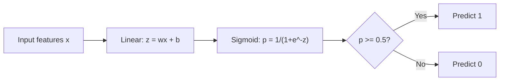
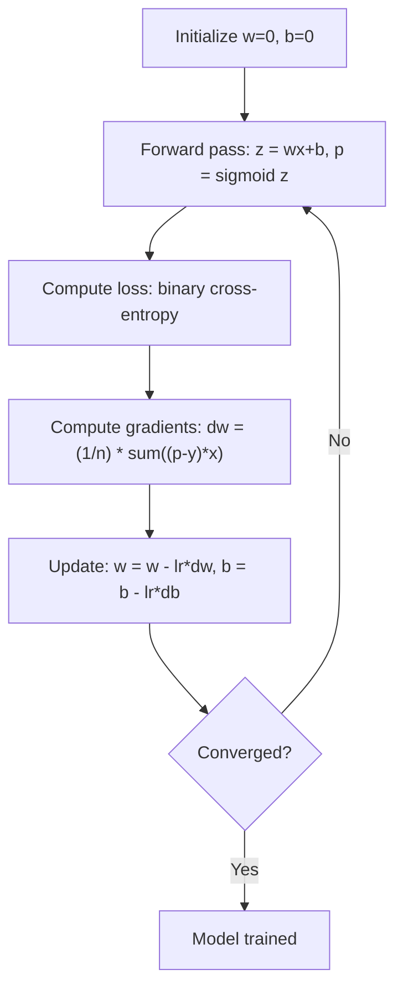

# Sự lùi hậu cần
# 逻辑回归


> Sự lùi lại hậu cần cong một đường thẳng vào một đường cong S để trả lời câu hỏi có hay không với xác suất.

> 逻辑归归将直线成 S形曲线, sử dụng概率 trả lời是非问题──

**Type:** Build | **类型：** 构建
**Languages:** Python
**Prerequisites:** Phase 2 Lesson 1-2 (What Is ML, Linear Regression) | **前置知识：** Phase 2 第 1-2 课（什么是机器学习、线性回归）
**Time:** ~90 minutes | **时间：** 约 90 分钟

## Mục tiêu học tập

- Thực hiện sự lùi lại hậu cần từ đầu bằng cách sử dụng hàm sigmoid và mất tích giao entropy nhị phân
  Từ zero thực hiện logic trở lại, nắm bắt Sigmoid  hàm và 2元交叉 mất
- Xét và giải thích chính xác, thu hồi, điểm F1 và các mã số nhầm lẫn cho phân loại nhị phân
  計算并解释精确率 (Precision) 召回率 (Recall)  F1 分数和混矩阵
- Giải thích lý do tại sao MSE không được phân loại và tại sao sự phân phối chéo nhị phân tạo ra bề mặt chi phí ngọc
  解释 tại sao sự khác biệt trung bình (MSE) không phù hợp với phân loại nhiệm vụ, và tại sao 2元交叉能产生凸的代价曲面
- Xây dựng mô hình hồi quy softmax cho phân loại đa lớp và đánh giá các thỏa thuận điều chỉnh ngưỡng
  构建 Softmax quay trở lại mô hình thực hiện nhiều lớp,并 đánh giá  giá trị điều chỉnh cân bằng


> **【中文解读】**
> Logical regression là một phần của các loại cơ sở của hàm Sigmoid.

> **【拓展：逻辑回归在工业界的广泛应用】**
> Hệ thống dự đoán tỷ lệ nhấp chuột quảng cáo sớm của Facebook dựa trên logic regression (đồng bộ với GBMT đặc tính工程); CTR của Google tìm kiếm quảng cáo  dự đoán cũng dài hạn sử dụng logic regression (đồng độ sử dụng logic regression) (sau đó nâng cấp thành đào tạo sâu) ⋅ Trong lĩnh vực y tế, logic regression được sử dụng để dự đoán bệnh风险 (như bệnh tim, tiểu đường), lợi thế nằm ở tỷ lệ xuất phát có thể giải thích trực tiếp.

## Vấn đề  vấn đề giới thiệu

Bạn muốn dự đoán liệu khối u có ác tính hay lành tính khi xem kích thước của nó. Bạn thử sự hồi quy tuyến tính. Nó đưa ra các số như 0,3 hoặc 1,7 hoặc -0,5.

> Bạn muốn dự đoán nó có xấu hay xấu. Bạn thử sử dụng đường dẫn trở lại. Nó phát ra 0.3 hoặc 1.7 hoặc -0.5 như vậy. Những con số này có nghĩa là gì?1.7 là "rất xấu"?-0.5 là "rất tốt"? đường dẫn trở lại phát ra số vô hạn.

Lập ngược hậu cần giải quyết điều này. Nó lấy cùng một kết hợp tuyến tính (wx + b) và vượt qua nó thông qua hàm sigmoid, mà đè nhỏ bất kỳ số nào vào phạm vi (0, 1).

> 逻辑归归 giải quyết vấn đề này. Nó lấy cùng một cấu trúc (wx + b), thông qua hàm Sigmoid sẽ được nén bất kỳ số liệu nào lên (0, 1) 范围内.

Đây là một trong những thuật toán được sử dụng rộng rãi nhất trong thực tế. Mặc dù tên của nó, sự lùi hậu cần là một thuật toán phân loại, không phải là thuật toán lùi hậu cần. Tên này xuất phát từ chức năng hậu cần (sigmoid) nó sử dụng.

> Đây là một trong những thuật toán được sử dụng rộng rãi nhất trong thực tế. Mặc dù có "trở lại", logic trở lại là phân loại thuật toán, không phải là regression algorithm.

> **【中文解读】**
> Lợi lượng quay lại không thể trực tiếp được sử dụng cho phân loại: đầu ra của nó là số thực vô hạn ((-∞ đến +∞), trong khi phân loại cần tỷ lệ giữa 0-1 ∞ và 0-1 ∞.

## Khái niệm cốt lõi

### Tại sao sự lùi lại tuyến tính không thể phân loại

Hãy tưởng tượng dự đoán vượt qua / thất bại (1/0) dựa trên giờ học.

> 想象根据学习时间预测通过/不通过(1/0)。线性回归拟合一根直线穿过数据:

```
hours:  1   2   3   4   5   6   7   8   9   10
actual: 0   0   0   0   1   1   1   1   1   1
```

Một sự phù hợp tuyến tính có thể tạo ra các dự đoán như -0,2 tại giờ 1 và 1,3 tại giờ 10. Những giá trị này không phải là xác suất. Chúng đi dưới 0 và trên 1.

> 线性拟合可能在 1 小时产生 -0.2 预测,在 10 小时产生 1.3 预测. Những giá trị này không phải là xác suất. Chúng thấp hơn 0 hoặc vượt quá 1.

Việc phân loại cần một chức năng:
- Các giá trị đầu ra từ 0 đến 1 (khả năng)
  输出 0 đến 1 之间的值(概率)
- Tạo ra một sự chuyển đổi mạnh mẽ (một ranh giới quyết định)
  创建急剧过渡(决策边界)
- Không bị biến dạng bởi các điểm ngoại lệ xa biên giới
  Không bị biến dạng bất thường

> 分类 cần một hàm, nó:

### Vị năng Sigmoid

Chức năng sigmoid thực hiện chính xác như thế này:

> Sigmoid 函数恰好 đã làm điều này:

```
sigmoid(z) = 1 / (1 + e^(-z))
```

Các tính chất:
- Khi z lớn và tích cực, sigmoid(z) tiếp cận 1
  Khi z là số chính xác,sigmoid(z) 趋近 1
- Khi z lớn và âm, sigmoid(z) tiếp cận với 0
  Khi z là số lượng lớn,sigmoid(z) 趋近 0
- Khi z = 0, sigmoid(z) = 0,5
  当 z = 0 时,sigmoid(z) = 0,5
- Khả năng đầu ra luôn nằm giữa 0 và 1
  输出始终在0和1之间
- Chức năng này đều mượt mà và có thể phân biệt ở mọi nơi
  函数处处平滑可微

Các dẫn xuất có một hình thức thuận tiện: sigmoid'(z) = sigmoid(z) * (1 - sigmoid(z)). Điều này làm cho tính toán gradient hiệu quả.

> 导数 có một hình thức dễ dàng:sigmoid'(z) = sigmoid(z) * (1 - sigmoid(z))。 Điều này làm cho gradience计算 rất cao hiệu quả。

### Lệ nở logistics = mô hình tuyến tính + Sigmoid

Mô hình tính toán z = wx + b (tương tự như sự lùi lại tuyến tính), sau đó áp dụng sigmoid:

> 模型计算 z = wx + b(与线性归归相同), sau đó áp dụng Sigmoid:



Khả năng đầu ra p được giải thích là P ((y=1 ∈ x), xác suất đầu vào thuộc lớp 1. Biên giới quyết định là nơi wx + b = 0, làm cho hiệu suất sigmoid chính xác là 0.5.

> 输出 p được giải thích là P(y=1 ∈ x), tức là输入 thuộc loại 1 có tỷ lệ có thể xảy ra.

### Loss Cross-Entropy Binary

Bạn không thể sử dụng MSE để hồi quy hậu cần. MSE với sigmoid tạo ra một bề mặt chi phí không ngọc với nhiều mức tối thiểu địa phương. Thay vào đó, sử dụng sự chuyển đổi phân tử nhị phân (tr mất log):

> Bạn không thể đối với logic trở lại sử dụng MSE。MSE  hợp tác với Sigmoid 会创建一个非凸的代价曲面,存在许多局部最小值──应该使用二元交叉(log loss):

```
Loss = -(1/n) * sum(y * log(p) + (1-y) * log(1-p))
```

Tại sao điều này hiệu quả:
- Khi y=1 và p gần 1: log(1) = 0, do đó mất mát gần 0 (đúng, chi phí thấp)
  当 y=1 且 p 接近 1 时:log(1) = 0, mất gần 0(正确,低代价)
- Khi y=1 và p gần 0: log(0) tiếp cận vô hạn âm, do đó mất mát là rất lớn (sai, chi phí cao)
  当 y=1 且 p 接近 0 时:log(0) 趋向负无穷,损失极大(错误,高代价)
- Khi y=0 và p gần 0: log(1) = 0, do đó mất mát gần 0 (đúng, chi phí thấp)
  当 y=0 且 p 接近 0 时:log(1) = 0, mất gần 0(正确,低代价)
- Khi y=0 và p gần 1: log(0) tiếp cận vô hạn âm, do đó mất mát là rất lớn (sai, chi phí cao)
  当 y=0 且 p 接近 1 时:log(0) 趋向负无穷,损失极大(错误,高代价)

Chức năng mất mát này là ngọc cho sự lùi hậu cần, đảm bảo một mức tối thiểu toàn cầu duy nhất.

> Hàm mất này đối với logic return là hàm con, đảm bảo có giá trị tối thiểu toàn diện duy nhất.

> **【中文解读】**
> Tại sao phân loại không thể sử dụng MSE? Vì MSE + Sigmoid 会 tạo ra hàm mất không凸, có nhiều hàm tối thiểu, độ giảm có thể bị mắc kẹt.

> **【拓展：交叉熵损失在深度学习中的核心地位】**
> 交叉损失 không chỉ được sử dụng để trả về logic, nó là hàm mất tiêu chuẩn của tất cả các phân loại mạng thần kinh. GPT của mô hình ngôn ngữ đào tạo bản chất là đối với từ表 làm mềmmax + 交叉损失 mỗi bước dự đoán một token tiếp theo, đó là một lần hàng triệu loại phân loại vấn đề. ResNet làm ImageNet phân loại.

### Sự giảm dần về hậu cần

Các gradient cho sự chéo-tròp nhị phân với sigmoid có hình thức sạch:

> Cấp độ của Sigmoid có một hình thức đơn giản:

```
dL/dw = (1/n) * sum((p - y) * x)
dL/db = (1/n) * sum(p - y)
```

Những hình ảnh này trông giống hệt với các gradient hồi quy tuyến tính. Sự khác biệt là p = sigmoid(wx + b) thay vì p = wx + b. Sigmoid giới thiệu tính không tuyến tính, nhưng quy tắc cập nhật gradient vẫn giống nhau.

> Những cái này trông giống với độ quay trở về đường dây hoàn toàn giống nhau.

> **【中文解读】**
> 逻辑归归的梯度公式与线性归归惊人地相似:`dL/dw = (1/n) * sum((p-y)*x)`◊ Sự khác biệt duy nhất là p = sigmoid(wx+b) chứ không phải p = wx+b。 Đó là bởi vì các cấu trúc của Sigmoid 和交叉 trong toán học đã "刚好"抵消复杂项, làm cho hình thức gradience rất đơn giản.



### Biên giới quyết định

Đối với một đầu vào 2D (hai tính năng), ranh giới quyết định là đường:

> Đối với 2D 输入 ((( hai đặc điểm), biên giới quyết định là:

```
w1*x1 + w2*x2 + b = 0
```

Các điểm ở một bên được phân loại là 1, điểm ở phía bên kia là 0. Phục hồi hậu cần luôn tạo ra một ranh giới quyết định tuyến tính. Nếu bạn cần một ranh giới cong, bạn hoặc thêm các tính năng đa nôn hoặc sử dụng mô hình không tuyến tính.

> Một mặt của các điểm được phân loại thành 1, một mặt khác được phân loại thành 0―― logic trở lại luôn luôn tạo ra giới hạn quyết định tuyến tính―― nếu cần một giới hạn 曲, bạn nên thêm nhiều tính năng, hoặc sử dụng mô hình không tuyến tính――

### Định dạng đa lớp với Softmax

Sự lùi hậu cần nhị phân xử lý hai lớp. Đối với các lớp k, sử dụng hàm softmax:

> 二元逻辑归归处理两个类.

```
softmax(z_i) = e^(z_i) / sum(e^(z_j) for all j)
```

Mỗi lớp có vector trọng lượng riêng của nó. mô hình tính toán điểm z_i cho mỗi lớp, sau đó softmax chuyển đổi điểm thành xác suất tổng cộng với 1.

> Mỗi loại có trọng lực riêng của mình. Mô hình tính toán cho mỗi loại một số z_i, sau đó Softmax sẽ chuyển số thành tỷ lệ tổng cộng và tỷ lệ tỷ lệ tỷ lệ tỷ lệ tỷ lệ tỷ lệ tỷ lệ tỷ lệ tỷ lệ tỷ lệ tỷ lệ tỷ lệ tỷ lệ cao nhất.

Chức năng mất mát trở thành cross-entropy phân loại:

> 损失函数变为分类交叉:

```
Loss = -(1/n) * sum(sum(y_k * log(p_k)))
```

nơi y_k là 1 cho lớp thực và 0 cho tất cả các lớp khác (định dạng hóa một lần).

> Trong số đó y_k đối với thực sự类别为 1,其他为 0(one-hot编码)

### Các số liệu đánh giá

Chỉ riêng độ chính xác không đủ. Đối với một tập dữ liệu với 95% âm tính và 5% dương tính, một mô hình luôn dự đoán âm tính có độ chính xác 95% nhưng vô dụng.

> Chỉ dựa vào tỷ lệ chính xác là không đủ. Đối với một tập dữ liệu 95% là trường hợp tiêu cực, 5% là một tập dữ liệu chính xác, một mô hình luôn dự đoán là trường hợp tiêu cực có được tỷ lệ chính xác 95% nhưng không có ích gì.

**Confusion Matrix**- Có thể là:

> **混淆矩阵**- Có thể là:

| | Predicted Positive | Predicted Negative |
|---|---|---|
| Actually Positive | True Positive (TP) | False Negative (FN) |
| Actually Negative | False Positive (FP) | True Negative (TN) |

| | 预测为正 | 预测为负 |
|---|---|---|
| 实际为正 | 真正例 (TP) | 假负例 (FN) |
| 实际为负 | 假正例 (FP) | 真负例 (TN) |

**Precision**Trong số tất cả những điều tích cực dự đoán, có bao nhiêu điều tích cực thực sự?
```
Precision = TP / (TP + FP)
```

> **精确率**Trong tất cả các dự đoán đúng, có bao nhiêu thực tế đúng?

**Recall**(Sensitivity): Trong tất cả những điều tích cực thực tế, chúng ta đã bắt được bao nhiêu?
```
Recall = TP / (TP + FN)
```

> **召回率**Trong tất cả các mẫu thực tế, chúng ta tìm ra bao nhiêu?

**F1 Score**: trung bình hài hòa của độ chính xác và nhớ lại.
```
F1 = 2 * (Precision * Recall) / (Precision + Recall)
```

> **F1 分数**: tỷ lệ xác thực và tỷ lệ triệu hồi:调和平均――平衡 hai chỉ số――

Khi nào để đặt ưu tiên:
- **Precision**: khi tin tích cực sai đắt tiền (trình lọc spam, bạn không muốn chặn email hợp pháp)
  **精确率**:当假正例代价高时(垃圾邮件过,不想错拦正常邮件)
- **Recall**: khi âm tính sai đắt tiền (bản sàng lọc ung thư, bạn không muốn bỏ lỡ một khối u)
  **召回率**:当假负例代价高时(癌查,不想漏掉瘤)
- **F1**: khi bạn cần một số liệu cân bằng duy nhất
  **F1**Khi cần một chỉ số đơn lẻ cân bằng

>  ưu tiên xem xét các chỉ số:

> **【中文解读】**
> Trong trường hợp phân loại không cân bằng, như kiểm tra lừa đảo chỉ có 0,1% đúng, toàn bộ dự đoán là tiêu cực có 99,9% đúng nhưng không có giá trị.

> **【拓展：评估指标在真实系统中的选择】**
> Google  tìm kiếm trang rác kiểm tra tỷ lệ xác định ưu tiên(Nên bỏ qua một số trang rác, cũng không thể coi các trang bình thường là rác); hình ảnh y học AI(như kiểm tra ung thư vú của Google Health) tỷ lệ triệu hồi ưu tiên(Nên nhiều số giả tích để làm bác sĩ tái kịp, cũng không thể bỏ lỡ khối u thực); tự lái lái xe kiểm tra người lái yêu cầu tỷ lệ xác định và triệu hồi cao, F1 là chỉ số tổng hợp phù hợp hơn.
```figure
logistic-sigmoid
```

## Hãy xây dựng nó

### Bước 1: chức năng Sigmoid và tạo dữ liệu

```python
import random
import math

def sigmoid(z):
    z = max(-500, min(500, z))  # 裁剪防止数值溢出
    return 1.0 / (1.0 + math.exp(-z))  # Sigmoid 函数：将任意实数映射到 (0,1)


random.seed(42)
N = 200
X = []
y = []

# 生成类别 0 的数据：中心在 (2,2)
for _ in range(N // 2):
    X.append([random.gauss(2, 1), random.gauss(2, 1)])
    y.append(0)

# 生成类别 1 的数据：中心在 (5,5)
for _ in range(N // 2):
    X.append([random.gauss(5, 1), random.gauss(5, 1)])
    y.append(1)

combined = list(zip(X, y))
random.shuffle(combined)
X, y = zip(*combined)
X = list(X)
y = list(y)

print(f"Generated {N} samples (2 classes, 2 features)")
print(f"Class 0 center: (2, 2), Class 1 center: (5, 5)")
print(f"First 5 samples:")
for i in range(5):
    print(f"  Features: [{X[i][0]:.2f}, {X[i][1]:.2f}], Label: {y[i]}")
```

### Bước 2: Khản hồi hậu cần từ đầu

```python
class LogisticRegression:
    def __init__(self, n_features, learning_rate=0.01):
        self.weights = [0.0] * n_features  # 权重初始化为 0
        self.bias = 0.0  # 偏置初始化为 0
        self.lr = learning_rate  # 学习率
        self.loss_history = []  # 记录训练损失

    def predict_proba(self, x):
        z = sum(w * xi for w, xi in zip(self.weights, x)) + self.bias  # 线性组合 z = wx + b
        return sigmoid(z)  # 通过 Sigmoid 得到概率

    def predict(self, x, threshold=0.5):
        return 1 if self.predict_proba(x) >= threshold else 0  # 概率 >= 阈值则预测为 1

    def compute_loss(self, X, y):
        n = len(y)
        total = 0.0
        for i in range(n):
            p = self.predict_proba(X[i])
            p = max(1e-15, min(1 - 1e-15, p))  # 裁剪防止 log(0)
            # 二元交叉熵损失
            total += y[i] * math.log(p) + (1 - y[i]) * math.log(1 - p)
        return -total / n  # 取负号得到正值损失

    def fit(self, X, y, epochs=1000, print_every=200):
        n = len(y)
        n_features = len(X[0])
        for epoch in range(epochs):
            dw = [0.0] * n_features
            db = 0.0
            for i in range(n):
                p = self.predict_proba(X[i])
                error = p - y[i]  # 预测概率 - 真实标签
                for j in range(n_features):
                    dw[j] += error * X[i][j]  # 累积权重梯度
                db += error  # 累积偏置梯度
            # 梯度下降更新参数
            for j in range(n_features):
                self.weights[j] -= self.lr * (dw[j] / n)
            self.bias -= self.lr * (db / n)
            loss = self.compute_loss(X, y)
            self.loss_history.append(loss)
            if epoch % print_every == 0:
                print(f"  Epoch {epoch:4d} | Loss: {loss:.4f} | w: [{self.weights[0]:.3f}, {self.weights[1]:.3f}] | b: {self.bias:.3f}")
        return self

    def accuracy(self, X, y):
        correct = sum(1 for i in range(len(y)) if self.predict(X[i]) == y[i])
        return correct / len(y)


split = int(0.8 * N)
X_train, X_test = X[:split], X[split:]
y_train, y_test = y[:split], y[split:]

print("\n=== Training Logistic Regression ===")
model = LogisticRegression(n_features=2, learning_rate=0.1)
model.fit(X_train, y_train, epochs=1000, print_every=200)

print(f"\nTrain accuracy: {model.accuracy(X_train, y_train):.4f}")
print(f"Test accuracy:  {model.accuracy(X_test, y_test):.4f}")
print(f"Weights: [{model.weights[0]:.4f}, {model.weights[1]:.4f}]")
print(f"Bias: {model.bias:.4f}")
```

### Bước 3: Matrix và métrics nhầm lẫn từ đầu

```python
class ClassificationMetrics:
    def __init__(self, y_true, y_pred):
        # 统计混淆矩阵四个值
        self.tp = sum(1 for t, p in zip(y_true, y_pred) if t == 1 and p == 1)  # 真正例
        self.tn = sum(1 for t, p in zip(y_true, y_pred) if t == 0 and p == 0)  # 真负例
        self.fp = sum(1 for t, p in zip(y_true, y_pred) if t == 0 and p == 1)  # 假正例
        self.fn = sum(1 for t, p in zip(y_true, y_pred) if t == 1 and p == 0)  # 假负例

    def accuracy(self):
        total = self.tp + self.tn + self.fp + self.fn
        return (self.tp + self.tn) / total if total > 0 else 0

    def precision(self):
        denom = self.tp + self.fp
        return self.tp / denom if denom > 0 else 0

    def recall(self):
        denom = self.tp + self.fn
        return self.tp / denom if denom > 0 else 0

    def f1(self):
        p = self.precision()
        r = self.recall()
        return 2 * p * r / (p + r) if (p + r) > 0 else 0

    def print_confusion_matrix(self):
        print(f"\n  Confusion Matrix:")
        print(f"                  Predicted")
        print(f"                  Pos   Neg")
        print(f"  Actual Pos     {self.tp:4d}  {self.fn:4d}")
        print(f"  Actual Neg     {self.fp:4d}  {self.tn:4d}")

    def print_report(self):
        self.print_confusion_matrix()
        print(f"\n  Accuracy:  {self.accuracy():.4f}")
        print(f"  Precision: {self.precision():.4f}")
        print(f"  Recall:    {self.recall():.4f}")
        print(f"  F1 Score:  {self.f1():.4f}")


y_pred_test = [model.predict(x) for x in X_test]
print("\n=== Classification Report (Test Set) ===")
metrics = ClassificationMetrics(y_test, y_pred_test)
metrics.print_report()
```

### Bước 4: Phân tích biên giới quyết định

```python
print("\n=== Decision Boundary ===")
w1, w2 = model.weights
b = model.bias
print(f"Decision boundary: {w1:.4f}*x1 + {w2:.4f}*x2 + {b:.4f} = 0")
if abs(w2) > 1e-10:
    print(f"Solved for x2:     x2 = {-w1/w2:.4f}*x1 + {-b/w2:.4f}")

print("\nSample predictions near the boundary:")
test_points = [
    [3.0, 3.0],
    [3.5, 3.5],
    [4.0, 4.0],
    [2.5, 2.5],
    [5.0, 5.0],
]
for point in test_points:
    prob = model.predict_proba(point)
    pred = model.predict(point)
    print(f"  [{point[0]}, {point[1]}] -> prob={prob:.4f}, class={pred}")
```

### Bước 5: Multi-class với softmax

```python
class SoftmaxRegression:
    def __init__(self, n_features, n_classes, learning_rate=0.01):
        self.n_features = n_features
        self.n_classes = n_classes
        self.lr = learning_rate
        self.weights = [[0.0] * n_features for _ in range(n_classes)]
        self.biases = [0.0] * n_classes

    def softmax(self, scores):
        max_score = max(scores)
        exp_scores = [math.exp(s - max_score) for s in scores]
        total = sum(exp_scores)
        return [e / total for e in exp_scores]

    def predict_proba(self, x):
        scores = [
            sum(self.weights[k][j] * x[j] for j in range(self.n_features)) + self.biases[k]
            for k in range(self.n_classes)
        ]
        return self.softmax(scores)

    def predict(self, x):
        probs = self.predict_proba(x)
        return probs.index(max(probs))

    def fit(self, X, y, epochs=1000, print_every=200):
        n = len(y)
        for epoch in range(epochs):
            grad_w = [[0.0] * self.n_features for _ in range(self.n_classes)]
            grad_b = [0.0] * self.n_classes
            total_loss = 0.0
            for i in range(n):
                probs = self.predict_proba(X[i])
                for k in range(self.n_classes):
                    target = 1.0 if y[i] == k else 0.0
                    error = probs[k] - target
                    for j in range(self.n_features):
                        grad_w[k][j] += error * X[i][j]
                    grad_b[k] += error
                true_prob = max(probs[y[i]], 1e-15)
                total_loss -= math.log(true_prob)
            for k in range(self.n_classes):
                for j in range(self.n_features):
                    self.weights[k][j] -= self.lr * (grad_w[k][j] / n)
                self.biases[k] -= self.lr * (grad_b[k] / n)
            if epoch % print_every == 0:
                print(f"  Epoch {epoch:4d} | Loss: {total_loss / n:.4f}")
        return self

    def accuracy(self, X, y):
        correct = sum(1 for i in range(len(y)) if self.predict(X[i]) == y[i])
        return correct / len(y)


random.seed(42)
X_3class = []
y_3class = []

centers = [(1, 1), (5, 1), (3, 5)]
for label, (cx, cy) in enumerate(centers):
    for _ in range(50):
        X_3class.append([random.gauss(cx, 0.8), random.gauss(cy, 0.8)])
        y_3class.append(label)

combined = list(zip(X_3class, y_3class))
random.shuffle(combined)
X_3class, y_3class = zip(*combined)
X_3class = list(X_3class)
y_3class = list(y_3class)

split_3 = int(0.8 * len(X_3class))
X_train_3 = X_3class[:split_3]
y_train_3 = y_3class[:split_3]
X_test_3 = X_3class[split_3:]
y_test_3 = y_3class[split_3:]

print("\n=== Multi-class Softmax Regression (3 classes) ===")
softmax_model = SoftmaxRegression(n_features=2, n_classes=3, learning_rate=0.1)
softmax_model.fit(X_train_3, y_train_3, epochs=1000, print_every=200)
print(f"\nTrain accuracy: {softmax_model.accuracy(X_train_3, y_train_3):.4f}")
print(f"Test accuracy:  {softmax_model.accuracy(X_test_3, y_test_3):.4f}")

print("\nSample predictions:")
for i in range(5):
    probs = softmax_model.predict_proba(X_test_3[i])
    pred = softmax_model.predict(X_test_3[i])
    print(f"  True: {y_test_3[i]}, Predicted: {pred}, Probs: [{', '.join(f'{p:.3f}' for p in probs)}]")
```

### Bước 6: Định hướng ngưỡng

```python
print("\n=== Threshold Tuning ===")
print("Default threshold: 0.5. Adjusting the threshold trades precision for recall.\n")

thresholds = [0.3, 0.4, 0.5, 0.6, 0.7]
print(f"{'Threshold':>10} {'Accuracy':>10} {'Precision':>10} {'Recall':>10} {'F1':>10}")
print("-" * 52)

for t in thresholds:
    y_pred_t = [1 if model.predict_proba(x) >= t else 0 for x in X_test]
    m = ClassificationMetrics(y_test, y_pred_t)
    print(f"{t:>10.1f} {m.accuracy():>10.4f} {m.precision():>10.4f} {m.recall():>10.4f} {m.f1():>10.4f}")
```

## Hãy sử dụng nó để thực hiện

Bây giờ cũng như việc học bằng thép.

> Bây giờ dùng scikit-learn để thực hiện cùng một chức năng.

```python
from sklearn.linear_model import LogisticRegression as SklearnLR
from sklearn.metrics import accuracy_score, precision_score, recall_score, f1_score
from sklearn.metrics import confusion_matrix, classification_report
from sklearn.model_selection import train_test_split
from sklearn.preprocessing import StandardScaler
import numpy as np

np.random.seed(42)
X_0 = np.random.randn(100, 2) + [2, 2]
X_1 = np.random.randn(100, 2) + [5, 5]
X_sk = np.vstack([X_0, X_1])
y_sk = np.array([0] * 100 + [1] * 100)

X_tr, X_te, y_tr, y_te = train_test_split(X_sk, y_sk, test_size=0.2, random_state=42)

scaler = StandardScaler()
X_tr_sc = scaler.fit_transform(X_tr)
X_te_sc = scaler.transform(X_te)

lr = SklearnLR()
lr.fit(X_tr_sc, y_tr)
y_pred = lr.predict(X_te_sc)

print("=== Scikit-learn Logistic Regression ===")
print(f"Accuracy:  {accuracy_score(y_te, y_pred):.4f}")
print(f"Precision: {precision_score(y_te, y_pred):.4f}")
print(f"Recall:    {recall_score(y_te, y_pred):.4f}")
print(f"F1:        {f1_score(y_te, y_pred):.4f}")
print(f"\nConfusion Matrix:\n{confusion_matrix(y_te, y_pred)}")
print(f"\nClassification Report:\n{classification_report(y_te, y_pred)}")
```

Việc thực hiện từ đầu của bạn tạo ra cùng ranh giới quyết định và số liệu. Scikit-learn thêm các tùy chọn giải quyết (liblinear, lbfgs, saga), tự động điều chỉnh, chiến lược đa lớp (một đối với phần còn lại, đa số) và tối ưu hóa ổn định số.

> Bạn từ không thực hiện tạo ra cùng một quyết định biên giới và chỉ số.

## Chuyển nó đi.

Bài học này mang lại:
- `code/logistic_regression.py`- Lập ngược hậu cần từ đầu với các metrics

> 本课产 出:
> - `code/logistic_regression.py`- Từ zero thực hiện về logic và đánh giá chỉ số

## Tập luyện bài tập

1. Tạo một tập dữ liệu không phân tách theo đường tuyến (ví dụ, hai vòng tròn tập trung). Đào tạo sự lùi hậu cần và quan sát sự thất bại của nó. Sau đó thêm các tính năng đa số (x1^2, x2^2, x1*x2) và tập lại.
   1. sinh thành một**非**线性可分的数据集 (例如两个同心圆) ⋅训练逻辑回归并观察其失败──然后添加多项式特征(x1^2, x2^2, x1*x2) 重训──展示准确率的提升──
2. Thực hiện một matrix nhầm lẫn đa lớp cho mô hình softmax 3 lớp tính toán độ chính xác cho mỗi lớp và thu hồi.
   2. Đối với 3 loại Softmax mô hình thực hiện nhiều loại hỗn hợp矩阵.
3. Xây dựng một đường cong ROC từ đầu. Đối với 100 giá trị ngưỡng từ 0 đến 1, tính toán tỷ lệ tích cực thực và tỷ lệ tích cực sai. Xét AUC (vùng dưới đường cong) bằng cách sử dụng quy tắc trapezoidal.
   3. Từ zero cấu trúc ROC 曲线── đối với 100 值 giữa 0 đến 1, tính toán tỷ lệ thực例 và tỷ lệ giả例── dùng quy tắc thang hình để tính toán AUC(曲线下面积)──

## Từ khóa  Từ khóa nhanh chóng

| Term | What people say | What it actually means |
|------|----------------|----------------------|
| Logistic regression | "Regression for classification" | A linear model followed by a sigmoid function that outputs class probabilities |
| Sigmoid function | "The S-curve" | The function 1/(1+e^(-z)) that maps any real number to the range (0, 1) |
| Binary cross-entropy | "Log loss" | The loss function -[y*log(p) + (1-y)*log(1-p)] that penalizes confident wrong predictions severely |
| Decision boundary | "The dividing line" | The surface where the model's output probability equals 0.5, separating predicted classes |
| Softmax | "Multi-class sigmoid" | A function that converts a vector of scores into probabilities that sum to 1 |
| Precision | "How many selected are relevant" | TP / (TP + FP), the fraction of positive predictions that are actually positive |
| Recall | "How many relevant are selected" | TP / (TP + FN), the fraction of actual positives that the model correctly identifies |
| F1 score | "Balanced accuracy" | The harmonic mean of precision and recall: 2*P*R / (P+R) |
| Confusion matrix | "The error breakdown" | A table showing TP, TN, FP, FN counts for each class pair |
| Threshold | "The cutoff" | The probability value above which the model predicts class 1 (default 0.5, tunable) |
| One-hot encoding | "Binary columns for categories" | Representing class k as a vector of zeros with a 1 at position k |
| Categorical cross-entropy | "Multi-class log loss" | The extension of binary cross-entropy to k classes using one-hot encoded labels |
