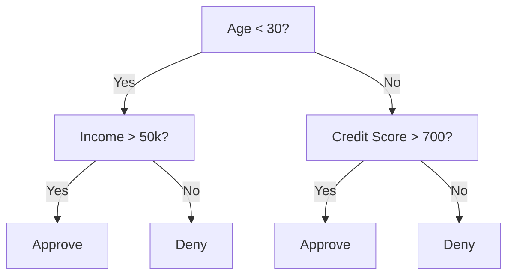
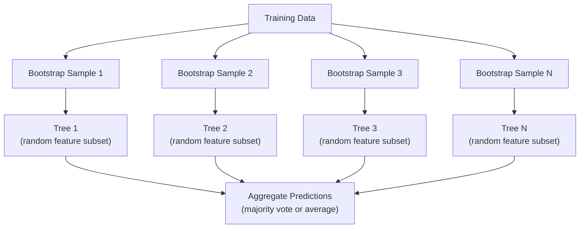

# Cây quyết định và rừng ngẫu nhiên
# 决策树与随机森林


> Một cây quyết định chỉ là một biểu đồ lưu lượng, nhưng một khu rừng của chúng là một trong những công cụ mạnh nhất trong ML.

> Một cây quyết định là một bức tranh của một dòng chảy. Nhưng một mảnh rừng được tạo thành từ chúng, là một trong những công cụ mạnh nhất trong học máy.

**Type:** Build | **类型：** 构建
**Language:**Python**语言：**Python
**Prerequisites:** Phase 1 (Lessons 09 Information Theory, 06 Probability) | **前置知识：** Phase 1（第 9 课信息论、第 6 课概率论）
**Time:** ~90 minutes | **时间：** 约 90 分钟

## Mục tiêu học tập

- Thực hiện tính toán sự sa thải Gini, entropy và thu nhập thông tin để tìm ra sự chia rẽ cây quyết định tối ưu
  实现 Gini 不纯度、和信息增益计算, tìm ra điểm phân chia quyết định tốt nhất
- Xây dựng một phân loại cây quyết định từ đầu với các điều khiển trước khi cắt (thực độ tối đa, mẫu ít nhất)
  Từ 0 cấu trúc có kiểm soát cắt trước cành
- Xây dựng một khu rừng ngẫu nhiên bằng cách sử dụng lấy mẫu bootstrap và tính năng ngẫu nhiên, và giải thích tại sao nó làm giảm sự khác biệt
  Sử dụng Bootstrap 采样和特征随机化构建随机森林,并解释为什么它能降低方差
- So sánh tầm quan trọng của tính năng MDI với tầm quan trọng của permutation và xác định khi nào MDI bị thiên vị
  So sánh tầm quan trọng của đặc điểm MDI và tầm quan trọng của việc thay thế, nhận ra vấn đề phân biệt của MDI


> **【中文解读】**
> 决策树通过 if-else 规则分割数据,随机森林是多个决策树的投票组合之一.

> **【拓展：树模型在 Kaggle 和工业界的主导地位】**
> Trong cuộc thi dữ liệu cấu trúc bị phá vỡ, khoảng 70% các chương trình chiến thắng sử dụng thang nâng cây (XGBoost/LightGBM/CatBoost) ⋅ Trong lĩnh vực tài chính, đánh giá tín dụng (FICO phân số) sử dụng rộng rãi biến thể cây quyết định; ngân hàng chống gian lận thường sử dụng cây như một đường cốt; trong chẩn đoán y tế, cây được sử dụng để dự đoán tái nhập viện风险.

## Vấn đề  vấn đề giới thiệu

Bạn có dữ liệu bảng. Dòng là mẫu, cột là tính năng, và có một cột mục tiêu bạn muốn dự đoán. Bạn có thể ném một mạng lưới thần kinh vào nó. Nhưng đối với dữ liệu bảng, các mô hình dựa trên cây (cây quyết định, rừng ngẫu nhiên, cây tăng gradient) thường vượt trội hơn việc học sâu. Các cuộc thi Kaggle về dữ liệu có cấu trúc được XGBoost và LightGBM thống trị, chứ không phải các biến đổi.

> Bạn có biểu đồ dữ liệu. Điểm là mô hình, hàng là đặc điểm, còn có một mục tiêu mà bạn muốn dự đoán. Bạn có thể sử dụng mạng thần kinh để xử lý.

Tại sao? Cây xử lý các loại tính năng hỗn hợp (tương đương số và danh mục) mà không cần xử lý trước. Cây xử lý các mối quan hệ không tuyến tính mà không cần kỹ thuật tính năng. Chúng có thể giải thích: bạn có thể nhìn vào cây và thấy chính xác lý do tại sao dự đoán đã được thực hiện. Và rừng ngẫu nhiên, có trung bình nhiều cây, rất kháng với quá phù hợp với các tập dữ liệu có kích thước vừa phải.

> Tại sao? mô hình cây không cần dự đoán được xử lý khi có thể xử lý các đặc điểm hỗn hợp loại hình (n) ➜

Bài học này xây dựng cây quyết định từ đầu bằng cách sử dụng phân chia tái tạo, sau đó xây dựng một khu rừng ngẫu nhiên ở trên. Bạn sẽ thực hiện toán học đằng sau tiêu chí phân chia (thơ nhiễm Gini, entropy, thu nhập thông tin) và hiểu tại sao một tập hợp học sinh yếu trở thành một tập hợp mạnh mẽ.

> Bài học này từ sử dụng từ không trở về chia cắt xây dựng cây quyết định, sau đó xây dựng trên đó như một rừng. Bạn sẽ thực hiện toán học đằng sau tiêu chuẩn chia cắt.

> **【中文解读】**
> Đối với các mô hình dữ liệu, các mô hình cây thường tốt hơn học sâu. Lý do: mô hình cây tự nhiên hỗ trợ các mô hình hỗn hợp.

## Khái niệm cốt lõi

### Cái mà cây quyết định làm

Một cây quyết định chia không gian tính năng thành vùng hình chữ nhật bằng cách hỏi một chuỗi các câu hỏi có/không.

> 决策树通过一系列非问题将特征空间分为矩形区域――



Mỗi nút nội bộ kiểm tra một tính năng đối với một ngưỡng. Mỗi nút lá tạo ra một dự đoán. Để phân loại một điểm dữ liệu mới, bạn bắt đầu từ gốc và theo các nhánh cho đến khi bạn đạt đến một lá.

> Mỗi nút bên trong sẽ so sánh một đặc điểm với giá trị. Mỗi nút bạch sẽ làm dự đoán.

Cây được xây dựng từ trên xuống bằng cách chọn, tại mỗi nút, tính năng và ngưỡng phân chia dữ liệu tốt nhất. "Tốt nhất" được xác định bằng tiêu chí chia.

> 树自顶向下构建,在每个节点选择最能分离数据的特征和值――"最好"由分离标准定义――

### Các tiêu chí chia: đo lường tạp chất

Ở mỗi nút, chúng tôi có một tập hợp các mẫu. Chúng tôi muốn chia chúng để các nút trẻ được tạo ra là "tế sạch" nhất có thể, nghĩa là mỗi đứa trẻ chứa chủ yếu một lớp.

> Ở mỗi nút, chúng ta có một nhóm các mẫu. Chúng ta muốn chia chúng để các nút càng "tế", tức là mỗi nút nhỏ chủ yếu chứa một loại.

**Gini impurity**đo khả năng một mẫu được chọn ngẫu nhiên sẽ bị phân loại sai nếu nó được dán nhãn theo phân phối lớp ở nút đó.

> **Gini 不纯度**Đánh giá một mẫu lựa chọn tự nhiên Nếu theo phân bố phân loại của các nút đó, được phân loại sai có thể có khả năng.

```
Gini(S) = 1 - sum(p_k^2)

where p_k is the proportion of class k in set S.
```

Đối với một nút tinh khiết (tất cả một lớp), Gini = 0. Đối với một phân chia nhị phân với lớp 50/50, Gini = 0.5.

> Đối với các điểm đơn giản, Gini = 0, Gini = 0,5...

```
Example: 6 cats, 4 dogs

Gini = 1 - (0.6^2 + 0.4^2) = 1 - (0.36 + 0.16) = 0.48
```

**Entropy**đo nội dung thông tin (trầm lẫn) trong một nút.

> **熵**衡量节点中的信息内容 (message) 乱度 (混乱度)  在阶段1 第9 课中已讨论

```
Entropy(S) = -sum(p_k * log2(p_k))
```

Đối với một nút thuần, entropy = 0. Đối với một phân chia nhị phân 50/50, entropy = 1.0.

> Đối với các điểm đơn giản,  = 0。 đối với 50/50 của phân chia hai,  = 1.0。越低越好。

```
Example: 6 cats, 4 dogs

Entropy = -(0.6 * log2(0.6) + 0.4 * log2(0.4))
        = -(0.6 * -0.737 + 0.4 * -1.322)
        = 0.442 + 0.529
        = 0.971 bits
```

**Information gain**là sự giảm bớt của sự ô nhiễm (entropy hoặc Gini) sau khi chia.

> **信息增益**là sự giảm thiểu của sự phân chia sau khi không chính xác

```
IG(S, feature, threshold) = Impurity(S) - weighted_avg(Impurity(S_left), Impurity(S_right))

where the weights are the proportions of samples in each child.
```

Các thuật toán tham lam tại mỗi nút: thử mọi tính năng và mọi ngưỡng có thể. chọn cặp (tương tự, ngưỡng) để tối đa hóa thu nhập thông tin.

> Các thuật toán tham lam của mỗi node: cố gắng mỗi đặc điểm và mỗi giá trị có thể.

> **【中文解读】**
> Các phân chia tiêu chuẩn đo "không chính xác" của các nút. Gini 不纯度 = 随机分类的错误概率; = 信息论中的不确定性度.

### Làm thế nào chia làm việc

Đối với một tập dữ liệu với n tính năng và m mẫu tại nút hiện tại:

> Đối với có n 个 đặc điểm và m 个样本的当前节点:

1. Đối với mỗi tính năng j (j = 1 đến n):
   Đối với mỗi đặc điểm j ((j = 1 đến n):
   - Đặt các mẫu theo tính năng j
     按特征 j đối với quy trình mẫu
   - Hãy thử mỗi điểm trung giữa các giá trị khác nhau liên tiếp như một ngưỡng
     尝试 mỗi đối với giá trị khác nhau của nhau như là giá trị trung điểm
   - Xét số thu nhập thông tin cho mỗi ngưỡng
     计算每值的信息增益
2. Chọn tính năng và ngưỡng có mức thu nhập thông tin cao nhất
    chọn thông tin tăng giá trị và đặc điểm cao nhất
3. Chia dữ liệu thành bên trái (chỉ số <= ngưỡng) và bên phải (chỉ số > ngưỡng)
   将数据 chia thành trái (trang <= 值) và phải (trang > 值)
4. Lần lặp lại trên mỗi đứa trẻ
   Đối với mỗi phần tử

Cách tiếp cận tham lam này không đảm bảo cây tối ưu trên toàn cầu. Tìm cây tối ưu là NP-khó. Nhưng chia tham lam hoạt động tốt trong thực tế.

> Phương pháp này không đảm bảo toàn bộ cây tốt nhất. Tìm cây tốt nhất là NP-khó.

### Điều kiện dừng

Không ngừng, cây phát triển cho đến khi mỗi lá sạch (một mẫu mỗi lá).

> Không ngừng điều kiện, cây sẽ tiếp tục phát triển cho đến khi mỗi nốt là hoàn hảo.

**Pre-pruning**ngăn chặn cây trước khi nó phát triển đầy đủ:
- Độ sâu tối đa: dừng chia khi cây đạt độ sâu nhất định
  Độ sâu tối đa: Khi cây đạt đến độ sâu nhất định thì ngừng chia rẽ
- Mức mẫu tối thiểu cho mỗi lá: dừng nếu một nút có ít hơn k mẫu
  Số mẫu nhỏ nhất: Nếu các节 nhỏ hơn k 个样则停止
- Tối thiểu thu nhập thông tin: dừng nếu chia tốt nhất cải thiện độ ô nhiễm dưới ngưỡng
  n lợi: Nếu sự cải thiện phân chia tốt nhất không chính xác hơn giá trị thì dừng lại
- Nốt lá tối đa: giới hạn tổng số lá
  Số điểm tối đa: số điểm tối đa giới hạn

**Post-pruning**và làm cây đầy đủ, rồi cắt lại nó:
- Việc cắt đứt chi phí phức tạp (được sử dụng bởi scikit-learn): thêm một hình phạt tương xứng với số lượng lá.
  代价复杂度剪枝(scikit-learn 使用): thêm với các节点 số lượng thành hình phạt chính xác.
- Giảm lỗi cắt: loại bỏ một con cây nếu lỗi xác thực không tăng
  减差剪枝: Nếu chứng nhận sai lầm không tăng, thì di chuyển cây

Việc cắt trước dễ dàng hơn và nhanh hơn. Sau khi cắt, cây thường có thể tốt hơn vì nó không ngăn chặn sớm sự chia cắt có thể dẫn đến sự chia cắt hữu ích hơn nữa.

> 预剪枝更简单更快―― ránh sau thường tạo ra cây tốt hơn, vì nó sẽ không ngừng sớm có thể mang lại các nút chia rẽ sau đó hữu ích――

### Cây quyết định cho sự lùi lại

Đối với sự lùi lại, dự đoán lá là trung bình của các giá trị mục tiêu trong lá đó.

> Đối với trở lại, dự đoán của các điểm là giá trị trung bình của mục tiêu trong các điểm này.

**Variance reduction**thay thế thu nhập thông tin:

> **方差减少**替代了信息增益:

```
VR(S, feature, threshold) = Var(S) - weighted_avg(Var(S_left), Var(S_right))
```

Chọn phân chia làm giảm sự khác biệt nhiều nhất. Cây phân chia không gian đầu vào thành các khu vực, và dự đoán một liên tục (tỷ lệ trung bình) trong mỗi khu vực.

> 选择方差减少最多的分裂──树将输入空间划分为区域, 在每个区域预测一个常数(平均值)──

### Rừng ngẫu nhiên: sức mạnh của các tập đoàn

Một cây quyết định duy nhất là sự khác biệt cao. Những thay đổi nhỏ trong dữ liệu có thể tạo ra cây hoàn toàn khác nhau. Rừng ngẫu nhiên khắc phục điều này bằng cách trung bình nhiều cây.

> Một cây quyết định có sự khác biệt cao. Những thay đổi nhỏ trong dữ liệu sẽ tạo ra cây hoàn toàn khác nhau.



Hai nguồn ngẫu nhiên làm cho cây đa dạng:

> Hai nguồn tự nhiên làm cho cây biến đổi đa dạng:

**Bagging (bootstrap aggregating):**Mỗi cây được đào tạo trên một mẫu bootstrap, một mẫu ngẫu nhiên với thay thế từ dữ liệu đào tạo. Khoảng 63% các mẫu ban đầu xuất hiện trong mỗi bootstrap (t còn lại là các mẫu ngoài túi có thể được sử dụng để xác thực).

> **Bagging（Bootstrap 聚合）**Mỗi cây được tập luyện trên mẫu Bootstrap, tức là có một mẫu tự nhiên được rút lại từ dữ liệu tập luyện. Khoảng 63% mẫu nguyên thủy xuất hiện trong mỗi bootstrap.

**Feature randomization:**Tại mỗi phân chia, chỉ một bộ phụ ngẫu nhiên của các tính năng được xem xét. Đối với phân loại, mặc định là sqrt(n_features). Đối với sự lùi lại, n_features/3. Điều này ngăn chặn tất cả các cây phân chia trên cùng một tính năng thống trị.

> **特征随机化**Trong mỗi phân chia, chỉ cần xem xét các đặc điểm của tập hợp.

Điều quan trọng: trung bình nhiều cây không liên quan làm giảm sự khác biệt mà không tăng thiên vị. Mỗi cây có thể là trung bình.

> 核心洞察: trung bình nhiều cây liên quan có thể giảm chênh lệch mà không tăng chênh lệch. Mỗi cây riêng lẻ có thể bình thường, nhưng tập hợp là mạnh mẽ.

> **【中文解读】**
> 2 (các) đặc điểm tự nhiên hóa (các) phân chia chỉ tính đến đặc điểm của tập hợp tự nhiên (các) √n 个 (các) ⋅.

> **【拓展：随机森林 vs 梯度提升树】**
> 随机森林是并行训练 (随机森林是并行训练) 随机森林是并行训练 (随机森林是并行训练) 随机森林是并行训练 (随机森林是并行训练) 随机树原型开发,几乎不需要调调调. 梯度升升树 (随机森林升级) 随机森林改造 (随机森林升级) 随机森林改造 (随机森林升级) 随机森林改造 (随机森林升级) 随机森林改造 (随机森林升级) 随机森林改造 (随机森林升级) 随机森林改造 (随机森林升级) 随机森林改造 (随机森林改造) 随机森林改造 (随机森林改造) 随机森林改造 (随机森林改造) 随机森林改造 (随机森林改造) 随机森林改造 (随机森林改造) 随机森林改造 (随机森林改造) 随机森林改造 (随机森林改造) 随机树改造 (随机树改造) 随机树改造 (随机树改造) 随机改造) 随机树改造 (随机组) 随机组的改造 (随机组建) 随机组的改造 (XGBGGGGGGGGGGGGGGGGGGGGGGGGGGGGGGGGGGGGGGGGGGGGGGGGGGGGGGGGGGGGGGGGGGGGGGGGGGGGGGGGGGGGGGGGGGGGGGGGGGGGGGGGGGGGGGGGGGGGGGGGGGGGGGGGGGGGGGGGGGGGGGGGGGGGGGGGGGGGGGGGGGGGGGGGGGGGGGGGGGGGGGGGGGGGGG

### Tầm quan trọng của tính năng

Các khu rừng ngẫu nhiên tự nhiên cung cấp điểm số tầm quan trọng của tính năng.

> 随机森林天然提供特征重要性分数──

**Mean Decrease in Impurity (MDI):**Đối với mỗi tính năng, cộng tổng sự giảm tạp hóa trên tất cả các cây và tất cả các nút nơi tính năng đó được sử dụng.

> **平均不纯度减少（MDI）**Đối với mỗi đặc điểm, trong tất cả các cây và nút sử dụng đặc điểm đó, tổng lượng giảm tính không chính xác là quan trọng hơn.

```
importance(feature_j) = sum over all nodes where feature_j is used:
    (n_samples_at_node / n_total_samples) * impurity_decrease
```

Điều này nhanh (được tính toán trong quá trình đào tạo) nhưng thiên hướng về các tính năng và tính năng có tính năng cardinality cao với nhiều điểm chia nhỏ có thể xảy ra.

> Đây là một số điểm có thể phân chia.

**Permutation importance**là sự thay thế: trộn các giá trị của một tính năng và đo mức độ chính xác của mô hình giảm. đáng tin cậy hơn nhưng chậm hơn.

> **置换重要性**là một giải pháp thay thế:打乱一个特征的值,测量模型准确率下降多少──更可靠但更慢──

> **【拓展：特征重要性的陷阱】**
> MDI đặc điểm quan trọng có hai sự phân biệt được biết đến: 1) đặc điểm số lượng cao như User ID sẽ được đánh giá cao, vì có nhiều điểm phân chia có thể lựa chọn; 2) sự phân chia giữa các đặc điểm liên quan quan quan trọng, làm cho mỗi người trông không quan trọng.

### Khi cây cối đánh mạng thần kinh

Cây và rừng thống trị các mạng thần kinh trên dữ liệu bảng tính.

> 树和森林在表格数据上优于神经网络. Lý do là như sau:

| Factor | Trees | Neural networks |
|--------|-------|----------------|
| Mixed types (numeric + categorical) | Native support | Need encoding |
| Small datasets (< 10k rows) | Work well | Overfit |
| Feature interactions | Found by splitting | Need architecture design |
| Interpretability | Full transparency | Black box |
| Training time | Minutes | Hours |
| Hyperparameter sensitivity | Low | High |

| 因素 | 树模型 | 神经网络 |
|------|-------|---------|
| 混合类型（数值 + 类别） | 原生支持 | 需要编码 |
| 小数据集（< 1 万行） | 表现良好 | 容易过拟合 |
| 特征交互 | 通过分裂自动发现 | 需要架构设计 |
| 可解释性 | 完全透明 | 黑盒 |
| 训练时间 | 分钟级 | 小时级 |
| 超参数敏感度 | 低 | 高 |

Các mạng thần kinh chiến thắng khi dữ liệu có cấu trúc không gian hoặc theo trình tự (hình ảnh, văn bản, âm thanh). Đối với các bảng tính năng phẳng, cây là mặc định.

> Khi dữ liệu có cấu trúc không gian hoặc chuỗi (图像,文本,音频) thì, mạng lưới thần kinh còn hơn. Đối với các tính năng của biểu đồ, mô hình cây là lựa chọn mặc định.

## Hãy xây dựng nó.
```figure
decision-tree-depth
```

## Hãy xây dựng nó

### Bước 1: Sự vô nhiễm và entropy của Gini

Xây dựng cả hai tiêu chí chia cắt từ đầu và xác minh họ đồng ý về những chia cắt nào là tốt.

> Từ zero xây dựng hai tiêu chuẩn phân chia, xác minh chúng đạt được sự đồng thuận về phân chia tốt hơn nào.

```python
import math

def gini_impurity(labels):
    n = len(labels)
    if n == 0:
        return 0.0
    counts = {}
    for label in labels:
        counts[label] = counts.get(label, 0) + 1  # 统计每个类别的出现次数
    # Gini = 1 - sum(p_k^2)，衡量节点的不纯度
    return 1.0 - sum((c / n) ** 2 for c in counts.values())

def entropy(labels):
    n = len(labels)
    if n == 0:
        return 0.0
    counts = {}
    for label in labels:
        counts[label] = counts.get(label, 0) + 1
    # Entropy = -sum(p_k * log2(p_k))，信息论中的不确定性度量
    return -sum(
        (c / n) * math.log2(c / n) for c in counts.values() if c > 0
    )
```

### Bước 2: Tìm ra chia tốt nhất

Hãy thử mọi tính năng và ngưỡng, trả lại một người có thu nhập thông tin cao nhất.

> 尝试每个特征和每个值── trả lời thông tin tăng lợi nhuận cao nhất──

```python
def information_gain(parent_labels, left_labels, right_labels, criterion="gini"):
    measure = gini_impurity if criterion == "gini" else entropy  # 选择不纯度度量
    n = len(parent_labels)
    n_left = len(left_labels)
    n_right = len(right_labels)
    if n_left == 0 or n_right == 0:
        return 0.0  # 空节点无法产生信息增益
    parent_impurity = measure(parent_labels)  # 父节点不纯度
    # 子节点加权不纯度
    child_impurity = (
        (n_left / n) * measure(left_labels) +
        (n_right / n) * measure(right_labels)
    )
    # 信息增益 = 父节点不纯度 - 子节点加权不纯度
    return parent_impurity - child_impurity
```

### Bước 3: Xây dựng lớp DecisionTree

Sự phân chia lặp lại, dự đoán và theo dõi tính năng quan trọng. `_build`là trái tim của cây: nó dừng lại khi một nút là tinh khiết hoặc đạt được giới hạn trước khi cắt, nếu không nó sẽ có được sự chia tốt nhất và lặp lại vào cả hai trẻ em.

> 递归分裂、预测和特征重要性追踪――

```python
import random

class DecisionTree:
    def __init__(self, max_depth=None, min_samples_split=2,
                 min_samples_leaf=1, criterion="gini",
                 max_features=None):
        self.max_depth = max_depth
        self.min_samples_split = min_samples_split
        self.min_samples_leaf = min_samples_leaf
        self.criterion = criterion
        self.max_features = max_features
        self.tree = None
        self.feature_importances_ = None

    def fit(self, X, y):
        self.n_features = len(X[0])
        self.feature_importances_ = [0.0] * self.n_features
        self.n_samples = len(X)
        self.tree = self._build(X, y, depth=0)
        total = sum(self.feature_importances_)
        if total > 0:
            self.feature_importances_ = [
                fi / total for fi in self.feature_importances_
            ]

    def predict(self, X):
        return [self._predict_one(x, self.tree) for x in X]

    def _build(self, X, y, depth):
        if len(set(y)) == 1:
            return {"leaf": True, "value": y[0]}

        if self.max_depth is not None and depth >= self.max_depth:
            return self._make_leaf(y)

        if len(y) < self.min_samples_split:
            return self._make_leaf(y)

        best_feature, best_threshold, best_gain = self._best_split(X, y)

        if best_feature is None or best_gain <= 0:
            return self._make_leaf(y)

        left_X, left_y, right_X, right_y = self._split_data(
            X, y, best_feature, best_threshold
        )

        if len(left_y) < self.min_samples_leaf or len(right_y) < self.min_samples_leaf:
            return self._make_leaf(y)

        weight = len(y) / self.n_samples
        self.feature_importances_[best_feature] += weight * best_gain

        return {
            "leaf": False,
            "feature": best_feature,
            "threshold": best_threshold,
            "left": self._build(left_X, left_y, depth + 1),
            "right": self._build(right_X, right_y, depth + 1),
        }

    def _make_leaf(self, y):
        counts = {}
        for label in y:
            counts[label] = counts.get(label, 0) + 1
        return {"leaf": True, "value": max(counts, key=counts.get)}

    def _best_split(self, X, y):
        best_feature = None
        best_threshold = None
        best_gain = -1.0

        if self.max_features == "sqrt":
            k = max(1, int(math.sqrt(self.n_features)))
            feature_indices = random.sample(range(self.n_features), k)
        elif isinstance(self.max_features, int):
            if self.max_features < 1:
                raise ValueError("max_features must be at least 1 when given as an integer")
            k = min(self.max_features, self.n_features)
            feature_indices = random.sample(range(self.n_features), k)
        else:
            feature_indices = list(range(self.n_features))

        for feature_idx in feature_indices:
            values = sorted(set(X[i][feature_idx] for i in range(len(X))))
            if len(values) <= 1:
                continue

            for i in range(len(values) - 1):
                threshold = (values[i] + values[i + 1]) / 2.0
                left_y = [y[j] for j in range(len(X)) if X[j][feature_idx] <= threshold]
                right_y = [y[j] for j in range(len(X)) if X[j][feature_idx] > threshold]

                if len(left_y) < self.min_samples_leaf or len(right_y) < self.min_samples_leaf:
                    continue

                gain = information_gain(y, left_y, right_y, self.criterion)
                if gain > best_gain:
                    best_gain = gain
                    best_feature = feature_idx
                    best_threshold = threshold

        return best_feature, best_threshold, best_gain

    def _split_data(self, X, y, feature, threshold):
        left_X, left_y, right_X, right_y = [], [], [], []
        for i in range(len(X)):
            if X[i][feature] <= threshold:
                left_X.append(X[i])
                left_y.append(y[i])
            else:
                right_X.append(X[i])
                right_y.append(y[i])
        return left_X, left_y, right_X, right_y

    def _predict_one(self, x, node):
        if node["leaf"]:
            return node["value"]
        if x[node["feature"]] <= node["threshold"]:
            return self._predict_one(x, node["left"])
        return self._predict_one(x, node["right"])
```

### Bước 4: Xây dựng lớp RandomForest

Bootstrap lấy mẫu, tính năng ngẫu nhiên, và bỏ phiếu đa số.

> Bootstrap 采样、特征随机化和多数投票──

```python
class RandomForest:
    def __init__(self, n_trees=100, max_depth=None,
                 min_samples_split=2, max_features="sqrt",
                 criterion="gini"):
        self.n_trees = n_trees
        self.max_depth = max_depth
        self.min_samples_split = min_samples_split
        self.max_features = max_features
        self.criterion = criterion
        self.trees = []

    def fit(self, X, y):
        n = len(X)
        for _ in range(self.n_trees):
            indices = [random.randint(0, n - 1) for _ in range(n)]
            X_boot = [X[i] for i in indices]
            y_boot = [y[i] for i in indices]
            tree = DecisionTree(
                max_depth=self.max_depth,
                min_samples_split=self.min_samples_split,
                max_features=self.max_features,
                criterion=self.criterion,
            )
            tree.fit(X_boot, y_boot)
            self.trees.append(tree)

    def predict(self, X):
        all_preds = [tree.predict(X) for tree in self.trees]
        predictions = []
        for i in range(len(X)):
            votes = {}
            for preds in all_preds:
                v = preds[i]
                votes[v] = votes.get(v, 0) + 1
            predictions.append(max(votes, key=votes.get))
        return predictions
```

Nhìn xem`code/trees.py`cho việc thực hiện đầy đủ với tất cả các phương pháp hỗ trợ.

> 完整实现(含所有辅助方法)见 `code/trees.py`

## Hãy sử dụng nó để thực hiện

> **【中文解读】**
> Khoa rừng tự nhiên của sklearn chỉ cần ba dòng mã: tạo phân loại → phù hợp → điểm số. Nhưng trong thực tế cần chú ý:n_estimators:n_number of trees) thường là 100-500 là đủ,随机森林几乎不会过适应因为树太多;max_features 控制每次分考虑的特征数,默认√n là kinh nghiệm tối ưu nhất.

Với scikit-learn, đào tạo một khu rừng ngẫu nhiên là ba dòng:

> Sử dụng scikit-learn, tập luyện随机森林只需三行代码:

```python
from sklearn.ensemble import RandomForestClassifier
from sklearn.datasets import load_iris
from sklearn.model_selection import train_test_split

X, y = load_iris(return_X_y=True)  # 加载鸢尾花数据集
X_train, X_test, y_train, y_test = train_test_split(X, y, random_state=42)  # 划分训练/测试集

rf = RandomForestClassifier(n_estimators=100, random_state=42)  # 100 棵树的随机森林
rf.fit(X_train, y_train)  # 训练
print(f"Accuracy: {rf.score(X_test, y_test):.4f}")  # 评估准确率
print(f"Feature importances: {rf.feature_importances_}")
```

Trong thực tế, cây tăng gradient (XGBoost, LightGBM, CatBoost) thường mạnh hơn rừng ngẫu nhiên vì chúng xây dựng cây theo trình tự, với mỗi cây sửa lỗi của những cây trước đó.

> Trong thực tế, thang độ nâng cao cây (XGBoost, LightGBM, CatBoost) thường mạnh hơn rừng tự nhiên, vì chúng theo thứ tự xây dựng cây, mỗi cây sửa chữa trước một lỗi.

## Chuyển nó đi.

Bài học này sẽ mang lại kết quả `outputs/prompt-tree-interpreter.md`- một lời nhắc giải thích phân chia cây quyết định cho các bên liên quan kinh doanh. Đưa cho nó cấu trúc của cây được đào tạo (thậm, tính năng, ngưỡng phân chia, độ chính xác) và nó dịch mô hình thành các quy tắc ngôn ngữ đơn giản, xếp hạng tính năng quan trọng, cờ quá đồi hoặc rò rỉ, và khuyến cáo các bước tiếp theo. Sử dụng nó bất cứ khi nào bạn cần giải thích mô hình dựa trên cây cho một người không đọc mã.

> 本课产 出 `outputs/prompt-tree-interpreter.md` Một người liên quan đến doanh nghiệp giải thích các lời khuyên chia rẽ của cây quyết định                                                                                                                                                                                                                                                     

> **【中文解读】**
> Một trong những ưu điểm lớn nhất của mô hình cây là khả năng giải thích được có thể nhìn rõ từng con đường quyết định.  sản phẩm này là một mô hình nhanh chóng, sẽ được đào tạo tốt cấu trúc cây quyết định được dịch thành các quy tắc ngôn ngữ tự nhiên mà các doanh nhân có thể hiểu.

## Tập luyện bài tập

1. Đào tạo một cây quyết định duy nhất trên một tập dữ liệu 2D với 3 lớp. Hướng dẫn các phân chia và vẽ ranh giới quyết định hình chữ nhật. So sánh ranh giới tại max_depth=2 vs max_depth=10.
   1. Trong 3 类 2D 数据集上训练单棵决策树――手动追踪分裂并绘制矩形决策边界――比较 max_depth=2 和 max_depth=10 的边界――

2. Thực hiện phân chia giảm biến số cho cây hồi quy. Tạo y = sin(x) + tiếng ồn cho 200 điểm và phù hợp với cây hồi quy của bạn. Chụp các dự đoán liên tục từng mảnh của cây so với đường cong thực.
   2. 实现归归树的方差减少分裂──为200个点生成 y = sin(x) + noise,拟归归树──绘制树的分段常数预测与真实曲线──

3. Xây dựng một khu rừng ngẫu nhiên với 1, 5, 10, 50 và 200 cây. Cài đặt độ chính xác đào tạo và kiểm tra độ chính xác so với số lượng cây.
   3. 分别使用 1、5、10、50 和 200 cây xây dựng tự nhiên rừng。 vẽ đào tạo tỷ lệ xác thực và tỷ lệ xác thực thử nghiệm thay đổi theo số lượng cây。 quan sát tỷ lệ xác thực thử nghiệm xu hướng bình thường nhưng sẽ không giảm ((森林抗过拟合) ⋅

4. So sánh sự vô nhiễm của Gini với entropy như là các tiêu chí chia rẽ trên 5 bộ dữ liệu khác nhau. đo độ chính xác và chiều sâu cây. Trong hầu hết các trường hợp, chúng tạo ra kết quả gần giống nhau. Giải thích lý do tại sao.
   4. Trong 5 tập dữ liệu khác nhau, so sánh Gini không chính xác và như là tiêu chuẩn phân chia.

5. Thực hiện tầm quan trọng của permutation. So sánh nó với tầm quan trọng của MDI trên một tập dữ liệu nơi một tính năng là tiếng ồn ngẫu nhiên nhưng có tính năng cardinality cao. MDI sẽ xếp hạng tính năng tiếng ồn cao.
   5.  thực hiện tầm quan trọng của thay thế. Trong một tập dữ liệu có chứa các đặc điểm âm thanh tự nhiên nhưng có số lượng lớn, sẽ so sánh nó với tầm quan trọng của MDI.

## Từ khóa  Từ khóa nhanh chóng

| Term | What people say | What it actually means |
|------|----------------|----------------------|
| Decision tree | "A flowchart for predictions" | A model that partitions feature space into rectangular regions by learning a sequence of if/else splits |
| Gini impurity | "How mixed the node is" | Probability of misclassifying a random sample at a node. 0 = pure, 0.5 = maximum impurity for binary |
| Entropy | "The disorder in a node" | Information content at a node. 0 = pure, 1.0 = maximum uncertainty for binary. From information theory |
| Information gain | "How good a split is" | Reduction in impurity after a split. The greedy criterion for choosing splits |
| Pre-pruning | "Stop the tree early" | Stopping tree growth early by setting max depth, min samples, or min gain thresholds |
| Post-pruning | "Trim the tree after" | Growing the full tree, then removing subtrees that do not improve validation performance |
| Bagging | "Train on random subsets" | Bootstrap aggregating. Train each model on a different random sample with replacement |
| Random forest | "A bunch of trees" | Ensemble of decision trees, each trained on a bootstrap sample with random feature subsets at each split |
| Feature importance (MDI) | "Which features matter" | Total impurity decrease contributed by each feature, summed across all trees and nodes |
| Permutation importance | "Shuffle and check" | Accuracy drop when a feature's values are randomly shuffled. More reliable than MDI for noisy features |
| Variance reduction | "The regression version of info gain" | The regression tree analogue of information gain. Picks the split that reduces target variance the most |
| Bootstrap sample | "Random sample with repeats" | A random sample drawn with replacement from the original dataset. Same size, but with duplicates |

## Xem thêm 延伸阅读

- [Breiman: Random Forests (2001)](https://link.springer.com/article/10.1023/A:1010933404324)- giấy rừng ngẫu nhiên gốc
  [Breiman: Random Forests (2001)](https://link.springer.com/article/10.1023/A:1010933404324)- 随机森林原始论文
- [Grinsztajn et al.: Why do tree-based models still outperform deep learning on tabular data? (2022)](https://arxiv.org/abs/2207.08815)- so sánh chặt chẽ giữa cây và mạng thần kinh trong các nhiệm vụ bảng
  [Grinsztajn et al.: Why do tree-based models still outperform deep learning on tabular data? (2022)](https://arxiv.org/abs/2207.08815)- So sánh nghiêm ngặt mô hình cây với mạng thần kinh trên dữ liệu biểu đồ
- [scikit-learn Decision Trees documentation](https://scikit-learn.org/stable/modules/tree.html)- hướng dẫn thực tế với các công cụ hình ảnh hóa
  [scikit-learn 决策树文档](https://scikit-learn.org/stable/modules/tree.html)-  thực dụng hướng dẫn và hình ảnh dụng cụ
- [XGBoost: A Scalable Tree Boosting System (Chen & Guestrin, 2016)](https://arxiv.org/abs/1603.02754)- giấy tăng độ nghiêng chiếm ưu thế Kaggle
  [XGBoost: A Scalable Tree Boosting System (Chen & Guestrin, 2016)](https://arxiv.org/abs/1603.02754)- 统治 Kaggle 的梯度提升论文
