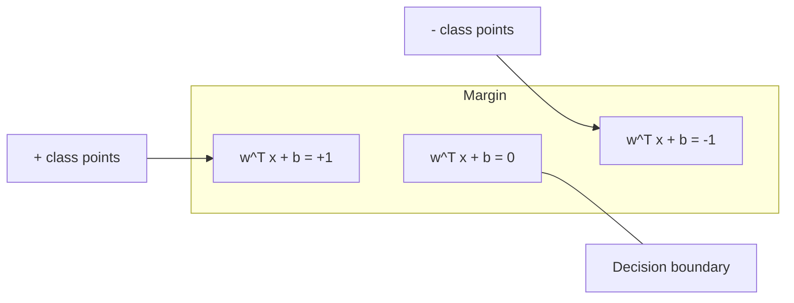
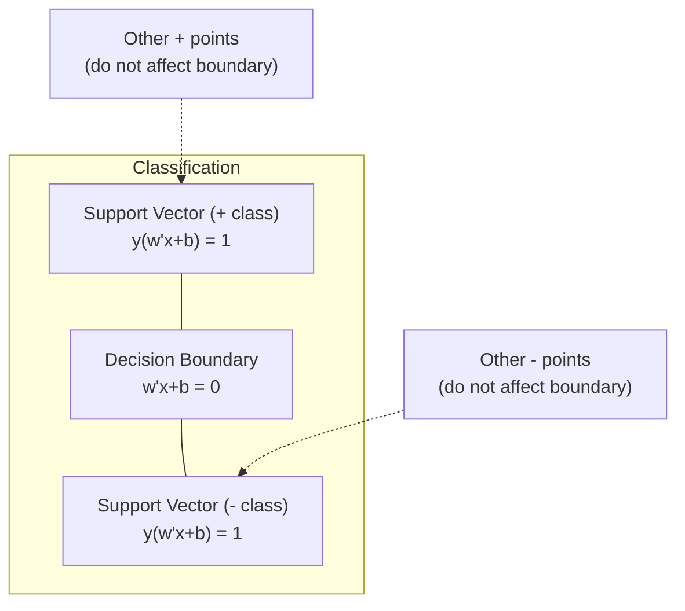
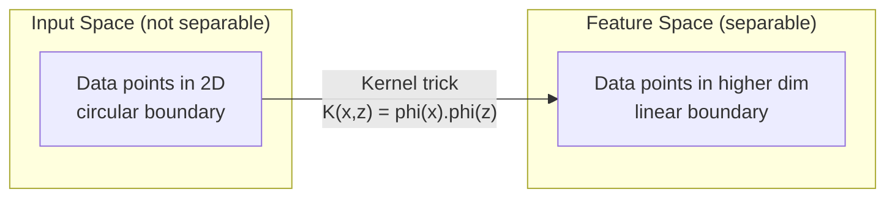

# Máy hỗ trợ vector
# 支持向量机 (SVM)


> Tìm đường rộng nhất giữa hai lớp.

> Tìm đường rộng nhất giữa hai loại. Đó là ý tưởng của chúng ta.

**Type:** Build | **类型：** 构建
**Language:**Python**语言：**Python
**Prerequisites:** Phase 1 (Lessons 08 Optimization, 14 Norms and Distances, 18 Convex Optimization) | **前置知识：** Phase 1（第 8 课优化、第 14 课范数与距离、第 18 课凸优化）
**Time:** ~90 minutes | **时间：** 约 90 分钟

## Mục tiêu học tập

- Thực hiện SVM tuyến tính từ đầu bằng cách sử dụng mất sợi và giảm gradient trên công thức ban đầu
  Trong hình thức ban đầu sử dụng kết hợp lỗ và gradient giảm từ không thực hiện SVM tuyến tính
- Giải thích nguyên tắc biên giới tối đa và xác định các vector hỗ trợ từ mô hình được đào tạo
  解释最大间隔原理,并从训练好的模型中识别支持向量
- So sánh các hạt nhân tuyến tính, đa nôn và RBF và giải thích cách trò lừa hạt nhân tránh được bản đồ chiều cao rõ ràng
  So sánh hạt nhân đường dẫn, hạt nhân đa nguyên tử và hạt nhân RBF, giải thích kỹ thuật hạt nhân làm thế nào để tránh hiển nhiên
- Đánh giá sự cân bằng được kiểm soát bởi tham số C giữa chiều rộng biên và lỗi phân loại
   đánh giá C 参数 kiểm soát khoảng cách và phân loại sai lầm cân bằng


> **【中文解读】**
> SVM tìm thấy khoảng cách lớn nhất của phân loại giới hạn.

> **【拓展：SVM 在深度学习时代仍然重要的场景】**
> SVM trong tập dữ liệu nhỏ ((100 đến hàng ngàn mẫu) vẫn còn tốt hơn học sâu. Google trong phân loại thư rác sớm sử dụng SVM tuyến tính ((LIBLINEAR), vì TF-IDF đặc trưng có kích thước cao nhưng mẫu hiếm, ưu điểm ở SVM cao thích hợp. Trong phân tích sinh học ([[Bản phân loại protein]], biểu hiện gen]]), SVM vẫn là thuật toán chính.

## Vấn đề  vấn đề giới thiệu

Bạn có hai lớp điểm dữ liệu và cần vẽ một đường (hoặc siêu phẳng) tách chúng ra. vô số đường có thể hoạt động. Bạn nên chọn một trong những đường nào?

> Bạn có hai loại điểm dữ liệu, cần vẽ một đường (hoặc siêu phẳng) để phân chia chúng.

Một biên độ rộng hơn có nghĩa là phân loại viên tự tin hơn và tổng hợp tốt hơn dữ liệu chưa thấy.

> 间隔最大的那条──间隔是决策边界到每侧近数据点的距离──宽的间隔意味着分类器更有信心,对未见数据的泛化能力更好──

Sự trực giác này dẫn đến Máy hỗ trợ vector, một trong những thuật toán tinh tế nhất về toán học trong ML. SVM là phương pháp phân loại thống trị trước khi học sâu và vẫn là lựa chọn tốt nhất cho các tập dữ liệu nhỏ, dữ liệu chiều cao và các vấn đề khi bạn cần một mô hình có nguyên tắc, hiểu rõ với các đảm bảo lý thuyết.

> Sự trực tiếp này đã đưa ra một trong những thuật toán tốt nhất trong toán học trung học. Trước khi học sâu, SVM là phương pháp phân loại chính, cho đến nay vẫn là một lựa chọn tốt nhất cho các vấn đề về tập hợp dữ liệu nhỏ, dữ liệu cao và cần thiết để đảm bảo lý thuyết.

SVM kết nối trực tiếp với giai đoạn 1: tối ưu hóa là ngọc (Lớp 18), biên được đo bằng các chuẩn (Lớp 14), và thủ thuật hạt nhân khai thác các sản phẩm chấm để xử lý ranh giới không tuyến tính mà không bao giờ tính toán trong không gian chiều cao.

> SVM với giai đoạn 1 liên quan trực tiếp: 优化是凸的 (第 18 课),间隔用范数衡 (第 14 课), kỹ thuật hạt nhân sử dụng điểm积处理非线性边界而无需在高维空间中计算;;

> **【中文解读】**
> Ý tưởng cốt lõi của SVM: Trong vô số các điều mà có thể phân biệt giữa hai loại dữ liệu, chọn từ điểm dữ liệu gần nhất là nguyên tắc "trang cách lớn nhất".

## Khái niệm cốt lõi

### Các loại phân loại biên giới tối đa

Với dữ liệu có thể tách ra tuyến tính với các nhãn y_i trong {-1, +1} và các vector tính năng x_i, chúng ta muốn một siêu phẳng w^T x + b = 0 tách các lớp.

> 给定标签 y_i 为 {-1, +1} của线性可分数据和特征向量 x_i, chúng ta cần một siêu平面 w^T x + b = 0 để phân chia các loại.

Khoảng cách từ một điểm x_i đến siêu phẳng là:

> Điểm x_i đến khoảng cách siêu平面 là:

```
distance = |w^T x_i + b| / ||w||
```

Đối với một điểm được phân loại đúng cách: y_i * (w^T x_i + b) > 0. Hạn hạch là gấp đôi khoảng cách từ siêu phẳng đến điểm gần nhất ở cả hai bên.

> Đối với các điểm chính xác phân loại: y_i * (w^T x_i + b) > 0──间隔是超平面到两侧近点距离的两倍──



Vấn đề tối ưu hóa:

> 优化问题:

```
maximize    2 / ||w||     (the margin width)
subject to  y_i * (w^T x_i + b) >= 1  for all i
```

Tương đương (giảm thiểu các hoạt động của bạn là dễ dàng hơn để tối ưu hóa):

> 等地( tối thiểu hóa giá trị của việc sử dụng:

```
minimize    (1/2) ||w||^2
subject to  y_i * (w^T x_i + b) >= 1  for all i
```

Đây là một chương trình hình vuông. Nó có một giải pháp toàn cầu độc đáo. Các điểm dữ liệu nằm chính xác trên ranh giới biên giới (nơi y_i * (w^T x_i + b) = 1) là các vector hỗ trợ. Chúng là các điểm duy nhất xác định ranh giới quyết định. Di chuyển hoặc loại bỏ bất kỳ điểm không hỗ trợ vector nào, và ranh giới không thay đổi.

> Đây là một vấn đề lập kế hoạch hai lần. Nó có một giải pháp toàn diện duy nhất. Thật sự nằm ở các điểm dữ liệu trên biên giới khoảng cách. Y_i * (w^T x_i + b) = 1) là khối lượng hỗ trợ. Chúng là điểm quyết định duy nhất của biên giới.

### Các vector hỗ trợ: số ít quan trọng



Hầu hết các điểm đào tạo không liên quan. Chỉ có các vector hỗ trợ quan trọng. Đây là lý do tại sao SVM có hiệu quả trong bộ nhớ trong thời gian dự đoán: bạn chỉ cần lưu trữ các vector hỗ trợ, không phải toàn bộ bộ bộ đào tạo.

> Phần lớn các điểm tập luyện là không liên quan. Chỉ có hỗ trợ các khối lượng hoạt động. Đây là lý do SVM trong dự đoán hiệu quả lưu trữ trong thời gian cao: bạn chỉ cần lưu trữ các khối lượng hỗ trợ, chứ không phải là toàn bộ tập hợp tập luyện.

Số lượng các vector hỗ trợ cũng đưa ra một giới hạn về lỗi tổng hợp.

> Số lượng các khối hỗ trợ cũng cho ra những giới hạn trên của sự khác biệt về tổng hợp.

### Lề mềm: xử lý tiếng ồn với tham số C

Dữ liệu thực hiếm khi có thể tách ra hoàn toàn. Một số điểm có thể nằm ở bên sai của ranh giới, hoặc bên trong biên giới.

> Dữ liệu thực tế rất ít có thể phân tích hoàn toàn. Một số điểm có thể nằm ở một bên sai lầm của biên giới, hoặc trong khoảng cách.

```
minimize    (1/2) ||w||^2 + C * sum(xi_i)
subject to  y_i * (w^T x_i + b) >= 1 - xi_i
            xi_i >= 0  for all i
```

Các biến xi_i của sự lỏng lẻo đo lường mức độ điểm i vi phạm biên. C kiểm soát sự thỏa hiệp:

> 松变量 xi_i 衡点 i 违反间隔的程度──C 控制权衡:

| C value | Behavior |
|---------|----------|
| Large C | Penalizes violations heavily. Narrow margin, fewer misclassifications. Overfits |
| Small C | Allows more violations. Wide margin, more misclassifications. Underfits |

| C 值 | 行为 |
|------|------|
| 大 C | 严重惩罚违规。窄间隔，较少误分类。易过拟合 |
| 小 C | 允许更多违规。宽间隔，较多误分类。易欠拟合 |

C là cường độ điều chỉnh, ngược lại. C lớn = ít điều chỉnh. C nhỏ = nhiều điều chỉnh hơn.

> C là sự cố gắng mạnh mẽ của phản diện. C lớn = ít sự cố gắng hơn. C nhỏ = nhiều sự cố gắng hơn.

### Thiệt hại hinge: chức năng mất SVM

SVM margin mềm có thể được viết lại như một tối ưu hóa không bị hạn chế:

> 软间隔 SVM có thể được viết lại cho tối ưu hóa không giới hạn:

```
minimize    (1/2) ||w||^2 + C * sum(max(0, 1 - y_i * (w^T x_i + b)))
```

Thuật ngữ max(0, 1 - y_i * f(x_i)) là lỗ đinh. Nó là không khi điểm được phân loại đúng và vượt ra khỏi biên. Nó là tuyến tính khi điểm nằm bên trong biên hoặc được phân loại sai.

> 项 max(0, 1 - y_i * f(x_i)) là kết hợp lỗ hổng.

```
Hinge loss for a single point:

loss
  |
  | \
  |  \
  |   \
  |    \
  |     \_______________
  |
  +-----|-----|-------->  y * f(x)
       0     1

Zero loss when y*f(x) >= 1 (correctly classified, outside margin).
Linear penalty when y*f(x) < 1.
```

So sánh với tổn thất hậu cần (khuyết phục hậu cần):

> So sánh với Lạc Lạc Lạc Lạc Lạc Lạc Lạc Lạc Lạc Lạc Lạc Lạc Lạc Lạc Lạc Lạc Lạc Lạc Lạc Lạc Lạc Lạc Lạc Lạc Lạc Lạc Lạc Lạc Lạc Lạc Lạc Lạc Lạc Lạc Lạc Lạc Lạc Lạc Lạc Lạc Lạc Lạc Lạc Lạc Lạc Lạc Lạc Lạc Lạc Lạc Lạc Lạc Lạc Lạc Lạc Lạc Lạc Lạc Lạc Lạc Lạc Lạc Lạc Lạc Lạc Lạc Lạc Lạc Lạc Lạc Lạc Lạc Lạc Lạc Lạc Lạc Lạc Lạc Lạc Lạc Lạc Lạc Lạc Lạc Lạc Lạc Lạc Lạc Lạc Lạc Lạc Lạc Lạc Lạc Lạc Lạc Lạc Lạc Lạc Lạc Lạc Lạc Lạc Lạc Lạc Lạc Lạc Lạc Lạc Lạc Lạc Lạc Lạc Lạc Lạc Lạc Lạc Lạc Lạc Lạc Lạc Lạc Lạc Lạc Lạc Lạc Lạc Lạc Lạc Lạc Lạc Lạc Lạc Lạc Lạc Lạc Lạc Lạc Lạc Lạc Lạc Lạc Lạc Lạc Lạc Lạc Lạc Lạc Lạc Lạc Lạc Lạc Lạc Lạc Lạc Lạc Lạc Lạc Lạc Lạc Lạc Lạc Lạc Lạc Lạc Lạc Lạc Lạc Lạc Lạc Lạc Lạc Lạc Lạc Lạc Lạc Lạc Lạc Lạc Lạc Lạc Lạc Lạc Lạc Lạc Lạc Lạc Lạc Lạc Lạc Lạc Lạc Lạc Lạc Lạc Lạc Lạc Lạc Lạc Lạc Lạc Lạc Lạc Lạc Lạc Lạc Lạc Lạc Lạc Lạc Lạc Lạc Lạc Lạc Lạc Lạc Lạc Lạc Lạc Lạc Lạc Lạc Lạc

```
Hinge:     max(0, 1 - y*f(x))          Hard cutoff at margin
Logistic:  log(1 + exp(-y*f(x)))        Smooth, never exactly zero
```

Thiếu háng tạo ra các giải pháp hiếm (chỉ các vector hỗ trợ có đóng góp không bằng 0.). Thiếu háng hậu sử dụng tất cả các điểm dữ liệu. Điều này làm cho SVM hiệu quả hơn trong bộ nhớ tại thời gian dự đoán.

> 合页损失产生稀疏解( chỉ hỗ trợ khối lượng có không đóng góp) ―― logic loss sử dụng tất cả các điểm dữ liệu―― điều này giúp SVM trong dự đoán tiết kiệm hơn trong bộ nhớ――

### Trình huấn luyện một SVM tuyến tính với độ giảm gradient

Bạn có thể đào tạo SVM tuyến tính bằng cách sử dụng giảm gradient trên lỗ đệm cộng với L2 thường xuyên hóa, mà không giải quyết QP bị hạn chế:

> Bạn có thể sử dụng các phương pháp đào tạo L2 trên các phương pháp đào tạo L2

```
L(w, b) = (lambda/2) * ||w||^2 + (1/n) * sum(max(0, 1 - y_i * (w^T x_i + b)))

Gradient with respect to w:
  If y_i * (w^T x_i + b) >= 1:  dL/dw = lambda * w
  If y_i * (w^T x_i + b) < 1:   dL/dw = lambda * w - y_i * x_i

Gradient with respect to b:
  If y_i * (w^T x_i + b) >= 1:  dL/db = 0
  If y_i * (w^T x_i + b) < 1:   dL/db = -y_i
```

Điều này được gọi là công thức nguyên thủy. Nó chạy trong O(n * d) mỗi thời đại, nơi n là số lượng mẫu và d là số lượng các tính năng. Đối với dữ liệu lớn, hiếm, chiều cao (thân loại văn bản), điều này là nhanh.

> Đây được gọi là hình thức nguyên thủy. Thời gian vận hành mỗi vòng là O (n * d), trong đó n là số mẫu, d là số đặc điểm. Đối với dữ liệu lớn hiếm khi có, nó rất nhanh.

> **【中文解读】**
> 合页损失(Hinge Loss) là hàm mất cốt lõi của SVM: khi mô hình được phân loại chính xác và trong khoảng cách bên ngoài khi mất là 0, nếu không thì có hình phạt tuyến tính.

### Sự công bố kép và thủ thuật hạt nhân

Hình thức Lagrangian của vấn đề SVM (từ bài học giai đoạn 1 điều kiện KKT 18) là:

> Lập trình của SVM  拉格朗日对偶 (được đưa ra từ giai đoạn 1 第 18 课 KKT 条件) là:

```
maximize    sum(alpha_i) - (1/2) * sum_ij(alpha_i * alpha_j * y_i * y_j * (x_i . x_j))
subject to  0 <= alpha_i <= C
            sum(alpha_i * y_i) = 0
```

Sự đôi chỉ liên quan đến các sản phẩm chấm x_i . x_j giữa các điểm dữ liệu. Đây là thông tin quan trọng. Thay thế mỗi sản phẩm chấm bằng hàm lõi K(x_i, x_j) và SVM có thể học ranh giới phi tuyến tính mà không bao giờ tính toán việc chuyển đổi một cách rõ ràng.

> Đối với các hình thức đôi chỉ liên quan đến điểm积 giữa các điểm dữ liệu x_i. x_j── đây là một quan điểm quan trọng.

```
Linear kernel:      K(x, z) = x . z
Polynomial kernel:  K(x, z) = (x . z + c)^d
RBF (Gaussian):     K(x, z) = exp(-gamma * ||x - z||^2)
```

RBF hạt nhân bản đồ dữ liệu vào một không gian không giới hạn. Điểm gần trong không gian đầu vào có giá trị hạt nhân gần 1. Điểm xa nhau có giá trị hạt nhân gần 0. Nó có thể học bất kỳ ranh giới quyết định mượt mà nào.

> RBF 核将数据映射到无限维空间――输入空间中相近点核值接近1――远离点核值接近0――它能学习任何光滑的决策边界――



Tránh hạt nhân tính toán sản phẩm chấm trong không gian chiều cao mà không bao giờ đi đến đó. Đối với hạt nhân đa nôn d ở chiều D, không gian tính năng rõ ràng có chiều O(D^d). Nhưng K(x, z) được tính toán trong thời gian O(D).

> 核技巧在高维空间中计算点积而无需实际到达那里―― đối với d d d d d d d d d d d d d d d d d d d d d d d d d d d d d d d d d d d d d d d d d d d d d d d d d d d d d d d d d d d d d d d d d d d d d d d d d d d d d d d d d d d d d d d d d d d d d d d d d d d d d d d d d d d d d d d d d d d d d d d d d d d d d d d d d d d d d d d d d d d d d d d d d d d d d d d d d d d d d d d d d d d d d d d d d d d d d d d d d d d d d d d d d d d d d d d d d d d d d d d d d d d d d d d d d d d d d d d d d d d d d d d d d d d d d d d d d d d d d d d d d d d d d d d d d d d d d d d d d d d d d d d d d d d d d d d d d d d d d d d d d d d d d d d d d d d d d d d d d d d d d d d d d d d d d d d d d d d d d d d d d d d d d d d d d d d d d d d d d d d d d d d d d d d d d d d d d d d d d d d d d d d d d d d d d d d d d d d d d d d d d d d d d d d d d d d d d d d d d d d d d d d d d d d d d d d d d d d d d d d d d d d d d d d d d d d d d d d d d d d d d d d d d d d d d d d d d d d d d d d d d d d d d d d d d d d d d d d d d d d d d d d d d d d d

> **【中文解读】**
> Ứng dụng hạt nhân là phần toán học tối ưu nhất của SVM. Ứng dụng này chỉ liên quan đến các điểm giữa các điểm x_i · x_j, được thay thế bằng hàm hạt nhân K(x_i, x_j) 即可在高维(甚至无限维)空间学习非线性边界,而无需显式计算高维映射──RBF 核将数据映射到无限维空间,能学习任意光滑的决策边界──显式计算开销:多项式核的式特征空间有多维 (OD^d) 维,但核函数只需要ODD (ODD) 时间──

> **【拓展：核技巧的思想在现代 AI 中的延续】**
> 核技巧的核心思想"计算相似度在高维空间中而不显式映射"在变压器的注意力机制中有类似体现.

### SVM cho sự lùi (SVR)

Vêctor lùi hỗ trợ gắn một ống rộng epsilon xung quanh dữ liệu. các điểm bên trong ống có lỗ không. các điểm bên ngoài ống bị phạt theo đường thẳng.

> 支持向量回归在数据周围拟合一个宽度为 epsilon的管道──管道内的点损失为零──管道外的点被线性惩罚──

```
minimize    (1/2) ||w||^2 + C * sum(xi_i + xi_i*)
subject to  y_i - (w^T x_i + b) <= epsilon + xi_i
            (w^T x_i + b) - y_i <= epsilon + xi_i*
            xi_i, xi_i* >= 0
```

Các tham số epsilon điều khiển chiều rộng ống. ống rộng hơn = ít các vector hỗ trợ = phù hợp hơn. ống hẹp hơn = nhiều vector hỗ trợ = phù hợp hơn.

> Epsilon 参数 điều khiển ống thông chiều rộng. ống thông rộng hơn = 更少的支持向量 = 更平滑的拟合.

### Tại sao SVM bị mất bởi Deep Learning (và khi nào họ vẫn thắng)

SVM thống trị ML từ cuối những năm 1990 đến đầu những năm 2010. Học tập sâu vượt qua chúng vì một số lý do:

> SVM trong 20 thế kỷ 90 cuối đến đầu năm 2010 đã chủ đạo ML──深度学习 vượt qua chúng, vì lý do như sau:

| Factor | SVMs | Deep learning |
|--------|------|---------------|
| Feature engineering | Requires it | Learns features |
| Scalability | O(n^2) to O(n^3) for kernel | O(n) per epoch with SGD |
| Image/text/audio | Needs handcrafted features | Learns from raw data |
| Large datasets (>100k) | Slow | Scales well |
| GPU acceleration | Limited benefit | Massive speedup |

| 因素 | SVM | 深度学习 |
|------|-----|---------|
| 特征工程 | 需要手动 | 自动学习 |
| 可扩展性 | 核方法 O(n^2) 到 O(n^3) | SGD 每轮 O(n) |
| 图像/文本/音频 | 需要手工特征 | 从原始数据学习 |
| 大数据集（>10 万） | 较慢 | 扩展性好 |
| GPU 加速 | 有限收益 | 大幅提速 |

SVM vẫn thắng trong những tình huống này:
- Các bộ dữ liệu nhỏ (răm đến hàng ngàn mẫu)
  小数据集 ((100 đến hàng ngàn mẫu)
- Dữ liệu hiếm có chiều cao (môn văn với tính năng TF-IDF)
  高维稀疏数据 (trang tính TF-IDF của văn bản)
- Khi bạn cần đảm bảo toán học (chỉ hạn biên)
  需要数学保证时(间隔边界)
- Khi thời gian đào tạo phải là tối thiểu (SVM tuyến tính rất nhanh)
  Thời gian tập luyện phải là thời gian ngắn nhất
- Định dạng phân loại nhị phân với cấu trúc biên độ rõ ràng
  具有清晰间隔结构的二分类
- Khám phá bất thường (SVM lớp một)
  异常检测(单类 SVM)

> SVM trong các trường hợp sau đây vẫn thắng:

## Hãy xây dựng nó.
```figure
svm-margin
```

## Hãy xây dựng nó

### Bước 1: Giảm và nghiêng của nấm

- Đếm mất đệm cho một lô và độ nghiêng của nó.

> 基础―― tính toán một tập hợp dữ liệu của mất trang và độ thang của nó――

```python
def hinge_loss(X, y, w, b):
    n = len(X)
    total_loss = 0.0
    for i in range(n):
        margin = y[i] * (dot(w, X[i]) + b)  # 计算样本到决策边界的函数间隔
        total_loss += max(0.0, 1.0 - margin)  # 合页损失：间隔 < 1 时才有惩罚
    return total_loss / n  # 返回平均损失
```

### Bước 2: SVM tuyến tính thông qua giảm gradient

Đào tạo bằng cách giảm thiểu tổn thất vòng tròn.

> 通过最小化正则化合物损失训练──无需 QP 求解器──

```python
class LinearSVM:
    def __init__(self, lr=0.001, lambda_param=0.01, n_epochs=1000):
        self.lr = lr  # 学习率
        self.lambda_param = lambda_param  # 正则化参数（对应 1/C）
        self.n_epochs = n_epochs
        self.w = None  # 权重向量
        self.b = 0.0  # 偏置

    def fit(self, X, y):
        n_features = len(X[0])
        self.w = [0.0] * n_features
        self.b = 0.0

        for epoch in range(self.n_epochs):
            for i in range(len(X)):
                margin = y[i] * (dot(self.w, X[i]) + self.b)  # 函数间隔
                if margin >= 1:
                    # 样本在间隔之外，只需正则化梯度
                    self.w = [wj - self.lr * self.lambda_param * wj
                              for wj in self.w]
                else:
                    # 样本在间隔内或被误分类，需要额外的损失梯度
                    self.w = [wj - self.lr * (self.lambda_param * wj - y[i] * X[i][j])
                              for j, wj in enumerate(self.w)]
                    self.b -= self.lr * (-y[i])

    def predict(self, X):
        return [1 if dot(self.w, x) + self.b >= 0 else -1 for x in X]  # 根据符号预测类别
```

### Bước 3: Các chức năng Kernel

Thực hiện các hạt nhân tuyến tính, đa nôn và RBF.

> 实现线性核、多项式核和 RBF核──

```python
def linear_kernel(x, z):
    return dot(x, z)  # 线性核：直接点积

def polynomial_kernel(x, z, degree=3, c=1.0):
    return (dot(x, z) + c) ** degree  # 多项式核：(x·z + c)^d

def rbf_kernel(x, z, gamma=0.5):
    diff = [xi - zi for xi, zi in zip(x, z)]  # 计算差向量
    return math.exp(-gamma * dot(diff, diff))  # RBF 核：exp(-γ||x-z||²)
```

### Bước 4: Định dạng đường biên và vector hỗ trợ

Sau khi đào tạo, xác định các điểm là vector hỗ trợ và tính toán chiều rộng biên.

>                                                                                                                                                                                                                                                               

```python
def find_support_vectors(X, y, w, b, tol=1e-3):
    support_vectors = []
    for i in range(len(X)):
        margin = y[i] * (dot(w, X[i]) + b)
        if abs(margin - 1.0) < tol:
            support_vectors.append(i)
    return support_vectors
```

Nhìn xem`code/svm.py`cho việc thực hiện đầy đủ với tất cả các demo.

> 完整实现(含所有演示)见 `code/svm.py`

## Hãy sử dụng nó để thực hiện

> **【中文解读】**
> Ký năng sử dụng SVM trong sklearn 中:(1) 必须先标准化特征SVM đối với tính năng kích thước nhạy cảm, vì间隔依赖于它;(2) 小数据集用 SVC(支持核函数),大数据集用 LinearSVC(使用原始形式,O(n) 每轮);(3) gamma 控制 RBF 核范围,太大→过拟合,太小→欠拟合.

Với scikit-learn:

> Sử dụng scikit-learn:

```python
from sklearn.svm import SVC, LinearSVC, SVR
from sklearn.preprocessing import StandardScaler
from sklearn.pipeline import Pipeline

# 标准化 + SVM 的标准管线
clf = Pipeline([
    ("scaler", StandardScaler()),  # 标准化是 SVM 的必选项
    ("svm", SVC(kernel="rbf", C=1.0, gamma="scale")),  # RBF 核 SVM
])
clf.fit(X_train, y_train)
print(f"Accuracy: {clf.score(X_test, y_test):.4f}")
print(f"Support vectors: {clf['svm'].n_support_}")
```

Quan trọng: luôn luôn mở rộng các tính năng của bạn trước khi đào tạo một SVM. SVM nhạy cảm với quy mô tính năng vì biên phụ thuộc vào các tính năng không mở rộng và làm biến dạng hình học.

> 重要: training SVM 前务必缩缩特征──SVM đối với các đặc điểm kích thước nhạy cảm, vì phụ thuộc vào sự phân biệt, các đặc điểm chưa缩缩 sẽ làm biến dạng cấu trúc hình──

Đối với các bộ dữ liệu lớn, sử dụng `LinearSVC`(pháp nguyên thủy, O(n) theo thời đại) thay vì `SVC`(pháp kép, O(n^2) đến O(n^3)):

> 对于大数据集,使用 `LinearSVC`(原始形式,每轮 O(n)) thay vì `SVC`(对偶形式,O(n^2) đến O(n^3)):

```python
from sklearn.svm import LinearSVC

clf = Pipeline([
    ("scaler", StandardScaler()),
    ("svm", LinearSVC(C=1.0, max_iter=10000)),
])
```

## Tập luyện bài tập

1. Tạo một bộ dữ liệu phân tách theo chiều tuyến tính 2D. Đào tạo LinearSVM của bạn và xác định các vector hỗ trợ. Kiểm tra rằng các vector hỗ trợ là điểm gần nhất với ranh giới quyết định.
   1. 生成 2D 线性可分数据集──训练你的线性SVM 并识别支持向量──验证支持向量是离决策边界最近的点──

2. C thay đổi từ 0,001 đến 1000 trên một tập dữ liệu ồn ào. Bạch ranh giới quyết định cho mỗi giá trị C. Quan sát chuyển đổi từ biên rộng (không phù hợp) đến biên hẹp (sự phù hợp quá mức).
   2. Trong tập dữ liệu có tiếng ồn, sẽ C từ 0.001  biến đổi thành 1000― cho mỗi C  giá trị vẽ biên giới quyết định― quan sát chuyển đổi từ khoảng cách rộng (không phù hợp) đến khoảng cách nhỏ (không phù hợp) 过拟合―.

3. Tạo một tập dữ liệu mà ranh giới lớp là tròn (không tuyến tính). Chứng minh rằng một SVM tuyến tính thất bại. Xét toán các khối lượng lõi RBF và cho thấy các lớp trở nên tách rời trong không gian tính năng do hạt nhân tạo ra.
   3. 创建一个类别边界为圆形(非线形) 的数据集――展示线性 SVM 失败――计算 RBF 核矩阵,展示在核诱导的特征空间中类别变得可分――

4. So sánh mất sợi vỏ vs mất hậu cần trên cùng một tập dữ liệu. Tập một SVM tuyến tính và hồi quy hậu cần. Đếm bao nhiêu điểm đào tạo đóng góp vào ranh giới quyết định của mỗi mô hình (vêctơ hỗ trợ vs tất cả các điểm).
   4. Trong cùng một tập dữ liệu so sánh kết hợp lỗ và mất logic.

5. Thực hiện SVR (sự mất mát không nhạy cảm với epsilon). Đưa nó đến y = sin(x) + tiếng ồn. Châm trạm ống epsilon xung quanh các dự đoán và làm nổi bật các vector hỗ trợ (điểm bên ngoài ống).
   5. 实现 SVR(epsilon 不敏感损失) ・拟合 y = sin(x) + noise。绘制预测周围的epsilon 管道并标记支持向量(管道外的点)。

## Từ khóa  Từ khóa nhanh chóng

| Term | What it actually means |
|------|----------------------|
| Support vectors | The training points closest to the decision boundary. The only points that determine the hyperplane |
| Margin | The distance between the decision boundary and the nearest support vectors. SVMs maximize this |
| Hinge loss | max(0, 1 - y*f(x)). Zero when correctly classified and outside the margin. Linear penalty otherwise |
| C parameter | Trade-off between margin width and classification errors. Large C = narrow margin, small C = wide margin |
| Soft margin | SVM formulation that allows margin violations via slack variables. Handles non-separable data |
| Kernel trick | Computing dot products in a high-dimensional feature space without explicitly mapping to that space |
| Linear kernel | K(x, z) = x . z. Equivalent to standard dot product. For linearly separable data |
| RBF kernel | K(x, z) = exp(-gamma * \|\|x-z\|\|^2). Maps to infinite dimensions. Learns any smooth boundary |
| Polynomial kernel | K(x, z) = (x . z + c)^d. Maps to a feature space of polynomial combinations |
| Dual formulation | Reformulation of the SVM problem that depends only on dot products between data points. Enables kernels |
| SVR | Support Vector Regression. Fits an epsilon-tube around the data. Points inside the tube have zero loss |
| Slack variables | xi_i: measures how much a point violates the margin. Zero for correctly classified points outside margin |
| Maximum margin | The principle of choosing the hyperplane that maximizes the distance to the nearest points of each class |

## Xem thêm 延伸阅读

- [Vapnik: The Nature of Statistical Learning Theory (1995)](https://link.springer.com/book/10.1007/978-1-4757-3264-1)- văn bản cơ bản về SVM và học tập thống kê
  [Vapnik: The Nature of Statistical Learning Theory (1995)](https://link.springer.com/book/10.1007/978-1-4757-3264-1)- SVM và các tác phẩm cơ bản của lý thuyết học tập thống kê
- [Cortes & Vapnik: Support-vector networks (1995)](https://link.springer.com/article/10.1007/BF00994018)- giấy SVM gốc
  [Cortes & Vapnik: Support-vector networks (1995)](https://link.springer.com/article/10.1007/BF00994018)- SVM 原始论文
- [Platt: Sequential Minimal Optimization (1998)](https://www.microsoft.com/en-us/research/publication/sequential-minimal-optimization-a-fast-algorithm-for-training-support-vector-machines/)- thuật toán SMO làm cho việc đào tạo SVM thực tế
  [Platt: Sequential Minimal Optimization (1998)](https://www.microsoft.com/en-us/research/publication/sequential-minimal-optimization-a-fast-algorithm-for-training-support-vector-machines/)- Để SVM 训练 trở thành thực tế SMO 算法
- [scikit-learn SVM documentation](https://scikit-learn.org/stable/modules/svm.html)- hướng dẫn thực tế với chi tiết về việc thực hiện
  [scikit-learn SVM 文档](https://scikit-learn.org/stable/modules/svm.html)- 实用指南及实现细节
- [LIBSVM: A Library for Support Vector Machines](https://www.csie.ntu.edu.tw/~cjlin/libsvm/)- thư viện C ++ đằng sau hầu hết các triển khai SVM
  [LIBSVM](https://www.csie.ntu.edu.tw/~cjlin/libsvm/)- Phần lớn SVM 实现背后 của C ++ 库
