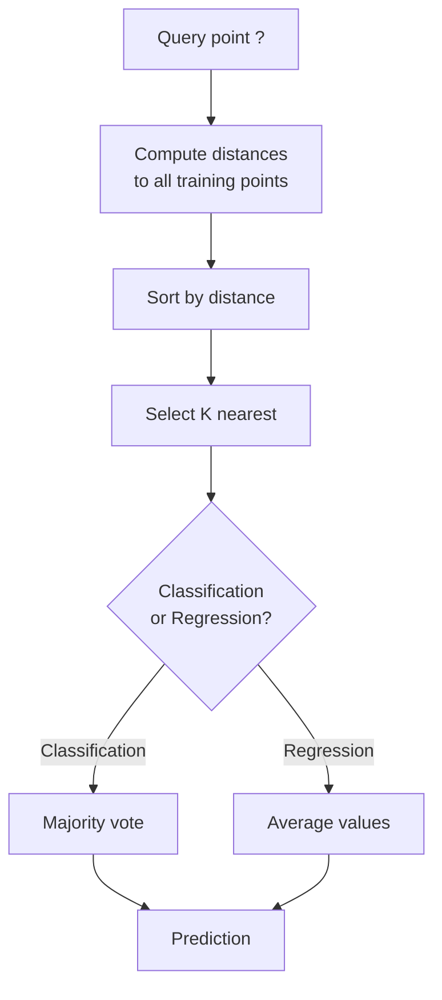
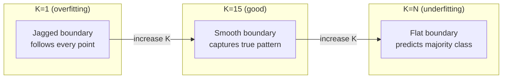
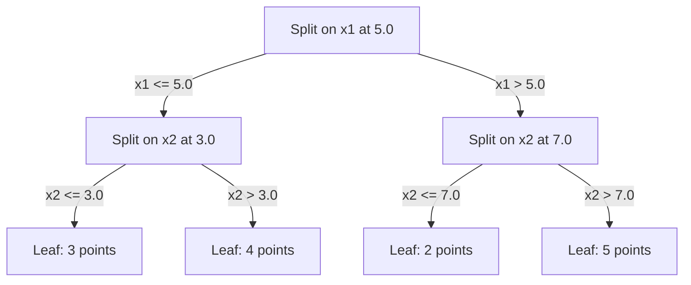

# K-Gần hàng xóm và xa cách nhất
# K gần gần với khoảng cách


> Hãy lưu trữ mọi thứ, dự đoán bằng cách nhìn vào hàng xóm, thuật toán đơn giản nhất mà thực sự hoạt động.

> 储存一切――预测时看邻居―― đơn giản nhất nhưng thực sự hiệu quả...

**Type:** Build | **类型：** 构建
**Language:**Python**语言：**Python
**Prerequisites:** Phase 1 (Lesson 14 Norms and Distances) | **前置知识：** Phase 1（第 14 课范数与距离）
**Time:** ~90 minutes | **时间：** 约 90 分钟

## Mục tiêu học tập

- Thực hiện phân loại KNN và lùi lại từ đầu với K có thể cấu hình và bỏ phiếu cân bằng khoảng cách
  Từ 0 thực hiện có thể cấu hình K  giá trị và khoảng cách tăng quyền bỏ phiếu KNN phân loại và trở lại
- So sánh L1, L2, cosine và Minkowski đường đo và chọn một phù hợp cho một loại dữ liệu nhất định
  So sánh L1、L2、余弦和可夫基距离度, để chọn một loại dữ liệu nhất định phù hợp với một số lượng
- Giải thích lời nguyền của chiều và chứng minh tại sao KNN suy giảm trong không gian chiều cao
  解释维度灾难,演示为什么KN trong không gian cao cấp hoạt động giảm
- Xây dựng cây KD để tìm kiếm hiệu quả hàng xóm gần nhất và phân tích khi nó vượt qua lực lượng thô
   xây dựng KD 树 thực hiện hiệu quả gần đây tìm kiếm, phân tích nó là gì tốt hơn tìm kiếm bạo lực


> **【中文解读】**
> KNO's core idea is to look away from your nearest K 个邻居是什么类别,你就预测什么类别―― tìm kiếm người dùng tương tự trong hệ thống đề xuất là KNO's idea―― học hỏi KNO's NeighborsClassifier――

> **【拓展：KNN 思想在现代 AI 中的广泛应用】**
> RAG(检索增强生成) 本质就是 KNN:将用户问题编码为向量,在向量数据库 (Pinecone、Milvus、FAISS) 搜索 K 个最相似的文档片段,再将它们提供给 LLM 生成答――Spotify 音乐推使用近似近邻的近邻的.

## Vấn đề  vấn đề giới thiệu

Bạn có một tập dữ liệu. Một điểm dữ liệu mới đến. Bạn cần phân loại nó hoặc dự đoán giá trị của nó. Thay vì học các tham số từ dữ liệu (như hồi quy tuyến tính hoặc SVM), bạn chỉ cần tìm các điểm đào tạo K gần nhất với điểm mới và để họ bỏ phiếu.

> Bạn có một tập dữ liệu. Một điểm dữ liệu mới đến. Bạn cần phân loại hoặc dự đoán giá trị của nó. Bạn không cần học các tham số trong dữ liệu như quay lại tuyến tính hoặc SVM, nhưng tìm các điểm đào tạo gần đây nhất của K, để chúng bỏ phiếu.

Đây là các hàng xóm gần nhất K. Không có giai đoạn đào tạo, không có các tham số để học, không có hàm mất mát để giảm thiểu. Bạn lưu trữ toàn bộ bộ bộ tập huấn và tính khoảng cách tại thời gian dự đoán.

> Đây là K gần gần. Không có giai đoạn đào tạo. Không cần phải học các tham số. Không cần phải tối thiểu hóa hàm mất.

Nó nghe có vẻ quá đơn giản để làm việc. Nhưng KNN là đáng ngạc nhiên cạnh tranh đối với nhiều vấn đề, đặc biệt là với tập dữ liệu nhỏ đến trung bình, và hiểu nó sâu sắc tiết lộ các khái niệm cơ bản: sự lựa chọn của métric khoảng cách (sự kết nối với Bước 1 Bài học 14), lời nguyền của chiều kích, và sự khác biệt giữa việc học lười biếng và thâm mê.

> 听起来太简单, nhưng KNN xuất hiện rất cạnh tranh trên nhiều vấn đề, đặc biệt là đối với tập dữ liệu nhỏ.

KNN cũng xuất hiện ở mọi nơi trong AI hiện đại, chỉ dưới tên khác nhau. Các cơ sở dữ liệu vector tìm kiếm KNN trên nhúng. Triết xuất tăng cường truy xuất (RAG) tìm thấy các khối tài liệu gần nhất K. Hệ thống khuyến nghị tìm thấy người dùng hoặc các mục tương tự. thuật toán giống nhau. Skala và cấu trúc dữ liệu khác nhau.

> KNN trong AI hiện đại không tồn tại, chỉ có tên khác.

> **【中文解读】**
> KNN là "惰学习"没有训练过程,预测时才计算距离──核心三要素:K 值选择(太小→过拟合噪声,太大→不适合)、距离度量(欧氏、曼哈顿、余弦等)、投票规则(等权或距离加权)。KNN's缺点:高维空间中距离失意 ((维度灾难),大数据集预测慢 ((需要与所有训练点比较) ・・・

## Khái niệm cốt lõi

### Làm thế nào KNN hoạt động

Với một tập dữ liệu của các điểm được dán nhãn và một điểm truy vấn mới:

> Đặt một tập hợp dữ liệu có nhãn và một điểm truy vấn mới:

1. Xét khoảng cách từ truy vấn đến mọi điểm trong bộ dữ liệu
   计算 truy vấn điểm đến tập trung dữ liệu khoảng cách của mỗi điểm
2. Định dạng theo khoảng cách
   按距离排序
3. Hãy lấy các điểm gần nhất với K
   取 K 个 gần đây nhất điểm
4. Đối với phân loại: số phiếu đa số trong các nước láng giềng K
   分类任务: K 个邻居中多数投票
5. Đối với sự lùi lại: trung bình (hoặc trung bình trọng lượng) của các giá trị của các hàng xóm K
   Chuyên vụ quay lại: K 个邻居值的平均 (K 个邻居值的平均)



Đó là toàn bộ thuật toán, không có phù hợp, không có sự giảm gradient, không có thời đại.

> Đó là toàn bộ thuật toán. Không có phù hợp. Không có thang xuống.

### Chọn K

K là một siêu tham số đơn. Nó kiểm soát sự đổi giá sự thiên vị-hình lệch:

> K là siêu số duy nhất. Nó kiểm soát trọng lượng phân biệt-phân biệt:

| K | Behavior |
|---|----------|
| K = 1 | Decision boundary follows every point. Zero training error. High variance. Overfits |
| Small K (3-5) | Sensitive to local structure. Can capture complex boundaries |
| Large K | Smoother boundaries. More robust to noise. May underfit |
| K = N | Predicts the majority class for every point. Maximum bias |

| K | 行为 |
|---|------|
| K = 1 | 决策边界跟随每个点。训练误差为零。高方差。过拟合 |
| 小 K (3-5) | 对局部结构敏感。能捕捉复杂边界 |
| 大 K | 更平滑的边界。对噪声更鲁棒。可能欠拟合 |
| K = N | 每个点都预测多数类。最大偏差 |

Một điểm khởi đầu phổ biến là K = sqrt(N) cho một tập dữ liệu của các điểm N. Sử dụng K lẻ cho phân loại nhị phân để tránh liên kết.

> 常用初始值是 K = sqrt(N)(N 为数据集大小)。二分类使用奇数 K 以避免平票。



### Điểm số khoảng cách

Chức năng khoảng cách xác định "gần" nghĩa là gì.

> 距离函数 định nghĩa "近" nghĩa.

**L2 (Euclidean)**là mặc định.

> **L2（欧氏距离）**                                                                                                                                                                                                                                                              

```
d(a, b) = sqrt(sum((a_i - b_i)^2))
```

Nhẫn đến quy mô tính năng. Luôn chuẩn hóa tính năng trước khi sử dụng L2 với KNN.

> Đối với các đặc điểm kích thước nhạy cảm.

**L1 (Manhattan)**L2 mạnh hơn so với L2 vì nó không bình phương các khác biệt.

> **L1（曼哈顿距离）**Đối với giá trị chênh lệch tuyệt đối                                                                                                                                                                                                                                                          

```
d(a, b) = sum(|a_i - b_i|)
```

**Cosine distance**đo góc giữa các vector, bỏ qua độ lớn.

> **余弦距离** đo góc giữa các khối lượng, bỏ qua kích thước nhỏ.

```
d(a, b) = 1 - (a . b) / (||a|| * ||b||)
```

**Minkowski**tổng hợp L1 và L2 với tham số p.

> **闵可夫斯基距离**Sử dụng các tham số p 推广了 L1 và L2

```
d(a, b) = (sum(|a_i - b_i|^p))^(1/p)

p=1: Manhattan
p=2: Euclidean
p->inf: Chebyshev (max absolute difference)
```

Métric nào để sử dụng phụ thuộc vào dữ liệu:

> 选择哪种度量 phụ thuộc vào dữ liệu:

| Data type | Best metric | Why |
|-----------|------------|-----|
| Numeric features, similar scale | L2 (Euclidean) | Default, works for spatial data |
| Numeric features, outliers | L1 (Manhattan) | Robust, does not amplify large differences |
| Text embeddings | Cosine | Magnitude is noise, direction is meaning |
| High-dimensional sparse | Cosine or L1 | L2 suffers from curse of dimensionality |
| Mixed types | Custom distance | Combine metrics per feature type |

| 数据类型 | 最佳度量 | 原因 |
|---------|--------|------|
| 数值特征，量级相近 | L2（欧氏） | 默认选择，适合空间数据 |
| 数值特征，有异常值 | L1（曼哈顿） | 鲁棒，不放大大的差异 |
| 文本嵌入 | 余弦 | 大小是噪声，方向是含义 |
| 高维稀疏 | 余弦或 L1 | L2 受维度灾难影响 |
| 混合类型 | 自定义距离 | 按特征类型组合度量 |

### KNN trọng lượng

KNN tiêu chuẩn cho trọng lượng bằng cho tất cả các hàng xóm K. Nhưng một hàng xóm ở khoảng cách 0.1 nên quan trọng hơn một ở khoảng cách 5.0.

> 标准 KNN cho tất cả các hàng xóm K                                                                                                                                                                                                                                                         

**Distance-weighted KNN**trọng lượng mỗi hàng xóm ngược theo khoảng cách:

> **距离加权 KNN**Theo khoảng cách của số người phụ nữ:

```
weight_i = 1 / (distance_i + epsilon)

For classification: weighted vote
For regression:     weighted average = sum(w_i * y_i) / sum(w_i)
```

Epsilon ngăn chặn chia bằng không khi một điểm truy vấn phù hợp chính xác với một điểm đào tạo.

> epsilon  ngăn chặn khi hỏi điểm hoàn toàn phù hợp tập luyện điểm khi trừ trừ 零。

KNN cân nặng ít nhạy cảm hơn với sự lựa chọn của K vì những người hàng xóm xa đóng góp rất ít bất kể.

> KNN không quá nhạy cảm với sự lựa chọn của K, vì những người hàng xóm xa xôi bất kể K  giá trị đóng góp như thế nào đều rất nhỏ.

### Lời nguyền của chiều kích

Hiệu suất KNN giảm ở các chiều cao.

> KNN 性能在高维中退化──这不是模糊的担忧,而是数学事实──

**Problem 1: distances converge.**Khi chiều kích tăng lên, tỷ lệ khoảng cách tối đa với khoảng cách tối thiểu gần 1. Tất cả các điểm trở nên "sự xa" với truy vấn.

> **问题 1：距离趋同。**Khi kích thước tăng lên, tỷ lệ khoảng cách tối đa và khoảng cách nhỏ nhất gần đến 1. Tất cả các điểm biến thành điểm hỏi.

```
In d dimensions, for random uniform points:

d=2:    max_dist / min_dist = varies widely
d=100:  max_dist / min_dist ~ 1.01
d=1000: max_dist / min_dist ~ 1.001

When all distances are nearly equal, "nearest" is meaningless.
```

**Problem 2: volume explodes.**Để chụp các khu phố K trong một phần nhỏ cố định của dữ liệu, bạn cần mở rộng bán kính tìm kiếm của bạn để bao phủ một phần lớn hơn nhiều của không gian tính năng. "Đường phố" ở kích thước cao bao gồm phần lớn không gian.

> **问题 2：体积爆炸。**Để nắm bắt K 个邻居 trong tỷ lệ cố định của dữ liệu, cần phải mở rộng bán kính tìm kiếm đến tỷ lệ lớn hơn của không gian bao gồm các đặc điểm.

**Problem 3: corners dominate.**Trong một đơn vị siêu khối ở kích thước d, phần lớn khối lượng được tập trung gần các góc, chứ không phải trung tâm.

> **问题 3：角落主导。**Trong d 维单位超立体, phần lớn khối lượng tập trung ở gần góc, chứ không phải trung tâm.

Kết quả thực tế: KNN hoạt động tốt cho đến khoảng 20-50 tính năng. Ngoài ra, bạn cần giảm chiều kích (PCA, UMAP, t-SNE) trước khi áp dụng KNN, hoặc bạn cần sử dụng cấu trúc tìm kiếm dựa trên cây khai thác chiều kích thấp hơn nội tại của dữ liệu.

> Kết quả thực tế:KNN trong khoảng 20-50 个特征以下 hiệu quả tốt.

### KD-trái: nhanh chóng tìm kiếm hàng xóm gần nhất

KNN lực thô tính khoảng cách từ truy vấn đến mỗi điểm đào tạo. đó là O(n * d) cho mỗi truy vấn. Đối với tập dữ liệu lớn, điều này quá chậm.

> 暴力 KNN 计算查询点到每训练点的距离――每次查询 O(n * d) ―― đối với tập hợp dữ liệu lớn quá chậm――

Một cây KD tái tạo chia không gian dọc theo trục tính năng.

> KD 树沿特征轴递归划分空间―― mỗi tầng沿一个维度在中值处分离――



Để tìm người hàng xóm gần nhất, đi qua cây đến lá chứa câu hỏi, sau đó theo dõi lại và kiểm tra các phân vùng hàng xóm chỉ nếu chúng có thể chứa các điểm gần hơn.

> Để tìm thấy khu vực gần nhất, đi qua cây để bao gồm các điểm truy vấn, sau đó quay lại và chỉ có thể bao gồm các điểm truy vấn gần nhất trong khu vực lân cận.

Thời gian truy vấn trung bình: O(log n) cho các chiều kích thấp. Nhưng cây KD giảm xuống O(n) trong các chiều kích cao (d > 20) vì việc theo dõi lại loại bỏ ngày càng ít chi nhánh.

> 低维平均查询时间:O(log n) ・・・ nhưng KD 树在高维(d > 20) 时退化为O(n), vì ngược xóa của分支越来越少。

### Cây bóng: tốt hơn cho kích thước vừa phải

Các cây bóng phân chia dữ liệu thành siêu cầu tổ hợp thay vì các hộp liên kết với trục. Mỗi nút xác định một quả bóng (trung tâm + bán kính) chứa tất cả các điểm trong cây phụ đó.

> 球树将数据分为嵌套的超球面而不是轴对齐的盒子. Mỗi节点定义一个包含该子树所有点的球 (中心 + 半径) ⋅

Lợi ích so với cây KD:
- Làm việc tốt hơn trong kích thước vừa phải (tối đa ~50)
  Trong độ trung bình (~ 50 độ) hiệu quả tốt hơn
- Thiết kế không liên kết với trục
  能处理 không có trục đối với cấu trúc
- Số lượng ranh giới chặt chẽ hơn có nghĩa là nhiều nhánh được cắt trong quá trình tìm kiếm
  Khung quanh hơn có nghĩa là tìm kiếm khi cắt ránh nhiều hơn phân nhánh

Cả cây KD và cây bóng đều là thuật toán chính xác. Đối với tìm kiếm quy mô thực sự lớn (người triệu điểm, hàng trăm chiều), phương pháp hàng xóm gần nhất (HNSW, IVF, định lượng sản phẩm) được sử dụng thay vào đó.

> KD 树和球树都是精确算法──对于真正的大规模搜索的 (000000点、100维),使用近似近邻方法 (HNSW、IVF、乘积量化)──这些在第一阶段第14课中讨论──

### Học lười biếng vs học đam mê

KNN là một học viên lười biếng: nó không làm việc trong thời gian đào tạo và tất cả làm việc trong thời gian dự đoán. Hầu hết các thuật toán khác (sự lùi tuyến tính, SVM, mạng thần kinh) là những người học đam mê: họ thực hiện tính toán nặng trong thời gian đào tạo để xây dựng một mô hình nhỏ gọn, sau đó dự đoán là nhanh chóng.

> KNN là máy học lười biếng: khi tập luyện không làm bất cứ công việc nào, tất cả công việc đều được hoàn thành khi dự đoán.

| Aspect | Lazy (KNN) | Eager (SVM, neural net) |
|--------|------------|------------------------|
| Training time | O(1) just store data | O(n * epochs) |
| Prediction time | O(n * d) per query | O(d) or O(parameters) |
| Memory at prediction | Store entire training set | Store model parameters only |
| Adapts to new data | Add points instantly | Retrain the model |
| Decision boundary | Implicit, computed on the fly | Explicit, fixed after training |

| 方面 | 懒惰学习 (KNN) | 积极学习 (SVM, 神经网络) |
|------|---------------|------------------------|
| 训练时间 | O(1) 仅存储数据 | O(n * epochs) |
| 预测时间 | 每次查询 O(n * d) | O(d) 或 O(参数) |
| 预测时内存 | 存储整个训练集 | 仅存储模型参数 |
| 适应新数据 | 即时添加点 | 重新训练模型 |
| 决策边界 | 隐式，即时计算 | 显式，训练后固定 |

Học lười biếng là lý tưởng khi:
- Bộ dữ liệu thay đổi thường xuyên (làm thêm/từ các điểm mà không cần đào tạo lại)
  数据集频繁变化(无需重训即可添加/删除点)
- Bạn cần dự đoán cho rất ít câu hỏi
  Chỉ cần làm dự đoán với rất ít câu hỏi
- Anh muốn không có thời gian tập luyện
  需要零训练时间
- Bộ dữ liệu đủ nhỏ để tìm kiếm bằng lực lượng tàn bạo nhanh
  Số liệu đủ nhỏ, bạo lực tìm kiếm nhanh chóng

> 惰学习 trong các tình huống sau đây là lý tưởng nhất:

### KNN cho sự lùi

Thay vì bỏ phiếu đa số, KNN cho sự lùi lại trung bình các giá trị mục tiêu của các nước láng giềng K.

> KNN quay trở lại không sử dụng đa số phiếu bầu, mà đối với K 个邻居的目标值取平均──

```
prediction = (1/K) * sum(y_i for i in K nearest neighbors)

Or with distance weighting:
prediction = sum(w_i * y_i) / sum(w_i)
where w_i = 1 / distance_i
```

KTN regression tạo ra dự đoán liên tục theo từng mảnh (hoặc mềm mại theo từng mảnh với trọng lượng). Nó không thể chi tiết vượt ra ngoài phạm vi dữ liệu đào tạo. Nếu các mục tiêu đào tạo đều nằm giữa 0 và 100, KNN sẽ không bao giờ dự đoán 200.

> KNN trở lại tạo ra phân đoạn thường xuyên (hoặc tăng quyền thời gian phân đoạn光滑) dự đoán. Nó không thể được đưa ra ngoài phạm vi dữ liệu đào tạo. Nếu giá trị mục tiêu đào tạo nằm giữa 0-100 , KNN sẽ không bao giờ dự đoán 200.

> **【中文解读】**
> KNN quay trở lại sử dụng K 个近邻的目标值取平均(或距离加权平均) như giá trị dự đoán.

> **【拓展：大规模最近邻搜索——从 KNN 到 FAISS】**
> Khi quy mô dữ liệu tăng từ hàng ngàn đến hàng tỷ, thì KNN 搜索太慢──Meta 开源的 FAISS 库使用乘积量化(PQ) 和倒排文件索引(IVF), trong 10 tỷ khối lượng đạt được tìm kiếm mil秒级──HNSW(分层可导航小世界图) là một loại thuật toán phổ biến khác, được Elasticsearch 和 Milvus 采用──这些近似近邻的ANN) phương pháp đã làm giảm một số lượng ít sự chính xác để tăng tốc tìm kiếm 100-1000 lần.

## Hãy xây dựng nó.
```figure
knn-smoothness
```

## Hãy xây dựng nó

### Bước 1: Các chức năng khoảng cách

Thực hiện khoảng cách L1, L2, cosine và Minkowski.

> 实现 L1、L2、余弦和可夫斯基距离──这些直接连接到阶段 1 第14 课──

```python
import math

def l2_distance(a, b):
    return math.sqrt(sum((ai - bi) ** 2 for ai, bi in zip(a, b)))  # 欧氏距离（L2 范数）

def l1_distance(a, b):
    return sum(abs(ai - bi) for ai, bi in zip(a, b))  # 曼哈顿距离（L1 范数）

def cosine_distance(a, b):
    dot_val = sum(ai * bi for ai, bi in zip(a, b))  # 点积
    norm_a = math.sqrt(sum(ai ** 2 for ai in a))  # 向量 a 的模
    norm_b = math.sqrt(sum(bi ** 2 for bi in b))  # 向量 b 的模
    if norm_a == 0 or norm_b == 0:
        return 1.0
    return 1.0 - dot_val / (norm_a * norm_b)  # 余弦距离 = 1 - 余弦相似度

def minkowski_distance(a, b, p=2):
    if p == float('inf'):
        return max(abs(ai - bi) for ai, bi in zip(a, b))  # p=∞ 时为切比雪夫距离
    return sum(abs(ai - bi) ** p for ai, bi in zip(a, b)) ** (1 / p)  # 闵可夫斯基距离
```

### Bước 2: Bộ phân loại KNN và bộ trục trệ

Xây dựng KNN đầy đủ với cấu hình K, đo khoảng cách và trọng lượng khoảng cách tùy chọn.

> Thiết lập KNN hoàn chỉnh, hỗ trợ cấu hình K ∆ từ độ đo và từ độ tăng sức mạnh có thể chọn

```python
class KNN:
    def __init__(self, k=5, distance_fn=l2_distance, weighted=False,
                 task="classification"):
        self.k = k
        self.distance_fn = distance_fn
        self.weighted = weighted
        self.task = task
        self.X_train = None
        self.y_train = None

    def fit(self, X, y):
        self.X_train = X
        self.y_train = y

    def predict(self, X):
        return [self._predict_one(x) for x in X]
```

### Bước 3: KD-tree cho tìm kiếm hiệu quả

Xây dựng một cây KD từ đầu mà tái tạo chia trên trung bình của mỗi chiều.

> Từ zero cấu trúc KD 树, dọc theo từng chiều kích của giá trị trung bình phân chia.

```python
class KDTree:
    def __init__(self, X, indices=None, depth=0):
        # Recursively partition the data
        self.axis = depth % len(X[0])
        # Split on median of the current axis
        ...

    def query(self, point, k=1):
        # Traverse to leaf, then backtrack
        ...
```

Nhìn xem`code/knn.py`cho việc thực hiện đầy đủ với tất cả các phương pháp hỗ trợ và demo.

> 完整实现 (含所有辅助方法和演示) 见`code/knn.py`

### Bước 4: Tích thước tính năng

KNN đòi hỏi tính năng quy mô bởi vì khoảng cách nhạy cảm với độ lớn tính năng.

> KNN cần các đặc điểm được thu hẹp, vì khoảng cách đối với các đặc điểm có tính chất.

```python
def standardize(X):
    n = len(X)
    d = len(X[0])
    means = [sum(X[i][j] for i in range(n)) / n for j in range(d)]
    stds = [
        max(1e-10, (sum((X[i][j] - means[j]) ** 2 for i in range(n)) / n) ** 0.5)
        for j in range(d)
    ]
    return [[((X[i][j] - means[j]) / stds[j]) for j in range(d)] for i in range(n)], means, stds
```

## Hãy sử dụng nó để thực hiện

Với scikit-learn:

> Sử dụng scikit-learn:

```python
from sklearn.neighbors import KNeighborsClassifier
from sklearn.preprocessing import StandardScaler
from sklearn.pipeline import Pipeline

clf = Pipeline([
    ("scaler", StandardScaler()),
    ("knn", KNeighborsClassifier(n_neighbors=5, metric="euclidean")),
])
clf.fit(X_train, y_train)
print(f"Accuracy: {clf.score(X_test, y_test):.4f}")
```

Scikit-learn tự động sử dụng cây KD hoặc cây bóng khi bộ dữ liệu đủ lớn và kích thước đủ thấp. Đối với dữ liệu có chiều cao, nó rơi lại lực thô. Bạn có thể kiểm soát điều này bằng cách sử dụng `algorithm`tham số.

> Scikit-learn trong tập dữ liệu đủ lớn và kích thước đủ thấp khi tự động sử dụng KD 树或球树. Đối với dữ liệu lớn, nó sẽ quay lại tìm kiếm bạo lực. Bạn có thể thông qua.`algorithm`参数控制――

Đối với việc tìm kiếm hàng xóm gần nhất (người hàng triệu vector), sử dụng FAISS, Annoy hoặc cơ sở dữ liệu vector:

> 对于大规模近邻搜索 ((百万向量), sử dụng FAISS、Annoy 或向量数据库:

```python
import faiss

index = faiss.IndexFlatL2(dimension)
index.add(embeddings)
distances, indices = index.search(query_vectors, k=5)
```

> **【拓展：从 KNN 到向量数据库——AI 基础设施的演进】**
> KNO của KNN là cốt lõi của cơ sở hạ tầng AI hiện đại. RAG (khảo sát tăng cường tạo ra) sử dụng KNN trong cơ sở dữ liệu khối lượng tìm kiếm tài liệu liên quan; hệ thống khuyến cáo sử dụng gần gũi gần gũi của ANN tìm thấy hàng trăm tỷ khối lượng hàng hóa tương tự; tìm kiếm hình ảnh sử dụng CLIP nhúng + FAISS thực hiện tìm kiếm跨模态.

## Tập luyện bài tập

1. Thực hiện phân loại KNN trên một tập dữ liệu 2D với 3 lớp. Chụp ranh giới quyết định cho K=1, K=5, K=15, và K=N. Quan sát quá trình chuyển đổi từ quá phù hợp sang thiếu phù hợp.
   1. Trong 3 bộ 2D dữ liệu tập hợp thực hiện KNN phân loại.

2. Tạo 1000 điểm ngẫu nhiên trong 2, 5, 10, 50, 100, và 500 chiều. Đối với mỗi chiều kích, tính toán tỷ lệ của khoảng cách đôi tối đa đến khoảng cách đôi tối thiểu.
   2. Trong 2、5、10、50、100 和 500 维中各生成1000 随机点──对于每个维度,计算最大成对距离与最小成对距离的比值──绘制比值与维度的关系图,可视化维度灾难──

3. So sánh khoảng cách L1, L2 và cosine cho KNN trên một vấn đề phân loại văn bản ( Sử dụng các vector TF-IDF).
   3. Trong văn bản phân loại vấn đề (( sử dụng TF-IDF 向量) trên so sánh L1、L2 和余弦距离──.

4. Thực hiện một cây KD và đo thời gian truy vấn so với lực thô cho tập dữ liệu 1k, 10k, và 100k điểm trong 2D, 10D, và 50D. Ở chiều kích nào cây KD ngừng nhanh hơn lực thô?
   4. 实现 KD 树, đo 1k、10k 和 100k 点在2D、10D 和 50D 查询时间与暴力搜索的比较.

5. Xây dựng một máy quay lại KNN trọng lượng cho y = sin(x) + tiếng ồn. So sánh nó với KNN không trọng lượng cho K = 3, 10, 30.
   5. 为 y = sin(x) + tiếng 构建加权 KNN 回归器──在 K=3、10、30 时与未加权 KNN 比较──展示加权产生更光滑的预测,特别是在大 K时──

## Từ khóa  Từ khóa nhanh chóng

| Term | What it actually means |
|------|----------------------|
| K-nearest neighbors | Non-parametric algorithm that predicts by finding the K closest training points to a query |
| Lazy learning | No computation at training time. All work happens at prediction time. KNN is the canonical example |
| Eager learning | Heavy computation at training time to build a compact model. Most ML algorithms are eager |
| Curse of dimensionality | In high dimensions, distances converge and neighborhoods expand to cover most of the space, making KNN ineffective |
| KD-tree | Binary tree that recursively partitions space along feature axes. O(log n) queries in low dimensions |
| Ball tree | Tree of nested hyperspheres. Works better than KD-trees in moderate dimensions (up to ~50) |
| Weighted KNN | Neighbors weighted inversely by distance. Closer neighbors have more influence on the prediction |
| Feature scaling | Normalizing features to comparable ranges. Required for distance-based methods like KNN |
| Majority vote | Classification by counting which class is most common among K neighbors |
| Brute force search | Computing distance to every training point. O(n*d) per query. Exact but slow for large n |
| Approximate nearest neighbor | Algorithms (HNSW, LSH, IVF) that find approximately nearest points much faster than exact search |
| Voronoi diagram | The partition of space where each region contains all points closer to one training point than any other. K=1 KNN produces Voronoi boundaries |

## Xem thêm 延伸阅读

- [Cover & Hart: Nearest Neighbor Pattern Classification (1967)](https://ieeexplore.ieee.org/document/1053964)- giấy KNN cơ bản chứng minh nó có tỷ lệ lỗi tối đa gấp đôi Bayes tối ưu
  [Cover & Hart: Nearest Neighbor Pattern Classification (1967)](https://ieeexplore.ieee.org/document/1053964)- chứng minh KNN  tỷ lệ sai lầm cao nhất là gấp đôi tỷ lệ tốt nhất của Bayes
- [Friedman, Bentley, Finkel: An Algorithm for Finding Best Matches in Logarithmic Expected Time (1977)](https://dl.acm.org/doi/10.1145/355744.355745)- giấy cây KD gốc
  [Friedman, Bentley, Finkel: An Algorithm for Finding Best Matches in Logarithmic Expected Time (1977)](https://dl.acm.org/doi/10.1145/355744.355745)- KD 树原始论文
- [Beyer et al.: When Is "Nearest Neighbor" Meaningful? (1999)](https://link.springer.com/chapter/10.1007/3-540-49257-7_15)- phân tích chính thức về lời nguyền của chiều kích đối với hàng xóm gần nhất
  [Beyer et al.: When Is "Nearest Neighbor" Meaningful? (1999)](https://link.springer.com/chapter/10.1007/3-540-49257-7_15)- Phân tích chính thức gần đây về thảm họa
- [scikit-learn Nearest Neighbors documentation](https://scikit-learn.org/stable/modules/neighbors.html)- hướng dẫn thực tế với việc lựa chọn thuật toán
  [scikit-learn 最近邻文档](https://scikit-learn.org/stable/modules/neighbors.html)- 实用指南及算法选择
- [FAISS: A Library for Efficient Similarity Search](https://github.com/facebookresearch/faiss)- Thư viện Meta cho tỉ tỉ số tìm kiếm gần nhất hàng xóm
  [FAISS](https://github.com/facebookresearch/faiss)- Meta của hàng tỷ cấp gần như gần nhất gần tìm kiếm
