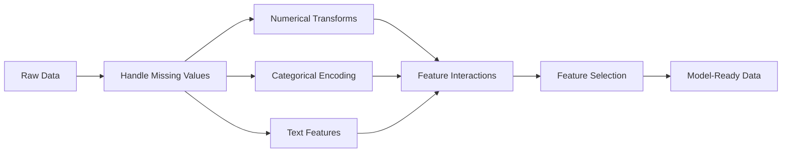

# Tính năng Kỹ thuật & Chọn
# Đặc điểm công nghệ và lựa chọn


> Một tính năng tốt có giá trị một ngàn điểm dữ liệu.

> Một đặc điểm tốt trên 1000 điểm dữ liệu.

**Type:** Build | **类型：** 构建
**Languages:** Python
**Prerequisites:** Phase 1 (Statistics for ML, Linear Algebra), Phase 2 Lessons 1-7 | **前置知识：** Phase 1（统计学、线性代数），Phase 2 第 1-7 课
**Time:** ~90 minutes | **时间：** 约 90 分钟

## Mục tiêu học tập

- Thực hiện các biến đổi số (chứng chuẩn hóa, quy mô tối đa tối thiểu, biến đổi nhật ký, binning) và giải thích khi nào mỗi biến đổi phù hợp
  实现数值变换(标准化、Min-Max 缩放、对数变换、分箱) và giải thích các trường hợp ứng dụng riêng của họ
- Xây dựng mã hóa đơn, nhãn và mục tiêu cho các tính năng hạng mục và xác định nguy cơ rò rỉ dữ liệu trong mã hóa mục tiêu
  Construction of unique code ✓ ✓ ✓ ✓ ✓ ✓ ✓ ✓ ✓ ✓ ✓ ✓ ✓ ✓ ✓ ✓ ✓ ✓ ✓ ✓ ✓ ✓ ✓ ✓ ✓ ✓ ✓ ✓ ✓ ✓ ✓ ✓ ✓ ✓ ✓ ✓ ✓ ✓ ✓ ✓ ✓ ✓ ✓ ✓ ✓ ✓ ✓ ✓ ✓ ✓ ✓ ✓ ✓ ✓ ✓ ✓ ✓ ✓ ✓ ✓ ✓ ✓ ✓ ✓ ✓ ✓ ✓ ✓ ✓ ✓ ✓ ✓ ✓ ✓ ✓ ✓ ✓ ✓ ✓ ✓ ✓ ✓ ✓ ✓ ✓ ✓ ✓ ✓ ✓ ✓ ✓ ✓ ✓ ✓ ✓ ✓ ✓ ✓ ✓ ✓ ✓ ✓ ✓ ✓ ✓ ✓ ✓ ✓ ✓ ✓ ✓ ✓ ✓ ✓ ✓ ✓ ✓ ✓ ✓ ✓ ✓ ✓ ✓ ✓ ✓ ✓ ✓ ✓ ✓ ✓ ✓ ✓ ✓ ✓ ✓ ✓ ✓ ✓ ✓ ✓ ✓ ✓ ✓ ✓ ✓ ✓ ✓ ✓ ✓ ✓ ✓ ✓ ✓ ✓ ✓ ✓ ✓ ✓ ✓ ✓ ✓ ✓ ✓ ✓ ✓ ✓ ✓ ✓ ✓ ✓ ✓ ✓ ✓ ✓ ✓ ✓ ✓ ✓ ✓ ✓ ✓ ✓ ✓ ✓ ✓ ✓ ✓ ✓ ✓ ✓ ✓ ✓ ✓ ✓ ✓ ✓ ✓ ✓ ✓ ✓ ✓ ✓ ✓ ✓ ✓ ✓ ✓ ✓ ✓ ✓ ✓ ✓ ✓ ✓ ✓ ✓ ✓ ✓ ✓ ✓ ✓ ✓ ✓ ✓ ✓ ✓ ✓ 
- Xây dựng một máy tính vectorizer TF-IDF từ đầu và giải thích tại sao nó vượt qua số lượng từ nguyên liệu để phân loại văn bản
  Từ零 cấu trúc TF-IDF sang định lượng, giải thích tại sao nó tốt hơn so với số lượng từ nguyên thủy
- Sử dụng lựa chọn tính năng dựa trên bộ lọc (nước ngưỡng biến thể, tương quan, thông tin lẫn nhau) để giảm chiều kích
  应用 dựa trên các tính năng chọn lựa √方差值、相关性、互信息) giảm kích thước


> **【中文解读】**
> Trình đặc tính là chuyển đổi dữ liệu nguyên thủy thành mô hình có thể hiểu được các đặc điểm. Đây là bước tốn thời gian nhất trong ML.

> **【拓展：特征工程 vs 深度学习的自动特征学习】**
> Lợi thế trung tâm của Deep Learning là tính năng tự động học tập (CNN tự động lấy hình ảnh tính năng, Transformer tự động lấy văn bản tính năng), nhưng trong bảng tính dữ liệu thủ công tính năng kỹ thuật vẫn quan trọng. Kẻ chiến thắng cuộc thi thường dành 80% thời gian cho kỹ thuật tính năng. Chương trình chiến thắng của Giải thưởng Netflix bao gồm hàng trăm tính năng thiết kế thủ công.

## Vấn đề  vấn đề giới thiệu

Bạn có một bộ dữ liệu, bạn chọn một thuật toán, bạn luyện tập nó, kết quả là trung bình, bạn thử một thuật toán kỳ diệu hơn, vẫn trung bình, bạn dành một tuần để điều chỉnh các siêu tham số, cải tiến biên.

> Bạn có một tập dữ liệu. Bạn chọn một thuật toán. Bạn luyện tập nó. Kết quả là đơn giản. Bạn đã thử một thuật toán đẹp hơn. Bạn đã dành một tuần để điều chỉnh các siêu số.

Sau đó ai đó biến dữ liệu thô thành các tính năng tốt hơn và một sự lùi hậu cần đơn giản đánh bại bộ sưu tập tăng cường gradient được điều chỉnh của bạn.

> Sau đó, ai đó chuyển dữ liệu nguyên thủy thành các tính năng tốt hơn, một logic đơn giản trở lại đánh bại bạn điều chỉnh các bước tăng cường tích hợp.

Trong ML cổ điển, đại diện của dữ liệu quan trọng hơn sự lựa chọn của thuật toán. Một mô hình giá nhà với "phần hình vuông" và "nhiều phòng ngủ" sẽ đánh bại một mô hình với "địa chỉ như một chuỗi thô" bất kể người học có độ tinh vi như thế nào.

> Tình huống này thường xảy ra. Trong ML cổ điển, việc biểu hiện dữ liệu quan trọng hơn sự lựa chọn của thuật toán. Một mô hình giá trị với "lốp" và "đơn phòng" sẽ đánh bại mô hình của "địa chỉ nguyên thủy", bất kể máy học phức tạp như thế nào.

Kỹ thuật tính năng là quá trình chuyển đổi dữ liệu thô thành đại diện làm cho các mô hình dễ dàng tìm thấy hơn.

> Chế độ đặc điểm là quá trình chuyển đổi dữ liệu nguyên thủy để làm cho mô hình dễ dàng hơn để mô hình tìm thấy. Chế độ chọn đặc điểm là quá trình loại bỏ các đặc điểm chỉ tăng tiếng ồn không tăng tín hiệu.

> **【中文解读】**
> "Dữ liệu và đặc điểm quyết định giới hạn trên của ML, mô hình và thuật toán chỉ gần với giới hạn trên này. "Các đặc điểm tốt có thể khiến mô hình đơn giản đánh bại mô hình phức tạp.

## Khái niệm cốt lõi

### Hãng đường ống đặc trưng



### Các tính năng số

Số nguyên liệu hiếm khi sẵn sàng cho mô hình.

> Số nguyên thủy rất ít có thể được sử dụng trực tiếp cho mô hình.

**Scaling:**Đặt các tính năng trên cùng phạm vi để các thuật toán dựa trên khoảng cách (K-Means, KNN, SVM) đối xử với tất cả các tính năng bằng nhau.

> **缩放：**Để phân tích các đặc điểm được phân tích theo cùng phạm vi, để phân tích các đặc điểm được phân tích bằng cách phân tích các đặc điểm khác nhau.

**Log transform:**Nén các phân phối xoay phải (thu nhập, dân số, số từ).

> **对数变换：**压缩右偏分布(收入、人口、词频) 』将乘法关系变为加法关系。

**Binning:**Chuyển đổi các giá trị liên tục thành các loại. hữu ích khi mối quan hệ giữa tính năng và mục tiêu không tuyến tính nhưng theo từng bước (ví dụ, nhóm tuổi).

> **分箱：**Để chuyển đổi giá trị liên tục thành loại. Khi các tính chất và mục tiêu liên quan không phải là tuyến tính nhưng có ích khi chuyển đổi theo thang (ví dụ như nhóm tuổi)

**Polynomial features:**Tạo ra các thuật ngữ x^2, x^3, x1*x2. cho phép các mô hình tuyến tính nắm bắt các mối quan hệ không tuyến tính với chi phí của nhiều tính năng hơn.

> **多项式特征：**Tạo x^2、x^3、x1*x2 项──让线性模型以更多特征为价格捕捉非线性关系──

### Các tính năng danh mục

Các mô hình cần số, các loại cần mã hóa.

> 模型 cần số. 类需要编码.

**One-hot encoding:**Tạo một cột nhị phân cho mỗi loại. "color = red/blue/green" trở thành ba cột: is_red, is_blue, is_green.

> **独热编码：**Để mỗi loại tạo ra một thứ hai. "màu = đỏ/ xanh/ xanh lá cây" biến thành ba loại: là màu đỏ, là màu xanh lá cây, là màu xanh lá cây.

**Label encoding:**Bản đồ mỗi loại thành một số nguyên: đỏ = 0, xanh = 1, xanh = 2. Tạo ra thứ tự sai (chương tự có thể nghĩ xanh > xanh > đỏ). Chỉ phù hợp với các mô hình dựa trên cây phân chia theo các giá trị riêng lẻ.

> **标签编码：**将每个类别映射到整数:red=0、blue=1、green=2──引入虚假排序(模型可能认为绿 >蓝 >红) ⋅只适合单个值分的树模型──

**Target encoding:**Thay thế mỗi loại bằng trung bình của biến mục tiêu cho loại đó. mạnh nhưng nguy hiểm: nguy cơ rò rỉ dữ liệu cao. Chỉ cần được tính toán trên dữ liệu đào tạo và áp dụng cho dữ liệu thử nghiệm.

> **目标编码：**Thay thế từng loại thành trung bình biến số mục tiêu của loại này. Động lực nhưng nguy hiểm: rủi ro rò rỉ dữ liệu cao.

### Các tính năng văn bản

**Count vectorizer:**Số lượng lần mỗi từ xuất hiện trong một tài liệu. "con mèo ngồi trên thảm" trở thành {the: 2, cat: 1, sat: 1, on: 1, mat: 1}.

> **词频向量化：**计算每个词在文档中出现的次数──"con mèo ngồi trên thảm" 变成 {the: 2, cat: 1, sat: 1, on: 1, mat: 1}──

**TF-IDF:**Từ "đồng độ" - "đồng độ" - "đồng độ" - "đồng độ" - "đồng độ" - "đồng độ" - "đồng độ" - "đồng độ" - "đồng độ" - "đồng độ" - "đồng độ" - "đồng độ" - "đồng độ" - "đồng độ" - "đồng độ" - "đồng độ" - "đồng độ" - "đồng độ" - "đồng độ" - "đồng độ" - "đồng độ" - "đồng độ" - "đồng độ" - "đồng độ" - "đồng độ" - "đồng độ" - "đồng độ" - "đồng độ" - "đồng độ" - "đồng độ" - "đồng độ" - "đồng độ" - "đồng độ" - "đồng độ" - "đồng độ" - "đồng độ" - "đồng độ" - "đồng độ" - "đồng độ" - "đồng độ" - "đồng độ" - "đồng độ" - "đồng độ"

> **TF-IDF：**词频-逆文档频率──按词在文档中的唯一性加权──常见词如"the"获得低权重──稀有、有区分度的词获得高权重──

```
TF(word, doc) = count(word in doc) / total words in doc
IDF(word) = log(total docs / docs containing word)
TF-IDF = TF * IDF
```

### Những giá trị bị mất tích

Dữ liệu thực có lỗ hổng.

> Thực tế có lỗ hổng.

- **Drop rows:**Chỉ khi dữ liệu bị thiếu hiếm và ngẫu nhiên
  **删除行：**Chỉ khi thiếu dữ liệu hiếm và có khi
- **Mean/median imputation:**Đơn giản, giữ lại hình dạng phân phối (đường trung bình mạnh hơn để ngoại lệ)
  **均值/中位数填充：**简单, giữ hình dạng phân bố (中位数对异常值更鲁棒)
- **Mode imputation:**Đối với các tính năng phân loại
  **众数填充：**Sử dụng cho các đặc điểm
- **Indicator column:**Thêm một cột nhị phân "was_this_missing" trước khi tính toán.
  **指示列：**填充前添加二进制列"đã_đã_đã_đã_đã_đã_đã_đã_đã"―― Data missing itself may be informationsexual
- **Forward/backward fill:**Đối với dữ liệu chuỗi thời gian
  **前向/后向填充：**Sử dụng dữ liệu chuỗi thời gian

### Các tính năng tương tác

Đôi khi mối quan hệ là trong sự kết hợp. "Tăng độ" và "năng lượng" đơn lẻ ít dự đoán hơn "BMI = trọng lượng / chiều cao ^ 2".

> Có khi có mối quan hệ trong bộ phận. "Tình độ" và "Trong trọng lượng" đơn độc không giống như "BMI = trọng lượng / Tối độ cao ^2" có khả năng dự đoán.

### Chọn tính năng

Những tính năng không liên quan thêm tiếng ồn, kéo dài thời gian tập luyện và có thể gây ra sự quá phù hợp.

> 更多特征不一定好 hơn. 无关特征增加噪音. 增加训练时间并可能导致过适应.

**Filter methods (pre-model):**
- Sự tương quan: loại bỏ các tính năng tương quan cao với nhau (từ)
  相关性:移除高度相关的特征(冗余)
- Thông tin lẫn nhau: đo lường mức độ biết một tính năng làm giảm sự không chắc chắn về mục tiêu
  互信息: đo biết một đặc điểm có thể giảm mục tiêu
- Khoảng hạn biến thể: loại bỏ các tính năng hầu như không thay đổi
  方差值: 移除几乎不变的特征

**Wrapper methods (model-based):**
- L1 Regularisation (Lasso): đưa trọng lượng tính năng không liên quan đến chính xác đến 0.
  L1 正则化(Lasso): sẽ không liên quan đặc điểm quyền lực lực động lực đến恰好为零
- Phục hồi loại bỏ tính năng: đào tạo, loại bỏ tính năng ít quan trọng nhất, lặp lại
  递归特征消除: tập luyện, loại bỏ những đặc điểm không quan trọng nhất,重复

**Why selection matters:**Một mô hình có 10 tính năng tốt thường sẽ vượt trội hơn một mô hình có 10 tính năng tốt và 90 tính năng ồn ào.

> **为什么选择很重要：**Một mô hình có 10 đặc điểm tốt thường thắng 10 đặc điểm tốt cộng với 90 đặc điểm tiếng ồn.

## Hãy xây dựng nó.

> **【中文解读】**
> Từ 0 thực hiện biến đổi đặc điểm thường thấy: tiêu chuẩn hóa (零平均值单位差) Min-Max 归归一化 (缩小到0-1) 对数变化 (处理长尾分布) 分箱 (处理长尾分布) 连续值离散)  每种变化适用于不同场景对数变适合收入等右偏分布,标准化适合 KNN/SVM等距离敏感算法──
```figure
feature-scaling
```

## Hãy xây dựng nó

### Bước 1: Các biến đổi số từ đầu

```python
import math


def min_max_scale(values):
    min_val = min(values)
    max_val = max(values)
    if max_val == min_val:
        return [0.0] * len(values)
    return [(v - min_val) / (max_val - min_val) for v in values]


def standardize(values):
    n = len(values)
    mean = sum(values) / n
    variance = sum((v - mean) ** 2 for v in values) / n
    std = math.sqrt(variance) if variance > 0 else 1.0
    return [(v - mean) / std for v in values]


def log_transform(values):
    return [math.log(v + 1) for v in values]


def bin_values(values, n_bins=5):
    min_val = min(values)
    max_val = max(values)
    bin_width = (max_val - min_val) / n_bins
    if bin_width == 0:
        return [0] * len(values)
    result = []
    for v in values:
        bin_idx = int((v - min_val) / bin_width)
        bin_idx = min(bin_idx, n_bins - 1)
        result.append(bin_idx)
    return result


def polynomial_features(row, degree=2):
    n = len(row)
    result = list(row)
    if degree >= 2:
        for i in range(n):
            result.append(row[i] ** 2)
        for i in range(n):
            for j in range(i + 1, n):
                result.append(row[i] * row[j])
    return result
```

### Bước 2: Mã hóa danh mục từ đầu

```python
def one_hot_encode(values):
    categories = sorted(set(values))
    cat_to_idx = {cat: i for i, cat in enumerate(categories)}
    n_cats = len(categories)

    encoded = []
    for v in values:
        row = [0] * n_cats
        row[cat_to_idx[v]] = 1
        encoded.append(row)

    return encoded, categories


def label_encode(values):
    categories = sorted(set(values))
    cat_to_int = {cat: i for i, cat in enumerate(categories)}
    return [cat_to_int[v] for v in values], cat_to_int


def target_encode(feature_values, target_values, smoothing=10):
    global_mean = sum(target_values) / len(target_values)

    category_stats = {}
    for feat, target in zip(feature_values, target_values):
        if feat not in category_stats:
            category_stats[feat] = {"sum": 0.0, "count": 0}
        category_stats[feat]["sum"] += target
        category_stats[feat]["count"] += 1

    encoding = {}
    for cat, stats in category_stats.items():
        cat_mean = stats["sum"] / stats["count"]
        weight = stats["count"] / (stats["count"] + smoothing)
        encoding[cat] = weight * cat_mean + (1 - weight) * global_mean

    return [encoding[v] for v in feature_values], encoding
```

### Bước 3: Các tính năng văn bản từ đầu

> Thứ ba: văn bản đặc điểm, từ thường xuyên, số lượng, số lượng, số lượng, số lần xuất hiện trong văn bản, số lần xuất hiện trong văn bản, số lần tăng lên của các từ thường xuyên, số lần tăng lên của các từ hiếm.`TfidfVectorizer`Đây là phiên bản sản xuất thực hiện này.

```python
def count_vectorize(documents):
    vocab = {}
    idx = 0
    for doc in documents:
        for word in doc.lower().split():
            if word not in vocab:
                vocab[word] = idx
                idx += 1

    vectors = []
    for doc in documents:
        vec = [0] * len(vocab)
        for word in doc.lower().split():
            vec[vocab[word]] += 1
        vectors.append(vec)

    return vectors, vocab


def tfidf(documents):
    n_docs = len(documents)

    vocab = {}
    idx = 0
    for doc in documents:
        for word in doc.lower().split():
            if word not in vocab:
                vocab[word] = idx
                idx += 1

    doc_freq = {}
    for doc in documents:
        seen = set()
        for word in doc.lower().split():
            if word not in seen:
                doc_freq[word] = doc_freq.get(word, 0) + 1
                seen.add(word)

    vectors = []
    for doc in documents:
        words = doc.lower().split()
        word_count = len(words)
        tf_map = {}
        for word in words:
            tf_map[word] = tf_map.get(word, 0) + 1

        vec = [0.0] * len(vocab)
        for word, count in tf_map.items():
            tf = count / word_count
            idf = math.log(n_docs / doc_freq[word])
            vec[vocab[word]] = tf * idf
        vectors.append(vec)

    return vectors, vocab
```

### Bước 4: Đánh giá thiếu từ đầu

> Bước 4: Phạm vi: Phạm vi: Phạm vi: Phạm vi: Phạm vi: Phạm vi: Phạm vi: Phạm vi: Phạm vi: Phạm vi: Phạm vi: Phạm vi: Phạm vi: Phạm vi: Phạm vi: Phạm vi: Phạm vi: Phạm vi: Phạm vi: Phạm vi: Phạm vi: Phạm vi: Phạm vi: Phạm vi: Phạm vi: Phạm vi: Phạm vi: Phạm vi: Phạm vi: Phạm vi: Phạm vi: Phạm vi: Phạm vi: Phạm vi: Phạm vi: Phạm vi: Phạm vi: Phạm vi: Phạm vi: Phạm vi: Phạm vi: Phạm vi: Phạm vi: Phạm vi: Phạm vi: Phạm vi: Phạm vi: Phạm vi: Phạm vi: Phạm vi: Phạm vi: Phạm vi: Phạm vi: Phạm vi: Phạm vi: Phạm vi: Phạm vi: Phạm vi: Phạm vi: Phạm vi: Phạm vi: Phạm vi: Phạm vi: Phạm vi: Phạm vi: Phạm vi: Phạm vi: Phạm vi: Phạm vi: Phạm vi: Phạm vi: Phạm vi: Phạm vi: Phạm vi: Phạm vi: Phạm vi: Phạm vi: Phạm vi: Phạm vi: Phạm vi: Phạm vi: Phạm vi: Phạm vi: Phạm vi: Phạm vi: Phạm vi: Phạm vi: Phạm vi: Phạm vi: Phạm vi: Phạm vi: Phạm vi: Phạm: Phạm vi: Phạm: Phạm vi: Phạm phi: Phạm vi: Phạm vi: Phạm phi: Phạm phi: Phạm phi: Phạm phi: Phạm phi: Phạm: Phạm phi: Phạm phi: Phạm phi: Phạm phi: Phạm phi: Phạm phi: Phạm phi: Phạm phi: Phạm phi: Phạm phi: Phạm phi: Phạm phi: Phạm: Phạm phi: Phạm phi: Phạm: Phạm phi: Phạm: Phạm: Phạm phi: Phạm phi: Phạm phi: Phạm phi: Phạm

```python
def impute_mean(values):
    present = [v for v in values if v is not None]
    if not present:
        return [0.0] * len(values), 0.0
    mean = sum(present) / len(present)
    return [v if v is not None else mean for v in values], mean


def impute_median(values):
    present = sorted(v for v in values if v is not None)
    if not present:
        return [0.0] * len(values), 0.0
    n = len(present)
    if n % 2 == 0:
        median = (present[n // 2 - 1] + present[n // 2]) / 2
    else:
        median = present[n // 2]
    return [v if v is not None else median for v in values], median


def impute_mode(values):
    present = [v for v in values if v is not None]
    if not present:
        return values, None
    counts = {}
    for v in present:
        counts[v] = counts.get(v, 0) + 1
    mode = max(counts, key=counts.get)
    return [v if v is not None else mode for v in values], mode


def add_missing_indicator(values):
    return [0 if v is not None else 1 for v in values]
```

### Bước 5: Chọn tính năng từ đầu

> 第五步: Chọn đặc điểm.                                                                                                                                                                                                                                                           `SelectKBest``VarianceThreshold`Đó là những phương pháp sản xuất bao bì.

```python
def correlation(x, y):
    n = len(x)
    mean_x = sum(x) / n
    mean_y = sum(y) / n
    cov = sum((xi - mean_x) * (yi - mean_y) for xi, yi in zip(x, y)) / n
    std_x = math.sqrt(sum((xi - mean_x) ** 2 for xi in x) / n)
    std_y = math.sqrt(sum((yi - mean_y) ** 2 for yi in y) / n)
    if std_x == 0 or std_y == 0:
        return 0.0
    return cov / (std_x * std_y)


def mutual_information(feature, target, n_bins=10):
    feat_min = min(feature)
    feat_max = max(feature)
    bin_width = (feat_max - feat_min) / n_bins if feat_max != feat_min else 1.0
    feat_binned = [
        min(int((f - feat_min) / bin_width), n_bins - 1) for f in feature
    ]

    n = len(feature)
    target_classes = sorted(set(target))

    feat_bins = sorted(set(feat_binned))
    p_feat = {}
    for b in feat_bins:
        p_feat[b] = feat_binned.count(b) / n

    p_target = {}
    for t in target_classes:
        p_target[t] = target.count(t) / n

    mi = 0.0
    for b in feat_bins:
        for t in target_classes:
            joint_count = sum(
                1 for fb, tv in zip(feat_binned, target) if fb == b and tv == t
            )
            p_joint = joint_count / n
            if p_joint > 0:
                mi += p_joint * math.log(p_joint / (p_feat[b] * p_target[t]))

    return mi


def variance_threshold(features, threshold=0.01):
    n_features = len(features[0])
    n_samples = len(features)
    selected = []

    for j in range(n_features):
        col = [features[i][j] for i in range(n_samples)]
        mean = sum(col) / n_samples
        var = sum((v - mean) ** 2 for v in col) / n_samples
        if var >= threshold:
            selected.append(j)

    return selected


def remove_correlated(features, threshold=0.9):
    n_features = len(features[0])
    n_samples = len(features)

    to_remove = set()
    for i in range(n_features):
        if i in to_remove:
            continue
        col_i = [features[r][i] for r in range(n_samples)]
        for j in range(i + 1, n_features):
            if j in to_remove:
                continue
            col_j = [features[r][j] for r in range(n_samples)]
            corr = abs(correlation(col_i, col_j))
            if corr >= threshold:
                to_remove.add(j)

    return [i for i in range(n_features) if i not in to_remove]
```

### Bước 6: Đường ống đầy đủ và demo

```python
import random


def make_housing_data(n=200, seed=42):
    random.seed(seed)
    data = []
    for _ in range(n):
        sqft = random.uniform(500, 5000)
        bedrooms = random.choice([1, 2, 3, 4, 5])
        age = random.uniform(0, 50)
        neighborhood = random.choice(["downtown", "suburbs", "rural"])
        has_pool = random.choice([True, False])

        sqft_with_missing = sqft if random.random() > 0.05 else None
        age_with_missing = age if random.random() > 0.08 else None

        price = (
            50 * sqft
            + 20000 * bedrooms
            - 1000 * age
            + (50000 if neighborhood == "downtown" else 10000 if neighborhood == "suburbs" else 0)
            + (15000 if has_pool else 0)
            + random.gauss(0, 20000)
        )

        data.append({
            "sqft": sqft_with_missing,
            "bedrooms": bedrooms,
            "age": age_with_missing,
            "neighborhood": neighborhood,
            "has_pool": has_pool,
            "price": price,
        })
    return data


if __name__ == "__main__":
    data = make_housing_data(200)

    print("=== Raw Data Sample ===")
    for row in data[:3]:
        print(f"  {row}")

    sqft_raw = [d["sqft"] for d in data]
    age_raw = [d["age"] for d in data]
    prices = [d["price"] for d in data]

    print("\n=== Missing Value Handling ===")
    sqft_missing = sum(1 for v in sqft_raw if v is None)
    age_missing = sum(1 for v in age_raw if v is None)
    print(f"  sqft missing: {sqft_missing}/{len(sqft_raw)}")
    print(f"  age missing: {age_missing}/{len(age_raw)}")

    sqft_indicator = add_missing_indicator(sqft_raw)
    age_indicator = add_missing_indicator(age_raw)
    sqft_imputed, sqft_fill = impute_median(sqft_raw)
    age_imputed, age_fill = impute_mean(age_raw)
    print(f"  sqft filled with median: {sqft_fill:.0f}")
    print(f"  age filled with mean: {age_fill:.1f}")

    print("\n=== Numerical Transforms ===")
    sqft_scaled = standardize(sqft_imputed)
    age_scaled = min_max_scale(age_imputed)
    sqft_log = log_transform(sqft_imputed)
    age_binned = bin_values(age_imputed, n_bins=5)
    print(f"  sqft standardized: mean={sum(sqft_scaled)/len(sqft_scaled):.4f}, std={math.sqrt(sum(v**2 for v in sqft_scaled)/len(sqft_scaled)):.4f}")
    print(f"  age min-max: [{min(age_scaled):.2f}, {max(age_scaled):.2f}]")
    print(f"  age bins: {sorted(set(age_binned))}")

    print("\n=== Categorical Encoding ===")
    neighborhoods = [d["neighborhood"] for d in data]

    ohe, ohe_cats = one_hot_encode(neighborhoods)
    print(f"  One-hot categories: {ohe_cats}")
    print(f"  Sample encoding: {neighborhoods[0]} -> {ohe[0]}")

    le, le_map = label_encode(neighborhoods)
    print(f"  Label encoding map: {le_map}")

    te, te_map = target_encode(neighborhoods, prices, smoothing=10)
    print(f"  Target encoding: {({k: round(v) for k, v in te_map.items()})}")

    print("\n=== Text Features ===")
    descriptions = [
        "large modern house with pool",
        "small cozy cottage near downtown",
        "spacious family home with large yard",
        "modern apartment downtown with view",
        "rustic cabin in rural area",
    ]
    cv, cv_vocab = count_vectorize(descriptions)
    print(f"  Vocabulary size: {len(cv_vocab)}")
    print(f"  Doc 0 non-zero features: {sum(1 for v in cv[0] if v > 0)}")

    tf, tf_vocab = tfidf(descriptions)
    print(f"  TF-IDF vocabulary size: {len(tf_vocab)}")
    top_words = sorted(tf_vocab.keys(), key=lambda w: tf[0][tf_vocab[w]], reverse=True)[:3]
    print(f"  Doc 0 top TF-IDF words: {top_words}")

    print("\n=== Polynomial Features ===")
    sample_row = [sqft_scaled[0], age_scaled[0]]
    poly = polynomial_features(sample_row, degree=2)
    print(f"  Input: {[round(v, 4) for v in sample_row]}")
    print(f"  Polynomial: {[round(v, 4) for v in poly]}")
    print(f"  Features: [x1, x2, x1^2, x2^2, x1*x2]")

    print("\n=== Feature Selection ===")
    feature_matrix = [
        [sqft_scaled[i], age_scaled[i], float(sqft_indicator[i]), float(age_indicator[i])]
        + ohe[i]
        for i in range(len(data))
    ]

    print(f"  Total features: {len(feature_matrix[0])}")

    surviving_var = variance_threshold(feature_matrix, threshold=0.01)
    print(f"  After variance threshold (0.01): {len(surviving_var)} features kept")

    surviving_corr = remove_correlated(feature_matrix, threshold=0.9)
    print(f"  After correlation filter (0.9): {len(surviving_corr)} features kept")

    binary_prices = [1 if p > sum(prices) / len(prices) else 0 for p in prices]
    print("\n  Mutual information with target:")
    feature_names = ["sqft", "age", "sqft_missing", "age_missing"] + [f"neigh_{c}" for c in ohe_cats]
    for j in range(len(feature_matrix[0])):
        col = [feature_matrix[i][j] for i in range(len(feature_matrix))]
        mi = mutual_information(col, binary_prices, n_bins=10)
        print(f"    {feature_names[j]}: MI={mi:.4f}")

    print("\n  Correlation with price:")
    for j in range(len(feature_matrix[0])):
        col = [feature_matrix[i][j] for i in range(len(feature_matrix))]
        corr = correlation(col, prices)
        print(f"    {feature_names[j]}: r={corr:.4f}")
```

## Hãy sử dụng nó để thực hiện

> **【拓展：sklearn Pipeline 的工业级实践】**
> ColumnTransformer + Pipeline của sklearn là thực tiễn tốt nhất của kỹ thuật đặc điểm: xử lý các tính năng số và các tính năng phân loại riêng biệt, kết hợp một dòng chảy từ đầu đến cuối. Điều này đảm bảo tập hợp đào tạo và tập hợp thử nghiệm sử dụng sự thay đổi hoàn toàn giống nhau, tránh rò rỉ dữ liệu. Trong các dự án cạnh tranh và công nghiệp Kaggle, Pipeline là thực tiễn tiêu chuẩn.

Với scikit-learn, những biến đổi này là đường ống hợp nhất:

> Sử dụng các mô hình học tập, những thay đổi này có thể được kết hợp với các đường ống:

```python
from sklearn.preprocessing import StandardScaler, OneHotEncoder, PolynomialFeatures  # 预处理变换器
from sklearn.impute import SimpleImputer  # 缺失值填充
from sklearn.feature_extraction.text import TfidfVectorizer  # 文本 TF-IDF 向量化
from sklearn.feature_selection import mutual_info_classif, VarianceThreshold  # 特征选择
from sklearn.compose import ColumnTransformer  # 按列分组处理
from sklearn.pipeline import Pipeline  # 构建端到端流水线

numeric_pipe = Pipeline([
    ("imputer", SimpleImputer(strategy="median")),
    ("scaler", StandardScaler()),
])

categorical_pipe = Pipeline([
    ("encoder", OneHotEncoder(sparse_output=False)),
])

preprocessor = ColumnTransformer([
    ("num", numeric_pipe, ["sqft", "age"]),
    ("cat", categorical_pipe, ["neighborhood"]),
])
```

Các phiên bản từ đầu cho thấy chính xác những gì xảy ra bên trong mỗi biến đổi. Các phiên bản thư viện thêm xử lý trường hợp cạnh, hỗ trợ matrix hiếm và thành phần đường ống, nhưng toán học là giống nhau.

> Từ phiên bản 0 chính xác cho thấy mọi thay đổi xảy ra bên trong. phiên bản này thêm xử lý tình huống biên giới, hỗ trợ và kết hợp đường ống, nhưng nguyên tắc toán học là giống nhau.

## Chuyển nó đi.

Bài học này mang lại:
- `outputs/prompt-feature-engineer.md`- một lời nhắc cho các tính năng kỹ thuật theo hệ thống từ dữ liệu thô

> 本课产 出:
> - `outputs/prompt-feature-engineer.md`- Một từ từ các đặc điểm kỹ thuật hệ thống dữ liệu ban đầu

> **【拓展：自动化特征工程——Featuretools 和 AutoML】**
> Featurtools là một bộ phận tự động hóa tính năng xây dựng nguồn mở, có thể tự động tạo ra hàng ngàn tính năng từ các kiểu dữ liệu liên quan (pplg, time difference, giao thông tính năng, vv) ◦ Các tính năng của Featurtools Deep Feature Synthesis  thuật toán có thể chuyển sang các thay đổi cơ bản của bộ phận để tạo ra các tính năng sâu sắc. Mặc dù việc học sâu đã giảm nhu cầu về kỹ thuật tính năng thủ công, nhưng trên dữ liệu biểu đồ, tự động hóa tính năng xây dựng + 树模型 vẫn là một trong những bộ phận mạnh nhất.

> **【中文解读】**
> TF-IDF (trên tiếng Anh: TF-IDF) là phương pháp cổ điển của công nghệ đặc điểm văn bản: TF  đo lường từ trong văn bản, IDF  đo lường từ trong tất cả các văn bản.

## Tập luyện bài tập

1. Thêm quy mô mạnh mẽ (nghiên sử dụng phạm vi trung bình và giữa các quartile thay vì trung bình và lệch tiêu chuẩn) cho các biến đổi số. So sánh nó với quy mô tiêu chuẩn trên dữ liệu với các mức ngoại lệ cực đoan.
   1. Trong quá trình thay đổi giá trị, sử dụng trung bình và khoảng cách bốn vị trí thay thế giá trị trung bình và chênh lệch tiêu chuẩn.
2. Thực hiện mã hóa mục tiêu bỏ một bên: cho mỗi hàng, tính toán trung bình mục tiêu trừ giá trị mục tiêu của hàng đó.
   2. 实现留一法目标编码: đối với mỗi dòng, tính loại trừ trung bình mục tiêu của chính mục tiêu của dòng.
3. Xây dựng một đường ống chọn tính năng tự động kết hợp ngưỡng biến đổi, lọc tương quan và xếp hạng thông tin lẫn nhau. Đưa nó vào bộ dữ liệu nhà và so sánh hiệu suất mô hình ( Sử dụng sự lùi lại tuyến tính đơn giản) với tất cả các tính năng so với các tính năng được chọn.
   3. Xây dựng tính năng tự động hóa chọn đường ống, kết hợp các tính năng khác nhau, tính chất liên quan và xếp hạng thông tin lẫn nhau.

## Từ khóa  Từ khóa nhanh chóng

| Term | What people say | What it actually means |
|------|----------------|----------------------|
| Feature engineering | "Making new columns" | Transforming raw data into representations that expose patterns to the model |
| Standardization | "Making it normal" | Subtracting the mean and dividing by standard deviation so the feature has mean=0 and std=1 |
| One-hot encoding | "Making dummy variables" | Creating one binary column per category, where exactly one column is 1 for each row |
| Target encoding | "Using the answer to encode" | Replacing each category with the average target value for that category, with smoothing to prevent overfitting |
| TF-IDF | "Fancy word counts" | Term Frequency times Inverse Document Frequency: words weighted by how distinctive they are across the corpus |
| Imputation | "Filling in blanks" | Replacing missing values with estimated values (mean, median, mode, or model-predicted) |
| Feature selection | "Throwing out bad columns" | Removing features that add noise or redundancy, keeping only those with signal about the target |
| Mutual information | "How much one thing tells you about another" | A measure of the reduction in uncertainty about variable Y gained by observing variable X |
| Data leakage | "Accidentally cheating" | Using information during training that would not be available at prediction time, giving falsely optimistic results |

## Xem thêm 延伸阅读

- [Feature Engineering and Selection (Max Kuhn & Kjell Johnson)](http://www.feat.engineering/)- sách trực tuyến miễn phí bao gồm toàn bộ cảnh quan kỹ thuật tính năng
  [Feature Engineering and Selection (Max Kuhn & Kjell Johnson)](http://www.feat.engineering/)- bao gồm các đặc điểm của công trình toàn cảnh miễn phí trực tuyến sách
- [scikit-learn Preprocessing Guide](https://scikit-learn.org/stable/modules/preprocessing.html)- tham chiếu thực tế cho tất cả các biến đổi tiêu chuẩn
  [scikit-learn 预处理指南](https://scikit-learn.org/stable/modules/preprocessing.html)- Tất cả các tiêu chuẩn thay đổi
- [Target Encoding Done Right (Micci-Barreca, 2001)](https://dl.acm.org/doi/10.1145/507533.507538)- giấy gốc về mã hóa mục tiêu bằng cách làm trơn
  [Target Encoding Done Right (Micci-Barreca, 2001)](https://dl.acm.org/doi/10.1145/507533.507538)- 带平滑的目标编码原始论文
