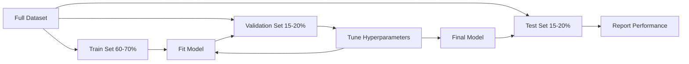

# Phân tích mô hình
# 模型评估


> Một mô hình chỉ tốt như cách bạn đo nó.

> Ưu điểm tốt của mô hình phụ thuộc vào cách bạn đo lường nó.

**Type:** Build | **类型：** 构建
**Languages:** Python
**Prerequisites:** Phase 1 (Probability & Distributions, Statistics for ML), Phase 2 Lessons 1-8 | **前置知识：** Phase 1（概率与分布、统计学），Phase 2 第 1-8 课
**Time:** ~90 minutes | **时间：** 约 90 分钟

## Mục tiêu học tập

- Thực hiện xác thực chéo gấp K và gấp K cấp tính từ đầu và giải thích lý do tại sao phân cấp quan trọng đối với dữ liệu không cân bằng
  Từ thực hiện K 折和分层 K 折交叉验证, giải thích tại sao phân层 đối với dữ liệu không cân bằng rất quan trọng
- Xét chính xác, thu hồi, F1, AUC-ROC và các chỉ số hồi quy (MSE, RMSE, MAE, R-quad) từ đầu
  Từ zero tính toán xác định tỷ lệ, tỷ lệ triệu hồi, F1 AUC-ROC và chỉ số quay lại (MSE, RMSE, MAE, R-quad)
- Giải thích đường cong học tập để chẩn đoán liệu mô hình có bị thiên vị cao hay sự khác biệt cao hay không
  解释 đường cong học để xác định mô hình có sự khác biệt cao hoặc cao
- Xác định các lỗi đánh giá phổ biến bao gồm rò rỉ dữ liệu, lựa chọn số liệu sai lầm và ô nhiễm thiết bị thử nghiệm
  识别常见评估错误, bao gồm data leakage, 错误标识选择和测试集污染


> **【中文解读】**
> 模型评估回答模型到底好不好──准确率、精确率、召回率、F1、AUC-ROC là phân类指标;MSE、MAE、R^2 là trở lại chỉ số──交叉验证防止过拟评估──sklearn 中的 cross_val_score/classification_report──

> **【拓展：模型评估失误导致的生产事故】**
> Amazon tuyển dụng AI  công cụ do đánh giá không đầy đủ (không đánh giá trên dữ liệu đào tạo mà không phải thử nghiệm độc lập) dẫn đến phân biệt đối xử hệ thống đối với các ứng cử viên nữ, cuối cùng bị ép buộc phải hạ架.

## Vấn đề  vấn đề giới thiệu

Bạn đã đào tạo một mô hình, nó có độ chính xác 95% trên dữ liệu của bạn.

> Bạn đã đào tạo một mô hình. Nó có được 95% độ chính xác trên dữ liệu của bạn.

Có thể. Có thể không. Nếu 95% dữ liệu của bạn thuộc về một lớp, một mô hình luôn dự đoán lớp đó có độ chính xác 95% trong khi hoàn toàn vô dụng. Nếu bạn đánh giá trên cùng một dữ liệu mà bạn đã đào tạo, số 95% là vô nghĩa bởi vì mô hình chỉ ghi nhớ câu trả lời. Nếu bộ dữ liệu của bạn có một thành phần thời gian và bạn ngẫu nhiên trộn trước khi chia, mô hình của bạn có thể sử dụng dữ liệu trong tương lai để dự đoán quá khứ.

> Có lẽ tốt, có lẽ không tốt. Nếu 95% dữ liệu thuộc một loại, luôn dự đoán mô hình của loại đó đạt được tỷ lệ chính xác 95% nhưng hoàn toàn vô dụng. Nếu bạn đánh giá trên dữ liệu đã được đào tạo, 95% số này không có ý nghĩa, bởi vì mô hình chỉ nhớ câu trả lời. Nếu tập dữ liệu của bạn có thành phần thời gian và bạn đang phân chia trước khi rối loạn, mô hình của bạn có thể sử dụng dữ liệu dự đoán quá khứ trong tương lai.

Phân tích mô hình là nơi mà hầu hết các dự án ML sai. Métric sai khiến mô hình xấu trông tốt. Phân tích sai khiến mô hình lừa dối. So sánh sai khiến bạn chọn mô hình tồi tệ hơn. Việc đánh giá đúng không phải là tùy chọn. Đó là sự khác biệt giữa mô hình hoạt động trong sản xuất và mô hình thất bại ngay khi nó nhìn thấy dữ liệu thực.

> Ưu điểm của mô hình là nơi mà hầu hết các dự án ML đều sai lầm. Ưu điểm sai lầm làm cho mô hình xấu trông tốt. Ưu điểm sai lầm làm cho mô hình bị lừa. Ưu điểm sai lầm khiến bạn chọn mô hình tồi hơn. Ưu điểm đúng không phải là lựa chọn có thể chọn.

> **【中文解读】**
> 模型评估最容易犯三错误: 1) 模型仅记得答案; 2) 模型评估在训练数据上; 2) 模型评估在训练数据上; 2) 模型评估在训练数据上; 2) 模型评估在训练数据上; 2) 模型评估在训练数据上; 2) 模型评估在训练数据上; 2) 模型评估在训练数据上; 2) 模型评估在训练数据上; 2) 模型评估在训练数据上; 2) 模型评估在训练数据上; 2) 模型评估在训练数据上; 2) 模型评估在训练数据上; 1) 模型评估在训练数据上; 1) 模型仅记得答案; 2) 模型评估在训练数据上; 2) 模型评估在训练过程中; 3) 模型测试数据泄漏; 3) 测试集信息泄漏到训练过程中; 3) 模型评估需要独立的数据分分分; 模型仅记住答案; 2) 模型仅记住答案; 2) 模型仅记住答案; 2) 模型记得答案; 2) 模型记得答案; 2) 模型记得答案; 3) 测试数据泄漏数据的数据泄漏; 3) 测试数据泄漏; 3) 测试数据泄漏数据的数据的数据的数据的数据的数据的数据的数据的数据的数据的数据的数据的数据的数据的数据需要是可靠的数据的数据的数据;

## Khái niệm cốt lõi

### Đào tạo, xác nhận, kiểm tra



Ba phần, ba mục đích:

> 三种划分,三种用途:

- **Training set**: mô hình học hỏi từ dữ liệu này. Nó nhìn thấy những ví dụ này trong quá trình đào tạo.
  **训练集**Mô hình từ trung học.
- **Validation set**Các mô hình không bao giờ tập trung vào dữ liệu này, nhưng các quyết định của bạn bị ảnh hưởng bởi nó.
  **验证集**: được sử dụng để điều chỉnh siêu số và trong mô hình lựa chọn. mô hình không bao giờ tập luyện trên dữ liệu này, nhưng quyết định của bạn bị ảnh hưởng.
- **Test set**: được chạm vào chính xác một lần, ngay vào cuối, để báo cáo hiệu suất cuối cùng. Nếu bạn nhìn vào hiệu suất thử nghiệm và sau đó quay lại thay đổi mô hình của bạn, nó không còn là một bộ thử nghiệm. Nó đã trở thành một bộ xác thực thứ hai.
  **测试集**Trong lần cuối cùng chỉ chạm vào một lần, báo cáo hiệu suất cuối cùng. Nếu bạn xem hiệu suất thử nghiệm sau đó quay lại sửa đổi mô hình, nó sẽ không còn là tập hợp thử nghiệm nữa.

Bộ thử nghiệm là đảm bảo của bạn rằng hiệu suất được báo cáo phản ánh cách mô hình sẽ hoạt động trên dữ liệu không được nhìn thấy thực sự.

> 测试集 là bảo đảm bảo quản của bạn, đảm bảo hiệu suất của báo cáo phản ánh mô hình biểu hiện trên dữ liệu chưa được nhìn thấy thực sự.

### K-Fold Cross-Validation

Với các bộ dữ liệu nhỏ, một chuyến tàu/tác dụng phân chia dữ liệu thải và cung cấp ước tính tiếng ồn.

> Đối với tập dữ liệu nhỏ, đơn lần đào tạo/thiết nghiệm phân chia phí dữ liệu và đưa ra ước tính tiếng ồn.

```mermaid
flowchart TB
    subgraph Fold1["Fold 1"]
        direction LR
        V1["Val"] --- T1a["Train"] --- T1b["Train"] --- T1c["Train"] --- T1d["Train"]
    end
    subgraph Fold2["Fold 2"]
        direction LR
        T2a["Train"] --- V2["Val"] --- T2b["Train"] --- T2c["Train"] --- T2d["Train"]
    end
    subgraph Fold3["Fold 3"]
        direction LR
        T3a["Train"] --- T3b["Train"] --- V3["Val"] --- T3c["Train"] --- T3d["Train"]
    end
    subgraph Fold4["Fold 4"]
        direction LR
        T4a["Train"] --- T4b["Train"] --- T4c["Train"] --- V4["Val"] --- T4d["Train"]
    end
    subgraph Fold5["Fold 5"]
        direction LR
        T5a["Train"] --- T5b["Train"] --- T5c["Train"] --- T5d["Train"] --- V5["Val"]
    end
    Fold1 --> R["Average scores"]
    Fold2 --> R
    Fold3 --> R
    Fold4 --> R
    Fold5 --> R
```



1. Chia dữ liệu thành các gấp K cùng kích thước
   chia dữ liệu thành K 个大相等折
2. Đối với mỗi gấp, tập trung trên gấp K-1 và xác nhận trên gấp còn lại
   Đối với mỗi lần, trong K-1 折 training, trong còn lại 折 折 验证
3. Tỷ lệ trung bình điểm xác thực K
   Đối với K 个验证分数取平均

K=5 hoặc K=10 là các lựa chọn tiêu chuẩn. Mỗi điểm dữ liệu được sử dụng để xác nhận chính xác một lần. Điểm trung bình là một ước tính ổn định hơn so với bất kỳ phân chia đơn lẻ nào.

> K=5 hoặc K=10 là tiêu chuẩn lựa chọn. Mỗi điểm dữ liệu được sử dụng để xác minh một lần.

> K=5 hoặc K=10 là tiêu chuẩn lựa chọn. Mỗi điểm dữ liệu được sử dụng để xác minh một lần.

**Stratified K-fold**: giữ phân phối lớp trong mỗi gấp. Nếu tập dữ liệu của bạn là 70% lớp A và 30% lớp B, mỗi gấp sẽ có tỷ lệ tương tự. Điều này quan trọng đối với tập dữ liệu không cân bằng nơi phân chia ngẫu nhiên có thể đưa tất cả các mẫu thiểu số vào một gấp.

> **分层 K 折**Nếu tập hợp dữ liệu của bạn là 70% A và 30% B, mỗi tập hợp dữ liệu sẽ có tỷ lệ tương tự.

> **分层 K 折**Nếu tập hợp dữ liệu là 70% 类 A và 30% 类 B, mỗi tập hợp dữ liệu sẽ có tỷ lệ tương tự gần như nhau.

### Các số liệu phân loại

**Confusion matrix**: nền tảng. Đối với phân loại nhị phân:

> **混淆矩阵**: cơ sở:

> **混淆矩阵**: cơ sở:

|  | Predicted Positive | Predicted Negative |
|--|---|---|
| Actually Positive | True Positive (TP) | False Negative (FN) |
| Actually Negative | False Positive (FP) | True Negative (TN) |

Từ matrix này, tất cả các số liệu khác theo sau:

> Từ mô hình này, tất cả các chỉ số khác:

> Từ trong mô hình này, tất cả các chỉ số khác được đưa ra bởi:

- **Accuracy**= (TP + TN) / (TP + TN + FP + FN). Phân tích dự đoán chính xác.
  **准确率**= (TP + TN) / (TP + TN + FP + FN)。正确预测的比例──类别不平衡时具有误导性──
- **Precision**= TP / (TP + FP). Trong tất cả những điều dự đoán tích cực, có bao nhiêu thực sự là? Sử dụng khi tích cực sai đắt tiền (ví dụ, bộ lọc spam đánh dấu email thực là spam).
  **精确率**= TP / (TP + FP) ―― trong tất cả các dự đoán cho đúng mẫu, có bao nhiêu thực tế cho đúng?
- **Recall**(sự nhạy cảm) = TP / (TP + FN). Trong tất cả các tích cực thực tế, chúng tôi đã bắt được bao nhiêu? Sử dụng khi tiêu cực sai đắt tiền (ví dụ, sàng lọc ung thư thiếu khối u).
  **召回率**(sensitivity) = TP / (TP + FN) ⋅ Trong tất cả các mẫu thực tế, chúng ta đã bắt được bao nhiêu?
- **F1 score**= 2 * độ chính xác * nhớ lại / ( độ chính xác + nhớ lại).
  **F1 分数**= 2 * 精确率 * 召回率 / (精确率 + 召回率) ⋅精确率和召回率调和平均── trong hai đều không rõ ràng chiếm ưu thế trong thời gian cân bằng hai người──
- **AUC-ROC**: Ánh vực dưới đường cong đặc điểm hoạt động của máy nhận. Hình ảnh tỷ lệ tích cực thực so với tỷ lệ tích cực sai tại các ngưỡng phân loại khác nhau. AUC = 0.5 có nghĩa là đoán ngẫu nhiên, AUC = 1.0 có nghĩa là tách biệt hoàn hảo. Thâm giới độc lập: nó đo mức độ tốt mô hình xếp hạng tích cực trên tiêu cực, bất kể bạn chọn cắt giảm.
  **AUC-ROC**:ROC 曲线下面积──在不同分类值下绘制真率和假正率──AUC = 0.5 表示随机猜测,AUC = 1.0 表示完美区分──与值无关:它衡量模型将正样本排在负样本前面的能力,无论你选择什么截值──

### Tỷ lệ trôi trôi

- **MSE**(Mức độ lỗi bình phương) = trung bình y_true - y_pred) ^2). Chống phạt lỗi lớn theo hình vuông. Nhận thức các điểm ngoại lệ.
  **均方误差 (MSE)**= mean(((y_true - y_pred) ^2)。
- **RMSE**(Rot Mean Square Error) = sqrt(MSE). cùng đơn vị với biến mục tiêu. dễ giải thích hơn MSE.
  **均方根误差 (RMSE)**= m m m m m m m m m m m m m m m m m m m m m m m m m m m m m m m m m m m m m m m m m m m m m m m m m m m m m m m m m m m m m m m m m m m m m m m m m m m m m m m m m m m m m m m m m m m m m m m m m m m m m m m m m m m m m m m m m m m m m m m m m m m m m m m m m m m m m m m m m m m m m m m m m m m m m m m m m m m m m m m m m m m m m m m m m m m m m m m m m m m m m m m m m m m m m m m m m m m m m m m m m m m m m m m m m m m m m m m m m m m m m m m m m m m m m m m m m m m m m m m m m m m m m m m m m m m m m m m m m m m m m m m m m m m m m m m m m m m m m m m m m m m m m m m m m m m m m m m m m m m m m m m m m m m m m m m m m m m m m m m m m m m m m m m m m m m m m m m m m m m m m m m m m m m m m m m m m m m m m m m m m m m m m m m m m m m m m m m m m m m m m m m m m m m m m m m m m m m m m m m m m m m m m m m m m m m m m m m m m m m m m m m m m m m m m m m m m m m m m m m m m m m m m m m m m m m m m m m m m m m m m m m m m m m m m m m m m m m m m m m m m m m m m m m m m m m m m m m m m m m m m m m m m m m m m
- **MAE**(Mức độ lỗi tuyệt đối) = trung bình của sự thật - y_pred = = = = = = = = = = = = = = = = = = = = = = = = = = = = = = = = = = = = = = = = = = = = = = = = = = = = = = = = = = = = = = = = = = = = = = = = = = = = = = = = = = = = = = = = = = = = = = = = = = = = = = = = = = = = = = = = = = = = = = = = = = = = = = = = = = = = = = = = = = = = = = = = = = = = = = = = = = = = = = = = = = = = = = = = = = = = = = = = = = = = = = = = = = = = = = = = = = = = = = = = = = = = = = = = = = = = = = = = = = = = = = = = = = = = = = = = = = = = = = = = = = = = = = = = = = = = = = = = = = = = = = = = = = = = = = = = = = = = = = = = = = = = = = = = = = = = = = = = = = = = = = = = = = = = = = = = = = = = = = = = = = = = = = = = = = = = = = = = = = = = = = = = = = = = = = = = = = = = = = = = = = = = = = = = = = = = = = = = = = = = = = = = = = = = = = = = = = = = = = = = = = = = = = = = = = = = = = = = = = = = = = = = = = = = = = = = = = = = = = = = = = = = = = = = = = = = = = = = = = = = = = = = = = = = = = = = = = = = = = = = = = = = = = = = = = = =
  **平均绝对误差 (MAE)**= trung bình của các thông tin - y_previous)
- **R-squared**= 1 - SS_res / SS_tot, nơi SS_res = tổng hợp((y_true - y_pred) ^2) và SS_tot = tổng hợp(((y_true - y_mean) ^2).
  **决定系数 (R-squared)**= 1 - SS_res / SS_tot, trong đó SS_res = tổng hợp(((y_true - y_pred) ^2),SS_tot = tổng hợp(((y_true - y_mean) ^2)。模型解释方差比例──R^2 = 1.0 完美──R^2 = 0.0 表示模型不比始终预测平均值好──R^2 可以为负,如果模型比预测平均值还差──

### Lập trình học tập

Điểm đào tạo và xác nhận các đoạn như một tính năng của kích thước tập hợp đào tạo:

>  vẽ tập số và kiểm tra số theo các đường cong của tập số lớn thay đổi:

> Để vẽ các hàm lớn của tập hợp đào tạo:

- **High bias (underfitting)**Các đường cong này sẽ hội tụ với điểm số thấp.
  **高偏差（欠拟合）**:                                                                                                                                                                                                                                                               
- **High variance (overfitting)**Các điểm đào tạo cao nhưng điểm xác nhận thấp hơn nhiều.
  **高方差（过拟合）**Số điểm đào tạo cao nhưng số điểm kiểm tra thấp hơn rất nhiều.

### Các đường cong xác nhận

Điểm đào tạo và xác nhận các đoạn như một chức năng của một siêu tham số:

>  vẽ tập luyện số và chứng nhận số với các biến thể siêu参数:

> Phân tích tập luyện và kiểm tra số như là biểu tượng của siêu tham số:

- Với độ phức tạp thấp: cả hai điểm là thấp (không phù hợp)
  复杂度低时:两个分数都低(欠拟合)
- Với độ phức tạp đúng: cả hai điểm là cao và gần nhau
  复杂度合适时: 2分数 đều cao và gần
- Ở độ phức tạp cao: điểm đào tạo vẫn cao nhưng điểm xác thực giảm (tăng độ)
  复杂度高时: Training分数保持高但验证分数下降(过拟合)

Giá trị siêu tham số tối ưu là nơi điểm xác thực đạt đỉnh điểm.

> Giá trị siêu tối ưu là vị trí mà số lượng xác minh đạt đến đỉnh.

> Giá trị siêu tối ưu là vị trí mà số lượng xác minh đạt đến đỉnh.

### Những sai lầm đánh giá phổ biến

**Data leakage**Ví dụ: lắp đặt một bộ quy mô trên toàn bộ bộ dữ liệu trước khi chia, bao gồm dữ liệu trong tương lai trong dự đoán chuỗi thời gian, sử dụng một tính năng được lấy từ mục tiêu.

> **数据泄漏**Ví dụ: trong phân chia trước cho bộ cỡ dữ liệu phù hợp với bộ cỡ nhỏ hơn, trong dự đoán chuỗi thời gian bao gồm dữ liệu trong tương lai, sử dụng các đặc điểm của sinh vật từ mục tiêu.

**Class imbalance**99% giao dịch là hợp pháp, 1% là gian lận. Một mô hình luôn dự đoán " hợp pháp" có độ chính xác 99%. Sử dụng độ chính xác, thu hồi, F1, hoặc AUC-ROC thay vào đó.

> **类别不平衡**:99% giao dịch là hợp pháp, 1% là lừa đảo.

**Wrong metric**: tối ưu hóa độ chính xác khi bạn nên tối ưu hóa việc thu hồi (chẩn đoán y tế), hoặc tối ưu hóa RMSE khi dữ liệu của bạn có mức ngoại lệ nặng (chỉ sử dụng MAE thay vào đó).

> **错误指标**:                                                                                                                                                                                                                                                               

**Not using stratified splits**: với dữ liệu không cân bằng, một phân chia ngẫu nhiên có thể đưa rất ít mẫu thiểu số trong gấp xác thực, đưa ra ước tính không ổn định.

> **不使用分层划分**Đối với dữ liệu không cân bằng, bất cứ khi nào phân chia có thể sẽ rất ít các loại mẫu được đưa vào chứng nhận, cho phép ước tính không ổn định.

**Testing too often**: mỗi khi bạn xem xét hiệu suất thử nghiệm và điều chỉnh, bạn overfit với bộ thử nghiệm.

> **测试过于频繁**Mỗi lần xem test performance đều được điều chỉnh, bạn đã được chuẩn bị cho test set.

## Hãy xây dựng nó.

> **【中文解读】**
> Từ zero thực hiện giao thông chứng minh (K-fold 和分层 K-fold) 分类指标 (精确率,召回率,F1、AUC-ROC) 和归归指标 (MSE、RMSE、MAE、R2) 交叉验证 là phương pháp tiêu chuẩn để đánh giá tính chất mô hình, phân cấp K-fold  đảm bảo tỷ lệ phân loại trong mỗi折合 phù hợp, đối với dữ liệu không cân bằng rất quan trọng.

> **【拓展：学习曲线——诊断模型问题的利器】**
> Học đường cong học tập (Learning Curve) vẽ sai lầm và sai lầm xác minh với xu hướng thay đổi lượng dữ liệu của tập, là công cụ trực tiếp để chẩn đoán sự khác biệt cao/sự khác biệt cao.
```figure
precision-recall-threshold
```

## Hãy xây dựng nó

### Bước 1: Đường/Validation/Test split

```python
import random
import math


def train_val_test_split(X, y, train_ratio=0.6, val_ratio=0.2, seed=42):
    random.seed(seed)
    n = len(X)
    indices = list(range(n))
    random.shuffle(indices)

    train_end = int(n * train_ratio)
    val_end = int(n * (train_ratio + val_ratio))

    train_idx = indices[:train_end]
    val_idx = indices[train_end:val_end]
    test_idx = indices[val_end:]

    X_train = [X[i] for i in train_idx]
    y_train = [y[i] for i in train_idx]
    X_val = [X[i] for i in val_idx]
    y_val = [y[i] for i in val_idx]
    X_test = [X[i] for i in test_idx]
    y_test = [y[i] for i in test_idx]

    return X_train, y_train, X_val, y_val, X_test, y_test
```

### Bước 2: K-fold và layered K-fold cross-validation

```python
def kfold_split(n, k=5, seed=42):
    random.seed(seed)
    indices = list(range(n))
    random.shuffle(indices)

    fold_size = n // k
    folds = []

    for i in range(k):
        start = i * fold_size
        end = start + fold_size if i < k - 1 else n
        val_idx = indices[start:end]
        train_idx = indices[:start] + indices[end:]
        folds.append((train_idx, val_idx))

    return folds


def stratified_kfold_split(y, k=5, seed=42):
    random.seed(seed)

    class_indices = {}
    for i, label in enumerate(y):
        class_indices.setdefault(label, []).append(i)

    for label in class_indices:
        random.shuffle(class_indices[label])

    folds = [{"train": [], "val": []} for _ in range(k)]

    for label, indices in class_indices.items():
        fold_size = len(indices) // k
        for i in range(k):
            start = i * fold_size
            end = start + fold_size if i < k - 1 else len(indices)
            val_part = indices[start:end]
            train_part = indices[:start] + indices[end:]
            folds[i]["val"].extend(val_part)
            folds[i]["train"].extend(train_part)

    return [(f["train"], f["val"]) for f in folds]


def cross_validate(X, y, model_fn, k=5, metric_fn=None, stratified=False):
    n = len(X)

    if stratified:
        folds = stratified_kfold_split(y, k)
    else:
        folds = kfold_split(n, k)

    scores = []
    for train_idx, val_idx in folds:
        X_train = [X[i] for i in train_idx]
        y_train = [y[i] for i in train_idx]
        X_val = [X[i] for i in val_idx]
        y_val = [y[i] for i in val_idx]

        model = model_fn()
        model.fit(X_train, y_train)
        predictions = [model.predict(x) for x in X_val]

        if metric_fn:
            score = metric_fn(y_val, predictions)
        else:
            score = sum(1 for yt, yp in zip(y_val, predictions) if yt == yp) / len(y_val)
        scores.append(score)

    return scores
```

### Bước 3: Các số liệu phân loại và các số liệu phân phối sự nhầm lẫn

> Bước 3:混矩阵和分类指标. Từ zero thực hiện TP/TN/FP/FN 计数, tái đưa ra tỷ lệ xác thực, tỷ lệ xác thực, tỷ lệ triệu hồi, F1。ROC 曲线扫描所有可能值,记录每点的 (FPR, TPR),AUC là 曲线下面积 (AUC là 曲线下面积)

```python
def confusion_matrix(y_true, y_pred):
    tp = sum(1 for yt, yp in zip(y_true, y_pred) if yt == 1 and yp == 1)
    tn = sum(1 for yt, yp in zip(y_true, y_pred) if yt == 0 and yp == 0)
    fp = sum(1 for yt, yp in zip(y_true, y_pred) if yt == 0 and yp == 1)
    fn = sum(1 for yt, yp in zip(y_true, y_pred) if yt == 1 and yp == 0)
    return tp, tn, fp, fn


def accuracy(y_true, y_pred):
    tp, tn, fp, fn = confusion_matrix(y_true, y_pred)
    total = tp + tn + fp + fn
    return (tp + tn) / total if total > 0 else 0.0


def precision(y_true, y_pred):
    tp, tn, fp, fn = confusion_matrix(y_true, y_pred)
    return tp / (tp + fp) if (tp + fp) > 0 else 0.0


def recall(y_true, y_pred):
    tp, tn, fp, fn = confusion_matrix(y_true, y_pred)
    return tp / (tp + fn) if (tp + fn) > 0 else 0.0


def f1_score(y_true, y_pred):
    p = precision(y_true, y_pred)
    r = recall(y_true, y_pred)
    return 2 * p * r / (p + r) if (p + r) > 0 else 0.0


def roc_curve(y_true, y_scores):
    thresholds = sorted(set(y_scores), reverse=True)
    tpr_list = []
    fpr_list = []

    total_positives = sum(y_true)
    total_negatives = len(y_true) - total_positives

    for threshold in thresholds:
        y_pred = [1 if s >= threshold else 0 for s in y_scores]
        tp = sum(1 for yt, yp in zip(y_true, y_pred) if yt == 1 and yp == 1)
        fp = sum(1 for yt, yp in zip(y_true, y_pred) if yt == 0 and yp == 1)

        tpr = tp / total_positives if total_positives > 0 else 0.0
        fpr = fp / total_negatives if total_negatives > 0 else 0.0

        tpr_list.append(tpr)
        fpr_list.append(fpr)

    return fpr_list, tpr_list, thresholds


def auc_roc(y_true, y_scores):
    fpr_list, tpr_list, _ = roc_curve(y_true, y_scores)

    pairs = sorted(zip(fpr_list, tpr_list))
    fpr_sorted = [p[0] for p in pairs]
    tpr_sorted = [p[1] for p in pairs]

    area = 0.0
    for i in range(1, len(fpr_sorted)):
        width = fpr_sorted[i] - fpr_sorted[i - 1]
        height = (tpr_sorted[i] + tpr_sorted[i - 1]) / 2
        area += width * height

    return area
```

### Bước 4: Các số liệu lùi

> 第四步:归归指标──MSE(均方差) đối với big error二次惩罚、敏感于异常值;RMSE与目标单位一致便于解释;MAE(平均绝对误差) 线性处理、对异常值鲁棒;R2(决定系数) = 1 -残差平方和 / 总平方和,表示模型解释了多少方差──

```python
def mse(y_true, y_pred):
    n = len(y_true)
    return sum((yt - yp) ** 2 for yt, yp in zip(y_true, y_pred)) / n


def rmse(y_true, y_pred):
    return math.sqrt(mse(y_true, y_pred))


def mae(y_true, y_pred):
    n = len(y_true)
    return sum(abs(yt - yp) for yt, yp in zip(y_true, y_pred)) / n


def r_squared(y_true, y_pred):
    mean_y = sum(y_true) / len(y_true)
    ss_res = sum((yt - yp) ** 2 for yt, yp in zip(y_true, y_pred))
    ss_tot = sum((yt - mean_y) ** 2 for yt in y_true)
    if ss_tot == 0:
        return 0.0
    return 1.0 - ss_res / ss_tot
```

### Bước 5: Lập trình học tập

> 第五步:学习曲线──逐步增加训练数据量,记录训练分数和验证分数──两条曲线都低→高偏差(缺拟合);训练高但验证低→高方差(过拟合)── đây là công cụ trực tiếp nhất của vấn đề mô hình chẩn đoán──

```python
def learning_curve(X, y, model_fn, metric_fn, train_sizes=None, val_ratio=0.2, seed=42):
    random.seed(seed)
    n = len(X)
    indices = list(range(n))
    random.shuffle(indices)

    val_size = int(n * val_ratio)
    val_idx = indices[:val_size]
    pool_idx = indices[val_size:]

    X_val = [X[i] for i in val_idx]
    y_val = [y[i] for i in val_idx]

    if train_sizes is None:
        train_sizes = [int(len(pool_idx) * r) for r in [0.1, 0.2, 0.4, 0.6, 0.8, 1.0]]

    train_scores = []
    val_scores = []

    for size in train_sizes:
        subset = pool_idx[:size]
        X_train = [X[i] for i in subset]
        y_train = [y[i] for i in subset]

        model = model_fn()
        model.fit(X_train, y_train)

        train_pred = [model.predict(x) for x in X_train]
        val_pred = [model.predict(x) for x in X_val]

        train_scores.append(metric_fn(y_train, train_pred))
        val_scores.append(metric_fn(y_val, val_pred))

    return train_sizes, train_scores, val_scores
```

### Bước 6: Một trình phân loại đơn giản để thử nghiệm, cộng với bản demo đầy đủ

> 第六步: Một đơn giản logic regression phân loại, dùng để kiểm tra đánh giá mã.

```python
class SimpleLogistic:
    def __init__(self, lr=0.1, epochs=100):
        self.lr = lr
        self.epochs = epochs
        self.weights = None
        self.bias = 0.0

    def sigmoid(self, z):
        z = max(-500, min(500, z))
        return 1.0 / (1.0 + math.exp(-z))

    def fit(self, X, y):
        n_features = len(X[0])
        self.weights = [0.0] * n_features
        self.bias = 0.0

        for _ in range(self.epochs):
            for xi, yi in zip(X, y):
                z = sum(w * x for w, x in zip(self.weights, xi)) + self.bias
                pred = self.sigmoid(z)
                error = yi - pred
                for j in range(n_features):
                    self.weights[j] += self.lr * error * xi[j]
                self.bias += self.lr * error

    def predict_proba(self, x):
        z = sum(w * xi for w, xi in zip(self.weights, x)) + self.bias
        return self.sigmoid(z)

    def predict(self, x):
        return 1 if self.predict_proba(x) >= 0.5 else 0


class SimpleLinearRegression:
    def __init__(self, lr=0.001, epochs=200):
        self.lr = lr
        self.epochs = epochs
        self.weights = None
        self.bias = 0.0

    def fit(self, X, y):
        n_features = len(X[0])
        self.weights = [0.0] * n_features
        self.bias = 0.0
        n = len(X)

        for _ in range(self.epochs):
            for xi, yi in zip(X, y):
                pred = sum(w * x for w, x in zip(self.weights, xi)) + self.bias
                error = yi - pred
                for j in range(n_features):
                    self.weights[j] += self.lr * error * xi[j] / n
                self.bias += self.lr * error / n

    def predict(self, x):
        return sum(w * xi for w, xi in zip(self.weights, x)) + self.bias


def standardize(values):
    n = len(values)
    mean = sum(values) / n
    var = sum((v - mean) ** 2 for v in values) / n
    std = math.sqrt(var) if var > 0 else 1.0
    return [(v - mean) / std for v in values], mean, std


def make_classification_data(n=300, seed=42):
    random.seed(seed)
    X = []
    y = []
    for _ in range(n):
        x1 = random.gauss(0, 1)
        x2 = random.gauss(0, 1)
        label = 1 if (x1 + x2 + random.gauss(0, 0.5)) > 0 else 0
        X.append([x1, x2])
        y.append(label)
    return X, y


def make_regression_data(n=200, seed=42):
    random.seed(seed)
    X = []
    y = []
    for _ in range(n):
        x1 = random.uniform(0, 10)
        x2 = random.uniform(0, 5)
        target = 3 * x1 + 2 * x2 + random.gauss(0, 2)
        X.append([x1, x2])
        y.append(target)
    return X, y


def make_imbalanced_data(n=300, minority_ratio=0.05, seed=42):
    random.seed(seed)
    X = []
    y = []
    for _ in range(n):
        if random.random() < minority_ratio:
            x1 = random.gauss(3, 0.5)
            x2 = random.gauss(3, 0.5)
            label = 1
        else:
            x1 = random.gauss(0, 1)
            x2 = random.gauss(0, 1)
            label = 0
        X.append([x1, x2])
        y.append(label)
    return X, y


if __name__ == "__main__":
    X_clf, y_clf = make_classification_data(300)

    print("=== Train/Validation/Test Split ===")
    X_train, y_train, X_val, y_val, X_test, y_test = train_val_test_split(X_clf, y_clf)
    print(f"  Train: {len(X_train)}, Val: {len(X_val)}, Test: {len(X_test)}")
    print(f"  Train class distribution: {sum(y_train)}/{len(y_train)} positive")
    print(f"  Val class distribution: {sum(y_val)}/{len(y_val)} positive")

    # 主程序：完整演示训练/验证/测试划分、分类指标（含混淆矩阵、F1、AUC-ROC）、K 折交叉验证、回归指标（MSE/RMSE/MAE/R²）、学习曲线、不平衡数据评估。每个环节都展示具体数值，让评估方法变得具体。

    model = SimpleLogistic(lr=0.1, epochs=200)
    model.fit(X_train, y_train)

    print("\n=== Classification Metrics ===")
    y_pred = [model.predict(x) for x in X_test]
    tp, tn, fp, fn = confusion_matrix(y_test, y_pred)
    print(f"  Confusion matrix: TP={tp}, TN={tn}, FP={fp}, FN={fn}")
    print(f"  Accuracy:  {accuracy(y_test, y_pred):.4f}")
    print(f"  Precision: {precision(y_test, y_pred):.4f}")
    print(f"  Recall:    {recall(y_test, y_pred):.4f}")
    print(f"  F1 Score:  {f1_score(y_test, y_pred):.4f}")

    y_scores = [model.predict_proba(x) for x in X_test]
    auc = auc_roc(y_test, y_scores)
    print(f"  AUC-ROC:   {auc:.4f}")

    print("\n=== K-Fold Cross-Validation (K=5) ===")
    cv_scores = cross_validate(
        X_clf, y_clf,
        model_fn=lambda: SimpleLogistic(lr=0.1, epochs=200),
        k=5,
        metric_fn=accuracy,
    )
    mean_cv = sum(cv_scores) / len(cv_scores)
    std_cv = math.sqrt(sum((s - mean_cv) ** 2 for s in cv_scores) / len(cv_scores))
    print(f"  Fold scores: {[round(s, 4) for s in cv_scores]}")
    print(f"  Mean: {mean_cv:.4f} (+/- {std_cv:.4f})")

    print("\n=== Stratified K-Fold Cross-Validation (K=5) ===")
    strat_scores = cross_validate(
        X_clf, y_clf,
        model_fn=lambda: SimpleLogistic(lr=0.1, epochs=200),
        k=5,
        metric_fn=accuracy,
        stratified=True,
    )
    strat_mean = sum(strat_scores) / len(strat_scores)
    strat_std = math.sqrt(sum((s - strat_mean) ** 2 for s in strat_scores) / len(strat_scores))
    print(f"  Fold scores: {[round(s, 4) for s in strat_scores]}")
    print(f"  Mean: {strat_mean:.4f} (+/- {strat_std:.4f})")

    print("\n=== Imbalanced Data: Why Accuracy Lies ===")
    X_imb, y_imb = make_imbalanced_data(300, minority_ratio=0.05)
    positives = sum(y_imb)
    print(f"  Class distribution: {positives} positive, {len(y_imb) - positives} negative ({positives/len(y_imb)*100:.1f}% positive)")

    always_negative = [0] * len(y_imb)
    print(f"  Always-negative baseline:")
    print(f"    Accuracy:  {accuracy(y_imb, always_negative):.4f}")
    print(f"    Precision: {precision(y_imb, always_negative):.4f}")
    print(f"    Recall:    {recall(y_imb, always_negative):.4f}")
    print(f"    F1 Score:  {f1_score(y_imb, always_negative):.4f}")

    X_tr_i, y_tr_i, X_v_i, y_v_i, X_te_i, y_te_i = train_val_test_split(X_imb, y_imb)
    model_imb = SimpleLogistic(lr=0.5, epochs=500)
    model_imb.fit(X_tr_i, y_tr_i)
    y_pred_imb = [model_imb.predict(x) for x in X_te_i]
    print(f"\n  Trained model on imbalanced data:")
    print(f"    Accuracy:  {accuracy(y_te_i, y_pred_imb):.4f}")
    print(f"    Precision: {precision(y_te_i, y_pred_imb):.4f}")
    print(f"    Recall:    {recall(y_te_i, y_pred_imb):.4f}")
    print(f"    F1 Score:  {f1_score(y_te_i, y_pred_imb):.4f}")

    print("\n=== Regression Metrics ===")
    X_reg, y_reg = make_regression_data(200)

    col0 = [x[0] for x in X_reg]
    col1 = [x[1] for x in X_reg]
    col0_s, m0, s0 = standardize(col0)
    col1_s, m1, s1 = standardize(col1)
    X_reg_scaled = [[col0_s[i], col1_s[i]] for i in range(len(X_reg))]

    X_tr_r, y_tr_r, X_v_r, y_v_r, X_te_r, y_te_r = train_val_test_split(X_reg_scaled, y_reg)
    reg_model = SimpleLinearRegression(lr=0.01, epochs=500)
    reg_model.fit(X_tr_r, y_tr_r)
    y_pred_r = [reg_model.predict(x) for x in X_te_r]

    print(f"  MSE:       {mse(y_te_r, y_pred_r):.4f}")
    print(f"  RMSE:      {rmse(y_te_r, y_pred_r):.4f}")
    print(f"  MAE:       {mae(y_te_r, y_pred_r):.4f}")
    print(f"  R-squared: {r_squared(y_te_r, y_pred_r):.4f}")

    mean_baseline = [sum(y_tr_r) / len(y_tr_r)] * len(y_te_r)
    print(f"\n  Mean baseline:")
    print(f"    MSE:       {mse(y_te_r, mean_baseline):.4f}")
    print(f"    R-squared: {r_squared(y_te_r, mean_baseline):.4f}")

    print("\n=== Learning Curve ===")
    sizes, train_sc, val_sc = learning_curve(
        X_clf, y_clf,
        model_fn=lambda: SimpleLogistic(lr=0.1, epochs=200),
        metric_fn=accuracy,
    )
    print(f"  {'Size':>6} {'Train':>8} {'Val':>8}")
    for s, tr, va in zip(sizes, train_sc, val_sc):
        print(f"  {s:>6} {tr:>8.4f} {va:>8.4f}")

    print("\n=== Statistical Model Comparison ===")
    model_a_scores = cross_validate(
        X_clf, y_clf,
        model_fn=lambda: SimpleLogistic(lr=0.1, epochs=100),
        k=5, metric_fn=accuracy,
    )
    model_b_scores = cross_validate(
        X_clf, y_clf,
        model_fn=lambda: SimpleLogistic(lr=0.1, epochs=500),
        k=5, metric_fn=accuracy,
    )
    diffs = [a - b for a, b in zip(model_a_scores, model_b_scores)]
    mean_diff = sum(diffs) / len(diffs)
    std_diff = math.sqrt(sum((d - mean_diff) ** 2 for d in diffs) / len(diffs))
    t_stat = mean_diff / (std_diff / math.sqrt(len(diffs))) if std_diff > 0 else 0.0
    print(f"  Model A (100 epochs) mean: {sum(model_a_scores)/len(model_a_scores):.4f}")
    print(f"  Model B (500 epochs) mean: {sum(model_b_scores)/len(model_b_scores):.4f}")
    print(f"  Mean difference: {mean_diff:.4f}")
    print(f"  Paired t-statistic: {t_stat:.4f}")
    print(f"  (|t| > 2.78 for significance at p<0.05 with df=4)")
```

## Hãy sử dụng nó để thực hiện

Với scikit-learn, đánh giá được tích hợp vào dòng công việc:

> Sử dụng học tập nhỏ, đánh giá nội dung trong dòng công việc:

```python
from sklearn.model_selection import cross_val_score, StratifiedKFold, learning_curve
from sklearn.metrics import (
    accuracy_score, precision_score, recall_score, f1_score,
    roc_auc_score, confusion_matrix, mean_squared_error, r2_score,
)
from sklearn.linear_model import LogisticRegression

model = LogisticRegression()
scores = cross_val_score(model, X, y, cv=StratifiedKFold(5), scoring="f1")
```

Các phiên bản từ đầu cho thấy chính xác việc xác thực chéo làm gì (không có phép thuật, chỉ là for-loops và theo dõi chỉ số), cách tính toán mỗi métric (chỉ đếm TP /FP /TN / FN), và lý do tại sao phân cấp quan trọng (giữ lại tỷ lệ lớp trong mỗi gấp).

> Từ phiên bản 0 chính xác cho thấy giao thông kiểm tra đã làm gì (((không có phép thuật, chỉ là vòng lặp và theo dõi chỉ dẫn)  mỗi chỉ số làm thế nào để tính toán ((( chỉ là tính toán TP/FP/TN/FN)  cũng như phân cấp vì sao quan trọng (( giữ tỷ lệ phân loại trong mỗi lần)  phiên bản库 tăng điệu tính, nhiều hơn các lựa chọn đánh giá và kết hợp đường ống.

## Chuyển nó đi.

Bài học này mang lại:
- `outputs/skill-evaluation.md`- một kỹ năng bao gồm chiến lược đánh giá cho các mô hình phân loại và hồi quy

> 本课产 出:
> - `outputs/skill-evaluation.md`- Khám phá kỹ năng phân loại và đánh giá chiến lược mô hình trở lại

> **【拓展：A/B 测试——模型评估的终极标准】**
> Trong ngành công nghiệp, chỉ số đánh giá trực tuyến (định确率,AUC, etc.) chỉ là tham khảo, đánh giá thực sự là A/B testing online. Google mỗi năm chạy hơn 10.000 lần A/B testing để đánh giá cải tiến thuật toán tìm kiếm.

> **【中文解读】**
> ROC 曲线绘制不同值下 TPR(真率) 相 FPR(假正率),AUC là曲线下面积(0.5=随机,1.0=完美)。AUPRC(精确率-召回率曲线下面积) 在不平衡数据上比AUC-ROC 更有信息量──MCC(马修斯相关系数) là chỉ số tổng thể trên dữ liệu không平衡, tính đến tất cả bốn trong các矩阵混值──

## Tập luyện bài tập

1. Thực hiện đường cong nhớ chính xác: độ chính xác của biểu đồ so với đường quay ở các ngưỡng khác nhau. Xét độ chính xác trung bình (vùng dưới đường cong PR). So sánh đường cong PR với đường cong ROC trên một tập dữ liệu không cân bằng và giải thích khi nào mỗi đường cong có tính thông tin hơn.
   1. 实现精确率-召回率曲线:在不同值下绘制精确率与召回率――计算平均精确率(PR 曲线下面积)――在不平衡数据集上将PR 曲线与ROC 曲线比较,解释各自何时有更多信息──
2. Xây dựng một vòng lặp xác thực chéo: vòng lặp bên ngoài đánh giá hiệu suất mô hình, vòng lặp bên trong điều chỉnh các siêu tham số. Sử dụng nó để so sánh hai mô hình một cách công bằng mà không rò rỉ dữ liệu xác thực vào đánh giá.
   2. 构建嵌套交叉验证循环:外循环评估模型性能,内循环调优超参数―― dùng nó một cách công bằng so sánh hai mô hình, không sẽ验证数据泄漏到评估中――
3. Thực hiện một thử nghiệm chuyển đổi để so sánh mô hình: trộn các nhãn, tái tập luyện và đo hiệu suất. Lặp lại 100 lần để xây dựng phân bố null. Xét giá trị p cho hiệu suất mô hình được quan sát với phân bố này.
   3. 实现模型比较的置换检验:打乱标签,重新训练,测量性能──重复 100次建立零分布──计算观测模型性能对这个分布的p 值──

## Từ khóa  Từ khóa nhanh chóng

| Term | What people say | What it actually means |
|------|----------------|----------------------|
| Overfitting | "Memorizing the training data" | The model captures noise in the training data, performing well on training but poorly on unseen data |
| Cross-validation | "Testing on different subsets" | Systematically rotating which portion of data is used for validation, averaging results across all rotations |
| Precision | "How many predicted positives are correct" | TP / (TP + FP): the fraction of positive predictions that are actually positive |
| Recall | "How many actual positives we found" | TP / (TP + FN): the fraction of actual positives that were correctly identified |
| AUC-ROC | "How well the model separates classes" | The area under the curve of true positive rate vs false positive rate across all thresholds, from 0.5 (random) to 1.0 (perfect) |
| R-squared | "How much variance is explained" | 1 - (sum of squared residuals / total sum of squares): the fraction of target variance captured by the model |
| Data leakage | "The model cheated" | Using information during training that would not be available at prediction time, leading to optimistic evaluation |
| Learning curve | "How performance changes with more data" | A plot of training and validation scores vs training set size, revealing underfitting or overfitting |
| Stratified split | "Keeping class ratios balanced" | Splitting data so each subset has the same proportion of each class as the full dataset |

## Xem thêm 延伸阅读

- [scikit-learn Model Selection Guide](https://scikit-learn.org/stable/model_selection.html)- tham khảo toàn diện về xác thực chéo, số liệu và điều chỉnh siêu tham số
  [scikit-learn 模型选择指南](https://scikit-learn.org/stable/model_selection.html)- 交叉验证、指标和超参数调优的全面参考
- [Beyond Accuracy: Precision and Recall (Google ML Crash Course)](https://developers.google.com/machine-learning/crash-course/classification/precision-and-recall)- giải thích rõ ràng với các ví dụ tương tác
  [Beyond Accuracy: Precision and Recall (Google ML Crash Course)](https://developers.google.com/machine-learning/crash-course/classification/precision-and-recall)- 带交互示例的清晰解释
- [A Survey of Cross-Validation Procedures (Arlot & Celisse, 2010)](https://projecteuclid.org/journals/statistics-surveys/volume-4/issue-none/A-survey-of-cross-validation-procedures-for-model-selection/10.1214/09-SS054.full)- xử lý nghiêm ngặt khi nào và tại sao các chiến lược CV khác nhau hoạt động
  [A Survey of Cross-Validation Procedures (Arlot & Celisse, 2010)](https://projecteuclid.org/journals/statistics-surveys/volume-4/issue-none/A-survey-of-cross-validation-procedures-for-model-selection/10.1214/09-SS054.full)- Không giống như giao dịch chứng minh chiến lược quan trọng phân tích hiệu quả
