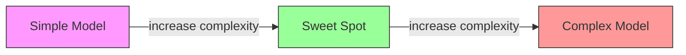
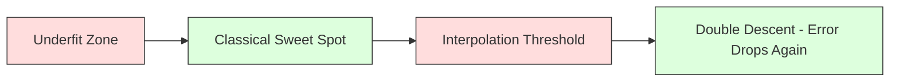
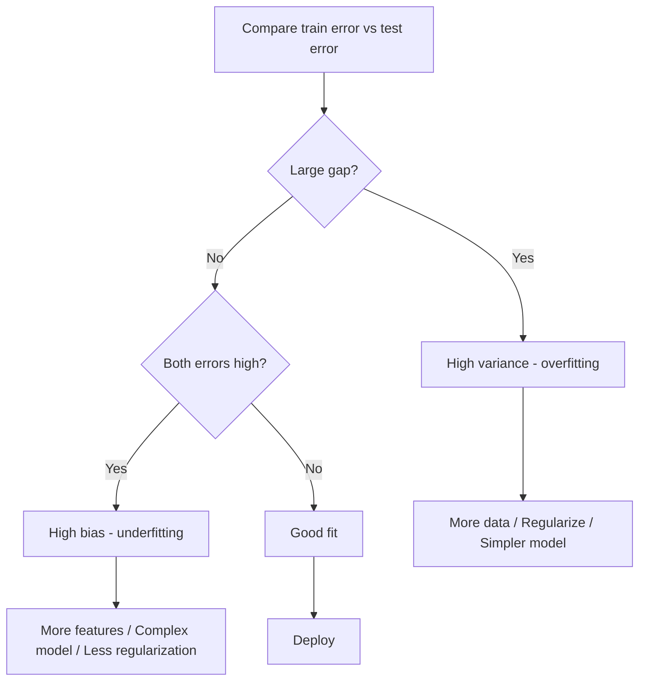
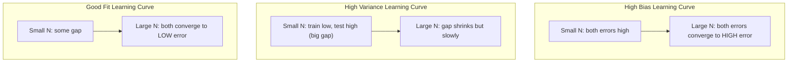
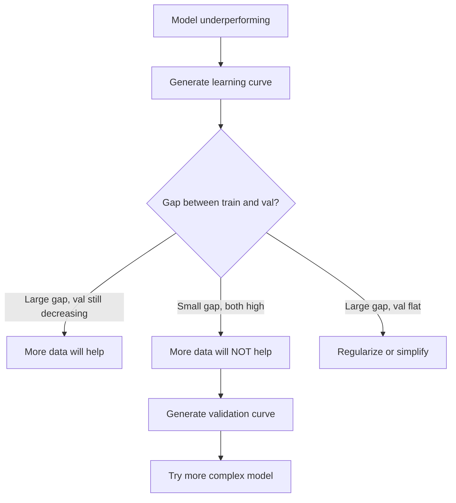

# Sự phân biệt đối xử giữa các biến thể
# 偏差-方差权衡


> Mỗi lỗi mô hình xuất phát từ một trong ba nguồn: thiên vị, biến thể, hoặc tiếng ồn. Bạn chỉ có thể kiểm soát hai nguồn đầu tiên.

> Mỗi sai lầm mô hình xuất phát từ một trong ba nguồn: sai lệch, sai lệch hoặc tiếng ồn. Bạn chỉ có thể kiểm soát hai thứ trước.

**Type:** Learn | **类型：** 学习
**Language:**Python**语言：**Python
**Prerequisites:** Phase 2, Lessons 01-09 (ML basics, regression, classification, evaluation) | **前置知识：** Phase 2 第 1-9 课（ML 基础、回归、分类、评估）
**Time:** ~75 minutes | **时间：** 约 75 分钟

## Mục tiêu học tập

- Thuộc dẫn sự phân hủy biến phân thiên vị của lỗi dự đoán dự kiến và giải thích vai trò của tiếng ồn không thể giảm
  推导期望预测 误差的偏差-方差分解, giải thích vai trò của tiếng ồn không thể giải thích
- Chẩn đoán liệu mô hình có bị thiên vị cao hay sự khác biệt cao bằng cách sử dụng các mô hình đào tạo và thử nghiệm lỗi
  Sử dụng training error và test error mode để chẩn đoán mô hình có sự khác biệt cao hay không
- Giải thích cách các kỹ thuật quy định (L1, L2, bỏ, dừng sớm) giao dịch thiên vị cho sự biến động
  解释正则化技术(L1、L2、Dropout、早停) làm thế nào để cân bằng giữa sự phân biệt và sự phân biệt
- Thực hiện các thí nghiệm hình dung sự giao dịch sự thiên vị-variance trên các mô hình phức tạp ngày càng tăng
  Thực hiện các thí nghiệm đo trọng lượng phân biệt-phân biệt khi phức tạp hóa mô hình hình hóa tăng lên


> **【中文解读】**
> 偏差 (đơn giản quá đơn giản không phù hợp) vs 方差 (đơn giản quá phức tạp quá phù hợp) 均衡 (trường hợp) ⇒正则化 (L1/L2) ✓ tăng dữ liệu ✓ giảm phức tạp của mô hình là phương tiện thường dùng  hiểu sự khác biệt-đơn trọng là cơ sở lý thuyết của调调――

> **【拓展：偏差-方差在深度学习中的新理解】**
> 经典理论认为增大模型会增加高方差,但深度学习存在"双重下降" (double descent) 现象:模型超过"插值值" (值值) (能完美记忆训练数据) 后,测试误差反而下降了. GPT-3 (值1750亿参数) 远超训练所需,但泛化性能反而更好.

## Vấn đề  vấn đề giới thiệu

Bạn đã đào tạo một mô hình có một số lỗi trong dữ liệu thử nghiệm.

> Bạn đã đào tạo một mô hình. Có một số sai lầm trong dữ liệu thử nghiệm. Những sai lầm này đến từ đâu?

Nếu mô hình của bạn quá đơn giản (sự lùi ngược tuyến tính trên một tập dữ liệu cong), nó sẽ liên tục bỏ lỡ mô hình thực sự. Đó là thiên vị. Nếu mô hình của bạn quá phức tạp (nhiều chữ số độ 20 trên 15 điểm dữ liệu), nó sẽ phù hợp hoàn hảo với dữ liệu đào tạo nhưng đưa ra dự đoán khác nhau về dữ liệu mới. Đó là sự biến đổi.

> Nếu mô hình của bạn quá đơn giản (với quay lại tuyến tính trên tập dữ liệu đường cong), nó sẽ tiếp tục lệch khỏi mô hình thực tế. Đó là sự lệch. Nếu mô hình của bạn quá phức tạp (với nhiều mô hình trên 15 điểm dữ liệu), nó sẽ hoàn hảo phù hợp với dữ liệu đào tạo nhưng trên dữ liệu mới sẽ đưa ra dự đoán khác biệt.

Bạn không thể giảm thiểu cả hai cùng một lúc cho một dung lượng mô hình cố định. đẩy thiên vị xuống và sự khác biệt tăng lên. đẩy thiên vị xuống và thiên vị tăng lên. Hiểu sự khác biệt này là kỹ năng chẩn đoán hữu ích nhất trong học máy. Nó cho bạn biết liệu bạn nên làm cho mô hình của bạn phức tạp hơn hay ít hơn, liệu bạn nên có thêm dữ liệu hay kỹ thuật các tính năng tốt hơn, hay có nên điều chỉnh nhiều hơn hay ít hơn.

> Đối với dung lượng mô hình cố định, bạn không thể tối thiểu hóa cả hai. Cơn vị thấp, tỷ lệ biến đổi tăng lên. Cơn vị thấp, tỷ lệ biến đổi tăng lên. Nghĩ trọng lượng này là kỹ năng chẩn đoán hữu ích nhất trong học máy. Nó cho bạn biết liệu mô hình nên phức tạp hơn hoặc đơn giản hơn, liệu nên có thêm dữ liệu hoặc tính năng kỹ thuật tốt hơn, liệu nên điều chỉnh nhiều hơn hoặc ít hơn.

> **【中文解读】**
> 误差 = 偏差2 + 方差 + 不可约噪声。偏差来自模型的错假设(如用直线拟合曲线), 偏差来自对训练数据波动的过度敏感──诊断方法:训练误差高+测试误差高→高偏差(不适合);训练误差低+测试误差高→高方差(过适合)── đối phó với giải pháp hoàn toàn khác nhau──

## Khái niệm cốt lõi

### Bias: Trầm lẫn hệ thống

Bias đo lường mức độ dự đoán trung bình của mô hình của bạn xa với giá trị thực. Nếu bạn đào tạo cùng một mô hình trên nhiều tập huấn khác nhau được rút ra từ cùng một phân phối và trung bình các dự đoán, thiên vị là khoảng cách giữa trung bình và sự thật.

> 偏差 đo lường sự khác biệt giữa giá trị trung bình và giá trị thực của mô hình của bạn. Nếu bạn tập luyện trên nhiều tập hợp đào tạo khác nhau được rút ra từ cùng một phân bố và kết quả dự đoán trung bình của mô hình, sự khác biệt là sự khác biệt giữa giá trị trung bình và giá trị thực.

Bias cao có nghĩa là mô hình quá cứng để ghi lại mô hình thực tế. Một đường thẳng phù hợp với một hình ngụng luôn sẽ bỏ lỡ đường cong, bất kể bạn đưa ra bao nhiêu dữ liệu. Điều này là không phù hợp.

> Sự phân biệt cao có nghĩa là mô hình quá quá  hóa, không thể nắm bắt mô hình thực tế.

```
High bias (underfitting):
  Model always predicts roughly the same wrong thing.
  Training error: HIGH
  Test error: HIGH
  Gap between them: SMALL
```

### Sự biến thể: Nhận thức dữ liệu đào tạo

Sự biến động đo lường mức độ dự đoán của bạn thay đổi khi bạn tập luyện trên các bộ phụ dữ liệu khác nhau. Nếu những thay đổi nhỏ trong bộ tập luyện gây ra những thay đổi lớn trong mô hình, sự biến động cao.

> 方差 đo lường mức độ thay đổi kết quả dự đoán khi bạn tập trên các tập dữ liệu khác nhau. Nếu những thay đổi nhỏ trong tập dữ liệu dẫn đến sự thay đổi lớn trong mô hình, thì khoảng cách rất cao.

Sự khác biệt cao có nghĩa là mô hình phù hợp với tiếng ồn trong dữ liệu đào tạo, chứ không phải là tín hiệu cơ bản. Một đa số độ -20 sẽ xuyên qua mọi điểm đào tạo nhưng dao động hoang dã giữa chúng. Điều này là quá phù hợp.

> Sự khác biệt cao nghĩa là mô hình trong dữ liệu tập luyện phù hợp, chứ không phải là tín hiệu tiềm ẩn. Một 20 lần nhiều mô hình sẽ đi qua mỗi điểm tập luyện nhưng xung đột mạnh mẽ giữa chúng.

```
High variance (overfitting):
  Model fits training data perfectly but fails on new data.
  Training error: LOW
  Test error: HIGH
  Gap between them: LARGE
```

### Sự phân hủy

Đối với bất kỳ điểm x nào, sai lầm dự đoán dự kiến dưới lỗ vuông phân hủy chính xác:

> Đối với bất kỳ điểm x, trong lỗ hổng vuông, kỳ vọng dự đoán sai lầm chính xác phân giải thành:

```
Expected Error = Bias^2 + Variance + Irreducible Noise

where:
  Bias^2   = (E[f_hat(x)] - f(x))^2
  Variance = E[(f_hat(x) - E[f_hat(x)])^2]
  Noise    = E[(y - f(x))^2]             (sigma^2)
```

- `f(x)`là chức năng thực
  `f(x)`是真实函数
- `f_hat(x)`là dự đoán của mô hình của bạn
  `f_hat(x)`là mô hình của bạn
- `E[...]`là kỳ vọng đối với các tập hợp đào tạo khác nhau
  `E[...]`Đương nhiên là những mong đợi của các tập đoàn đào tạo khác nhau
- `y`là nhãn được quan sát (công cụ thực cộng với tiếng ồn)
  `y`是观测标签(真实函数加噪声)

Thuật ngữ tiếng ồn là không thể giảm thiểu. Không mô hình nào có thể làm tốt hơn sigma^2 trên dữ liệu tiếng ồn. Công việc của bạn là tìm ra sự cân bằng đúng giữa sự thiên vị^2 và sự biến động.

>                                                                                                                                                                                                                                                               

### Mô hình phức tạp so với lỗi



Lập dạng U cổ điển:

> 经典的 U 形曲线:

| Complexity | Bias | Variance | Total Error |
|-----------|------|----------|-------------|
| Too low | HIGH | LOW | HIGH (underfitting) |
| Just right | MODERATE | MODERATE | LOWEST |
| Too high | LOW | HIGH | HIGH (overfitting) |

| 复杂度 | 偏差 | 方差 | 总误差 |
|--------|------|------|--------|
| 太低 | 高 | 低 | 高（欠拟合） |
| 刚好 | 中等 | 中等 | 最低 |
| 太高 | 低 | 高 | 高（过拟合） |

### Việc quy định như là kiểm soát biến thể thiên vị

Việc điều chỉnh cố tình làm tăng sự thiên vị để giảm sự khác biệt. Nó hạn chế mô hình để nó không thể đuổi theo tiếng ồn.

> Chính thức cố tình tăng sự phân biệt để giảm sự phân biệt.

- **L2 (Ridge):**Giảm tất cả trọng lượng về phía không, giữ lại tất cả các tính năng nhưng giảm ảnh hưởng của chúng.
  **L2 (Ridge)**: sẽ tái thu hẹp quyền sở hữu, giữ lại tất cả các đặc điểm nhưng giảm thiểu tác động của chúng.
- **L1 (Lasso):**Đẩy một số trọng lượng chính xác đến không.
  **L1 (Lasso)**:将某些权重精确推至零;; thực hiện đặc điểm chọn;;
- **Dropout:**Thử kích hoạt các tế bào thần kinh trong quá trình tập luyện.
  **Dropout**: training时随机禁用神经元──迫使冗余表示──
- **Early stopping:**Ngưng tập luyện trước khi mô hình hoàn toàn phù hợp với dữ liệu đào tạo.
  **早停**: n mô hình hoàn toàn phù hợp n tập dữ liệu trước khi ngừng tập 

Tăng cường quy định (lambda, tỷ lệ bỏ, số thời kỳ) trực tiếp kiểm soát nơi bạn ngồi trên đường cong biến thái.

> 正则化强度 ((lambda、dropout 率、epoch 数) trực tiếp kiểm soát vị trí của bạn trên đường cong phân biệt-phân biệt.

### Sự xuất thân hai lần: Quan điểm hiện đại

Lý thuyết cổ điển nói: sau điểm ngọt ngào, phức tạp hơn luôn luôn đau đớn. Nhưng nghiên cứu từ năm 2019 đã chỉ ra một điều bất ngờ. Nếu bạn tiếp tục tăng công suất mô hình vượt quá ngưỡng phân cực (nơi mô hình có đủ tham số để phù hợp hoàn hảo với dữ liệu đào tạo), sai lầm thử nghiệm có thể giảm lại.

> 经典理论认为: sau khi đạt được điểm tốt nhất, sự phức tạp hơn luôn là xấu. Nhưng nghiên cứu từ năm 2019 cho thấy một số hiện tượng bất ngờ. Nếu bạn tiếp tục tăng dung lượng mô hình, quá vượt quá giá trị đính kèm.



Hiện tượng "cấp độ hai" này giải thích tại sao các mạng thần kinh có tham số quá lớn (với nhiều tham số hơn nhiều so với các ví dụ đào tạo) vẫn phổ biến tốt.

> Hiện tượng "đánh nặng giảm đôi" này giải thích tại sao mạng thần kinh quá đông đúc được phân tích (có nhiều phân tích hơn mô hình được đào tạo) vẫn có thể phổ biến tốt.

Các quan sát chính về sự giảm gấp đôi:

> 关于双重下降的关键观察:

- Nó xảy ra trong các mô hình tuyến tính, cây quyết định và mạng thần kinh
  Nó xảy ra trong mô hình trực tuyến, cây quyết định và mạng thần kinh.
- Nhiều dữ liệu hơn thực sự có thể gây tổn thương trong khu vực phân tích (sự giảm gấp đôi theo ví dụ)
  Trong khu vực nhập giá trị hơn dữ liệu thực sự có thể gây hại
- Nhiều thời kỳ đào tạo hơn cũng có thể gây ra nó (các thời đại theo chiều hướng giảm gấp đôi)
  更多训练时代 也可能导致它(时代 khôn ngoan 双重下降)
- Việc điều chỉnh làm trơn trơn đỉnh nhưng không loại bỏ nó
  Đơn giản hóa đã đạt được mức đỉnh nhưng không thể loại bỏ nó.

Tại sao lại xảy ra chuyện này? Ở ngưỡng phân cực, mô hình có đủ khả năng để phù hợp với tất cả các điểm đào tạo. Nó được ép vào một giải pháp rất cụ thể mà liên kết qua mọi điểm, và những sự xáo trộn nhỏ trong dữ liệu gây ra những thay đổi lớn trong sự phù hợp. Đây là nơi sự khác biệt đạt đỉnh điểm. Qua ngưỡng, mô hình có nhiều giải pháp có thể phù hợp với dữ liệu hoàn hảo. Các thuật toán học tập (ví dụ, giảm gradient với sự điều chỉnh ngầm) có xu hướng chọn đơn giản nhất trong số họ. Sự thiên vị ngầm này đối với các giải pháp đơn giản là lý do tại sao các mô hình có tham số quá mức phổ biến.

> Tại sao sẽ như vậy? Ở một vị trí đính vào giá trị, mô hình chỉ có đủ dung lượng để phù hợp với tất cả các điểm tập luyện. Nó buộc phải tìm một giải pháp cụ thể vượt qua từng điểm, sự xáo trộn nhỏ của dữ liệu sẽ dẫn đến sự thay đổi lớn của phù hợp. Đây là nơi có giá trị đỉnh cao khác nhau.

| Regime | Parameters vs Samples | Behavior |
|--------|----------------------|----------|
| Underparameterized | p << n | Classical tradeoff applies |
| Interpolation threshold | p ~ n | Variance peaks, test error spikes |
| Overparameterized | p >> n | Implicit regularization kicks in, test error drops |

| 状态 | 参数 vs 样本 | 行为 |
|------|-------------|------|
| 欠参数化 | p << n | 经典权衡适用 |
| 插值阈值 | p ~ n | 方差峰值，测试误差飙升 |
| 过参数化 | p >> n | 隐式正则化起效，测试误差下降 |

Để mục đích thực tế: nếu bạn đang sử dụng mạng thần kinh hoặc các tập hợp cây lớn, đừng dừng lại ở ngưỡng phân cực. Hoặc ở dưới nó (với quy định rõ ràng) hoặc vượt qua nó.

> Trong thực tế: Nếu bạn sử dụng mạng thần kinh hoặc tập hợp cây lớn, đừng dừng lại trong vị trí đính giá trị  giá trị .

### Chẩn đoán mẫu hình của bạn



| Symptom | Diagnosis | Fix |
|---------|-----------|-----|
| High train error, high test error | Bias | More features, complex model, less regularization |
| Low train error, high test error | Variance | More data, regularization, simpler model, dropout |
| Low train error, low test error | Good fit | Ship it |
| Train error decreasing, test error increasing | Overfitting in progress | Early stopping |

| 症状 | 诊断 | 修复 |
|------|------|------|
| 训练误差高，测试误差高 | 偏差 | 更多特征、更复杂的模型、更少的正则化 |
| 训练误差低，测试误差高 | 方差 | 更多数据、正则化、更简单的模型、dropout |
| 训练误差低，测试误差低 | 好的拟合 | 发布它 |
| 训练误差下降，测试误差上升 | 正在过拟合 | 早停 |

### Các chiến lược hữu ích

**When bias is the problem:**
- Thêm tính năng đa số hoặc tương tác
  Thêm nhiều tính năng hoặc tính năng giao tiếp
- Sử dụng mô hình linh hoạt hơn (các bộ cây thay vì tuyến tính)
  Sử dụng mô hình dễ dàng hơn (tree集成代替线性模型)
- Giảm cường độ quy định
  减小正则化强度
- Đường sắt dài hơn (nếu chưa hội tụ)
  训练更长时间 (Nếu còn không nhận được)

**When variance is the problem:**

> **当方差是问题时：**
- Nhận thêm dữ liệu đào tạo
  获取更多训练数据
- Sử dụng túi (hầm rừng ngẫu nhiên)
  使用 Bagging(随机森林)
- Tăng quy định (bản lambda cao hơn, giảm nhiều)
  增加正则化(更高的 lambda、更多退休)
- Chọn tính năng (từ bỏ các tính năng ồn ào)
  Đặc điểm chọn lọc (trong số âm thanh)
- Sử dụng xác thực chéo để phát hiện sớm
  使用交叉验证及早检测

### Kết hợp các phương pháp và giảm sự khác biệt

Các phương pháp tập hợp là công cụ thực tế nhất để chống lại sự khác biệt.

> Phương pháp tập hợp là công cụ thực tế nhất để chống lại sự khác biệt.

**Bagging (Bootstrap Aggregating)**Các mô hình khác nhau được đào tạo trên các mẫu bootstrap khác nhau của dữ liệu đào tạo, sau đó trung bình dự đoán của họ. Mỗi mô hình cá nhân có sự biến động cao, nhưng trung bình có sự biến động thấp hơn nhiều. Rừng ngẫu nhiên được áp dụng cho cây quyết định.

> **Bagging（Bootstrap 聚合）**Trong các mô hình bootstrap khác nhau của tập luyện dữ liệu, tập luyện nhiều mô hình, sau đó trung bình dự đoán chúng. Mỗi mô hình riêng biệt có sự khác biệt cao, nhưng giá trị trung bình có sự khác biệt thấp hơn nhiều.

Tại sao nó hoạt động toán học: nếu bạn trung bình N dự đoán độc lập, mỗi với sự biến động sigma^2, sự biến động của trung bình là sigma^2 / N. Các mô hình không thực sự độc lập (tất cả chúng đều thấy dữ liệu tương tự), do đó sự giảm thấp hơn 1/N, nhưng nó vẫn đáng kể.

> Nguyên tắc toán học: Nếu bạn trung bình N 个独立预测, mỗi phương khác biệt là sigma^2, trung bình giá trị của phương khác biệt là sigma^2 / N.

**Boosting**làm giảm sự thiên vị bằng cách xây dựng các mô hình theo trình tự, trong đó mỗi mô hình mới tập trung vào các lỗi của tập hợp cho đến nay.

> **Boosting**Thông qua các mô hình xây dựng theo thứ tự để giảm sự phân biệt, mỗi mô hình mới tập trung vào các lỗi tích hợp cho đến nay.

| Method | Primary Effect | Bias Change | Variance Change |
|--------|---------------|-------------|-----------------|
| Bagging | Reduces variance | No change | Decreases |
| Boosting | Reduces bias | Decreases | Can increase |
| Stacking | Reduces both | Depends on meta-learner | Depends on base models |
| Dropout | Implicit bagging | Slight increase | Decreases |

| 方法 | 主要效果 | 偏差变化 | 方差变化 |
|------|---------|---------|---------|
| Bagging | 减少方差 | 不变 | 下降 |
| Boosting | 减少偏差 | 下降 | 可能增加 |
| Stacking | 减少两者 | 取决于元学习器 | 取决于基模型 |
| Dropout | 隐式 Bagging | 略微增加 | 下降 |

**Practical rule:**Nếu mô hình cơ bản của bạn có sự biến thái cao (cây sâu, đa nét cấp cao), sử dụng túi. Nếu mô hình cơ bản của bạn có sự thiên vị cao (những cột nông, mô hình tuyến tính đơn giản), sử dụng tăng cường.

> **实践规则：**Nếu mô hình cơ bản của bạn có độ phân biệt cao (深树、高次多项式), sử dụng Bagging。 Nếu mô hình cơ bản của bạn có độ phân biệt cao (浅树、简单线性模型), sử dụng Boosting。

### Lập trình học tập

Các đường cong học tập lập trình đào tạo và lỗi xác nhận theo quy mô tập thể dục. Chúng là công cụ chẩn đoán thực tế nhất bạn có. Không giống như một so sánh đào tạo / thử nghiệm đơn lẻ, đường cong học tập cho bạn thấy quỹ đạo của mô hình của bạn và cho bạn biết liệu thêm dữ liệu có giúp ích hay không.

> Học đường cong sẽ được sử dụng để vẽ các hàm lớn của tập hợp tập luyện. Chúng là công cụ chẩn đoán thực tế nhất của bạn.



Làm thế nào để đọc chúng:

> 如何解读:

| Scenario | Training Error | Validation Error | Gap | What It Means | What to Do |
|----------|---------------|-----------------|-----|---------------|------------|
| High bias | High | High | Small | Model cannot capture the pattern | More features, complex model, less regularization |
| High variance | Low | High | Large | Model memorizes training data | More data, regularization, simpler model |
| Good fit | Moderate | Moderate | Small | Model generalizes well | Ship it |
| High variance, improving | Low | Decreasing with more data | Shrinking | Variance problem that data can fix | Collect more data |
| High bias, flat | High | High and flat | Small and flat | More data will NOT help | Change model architecture |

| 场景 | 训练误差 | 验证误差 | 间隙 | 含义 | 应对 |
|------|---------|---------|------|------|------|
| 高偏差 | 高 | 高 | 小 | 模型无法捕捉模式 | 更多特征、更复杂模型、减少正则化 |
| 高方差 | 低 | 高 | 大 | 模型记住训练数据 | 更多数据、正则化、更简单模型 |
| 好的拟合 | 中等 | 中等 | 小 | 模型泛化良好 | 发布它 |
| 高方差，正在改善 | 低 | 随数据增加而下降 | 缩小 | 数据可以解决的方差问题 | 收集更多数据 |
| 高偏差，平坦 | 高 | 高且平坦 | 小且平坦 | 更多数据不会有帮助 | 更改模型架构 |

Quan điểm quan trọng: nếu cả hai đường cong đều ổn định và khoảng cách nhỏ nhưng cả hai lỗi đều cao, nhiều dữ liệu hơn là vô dụng. Bạn cần một mô hình tốt hơn. Nếu khoảng cách lớn và vẫn thu nhỏ, nhiều dữ liệu hơn sẽ giúp.

> Quan điểm quan trọng: Nếu hai đường cong đều có xu hướng bình tĩnh và khoảng cách nhỏ nhưng hai sai lầm đều cao, nhiều dữ liệu hơn không cần thiết. Bạn cần mô hình tốt hơn. Nếu khoảng cách lớn và vẫn đang thu nhỏ, nhiều dữ liệu hơn sẽ giúp ích.

### Làm thế nào để tạo ra các đường cong học tập

Có hai cách tiếp cận:

> Có hai cách:

**Approach 1: Vary training set size, fixed model.**Giữ mô hình và các siêu tham số liên tục. Tập luyện trên các bộ phụ ngày càng lớn của dữ liệu đào tạo. đo lỗi đào tạo và lỗi xác thực ở mỗi kích thước. Đây là đường cong học tập tiêu chuẩn.

> **方法 1：变化训练集大小，固定模型。**保持模型和超参数不变──在越来越大的训练数据集上训练──在每大小下测量训练错误和验证错误──这是标准的学习曲线──

**Approach 2: Vary model complexity, fixed data.**Giữ dữ liệu liên tục. Xét một tham số phức tạp (đường đa nôn, chiều sâu cây, số lớp). đo lỗi đào tạo và lỗi xác nhận tại mỗi độ phức tạp. Đây là đường cong xác nhận và hiển thị sự giao dịch sự thiên vị-hình lệch trực tiếp.

> **方法 2：变化模型复杂度，固定数据。**保持数据不变──扫描复杂度参数(多项式次数、树深度、层数)──在每个复杂度下测量训练误差和验证误差──这是验证曲线, trực tiếp hiển thị tỷ lệ差-差权衡──

Hai phương pháp này bổ sung cho nhau. phương pháp đầu tiên cho bạn biết liệu có nhiều dữ liệu hơn sẽ giúp ích hay không. phương pháp thứ hai cho bạn biết liệu một mô hình khác sẽ giúp ích hay không.

> 两种方法互补―― một cách nói cho bạn biết thêm dữ liệu có giúp ích không――第二种告诉 bạn liệu mô hình khác nhau có giúp ích không―― trước khi quyết định bước tiếp theo, cả hai đều phải chạy――



## Hãy xây dựng nó.

> **【中文解读】**
> Thông qua thí nghiệm có thể nhìn thấy sự khác biệt-sự khác biệt: sử dụng nhiều quy mô trở lại với độ phức tạp khác nhau (đường 1→20) để phù hợp với cùng một tập dữ liệu, quan sát sự khác biệt trong đào tạo và thử nghiệm với sự biến đổi trong sự phức tạp.
```figure
bias-variance
```

## Hãy xây dựng nó

Mã trong `code/bias_variance.py`thực hiện thí nghiệm phân hủy biến phân bias đầy đủ. Đây là cách tiếp cận, từng bước.

> `code/bias_variance.py`Trung trong code chạy đầy đủ các thử nghiệm phân giải phân biệt-phân biệt.

### Bước 1: Tạo dữ liệu tổng hợp từ một chức năng được biết

Chúng tôi sử dụng`f(x) = sin(1.5x) + 0.5x`Biết hàm chính xác cho phép chúng ta tính toán sự thiên vị và sự khác biệt chính xác.

> Chúng tôi sử dụng `f(x) = sin(1.5x) + 0.5x`Gần âm thanh cao hơn. biết hàm thực cho phép tính toán chính xác sự phân biệt và chênh lệch.

```python
def true_function(x):
    return np.sin(1.5 * x) + 0.5 * x

def generate_data(n_samples=30, noise_std=0.5, x_range=(-3, 3), seed=None):
    rng = np.random.RandomState(seed)
    x = rng.uniform(x_range[0], x_range[1], n_samples)
    y = true_function(x) + rng.normal(0, noise_std, n_samples)
    return x, y
```

### Bước 2: Bootstrap Sampling và Polynomial Fitting

Đối với mỗi độ đa số, chúng tôi vẽ nhiều bộ huấn luyện bootstrap, phù hợp với đa số và ghi lại dự đoán trên một lưới thử nghiệm cố định. Điều này cho chúng tôi phân phối dự đoán tại mỗi điểm thử nghiệm.

> Đối với mỗi số lần nhiều bài, chúng tôi rút ra nhiều tập hợp bootstrap, phù hợp với nhiều bài, và ghi lại dự đoán trên các testnet cố định.

```python
def fit_polynomial(x_train, y_train, degree, lam=0.0):
    X = np.column_stack([x_train ** d for d in range(degree + 1)])
    if lam > 0:
        penalty = lam * np.eye(X.shape[1])
        penalty[0, 0] = 0
        w = np.linalg.solve(X.T @ X + penalty, X.T @ y_train)
    else:
        w = np.linalg.lstsq(X, y_train, rcond=None)[0]
    return w
```

Chúng tôi phù hợp với 200 mẫu bootstrap khác nhau. Mỗi mẫu bootstrap được lấy từ cùng một phân phối cơ bản nhưng chứa các điểm khác nhau.

> Chúng tôi được trang bị trên 200 mẫu bootstrap khác nhau. Mỗi bootstrap được lấy từ phân bố cùng một tầng dưới nhưng chứa các điểm khác nhau.

### Bước 3: tính toán Bias^2, biến phân

Với 200 bộ dự đoán tại mỗi điểm thử nghiệm, chúng ta có thể tính toán sự phân hủy trực tiếp từ định nghĩa:

> Với mỗi điểm thử nghiệm trên 200 nhóm dự đoán, chúng ta có thể trực tiếp phân tích từ định nghĩa tính toán:

```python
mean_pred = predictions.mean(axis=0)
bias_sq = np.mean((mean_pred - y_true) ** 2)
variance = np.mean(predictions.var(axis=0))
total_error = np.mean(np.mean((predictions - y_true) ** 2, axis=1))
```

- `mean_pred`là E[f_hat(x)] được ước tính từ các mẫu bootstrap
  `mean_pred`là từ bootstrap 样本估计的 E[f_hat(x)
- `bias_sq`là khoảng cách vuông giữa dự đoán trung bình và sự thật
  `bias_sq`là khoảng cách vuông giữa giá trị dự đoán trung bình và giá trị thực
- `variance`là sự lây lan trung bình của dự đoán trên các mẫu bootstrap
  `variance`là bootstrap 样本间预测 的平均离散程度
- `total_error`nên tương đương với bias^2 + sự khác biệt + tiếng ồn
  `total_error`应约等于 thiên vị ^ 2 + biến thể + tiếng ồn

### Bước 4: Lập trình học tập

Các đường cong học tập xoay kích thước tập thể đào tạo trong khi giữ độ phức tạp của mô hình cố định.

> Học đường cong trong quá trình trình tìm hiểu về sự phức tạp của mô hình cố định.

```python
def demo_learning_curves():
    sizes = [10, 15, 20, 30, 50, 75, 100, 150, 200, 300]
    degree = 5

    for n in sizes:
        train_errors = []
        test_errors = []
        for seed in range(50):
            x_train, y_train = generate_data(n_samples=n, seed=seed * 100)
            w = fit_polynomial(x_train, y_train, degree)
            train_pred = predict_polynomial(x_train, w)
            train_mse = np.mean((train_pred - y_train) ** 2)
            test_pred = predict_polynomial(x_test, w)
            test_mse = np.mean((test_pred - y_test) ** 2)
            train_errors.append(train_mse)
            test_errors.append(test_mse)
        # Average over runs gives the learning curve point
```

Đối với mô hình biến thể cao (độ 5 với dữ liệu nhỏ), bạn thấy:

> Đối với mô hình cao方差 (小数据上的 5 次多项式), bạn sẽ thấy:
- Trận lỗi đào tạo bắt đầu thấp và tăng lên khi có nhiều dữ liệu làm cho việc ghi nhớ khó khăn hơn
  Sự sai lầm trong việc tập luyện từ khi bắt đầu, với nhiều dữ liệu làm cho trí nhớ trở nên khó khăn hơn
- Sai lầm thử nghiệm bắt đầu cao và giảm khi mô hình nhận được nhiều tín hiệu hơn
  测试差 từ cao bắt đầu, theo mô hình nhận được nhiều tín hiệu hơn và giảm xuống
- Khoảng cách giảm đi với nhiều dữ liệu hơn
  间隙 với nhiều dữ liệu và giảm

Đối với mô hình thiên vị cao (đường 1), cả hai lỗi đều nhanh chóng hội tụ đến cùng một giá trị cao và nhiều dữ liệu không giúp ích.

> Đối với mô hình phân biệt cao (xấp xỉ số), hai phân biệt nhanh chóng đạt cùng một giá trị cao, nhiều dữ liệu không giúp gì.

### Bước 5: Lắp đặt thông tin

Mã cũng bao gồm `demo_regularization_sweep()`, xác định một đa số độ cao (đường 15) và quét cường độ điều chỉnh Ridge từ 0,001 đến 100. Điều này cho thấy sự giao dịch sự biến đổi thiên vị từ một góc độ khác nhau: thay vì biến đổi độ phức tạp của mô hình, chúng tôi thay đổi cường độ hạn chế.

> 代码 cũng bao gồm `demo_regularization_sweep()`, cố định cao次多项式 ((15 次)并 từ 0.001 đến 100 扫描 Ridge 正则化强度── đây là một cách khác nhau để thể hiện trọng lượng phân biệt-phân biệt: không thay đổi độ phức tạp của mô hình, mà thay đổi độ cường độ của khối──

```python
def demo_regularization_sweep():
    alphas = [0.001, 0.005, 0.01, 0.05, 0.1, 0.5, 1.0, 5.0, 10.0, 50.0, 100.0]
    for alpha in alphas:
        results = bias_variance_decomposition([15], lam=alpha)
        r = results[15]
        print(f"alpha={alpha:.3f}  bias={r['bias_sq']:.4f}  var={r['variance']:.4f}")
```

Ở độ thấp alpha, đa số độ-15 gần như không bị hạn chế. Sự biến đổi chiếm ưu thế bởi vì mô hình theo đuổi tiếng ồn trong mỗi mẫu bootstrap. Ở độ cao alpha, hình phạt rất mạnh đến nỗi mô hình hiệu quả trở thành một hàm gần như liên tục. Bias chiếm ưu thế.

> Trong thời gian thấp alpha, 15 lần nhiều thứ tự hầu như không bị ràng buộc. Phân biệt chiếm ưu thế, vì mô hình theo đuổi tiếng ồn trong mỗi bootstrap mô hình. Trong thời gian cao alpha, trừng phạt quá mạnh, mô hình thực sự trở thành hàm thường xuyên gần như. Phân biệt chiếm ưu thế.

Đây là cong U tương tự từ nhiều chữ số khác nhau, nhưng được điều khiển bởi một nút liên tục thay vì một nút riêng biệt.

> Đây là cùng một đường cong hình U của số lần biến đổi nhiều, nhưng được điều khiển bởi vòng lặp liên tục chứ không phải vòng quay phân tách. Trong thực tế, chính thức là phương pháp lựa chọn đầu tiên để kiểm soát trọng lượng, vì nó cho phép kiểm soát chi tiết trong tình trạng không thay đổi các đặc điểm.

## Hãy sử dụng nó để thực hiện

sklearn cung cấp `learning_curve`và `validation_curve`để tự động hóa các chẩn đoán này mà không cần viết các vòng khởi động.

> sklearn  cung cấp `learning_curve`和 `validation_curve`Để tự động hóa các chẩn đoán này, không cần phải viết vòng khởi động.

### Lập xác nhận: phức tạp của mô hình dọn dẹp

```python
from sklearn.model_selection import validation_curve
from sklearn.pipeline import make_pipeline
from sklearn.preprocessing import PolynomialFeatures
from sklearn.linear_model import Ridge

degrees = list(range(1, 16))
train_scores_all = []
val_scores_all = []

for d in degrees:
    pipe = make_pipeline(PolynomialFeatures(d), Ridge(alpha=0.01))
    train_scores, val_scores = validation_curve(
        pipe, X, y, param_name="polynomialfeatures__degree",
        param_range=[d], cv=5, scoring="neg_mean_squared_error"
    )
    train_scores_all.append(-train_scores.mean())
    val_scores_all.append(-val_scores.mean())
```

Điều này cho bạn đường cong giao dịch sự thiên vị-variance trực tiếp. nơi điểm xác nhận là tồi tệ nhất so với điểm tập luyện, sự khác biệt chiếm ưu thế. nơi cả hai đều xấu, sự thiên vị chiếm ưu thế.

> Điều này trực tiếp cho phép các điểm khác biệt về điểm khác biệt về điểm khác biệt về điểm khác biệt về điểm khác biệt về điểm khác biệt về điểm khác biệt về điểm khác biệt về điểm khác biệt về điểm khác biệt về điểm khác biệt về điểm khác biệt về điểm khác biệt về điểm khác biệt về điểm khác biệt về điểm khác biệt về điểm khác biệt về điểm khác nhau về điểm khác biệt về điểm khác nhau về điểm khác nhau về điểm khác nhau về điểm khác nhau về điểm khác nhau về điểm khác nhau về điểm khác nhau về điểm khác nhau về điểm khác nhau về điểm khác nhau về điểm khác nhau về điểm khác nhau về điểm khác nhau về điểm khác nhau về điểm khác nhau về điểm khác nhau về điểm khác nhau về điểm khác nhau về điểm khác nhau về điểm khác nhau về điểm khác nhau về điểm khác nhau về điểm khác nhau về điểm khác nhau về điểm khác nhau về điểm khác nhau về điểm khác nhau về điểm khác nhau về điểm khác nhau về điểm khác nhau về điểm khác nhau về điểm khác nhau về điểm khác nhau về điểm khác nhau về điểm khác nhau về điểm khác nhau về điểm khác nhau về điểm khác nhau về điểm khác nhau về điểm khác nhau về điểm khác nhau về điểm khác nhau về điểm khác nhau về điểm khác nhau về điểm khác nhau về điểm khác nhau về điểm khác nhau về điểm khác nhau về điểm khác nhau về điểm khác nhau về điểm khác nhau về điểm khác nhau về điểm khác nhau về điểm khác nhau về điểm khác nhau về điểm khác nhau về điểm khác nhau về điểm khác nhau về điểm khác nhau về điểm khác nhau về điểm khác nhau về điểm khác.

### Khúc học: Sơn tập tập kích thước

```python
from sklearn.model_selection import learning_curve

pipe = make_pipeline(PolynomialFeatures(5), Ridge(alpha=0.01))
train_sizes, train_scores, val_scores = learning_curve(
    pipe, X, y, train_sizes=np.linspace(0.1, 1.0, 10),
    cv=5, scoring="neg_mean_squared_error"
)
train_mse = -train_scores.mean(axis=1)
val_mse = -val_scores.mean(axis=1)
```

Hình ảnh`train_mse`và `val_mse`chống lại`train_sizes`Hình dạng nói cho bạn biết tất cả về mô hình của bạn.

> sẽ`train_mse`和 `val_mse`Đối với`train_sizes`图图――形状 nói với bạn về mô hình.

### Sự xác nhận chéo với việc kiểm tra quy định

```python
from sklearn.model_selection import cross_val_score

alphas = [0.001, 0.01, 0.1, 1.0, 10.0, 100.0]
for alpha in alphas:
    pipe = make_pipeline(PolynomialFeatures(10), Ridge(alpha=alpha))
    scores = cross_val_score(pipe, X, y, cv=5, scoring="neg_mean_squared_error")
    print(f"alpha={alpha:>7.3f}  MSE={-scores.mean():.4f} +/- {scores.std():.4f}")
```

Điều này sẽ xóa sức mạnh quy định cho một độ phức tạp mô hình cố định. Bạn sẽ thấy sự đổi giá của sự thiên vị-variance: alpha thấp có nghĩa là sự khác biệt cao, alpha cao có nghĩa là thiên vị cao.

> Đây là một trong những điểm khác nhau trong các mô hình cố định.

### Đặt tất cả cùng nhau: Một quy trình nghiên cứu chẩn đoán đầy đủ

Thực tế, bạn chạy các chẩn đoán này theo thứ tự:

> Trong thực tế, bạn theo trật tự thực hiện các chẩn đoán này:

1. Đào tạo mô hình của bạn, tính toán chuyến tàu và thử nghiệm lỗi.
   训练你的模型――计算训练和测试错误――
2. Nếu cả hai đều cao, bạn có vấn đề thiên vị.
   Nếu cả hai đều cao: Bạn có vấn đề phân biệt.
3. Nếu tàu thấp nhưng kiểm tra cao: bạn có vấn đề biến số. tạo ra một đường cong học tập để xem liệu thêm dữ liệu có giúp ích không. Nếu không, hãy thường xuyên hóa.
   Nếu tập luyện thấp nhưng test cao: bạn có vấn đề khác biệt.
4. Tạo đường cong xác nhận xoay quanh tham số phức tạp chính của bạn. Tìm điểm ngọt ngào.
   生成验证曲线扫描主要复杂度参数――找到最优点――
5. Ở điểm ngọt ngào, tạo ra một đường cong học tập. Nếu khoảng cách vẫn lớn, bạn cần thêm dữ liệu hoặc quy định.
   Trong điểm tốt nhất tạo ra đường cong học tập. Nếu khoảng cách vẫn lớn, bạn cần nhiều dữ liệu hơn hoặc chỉnh sửa.
6. Hãy thử Ridge/Lasso với các giá trị alpha khác nhau bằng cách sử dụng `cross_val_score`Chọn alpha nơi lỗi xác nhận chéo thấp nhất.
   用 `cross_val_score`尝试不同 alpha 值的 Ridge/Lasso──选择交叉验证误差最低的 alpha──

Điều này mất 10-15 phút tính toán cho hầu hết các tập dữ liệu bảng và tiết kiệm được nhiều giờ đoán.

> Đối với hầu hết các tập hợp dữ liệu biểu đồ, nó cần 10-15 phút tính toán, nhưng tiết kiệm vài giờ đoán.

## Chuyển nó đi.

Bài học này mang lại: `outputs/prompt-model-diagnostics.md`

> 本课产 出:`outputs/prompt-model-diagnostics.md`

## Tập luyện bài tập

1. Thử phân hủy bằng `noise_std=0`(không có tiếng ồn). Điều gì xảy ra với thuật ngữ lỗi không thể giảm?
   1. 用 `noise_std=0`(không tiếng ồn) vận hành phân giải.

2. Tăng kích thước tập thể dục từ 30 lên 300. Điều này ảnh hưởng như thế nào đến thành phần biến thể?
   2. Tập tập tập thể sẽ tăng từ 30 lên 300... Điều này ảnh hưởng đến tỷ lệ phần tử khác nhau như thế nào?

3. Thêm L2 điều chỉnh (khuyết phục Ridge) vào thí nghiệm. Đối với một đa số độ cao cố định (đường 15), quét lambda từ 0 đến 100.
   3. Trong thí nghiệm, thêm L2 正则化 (Ridge 回归) ⋅ đối với các hàm số lớn nhất định (đường độ 15), từ 0 đến 100 扫描 lambda⋅ vẽ sự khác biệt 2 和方差作为 lambda 的函数⋅

4. Thay đổi hàm thực từ một đa nôn thành `sin(x)`Làm thế nào sự phân hủy biến thái thiên vị thay đổi?
   4. 将真实函数 từ nhiều项式改为 `sin(x)`◊ Sự khác biệt-đối đa phân giải làm thế nào thay đổi? Có những điều gì rõ ràng nhất?

5. Thực hiện một gói tổng hợp bootstrap đơn giản: đào tạo 10 mô hình trên các mẫu bootstrap và dự đoán trung bình.
   5. 实现简单的 Bootstrap 聚聚合(Bagging) 包装器: trên mẫu Bootstrap 训练 10 模型并平均预测;; hiển thị điều này làm giảm khoảng cách không tăng đáng kể khoảng cách;;

> **【中文解读】**
> 偏差-方差分解的数学表达:E[(y - f_hat) ^2] = Bias^2 + Variance + sigma^2── trong đó Bias^2 là mô hình hệ thống lỗi của phương diện, Variance là mô hình đối với sự nhạy cảm của tập dữ liệu波动, sigma^2 là dữ liệu bản thân không thể tránh được tiếng ồn── giảm偏差的方法:更复杂的模型、更好的特征──降差方差的方法:正则化增加数据、集成方法(Bagging)──

> **【拓展：正则化如何在偏差和方差之间取得平衡】**
> L2 正则化 (Ridge) thông qua trừng phạt trọng lực để giảm độ phức tạp của mô hình, bản chất là cố tình đưa ra một số sự lệch để giảm đáng kể sự khác biệt. Dropout (Dropout) là một loại tập luyện tự nhiên khi tự nhiên bỏ đi các bộ não, buộc mạng không phụ thuộc vào bất kỳ bộ não nào. Trong các bài tập của GPT-4, sử dụng giảm trọng lực và giảm trọng lượng để kiểm soát sự khác biệt, đảm bảo mô hình trong triệu triệu token tăng lên sau khi được đào tạo vẫn có thể mở rộng đến các đầu vào mới.

## Từ khóa  Từ khóa nhanh chóng

| Term | What people say | What it actually means |
|------|----------------|----------------------|
| Bias | "The model is too simple" | Systematic error from wrong assumptions. The gap between the average model prediction and truth. |
| Variance | "The model is overfitting" | Error from sensitivity to training data. How much predictions change across different training sets. |
| Irreducible error | "Noise in the data" | Error from randomness in the true data-generating process. No model can eliminate it. |
| Underfitting | "Not learning enough" | Model has high bias. It misses the real pattern even on training data. |
| Overfitting | "Memorizing the data" | Model has high variance. It fits noise in training data that does not generalize. |
| Regularization | "Constraining the model" | Adding a penalty to reduce model complexity, trading bias for lower variance. |
| Double descent | "More parameters can help" | Test error decreases again when model capacity far exceeds the interpolation threshold. |
| Model complexity | "How flexible the model is" | The capacity of a model to fit arbitrary patterns. Controlled by architecture, features, or regularization. |

## Xem thêm 延伸阅读

- [Hastie, Tibshirani, Friedman: Elements of Statistical Learning, Ch. 7](https://hastie.su.domains/ElemStatLearn/)- xử lý cuối cùng của sự phân hủy biến phân thiên vị
  [Hastie, Tibshirani, Friedman: Elements of Statistical Learning, Ch. 7](https://hastie.su.domains/ElemStatLearn/)- 偏差-方差分解的权威论述
- [Belkin et al., Reconciling modern machine learning practice and the bias-variance trade-off (2019)](https://arxiv.org/abs/1812.11118)- giấy xuống đôi
  [Belkin et al., Reconciling modern machine learning practice and the bias-variance trade-off (2019)](https://arxiv.org/abs/1812.11118)- 双重下降论文
- [Nakkiran et al., Deep Double Descent (2019)](https://arxiv.org/abs/1912.02292)-- Tăng gấp đôi theo thời đại và mẫu
  [Nakkiran et al., Deep Double Descent (2019)](https://arxiv.org/abs/1912.02292)- thời đại và mẫu thông minh 双重下降
- [Scott Fortmann-Roe: Understanding the Bias-Variance Tradeoff](http://scott.fortmann-roe.com/docs/BiasVariance.html)-- giải thích trực quan rõ ràng
  [Scott Fortmann-Roe: Understanding the Bias-Variance Tradeoff](http://scott.fortmann-roe.com/docs/BiasVariance.html)- 清晰的可视化解释
