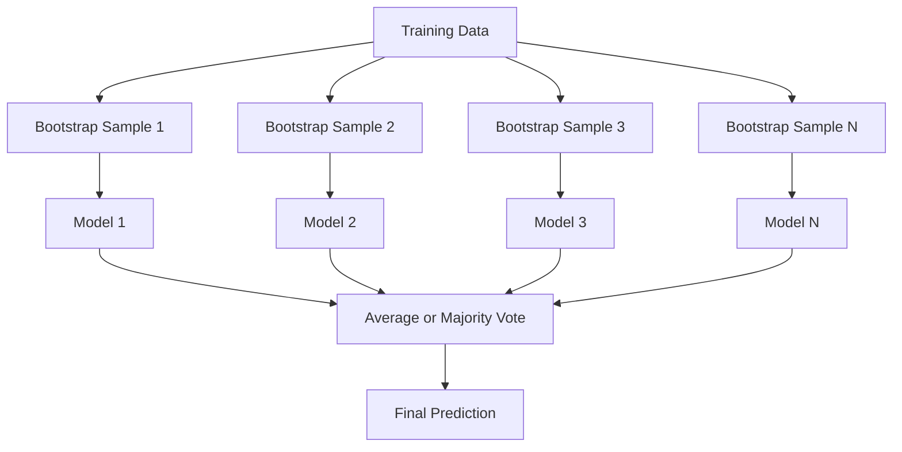
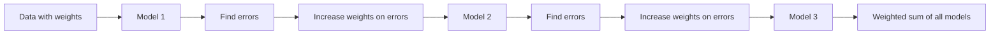
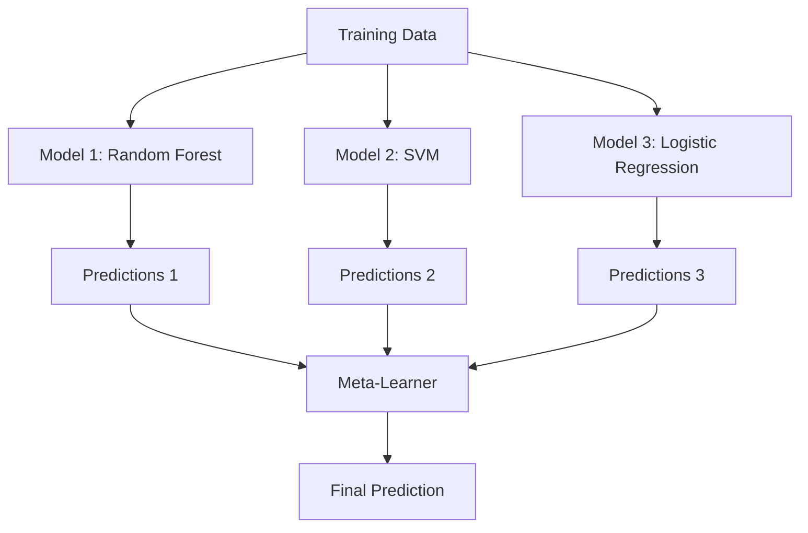

# Kết hợp các phương pháp
# 集成方法


> Một nhóm học sinh yếu đuối, kết hợp đúng cách, trở thành học sinh mạnh mẽ. Đây không phải là một ẩn dụ. Đó là một định lý.

> Một nhóm máy học yếu, đúng đúng, sau đó, trở thành một nhóm máy học mạnh.

**Type:** Build | **类型：** 构建
**Language:**Python**语言：**Python
**Prerequisites:** Phase 2, Lesson 10 (Bias-Variance Tradeoff) | **前置知识：** Phase 2 第 10 课（偏差-方差权衡）
**Time:** ~120 minutes | **时间：** 约 120 分钟

## Mục tiêu học tập

- Thực hiện AdaBoost và gradient boosting từ đầu và giải thích làm thế nào boosting theo trình tự làm giảm sự thiên vị
  Từ zero thực hiện AdaBoost và gradient提升, giải thích Boosting  làm thế nào để giảm sự phân biệt
- Xây dựng một tập hợp đóng gói và chứng minh cách trung bình các mô hình không liên quan làm giảm sự khác biệt mà không tăng thiên vị
  Construction Bagging 集成, trình bày mô hình không liên quan trung bình làm thế nào để giảm sự khác biệt trong trường hợp không tăng sự khác biệt
- So sánh việc đóng gói, tăng cường và xếp chồng về thành phần lỗi nào mà mỗi phương pháp nhắm mục tiêu
  So sánh Bagging, Boosting và Stacking khác nhau về mục tiêu sai lầm
- Đánh giá sự đa dạng của nhóm và giải thích lý do tại sao độ chính xác bỏ phiếu đa số được cải thiện với những người học yếu độc lập hơn
   đánh giá đa dạng tích hợp, giải thích tại sao tỷ lệ xác thực bỏ phiếu tăng lên với nhiều máy học độc lập yếu hơn


> **【中文解读】**
> 集成方法组合多个弱模型成一个强模型――Bagging(随机森林) giảm方差,Boosting(XGBoost) giảm偏差――XGBoost/LightGBM 在 Kaggle 比赛中占据统治地位――金融风控、推系统广泛使用――

> **【拓展：集成方法在 Kaggle 和工业界的主导地位】**
> Trong cuộc thi dữ liệu cấu trúc, các giải pháp hàng đầu 10 gần như 100% sử dụng phương pháp tích hợp. Giải thưởng Netflix là giải pháp tăng cường quyền tích hợp 107 mô hình. Trong ngành công nghiệp, thanh toán của hệ thống kiểm soát gió sử dụng XGBoost + LightGBM tích hợp.

## Vấn đề  vấn đề giới thiệu

Một cây quyết định đơn giản là nhanh chóng để đào tạo và dễ dàng để giải thích, nhưng nó vượt quá. Một mô hình tuyến tính đơn lẻ phù hợp với các ranh giới phức tạp. Bạn có thể dành nhiều ngày để thiết kế kiến trúc mô hình hoàn hảo. hoặc bạn có thể kết hợp một loạt các mô hình không hoàn hảo và có được một cái gì đó tốt hơn bất kỳ của họ riêng lẻ.

> 单棵决策树训练快、易解释, nhưng sẽ quá phù hợp. 单个线性模型在复杂边界上不适合. Bạn có thể dành vài ngày để thiết kế cấu trúc mô hình hoàn hảo, hoặc tập hợp một loạt các mô hình không hoàn hảo, có kết quả tốt hơn bất kỳ một người nào.

Các phương pháp tập hợp thực hiện chính xác điều này. Chúng là kỹ thuật đáng tin cậy nhất để giành chiến thắng trong các cuộc thi Kaggle trên dữ liệu bảng, chúng cung cấp năng lượng cho hầu hết các hệ thống ML sản xuất, và chúng minh họa sự giao dịch sự biến đổi thiên vị trong hành động.

> Phương pháp tích hợp chính là làm như vậy. Chúng là chiến thắng của Kaggle biểu mẫu dữ liệu cạnh tranh công nghệ đáng tin cậy nhất, thúc đẩy hầu hết các sản xuất ML  hệ thống,并 trực tiếp cho thấy hoạt động thực tế của trọng lượng phân biệt đối số phân biệt đối số phân biệt đối số.

> **【中文解读】**
> Nguyên tắc cốt lõi của phương pháp tích hợp: Nếu nhiều mô hình không hoàn hảo mắc sai lầm khác nhau, dự đoán trung bình của chúng sẽ chính xác hơn. Bagging (như rừng随机) thông qua đào tạo mô hình độc lập lấy trung bình để giảm chênh lệch; Boosting (như AdaBoost, GBDT) thông qua chuỗi đào tạo để cho mỗi mô hình mới sửa lỗi của mô hình trước để giảm chênh lệch; Stacking sử dụng các bộ máy học tập khác nhau của các loại mô hình gốc.

## Khái niệm cốt lõi

### Tại sao các nhóm nhóm làm việc

Giả sử bạn có N phân loại độc lập, mỗi loại có độ chính xác p > 0.5.

> 假设 bạn có N 个独立分类器, mỗi tỷ lệ xác định là p > 0,5 ~~ tỷ lệ xác định của đa số phiếu là:

```
P(majority correct) = sum over k > N/2 of C(N,k) * p^k * (1-p)^(N-k)
```

Đối với 21 phân loại, mỗi loại có độ chính xác 60%, độ chính xác đa số là khoảng 74%. Với 101 phân loại, nó tăng lên 84%.

> Tỷ lệ xác thực của 21 phân loại khác nhau là 60%, tỷ lệ xác thực của đa số phiếu là khoảng 74%──101 phân loại tăng lên 84%── khi mô hình phạm sai lầm khác nhau, sự khác biệt sẽ chống lại lẫn nhau──

Điều kiện chính là **diversity**Nếu tất cả các mô hình đều mắc sai lầm tương tự, việc kết hợp chúng không giúp gì.

> 关键 yêu cầu là**多样性**Nếu tất cả các mô hình mắc sai lầm giống nhau, việc kết hợp chúng không có ích gì.

- Các bộ phận đào tạo khác nhau (trong đậu)
  Không giống như tập luyện ()
- Các bộ phận khác nhau (rừng ngẫu nhiên)
  不同的特征子集 (tạm dịch: 随机森林)
- Việc sửa lỗi theo trình tự (thúc đẩy)
  顺序错误纠正(Tăng cường)
- Các gia đình mô hình khác nhau (lắp xếp)
  不同的模型族(Số)

### Tải túi (Tổ hợp cột cột)

Bagging tạo ra sự đa dạng bằng cách đào tạo từng mô hình trên một mẫu bootstrap khác nhau của dữ liệu đào tạo.

> Bagging 通过在每个不同的bootstrap 训练样本上训练每个模型来创造多样性.



Một mẫu bootstrap được vẽ với thay thế từ dữ liệu ban đầu, cùng kích thước với ban đầu. Khoảng 63,2% các mẫu độc đáo xuất hiện trong mỗi bootstrap.

> Mô hình bootstrap được rút lại từ dữ liệu gốc, có kích thước tương tự như dữ liệu gốc.

Bagging làm giảm sự khác biệt mà không làm tăng sự thiên vị nhiều. Mỗi cây cá nhân vượt quá mẫu bootstrap của nó, nhưng quá phù hợp khác nhau cho mỗi cây, vì vậy trung bình hủy bỏ tiếng ồn.

> Bagging trong không tăng quá nhiều phân biệt, giảm phân biệt. Mỗi cây riêng biệt được phù hợp với mẫu bootstrap của nó, nhưng mỗi cây được phù hợp khác nhau, do đó trung bình sẽ抵消 tiếng ồn.

**Random Forests**Các cây có thể được phân chia với một sự xoay quanh khác nhau: mỗi lần phân chia, chỉ có một bộ phụ ngẫu nhiên của các tính năng được xem xét.`sqrt(n_features)`cho việc phân loại và`n_features / 3`cho sự hồi quy.

> **随机森林**Đó là đống đống đống thêm một kỹ năng bổ sung: trong mỗi phân chia, chỉ cần xem xét một tập hợp đặc điểm tùy tiện.`sqrt(n_features)`, quay lại`n_features / 3`

### Tăng cường (Sự sửa lỗi theo trình tự)

Tăng cường các mô hình tàu theo trình tự. Mỗi mô hình mới tập trung vào các ví dụ mà các mô hình trước đã sai.

> Tăng cường 顺序训练模型──每个新模型关注之前模型弄错的样本──



Tăng cường làm giảm sự thiên vị. Mỗi mô hình mới sửa chữa các lỗi hệ thống của tập hợp cho đến nay. Dự đoán cuối cùng là một tổng cân của tất cả các mô hình, nơi mô hình tốt hơn có được trọng lượng cao hơn.

> Tăng cường giảm sự phân biệt. Mỗi mô hình mới được sửa chữa cho đến nay, các lỗi hệ thống được tích hợp.

Sự thỏa hiệp: tăng cường có thể quá phù hợp nếu bạn chạy quá nhiều vòng, bởi vì nó tiếp tục phù hợp với các ví dụ khó khăn hơn, một số trong đó có thể là tiếng ồn.

> 权衡: Nếu chạy quá nhiều vòng, Boosting có thể quá phù hợp, vì nó tiếp tục phù hợp với các mô hình khó khăn hơn, một số trong số đó có thể là tiếng ồn.

### AdaBoost

AdaBoost (Adaptive Boosting) là thuật toán tăng cường thực tế đầu tiên. Nó hoạt động với bất kỳ học viên cơ bản nào, thường là các con quyết định (thiên sâu -1).

> AdaBoost (自适应提升) là thuật toán nâng cấp thực tế đầu tiên. Nó được áp dụng cho bất kỳ thiết bị học tập cơ bản nào, thường sử dụng cây quyết định.

Khóa toán:

> 算法流程:

```
1. Initialize sample weights: w_i = 1/N for all i

2. For t = 1 to T:
   a. Train weak learner h_t on weighted data
   b. Compute weighted error:
      err_t = sum(w_i * I(h_t(x_i) != y_i)) / sum(w_i)
   c. Compute model weight:
      alpha_t = 0.5 * ln((1 - err_t) / err_t)
   d. Update sample weights:
      w_i = w_i * exp(-alpha_t * y_i * h_t(x_i))
   e. Normalize weights to sum to 1

3. Final prediction: H(x) = sign(sum(alpha_t * h_t(x)))
```

Các mô hình có lỗi thấp hơn sẽ có alpha cao hơn. Các mẫu được phân loại sai nhận được trọng lượng cao hơn vì vậy mô hình tiếp theo tập trung vào chúng.

> Các mô hình có tỷ lệ lỗi thấp hơn có được alpha cao hơn. Các mẫu được phân loại sai nhận được trọng lượng cao hơn, vì vậy mô hình tiếp theo sẽ quan tâm đến chúng.

### Tăng dần

Tăng cường gradient tổng hợp tăng lên các hàm mất tùy ý. Thay vì cân nhắc lại các mẫu, nó phù hợp với mỗi mô hình mới với các dư thừa (tăng gradient tiêu cực của mất mát) của bộ sưu tập hiện tại.

> 梯度提升 sẽ nâng cao và được quảng bá đến hàm mất tích tùy chọn. Không giống như mẫu tái gia hạn, nó sẽ phù hợp với mỗi mô hình mới để phù hợp với sự khác biệt của tích hợp hiện tại.

```
1. Initialize: F_0(x) = argmin_c sum(L(y_i, c))

2. For t = 1 to T:
   a. Compute pseudo-residuals:
      r_i = -dL(y_i, F_{t-1}(x_i)) / dF_{t-1}(x_i)
   b. Fit a tree h_t to the residuals r_i
   c. Find optimal step size:
      gamma_t = argmin_gamma sum(L(y_i, F_{t-1}(x_i) + gamma * h_t(x_i)))
   d. Update:
      F_t(x) = F_{t-1}(x) + learning_rate * gamma_t * h_t(x)

3. Final prediction: F_T(x)
```

Đối với lỗ lỗi vuông, các dư giả chỉ là dư thực tế: `r_i = y_i - F_{t-1}(x_i)`Mỗi cây đều phù hợp với những sai lầm của nhóm trước đó.

> Đối với lỗ hổng sai lầm vuông, sai sót là thiệt hại thực tế:`r_i = y_i - F_{t-1}(x_i)` Mỗi cây thực sự được tích hợp trước khi được chuẩn bị.

Tốc độ học tập (các) kiểm soát mức độ đóng góp của mỗi cây. Tốc độ học tập nhỏ hơn đòi hỏi nhiều cây hơn nhưng tổng quát tốt hơn.

> Học tập tỷ lệ (shrinking) kiểm soát lượng đóng góp của mỗi cây.

### XGBoost: Tại sao nó thống trị dữ liệu bảng

XGBoost (eXtreme Gradient Boosting) là tăng độ gradient với các tối ưu hóa kỹ thuật làm cho nó nhanh, chính xác và chống quá phù hợp:

> XGBoost (极端梯度提升) là một phương pháp nâng cấp độ cao để tăng tốc độ và khả năng vượt quá:

- **Regularized objective:**Các hình phạt L1 và L2 đối với trọng lượng lá ngăn chặn các cây cá nhân quá tự tin
  **正则化目标**L1 và L2  trừng phạt ngăn chặn một cây quá tự tin
- **Second-order approximation:**Sử dụng cả đầu tiên và phái sinh thứ hai của lỗ, đưa ra quyết định chia sẻ tốt hơn
  **二阶近似**: đồng thời sử dụng số mất một giai đoạn và hai giai đoạn, đưa ra quyết định chia rẽ tốt hơn
- **Sparsity-aware splits:**xử lý các giá trị bị mất bằng cách học hướng tốt nhất cho dữ liệu bị mất ở mỗi chia
  **稀疏感知分裂**: xử lý nguyên sinh thiếu giá trị, hướng tốt nhất cho việc học thiếu dữ liệu tại mỗi điểm phân chia
- **Column subsampling:**Giống như rừng ngẫu nhiên, các mẫu đặc trưng tại mỗi chia để đa dạng
  **列子采样**Như rừng tự nhiên, trong mỗi phân chia, các đặc điểm được sử dụng để tăng đa dạng
- **Weighted quantile sketch:**Tìm hiệu quả các điểm chia cho các tính năng liên tục trên dữ liệu phân tán
  **加权分位数草图**: cao hiệu quả tìm thấy các điểm phân chia của các đặc điểm liên tục trên dữ liệu phân tán
- **Cache-aware block structure:**Layout bộ nhớ tối ưu hóa cho các dòng cache CPU
  **缓存感知块结构**: Lập kế hoạch lưu trữ trong CPU 缓存行优化

Đối với dữ liệu bảng, XGBoost (và người kế nhiệm LightGBM) thường xuyên vượt qua các mạng thần kinh. Điều này sẽ không thay đổi bất cứ lúc nào sớm. Nếu dữ liệu của bạn phù hợp với một bảng có hàng và cột, hãy bắt đầu bằng tăng gradient.

> Đối với biểu đồ dữ liệu, XGBoost (XGBoost) và người kế nhiệm LightGBM) luôn tốt hơn mạng thần kinh. Trong thời gian ngắn, điều này sẽ không thay đổi. Nếu dữ liệu của bạn phù hợp với các biểu đồ, hãy bắt đầu tăng từ mức độ.

### Lắp xếp (Meta-Learning)

Stacking sử dụng các dự đoán của nhiều mô hình cơ sở như là tính năng cho một người học meta.

> Lập sẽ dự đoán nhiều mô hình cơ sở như là đặc điểm của máy học.



Meta-learner học được mô hình cơ bản nào để tin vào đầu vào nào. Nếu rừng ngẫu nhiên tốt hơn ở một số khu vực và SVM ở những khu vực khác, meta-learner sẽ học cách định tuyến phù hợp.

> Nếu như rừng ở một số khu vực tốt hơn, SVM ở các khu vực khác tốt hơn, thì các máy học sẽ tương ứng với các phương tiện học.

Để tránh rò rỉ dữ liệu, dự đoán mô hình cơ sở phải được tạo bằng cách xác nhận chéo trên bộ đào tạo. Bạn không bao giờ đào tạo mô hình cơ sở và tạo các tính năng meta trên cùng một dữ liệu.

> Để tránh rò rỉ dữ liệu, dự đoán mô hình cơ bản phải thông qua việc tạo ra chứng minh giao thoa trên tập hợp đào tạo. Không bao giờ tạo ra các đặc điểm trên cùng một dữ liệu.

### Tiếng bỏ phiếu

Nhóm đơn giản nhất. Chỉ cần kết hợp các dự đoán trực tiếp.

>                                                                                                                                                                                                                                                               

- **Hard voting:**Phần lớn phiếu bầu trên nhãn lớp học.
  **硬投票**: đối với các loại nhãn được bỏ phiếu đa số.
- **Soft voting:**Tỷ lệ dự đoán trung bình, chọn lớp có tỷ lệ trung bình cao nhất thường tốt hơn vì nó sử dụng thông tin tin tin tin cậy.
  **软投票**: trung bình dự đoán tỷ lệ, chọn loại tỷ lệ trung bình cao nhất.

## Hãy xây dựng nó.

> **【中文解读】**
> Từ thực hiện零三种集成方法:Bagging(并行训练独立模型取平均)  AdaBoost(串行训练加权投票)  Gradient Boosting(串行训练纠正残差)  AdaBoost's core is given to the previous model of erroneous categories of sample to increase weight, Gradient Boosting Mỗi cây mới được phù hợp với trước một cây của cây残差──
```figure
f3-ensemble-average
```

## Hãy xây dựng nó

### Bước 1: quyết định (Thông viên cơ bản)

Mã trong `code/ensembles.py`bắt đầu với một cái cột quyết định: một cái cây với một phân chia.

> `code/ensembles.py`Mã trong từ không thực hiện mọi thứ. Chúng ta bắt đầu từ cây quyết định. Chỉ có một cây chia rẽ.

```python
class DecisionStump:
    def __init__(self):
        self.feature_idx = None
        self.threshold = None
        self.polarity = 1
        self.alpha = None

    def fit(self, X, y, weights):
        n_samples, n_features = X.shape
        best_error = float("inf")

        for f in range(n_features):
            thresholds = np.unique(X[:, f])
            for thresh in thresholds:
                for polarity in [1, -1]:
                    pred = np.ones(n_samples)
                    pred[polarity * X[:, f] < polarity * thresh] = -1
                    error = np.sum(weights[pred != y])
                    if error < best_error:
                        best_error = error
                        self.feature_idx = f
                        self.threshold = thresh
                        self.polarity = polarity

    def predict(self, X):
        n = X.shape[0]
        pred = np.ones(n)
        idx = self.polarity * X[:, self.feature_idx] < self.polarity * self.threshold
        pred[idx] = -1
        return pred
```

### Bước 2: AdaBoost từ đầu

```python
class AdaBoostScratch:
    def __init__(self, n_estimators=50):
        self.n_estimators = n_estimators
        self.stumps = []
        self.alphas = []

    def fit(self, X, y):
        n = X.shape[0]
        weights = np.full(n, 1 / n)

        for _ in range(self.n_estimators):
            stump = DecisionStump()
            stump.fit(X, y, weights)
            pred = stump.predict(X)

            err = np.sum(weights[pred != y])
            err = np.clip(err, 1e-10, 1 - 1e-10)

            alpha = 0.5 * np.log((1 - err) / err)
            weights *= np.exp(-alpha * y * pred)
            weights /= weights.sum()

            stump.alpha = alpha
            self.stumps.append(stump)
            self.alphas.append(alpha)

    def predict(self, X):
        total = sum(a * s.predict(X) for a, s in zip(self.alphas, self.stumps))
        return np.sign(total)
```

### Bước 3: Tăng cường dần từ đầu

```python
class GradientBoostingScratch:
    def __init__(self, n_estimators=100, learning_rate=0.1, max_depth=3):
        self.n_estimators = n_estimators
        self.lr = learning_rate
        self.max_depth = max_depth
        self.trees = []
        self.initial_pred = None

    def fit(self, X, y):
        self.initial_pred = np.mean(y)
        current_pred = np.full(len(y), self.initial_pred)

        for _ in range(self.n_estimators):
            residuals = y - current_pred
            tree = SimpleRegressionTree(max_depth=self.max_depth)
            tree.fit(X, residuals)
            update = tree.predict(X)
            current_pred += self.lr * update
            self.trees.append(tree)

    def predict(self, X):
        pred = np.full(X.shape[0], self.initial_pred)
        for tree in self.trees:
            pred += self.lr * tree.predict(X)
        return pred
```

### Bước 4: So sánh với sklearn

Mã xác minh rằng các thực hiện từ đầu của chúng tôi tạo ra độ chính xác tương tự như của sklearn `AdaBoostClassifier`và `GradientBoostingClassifier`, và so sánh tất cả các phương pháp bên cạnh nhau.

> 代码验证 chúng ta từ không thực hiện được tạo ra với các sản phẩm `AdaBoostClassifier`和 `GradientBoostingClassifier`Tỷ lệ chính xác tương tự,并并排比较所有方法──

## Hãy sử dụng nó để thực hiện

### Khi nào nên sử dụng từng phương pháp

> Làm gì để sử dụng mỗi phương pháp

| Method | Reduces | Best for | Watch out for |
|--------|---------|----------|---------------|
| Bagging / Random Forest | Variance | Noisy data, many features | Does not help with bias |
| AdaBoost | Bias | Clean data, simple base learners | Sensitive to outliers and noise |
| Gradient Boosting | Bias | Tabular data, competitions | Slow to train, easy to overfit without tuning |
| XGBoost / LightGBM | Both | Production tabular ML | Many hyperparameters |
| Stacking | Both | Getting last 1-2% accuracy | Complex, risk of overfitting meta-learner |
| Voting | Variance | Quick combination of diverse models | Only helps if models are diverse |

| 方法 | 减少 | 最适合 | 注意事项 |
|------|------|--------|---------|
| Bagging / 随机森林 | 方差 | 噪声数据、多特征 | 不能帮助偏差 |
| AdaBoost | 偏差 | 干净数据、简单基学习器 | 对异常值和噪声敏感 |
| 梯度提升 | 偏差 | 表格数据、竞赛 | 训练慢、不调参容易过拟合 |
| XGBoost / LightGBM | 两者 | 生产表格 ML | 超参数多 |
| Stacking | 两者 | 获取最后 1-2% 准确率 | 复杂、元学习器有过拟合风险 |
| Voting | 方差 | 快速组合多样模型 | 模型不多样时无帮助 |

### Các sản xuất hàng đống cho dữ liệu bảng

Đối với hầu hết các vấn đề dự đoán bảng tính, đây là thứ tự để thử:

> Đối với hầu hết các vấn đề, đây là thứ tự thử nghiệm:

1. **LightGBM or XGBoost**với các tham số mặc định
   **LightGBM 或 XGBoost**使用默认参数
2. Định nghĩa n_estimators, learning_rate, max_depth, min_child_weight
   调优 n_estimators、learning_rate、max_depth、min_child_weight
3. Nếu bạn cần 0,5% cuối cùng, xây dựng một tập hợp xếp chồng với 3-5 mô hình đa dạng
   Nếu cần cuối cùng 0,5%, xây dựng 3-5 mô hình đa dạng của xếp chồng  tập hợp
4. Sử dụng xác thực chéo trong suốt
   全程使用交叉验证

Các mạng thần kinh trên dữ liệu bảng hầu như luôn tệ hơn tăng gradient, mặc dù các nỗ lực nghiên cứu liên tục. TabNet, NODE và các kiến trúc tương tự đôi khi phù hợp nhưng hiếm khi đánh bại một XGBoost được điều chỉnh tốt.

> Mặc dù có những nỗ lực nghiên cứu liên tục, mạng thần kinh trên dữ liệu biểu đồ hầu như không luôn luôn như nâng cấp cấp.

## Chuyển nó đi.

Bài học này sẽ mang lại kết quả `outputs/prompt-ensemble-selector.md`- một lời nhắc giúp bạn chọn đúng phương pháp tập hợp cho một tập dữ liệu nhất định. Mô tả dữ liệu của bạn (kích thước, loại tính năng, mức tiếng ồn, cân bằng lớp) và vấn đề bạn đang giải quyết.`outputs/skill-ensemble-builder.md`Với hướng dẫn lựa chọn đầy đủ.

> 本课产 出 `outputs/prompt-ensemble-selector.md` Một lời khuyên giúp bạn chọn đúng phương pháp tích hợp tập hợp dữ liệu.  mô tả dữ liệu của bạn (từ:                                                                                                                                                                                                                                                `outputs/skill-ensemble-builder.md`,包含完整选择指南──

## Tập luyện bài tập

1. Thay đổi thực hiện AdaBoost để theo dõi độ chính xác đào tạo sau mỗi vòng.
   1.  sửa đổi AdaBoost 实现在每轮后追踪训练准确率──绘制准确率 vs 估计器数量──何时收?

2. Thực hiện một khu rừng ngẫu nhiên từ đầu bằng cách thêm tính năng ngẫu nhiên lấy mẫu dưới cây hồi quy.`max_features=sqrt(n_features)`và dự đoán trung bình. So sánh sự giảm biến số với một cây duy nhất.
   2. Từ零实现随机森林: 在归树上添加随机特征子采样――训练 100 cây,`max_features=sqrt(n_features)`, trung bình dự đoán:

3. Trong việc thực hiện tăng cường gradient, thêm dừng sớm: theo dõi sự mất mát xác thực sau mỗi vòng và dừng khi nó không được cải thiện trong 10 vòng liên tiếp.
   3. Trong khi đó, có nhiều cây trồng được phát triển và phát triển.

4. Xây dựng một tập hợp xếp chồng với ba mô hình cơ sở (k-thần hàng xóm gần nhất, cây quyết định, k-thần hàng xóm) và một người học meta-thần regression logistics. Sử dụng xác thực chéo 5 lần để tạo ra các tính năng meta. So sánh với mỗi mô hình cơ sở một mình.
   4. 构建三个基础模型 ( 逻辑归归归、决策树、KNN) và một logic归归元学习器的堆积集成――使用5折交叉验证生成元特征――与每个基础模型单独比较――

5. XGBoost chạy trên cùng một bộ dữ liệu với các tham số mặc định. So sánh độ chính xác của nó với tăng độ từ đầu của bạn. Thời gian cả hai.
   5. XGBoost được sử dụng trên cùng một tập dữ liệu với các tham số mặc định.

> **【中文解读】**
> AdaBoost(đồng độ tự nâng) Core process: train một yếu phân loại→计算错误率→增加被误分类样本的权重→ train下一个弱分类器。

> **【拓展：XGBoost、LightGBM、CatBoost——梯度提升树三巨头】**
> XGBoost(eXtreme Gradient Boosting) được phát triển bởi Chen天奇 vào năm 2014, đưa ra chính则化、稀疏数据处理和并行计算, trở thành Kaggle 竞赛的标配工具──LightGBM(Microsoft,2017) sử dụng chiến lược chia cắt và phát triển lá dựa trên hình chữ nhật(leaf-wise), tốc độ tập luyện so với XGBoost 快 5-10 倍──CatBoost(Yandex,2018) tự động xử lý các đặc điểm phân loại, không cần phải sử dụng mã hóa bằng tay──Thứ người có lợi thế trong các bối cảnh khác nhau:

## Từ khóa  Từ khóa nhanh chóng

| Term | What people say | What it actually means |
|------|----------------|----------------------|
| Bagging | "Train on random subsets" | Bootstrap aggregating: train models on bootstrap samples, average predictions to reduce variance |
| Boosting | "Focus on hard examples" | Train models sequentially, each correcting errors of the ensemble so far, to reduce bias |
| AdaBoost | "Reweight the data" | Boosting via sample weight updates; misclassified points get higher weight for the next learner |
| Gradient boosting | "Fit the residuals" | Boosting via fitting each new model to the negative gradient of the loss function |
| XGBoost | "The Kaggle weapon" | Gradient boosting with regularization, second-order optimization, and systems-level speed tricks |
| Stacking | "Models on top of models" | Use predictions of base models as input features for a meta-learner |
| Random forest | "Many randomized trees" | Bagging with decision trees, adding random feature subsampling at each split for diversity |
| Ensemble diversity | "Make different mistakes" | Models must be uncorrelated in their errors for the ensemble to improve over individuals |
| Out-of-bag error | "Free validation" | Samples not in a bootstrap draw (~36.8%) serve as a validation set without needing a holdout |

## Xem thêm 延伸阅读

- [Schapire & Freund: Boosting: Foundations and Algorithms](https://mitpress.mit.edu/9780262526036/)-- cuốn sách của những người sáng tạo của AdaBoost
  [Schapire & Freund: Boosting: Foundations and Algorithms](https://mitpress.mit.edu/9780262526036/)- AdaBoost 创始人的著作
- [Friedman: Greedy Function Approximation: A Gradient Boosting Machine (2001)](https://statweb.stanford.edu/~jhf/ftp/trebst.pdf)- giấy tăng độ gradient ban đầu
  [Friedman: Greedy Function Approximation: A Gradient Boosting Machine (2001)](https://statweb.stanford.edu/~jhf/ftp/trebst.pdf)- 梯度提升 nguyên bản
- [Chen & Guestrin: XGBoost (2016)](https://arxiv.org/abs/1603.02754)- giấy XGBoost
  [Chen & Guestrin: XGBoost (2016)](https://arxiv.org/abs/1603.02754)- XGBoost 论文
- [Wolpert: Stacked Generalization (1992)](https://www.sciencedirect.com/science/article/abs/pii/S0893608005800231)- giấy xếp chồng gốc
  [Wolpert: Stacked Generalization (1992)](https://www.sciencedirect.com/science/article/abs/pii/S0893608005800231)- Lập nguyên始论文
- [scikit-learn Ensemble Methods](https://scikit-learn.org/stable/modules/ensemble.html)-- tham khảo thực tế
  [scikit-learn 集成方法](https://scikit-learn.org/stable/modules/ensemble.html)-  thực dụng
