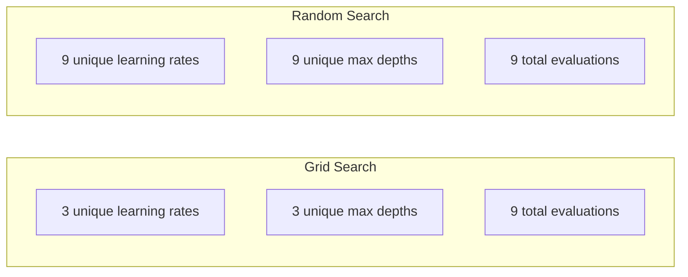
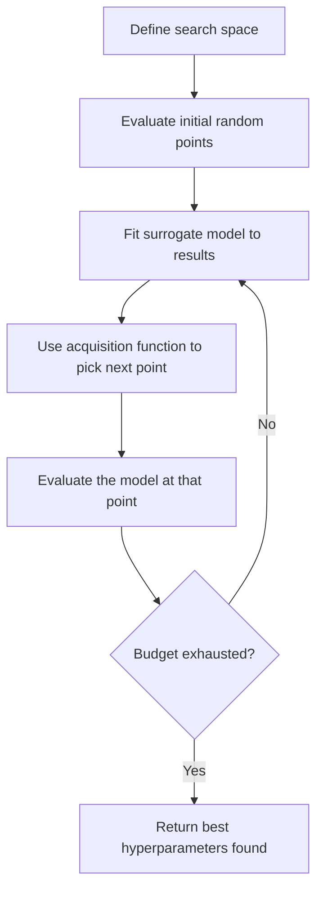
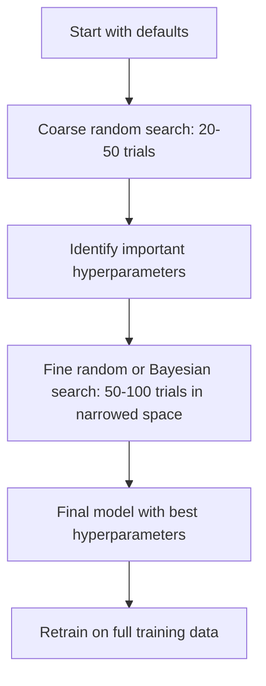
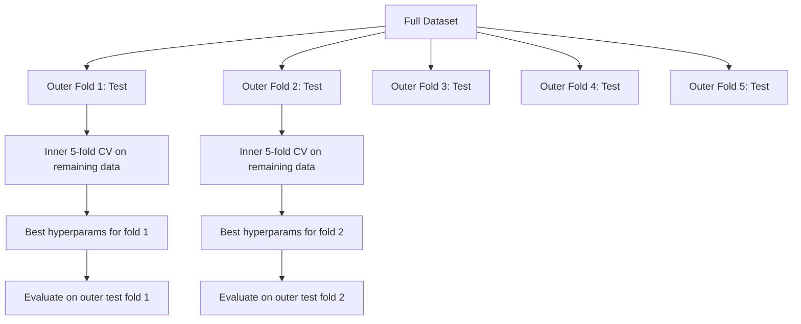

# Định hướng siêu tham số
# 超参数调优


> Các siêu tham số là những nút mà bạn xoay trước khi bắt đầu tập luyện.

> 超参数 là tập luyện để bắt đầu quay trước bạn.

**Type:** Build | **类型：** 构建
**Language:**Python**语言：**Python
**Prerequisites:** Phase 2, Lesson 11 (Ensemble Methods) | **前置知识：** Phase 2 第 11 课（集成方法）
**Time:** ~90 minutes | **时间：** 约 90 分钟

## Mục tiêu học tập

- Thực hiện tìm kiếm lưới, tìm kiếm ngẫu nhiên và tối ưu hóa Bayesian từ đầu và so sánh hiệu quả mẫu của chúng
  Từ việc thực hiện tìm kiếm mạng không, tìm kiếm tự động và tối ưu hóa các dịch vụ, so sánh hiệu quả mẫu của chúng
- Giải thích tại sao tìm kiếm ngẫu nhiên vượt trội hơn tìm kiếm lưới khi hầu hết các siêu tham số có chiều kích hiệu quả thấp
  解释 tại sao tìm kiếm tự động trên đa số siêu số hiệu quả kích thước thấp hơn tìm kiếm trên mạng
- Xây dựng một vòng tối ưu hóa Bayesian sử dụng mô hình thay thế và hàm thu thập để hướng dẫn tìm kiếm
  Sử dụng mô hình đại lý và hàm thu thập xây dựng vòng tối ưu hóa để hướng dẫn tìm kiếm
- Thiết kế một chiến lược điều chỉnh siêu tham số để tránh quá phù hợp với bộ xác thực thông qua xác thực chéo thích hợp
   thiết kế thông qua giao thông xác minh thích hợp tránh quá phù hợp với tập hợp xác minh


> **【中文解读】**
> 超参数 là các参数 được thiết lập trước khi tập luyện mô hình (như tỷ lệ học 树深度), không thể học từ dữ liệu trong các lớp học.

> **【拓展：超参数调优在大模型训练中的重要性】**
> Việc đào tạo của GPT-4 liên quan đến hàng chục siêu参数 (đối ưu hóa tỷ lệ học, kích thước lô, giảm trọng lượng, giảm giảm giảm tỷ lệ), mỗi lần đào tạo hoàn chỉnh có chi phí khoảng 1 tỷ USD, không thể sử dụng tìm kiếm trên mạng. OpenAI sử dụng sự tối ưu hóa của các siêu参数 và dựa trên các quy tắc kinh nghiệm của các thí nghiệm quy mô nhỏ trước đây để thiết lập siêu参数. Đối với mô hình GPT, việc điều chỉnh tỷ lệ học (đối ưu hóa + sự phân rã của vũ trụ) được coi là lựa chọn siêu参数 quan trọng nhất.

## Vấn đề  vấn đề giới thiệu

Mô hình tăng gradient của bạn có tốc độ học tập, số cây, độ sâu tối đa, mẫu ít nhất mỗi lá, tỷ lệ mẫu phụ, và tỷ lệ mẫu cột. Đó là sáu siêu tham số. Nếu mỗi số có 5 giá trị hợp lý, lưới có 5 ^ 6 = 15.625 kết hợp.

> Mô hình nâng cấp thang của bạn có tỷ lệ học, số lượng cây, độ sâu tối đa, số lượng mẫu nhỏ nhất của các nút, tỷ lệ lấy mẫu và tỷ lệ lấy mẫu hàng. Có sáu siêu số. Nếu mỗi một có 5 giá trị hợp lý, mạng lưới có 5^6 = 15,625 loại kết hợp.

Tìm kiếm lưới là cách tiếp cận rõ ràng và tồi tệ nhất trên quy mô. Tìm kiếm ngẫu nhiên làm tốt hơn với ít tính toán hơn. Phối ưu hóa Bayesian làm tốt hơn nữa bằng cách học hỏi từ các đánh giá trước đây. Biết chiến lược nào để sử dụng, và các siêu tham số thực sự quan trọng, tiết kiệm nhiều ngày thời gian GPU lãng phí.

> 网格 tìm kiếm là phương pháp rõ ràng, cũng là phương pháp tồi tệ nhất dưới quy mô lớn. 随时 tìm kiếm bằng ít tính toán hơn làm tốt hơn. 贝叶斯优化通过从过去的评估学习做得更好. 知道使用哪些策略以及哪些超参数真正重要,可以节省几天浪费的GPU 时间.

> **【中文解读】**
> Sự mâu thuẫn cốt lõi của siêu điều chỉnh: tìm kiếm không gian lớn nhưng mỗi lần đánh giá chi phí cao.

## Khái niệm cốt lõi

### Các tham số so với các tham số siêu

Các tham số được học trong quá trình đào tạo (não trọng lượng, thiên vị, ngưỡng chia).

> 参数在训练中学习(权重、偏置、分裂值) ―― siêu参数在训练开始前设定,控制学习如何发生──

| Hyperparameter | What it controls | Typical range |
|---------------|-----------------|---------------|
| Learning rate | Step size per update | 0.001 to 1.0 |
| Number of trees/epochs | How long to train | 10 to 10,000 |
| Max depth | Model complexity | 1 to 30 |
| Regularization (lambda) | Overfitting prevention | 0.0001 to 100 |
| Batch size | Gradient estimation noise | 16 to 512 |
| Dropout rate | Fraction of neurons dropped | 0.0 to 0.5 |

| 超参数 | 控制什么 | 典型范围 |
|--------|---------|---------|
| 学习率 | 每次更新的步长 | 0.001 到 1.0 |
| 树的数量/epoch 数 | 训练多久 | 10 到 10,000 |
| 最大深度 | 模型复杂度 | 1 到 30 |
| 正则化 (lambda) | 防止过拟合 | 0.0001 到 100 |
| 批量大小 | 梯度估计噪声 | 16 到 512 |
| Dropout 率 | 丢弃的神经元比例 | 0.0 到 0.5 |

### Tìm kiếm lưới

Tìm kiếm lưới đánh giá mọi sự kết hợp của các giá trị được chỉ định. Nó là đầy đủ và dễ hiểu, nhưng cân bằng theo số lượng siêu tham số.

> 网格搜索评估 được chỉ định giá trị. Nó rất ngắn gọn và dễ hiểu, nhưng tăng lên theo các chỉ số số số siêu tử.

```
Grid for 2 hyperparameters:

  learning_rate: [0.01, 0.1, 1.0]
  max_depth:     [3, 5, 7]

  Evaluations: 3 x 3 = 9 combinations

  (0.01, 3)  (0.01, 5)  (0.01, 7)
  (0.1,  3)  (0.1,  5)  (0.1,  7)
  (1.0,  3)  (1.0,  5)  (1.0,  7)
```

Tìm kiếm lưới có một lỗ hổng cơ bản: nếu một siêu tham số quan trọng và một khác không quan trọng, hầu hết các đánh giá đều lãng phí. Bạn chỉ nhận được 3 giá trị độc đáo của tham số quan trọng từ 9 đánh giá.

> 网格 tìm kiếm có một lỗ hổng cơ bản: Nếu một siêu tham số quan trọng và một khác không quan trọng, hầu hết các đánh giá đều bị lãng phí. Từ 9 lần đánh giá, bạn chỉ nhận được 3 giá trị duy nhất của các tham số quan trọng.

### Tìm kiếm ngẫu nhiên

Tìm kiếm ngẫu nhiên các mẫu siêu tham số từ phân phối thay vì lưới. Với cùng ngân sách của 9 đánh giá, bạn nhận được 9 giá trị độc đáo của mỗi siêu tham số.

> Khi tìm kiếm từ phân bố thay vì sử dụng các siêu số, trong cùng một ngân sách đánh giá 9 lần, bạn nhận được 9 giá trị duy nhất của mỗi siêu số.



Tại sao số lượng ngẫu nhiên đánh lưới (Bergstra & Bengio, 2012):

> Tại sao随机优于网格(Bergstra & Bengio, 2012):

- Hầu hết các siêu tham số có kích thước hiệu quả thấp. Chỉ có 1-2 trong số 6 siêu tham số thường quan trọng cho một vấn đề nhất định.
  Đa số siêu tham số có kích thước hiệu quả thấp. Trong số 6 siêu tham số, thường chỉ có 1-2 đối với một vấn đề nhất định.
- Đánh giá chất thải tìm kiếm lưới trên các kích thước không quan trọng.
  网格搜索在不重要维度上浪费评估──
- Tìm kiếm ngẫu nhiên bao gồm các chiều kích quan trọng dày đặc hơn cho cùng một ngân sách.
  随时搜索在同样的预算下更密集地覆盖重要维度──
- Trong 60 thử nghiệm ngẫu nhiên, bạn có 95% cơ hội tìm thấy một điểm trong 5% tối ưu (nếu có trong không gian tìm kiếm).
  Trong 60 lần thử nghiệm tự động, bạn có 95% khả năng tìm thấy điểm tối ưu nhất trong 5% và giá trị bên trong nếu trong không gian tìm kiếm có điểm tối ưu nhất)

### Bayesian Optimization

Tìm kiếm ngẫu nhiên bỏ qua kết quả. Nó không tìm hiểu rằng tỷ lệ học tập cao gây ra sự khác biệt hoặc rằng độ sâu 3 liên tục vượt qua độ sâu 10.

> 随机搜索忽略结果――它不会 học đến tỷ lệ học cao dẫn đến phát tán hoặc độ sâu 3 总是优于 độ sâu 10―贝叶斯优化利用过去的评估来决定下一步搜索哪里――



Hai thành phần chính:

**Surrogate model:**Một mô hình giá rẻ để đánh giá (thường là một quy trình Gaussian) gần với chức năng khách quan đắt tiền. Nó cung cấp cả một dự đoán và ước tính độ không chắc chắn ở bất kỳ điểm nào trong không gian tìm kiếm.

> **代理模型：**Một mô hình đánh giá giá rẻ (đường là quá trình cao), gần như là hàm mục tiêu đắt tiền. Nó cung cấp dự đoán và ước tính không chắc chắn cho bất kỳ điểm nào trong không gian tìm kiếm.

**Acquisition function:**Quyết định xem xét tiếp theo là ở đâu bằng cách cân bằng giữa khai thác (số tìm kiếm gần những điểm tốt được biết đến) và khám phá (số tìm kiếm nơi có sự không chắc chắn cao).

> **采集函数：**Thông qua cân bằng phát triển (để tìm kiếm được biết đến điểm tốt gần) và khám phá (để tìm kiếm không chắc chắn cao của khu vực) để quyết định bước tiếp theo để đánh giá ở đâu:

- **Expected Improvement (EI):**Chúng ta mong đợi sự cải thiện như thế nào so với những gì tốt nhất hiện tại tại tại thời điểm này?
  **期望改进 (EI)：**Trong thời điểm này, chúng ta mong đợi kết quả tốt nhất hiện tại cải thiện bao nhiêu?
- **Upper Confidence Bound (UCB):**Dự đoán cộng với số không chắc chắn.
  **上置信界 (UCB)：**预测加上不确定性的倍数──更高的 UCB có nghĩa là có triển vọng hoặc chưa được khám phá──
- **Probability of Improvement (PI):**Có khả năng điểm này vượt qua điểm hiện tại tốt nhất là gì?
  **改进概率 (PI)：**Điều này vượt qua điểm tốt nhất hiện tại kết quả xác suất là bao nhiêu?

Tối ưu hóa Bayesian thường tìm thấy các tham số siêu tốt hơn so với tìm kiếm ngẫu nhiên với 2-5 lần ít đánh giá hơn. Chi phí chung của việc lắp đặt mô hình thay thế là không đáng kể so với đào tạo mô hình thực tế.

> 贝叶斯优化 thường sử dụng ít hơn 2-5 lần các lần đánh giá để tìm thấy siêu số tốt hơn so với tìm kiếm tùy chọn.

> **【中文解读】**
> 贝叶斯优化是最智能调整方法──核心组件:代理模型(通常使用高斯过程拟合目标函数) 和采集函数(平衡"探索未知区域"和"利用已知好区域")──每次评估后更新代理模型,采集函数决定下一个评估点──相对于随机搜索,贝叶斯优化使用2-5倍较少的评估次数就能找到更好的超值参数,对于训练成本高的模型有特别价值──

> **【拓展：Optuna——自动化超参数调优的工业标准】**
> Optuna là một framework cải tiến siêu số liệu được phát triển bởi các mạng ưu tiên của Nhật Bản, được sử dụng rộng rãi trong các dự án cạnh tranh và công nghiệp. Nó hỗ trợ cải tiến siêu số liệu (TPE) 采样器 (剪枝) 剪枝 (自动停止不前景的试验) 分布式搜索. DeepMind của AlphaGo và Google của Vizier cũng sử dụng các kỹ thuật cải tiến siêu số liệu tương tự để cải thiện siêu số liệu của hệ thống của mình. Trong LLM 微调, Optuna thường được sử dụng để tìm kiếm tỷ lệ học, kích thước lô, xếp hạng LoRA và các siêu số liệu quan trọng khác.

### Giữ sớm

Không phải mỗi cuộc tập luyện đều cần phải kết thúc. Nếu một cấu hình rõ ràng xấu sau 10 thời kỳ, hãy dừng nó và tiếp tục. Đây là dừng sớm trong bối cảnh tìm kiếm siêu tham số.

> Không phải mỗi bài tập đều cần phải chạy hết. Nếu một việc sắp xếp sau 10 thời gian  hiển nhiên không tốt, hãy dừng lại để tiếp tục tiếp theo.

Chiến lược:
- **Patience-based:**Ngưng nếu mất hiệu quả không cải thiện trong N thời kỳ liên tiếp
  **基于耐心：**Nếu chứng minh mất tích liên tục N 个 thời đại không cải thiện thì dừng lại
- **Median pruning:**Giữ lại nếu kết quả trung bình của thử nghiệm là tồi tệ hơn trung bình của các thử nghiệm hoàn thành ở cùng một bước
  **中位数剪枝：**Nếu kết quả trung bình của thử nghiệm so với các bước đã hoàn thành thử nghiệm, tỷ lệ trung bình của thử nghiệm sẽ dừng lại.
- **Hyperband:**Đưa ra ngân sách nhỏ cho nhiều cấu hình, sau đó tăng dần ngân sách cho những thứ tốt nhất
  **Hyperband：**Đưa cho nhiều quy định ngân sách nhỏ, sau đó dần dần tăng ngân sách quy định tốt nhất

Hyperband đặc biệt hiệu quả. Nó bắt đầu 81 cấu hình với mỗi 1 thời kỳ, giữ phần ba đầu, cho họ 3 thời kỳ, giữ phần ba đầu, v.v. Điều này tìm thấy các cấu hình tốt 10-50 lần nhanh hơn so với đánh giá tất cả các cấu hình cho ngân sách đầy đủ.

> Hyperband  đặc biệt hiệu quả. Nó bắt đầu từ 81 cấu hình trong 1 thời đại, giữ trước 3 phần trăm, cho chúng 3 phần trăm, giữ lại trước 3 phần trăm, cho loại này.

### Các lập trình học tập

Tốc độ học tập hầu như luôn luôn là siêu tham số quan trọng nhất.

> Tỷ lệ học tập gần như luôn là siêu yếu tố quan trọng nhất.

| Scheduler | Formula | When to use |
|-----------|---------|-------------|
| Step decay | Multiply by 0.1 every N epochs | Classic CNN training |
| Cosine annealing | lr * 0.5 * (1 + cos(pi * t / T)) | Modern default |
| Warmup + decay | Linear increase then cosine decay | Transformers |
| One-cycle | Increase then decrease over one cycle | Fast convergence |
| Reduce on plateau | Reduce by factor when metric stalls | Safe default |

| 调度器 | 公式 | 何时使用 |
|--------|------|---------|
| 阶梯衰减 | 每 N 个 epoch 乘以 0.1 | 经典 CNN 训练 |
| 余弦退火 | lr * 0.5 * (1 + cos(pi * t / T)) | 现代默认 |
| 预热+衰减 | 线性增加后余弦衰减 | Transformer |
| 单周期 | 一个周期内先增后减 | 快速收敛 |
| 平台期衰减 | 指标停滞时按因子减小 | 安全默认 |

### Tầm quan trọng của các siêu tham số

Không phải tất cả các siêu tham số đều quan trọng như nhau. Nghiên cứu về rừng ngẫu nhiên (Probst et al., 2019) và tăng độ cho thấy các mô hình nhất quán:

> Không phải tất cả các siêu số đều quan trọng như nhau. Nghiên cứu về rừng tự nhiên (Probst, 2019) và tăng độ cho thấy mô hình phù hợp:

**High importance:**
- Tốc độ học tập (luôn luôn điệu đầu tiên)
  Học tập tỷ lệ (始终首先调优)
- Số lượng ước tính / thời kỳ ( Sử dụng dừng sớm thay vì điều chỉnh)
  估计器 số lượng / thời đại 数(用早停代替调优)
- Độ mạnh của sự điều chỉnh
  Nguyên tắc mạnh

**Medium importance:**
- Độ sâu tối đa / số lớp
  Nồng độ tối đa / 层 số
- Min mẫu mỗi lá / phân hủy trọng lượng
  叶节点最小样本数 / 权重衰减
- Tỷ lệ mẫu phụ
  Tỷ lệ

**Low importance:**
- Tính năng tối đa (đối với rừng ngẫu nhiên)
  Đặc điểm lớn nhất (随机森林)
- Chọn chức năng kích hoạt cụ thể
  具体激活函数选择
- Kích thước lô (trong phạm vi hợp lý)
  批量大小(在合理范围内)

Đưa ra những thứ quan trọng trước, để lại phần còn lại là mặc định.

> Trước tiên điều quan trọng, còn lại giữ được sự chú ý.

### Chiến lược thực tế



Phương trình làm việc cụ thể:

> 具体工作流:

1. **Start with library defaults.**Họ được lựa chọn bởi những người có kinh nghiệm và thường là 80% đường đến đó.
   **从库默认值开始。**Chúng được lựa chọn bởi những người thực hành giàu kinh nghiệm, thường đã đạt được hiệu quả 80%.
2. **Coarse random search.**Phạm vi rộng, thử nghiệm 20-50, sử dụng dừng sớm để tiêu diệt những người xấu chạy nhanh.
   **粗粒度随机搜索。**宽范围,20-50 次试验──用早停快速终止差的运行──
3. **Analyze results.**Các siêu tham số nào tương quan với hiệu suất?
   **分析结果。**什么超参数与性能相关?缩小搜索空间──
4. **Fine search.**Tối ưu hóa Bayesian hoặc tìm kiếm ngẫu nhiên tập trung trong không gian hạn chế. 50-100 thử nghiệm.
   **精细搜索。**Trong không gian nhỏ trong sử dụng phương pháp tối ưu hóa hoặc tập trung theo tìm kiếm.
5. **Retrain on all training data**với các siêu tham số tốt nhất được tìm thấy.
   Sử dụng tìm thấy tốt nhất siêu tham số trong**所有训练数据上重新训练**

### Sự tích hợp hợp hợp lệ chéo

Định nghĩa các siêu tham số trên một phân chia xác nhận duy nhất là rủi ro. Các siêu tham số tốt nhất có thể phù hợp với gấp xác nhận cụ thể.

> Trong phân chia chứng chỉ đơn có nguy cơ. Các siêu số tốt nhất có thể phù hợp với các chứng chỉ cụ thể.

- **Outer loop**(học định): chia dữ liệu thành tàu + giá và thử nghiệm.
  **外循环**(评估): sẽ phân chia dữ liệu thành đào tạo + thi hành và thử nghiệm.
- **Inner loop**(tuning): chia train+val thành train và val. Tìm ra các siêu tham số tốt nhất.
  **内循环**(调优):将训练+验证分为训练和验证―― tìm được số lượng siêu tốt nhất――



Mỗi gấp bên ngoài tìm thấy các siêu tham số tốt nhất của riêng mình độc lập.

> Mỗi biến cố độc lập tìm thấy siêu số tốt nhất của mình.

Với sklearn:

```python
from sklearn.model_selection import cross_val_score, GridSearchCV
from sklearn.ensemble import GradientBoostingRegressor

inner_cv = GridSearchCV(
    GradientBoostingRegressor(),
    param_grid={
        "learning_rate": [0.01, 0.05, 0.1],
        "max_depth": [2, 3, 5],
        "n_estimators": [50, 100, 200],
    },
    cv=5,
    scoring="neg_mean_squared_error",
)

outer_scores = cross_val_score(
    inner_cv, X, y, cv=5, scoring="neg_mean_squared_error"
)

print(f"Nested CV MSE: {-outer_scores.mean():.4f} +/- {outer_scores.std():.4f}")
```

Điều này đắt tiền (5 gấp bên ngoài x 5 gấp bên trong x 27 điểm lưới = 675 điểm phù hợp với mô hình), nhưng nó cung cấp cho bạn một ước tính hiệu suất đáng tin cậy.

> Đây là rất đắt tiền ((5 折外折 x 5 折内折 x 27 网格点 = 675 lần mô hình phù hợp), nhưng nó cung cấp cho bạn ước tính hiệu suất đáng tin cậy.

### Những lời khuyên hữu ích

**Start with the learning rate.**Nó luôn là siêu tham số quan trọng nhất cho các phương pháp dựa trên gradient. Tốc độ học tập kém làm cho mọi thứ khác không liên quan. Dũng chỉnh các siêu tham số khác theo mặc định và quét tốc độ học tập trước.

> **从学习率开始。**Đối với phương pháp dựa trên thang, nó luôn là siêu tử quan trọng nhất. Tỷ lệ học tập tồi sẽ làm cho mọi thứ khác không quan trọng.

**Use log-uniform distributions for learning rate and regularization.**Sự khác biệt giữa 0.001 và 0.01 quan trọng như sự khác biệt giữa 0.1 và 1.0. Tìm kiếm theo đường thẳng ngân sách lãng phí ở phần lớn.

> **对学习率和正则化使用对数均匀分布。**Sự khác biệt giữa 0.001 và 0.01 và sự khác biệt giữa 0.1 và 1.0 cũng quan trọng.

**Use early stopping instead of tuning n_estimators.**Đối với tăng cường và mạng thần kinh, hãy đặt n_estimators hoặc epochs cao và để dừng sớm quyết định khi dừng lại.

> **用早停代替调优 n_estimators。**Đối với nâng cao và mạng thần kinh, sẽ n_estimators hoặc thời đại 数设高,让早停止 quyết định何时停止──

**Budget allocation.**Hãy dành 60% ngân sách điều chỉnh cho 2 siêu tham số quan trọng nhất, dành 40% còn lại cho mọi thứ khác.

> **预算分配。**60% ngân sách được điều chỉnh sẽ được chi tiêu cho 2 siêu yếu tố quan trọng nhất.

**Scale matters.**Không bao giờ tìm kích thước lô trên thang log (16, 32, 64 là tốt). Luôn tìm tốc độ học tập trên thang log. So sánh phân bố tìm kiếm với cách các siêu tham số ảnh hưởng đến mô hình.

> **尺度很重要。**永远不要在数量尺度上搜索批量大小(16、32、64 就行) ⋅始终在数量尺度上搜索学习率──将搜索分布与超参数影响模型的方式匹配──

| Model Type | Top Hyperparameters | Recommended Search | Budget |
|-----------|--------------------|--------------------|--------|
| Random Forest | n_estimators, max_depth, min_samples_leaf | Random search, 50 trials | Low (fast training) |
| Gradient Boosting | learning_rate, n_estimators, max_depth | Bayesian, 100 trials + early stopping | Medium |
| Neural Network | learning_rate, weight_decay, batch_size | Bayesian or random, 100+ trials | High (slow training) |
| SVM | C, gamma (RBF kernel) | Grid on log scale, 25-50 trials | Low (2 params) |
| Lasso/Ridge | alpha | 1D search on log scale, 20 trials | Very low |
| XGBoost | learning_rate, max_depth, subsample, colsample | Bayesian, 100-200 trials + early stopping | Medium |

**When in doubt:**tìm kiếm ngẫu nhiên với 2 lần số lượng các siêu tham số như thử nghiệm (ví dụ, 6 siêu tham số = 12 thử nghiệm tối thiểu). Bạn sẽ ngạc nhiên khi tìm kiếm ngẫu nhiên với 50 thử nghiệm vượt qua tìm kiếm lưới được thiết kế cẩn thận.

> **拿不准时：**随机搜索, số thử nghiệm là 2 lần số siêu参数(如 6 siêu参数 = ít nhất 12 lần thử nghiệm) ―― bạn sẽ ngạc nhiên khi 50 lần thử nghiệm tự nhiên tìm kiếm nhiều thường xuyên đánh bại tinh thần thiết kế tìm kiếm mạng lưới──

## Hãy xây dựng nó.

> **【中文解读】**
> Từ việc thực hiện tìm kiếm mạng không-sự, tìm kiếm tự động và tối ưu hóa Bayes, và sử dụng cùng một tập hợp dữ liệu để so sánh hiệu quả và hiệu quả của ba người.

> **【拓展：Hyperband 和 ASHA——大规模超参数搜索的加速器】**
> Ý tưởng cốt lõi của thuật toán băng thông siêu: trước tiên cung cấp một lượng lớn nguồn lực (như 1 thời đại), loại bỏ biểu hiện khác biệt, cho người sống sót nhiều hơn nguồn lực.
```figure
k-fold-cv
```

## Hãy xây dựng nó

### Bước 1: Tìm kiếm lưới từ đầu

Mã trong `code/tuning.py`thực hiện tìm kiếm lưới, tìm kiếm ngẫu nhiên, và một trình tối ưu hóa Bayesian đơn giản từ đầu.

> `code/tuning.py`Mã trong đó từ không thực hiện tìm kiếm mạng, tìm kiếm tự động và đơn giản của trình tối ưu hóa Bayes.

```python
def grid_search(model_fn, param_grid, X_train, y_train, X_val, y_val):
    keys = list(param_grid.keys())
    values = list(param_grid.values())
    best_score = -float("inf")
    best_params = None
    n_evals = 0

    for combo in itertools.product(*values):
        params = dict(zip(keys, combo))
        model = model_fn(**params)
        model.fit(X_train, y_train)
        score = evaluate(model, X_val, y_val)
        n_evals += 1

        if score > best_score:
            best_score = score
            best_params = params

    return best_params, best_score, n_evals
```

### Bước 2: Tìm kiếm ngẫu nhiên từ đầu

```python
def random_search(model_fn, param_distributions, X_train, y_train,
                  X_val, y_val, n_iter=50, seed=42):
    rng = np.random.RandomState(seed)
    best_score = -float("inf")
    best_params = None

    for _ in range(n_iter):
        params = {k: sample(v, rng) for k, v in param_distributions.items()}
        model = model_fn(**params)
        model.fit(X_train, y_train)
        score = evaluate(model, X_val, y_val)

        if score > best_score:
            best_score = score
            best_params = params

    return best_params, best_score, n_iter
```

### Bước 3: Bayesian Optimization (Thiển giản)

Ý tưởng cốt lõi: phù hợp với một quy trình Gaussian để quan sát (hyperparameter, điểm) cặp, sau đó sử dụng một hàm thu thập để quyết định xem tiếp theo là ở đâu.

> 核心思想:将高斯过程拟合到观察到的(超参数,分数) 对, sau đó sử dụng hàm thu thập để quyết định bước tiếp theo xem ở đâu──

```python
class SimpleBayesianOptimizer:
    def __init__(self, search_space, n_initial=5):
        self.search_space = search_space
        self.n_initial = n_initial
        self.X_observed = []
        self.y_observed = []

    def _kernel(self, x1, x2, length_scale=1.0):
        dists = np.sum((x1[:, None, :] - x2[None, :, :]) ** 2, axis=2)
        return np.exp(-0.5 * dists / length_scale ** 2)

    def _fit_gp(self, X_new):
        X_obs = np.array(self.X_observed)
        y_obs = np.array(self.y_observed)
        y_mean = y_obs.mean()
        y_centered = y_obs - y_mean

        K = self._kernel(X_obs, X_obs) + 1e-4 * np.eye(len(X_obs))
        K_star = self._kernel(X_new, X_obs)

        L = np.linalg.cholesky(K)
        alpha = np.linalg.solve(L.T, np.linalg.solve(L, y_centered))
        mu = K_star @ alpha + y_mean

        v = np.linalg.solve(L, K_star.T)
        var = 1.0 - np.sum(v ** 2, axis=0)
        var = np.maximum(var, 1e-6)

        return mu, var

    def _expected_improvement(self, mu, var, best_y):
        sigma = np.sqrt(var)
        z = (mu - best_y) / (sigma + 1e-10)
        ei = sigma * (z * norm_cdf(z) + norm_pdf(z))
        return ei

    def suggest(self):
        if len(self.X_observed) < self.n_initial:
            return sample_random(self.search_space)

        candidates = [sample_random(self.search_space) for _ in range(500)]
        X_cand = np.array([to_vector(c) for c in candidates])
        mu, var = self._fit_gp(X_cand)
        ei = self._expected_improvement(mu, var, max(self.y_observed))
        return candidates[np.argmax(ei)]

    def observe(self, params, score):
        self.X_observed.append(to_vector(params))
        self.y_observed.append(score)
```

GP thay thế cho hai thứ tại mỗi điểm ứng cử viên: điểm dự đoán (mu) và điểm không chắc chắn (var).

> GP đại diện cho mỗi điểm ứng cử viên cho ra hai thứ: dự đoán số điểm và không chắc chắn số điểm.

### Bước 4: So sánh tất cả các phương pháp

Thực hiện cả ba phương pháp trên cùng một mục tiêu tổng hợp và so sánh. So sánh này sử dụng một gói đơn giản gọi mỗi tối ưu hóa với một chức năng mục tiêu trực tiếp (không có đào tạo mô hình), do đó API khác với các triển khai dựa trên mô hình ở trên:

> Trong cùng một mục tiêu tổng hợp chạy trên tất cả ba phương pháp và so sánh.

```python
def synthetic_objective(params):
    lr = params["learning_rate"]
    depth = params["max_depth"]
    return -(np.log10(lr) + 2) ** 2 - (depth - 4) ** 2 + 10

param_grid = {
    "learning_rate": [0.001, 0.01, 0.1, 1.0],
    "max_depth": [2, 3, 4, 5, 6, 7, 8],
}

grid_best = None
grid_score = -float("inf")
grid_history = []
for combo in itertools.product(*param_grid.values()):
    params = dict(zip(param_grid.keys(), combo))
    score = synthetic_objective(params)
    grid_history.append((params, score))
    if score > grid_score:
        grid_score = score
        grid_best = params

param_dist = {
    "learning_rate": ("log_float", 0.001, 1.0),
    "max_depth": ("int", 2, 8),
}

rand_best = None
rand_score = -float("inf")
rand_history = []
rng = np.random.RandomState(42)
for _ in range(28):
    params = {k: sample(v, rng) for k, v in param_dist.items()}
    score = synthetic_objective(params)
    rand_history.append((params, score))
    if score > rand_score:
        rand_score = score
        rand_best = params

optimizer = SimpleBayesianOptimizer(param_dist, n_initial=5)
bayes_history = []
for _ in range(28):
    params = optimizer.suggest()
    score = synthetic_objective(params)
    optimizer.observe(params, score)
    bayes_history.append((params, score))
bayes_score = max(s for _, s in bayes_history)

print(f"{'Method':<20} {'Best Score':>12} {'Evaluations':>12}")
print("-" * 50)
print(f"{'Grid Search':<20} {grid_score:>12.4f} {len(grid_history):>12}")
print(f"{'Random Search':<20} {rand_score:>12.4f} {len(rand_history):>12}")
print(f"{'Bayesian Opt':<20} {bayes_score:>12.4f} {len(bayes_history):>12}")
```

Với cùng một ngân sách, tối ưu hóa Bayesian thường tìm thấy điểm số tốt nhất nhanh nhất vì nó không lãng phí các đánh giá ở các khu vực rõ ràng xấu. Tìm kiếm ngẫu nhiên bao gồm nhiều địa điểm hơn tìm kiếm lưới. Tìm kiếm lưới chỉ thắng khi bạn có rất ít các siêu tham số và có thể đủ khả năng để đầy đủ.

> Trong cùng một ngân sách, việc tối ưu hóa Bayes thường tìm thấy điểm tốt nhất nhanh nhất, vì nó không đánh giá lãng phí khu vực khác biệt rõ ràng.

## Hãy sử dụng nó để thực hiện

### Optuna thực hành

Optuna là thư viện được khuyến cáo cho việc điều chỉnh siêu tham số nghiêm trọng. Nó hỗ trợ cắt, tìm kiếm phân tán và hình ảnh ra khỏi hộp.

> Optuna là một bộ sách khuyến nghị về điều chỉnh siêu số.

```python
import optuna

def objective(trial):
    lr = trial.suggest_float("learning_rate", 1e-4, 1e-1, log=True)
    n_est = trial.suggest_int("n_estimators", 50, 500)
    max_depth = trial.suggest_int("max_depth", 2, 10)

    model = GradientBoostingRegressor(
        learning_rate=lr,
        n_estimators=n_est,
        max_depth=max_depth,
    )
    model.fit(X_train, y_train)
    return mean_squared_error(y_val, model.predict(X_val))

study = optuna.create_study(direction="minimize")
study.optimize(objective, n_trials=100)

print(f"Best params: {study.best_params}")
print(f"Best MSE: {study.best_value:.4f}")
```

Các tính năng chính của Optuna:
- `suggest_float(..., log=True)`cho các tham số được tìm kiếm tốt nhất trên thang log (tốc độ học tập, quy định)
- `suggest_int`cho các tham số nguyên
- `suggest_categorical`cho các lựa chọn riêng biệt
- MedianPruner tích hợp để ngăn chặn sớm các thử nghiệm xấu
- `study.trials_dataframe()`cho phân tích

### Optuna với cắt

Việc cắt cắt ngăn chặn các thử nghiệm không hứa hẹn sớm, tiết kiệm được tính toán lớn.

> 剪枝及早停止无前景的试验, tiết kiệm rất nhiều tính toán:

```python
import optuna
from sklearn.model_selection import cross_val_score

def objective(trial):
    params = {
        "learning_rate": trial.suggest_float("lr", 1e-4, 0.5, log=True),
        "max_depth": trial.suggest_int("max_depth", 2, 10),
        "n_estimators": trial.suggest_int("n_estimators", 50, 500),
        "subsample": trial.suggest_float("subsample", 0.5, 1.0),
    }

    model = GradientBoostingRegressor(**params)
    scores = cross_val_score(model, X_train, y_train, cv=3,
                             scoring="neg_mean_squared_error")
    mean_score = -scores.mean()

    trial.report(mean_score, step=0)
    if trial.should_prune():
        raise optuna.TrialPruned()

    return mean_score

pruner = optuna.pruners.MedianPruner(n_startup_trials=10, n_warmup_steps=5)
study = optuna.create_study(direction="minimize", pruner=pruner)
study.optimize(objective, n_trials=200)
```

- `MedianPruner`dừng một thử nghiệm nếu giá trị trung gian của nó tồi tệ hơn trung bình của tất cả các thử nghiệm hoàn thành ở cùng một bước.`trial.report()`báo cáo các số liệu trung gian và`trial.should_prune()`để kiểm tra xem liệu xét nghiệm có nên dừng lại hay không.`n_startup_trials=10`đảm bảo ít nhất 10 thử nghiệm hoàn thành hoàn toàn trước khi cắt bắt đầu.

> `MedianPruner`Trong thử nghiệm giá trị trung bình so với cùng một bước đã hoàn thành thử nghiệm khác biệt trung bình khi dừng thử nghiệm.`trial.report()` báo cáo trung gian chỉ số,`trial.should_prune()`检查是否应停止──`n_startup_trials=10`确保 ít nhất 10 thử nghiệm được hoàn thành trước khi kết quả kết quả hoàn thành.

### Sklern's Built-in Tuners

Đối với các thí nghiệm nhanh chóng, sklearn cung cấp `GridSearchCV`- `RandomizedSearchCV`, và`HalvingRandomSearchCV`- Có thể là:

> 对于快速实验,sklearn 提供 `GridSearchCV``RandomizedSearchCV`和 `HalvingRandomSearchCV`- Có thể là:

```python
from sklearn.model_selection import RandomizedSearchCV
from scipy.stats import loguniform, randint

param_dist = {
    "learning_rate": loguniform(1e-4, 0.5),
    "max_depth": randint(2, 10),
    "n_estimators": randint(50, 500),
}

search = RandomizedSearchCV(
    GradientBoostingRegressor(),
    param_dist,
    n_iter=100,
    cv=5,
    scoring="neg_mean_squared_error",
    random_state=42,
    n_jobs=-1,
)
search.fit(X_train, y_train)
print(f"Best params: {search.best_params_}")
print(f"Best CV MSE: {-search.best_score_:.4f}")
```

Sử dụng `loguniform`từ học tập để tăng tốc độ học tập và quy định.`randint`cho các siêu tham số nguyên.`n_jobs=-1`cờ song song trên tất cả các lõi CPU.

> Đối với tỷ lệ học tập và sử dụng chính thức của học tập`loguniform`◊ đối với toàn bộ số siêu参数 sử dụng `randint``n_jobs=-1`标志跨所有 CPU 核心并行。

### Những sai lầm phổ biến trong việc điều chỉnh siêu tham số

**Data leakage through preprocessing.**Nếu bạn cài đặt một bộ quy mô trên toàn bộ bộ dữ liệu trước khi xác nhận chéo, thông tin từ khoang xác nhận rò rỉ vào đào tạo.`Pipeline`Vì vậy nó chỉ phù hợp với lớp huấn luyện.

> **通过预处理的数据泄漏。**Nếu bạn đang trong quá trình giao thông trước khi kiểm tra với bộ thu nhỏ hóa dữ liệu đầy đủ, thông tin của kiểm tra sẽ bị rò rỉ trong quá trình đào tạo.`Pipeline`Trong, chỉ để tập luyện.

**Overfitting to the validation set.**Thực hiện hàng ngàn thử nghiệm hiệu quả tập trung vào bộ xác thực. Sử dụng xác nhận chéo tổ hợp để ước tính hiệu suất cuối cùng, hoặc giữ ra một bộ thử nghiệm riêng biệt mà bạn không bao giờ chạm vào trong thời gian điều chỉnh.

> **对验证集过拟合。**运行数千次试验实际上是在验证集上训练――使用嵌套交叉验证进行最终性能估算,或保留一个调优时永远不碰的独立试验集――

**Searching too narrow a range.**Nếu giá trị tốt nhất của bạn nằm ở giới hạn của không gian tìm kiếm của bạn, bạn đã tìm kiếm không đủ rộng. giá trị tối ưu có thể nằm ngoài phạm vi của bạn. Luôn kiểm tra xem các tham số tốt nhất có ở các cạnh không.

> **搜索范围太窄。**Nếu giá trị tối ưu nằm trên ranh giới không gian tìm kiếm, bạn sẽ tìm kiếm không đủ rộng. Giá trị tối ưu nhất có thể nằm ngoài phạm vi.

**Ignoring interaction effects.**Tốc độ học tập và số lượng ước tính tương tác mạnh mẽ trong việc tăng cường. Tốc độ học tập thấp cần nhiều ước tính hơn.

> **忽略交互效应。**Tỷ lệ học tập và số lượng máy đánh giá đang tăng cường tương tác mạnh mẽ. Tỷ lệ học tập thấp cần nhiều máy đánh giá hơn.

**Not using early stopping for iterative models.**Đối với tăng gradient và mạng thần kinh, đặt n_estimators hoặc epochs lên một giá trị cao và sử dụng dừng sớm.

> **不对迭代模型使用早停。**Đối với thang độ nâng cao và mạng thần kinh, sẽ n_estimators hoặc thời đại số设高并用早停──This is strictly superior to将代次作为超参数调优──

## Tập luyện bài tập

1. Thực hiện tìm kiếm lưới và tìm kiếm ngẫu nhiên với cùng một tổng ngân sách (ví dụ, 50 đánh giá). So sánh điểm số tốt nhất được tìm thấy. Thực hiện thí nghiệm 10 lần với hạt giống khác nhau.
   1. Trong cùng tổng ngân sách dưới dạng 50 lần đánh giá) chạy tìm kiếm trên mạng và tìm kiếm tự động.

2. Thực hiện Hyperband từ đầu. Bắt đầu với 81 cấu hình, mỗi người được đào tạo cho 1 thời đại. Giữ 1/3 trên cùng tại mỗi vòng và gấp ba ngân sách của họ. So sánh tổng tính toán (tổng số tất cả thời đại trên tất cả các cấu hình) với chạy 81 cấu hình cho ngân sách đầy đủ.
   2. Từ zero thực hiện Hyperband.  khởi động 81 个配置, mỗi tập 1 个时代.

3. Thêm một lập trình học tập tốc độ (cousin annealing) vào gradient tăng cường thực hiện từ Bài học 11.
   3. Trong lớp 11 梯度提升实现中添加学习率调调度器 (弦退火) .

4. Sử dụng Optuna để điều chỉnh một RandomForestClassifier trên một tập dữ liệu thực (ví dụ, tập dữ liệu ung thư vú của sklearn). Sử dụng `optuna.visualization.plot_param_importances(study)`để xem các siêu tham số nào quan trọng nhất. Nó phù hợp với xếp hạng quan trọng từ bài học này?
   4. 用 Optuna 在真实数据集 (如 sklearn 的乳腺癌数据集) 上调优 RandomForestClassifier──用 `optuna.visualization.plot_param_importances(study)`Xem những siêu yếu tố quan trọng nhất nào.

5. Thực hiện một chức năng thu thập đơn giản (Thiến thiện dự kiến) và chứng minh việc khám phá đối với khai thác.
   5. 实现一个简单的采集函数 ((期望改进),展示探索与开发;;绘制代理模型的平均值和不确定性,展示 EI 选择在哪里评估;;

> **【中文解读】**
> Tỷ lệ học tập gần như luôn là siêu yếu tố quan trọng nhất. Chiến lược điều chỉnh hiệu quả hơn tỷ lệ học tập cố định:Warmup (từ 0 线性 tăng lên mục tiêu) + Cosine Decay (từ 0 线性 tăng lên mục tiêu) là quy định chuẩn của Transformer (từ 0 弦退火降低) Từ 0 弦降低) Từ 0 弦降低 (từ 0 线性增加到目标值) Từ 0 弦降低 (từ 0 弦降低) Từ 0 弦降低 (từ 0 弦降低) Từ 0 弦降低 (từ 0 弦降低) Từ 0 弦降低 (từ 0 弦降低) Từ 0 弦降低 (từ 0 弦降低) Từ 0 弦降低 (từ 0 弦降低) Từ 0 弦降低 (từ 0 弦降低) Từ 0 弦降低 (từ 0 弦降低) Từ 0 弦降低 (từ 0 弦降低)  Rồi 0 弦降低)  Rồi giảm (từ 1 )  Rồi giảm)                                                                                                         

## Từ khóa  Từ khóa nhanh chóng

| Term | What people say | What it actually means |
|------|----------------|----------------------|
| Hyperparameter | "A setting you choose" | A value set before training that controls the learning process, not learned from data |
| Grid search | "Try every combination" | Exhaustive search over a specified parameter grid. Exponential cost. |
| Random search | "Just sample randomly" | Sample hyperparameters from distributions. Covers important dimensions better than grid search. |
| Bayesian optimization | "Smart search" | Uses a surrogate model of the objective to decide where to evaluate next, balancing exploration and exploitation |
| Surrogate model | "A cheap approximation" | A model (usually Gaussian process) that approximates the expensive objective function from observed evaluations |
| Acquisition function | "Where to look next" | Scores candidate points by balancing expected improvement with uncertainty. EI and UCB are common choices. |
| Early stopping | "Stop wasting time" | Terminate training early when validation performance stops improving |
| Hyperband | "Tournament bracket for configs" | Adaptive resource allocation: start many configs with small budgets, keep the best and increase their budgets |
| Learning rate scheduler | "Change lr during training" | A function that adjusts the learning rate over the course of training for better convergence |

## Xem thêm 延伸阅读

- [Bergstra & Bengio: Random Search for Hyper-Parameter Optimization (2012)](https://jmlr.org/papers/v13/bergstra12a.html)- tờ báo cho thấy lưới đánh ngẫu nhiên
  [Bergstra & Bengio: Random Search for Hyper-Parameter Optimization (2012)](https://jmlr.org/papers/v13/bergstra12a.html)- chứng minh tự nhiên hơn mạng
- [Snoek et al., Practical Bayesian Optimization of Machine Learning Algorithms (2012)](https://arxiv.org/abs/1206.2944)-- Optimize Bayesian cho ML
  [Snoek et al., Practical Bayesian Optimization of Machine Learning Algorithms (2012)](https://arxiv.org/abs/1206.2944)- Tăng cường ML
- [Li et al., Hyperband: A Novel Bandit-Based Approach (2018)](https://jmlr.org/papers/v18/16-558.html)- giấy Hyperband
  [Li et al., Hyperband (2018)](https://jmlr.org/papers/v18/16-558.html)- Hyperband 论文
- [Optuna: A Next-generation Hyperparameter Optimization Framework](https://arxiv.org/abs/1907.10902)- tờ Optuna
  [Optuna](https://arxiv.org/abs/1907.10902)- Optuna 论文
- [Probst et al., Tunability: Importance of Hyperparameters (2019)](https://jmlr.org/papers/v20/18-444.html)-- những siêu tham số nào quan trọng
  [Probst et al., Tunability (2019)](https://jmlr.org/papers/v20/18-444.html)- 哪些超参数 quan trọng
