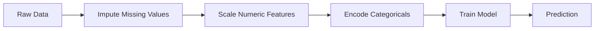
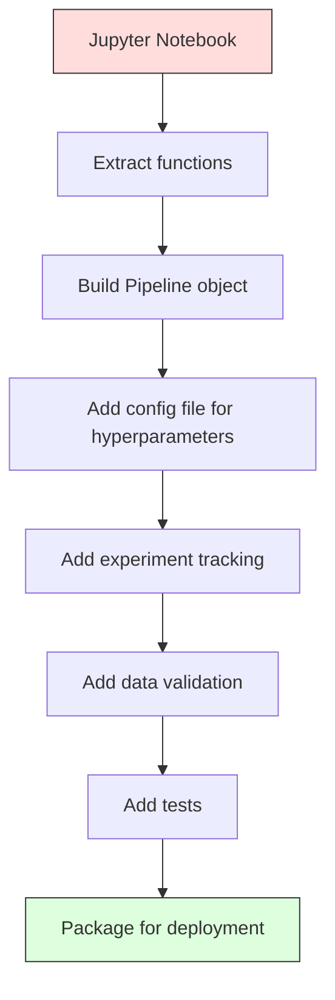

# ML đường ống dẫn
# ML 管线


> Một mô hình không phải là một sản phẩm. Một đường ống là. đường ống là mọi thứ từ dữ liệu thô để dự đoán triển khai, và mỗi bước phải được tái tạo.

> Mô hình không phải là sản phẩm, đường ống chỉ là. đường ống là mọi thứ từ dữ liệu ban đầu đến dự đoán triển khai, mỗi bước đều phải được thực hiện.

**Type:** Build | **类型：** 构建
**Language:**Python**语言：**Python
**Prerequisites:** Phase 2, Lesson 12 (Hyperparameter Tuning) | **前置知识：** Phase 2 第 12 课（超参数调优）
**Time:** ~120 minutes | **时间：** 约 120 分钟

## Mục tiêu học tập

- Xây dựng một đường ống ML từ đầu nối kết tính toán, quy mô, mã hóa và đào tạo mô hình thành một đối tượng có thể tái tạo
  Từ zero xây dựng ML 管 line, sẽ lấp đầy, thu nhỏ, mã hóa và mô hình đào tạo liên kết thành một đối tượng có thể thực hiện
- Xác định các kịch bản rò rỉ dữ liệu và giải thích cách các đường ống ngăn chặn chúng bằng cách lắp đặt các bộ biến đổi chỉ trên dữ liệu đào tạo
  识别数据泄漏场景, giải thích đường ống thông qua chỉ trên dữ liệu đào tạo phù hợp để ngăn chặn rò rỉ
- Xây dựng một ColumnTransformer áp dụng các tính năng số và phân loại khác nhau
  Construct ColumnTransformer, đối với số lượng và các loại đặc điểm ứng dụng khác nhau
- Thực hiện hệ thống tiếp theo của đường ống và chứng minh rằng cùng một đường ống được gắn kết tạo ra kết quả giống nhau trong đào tạo và sản xuất
  Thực hiện trình tự hóa ống, hiển thị các ống phù hợp cùng nhau trong đào tạo và sản xuất tạo ra kết quả tương tự


> **【中文解读】**
> ML 管线把数据预处理"",特征工程"",模型训练串成一条流水线"",sklearn pipeline" 确保训练和推理的数据处理一致――

> **【拓展：从 sklearn Pipeline 到 MLOps 工业级管线】**
> Kỹ thuật phân tích của các hệ thống máy bay điện tử và các hệ thống máy bay điện tử của Google là một trong những hệ thống điện tử điện tử điện tử của Google.

## Vấn đề  vấn đề giới thiệu

Bạn có một sổ ghi chép tải dữ liệu, lấp đầy các giá trị thiếu với trung bình, cân tính, đào tạo mô hình, và in chính xác. Nó hoạt động. Bạn vận chuyển nó.

> Bạn có một sổ ghi chép, tải dữ liệu, sử dụng số trung bình để lấp đầy thiếu giá trị, giảm tính năng, mô hình tập luyện, in tỷ lệ xác thực. Nó hiệu quả. Bạn đã lên đường.

Một tháng sau, ai đó đào tạo lại mô hình và có kết quả khác nhau. Média được tính trên toàn bộ bộ dữ liệu bao gồm dữ liệu thử nghiệm (bổn dữ liệu). Các tham số quy mô không được lưu lại, vì vậy suy luận sử dụng số liệu thống kê khác nhau. Mã kỹ thuật tính năng được sao chép dán giữa đào tạo và phục vụ, và các bản sao khác nhau. Một cột categorical đã đạt được một giá trị mới trong sản xuất mà bộ mã hóa chưa bao giờ thấy.

> Một tháng sau, một người đã tái tập luyện mô hình và nhận được kết quả khác nhau. Số trung bình được tính trên tập dữ liệu toàn bộ bao gồm dữ liệu thử nghiệm.

Những hệ thống này không phải là giả thuyết, chúng là những lý do phổ biến nhất khiến hệ thống ML thất bại trong sản xuất.

> Những điều này không phải giả thuyết. Chúng là nguyên nhân phổ biến nhất của hệ thống ML thất bại trong sản xuất.

> **【中文解读】**
> ML 管线解决的核心问题:训练和推理的数据处理必须完全一致.

## Khái niệm cốt lõi

### Đường ống là gì

Một đường ống là một chuỗi các chuyển đổi dữ liệu được sắp xếp theo sau bởi một mô hình. Mỗi bước lấy đầu ra của bước trước đó như là đầu vào. Toàn bộ đường ống được gắn một lần trên dữ liệu đào tạo. Vào thời điểm suy luận, cùng một đường ống được gắn kết biến đổi dữ liệu mới và tạo ra dự đoán.

> Chuyện là một chuỗi thay đổi dữ liệu có trật tự, cuối cùng theo một mô hình. Mỗi bước sẽ được chuyển sang đầu ra như là đầu vào.



Các đường ống đảm bảo:
- Các biến đổi chỉ được lắp đặt trên dữ liệu đào tạo (không có rò rỉ)
  变换 chỉ được chuẩn bị trên dữ liệu đào tạo không bị rò rỉ)
- Các biến đổi tương tự được áp dụng tại thời điểm suy luận
  推理时应用相同变更
- Toàn bộ đối tượng có thể được phân phối và triển khai như một đồ tạo vật
   toàn bộ đối tượng có thể được sắp xếp và triển khai như một bộ phận
- Việc xác thực chéo áp dụng đường ống cho mỗi lần, ngăn ngừa rò rỉ tinh tế
  交叉验证 trong mỗi vòng áp dụng ống, ngăn chặn các rò rỉ nhỏ

### Tiết lộ dữ liệu: Người giết người im lặng

Sự rò rỉ dữ liệu xảy ra khi thông tin từ bộ thử nghiệm hoặc dữ liệu trong tương lai làm ô nhiễm đào tạo.

> Sự rò rỉ dữ liệu xảy ra trong quá trình đào tạo về ô nhiễm thông tin trong tập hợp thử nghiệm hoặc dữ liệu trong tương lai.

**Leaky (wrong):**
```python
X = df.drop("target", axis=1)
y = df["target"]

scaler = StandardScaler()
X_scaled = scaler.fit_transform(X)

X_train, X_test = X_scaled[:800], X_scaled[800:]
y_train, y_test = y[:800], y[800:]
```

Máy đo đã thấy dữ liệu thử nghiệm. trung bình và lệch tiêu chuẩn bao gồm các mẫu thử nghiệm. Điều này làm tăng ước tính độ chính xác.

> 缩放器看到了测试数据──平均值和标准差包含测试样本──这会夸大准确率估计──

**Correct:**
```python
X_train, X_test = X[:800], X[800:]

scaler = StandardScaler()
X_train_scaled = scaler.fit_transform(X_train)
X_test_scaled = scaler.transform(X_test)
```

Với một đường ống, bạn không cần phải nghĩ về điều này.

> Sử dụng đường ống, bạn không cần phải xem xét những điều này.

### Schularn Pipeline

Sklern của `Pipeline`Các biến đổi chuỗi và một máy ước tính.`.fit()`- `.predict()`, và`.score()`Những bước này được áp dụng theo trật tự.

> sklearn của `Pipeline`sẽ biến đổi và ước tính liên kết lên.`.fit()``.predict()`和 `.score()`, theo trật tự áp dụng tất cả các bước:

```python
from sklearn.pipeline import Pipeline
from sklearn.preprocessing import StandardScaler
from sklearn.linear_model import LogisticRegression

pipe = Pipeline([
    ("scaler", StandardScaler()),
    ("model", LogisticRegression()),
])

pipe.fit(X_train, y_train)
predictions = pipe.predict(X_test)
```

Khi anh gọi`pipe.fit(X_train, y_train)`- Có thể là:
1. Scaler gọi `fit_transform`trên tàu X_
2. Các cuộc gọi mẫu`fit`trên tàu X_scale

Khi anh gọi`pipe.predict(X_test)`- Có thể là:
1. Scaler gọi `transform`(không fit_transform) trên X_test
2. Các cuộc gọi mẫu`predict`trên thử nghiệm X_test quy mô

Máy đo không bao giờ nhìn thấy dữ liệu thử nghiệm trong quá trình lắp đặt.

> Khi bạn调用`pipe.fit(X_train, y_train)`- Có thể là:
> 1. 缩放器对 X_train 调用 `fit_transform`
> 2. 模型对缩放后的 X_train 调用 `fit`
>
> Khi bạn调用`pipe.predict(X_test)`- Có thể là:
> 1. 缩放器对 X_test 调用 `transform`(不是 fit_transform)
> 2. 模型对缩放后的 X_test 调用 `predict`
>
> 缩放器在拟合期间永远看不到测试数据――这是全部意义――

### ColumnTransformer: Các đường ống khác nhau cho các cột khác nhau

Các tập dữ liệu thực có cột số và danh mục cần xử lý trước khác nhau. `ColumnTransformer`làm việc này.

> Real dataset có các hàng và các loại, cần phải xử lý trước khác nhau.`ColumnTransformer`Làm việc này.

```python
from sklearn.compose import ColumnTransformer
from sklearn.preprocessing import StandardScaler, OneHotEncoder
from sklearn.impute import SimpleImputer

numeric_pipe = Pipeline([
    ("impute", SimpleImputer(strategy="median")),
    ("scale", StandardScaler()),
])

categorical_pipe = Pipeline([
    ("impute", SimpleImputer(strategy="most_frequent")),
    ("encode", OneHotEncoder(handle_unknown="ignore")),
])

preprocessor = ColumnTransformer([
    ("num", numeric_pipe, ["age", "income", "score"]),
    ("cat", categorical_pipe, ["city", "gender", "plan"]),
])

full_pipeline = Pipeline([
    ("preprocess", preprocessor),
    ("model", GradientBoostingClassifier()),
])
```

- `handle_unknown="ignore"`Khi một danh mục mới xuất hiện (một thành phố mà mô hình chưa bao giờ thấy), nó tạo ra một vector không thay vì sụp đổ.

> OneHotEncoder 中的 `handle_unknown="ignore"`Khi một loại mới xuất hiện (một mô hình thành phố chưa từng thấy) nó tạo ra khối lượng không lớn hơn là sụp đổ.

### Theo dõi thí nghiệm

Một đường ống làm cho việc đào tạo có thể tái tạo, nhưng bạn cũng cần theo dõi những gì đã xảy ra trong các thí nghiệm: các siêu tham số nào đã được sử dụng, phiên bản tập dữ liệu nào, những thước đo nào, mã nào đang chạy.

> 管线让训练可复现, nhưng bạn cũng cần theo dõi các thí nghiệm xảy ra trong: sử dụng những siêu参数 nào, phiên bản tập dữ liệu nào, chỉ số nào, chạy mã nào.

**MLflow**là giải pháp mã nguồn mở phổ biến nhất:

> **MLflow**là các giải pháp nguồn mở phổ biến nhất:

```python
import mlflow

with mlflow.start_run():
    mlflow.log_param("max_depth", 5)
    mlflow.log_param("n_estimators", 100)
    mlflow.log_param("learning_rate", 0.1)

    pipe.fit(X_train, y_train)
    accuracy = pipe.score(X_test, y_test)

    mlflow.log_metric("accuracy", accuracy)
    mlflow.sklearn.log_model(pipe, "model")
```

Mỗi lần chạy được ghi lại với các tham số, số liệu, đồ tạo vật và mô hình đầy đủ. Bạn có thể so sánh chạy, tái tạo bất kỳ thí nghiệm nào và triển khai bất kỳ phiên bản mô hình nào.

> Mỗi lần chạy đều ghi lại các tham số, chỉ số, cấu trúc và mô hình hoàn chỉnh. Bạn có thể so sánh các chạy, tái hiện bất kỳ thí nghiệm nào, triển khai bất kỳ phiên bản mô hình nào.

**Weights & Biases (wandb)**cung cấp chức năng tương tự với bảng điều khiển được lưu trữ:

> **Weights & Biases (wandb)**提供相同功能,带托管仪表盘:

```python
import wandb

wandb.init(project="my-pipeline")
wandb.config.update({"max_depth": 5, "n_estimators": 100})

pipe.fit(X_train, y_train)
accuracy = pipe.score(X_test, y_test)

wandb.log({"accuracy": accuracy})
```

### Phương pháp phiên bản mô hình

Sau khi thử nghiệm, bạn cần quản lý phiên bản mô hình. mô hình nào đang sản xuất? mô hình nào đang được triển khai? mô hình nào là của tuần trước?

> Sau khi thử nghiệm theo dõi, bạn cần quản lý phiên bản mô hình. mô hình nào đang sản xuất? mô hình nào đang được triển khai? mô hình nào đã được phát triển?

Các mẫu đăng ký của MLflow cung cấp:
- **Version tracking:**Mỗi mô hình được lưu lại sẽ có số phiên bản
  **版本追踪：**Mỗi mô hình được lưu giữ được phiên bản số
- **Stage transitions:**"Stage", "Sản xuất", "Tài lưu"
  **阶段转换：**"Stage" ̋"Sản xuất" ̋"Tài lưu"
- **Approval workflow:**Các mô hình phải được thúc đẩy rõ ràng vào sản xuất
  **审批工作流：**Mô hình phải được nâng cao rõ ràng để sản xuất
- **Rollback:**Chuyển lại phiên bản trước ngay lập tức
  **回滚：**立即切回之前的版本

### DLC

Mã được phiên bản với git. Dữ liệu cũng nên được phiên bản, nhưng git không thể xử lý các tệp lớn. DVC (Data Version Control) giải quyết vấn đề này.

> 代码 dùng git 版本化. DATA cũng nên được phiên bản hóa, nhưng git không thể xử lý các file lớn.

```
dvc init
dvc add data/training.csv
git add data/training.csv.dvc data/.gitignore
git commit -m "Track training data"
dvc push
```

DVC lưu trữ dữ liệu thực tế trong bộ nhớ từ xa (S3, GCS, Azure) và giữ một số nhỏ `.dvc`file trong git ghi lại hash. khi bạn kiểm tra một commit git,`dvc checkout`khôi phục dữ liệu chính xác đã được sử dụng.

> DVC đặt dữ liệu thực tế lưu trữ ở phía xa ((S3、GCS、Azure), trong git giữ một nhỏ`.dvc`Khi bạn kiểm tra một git  gửi thời gian,`dvc checkout`Khôi phục dữ liệu chính xác được sử dụng lúc đó.

Điều này có nghĩa là mỗi pin giao dịch git đều có mã và dữ liệu.

> Điều này có nghĩa là mỗi git 提交 đều cố định mã và dữ liệu  hoàn toàn có thể thực hiện 

### Các thí nghiệm có thể tái tạo

Một thí nghiệm có thể tái tạo đòi hỏi bốn điều:

> Một thí nghiệm có thể thực hiện cần bốn điều:

1. **Fixed random seeds:**Đặt hạt cho numpy, ngẫu nhiên, và khung (cốc cháy, sklearn)
   **固定随机种子：**Vì vậy, không cần phải làm gì.
2. **Pinned dependencies:**requirements.txt hoặc poetry.lock với các phiên bản chính xác
   **固定依赖：**requirements.txt hoặc poetry.lock 锁定精确版本
3. **Versioned data:**DVC hoặc tương tự
   **版本化数据：**DVC hoặc các công cụ tương tự
4. **Config files:**Tất cả các siêu tham số trong cấu hình, không có mã cứng
   **配置文件：**Tất cả các siêu số được đặt vào cấu hình, không cần mã hóa cứng

```python
import numpy as np
import random

def set_seed(seed=42):
    random.seed(seed)
    np.random.seed(seed)
    try:
        import torch
        torch.manual_seed(seed)
        torch.cuda.manual_seed_all(seed)
        torch.backends.cudnn.deterministic = True
    except ImportError:
        pass
```

### Từ sổ ghi chép đến đường ống sản xuất



Sự tiến triển điển hình:

> 典型演进:

1. **Notebook exploration:**Các thí nghiệm nhanh, hình ảnh hóa, ý tưởng tính năng
   **notebook 探索：**快速实验、可视化、特征思想
2. **Extract functions:**Chuyển chuyển quá trình xử lý trước, kỹ thuật tính năng, đánh giá thành mô-đun
   **抽取函数：**Chuyển chuyển dự xử lý, đặc điểm, đánh giá vào các mô-đun
3. **Build Pipeline:**Chuyển đổi chuỗi thành đường ống sơn hoặc lớp tùy chỉnh
   **构建 Pipeline：**Để biến đổi chuỗi thành đường ống sơn hoặc tự định nghĩa
4. **Config management:**Di chuyển tất cả các siêu tham số vào cấu hình YAML / JSON
   **配置管理：**把所有超参数 chuyển đến YAML / JSON  cấu hình
5. **Experiment tracking:**Thêm MLflow hoặc logging wandb
   **实验追踪：**添加 MLflow hoặc đinh ngày志
6. **Data validation:**Kiểm tra các sơ đồ, phân phối và các mô hình giá trị thiếu trước khi đào tạo
   **数据验证：**训练前检查 schema、 phân bố、缺失模式
7. **Tests:**Các thử nghiệm đơn vị cho các biến thể, thử nghiệm tích hợp cho toàn bộ đường ống
   **测试：**变换器的单元测试、完整管线的集成测试
8. **Deployment:**Tạo dòng ống dẫn, bao trong một API (FastAPI, Flask), chứa
   **部署：**序列化管线、包成 API(FastAPI、Flask)、容器化

### Những sai lầm phổ biến về đường ống dẫn

| Mistake | Why it is bad | Fix |
|---------|-------------|-----|
| Fitting on full data before splitting | Data leakage | Use Pipeline with cross_val_score |
| Feature engineering outside pipeline | Different transforms at train vs serve | Put all transforms in the Pipeline |
| Not handling unknown categories | Production crash on new values | OneHotEncoder(handle_unknown="ignore") |
| Hardcoded column names | Breaks when schema changes | Use column name lists from config |
| No data validation | Silently wrong predictions on bad data | Add schema checks before prediction |
| Training/serving skew | Model sees different features in prod | One Pipeline object for both |

| 错误 | 为什么坏 | 修复 |
|------|---------|------|
| 划分前在全量数据上 fit | 数据泄漏 | 用 Pipeline 配合 cross_val_score |
| 管线外做特征工程 | 训练和服务变换不同 | 把所有变换放进 Pipeline |
| 不处理未知类别 | 生产中新值导致崩溃 | OneHotEncoder(handle_unknown="ignore") |
| 硬编码列名 | schema 改变时失效 | 用配置中的列名列表 |
| 没有数据验证 | 坏数据上预测错误无提示 | 预测前加 schema 检查 |
| 训练/服务偏差 | 生产中模型看到不同特征 | 训练和服务用同一个 Pipeline 对象 |

## Hãy xây dựng nó.

> **【中文解读】**
> Từ zero thực hiện ML 管线: tự xác định Transformer (tự xác định Transformer) 、Pipeline 类 、链式调用多变换器) 、ColumnTransformer (tự xác định các biến đổi khác nhau) ⋅ Keyword của đường ống là: fit chỉ trong các tham số học tập trên dữ liệu đào tạo,transform trong các thử nghiệm / suy đoán dữ liệu áp dụng cùng một biến đổi, 杜绝数据泄漏──

> **【拓展：sklearn Pipeline 在 Kaggle 和工业界的标准模式】**
> Các mô hình mã chuẩn của Kaggle Grandmaster gần như luôn chứa một đường ống thông: số tính năng sử dụng SimpleImputer + StandardScaler, loại tính năng sử dụng SimpleImputer + OneHotEncoder, thông qua ColumnTransformer 组合后输入模型── điều này đảm bảo: giao thông kiểm tra mỗi lần phù hợp độc lập、 new data推理时变化一致、代码简洁可维护── trong sản xuất, đường ống có thể sử dụng các trình tự lưu trữ, triển khai trực tiếp tải sử dụng──
```figure
f3-pipeline-flow
```

## Hãy xây dựng nó

Mã trong `code/pipeline.py`xây dựng một đường ống ML hoàn chỉnh từ đầu:

### Bước 1: Cải biến tùy chỉnh

```python
class CustomTransformer:
    def __init__(self):
        self.means = None
        self.stds = None

    def fit(self, X):
        self.means = np.mean(X, axis=0)
        self.stds = np.std(X, axis=0)
        self.stds[self.stds == 0] = 1.0
        return self

    def transform(self, X):
        return (X - self.means) / self.stds

    def fit_transform(self, X):
        return self.fit(X).transform(X)
```

### Bước 2: Đường ống từ đầu

```python
class PipelineFromScratch:
    def __init__(self, steps):
        self.steps = steps

    def fit(self, X, y=None):
        X_current = X.copy()
        for name, step in self.steps[:-1]:
            X_current = step.fit_transform(X_current)
        name, model = self.steps[-1]
        model.fit(X_current, y)
        return self

    def predict(self, X):
        X_current = X.copy()
        for name, step in self.steps[:-1]:
            X_current = step.transform(X_current)
        name, model = self.steps[-1]
        return model.predict(X_current)
```

### Bước 3: Việc xác nhận chéo với đường ống

Mã cho thấy cách xác thực chéo với một đường ống ngăn chặn rò rỉ dữ liệu: máy đo lường quy mô được lắp đặt riêng biệt trên dữ liệu đào tạo của mỗi gấp.

### Bước 4: Đường ống sản xuất đầy đủ với sklearn

Một đường ống đầy đủ với `ColumnTransformer`, nhiều con đường xử lý trước, và một mô hình, được đào tạo với xác thực chéo thích hợp và ghi chép thí nghiệm.

## Chuyển nó đi.

Bài học này mang lại:
- `outputs/prompt-ml-pipeline.md`-- một kỹ năng xây dựng và debugging đường ống ML
- `code/pipeline.py`-- một đường ống hoàn chỉnh từ đầu qua sklearn

## Tập luyện bài tập

1. Xây dựng một đường ống xử lý một tập dữ liệu với 3 cột số và 2 cột danh mục. Sử dụng `ColumnTransformer`để áp dụng tính toán trung bình + quy mô cho số và tính toán thường xuyên nhất + mã hóa một lần cho các loại.
   1.  cấu trúc xử lý 3 chuỗi số và 2 chuỗi phân loại tập hợp dữ liệu `ColumnTransformer`Đối với các ứng dụng hàng số số 填充+缩缩, đối với các ứng dụng hàng loại 填充+ mã độc lập 编码―― dùng 5 折交叉验证训练――

2. Chuẩn bị rò rỉ dữ liệu: kết hợp bộ quy mô trên toàn bộ bộ dữ liệu trước khi chia. So sánh điểm xác thực chéo (cổn) với điểm xác thực chéo đường ống (tẩy sạch).
   2. Vì vậy, ý định giới thiệu rò rỉ dữ liệu: trong phân chia trước với toàn bộ số lượng dữ liệu phù hợp quy mô.

3. Tạo ra dòng ống dẫn của bạn với `joblib.dump`Lắp vào một kịch bản riêng biệt và chạy dự đoán.
   3. 用 `joblib.dump`序列化你的管线──在另一个脚本中加载并运行预测──验证预测完全相同──

4. Thêm một bộ biến đổi tùy chỉnh vào đường ống tạo ra các tính năng đa số (đường 2) cho hai cột số quan trọng nhất. Nó nên đi đâu trong đường ống?
   4. Trong đường ống, thêm một bộ biến đổi tự định nghĩa, tạo ra nhiều tính năng cho hai chuỗi số quan trọng nhất (đường 2) ―― nó nên đặt ở vị trí nào trên đường ống?

5. Thiết lập theo dõi dòng chảy ML cho đường ống.`mlflow ui`) để so sánh chạy và chọn mô hình tốt nhất.
   5. 为管线设置 MLflow 追踪──用不同超参数运行 5 个实验──用 MLflow UI(`mlflow ui`(Tình hình: )

> **【中文解读】**
> ML 管线的关键设计原则:(1) Tất cả các thay đổi phải có thể được sắp xếp  sử dụng sổ làm việc/các nhựa 保存完整的装配管线,部署时直接加载;(2) ColumnTransformer 处理混合类型数值特征和类特征分别变换后合并;(3) 管线内不能有任何全局状态每个变压器的适应只依赖传输的训练数据――这些原则确保了训练推理一致.

> **【拓展：数据泄漏的六种常见形式】**
> (1) Scaler fit trên toàn số dữ liệu tái phân chia;(2) 目标编码 sử dụng toàn số dữ liệu tính toán trung bình;(3) 时间序列随机划分;(4) 特征选择在全量数据上做;(5) 交叉验证中重复样本出现多次;(6) 预测时使用未来才能获取的特征――管道通过严格的适应/转换 分离防止前四种泄漏――对于时间序列和重复样本,需要特殊的交叉验证策略――

## Từ khóa  Từ khóa nhanh chóng

| Term | What people say | What it actually means |
|------|----------------|----------------------|
| Pipeline | "Chain of transforms + model" | An ordered sequence of fitted transformers and a model, applied as one unit to prevent leakage |
| Data leakage | "Test info leaked into training" | Using information from outside the training set to build the model, inflating performance estimates |
| ColumnTransformer | "Different preprocessing per column" | Applies different pipelines to different subsets of columns, combining results |
| Experiment tracking | "Logging your runs" | Recording parameters, metrics, artifacts, and code versions for every training run |
| MLflow | "Track and deploy models" | Open-source platform for experiment tracking, model registry, and deployment |
| DVC | "Git for data" | Version control system for large data files, storing hashes in git and data in remote storage |
| Model registry | "Model version catalog" | A system that tracks model versions with stage labels (staging, production, archived) |
| Training/serving skew | "It worked in the notebook" | Differences between how data is processed during training versus inference, causing silent errors |
| Reproducibility | "Same code, same result" | The ability to get identical results from the same code, data, and configuration |

## Xem thêm 延伸阅读

- [scikit-learn Pipeline docs](https://scikit-learn.org/stable/modules/compose.html)-- thông tin tham chiếu chính thức về đường ống dẫn
  [scikit-learn Pipeline 文档](https://scikit-learn.org/stable/modules/compose.html)- 官方管线参考
- [MLflow documentation](https://mlflow.org/docs/latest/index.html)-- theo dõi thí nghiệm và đăng ký mô hình
  [MLflow 文档](https://mlflow.org/docs/latest/index.html)- 实验追踪和模型注册
- [DVC documentation](https://dvc.org/doc)-- phiên bản dữ liệu
  [DVC 文档](https://dvc.org/doc)- Data version quản lý
- [Sculley et al., Hidden Technical Debt in Machine Learning Systems (2015)](https://papers.nips.cc/paper/2015/hash/86df7dcfd896fcaf2674f757a2463eba-Abstract.html)-- bài báo ban đầu về sự phức tạp của hệ thống ML
  [Sculley et al., Hidden Technical Debt in ML Systems (2015)](https://papers.nips.cc/paper/2015/hash/86df7dcfd896fcaf2674f757a2463eba-Abstract.html)- ML 系统复杂性的奠基论文
- [Google ML Best Practices: Rules of ML](https://developers.google.com/machine-learning/guides/rules-of-ml)-- tư vấn về sản xuất thực tế
  [Google ML Best Practices](https://developers.google.com/machine-learning/guides/rules-of-ml)- 实用生产 ML 建议
