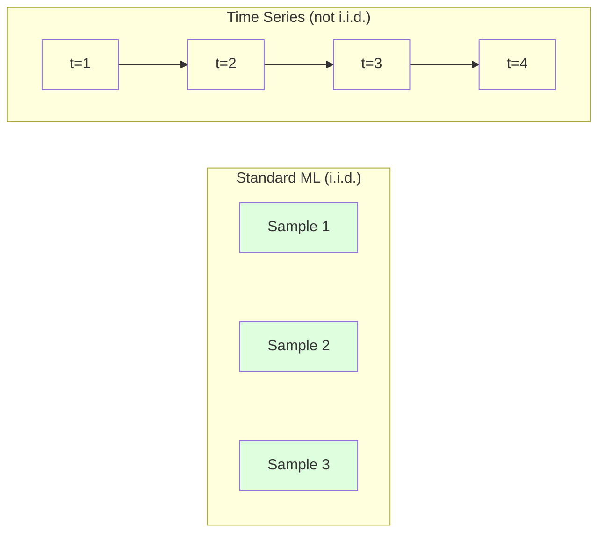
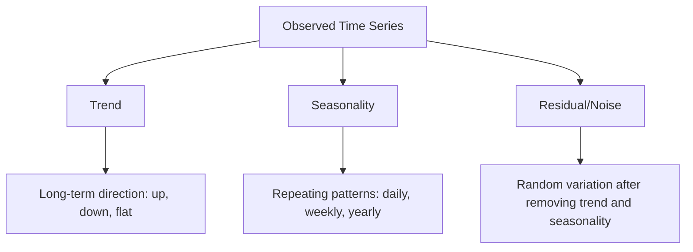
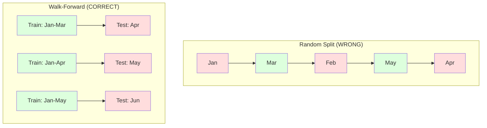

# Các nguyên tắc cơ bản của chuỗi thời gian
# 时间序列基础


> Hiệu suất trong quá khứ dự đoán kết quả trong tương lai -- nếu bạn kiểm tra tính tĩnh ở trước.

>  Sự biểu hiện trong quá khứ thực sự có thể dự đoán tương lai  giả định là bạn đã kiểm tra tính ổn định trước.

**Type:** Build | **类型：** 构建
**Language:**Python**语言：**Python
**Prerequisites:** Phase 2, Lessons 01-09 | **前置知识：** Phase 2 第 1-9 课
**Time:** ~90 minutes | **时间：** 约 90 分钟

## Mục tiêu học tập

- Phân hủy một chuỗi thời gian thành xu hướng, tính theo mùa và các thành phần còn lại và kiểm tra tính tĩnh
  Phân tích chuỗi thời gian thành xu hướng, mùa và chênh lệch, và kiểm tra sự ổn định
- Thực hiện các tính năng chậm trễ và thống kê tròn để chuyển đổi một chuỗi thời gian thành một vấn đề học tập được giám sát
  实现滞后特征和滚动统计将时间序列转换为监督学习问题
- Xây dựng một khuôn khổ xác nhận tiến bộ để ngăn chặn dữ liệu trong tương lai bị rò rỉ vào đào tạo
  Xây dựng khung chứng minh tiến hành, ngăn chặn các vụ rò rỉ dữ liệu trong tương lai trong quá trình đào tạo
- Giải thích tại sao phân chia tàu/bản thử nghiệm ngẫu nhiên không hợp lệ cho chuỗi thời gian và chứng minh khoảng cách hiệu suất so với phân chia thời gian thích hợp
  解释 tại sao việc phân chia theo thời gian không hiệu quả, và không sử dụng phân chia thời gian chính xác để hiển thị sự khác biệt hiệu suất


> **【中文解读】**
> 时间序列是按时间序列排列的数据──ARIMA、指数平滑是经典方法,LSTM/Transformer是深度学习方法──股票预测、销量预测、天气预报是典型应用──

> **【拓展：时间序列预测在金融和供应链中的关键角色】**
> Amazon sử dụng thời gian chuỗi dự đoán để quản lý hàng trăm tỷ SKU trên toàn cầu, dự đoán hàng ngày vượt quá 400 tỷ lần; Uber sử dụng thời gian chuỗi mô hình dự đoán nhu cầu để động thái调调价; tăng giá; tổ chức tài chính sử dụng ARIMA /GARCH mô hình dự đoán tỷ lệ biến động để quản lý rủi ro.

## Vấn đề  vấn đề giới thiệu

Bạn có dữ liệu theo thời gian, bán hàng hàng ngày, nhiệt độ hàng giờ, CPU mỗi phút, giá cổ phiếu hàng tuần, bạn muốn dự đoán giá trị tiếp theo, tuần tới, quý tới.

> Bạn có dữ liệu theo thời gian xếp hạng. Số lượng bán hàng hàng ngày, nhiệt độ giờ, CPU sử dụng mỗi phút, giá cổ phiếu tuần. Bạn muốn dự đoán giá trị tuần tới, tuần tới, quý tới.

Bạn tìm ra bộ công cụ ML tiêu chuẩn của mình: phân chia rào tạo / thử nghiệm, xác nhận chéo, tính năng matrix vào, dự đoán ra. Mỗi bước đều sai.

> Bạn sử dụng tiêu chuẩn ML 工具:随机训练/测试划分、交叉验证、特征矩阵输入、预测输出── mỗi bước đều sai lầm──

Dòng thời gian phá vỡ các giả định mà ML tiêu chuẩn dựa trên. Các mẫu không độc lập - nhiệt độ ngày hôm nay phụ thuộc vào ngày hôm qua. Sự phân chia ngẫu nhiên rò rỉ thông tin tương lai vào quá khứ. Các tính năng trông tuyệt vời trong backtest thất bại trong sản xuất bởi vì chúng dựa trên các mô hình thay đổi theo thời gian.

>  Tiếp theo thời gian phá vỡ giả thuyết dựa trên tiêu chuẩn ML.  Mô hình không độc lập nhiệt độ ngày hôm nay phụ thuộc vào ngày hôm qua.  tự nhiên phân chia sẽ tiết lộ thông tin trong tương lai cho quá khứ.

Một mô hình có độ chính xác 95% với xác thực chéo ngẫu nhiên có thể có được 55% với đánh giá dựa trên thời gian thích hợp. Sự khác biệt không phải là một tính kỹ thuật. Đó là sự khác biệt giữa một mô hình hoạt động trên giấy và một mô hình hoạt động trong sản xuất.

> Một mô hình có 95% độ chính xác trong quá trình kiểm tra giao thông tự động chỉ có thể đạt được 55% trong quá trình đánh giá đúng thời gian.

Bài học này bao gồm các yếu tố cơ bản: điều gì làm cho dữ liệu thời gian khác biệt, cách đánh giá mô hình một cách trung thực, và cách biến một chuỗi thời gian thành các tính năng mà mô hình ML tiêu chuẩn có thể tiêu thụ.

> Bài học này bao gồm kiến thức cơ bản: làm thế nào để dữ liệu thời gian khác nhau, làm thế nào để thực sự đánh giá mô hình, và làm thế nào để chuyển đổi chuỗi thời gian thành các đặc điểm có thể sử dụng mô hình ML tiêu chuẩn.

> **【中文解读】**
> Sự khác biệt của phân tích chuỗi thời gian là sự phụ thuộc thời gian giữa các điểm dữ liệu. Giá trị ngày hôm nay phụ thuộc vào giá trị ngày hôm qua. Điều này phá vỡ giả thuyết độc lập và phân bố tiêu chuẩn ML. Khái niệm cốt lõi: sự ổn định (stability)  Tính chất thống kê không thay đổi theo thời gian. Xu hướng + mùa + phân tích chênh lệch; đặc điểm trễ và thống kê xoay chuyển thành vấn đề học tập giám sát.

## Khái niệm cốt lõi

### Điều gì làm cho chuỗi thời gian khác nhau

ML tiêu chuẩn giả định i.i.d. -- độc lập và phân phối giống nhau. Mỗi mẫu được lấy từ cùng một phân phối, độc lập với các mẫu khác. Dòng thời gian vi phạm cả hai:

> 标准 ML 假设 i.i.d.独立同分布── mỗi mẫu được rút ra từ cùng một phân bố, không liên quan đến các mẫu khác── chuỗi thời gian vi phạm hai giả thuyết:

- **Not independent.**Giá cổ phiếu ngày hôm nay phụ thuộc vào giá cổ phiếu ngày hôm qua.
  Không độc lập. Giá cổ phiếu ngày hôm nay phụ thuộc vào ngày hôm qua.
- **Not identically distributed.**Việc phân phối thay đổi theo thời gian.
  Không đồng phân phối. Phân phối thay đổi theo thời gian.

Những vi phạm này không nhỏ, chúng thay đổi cách bạn xây dựng các tính năng, cách bạn đánh giá các mô hình và các thuật toán hoạt động.

> Những vi phạm này không phải là những vấn đề nhỏ. Chúng đã thay đổi cách bạn xây dựng các tính năng, cách đánh giá mô hình và các thuật toán hiệu quả.



Trong ML tiêu chuẩn, các mẫu có thể thay đổi, việc trộn chúng không thay đổi gì, trong chuỗi thời gian, thứ tự là tất cả, trộn hủy tín hiệu.

> Trong chuẩn ML, mô hình là có thể thay đổi. Trong chuỗi thời gian, thứ tự là mọi thứ.

### Các thành phần của chuỗi thời gian

Mỗi chuỗi thời gian là sự kết hợp của:

> Mỗi chuỗi thời gian là thành phần của các thành phần sau:



- **Trend**Các doanh thu tăng 10% mỗi năm nhiệt độ toàn cầu tăng
  趋势:长期方向.
- **Seasonality**: Phác lại các mô hình trong khoảng thời gian cố định.
  季节性: cố định间隔的重复模式── bán lẻ bán hàng tăng vào tháng 12──空调 sử dụng đạt đỉnh vào tháng 7──
- **Residual**Nếu dư lượng trông giống như tiếng ồn trắng, sự phân hủy đã thu thập tín hiệu.
  Rigid: loại bỏ phần trending và phần sau mùa. Nếu phần còn lại trông giống như tiếng ồn trắng, giải thích đã thu được tín hiệu.

### Sự cố định

Một chuỗi thời gian là tĩnh nếu các tính chất thống kê của nó (tỷ lệ trung bình, biến thể, tương quan tự động) không thay đổi theo thời gian.

> Nếu tính thống kê của một chuỗi thời gian không thay đổi theo thời gian, thì nó là ổn định.

**Why it matters:**Một loạt không tĩnh có một con số trung bình có thể biến động. Một mô hình được đào tạo dựa trên dữ liệu từ tháng 1 đã học được một con số khác so với những gì tháng 2 sẽ cho thấy. Nó sẽ có hệ thống sai.

> **为什么重要：**Giá trị trung bình của chuỗi không ổn định sẽ di chuyển.

**How to check:**Xét trung bình xoay và lệch chuẩn xoay trên cửa sổ. Nếu chúng trôi, chuỗi không tĩnh.

> **如何检查：**计算窗口内的滚动平均值和滚动标准差──如果它们漂移,序列就是不平稳的──

**How to fix:**Thay vì mô hình hóa các giá trị thô, mô hình hóa sự thay đổi giữa các giá trị liên tiếp:

> **如何修复：**差分── không đối với giá trị nguyên bản, mà đối với sự thay đổi giữa giá trị liên tục:

```
diff[t] = value[t] - value[t-1]
```

Nếu một vòng phân biệt không làm cho chuỗi không ổn định, hãy áp dụng nó một lần nữa ( phân biệt thứ hai).

> Nếu một vòng phân biệt không thể làm cho chuỗi bình đẳng, hãy áp dụng lại một lần nữa.

**Example:**

> **示例：**

Bộ phim gốc: [100, 102, 106, 112, 120]
Sự khác biệt đầu tiên: [2, 4, 6, 8] (vẫn đang xu hướng tăng)
Sự khác biệt thứ hai: [2, 2, 2] (thường xuyên -- tĩnh)

Các loạt ban đầu có xu hướng hình vuông. sự phân biệt đầu tiên biến nó thành xu hướng tuyến tính. sự phân biệt thứ hai làm cho nó bằng phẳng.

> Các chuỗi ban đầu có xu hướng hai. Một giai đoạn khác biệt sẽ biến nó thành xu hướng tuyến tính.

**Formal test:**Thử nghiệm Dickey-Fuller (ADF) tăng cường là thử nghiệm thống kê tiêu chuẩn cho sự tĩnh lặng. Hipotezy null là "series là không tĩnh". Một p-đáng giá dưới 0,05 có nghĩa là bạn có thể từ chối null và kết luận về tĩnh lặng.

> **正式检验：**Thiết kế tăng cường Dickey-Fuller (ADF) kiểm tra là kiểm tra thống kê tiêu chuẩn ổn định. Cấp đoán không ổn định. Cấp đoán không ổn định là "sự sắp xếp không ổn định".

### Tự tương quan

Autocorrelation đo lường mức độ một giá trị tại thời điểm t tương quan với giá trị tại thời điểm t-k (k bước trong quá khứ).

> Tính quan hệ giữa giá trị của thời gian đo t và giá trị của thời gian t-k(tước qua k )

**ACF tells you:**
- Nếu ACF giảm xuống 0 sau khi trễ 5, giá trị hơn 5 bước trước là không liên quan.
  序列 có nhiều bộ nhớ. Nếu ACF trong 5 后 bị trì hoãn giảm xuống 0, vượt quá 5 步 trước đó sẽ không còn quan trọng.
- Nếu ACF tăng ở độ trễ 12 (kết lượng dữ liệu hàng tháng), có tính theo mùa hàng năm.
  Có hay không có mùa. Nếu ACF trong 12 处滞 (đáng số lượng) xuất hiện đỉnh, thì có mùa hàng năm.
- Sử dụng các tính năng lag cho đến khi ACF trở nên vô dụng.
  创建多少滞后特征――使用直到 ACF 变得忽略的滞后――

**PACF (Partial Autocorrelation Function)**Nếu ngày hôm nay tương quan với 3 ngày trước chỉ vì cả hai tương quan với ngày hôm qua, PACF ở lag 3 sẽ là không trong khi ACF ở lag 3 sẽ không.

> **PACF（偏自相关函数）**Để loại bỏ liên quan gián tiếp. Nếu ngày hôm nay liên quan đến 3 天前 chỉ vì cả hai đều liên quan đến ngày hôm qua, PACF ở phía sau 3 là 0, trong khi ACF ở phía sau 3 là không.

### Các tính năng Lag: Chuyển đổi chuỗi thời gian thành học tập được giám sát

Các mô hình ML tiêu chuẩn cần một số tính năng X và một mục tiêu y. Dòng thời gian cho bạn một cột giá trị duy nhất.

> 标准 ML 模型 cần đặc điểm của矩阵 X 和目标 y.

Hãy lấy chuỗi [10, 12, 14, 13, 15] và tạo các tính năng lag-1 và lag-2:

> 取序列 [10, 12, 14, 13, 15] 并创建滞后 1 和滞后 2 đặc điểm:

| lag_2 | lag_1 | target |
|-------|-------|--------|
| 10    | 12    | 14     |
| 12    | 14    | 13     |
| 14    | 13    | 15     |

Bây giờ bạn có một vấn đề hồi quy tiêu chuẩn. bất kỳ mô hình ML (thái ngược tuyến tính, rừng ngẫu nhiên, tăng độ) có thể dự đoán mục tiêu từ sự chậm trễ.

> Bây giờ bạn có một vấn đề về trở lại tiêu chuẩn. Bất kỳ mô hình ML nào có thể được tìm thấy từ các mục tiêu dự đoán.

Các tính năng bổ sung bạn có thể thiết kế:
- **Rolling statistics:**trung bình, std, min, tối đa trên các giá trị k cuối cùng
  滚动统计: giá trị trung bình, giá trị chuẩn, giá trị tối thiểu, giá trị tối đa của quá khứ
- **Calendar features:**Ngày của tuần, tháng, ngày lễ, cuối tuần
  日历特征:星期几月份是否假期是否周末
- **Differenced values:**Thay đổi từ bước trước
  差分值: với sự thay đổi của bước trước
- **Expanding statistics:**trung bình tích lũy, tổng tích lũy
  扩展统计: tích lũy trung bình giá trị, tích lũy và
- **Ratio features:**giá trị hiện tại / trung bình xoay (trừ mức trung bình gần đây)
  Đặc điểm tỷ lệ: giá trị hiện tại / giá trị trung bình xoay 
- **Interaction features:**lag_1 * ngày_of_week (chấn động của ngày trong tuần)
  交互特征:lag_1 * ngày_of_week(工作日对动量的影响)

**How many lags?**Sử dụng hàm tương quan tự động. Nếu ACF có ý nghĩa lên đến 10 độ trễ, hãy sử dụng ít nhất 10 độ trễ. Nếu có tính theo mùa hàng tuần, hãy bao gồm độ trễ 7 (và có thể 14).

> **用多少个滞后？**Sử dụng hàm tự liên quan. Nếu ACF trong hậu 10 và trong đều đáng kể, sử dụng ít nhất 10 hậu. Nếu có thời tiết mùa, bao gồm hậu 7 có thể còn 14)

**The target alignment trap.**Khi tạo các tính năng lag, mục tiêu phải là giá trị tại thời điểm t, và tất cả các tính năng phải sử dụng giá trị tại thời điểm t-1 hoặc trước đó. Nếu bạn vô tình bao gồm giá trị tại thời điểm t như một tính năng, bạn có một dự đoán hoàn hảo - và một mô hình hoàn toàn vô dụng. Đây là lỗi phổ biến nhất trong kỹ thuật tính năng chuỗi thời gian.

> **目标对齐陷阱。**Khi tạo ra các đặc điểm trễ, mục tiêu phải là giá trị của thời gian t, tất cả các đặc điểm phải sử dụng giá trị thời gian t-1 hoặc sớm hơn. Nếu bạn không dự định sẽ sử dụng giá trị thời gian t như một đặc điểm, bạn đã có một máy dự đoán hoàn hảo, nhưng cũng là một mô hình hoàn toàn vô dụng. Đây là lỗi phổ biến nhất trong công trình trình tự thời gian.

### Đăng bằng tiến

Đây là khái niệm quan trọng nhất trong bài học này. Kiểm tra chéo k-fold tiêu chuẩn ngẫu nhiên gán các mẫu để đào tạo và kiểm tra. Đối với chuỗi thời gian, điều này rò rỉ thông tin trong tương lai.

> Đây là khái niệm quan trọng nhất của bài học này.



Định đắc tiến:
1. Đào tạo dữ liệu đến thời gian t
   Trong thời gian t  trước dữ liệu trên đào tạo
2. Dự đoán tại thời gian t+1 (hoặc t+1 đến t+k cho nhiều bước)
   Trong thời gian t+1 预测(或多步预测 t+1 đến t+k)
3. Nhượt cửa sổ về phía trước
   Ngửa sổ chuyển động
4. Lặp lại
   重复

Mỗi lớp thử nghiệm chỉ chứa dữ liệu sau tất cả dữ liệu đào tạo. Không có rò rỉ trong tương lai. Điều này cho bạn một ước tính trung thực về hiệu suất của mô hình khi được triển khai.

> Mỗi thời gian thử nghiệm chỉ chứa dữ liệu sau tất cả các dữ liệu đào tạo. Không có rò rỉ trong tương lai.

**Expanding window**sử dụng tất cả dữ liệu lịch sử cho đào tạo (trung kính tăng). **Sliding window**sử dụng cửa sổ đào tạo kích thước cố định (gạch cửa sổ). Sử dụng mở rộng khi bạn tin rằng dữ liệu cũ vẫn có liên quan. Sử dụng gạch khi thế giới thay đổi và dữ liệu cũ đau.

> **扩展窗口**Sử dụng tất cả dữ liệu lịch sử để thực hiện đào tạo**滑动窗口**Sử dụng cửa sổ tập luyện cố định kích thước lớn (Fixed Size Training Window) ️ Khi bạn nghĩ dữ liệu cũ vẫn liên quan, hãy sử dụng cửa sổ mở rộng ️ Khi thế giới thay đổi và dữ liệu cũ có hại, hãy sử dụng cửa sổ trượt ️️

### ARIMA Intuition

ARIMA là mô hình chuỗi thời gian cổ điển. Nó có ba thành phần:

> ARIMA là mô hình chuỗi thời gian cổ điển. Nó có ba thành phần:

- **AR (Autoregressive):**Dự đoán từ các giá trị trước đây. AR(p) sử dụng các giá trị p cuối cùng.
  AR(自归归): Từ quá khứ giá trị预测。AR(p) 使用最近 p 个值。
- **I (Integrated):**Sự khác biệt để đạt được sự tĩnh lặng.
  I(积分): thông qua差分实现平稳性。I(d) 应用 d 轮差分。
- **MA (Moving Average):**Dự đoán từ lỗi dự báo trước. MA(q) sử dụng các lỗi q cuối cùng.
  MA(移动平均): Từ quá khứ预测误差预测。MA(q) 使用最近的 q 个误差。

ARIMA ((p, d, q) kết hợp cả ba. Bạn chọn p, d, q dựa trên phân tích ACF/PACF hoặc tìm kiếm tự động (auto-ARIMA).

> ARIMA(p, d, q) 组合了所有三个成分──你基于ACF/PACF 分析或自动搜索(auto-ARIMA) chọn p、d、q──

Chúng ta sẽ không thực hiện ARIMA từ đầu - nó đòi hỏi tối ưu hóa số ngoài phạm vi của bài học này. Thấu hiểu chính là hiểu những gì mỗi thành phần làm để bạn có thể giải thích kết quả ARIMA và biết khi nào sử dụng nó.

> Chúng ta sẽ không thực hiện ARIMA từ không, nó cần phải vượt qua phạm vi của lớp học này.

### Khi nào nên sử dụng gì

| Approach | Best For | Handles Seasonality | Handles External Features |
|----------|---------|-------------------|------------------------|
| Lag features + ML | Tabular with many external features | With calendar features | Yes |
| ARIMA | Single univariate series, short-term | SARIMA variant | No (ARIMAX for limited) |
| Exponential smoothing | Simple trend + seasonality | Yes (Holt-Winters) | No |
| Prophet | Business forecasting, holidays | Yes (Fourier terms) | Limited |
| Neural networks (LSTM, Transformer) | Long sequences, many series | Learned | Yes |

Đối với hầu hết các vấn đề thực tế, tính năng lag + tăng độ là điểm khởi đầu mạnh nhất. Nó xử lý các tính năng bên ngoài tự nhiên, không yêu cầu tĩnh, và dễ dàng để gỡ lỗi.

> Đối với hầu hết các vấn đề thực tế, chất trì hoãn + thang độ nâng là điểm khởi đầu mạnh nhất. Nó tự nhiên xử lý các đặc điểm bên ngoài, không cần sự ổn định, và dễ điều chỉnh.

### Dự đoán về các đường chân trời và chiến lược

Dự báo một bước dự đoán một bước tiến một lần. Dự báo nhiều bước dự đoán nhiều bước. Có ba chiến lược:

> 单步预测预测 下一个时间步──多步预测预测多个时间步── có ba chiến lược:

**Recursive (iterated):**Dự đoán một bước đi trước, sử dụng dự đoán như là đầu vào cho bước tiếp theo. đơn giản nhưng sai lầm tích lũy - mỗi dự đoán sử dụng dự đoán trước đó, vì vậy sai lầm phức tạp.

> **递归（迭代）：**预测一步, sẽ kết quả dự đoán như là bước tiếp theo của nhập. 简单但错误会积累每个预测使用前一个预测,因此错误会叠加

**Direct:**Tập một mô hình riêng cho mỗi chân trời. Mô hình-1 dự đoán t+1, Mô hình-5 dự đoán t+5. Không tích lũy lỗi, nhưng mỗi mô hình có ít mẫu đào tạo hơn và chúng không chia sẻ thông tin.

> **直接：**Đối với mỗi dự đoán phạm vi đào tạo mô hình riêng lẻ. Mô hình 1  dự đoán t+1, Mô hình 5  dự đoán t+5── không có sự tích lũy sai lầm, nhưng mô hình đào tạo của mỗi mô hình ít hơn và không chia sẻ thông tin──

**Multi-output:**Trình tạo một mô hình phát ra tất cả các đường chân trời cùng một lúc. Chia sẻ thông tin qua đường chân trời nhưng yêu cầu một mô hình hỗ trợ nhiều đường lối ra (hoặc một chức năng mất tùy chỉnh).

> **多输出：**训练一个模型同时输出所有预测范围――跨范围共享信息, nhưng cần hỗ trợ nhiều mô hình输出 (或自定义损失函数) ――

Đối với hầu hết các vấn đề thực tế, bắt đầu với lặp lại cho các chân trời ngắn (1-5 bước) và trực tiếp cho các chân trời dài hơn.

> Đối với hầu hết các vấn đề thực tế, ngắn hạn (short range) 1-5 bước) sử dụng chuyển tiếp, dài hạn sử dụng phương pháp trực tiếp.

### Những sai lầm phổ biến trong chuỗi thời gian

| Mistake | Why it happens | How to fix |
|---------|---------------|-----------|
| Random train/test split | Habit from standard ML | Use walk-forward or temporal split |
| Using future features | Feature at time t included by mistake | Audit every feature for temporal alignment |
| Overfitting to seasonality | Model memorizes calendar patterns | Hold out a full seasonal cycle in the test set |
| Ignoring scale changes | Revenue doubles but patterns stay | Model percentage change instead of absolute |
| Too many lag features | "More history is better" | Use ACF to determine relevant lags |
| Not differencing | "The model will figure it out" | Tree models handle trends; linear models need stationarity |

## Hãy xây dựng nó.

> **【中文解读】**
> Từ 0 thực hiện các chuỗi thời gian: trễ tạo nhân tố (LEGAD) sẽ chuyển thành giám sát học tập (MAT) 滚动统计 (ROLLING) 移动平均,移动标准差) 平稳性检查 (PLA)  ADF 检查 (ADF 检查) 时间序列分解 (Trend+季节性+残差) 步进 (Walk-forward) 验证框架 (Walk-forward) 关键教训:绝不能随机划分时间序列数据)).

> **【拓展：从 ARIMA 到 Transformer——时间序列预测的进化】**
> 经典时间序列方法 (ARIMA、Holt-Winters) vẫn còn hiệu quả trên đơn biến量、短序列. Nhưng phương pháp hiện đại đã vượt qua đáng kể: Facebook's Prophet tự động xử lý节假日和季节性; Amazon's DeepAR sử dụng tự quay trở lại RNN làm dự đoán tỷ lệ; Google's TimesFM và Amazon's Chronos sử dụng cấu trúc Transformer, đạt được đột phá trong dự đoán chuỗi thời gian trong mẫu零 (zero-shot).
```figure
f3-series-decompose
```

## Hãy xây dựng nó

Mã trong `code/time_series.py`thực hiện các khối xây dựng cốt lõi từ đầu.

> `code/time_series.py`Mã trung tâm từ không thực hiện các mô-đun xây dựng cốt lõi.

### Lag Feature Creator

```python
def make_lag_features(series, n_lags):
    n = len(series)
    X = np.full((n, n_lags), np.nan)
    for lag in range(1, n_lags + 1):
        X[lag:, lag - 1] = series[:-lag]
    valid = ~np.isnan(X).any(axis=1)
    return X[valid], series[valid]
```

Điều này chuyển đổi một chuỗi 1D thành một matrix tính năng nơi mỗi hàng có cuối cùng `n_lags`giá trị như các tính năng, và giá trị hiện tại như mục tiêu.

> Đây sẽ là một chuỗi chuyển đổi thành một mô hình mô hình, mỗi dòng sẽ gần đây `n_lags`个值作为特征,当前值作为目标──

### Chứng minh chéo đi trước

```python
def walk_forward_split(n_samples, n_splits=5, min_train=50):
    assert min_train < n_samples, "min_train must be less than n_samples"
    step = max(1, (n_samples - min_train) // n_splits)
    for i in range(n_splits):
        train_end = min_train + i * step
        test_end = min(train_end + step, n_samples)
        if train_end >= n_samples:
            break
        yield slice(0, train_end), slice(train_end, test_end)
```

Mỗi phân chia đảm bảo dữ liệu đào tạo được đưa ra trước dữ liệu thử nghiệm.

> Mỗi lần phân chia đảm bảo dữ liệu đào tạo nghiêm ngặt trong dữ liệu thử nghiệm trước.

### Mô hình tự động đơn giản

Một mô hình AR thuần túy chỉ là sự lùi lại tuyến tính trên các tính năng lag:

> Mô hình AR đơn giản là trở lại về mặt tuyến tính của các đặc điểm bị trì hoãn:

```python
class SimpleAR:
    def __init__(self, n_lags=5):
        self.n_lags = n_lags
        self.weights = None
        self.bias = None

    def fit(self, series):
        X, y = make_lag_features(series, self.n_lags)
        # Solve via normal equations
        X_b = np.column_stack([np.ones(len(X)), X])
        theta = np.linalg.lstsq(X_b, y, rcond=None)[0]
        self.bias = theta[0]
        self.weights = theta[1:]
        return self
```

Điều này về khái niệm giống hệt với sự lùi ngược tuyến tính từ Bài học 02, nhưng được áp dụng cho các phiên bản thời gian chậm cùng một biến.

> Đây là khái niệm tương tự như sự trở lại tuyến tính của lớp 2, nhưng được áp dụng cho phiên bản thời gian chậm lại của cùng một biến số.

### Kiểm tra sự cố định

Mã tính toán thống kê xoay để đánh giá trực quan và số lượng sự cố định:

> 代码计算滚动统计, đánh giá tính ổn định bằng cách hình dung và số:

```python
def check_stationarity(series, window=50):
    rolling_mean = np.array([
        series[max(0, i - window):i].mean()
        for i in range(1, len(series) + 1)
    ])
    rolling_std = np.array([
        series[max(0, i - window):i].std()
        for i in range(1, len(series) + 1)
    ])
    return rolling_mean, rolling_std
```

Nếu biến động trung bình tròn hoặc biến động std tròn, chuỗi không tĩnh.

> Nếu giá trị trung bình xoay chuyển hoặc biến đổi tiêu chuẩn xoay, trình tự là không ổn định.

Mã cũng kiểm tra tĩnh tính bằng cách so sánh nửa đầu tiên và nửa thứ hai của loạt. Nếu các phương tiện khác nhau hơn một nửa lệch chuẩn hoặc tỷ lệ biến số vượt quá 2x, loạt được đánh dấu là không tĩnh.

> Các mã cũng thông qua nửa đầu và nửa sau của chuỗi so sánh để kiểm tra tính ổn định. Nếu sự khác biệt trung bình hơn nửa chênh lệch tiêu chuẩn, hoặc chênh lệch so với hơn 2 lần, chuỗi được đánh dấu là không ổn định.

### Tự tương quan

```python
def autocorrelation(series, max_lag=20):
    n = len(series)
    mean = series.mean()
    var = series.var()
    acf = np.zeros(max_lag + 1)
    for k in range(max_lag + 1):
        cov = np.mean((series[:n-k] - mean) * (series[k:] - mean))
        acf[k] = cov / var if var > 0 else 0
    return acf
```

## Hãy sử dụng nó để thực hiện

Với sklearn, bạn sử dụng các tính năng lag trực tiếp với bất kỳ regressor nào:

> Sử dụng sklearn, bạn có thể trực tiếp sẽ bị trì hoãn cho bất kỳ máy quay trở:

```python
from sklearn.linear_model import Ridge
from sklearn.ensemble import GradientBoostingRegressor

X, y = make_lag_features(series, n_lags=10)

for train_idx, test_idx in walk_forward_split(len(X)):
    model = Ridge(alpha=1.0)
    model.fit(X[train_idx], y[train_idx])
    predictions = model.predict(X[test_idx])
```

Đối với ARIMA, sử dụng các mô hình thống kê:

>  Đối với ARIMA, sử dụng các mô hình thống kê:

```python
from statsmodels.tsa.arima.model import ARIMA

model = ARIMA(train_series, order=(5, 1, 2))
fitted = model.fit()
forecast = fitted.forecast(steps=30)
```

Mã trong `time_series.py`chứng minh cả hai phương pháp tiếp cận và so sánh chúng bằng cách sử dụng xác thực tiến bộ.

> `time_series.py`Các mã trong đó đã trình bày hai phương pháp, và sử dụng chứng minh xoay lánh trước để so sánh.

### sklearn TimeSeriesSplit

sklearn cung cấp `TimeSeriesSplit`thực hiện xác thực tiến hành:

> SHOULDARN  cung cấp `TimeSeriesSplit`, thực hiện trước hướng tròn:

```python
from sklearn.model_selection import TimeSeriesSplit

tscv = TimeSeriesSplit(n_splits=5)
for train_index, test_index in tscv.split(X):
    X_train, X_test = X[train_index], X[test_index]
    y_train, y_test = y[train_index], y[test_index]
    model.fit(X_train, y_train)
    score = model.score(X_test, y_test)
```

Đây là tương đương với việc bắt đầu từ đầu của chúng ta.`walk_forward_split`nhưng tích hợp vào khung xác thực chéo của sklearn.`cross_val_score`- Có thể là:

> Đó là tương đương với việc chúng ta thực hiện từ không.`walk_forward_split`Nhưng tích hợp trong khuôn khổ kiểm tra giao dịch của sklearn.`cross_val_score`Một起使用:

```python
from sklearn.model_selection import cross_val_score

scores = cross_val_score(model, X, y, cv=TimeSeriesSplit(n_splits=5))
print(f"Mean score: {scores.mean():.4f} +/- {scores.std():.4f}")
```

### Các số liệu đánh giá

Dự báo chuỗi thời gian sử dụng các số liệu hồi quy, nhưng với bối cảnh nhận thức về thời gian:

> 时间序列预测 sử dụng chỉ số quay trở lại, nhưng có cảm giác thời gian trên:

- **MAE (Mean Absolute Error):**"Trong trung bình, dự đoán bị giảm 3,2 độ".
  MAE(平均绝对差 - ), là giá trị trung bình của y_pred_they.
- **RMSE (Root Mean Squared Error):**Quảng gốc của lỗi trung bình vuông. Giói phạt lỗi lớn hơn MAE. Sử dụng khi lỗi lớn tồi tệ hơn nhiều lỗi nhỏ.
  RMSE (均方根誤差): 均方誤差的平方根──比 MAE 更严重地惩罚大误差──当大误差比许多小误差更糟糕时使用──
- **MAPE (Mean Absolute Percentage Error):**Trung bình của lỗi / giá trị thực sự của các * 100. scale-independent, hữu ích để so sánh giữa các chuỗi khác nhau. nhưng không xác định khi giá trị thực là không.
  MAPE (MPA): là một sự khác biệt trong số các phân tích, nhưng giá trị thực tại của nó không được xác định.
- **Naive baseline comparison:**Luôn so sánh với các đường cơ sở đơn giản. đường cơ sở ngây thơ theo mùa dự đoán giá trị từ một thời gian trước (ngày hôm qua, tuần trước). Nếu mô hình của bạn không thể đánh bại ngây thơ, có điều gì đó sai.
  朴素基线比较:始终与简单基线比较──季节性朴素基线预测一个周期前的值(昨天、上周)── Nếu mô hình của bạn không thể vượt qua đơn giản基线, giải thích vấn đề──

### Các tính năng trượt

Mã cho thấy thêm thống kê tròn (tỷ lệ trung bình, std, min, tối đa trên cửa sổ 7 và 14 ngày) để tính năng lag.

> Các mã chỉ ra sẽ có số liệu phân tích tròn (đồng giá, tiêu chuẩn khác nhau, giá trị tối thiểu, giá trị tối đa của cửa sổ 7 天 và 14 天) được thêm vào các đặc điểm trễ.

Ví dụ, nếu trung bình tròn đang tăng, nó cho thấy một xu hướng tăng lên. Nếu std tròn đang tăng, nó cho thấy sự biến động ngày càng tăng. Đây là các kiểu mẫu mà các mô hình dựa trên cây có thể học hỏi nhưng các mô hình tuyến tính không thể.

> Ví dụ, nếu giá trị trung bình xoay lên, cho thấy có xu hướng tăng lên. Nếu tiêu chuẩn xoay khác nhau tăng lên, cho thấy động lực tăng lên.

## Chuyển nó đi.

Bài học này mang lại:
- `outputs/prompt-time-series-advisor.md`-- một lời nhắc để khung các vấn đề chuỗi thời gian
  `outputs/prompt-time-series-advisor.md` 构建时间序列问题的提示词
- `code/time_series.py`-- tính năng lag, xác thực đi về phía trước, mô hình AR, kiểm tra tĩnh
  `code/time_series.py` 滞后特征、前向滚动验证、AR 模型、平稳性检查

### Các điểm cơ bản mà bạn phải vượt qua

Trước khi xây dựng bất kỳ mô hình nào, thiết lập các đường cơ sở:

> Trong xây dựng bất kỳ mô hình trước, xây dựng基线:

1. **Last value (persistence).**Hãy dự đoán rằng ngày mai sẽ giống như ngày hôm nay.
   Ưu điểm cuối cùng: Ưu điểm của ngày mai và ngày hôm nay:
2. **Seasonal naive.**Hãy dự đoán rằng ngày hôm nay sẽ giống như ngày hôm qua (hoặc năm ngoái). Nếu mô hình của bạn không thể đánh bại điều này, nó không học được bất kỳ mô hình hữu ích nào ngoài tính theo mùa.
   季节性朴素──预测 Hôm nay với tuần trước (hoặc năm ngoái) cùng một ngày── Nếu mô hình của bạn không thể vượt qua đường cơ sở này, nó không học được bất kỳ mô hình hữu ích nào vượt ra khỏi mùa──
3. **Moving average.**Dự đoán trung bình của các giá trị k cuối cùng.
   移动平均──预测 gần đây k 个值的平均值──平滑噪音但无法捕捉突变──

Nếu mô hình ML hay của bạn bị mất đến cơ sở ngây thơ theo mùa, bạn có một lỗi. Thông thường: rò rỉ trong tương lai trong các tính năng, phương pháp đánh giá sai, hoặc loạt là thực sự ngẫu nhiên và không thể dự đoán được.

> Nếu mô hình ML được thiết kế kỹ lưỡng đưa ra một đường cơ bản đơn giản về mùa, bạn có lỗi.

### Những lời khuyên hữu ích

1. **Start with plotting.**Trước khi mô hình hóa, hãy vẽ các chuỗi nguyên liệu. Tìm kiếm xu hướng, tính theo mùa, mức độ ngoại lệ, sự gián đoạn cấu trúc (các thay đổi đột ngột trong hành vi).
   Trước khi xây dựng, vẽ chuỗi gốc trước khi xây dựng. Tìm kiếm xu hướng, thời tiết, bất thường, thay đổi cấu trúc.

2. **Difference first, model second.**Nếu dòng có xu hướng rõ ràng, hãy phân biệt trước khi tạo ra các tính năng chậm trễ. Các mô hình dựa trên cây có thể xử lý xu hướng, nhưng các mô hình tuyến tính không thể, và phân biệt không bao giờ làm tổn thương.
   Nếu chuỗi có xu hướng rõ ràng, trước khi tạo trễ đặc điểm, mô hình cây có thể xử lý xu hướng, nhưng mô hình tuyến tính không thể, và sự khác biệt sẽ không có tác động tiêu cực.

3. **Hold out at least one full seasonal cycle.**Nếu bạn có tính theo mùa hàng tuần, bộ thử nghiệm của bạn cần ít nhất một tuần đầy đủ. Nếu hàng tháng, ít nhất một tháng đầy đủ. Nếu không bạn không thể đánh giá liệu mô hình có nắm bắt mô hình theo mùa hay không.
   Để lại ít nhất một chu kỳ mùa hoàn chỉnh. Nếu bạn có một tuần mùa, tập hợp thử nghiệm cần ít nhất một tuần. Nếu là một tháng, ít nhất một tháng. Nếu không bạn không thể đánh giá mô hình có bắt được một mô hình mùa.

4. **Monitor in production.**Các mô hình chuỗi thời gian giảm dần theo thời gian khi thế giới thay đổi. Theo dõi các lỗi dự đoán trên cơ sở tròn. Khi lỗi bắt đầu tăng lên, tập trung lại mô hình dựa trên dữ liệu gần đây.
   Trong sản xuất giám sát. Mô hình chuỗi thời gian thay đổi và suy yếu theo cách xoay theo dõi sai lầm dự đoán. Khi sai lầm bắt đầu tăng lên, sử dụng dữ liệu gần đây để đào tạo lại mô hình.

5. **Beware of regime changes.**Một mô hình được đào tạo dựa trên dữ liệu trước đại dịch sẽ không dự đoán hành vi sau đại dịch. Bao gồm các chỉ số về những thay đổi chế độ được biết đến như là tính năng, hoặc sử dụng cửa sổ trượt để quên dữ liệu cũ.
   Thay đổi trạng thái của tâm trí. Phương pháp đào tạo dữ liệu trước dịch bệnh không thể dự đoán hành vi sau dịch.

6. **Log-transform skewed series.**Thu nhập, giá và số lượng thường bị chuyển sang bên phải. Lấy nhật ký ổn định sự khác biệt và làm cho các mẫu nhân hóa được thêm vào, mà các mô hình tuyến tính có thể xử lý. Dự báo trong không gian nhật ký, sau đó tăng lên để trở lại các đơn vị ban đầu.
   Đối với các thay đổi theo chiều dài của chuỗi số. Thu nhập, giá và tính toán thường là ở chiều phải.

## Tập luyện bài tập

1. **Stationarity experiment.**Tạo một chuỗi với một xu hướng tuyến tính. kiểm tra tĩnh tính với thống kê xoay. Sử dụng phân biệt đầu tiên. kiểm tra lại.
   1. 生成一个带趋势和季节性的合成时间序列――使用移动平均和差分去除趋势――ADF 检查确认平稳性――

2. **Lag selection.**Xét ACF trên một chuỗi theo mùa (thời gian = 7). Những độ trễ nào có tương quan tự động cao nhất? Tạo các tính năng trễ chỉ sử dụng những độ trễ đó (không phải độ trễ liên tiếp).
   2. 构建滞后特征(lag 1-7) và滚动统计(窗口 3、7、14)。 dùng thang độ nâng cao cây dự đoán。

3. **Walk-forward vs random split.**Thực hiện một sự lùi lại của Ridge trên các tính năng lag. Đánh giá bằng cách phân chia ngẫu nhiên 80/20 và bằng cách xác nhận tiến bộ.
   3. Trong cùng một tập dữ liệu so sánh chứng nhận giao dịch theo thời gian và chứng nhận xoay lượn theo thời gian.

4. **Feature engineering.**Thêm trung bình xoay (window=7), std xoay (window=7), và tính năng ngày trong tuần vào các tính năng lag. So sánh độ chính xác với và không có các tính năng bổ sung này bằng cách sử dụng xác thực đi về phía trước.
   4. 实现 ARIMA(p, d, q) Từ零──网格搜索最优参数, dùng AIC 选择最佳模型──

5. **Multi-step forecasting.**Thay đổi mô hình AR để dự đoán 5 bước trước thay vì 1. So sánh hai chiến lược: (a) dự đoán một bước, sử dụng dự đoán như đầu vào cho bước tiếp theo (phản hồi), và (b) đào tạo các mô hình riêng biệt cho mỗi đường chân trời (thương trực tiếp).

> **【中文解读】**
> 时间序列的核心工具箱:ADF 检验判断平稳性(p-value < 0.05 拒绝非平稳假设);差分消除趋势(一阶差分 = 今天 - 昨天);滞后特征将序列转为监督学习格式(使用t-1, t-2,... 的值预测 t);滚动统计捕获局部趋势(7 天移动平均) ――Walk-forward 验证是唯一正确的评估方法:每次使用过去的数据预测未来,然后滑窗子──

## Từ khóa  Từ khóa nhanh chóng

| Term | What people say | What it actually means |
|------|----------------|----------------------|
| Stationarity | "The stats don't change over time" | A series whose mean, variance, and autocorrelation structure are constant over time |
| Differencing | "Subtract consecutive values" | Computing y[t] - y[t-1] to remove trends and achieve stationarity |
| Autocorrelation (ACF) | "How a series correlates with itself" | The correlation between a time series and a lagged copy of itself, as a function of the lag |
| Partial autocorrelation (PACF) | "Direct correlation only" | Autocorrelation at lag k after removing the effect of all shorter lags |
| Lag features | "Past values as inputs" | Using y[t-1], y[t-2], ..., y[t-k] as features to predict y[t] |
| Walk-forward validation | "Time-respecting cross-validation" | Evaluation where training data always precedes test data chronologically |
| ARIMA | "The classic time series model" | AutoRegressive Integrated Moving Average: combines past values (AR), differencing (I), and past errors (MA) |
| Seasonality | "Repeating calendar patterns" | Regular, predictable cycles in a time series tied to calendar periods (daily, weekly, yearly) |
| Trend | "The long-term direction" | A persistent increase or decrease in the series level over time |
| Expanding window | "Use all history" | Walk-forward validation where the training set grows with each fold |
| Sliding window | "Fixed-size history" | Walk-forward validation where the training set is a fixed-length window that slides forward |

## Xem thêm 延伸阅读

- [Hyndman and Athanasopoulos, Forecasting: Principles and Practice (3rd ed.)](https://otexts.com/fpp3/)- sách giáo khoa miễn phí tốt nhất về dự báo chuỗi thời gian
  [Hyndman & Athanasopoulos: Forecasting: Principles and Practice](https://otexts.com/fpp3/)- 免费在线教材
- [scikit-learn Time Series Split](https://scikit-learn.org/stable/modules/generated/sklearn.model_selection.TimeSeriesSplit.html)- Bộ phân chia đi bộ của sklearn
  [statsmodels 时间序列文档](https://www.statsmodels.org/stable/tsa.html)- Python 时间序列分析库
- [statsmodels ARIMA docs](https://www.statsmodels.org/stable/generated/statsmodels.tsa.arima.model.ARIMA.html)-- Thực hiện ARIMA với chẩn đoán
  [sklearn TimeSeriesSplit](https://scikit-learn.org/stable/modules/cross_validation.html#time-series-cross-validation)
- [Makridakis et al., The M5 Competition (2022)](https://www.sciencedirect.com/science/article/pii/S0169207021001874)-- cạnh tranh dự báo quy mô lớn cho thấy các phương pháp ML so với các phương pháp thống kê
