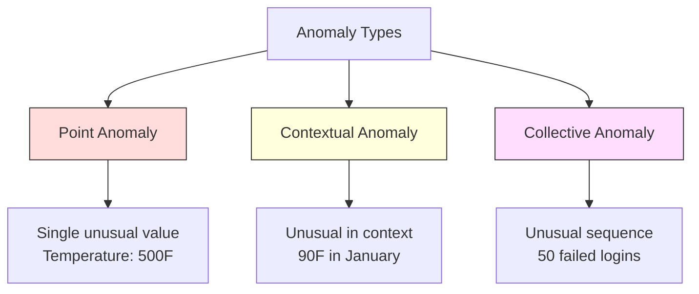
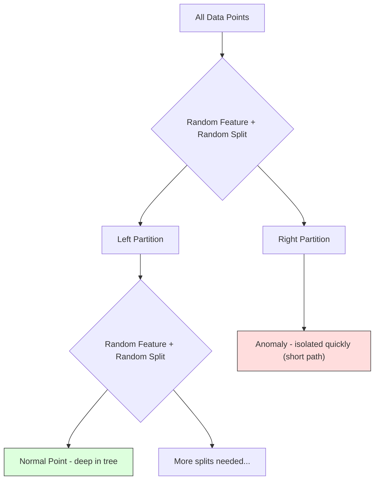
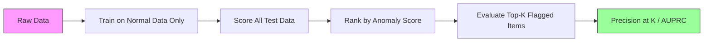

# Khám phá bất thường
# 异常检测


> Thường thì dễ định nghĩa, bất thường là bất cứ điều gì không phù hợp.

> 正常易定义──不正常就是不合适──

**Type:** Build | **类型：** 构建
**Language:**Python**语言：**Python
**Prerequisites:** Phase 2, Lessons 01-09 | **前置知识：** Phase 2 第 1-9 课
**Time:** ~75 minutes | **时间：** 约 75 分钟

## Mục tiêu học tập

- Thực hiện phương pháp phát hiện bất thường rừng từ đầu
  Từ zero thực hiện điểm Z-IQR và rừng cách ly  Phương pháp kiểm tra bất thường
- Hóa ra sự khác biệt giữa điểm, ngữ cảnh và bất thường tập thể và chọn phương pháp phát hiện phù hợp cho mỗi
  区分点异常、上下文异常和集合异常, cho mỗi lựa chọn phù hợp với phương pháp kiểm tra
- Giải thích tại sao việc phát hiện bất thường được định hình như mô hình hóa dữ liệu bình thường thay vì phân loại bất thường
  Giải thích tại sao các xét nghiệm bất thường được xây dựng trong khuôn khổ để mô hình dữ liệu bình thường chứ không phải phân loại bất thường
- So sánh phát hiện bất thường không được giám sát với phân loại được giám sát và đánh giá sự cân bằng giữa bảo hiểm bất thường mới và độ chính xác
  So sánh kiểm tra bất thường không giám sát và phân loại giám sát, đánh giá tỷ lệ phủ và tỷ lệ xác định bất thường mới


> **【中文解读】**
> 异常检测找出不同数据点──信用卡欺诈检测、设备故障预警、网络入侵检测都依赖于它──隔离森林 和 一级 SVM là phương pháp thường dùng──sklearn 中的隔离森林──

> **【拓展：异常检测在金融和网络安全中的核心应用】**
> Hệ thống kiểm tra gian lận thực tế của Visa xử lý khoảng 76,000 giao dịch mỗi giây, sử dụng phương pháp hỗn hợp kiểm tra bất thường + giám sát học, trong khoảng 150 毫秒 để đánh giá liệu có gian lận hay không. Hệ thống bảo mật mạng của Google sử dụng kiểm tra bất thường phát hiện DDoS tấn công và hành vi đăng nhập bất thường. Hệ thống quản lý pin của Tesla sử dụng kiểm tra bất thường trước khi báo động lỗi pin.

## Vấn đề  vấn đề giới thiệu

Một thẻ tín dụng được sử dụng ở New York lúc 2 giờ chiều, sau đó ở Tokyo lúc 2:05 giờ chiều. Một cảm biến nhà máy đọc 150 độ khi phạm vi bình thường là 80-120.

> Một张信用卡下午2点在纽约使用,然后在东京使用2:05 .工厂传感器读数150°,而正常范围是80-120°.

Đây là những bất thường, tìm ra chúng là quan trọng, gian lận tốn hàng tỷ đô la, lỗi thiết bị tốn thời gian ngừng hoạt động, dữ liệu chi phí xâm nhập mạng.

> Những điều này là bất thường. Việc phát hiện chúng là rất quan trọng. Sự lừa đảo gây ra hàng tỷ tổn thất. Thiết bị bị hỏng dẫn đến ngừng hoạt động.

Thách thức: bạn hiếm khi dán nhãn các ví dụ về bất thường. Trận gian lận chiếm 0,1% các giao dịch. Thiết bị bị hỏng xảy ra vài lần mỗi năm. Bạn không thể đào tạo một phân loại tiêu chuẩn bởi vì có hầu như không có gì trong lớp "phác thường" để học hỏi. Ngay cả khi bạn có một số nhãn, những bất thường mà bạn đã thấy không phải là những loại duy nhất bạn sẽ gặp phải. Kế hoạch gian lận ngày mai trông khác với ngày hôm nay.

> 挑战 là: bạn rất ít có mẫu nhãn bất thường. Phong hận chiếm chỉ 0,1% giao dịch. Thiết bị bị hỏng chỉ xảy ra vài lần mỗi năm. Bạn không thể đào tạo các phân loại tiêu chuẩn, vì trong lớp "những nhãn bất thường" có hầu như không có gì để học.

Việc phát hiện bất thường làm thay đổi vấn đề. Thay vì tìm hiểu những gì bất thường, hãy tìm hiểu những gì bình thường. Bất cứ điều gì đi xa khỏi bình thường là đáng ngờ. Điều này hoạt động mà không có nhãn hiệu, thích nghi với các loại bất thường mới, và quy mô với tập dữ liệu khổng lồ.

> 异常检测翻转了问题──不学"什么是异常",而是学"什么是正常"── bất cứ điều gì xa xôi khỏi bình thường đều đáng ngờ──

> **【中文解读】**
> 异常检测的关键思路反转:不学"什么是异常",而是学"什么是正常",偏离正常的就是可疑的.

## Khái niệm cốt lõi

### Các loại bất thường

Không phải tất cả các bất thường đều giống nhau:

> Không phải tất cả những điều bất thường đều giống nhau:

- **Point anomalies.**Một điểm dữ liệu duy nhất bất thường bất kể bối cảnh.$50,000 from an account that normally spends $50 người.
  Điểm khác thường. Không có gì khác thường.
- **Contextual anomalies.**Một điểm dữ liệu không bình thường khi xem xét bối cảnh của nó. nhiệt độ 90 độ là bình thường vào mùa hè, bất thường vào mùa đông. cùng một giá trị, bối cảnh khác nhau.
                                                                                                                                                                                                                                                                
- **Collective anomalies.**Một chuỗi các điểm dữ liệu không bình thường như một nhóm, mặc dù mỗi điểm riêng lẻ có thể bình thường. Năm lỗi đăng nhập là bình thường. Năm mươi liên tiếp là một cuộc tấn công bằng lực thô.
  集合异常──一组数据点作为整体不正常,即使每个单独的点可能是正常──五次登录失败正常──连续五十次就是暴力破解攻击──

Hầu hết các phương pháp phát hiện bất thường điểm. bất thường ngữ cảnh cần thời gian hoặc địa điểm đặc điểm. bất thường tập thể cần các phương pháp nhận thức chuỗi.

> Đại đa số phương pháp kiểm tra điểm bất thường.



### Việc làm khung không được giám sát

Trong phân loại tiêu chuẩn, bạn có nhãn cho cả hai lớp. Trong phát hiện bất thường, bạn thường có một trong ba tình huống:

> Trong các phân loại tiêu chuẩn, bạn có hai loại nhãn. Trong các xét nghiệm bất thường, bạn thường gặp một trong ba tình huống sau:

1. **Fully unsupervised.**Không có nhãn nào, bạn gắn máy dò vào tất cả dữ liệu và hy vọng bất thường là đủ hiếm để không làm hỏng mô hình "thường"
   完全无监督──完全没有标签──你在所有数据上配合检测器,希望异常足够少以至不会破坏"正常"模型──
2. **Semi-supervised.**Bạn có một bộ dữ liệu sạch chỉ có dữ liệu bình thường. Bạn phù hợp với bộ sạch này và ghi điểm tất cả mọi thứ khác. Đây là thiết lập mạnh nhất khi có thể.
   半监督──你只有一个干净的正常数据集──你在干净集合上适合,然后对所有其他数据打分──这是可能时最强的设置──
3. **Weakly supervised.**Bạn có một vài bất thường được dán nhãn. Sử dụng chúng để đánh giá, không phải để đào tạo. đào tạo mà không được giám sát, sau đó đo độ chính xác/tái nhớ trên bộ phụ được dán nhãn.
   弱监督──你有一些标标的异常──将它们用于评估而不是训练──无监督训练,然后在标标子集上测量精确率/召回率──

Nhìn sâu sắc chính: phát hiện bất thường là khác nhau về cơ bản với phân loại. Bạn đang mô hình hóa phân phối dữ liệu bình thường, không phải là ranh giới quyết định giữa hai lớp.

> 关键洞察: Phân tích bất thường và phân loại là những điểm khác nhau.

### Người được giám sát và người không được giám sát: Sự đổi mới

Nếu bạn có những bất thường được dán nhãn, bạn nên sử dụng chúng cho việc đào tạo (sự phân loại được giám sát) hoặc chỉ để đánh giá (phát hiện không được giám sát)?

> Nếu bạn thực sự có những bất thường được đánh dấu, bạn nên sử dụng chúng để đào tạo hay chỉ để đánh giá?

**Supervised (treat as classification):**
- Chụp các loại bất thường chính xác mà bạn đã thấy trước đây
  n bắt được những loại bất thường nhất mà bạn đã từng thấy
- Độ chính xác cao hơn đối với các loại bất thường được biết đến
  Tỷ lệ chính xác cao hơn đối với các loại bất thường được biết đến
- Chưa có những loại bất thường mới hoàn toàn
  完全错过新类型异常
- Cần đào tạo lại khi các loại bất thường mới xuất hiện
  Khi các loại bất thường mới xuất hiện cần phải đào tạo lại
- Cần đủ các ví dụ bất thường (thường là quá ít)
  需要足够的异常样本 (thường là quá ít)

**Unsupervised (model normal, flag deviations):**
- Chụp bất kỳ khấu lệch nào từ bình thường, bao gồm các loại mới
  Khám phá bất kỳ tình huống nào khác biệt với bình thường, bao gồm cả loại mới
- Không yêu cầu bất thường được dán nhãn
  Không cần phải đánh dấu
- Tỷ lệ dương tính sai cao hơn (không phải mọi thứ bất thường đều xấu)
  Tỷ lệ giả tích cực cao hơn (không phải tất cả những gì không bình thường đều xấu)
- Tăng cường hơn cho chuyển đổi phân phối
  Đối với phân phối chuyển động

Trong thực tế, các hệ thống tốt nhất kết hợp cả hai: phát hiện không giám sát cho sự bao phủ rộng, các mô hình giám sát cho các loại bất thường ưu tiên cao được biết đến và đánh giá của con người cho các trường hợp mơ hồ.

> Trong thực tế, hệ thống tốt nhất kết hợp hai: kiểm tra không giám sát được sử dụng để bao phủ rộng rãi, kiểm tra mô hình được sử dụng cho các loại khác thường ưu tiên cao được biết đến, kiểm tra nhân tạo được sử dụng cho các tình huống có thể.

### Phương pháp điểm Z

Cách tiếp cận đơn giản nhất: tính toán trung bình và lệch tiêu chuẩn của mỗi tính năng. Đánh dấu bất kỳ điểm nào nhiều hơn k lệch tiêu chuẩn từ trung bình.

> Cách đơn giản nhất: tính toán giá trị trung bình và điểm khác biệt tiêu chuẩn của mỗi đặc điểm.

```text
z_score = (x - mean) / std
anomaly if |z_score| > threshold
```

Giá trị dự định là 3,0 (99,7% dữ liệu bình thường nằm trong 3 lệch tiêu chuẩn cho phân bố Gaussian).

> 默认值为3.0 ((高斯分布中99.7%的正常数据落在3标准差内)

**Strengths:**Đơn giản, nhanh chóng, có thể giải thích ("điều này là 4,5 lệch tiêu chuẩn từ bình thường").

> **优势：**简单――快速――可解释(" giá trị này biến mất khỏi bình thường 4.5 个标准差")

**Weaknesses:**Giả sử dữ liệu được phân phối bình thường. Nhận thức về các mức ngoại lệ trong dữ liệu đào tạo (người ngoại lệ thay đổi trung bình và tăng cường độ STD, khiến chúng khó phát hiện hơn).

> **劣势：**假设 dữ liệu tuân theo phân bố đúng đắn.  Nhận thức về các giá trị bất thường trong dữ liệu đào tạo.

**When it works well:**Kiểm tra tính năng duy nhất khi dữ liệu có hình phông. Thời gian phản ứng máy chủ, dung nạp sản xuất, đọc cảm biến với đường cơ sở ổn định.

> **适用场景：**Các dữ liệu có hình dạng biểu hiện của các đặc điểm đơn theo dõi.

**When it fails:**Dữ liệu đa cụm ( hai vị trí văn phòng với nhiệt độ cơ sở khác nhau), dữ liệu bị khuyết tật (chiều lượng giao dịch trong đó $ 1000 hiếm nhưng không bất thường), dữ liệu với mức ngoại lệ trong bộ đào tạo.

> **失效场景：**Nhiều tập hợp dữ liệu (trong hai văn phòng có nhiệt độ cơ sở khác nhau)  dữ liệu nghiêng (trong đường trượt)  Số lượng giao dịch 1000 USD có thể hiếm nhưng không phải là bất thường)  tập trung dữ liệu có giá trị bất thường.

### Phương pháp IQR

Năng bằng hơn điểm Z, sử dụng phạm vi giữa các quãng đường thay vì trung bình và lệch tiêu chuẩn.

> 比 Z-score 更鲁棒──使用四分位距替换平均值和标准差──

```
Q1 = 25th percentile
Q3 = 75th percentile
IQR = Q3 - Q1
lower_bound = Q1 - factor * IQR
upper_bound = Q3 + factor * IQR
anomaly if x < lower_bound or x > upper_bound
```

Tỷ lệ mặc định là 1.5.

> 默认因子为 1.5。

**Strengths:**Đứng vững đến ngoại lệ (những phần trăm không bị ảnh hưởng bởi các giá trị cực đoan).

> **优势：**Đối với giá trị khác thường: %位数 không bị ảnh hưởng bởi giá trị cực cùng.

**Weaknesses:**Chỉ đơn biến (hợp với mỗi tính năng độc lập). Không thể phát hiện bất thường bất thường chỉ khi các tính năng được xem xét chung (một điểm có thể bình thường trong mỗi tính năng riêng lẻ nhưng bất thường trong không gian chung).

> **劣势：**Chỉ giới hạn một biến số riêng biệt được áp dụng cho mỗi đặc điểm. Không thể kiểm tra chỉ trong đặc điểm chung.

**Practical note:**Các điểm bên ngoài các điểm bên ngoài các điểm là các điểm tiềm ẩn. Sử dụng 3.0 thay vì 1.5 làm cho máy dò bảo thủ hơn ( ít cờ, ít dương tính sai trái).

> **实践提示：**Các yếu tố 1.5 trong IQR đối với các yếu tố tương ứng với biểu đồ hộp. Các yếu tố bên ngoài là các yếu tố bất thường tiềm ẩn. Sử dụng 3.0 thay vì 1.5 để máy kiểm tra được bảo trì hơn.

### Rừng cách ly

Điều quan trọng: những bất thường là ít và khác nhau. Trong một phân vùng ngẫu nhiên của dữ liệu, những bất thường dễ dàng hơn để cô lập - chúng cần ít phân chia ngẫu nhiên hơn để tách ra khỏi phần còn lại.

> 关键洞察: bất thường rất ít và khác nhau. Trong phân chia dữ liệu theo thời gian, bất thường dễ bị tách ra hơn.



**How it works:**
1. Xây dựng nhiều cây ngẫu nhiên (một khu rừng cách ly)
   构建许多随机树 (tự xây dựng nhiều cây)
2. Tại mỗi nút, chọn một tính năng ngẫu nhiên và một giá trị chia ngẫu nhiên giữa min và tối đa tính năng
   Ở mỗi nút, tự chọn một đặc điểm và đặc điểm phân chia tự giữa giá trị tối thiểu và giá trị lớn nhất
3. Cứ chia nhau cho đến khi mỗi điểm được tách ra (trong lá riêng của nó)
   持续 chia rẽ cho đến khi mỗi điểm đều được tách ra trong các điểm của riêng mình)
4. Các bất thường có đường dài trung bình ngắn hơn trên tất cả các cây
   异常在所有树中平均路径长度更短

**Why it works:**Các điểm bình thường sống trong các vùng dày đặc. Nhiều phân chia ngẫu nhiên cần thiết để cô lập một người khỏi hàng xóm của nó.

> **为什么有效：**Một điểm thường nằm ở vùng dày đặc. Nó cần nhiều điểm tự động để tách một điểm khỏi hàng xóm.

Điểm điểm bất thường dựa trên chiều dài đường trung bình trên tất cả các cây, bình thường hóa bằng chiều dài đường dự kiến của một cây tìm kiếm nhị phân ngẫu nhiên:

>  số điểm bất thường dựa trên chiều dài đường trung bình trong tất cả các cây, do chiều dài đường mong đợi của cây tìm kiếm tự động được phân tích:

```
score(x) = 2^(-average_path_length(x) / c(n))
```

Ở đâu `c(n)`là chiều dài đường dự kiến cho n mẫu. Điểm gần 1 có nghĩa là bất thường. Điểm gần 0.5 có nghĩa là bình thường. Điểm gần 0 có nghĩa là rất bình thường (thậm trong các cụm dày đặc).

> Trong số đó `c(n)`là n 个样本的期望路径长度──分数接近 1 nghĩa là bất thường──分数接近 0.5 nghĩa là bình thường──分数接近 0 nghĩa là rất bình thường ()

**Strengths:**Không có giả định phân phối. Làm việc trong kích thước cao. Scales tốt (đối với kích thước mẫu vì mỗi cây sử dụng một mẫu phụ).

> **优势：**无分布假设. 适用于高维度. 扩展性好. 样本量亚线性,因为每棵树使用子采样.

**Weaknesses:**Đang giải với các bất thường ở các vùng dày đặc (sự đấm mốc).

> **劣势：**难以处理密集区域中的异常 (遮蔽效应) .

**Key hyperparameters:**
- `n_estimators`Số cây. 100 thường là đủ. Nhiều cây cung cấp điểm số ổn định hơn nhưng tính toán chậm hơn.
  `n_estimators`Số lượng cây: 100, thường đủ. Nhiều cây cho ra số lượng ổn định hơn nhưng tính toán chậm hơn.
- `max_samples`Số lượng mẫu trên mỗi cây. 256 là mặc định trong giấy ban đầu. Giá trị nhỏ hơn làm cho từng cây ít chính xác hơn nhưng tăng sự đa dạng. Phân mẫu là điều làm cho rừng cách ly nhanh hơn - mỗi cây nhìn thấy một phần nhỏ dữ liệu.
  `max_samples`Số lượng mẫu của mỗi cây. Các nghiên cứu ban đầu cho rằng 256 ⋅ giá trị nhỏ hơn làm cho mỗi cây không đủ chính xác nhưng tăng đa dạng.
- `contamination`: Phân tích dự kiến của các bất thường. Chỉ được sử dụng để thiết lập ngưỡng. Không ảnh hưởng đến điểm số.
  `contamination`: dự đoán của tỷ lệ khác thường.

### Tỷ lệ giá trị ngoại lệ tại địa phương (LOF)

LOF so sánh mật độ địa phương xung quanh một điểm với mật độ xung quanh hàng xóm của nó.

> LOF sẽ so sánh mật độ địa phương xung quanh một điểm với mật độ xung quanh hàng xóm của nó.

**How it works:**
1. Đối với mỗi điểm, tìm k hàng xóm gần nhất của nó
   Đối với mỗi điểm, tìm thấy nó gần nhất
2. Xét mật độ khả năng tiếp cận địa phương (bố phố dày đặc như thế nào)
   计算局部可达密度 (nơi gần có nhiều mật độ)
3. So sánh mật độ của mỗi điểm với mật độ của hàng xóm của nó
   So sánh mật độ của mỗi điểm với mật độ của hàng xóm của nó
4. Nếu một điểm có mật độ thấp hơn nhiều so với các hàng xóm của nó, nó là một ngoại lệ
   Nếu mật độ của một điểm thấp hơn rất nhiều so với hàng xóm của nó, đó là điểm bất thường.

**LOF score:**
- LOF gần 1.0 có nghĩa là mật độ tương tự như các hàng xóm (tình thường)
  LOF  gần 1.0 có nghĩa là tương tự với mật độ hàng xóm
- LOF lớn hơn 1,0 nghĩa là mật độ thấp hơn so với các hàng xóm (có khả năng bất thường)
  LOF lớn hơn 1.0 có nghĩa là mật độ thấp hơn hàng xóm (có thể bất thường)
- LOF lớn hơn nhiều so với 1.0 (ví dụ, 2.0+) có nghĩa là mật độ thấp hơn đáng kể (có thể bất thường)
  LOF 远大于1.0(如2.0+) có nghĩa là mật độ đáng kể thấp hơn( rất có thể là bất thường)

Phần "địa phương" là quan trọng. Hãy xem xét một tập dữ liệu có hai cluster: một cluster dày đặc 1000 điểm và một cluster hiếm 50 điểm. Một điểm ở cạnh cluster hiếm không phải là bất thường trên toàn cầu - nó có 50 hàng xóm. Nhưng nó là bất thường trên địa phương nếu hàng xóm trực tiếp của nó dày đặc hơn nó. LOF nắm bắt sắc thái này mà các phương pháp toàn cầu bỏ lỡ.

> "Local" là quan trọng. Hãy xem xét một tập dữ liệu có hai nhóm tập hợp: một tập hợp mật độ 1000 điểm và một nhóm hiếm疏疏疏疏疏疏疏疏疏疏疏疏疏疏 50 điểm.

**Strengths:**Khám phá các bất thường địa phương (điểm bất thường trong khu vực của họ, ngay cả khi chúng không phải là bất thường trên toàn cầu).

> **优势：**检测局部异常 (nhiều điểm không bình thường trong vùng lân cận, ngay cả khi chúng không phải là bất thường toàn bộ) 适用于 các nhóm khác nhau.

**Weaknesses:**Hạt chậm trên các tập dữ liệu lớn (O(n^2) để thực hiện ngây thơ. Nhận thức về sự lựa chọn của k. Không hoạt động tốt trong các chiều kích rất cao (đại phận về chiều kích ảnh hưởng đến tính toán khoảng cách).

> **劣势：**Trong tập dữ liệu lớn tốc độ chậm (n^2)) ⋅ đối với sự lựa chọn của k⋅ không hiệu quả tốt (n^2) ⋅

### So sánh

| Method | Assumptions | Speed | Handles High Dims | Detects Local Anomalies |
|--------|------------|-------|-------------------|------------------------|
| Z-score | Normal distribution | Very fast | Yes (per feature) | No |
| IQR | None (per feature) | Very fast | Yes (per feature) | No |
| Isolation Forest | None | Fast | Yes | Partially |
| LOF | Distance is meaningful | Slow | Poorly | Yes |

### Những thách thức đánh giá

Việc đánh giá các máy dò bất thường khó hơn đánh giá các bộ phân loại:

>  đánh giá các máy kiểm tra bất thường khó hơn đánh giá các loại:

- **Extreme class imbalance.**Với sự bất thường 0,1%, dự đoán "tự nhiên" cho mọi thứ sẽ mang lại độ chính xác 99,9%.
  Ở mức độ bất thường 0.1% , toàn bộ dự đoán là "tự nhiên" có thể đạt 99.9%  tỉ lệ chính xác  tỉ lệ chính xác không có ích gì 
- **AUROC is misleading.**Với sự mất cân bằng nặng, AUROC có thể trông tốt ngay cả khi mô hình bỏ lỡ hầu hết các bất thường ở ngưỡng thực tế.
  AUROC 具有误导性──在严重不平衡时,即使模型在实用值下错过了大部分异常,AUROC看起来仍然不错──
- **Better metrics:**Precision@k (từ các mục được đánh dấu ở trên cùng k, bao nhiêu là bất thường thực tế), AUPRC (vùng dưới đường cong thu hồi chính xác), và thu hồi với tỷ lệ dương tính sai cố định.
  Chỉ số tốt hơn:Precision@k(排名前 k 个标项中有多少是真正的异常) 、AUPRC(精确率-召回率曲线下面积) và cố định假阳性率下召回率──



### Đường ống phát hiện bất thường

Trong thực tế, việc phát hiện bất thường theo dòng công việc này:

> Trong thực tế, kiểm tra bất thường theo các quy trình làm việc sau:

1. **Collect baseline data.**Lý tưởng nhất, một thời gian mà bạn biết không có bất thường (hoặc rất ít).
   收集基线数据―― lý tưởng, là một giai đoạn bạn biết không có (((hoặc rất ít có) thời gian bất thường――
2. **Feature engineering.**Các tính năng nguyên liệu cộng với các tính năng xuất phát (điểm thống kê xoay, tính năng thời gian, tỷ lệ).
   Đặc điểm kỹ thuật. Đặc điểm ban đầu cộng với đặc điểm xuất phát.
3. **Train the detector.**Nhận được dữ liệu cơ bản, mô hình sẽ tìm hiểu "thông thường" như thế nào.
   训练检测器.                                                                                                                                                                                                                                                            
4. **Score new data.**Mỗi quan sát mới đều được đánh giá bất thường.
   Đối với các dữ liệu mới, mỗi quan sát mới nhận được một số bất thường.
5. **Threshold selection.**Chọn điểm cắt giảm. Đây là một quyết định kinh doanh: ngưỡng cao hơn có nghĩa là ít báo động sai nhưng nhiều bất thường bị bỏ qua hơn.
   选择值――选择分数截断值―― đây là một quyết định kinh doanh: giá trị cao hơn có nghĩa là ít báo cáo sai trái hơn nhưng nhiều lỗi kiểm tra hơn―
6. **Alert and investigate.**Các điểm được đánh dấu sẽ được xem xét bởi con người hoặc phản ứng tự động.
   告警和调查──标记点进入人工审查或自动响应──
7. **Feedback collection.**Hãy ghi lại liệu các mục được đánh dấu là bất thường đúng hay báo động sai.
   收集反──记录标记项是真的异常还是错报──使用这些数据评估检测器并随时间调优值──

Các phân phối dữ liệu thay đổi, các loại bất thường mới xuất hiện, và ngưỡng cần phải được điều chỉnh.

> 管线永远不会"完成"―― dữ liệu phân bố chuyển động, các loại khác thường mới xuất hiện, giá trị cần điều chỉnh――将异常检测视为一个活系统,而不是一次性模型――

## Hãy xây dựng nó.

> **【中文解读】**
> Từ zero thực hiện ba phương pháp kiểm tra bất thường: điểm Z-score (xây dựng dựa trên giá trị trung bình và sự khác biệt tiêu chuẩn, phù hợp với dữ liệu phân bố gần như bình thường) IQR (xây dựng dựa trên khoảng cách bốn vị trí, đối với giá trị bất thường) Tâm lập (tự ly)  Chọn đặc điểm và phân chia điểm phân chia dữ liệu, điểm bất thường trung bình cần ít lần phân chia hơn) Tâm lập (tự ly) là phương pháp kiểm tra bất thường thường thường được sử dụng thường xuyên nhất trong ngành công nghiệp.

> **【拓展：异常检测在 AIOps 和制造业中的应用】**
> Microsoft Azure Monitor sử dụng kiểm tra bất thường tự động phát hiện bất thường về hiệu suất của dịch vụ đám mây; Netflix sử dụng kiểm tra bất thường giám sát các chỉ số của dịch vụ truyền thông (tạm dịch: trì hoãn, tỷ lệ lỗi, vv), kiểm tra hàng tỷ điểm dữ liệu hàng ngày; Fu士康 sử dụng kiểm tra bất thường trong dây chuyền sản xuất trước khi phát hiện lỗi thiết bị, sẽ giảm thời gian ngừng hoạt động 30%.
```figure
f3-anomaly-fence
```

## Hãy xây dựng nó

Mã trong `code/anomaly_detection.py`thực hiện điểm Z, IQR, và rừng cách ly từ đầu.

> `code/anomaly_detection.py`Mã trung gian từ 0 đã thực hiện điểm Z-điểm, IQR và rừng cách ly.

### Đám tử điểm Z

```python
def zscore_detect(X, threshold=3.0):
    mean = X.mean(axis=0)
    std = X.std(axis=0)
    std[std == 0] = 1.0
    z = np.abs((X - mean) / std)
    return z.max(axis=1) > threshold
```

Đánh dấu một điểm nếu bất kỳ tính năng nào vượt quá ngưỡng.

>  đơn giản và định lượng hóa. Nếu bất kỳ đặc điểm nào vượt quá giá trị thì đánh dấu điểm này.

### Bộ phát hiện IQR

```python
def iqr_detect(X, factor=1.5):
    q1 = np.percentile(X, 25, axis=0)
    q3 = np.percentile(X, 75, axis=0)
    iqr = q3 - q1
    iqr[iqr == 0] = 1.0
    lower = q1 - factor * iqr
    upper = q3 + factor * iqr
    outside = (X < lower) | (X > upper)
    return outside.any(axis=1)
```

### Hầm rừng cách ly từ đầu

Việc thực hiện từ đầu tạo ra cây cách ly mà ngẫu nhiên phân vùng không gian tính năng:

> Từ zero thực hiện xây dựng tự phân chia đặc điểm của không gian phân chia cây:

```python
class IsolationTree:
    def __init__(self, max_depth):
        self.max_depth = max_depth

    def fit(self, X, depth=0):
        n, p = X.shape
        if depth >= self.max_depth or n <= 1:
            self.is_leaf = True
            self.size = n
            return self
        self.is_leaf = False
        self.feature = np.random.randint(p)
        x_min = X[:, self.feature].min()
        x_max = X[:, self.feature].max()
        if x_min == x_max:
            self.is_leaf = True
            self.size = n
            return self
        self.threshold = np.random.uniform(x_min, x_max)
        left_mask = X[:, self.feature] < self.threshold
        self.left = IsolationTree(self.max_depth).fit(X[left_mask], depth + 1)
        self.right = IsolationTree(self.max_depth).fit(X[~left_mask], depth + 1)
        return self
```

Dường độ đường để cô lập một điểm xác định điểm bất thường của nó.

> Độ dài đường đi của một điểm tách biệt quyết định số lượng các điểm khác nhau của nó.

- `IsolationForest`lớp bao nhiều cây:

> `IsolationForest`类包装了多棵树:

```python
class IsolationForest:
    def __init__(self, n_estimators=100, max_samples=256, seed=42):
        self.n_estimators = n_estimators
        self.max_samples = max_samples

    def fit(self, X):
        sample_size = min(self.max_samples, X.shape[0])
        max_depth = int(np.ceil(np.log2(sample_size)))
        for _ in range(self.n_estimators):
            idx = rng.choice(X.shape[0], size=sample_size, replace=False)
            tree = IsolationTree(max_depth=max_depth)
            tree.fit(X[idx])
            self.trees.append(tree)

    def anomaly_score(self, X):
        avg_path = average path length across all trees
        scores = 2.0 ** (-avg_path / c(max_samples))
        return scores
```

Tỷ lệ bình thường hóa`c(n)`là chiều dài đường dự kiến của một tìm kiếm không thành công trong một cây tìm kiếm nhị phân với n yếu tố.`2 * H(n-1) - 2*(n-1)/n`nơi `H`là số hài hòa. Sự bình thường hóa này đảm bảo điểm số là tương đương giữa các bộ dữ liệu có kích thước khác nhau.

> 归一化因子 `c(n)`là n 个元素的二叉搜索树中未成功搜索的期望路径长度──它等于`2 * H(n-1) - 2*(n-1)/n`, trong số đó `H`Đây là một cách phân loại để đảm bảo số lượng có thể so sánh giữa các tập dữ liệu lớn khác nhau.

### Các kịch bản demo

Mã tạo ra nhiều kịch bản thử nghiệm:

> 代码生成多个测试场景:

1. **Single cluster with outliers.**Một cụm Gaussian 2D với các bất thường được tiêm từ xa trung tâm.
   Một phân loại tăng giá trị bất thường. Một phân loại 2D cao, được truyền vào một phân loại bất thường ở trung tâm xa.
2. **Multimodal data.**Ba cluster với kích thước và mật độ khác nhau. điểm giữa các cluster là bất thường. điểm Z-score đấu tranh vì các phạm vi tính năng là rộng.
   Nhiều điểm trên số liệu. Ba điểm giữa các nhóm tập hợp có kích thước và mật độ khác nhau.
3. **High-dimensional data.**50 tính năng, nhưng bất thường khác nhau chỉ trong 5 trong số đó.
   High维数据──50 đặc điểm, nhưng bất thường chỉ khác nhau trên 5 đặc điểm──

Mỗi bản demo so sánh tất cả các phương pháp sử dụng độ chính xác, nhớ lại, F1, và Precision@k.

> Mỗi bài thuyết trình sử dụng tỷ lệ chính xác, tỷ lệ triệu hồi, F1 và Precision@k

## Hãy sử dụng nó để thực hiện

Với sklearn (sử dụng các ứng dụng thư viện, không phải từ đầu):

> Sử dụng để thực hiện, phi từ không thực hiện):

```python
from sklearn.ensemble import IsolationForest
from sklearn.neighbors import LocalOutlierFactor

iso = IsolationForest(n_estimators=100, contamination=0.05, random_state=42)
iso.fit(X_train)
predictions = iso.predict(X_test)

lof = LocalOutlierFactor(n_neighbors=20, contamination=0.05, novelty=True)
lof.fit(X_train)
predictions = lof.predict(X_test)
```

Lưu ý `contamination`đặt đúng là quan trọng -- quá thấp bỏ qua các bất thường, quá cao tạo ra báo động sai.

> chú ý`contamination`设置预期异常比例──正确设置 rất quan trọng太低会漏检异常,太高会产生错报──

Mã trong `anomaly_detection.py`so sánh các triển khai từ đầu với sklearn trên cùng một dữ liệu.

> `anomaly_detection.py`Mã trong đó được so sánh trên cùng dữ liệu từ zero thực hiện với sklearn.

### Skillarn Parameter ô nhiễm

- `contamination`tham số trong sklearn xác định ngưỡng để chuyển đổi điểm bất thường liên tục thành dự đoán nhị phân.

> sklearn 中的 `contamination`参数决定将连续异常分数转换为二值预测的值──它不会改变底层分数──

```python
iso_5 = IsolationForest(contamination=0.05)
iso_10 = IsolationForest(contamination=0.10)
```

Cả hai đều có điểm bất thường tương tự.`iso_5`chỉ huy 5% hàng đầu trong khi `iso_10`Nếu bạn không biết tỷ lệ bất thường thực sự (thường bạn không biết), hãy đặt ô nhiễm lên "tự động" và làm việc trực tiếp với điểm số thô.

> Hai tạo ra cùng một số lượng khác thường.`iso_5`标记前 5%`iso_10`标记前 10%── Nếu bạn không biết tỷ lệ bất thường thực sự (通常不知道), sẽ gây ô nhiễm 设为"auto"并直接使用原始分数──根据假阳性和假阴性之间的成本权衡设自己的值──

### SVM một lớp

Một bộ phát hiện bất thường không được giám sát khác đáng biết. Một lớp SVM phù hợp với một ranh giới xung quanh dữ liệu bình thường trong một không gian tính năng chiều cao (nghiên dùng thủ thuật hạt nhân).

> Một loại SVM một lớp trong không gian có đặc điểm cao xung quanh dữ liệu bình thường phù hợp với một ranh giới (được sử dụng kỹ thuật hạt nhân)

```python
from sklearn.svm import OneClassSVM

oc_svm = OneClassSVM(kernel="rbf", gamma="auto", nu=0.05)
oc_svm.fit(X_train)
predictions = oc_svm.predict(X_test)
```

- `nu`Các thông số này được phân tích với các thông số có thể được phân tích bằng các thông số có thể được phân tích bằng các thông số có thể được phân tích bằng các thông số có thể được phân tích bằng các thông số có thể có thể có thể có thể có thể có thể có thể có thể có thể có thể có thể có thể có thể có thể có thể có thể có thể có thể có thể có thể có thể có thể có thể có thể có thể có thể có thể có thể có thể có thể có thể có thể có thể có thể có thể có thể có thể có thể có thể có thể có thể có thể có thể có thể có thể có thể có thể có thể có thể có thể có thể có thể có thể có thể có thể có thể có thể có thể có thể có thể có thể có thể có thể có thể có thể có thể có thể có thể có thể có thể có thể có thể có thể có thể có thể có thể có thể có thể có thể có thể có thể có thể có thể có thể có thể có thể có thể có thể có thể có thể có thể có thể có thể có thể có thể có thể có thể có thể có thể có thể có thể có thể có thể có thể có thể có thể có thể có thể có thể có thể có thể có thể có thể có thể có thể có thể có thể có thể có thể có thể có thể có thể có thể có thể có thể có thể có thể có thể có thể có thể có thể có thể có thể có thể có thể có thể có thể có thể có thể có thể có thể có thể có thể có thể có thể có thể có thể có thể có thể có thể có thể có thể có thể có thể có thể có thể có thể có thể có thể có thể có thể có thể có thể có thể có thể có thể có thể có thể có thể có thể có thể có thể có thể có thể có thể có thể.

> `nu`参数近似异常比例――One-Class SVM có hiệu quả tốt trên tập dữ liệu nhỏ vừa, nhưng không thể mở rộng đến dữ liệu rất lớn(đường lõi có thể tăng trưởng hai lần)

### Phương pháp tự động mã hóa (Preview)

Autoencoder là mạng thần kinh học tập nén và tái cấu trúc dữ liệu. Đào tạo trên dữ liệu bình thường. Vào thời điểm thử nghiệm, các bất thường có lỗi tái cấu trúc cao bởi vì mạng đã học cách tái cấu trúc chỉ các mẫu bình thường.

> Bản lập trình là một mạng học tập tập tập trung và tái cấu trúc dữ liệu. Trong các bài tập trên dữ liệu bình thường, các lỗi cấu trúc khác thường có độ nặng cao, vì mạng chỉ học được cấu trúc lại mô hình bình thường.

Điều này được bao gồm trong giai đoạn 3 (Depth Learning), nhưng nguyên tắc là giống nhau: mô hình những gì là bình thường, đánh dấu những gì lệch.

> Đây là giai đoạn 3 trong cuộc thảo luận, nhưng nguyên tắc là giống nhau: xây dựng những gì là bình thường, đánh dấu sự phân lập.

### Tạo ra việc phát hiện bất thường

Cũng giống như các phương pháp tập hợp cải thiện phân loại (Lớp 11) , kết hợp nhiều máy dò bất thường cải thiện phát hiện. Cách tiếp cận đơn giản nhất:

> Như tập hợp phương pháp cải thiện phân loại (第 11 课), tập hợp nhiều máy kiểm tra bất thường có thể cải thiện kiểm tra.

1. Động cơ phát hiện nhiều (Z-score, IQR, rừng cách ly, LOF)
   运行多个检测器(Z-score、IQR、Isolation Forest、LOF)
2. Tiêu chuẩn điểm của mỗi máy dò đến [0, 1]
   Đưa số phân tích của mỗi máy kiểm tra trở thành [0, 1]
3. Tỷ lệ trung bình điểm bình thường
   平均归归归归归归归归归归归归归归归归归归归归归归归归归归归归归归归归归归归归归归归归归归归归归归归归归归归归归归归归归归归归归归归归归归归归归归归归归归归归归归归归归归归归归归归归归归归归归归归归归归归归归归归归归归归归归归归归归归归归归归归归归归归归归归归归归归归归归归归归归归归归归归归归归归归归归归归归归归归归归归归归归归归归归归归归归归归归归归归归归归归归归归归归归归归归归归归归归归归归归归归归归归归归归归归归归归归归归归归归归归归归归归归归归归归归归归归归归归归归归归归归归归归归归归归归归归归归归归归归归归归归归归归归归归归归归归归归归归归归归归归归归归归归归归归归归归归归归归归归归归归归归归归归归归归归归归归归归归归归归归归归归归归归归归归归归归归归归归归归归归归归归归归归归归归归归归归归归归归归归归归归归归归归归归归归归归归归归归归归归归归归归归归归归归归归归归归归归归归归归归归归归归归归归归归归归归归归归归归归归归归归归归归归归归归归归归归归归归归归归归归归归归归归归归归归归归归归归归归归归归归归归归归归归归归归归归归归归归归归归归归归归归归归归归归归归归归归归归归归归归归归归归归归归归归归
4. Điểm cờ trên ngưỡng điểm trung bình
   标记平均分数超过值的点

Điều này làm giảm các điểm dương tính sai bởi vì các phương pháp khác nhau có các chế độ thất bại khác nhau. Một điểm được đánh dấu bởi cả bốn phương pháp đều gần như chắc chắn là bất thường.

> Điều này làm giảm tính dương tính giả, bởi vì các phương pháp khác nhau có các mô hình thất bại khác nhau.

Các bộ tích hợp tinh vi hơn cân nặng mỗi bộ dò bằng độ tin cậy ước tính của nó (được đo trên một bộ xác thực với bất thường được biết đến, nếu có).

> Các tích hợp phức tạp hơn dựa trên ước tính độ tin cậy của mỗi máy kiểm tra (nếu có, đo trên tập hợp kiểm tra bất thường được biết đến)

### Các cân nhắc về sản xuất

1. **Threshold drift.**Khi phân phối dữ liệu thay đổi, ngưỡng cố định trở nên lỗi thời.
    giá trị漂移──随着 dữ liệu phân bố chuyển động, cố định giá trị trở nên quá thời gian── giám sát phân bố và điều chỉnh thường xuyên
2. **Alert fatigue.**Quá nhiều báo động sai và các nhà khai thác ngừng chú ý. Bắt đầu với ngưỡng cao (càng ít, báo cáo đáng tin cậy hơn) và giảm nó khi sự tin tưởng xây dựng.
   告警疲劳──太多误报会让操作员不再关注──从高值开始(更少、更可靠的告警),随着信任建立再降低──
3. **Ensemble approach.**Trong sản xuất, kết hợp nhiều máy dò. Chỉ đánh dấu một điểm nếu nhiều phương pháp đồng ý nó là bất thường. Điều này làm giảm đáng kể dương tính sai.
   集成方法──在生产中,组合多个检测器──只有当多种方法一致认为异常时才标记──这显著减少假阳性──
4. **Feature engineering.**Các tính năng nguyên thô hiếm khi đủ. Thêm số liệu thống kê, tỷ lệ, thời gian kể từ sự kiện cuối cùng và các tính năng cụ thể về miền.
   Đặc điểm kỹ thuật. Đặc điểm ban đầu là rất ít đủ. + Rò số, tỷ lệ, thời gian của sự kiện trước.
5. **Feedback loop.**Khi các nhà khai thác điều tra các mục được đánh dấu và xác nhận hoặc từ chối chúng, đưa chúng trở lại hệ thống.
   Khi các dấu hiệu điều tra của nhà điều hành được xác nhận hoặc loại bỏ, sẽ được phản ứng với hệ thống nhập vào.

## Chuyển nó đi.

Bài học này mang lại:
- `outputs/skill-anomaly-detector.md`-- một kỹ năng quyết định để chọn máy dò đúng
  `outputs/skill-anomaly-detector.md`  chọn thích hợp kiểm tra máy tính kỹ năng quyết định
- `code/anomaly_detection.py`-- Z-score, IQR, và rừng cách ly từ đầu, với so sánh sklearn
  `code/anomaly_detection.py`Từ zero thực hiện điểm Z, IQR và rừng cách ly, cùng với các điểm so sánh

### Chọn một ngưỡng

Điểm bất thường là liên tục, bạn cần một ngưỡng để đưa ra quyết định nhị phân. Đây là một quyết định kinh doanh, không phải là một quyết định kỹ thuật.

>  số phân số khác thường là liên tục. Bạn cần một giá trị để đưa ra quyết định định định giá trị hai.

Hãy xem hai trường hợp:
- **Fraud detection.**Thiết lập ngưỡng thấp để bắt được nhiều gian lận hơn, chấp nhận nhiều báo động sai hơn.
   lừa đảo kiểm tra. 漏检查欺诈代价高昂(退款、客户信任)  báo cáo sai cần nhà phân tích 5 分钟调查.
- **Equipment maintenance.**Một báo động sai nghĩa là một việc tắt không cần thiết chi phí .$50,000. A missed failure means a $Đặt ngưỡng để cân bằng chi phí này.
  设备维护――误报 nghĩa là không cần thiết dừng, chi phí 50.000 美元――漏检故障 nghĩa là 500.000 美元 sửa chữa―― thiết lập 值 để cân bằng những chi phí này――

Trong cả hai trường hợp, ngưỡng tối ưu phụ thuộc vào tỷ lệ chi phí giữa dương tính giả và âm tính giả.

> Trong hai trường hợp, giá trị tối ưu phụ thuộc vào tỷ lệ chi phí giữa giả tích cực và giả âm tính.

### Tăng quy mô cho sản xuất

Đối với việc phát hiện bất thường trong thời gian thực trong sản xuất:

> Đối với thực tế trong sản xuất:

1. **Batch training, online scoring.**Trình luyện mô hình thường xuyên (ngày, tuần) dựa trên dữ liệu bình thường gần đây.
   批量训练,在线打分──定期(每天、每周) trên các mô hình đào tạo trong thời gian gần đây.
2. **Feature computation must match.**Nếu bạn đã được đào tạo với thống kê tròn trong 30 ngày, bạn cần 30 ngày lịch sử để tính toán các tính năng cho một quan sát mới.
   Tính năng tính toán phải phù hợp. Nếu bạn sử dụng 30 ngày đào tạo thống kê xoay, bạn cần 30 ngày lịch sử để có được các tính năng tính toán mới.
3. **Score distribution monitoring.**Theo dõi phân phối điểm số bất thường theo thời gian. Nếu điểm trung bình trôi lên, dữ liệu đang thay đổi hoặc mô hình đã lỗi thời.
   phân bố phân bố giám sát. Theo dõi phân bố phân bố phân số bất thường theo thời gian. Nếu phân số trung bình di chuyển lên, hoặc dữ liệu đang thay đổi, hoặc mô hình đã qua thời gian.
4. **Explainability.**Khi bạn đánh dấu một bất thường, hãy nói tại sao. Điểm Z: "Cấu tích X là 4,2 lệch tiêu chuẩn trên bình thường".
   可解释性──当你标记异常时,说明原因──Z-score:"特征 X 高于正常 4.2 个标准差──"Tự ly::"该点平均被 3.1 次分隔了(正常点需要 8.5 次) 』

## Tập luyện bài tập

1. **Threshold tuning.**Đánh giá điểm Z với ngưỡng từ 1.0 đến 5.0 trong các bước 0,5.
   1. Trong dữ liệu trạng thái chính xác, nhập vào tỷ lệ khác nhau của các biến cố (1% ∼5% ∼10%)  So sánh điểm Z  IQR và tỷ lệ xác định và tỷ lệ triệu hồi của rừng cách ly 

2. **Multivariate anomalies.**Tạo dữ liệu 2D nơi mỗi tính năng riêng lẻ trông bình thường, nhưng sự kết hợp là bất thường (ví dụ, các điểm xa từ đường viền cluster chính).
   2. 生成一个上下文异常数据集(norm value in winter and summer differ) ―― hiển thị điểm Z đơn giản trong mùa đông để đánh giá giá giá trị bình thường của mùa hè như bất thường──添加上下文特征后重新检测──

3. **LOF from scratch.**Thực hiện Local Outlier Factor sử dụng k-cô lân cận. So sánh với LocalOutlierFactor của sklearn trên cùng một dữ liệu. Sử dụng k=10 và k=50 - cách lựa chọn k ảnh hưởng đến kết quả như thế nào?
   3. 构建隔离森林的集成:训练 10 树 isolation tree,取平均路径长度──比较单树与集成的稳定性──

4. **Streaming anomaly detection.**Thay đổi bộ phát hiện điểm Z để hoạt động trong một thiết lập phát trực tuyến: cập nhật trung bình chạy và biến số khi các điểm mới đến ( thuật toán trực tuyến của Welford). So sánh với điểm Z-chọn trên cùng một dữ liệu.
   4. Sử dụng Autoencoder 思路实现异常检测:训练一个简单的重构模型,标记重构差高的点为异常――

5. **Real-world evaluation.**Hãy lấy một bộ dữ liệu có bất thường được biết đến (ví dụ: gian lận thẻ tín dụng từ Kaggle). Thử đánh giá tất cả bốn phương pháp bằng cách sử dụng precision@100, precision@500 và AUPRC. phương pháp nào hiệu quả nhất? Tại sao?

> **【中文解读】**
>  định giá kiểm tra bất thường sử dụng Precision@K(排名前 K 个可疑案例中有多少是真正的异常) và AUPRC(精确率-召回率曲线下面积) so với tỷ lệ chính xác hơn.

## Từ khóa  Từ khóa nhanh chóng

| Term | What people say | What it actually means |
|------|----------------|----------------------|
| Anomaly | "Outlier, unusual point" | A data point that deviates significantly from the expected pattern of normal data |
| Point anomaly | "A single weird value" | An individual observation that is unusual regardless of context |
| Contextual anomaly | "Normal value, wrong context" | An observation that is unusual given its context (time, location, etc.) but might be normal in another context |
| Isolation Forest | "Random splits to find outliers" | An ensemble of random trees that isolates anomalies with fewer splits than normal points |
| Local Outlier Factor | "Compare density to neighbors" | A method that flags points whose local density is much lower than their neighbors' density |
| Z-score | "Standard deviations from mean" | (x - mean) / std, measuring how far a point is from the center in units of standard deviation |
| IQR | "Interquartile range" | Q3 - Q1, measuring the spread of the middle 50% of data, used for robust outlier detection |
| Contamination | "Expected fraction of anomalies" | A hyperparameter telling the detector what proportion of the data it should flag as anomalous |
| Precision@k | "Of the top k flags, how many are real" | Precision computed on only the k most suspicious points, useful for imbalanced anomaly detection |
| AUPRC | "Area under precision-recall curve" | A metric that summarizes precision-recall performance across all thresholds, better than AUROC for imbalanced data |

## Xem thêm 延伸阅读

- [Liu et al., Isolation Forest (2008)](https://cs.nju.edu.cn/zhouzh/zhouzh.files/publication/icdm08b.pdf)-- giấy rừng cách ly ban đầu
  [Liu et al.: Isolation Forest (2008)](https://ieeexplore.ieee.org/document/4781136)- Hầm rừng cách ly
- [Breunig et al., LOF: Identifying Density-Based Local Outliers (2000)](https://dl.acm.org/doi/10.1145/342009.335388)-- giấy LOF gốc
  [Chandola et al.: Anomaly Detection: A Survey (2009)](https://dl.acm.org/doi/10.1145/1541880.1541882)- 异常检测综述
- [scikit-learn Outlier Detection docs](https://scikit-learn.org/stable/modules/outlier_detection.html)-- tổng quan tất cả các máy dò bất thường sklearn
  [scikit-learn 异常检测](https://scikit-learn.org/stable/modules/outlier_detection.html)
- [Chandola et al., Anomaly Detection: A Survey (2009)](https://dl.acm.org/doi/10.1145/1541880.1541882)-- khảo sát toàn diện về các phương pháp phát hiện bất thường
- [Goldstein and Uchida, A Comparative Evaluation of Unsupervised Anomaly Detection Algorithms (2016)](https://journals.plos.org/plosone/article?id=10.1371/journal.pone.0152173)-- so sánh bằng chứng của 10 phương pháp trên các tập dữ liệu thực
