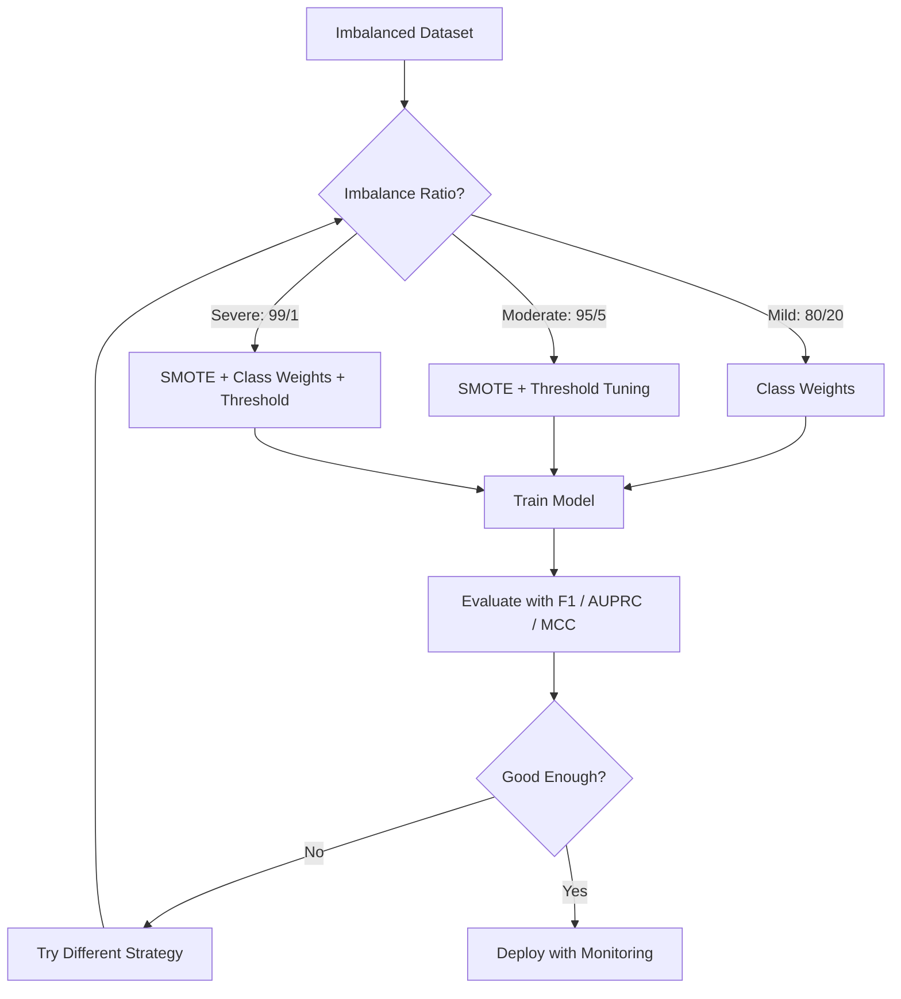
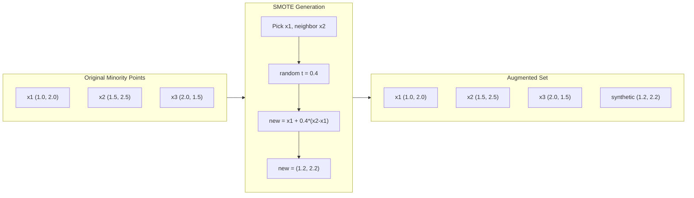
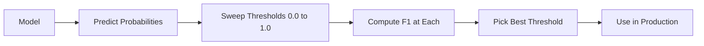
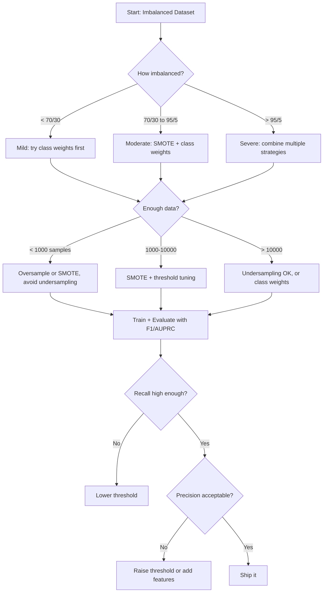

# Việc xử lý dữ liệu không cân bằng
# 处理不平衡数据


> Khi 99% dữ liệu của bạn là "tự nhiên", độ chính xác là một lời nói dối.

> Khi 99% dữ liệu là "tự nhiên", tỷ lệ chính xác là một lời nói dối.

**Type:** Build | **类型：** 构建
**Language:**Python**语言：**Python
**Prerequisites:** Phase 2, Lessons 01-09 (especially evaluation metrics) | **前置知识：** Phase 2 第 1-9 课（尤其是评估指标）
**Time:** ~90 minutes | **时间：** 约 90 分钟

## Mục tiêu học tập

- Thực hiện SMOTE từ đầu và giải thích cách làm thế nào quá mô hình tổng hợp khác biệt với trùng lặp ngẫu nhiên
  Từ thực hiện SMOTE, giải thích sự khác biệt giữa tổng hợp mẫu và sao chép tự nhiên
- Đánh giá các phân loại không cân bằng bằng bằng cách sử dụng Hàm tương quan F1, AUPRC và Matthews thay vì độ chính xác
  Sử dụng F1、AUPRC 和马修斯相关系数 (MCC)  đánh giá không cân bằng phân loại, thay vì tỷ lệ không chính xác
- So sánh trọng lượng lớp, điều chỉnh ngưỡng và chiến lược lấy mẫu lại và chọn cách tiếp cận phù hợp cho tỷ lệ mất cân bằng nhất định
  So sánh loại trọng lượng, giá trị điều chỉnh và trọng lượng lấy các chiến lược, cho một tỷ lệ không cân bằng chọn đúng phương pháp
- Xây dựng một đường ống dữ liệu không cân bằng hoàn toàn kết hợp SMOTE, trọng lượng lớp và tối ưu hóa ngưỡng
   cấu trúc kết hợp SMOTE, loại trọng lượng và giá trị tối ưu hóa toàn bộ không cân bằng dữ liệu


> **【中文解读】**
> Trong số số dữ liệu không cân bằng, số ít ít như 0,1% trong số các dữ liệu lừa đảo.

> **【拓展：不平衡数据在真实系统中的挑战】**
> PayPal xử lý khoảng 4 tỷ giao dịch mỗi ngày, tỷ lệ gian lận chỉ 0,3%, nhưng vẫn có nghĩa là khoảng 120 triệu giao dịch gian lận mỗi ngày.

## Vấn đề  vấn đề giới thiệu

Bạn xây dựng một mô hình phát hiện gian lận, nó có độ chính xác 99,9%, bạn ăn mừng, sau đó bạn nhận ra nó dự đoán "không gian lận" cho mỗi giao dịch.

> Bạn xây dựng một mô hình kiểm tra gian lận. Nó có tỷ lệ chính xác 99,9%. Bạn mừng rỡ. Sau đó bạn nhận ra nó dự đoán "không gian lận" đối với mỗi giao dịch.

Đây không phải là lỗi. Đó là điều hợp lý để làm khi chỉ có 0,1% giao dịch là gian lận. mô hình học được rằng luôn luôn đoán lớp đa số giảm thiểu lỗi tổng thể. Nó là kỹ thuật chính xác và hoàn toàn vô dụng.

> Đây không phải là lỗi. Khi chỉ có 0,1% giao dịch là gian lận, đó là hành vi hợp lý.

Điều này xảy ra ở mọi nơi quan trọng phân loại thực sự. Chẩn đoán bệnh: tỷ lệ dương tính 1% . Phạm hỏng mạng: 0,01% tấn công. Thiết bị thiếu sót: 0,5% bị lỗi. Trình lọc spam: 20% spam. Dự đoán churn: 5% churners.

> Đây là nơi có nhu cầu thực sự về phân loại. Chẩn đoán bệnh: 1% tỷ lệ tích cực.

Sự chính xác thất bại bởi vì nó đối xử với tất cả các dự đoán chính xác bằng nhau. Định nghĩa đúng một giao dịch hợp pháp và bắt kịp gian lận chính xác đều được coi là một điểm chính xác. Nhưng bắt kịp gian lận là toàn bộ lý do mô hình tồn tại. Chúng ta cần các số liệu, kỹ thuật và chiến lược đào tạo buộc mô hình chú ý đến lớp hiếm nhưng quan trọng.

> 准确率 thất bại vì nó tương đương với tất cả các dự đoán chính xác. 准确标记 hợp pháp giao dịch và chính xác bắt lừa đảo đều tính toán tỷ lệ准确.

> **【中文解读】**
> Vấn đề cốt lõi của dữ liệu không cân bằng: tỷ lệ xác thực là "sự dối trá"。99.9% tỷ lệ xác thực có thể chỉ là toàn bộ các loại giả thuyết đa số。 thực hành chính xác:(1) Thay đổi chỉ số sử dụng F1、AUPRC、MCC  thay thế tỷ lệ xác thực;(2) 重采采SMOTE 过采样少数类或缺采样多数类;(3) 代价敏感学习给少数类更大的损失权重;(4) 调整值降低分类通常提高召回率──组合使用多种策略效果最好──

## Khái niệm cốt lõi

### Tại sao sự chính xác không thành công

Hãy xem xét một tập dữ liệu với 1000 mẫu: 990 âm, 10 dương. Một mô hình luôn dự đoán âm:

> 考虑一个1000个样本的数据集:990个负样本,10个正样本――一个始终预测负类型的模型:

|  | Predicted Positive | Predicted Negative |
|--|---|---|
| Actually Positive | 0 (TP) | 10 (FN) |
| Actually Negative | 0 (FP) | 990 (TN) |

Độ chính xác = (0 + 990) / 1000 = 99,0%

Mô hình này không bắt được gian lận, không mắc bệnh, không có lỗi, nhưng độ chính xác là 99%.

> Mô hình bắt được không gian lận, không bệnh, không thiếu sót, nhưng tỷ lệ chính xác cho thấy 99%.

### Các số liệu tốt hơn

**Precision**= TP / (TP + FP). Trong tất cả những gì được đánh dấu là dương, có bao nhiêu thực sự?

> **精确率**= TP / (TP + FP) ⋅ Trong tất cả các mẫu được đánh dấu là đúng, có bao nhiêu thực sự đúng?

**Recall**= TP / (TP + FN). Trong tất cả những gì thực sự tích cực, chúng ta đã bắt được bao nhiêu?

> **召回率**= TP / (TP + FN) ⋅ Trong tất cả các mẫu thực tế thực sự, chúng ta đã bắt được bao nhiêu?

**F1 Score**= 2 * độ chính xác * nhớ lại / ( độ chính xác + nhớ lại).

> **F1 分数**= 2 * 精确率 * 召回率 / (精确率 + 召回率) ⋅调和平均值──比算术平均值更严厉地惩罚精确率和召回率之间的极端不平衡──

**F-beta Score**= (1 + beta^2) * độ chính xác * nhớ lại / (beta^2 * độ chính xác + nhớ lại). Khi beta > 1, nhớ lại quan trọng hơn. Khi beta < 1, độ chính xác quan trọng hơn. F2 là phổ biến trong phát hiện gian lận (không có gian lận là tồi tệ hơn một báo động sai).

> **F-beta 分数**= (1 + beta^2) * 精确率 * 召回率 / (beta^2 * 精确率 + 召回率) ・・・ khi beta > 1 时,召回率 quan trọng hơn。 khi beta < 1 时,精确率 quan trọng hơn。 F2 trong kiểm tra lừa đảo trong thường sử dụng(漏检欺诈比误报更糟) ・・・

**AUPRC**(Thành vực dưới đường cong nhớ chính xác). Giống như AUC-ROC nhưng thông tin hơn cho dữ liệu không cân bằng. Một phân loại ngẫu nhiên có AUPRC bằng tỷ lệ lớp tích cực (không phải 0,5 như ROC). Điều này làm cho sự cải thiện dễ dàng hơn để thấy.

> **AUPRC**(định rõ tỷ lệ - tỷ lệ quay lại) ⋅ tương tự như AUC-ROC nhưng đối với dữ liệu không cân bằng có nhiều thông tin hơn ⋅ AUPRC của các phân loại máy tính giống như tỷ lệ chính xác ⋅ không giống như ROC 0.5) ⋅ điều này làm cho cải tiến dễ dàng hơn để thấy ⋅

**Matthews Correlation Coefficient**= (TP * TN - FP * FN) / sqrt((TP+FP)(TP+FN)(TN+FP)(TN+FN)). dao động từ -1 đến +1. Chỉ đưa ra điểm số cao khi mô hình làm tốt trên cả hai lớp.

> **马修斯相关系数 (MCC)**= (TP * TN - FP * FN) / sqrt((TP+FP)(TP+FN)(TN+FP)(TN+FN))。 phạm vi từ -1 đến +1── chỉ có trong hai loại trên đều biểu diễn tốt khi才给高分── ngay cả trong các loại khác biệt rất lớn cũng giữ cân bằng──

Đối với mô hình "luôn dự đoán âm tính" ở trên: độ chính xác = 0/0 (không xác định, thường được đặt lên 0), nhớ lại = 0/10 = 0, F1 = 0, MCC = 0. Những số liệu này xác định chính xác mô hình là vô giá trị.

> Đối với mô hình "始终预测负类" trên:精确率 = 0/0(未定义, thường设为 0),召回率 = 0/10 = 0,F1 = 0,MCC = 0──

### Đường ống dữ liệu không cân bằng



### SMOTE: Kỹ thuật lấy mẫu quá mức của thiểu số tổng hợp

Việc lấy mẫu quá nhiều ngẫu nhiên làm trùng lặp các mẫu thiểu số hiện có. Điều này hoạt động nhưng có nguy cơ quá phù hợp vì mô hình nhìn thấy các điểm giống nhau nhiều lần.

> 随机过采样复制现有少数类样本―― Điều này có hiệu quả nhưng có rủi ro thích hợp, vì mô hình sẽ nhìn lại cùng một điểm lại――

SMOTE tạo ra các mẫu thiểu số tổng hợp mới có thể tin được nhưng không phải là bản sao.

> SMOTE tạo ra một nhóm nhỏ các mẫu tổng hợp mới, chúng hợp lý nhưng không phải là phụ bản.

1. Đối với mỗi mẫu thiểu số x, tìm thấy các hàng x gần nhất của nó trong các mẫu thiểu số khác
   Đối với mỗi nhóm nhỏ x, trong số các nhóm nhỏ khác tìm thấy các nhóm nhỏ gần đây nhất của nó
2. Chọn một hàng xóm ngẫu nhiên
   随机选择一个邻居
3. Tạo một mẫu mới trên phân đoạn đường giữa x và hàng x đó
   X và các hàng x tạo ra một mẫu mới trên đường giữa hàng x và hàng x

Công thức: `new_sample = x + random(0, 1) * (neighbor - x)`

> 公式:`new_sample = x + random(0, 1) * (neighbor - x)`

Điều này liên kết giữa các điểm thiểu số thực sự, tạo ra các mẫu trong cùng một khu vực không gian tính năng mà không chỉ sao chép dữ liệu hiện có.

> Nó được đặt vào giá trị giữa một số ít các điểm, tạo mẫu trong cùng một khu vực trong không gian đặc trưng, không chỉ sao chép dữ liệu hiện có.



### Các chiến lược lấy mẫu so sánh

**Random Oversampling**: lấy mẫu thiểu số trùng lặp để phù hợp với số lượng đa số.
- Lợi thế: đơn giản, không mất thông tin
  优点: đơn giản, không mất thông tin
- Khối tác: các bản sao chính xác gây ra quá phù hợp, tăng thời gian đào tạo
  缺点: hoàn toàn giống nhau phụ kiện dẫn đến quá phù hợp, tăng thời gian tập luyện

**Random Undersampling**: loại bỏ các mẫu đa số để phù hợp với số lượng thiểu số.
- Lợi thế: đào tạo nhanh, đơn giản
  优点: training快,简单
- Nhược điểm: loại bỏ dữ liệu đa số có thể hữu ích, sự khác biệt cao hơn
  缺点: bỏ đi hầu hết các loại dữ liệu có thể hữu ích, tỷ lệ khác nhau cao hơn

**SMOTE**: tạo mẫu thiểu số tổng hợp thông qua việc phân cực.
- Lợi thế: tạo ra các điểm dữ liệu mới, giảm quá phù hợp so với việc lấy mẫu quá nhiều ngẫu nhiên
  优点: tạo điểm dữ liệu mới, so với thời gian qua mẫu giảm được phù hợp
- Khối tác: có thể tạo ra các mẫu tiếng ồn gần ranh giới quyết định, không tính đến phân phối lớp đa số
  缺点: có thể tạo ra tiếng ồn gần biên giới quyết định, không tính đến đa số phân bố

| Strategy | Data Changed | Risk | When to Use |
|----------|-------------|------|-------------|
| Oversample | Minority duplicated | Overfitting | Small datasets, moderate imbalance |
| Undersample | Majority removed | Information loss | Large datasets, want fast training |
| SMOTE | Synthetic minority added | Boundary noise | Moderate imbalance, enough minority samples for k-NN |

### Tín trọng lớp

Thay vì thay đổi dữ liệu, thay đổi cách mô hình xử lý lỗi. Đưa trọng lượng cao hơn cho phân loại sai nhóm thiểu số.

> Không thay đổi dữ liệu, mà thay đổi cách mô hình đối xử với sai lầm.

Đối với một vấn đề nhị phân với 950 mẫu âm và 50 mẫu dương:
- trọng lượng cho lớp âm = n_samples / (2 * n_negative) = 1000 / (2 * 950) = 0.526
  负类权重 = n_samples / (2 * n_negative) = 1000 / (2 * 950) = 0.526
- trọng lượng cho lớp tích cực = n_samples / (2 * n_positive) = 1000 / (2 * 50) = 10,0
  正类权重 = n_samples / (2 * n_positive) = 1000 / (2 * 50) = 10,0

Nhóm tích cực có trọng lượng 19x. Việc phân loại sai một mẫu tích cực có giá trị tương đương với việc phân loại sai 19 mẫu tiêu cực. Mô hình buộc phải chú ý đến lớp thiểu số.

> Một phân loại đúng có 19 lần trọng lượng. Một phân loại sai có giá tương đương với một phân loại sai có 19 phân loại sai.

Trong sự lùi lại hậu cần, điều này thay đổi hàm mất mát:

```
weighted_loss = -sum(w_i * [y_i * log(p_i) + (1-y_i) * log(1-p_i)])
```

nơi w_i phụ thuộc vào lớp mẫu i.

Các trọng lượng lớp học bằng toán học với việc lấy mẫu quá mức trong kỳ vọng, nhưng không tạo ra các điểm dữ liệu mới. Điều này làm cho chúng nhanh hơn và tránh nguy cơ quá phù hợp của các mẫu trùng lặp.

> Các loại trọng lượng được kỳ vọng là tương đương với các mô hình toán học được lấy, nhưng không tạo ra các điểm dữ liệu mới. Điều này làm cho chúng nhanh hơn, và tránh rủi ro quá phù hợp của mô hình sao chép.

### Định hướng ngưỡng

Hầu hết các phân loại tạo ra một xác suất. ngưỡng mặc định là 0,5: nếu P (( dương) >= 0,5, dự đoán dương. Nhưng 0.5 là tùy ý. Khi các lớp không cân bằng, ngưỡng tối ưu thường thấp hơn nhiều.

> 大多数分类器输出概率──默认值为0.5: Nếu P( dương) >=0.5,预测为正──但0.5是任意的──当类别不平衡时,优值通常低得多──

Quá trình:
1. Trình mẫu
   训练一个模型
2. Nhận dự đoán xác suất trên bộ xác thực
   Trong tập hợp chứng minh
3. Các ngưỡng lọc từ 0,0 đến 1,0
   Từ 0,0 đến 1,0  scan  giá trị
4. Xét F1 (hoặc số liệu bạn chọn) tại mỗi ngưỡng
   Trong mỗi giá trị dưới số F1 ((hoặc chỉ số bạn chọn)
5. Chọn ngưỡng tối đa hóa số lượng của bạn
   选择最大化你的指标的值



Một mô hình có thể phát ra P ((trận gian) = 0,15 cho một giao dịch gian lận. Ở ngưỡng 0,5, nó được phân loại là không gian lận. Ở ngưỡng 0,10, nó được bắt đúng. Độ cân bằng xác suất ít quan trọng hơn xếp hạng - miễn là gian lận có xác suất cao hơn không gian lận, có một ngưỡng phân biệt chúng.

> Mô hình có thể đối với một giao dịch gian lận xuất phát P( gian lận) = 0.15── ở giá trị 0.5 下, nó được phân loại là không gian lận── ở giá trị 0.10 下, nó được bắt đúng.

### Học hỏi có giá trị

Việc tổng hợp trọng lượng lớp thay vì chi phí đồng nhất, chỉ định chi phí phân loại sai:

> 类权重的推广── không sử dụng giá thống nhất, mà phân phối giá phân loại sai:

| | Predict Positive | Predict Negative |
|--|---|---|
| Actually Positive | 0 (correct) | C_FN = 100 |
| Actually Negative | C_FP = 1 | 0 (correct) |

Thiếu giao dịch gian lận (FN) tốn kém hơn 100 lần so với báo động sai (FP). mô hình tối ưu hóa cho tổng chi phí, không phải tổng số lỗi.

> 漏检一笔欺诈交易 (FN) 价格是错报 (FP) 价格100倍――模型优化总价格,而不是总错误数――

Đây là cách tiếp cận có nguyên tắc nhất khi bạn có thể ước tính chi phí trong thế giới thực. Một chẩn đoán ung thư bị bỏ qua có chi phí rất khác với một báo động sai dẫn đến một sinh thiết bổ sung. Làm cho chi phí này rõ ràng buộc các sự thỏa hiệp đúng đắn.

> Đây là cách có nguyên tắc nhất khi bạn có thể ước tính chi phí thế giới thực. Chi phí của việc phát hiện ung thư khác biệt rất nhiều với những báo cáo sai lầm dẫn đến xét nghiệm bổ sung.

### Hình ảnh dòng chảy quyết định



## Hãy xây dựng nó.

> **【中文解读】**
> Từ zero thực hiện SMOTE: đối với mỗi nhóm nhỏ, tìm thấy các nhóm nhỏ gần đó, tự nhiên nhập giá trị tạo ra các nhóm nhỏ mới.

> **【拓展：工业级不平衡数据处理的高级技术】**
> Trong thực tế, chiến lược xử lý dữ liệu không cân bằng phức tạp hơn SMOTE: sử dụng Loss tập trung (trái tiêu điểm, làm cho mô hình tập trung hơn vào các mô hình khó phân loại)  2 giai đoạn đào tạo (trước đây sử dụng quá trình đào tạo, tái sử dụng dữ liệu nguyên thủy)  Học hỏi nhạy cảm về giá trị (trước đây, các loại phân loại sai lầm của gian lận sẽ được đặt thành giá trị giao dịch bình thường 100 lần)  Phòng số (trước đây, Square Inc.) sử dụng hệ thống kiểm tra giá trị gian lận nhiều mô hình hợp nhất + động thái để xử lý rất ít trường hợp gian lận trong các giao dịch hàng triệu mỗi ngày.
```figure
class-imbalance
```

## Hãy xây dựng nó

### Bước 1: Tạo một bộ dữ liệu không cân bằng

```python
import numpy as np


def make_imbalanced_data(n_majority=950, n_minority=50, seed=42):
    rng = np.random.RandomState(seed)

    X_maj = rng.randn(n_majority, 2) * 1.0 + np.array([0.0, 0.0])
    X_min = rng.randn(n_minority, 2) * 0.8 + np.array([2.5, 2.5])

    X = np.vstack([X_maj, X_min])
    y = np.concatenate([np.zeros(n_majority), np.ones(n_minority)])

    shuffle_idx = rng.permutation(len(y))
    return X[shuffle_idx], y[shuffle_idx]
```

### Bước 2: SMOTE từ đầu

```python
def euclidean_distance(a, b):
    return np.sqrt(np.sum((a - b) ** 2))


def find_k_neighbors(X, idx, k):
    distances = []
    for i in range(len(X)):
        if i == idx:
            continue
        d = euclidean_distance(X[idx], X[i])
        distances.append((i, d))
    distances.sort(key=lambda x: x[1])
    return [d[0] for d in distances[:k]]


def smote(X_minority, k=5, n_synthetic=100, seed=42):
    rng = np.random.RandomState(seed)
    n_samples = len(X_minority)
    k = min(k, n_samples - 1)
    synthetic = []

    for _ in range(n_synthetic):
        idx = rng.randint(0, n_samples)
        neighbors = find_k_neighbors(X_minority, idx, k)
        neighbor_idx = neighbors[rng.randint(0, len(neighbors))]
        t = rng.random()
        new_point = X_minority[idx] + t * (X_minority[neighbor_idx] - X_minority[idx])
        synthetic.append(new_point)

    return np.array(synthetic)
```

### Bước 3: Tiêu chuẩn quá và thiếu mẫu ngẫu nhiên

```python
def random_oversample(X, y, seed=42):
    rng = np.random.RandomState(seed)
    classes, counts = np.unique(y, return_counts=True)
    max_count = counts.max()

    X_resampled = list(X)
    y_resampled = list(y)

    for cls, count in zip(classes, counts):
        if count < max_count:
            cls_indices = np.where(y == cls)[0]
            n_needed = max_count - count
            chosen = rng.choice(cls_indices, size=n_needed, replace=True)
            X_resampled.extend(X[chosen])
            y_resampled.extend(y[chosen])

    X_out = np.array(X_resampled)
    y_out = np.array(y_resampled)
    shuffle = rng.permutation(len(y_out))
    return X_out[shuffle], y_out[shuffle]


def random_undersample(X, y, seed=42):
    rng = np.random.RandomState(seed)
    classes, counts = np.unique(y, return_counts=True)
    min_count = counts.min()

    X_resampled = []
    y_resampled = []

    for cls in classes:
        cls_indices = np.where(y == cls)[0]
        chosen = rng.choice(cls_indices, size=min_count, replace=False)
        X_resampled.extend(X[chosen])
        y_resampled.extend(y[chosen])

    X_out = np.array(X_resampled)
    y_out = np.array(y_resampled)
    shuffle = rng.permutation(len(y_out))
    return X_out[shuffle], y_out[shuffle]
```

### Bước 4: Khản hồi hậu cần với trọng lượng lớp

```python
def sigmoid(z):
    return 1.0 / (1.0 + np.exp(-np.clip(z, -500, 500)))


def logistic_regression_weighted(X, y, weights, lr=0.01, epochs=200):
    n_samples, n_features = X.shape
    w = np.zeros(n_features)
    b = 0.0

    for _ in range(epochs):
        z = X @ w + b
        pred = sigmoid(z)
        error = pred - y
        weighted_error = error * weights

        gradient_w = (X.T @ weighted_error) / n_samples
        gradient_b = np.mean(weighted_error)

        w -= lr * gradient_w
        b -= lr * gradient_b

    return w, b


def compute_class_weights(y):
    classes, counts = np.unique(y, return_counts=True)
    n_samples = len(y)
    n_classes = len(classes)
    weight_map = {}
    for cls, count in zip(classes, counts):
        weight_map[cls] = n_samples / (n_classes * count)
    return np.array([weight_map[yi] for yi in y])
```

### Bước 5: Định hướng ngưỡng

```python
def find_optimal_threshold(y_true, y_probs, metric="f1"):
    best_threshold = 0.5
    best_score = -1.0

    for threshold in np.arange(0.05, 0.96, 0.01):
        y_pred = (y_probs >= threshold).astype(int)
        tp = np.sum((y_pred == 1) & (y_true == 1))
        fp = np.sum((y_pred == 1) & (y_true == 0))
        fn = np.sum((y_pred == 0) & (y_true == 1))

        if metric == "f1":
            precision = tp / (tp + fp) if (tp + fp) > 0 else 0.0
            recall = tp / (tp + fn) if (tp + fn) > 0 else 0.0
            score = 2 * precision * recall / (precision + recall) if (precision + recall) > 0 else 0.0
        elif metric == "recall":
            score = tp / (tp + fn) if (tp + fn) > 0 else 0.0
        elif metric == "precision":
            score = tp / (tp + fp) if (tp + fp) > 0 else 0.0

        if score > best_score:
            best_score = score
            best_threshold = threshold

    return best_threshold, best_score
```

### Bước 6: Các chức năng đánh giá

```python
def confusion_matrix_values(y_true, y_pred):
    tp = np.sum((y_pred == 1) & (y_true == 1))
    tn = np.sum((y_pred == 0) & (y_true == 0))
    fp = np.sum((y_pred == 1) & (y_true == 0))
    fn = np.sum((y_pred == 0) & (y_true == 1))
    return tp, tn, fp, fn


def compute_metrics(y_true, y_pred):
    tp, tn, fp, fn = confusion_matrix_values(y_true, y_pred)
    accuracy = (tp + tn) / (tp + tn + fp + fn)
    precision = tp / (tp + fp) if (tp + fp) > 0 else 0.0
    recall = tp / (tp + fn) if (tp + fn) > 0 else 0.0
    f1 = 2 * precision * recall / (precision + recall) if (precision + recall) > 0 else 0.0

    denom = np.sqrt(float((tp + fp) * (tp + fn) * (tn + fp) * (tn + fn)))
    mcc = (tp * tn - fp * fn) / denom if denom > 0 else 0.0

    return {
        "accuracy": accuracy,
        "precision": precision,
        "recall": recall,
        "f1": f1,
        "mcc": mcc,
    }
```

### Bước 7: So sánh tất cả các phương pháp tiếp cận

```python
X, y = make_imbalanced_data(950, 50, seed=42)
split = int(0.8 * len(y))
X_train, X_test = X[:split], X[split:]
y_train, y_test = y[:split], y[split:]

# Baseline: no treatment
w_base, b_base = logistic_regression_weighted(
    X_train, y_train, np.ones(len(y_train)), lr=0.1, epochs=300
)
probs_base = sigmoid(X_test @ w_base + b_base)
preds_base = (probs_base >= 0.5).astype(int)

# Oversampled
X_over, y_over = random_oversample(X_train, y_train)
w_over, b_over = logistic_regression_weighted(
    X_over, y_over, np.ones(len(y_over)), lr=0.1, epochs=300
)
preds_over = (sigmoid(X_test @ w_over + b_over) >= 0.5).astype(int)

# SMOTE
minority_mask = y_train == 1
X_minority = X_train[minority_mask]
synthetic = smote(X_minority, k=5, n_synthetic=len(y_train) - 2 * int(minority_mask.sum()))
X_smote = np.vstack([X_train, synthetic])
y_smote = np.concatenate([y_train, np.ones(len(synthetic))])
w_sm, b_sm = logistic_regression_weighted(
    X_smote, y_smote, np.ones(len(y_smote)), lr=0.1, epochs=300
)
preds_smote = (sigmoid(X_test @ w_sm + b_sm) >= 0.5).astype(int)

# Class weights
sample_weights = compute_class_weights(y_train)
w_cw, b_cw = logistic_regression_weighted(
    X_train, y_train, sample_weights, lr=0.1, epochs=300
)
probs_cw = sigmoid(X_test @ w_cw + b_cw)
preds_cw = (probs_cw >= 0.5).astype(int)

# Threshold tuning (tune on held-out validation set, not test set)
probs_val = sigmoid(X_val @ w_cw + b_cw)
best_thresh, best_f1 = find_optimal_threshold(y_val, probs_val, metric="f1")
preds_thresh = (probs_cw >= best_thresh).astype(int)
```

Các tập tin mã chạy tất cả trong một kịch bản và in kết quả.

> 码文件在单脚本中运行所有这些并印结果──

## Hãy sử dụng nó để thực hiện

Với việc học scikit và học không cân bằng, những kỹ thuật này là một dòng:

> Sử dụng học tập nhỏ và học tập không cân bằng, những kỹ thuật này chỉ cần một dòng mã:

```python
from sklearn.linear_model import LogisticRegression
from sklearn.metrics import classification_report, f1_score
from sklearn.model_selection import train_test_split
from imblearn.over_sampling import SMOTE
from imblearn.under_sampling import RandomUnderSampler
from imblearn.pipeline import Pipeline

X_train, X_test, y_train, y_test = train_test_split(X, y, stratify=y)

model_weighted = LogisticRegression(class_weight="balanced")
model_weighted.fit(X_train, y_train)
print(classification_report(y_test, model_weighted.predict(X_test)))

smote = SMOTE(random_state=42)
X_resampled, y_resampled = smote.fit_resample(X_train, y_train)
model_smote = LogisticRegression()
model_smote.fit(X_resampled, y_resampled)
print(classification_report(y_test, model_smote.predict(X_test)))

pipeline = Pipeline([
    ("smote", SMOTE()),
    ("model", LogisticRegression(class_weight="balanced")),
])
pipeline.fit(X_train, y_train)
print(classification_report(y_test, pipeline.predict(X_test)))
```

Các thực hiện từ đầu cho thấy chính xác những gì mỗi kỹ thuật làm. SMOTE chỉ là k-NN phân cực trên lớp thiểu số. lớp trọng lượng nhân sự mất mát. điều chỉnh ngưỡng là một vòng quay trước cắt. Không có phép thuật.

> Từ thực hiện chính xác cho thấy tác dụng của mỗi loại kỹ thuật. SMOTE là một phần nhỏ của các loại k-NN 插值.

## Chuyển nó đi.

Bài học này mang lại:
- `outputs/skill-imbalanced-data.md`-- một danh sách kiểm tra quyết định để xử lý các vấn đề phân loại không cân bằng

## Tập luyện bài tập

1. **Borderline-SMOTE**: sửa đổi thực hiện SMOTE để chỉ tạo mẫu tổng hợp cho các điểm thiểu số gần biên giới quyết định (những điểm k gần nhất của họ bao gồm các mẫu lớp đa số). So sánh kết quả với SMOTE tiêu chuẩn trên một tập dữ liệu nơi các lớp chồng chéo.
   1. 生成不平衡数据集(1% 正例) ・・・比较始终预测多数类、随机森林(默认)、随机森林(class_weight='balanced') và SMOTE+随机森林的 F1 和 MCC。

2. **Cost matrix optimization**: thực hiện học tập nhạy cảm với chi phí khi các mô hình chi phí là một tham số. Tạo một hàm lấy một mô hình chi phí và trả lại các dự đoán tối ưu để giảm thiểu chi phí dự kiến.
   2. Trong cùng một tập dữ liệu so sánh với các mô hình và SMOTE.

3. **Threshold calibration**: thực hiện quy mô Platt (giải chỉnh một sự lùi hậu cần trên các sản phẩm thô của mô hình để tạo ra xác suất chuẩn bị). So sánh đường cong nhớ chính xác trước và sau khi chuẩn bị.
   3. 实现值调优: đối với tỷ lệ xuất phát về logic, quét 0.01 đến 0.99 值, tìm F1 值最高―― hiển thị nó hơn so với 值默认 0.5 rất ít――

4. **Ensemble with balanced bagging**: đào tạo nhiều mô hình, mỗi mô hình trên một mẫu bootstrap cân bằng (tất cả thiểu số + phụ tập hợp ngẫu nhiên của đa số).
   4. 构建完整管线:SMOTE -> 标准化 -> 逻辑归归(class_weight='balanced')-> 值优化──比较管线中移除任一步的性能下降──

5. **Imbalance ratio experiment**: lấy một bộ dữ liệu cân bằng và tăng dần tỷ lệ mất cân bằng (50/50, 70/30, 90/10, 95/5, 99/1). Đối với mỗi tỷ lệ, tập với và không có SMOTE.

> **【中文解读】**
> Bộ hợp tác chiến lược toàn diện xử lý dữ liệu không cân bằng: 1) đánh giá chỉ số sử dụng F1/AUPRC/MCC  thay thế xác định tỷ lệ; 2) 重采样SMOTE 过采样少数类或随机欠采样多数类; 3) 代价敏感 trong hàm mất mát để tăng quyền cho một số ít类;

> **【拓展：Focal Loss——深度学习中的不平衡数据解决方案】**
> Loss Focal(Lin et al., 2017) ban đầu được đưa ra để giải quyết mục tiêu kiểm tra中正负样本极度不平衡而提出(背景像素远于目标像素) ・・・核心思想:降低"容易分类"样本的损失权重,让模型聚焦于"难分类"样本──公式:(p) = -(1-p) ^gamma * log(p),gamma=2 时效果最好──RetinaNet sử dụng Loss Focal trên nhiệm vụ kiểm tra COCO 超越了当时的 SOTA 方法──

## Từ khóa  Từ khóa nhanh chóng

| Term | What people say | What it actually means |
|------|----------------|----------------------|
| Class imbalance | "One class has way more samples" | The distribution of classes in the dataset is significantly skewed, causing models to favor the majority class |
| SMOTE | "Synthetic oversampling" | Creates new minority samples by interpolating between existing minority samples and their k-nearest minority neighbors |
| Class weights | "Making errors on rare classes more expensive" | Multiplying the loss function by class-specific weights so the model penalizes minority misclassification more heavily |
| Threshold tuning | "Moving the decision boundary" | Changing the probability cutoff for classification from the default 0.5 to a value that optimizes the desired metric |
| Precision-recall tradeoff | "You cannot have both" | Lowering the threshold catches more positives (higher recall) but also flags more false positives (lower precision), and vice versa |
| AUPRC | "Area under the PR curve" | Summarizes the precision-recall curve into a single number; more informative than AUC-ROC when classes are heavily imbalanced |
| Matthews Correlation Coefficient | "The balanced metric" | A correlation between predicted and actual labels that produces a high score only when the model performs well on both classes |
| Cost-sensitive learning | "Different mistakes cost different amounts" | Incorporating real-world misclassification costs into the training objective so the model optimizes for total cost, not error count |
| Random oversampling | "Duplicate the minority" | Repeating minority class samples to balance class counts; simple but risks overfitting to duplicated points |

## Xem thêm 延伸阅读

- [SMOTE: Synthetic Minority Over-sampling Technique (Chawla et al., 2002)](https://arxiv.org/abs/1106.1813)-- bài báo SMOTE ban đầu, vẫn là công trình được trích dẫn nhiều nhất về việc học không cân bằng
  [Chawla et al.: SMOTE (2002)](https://arxiv.org/abs/1106.1813)- SMOTE 原始论文
- [Learning from Imbalanced Data (He & Garcia, 2009)](https://ieeexplore.ieee.org/document/5128907)-- khảo sát toàn diện bao gồm các phương pháp lấy mẫu, chi phí và thuật toán
  [He & Garcia: Learning from Imbalanced Data (2009)](https://link.springer.com/article/10.1007/s10115-008-0164-4)- 不平衡学习综述
- [imbalanced-learn documentation](https://imbalanced-learn.org/stable/)-- Thư viện Python với các biến thể SMOTE, chiến lược lấy mẫu thấp và tích hợp đường ống
  [imbalanced-learn 文档](https://imbalanced-learn.org/)- Python không cân bằng
- [The Precision-Recall Plot Is More Informative than the ROC Plot (Saito & Rehmsmeier, 2015)](https://journals.plos.org/plosone/article?id=10.1371/journal.pone.0118432)-- khi nào và tại sao nên thích đường cong PR hơn đường cong ROC cho các vấn đề không cân bằng
