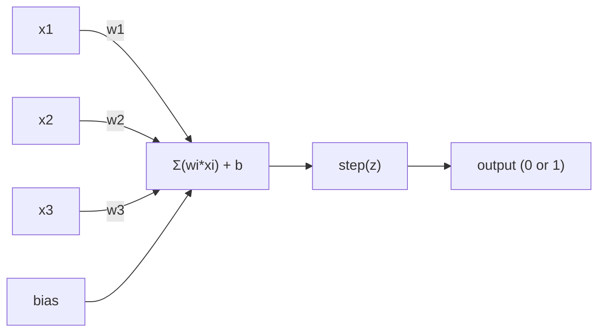
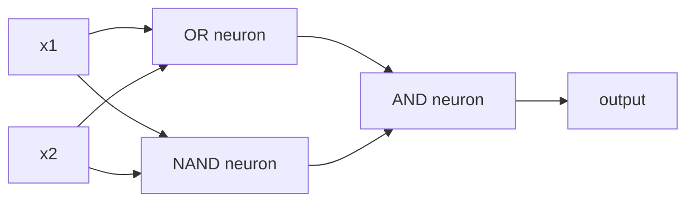

# Máy cảm nhận Perceptron.

> perceptron là nguyên tử của mạng thần kinh. chia nó ra và bạn tìm thấy trọng lượng, thiên vị và quyết định.

> 感知机 là "原子" của mạng thần kinh, được chia ra để xem, bên trong là trọng lượng, định vị và một quyết định.

> **【中文解读】**感知机 là "原子"最小的学习单元的神经网络. Điều nó làm là rất đơn giản: đưa vào gấp đôi trọng lượng, cộng thêm vị trí, sau đó đưa ra một quyết định thứ hai.

**Type:** Build
**Languages:** Python
**Prerequisites:** Phase 1 (Linear Algebra Intuition)
**Time:** ~60 minutes

## Mục tiêu học tập

- Thực hiện một perceptron từ đầu trong Python, bao gồm quy tắc cập nhật trọng lượng và chức năng kích hoạt bước
  Từ không sử dụng Python 实现感知机, bao gồm quyền重更新规则和阶跃激活函数
- Giải thích tại sao một perceptron duy nhất có thể giải quyết các vấn đề phân tách theo đường thẳng và chứng minh trường hợp thất bại XOR
  解释 tại sao một bộ cảm nhận duy nhất chỉ có thể giải quyết vấn đề phân chia trực tuyến, và trình bày trường hợp thất bại XOR
- XOR được giải quyết bằng cách tạo ra các cổng OR, NAND và AND
  Thông qua kết hợp OR、NAND 和 AND 门来构建多层感知机 để giải quyết XOR
- Đào tạo một mạng hai lớp với kích hoạt sigmoid và backpropagation để học XOR tự động
  Sử dụng sigmoid  kích hoạt và phản hướng truyền thông đào tạo hai tầng mạng tự học XOR

> **【中文解读】**Mục tiêu của chương này: từ không thực hiện cảm giác, hiểu tại sao một cảm giác duy nhất chỉ có thể giải quyết được vấn đề có thể phân biệt về tuyến tính (XOR là một trường hợp phản kháng), sau đó bằng cách hợp nhiều cảm giác để phá vỡ giới hạn này, cuối cùng sử dụng quyền học tự động truyền tải ngược chiều.

## Vấn đề  vấn đề giới thiệu

Bạn biết các vector và các sản phẩm chấm. Bạn biết rằng một matrix chuyển đổi đầu vào thành đầu ra. Nhưng làm thế nào để một máy học cách chuyển đổi nào để sử dụng?

> Bạn đã biết khối lượng và điểm积. Bạn biết các mô hình có thể chuyển đổi vào chuyển đổi sang ra. Nhưng máy làm thế nào để sử dụng những biến đổi?

Perceptron trả lời câu hỏi này. Nó là máy học đơn giản nhất có thể: lấy một số đầu vào, nhân bằng trọng lượng, thêm một sự thiên vị, và đưa ra một quyết định nhị phân.

> 感知机 trả lời câu hỏi này. Nó là máy học đơn giản nhất: nhận input, nhân trọng lượng, cộng vị, đưa ra quyết định phân loại hai, sau đó điều chỉnh. Đó là cách mà mọi mạng thần kinh được xây dựng từ lịch sử đều là một lớp xếp chồng lên của ý tưởng này.

Hiểu perceptron có nghĩa là hiểu "làm học" thực sự có nghĩa là gì trong mã: điều chỉnh số cho đến khi đầu ra phù hợp với thực tế.

> Nghĩ cảm nhận机 nghĩa là hiểu ý nghĩa thực sự của "làm học" trong mã: liên tục điều chỉnh số cho đến khi kết quả kết hợp với thực tế.

> **【中文解读】**Bạn đã biết rằng một mô hình có thể biến vào thành ra. Nhưng máy tính làm thế nào để " học" nên sử dụng thay đổi nào? Máy cảm nhận cho thấy câu trả lời: nhập vào nhân trọng lượng, tăng vị trí, đưa ra các quyết định thứ hai, sau đó dựa trên các yếu tố điều chỉnh sai lầm.

## Khái niệm cốt lõi

### Một Neuron, một quyết định, một thần kinh, một quyết định.

Một perceptron lấy n đầu vào, nhân mỗi lần bằng trọng lượng, tổng hợp chúng, thêm một thiên vị và truyền kết quả thông qua một chức năng kích hoạt.

> 感知机接收 n 个输入, sẽ mỗi输入乘重,求和,加偏置, sau đó thông qua kích hoạt hàm输出结果――



Chức năng bước là tàn bạo: nếu tổng cộng cộng cộng với sự thiên vị được cân nhắc là >= 0, đầu ra 1. Nếu không, đầu ra là 0.

> 阶跃函数 rất đơn giản粗暴: nếu cộng权和加偏置大于等于 0,输出 1;否则输出 0。

```
step(z) = 1  if z >= 0
           0  if z < 0
```

Đây là một phân loại tuyến tính. trọng lượng và thiên vị xác định một đường (hoặc siêu phẳng ở các chiều cao hơn) chia không gian đầu vào thành hai khu vực.

> Đây là một loại hình hình tuyến tính. Đánh nặng và vị trí định nghĩa một đường (hoặc siêu phẳng trong không gian cao), sẽ nhập vào không gian chia thành hai khu vực.

> **【中文解读】**感知机的计算流程:输入 x 乘权重 w,求和后加偏置 b, cuối cùng thông qua giai đoạn nhảy hàm输出 0 hoặc 1。 bản chất là một bộ phận 线性分类器权重和偏置在空间中画一条线(或超平面),把输入空间分成两个区域──

### Biên giới quyết định.

Đối với hai đầu vào, perceptron vẽ một đường xuyên qua không gian 2D:

> Đối với hai đầu vào, cảm nhận máy trong không gian hai chiều vẽ một đường thẳng:

```
  x2
  ┤
  │  Class 1        /
  │    (0)          /
  │                /
  │               / w1·x1 + w2·x2 + b = 0
  │              /
  │             /     Class 2
  │            /        (1)
  ┼───────────/──────────── x1
```

Mọi thứ ở một bên của đường dẫn xuất phát 0. Mọi thứ ở phía bên kia xuất phát 1. Trình luyện di chuyển đường dẫn này cho đến khi nó phân chia các lớp một cách chính xác.

> Một mặt tất cả các đầu ra 0, một mặt khác tất cả các đầu ra 1― quá trình đào tạo là di chuyển đường này, cho đến khi nó chính xác sẽ phân chia các loại khác nhau.

> **【中文解读】** Biên giới quyết định là w·x + b = 0                                                                                                                                                                                                                                                        

### Quy tắc học tập

Quy tắc học tập perceptron rất đơn giản:

> Quy tắc học tập của 感知机 rất đơn giản:

```
For each training example (x, y_true):     # 对每个训练样本
    y_pred = predict(x)                    # 预测输出
    error = y_true - y_pred                # 计算误差

    For each weight:                       # 对每个权重
        w_i = w_i + learning_rate * error * x_i   # 更新权重
    bias = bias + learning_rate * error    # 更新偏置
```

Nếu dự đoán là đúng, lỗi = 0, không có gì thay đổi. Nếu dự đoán 0 nhưng phải là 1, trọng lượng tăng lên. Nếu dự đoán 1 nhưng phải là 0, trọng lượng giảm xuống. Tốc độ học tập kiểm soát mức độ lớn của mỗi điều chỉnh.

> Nếu dự đoán đúng, sai lệch là 0, không làm bất kỳ điều chỉnh nào. Nếu dự đoán là 0, nhưng nên là 1, trọng lượng tăng lớn. Nếu dự đoán là 1, nhưng nên là 0, trọng lượng giảm nhỏ.

> **【中文解读】**Quy tắc học tập của cảm nhận máy rất trực tiếp: dự đoán đối với không động, dự đoán sai lệch tùy theo hướng sai lầm điều chỉnh trọng lượng.`optimizer.step()`Làm việc bản chất là như nhau, chỉ tính toán phức tạp hơn.

> **【拓展：梯度下降的起源】**感知机学习规则是最简单的梯度下降. 感知机学习规则是最简单的梯度下降. 感知机学习规则是最简单的梯度下降. 感知机学习规则是最简单的梯度下降.

### Vấn đề XOR  XOR  vấn đề

Đây là nơi nó phá vỡ.

> Đó là nơi mà cảm giác không hoạt động.

```
AND gate:           OR gate:            XOR gate:
x1  x2  out         x1  x2  out         x1  x2  out
0   0   0           0   0   0           0   0   0
0   1   0           0   1   1           0   1   1
1   0   0           1   0   1           1   0   1
1   1   1           1   1   1           1   1   0
```

AND và OR có thể tách ra tuyến tính: bạn có thể vẽ một đường để tách các 0s khỏi 1s. XOR không. Không có đường đơn lẻ có thể tách ra [0,1] và [1,0] từ [0,0] và [1,1].

> Và 和 OR 是线性可分的: bạn có thể vẽ một条直线将 0 和 1 分开。XOR 不是。没有一条直线能将 [0,1] 和 [1,0] 与 [0,0] 和 [1,1] 分开。

```
AND (separable):        XOR (not separable):

  x2                      x2
  1 ┤  0     1            1 ┤  1     0
    │     /                 │
  0 ┤  0 / 0              0 ┤  0     1
    ┼──/──────── x1         ┼──────────── x1
       line works!          no single line works!
```

Đây là một giới hạn cơ bản. Một perceptron duy nhất có thể giải quyết các vấn đề phân tách tuyến tính. Minsky và Papert chứng minh điều này vào năm 1969 và nó gần như tiêu diệt nghiên cứu mạng thần kinh trong một thập kỷ.

> Đây là một hạn chế cơ bản. Một bộ cảm nhận duy nhất có thể giải quyết được vấn đề phân định trực tuyến. Minsky và Papert đã chứng minh điều này vào năm 1969, điều này đã khiến nghiên cứu mạng thần kinh bị đình trệ trong một thập kỷ.

Giải pháp: xếp các perceptron thành các lớp. Một perceptron đa lớp có thể giải quyết XOR bằng cách kết hợp hai quyết định tuyến tính thành một quyết định không tuyến tính.

> Giải pháp: sẽ cảm nhận được xếp chồng lên một tầng.

> **【中文解读】**XOR là vấn đề của máy cảm nhận: bất kể bạn vẽ trực tuyến như thế nào, đều không thể phân chia hai loại đầu ra của XOR. Năm 1969 Minsky và Papert chứng minh điều này, trực tiếp dẫn đến "ngày đông đầu tiên" của nghiên cứu mạng thần kinh.

> **【拓展：为什么深度学习需要"深"】**单层感知机只能画直线,两层只能画折线,三层只能画任意形状――层数越多,表达函数越复杂――这就是为什么GPT-4 có gần 100层变压器每多层,模型就能表达更复杂的模式――从感知机到GPT,核心思想一脉相承――

## Hãy xây dựng nó.
```figure
perceptron-boundary
```

## Hãy xây dựng nó

### Bước 1: Kiểu Perceptron

```python
class Perceptron:
    def __init__(self, n_inputs, learning_rate=0.1):
        self.weights = [0.0] * n_inputs   # 权重初始化为 0
        self.bias = 0.0                    # 偏置初始化为 0
        self.lr = learning_rate            # 学习率控制每次调整的幅度

    def predict(self, inputs):
        total = sum(w * x for w, x in zip(self.weights, inputs))  # 加权求和：w·x
        total += self.bias                                         # 加偏置：w·x + b
        return 1 if total >= 0 else 0       # 阶跃函数：>=0 输出 1，否则输出 0

    def train(self, training_data, epochs=100):
        for epoch in range(epochs):
            errors = 0
            for inputs, target in training_data:
                prediction = self.predict(inputs)   # 前向预测
                error = target - prediction          # 计算误差
                if error != 0:
                    errors += 1
                    for i in range(len(self.weights)):
                        self.weights[i] += self.lr * error * inputs[i]  # 权重更新
                    self.bias += self.lr * error      # 偏置更新
            if errors == 0:
                print(f"Converged at epoch {epoch + 1}")  # 全部正确，收敛
                return
        print(f"Did not converge after {epochs} epochs")
```

### Bước 2: Tập luyện logic gate

```python
and_data = [          # AND 逻辑门数据：两个输入都为 1 时输出 1
    ([0, 0], 0),
    ([0, 1], 0),
    ([1, 0], 0),
    ([1, 1], 1),
]

or_data = [           # OR 逻辑门数据：任一输入为 1 时输出 1
    ([0, 0], 0),
    ([0, 1], 1),
    ([1, 0], 1),
    ([1, 1], 1),
]

not_data = [          # NOT 逻辑门数据：取反
    ([0], 1),
    ([1], 0),
]

print("=== AND Gate ===")
p_and = Perceptron(2)
p_and.train(and_data)
for inputs, _ in and_data:
    print(f"  {inputs} -> {p_and.predict(inputs)}")

print("\n=== OR Gate ===")
p_or = Perceptron(2)
p_or.train(or_data)
for inputs, _ in or_data:
    print(f"  {inputs} -> {p_or.predict(inputs)}")

print("\n=== NOT Gate ===")
p_not = Perceptron(1)
p_not.train(not_data)
for inputs, _ in not_data:
    print(f"  {inputs} -> {p_not.predict(inputs)}")
```

### Bước 3: Xem XOR thất bại  Xem XOR thất bại

```python
xor_data = [         # XOR 逻辑门数据：两个输入不同时输出 1
    ([0, 0], 0),
    ([0, 1], 1),
    ([1, 0], 1),
    ([1, 1], 0),
]

print("\n=== XOR Gate (single perceptron) ===")
p_xor = Perceptron(2)
p_xor.train(xor_data, epochs=1000)   # 即使训练 1000 轮也无法收敛
for inputs, expected in xor_data:
    result = p_xor.predict(inputs)
    status = "OK" if result == expected else "WRONG"
    print(f"  {inputs} -> {result} (expected {expected}) {status}")
```

Đây là bằng chứng chắc chắn rằng một perceptron duy nhất không thể học được XOR.

> Nó sẽ không bao giờ được nhận. Đó là một bộ máy cảm nhận không thể học được chứng chỉ của XOR.

> **【中文解读】**单个感知机训练 XOR 永远不会收不管训练多少轮──这是数学上的硬限制:一条直线无法正确分成两类──

### Bước 4: Giải quyết XOR bằng hai lớp. Sử dụng hai lớp mạng để giải quyết XOR.

Trù: XOR = (x1 OR x2) Và KHÔNG (x1 AND x2). Kết hợp ba perceptron:

> 技巧:XOR = (x1 OR x2) Và KHÔNG (x1 AND x2)



```python
def xor_network(x1, x2):
    or_neuron = Perceptron(2)
    or_neuron.weights = [1.0, 1.0]     # OR 门的权重
    or_neuron.bias = -0.5              # OR 门的偏置

    nand_neuron = Perceptron(2)
    nand_neuron.weights = [-1.0, -1.0]  # NAND 门（AND 的取反）的权重
    nand_neuron.bias = 1.5              # NAND 门的偏置

    and_neuron = Perceptron(2)
    and_neuron.weights = [1.0, 1.0]     # AND 门的权重
    and_neuron.bias = -1.5              # AND 门的偏置

    hidden1 = or_neuron.predict([x1, x2])    # 隐藏层第 1 个神经元：OR
    hidden2 = nand_neuron.predict([x1, x2])  # 隐藏层第 2 个神经元：NAND
    output = and_neuron.predict([hidden1, hidden2])  # 输出层：AND
    return output


print("\n=== XOR Gate (multi-layer network) ===")
for inputs, expected in xor_data:
    result = xor_network(inputs[0], inputs[1])
    print(f"  {inputs} -> {result} (expected {expected})")
```

Tất cả bốn trường hợp đều đúng. Lắp xếp các perceptron thành các lớp tạo ra ranh giới quyết định mà không có perceptron nào có thể tạo ra.

> 4 trường hợp hoàn toàn đúng. Các cơ quan cảm nhận có thể tạo ra một cơ quan cảm nhận duy nhất không thể tạo ra ranh giới quyết định.

> **【中文解读】**关键洞察:XOR = (x1 OR x2) Và NOT(x1 AND x2)。 tầng một sử dụng hai cảm giác cơ phân biệt làm OR 和 NAND((两条直线), tầng hai sử dụng AND Đặt hai kết quả hợp lại──

### Bước 5: Tập một mạng hai tầng  Tập một mạng hai tầng

Bước 4 là dây tay để kết nối trọng lượng. Điều đó hoạt động cho XOR, nhưng không phải cho các vấn đề thực sự khi bạn không biết trọng lượng đúng trước. Giải pháp: thay thế chức năng bước bằng sigmoid và học trọng lượng tự động thông qua backpropagation.

> Bước 4 手动设置权重── đây là hiệu quả đối với XOR, nhưng không thể sử dụng để không biết chính xác trọng lượng thực tế.

```python
class TwoLayerNetwork:
    def __init__(self, learning_rate=0.5):
        import random
        random.seed(0)
        self.w_hidden = [[random.uniform(-1, 1), random.uniform(-1, 1)] for _ in range(2)]  # 隐藏层权重（2个神经元，各2个输入）
        self.b_hidden = [random.uniform(-1, 1), random.uniform(-1, 1)]   # 隐藏层偏置
        self.w_output = [random.uniform(-1, 1), random.uniform(-1, 1)]   # 输出层权重
        self.b_output = random.uniform(-1, 1)   # 输出层偏置
        self.lr = learning_rate

    def sigmoid(self, x):
        import math
        x = max(-500, min(500, x))   # 裁剪防止溢出
        return 1.0 / (1.0 + math.exp(-x))  # sigmoid 函数：σ(x) = 1/(1+e^(-x))

    def forward(self, inputs):
        self.inputs = inputs
        self.hidden_outputs = []
        for i in range(2):
            z = sum(w * x for w, x in zip(self.w_hidden[i], inputs)) + self.b_hidden[i]  # 隐藏层线性变换
            self.hidden_outputs.append(self.sigmoid(z))  # 隐藏层激活
        z_out = sum(w * h for w, h in zip(self.w_output, self.hidden_outputs)) + self.b_output  # 输出层线性变换
        self.output = self.sigmoid(z_out)   # 输出层激活
        return self.output

    def train(self, training_data, epochs=10000):
        for epoch in range(epochs):
            total_error = 0
            for inputs, target in training_data:
                output = self.forward(inputs)       # 前向传播
                error = target - output              # 误差 = 目标 - 预测
                total_error += error ** 2            # 累计平方误差

                d_output = error * output * (1 - output)   # 输出层梯度（链式法则）

                saved_w_output = self.w_output[:]
                hidden_deltas = []
                for i in range(2):
                    h = self.hidden_outputs[i]
                    hd = d_output * saved_w_output[i] * h * (1 - h)  # 隐藏层梯度（反向传播）
                    hidden_deltas.append(hd)

                # 更新输出层权重
                for i in range(2):
                    self.w_output[i] += self.lr * d_output * self.hidden_outputs[i]
                self.b_output += self.lr * d_output

                # 更新隐藏层权重
                for i in range(2):
                    for j in range(len(inputs)):
                        self.w_hidden[i][j] += self.lr * hidden_deltas[i] * inputs[j]
                    self.b_hidden[i] += self.lr * hidden_deltas[i]
```

```python
net = TwoLayerNetwork(learning_rate=2.0)
net.train(xor_data, epochs=10000)
for inputs, expected in xor_data:
    result = net.forward(inputs)
    predicted = 1 if result >= 0.5 else 0   # 以 0.5 为阈值做二分类
    print(f"  {inputs} -> {result:.4f} (rounded: {predicted}, expected {expected})")
```

Hai điểm khác biệt quan trọng từ bước 4. Thứ nhất, sigmoid thay thế chức năng bước - nó mịn, vì vậy gradient tồn tại. thứ hai, `train`phương pháp truyền lỗi ngược từ đầu ra đến lớp ẩn, điều chỉnh mỗi trọng lượng tương xứng với đóng góp của nó vào lỗi. đó là backpropagation trong 20 dòng.

> Với bước 4, có hai sự khác biệt quan trọng. Thứ nhất, sigmoid thay thế hàm nhảy bậc, nó là bình thường, vì vậy gradient tồn tại.`train`Phương pháp sẽ điều chỉnh sai lầm từ lớp xuất sang lớp ẩn ngược chiều, theo tỷ lệ đóng góp của mỗi trọng lượng đối với sai lầm.

Đây là cầu nối đến bài học 03.`d_output`và `hidden_deltas`là quy tắc chuỗi được áp dụng cho biểu đồ mạng.

> Đó là đường dẫn đến lớp 3.`d_output`和 `hidden_deltas`Phương pháp toán học sau đó là quy tắc chuỗi trên biểu đồ mạng. Chúng tôi sẽ chính thức đưa ra nó ở đó.

> **【中文解读】**Bước 4 là tự đặt trọng lượng, nhưng trong thực tế vấn đề chúng ta không biết trọng lượng chính xác.`d_output`和 `hidden_deltas`Đó là ứng dụng của quy tắc chuỗi từ cấp độ xuất trở lại cấp độ tính toán, từng cấp độ điều chỉnh. Đó là PyTorch.`loss.backward()`Trong những việc phải làm.

> **【拓展：PyTorch autograd 的原理】**PyTorch tự động phân phân phân tử (auto-grad) bản chất là tự động thực hiện quá trình truyền ngược chiều trong đó.`backward()`时沿图反向传播梯度──手动写反向传播 (tương tự như ở đây) là cách tốt nhất để hiểu autograd──

## Sử dụng nó thực tế

Tất cả những gì bạn vừa xây dựng từ đầu đều tồn tại trong một nhập khẩu:

> Bạn chỉ mới có thể thực hiện tất cả các chức năng xây dựng từ không qua một nhập để:

```python
from sklearn.linear_model import Perceptron as SkPerceptron   # sklearn 内置的感知机
import numpy as np

X = np.array([[0,0],[0,1],[1,0],[1,1]])  # 输入数据
y = np.array([0, 0, 0, 1])               # AND 门的标签

clf = SkPerceptron(max_iter=100, tol=1e-3)  # 最多迭代 100 次，容差 0.001
clf.fit(X, y)                                # 训练
print([clf.predict([x])[0] for x in X])     # 预测所有样本
```

5 dòng, 30 dòng của anh.`Perceptron`lớp làm điều tương tự. phiên bản sklearn thêm kiểm tra hội tụ, nhiều hàm mất mát, và hỗ trợ đầu vào hiếm - nhưng vòng lặp cốt lõi là giống nhau: tổng cân, hàm bước, cập nhật trọng lượng về lỗi.

> 五行代码──你30 行的 `Perceptron`类 làm việc tương tự. sklearn  phiên bản tăng  kiểm tra  nhiều loại hàm mất mát và hỗ trợ nhập nhập hiếm  nhưng vòng tròn cốt lõi hoàn toàn giống nhau: gia权和、阶跃函数、按错误更新权重──

Sự chênh lệch thực sự xuất hiện trên quy mô.

> Sự khác biệt thực sự hiện tại trên quy mô.

- Chức năng bước trở thành sigmoid, ReLU, hoặc các hoạt động mượt mà khác
  阶跃 hàm biến thành sigmoid、ReLU hoặc các chức năng kích hoạt khác
- Các trọng lượng được học tự động thông qua backpropagation (Dạy 03)
  权重通过反向传播自动学习 (đọc tự động)
- Các lớp trở nên sâu hơn: 3, 10, 100+ lớp
  Lớp số biến sâu hơn: 3 Lớp,10 Lớp100+ Lớp
- Nguyên tắc tương tự: mỗi lớp tạo ra các tính năng mới từ các sản phẩm của lớp trước
  基本原理不变: tạo ra các đặc điểm mới trong mỗi tầng từ đầu hàng của tầng trước

Một perceptron duy nhất chỉ có thể vẽ đường thẳng.

> Một bộ cảm giác chỉ có thể vẽ thẳng. Đặt chúng lên, bạn có thể vẽ bất kỳ hình dạng nào.

> **【中文解读】**Perceptron 五行代码 trong sklearn đã làm xong những gì chúng ta làm trong 30 行. Logica cốt lõi hoàn toàn giống nhau: gia权求和、阶跃函数、按差更新权重── thực sự khác biệt ở quy mô: mạng hiện đại sử dụng các chức năng kích hoạt có thể điều khiển được như ReLU (ReLue) 、 sử dụng ngược hướng truyền tải tự động học、 có vài chục đến trên trăm tầng── nhưng nguyên tắc cơ bản luôn luôn là: mỗi tầng tạo ra những đặc điểm mới trong các đầu ra từ trên một tầng trên một tầng─

## Chuyển đi.

Bài học này mang lại:
- `outputs/skill-perceptron.md`- một kỹ năng bao gồm khi cần thiết kiến trúc một lớp vs đa lớp

> 本课产 出:`outputs/skill-perceptron.md`- Một tài liệu kỹ năng về khi nào sử dụng cấu trúc đơn và đa tầng

## Tập luyện bài tập

1. Đào tạo một perceptron trên một cổng NAND (cổng phổ quát - bất kỳ mạch logic nào có thể được xây dựng từ NAND).
   > **练习 1：**Sử dụng cảm nhận máy đào tạo NAND 门(通用逻辑门任何逻辑电路都可以使用NAND 搭建) ――验证学到的权重和偏置是否形成有效决策边界──

2. Thay đổi lớp Perceptron để theo dõi ranh giới quyết định (w1\*x1 + w2\*x2 + b = 0) tại mỗi thời đại. Bác in cách đường thay đổi trong quá trình đào tạo trên cổng AND.
   > **练习 2：**修改 Perceptron 类,在每个时代 记录决策边界 (w1\*x1 + w2\*x2 + b = 0) ――打印在训练 AND 门时这条线是如何移动的──

3. Xây dựng một perceptron 3 đầu vào chỉ phát ra 1 khi ít nhất 2 trong 3 đầu vào là 1 (một hàm số phiếu đa số).
   > **练习 3：**Xây dựng một 3 输入感知机, khi ít nhất 2 输入为 1 时输出 1(多数投票函数) ;;

## Từ khóa  Keyword

| Term | What people say | What it actually means |
|------|----------------|----------------------|
| Perceptron | "A fake neuron" | A linear classifier: dot product of inputs and weights, plus bias, through a step function |
| Weight | "How important an input is" | A multiplier that scales each input's contribution to the decision |
| Bias | "The threshold" | A constant that shifts the decision boundary, letting the perceptron fire even with zero inputs |
| Activation function | "The thing that squishes values" | A function applied after the weighted sum - step function for perceptrons, sigmoid/ReLU for modern networks |
| Linearly separable | "You can draw a line between them" | A dataset where a single hyperplane can perfectly separate the classes |
| XOR problem | "The thing perceptrons can't do" | Proof that single-layer networks cannot learn non-linearly-separable functions |
| Decision boundary | "Where the classifier switches" | The hyperplane w\*x + b = 0 that divides input space into two classes |
| Multi-layer perceptron | "A real neural network" | Perceptrons stacked in layers, where each layer's output feeds the next layer's input |

| 术语 | 通俗说法 | 实际含义 |
|------|---------|---------|
| 感知机 (Perceptron) | "假神经元" | 线性分类器：输入与权重的点积加偏置，过阶跃函数 |
| 权重 (Weight) | "输入的重要性" | 缩放每个输入对决策贡献的乘数 |
| 偏置 (Bias) | "阈值" | 偏移决策边界的常数，让感知机在全零输入时也能激活 |
| 激活函数 (Activation function) | "压扁数值的东西" | 加权求和后施加的函数——感知机用阶跃函数，现代网络用 sigmoid/ReLU |
| 线性可分 (Linearly separable) | "能画线分开" | 数据集可以用一个超平面完美分成两类 |
| XOR 问题 | "感知机做不到的事" | 证明单层网络无法学习非线性可分函数 |
| 决策边界 (Decision boundary) | "分类器切换的地方" | w\*x + b = 0 这个超平面，把输入空间分成两类区域 |
| 多层感知机 (MLP) | "真正的神经网络" | 感知机按层堆叠，每层的输出是下一层的输入 |

## Xem thêm 延伸阅读

- Frank Rosenblatt, "The Perceptron: A Probabilistic Model for Information Storage and Organization in the Brain" (1958) -- bài báo ban đầu bắt đầu tất cả
  Frank Rosenblatt,  cảm nhận: Brain Information Storage and Organization Probability Model
- Minsky & Papert, "Perceptrons" (1969) -- cuốn sách chứng minh XOR không thể giải quyết được bởi các mạng lưới một lớp và giết chết nghiên cứu perceptron trong một thập kỷ
  Minsky 和 Papert,感知机
- Michael Nielsen, "Nền mạng thần kinh và học tập sâu", Chương 1 (http://neuralnetworksanddeeplearning.com/) -- miễn phí trực tuyến, giải thích trực quan tốt nhất về cách thức các perceptron tạo thành các mạng
  Michael Nielsen,  Hạng thần kinh và học sâu  Chương 1  miễn phí trực tuyến, về cách cơ quan cảm nhận kết hợp mạng tốt nhất có thể nhìn thấy giải thích
