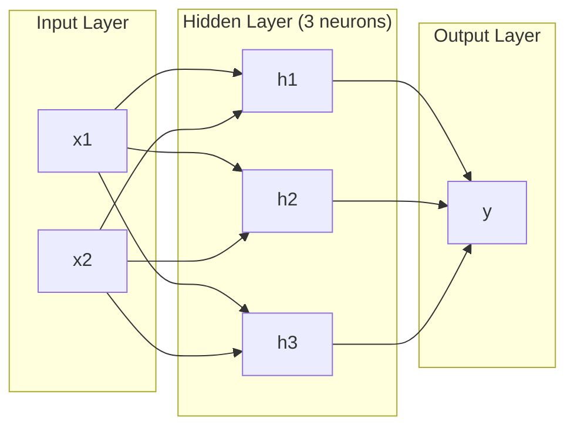
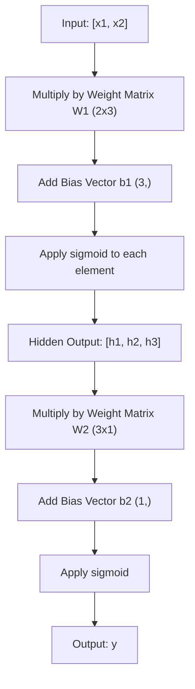
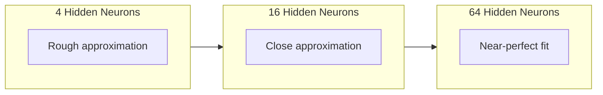

# Mạng đa tầng và chuyển tiếp

> Một tế bào thần kinh vẽ một đường, xếp chúng lên, và bạn có thể vẽ bất cứ thứ gì.

> Một thần kinh vẽ một đường thẳng. Đưa chúng lên, bạn có thể vẽ bất kỳ hình dạng nào.

> **【中文解读】**Một dây thần kinh chỉ có thể vẽ một đường thẳng, nhưng lắp nhiều dây thần kinh lên nhiều tầng, để phù hợp với các đường cong hình dạng bất kỳ. Đây là giá trị cốt lõi của mạng đa tầng.

**Type:** Build
**Languages:** Python
**Prerequisites:** Phase 01 (Math Foundations), Lesson 03.01 (The Perceptron)
**Time:** ~90 minutes

## Mục tiêu học tập

- Xây dựng một mạng đa tầng từ đầu với lớp Layer và Network thực hiện một thông qua tiến hoàn chỉnh
  Từ không xây dựng với lớp và mạng loại mạng đa tầng, thực hiện toàn bộ phát triển
- Các kích thước của ma trận theo dõi qua mỗi lớp của một mạng và xác định sự không phù hợp hình dạng
   Trình độ mô hình, dạng không phù hợp của mỗi tầng của mạng theo dõi
- Giải thích cách xếp chồng các hoạt động không tuyến tính cho phép một mạng học ranh giới quyết định cong
  解释 堆叠非线性激活 如何使网络能够学习曲的决策边界
- Giải quyết vấn đề XOR bằng cách sử dụng kiến trúc 2-2-1 với cân sigmoid được điều chỉnh bằng tay
  Sử dụng động cơ điều chỉnh của sigmoid 权重, sử dụng 2-2-1 架构解决XOR 问题

> **【中文解读】**Mục tiêu của chương này: Từ không xây dựng lớp và mạng 类, hiểu trước hướng truyền tải thay đổi của mô hình矩阵, hiểu rõ tại sao các hàm kích hoạt không tuyến tính để làm cho mạng có thể học 曲的决策边界――

## Vấn đề  vấn đề giới thiệu

Một tế bào thần kinh đơn lẻ là một ngăn kéo đường. Đó là tất cả. Một đường thẳng thông qua dữ liệu của bạn. Mọi vấn đề thực sự trong AI -- nhận dạng hình ảnh, hiểu ngôn ngữ, chơi Go -- đòi hỏi đường cong.

> 单个神经只是一个图线的工具――仅此而已―― trong dữ liệu của bạn vẽ một đường thẳng―― trong AI mỗi vấn đề thực sự trong hình ảnh nhận dạng, hiểu ngôn ngữ, 围棋 都需要曲线―― để tạo ra một khối lượng của các神经 là cách để có được một đường cong――

Năm 1969, Minsky và Papert chứng minh rằng sự hạn chế này là nguy hiểm: một mạng lưới một lớp không thể học XOR. Không phải "quan đấu để học" - toán học không thể. Bảng thực tế XOR đặt [0,1] và [1,0] ở một bên, [0,0] và [1,1] ở bên kia. Không có một đường duy nhất tách chúng ra.

> Năm 1969, Minsky và Papert chứng minh rằng giới hạn này là chết người: mạng đơn không thể học XOR── không phải là "rất khó học" là không thể toán học──XOR giá trị thực sẽ [0,1] và [1,0] được đặt bên kia, [0,0] 和 [1,1] được đặt bên kia── không có một dòng thẳng có thể phân chia chúng──

Điều này đã làm mất nguồn tài trợ mạng thần kinh trong hơn một thập kỷ. Sự khắc phục rõ ràng trong quá khứ: ngừng sử dụng một lớp. Nạp các tế bào thần kinh thành các lớp. Hãy để lớp đầu tiên cắt lớp đầu vào các tính năng mới, và để lớp thứ hai kết hợp những tính năng đó thành những quyết định không có một dòng duy nhất có thể đưa ra.

> Điều này khiến các nguồn vốn của mạng thần kinh bị gián đoạn trong hơn 10 năm. Trong khi đó, giải pháp rõ ràng: không còn chỉ sử dụng một lớp.

Dòng đó là mạng đa tầng. Đó là nền tảng của mọi mô hình học sâu trong sản xuất ngày nay. Tiến trình tiến - dữ liệu chảy từ đầu vào qua các lớp ẩn đến đầu ra - là thứ đầu tiên bạn cần xây dựng trước khi bất cứ điều gì khác hoạt động.

> Đó là một mạng đa tầng. Đó là nền tảng của mỗi mô hình học tập sâu trong môi trường sản xuất hiện nay.

> **【中文解读】**单个神经只能画直线,但图像识别,语言理解,围棋 这些真实AI任务都需要曲线――1969年Minski 和 Papert 证明单层网络无法学习 XOR(数学上不可能,不是"学不好")――解法就是叠层:

## Khái niệm cốt lõi

### Lớp: Lớp nhập, ẩn, ra ngoài. Lớp nhập, ẩn, ra ngoài.

Một mạng đa tầng có ba loại lớp:

> Mạng đa tầng có ba loại tầng:

**Input layer**-- không phải là một lớp. Nó chứa dữ liệu nguyên liệu của bạn. Hai tính năng có nghĩa là hai nút đầu vào. Không có tính toán xảy ra ở đây.

> **输入层**其实不算真正层――它存储原始数据――两个特征意味着两个输入节点――这里没有任何计算――

**Hidden layers**- nơi mà công việc diễn ra. Mỗi tế bào thần kinh lấy mọi đầu ra từ lớp trước, áp dụng trọng lượng và một sự thiên vị, sau đó chuyển kết quả qua một chức năng kích hoạt. "Bỏ" bởi vì bạn không bao giờ thấy các giá trị này trực tiếp trong dữ liệu đào tạo.

> **隐藏层** thực sự hoạt động nơi. Mỗi mô nhận được một lớp đầu tiên của tất cả các đầu ra, áp dụng trọng lượng và vị trí, sau đó sẽ kết quả thông qua chức năng kích hoạt.

**Output layer**-- câu trả lời cuối cùng. Đối với phân loại nhị phân, một tế bào thần kinh với sigmoid. Đối với đa lớp, một tế bào thần kinh cho mỗi lớp.

> **输出层**答案最终──二分类用一个 sigmoid 神经元,也许类用一个神经元.



Đây là một mạng lưới 2-3-1. hai đầu vào, ba tế bào thần kinh ẩn, một đầu ra. Mỗi kết nối mang trọng lượng. Mỗi tế bào thần kinh (trừ đầu vào) mang một sự thiên vị.

> Đây là một mạng 2-3-1 ⋅ hai đầu vào, ba thần kinh ẩn, một đầu ra. Mỗi kết nối có một trọng lượng.

Mỗi lớp tạo ra một vector số được gọi là trạng thái ẩn. Đối với văn bản, trạng thái ẩn tăng chiều kích -- mã hóa một từ như 768 số để nắm bắt ý nghĩa ngữ nghĩa. Đối với hình ảnh, chúng giảm chiều kích -- nén hàng triệu pixel thành một biểu diễn có thể quản lý. trạng thái ẩn là nơi mà học tập sống.

> Mỗi lớp tạo ra một khối lượng số, được gọi là trạng thái ẩn. Đối với văn bản, trạng thái ẩn tăng độ.

> **【中文解读】**三种层:输入层(只是数据入口,不计算) 藏层(做特征变换,"隐藏"是因为训练数据里看不到这些值) 输出层(最终答案) ⋅ Mỗi层产出一个向量叫"隐藏状态"文本任务中它增加维度(把词变成768维向量来捕捉语义),图像任务中它降低维度(缩百万像素为紧表示) ⋅学习发生在这些隐藏状态中──

> **【拓展：Transformer 中的隐藏状态】**Trong GPT/BERT, mỗi tầng Transformer của输出 cũng là một trạng thái ẩn( hình dạng: [batch, seq_len, d_model])。`model(x).hidden_states[-1]`提取特征用于下游任务──

### Các tế bào thần kinh và kích hoạt

Mỗi tế bào thần kinh làm ba điều:

> Mỗi bộ não làm ba điều:

1. Tăng vào mỗi đầu vào bằng trọng lượng tương ứng của nó
   Mỗi đầu vào sẽ được nhân hóa với trọng lượng đối tác
2. Kết hợp tất cả các sản phẩm và thêm một bias
   sẽ tất cả các nhân tích tìm kiếm và并加上偏置
3. Chuyển số tiền qua hàm kích hoạt
   sẽ và thông qua hàm kích hoạt

Cho đến nay, kích hoạt là sigmoid:

> Hiện tại sử dụng của kích hoạt hàm là sigmoid:

```
sigmoid(z) = 1 / (1 + e^(-z))
```

Sigmoid đúc bất kỳ số nào vào phạm vi (0, 1). Các đầu vào tích cực lớn đẩy về phía 1. Các đầu vào tiêu cực lớn đẩy về phía 0.

> Sigmoid sẽ nén bất kỳ số nào lên (0, 1) 范围内. Chuyển vào chính xác lớn hướng 1, chuyển vào tiêu cực lớn hướng 0,0  chiếu lên 0,5  Chuyển vào đường cong phẳng này làm cho việc học có thể xảy ra.

> **【中文解读】**Mỗi bộ thần kinh làm ba điều: nhập乘权重、求和加偏置、过激活函数。Sigmoid Đặt bất kỳ số liệu nào bị nén xuống (0, 1) 区间。

### Forward Pass: How Data Flows 

Việc đi trước đẩy dữ liệu nhập thông qua mạng, lớp cho lớp, cho đến khi nó đạt đến đầu ra. Không có học tập xảy ra trong quá trình đi trước. Đó là tính toán thuần túy: nhân, thêm, kích hoạt, lặp lại.

> Trước hướng truyền sẽ nhập dữ liệu từng tầng qua mạng, cho đến khi đạt đến đầu ra.



Ở mỗi lớp, ba hoạt động xảy ra theo trình tự:

> Trong mỗi tầng, theo trật tự thực hiện ba hoạt động:

```
z = W * input + b       (linear transformation)    # 线性变换
a = sigmoid(z)           (activation)                # 激活
```

Khả năng xuất phát từ một lớp trở thành đầu vào cho lớp tiếp theo. Đó là toàn bộ chuyển tiếp về phía trước.

> Một tầng của đầu ra trở thành một tầng dưới của đầu ra.

> **【中文解读】**前向传播就是数据从输入流到输出过程没有任何学习,纯粹的计算──每层做两件事:线性变换(Wx + b) +非线性激活(sigmoid)──上层的输出就是下层的输入──这就是 PyTorch 里`model(x)`Trong những việc phải làm.

### Matrix Dimensions  Mức độ

Các chiều kích theo dõi là kỹ năng sửa lỗi quan trọng nhất trong học sâu. Đây là mạng 2-3-1:

> 追踪维度 là kỹ năng điều tra quan trọng nhất trong việc học sâu.

| Step | Operation | Dimensions | Result Shape |
|------|-----------|------------|-------------|
| Input | x | -- | (2,) |
| Hidden linear | W1 * x + b1 | W1: (3, 2), b1: (3,) | (3,) |
| Hidden activation | sigmoid(z1) | -- | (3,) |
| Output linear | W2 * h + b2 | W2: (1, 3), b2: (1,) | (1,) |
| Output activation | sigmoid(z2) | -- | (1,) |

| 步骤 | 操作 | 维度 | 结果形状 |
|------|------|------|---------|
| 输入 | x | -- | (2,) |
| 隐藏层线性变换 | W1 * x + b1 | W1: (3, 2), b1: (3,) | (3,) |
| 隐藏层激活 | sigmoid(z1) | -- | (3,) |
| 输出层线性变换 | W2 * h + b2 | W2: (1, 3), b2: (1,) | (1,) |
| 输出层激活 | sigmoid(z2) | -- | (1,) |

Quy tắc: khối lượng tử liệu W ở lớp k có hình dạng (neurons_in_layer_k, neurons_in_layer_k_minus_1).

> Quy tắc: Hình dạng của khối trọng lượng của tầng thứ hai W (tế số các mô hình tầng thứ hai, số các mô hình tầng thứ ba)  Đi đối với tầng trước, tầng đối với tầng trên  Nếu hình dạng không phù hợp, thì có lỗi 

> **【中文解读】**追踪矩阵维度 là kỹ năng điều tra quan trọng nhất trong học sâu. Quy tắc rất đơn giản: Đường trọng lượng của thứ ba tầng W hình dạng là (第第 k 层神经元数, 第 k-1层神经元数) ⋅行对应应应应应应应应应应应应应应应应应应应应应应应应应应应应应应应应应应应应应应应应应应应应应应应应应应应应应应应应应应应应应应应应应应应应应应应应应应应应应应应应应应应应应应应应应应应应应应应应应应应应应应应应应应应应应应应应应应应应应应应应应应应应应应应应应应应应应应应应应应应应应应应应应应应应应应应应应应应应应应应应应应应应应应应应应应应应应应应应应应应应应应应应应应应应应应应应应应应应应应应应应应应应应应应应应应应应应应应应应应应应应应应应应应应应应应应应应应应应应应应应应应应应应应应应应应应应应应应应应应应应应应应应应应应应应应应应应应应应应应应应应应应应应应应应应应应应应应应应应应应应应应应应应应应应应应应应应应应应应应应应应应应应应应应应应应应应应应应应应应应应应应应应应应应应应应应应应应应应应应应应应应应应应应应应应应应应应应应应应应应应应应应应应应应应应应应应应应应应应应应应应应应应应应应应应应应应应应应应应应应应应应应应应应应应应应应应应应应应应应应应应应应应应应应应应

> **【拓展：维度不匹配是深度学习最常见的 bug】**Trong PyTorch, bạn thường thấy `RuntimeError: mat1 and mat2 shapes cannot be multiplied` Đó là kích thước không phù hợp  Học cách theo dõi kích thước, có thể nhanh chóng xác định loại lỗi này `torchsummary`Hoặc`torchinfo`Tôi có thể giúp bạn tự động kiểm tra.

### Lý thuyết gần gũi phổ quát.

Năm 1989, George Cybenko chứng minh một điều đáng chú ý: một mạng lưới thần kinh với một lớp ẩn duy nhất và đủ các tế bào thần kinh có thể gần gũi với bất kỳ chức năng liên tục nào với độ chính xác mong muốn.

> Năm 1989, George Cybenko chứng minh một điều không thể thấy được: một mạng lưới thần kinh có một lớp ẩn duy nhất và đủ nhiều thần kinh có thể gần bất kỳ hàm liên tục nào với độ chính xác bất kỳ.

Điều này không có nghĩa là một lớp ẩn luôn luôn tốt nhất. Nó có nghĩa là kiến trúc là lý thuyết khả năng. Trong thực tế, các mạng sâu hơn (nhiều lớp, ít tế bào thần kinh mỗi lớp) học các chức năng tương tự với số tham số tổng cộng ít hơn nhiều so với các mạng nông rộng. Đó là lý do tại sao việc học sâu hoạt động.

> Điều này không có nghĩa là một tầng ẩn luôn là tốt nhất. Nó có nghĩa là cấu trúc về mặt lý thuyết là khả thi. Trong thực tế, các mạng sâu hơn (more layer, each layer fewer neurons) sử dụng ít hơn so với tổng số các yếu tố của mạng rộng lớn để học các chức năng tương tự.

Nhận thức: mỗi tế bào thần kinh trong lớp ẩn học một "bump" hoặc tính năng. đủ các bump đặt ở đúng vị trí có thể gần gũi bất kỳ đường cong mịn nào.

> 直觉: Mỗi dây thần kinh trong lớp ẩn học một "các bước" hoặc đặc điểm.



> **【中文解读】**Quan điểm gần gũi của Màn-Năng: Một lớp ẩn + đủ nhiều thần kinh có thể gần gũi với bất kỳ hàm liên tục nào. Nhưng điều này không thể cho thấy một lớp đủ trong thực tế, mạng "thậm và hẹp" có hiệu quả cao hơn so với mạng "hơn và rộng".

> **【拓展：为什么"深"比"宽"好】**Về lý thuyết một lớp 2 n n n n n n n n n n n n n n n n n n n n n n n n n n n n n n n n n n n n n n n n n n n n n n n n n n n n n n n n n n n n n n n n n n n n n n n n n n n n n n n n n n n n n n n n n n n n n n n n n n n n n n n n n n n n n n n n n n n n n n n n n n n n n n n n n n n n n n n n n n n n n n n n n n n n n n n n n n n n n n n n n n n n n n n n n n n n n n n n n n n n n n n n n n n n n n n n n n n n n n n n n n n n n n n n n n n n n n n n n n n n n n n n n n n n n n n n n n n n n n n n n n n n n n n n n n n n n n n n n n n n n n n n n n n n n n n n n n n n n n n n n n n n n n n n n n n n n n n n n n n n n n n n n n n n n n n n n n n n n n n n n n n n n n n n n n n n n n n n n n n n n n n n n n n n n n n n n n n n n n n n n n n n n n n n n n n n n n n n n n n n n n n n n n n n n n n n n n n n n n n n n n n n n n n n n n n n n n n n n n n n n n n n n n n n n n n n n n n n n n n n n n n n n n n n n n n n n n n n n n n n n n n n n n n n n n n n n n n n n n n n n n n n n n n n n n n n n n n n n n n n n n n n

### Sự hợp thể.

Các mạng thần kinh có thể được tạo ra. Bạn có thể xếp chồng chúng, chuỗi chúng, chạy chúng song song. Một mô hình Whisper sử dụng một mạng mã hóa để xử lý âm thanh và một mạng mã hóa riêng để tạo văn bản. Các LLM hiện đại chỉ có thể làm mã hóa. BERT chỉ có thể làm mã hóa. T5 là mã hóa-tử lý.

> Các mạng thần kinh có thể được kết hợp. Bạn có thể lắp ráp, liên kết, và chạy chúng. Phép lẩm ầm ầm ầm ầm ầm ầm ầm ầm ầm ầm ầm ầm ầm ầm ầm ầm ầm ầm ầm ầm ầm ầm ầm ầm ầm ầm ầm ầm ầm ầm ầm ầm ầm ầm ầm ầm ầm ầm ầm ầm ầm ầm ầm ầm ầm ầm ầm ầm ầm ầm ầm ầm ầm ầm ầm ầm ầm ầm ầm ầm ầm ầm ầm ầm ầm ầm ầm ầm ầm ầm ầm ầm ầm ầm ầm ầm ầm ầm ầm ầm ầm ầm ầm ầm ầm ầm ầm ầm ầm ầm ầm ầm ầm ầm ầm ầm ầm ầm ầm ầm ầm ầm ầm ầm ầm ầm ầm ầm ầm ầm ầm ầm ầm ầm ầm ầm ầm ầm ầm ầm ầm ầm ầm ầm ầm ầm ầm ầm ầm ầm ầm ầm ầm ầm ầm ầm ầm ầm ầm ầm ầm ầm ầm ầm ầm ầm ầm ầm ầm ầm ầm ầm ầm ầm ầm ầm ầm ầm ầm ầm ầm ầm ầm ầm ầm ầm ầm ầm ầm ầm ầm ầm ầm ầm ầm ầm ầm ầm ầm ầm ầm ầm ầm ầm ầm ầm ầm ầm ầm ầm ầm ầm ầm ầm ầm ầm ầm ầm ầm ầm ầm ầm ầm ầm ầm ầm ầm ầm ầm ầm ầm ầm ầm ầm ầm ầm ầm ầm ầm ầm ầm ầm ầm ầm ầm ầm ầm ầm ầm ầm ầm ầm ầm ầm ầm ầm ầm ầm ầm ầm ầm

> **【中文解读】**Các mạng thần kinh có thể được kết hợp: Nhầm với bộ xử lý âm thanh + máy giải mã tạo văn bản; GPT là bộ giải mã đơn giản; BERT là bộ giải mã đơn giản; T5 là bộ giải mã đơn giản.

## Hãy xây dựng nó.
```figure
mlp-forward
```

## Hãy xây dựng nó

Python tinh khiết, không có numpy, mọi matrix hoạt động được viết từ đầu.

> 纯 Python. Không cần numpy. Mỗi矩阵运算 từ đầu viết lên.

### Bước 1: Tăng động Sigmoid

```python
import math

def sigmoid(x):
    x = max(-500.0, min(500.0, x))  # 裁剪到 [-500, 500] 防止指数溢出
    return 1.0 / (1.0 + math.exp(-x))  # σ(x) = 1/(1+e^(-x))
```

Cẹp đến [-500, 500] ngăn chặn quá tải. `math.exp(500)`là lớn nhưng hữu hạn. `math.exp(1000)`là vô hạn.

> 裁剪到 [-500, 500] 可防止溢出──`math.exp(500)`n lớn nhưng hạn chế.`math.exp(1000)`Không có gì hết.

### Bước 2: lớp lớp lớp

Hoạt động quan trọng nhất trong tất cả các học tập sâu là nhân số tử liệu. Mỗi lớp, mỗi đầu chú ý, mỗi bước đi về phía trước - nó là các matmuls tất cả các cách xuống. Một lớp tuyến tính lấy một vector đầu vào, nhân nó bằng một matrix trọng lượng, và thêm một vector thiên vị: y = Wx + b.

> Các phương trình quan trọng nhất trong học sâu là phương trình viền: y = Wx + b. Mỗi tầng, mỗi đầu tập trung, mỗi lần chuyển tiếp đều là phương trình viền.

Một lớp chứa một khối lượng tử liệu và một vector thiên vị. phương pháp tiến của nó lấy một vector đầu vào và trả lại đầu ra hoạt động.

> Một lớp chứa một khối trọng lực và một khối chuyển hướng.

```python
class Layer:
    def __init__(self, n_inputs, n_neurons, weights=None, biases=None):
        if weights is not None:
            self.weights = weights                       # 使用指定的权重（如手动设置 XOR 的权重）
        else:
            import random
            self.weights = [
                [random.uniform(-1, 1) for _ in range(n_inputs)]  # 随机初始化权重
                for _ in range(n_neurons)
            ]                                           # 形状：(n_neurons, n_inputs)
        if biases is not None:
            self.biases = biases                         # 使用指定的偏置
        else:
            self.biases = [0.0] * n_neurons              # 偏置初始化为 0

    def forward(self, inputs):
        self.last_input = inputs                         # 保存输入（反向传播时需要）
        self.last_output = []
        for neuron_idx in range(len(self.weights)):
            z = sum(
                w * x for w, x in zip(self.weights[neuron_idx], inputs)  # 加权求和
            )
            z += self.biases[neuron_idx]                 # 加偏置
            self.last_output.append(sigmoid(z))          # sigmoid 激活
        return self.last_output
```

Các khối lượng tử liệu có hình dạng (n_neurons, n_inputs). Mỗi hàng là trọng lượng của một tế bào thần kinh trên tất cả các đầu vào.

> 权重矩阵的形状为 (n_neurons, n_input) ⋅ mỗi行是一个神经对所有输入的权重──前进 方法遍历神经,计算加权和加偏置,应用 sigmoid,并收集结果──

> **【拓展：PyTorch 的 nn.Linear】**Lớp này là PyTorch .`nn.Linear`                                                                                                                                                                                                                                                              `nn.Linear(in_features, out_features)`内部也是维护一个 `(out_features, in_features)`của trọng lực và một `(out_features,)`Ưu điểm của định vị định vị.

### Bước 3: Cấp độ mạng Cấp độ mạng

Một mạng là một danh sách các lớp. Các đường đi trước liên kết chúng: đầu ra của lớp k cung cấp vào lớp k + 1.

> 网络是一个层列表――前向传播将它们串联: đầu ra của k 层作为 k + 1 层的输入――

```python
class Network:
    def __init__(self, layers):
        self.layers = layers   # 按顺序存储所有层

    def forward(self, inputs):
        current = inputs               # 当前层的输入
        for layer in self.layers:
            current = layer.forward(current)  # 逐层前向传播
        return current
```

Đó là toàn bộ đường đi về phía trước. 4 đường logic. Dữ liệu đi vào, chảy qua mỗi lớp, ra ngoài bên kia.

> Đó là toàn bộ phương án truyền tải.

> **【中文解读】**Mạng lưới 类就是 PyTorch `nn.Sequential`DATA INGO, Layer BY Layer, Out.

### Bước 4: XOR với trọng lượng được điều chỉnh bằng tay bằng cách đặt trọng lượng để giải quyết XOR

Trong bài học 01, chúng tôi giải quyết XOR bằng cách kết hợp OR, NAND và AND perceptrons. Bây giờ làm điều tương tự với lớp Layer và Network của chúng tôi. kiến trúc 2-2-1: hai đầu vào, hai tế bào thần kinh ẩn, một đầu ra.

> Trong bài học thứ 1, chúng tôi đã giải quyết XOR bằng cách kết hợp OR、NAND 和 AND 感知机. Bây giờ chúng tôi cũng làm tương tự với lớp và mạng của chúng tôi.

```python
hidden = Layer(
    n_inputs=2,
    n_neurons=2,
    weights=[[20.0, 20.0], [-20.0, -20.0]],  # 大权重让 sigmoid 接近阶跃函数
    biases=[-10.0, 30.0],                      # 第一个神经元 ≈ OR，第二个 ≈ NAND
)

output = Layer(
    n_inputs=2,
    n_neurons=1,
    weights=[[20.0, 20.0]],                    # 输出层 ≈ AND
    biases=[-30.0],
)

xor_net = Network([hidden, output])

xor_data = [
    ([0, 0], 0),
    ([0, 1], 1),
    ([1, 0], 1),
    ([1, 1], 0),
]

for inputs, expected in xor_data:
    result = xor_net.forward(inputs)
    predicted = 1 if result[0] >= 0.5 else 0
    print(f"  {inputs} -> {result[0]:.6f} (rounded: {predicted}, expected: {expected})")
```

Các trọng lượng lớn (20, -20) làm cho sigmoid hoạt động như một chức năng bước. Neuron ẩn đầu tiên gần OR. Neuron thứ hai gần NAND. Neuron đầu ra kết hợp chúng thành AND, đó là XOR.

> Đại权重 (20, -20) sử dụng sigmoid biểu hiện được biểu hiện như hàm giai nhảy.

### Bước 5: Định dạng vòng tròn

Một vấn đề khó hơn: phân loại các điểm 2D như bên trong hoặc bên ngoài một vòng tròn bán kính 0,5 tập trung vào nguồn gốc. Điều này đòi hỏi một ranh giới quyết định cong - không thể cho một perceptron duy nhất.

> Một vấn đề khó hơn: phân loại hai chiều điểm ở trung tâm điểm gốc, bán kính 0,5 vòng trong hoặc ngoài vòng.

```python
import random
import math

random.seed(42)

data = []
for _ in range(200):
    x = random.uniform(-1, 1)
    y = random.uniform(-1, 1)
    label = 1 if (x * x + y * y) < 0.25 else 0   # 距原点距离 < 0.5 则为"内部"
    data.append(([x, y], label))

circle_net = Network([
    Layer(n_inputs=2, n_neurons=8),   # 隐藏层：8 个神经元
    Layer(n_inputs=8, n_neurons=1),   # 输出层：1 个神经元
])
```

Với các trọng lượng ngẫu nhiên, mạng sẽ không phân loại tốt. Nhưng các thông qua phía trước vẫn chạy. Đây là điểm -- các thông qua phía trước chỉ là tính toán. Học các trọng lượng đúng là sự lây lan ngược, đến trong Bài học 03.

> Sử dụng trọng lượng tùy tiện, kết quả phân loại mạng sẽ rất kém. Nhưng truyền hình trước vẫn có thể chạy. Đó là chìa khóa.

```python
correct = 0
for inputs, expected in data:
    result = circle_net.forward(inputs)
    predicted = 1 if result[0] >= 0.5 else 0
    if predicted == expected:
        correct += 1

print(f"Accuracy with random weights: {correct}/{len(data)} ({100*correct/len(data):.1f}%)")
```

Những trọng lượng ngẫu nhiên mang lại độ chính xác kém -- thường tệ hơn so với dự đoán của lớp đa số. Sau khi đào tạo (Dạy 03), kiến trúc này với 8 tế bào thần kinh ẩn sẽ vẽ một ranh giới cong tách bên trong khỏi bên ngoài.

> 随机权重给出很差的准确率通常比猜测多数类还差──经过训练 (第3 课) 后, cũng có 8 cấu trúc thần kinh ẩn sẽ vẽ ra biên giới của 曲, sẽ mở ra vòng trong và vòng ngoài.

> **【中文解读】**随机权重的网络分类效果很差这是正常的,因为还没有训练――前向传播只是计算,不涉学习――训练(下一课的反向传播)才会调整权重――8 隐藏神经足以绘制圆形的决策边界――

## Sử dụng nó thực tế

PyTorch làm tất cả trên trong bốn dòng:

> PyTorch sử dụng 4 mã để hoàn thành tất cả các chức năng trên:

```python
import torch
import torch.nn as nn

model = nn.Sequential(       # 对应我们的 Network 类
    nn.Linear(2, 8),         # 对应 Layer(2, 8)：权重形状 (8, 2)
    nn.Sigmoid(),             # 对应 sigmoid 激活
    nn.Linear(8, 1),         # 对应 Layer(8, 1)：权重形状 (1, 8)
    nn.Sigmoid(),             # 输出层 sigmoid
)

x = torch.tensor([[0.0, 0.0], [0.0, 1.0], [1.0, 0.0], [1.0, 1.0]])  # XOR 输入
output = model(x)             # 前向传播
print(output)
```

`nn.Linear(2, 8)`là lớp lớp của bạn: khối lượng hình dạng (8, 2), vector bias hình dạng (8,). `nn.Sigmoid()`là hàm sigmoid của bạn được áp dụng theo các yếu tố. `nn.Sequential`là lớp mạng của bạn: các lớp chuỗi theo thứ tự.

> `nn.Linear(2, 8)`Chính là lớp của bạn 类: hình dạng为 (8, 2) 的权重矩阵, hình dạng为 (8,) 的偏置向量──`nn.Sigmoid()`là ứng dụng từng yếu tố của hàm sigmoid của bạn.`nn.Sequential`Đó là mạng của bạn 类:按顺序链接层――

Sự khác biệt là tốc độ và quy mô. PyTorch chạy trên GPU, xử lý hàng triệu mẫu, và tự động tính toán gradient để phát triển ngược. Nhưng logic chuyển tiếp về phía trước giống như những gì bạn vừa xây dựng từ đầu.

> Sự khác biệt nằm ở tốc độ và quy mô. PyTorch hoạt động trên GPU, xử lý hàng triệu mẫu, tự động tính toán độ chuyển đổi ngược chiều.

> **【中文解读】**PyTorch đã thực hiện toàn bộ logic của việc xây dựng bằng tay.`nn.Linear`= Lớp của chúng ta,`nn.Sequential`= mạng của chúng tôi,`nn.Sigmoid()`= Chúng tôi có một sự khác biệt về PyTorch  hỗ trợ GPU tăng tốc, xử lý khối lượng và tự động truy vấn, nhưng logic cốt lõi của chuyển tiếp truyền tải hoàn toàn giống nhau.

## Chuyển đi.

Bài học này tạo ra một lời nhắc có thể được sử dụng nhiều lần để thiết kế kiến trúc mạng:

> 本课产出一个可复用网络架构设计提示词:

- `outputs/prompt-network-architect.md`

Sử dụng nó khi bạn cần quyết định bao nhiêu lớp, bao nhiêu tế bào thần kinh mỗi lớp, và các chức năng kích hoạt nào để sử dụng cho một vấn đề nhất định.

> Khi bạn cần quyết định cho một vấn đề nhất định bao nhiêu tầng, bao nhiêu tầng thần kinh và sử dụng các chức năng kích hoạt, bạn có thể sử dụng nó.

## Tập luyện bài tập

1. Xây dựng một mạng lưới 2-4-2-1 ( hai lớp ẩn) và chạy chuyển tiếp về phía trước trên dữ liệu XOR với trọng lượng ngẫu nhiên. Bác các đầu ra lớp ẩn trung gian để xem đại diện biến đổi như thế nào ở mỗi lớp.
   > **练习 1：**构建 2-4-2-1 网络(两个隐藏层), sử dụng随机权重运 XOR 数据的前向传播──打印中间隐藏层输出,观察每个层如何变变数据的表示──

2. Thay đổi kích thước lớp ẩn trong phân loại vòng tròn từ 8 lên 2, sau đó là 32. Bắt đầu đi trước với trọng lượng ngẫu nhiên mỗi lần. Số lượng tế bào thần kinh ẩn có thay đổi phạm vi đầu ra hoặc phân bố không? Tại sao?
   > **练习 2：**Để phân loại hình tròn của lớp ẩn từ 8 biến thành 2, biến thành 32, phân biệt với vận chuyển trọng lượng tự động. Số lượng các thần kinh ẩn sẽ thay đổi phạm vi hoặc phân bố sản xuất? Tại sao?

3. Thực hiện một`count_parameters`Phương pháp trên lớp mạng trả lại tổng số trọng lượng và thiên vị có thể được đào tạo. kiểm tra nó trên một mạng 784-256-128-10 (kiến trúc MNIST cổ điển).
   > **练习 3：**Trong mạng 类中实现`count_parameters`Phương pháp, trả lại tất cả các trọng lượng và số lượng đặt định vị có thể được đào tạo.

4. Xây dựng một thông qua về phía trước cho một mạng 3-4-4-2. cung cấp cho nó các giá trị màu RGB (được bình thường hóa thành 0-1) và quan sát hai đầu ra. Đây là kiến trúc cho một phân loại màu đơn giản với hai lớp.
   > **练习 4：**Vì 3-4-4-2 网络构建前向传播──输入 RGB 颜值(归结到0-1),观察两个输出──这是一个简单的双色分类器的架构──

5. Thay thế sigmoid bằng hàm "giải thoát bước": trả lại 0,01 * z nếu z < 0, nếu không 1.0. chạy chuyển tiếp về phía trước trên XOR với cùng trọng lượng điều chỉnh bằng tay từ bước 4.
   > **练习 5：**Sử dụng hàm "漏斗阶跃" thay thế sigmoid:z < 0 时返回 0.01\*z,否则返回 1.0。 sử dụng bước 4 của động cơ权重跑 XOR。 còn có thể hoạt động bình thường?

## Từ khóa  Keyword

| Term | What people say | What it actually means |
|------|----------------|----------------------|
| Forward pass | "Running the model" | Pushing input through every layer -- multiply by weights, add bias, activate -- to produce an output |
| Hidden layer | "The middle part" | Any layer between input and output whose values are not directly observed in the data |
| Multi-layer network | "A deep neural network" | Layers of neurons stacked sequentially, where each layer's output feeds the next layer's input |
| Activation function | "The nonlinearity" | A function applied after the linear transformation that introduces curves into the decision boundary |
| Sigmoid | "The S-curve" | sigma(z) = 1/(1+e^(-z)), squashes any real number to (0,1), smooth and differentiable everywhere |
| Weight matrix | "The parameters" | A matrix W of shape (current_layer_neurons, previous_layer_neurons) containing learnable connection strengths |
| Bias vector | "The offset" | A vector added after the matrix multiply that lets neurons activate even when all inputs are zero |
| Universal approximation | "Neural nets can learn anything" | A single hidden layer with enough neurons can approximate any continuous function -- but "enough" can mean billions |
| Linear transformation | "The matrix multiply step" | z = W * x + b, the computation before activation, which maps inputs to a new space |
| Decision boundary | "Where the classifier switches" | The surface in input space where the network output crosses the classification threshold |

| 术语 | 通俗说法 | 实际含义 |
|------|---------|---------|
| 前向传播 (Forward pass) | "跑模型" | 把输入推过每一层——乘权重、加偏置、激活——得到输出 |
| 隐藏层 (Hidden layer) | "中间那部分" | 输入层和输出层之间的层，其值在训练数据中不可直接观测 |
| 多层网络 (Multi-layer network) | "深度神经网络" | 神经元按层堆叠，每层的输出是下一层的输入 |
| 激活函数 (Activation function) | "非线性" | 线性变换后施加的函数，让决策边界变成曲线 |
| Sigmoid | "S 曲线" | σ(z) = 1/(1+e^(-z))，把任意实数压缩到 (0,1)，处处平滑可导 |
| 权重矩阵 (Weight matrix) | "参数" | 形状为 (当前层神经元, 上一层神经元) 的矩阵，包含可学习的连接强度 |
| 偏置向量 (Bias vector) | "偏移" | 矩阵乘法后加上的向量，让神经元在全零输入时也能激活 |
| 万能逼近 (Universal approximation) | "神经网络什么都能学" | 一个隐藏层 + 足够多神经元可逼近任何连续函数——但"足够"可能意味着数十亿 |
| 线性变换 (Linear transformation) | "矩阵乘法那步" | z = Wx + b，激活前的计算，把输入映射到新空间 |
| 决策边界 (Decision boundary) | "分类器切换的地方" | 输入空间中网络输出跨过分类阈值的曲面 |

## Xem thêm 延伸阅读

- Michael Nielsen, "Nền mạng thần kinh và học tập sâu", Chương 1-2 (http://neuralnetworksanddeeplearning.com/) -- giải thích miễn phí rõ ràng nhất về các đường đi trước và cấu trúc mạng, với hình ảnh tương tác
  Michael Nielsen,  Hạng thần kinh và học sâu  Chương 1-2  Về phương hướng truyền tải và cấu trúc mạng rõ ràng nhất giải thích miễn phí, có hình ảnh tương tác
- Cybenko, "Thiến gần bằng các siêu định của một hàm Sigmoidal" (1989) - bài báo định lý thuyết gần gũi phổ quát ban đầu, đáng ngạc nhiên có thể đọc được
  Cybenko, sử dụng Sigmoid  hàm叠加逼近(1989)原始的万能逼近定定理论文,出人意料地易读
- 3Blue1Brown, "Nhưng mạng thần kinh là gì?"https://www.youtube.com/watch?v=aircAruvnKk) -- 20 phút đi bộ trực quan qua các lớp, trọng lượng và đi trước tạo ra mô hình tâm lý đúng
  3Blue1Brown,Nết mạng thần kinh là gì?20 phút video giải thích, giúp bạn xây dựng trực giác đúng đắn
- Goodfellow, Bengio, Courville, "Dân học sâu sắc", Chương 6 (https://www.deeplearningbook.org/) -- tiêu chuẩn tham chiếu cho các mạng đa tầng, miễn phí trực tuyến
  Goodfellow、Bengio、Courville,深度学习第 6 章多层网络的标准参考,免费在线
