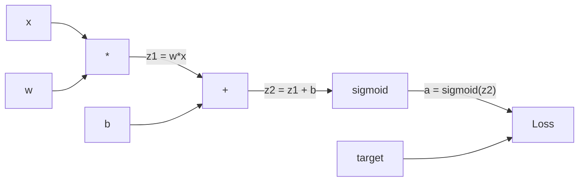
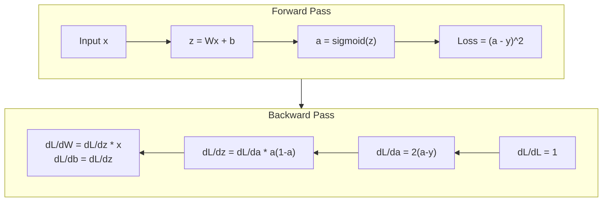
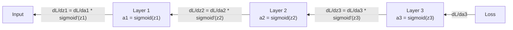

# Chuyển lại từ Xanh từ không để thực hiện sự lây lan ngược

> Phân tích ngược là thuật toán giúp học tập có thể. Nếu không có nó, mạng thần kinh chỉ là các máy phát điện số ngẫu nhiên đắt tiền.

> Phản hướng truyền là làm cho việc học trở thành một thuật toán có thể. Không có nó, mạng thần kinh chỉ là một máy tạo số tự nhiên đắt tiền.

> **【中文解读】**Phân tích ngược là thuật toán cốt lõi để mạng thần kinh có thể "làm việc học" không có nó, mạng thần kinh chỉ là một tập hợp của số lượng bất thường. Bản chất của nó là sử dụng quy tắc chuỗi tính toán hiệu quả các tham số của thang độ một lần truyền đi về phía trước + một lần truyền ngược sẽ có thể nhận được tất cả 2.3M  trọng lượng thang độ, thay vì cố gắng từng lần 2.3M.

**Type:** Build
**Languages:** Python
**Prerequisites:** Lesson 03.02 (Multi-Layer Networks)
**Time:** ~120 minutes

## Mục tiêu học tập

- Thực hiện một động cơ tự phân cấp dựa trên giá trị xây dựng biểu đồ tính toán và tính toán gradient thông qua phân loại topological
  Thực hiện động cơ phân tích tự động dựa trên giá trị, xây dựng biểu đồ tính toán và thông qua các trình độ tính toán
- Thuộc dẫn đường ngược cho việc cộng, nhân và sigmoid bằng cách sử dụng quy tắc chuỗi
  Sử dụng quy tắc chuỗi truyền tải thêm法,乘法 và sigmoid của ngược chiều truyền
- Đào tạo một mạng đa tầng trên XOR và phân loại vòng tròn chỉ sử dụng động cơ phát triển ngược của bạn từ đầu
  Chỉ cần bạn sử dụng từ không xây dựng phản chiều truyền động cơ trên XOR và hình dạng phân loại đào tạo mạng đa tầng
- Xác định vấn đề gradient biến mất trong các mạng sigmoid sâu và giải thích lý do tại sao gradient thu hẹp theo cách theo cấp
  识别深度 sigmoid 网络中的梯度消失问题, giải thích tại sao thang độ会指数级缩小

> **【中文解读】**Mục tiêu của chương này: xây dựng một động cơ phân chia tự động tương tự PyTorch autograd, sử dụng quy tắc chuỗi để hướng dẫn chuyển hướng ngược của pha, tập XOR và hình dạng phân loại nhiệm vụ, hiểu vấn đề biến mất của thang.

## Vấn đề  vấn đề giới thiệu

mạng của bạn có một lớp ẩn với 768 đầu vào và 3072 đầu ra. đó là 2.359.296 trọng lượng. nó đã đưa ra một dự đoán sai. trọng lượng nào gây ra sai lầm? kiểm tra từng trọng lượng một cách riêng biệt có nghĩa là 2.3 triệu lần đi về phía trước. Backpropagation tính toán tất cả 2.3 triệu gradient trong một lần đi ngược. đó không phải là một tối ưu hóa. đó là sự khác biệt giữa có thể đào tạo và không thể.

> Bạn có mạng lưới có 768 输入,3072 输出 ẩn层―― đó là 2,359,296 权重―― nó đã làm một dự đoán sai lầm―― đó là những trọng lượng nào đã dẫn đến sai lầm? cá nhân kiểm tra mỗi trọng lượng có nghĩa là 230 triệu lần chuyển tiếp truyền tải―― ngược chuyển tiếp trong một lần chuyển tiếp truyền tải―― đó không phải là tối ưu hóa―― đó là sự khác biệt giữa có thể đào tạo và không thể.

Cách tiếp cận ngây thơ: lấy một trọng lượng, đẩy nó một lượng nhỏ, chạy lại đi trước, đo lường liệu mất mát đã tăng hay giảm. Điều đó cho bạn gradient cho trọng lượng đó. Bây giờ làm điều đó cho mỗi trọng lượng trong mạng. Bội lên hàng ngàn bước đào tạo và hàng triệu điểm dữ liệu. Bạn sẽ cần thời gian địa chất để đào tạo bất cứ điều gì hữu ích.

> Phương pháp đơn giản: lấy một trọng lượng, điều chỉnh lại, chạy lại trước và tiếp tục truyền tải, đo lường mất là tăng hay giảm. Như vậy bạn có được thang trọng lượng đó. Bây giờ bạn làm như vậy với mỗi trọng lượng trên mạng.

Phân tích ngược giải quyết vấn đề này. Một bước đi về phía trước, một bước đi về phía sau, tất cả các gradient được tính toán. Tránh là quy tắc chuỗi từ toán học, được áp dụng một cách có hệ thống cho một biểu đồ tính toán. Đây là thuật toán làm cho việc học sâu trở nên thực tế. Nếu không có nó, chúng ta vẫn sẽ bị kẹt trong các vấn đề đồ chơi.

> Tránh hướng truyền giải quyết vấn đề này. Một lần tránh hướng truyền, một lần tránh hướng truyền, tất cả các bậc được tính toán hoàn thành.

> **【中文解读】**Một mạng có trọng lượng 2350.000, nếu từng thử nghiệm để tính toán thang, cần 2350.000 lần chuyển tiếp truyền tải. Phản chiều truyền tải chỉ cần một lần chuyển tiếp + một lần ngược để tính toán tất cả thang. Đây không phải là tối ưu hóa, mà là sự phân biệt từ "không thể" đến "có thể đào tạo".

## Khái niệm cốt lõi

### Quy tắc chuỗi, áp dụng cho mạng lưới                                                                                                                                                                                                                                                           

Bạn đã thấy quy tắc chuỗi trong giai đoạn 01, Bài học 05. Kết luận nhanh: nếu y = f(g(x)), thì dy/dx = f'(g(x)) * g'(x. Bạn nhân các dẫn xuất dọc theo chuỗi.

> Bạn đang ở giai đoạn đầu tiên. Chương 05 课见过链式法则──快速回顾: Nếu y = f(g(x)),则 dy/dx = f'(g(x)) * g'(x)── Bạn sẽ đi dọc theo chuỗi条将导数相乘──

Trong một mạng thần kinh, "thống chuỗi" là chuỗi các hoạt động từ đầu vào đến mất. Mỗi lớp áp dụng trọng lượng, thêm thiên vị, đi qua một hoạt động.

> Trong mạng thần kinh, "đường dây" là chuỗi hoạt động từ nhập đến mất. Mỗi lớp áp dụng trọng lượng, tăng vị trí, thông qua hàm kích hoạt.

> **【中文解读】**链式法则: Nếu y = f(g(x)),则 dy/dx = f'(g(x)) * g'(x) ・・・ Trong mạng thần kinh, "链" là một loạt các hoạt động từ nhập đến mất.

> **【拓展：PyTorch autograd 的核心】**PyTorch của `loss.backward()`Đó là tự động thực hiện quy tắc chuỗi. Nó ghi chép tính toán khi chuyển hướng trước, sau đó theo chiều ngược chiều, hiểu được thực hiện bằng tay của bài học này, hiểu được toàn bộ nguyên tắc của PyTorch autograd.

### Hình đồ tính

Mỗi bước đi về phía trước tạo ra một biểu đồ. Mỗi nút là một hoạt động (phùi, thêm, sigmoid). Mỗi cạnh mang một giá trị về phía trước và một gradient về phía sau.

> Mỗi lần chuyển tiếp trước đều xây dựng một bức tranh. Mỗi nút là một hoạt động.



Chuyển về phía trước: giá trị chảy từ trái sang phải. x và w tạo ra z1 = w*x. Thêm b để có z2. Sigmoid cho hoạt động a. So sánh a với mục tiêu y bằng hàm mất.

> 前向传播: giá trị từ trái sang phải流动──x 和 w 产生 z1 = w*x──加 b 得到 z2──Sigmoid 给出激活 a──用损失函数将 a 与目标 y 进行比较──

Trở về phía sau: gradient chảy từ bên phải sang bên trái. Bắt đầu bằng dL/da (như mất mát thay đổi với kích hoạt). nhân bằng da/dz2 (tái dẫn sigmoid). Điều đó cho dL/dz2. chia thành dL/db (tương đương dL/dz2, vì z2 = z1 + b) và dL/dz1.

> Từ dL/da(损失如何随激活变化) bắt đầu。乘以 da/dz2(sigmoid 导数)。得到 dL/dz2。拆分为 dL/dz2

Mỗi nút trong biểu đồ có một công việc trong quá trình đi ngược: lấy gradient từ trên, nhân bằng dẫn xuất địa phương của nó, và truyền xuống.

> Trong mỗi nút trong chuyển đổi ngược chỉ có một nhiệm vụ: nhận được thang độ chuyển trên, nhân bằng số chuyển địa phương của riêng mình, chuyển xuống.

> **【中文解读】**Mỗi node trong biểu đồ tính toán (năm) (năm) (năm) (năm) (năm) (năm) (năm) (năm) (năm) (năm) (năm) (năm) (năm) (năm) (năm) (năm) (năm) (năm) (năm) (năm) (năm) (năm) (năm) (năm) (năm) (năm) (năm) (năm) (năm) (năm) (năm) (năm) (năm) (năm) (năm) (năm) (năm) (năm) (năm) (năm) (năm) (năm) (năm) (năm) (năm) (năm) (năm) (năm) (năm) (năm) (năm) (năm) (năm) (năm) (năm) (năm) (năm) (năm) (năm) (năm) (năm) (năm) (năm) (năm) (năm) (năm) (năm) (năm) (năm) (năm) (năm) (năm) (năm) (năm) (năm) (năm) (năm) (năm) (năm) (năm) (năm) (năm) (năm) (năm) (năm) (năm) (năm) (năm) (năm) (năm) (năm) (năm) (năm) (năm) (năm) (năm) (năm) (năm) (năm) (năm) (năm) (năm) (năm) (năm) (năm) (năm) (năm) (năm) (năm) (năm) (năm) (năm) (năm) (năm) (năm) (năm) (năm) (năm) (năm) (năm) (năm) (năm) (n) (năm) (năm) (n) (

### Trước và ngược lại



Các thông qua phía trước lưu trữ tất cả các giá trị trung gian: z, a, các đầu vào cho mỗi lớp. Các thông qua phía sau cần những giá trị được lưu trữ này để tính toán gradient. Đây là sự giao dịch bộ nhớ-sử toán ở trung tâm của backprop. Bạn trao đổi bộ nhớ (tiếp kích lưu trữ) với tốc độ (một thông qua thay vì hàng triệu).

> Trước hướng truyền tải lưu trữ tất cả giá trị trung gian:z、a、 mỗi tầng nhập.

> **【中文解读】**Trước đây, lưu trữ truyền thông có giá trị trung gian của tất cả các lưu trữ (z、a、 mỗi tầng nhập), ngược lại truyền thông cần những giá trị này để tính toán thang độ. Đây là trọng lượng cốt lõi của ngược lại truyền thông: sử dụng lưu trữ (内存)

### Dòng chảy theo cấp thông qua mạng.

Đối với một mạng 3 tầng, chuỗi gradient qua mỗi tầng:

> Đối với 3 tầng mạng, thang độ thông qua mỗi tầng liên kết truyền tải:



Ở mỗi lớp, gradient được nhân bằng dẫn xuất sigmoid. dẫn xuất sigmoid là * (1 - a), đạt mức tối đa 0,25 (khi a = 0,5). Ba lớp sâu, gradient được nhân bằng tối đa 0,25 ^ 3 = 0,0156.

> Trong mỗi tầng, gradient đều được nhân bằng số dẫn của sigmoid.

### Gradients biến mất.

Đây là vấn đề gradient biến mất. Sigmoid đập vỡ đầu ra của nó giữa 0 và 1. dẫn xuất của nó luôn là ít hơn 0.25.

> Đây là vấn đề biến mất thang độ. Các pha trơn sẽ có kết quả nén lên 0 và 1 之间.

```
sigmoid(z):     Output range [0, 1]              # 输出范围 [0, 1]
sigmoid'(z):    Max value 0.25 (at z = 0)        # 导数最大值 0.25（在 z = 0 时）

After 5 layers:   gradient * 0.25^5 = 0.001x original       # 5 层后梯度缩到 0.001 倍
After 10 layers:  gradient * 0.25^10 = 0.000001x original    # 10 层后梯度几乎为零
```

Đó là lý do tại sao các mạng sigmoid sâu gần như không thể đào tạo. Giải pháp - ReLU và các biến thể của nó - là chủ đề của bài học 04. Cho đến bây giờ, hãy hiểu rằng backprop hoạt động hoàn hảo. Vấn đề là nó đang làm việc qua.

> Đó là lý do tại sao Deep Sigmoid 网络几乎不可能训练――解决方案ReLU 及其变体是第四课题――现在,只需要理解反向传播本身工作很好,问题在于它穿过的东西――

> **【中文解读】**梯度消失: số lượng dẫn đường của sigmoid tối đa chỉ 0,25, mỗi lần qua một tầng thang thang thang thang thang thang thang thang thang thang thang thang thang thang thang thang thang thang thang thang thang thang thang thang thang thang thang thang thang thang thang thang thang thang thang thang thang thang thang thang thang thang thang thang thang thang thang thang thang thang thang thang thang thang thang thang thang thang thang thang thang thang thang thang thang thang thang thang thang thang thang thang thang thang thang thang thang thang thang thang thang thang thang thang thang thang thang thang thang thang thang thang thang thang thang thang thang thang thang thang thang thang thang thang thang thang thang thang thang thang thang thang thang thang thang thang thang thang thang thang thang thang thang thang thang thang thang thang thang thang thang thang thang thang thang thang thang thang thang thang thang thang thang thang thang thang thang thang thang thang thang thang thang thang thang thang thang thang thang thang thang thang thang thang thang thang thang thang thang thang thang thang thang thang thang thang thang thang thang thang thang thang thang thang thang thang thang thang thang thang thang thang thang thang thang thang thang thang thang thang thang thang thang thang thang thang thang thang thang thang thang thang thang thang thang thang thang thang thang thang thang thang thang thang thang thang thang thang thang thang thang thang thang thang thang thang thang thang thang thang thang thang thang thang thang thang thang thang thang thang thang thang thang thang thang thang thang thang thang thang thang thang thang thang thang thang thang thang thang thang thang thang thang thang thang thang thang thang thang thang thang thang thang thang thang thang thang thang thang thang thang thang thang thang thang thang thang thang thang thang thang thang thang thang thang thang thang thang thang thang thang thang thang thang thang thang thang thang thang thang thang thang thang thang thang thang thang thang thang thang thang thang thang thang thang thang thang thang thang thang thang thang thang thang thang thang thang thang thang thang thang thang thang thang thang thang thang thang thang thang thang thang thang thang thang thang thang thang thang thang thang thang thang thang thang thang thang thang thang thang thang thang thang thang thang thang thang thang thang thang thang thang thang thang thang thang thang thang thang thang thang thang thang thang thang thang thang thang thang thang thang thang thang thang thang thang thang thang thang thang thang thang thang thang thang thang thang thang thang thang thang thang thang thang thang thang thang thang thang thang thang thang thang thang thang thang thang thang thang thang thang thang thang thang thang thang thang thang thang thang thang thang thang thang thang thang thang thang thang thang thang thang thang thang thang thang thang thang thang thang thang thang thang thang thang thang

> **【拓展：Transformer 中的梯度流】**Trình biến 用残差连接(Residual Connection) giải quyết vấn đề biến mất:`output = x + sublayer(x)` Như vậy, các bậc có thể nhảy qua các tầng truyền trực tiếp, khiến các tầng 96 của GPT-3 cũng có thể tập luyện.

### Tạo ra các gradient cho một mạng 2 tầng 推导 hai tầng mạng

Khóa toán cụ thể cho một mạng với đầu vào x, lớp ẩn với sigmoid, lớp đầu ra với sigmoid và mất MSE.

> 具体推导一个具有输入 x、sigmoid 隐藏层、sigmoid 输出层和MSE 损失的网络──

Nhận tiền:
```
z1 = W1 * x + b1          # 隐藏层线性变换
a1 = sigmoid(z1)           # 隐藏层激活
z2 = W2 * a1 + b2          # 输出层线性变换
a2 = sigmoid(z2)           # 输出层激活
L = (a2 - y)^2             # MSE 损失
```

Chuyển ngược (nói quy tắc chuỗi từng bước):
```
dL/da2 = 2(a2 - y)                              # 损失对输出的梯度
da2/dz2 = a2 * (1 - a2)                         # sigmoid 导数
dL/dz2 = dL/da2 * da2/dz2 = 2(a2 - y) * a2 * (1 - a2)  # 链式法则

dL/dW2 = dL/dz2 * a1                            # 输出层权重梯度
dL/db2 = dL/dz2                                  # 输出层偏置梯度

dL/da1 = dL/dz2 * W2                             # 梯度传播到隐藏层
da1/dz1 = a1 * (1 - a1)                          # sigmoid 导数
dL/dz1 = dL/da1 * da1/dz1                        # 链式法则

dL/dW1 = dL/dz1 * x                              # 隐藏层权重梯度
dL/db1 = dL/dz1                                   # 隐藏层偏置梯度
```

Mỗi gradient là sản phẩm của các phái sinh địa phương được theo dõi từ khi mất.

> Mỗi thang là nhân số của số dẫn đường địa phương từ mất trở lại. Đó là toàn bộ sự lây lan ngược.

> **【中文解读】** định tính thang của mạng hai tầng: bắt đầu từ hàm mất, sử dụng quy tắc chuỗi từ bước đến trở lại.

## Hãy xây dựng nó.
```figure
backprop-vanishing
```

## Hãy xây dựng nó

### Bước 1: Vòng giá trị 节值

Mỗi số trong tính toán của chúng ta trở thành một giá trị. Nó lưu trữ dữ liệu của nó, độ nghiêng của nó, và cách nó được tạo ra (vì vậy nó biết cách tính toán độ nghiêng ngược).

> Mỗi số trong tính toán của chúng ta đều trở thành một giá trị. Nó lưu trữ dữ liệu, thang độ và nó được tạo ra như thế nào.

```python
class Value:
    def __init__(self, data, children=(), op=''):
        self.data = data                          # 这个节点的数值
        self.grad = 0.0                           # 损失对这个值的梯度（初始为 0）
        self._backward = lambda: None             # 反向传播函数（初始为空操作）
        self._children = set(children)            # 产生这个值的子节点（用于拓扑排序）
        self._op = op                             # 产生这个值的操作（用于调试可视化）
```

Không có gradient (0.0) chưa có hàm ngược (không có op).`_children`theo dõi các giá trị đã tạo ra cái này, để chúng ta có thể sắp xếp topologically biểu đồ sau đó.

> Không còn độ độ nào ((0.0)。 Không còn hàm ngược chiều ((空操作)。`_children`Theo những giá trị nào  tạo ra giá trị này, để chúng ta sau đó tiến hành mở rộng thứ tự.

### Bước 2: Các hoạt động với các chức năng ngược

Mỗi hoạt động tạo ra một giá trị mới và xác định cách gradient chảy ngược qua nó.

> Mỗi hoạt động tạo ra một giá trị mới và xác định mức độ làm thế nào để nó chuyển ngược.

```python
def __add__(self, other):
    other = other if isinstance(other, Value) else Value(other)
    out = Value(self.data + other.data, (self, other), '+')

    def _backward():
        self.grad += out.grad        # 加法的梯度：d(a+b)/da = 1，直接传递
        other.grad += out.grad       # d(a+b)/db = 1，直接传递

    out._backward = _backward
    return out

def __mul__(self, other):
    other = other if isinstance(other, Value) else Value(other)
    out = Value(self.data * other.data, (self, other), '*')

    def _backward():
        self.grad += other.data * out.grad   # 乘法的梯度：d(a*b)/da = b
        other.grad += self.data * out.grad   # d(a*b)/db = a

    out._backward = _backward
    return out
```

Để thêm: d(a+b) /da = 1, d(a+b) /db = 1. Vì vậy cả hai đầu vào nhận được gradient đầu ra trực tiếp.

> 加法:d(a+b)/da = 1,d(a+b)/db = 1。 do đó hai nhập đều trực tiếp nhận được bước ra khỏi △

Đối với nhân: d(a*b) /da = b, d(a*b) /db = a. Mỗi đầu vào nhận được giá trị của người khác nhân gradient đầu ra.

> 乘法:d(a*b)/da = b,d(a*b)/db = a。 mỗi nhập lấy một giá trị khác của乘以输出梯度。

- `+=`là quan trọng. Một giá trị có thể được sử dụng trong nhiều hoạt động. gradient của nó là tổng số gradient từ tất cả các con đường.

> `+=`Một giá trị có thể được sử dụng trong nhiều hoạt động.

> **【中文解读】**加法梯度直接传递(导数为 1),乘法梯度乘以另一个操作数(d(a\*b) /da = b)。关键细节:用 `+=`Không phải`=`, vì một giá trị có thể được sử dụng nhiều lần, độ cần được tích hợp từ tất cả các tuyến đường.

### Bước 3: Sigmoid và Loss

```python
import math

def sigmoid(self):
    x = self.data
    x = max(-500, min(500, x))    # 裁剪防止溢出
    s = 1.0 / (1.0 + math.exp(-x))  # 前向：计算 sigmoid
    out = Value(s, (self,), 'sigmoid')

    def _backward():
        self.grad += (s * (1 - s)) * out.grad  # 反向：sigmoid 导数 = σ(x) * (1 - σ(x))

    out._backward = _backward
    return out
```

Tiến hóa Sigmoid: sigmoid(x) * (1 - sigmoid(x)). Chúng tôi tính toán sigmoid(x) = s trong quá trình chuyển tiếp về phía trước. Sử dụng lại. Không có công việc bổ sung.

> Sigmoid 导数:sigmoid(x) * (1 - sigmoid(x))。 我们在前向传播中已经计算了 sigmoid(x) = s──复用它,不需要额外工作──

```python
def mse_loss(predicted, target):
    diff = predicted + Value(-target)  # predicted - target
    return diff * diff                  # (predicted - target)^2
```

MSE cho một đầu ra duy nhất: (được dự đoán - mục tiêu) ^ 2. Chúng ta thể hiện trừ như là cộng với một giá trị bị phủ nhận.

> MSE: (đáng dự đoán - mục tiêu) ^2。 我们将减法表示为加上取反的值。

### Bước 4: Chuyển ngược

Topological sort đảm bảo chúng ta xử lý các nút theo thứ tự đúng - gradient của một nút được tích lũy đầy đủ trước khi chúng ta lan truyền qua nó.

> 拓排序 đảm bảo chúng ta theo đúng thứ tự xử lý các nút một bước của một nút đã được hoàn toàn gia tăng trước khi nó lây lan.

```python
def backward(self):
    topo = []                         # 拓扑排序结果
    visited = set()

    def build_topo(v):
        if v not in visited:
            visited.add(v)
            for child in v._children:    # 先访问所有子节点
                build_topo(child)
            topo.append(v)               # 子节点都访问完后，再把自己加入列表

    build_topo(self)
    self.grad = 1.0                     # 损失对自己的梯度 = 1（dL/dL = 1）
    for v in reversed(topo):            # 逆序遍历（从输出到输入）
        v._backward()                   # 每个节点执行自己的反向传播函数
```

Bắt đầu từ mất (đường độ = 1.0, vì dL / dL = 1). Đi ngược qua biểu đồ sắp xếp.`_backward`đẩy gradient lên con cái của nó.

> Từ mất mát bắt đầu: 梯度 = 1.0, vì dL/dL = 1)──逆序遍历排序后的计算图──每个节点的`_backward`Đưa gradient vào các nút của nó.

> **【中文解读】**拓排序保证: một节点的梯度完全累加后,才往它的子节点传播――从损失(梯度=1)开始,逆序遍历计算图,每个节点将梯度传递给产生它的子节点――这就是 PyTorch`loss.backward()`Ước tính của nó.

### Bước 5: Layer và Network Layer và Network

```python
import random

class Neuron:
    def __init__(self, n_inputs):
        scale = (2.0 / n_inputs) ** 0.5   # He 初始化缩放因子，防止 sigmoid 饱和
        self.weights = [Value(random.uniform(-scale, scale)) for _ in range(n_inputs)]
        self.bias = Value(0.0)

    def __call__(self, x):
        act = sum((wi * xi for wi, xi in zip(self.weights, x)), self.bias)  # 加权求和 + 偏置
        return act.sigmoid()  # sigmoid 激活

    def parameters(self):
        return self.weights + [self.bias]   # 返回所有可训练参数


class Layer:
    def __init__(self, n_inputs, n_outputs):
        self.neurons = [Neuron(n_inputs) for _ in range(n_outputs)]

    def __call__(self, x):
        out = [n(x) for n in self.neurons]
        return out[0] if len(out) == 1 else out  # 单神经元时直接返回值

    def parameters(self):
        params = []
        for n in self.neurons:
            params.extend(n.parameters())
        return params


class Network:
    def __init__(self, sizes):
        self.layers = []
        for i in range(len(sizes) - 1):
            self.layers.append(Layer(sizes[i], sizes[i + 1]))  # 按尺寸列表构建层

    def __call__(self, x):
        for layer in self.layers:
            x = layer(x)                    # 逐层前向传播
            if not isinstance(x, list):
                x = [x]
        return x[0] if len(x) == 1 else x

    def parameters(self):
        params = []
        for layer in self.layers:
            params.extend(layer.parameters())
        return params

    def zero_grad(self):
        for p in self.parameters():
            p.grad = 0.0    # 清零所有梯度（每次反向传播前必须调用）
```

Một Neuron lấy đầu vào, tính toán tổng số trọng lượng + thiên vị, và áp dụng sigmoid. Tỷ lệ khởi đầu trọng lượng bằng sqrt(2/n_input) để ngăn ngừa bão hòa sigmoid trong các mạng sâu hơn. Một Layer là một danh sách Neuron. Một Network là một danh sách các Layer.`parameters()`phương pháp thu thập tất cả các giá trị có thể học được để chúng ta có thể cập nhật chúng.

> Neuron 接收输入,计算加权和加偏置,然后应用 sigmoid──权重初始化按平方(2/n_inputs) 缩缩以防止更深层网络中 sigmoid 和──层是 Neuron 的列表──网络是层 的列表──`parameters()`方法收集所有可学习的价值以便更新──

> **【中文解读】**Neuron = một hệ thần kinh (权重 + 偏置 + sigmoid),Layer = 一组神经元,Network = 一组层。`parameters()`收集所有可训练参数,`zero_grad()`清零梯度 (~0) `model.parameters()`和 `optimizer.zero_grad()`Ưu điểm của nó

### Bước 6: Tập luyện trên XOR Tập luyện XOR

```python
random.seed(42)
net = Network([2, 4, 1])  # 2 输入 → 4 隐藏神经元 → 1 输出

xor_data = [
    ([0.0, 0.0], 0.0),
    ([0.0, 1.0], 1.0),
    ([1.0, 0.0], 1.0),
    ([1.0, 1.0], 0.0),
]

learning_rate = 1.0

for epoch in range(1000):
    total_loss = Value(0.0)
    for inputs, target in xor_data:
        x = [Value(i) for i in inputs]
        pred = net(x)                          # 前向传播
        loss = mse_loss(pred, target)          # 计算损失
        total_loss = total_loss + loss         # 累积损失

    net.zero_grad()           # 清零梯度
    total_loss.backward()     # 反向传播：计算所有参数的梯度

    for p in net.parameters():
        p.data -= learning_rate * p.grad      # 梯度下降更新权重

    if epoch % 100 == 0:
        print(f"Epoch {epoch:4d} | Loss: {total_loss.data:.6f}")

print("\nXOR Results:")
for inputs, target in xor_data:
    x = [Value(i) for i in inputs]
    pred = net(x)
    print(f"  {inputs} -> {pred.data:.4f} (expected {target})")
```

Xem mất mát giảm từ dự đoán ngẫu nhiên để sửa chữa XOR đầu ra, được thúc đẩy hoàn toàn bởi các gradient tính toán backpropagation và đẩy trọng lượng theo đúng hướng.

> 观察损失下降── từ dự đoán tự động đến XOR 输出 chính xác, hoàn toàn được vận hành bởi thang máy tính toán truyền ngược và sẽ đẩy trọng lực về hướng chính xác để di chuyển──

> **【中文解读】**Chuyển tập: trước hướng truyền →  tính toán mất → ngược hướng truyền → 更新权重── đây là bốn bước là cốt lõi của tất cả các đào tạo học sâu── mất từ cao xuống thấp, dự đoán từ bất cứ lúc nào đến đúng, tất cả đều dựa trên độ toán ngược hướng truyền để thúc đẩy──

### Bước 7: Định dạng vòng tròn

Trong bài học 02, bạn đã chỉnh cân bằng tay để phân loại vòng tròn.

> Trong bài học thứ 2, bạn đã tự điều chỉnh trọng lượng của các loại hình tròn. Bây giờ hãy để mạng tự học chúng.

```python
random.seed(7)

def generate_circle_data(n=100):
    data = []
    for _ in range(n):
        x1 = random.uniform(-1.5, 1.5)
        x2 = random.uniform(-1.5, 1.5)
        label = 1.0 if x1 * x1 + x2 * x2 < 1.0 else 0.0   # 距原点 < 1 则为"内部"
        data.append(([x1, x2], label))
    return data

circle_data = generate_circle_data(80)

circle_net = Network([2, 8, 1])  # 2-8-1 网络
learning_rate = 0.5

for epoch in range(2000):
    random.shuffle(circle_data)       # 打乱数据顺序
    total_loss_val = 0.0
    for inputs, target in circle_data:
        x = [Value(i) for i in inputs]
        pred = circle_net(x)
        loss = mse_loss(pred, target)
        circle_net.zero_grad()         # 清零梯度
        loss.backward()                # 反向传播
        for p in circle_net.parameters():
            p.data -= learning_rate * p.grad  # 更新权重
        total_loss_val += loss.data

    if epoch % 200 == 0:
        correct = 0
        for inputs, target in circle_data:
            x = [Value(i) for i in inputs]
            pred = circle_net(x)
            predicted_class = 1.0 if pred.data > 0.5 else 0.0
            if predicted_class == target:
                correct += 1
        accuracy = correct / len(circle_data) * 100
        print(f"Epoch {epoch:4d} | Loss: {total_loss_val:.4f} | Accuracy: {accuracy:.1f}%")
```

Chúng tôi sử dụng SGD trực tuyến ở đây - cập nhật trọng lượng sau mỗi mẫu thay vì tích lũy toàn bộ lô. Điều này phá vỡ đối xứng nhanh hơn và tránh bão hòa sigmoid trên cảnh quan mất mát đầy đủ. Trộn dữ liệu mỗi thời đại ngăn chặn mạng ghi nhớ thứ tự.

> Sử dụng SGD trực tuyến để cập nhật trọng lượng sau mỗi mẫu, thay vì tích lũy toàn bộ lô.

Không cần chỉnh sửa bằng tay. Mạng lưới tự phát hiện ra ranh giới quyết định vòng tròn. Đó là sức mạnh của sự lan rộng ngược: bạn xác định kiến trúc, hàm mất và dữ liệu. thuật toán tính toán trọng lượng.

> 无需手动调权重――网络自学画圆形决策边界――这是反向传播的力量:你定义架构、损失函数和数据,算法自己找到正确权重――

> **【中文解读】**Đây là sức mạnh của việc truyền tải ngược: bạn định nghĩa cấu trúc, hàm mất dữ liệu và dữ liệu, thuật toán tự tìm ra trọng lượng chính xác.

## Sử dụng nó thực tế

PyTorch làm tất cả trên trong một vài dòng. Ý tưởng cốt lõi là giống nhau - autograd xây dựng một biểu đồ tính toán trong quá trình đi về phía trước và theo dõi nó trở lại để tính toán gradient.

> PyTorch sử dụng vài dòng mã đã hoàn thành tất cả các chức năng trên.

```python
import torch
import torch.nn as nn

model = nn.Sequential(
    nn.Linear(2, 4),       # 对应我们的 Layer(2, 4)
    nn.Sigmoid(),           # 对应 sigmoid 激活
    nn.Linear(4, 1),       # 对应我们的 Layer(4, 1)
    nn.Sigmoid(),
)
optimizer = torch.optim.SGD(model.parameters(), lr=1.0)  # 对应我们的手动梯度下降
criterion = nn.MSELoss()  # 对应我们的 mse_loss

X = torch.tensor([[0,0],[0,1],[1,0],[1,1]], dtype=torch.float32)
y = torch.tensor([[0],[1],[1],[0]], dtype=torch.float32)

for epoch in range(1000):
    pred = model(X)                  # 前向传播
    loss = criterion(pred, y)        # 计算损失
    optimizer.zero_grad()            # 清零梯度（对应 net.zero_grad()）
    loss.backward()                  # 反向传播（对应 total_loss.backward()）
    optimizer.step()                 # 更新权重（对应 p.data -= lr * p.grad）

print("PyTorch XOR Results:")
with torch.no_grad():                # 推理模式，不计算梯度
    for i in range(4):
        pred = model(X[i])
        print(f"  {X[i].tolist()} -> {pred.item():.4f} (expected {y[i].item()})")
```

`loss.backward()`là của bạn `total_loss.backward()`- `optimizer.step()`là hướng dẫn của bạn `p.data -= lr * p.grad`- `optimizer.zero_grad()`là của bạn `net.zero_grad()`. Khóa học tương tự, thực hiện sức mạnh công nghiệp. PyTorch xử lý tốc độ GPU, độ chính xác hỗn hợp, kiểm tra độ dốc, và hàng trăm loại lớp. Nhưng việc vượt qua ngược là cùng một quy tắc chuỗi áp dụng cho cùng một biểu đồ tính toán.

> `loss.backward()`Đó là của anh.`total_loss.backward()``optimizer.step()`Đó là tay của anh.`p.data -= lr * p.grad``optimizer.zero_grad()`Đó là của anh.`net.zero_grad()` Tương tự như các thuật toán, thực hiện cấp công nghiệp  PyTorch  xử lý GPU gia tốc, độ chính xác hỗn hợp, độ kiểm tra điểm và hàng trăm loại lớp  Nhưng ngược chiều truyền là sẽ áp dụng cùng một quy tắc chuỗi tương tự cho cùng một hình kế toán 

Trình luyện chạy đi trước, rồi đi ngược, rồi cập nhật trọng lượng. Inference chỉ chạy qua phía trước. Không có gradient, không có cập nhật. Sự phân biệt này quan trọng bởi vì suy luận là những gì xảy ra trong sản xuất. Khi bạn gọi cho một API như Claude hoặc GPT, bạn đang đưa ra suy luận -- lời nhắc của bạn chảy về phía trước qua mạng, và token ra ngoài ở đầu kia. Không thay đổi trọng lượng. Nhận thức về backprop là quan trọng bởi vì nó hình thành mọi trọng lượng trong mạng đó.

> 训运行前向传播,然后反向传播,然后更新权重――推理只运行前向传播――没有梯度,没有更新―― sự khác biệt này rất quan trọng, bởi vì推理 là những gì xảy ra trong môi trường sản xuất―― khi bạn调用 Claude hoặc GPT等 API, bạn chạy là推理你的提示词前向流过网络,代码从另一端输出――权重不变――理解反向传播很重要,因为它塑造了网络中的每一个权重――

> **【中文解读】**PyTorch của `loss.backward()`= Chúng ta viết tay của `backward()`- Tôi không biết.`optimizer.step()`= Chúng ta viết tay của `p.data -= lr * p.grad` train time do do do do do do do do do do do do do do do do do do do do do do do do do do do do do do do do do do do do do do do do do do do do do do do do do do do do do do do do do do do do do do do do do do do do do do do do do do do do do do do do do do do do do do do do do do do do do do do do do do do do do do do do do do do do do do do do do do do do do do do do do do do do do do do do do do do do do do do do do do do do do do do do do do do do do do do do do do do do do do do do do do do do do do do do do do do do do do do do do do do do do do do do do do do do do do do do do do do do do do do do do do do do do do do do do do do do do do do do do do do do do do do do do do do do do do do do do do do do do do do do do do do do do do do do do do do do do do do do do do do do do do do do do do do do do do do do do do do do do do do do do do do do do do do do do do do do do do do do do do do do do do do do do do do do do do do do do do do do do do do do do do do do do do do do do do do do do do do do do do do do do do do do do do do do do do do do do do do do do do do do do do do do do do do do do do do do do do do do do do do do do do do do do do do do do do do do do do do do do do do do do do do do do do do do do do do do do do do do do do do do do do do do do do do do do do do do do do do do do do do do do do do do do do do do do do do do do do do do do do do do do do do do do do do do do do do do do do do do do do do do do do do do do do do do do do do do do do do do do do do do do do do do do do

## Chuyển đi.

Bài học này mang lại:
- `outputs/prompt-gradient-debugger.md`-- một lời nhắc tái sử dụng để chẩn đoán các vấn đề gradient (sự biến mất, nổ, NaN) trong bất kỳ mạng thần kinh nào

> 本课产 出:`outputs/prompt-gradient-debugger.md`- Một chẩn đoán có thể lặp lại bất kỳ vấn đề cấp độ trung tâm của mạng thần kinh nào

## Tập luyện bài tập

1. Thêm một `__sub__`phương pháp để lớp giá trị (a - b = a + (-1 * b)). Sau đó thực hiện a `__neg__`Phương pháp kiểm tra rằng các gradient là chính xác bằng cách so sánh với tính toán thủ công cho một biểu thức đơn giản như (a - b) ^ 2.
   > **练习 1：**给 Value 类加减法和取负操作―― dùng bàn tính toán验证 (a - b) ^ 2 của gradient có đúng không――

2. Thêm một `relu`phương pháp để Value (output max ((0, x), dẫn xuất là 1 nếu x > 0, thì 0). Thay thế sigmoid bằng relu trong các lớp ẩn và tập trên XOR một lần nữa. So sánh tốc độ hội tụ. Bạn nên xem đào tạo nhanh hơn - đây là xem trước Bài học 04.
   > **练习 2：**给值 添加 ReLU 方法──用 ReLU 替换隐藏层的 sigmoid,训练 XOR 并对比收速度──ReLU 应该更快这是下一课的预览──

3. Thực hiện một`__pow__`Phương pháp về giá trị cho các quyền số nguyên. Sử dụng nó để thay thế `mse_loss`với một đúng `(predicted - target) ** 2`biểu hiện. kiểm tra gradient phù hợp với thực hiện ban đầu.
   > **练习 3：**给值 添加运算方法, sử dụng nó viết lại MSE 损失――验证梯度与原始实现一致――

4. Thêm cắt gradient vào vòng đào tạo: sau khi gọi `backward()`, cắt tất cả các gradient đến [-1, 1]. Tập một mạng lưới sâu hơn (4+ lớp với sigmoid) và so sánh đường cong mất mát với và không cắt. Đây là phòng thủ đầu tiên của bạn chống lại gradient nổ.
   > **练习 4：**Trong vòng tập luyện, thêm độ cắt cắt [-1, 1])。 tập luyện 4+ tầng của hệ thống 网络, đối với có/ không cắt giảm đường cong.

5. XOR: Sau khi đào tạo trên XOR, in gradient của mỗi tham số trong mạng. Xác định lớp nào có gradient nhỏ nhất. Điều này cho thấy vấn đề gradient biến mất bạn đọc về trong phần Concept.
   > **练习 5：**训练 XOR 后, in từng phần tử của gradient.

## Từ khóa  Keyword

| Term | What people say | What it actually means |
|------|----------------|----------------------|
| Backpropagation | "The network learns" | An algorithm that computes dL/dw for every weight by applying the chain rule backward through the computational graph |
| Computational graph | "The network structure" | A directed acyclic graph where nodes are operations and edges carry values (forward) and gradients (backward) |
| Chain rule | "Multiply the derivatives" | If y = f(g(x)), then dy/dx = f'(g(x)) * g'(x) -- the mathematical foundation of backpropagation |
| Gradient | "The direction of steepest ascent" | The partial derivative of the loss with respect to a parameter -- tells you how to change that parameter to reduce the loss |
| Vanishing gradient | "Deep networks don't learn" | Gradients shrink exponentially as they propagate through layers with saturating activations like sigmoid |
| Forward pass | "Running the network" | Computing the output from inputs by sequentially applying each layer's operations and storing intermediate values |
| Backward pass | "Computing gradients" | Traversing the computational graph in reverse, accumulating gradients at each node using the chain rule |
| Learning rate | "How fast it learns" | A scalar that controls the step size when updating weights: w_new = w_old - lr * gradient |
| Topological sort | "The right order" | An ordering of graph nodes where each node appears after all nodes it depends on -- ensures gradients are fully accumulated before propagation |
| Autograd | "Automatic differentiation" | A system that builds computational graphs during forward computation and automatically computes gradients -- what PyTorch's engine does |

| 术语 | 通俗说法 | 实际含义 |
|------|---------|---------|
| 反向传播 (Backpropagation) | "网络在学习" | 用链式法则沿计算图反向计算每个权重的 dL/dw 的算法 |
| 计算图 (Computational graph) | "网络结构" | 有向无环图，节点是操作，边传递值（前向）和梯度（反向） |
| 链式法则 (Chain rule) | "把导数乘起来" | y = f(g(x)) → dy/dx = f'(g(x)) * g'(x)——反向传播的数学基础 |
| 梯度 (Gradient) | "最陡上升方向" | 损失对参数的偏导数——告诉你怎么改参数能降低损失 |
| 梯度消失 (Vanishing gradient) | "深层网络学不动" | 梯度经过饱和激活函数（如 sigmoid）逐层指数级缩小 |
| 前向传播 (Forward pass) | "跑网络" | 从输入逐层计算输出，存储中间值 |
| 反向传播过程 (Backward pass) | "算梯度" | 逆序遍历计算图，用链式法则逐节点累加梯度 |
| 学习率 (Learning rate) | "学多快" | 控制权重更新步长的标量：w_new = w_old - lr * gradient |
| 拓扑排序 (Topological sort) | "正确的顺序" | 保证每个节点的梯度完全累加后再往下传播的节点排列 |
| 自动微分 (Autograd) | "自动求导" | 前向时构建计算图，自动计算梯度的系统——PyTorch 引擎的核心 |

## Xem thêm 延伸阅读

- Rumelhart, Hinton & Williams, "Giáo trình học đại diện bằng lỗi truyền ngược" (1986) - bài báo đã làm cho truyền ngược trở lại và đào tạo mạng đa tầng mở
  Rumelhart、Hinton 和 Williams,通过反向传播误差学习表示(1986)让反向传播成为主流并解锁多层网络训练的论文
- 3Blue1Brown, loạt "Nền mạng thần kinh" (https://www.youtube.com/playlist?list=PLZHQObOWTQDNU6R1_67000Dx_ZCJB-3pi) -- giải thích trực quan tốt nhất về sự lây lan trở lại và dòng chảy gradient qua các mạng
  3Blue1Brown,  Bộ não mạng series  về sự giải thích khả quan tốt nhất về sự lây lan ngược và độ lây lan trong mạng
