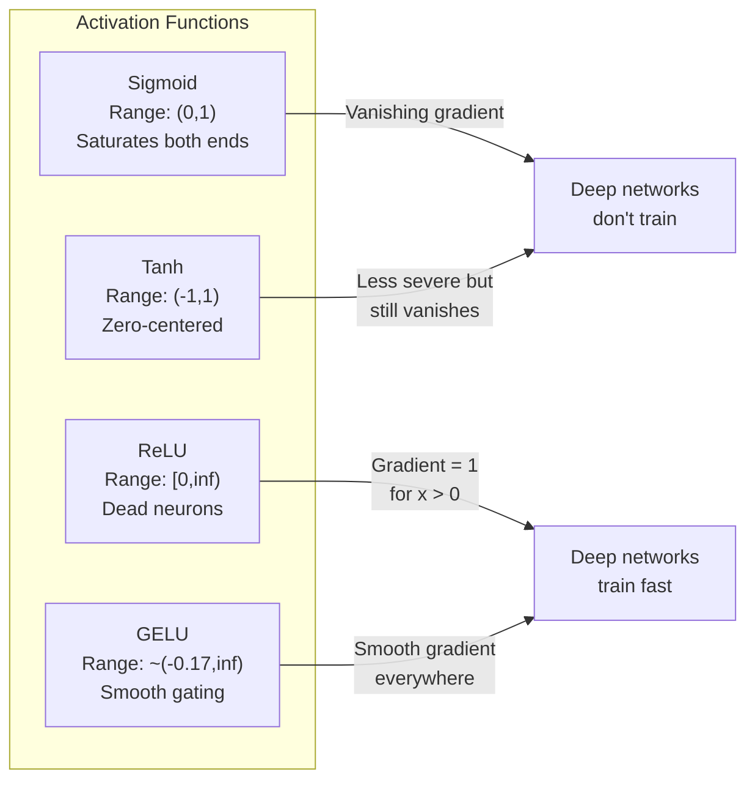
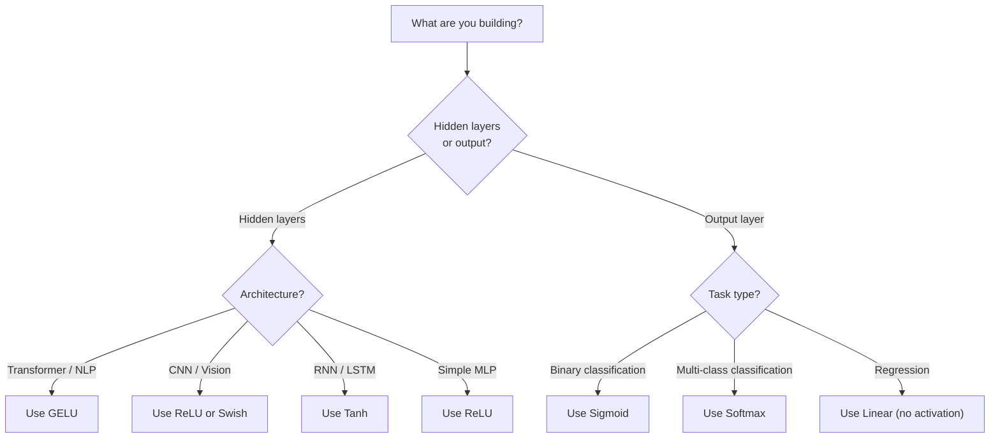

# - Vị trí hoạt động

> Nếu không có tính không tuyến tính, mạng 100 tầng của bạn là một số lượng tử hình cao cấp.

> **【中文解读】**Không có hàm kích hoạt không tuyến tính, 100 tầng mạng tương đương với một矩阵乘法. Bởi vì hai cấu trúc chuyển đổi phức hợp vẫn là tuyến tính: W2 ((W1x+b1) +b2 = (W2W1)x + (W2b1+b2) ").

**Type:** Build
**Languages:** Python
**Prerequisites:** Lesson 03.03 (Backpropagation)
**Time:** ~75 minutes

## Mục tiêu học tập

- Thực hiện sigmoid, tanh, ReLU, Leaky ReLU, GELU, Swish, và softmax với các phái sinh của chúng từ đầu
- Chẩn đoán vấn đề biến mất gradient bằng cách đo cường độ kích hoạt thông qua 10+ lớp với kích hoạt khác nhau
- Khám phá các tế bào thần kinh chết trong mạng ReLU và giải thích tại sao GELU tránh chế độ thất bại này
- Chọn chức năng kích hoạt chính xác cho một kiến trúc nhất định (transformer, CNN, RNN, lớp đầu ra)

> **【中文解读】**Mục tiêu của chương này: thực hiện 7 loại chức năng kích hoạt và số dẫn, thông qua thử nghiệm chẩn đoán biến mất các vấn đề, kiểm tra các thần kinh tử vong trong ReLU, học tập cho các cấu trúc khác nhau chọn thích hợp các chức năng kích hoạt.

## Vấn đề  vấn đề giới thiệu

Lắp 2 chuyển đổi tuyến tính: y = W2 ((W1x + b1) + b2. mở rộng nó: y = W2W1x + W2b1 + b2. Đó chỉ là y = Ax + c - một chuyển đổi tuyến tính đơn lẻ. Bất kể bạn xếp hàng bao nhiêu lớp tuyến tính, kết quả sẽ sụp đổ thành một số tử liệu nhân. Mạng 100 lớp của bạn có sức mạnh đại diện giống như một lớp đơn.

> 堆叠两层线性变换:y = W2(W1x + b1) + b2。展开后:y = W2W1x + W2b1 + b2。这不过是 y = Ax + c一个单独的线性变换──无论你堆叠多少线性层,结果都会缩为一次矩阵乘法──你的100层网络与单层网络具有相同的表示能力──

Đây không phải là một sự tò mò lý thuyết. Nó có nghĩa là một mạng lưới tuyến tính sâu không thể học XOR, không thể phân loại một tập dữ liệu xoắn ốc, không thể nhận ra một khuôn mặt.

> Đây không phải là một sự tò mò về lý thuyết. Điều này có nghĩa là mạng lưới đường sâu thực sự không thể học được XOR, không thể phân loại tập hợp dữ liệu xoắn, không thể nhận ra khuôn mặt người. Không có hàm hoạt động, độ sâu là một ảo giác.

Các chức năng kích hoạt phá vỡ tính tuyến tính. Chúng biến dạng đầu ra của mỗi lớp thông qua một chức năng không tuyến tính, cho phép mạng lưới khui ranh giới quyết định, gần gũi các chức năng tùy tiện và thực sự học hỏi. Nhưng chọn hoạt động sai và gradient của bạn biến mất đến không (sigmoid trong mạng sâu), nổ đến vô hạn (tiếp kích không giới hạn mà không cần khởi tạo cẩn thận), hoặc các tế bào thần kinh của bạn chết vĩnh viễn (ReLU với thiên vị tiêu cực lớn). Việc chọn chức năng kích hoạt trực tiếp xác định xem mạng của bạn có học được hay không.

> n hiệu ứng phá vỡ tính tuyến tính. Chúng thông qua các hàm không tuyến tính biến dạng mỗi cấp độ của sản xuất, trao cho mạng 曲 quyết định giới hạn 逼近 bất kỳ hàm nào并 thực sự học năng. n hiệu ứng, thang độ sẽ biến mất thành 0  (sigmoid trong mạng sâu)  nổ đến vô tận  không có chi tiết khởi động  (sinh giới hoạt động), hoặc thần kinh chết vĩnh viễn  có sự phân định lớn  (RLU) .

> **【中文解读】**堆叠两层线性变换 y = W2(W1x+b1) +b2 展开后就是一个线性变换 y = Ax+c。不管叠叠多少层,结果都等于一个矩阵乘法深度是假的。 kích hoạt hàm打破线性,让网络能曲决策边界、逼近任意函数──选择错误 kích hoạt hàm sẽ dẫn đến sự biến mất của梯度(sigmoid) ∞梯度爆炸或神经死亡(ReLU)。

## Khái niệm cốt lõi

### Tại sao tính không tuyến tính là cần thiết Tại sao phải có tính không tuyến tính

Tỷ lệ nhân tử liệu là hợp thể. Tỷ lệ nhân một vector bằng số tử liệu A sau đó là số tử liệu B giống nhau với số nhân bằng AB. Điều này có nghĩa là xếp hàng mười lớp tuyến tính bằng một lớp tuyến tính với một số tử liệu lớn. Tất cả các tham số đó, tất cả chiều sâu đó - lãng phí. Bạn cần một cái gì đó để phá vỡ chuỗi. Đó là những gì các chức năng kích hoạt làm.

> 矩乘法 là hợp thể. √ sử dụng đầu tiên矩 A nhân khối lượng, sử dụng lại矩 B nhân, tương đương với AB nhân. √ sử dụng các phương pháp toán học, nghĩa là xếp hàng 10 tầng tuyến tính tương đương với một tầng tuyến tính có một矩阵 lớn.

Đây là bằng chứng. Một lớp tuyến tính tính toán f ((x) = Wx + b. Dòng hai:

```
Layer 1: h = W1 * x + b1         # 第一层线性变换
Layer 2: y = W2 * h + b2         # 第二层线性变换
```

Thay thế:

```
y = W2 * (W1 * x + b1) + b2      # 代入 h
y = (W2 * W1) * x + (W2 * b1 + b2)  # 展开
y = A * x + c                     # 合并为单一矩阵——深度消失了！
```

Một lớp. Nhập một kích hoạt không tuyến tính g() giữa các lớp:

```
h = g(W1 * x + b1)               # 加入非线性激活
y = W2 * h + b2
```

Bây giờ thay thế bị phá vỡ. W2 * g(W1 * x + b1) + b2 không thể được giảm xuống thành một chuyển đổi tuyến tính duy nhất. Mạng có thể đại diện cho các chức năng phi tuyến tính. Mỗi lớp bổ sung với một kích hoạt thêm dung lượng đại diện.

> 现在代入被打破了──W2 * g(W1 * x + b1) + b2 không thể đơn giản hóa thành một thay đổi không tuyến tính──网络可以表示非线性函数──每个带激活函数的附层都增加表示能力──

> **【中文解读】**Bằng chứng toán học: hai sự thay đổi liên kết của sự phức tạp vẫn là liên kết. Nhưng vào không liên kết hoạt động g() 后, W2 * g(W1x + b1) + b2 không thể kết hợp thành một矩阵 mỗi nhiều tầng hoạt động, khả năng biểu hiện của mạng thực sự tăng lên.

### Sigmoid

chức năng kích hoạt ban đầu cho mạng thần kinh.

> Cần tính năng kích hoạt đầu tiên của mạng thần kinh:

```
sigmoid(x) = 1 / (1 + e^(-x))
```

Phạm vi sản xuất: (0, 1). Dẻo, phân biệt, lập bản đồ bất kỳ số thực nào với giá trị tương tự như xác suất.

> 输出范围:(0, 1)。平滑、可微, sẽ bất kỳ số thực nào được mô tả như giá trị của tỷ lệ có thể xảy ra.

Các dẫn xuất:

> Số lượng:

```
sigmoid'(x) = sigmoid(x) * (1 - sigmoid(x))
```

Giá trị tối đa của phái sinh này là 0,25, xảy ra ở x = 0. Trong sự lan rộng ngược, gradient nhân qua các lớp.

> Giá trị tối đa của số này là 0.25, xuất hiện trong x = 0 时. Trong truyền ngược chiều, gradient ở tầng giữa các pha乘──10 layer sigmoid có nghĩa là gradient nhiều nhất nhân bằng 0.25 十次:

```
0.25^10 = 0.000000953674     # 不到原始信号的百万分之一
```

Chỉ dưới một triệu phần trăm của tín hiệu ban đầu. Đây là vấn đề biến mất của gradient. Các gradient ở các lớp ban đầu trở nên nhỏ đến nỗi trọng lượng hầu như không cập nhật. Mạng dường như học hỏi - mất mát giảm ở các lớp sau đó - nhưng các lớp đầu tiên bị đóng băng. Mạng sigmoid sâu đơn giản là không tập luyện.

> Không đến một triệu phần trăm của tín hiệu ban đầu. Đây là vấn đề biến mất thang độ. Đường độ của tầng trước trở nên nhỏ đến mức trọng lượng gần như không được cải thiện.

Vấn đề bổ sung: các đầu ra sigmoid luôn tích cực (0 đến 1), có nghĩa là gradient trên trọng lượng luôn luôn là cùng một dấu hiệu.

> 额外问题:sigmoid 输出总是正数(0 đến 1), điều này có nghĩa là thang trọng của trọng lượng总是同号―― điều này dẫn đến thang giảm theo hình thức.

> **【中文解读】**Số lượng dẫn đường tối đa của Sigmoid chỉ là 0.25,10 层后梯度 chỉ còn lại một triệu分之一──前面几层几乎不收到梯度,无法学习──另外 sigmoid 输出总是正数(0到1), dẫn đến权重梯度同号,优化路径呈形──

> **【拓展：Sigmoid 在现代 AI 中的位置】**Sigmoid 虽然不再用于隐藏层,但在二分类输出层仍然常用──Transformer 中的注意力分数也用软max(sigmoid 的一般化)──理解sigmoid 的局限性,是理解为什么 ReLU/GELU 让深度学习成为可能的关键──

### Tanh

Phiên bản trung tâm của sigmoid.

> Phiên bản trung tâm của Sigmoid

```
tanh(x) = (e^x - e^(-x)) / (e^x + e^(-x))
```

Phạm vi sản xuất: (-1, 1). Trung tâm không, loại bỏ vấn đề zig-zag.

> 输出范围:(-1, 1)──零中心化, loại bỏ các vấn đề hình dạng──

Các dẫn xuất:

> Số lượng:

```
tanh'(x) = 1 - tanh(x)^2
```

Tiến dẫn tối đa là 1.0 ở x = 0 - tốt hơn bốn lần so với sigmoid. Nhưng vấn đề gradient biến mất vẫn tồn tại. Đối với đầu vào tích cực hoặc tiêu cực lớn, dẫn dẫn gần bằng không. Mười lớp vẫn đập nghiền gradient, ít hơn một cách hung hăng.

> Số dẫn tối đa là 1.0 ((x = 0 时)  hơn sigmoid tốt 4 lần. Nhưng vấn đề biến mất độ vẫn tồn tại. Đối với các đầu vào chính xác hoặc tiêu cực lớn, số dẫn gần như không có.

> **【中文解读】**Tanh là phiên bản zero trung tâm của sigmoid,输出范围 (-1, 1),导数最大值 1.0(比 sigmoid 好 4 倍) ・・・ nhưng lượng lớn nhập khẩu thời gian导数 vẫn đang tiến gần đến 0, vấn đề biến mất độ vẫn tồn tại, chỉ là không quá nghiêm trọng。

> **【拓展：LSTM 中的 Tanh】**LSTM 网络的隐藏状态和候选记忆使用tanh(把值压缩到 -1 到 1)。 Mặc dù Transformer 已基本取代 LSTM, nhưng hiểu tanh đối với hiểu RNN 系列模型 rất quan trọng。

### ReLU: Sự đột phá

Định hướng đơn vị tuyến tính được phổ biến cho việc học sâu bởi Nair và Hinton vào năm 2010 (các chức năng tự nó có từ công việc năm 1969 của Fukushima), nó đã thay đổi mọi thứ.

> 修正线性单元──由Nair 和 Hinton推广于2010年用于深度学习 (Phương thức này tự nó có thể bắt nguồn từ công việc của Fukushima năm 1969), nó đã thay đổi mọi thứ──

```
relu(x) = max(0, x)
```

Phạm vi đầu ra: [0, vô hạn).

```
relu'(x) = 1  if x > 0
           0  if x <= 0
```

Không có gradient biến mất cho các đầu vào tích cực. gradient chính xác là 1, đi thẳng qua. Đó là lý do tại sao các mạng sâu trở nên có thể đào tạo - ReLU giữ lại độ lớn gradient trên các lớp.

> 正输入没有梯度消失问题――梯度正确是1,直接传递――这就是深度网络变得可训练的原因RLU在层间保持梯度幅度――

Nhưng có một chế độ thất bại: vấn đề của các tế bào thần kinh chết. Nếu đầu vào trọng lượng của một tế bào thần kinh luôn luôn âm tính (do sự thiên vị tiêu cực lớn hoặc khởi đầu trọng lượng không may), đầu ra của nó luôn luôn là không, độ nghiêng của nó luôn luôn là không, và nó không bao giờ cập nhật. Nó vĩnh viễn chết. Trong thực tế, 10-40% các tế bào thần kinh trong một mạng ReLU có thể chết trong quá trình đào tạo.

> Nhưng có một mô hình thất bại: vấn đề thần kinh chết. Nếu một số thần kinh tăng tải vào luôn luôn luôn luôn luôn luôn luôn luôn luôn luôn luôn luôn luôn luôn luôn luôn luôn luôn luôn luôn luôn là không, bước đi luôn luôn luôn là không, không bao giờ được cập nhật. Nó đã chết vĩnh viễn. Trong thực tế, 10-40% các thần kinh trong mạng RELU có thể chết trong quá trình tập luyện.

> **【中文解读】**ReLU đối với thang độ nhập chính xác là 1, hoàn toàn không suy giảm Đây là lý do khiến mạng lưới sâu trở nên có thể đào tạo Nhưng nó có vấn đề "thủy thần kinh chết": Nếu một số thần kinh tăng cường nhập luôn là tiêu cực, nó sẽ luôn xuất 0 ̊ thang độ 0, không bao giờ có thể phục hồi

> **【拓展：ReLU 在 CNN 中的统治地位】**ResNet、VGG、EfficientNet 等 CNN 架构都使用 ReLU (hoặc các biến thể khác) ⋅Căn cỡ của CNN + ReLU là một tập hợp tiêu chuẩn của các tính năng hình ảnh.

### ReLU bị rò rỉ

Cách đơn giản nhất để chữa trị cho các tế bào thần kinh chết.

> Cách đơn giản nhất để sửa chữa thần kinh tử vong.

```
leaky_relu(x) = x        if x > 0
                alpha * x if x <= 0
```

Ở đó alpha là một liên tục nhỏ, thường là 0.01. Mặt tiêu cực có một độ nghiêng nhỏ thay vì không, vì vậy các tế bào thần kinh chết vẫn nhận được tín hiệu gradient và có thể phục hồi.

> Trong số đó alpha là một số thường nhỏ, thường là 0.01── phía tiêu cực có một độ nghiêng nhỏ thay vì 0, vì vậy thần kinh chết vẫn có thể nhận được tín hiệu thang và có thể phục hồi──

> **【中文解读】**ReLU trong khu vực tiêu cực giữ một tỷ lệ nghiêng nhỏ (0,01), để thần kinh chết vẫn có thể nhận được tín hiệu gradient, có thể phục hồi.

### GELU: Định dạng hiện đại

Gaussian Error Linear Unit. Được giới thiệu bởi Hendrycks và Gimpel vào năm 2016.

> 高斯差差线性单元──由 Hendrycks 和 Gimpel 提出于2016年──BERT、GPT 和大多数现代 Transformer 的默认激活函数──

```
gelu(x) = x * Phi(x)
```

Phi ((x) là hàm phân phối tích lũy của phân bố bình thường tiêu chuẩn.

```
gelu(x) ~= 0.5 * x * (1 + tanh(sqrt(2/pi) * (x + 0.044715 * x^3)))
```

GELU là mượt mà ở mọi nơi, cho phép các giá trị tiêu cực nhỏ (không giống như ReLU mà cắt cứng đến không), và có một cách giải thích xác suất: nó cân nhắc mỗi đầu vào bằng cách xác định khả năng nó tích cực dưới phân bố Gaussian.

> GELU 处平滑,允许小的负值(不像 ReLU 硬截断为零), có xác suất giải thích: nó theo đầu vào trong phân bố đúng trạng thái để xác suất đúng đối với mỗi đầu vào tăng quyền;;

> **【中文解读】**GELU là hàm kích hoạt mặc định của BERT、GPT 和 hầu hết các Transformer hiện đại. Nó ở mức độ trơn, cho phép giá trị tiêu cực nhỏ (không giống như ReLU 硬截断为 0), sự giải thích của tỷ lệ là: theo nhập để tăng tỷ lệ xác thực.

> **【拓展：GPT/BERT 中的 GELU】**Trong FFN của Transformer, tiêu chuẩn cấu trúc là`Linear → GELU → Linear`✿PyTorch của ✿`nn.GELU()`和 `F.gelu()`Đó là hàm này. GPT-2/3/4 ЬBERT, ROBERTA 等模型都使用 GELU.

### Swish / SiLU

Tự kích hoạt được phát hiện bởi Ramachandran et al. vào năm 2017 thông qua tìm kiếm tự động.

```
swish(x) = x * sigmoid(x)
```

Swish chính thức là x * sigmoid ((x). Google phát hiện ra nó thông qua tìm kiếm tự động trên không gian chức năng kích hoạt -- một mạng thần kinh thiết kế các phần của mạng thần kinh.

Giống như GELU, nó mịn, không đơn điệu và cho phép các giá trị tiêu cực nhỏ. Sự khác biệt là tinh tế: Swish sử dụng sigmoid để cổng trong khi GELU sử dụng Gaussian CDF. Trong thực tế, hiệu suất gần giống nhau. Swish được sử dụng trong EfficientNet và một số mô hình thị giác. GELU thống trị trong mô hình ngôn ngữ.

> **【中文解读】**Swish = x * sigmoid(x), thông qua tìm kiếm tự động tìm thấy(u dùng hệ thống mạng thiết kế hệ thống mạng) ⋅ và GELU 性能几乎相同,细微区别是 Swish dùng sigmoid 门控、GELU dùng高斯 CDF 门控──Swish dùng EfficientNet 等视觉模型,GELU 统治语言模型──

### Softmax: Tích hoạt đầu ra Ứng dụng kích hoạt

Không được sử dụng trong các lớp ẩn. Softmax chuyển đổi một vector của điểm số thô (logits) thành phân bố xác suất.

```
softmax(x_i) = e^(x_i) / sum(e^(x_j) for all j)
```

Mỗi đầu ra là từ 0 đến 1. Tất cả các đầu ra tổng cộng đến 1. Điều này làm cho nó trở thành kích hoạt cuối cùng tiêu chuẩn cho phân loại đa lớp. Logit lớn nhất có xác suất cao nhất, nhưng không giống như argmax, softmax có thể phân biệt và bảo tồn thông tin về sự tin cậy tương đối.

> **【中文解读】**Softmax không được sử dụng để ẩn tầng, mà là để chuyển thành phân bố xác suất. Tất cả các đầu ra được tạo ra giữa 0-1 và tổng cộng là 1.

> **【拓展：Softmax 在 Transformer 中无处不在】**Hệ thống tự tập trung của biến thể sử dụng softmax  tính trọng lượng tập trung:`attention = softmax(Q·K^T / sqrt(d_k))`                                                                                                                                                                                                                                                              

### So sánh hình dạng so với hình dạng



### Khi nào kích hoạt khi nào khi nào sử dụng hàm kích hoạt gì



> **【中文解读】**经验法则:Transformer/NLP dùng GELU,CNN/视觉 dùng ReLU,RNN/LSTM dùng tanh――输出层:二分类用 sigmoid,也许类用 softmax,归归不用激活――

## Hãy xây dựng nó.
```figure
softmax-temperature
```

## Hãy xây dựng nó

### Bước 1: Thực hiện tất cả các chức năng kích hoạt với các phái sinh

Mỗi hàm lấy một float và trả lại một float. Mỗi hàm phái sinh lấy đầu vào tương tự và trả lại gradient.

```python
import math

def sigmoid(x):
    x = max(-500, min(500, x))  # 裁剪防止溢出
    return 1.0 / (1.0 + math.exp(-x))  # σ(x) = 1/(1+e^(-x))

def sigmoid_derivative(x):
    s = sigmoid(x)
    return s * (1 - s)  # sigmoid 导数 = σ(x)(1 - σ(x))，最大值 0.25

def tanh_act(x):
    return math.tanh(x)  # 双曲正切

def tanh_derivative(x):
    t = math.tanh(x)
    return 1 - t * t  # tanh 导数 = 1 - tanh²(x)，最大值 1.0

def relu(x):
    return max(0.0, x)  # 正区间透传，负区间归零

def relu_derivative(x):
    return 1.0 if x > 0 else 0.0  # 正区间梯度=1，负区间梯度=0

def leaky_relu(x, alpha=0.01):
    return x if x > 0 else alpha * x  # 负区间保留小斜率

def leaky_relu_derivative(x, alpha=0.01):
    return 1.0 if x > 0 else alpha  # 负区间梯度=alpha

def gelu(x):
    # GELU 近似公式，用于 GPT/BERT 等 Transformer
    return 0.5 * x * (1 + math.tanh(math.sqrt(2 / math.pi) * (x + 0.044715 * x ** 3)))

def gelu_derivative(x):
    phi = 0.5 * (1 + math.erf(x / math.sqrt(2)))  # 标准正态 CDF
    pdf = math.exp(-0.5 * x * x) / math.sqrt(2 * math.pi)  # 标准正态 PDF
    return phi + x * pdf

def swish(x):
    return x * sigmoid(x)  # Swish = x * σ(x)，用于 EfficientNet

def swish_derivative(x):
    s = sigmoid(x)
    return s + x * s * (1 - s)  # Swish 导数 = σ(x) + x·σ(x)(1-σ(x))

def softmax(xs):
    max_x = max(xs)  # 数值稳定性：减去最大值
    exps = [math.exp(x - max_x) for x in xs]
    total = sum(exps)
    return [e / total for e in exps]  # 所有输出和为 1
```

### Bước 2: Hình ảnh nơi các học sinh chết

Xét gradient ở 100 điểm có khoảng cách ngang từ -5 đến 5. Bác một histogram văn bản cho thấy gradient của mỗi hoạt động gần bằng không.

```python
def gradient_scan(name, derivative_fn, start=-5, end=5, n=100):
    step = (end - start) / n
    near_zero = 0
    healthy = 0
    for i in range(n):
        x = start + i * step
        g = derivative_fn(x)
        if abs(g) < 0.01:       # 梯度接近零的区域
            near_zero += 1
        else:
            healthy += 1
    pct_dead = near_zero / n * 100
    print(f"{name:15s}: {healthy:3d} healthy, {near_zero:3d} near-zero ({pct_dead:.0f}% dead zone)")

gradient_scan("Sigmoid", sigmoid_derivative)
gradient_scan("Tanh", tanh_derivative)
gradient_scan("ReLU", relu_derivative)
gradient_scan("Leaky ReLU", leaky_relu_derivative)
gradient_scan("GELU", gelu_derivative)
gradient_scan("Swish", swish_derivative)
```

### Bước 3: Phương pháp biến mất của sự cố

Chuyển tín hiệu về phía trước qua N lớp sử dụng sigmoid vs ReLU. đo lường cách kích hoạt lớn thay đổi.

```python
import random

def vanishing_gradient_experiment(activation_fn, name, n_layers=10, n_inputs=5):
    random.seed(42)
    values = [random.gauss(0, 1) for _ in range(n_inputs)]

    print(f"\n{name} through {n_layers} layers:")
    for layer in range(n_layers):
        weights = [random.gauss(0, 1) for _ in range(n_inputs)]
        z = sum(w * v for w, v in zip(weights, values))  # 加权求和
        activated = activation_fn(z)  # 激活
        magnitude = abs(activated)
        bar = "#" * int(magnitude * 20)
        print(f"  Layer {layer+1:2d}: magnitude = {magnitude:.6f} {bar}")  # 观察 magnitude 是否逐层缩小
        values = [activated] * n_inputs

vanishing_gradient_experiment(sigmoid, "Sigmoid")  # sigmoid 的 magnitude 会快速缩小
vanishing_gradient_experiment(relu, "ReLU")        # ReLU 的 magnitude 不会缩小
vanishing_gradient_experiment(gelu, "GELU")        # GELU 介于两者之间
```

### Bước 4: Tác giả thần kinh chết

Tạo một mạng ReLU, truyền thông vào ngẫu nhiên qua nó, đếm bao nhiêu tế bào thần kinh không bao giờ phát nổ.

```python
def dead_neuron_detector(n_inputs=5, hidden_size=20, n_samples=1000):
    random.seed(0)
    weights = [[random.gauss(0, 1) for _ in range(n_inputs)] for _ in range(hidden_size)]
    biases = [random.gauss(0, 1) for _ in range(hidden_size)]

    fire_counts = [0] * hidden_size  # 记录每个神经元的激活次数

    for _ in range(n_samples):
        inputs = [random.gauss(0, 1) for _ in range(n_inputs)]
        for neuron_idx in range(hidden_size):
            z = sum(w * x for w, x in zip(weights[neuron_idx], inputs)) + biases[neuron_idx]
            if relu(z) > 0:           # ReLU 激活 > 0 算"激活"
                fire_counts[neuron_idx] += 1

    dead = sum(1 for c in fire_counts if c == 0)          # 从未激活 = 死亡
    rarely_fire = sum(1 for c in fire_counts if 0 < c < n_samples * 0.05)  # 极少激活
    healthy = hidden_size - dead - rarely_fire

    print(f"\nDead Neuron Report ({hidden_size} neurons, {n_samples} samples):")
    print(f"  Dead (never fired):     {dead}")
    print(f"  Barely alive (<5%):     {rarely_fire}")
    print(f"  Healthy:                {healthy}")
    print(f"  Dead neuron rate:       {dead/hidden_size*100:.1f}%")

    for i, c in enumerate(fire_counts):
        status = "DEAD" if c == 0 else "WEAK" if c < n_samples * 0.05 else "OK"
        bar = "#" * (c * 40 // n_samples)
        print(f"  Neuron {i:2d}: {c:4d}/{n_samples} fires [{status:4s}] {bar}")

dead_neuron_detector()
```

### Bước 5: So sánh tập luyện - Sigmoid vs ReLU vs GELU  tập luyện đối với

Đào tạo cùng một mạng hai lớp trên bộ dữ liệu vòng tròn (điểm bên trong vòng tròn = lớp 1, bên ngoài = lớp 0) với ba kích hoạt khác nhau. So sánh tốc độ hội tụ.

```python
def make_circle_data(n=200, seed=42):
    random.seed(seed)
    data = []
    for _ in range(n):
        x = random.uniform(-2, 2)
        y = random.uniform(-2, 2)
        label = 1.0 if x * x + y * y < 1.5 else 0.0  # 距原点 < sqrt(1.5) 为"内部"
        data.append(([x, y], label))
    return data


class ActivationNetwork:
    """使用指定激活函数的两层网络，用于对比不同激活函数的训练效果"""
    def __init__(self, activation_fn, activation_deriv, hidden_size=8, lr=0.1):
        random.seed(0)
        self.act = activation_fn       # 激活函数
        self.act_d = activation_deriv  # 激活函数导数
        self.lr = lr
        self.hidden_size = hidden_size

        self.w1 = [[random.gauss(0, 0.5) for _ in range(2)] for _ in range(hidden_size)]  # 隐藏层权重
        self.b1 = [0.0] * hidden_size   # 隐藏层偏置
        self.w2 = [random.gauss(0, 0.5) for _ in range(hidden_size)]  # 输出层权重
        self.b2 = 0.0                    # 输出层偏置

    def forward(self, x):
        self.x = x
        self.z1 = []
        self.h = []
        for i in range(self.hidden_size):
            z = self.w1[i][0] * x[0] + self.w1[i][1] * x[1] + self.b1[i]  # 线性变换
            self.z1.append(z)
            self.h.append(self.act(z))  # 激活（这里对比不同激活函数的效果）

        self.z2 = sum(self.w2[i] * self.h[i] for i in range(self.hidden_size)) + self.b2
        self.out = sigmoid(self.z2)  # 输出层用 sigmoid（二分类标准）
        return self.out

    def backward(self, target):
        error = self.out - target
        d_out = error * self.out * (1 - self.out)  # 输出层梯度

        for i in range(self.hidden_size):
            d_h = d_out * self.w2[i] * self.act_d(self.z1[i])  # 隐藏层梯度
            self.w2[i] -= self.lr * d_out * self.h[i]           # 更新输出层权重
            for j in range(2):
                self.w1[i][j] -= self.lr * d_h * self.x[j]     # 更新隐藏层权重
            self.b1[i] -= self.lr * d_h                          # 更新隐藏层偏置
        self.b2 -= self.lr * d_out                               # 更新输出层偏置

    def train(self, data, epochs=200):
        losses = []
        for epoch in range(epochs):
            total_loss = 0
            correct = 0
            for x, y in data:
                pred = self.forward(x)
                self.backward(y)
                total_loss += (pred - y) ** 2
                if (pred >= 0.5) == (y >= 0.5):
                    correct += 1
            avg_loss = total_loss / len(data)
            accuracy = correct / len(data) * 100
            losses.append(avg_loss)
            if epoch % 50 == 0 or epoch == epochs - 1:
                print(f"    Epoch {epoch:3d}: loss={avg_loss:.4f}, accuracy={accuracy:.1f}%")
        return losses


data = make_circle_data()

configs = [
    ("Sigmoid", sigmoid, sigmoid_derivative),    # 预期：收敛慢，梯度消失
    ("ReLU", relu, relu_derivative),              # 预期：收敛快
    ("GELU", gelu, gelu_derivative),              # 预期：收敛快且平滑
]

results = {}
for name, act_fn, act_d_fn in configs:
    print(f"\n=== Training with {name} ===")
    net = ActivationNetwork(act_fn, act_d_fn, hidden_size=8, lr=0.1)
    losses = net.train(data, epochs=200)
    results[name] = losses

print("\n=== Final Loss Comparison ===")
for name, losses in results.items():
    print(f"  {name:10s}: start={losses[0]:.4f} -> end={losses[-1]:.4f} (improvement: {(1 - losses[-1]/losses[0])*100:.1f}%)")
```

## Sử dụng nó thực tế

PyTorch cung cấp tất cả các loại này dưới dạng cả các dạng chức năng và mô-đun:

```python
import torch
import torch.nn as nn
import torch.nn.functional as F

x = torch.randn(4, 10)  # 4 个样本，每个 10 维

relu_out = F.relu(x)           # ReLU：对应我们的 relu()
gelu_out = F.gelu(x)           # GELU：对应我们的 gelu()
sigmoid_out = torch.sigmoid(x)  # Sigmoid：对应我们的 sigmoid()
swish_out = F.silu(x)          # Swish/SiLU：对应我们的 swish()

logits = torch.randn(4, 5)     # 4 个样本，5 个类别
probs = F.softmax(logits, dim=1)  # Softmax：对应我们的 softmax()

model = nn.Sequential(
    nn.Linear(10, 64),
    nn.GELU(),          # Transformer 标配：GELU
    nn.Linear(64, 32),
    nn.GELU(),
    nn.Linear(32, 5),   # 输出层：不加激活（logits）
)
```

Lớp ẩn trong một biến thể: GELU. Lớp ẩn trong một CNN: ReLU. Lớp sản xuất để phân loại: softmax. Lớp sản xuất để hồi quy: không có (đường tuyến). Lớp sản xuất cho xác suất: sigmoid. Đó là nó. Bắt đầu với các mặc định này. Chỉ thay đổi chúng khi bạn có bằng chứng.

RNN và LSTM sử dụng tanh cho trạng thái ẩn và sigmoid cho cổng, nhưng nếu bạn đang xây dựng từ đầu ngày nay, bạn có thể không sử dụng RNN. Nếu các tế bào thần kinh đang chết trong mạng ReLU của bạn, hãy chuyển sang GELU. Đừng tìm ra Leaky ReLU trừ khi bạn có một lý do cụ thể - GELU giải quyết vấn đề của các tế bào thần kinh chết và cung cấp dòng chảy gradient tốt hơn.

> **【中文解读】**PyTorch đã cung cấp tất cả các hàm hoạt động và module API.

## Chuyển đi.

Bài học này mang lại:
- `outputs/prompt-activation-selector.md`-- một lời nhắc tái sử dụng giúp bạn chọn đúng chức năng kích hoạt cho bất kỳ kiến trúc

## Tập luyện bài tập

1. Thực hiện Parametric ReLU (PReLU) nơi độ nghiêng âm alpha là một tham số có thể học được. Đọc nó trên bộ dữ liệu vòng tròn và so sánh với cố định Leaky ReLU.
   > **练习 1：**实现 PRELU(负斜率 alpha 可学习), trong hình圆数据上训练并与Leaky ReLU对比──

2. Thực hiện thí nghiệm gradient biến mất với 50 lớp thay vì 10. Chụp quy mô tại mỗi lớp cho sigmoid, tanh, ReLU và GELU. Ở lớp nào tín hiệu của mỗi kích hoạt hiệu quả đạt đến không?
   > **练习 2：**Để mở rộng thí nghiệm biến mất thang lên 50 tầng... tín hiệu của hàm kích hoạt nào đầu tiên trở lại không?

3. Thực hiện ELU (Exponential Linear Unit): elu(x) = x nếu x > 0, alpha * (e^x - 1) nếu x <= 0. So sánh tốc độ của các tế bào thần kinh chết với ReLU trên cùng một mạng.
   > **练习 3：**实现 ELU, trên cùng một mạng tương đối với tỷ lệ tử vong của ELU và ReLU.

4. Xây dựng một "chân sát sức khỏe gradient" chạy trong thời gian đào tạo: tại mỗi thời kỳ, tính toán độ lớn gradient trung bình ở mỗi lớp. In một cảnh báo khi gradient của bất kỳ lớp nào giảm xuống dưới 0,001 hoặc vượt quá 100.
   > **练习 4：**Xây dựng "đường độ kiểm soát sức khỏe" mỗi vòng tính toán các tầng trung bình của thang độ lớn, thấp hơn 0,001 hoặc hơn 100 时报警

5. Thay đổi so sánh đào tạo để sử dụng tập dữ liệu XOR từ Bài học 01 thay vì vòng tròn.
   > **练习 5：**Sử dụng XOR dữ liệu tập hợp thay thế hình tròn dữ liệu để so sánh.

## Từ khóa  Keyword

| Term | What people say | What it actually means |
|------|----------------|----------------------|
| Activation function | "The nonlinear part" | A function applied to each neuron's output that breaks linearity, enabling the network to learn nonlinear mappings |
| Vanishing gradient | "Gradients disappear in deep networks" | Gradients shrink exponentially through layers when the activation's derivative is less than 1, making early layers untrainable |
| Exploding gradient | "Gradients blow up" | Gradients grow exponentially through layers when the effective multiplier exceeds 1, causing unstable training |
| Dead neuron | "A neuron that stopped learning" | A ReLU neuron whose input is permanently negative, producing zero output and zero gradient |
| Sigmoid | "Squishes values to 0-1" | The logistic function 1/(1+e^-x), historically important but causes vanishing gradients in deep networks |
| ReLU | "Clips negatives to zero" | max(0, x) -- the activation that made deep learning practical by preserving gradient magnitude |
| GELU | "The transformer activation" | Gaussian Error Linear Unit, a smooth activation that weights inputs by their probability of being positive |
| Swish/SiLU | "Self-gated ReLU" | x * sigmoid(x), discovered through automated search, used in EfficientNet |
| Softmax | "Turns scores into probabilities" | Normalizes a vector of logits into a probability distribution where all values are in (0,1) and sum to 1 |
| Leaky ReLU | "ReLU that doesn't die" | max(alpha*x, x) where alpha is small (0.01), preventing dead neurons by allowing small negative gradients |
| Saturation | "The flat part of sigmoid" | Regions where an activation's derivative approaches zero, blocking gradient flow |
| Logit | "The raw score before softmax" | The unnormalized output of the final layer before applying softmax or sigmoid |

| 术语 | 通俗说法 | 实际含义 |
|------|---------|---------|
| 激活函数 (Activation function) | "非线性那部分" | 施加在每个神经元输出上的函数，打破线性，使网络能学习非线性映射 |
| 梯度消失 (Vanishing gradient) | "深层梯度消失" | 导数小于 1 的激活函数导致梯度逐层指数缩小，前面的层无法训练 |
| 梯度爆炸 (Exploding gradient) | "梯度爆炸" | 有效乘数超过 1 时梯度逐层指数增长，训练不稳定 |
| 死亡神经元 (Dead neuron) | "停止学习的神经元" | ReLU 神经元输入永远为负，输出和梯度永远为零 |
| Sigmoid | "压到 0-1" | 逻辑函数 1/(1+e^-x)，历史重要但深层网络中梯度消失 |
| ReLU | "负数变零" | max(0, x)——通过保持梯度幅度让深度学习变得可行的激活函数 |
| GELU | "Transformer 激活" | 高斯误差线性单元，按输入为正的概率加权的平滑激活 |
| Swish/SiLU | "自门控 ReLU" | x * sigmoid(x)，通过自动搜索发现，用于 EfficientNet |
| Softmax | "分数变概率" | 把 logits 归一化为概率分布，所有值在 (0,1) 且和为 1 |
| Leaky ReLU | "不会死的 ReLU" | max(alpha*x, x)，负区间保留小梯度防止神经元死亡 |
| 饱和 (Saturation) | "sigmoid 的平坦区" | 激活函数导数趋近于零的区域，阻断梯度流 |
| Logit | "softmax 前的原始分" | 最终层未归一化的输出 |

## Xem thêm 延伸阅读

- Nair & Hinton, "Các đơn vị tuyến tính sửa chữa cải thiện máy Boltzmann hạn chế" (2010) - bài báo giới thiệu ReLU và cho phép đào tạo các mạng sâu
- Hendrycks & Gimpel, "Gaussian Error Linear Units (GELUs) " (2016) -- giới thiệu chức năng kích hoạt trở thành mặc định cho các bộ chuyển đổi
- Ramachandran et al., "Sẽ tìm các chức năng kích hoạt" (2017) -- sử dụng tìm kiếm tự động để khám phá Swish, cho thấy thiết kế kích hoạt có thể được tự động hóa
- Glorot & Bengio, "Hiểu được sự khó khăn của việc đào tạo các mạng lưới thần kinh cấp dữ liệu sâu" (2010) - bài báo chẩn đoán biến mất / bùng nổ gradient và đề xuất Xavier khởi tạo
- Goodfellow, Bengio, Courville, "Dân học sâu" Chương 6.3 (https://www.deeplearningbook.org/) -- xử lý nghiêm ngặt các đơn vị ẩn và chức năng kích hoạt
