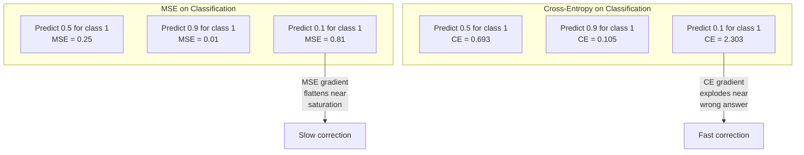
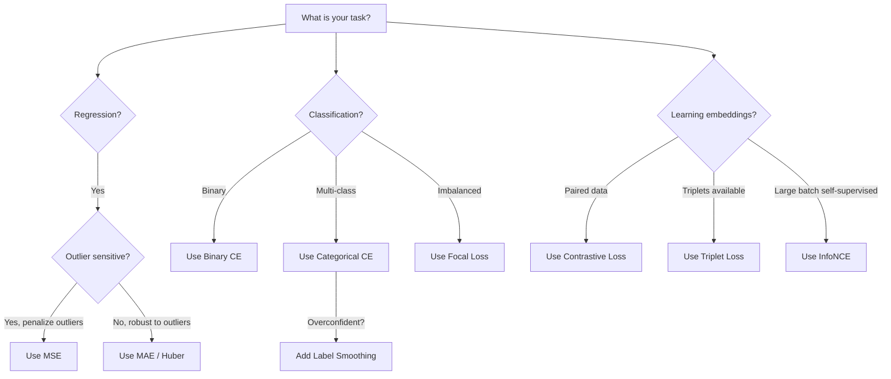

# Loss Functions  Loss Function

> mạng của bạn đưa ra một dự đoán. thực tại mặt đất nói ngược lại. nó sai như thế nào? số đó là lỗ. chọn hàm lỗ sai và mô hình của bạn tối ưu hóa cho sai hoàn toàn.

> **【中文解读】**损失函数 là mục tiêu duy nhất của mô hình  không phải là tỷ lệ xác thực  không phải là F1 分数, là giá trị mất mát  chọn hàm mất mát, mô hình sẽ tìm ra cách "nhiều đáng nhớ nhất về toán học" để đáp ứng nó, chứ không phải là kết quả bạn thực sự muốn  Ví dụ: phân loại nhiệm vụ sử dụng MSE, mô hình sẽ dự đoán tất cả các mẫu là 0,5 ((nhiều nhất mất mát nhưng không có ích) 

**Type:** Build
**Languages:** Python
**Prerequisites:** Lesson 03.04 (Activation Functions)
**Time:** ~75 minutes

## Mục tiêu học tập

- Thực hiện MSE, cross-entropy nhị phân, cross-entropy hạng mục và mất mát tương phản (InfoNCE) từ đầu với các gradient của chúng
- Giải thích lý do tại sao MSE không được phân loại bằng cách hiển thị chế độ thất bại "định đoán 0.5 cho mọi thứ"
- Lấy nhãn làm mượt mà cho sự liên kết và mô tả cách nó ngăn ngừa dự đoán quá tự tin
- Chọn hàm mất tích chính xác cho sự lùi lại, phân loại nhị phân, phân loại đa lớp và nhúng các nhiệm vụ học tập

> **【中文解读】**Mục tiêu của chương này: thực hiện 5 loại hàm và thang độ mất, hiểu tại sao các loại nhiệm vụ không thể sử dụng MSE, học tập để ghi điểm và đối với lỗ hổng, học tập dựa trên nhiệm vụ chọn đúng hàm mất.

## Vấn đề  vấn đề giới thiệu

Một mô hình giảm thiểu MSE trên một vấn đề phân loại sẽ dự đoán một cách tự tin 0.5 cho mọi thứ. Nó giảm thiểu tổn thất. Nó cũng vô dụng.

> Một mô hình MSE được tối thiểu hóa trên phân loại vấn đề sẽ tự tin với tất cả các dự đoán nhập 0.5 . Nó được tối thiểu hóa mất nhưng cũng không có ích gì.

Chức năng mất mát là điều duy nhất mô hình của bạn thực sự tối ưu hóa. Không chính xác. Không có điểm số F1. Không phải là những thông số mà anh báo cáo cho quản lý của anh. Máy tối ưu hóa lấy gradient của hàm mất và điều chỉnh trọng lượng để làm cho số đó nhỏ hơn. Nếu hàm mất không nắm bắt những gì bạn quan tâm, mô hình sẽ tìm ra cách rẻ nhất về mặt toán học để thỏa mãn nó, và cách đó hầu như không bao giờ là những gì bạn muốn.

>  lỗ hàm là mục tiêu duy nhất để tối ưu hóa mô hình của bạn thực tế. Không phải tỷ lệ xác thực. Không phải số F1 phân số. Không phải bất kỳ chỉ số nào bạn báo cáo cho quản lý. Ứng dụng tối ưu hóa lấy thang của hàm lỗ và điều chỉnh trọng lượng để làm cho số nhỏ hơn. Nếu hàm mất không nắm bắt được những gì bạn quan tâm, mô hình sẽ tìm ra cách rẻ nhất về toán học để đáp ứng nó, nhưng cách đó hầu như không bao giờ là bạn muốn.

Đây là một ví dụ cụ thể. Bạn có một nhiệm vụ phân loại nhị phân. Hai lớp, 50/50 chia. Anh dùng MSE như là tổn thất của mình. Mô hình dự đoán 0,5 cho mỗi đầu vào. MSE trung bình là 0,25, đó là mức tối thiểu có thể mà không thực sự học được bất cứ điều gì. Mô hình này không có khả năng phân biệt nhưng nó đã giảm thiểu chức năng mất mát của bạn. Chuyển sang entropy chéo và cùng một mô hình bị buộc phải đẩy dự đoán về phía 0 hoặc 1, bởi vì -log(0.5) = 0.693 là một tổn thất khủng khiếp, trong khi -log(0.99) = 0.01 thưởng cho dự đoán chính xác. Sự lựa chọn của hàm mất là sự khác biệt giữa một mô hình học hỏi và một mô hình chơi theo métrics.

> 具体例:二元分类任务,两类各占50%──你使用MSE 作为损失──模型对每个输入都预测0.5──平均MSE为0.25, đây là giá trị tối thiểu có thể thực sự không học được bất cứ điều gì──模型没有任何区分能力,但技术已经最小化了你的损失函数──换成交叉后,同样的模型被迫推推预测向0或1,因为 -log(0.5) =0.693 là một lỗ hổng rất kém,而 -log(0.99) =0.01 会奖励自信的正确预测──损失函数的选择决定了模型学习还在钻系统的空子.

Nó trở nên tồi tệ hơn. Trong việc học tự giám sát, bạn thậm chí không có nhãn. Khối thấu hiểu đánh giá tín hiệu học tập hoàn toàn: những gì được tính là tương tự, những gì được tính là khác nhau, và mô hình phải đẩy chúng ra sao.

> Trong quá trình tự giám sát học tập, bạn thậm chí không có nhãn. Đối với tổn thất hoàn toàn xác định tín hiệu học tập: những gì tương tự, những gì khác nhau, mô hình nên phân chia chúng với nhiều lực lượng.

> **【中文解读】**MSE làm phân loại, mô hình phát hiện dự đoán 0.5 là chiến lược an toàn nhất lỗ hổng tối thiểu nhưng không có khả năng phân biệt──交叉则通过 -log (p) 惩罚不自信的预测:-log (0.5) = 0.693 (hơn rất差) vs -log (0.99) = 0.01 (hơn rất tốt), buộc mô hình đưa ra phán đoán rõ ràng── trong tự giám sát học tập, đối số lỗ hổng định nghĩa toàn bộ tín hiệu học tập (g) làm sai lầm sẽ dẫn đến tất cả các nhúng 嵌缩 thành cùng một điểm──

## Khái niệm cốt lõi

### Phản ứng của các công cụ này là:

Các mặc định cho sự lùi lại. tính toán sự khác biệt vuông giữa dự đoán và mục tiêu, trung bình trên tất cả các mẫu.

> Trở lại nhiệm vụ của tùy chọn mặc định.

```
MSE = (1/n) * sum((y_pred - y_true)^2)
```

Tại sao tính cách bình phương là quan trọng: nó phạt lỗi lớn theo cách hình tư. một lỗi 2 tốn 4 lần so với một lỗi 1. một lỗi 10 tốn 100 lần. Điều này làm cho MSE nhạy cảm với các giá trị ngoại lệ - một dự đoán sai lầm độc đáo thống trị tổn thất.

> Tại sao hình vuông rất quan trọng: nó xử lý lỗi lớn lần hai. Giá của lỗi 2 là 4 lần của lỗi 1. Giá của lỗi 10 là 100 lần. Điều này làm cho MSE nhạy cảm với giá trị bất thường.

Số thực: nếu mô hình của bạn dự đoán giá nhà ở và là không $10,000 on most houses but off by $200.000 trên một biệt thự, MSE sẽ cố gắng sửa chữa một biệt thự đó, có khả năng làm tổn hại hiệu suất trên 99 ngôi nhà khác.

> 具体数字: Nếu mô hình của bạn dự đoán giá nhà, hầu hết các nhà khác biệt $10,000，但一栋豪宅偏差 $200.000,MSE sẽ cố gắng sửa chữa ngôi nhà đó, có thể làm hỏng hiệu suất của 99 ngôi nhà khác.

Tỷ lệ gradient của MSE đối với một dự đoán là:

> MSE đối với mức độ dự đoán là:

```
dMSE/dy_pred = (2/n) * (y_pred - y_true)      # 梯度与误差成线性关系
```

Trình độ lỗi đường thẳng. Trình độ lỗi lớn hơn có gradient lớn hơn. Đây là tính năng để lùi lại (trầm lỗi lớn cần sửa chữa lớn) và lỗi để phân loại (bạn muốn phạt những câu trả lời sai trái tự tin theo cách theo cấp số, chứ không phải theo đường thẳng).

> Với sự sai lầm thành kết nối tuyến tính. Sự sai lầm lớn hơn đạt được một mức độ lớn hơn.

> **【中文解读】**MSE là lỗ hổng mặc định của nhiệm vụ trở lại: lỗi trung bình vuông. Quảng để làm cho lỗi lớn trả giá cao hơn.

> **【拓展：MSE 在 AI 中的应用】**Trong mô hình tạo hình ảnh (như Stable Diffusion), MSE cũng được sử dụng để đo lường tạo hình ảnh và sự khác biệt về hình ảnh mục tiêu.`F.mse_loss(pred, target)`

### Loss Cross-Entropy 交叉损失

Chức năng mất mát cho phân loại. Dựa trên lý thuyết thông tin - nó đo sự khác biệt giữa phân bố xác suất dự đoán và phân bố thực sự.

> Cấp độ mất tích của nhiệm vụ. dựa trên lý thuyết thông tin. Nó đo lường sự khác biệt giữa phân bố xác suất dự đoán và phân bố thực tế.

**Binary Cross-Entropy (BCE) | 二元交叉熵：**

```
BCE = -(y * log(p) + (1 - y) * log(1 - p))
```

Ở đó y là nhãn thực (0 hoặc 1) và p là xác suất dự đoán.

> Trong đó y là thực tế标签 ((0 hoặc 1),p là dự đoán概率。

Tại sao -log(p) hoạt động: khi nhãn thực là 1 và bạn dự đoán p = 0,99, tổn thất là -log(0.99) = 0,01. Khi bạn dự đoán p = 0,01, tổn thất là -log(0.01) = 4,6. Sự khác biệt 460x là lý do tại sao cross-entropy hoạt động. Nó trừng phạt tàn bạo những dự đoán sai lầm tự tin trong khi hầu như không phạt những dự đoán chính xác tự tin.

> Tại sao -log(p) có hiệu quả: khi thực sự chỉ số là 1 且你预测 p = 0.99 时,损失为 -log(0.99) = 0.01。 khi bạn预测 p = 0.01 时,损失为 -log(0.01) = 4.6。 đó là 460 倍差距 là giao giao giao有效的原因──它残酷地惩罚自信的错误预测,而对自信的正确预测几乎没有惩罚──

Đường độ nói cùng một câu chuyện:

```
dBCE/dp = -(y/p) + (1-y)/(1-p)     # 梯度在预测错误时极大
```

Khi y = 1 và p gần bằng không, gradient là -1/p, gần vô hạn âm. Mô hình nhận được một tín hiệu khổng lồ để sửa lỗi của nó. Khi p gần 1, gradient là nhỏ.

> **【中文解读】**交叉是分类任务的标配──核心是 -log(p): dự đoán chính xác và tự tin(p=0.99) khi mất chỉ 0,01, dự đoán sai lầm và tự tin(p=0.01) khi mất lên đến 4,6460 lần chênh lệch!

> **【拓展：交叉熵在 Transformer 中】**GPT  training loss is交叉预测 下一个代币的交叉──每个位置预测词表中的哪个词,用交叉衡量预测和真实的差距──PyTorch: `F.cross_entropy(logits, labels)`

**Categorical Cross-Entropy | 多类交叉熵：**

Đối với phân loại đa lớp với mục tiêu mã hóa một nóng.

```
CCE = -sum(y_i * log(p_i))          # 只有真实类别贡献损失
```

Chỉ có lớp thực đóng góp vào sự mất mát (vì tất cả các y_i khác là không). Nếu có 10 lớp và lớp đúng có xác suất 0.1 (đường đoán ngẫu nhiên), sự mất mát là -log(0.1) = 2.3. Nếu lớp đúng có xác suất 0.9, sự mất mát là -log(0.9) = 0.105. Mô hình học tập trung khối lượng xác suất vào câu trả lời đúng.

### Tại sao MSE không được phân loại ?



Các gradient MSE phẳng khi dự đoán gần 0 hoặc 1 (do bão hòa sigmoid). gradient entropy chéo bù đắp cho điều này - -log hủy bỏ các khu vực phẳng của sigmoid, tạo ra gradient mạnh chính xác nơi chúng cần thiết nhất.

> **【中文解读】**MSE ở mức độ thay đổi gần 0 hoặc 1 khi dự đoán (vì sigmoid 和), dẫn đến sửa đổi chậm hơn.

### Đẹp nhãn Đẹp nhãn

Các nhãn hiệu tiêu chuẩn cho một loại nóng nói rằng "Đây là 100% lớp 3 và 0% tất cả mọi thứ khác". Đó là một tuyên bố mạnh mẽ.

> 标准的 one-hot 标签说"这是100% 类3,其他都是0%"......这是个强声明――标签平滑软化它:

```
smooth_label = (1 - alpha) * one_hot + alpha / num_classes
```

Với alpha = 0,1 và 10 lớp: thay vì [0, 0, 1, 0, ...], mục tiêu trở thành [0, 01, 0, 01, 0, 91, 0, 01, ...]. Mô hình nhắm mục tiêu 0,91 thay vì 1.0.

> alpha = 0.1、10 个类别时: mục tiêu từ [0, 0, 1, 0, ...] 变成 [0.01, 0.01, 0.91, 0.01, ...]。模型目标 từ 1.0 变成 0.91。

Tại sao điều này hoạt động: một mô hình cố gắng để ra ra chính xác 1.0 thông qua một softmax cần phải đẩy logits đến vô hạn. Điều này gây ra sự tự tin quá mức, làm tổn thương tổng quát và làm cho mô hình dễ vỡ khi chuyển đổi phân phối.

> Tại sao hiệu quả: để để softmax output đúng 1.0, cần phải đưa logic  đẩy đến vô hạn lớn. Điều này dẫn đến sự tự tin quá mức, gây tổn hại phổ biến hóa, làm cho mô hình đối với phân bố漂移脆弱.

> **【中文解读】**标签平滑把硬标签 [0, 0, 1, 0, ...] 变成软标签 [0.01, 0.01, 0.91, 0.01, ...].

### Lãng ngược với lỗ

Không có nhãn, không có lớp học, chỉ là cặp đầu vào và câu hỏi: chúng giống nhau hay khác nhau?

> Không có nhãn, không có loại, chỉ có nhập đối với và câu hỏi: chúng giống nhau hay khác nhau?

**SimCLR-style contrastive loss (NT-Xent / InfoNCE):**

Hãy lấy một hình ảnh. tạo ra hai hình ảnh tăng cường của nó (crop, rotate, color jitter). Đây là "cặp tích cực" - chúng nên có những nhúng tương tự. Mỗi hình ảnh khác trong loạt tạo thành một "cặp âm" - chúng nên có những nhúng khác nhau.

> 取一张图像── tạo hai hình ảnh tăng cường (剪剪旋转色动) ──这是"正对"它们应该有相似嵌入──批量中的每张其他图像形成"负对"它们应该有不同的嵌入──

```
L = -log(exp(sim(z_i, z_j) / tau) / sum(exp(sim(z_i, z_k) / tau)))
```

Khi sim() là sự tương đồng cosine, z_i và z_j là cặp tích cực, tổng là trên tất cả các âm, và tau (già nhiệt) kiểm soát sự phân phối sắc nét.

> **【中文解读】**Đối với mất mát không cần thẻ! lấy hai phiên bản tăng cường của một bức ảnh như "trực đối" (正对) 应相似), các bức ảnh khác như "负对" (负对) 应不同 (应不同) ◊ mất mát = -log (正对相似度) ◊ nhiệt độ tau 越低,区分越严──

> **【拓展：对比学习在 RAG 和嵌入模型中】**Các mô hình nhúng của OpenAI được sử dụng để đối phó với các bài tập học. Trong RAG, sự tốt đẹp của bộ điều tra phụ thuộc vào chất lượng nhúng, và chất lượng nhúng phụ thuộc vào thiết kế đối với sự mất mát. SimCLR, CLIP, SimCSE là mô hình này.

### - Khung tâm mất

Đối với các tập dữ liệu không cân bằng. Cross-entropy tiêu chuẩn xử lý tất cả các ví dụ được phân loại đúng cách bằng nhau.

> 为不平衡数据集设计.标准交叉. 平等 đối xử với tất cả các loại mẫu chính xác.  Khối trọng  giảm trọng lượng của các mẫu đơn giản:

```
FL = -alpha * (1 - p_t)^gamma * log(p_t)
```

Khi p_t là xác suất dự đoán của lớp thực và gamma kiểm soát sự tập trung. với gamma = 0, đây là entropy chéo tiêu chuẩn. với gamma = 2 (đặc định):

> Trong đó p_t là thực tế loại dự đoán tỷ lệ, gamma  kiểm soát độ tập trung, gamma = 0 时退化为标准交叉, gamma = 2 时默认值):

- Ví dụ đơn giản (p_t = 0,9): trọng lượng = (0,1) ^ 2 = 0,01.
  简单样本(p_t = 0,9):权重 = (0,1) ^2 = 0,01──实际被忽略──
- Ví dụ cứng (p_t = 0,1): trọng lượng = (0,9) ^ 2 = 0,81. tín hiệu gradient đầy đủ.
  困难样本(p_t = 0.1):权重 = (0.9) ^2 = 0.81。完整梯度信号。

> **【中文解读】**Phá lỗ tập trung 为类别不平衡设计──简单样本(p_t=0.9) trọng lượng chỉ 0,01, hầu như bị bỏ qua;困难样本(p_t=0.1) trọng lượng 0,81, đạt được toàn độ tín hiệu──这让模型专注于困难案例──用于目标检测(RetinaNet), 99% 是背景、1% 是目标──

### Loss Function Decision Tree  mất hàm chọn quyết định Tree



> **【中文解读】**选择经验: quay trở lại sử dụng MSE/Huber,二分类 sử dụng BCE, có lẽ sử dụng CCE, không cân bằng sử dụng Loss Focal,学嵌入对比损失──

## Hãy xây dựng nó.
```figure
cross-entropy-loss
```

## Hãy xây dựng nó

### Bước 1: MSE và mức độ của nó MSE và mức độ của nó

```python
def mse(predictions, targets):
    n = len(predictions)
    total = 0.0
    for p, t in zip(predictions, targets):
        total += (p - t) ** 2            # 平方误差
    return total / n                      # 取平均

def mse_gradient(predictions, targets):
    n = len(predictions)
    grads = []
    for p, t in zip(predictions, targets):
        grads.append(2.0 * (p - t) / n)  # 梯度 = 2*(pred - true) / n
    return grads
```

### Bước 2: Binary Cross-Entropy

Vấn đề log(0) là thực. Nếu mô hình dự đoán chính xác 0 cho một ví dụ tích cực, log(0) = vô hạn âm.

```python
import math

def binary_cross_entropy(predictions, targets, eps=1e-15):
    n = len(predictions)
    total = 0.0
    for p, t in zip(predictions, targets):
        p_clipped = max(eps, min(1 - eps, p))  # 裁剪防止 log(0)
        total += -(t * math.log(p_clipped) + (1 - t) * math.log(1 - p_clipped))  # -[y*log(p) + (1-y)*log(1-p)]
    return total / n

def bce_gradient(predictions, targets, eps=1e-15):
    grads = []
    for p, t in zip(predictions, targets):
        p_clipped = max(eps, min(1 - eps, p))
        grads.append(-(t / p_clipped) + (1 - t) / (1 - p_clipped))  # 梯度 = -y/p + (1-y)/(1-p)
    return grads
```

### Bước 3: Cấu trúc giao hợp phân loại với Softmax

```python
def softmax(logits):
    max_val = max(logits)  # 数值稳定性
    exps = [math.exp(x - max_val) for x in logits]
    total = sum(exps)
    return [e / total for e in exps]

def categorical_cross_entropy(logits, target_index, eps=1e-15):
    probs = softmax(logits)
    p = max(eps, probs[target_index])
    return -math.log(p)  # -log(真实类别的概率)

def cce_gradient(logits, target_index):
    probs = softmax(logits)
    grads = list(probs)              # 复制 softmax 输出
    grads[target_index] -= 1.0      # 真实类别减 1：softmax 输出 - one-hot
    return grads
```

Tỷ lệ gradient của softmax + cross-entropy đơn giản hóa rất đẹp: nó chỉ là (sự xác suất dự đoán - 1) cho lớp thực, và (sự xác suất dự đoán) cho tất cả các lớp khác.

> **【中文解读】**Softmax + 交叉的梯度简化为:预测概率减去一个热点 目标──真实类别是p-1,其他类别是p──这个优雅的简化就是为什么 softmax 和交叉总是配对使用──

### Bước 4: Đăng nhãn Đơn giản

```python
def label_smoothed_cce(logits, target_index, num_classes, alpha=0.1, eps=1e-15):
    probs = softmax(logits)
    loss = 0.0
    for i in range(num_classes):
        if i == target_index:
            smooth_target = 1.0 - alpha + alpha / num_classes  # 目标类别：0.9（alpha=0.1, 10 类）
        else:
            smooth_target = alpha / num_classes                 # 非目标类别：0.01
        p = max(eps, probs[i])
        loss += -smooth_target * math.log(p)
    return loss
```

### Bước 5: Khá lỗ tương phản (InfoNCE) đối với lỗ

```python
def cosine_similarity(a, b):
    dot = sum(x * y for x, y in zip(a, b))        # 点积
    norm_a = math.sqrt(sum(x * x for x in a))      # 向量 a 的模
    norm_b = math.sqrt(sum(x * x for x in b))      # 向量 b 的模
    if norm_a < 1e-10 or norm_b < 1e-10:
        return 0.0
    return dot / (norm_a * norm_b)                  # 余弦相似度

def contrastive_loss(anchor, positive, negatives, temperature=0.07):
    sim_pos = cosine_similarity(anchor, positive) / temperature     # 正对相似度 / 温度
    sim_negs = [cosine_similarity(anchor, neg) / temperature for neg in negatives]  # 负对相似度

    max_sim = max(sim_pos, max(sim_negs)) if sim_negs else sim_pos  # 数值稳定性
    exp_pos = math.exp(sim_pos - max_sim)
    exp_negs = [math.exp(s - max_sim) for s in sim_negs]
    total_exp = exp_pos + sum(exp_negs)

    return -math.log(max(1e-15, exp_pos / total_exp))  # -log(正对概率)
```

### Bước 6: MSE vs Cross-Entropy về phân loại

Đào tạo cùng một mạng từ bài học 04 (cục dữ liệu vòng tròn) với cả hai hàm mất.

```python
import random

def sigmoid(x):
    x = max(-500, min(500, x))
    return 1.0 / (1.0 + math.exp(-x))

def make_circle_data(n=200, seed=42):
    random.seed(seed)
    data = []
    for _ in range(n):
        x = random.uniform(-2, 2)
        y = random.uniform(-2, 2)
        label = 1.0 if x * x + y * y < 1.5 else 0.0
        data.append(([x, y], label))
    return data


class LossComparisonNetwork:
    """用不同损失函数训练的网络，对比 MSE 和 BCE 的收敛速度"""
    def __init__(self, loss_type="bce", hidden_size=8, lr=0.1):
        random.seed(0)
        self.loss_type = loss_type  # "mse" 或 "bce"
        self.lr = lr
        self.hidden_size = hidden_size

        self.w1 = [[random.gauss(0, 0.5) for _ in range(2)] for _ in range(hidden_size)]
        self.b1 = [0.0] * hidden_size
        self.w2 = [random.gauss(0, 0.5) for _ in range(hidden_size)]
        self.b2 = 0.0

    def forward(self, x):
        self.x = x
        self.z1 = []
        self.h = []
        for i in range(self.hidden_size):
            z = self.w1[i][0] * x[0] + self.w1[i][1] * x[1] + self.b1[i]
            self.z1.append(z)
            self.h.append(max(0.0, z))  # ReLU 激活

        self.z2 = sum(self.w2[i] * self.h[i] for i in range(self.hidden_size)) + self.b2
        self.out = sigmoid(self.z2)  # 输出层 sigmoid
        return self.out

    def backward(self, target):
        # 根据损失类型选择不同的梯度
        if self.loss_type == "mse":
            d_loss = 2.0 * (self.out - target)  # MSE 梯度：线性
        else:
            eps = 1e-15
            p = max(eps, min(1 - eps, self.out))
            d_loss = -(target / p) + (1 - target) / (1 - p)  # BCE 梯度：在错误预测时极大

        d_sigmoid = self.out * (1 - self.out)
        d_out = d_loss * d_sigmoid

        for i in range(self.hidden_size):
            d_relu = 1.0 if self.z1[i] > 0 else 0.0
            d_h = d_out * self.w2[i] * d_relu
            self.w2[i] -= self.lr * d_out * self.h[i]
            for j in range(2):
                self.w1[i][j] -= self.lr * d_h * self.x[j]
            self.b1[i] -= self.lr * d_h
        self.b2 -= self.lr * d_out

    def compute_loss(self, pred, target):
        if self.loss_type == "mse":
            return (pred - target) ** 2
        else:
            eps = 1e-15
            p = max(eps, min(1 - eps, pred))
            return -(target * math.log(p) + (1 - target) * math.log(1 - p))

    def train(self, data, epochs=200):
        losses = []
        for epoch in range(epochs):
            total_loss = 0.0
            correct = 0
            for x, y in data:
                pred = self.forward(x)
                self.backward(y)
                total_loss += self.compute_loss(pred, y)
                if (pred >= 0.5) == (y >= 0.5):
                    correct += 1
            avg_loss = total_loss / len(data)
            accuracy = correct / len(data) * 100
            losses.append((avg_loss, accuracy))
            if epoch % 50 == 0 or epoch == epochs - 1:
                print(f"    Epoch {epoch:3d}: loss={avg_loss:.4f}, accuracy={accuracy:.1f}%")
        return losses
```

## Sử dụng nó thực tế

PyTorch cung cấp tất cả các chức năng mất tiêu chuẩn với sự ổn định số tích hợp trong:

```python
import torch
import torch.nn as nn
import torch.nn.functional as F

predictions = torch.tensor([0.9, 0.1, 0.7], requires_grad=True)
targets = torch.tensor([1.0, 0.0, 1.0])

mse_loss = F.mse_loss(predictions, targets)              # MSE：回归
bce_loss = F.binary_cross_entropy(predictions, targets)   # BCE：二分类

logits = torch.randn(4, 10)                              # 4 个样本，10 类
labels = torch.tensor([3, 7, 1, 9])
ce_loss = F.cross_entropy(logits, labels)                # CCE：多分类（推荐用法）
ce_smooth = F.cross_entropy(logits, labels, label_smoothing=0.1)  # 带标签平滑
```

Sử dụng `F.cross_entropy`(không `F.nll_loss`+ hàm mềm tối đa thủ công) Nó kết hợp log-softmax và log-thiên suất âm trong một hoạt động ổn định về mặt số.

Để học tương phản, hầu hết các nhóm sử dụng các ứng dụng tùy chỉnh hoặc thư viện như `lightly`hoặc `pytorch-metric-learning`. Loop cốt lõi luôn giống nhau: tính toán sự tương đồng đôi, tạo ra Softmax trên tích cực và tiêu cực, backpropagate.

> **【中文解读】**PyTorch 中直接用 `F.cross_entropy(logits, labels)` nó bên trong hợp nhất log-softmax 和 NLL, số giá trị nhất ổn định.`lightly`Hoặc`pytorch-metric-learning`库:

## Chuyển đi.

Bài học này mang lại:
- `outputs/prompt-loss-function-selector.md`-- một lời nhắc tái sử dụng để chọn đúng hàm mất
- `outputs/prompt-loss-debugger.md`-- một lời khuyên chẩn đoán cho khi đường cong mất mát của bạn trông sai

## Tập luyện bài tập

1. Thực hiện mất Huber (smooth L1 loss), đó là MSE cho lỗi nhỏ và MAE cho lỗi lớn. Tập một mạng lưới hồi quy dự đoán y = sin(x) với MSE đối với Huber khi 5% các mục tiêu đào tạo có thêm tiếng ồn ngẫu nhiên (outliers). So sánh lỗi thử nghiệm cuối cùng.
   > **练习 1：**实现 Huber 损失(小差差 MSE,大差 MAE) ⋅ trong có 5% 异常值 trên dữ liệu so với MSE và Huber⋅

2. Thêm mất tập trung vào vòng đào tạo phân loại nhị phân. Tạo một bộ dữ liệu không cân bằng (90% lớp 0, 10% lớp 1). So sánh tiêu chuẩn BCE so với mất tập trung (gamma = 2) trên nhóm thiểu số nhớ lại sau 200 thời đại.
   > **练习 2：**Trong tập dữ liệu không cân bằng 90:10 so với BCE và Phá lỗ tập trung (gamma=2) tỷ lệ gọi lại của nhóm nhỏ.

3. Thực hiện mất ba phần tử bằng khai thác âm tính bán cứng. Tạo dữ liệu nhúng 2D cho 5 lớp. Đối với mỗi neo, tìm âm tính khó nhất vẫn còn xa hơn tích cực (bàn bộ cứng). So sánh sự hội tụ với sự lựa chọn ba phần tử ngẫu nhiên.
   > **练习 3：**实现带半困难负样本挖掘的三元组损失, đối với tốc độ thu nhập của tùy chọn负样本.

4. Thực hiện so sánh MSE vs entropy chéo nhưng theo dõi độ lớn gradient tại mỗi lớp trong quá trình đào tạo. Chụp các chuẩn gradient trung bình cho mỗi thời đại. Kiểm tra rằng sự nghiêng entropy tạo ra độ nghiêng lớn hơn trong thời đại đầu khi mô hình không chắc chắn nhất.
   > **练习 4：**追踪 MSE 和交叉训练中各层梯度大小,验证交叉在早期产生更大的梯度

5. Thực hiện mất đi sự phân biệt KL và xác minh rằng giảm thiểu KL(true khi được dự đoán) mang lại cùng gradient như cross-entropy khi phân bố thực sự là một-hot.
   > **练习 5：**实现 KL 散度损失,验证在一个热的真实分布时与交叉梯度相同――然后尝试知识蒸中的软目标――

## Từ khóa  Keyword

| Term | What people say | What it actually means |
|------|----------------|----------------------|
| Loss function | "How wrong the model is" | A differentiable function mapping predictions and targets to a scalar that the optimizer minimizes |
| MSE | "Average squared error" | Mean of squared differences between predictions and targets; penalizes large errors quadratically |
| Cross-entropy | "The classification loss" | Measures divergence between predicted probability distribution and true distribution using -log(p) |
| Binary cross-entropy | "BCE" | Cross-entropy for two classes: -(y*log(p) + (1-y)*log(1-p)) |
| Label smoothing | "Softening the targets" | Replacing hard 0/1 targets with soft values (e.g., 0.1/0.9) to prevent overconfidence and improve generalization |
| Contrastive loss | "Pull together, push apart" | A loss that learns representations by making similar pairs close and dissimilar pairs far in embedding space |
| InfoNCE | "The CLIP/SimCLR loss" | Normalized temperature-scaled cross-entropy over similarity scores; treats contrastive learning as classification |
| Focal loss | "The imbalanced data fix" | Cross-entropy weighted by (1-p_t)^gamma to down-weight easy examples and focus on hard ones |
| Triplet loss | "Anchor-positive-negative" | Pushes anchor closer to positive than negative by at least a margin in embedding space |
| Temperature | "Sharpness knob" | A scalar divisor on logits/similarities that controls how peaked the resulting distribution is; lower = sharper |

| 术语 | 通俗说法 | 实际含义 |
|------|---------|---------|
| 损失函数 (Loss function) | "模型错多少" | 把预测和目标映射为标量的可导函数，优化器最小化这个值 |
| MSE | "平方误差平均" | 预测与目标的平方差的均值；对大误差二次惩罚 |
| 交叉熵 (Cross-entropy) | "分类损失" | 用 -log(p) 衡量预测分布和真实分布的差异 |
| 二元交叉熵 (BCE) | "二分类损失" | 两类的交叉熵：-(y*log(p) + (1-y)*log(1-p)) |
| 标签平滑 (Label smoothing) | "软化目标" | 把硬标签 0/1 换成软值（如 0.1/0.9），防止过度自信 |
| 对比损失 (Contrastive loss) | "拉近推远" | 让相似样本嵌入接近、不同样本嵌入远离的损失 |
| InfoNCE | "CLIP/SimCLR 损失" | 温度缩放的相似度交叉熵；把对比学习变成分类问题 |
| Focal Loss | "不平衡数据修复" | 交叉熵乘以 (1-p_t)^gamma，降低简单样本权重，聚焦困难样本 |
| 三元组损失 (Triplet loss) | "锚-正-负" | 让锚点离正样本比离负样本近至少一个边距 |
| 温度 (Temperature) | "尖锐度旋钮" | logits/相似度的除数，控制分布尖锐程度；越低越尖锐 |

## Xem thêm 延伸阅读

- Lin et al., "Lạc trọng tâm cho phát hiện đối tượng dày đặc" (2017) -- giới thiệu mất trọng tâm để xử lý sự mất cân bằng lớp cực kỳ trong phát hiện đối tượng (RetinaNet)
- Chen et al., "A Simple Framework for Contrastive Learning of Visual Representations" (SimCLR, 2020) - định nghĩa đường ống học tương phản hiện đại với mất NT-Xent
- Szegedy et al., "Rethinking the Inception Architecture" (2016) -- giới thiệu việc làm nhẵn nhãn như một kỹ thuật quy định, hiện là tiêu chuẩn trong hầu hết các mô hình lớn
- Hinton et al., "Distilling the Knowledge in a Neural Network" (2015) -- Destilation of knowledge using soft targets and KL divergence, foundational for model compression
