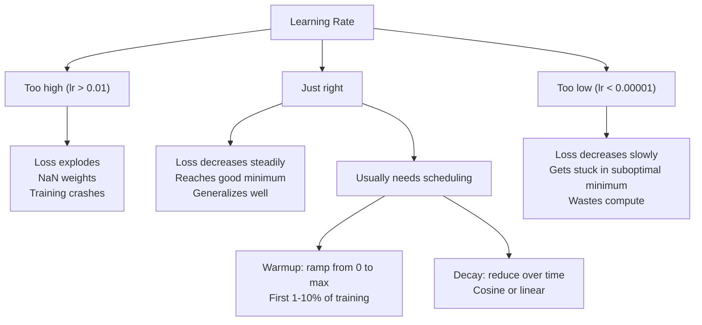
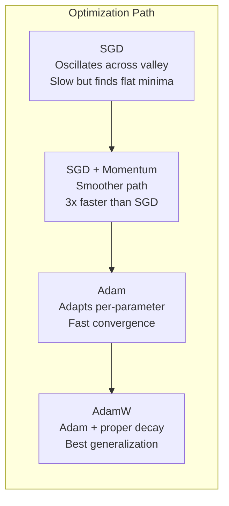
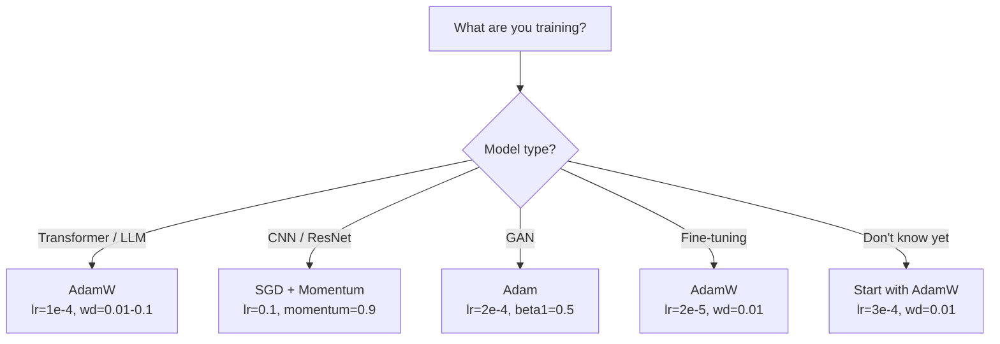

# - Tối ưu hóa

> Điểm giảm độ cho bạn biết phải di chuyển theo hướng nào, không nói gì về xa và tốc độ. SGD là một buso. Adam là GPS với dữ liệu giao thông.

> **【中文解读】**梯度下降告诉你方向,但不说步幅和速度──SGD 像指南针只知道方向──Adam 像带实时路况的GPS根据历史信息调整策略──本章从零实现 SGD → Momentum → Adam → AdamW, hiểu từng bước của sự cải thiện trực giác──

**Type:** Build
**Languages:** Python
**Prerequisites:** Lesson 03.05 (Loss Functions)
**Time:** ~75 minutes

## Mục tiêu học tập

- Thực hiện SGD, SGD với động lực, Adam, và AdamW tối ưu hóa từ đầu trong Python
- Giải thích cách sửa đổi thiên vị của Adam bù đắp cho ước tính thời gian bắt đầu bằng không trong các bước đào tạo đầu tiên
- Hiển thị tại sao AdamW tạo ra tổng quát tốt hơn Adam với L2 quy định trên cùng một nhiệm vụ
- Chọn tối ưu hóa thích hợp và các siêu tham số mặc định cho các bộ chuyển đổi, CNN, GAN và điều chỉnh tinh tế

## Vấn đề  vấn đề giới thiệu

Bạn đã tính toán các gradient. Bạn biết rằng trọng lượng # 4,721 nên giảm 0,003 để giảm mất. Nhưng 0,003 trong những đơn vị nào?

> Bạn đã tính toán thang độ. Bạn biết trọng lượng nên giảm 0,003 để giảm tổn thất. Nhưng 0,003 là đơn vị nào?

Sự giảm gradient vanilla áp dụng tốc độ học tập tương tự cho mọi tham số trên mọi bước: gradient w = w - lr *. Điều này tạo ra ba vấn đề làm cho việc đào tạo mạng thần kinh đau đớn trong thực tế.

> Tỷ lệ học tập bắt đầu giảm ở mỗi bước ứng dụng cùng một tỷ lệ học tập đối với mỗi tham số: w = w - lr * gradient.

Đầu tiên, dao động. Phong cảnh mất mát hiếm khi có hình dạng như một bát mịn. Nó giống như một thung lũng dài và hẹp. Điểm nghiêng chỉ ra qua thung lũng (nghĩa thẳng thắn), không phải dọc theo nó (nghĩa nông). Sự giảm dần sẽ nhảy lại qua chiều kích hẹp trong khi tiến bộ nhỏ dọc theo chiều kích hữu ích. Bạn đã thấy điều này: mất mát giảm nhanh hơn cao nguyên, không phải vì mô hình hội tụ mà vì nó đang dao động.

> Đầu tiên,振荡──损失曲面很少像平滑的碗──它更像一个长而窄的山谷──梯度指向山谷的横向方向),而不是纵向浅方向──梯度下降在狭维上跳跳跳,而在有用方向上进步小小──

Thứ hai, một tốc độ học tập cho tất cả các tham số là sai. Một số trọng lượng cần cập nhật lớn (cũng ở giai đoạn đầu, không phù hợp).

> Thứ hai, tất cả các yếu tố chia sẻ một tỷ lệ học là sai lầm. Một số quyền lực cần phải cập nhật lớn.

Thứ ba, các điểm saddle. Trong các chiều cao, cảnh thất bại có những vùng phẳng rộng lớn nơi độ nghiêng gần bằng không. SGD vanilla trượt qua chúng với tốc độ nghiêng, đó thực sự là bằng không. Mô hình trông bị kẹt. Nó không bị kẹt - nó ở một vùng phẳng với sự hạ cánh hữu ích ở phía bên kia. Nhưng SGD không có cơ chế để đẩy qua.

> Ba, điểm. Ở độ cao, lỗ hổng có một phần lớn vùng đồng bằng, độ cao gần như x. SGD ban đầu có tốc độ leo qua các vùng này.

Adam giải quyết cả ba. Nó duy trì hai trung bình chạy cho mỗi tham số - gradient trung bình (momentum, xử lý dao động) và gradient trung bình vuông (tốc độ thích nghi, xử lý các thang khác nhau). Kết hợp với sự sửa đổi thiên vị cho vài bước đầu tiên, nó cung cấp cho bạn một tối ưu hóa duy nhất hoạt động trên 80% các vấn đề với các siêu tham số mặc định. Bài học này xây dựng nó từ đầu để bạn hiểu chính xác khi nào và tại sao nó thất bại trên 20% còn lại.

> Adam giải quyết tất cả ba vấn đề. Nó duy trì hai hoạt động trung bình của mỗi tham số. Đường độ chuyển động, xử lý振荡) và thang độ trung bình.

> **【中文解读】**SGD có ba vấn đề:振荡 (tự học)  đơn học (tự học)  không phù hợp với tất cả các tham số (tự học)  không thể vượt qua vùng bằng (tự học)  độ gần như không có chỗ ở (tự học)  Adam đồng thời giải quyết ba vấn đề: động lượng ức chế振荡 (tự học)  tự học (tự học)  tỷ lệ thích ứng (tự học)  phân biệt (tự học)  phân biệt (tự học)  phân biệt (tự học)  phân biệt (tự học)  phân biệt (tự học)  phân biệt (tự học)  phân biệt (tự học)  phân biệt (tự học)  phân biệt (tự học)  phân biệt (tự học)  phân biệt (tự học)  phân biệt (tự học)  phân biệt (tự học)  phân biệt (tự học)  phân biệt (tự học)  phân biệt (tự học)  phân biệt (tự học) 

## Khái niệm cốt lõi

### Thấp độ giảm theo chiều cao (SGD)

Tóm lại gradient trên một mini batch và bước về hướng ngược lại.

> n n n n n n n n n n n n n n n n n n n n n n n n n n n n n n n n n n n n n n n n n n n n n n n n n n n n n n n n n n n n n n n n n n n n n n n n n n n n n n n n n n n n n n n n

```
w = w - lr * gradient    # 最简单的参数更新公式
```

"Stochastic" có nghĩa là bạn sử dụng một bộ phụ ngẫu nhiên (mini-batch) dữ liệu để ước tính gradient, thay vì toàn bộ bộ bộ dữ liệu. tiếng ồn này thực sự hữu ích - nó giúp thoát khỏi mức tối thiểu địa phương sắc nét. Nhưng tiếng ồn cũng gây ra dao động.

> "Tự nhiên" có nghĩa là bạn sử dụng các tập hợp dữ liệu theo thời gian để ước tính độ cao, chứ không phải toàn bộ tập hợp dữ liệu.

Tốc độ học tập là nút duy nhất. Tốc độ mất mát quá cao: sự mất mát khác nhau. Tốc độ quá thấp: đào tạo mất mãi mãi. Giá trị tối ưu phụ thuộc vào kiến trúc, dữ liệu, kích thước lô và giai đoạn đào tạo hiện tại. Đối với SGD vani trên mạng hiện đại, giá trị điển hình dao động từ 0,01 đến 0,1.

> Tỷ lệ học là một vòng tròn duy nhất. Tỷ lệ học là quá cao: mất tích và phát tán. Tỷ lệ học là quá thấp: đào tạo luôn không hoàn thành. Tỷ lệ học tối ưu phụ thuộc vào cấu trúc, dữ liệu, khối lượng và giai đoạn đào tạo hiện tại. Đối với SGD ban đầu trên mạng hiện đại, giá trị điển hình là từ 0.01 đến 0.1 .

### Tốc độ Tốc độ

Sự tương tự của bóng xoay xuống đồi là quá sử dụng nhưng chính xác. thay vì bước qua gradient một mình, bạn duy trì một tốc độ tích lũy qua gradient.

> Ngược lại, bạn duy trì một tốc độ tích lũy quá khứ.

```
m_t = beta * m_{t-1} + gradient    # 速度 = 衰减 × 历史速度 + 当前梯度
w = w - lr * m_t                    # 沿速度方向更新
```

Beta (thường là 0.9) kiểm soát bao nhiêu lịch sử để giữ. Với beta = 0.9, động lực là trung bình của 10 gradient cuối cùng (1 / (1 - 0.9) = 10.

> Beta(thường là 0,9) kiểm soát giữ lại nhiều lịch sử;; Khi beta = 0,9 时, động量大约是最近10 个梯度的平均值;;1/ (1 - 0,9) = 10);;

Tại sao điều này sửa đổi dao động: các gradient chỉ ra cùng một hướng tích lũy. Các gradient hướng ngược bị hủy bỏ. Trong thung lũng hẹp đó, thành phần "các" đảo ngược dấu hiệu mỗi bước và bị làm giảm. thành phần "lọc theo" vẫn ổn định và được tăng cường. Kết quả là tăng tốc trơn tru theo hướng hữu ích.

> Tại sao nó có thể sửa đổi振荡: chỉ hướng cùng một hướng 梯度累积――转向的梯度相互抵抵抵―― Trong thung lũng hẹp đó, "横向" phân tích mỗi bước chuyển biến được 抑制―― "纵向" phân tích duy trì đồng nhất và được phóng đại―― kết quả là tăng tốc độ trơn giản trên hướng hữu ích――

Số lượng thực: SGD một mình trên một cảnh ảnh hưởng xấu có thể mất 10.000 bước. SGD với động lực (beta = 0,9) thường mất 3.000 - 5.000 bước trên cùng một vấn đề.

> 具体数字: trên mặt của điều kiện khác nhau, SGD đơn lẻ có thể cần 10.000 bước.

> **【拓展：SGD + Momentum 的 resurgence】**Mặc dù Adam là lựa chọn mặc định, nhưng bài báo năm 2023 cho thấy SGD+Momentum vẫn có ưu thế trên nhiệm vụ cụ thể. ResNet 系列(ImageNet phân loại các nhà vô địch) và nhiều người chiến thắng trong cuộc thi vẫn sử dụng SGD+Momentum (lr=0.1, momentum=0.9)── lý do là SGD tìm thấy giá trị cực nhỏ hơn"平", toàn diện hơn。

### RMSP Prop.

Phương pháp tốc độ học tập thích nghi đầu tiên trên mỗi tham số thực sự hoạt động.

> Thứ nhất thực sự hiệu quả mỗi số tự thích ứng học suất phương pháp.

```
s_t = beta * s_{t-1} + (1 - beta) * gradient^2
w = w - lr * gradient / (sqrt(s_t) + epsilon)
```

s_t theo dõi trung bình chạy của gradient vuông. Các tham số có gradient lớn nhất định được chia bằng một số lớn (tốc độ học tập hiệu quả nhỏ hơn). Các tham số có gradient nhỏ được chia bằng một số nhỏ (tốc độ học tập hiệu quả lớn hơn).

> s_t  theo dõi số lượng hoạt động của các bậc vuông.

Điều này giải quyết vấn đề "một tốc độ học tập cho tất cả các tham số". Một trọng lượng đã nhận được các cập nhật lớn có thể gần mục tiêu của nó -- chậm lại nó. Một trọng lượng đã nhận được các cập nhật nhỏ có thể bị thiếu tập luyện -- tăng tốc nó.

> Điều này giải quyết được vấn đề "tất cả các tham số chia sẻ một tỷ lệ học"―― một người đã đạt được trọng lượng lớn được cập nhật có thể tiến gần mục tiêu  chậm đến.

Epsilon (thường là 1e-8) ngăn chặn chia bằng không khi một tham số chưa được cập nhật.

> Epsilon (thường là 1e-8) ngăn chặn các tham số không được cập nhật khi trừ bằng 0.

### Adam: Momentum + RMSProp  Adam:动量 + tự thích ứng học suất

Adam kết hợp cả hai ý tưởng. Nó duy trì hai trung bình di động theo số:

> Adam kết hợp hai ý tưởng. Nó cho mỗi tham số duy trì hai chỉ số chuyển động trung bình:

```
m_t = beta1 * m_{t-1} + (1 - beta1) * gradient        (first moment: mean)        # 一阶矩：梯度均值
v_t = beta2 * v_{t-1} + (1 - beta2) * gradient^2       (second moment: variance)   # 二阶矩：梯度方差
```

**Bias correction**là chi tiết chính mà hầu hết các giải thích bỏ qua. ở bước 1, m_1 = (1 - beta1) * gradient. với beta1 = 0,9, đó là 0,1 * gradient -- mười lần quá nhỏ. trung bình di động vẫn chưa nóng lên.

> **偏差修正**là phần lớn giải thích nhảy qua các chi tiết quan trọng.

```
m_hat = m_t / (1 - beta1^t)
v_hat = v_t / (1 - beta2^t)
```

Ở bước 1 với beta1 = 0,9: m_hat = m_1 / (1 - 0,9) = m_1 / 0.1 = độ nghiêng thực tế. Ở bước 100: (1 - 0,9^100) là khoảng 1,0, vì vậy sự điều chỉnh biến mất.

> 第 1 步 beta1 = 0.9 时:m_hat = m_1 / (1 - 0.9) = m_1 / 0.1 = 实际梯度──第 100 步:(1 - 0.9^100) 大约等于 1.0,修正消失──偏差修正对前 ~10 步重要,~50 步后无关紧要──

Thông tin mới:

> 更新公式:

```
w = w - lr * m_hat / (sqrt(v_hat) + epsilon)
```

Lập tắt của Adam: lr = 0.001, beta1 = 0.9, beta2 = 0.999, epsilon = 1e-8.

> Adam 默认值:lr = 0.001,beta1 = 0.9,beta2 = 0.999,epsilon = 1e-8。

> **【拓展：Adam 的局限性】**Mặc dù Adam là phương tiện tối ưu hóa thường xuyên nhất, nó không hoàn hảo: 1) Trong một số vấn đề cong ấp ấp ấp ấp ấp ấp ấp ấp ấp ấp ấp ấp ấp ấp ấp ấp ấp ấp ấp ấp ấp ấp ấp ấp ấp ấp ấp ấp ấp ấp ấp ấp ấp ấp ấp ấp ấp ấp ấp ấp ấp ấp ấp ấp ấp ấp ấp ấp ấp ấp ấp ấp ấp ấp ấp ấp ấp ấp ấp ấp ấp ấp ấp ấp ấp ấp ấp ấp ấp ấp ấp ấp ấp ấp ấp ấp ấp ủ ấp ấp ấp ấp ấp ấp ủ ấp ấp ấp ấp ấp ủ ấp ấp ấp ủ ấp ấp ấp ấp ấp ủ ấp ấp ấp ủ ấp ấp ấp ấp ấp ấp ủ ấp ấp ấp ấp ấp ủ ấp ấp ấp ủ ấp ấp ấp ấp ấp ấp ấp ấp ủ ấp ấp ấp ấp ấp ấp ấp ủ ấp ấp ấp ấp ấp ủ ấp ấp ấp ấp ấp ấp ấp ấp ủ ấp ấp ấp ấp ấp ấp ấp ấp ấp ấp ủ ấp ấp ấp ấp ấp ấp ấp ấp ấp ấp ấp ủ ấp ấp ấp ấp ấp ấp ấp ấp ấp ấp ủ ấp ấp ấp ấp ấp ấp ấp ấp ấp ấp ấp ủ ấp ấp ấp ấp ấp ấp ấp ấp ấp ấp ấp ấp ấp ấp ấp ấp ấp ấp ấp ấp ấp ấp ấp ấp ấp ấp ấp ấp ấp ấp ấp ấp ấp ấp ấp ấp ấp ấp ấp ấp ấp ấp 

### Đáng lẽ, tôi đã làm được điều đó.

L2 điều chỉnh thêm lambda * w ^ 2 vào sự mất mát. trong SGD vani, điều này tương đương với sự suy giảm trọng lượng (khổ lambda * w từ trọng lượng ở mỗi bước).

> L2 chính thức hóa sẽ làm giảm lambda * w^2 tăng lên trong mất mát. Trong SGD ban đầu, giá này tương đương với giảm trọng lượng.

Loshchilov & Hutter: khi bạn thêm L2 vào lỗ và sau đó Adam xử lý gradient, tốc độ học tập thích ứng cũng làm tăng thuật ngữ quy định. Các tham số có sự khác biệt gradient lớn nhận được ít quy định hơn. Các tham số có sự khác biệt nhỏ nhận được nhiều hơn. Đây không phải là những gì bạn muốn - bạn muốn quy định thống nhất bất kể số liệu thống kê gradient.

> Loshchilov và Hutter's Insight: Khi bạn tăng L2 vào lỗ sau đó Adam xử lý thang, tỷ lệ học tự thích ứng cũng sẽ giảm xuống các quy trình chỉnh sửa.

AdamW sửa chữa điều này bằng cách áp dụng sự suy giảm trọng lượng trực tiếp cho trọng lượng, sau khi cập nhật Adam:

```
w = w - lr * m_hat / (sqrt(v_hat) + epsilon) - lr * lambda * w    # Adam 更新 + 解耦权重衰减
```

Khóa học giảm trọng lượng (lr * lambda * w) không được quy mô bằng nhân thích ứng của Adam.

Điều này có vẻ như là một chi tiết nhỏ. Nó không phải. AdamW hội tụ với các giải pháp tốt hơn so với việc điều chỉnh Adam + L2 trên hầu hết mọi nhiệm vụ. Nó là trình tối ưu hóa mặc định trong PyTorch cho đào tạo các biến đổi, mô hình phân phối và hầu hết các kiến trúc hiện đại. BERT, GPT, LLaMA, phân phối ổn định - tất cả được đào tạo với AdamW.

> **【中文解读】**Sự cải tiến quan trọng của AdamW: quyền trọng yếu giảm không vượt qua tự ứng ứng缩放 của Adam, directly作用于参数──BERT、GPT、Llama、Stable Diffusion 都用 AdamW 训练──默认参数:lr=3e-4, weight_decay=0.01──

> **【拓展：LoRA 微调中的 AdamW】**Sử dụng LoRA 微调 LLM 时, thường sử dụng AdamW(lr=2e-5~1e-4, trọng lượng_sự giảm=0.01)。LoRA chỉ tập luyện thấp xếp phân phối矩阵 A 和 B, giảm trọng lượng của AdamW giúp kiểm soát độ lớn của các yếu tố mới này。

### Tỷ lệ học tập: Các siêu tham số quan trọng nhất



Nếu bạn điều chỉnh một siêu tham số, điều chỉnh tốc độ học tập. Một sự thay đổi 10 lần trong tốc độ học tập quan trọng hơn bất kỳ quyết định kiến trúc nào bạn sẽ đưa ra.

> Nếu chỉ điều chỉnh một siêu tham số, điều chỉnh tỷ lệ học ổng ổng 10 lần thay đổi hơn bất kỳ quyết định cấu trúc nào.

- SGD: lr = 0,01 đến 0,1
  SGD:lr = 0,01 đến 0,1
- Adam/AdamW: lr = 1e-4 đến 3e-4
  Adam/AdamW:lr = 1e-4 đến 3e-4
- Các mô hình được đào tạo trước khi điều chỉnh: lr = 1e-5 đến 5e-5
  微调预训练模型:lr = 1e-5 đến 5e-5
- Tăng tốc độ học tập: đường thẳng trong 1-10% các bước đầu tiên
  Tỷ lệ học tập nóng lên: trong giai đoạn trước 1-10% tăng nhiệt

### Optimizer So sánh  Optimizer so với



### Khi mỗi Optimizer thắng  Optimizer chọn chỉ dẫn



> **【拓展：深度学习中优化器的演进】**Từ SGD+Momentum của AlexNet năm 2012, đến đề xuất của Adam năm 2014, tiếp tục đến năm 2017 sự ra đời của AdamW để phát triển các thiết bị tối ưu hóa để đào tạo từ "đáng cần điều chỉnh hàng tuần" thành "đáng số mặc định để chạy"。Llama 3 405B đã đào tạo sử dụng AdamW, đỉnh lr=3e-4, trên 16384 khối H100 GPU đã đào tạo 30.8M GPU 小时──

## Hãy xây dựng nó.

> **【中文解读】**Từ zero thực hiện bốn loại tối ưu hóa: SGD → SGD+Momentum → Adam → AdamW── mỗi người đều trên cơ sở của một cơ chế quan trọng hơn.
```figure
optimizer-trajectory
```

## Hãy xây dựng nó

### Bước 1: Vanilla SGD Bước 1: SGD nguyên thủy

> SGD nguyên thủy: các yếu tố trực tiếp giảm tỷ lệ học nhân thang.

```python
class SGD:
    def __init__(self, lr=0.01):
        self.lr = lr

    def step(self, params, grads):
        for i in range(len(params)):
            params[i] -= self.lr * grads[i]
```

### Bước 2: SGD với Momentum Bước 2: Sản lượng động lực SGD

> SGD+Momentum: giới thiệu biến động tốc độ, tích lũy gradient lịch sử, hướng về chiều hướng tương ứng, chuyển động về chiều hướng tương ứng.

```python
class SGDMomentum:
    def __init__(self, lr=0.01, beta=0.9):
        self.lr = lr
        self.beta = beta
        self.velocities = None

    def step(self, params, grads):
        if self.velocities is None:
            self.velocities = [0.0] * len(params)
        for i in range(len(params)):
            self.velocities[i] = self.beta * self.velocities[i] + grads[i]
            params[i] -= self.lr * self.velocities[i]
```

### Bước 3: Adam. Bước 3: Adam.

> Adam:维护一阶矩 m(梯度平均值) và二阶矩 v(梯度方差),加上偏差修正──80% của vấn đề sử dụng các tham số mặc định就能跑──

```python
import math

class Adam:
    def __init__(self, lr=0.001, beta1=0.9, beta2=0.999, epsilon=1e-8):
        self.lr = lr
        self.beta1 = beta1
        self.beta2 = beta2
        self.epsilon = epsilon
        self.m = None
        self.v = None
        self.t = 0

    def step(self, params, grads):
        if self.m is None:
            self.m = [0.0] * len(params)
            self.v = [0.0] * len(params)

        self.t += 1

        for i in range(len(params)):
            self.m[i] = self.beta1 * self.m[i] + (1 - self.beta1) * grads[i]
            self.v[i] = self.beta2 * self.v[i] + (1 - self.beta2) * grads[i] ** 2

            m_hat = self.m[i] / (1 - self.beta1 ** self.t)
            v_hat = self.v[i] / (1 - self.beta2 ** self.t)

            params[i] -= self.lr * m_hat / (math.sqrt(v_hat) + self.epsilon)
```

### Bước 4: AdamW.

> AdamW: Trên cơ sở Adam, giảm trọng lượng từ thang độ giải quyết trực tiếp đối với các yếu tố tự làm giảm, không qua m và v của giảm.

```python
class AdamW:
    def __init__(self, lr=0.001, beta1=0.9, beta2=0.999, epsilon=1e-8, weight_decay=0.01):
        self.lr = lr
        self.beta1 = beta1
        self.beta2 = beta2
        self.epsilon = epsilon
        self.weight_decay = weight_decay
        self.m = None
        self.v = None
        self.t = 0

    def step(self, params, grads):
        if self.m is None:
            self.m = [0.0] * len(params)
            self.v = [0.0] * len(params)

        self.t += 1

        for i in range(len(params)):
            self.m[i] = self.beta1 * self.m[i] + (1 - self.beta1) * grads[i]
            self.v[i] = self.beta2 * self.v[i] + (1 - self.beta2) * grads[i] ** 2

            m_hat = self.m[i] / (1 - self.beta1 ** self.t)
            v_hat = self.v[i] / (1 - self.beta2 ** self.t)

            params[i] -= self.lr * m_hat / (math.sqrt(v_hat) + self.epsilon)
            params[i] -= self.lr * self.weight_decay * params[i]
```

### Bước 5: Tập luyện so sánh Bước 5: tập luyện so với

Tập cùng một mạng hai lớp trên bộ dữ liệu vòng tròn từ bài học 05 với tất cả bốn tối ưu hóa. So sánh sự hội tụ.

> Sử dụng tập hợp dữ liệu hình tròn của lớp 5 để tập luyện với một mạng hai tầng, so với tốc độ nhận của bốn loại tối ưu hóa.

```python
import random

def sigmoid(x):
    x = max(-500, min(500, x))
    return 1.0 / (1.0 + math.exp(-x))

def make_circle_data(n=200, seed=42):
    random.seed(seed)
    data = []
    for _ in range(n):
        x = random.uniform(-2, 2)
        y = random.uniform(-2, 2)
        label = 1.0 if x * x + y * y < 1.5 else 0.0
        data.append(([x, y], label))
    return data


class OptimizerTestNetwork:
    def __init__(self, optimizer, hidden_size=8):
        random.seed(0)
        self.hidden_size = hidden_size
        self.optimizer = optimizer

        self.w1 = [[random.gauss(0, 0.5) for _ in range(2)] for _ in range(hidden_size)]
        self.b1 = [0.0] * hidden_size
        self.w2 = [random.gauss(0, 0.5) for _ in range(hidden_size)]
        self.b2 = 0.0

    def get_params(self):
        params = []
        for row in self.w1:
            params.extend(row)
        params.extend(self.b1)
        params.extend(self.w2)
        params.append(self.b2)
        return params

    def set_params(self, params):
        idx = 0
        for i in range(self.hidden_size):
            for j in range(2):
                self.w1[i][j] = params[idx]
                idx += 1
        for i in range(self.hidden_size):
            self.b1[i] = params[idx]
            idx += 1
        for i in range(self.hidden_size):
            self.w2[i] = params[idx]
            idx += 1
        self.b2 = params[idx]

    def forward(self, x):
        self.x = x
        self.z1 = []
        self.h = []
        for i in range(self.hidden_size):
            z = self.w1[i][0] * x[0] + self.w1[i][1] * x[1] + self.b1[i]
            self.z1.append(z)
            self.h.append(max(0.0, z))

        self.z2 = sum(self.w2[i] * self.h[i] for i in range(self.hidden_size)) + self.b2
        self.out = sigmoid(self.z2)
        return self.out

    def compute_grads(self, target):
        eps = 1e-15
        p = max(eps, min(1 - eps, self.out))
        d_loss = -(target / p) + (1 - target) / (1 - p)
        d_sigmoid = self.out * (1 - self.out)
        d_out = d_loss * d_sigmoid

        grads = [0.0] * (self.hidden_size * 2 + self.hidden_size + self.hidden_size + 1)
        idx = 0
        for i in range(self.hidden_size):
            d_relu = 1.0 if self.z1[i] > 0 else 0.0
            d_h = d_out * self.w2[i] * d_relu
            grads[idx] = d_h * self.x[0]
            grads[idx + 1] = d_h * self.x[1]
            idx += 2

        for i in range(self.hidden_size):
            d_relu = 1.0 if self.z1[i] > 0 else 0.0
            grads[idx] = d_out * self.w2[i] * d_relu
            idx += 1

        for i in range(self.hidden_size):
            grads[idx] = d_out * self.h[i]
            idx += 1

        grads[idx] = d_out
        return grads

    def train(self, data, epochs=300):
        losses = []
        for epoch in range(epochs):
            total_loss = 0.0
            correct = 0
            for x, y in data:
                pred = self.forward(x)
                grads = self.compute_grads(y)
                params = self.get_params()
                self.optimizer.step(params, grads)
                self.set_params(params)

                eps = 1e-15
                p = max(eps, min(1 - eps, pred))
                total_loss += -(y * math.log(p) + (1 - y) * math.log(1 - p))
                if (pred >= 0.5) == (y >= 0.5):
                    correct += 1
            avg_loss = total_loss / len(data)
            accuracy = correct / len(data) * 100
            losses.append((avg_loss, accuracy))
            if epoch % 75 == 0 or epoch == epochs - 1:
                print(f"    Epoch {epoch:3d}: loss={avg_loss:.4f}, accuracy={accuracy:.1f}%")
        return losses
```

> **【拓展：GPT 训练中的优化器选择】**OpenAI của GPT 系列全部使用 Adam 优化器(GPT-4 推测也使用 AdamW) 』训练时一个常见技巧: đối với việc nhúng 层和输出 层使用不同的学习率──在 PyTorch 中通过参数组实现:`optimizer = AdamW([{'params': base_params}, {'params': head_params, 'lr': lr*0.1}])`

## Hãy sử dụng nó để thực hiện

> **【中文解读】**PyTorch 中的训练循环模式:zero_grad → forward → loss → backward → clip → step → schedule──这个顺序不能搞错──CNN 用 SGD+Momentum(lr=0.1),Transformer 用 AdamW(lr=1e-4)──

Các thiết bị tối ưu hóa PyTorch xử lý các nhóm tham số, cắt gradient và lập lịch tốc độ học tập:

```python
import torch
import torch.optim as optim

model = torch.nn.Sequential(
    torch.nn.Linear(784, 256),
    torch.nn.ReLU(),
    torch.nn.Linear(256, 10),
)

optimizer = optim.AdamW(model.parameters(), lr=3e-4, weight_decay=0.01)

scheduler = optim.lr_scheduler.CosineAnnealingLR(optimizer, T_max=100)

for epoch in range(100):
    optimizer.zero_grad()
    output = model(torch.randn(32, 784))
    loss = torch.nn.functional.cross_entropy(output, torch.randint(0, 10, (32,)))
    loss.backward()
    torch.nn.utils.clip_grad_norm_(model.parameters(), max_norm=1.0)
    optimizer.step()
    scheduler.step()
```

Mô hình luôn luôn là: zero_grad, forward, loss, backward, (clip), step, (schedule). nhớ thứ tự này.

Đối với các CNN, nhiều học viên vẫn thích SGD + động lực (lr=0.1, động lực=0.9, trọng lượng_sự giảm = 1e-4) với một lịch trình bước hoặc cosine. SGD tìm thấy các tối thiểu phẳng hơn, thường tổng quát tốt hơn. Đối với các biến đổi và LLM, AdamW với sự nóng lên + sự suy giảm cosine là mặc định phổ quát. Đừng chống lại sự đồng thuận mà không có lý do được đo lường.

## Chuyển nó đi.

Bài học này mang lại:
- `outputs/prompt-optimizer-selector.md`-- một quyết định nhanh chóng để chọn tối ưu hóa đúng và tốc độ học tập cho bất kỳ kiến trúc

## Tập luyện bài tập

1. Thực hiện động lực Nesterov, nơi bạn tính toán gradient ở vị trí "lookhead" (w - lr * beta * v) thay vì vị trí hiện tại. So sánh sự hội tụ với động lực tiêu chuẩn trên bộ dữ liệu vòng tròn.
   > **练习 1：**实现 Nesterov 动量 (nơi "前" vị trí tính toán梯度), đối với tốc độ thu nhập của động lượng tiêu chuẩn.

2. Thực hiện một lịch trình học tập tốc độ nóng lên: đường thẳng từ 0 đến max_lr trong 10% bước đào tạo đầu tiên, sau đó sự phân rã cosine đến 0. Trén với Adam + nóng lên so với Adam mà không nóng lên. đo bao nhiêu thời gian cần để đạt được độ chính xác 90% trên bộ dữ liệu vòng tròn.
   > **练习 2：**实现变暖 + phân rã cósine 学习率调度, đối với có/ không nóng lên  đạt 90% 准确率 轮数

3. Theo dõi tốc độ học tập hiệu quả cho mỗi tham số trong quá trình đào tạo Adam. Tỷ lệ hiệu quả là lr * m_hat / (sqrt(v_hat) + eps). Chụp bảng phân phối các tốc độ hiệu quả sau 10, 50, và 200 bước. Tất cả các tham số đang được cập nhật với cùng tốc độ?
   > **练习 3：**Theo dõi Adam  luyện tập tỷ lệ học tập hiệu quả của các tham số, quan sát sự khác biệt về tốc độ cập nhật của các tham số khác nhau.

4. Thực hiện cắt gradient (clip theo tiêu chuẩn toàn cầu). Đặt tiêu chuẩn gradient tối đa là 1.0. Tập luyện với và không cắt bằng cách sử dụng tốc độ học tập cao (lr=0.01 cho Adam). Đếm số lần chạy khác nhau (kết bị đi đến NaN) với và không cắt trên 10 hạt ngẫu nhiên.
   > **练习 4：**实现梯度剪裁,统计有/无剪裁时高学习率下训练发散比例

5. So sánh Adam vs AdamW trên một mạng lưới có trọng lượng lớn. khởi tạo tất cả trọng lượng đến các giá trị ngẫu nhiên ở [-5, 5] (nhiều lớn hơn bình thường). Tập luyện cho 200 thời đại với weight_decay = 0.1.
   > **练习 5：**Trong trọng lượng đầu tiên lớn so với Adam và AdamW, quan sát sự khác biệt về hiệu ứng giảm trọng lượng.

## Từ khóa  Keyword

| Term | What people say | What it actually means |
|------|----------------|----------------------|
| Learning rate | "Step size" | The scalar multiplier on the gradient update; the single most impactful hyperparameter in training |
| SGD | "Basic gradient descent" | Stochastic gradient descent: update weights by subtracting lr * gradient, computed on a mini-batch |
| Momentum | "Rolling ball analogy" | Exponential moving average of past gradients; dampens oscillation and accelerates consistent directions |
| RMSProp | "Adaptive learning rate" | Divides each parameter's gradient by the running RMS of its recent gradients; equalizes learning rates |
| Adam | "The default optimizer" | Combines momentum (first moment) and RMSProp (second moment) with bias correction for the initial steps |
| AdamW | "Adam done right" | Adam with decoupled weight decay; applies regularization directly to weights rather than through the gradient |
| Bias correction | "Warmup for running averages" | Dividing by (1 - beta^t) to compensate for the zero-initialization of Adam's moment estimates |
| Weight decay | "Shrink the weights" | Subtracting a fraction of the weight value at each step; a regularizer that penalizes large weights |
| Learning rate schedule | "Changing lr over time" | A function that adjusts the learning rate during training; warmup + cosine decay is the modern default |
| Gradient clipping | "Capping the gradient norm" | Scaling down the gradient vector when its norm exceeds a threshold; prevents exploding gradient updates |

| 术语 | 通俗说法 | 实际含义 |
|------|---------|---------|
| 学习率 (Learning rate) | "步长" | 梯度更新的标量乘数；训练中影响最大的超参数 |
| SGD | "基础梯度下降" | 随机梯度下降：用小批量梯度更新 w -= lr * grad |
| 动量 (Momentum) | "滚球的类比" | 历史梯度的指数移动平均；抑制振荡、加速一致方向 |
| RMSProp | "自适应学习率" | 除以梯度平方的移动平均根；均衡各参数学习速度 |
| Adam | "默认优化器" | 动量 + RMSProp + 偏差修正的统一优化器 |
| AdamW | "正确的 Adam" | Adam + 解耦权重衰减；直接对参数施加正则化 |
| 偏差修正 (Bias correction) | "运行平均的热身" | 除以 (1-beta^t) 补偿 Adam 矩估计的零初始化偏差 |
| 权重衰减 (Weight decay) | "缩小权重" | 每步减去权重的一小部分；惩罚大权重的正则化手段 |
| 学习率调度 (LR schedule) | "随时间改变 lr" | 训练中调整学习率的函数；warmup + cosine decay 是现代标配 |
| 梯度裁剪 (Gradient clipping) | "限制梯度范数" | 梯度范数超限时缩小梯度；防止梯度爆炸 |

## Xem thêm 延伸阅读

- Kingma & Ba, "Adam: Một phương pháp tối ưu hóa Stochastic" (2014) - bài báo Adam ban đầu với phân tích hội tụ và dẫn xuất chỉnh sửa thiên vị
- Loshchilov & Hutter, "Discoupled Weight Decay Regularization" (2017) -- chứng minh rằng L2 regularization và giảm cân không tương đương ở Adam, và đề xuất AdamW
- Smith, "Tỷ lệ học tập chu kỳ cho đào tạo mạng thần kinh" (2017) -- giới thiệu kiểm tra phạm vi LR và lịch trình chu kỳ loại bỏ sự cần thiết để điều chỉnh một tỷ lệ học tập cố định
- Ruder, "Một tổng quan về thuật toán tối ưu hóa giảm độ" (2016) - khảo sát đơn tốt nhất của tất cả các biến thể tối ưu hóa, với so sánh và trực giác rõ ràng
