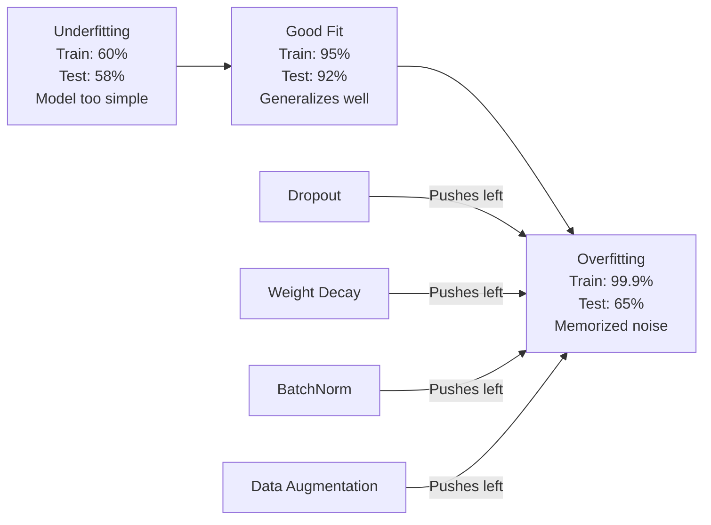
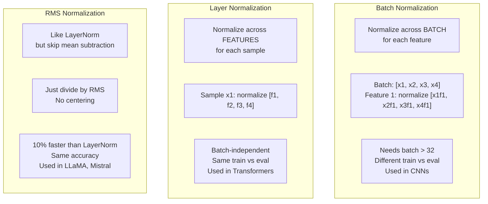
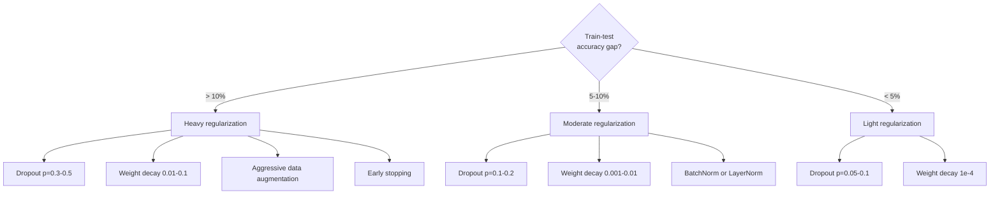

# Chuẩn bị.

> Mô hình của bạn có 99% trên dữ liệu đào tạo và 60% trên dữ liệu thử nghiệm. Nó ghi nhớ thay vì học tập.

> **【中文解读】**模型训练集 99% Nhưng测试集 chỉ 60% nó là "背诵" thay vì "学习"。正则化 là một tiêu chuẩn của việc thu thuế, áp thuế về phức tạp, 强迫模型泛化。 本章覆盖  Droput、L2 正则化、BatchNorm、LayerNorm、RMSNorm

**Type:** Build
**Languages:** Python
**Prerequisites:** Lesson 03.06 (Optimizers)
**Time:** ~75 minutes

## Mục tiêu học tập

- Thực hiện việc bỏ qua với quy mô đảo ngược, giảm cân L2, bình thường hóa lô, bình thường hóa lớp, và RMSNorm từ đầu
- Đo khoảng cách độ chính xác trong thử nghiệm tàu và chẩn đoán quá phù hợp bằng cách sử dụng các thí nghiệm quy định
- Giải thích tại sao các bộ biến đổi sử dụng LayerNorm thay vì BatchNorm và tại sao các LLM hiện đại thích RMSNorm
- Sử dụng sự kết hợp chính xác của các kỹ thuật quy định dựa trên mức độ nghiêm trọng của quá phù hợp

> **【中文解读】**本章 Từ零实现正则化五大核心工具:Dropout(随机丢弃神经元)、L2 权重衰减、BatchNorm(批归归一化)、LayerNorm(层归一化)、RMSNorm(均方根归一化)。重点理解为什么Transformer dùng LayerNorm chứ không phải BatchNorm,以及为什么Llama/Mistral dùng RMSNorm。

## Vấn đề  vấn đề giới thiệu

Một mạng lưới thần kinh có đủ các tham số có thể ghi nhớ bất kỳ bộ dữ liệu nào. Đây không phải là giả thuyết - Zhang et al. (2017) chứng minh điều này bằng cách đào tạo các mạng tiêu chuẩn trên ImageNet với các nhãn ngẫu nhiên. Các mạng đạt đến mất tập luyện gần bằng không trên các bài tập nhãn ngẫu nhiên hoàn toàn. Họ ghi nhớ một triệu cặp đầu vào-kết xuất ngẫu nhiên mà không có mô hình để học.

> Một mạng thần kinh có đủ tham số có thể ghi nhớ bất kỳ tập dữ liệu nào. Đây không phải là giả thuyết Zhang 等人 (2017) 通过在 ImageNet trên sử dụng các bài tập tiêu chuẩn đánh dấu随机 chứng minh điều này.

Đây là vấn đề quá phù hợp, và nó trở nên tồi tệ hơn khi các mô hình ngày càng lớn hơn. GPT-3 có 175 tỷ tham số. Bộ đào tạo có khoảng 500 tỷ token. Với nhiều tham số đó, mô hình có đủ khả năng ghi nhớ một phần đáng kể của dữ liệu đào tạo theo nghĩa đen. Nếu không có quy định, nó sẽ chỉ tái tạo các ví dụ đào tạo thay vì học các mô hình tổng quát.

> Đây là vấn đề quá phù hợp, khi mô hình ngày càng lớn và trở nên tồi tệ hơn. GPT-3 có 1750 tỷ tham số.

Khoảng cách giữa hiệu suất đào tạo và hiệu suất thử nghiệm là khoảng cách quá phù hợp. Mỗi kỹ thuật trong bài học này tấn công khoảng cách đó từ một góc độ khác. Việc bỏ qua buộc mạng không dựa vào bất kỳ tế bào thần kinh nào. Sự suy giảm cân ngăn chặn bất kỳ trọng lượng nào tăng quá lớn. Tiêu chuẩn hóa lô làm trơn lỏng cảnh thất bại để người tối ưu hóa tìm thấy các tối thiểu trơn hơn, phổ biến hơn. Tiêu chuẩn hóa lớp làm điều tương tự nhưng hoạt động khi việc bình thường hóa lô thất bại (các lô nhỏ, chuỗi chiều dài biến). RMSNorm làm nó nhanh hơn 10% bằng cách giảm tính toán trung bình. Mỗi kỹ thuật đều đơn giản. Cùng nhau, chúng là sự khác biệt giữa một mô hình ghi nhớ và mô hình tổng quát.

> Sự khác biệt giữa hiệu suất đào tạo và hiệu suất thử nghiệm là sự khác biệt quá phù hợp. Mỗi loại kỹ thuật trong bài học này tấn công sự khác biệt này từ một góc độ khác nhau. Động lực không phụ thuộc vào bất kỳ một bộ thần kinh nào. Lượng giảm trọng lượng ngăn chặn bất kỳ trọng lượng nào tăng quá lớn.

> **【中文解读】**模型参数越多,越容易过拟合――GPT-3 có 1750 tỷ参数,5000 tỷ token không được chuẩn hóa, nó chỉ ghi nhớ dữ liệu đào tạo―― mỗi phương tiện chuẩn hóa sẽ tấn công từ các góc độ khác nhau:Dropout 强制冗余表示、权重衰减限制参数幅度、归化平滑损曲面――

> **【拓展：大模型的正则化策略】**Sự chuẩn hóa của GPT-4 và Llama 3 rất đơn giản:AdamW 权重衰减 (wd=0.01) + Dropout (p=0.1) + RMSNorm。 không cần các kỹ thuật chuẩn hóa phức tạp。 quan trọng: trong quá trình tập luyện trên dữ liệu lớn, dữ liệu chính là chuẩn hóa tốt nhất。 mô hình đã thấy đủ nhiều dữ liệu, quá phù hợp với giảm tự nhiên。

## Khái niệm cốt lõi

### Phân quang Overfitting đã được sắp xếp

Mỗi mô hình nằm ở đâu đó trên một phổ từ quá phù hợp (quá đơn giản để nắm bắt mô hình) đến quá phù hợp (đủ phức tạp để nắm bắt tiếng ồn).

> Mỗi mô hình đều nằm ở một vị trí trên một chuỗi các mô hình từ không phù hợp ( quá đơn giản và không thể nắm bắt được mô hình) đến quá phù hợp ( quá phức tạp để nắm bắt tiếng ồn). Điểm tốt nhất ở giữa, chuẩn hóa mô hình sẽ từ một bên quá phù hợp hướng tới điểm tốt nhất.



### Thả đi. Thả đi.

Kỹ thuật điều chỉnh đơn giản nhất với cách giải thích thanh lịch nhất.

> Cách đơn giản nhất và giải thích tốt nhất là công nghệ định lý hóa. Trong thời gian tập luyện, có thể mỗi đầu ra của mỗi thần kinh sẽ được đặt thành 0.

```
output = activation(z) * mask    where mask[i] ~ Bernoulli(1 - p)
```

Với p = 0,5, một nửa các tế bào thần kinh được phân định ở mỗi bước đi về phía trước. Mạng phải học các biểu diễn dư thừa vì nó không thể dự đoán được các tế bào thần kinh nào sẽ có sẵn. Điều này ngăn chặn sự thích nghi chung - các tế bào thần kinh học để dựa vào các tế bào thần kinh khác cụ thể hiện diện.

> Khi p = 0,5 , mỗi lần chuyển tiếp một nửa các thần kinh được đặt ở nét.

Giải thích tập hợp: một mạng với N neuron và dropup tạo ra 2^N các mạng phụ có thể (mỗi kết hợp của các neuron được bật hoặc tắt). Việc đào tạo với việc bỏ học khoảng đào tạo tất cả các mạng phụ 2^N cùng một lúc, mỗi mạng trên các lô nhỏ khác nhau. Vào thời điểm thử nghiệm, bạn sử dụng tất cả các tế bào thần kinh (không bỏ) và đo lượng sản lượng bằng (1 - p) để phù hợp với giá trị mong đợi trong quá trình đào tạo. Điều này tương đương với trung bình dự đoán của 2^N mạng phụ -- một tập hợp lớn từ một mô hình duy nhất.

> 集成解释: Một mạng có N 个神经和落后的网络创建 2^N 个可能的子网络(每个组合的神经开关或关闭) ⋅ sử dụng 落后的训练大约同时训练所有2^N 个子网络, mỗi trong các mini-batch khác nhau 上。

Trong thực tế, quy mô được áp dụng trong quá trình đào tạo thay vì thử nghiệm (trừ bỏ ngược):

```
During training:  output = activation(z) * mask / (1 - p)
During testing:   output = activation(z)   (no change needed)
```

Đây là sạch hơn bởi vì mã thử nghiệm không cần biết về việc bỏ học.

> Như vậy thì sạch hơn, vì test code hoàn toàn không cần biết sự tồn tại của drop-out.

Tỷ lệ mặc định: p = 0,1 đối với các biến đổi, p = 0,5 đối với MLPs, p = 0,2-0,3 đối với các CNN.

> 默认比率:Tranformator 用 p = 0.1,MLP 用 p = 0.5,CNN 用 p = 0.2-0.3── dropout 越高 = 正则化越强 = 欠拟合风险越大──

> **【拓展：Dropout 在 BERT 和 GPT 中的不同用法】**BERT sử dụng Dropout p=0.1 应用于注意和隐藏层――GPT-2 cũng sử dụng p=0.1, nhưng chỉ sử dụng trong quá trình tập luyện―― thú vị là, khi suy luận có thể sử dụng MC Dropout( giữ Dropout 开启) để ước tính mô hình không chắc chắn运行 30-100 lần取方差──

### Giảm cân (L2 bình thường hóa) 权重减减 (L2 正则化)

Thêm kích thước vuông của tất cả các trọng lượng cho mất mát:

> Để tăng vọt của quyền sở hữu lên thiệt hại:

```
total_loss = task_loss + (lambda / 2) * sum(w_i^2)
```

Tiêu chuẩn của thuật ngữ quy định là lambda * w. Điều này có nghĩa là ở mỗi bước, mỗi trọng lượng được thu nhỏ về phía không bằng một phần tương xứng với quy mô của nó. trọng lượng lớn bị phạt nhiều hơn. Mô hình được đẩy đến các giải pháp mà không có trọng lượng duy nhất thống trị.

> Đường độ của các phương pháp chính thức hóa là lambda * w. Điều này có nghĩa là ở mỗi bước, mỗi trọng lượng được giảm theo tỷ lệ chính xác so với chiều rộng của nó sang nét.

Tại sao điều này giúp tổng quát: các mô hình overfit có xu hướng có trọng lượng lớn làm tăng tiếng ồn trong dữ liệu đào tạo.

> Tại sao điều này giúp phổ biến hóa: mô hình quá phù hợp thường có trọng lượng rất lớn, sẽ làm tăng tiếng ồn trong dữ liệu đào tạo.

Các siêu tham số lambda kiểm soát sức mạnh.

> lambda 超参数控制强度──đối tượng giá trị:

- 0,01 cho AdamW trên các bộ biến áp
  Trung ngữ翻译:0.01 用于变压器 上的AdamW
- 1e-4 cho SGD trên CNN
  Trung ngữ翻译:1e-4 用于CNN 上的 SGD
- 0,1 cho các mô hình quá phù hợp
  Trung ngữ翻译:0.1 Sử dụng mô hình quá phù hợp

Như đã thảo luận trong bài học 06: giảm cân và L2 đều tương đương trong SGD nhưng không phải ở Adam.

> Như第 06 课讨论的: giảm cân và L2 正则化在 SGD 中等价,但在亚当中不等价――使用亚当 训练时始终使用亚当W(解权重衰减) ⋅

### Chuyện bình thường hóa hàng.

Tiêu chuẩn hóa đầu ra của mỗi lớp trên mini-batch trước khi chuyển nó sang lớp tiếp theo.

> Trong khi sẽ chuyển giao đầu ra của mỗi tầng sang tầng dưới, đối với mini-batch  được thực hiện tập hợp.

Đối với một loạt hoạt động nhỏ ở một số lớp:

>  Đối với một lớp nhỏ  kích hoạt giá trị:

```
mu = (1/B) * sum(x_i)           (batch mean)
sigma^2 = (1/B) * sum((x_i - mu)^2)   (batch variance)
x_hat = (x_i - mu) / sqrt(sigma^2 + eps)   (normalize)
y = gamma * x_hat + beta        (scale and shift)
```

Gamma và beta là các tham số có thể học được cho phép mạng hủy bỏ bình thường hóa nếu đó là tối ưu. Nếu không có chúng, bạn sẽ buộc mỗi lớp đầu ra là không trung bình đơn vị biến thể, mà có thể không phải là những gì mạng muốn.

> Gamma và beta là các tham số có thể học được, nếu tốt nhất, bạn có thể làm cho mạng bị hủy bỏ trở thành một định dạng. Nếu không có chúng, bạn sẽ buộc mỗi lớp sản xuất là 0.

**Training vs inference split:**Trong khi tập luyện, mu và sigma đến từ mini-batch hiện tại. Trong khi suy luận, bạn sử dụng trung bình chạy tích lũy trong khi tập luyện (tỷ lệ trung bình di động theo động lực = 0,1, nghĩa là 90% cũ + 10% mới).

> **训练与推理的区别：**训练时,mu 和 sigma 来自当前 mini-batch──推理时,使用训练期间累积的运行平均值(指数移动平均,动量 = 0.1,即90% 旧值 + 10% 新值)──

Tại sao BatchNorm hoạt động vẫn còn tranh luận. Bài báo ban đầu tuyên bố nó làm giảm "sự thay đổi nội bộ" (khác định các đầu vào lớp thay đổi khi các lớp trước đó cập nhật). Santurkar et al. (2018) cho thấy lời giải thích này là sai. Lý do thực sự: BatchNorm làm cho cảnh thất bại mượt mà hơn. Các gradient là dự đoán hơn, các định vị Lipschitz nhỏ hơn, và người tối ưu hóa có thể thực hiện các bước lớn hơn một cách an toàn. Đó là lý do tại sao BatchNorm cho phép bạn sử dụng tỷ lệ học tập cao hơn và hội tụ nhanh hơn.

> BatchNorm vì sao hiệu quả vẫn còn tranh cãi. Bài viết ban đầu tuyên bố nó giảm" sự chuyển biến biến nội bộ "(trung nhập phân bố với sự thay đổi của các cấp trước) ~~Santurkar 等人 (2018)  chứng minh giải thích này là sai lầm.

BatchNorm có một hạn chế cơ bản: nó phụ thuộc vào số liệu thống kê hàng loạt. Với kích thước hàng loạt 1, trung bình và sự khác biệt là vô nghĩa. Với các hàng nhỏ (< 32), số liệu thống kê là tiếng ồn và hiệu suất bị tổn thương. Điều này quan trọng đối với các nhiệm vụ như phát hiện đối tượng (nơi bộ nhớ giới hạn kích thước hàng loạt) và mô hình hóa ngôn ngữ (nơi chiều dài chuỗi khác nhau).

> BatchNet có một giới hạn cơ bản: nó phụ thuộc vào số lượng số lượng thống kê.

> **【中文解读】**Biên giới cơ bản của BatchNorm: phụ thuộc vào số lượng thống kê của batch_size=1 时平均值差无意义;batch_size<32 时统计量噪音太大──这就是Transformer 用 LayerNorm 的原因语言模型批小、序列长度不一──

### Layer Normalization Layer Integration

Tiêu chuẩn hóa qua các tính năng thay vì trên toàn bộ lô.

> 跨特征维度归化, chứ không phải跨批量.

```
mu = (1/D) * sum(x_j)           (feature mean)
sigma^2 = (1/D) * sum((x_j - mu)^2)   (feature variance)
x_hat = (x_j - mu) / sqrt(sigma^2 + eps)
y = gamma * x_hat + beta
```

D là chiều tính năng. Mỗi mẫu được bình thường hóa độc lập - không phụ thuộc vào kích thước lô. Đây là lý do tại sao các bộ biến áp sử dụng LayerNorm thay vì BatchNorm. Các chuỗi có chiều dài thay đổi, kích thước lô thường nhỏ (hoặc 1 trong quá trình sản xuất), và tính toán là giống nhau giữa đào tạo và suy luận.

> D là tính năng kích thước. Mỗi mẫu tự do được phân tích không phụ thuộc vào khối lượng lớn. Đó là lý do tại sao Transformer sử dụng LayerNorm thay vì BatchNorm.

LayerNorm trong các biến thể được áp dụng sau mỗi khối tự chú ý và mỗi khối chuyển tiếp (Post-LN), hoặc trước chúng (Pre-LN, ổn định hơn cho đào tạo).

> LayerNorm của Transformer Trung 应用于每个自注意力块和每个前块之后 (Post-LN),或之前 (Pre-LN,训练更稳定) ⋅

### RMSNorm.

LayerNorm mà không có sự trừ trung bình.

> LayerNorm 去掉平均值减法── bởi Zhang & Sennrich (2019) 提出──

```
rms = sqrt((1/D) * sum(x_j^2))
y = gamma * x / rms
```

Đó là nó. Không tính toán trung bình, không tham số beta. quan sát: tái trung tâm (từ trừ trung bình) trong LayerNorm đóng góp rất ít cho hiệu suất của mô hình, nhưng chi phí tính toán.

> Đó là như vậy. Không có giá trị trung bình tính, không có các tham số beta.

LLaMA, LLaMA 2, LLaMA 3, Mistral và hầu hết các LLM hiện đại sử dụng RMSNorm thay vì LayerNorm.

> LLaMA、LLaMA 2、LLaMA 3、Mistral 和大多数现代 LLM sử dụng RMSNorm thay vì LayerNorm── trên quy mô hàng tỷ tham số và hàng tỷ token, tiết kiệm 10% là đáng kể.

> **【拓展：RMSNorm 为什么能省 10%】**LayerNorm  tính toán trung bình và tỷ lệ khác nhau hai bước,RMSNorm  nhảy qua trung bình chỉ tính RMS。 trên Llama 3 405B(126 tầng) trên, mỗi bước tập luyện调用 252 lần RMSNorm( mỗi tầng chú ý + FFN từng lần) ・・・省 10% nghĩa là mỗi lần tiến lên  tiết kiệm khoảng 25 lần LayerNorm 平均值计算── trong tập luyện lớn này tương đương với tiết kiệm hàng trăm GPU 小时──

### Hoán bình thường So sánh 

### Hoán bình thường So sánh 



### Tăng dữ liệu như quy định.

Không phải là một sửa đổi mô hình mà là một sửa đổi dữ liệu.

> Không phải thay đổi mô hình, mà thay đổi dữ liệu.

- Hình ảnh: thu hoạch ngẫu nhiên, vặn, xoay, màu sắc, cắt
  Trung ngữ翻译:图像:随机剪剪转转转转转色 动遮
- Văn bản: thay thế đồng nghĩa, dịch lại, xóa ngẫu nhiên
  中文翻译:文本:同义词替换、回译、随机删除
- Âm thanh: thời gian kéo dài, thay đổi độ cao, bổ sung tiếng ồn
  Trung文翻译:音频:时间拉伸、音调偏移、添加噪音

Hiệu ứng giống như việc điều chỉnh: nó làm tăng kích thước hiệu quả của bộ đào tạo, khiến cho mô hình khó khăn hơn để ghi nhớ các ví dụ cụ thể. Một mô hình chỉ nhìn thấy mỗi hình ảnh một lần trong hình thức ban đầu của nó có thể ghi nhớ nó. Một mô hình nhìn thấy 50 phiên bản tăng cường của mỗi hình ảnh buộc phải học cấu trúc không biến động.

> 效果 giống như chính thức hóa: nó làm tăng kích thước hiệu quả của tập hợp tập luyện, làm cho mô hình khó nhớ hơn mô hình cụ thể. Chỉ nhìn vào mỗi hình ảnh mô hình hình dạng nguyên thủy có thể nhớ nó.

### Đang dừng lại sớm

Các mô hình đã không được overfit tại thời điểm đó. thực tế, bạn theo dõi sự mất mát xác thực mỗi thời đại, lưu lại mô hình tốt nhất, và tiếp tục đào tạo cho một cửa sổ "trong kiên nhẫn" (thường 5-20 thời đại). Nếu mất mát xác thực không cải thiện trong cửa sổ kiên nhẫn, bạn dừng lại và tải các mô hình được lưu tốt nhất.

> Cách đơn giản nhất để làm chính thức: Khi sự mất mát chứng minh bắt đầu tăng lên, dừng luyện.

> **【拓展：Early Stopping 在大模型中的实践】**GPT 和 Llama 等大模型通常不使用早期停止训练在固定代币 数后结束──但在微调阶段 (如 LoRA fine-tuning),早期停止 非常重要,因为小数据集上很容易过拟合──HuggingFace 的教练默认使用早期停止(耐心=3),监控 eval_loss──

### Khi nào để áp dụng Điều gì 



## Hãy xây dựng nó.
```figure
l2-regularization
```

## Hãy xây dựng nó

> **【中文解读】**Từ zero thực hiện năm loại chuẩn hóa kỹ thuật. Chìa khóa là quy mô đảo ngược của Dropout.

### Bước 1: Trượt (Train and Eval Mode)

> Bước thứ nhất:Dropout 实现──关键是逆转 dropout训练时按概率 p 置零,剩余值除以 (1-p) 保持期望不变;推理时直接通过──这样推理代码不需要知道的存在 dropout──倒退也需要应用相同的面具(除以 (1-p))──

```python
import random
import math


class Dropout:
    def __init__(self, p=0.5):
        self.p = p
        self.training = True
        self.mask = None

    def forward(self, x):
        if not self.training:
            return list(x)
        self.mask = []
        output = []
        for val in x:
            if random.random() < self.p:
                self.mask.append(0)
                output.append(0.0)
            else:
                self.mask.append(1)
                output.append(val / (1 - self.p))
        return output

    def backward(self, grad_output):
        grads = []
        for g, m in zip(grad_output, self.mask):
            if m == 0:
                grads.append(0.0)
            else:
                grads.append(g / (1 - self.p))
        return grads
```

### Bước 2: L2 giảm cân

> L2 L2 L2 L2 L2 L2 L L2 L2 L2 L2 L2 L2 L2 L2 L2 L2 L2 L2 L2 L2 L2 L2 L2 L2 L2 L2 L2 L2 L2 L2 L2 L2 L2 L2 L2 L2 L2 L2 L2 L2 L2 L2 L2 L2 L2 L2 L2 L2 L2 L2 L2 L2 L2 L2 L2 L2 L2 L2 L2 L2 L2 L2 L2 L2 L2 L2 L2 L2 L2 L2 L2 L2 L2 L2 L2 L2 L2 L2 L2 L2 L2 L2 L2 L2 L2 L2 L2 L2 L2 L2 L2 L2 L2 L2 L2 L2 L2 L2 L2 L2 L2 L2 L2 L2 L2 L2 L2 L2 L2 L2 L2 L2 L2 L2 L2 L2 L2 L2 L2 L2 L2 L2 L2 L2 L L L L L L L L2 L L L L L L L L L L L L L L L L L L L L L L L L L L L L L L L L L L L L L L L L L L L L L L L L L L L L L L L L L L L L L L L L L L L L L L L L L L L L L L L L L L L L L L L L L L L L L L L L L L L L L L L L L L L L L L L L L L L L L L L L L L L L L L L L L L L L L L L L L L L L L L L L L L L L L L L L L L L L L L L L L L L L L L L L L L L L L L L L L L L L L L L L L L L L L L L L L L L L L L L L L L L L L L L L L L L L L L L L L L L L L L L L L L L L L L L L L L L L L L L L L L L L L L L L L L L L

```python
def l2_regularization(weights, lambda_reg):
    penalty = 0.0
    for w in weights:
        penalty += w * w
    return lambda_reg * 0.5 * penalty

def l2_gradient(weights, lambda_reg):
    return [lambda_reg * w for w in weights]
```

### Bước 3: Tiêu chuẩn hóa hàng thứ ba: Nhập hợp hàng

> 第三步:BatchNorm 实现──训练时: dùng phương tiện trung bình của loạt hiện tại để phân tích, đồng thời tích lũy vận hành trung bình (→ chỉ số s滑动)──推理时: dùng phương tiện trung bình vận hành tích lũy để phân tích──gamma/beta 是可学习参数让网络"撤销"归结的能力──注意 eps 防止除以零──

```python
class BatchNorm:
    def __init__(self, num_features, momentum=0.1, eps=1e-5):
        self.gamma = [1.0] * num_features
        self.beta = [0.0] * num_features
        self.eps = eps
        self.momentum = momentum
        self.running_mean = [0.0] * num_features
        self.running_var = [1.0] * num_features
        self.training = True
        self.num_features = num_features

    def forward(self, batch):
        batch_size = len(batch)
        if self.training:
            mean = [0.0] * self.num_features
            for sample in batch:
                for j in range(self.num_features):
                    mean[j] += sample[j]
            mean = [m / batch_size for m in mean]

            var = [0.0] * self.num_features
            for sample in batch:
                for j in range(self.num_features):
                    var[j] += (sample[j] - mean[j]) ** 2
            var = [v / batch_size for v in var]

            for j in range(self.num_features):
                self.running_mean[j] = (1 - self.momentum) * self.running_mean[j] + self.momentum * mean[j]
                self.running_var[j] = (1 - self.momentum) * self.running_var[j] + self.momentum * var[j]
        else:
            mean = list(self.running_mean)
            var = list(self.running_var)

        self.x_hat = []
        output = []
        for sample in batch:
            normalized = []
            out_sample = []
            for j in range(self.num_features):
                x_h = (sample[j] - mean[j]) / math.sqrt(var[j] + self.eps)
                normalized.append(x_h)
                out_sample.append(self.gamma[j] * x_h + self.beta[j])
            self.x_hat.append(normalized)
            output.append(out_sample)
        return output
```

### Bước 4: Tiếp tục bình thường hóa lớp Bước 4: Tiếp tục hợp nhất lớp

```python
class LayerNorm:
    def __init__(self, num_features, eps=1e-5):
        self.gamma = [1.0] * num_features
        self.beta = [0.0] * num_features
        self.eps = eps
        self.num_features = num_features

    def forward(self, x):
        mean = sum(x) / len(x)
        var = sum((xi - mean) ** 2 for xi in x) / len(x)

        self.x_hat = []
        output = []
        for j in range(self.num_features):
            x_h = (x[j] - mean) / math.sqrt(var + self.eps)
            self.x_hat.append(x_h)
            output.append(self.gamma[j] * x_h + self.beta[j])
        return output
```

### Bước 5: RMSNorm Bước 5: Phân hợp

> 第五步:RMSNorm là phiên bản đơn giản hóa của LayerNorm chỉ tính RMS( bình quân gốc), không giảm giá trị trung bình, không có beta。LLaMA、Mistral 等现代 LLM đều sử dụng RMSNorm。10% tăng tốc dường như không nhiều, nhưng trong hàng triệu token 训练相当于节省 hàng ngàn GPU 小时。

```python
class RMSNorm:
    def __init__(self, num_features, eps=1e-6):
        self.gamma = [1.0] * num_features
        self.eps = eps
        self.num_features = num_features

    def forward(self, x):
        rms = math.sqrt(sum(xi * xi for xi in x) / len(x) + self.eps)
        output = []
        for j in range(self.num_features):
            output.append(self.gamma[j] * x[j] / rms)
        return output
```

### Bước 6: Tập luyện với và không có sự điều chỉnh.

> Bước 6: Phụ thể tập trung dữ liệu trên tập hợp hình tròn có/không hợp lệ. Kết quả tập trung không hợp lệ trên tập hợp tập thể có thể đạt 100% tỷ lệ độ chuẩn, nhưng chỉ có 65% trên tập hợp thử nghiệm.

```python
def sigmoid(x):
    x = max(-500, min(500, x))
    return 1.0 / (1.0 + math.exp(-x))


def make_circle_data(n=200, seed=42):
    random.seed(seed)
    data = []
    for _ in range(n):
        x = random.uniform(-2, 2)
        y = random.uniform(-2, 2)
        label = 1.0 if x * x + y * y < 1.5 else 0.0
        data.append(([x, y], label))
    return data


class RegularizedNetwork:
    def __init__(self, hidden_size=16, lr=0.05, dropout_p=0.0, weight_decay=0.0):
        random.seed(0)
        self.hidden_size = hidden_size
        self.lr = lr
        self.dropout_p = dropout_p
        self.weight_decay = weight_decay
        self.dropout = Dropout(p=dropout_p) if dropout_p > 0 else None

        self.w1 = [[random.gauss(0, 0.5) for _ in range(2)] for _ in range(hidden_size)]
        self.b1 = [0.0] * hidden_size
        self.w2 = [random.gauss(0, 0.5) for _ in range(hidden_size)]
        self.b2 = 0.0

    def forward(self, x, training=True):
        self.x = x
        self.z1 = []
        self.h = []
        for i in range(self.hidden_size):
            z = self.w1[i][0] * x[0] + self.w1[i][1] * x[1] + self.b1[i]
            self.z1.append(z)
            self.h.append(max(0.0, z))

        if self.dropout and training:
            self.dropout.training = True
            self.h = self.dropout.forward(self.h)
        elif self.dropout:
            self.dropout.training = False
            self.h = self.dropout.forward(self.h)

        self.z2 = sum(self.w2[i] * self.h[i] for i in range(self.hidden_size)) + self.b2
        self.out = sigmoid(self.z2)
        return self.out

    def backward(self, target):
        eps = 1e-15
        p = max(eps, min(1 - eps, self.out))
        d_loss = -(target / p) + (1 - target) / (1 - p)
        d_sigmoid = self.out * (1 - self.out)
        d_out = d_loss * d_sigmoid

        for i in range(self.hidden_size):
            d_relu = 1.0 if self.z1[i] > 0 else 0.0
            d_h = d_out * self.w2[i] * d_relu
            self.w2[i] -= self.lr * (d_out * self.h[i] + self.weight_decay * self.w2[i])
            for j in range(2):
                self.w1[i][j] -= self.lr * (d_h * self.x[j] + self.weight_decay * self.w1[i][j])
            self.b1[i] -= self.lr * d_h
        self.b2 -= self.lr * d_out

    def evaluate(self, data):
        correct = 0
        total_loss = 0.0
        for x, y in data:
            pred = self.forward(x, training=False)
            eps = 1e-15
            p = max(eps, min(1 - eps, pred))
            total_loss += -(y * math.log(p) + (1 - y) * math.log(1 - p))
            if (pred >= 0.5) == (y >= 0.5):
                correct += 1
        return total_loss / len(data), correct / len(data) * 100

    def train_model(self, train_data, test_data, epochs=300):
        history = []
        for epoch in range(epochs):
            total_loss = 0.0
            correct = 0
            for x, y in train_data:
                pred = self.forward(x, training=True)
                self.backward(y)
                eps = 1e-15
                p = max(eps, min(1 - eps, pred))
                total_loss += -(y * math.log(p) + (1 - y) * math.log(1 - p))
                if (pred >= 0.5) == (y >= 0.5):
                    correct += 1
            train_loss = total_loss / len(train_data)
            train_acc = correct / len(train_data) * 100
            test_loss, test_acc = self.evaluate(test_data)
            history.append((train_loss, train_acc, test_loss, test_acc))
            if epoch % 75 == 0 or epoch == epochs - 1:
                gap = train_acc - test_acc
                print(f"    Epoch {epoch:3d}: train_acc={train_acc:.1f}%, test_acc={test_acc:.1f}%, gap={gap:.1f}%")
        return history
```

## Hãy sử dụng nó để thực hiện

> **【中文解读】**Trong PyTorch 中使用正则化关键:model.train()/model.eval() 切换 Dropout 和 BatchNorm 的行为──在 Transformer 中,LayerNorm + Dropout p=0.1 是标配──忘记模型.eval() 是最常见的深度学习 bug之一──

PyTorch cung cấp tất cả các chuẩn hóa và quy định như các mô-đun:

> PyTorch sẽ cung cấp các chức năng hợp nhất và hợp lệ hóa như một mô-đun:

```python
import torch
import torch.nn as nn

model = nn.Sequential(
    nn.Linear(784, 256),
    nn.BatchNorm1d(256),
    nn.ReLU(),
    nn.Dropout(0.3),
    nn.Linear(256, 128),
    nn.BatchNorm1d(128),
    nn.ReLU(),
    nn.Dropout(0.3),
    nn.Linear(128, 10),
)

model.train()
out_train = model(torch.randn(32, 784))

model.eval()
out_test = model(torch.randn(1, 784))
```

- `model.train()`- `model.eval()`chuyển đổi là quan trọng. Nó chuyển đổi tắt / bật và nói với BatchNorm sử dụng số liệu thống kê hàng loạt so với số liệu thống kê chạy.`model.eval()`trước khi suy luận là một trong những lỗi phổ biến nhất trong học sâu. độ chính xác của bài kiểm tra của bạn sẽ dao động ngẫu nhiên vì việc bỏ học vẫn hoạt động và BatchNorm đang sử dụng số liệu thống kê mini-batch.

> `model.train()`- `model.eval()`切换至关重要──它开关 dropout 并告诉BatchNorm Sử dụng số lượng thống kê hay vận hành số lượng thống kê──推理前忘记`model.eval()`là một trong những lỗi phổ biến nhất trong học tập sâu. tỷ lệ xác định bài kiểm tra của bạn sẽ theo dõi, bởi vì việc bỏ học vẫn còn hoạt động, BatchNorm đang sử dụng các bộ phận nhỏ.

Đối với các bộ biến đổi, mô hình khác:

> Đối với Transformer, Mode khác nhau:

```python
class TransformerBlock(nn.Module):
    def __init__(self, d_model=512, nhead=8, dropout=0.1):
        super().__init__()
        self.attention = nn.MultiheadAttention(d_model, nhead, dropout=dropout)
        self.norm1 = nn.LayerNorm(d_model)
        self.ff = nn.Sequential(
            nn.Linear(d_model, d_model * 4),
            nn.GELU(),
            nn.Linear(d_model * 4, d_model),
            nn.Dropout(dropout),
        )
        self.norm2 = nn.LayerNorm(d_model)
        self.dropout = nn.Dropout(dropout)

    def forward(self, x):
        attended, _ = self.attention(x, x, x)
        x = self.norm1(x + self.dropout(attended))
        x = self.norm2(x + self.ff(x))
        return x
```

LayerNorm, không phải BatchNorm. Droput p=0.1, không phải p=0.5.

> 用 LayerNorm, không phải BatchNorm.

## Chuyển nó đi.

Bài học này mang lại:
- `outputs/prompt-regularization-advisor.md`-- một lời nhắc nhở chẩn đoán quá phù hợp và khuyến cáo chiến lược quy định đúng

> 本课产 出:`outputs/prompt-regularization-advisor.md`- Một lời khuyên về các phương pháp chính xác

## Tập luyện bài tập

1. Thực hiện sự bỏ qua không gian cho dữ liệu 2D: thay vì bỏ ra các tế bào thần kinh riêng lẻ, bỏ ra toàn bộ kênh tính năng. Chơi minh này bằng cách xử lý các nhóm các tính năng liên tiếp như là kênh và bỏ ra toàn bộ nhóm. So sánh khoảng cách thử nghiệm tàu với bỏ qua tiêu chuẩn trên bộ dữ liệu vòng với hidden_size=32.

2. Thực hiện làm trơn nhãn từ bài học 05 kết hợp với việc bỏ học từ bài học này. Đào với bốn cấu hình: không, chỉ bỏ học, chỉ làm trơn nhãn, cả hai. Đo khoảng cách độ chính xác cuối cùng của thử nghiệm tàu cho mỗi bài học.

3. Thêm một lớp BatchNorm giữa lớp ẩn và kích hoạt trong mạng lưới tập dữ liệu vòng tròn của bạn. Trén với và không có BatchNorm với tốc độ học 0,01, 0,05, và 0.1. BatchNorm nên cho phép đào tạo ổn định với tốc độ học cao hơn khi mạng vanilla khác nhau.

4. Thực hiện dừng sớm: theo dõi mất kiểm tra mỗi kỷ nguyên, tiết kiệm trọng lượng tốt nhất, và dừng nếu mất kiểm tra không được cải thiện trong 20 kỷ nguyên. chạy mạng lưới thường xuyên cho 1000 kỷ nguyên. báo cáo thời kỳ nào có độ chính xác kiểm tra tốt nhất và bao nhiêu kỷ nguyên tính toán bạn đã tiết kiệm.

5. So sánh LayerNorm vs RMSNorm trên một mạng lưới 4 tầng (không chỉ là 2). khởi tạo cả hai với cùng một trọng lượng. Đào tạo cho 200 thời đại và so sánh độ chính xác cuối cùng, tốc độ đào tạo (giờ mỗi thời đại), và độ lớn gradient ở lớp đầu tiên.

## Từ khóa  Từ khóa nhanh chóng

| Term | What people say | What it actually means |
|------|----------------|----------------------|
| Overfitting | "Model memorized the data" | When a model's training performance significantly exceeds its test performance, indicating it learned noise rather than signal |
| Regularization | "Preventing overfitting" | Any technique that constrains model complexity to improve generalization: dropout, weight decay, normalization, augmentation |
| Dropout | "Random neuron deletion" | Zeroing random neurons during training with probability p, forcing redundant representations; equivalent to training an ensemble |
| Weight decay | "L2 penalty" | Shrinking all weights toward zero by subtracting lambda * w at each step; penalizes complexity through weight magnitude |
| Batch normalization | "Normalize per batch" | Normalizing layer outputs across the batch dimension using batch statistics during training and running averages during inference |
| Layer normalization | "Normalize per sample" | Normalizing across features within each sample; batch-independent, used in transformers where batch size varies |
| RMSNorm | "LayerNorm without the mean" | Root mean square normalization; drops the mean subtraction from LayerNorm for 10% speedup with equal accuracy |
| Early stopping | "Stop before overfit" | Halting training when validation loss stops improving; the simplest regularizer, often used alongside others |
| Data augmentation | "More data from less" | Transforming training inputs (flip, crop, noise) to increase effective dataset size and force invariance learning |
| Generalization gap | "Train-test split" | The difference between training and test performance; regularization aims to minimize this gap |

## Xem thêm 延伸阅读

- Srivastava et al., "Dropout: Một cách đơn giản để ngăn chặn mạng thần kinh bị quá phù hợp" (2014) - bài báo ban đầu về việc bỏ qua với việc giải thích tập thể và các thí nghiệm rộng lớn
  Srivastava 等人,Dropout: một cách ngăn chặn mạng lưới thần kinh quá phù hợp (2014) 原始 dropout 论文,包含集成解释和大量实验
- Ioffe & Szegedy, "Battery Normalization: Accelerating Deep Network Training by Reducing Internal Covariate Shift" (2015) -- giới thiệu BatchNorm và quy trình đào tạo của nó, một trong những bài báo học sâu được trích dẫn nhiều nhất
  Ioffe & Szegedy, 批归一化:通过减少内部协变量偏移加速深度网络训练(2015) 引入BatchNorm 及其训练过程,深度学习中被引用最多的论文之一
- Zhang & Sennrich, "Root Mean Square Layer Normalization" (2019) -- cho thấy RMSNorm phù hợp với độ chính xác LayerNorm với tính toán giảm; được LLaMA và Mistral chấp nhận
  Zhang & Sennrich, bình phương gốc tầng归归一化(2019) chứng minh RMSNorm 以更少计算达到LayerNet 相同精度; được LLaMA 和 Mistral 采用
- Zhang et al., "Hiểu học sâu đòi hỏi phải suy nghĩ lại về tổng quát" (2017) - bài báo mang tính bước ngoặt cho thấy các mạng thần kinh có thể ghi nhớ các nhãn ngẫu nhiên, thách thức quan điểm truyền thống về tổng quát
  Zhang 等人, hiểu sâu học cần phải suy nghĩ lại về phổ biến(2017) 里程碑论文,证明神经网络可以记忆随机标签,挑战传统泛化观点
